# *第四章*：构建植物浇水系统

在前面的章节中，我们学习了如何向串行端口写入数据以及如何在我们的计算机上监控串行端口。此外，我们还学习了如何编写尚未由 TinyGo 社区实现的组件的驱动程序，并使用这些知识编写了 4x4 键盘和伺服电机的驱动程序，在*第三章*，*使用键盘构建安全锁*。

我们现在将在这个章节的基础上，通过引入一种新的引脚类型，并使用一些新设备构建一个自动植物浇水系统。我们将能够将水从容器中泵入植物的土壤中，测量土壤的湿度，检查容器的水位，并在容器中的水位低于某个阈值时让蜂鸣器发出声音。这将通过将项目分解成单个步骤并在章节末尾将其全部组合起来来实现。

在完成本章内容后，我们将了解如何从模拟引脚读取输入，如何测量传感器数据中的阈值，如何让蜂鸣器发出声音，以及如何使用继电器控制水泵。

在本章中，我们将介绍以下主要主题：

+   读取土壤湿度传感器数据

+   读取水位传感器数据

+   控制蜂鸣器

+   控制水泵

+   浇灌您的植物

# 技术要求

我们将需要以下组件来完成这个项目：

+   一个 Arduino UNO

+   电容式土壤湿度传感器 v1.2

+   K-0135 水位传感器

+   带有 2 个引脚的无源蜂鸣器

+   直流 3V-5V 微型潜水泵

+   面包板电源模块

+   跳线

+   一个面包板

+   一个 100 欧姆电阻

这些组件通常可以在在线商店和当地电子产品商店找到。本书中使用的多数组件也是所谓的**Arduino 入门套件**的一部分。

您可以在 GitHub 上找到本章的代码：[`github.com/PacktPublishing/Creative-DIY-Microcontroller-Projects-with-TinyGo-and-WebAssembly/tree/master/Chapter04`](https://github.com/PacktPublishing/Creative-DIY-Microcontroller-Projects-with-TinyGo-and-WebAssembly/tree/master/Chapter04)

本章的“代码在行动”视频可以在这里找到：[`bit.ly/3tlhRnx`](https://bit.ly/3tlhRnx)

# 读取土壤湿度传感器数据

在自动浇水植物时，我们需要知道何时需要向土壤中加水。检测土壤过于干燥的一个简单方法就是使用土壤湿度传感器。在本项目中，我们将使用电容式土壤湿度传感器，它提供模拟信号作为读数。

该传感器的以下技术规格如下：

+   3.3 V 至 5.0 V 的供电范围

+   3.3 V 的工作范围

+   1.5 V 至 3.3 V 范围内的模拟输出

+   工作电流为 5 mA

来自其他制造商的传感器在这些规格上可能略有不同。数据表通常由您购买硬件的供应商提供。我们现在将开始组装电路。

## 组装电路

我们最初只需要一些电缆、传感器本身和一个面包板。根据传感器的制造商不同，传感器端口上的标签可能不同。我使用的是以下标签：

+   AOUT（代表**模拟输出**）

+   VCC (+)（代表**电压公共收集器**）

+   GND (-)（代表**地**）

现在按照以下列表组装电路：

1.  使用跳线将 *GND* 端口连接到电源总线上的 *GND*。

1.  使用跳线将端口 *D2* 连接到面包板上的 *A1*。

1.  使用跳线将端口 *A5* 连接到面包板上的 *A2*。

1.  将面包板上的 *E1* 连接到传感器上的 *AOUT*。

1.  使用跳线将 *E2* 连接到传感器上的 *VCC*。

1.  将电源总线上的 *GND* 连接到传感器上的 *GND*。

你的电路现在应该看起来类似于以下图示：

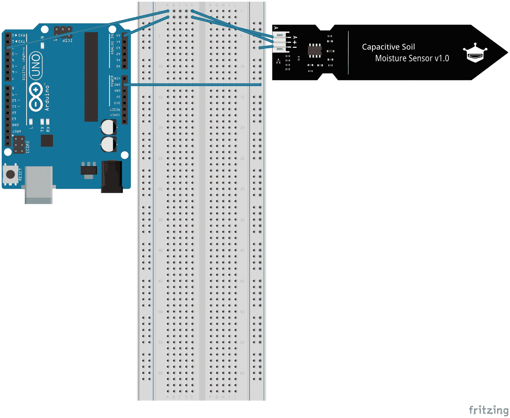

图 4.1 – 土壤传感器电路 – 图片来自 Fritzing

图 4.1 – 土壤传感器电路图片来自 Fritzing

太好了！我们已经成功组装了电路。我们将使用这个电路来创建一个小型示例项目，以读取传感器的值。

## 寻找阈值

我们接下来的任务是找出表示以下状态的值：

+   干燥

+   在水中

为了检查干燥度，我们需要为这个项目创建一个新的文件夹。

首先，创建一个名为 `Chapter04` 的新文件夹。在该文件夹内，创建一个名为 `soil-moisture-sensor-thresholds` 的新文件夹，并在该文件夹内创建一个 `main.go` 文件，并插入一个空的 `main()` 函数。文件夹结构现在应该如下所示：


图 4.2 – 土壤湿度传感器阈值文件夹结构

现在按照以下步骤操作：

1.  按照以下方式导入 `machine` 包：

    ```go
    import "machine"
    ```

1.  初始化用于 ADC 的寄存器：

    ```go
    machine.InitADC()
    ```

1.  创建一个名为 `soilSensor` 的新变量，类型为 `machine.ADC`，使用 `Pin machine.ADC5`：

    ```go
    soilSensor := machine.ADC{Pin: machine.ADC5}
    ```

1.  配置引脚以便能够读取模拟值：

    ```go
    soilSensor.Configure()
    ```

1.  将机器 D2 引脚配置为输出并将其设置为 `high`。我们不会将其存储在新变量中，因为我们永远不会再次更改引脚的状态。我们只使用它来提供电流：

    ```go
    machine.D2.Configure(machine.PinConfig{Mode: machine.PinOutput})
    machine.D2.High()
    ```

1.  以每秒两次的速度读取传感器值，并在无限循环中将其打印到串行端口：

    ```go
    for {
        value := soilSensor.Get()
        println(value)
        time.Sleep(500 * time.Millisecond)
    }
    ```

太好了，我们已经成功编写了第一个从模拟引脚读取传感器数据的程序。现在我们需要确定阈值值。为此，首先使用以下命令将程序闪存到你的 Arduino 上：

```go
tinygo flash –target=arduino Chapter04/soil-moisture-sensor-thresholds/main.go
```

现在打开 PuTTY 并选择微控制器配置文件以查看传感器读取值。这应该看起来像以下截图：

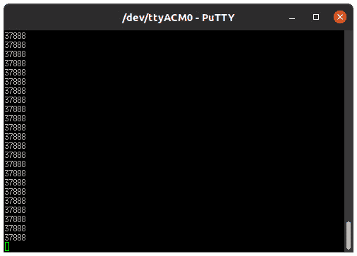

图 4.3 – PuTTY 中的土壤湿度传感器输出

该值相当稳定，为**37888**。你可能会注意到在两次读取之间值会有一些小的变化。在这种情况下，只需取你看到的最高值即可。

我们现在将 **37888** 声明为干燥值的阈值。因此，所有等于或高于此值的值都可以被认为是完全干燥的。从你的传感器接收到的值可能略有不同，所以你可以做同样的事情；查看这些值，并取最低的一个作为你的阈值。

注意

请确保你的传感器完全干燥且清洁。否则，你可能会因为干燥值而遇到麻烦。

太棒了！我们刚刚找到了完全干燥土壤的值。现在我们需要找到一个完全湿润（在水中）的值。

现在拿一杯水，把传感器放进去，同时观察 PuTTY 中的传感器读数。**一定要非常小心，只把传感器放入水中，直到它触及传感器上的白色线！**不要让水接触到上面的电子元件！查看以下图示：

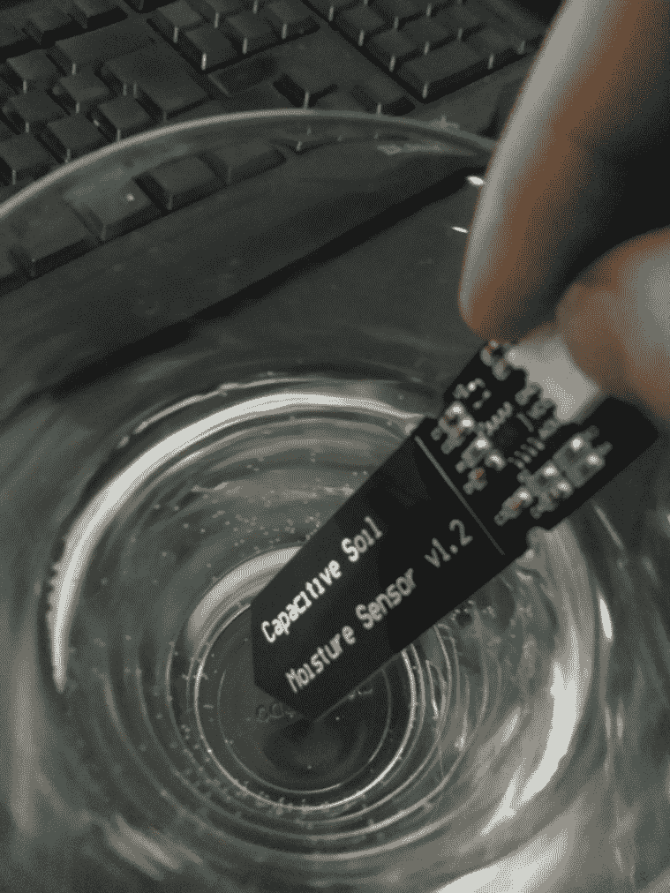

图 4.4 – 水杯中的电容式土壤湿度传感器

让我们看看 PuTTY 中的传感器读数 – 你可以在以下图中找到它们：

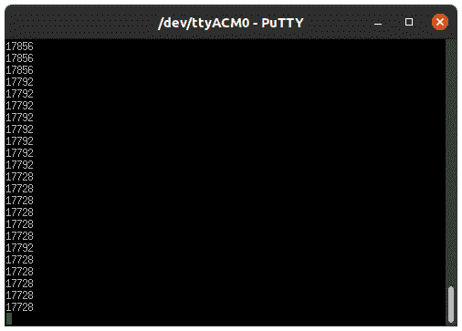

图 4.5 – PuTTY 中水杯内部土壤传感器的读数

这次我们以 PuTTY 中能找到的最高值作为阈值，在我的情况下是 **17856**。我们已经在所有前面的章节中使用了 GPIO 引脚，但我们还没有使用 **模拟数字转换器**，所以在我们继续编写传感器库之前，让我们先了解 Arduino 上的 **模拟数字转换器**（**ADC**）是如何工作的。

## 理解 TinyGo 中的 ADC

Arduino UNO 的 ADC 有 10 位精度。`Get()` 函数返回的值是 `uint16` 类型。因此，在内部，`Get()` 函数告诉 ADC 将 10 位值扩展到 16 位。

通常，我们可以使用以下方程式来获取 ADC 结果：

```go
Resolution of the ADC / System Voltage = ADC Value / Analog Voltage measured
```

由于我们知道 Arduino UNO 有 10 位精度，电压约为 `5V`，我们可以将这个值代入方程式中，得到以下结果：

```go
1023 / 5V = ADC Value / Analog Voltage Measured
```

假设测量的模拟电压是 `3.33V`。这将导致以下结果：

```go
1023 / 5V = ADC Value / 3.33V
```

现在我们进行一些数学方程式的魔法，得到以下结果：

```go
1023 / 5V * 3.33V = ADC Value 
That resolves to: ADC Value = 681
```

这个结果现在将扩展到 16 位，相当于向左移动 6 位。

从 TinyGo 获得的结果将如下所示：

```go
ADC Value = 43584
```

既然我们已经发现了 ADC 的工作原理，我们现在可以继续编写一个小型库，这将帮助我们稍后使用传感器。

## 编写传感器的库

由于拥有可重用的代码是一件好事，我们现在将继续编写一个小型库，以便在本书的最后一部分，*浇灌你的植物*中重用它。

为了做到这一点，我们需要在 `Chapter04` 文件夹内创建一个名为 `soil-moisture-sensor` 的新文件夹。在我们的新文件夹中，我们创建一个新的空 `driver.go` 文件，并将包命名为 `soil`。现在的结构应该如下所示：

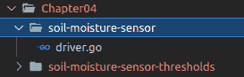

图 4.6 – 土壤湿度传感器库的文件夹结构

我们希望有一个接口，它提供了一个获取当前 `MoistureLevel` 的函数，实例将是一个类似于枚举的类型。此外，我们希望提供功能来打开和关闭传感器，这样它就不会一直消耗电流。

为了实现这一点，执行以下步骤：

1.  定义一个新的名为 `SoilSensor` 的接口，具有 `Get()`、`Configure()`、`On()` 和 `Off()` 函数：

    ```go
    type SoilSensor interface {
        Get() MoistureLevel
        Configure()
        On()
        Off()
    }
    ```

1.  定义一个新的名为 `soilSensor` 的结构体。这个结构体将包含用于打开和关闭传感器的引脚以及用于读取传感器值的引脚。此外，我们希望能够配置用于识别传感器是否完全干燥或处于水中的阈值：

    ```go
    type soilSensor struct {
    ```

1.  添加保存 `completelyDry` 和 `water` 阈值的成员：

    ```go
     waterThreshold         uint16
     completelyDryThreshold uint16
     category               uint16
     pin                    machine.Pin
     adc                    machine.ADC
     voltage                machine.Pin
    }
    ```

1.  定义一个类似于枚举的类型，以便我们可以在使用库时轻松检查这些值。我们在这里选择了六个 `MoistureLevel` 类别，以便在土壤的不同状态之间有清晰的区分：

    ```go
    type MoistureLevel uint8
    const (
        CompletelyDry MoistureLevel = iota
        VeryDry
        Dry
        Wet
        VeryWet
        Water
    )
    ```

1.  定义一个构造函数，它接受 `waterThreshold`、`dryThreshold`、`dataPin` 和 `voltagePin` 并返回 `SoilSensor`：

    ```go
    func NewSoilSensor(waterThreshold, dryThreshold, dataPin, voltagePin machine.Pin) SoilSensor {
    ```

1.  使用阈值创建 `category`，稍后用于计算 `category` 值。因为我们希望有六个类别，所以我们把从传感器所在位置读取的值除以六：

    ```go
    category := (dryThreshold - waterThreshold) / 6
    ```

1.  设置所有值并返回一个指向新 `soilSensor` 实例的指针：

    ```go
    return &soilSensor{
        waterThreshold: waterThreshold,
        completelyDryThreshold: dryThreshold,
        category: category,
        pin: dataPin,
        voltage: voltagePin,
    }
    }
    ```

1.  定义一个新的名为 `Get` 的 `func`，它是一个指向 `soilSensor` 的指针接收器，并返回 `MoistureLevel`：

    ```go
    func (sensor *soilSensor) Get() MoistureLevel {
    ```

1.  从 `sensor` 读取值并将其保存到新的 `float32` 类型的变量 `value` 中：

    ```go
    value := sensor.adc.Get()
    ```

1.  检查值是否大于或等于 `completelyDryThreshold`：

    ```go
    switch {
    case value >= sensor.completelyDryThreshold:
        return CompletelyDry
    ```

1.  检查 `value` 是否属于第二类别：

    ```go
    case value >= sensor.completelyDryThreshold-sensor.category:
       return VeryDry
    ```

1.  检查 `value` 是否属于第三类别：

    ```go
    case value >= sensor.completelyDryThreshold-sensor.category*2:
       return Dry
    ```

1.  检查 `value` 是否属于第四类别：

    ```go
    case value <= sensor.completelyDryThreshold-sensor.category*3:
      return Wet
    ```

1.  检查 `value` 是否属于第五类别：

    ```go
    case value >= sensor.completelyDryThreshold-sensor.category*Ł4:
      return VeryWet
    ```

1.  剩下的唯一可能状态是 `Water`，所以我们在这里使用默认情况：

    ```go
    default:
        return Water
      }
    }
    ```

1.  定义一个名为 `Configure` 的函数，它有一个指向 `soilSensor` 的指针接收器。我们使用指针接收器，因为我们会在 `soilSensor` 实例上设置值，否则我们将在函数作用域之外丢失这些值：

    ```go
    func (sensor *soilSensor) Configure() {
    ```

1.  为 ADC 使用配置 `dataPin`：

    ```go
        sensor.adc = machine.ADC{Pin: sensor.pin}
        sensor.adc.Configure(machine.ADCConfig{}
    ```

1.  将 `voltage` 引脚配置为输出并将其设置为 `Low`：

    ```go
        sensor.voltage.Configure(machine.PinConfig{Mode: 
        machine.PinOutput})
        sensor.voltage.Low()
    }
    ```

1.  添加一个函数来打开电压：

    ```go
    func (sensor *soilSensor) On() {
        sensor.voltage.High()
    }
    ```

1.  添加一个函数来关闭电压：

    ```go
    func (sensor *soilSensor) Off() {
        sensor.voltage.Low()
    }
    ```

这是我们需要为我们的库提供的完整逻辑。让我们在下一节测试我们的代码。

## 测试库

接下来，我们将编写一个示例来测试新的库。为此，我们需要在 `Chapter04` 文件夹内创建一个名为 `soil-moisture-sensor-example` 的新文件夹，并在其中创建一个包含空 `main()` 函数的 `main.go` 文件。现在，您的项目结构应该如下所示：

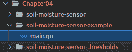

图 4.7 – 测试土壤湿度传感器库

要测试我们的新库，请按照以下步骤操作：

1.  按照以下代码导入 `machine`、`time` 和 `soil-moisture-sensor` 包。请注意，你的库路径将根据它在文件系统中的位置而略有不同：

    ```go
    import (
        "machine"
        "time"
        "github.com/PacktPublishing/Creative-DIY-Microcontroller-Projects-with-TinyGo-and-WebAssembly/
        Chapter04/soil-moisture-sensor"
    )
    ```

1.  在 `main` 函数内部，初始化 ADC 接口：

    ```go
    machine.InitADC()
    ```

1.  创建一个 `SoilSensor` 的新实例。在这个例子中，这些值与上一个例子中测量的值略有不同。这些值倾向于更早地触发 `Water` 和 `CompletelyDry` 状态：

    ```go
    soilSensor := soil.NewSoilSensor(18000, 34800, machine.
                  ADC5, machine.D2)
    ```

1.  现在我们调用 `Configure` 函数，该函数初始化我们的引脚：

    ```go
    soilSensor.Configure()
    ```

1.  开始一个无限循环，打开传感器，并稍等片刻，让读数稳定一下：

    ```go
    for {
        soilSensor.On()
        time.Sleep(75 * time.Millisecond)
    ```

1.  然后将 `Get()` 函数的结果切换过来，并根据情况打印一个字符串：

    ```go
        switch soilSensor.Get() {
        case soil.CompletelyDry:
            println("completely dry")
        case soil.VeryDry:
            println("very dry")
        case soil.Dry:
            println("dry")
        case soil.Wet:
            println("wet")
        case soil.VeryWet:
            println("very wet")
        case soil.Water:
            println("pure water")
    }
    ```

1.  再次关闭传感器，等待一秒钟，直到下一次读取开始：

    ```go
        soilSensor.Off()
        time.Sleep(time.Second)
      }
    }
    ```

现在我们已经有了测试库的完整代码，让我们将其烧录到我们的 Arduino 上，并在 PuTTY 中检查输出。使用以下命令进行烧录：

```go
tinygo flash –target=arduino Chapter04/soil-moisture-sensor-example/main.go
```

现在最好的做法是将传感器放入非常干燥的土壤中，同时关注读数。然后加一些水，检查你是否会看到 `Wet`、`Very Wet` 和可能还有 `Water` 状态。在我们继续下一节之前，我们绝对应该检查它。如果读数看起来很奇怪，尝试调整阈值，这些阈值在库中的 `NewSoilSensor` 函数中处理。

注意

请记住，如果你往土壤中倒太多水，可能会伤害植物。此外，没有必要将传感器完全插入土壤直到达到白色线。我建议在白色线和土壤之间留一些空气，这样你就有一些缓冲区在电子元件和土壤之间。在我进行测试时，当有大约 1 厘米的空气作为缓冲时，我得到了良好的结果。

我们现在已经学会了如何校准电容式土壤湿度传感器，第一次使用 ADC 接口，并编写了一个新的库。使用这个库，我们能够判断土壤的湿度状态。在下一节中，我们将学习如何使用水位传感器。

# 读取水位传感器数据

由于我们在本章后面计划有一个水罐，所以有一个水位传感器将很有用，这样我们就可以知道水罐是否已空。我们将首先将传感器添加到现有的电路中。按照以下步骤进行操作：

1.  使用跳线电缆将 Arduino 的 *A4* 引脚与面包板上的 *F22* 连接。

1.  使用跳线电缆将 Arduino 的 *D3* 引脚与面包板上的 *F21* 连接。

1.  将面包板上的 *J22* 连接到传感器的 *S*（信号）端口，使用跳线电缆。

1.  将面包板上的 *J21* 连接到传感器的 *+*（*VCC*）端口，使用跳线电缆。

1.  将传感器的 *- GND* 连接到电源总线上的 *GND*。

结果现在应该看起来像以下图所示：

![Figure 4.8 – 水位传感器 – 图片来自 Fritzing

![img/Figure_4.8_B16555.jpg]

Figure 4.8 – 水位传感器 – 图片来自 Fritzing

组装好这个之后，我们还可以继续为这个传感器创建一个小型库。

## 编写水位传感器库

水位传感器有很多不同的类型。那些经常作为 Arduino 入门套件一部分的廉价传感器往往容易生锈。为了防止这种情况，我们将添加开启和关闭的可能性。但在那之前，我们将先看看技术数据：

+   **工作电压**：5 V

+   **工作电流**：小于 20 mA

+   **工作温度**：10°至 30°

因此，拥有这个传感器时，电流消耗小于 20 mA。我们可以再次使用一个 *GPIO* 引脚来供电。

我们首先在 `Chapter04` 文件夹内创建一个名为 `water-level-sensor` 的新文件夹。在新文件夹内，创建一个名为 `driver.go` 的新文件，并将包命名为 `waterlevel`。文件夹结构现在应该如下所示：

![Figure 4.9 – 水位传感器库的文件夹结构

![img/Figure_4.9_B16555.jpg]

Figure 4.9 – 水位传感器库的文件夹结构

由于项目结构现在已经设置好，我们可以继续实现实际的库。只需按照以下步骤操作：

1.  导入 `machine` 包：

    ```go
    import "machine"
    ```

1.  定义一个名为 `WaterLevel` 的新接口，包含以下函数。函数将在我们实现它们时进行解释：

    ```go
    type WaterLevel interface {
        IsEmpty() bool
        Configure()
        On()
        Off()
    }
    ```

1.  定义一个名为 `waterLevel` 的结构体，包含以下成员：

    ```go
    type waterLevel struct {
        dryThreshold uint16
        pin machine.Pin
        adc machine.ADC
        voltage machine.Pin
    }
    ```

1.  定义一个新的类似于构造函数的函数，它接受 `dryThreshold`、`dataPin` 和 `voltagePin`：

    ```go
    func NewWaterLevel(dryThreshold uint16, dataPin, voltagePin machine.Pin) WaterLevel {
        return &waterLevel{
            dryThreshold: dryThreshold,
            pin: dataPin,
            voltage: voltagePin,
    }
    }
    ```

1.  添加 `IsEmpty` 检查。我们将检查传感器读数是否低于我们的阈值：

    ```go
    func (sensor *waterLevel) IsEmpty() bool {
        return sensor.adc.Get() <= sensor.dryThreshold
    }
    ```

1.  配置传感器引脚用于 ADC 使用，并将电压引脚配置为输出：

    ```go
    func (sensor *waterLevel) Configure() {
        sensor.adc = machine.ADC{Pin: sensor.pin}
        sensor.adc.Configure(machine.ADCConfig{})
        sensor.voltage.Configure(machine.PinConfig{
            Mode: machine.PinOutput,
    })
        sensor.voltage.Low()
    }
    ```

1.  打开电源：

    ```go
    func (sensor *waterLevel) On() {
        sensor.voltage.High()
    }
    ```

1.  关闭电源：

    ```go
    func (sensor *waterLevel) Off() {
        sensor.voltage.Low()
    }
    ```

我们现在已经编写了水位传感器的库。

### 测试库

现在让我们编写一个小型示例程序来测试我们的库。为此，我们首先在 `Chapter04` 文件夹内创建一个名为 `water-level-sensor-example` 的新文件夹。在新文件夹内，创建一个名为 `main.go` 的新文件，并在其中创建一个空的 `main` 函数。文件夹结构现在应该如下所示：

![Figure 4.10 – 测试库的文件夹结构

![img/Figure_4.10_B16555.jpg]

Figure 4.10 – 测试库的文件夹结构

由于项目结构现在已经设置好，我们可以继续编写测试代码。为此，请按照以下步骤操作：

1.  初始化 ADC 接口：

    ```go
    machine.InitADC()
    ```

1.  创建一个 `WaterLevelSensor` 的新实例：

    ```go
    waterLevelSensor := waterlevel.NewWaterLevel(7000, 
                        machine.ADC4, machine.D3)
    ```

1.  配置引脚：

    ```go
    waterLevelSensor.Configure()
    ```

1.  我们打开传感器，然后等待一小段时间，让传感器的读数稳定下来，然后再访问它。然后，每秒打印 `IsEmpty()` 的结果：

    ```go
    for {
        waterLevelSensor.On()
        time.Sleep(100 * time.Millisecond)
        println("tank is empty", waterLevelSensor.IsEmpty())
        waterLevelSensor.Off()
        time.Sleep(time.Second)
    }
    ```

当水位传感器未接触任何水时，返回值应为 `0`。在这种情况下，我们选择了 `7000` 作为 `dryThreshold`，这样传感器的尖端可以在水中，同时仍然能够告诉我们它是空的。这将在我们还需要抽水的情况下很有用。这是当水泵没有足够的水可抽时不应运行的情况。我们应该对这个阈值值进行一些调整。通过将程序烧录到 Arduino 上，使用传感器检查水的存在，当它意识到有水时，更改阈值值并再次烧录。

使用以下命令烧录程序：

```go
tinygo flash –target=arduino Chapter04/water-level-sensor-example/main.go 
```

因此，我们现在已经编写了一个库，该库可以检查任何类型的水箱是否为空。在下一节中，我们将使用蜂鸣器在水箱为空时发出音频信号。

# 控制蜂鸣器

我们将要编写一个非常简单的蜂鸣器库。我们只想让蜂鸣器发出声音，而不考虑音调。我们首先将蜂鸣器添加到电路中。为此，请按照以下步骤操作：

1.  使用跳线将 Arduino 的 *D4* 引脚连接到面包板上的 *A31*。

1.  使用一个 *100* 欧姆电阻将 *E31* 连接到面包板上的 *G31*。

1.  将蜂鸣器的 *VCC* 引脚连接到 *J31*。

1.  将 *GND* 引脚连接到电源总线上的 *GND*。

电路现在应如下所示：

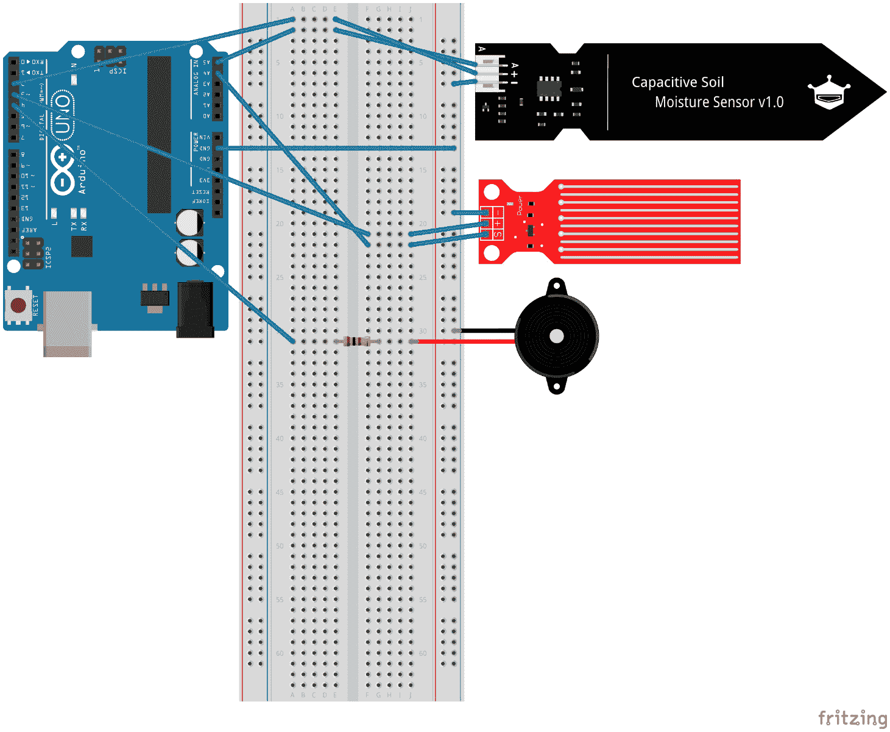

图 4.11 – 蜂鸣器 – 图片来自 Fritzing

由于我们已经将蜂鸣器添加到电路中，我们现在可以开始编写我们的库。

## 编写蜂鸣器库

蜂鸣器库将有两个函数：`Configure()`，用于设置引脚，以及 `Beep()` 函数，用于发出声音。

我们首先在 `Chapter04` 文件夹内创建一个名为 `buzzer` 的新文件夹。在新文件夹内，创建一个名为 `driver.go` 的文件，并将包命名为 `buzzer`。项目结构现在应如下所示：

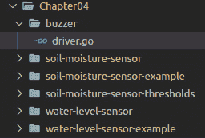

图 4.12 – 蜂鸣器库的项目结构

现在按照以下步骤实现驱动程序：

1.  定义一个名为 `Buzzer` 的接口，它具有 `Configure` 函数和 `Beep` 函数：

    ```go
    type Buzzer interface {
        Configure()
        Beep(highDuration time.Duration, amount uint8)
    }
    ```

1.  创建一个名为 `buzzer` 的 `struct`，它包含 `machine.Pin`：

    ```go
    type buzzer struct {
        pin machine.Pin
    }
    ```

1.  添加一个名为 `NewBuzzer` 的函数，它返回 `Buzzer`：

    ```go
    func NewBuzzer(pin machine.Pin) Buzzer {
        return buzzer{pin: pin}
    }
    ```

1.  添加一个名为 `Configure` 的函数，用于将 `pin` 配置为输出：

    ```go
    func (buzzer buzzer) Configure() {
        buzzer.pin.Configure(machine.PinConfig{
            Mode: machine.PinOutput,
        })
    }
    ```

1.  定义一个名为 `Beep` 的函数，它接受 `time.Duration` 和 `amount` 的 `uint8` 类型的参数：

    ```go
    func (buzzer buzzer) Beep(highDuration time.Duration, amount uint8) {
    ```

1.  循环指定次数，让蜂鸣器发出蜂鸣声并在其间休眠：

    ```go
    for i := amount; i > 0; i-- {
        buzzer.pin.High()
        time.Sleep(highDuration)
        buzzer.pin.Low()
        time.Sleep(highDuration)
      }
    }
    ```

蜂鸣器库的所有内容到此为止。

现在我们将使用一个小型示例项目来测试这个库。

要做到这一点，我们首先在 `Chapter04` 文件夹内创建一个名为 `buzzer-example` 的新文件夹。在新文件夹内，创建一个新的 `main.go` 文件，并在其中包含一个空的 `main()` 函数。项目结构现在应如下所示：

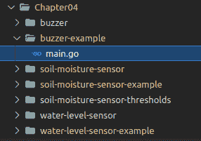

图 4.13 – 测试蜂鸣器

现在将以下内容放入 `main` 函数中：

1.  获取一个新的 `buzzer` 实例并配置它：

    ```go
    buzzer := buzzer.NewBuzzer(machine.D4)
    buzzer.Configure()
    ```

1.  无限循环，蜂鸣器响三次，每次 100 毫秒，然后休眠 3 秒：

    ```go
    for {
        buzzer.Beep(time.Millisecond*100, 3)
        time.Sleep(3 * time.Second)
    }
    ```

这就是我们测试蜂鸣器所需的全部代码。要尝试此示例，请使用以下命令进行烧录：

```go
tinygo flash –target=arduino Chapter4/buzzer-example/main.go
```

当程序运行时，你应该能够听到蜂鸣器响。如果在一段时间后它没有开始发声，请再次检查所有电缆和引脚。

我们现在已经成功编写了一个非常简单的蜂鸣器库，并使用一个示例项目进行了测试。在下一节中，我们将控制一个泵。

# 控制一个泵

由于泵比简单的传感器消耗的电流更多，我们不会直接通过 *GPIO* 端口为泵供电。过大的电流可能会永久损坏 Arduino。因此，我们将使用外部电源和一个继电器来为泵供电。在我们开始组装电路之前，让我们简要了解一下继电器的工作原理。

## 使用继电器进行工作

用于微控制器项目的继电器通常安装在板上，板上通常有六个端口。它有三个输入端口：*VCC*、*GND* 和 *信号*。它也有三个输出端口：*常开*、*公共* 和 *常闭*。

当提供一个 *高信号* 时，电流在 *常开* 和 *公共* 之间流动。

当提供一个 *低信号* 时，电流在 *常闭* 和 *公共* 之间流动。

既然我们已经知道如何使用继电器，我们可以继续将新组件添加到电路中。为此，请按照以下步骤操作：

1.  使用跳线将继电器的 *GND* 引脚连接到电源总线上的 *GND*。

1.  使用跳线将继电器的 *VCC* 引脚连接到电源总线上的 *VCC*。

1.  使用跳线将继电器的 *信号*（输入）引脚连接到 Arduino 的 *D5*。

1.  将泵的 *VCC* 引脚连接到继电器的 *常开* 端口。

1.  将泵的 *GND* 引脚连接到电源总线上的 *GND*。

1.  将继电器的 *公共* 引脚与电源总线的 *VCC* 通道连接。

1.  使用跳线将 Arduino 的 *VIN* 连接到电源总线上的 *VCC*。

您的电路现在应该看起来与以下图中的类似：

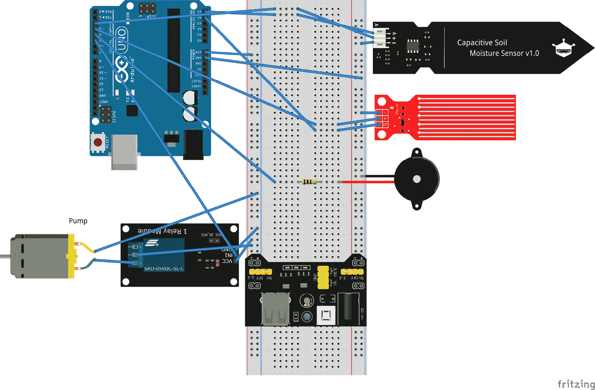


图 4.14 – 包含泵的完整电路 – 图来自 Fritzing

使用这个电路，我们将能够使用外部电源为 Arduino 供电。由于我们可能需要给远离 USB 端口的地方的植物浇水，我们已经将 Arduino 的 *VIN* 引脚与电源总线的 *VCC* 通道连接，该通道由我们的外部电源供电。现在我们将继续编写一个能够控制泵的库。

## 编写一个泵库

泵库基本上将有两个功能：`Configure`，用于设置引脚，以及 `Pump` 功能，用于在给定的时间和迭代次数内泵水。

我们首先在 `Chapter04` 文件夹内创建一个名为 `pump` 的新文件夹。在新文件夹内，创建一个 `driver.go` 文件，并将包命名为 `pump`。项目结构现在应如下所示：

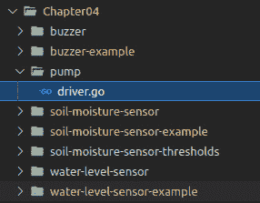

图 4.15 – 水泵库的项目结构

现在，我们已经设置了项目结构，我们可以继续编写控制水泵的代码。为此，请按照以下步骤操作：

1.  定义名为 `Pump` 的接口，它具有 `Configure` 或 `Pump` 函数：

    ```go
    type Pump interface {
        Configure()
        Pump(duration time.Duration, iterations uint8)
    }
    ```

1.  定义一个名为 `pump` 的新 `struct`，它包含 `machine.Pin`：

    ```go
    type pump struct {
        pin machine.Pin
    }
    ```

1.  定义一个名为 `NewPump` 的函数，它接受 `machine.Pin` 并返回一个新的指向 `pump` 的指针：

    ```go
    func NewPump(pin machine.Pin) Pump {
        return &pump{
            pin: pin,
        }
    }
    ```

1.  然后定义一个名为 `Configure` 的函数，并将 `pin` 设置为输出引脚：

    ```go
    func (pump *pump) Configure() {
        pump.pin.Configure(machine.PinConfig{
        Mode: machine.PinOutput,
        })
    }
    ```

1.  接下来，定义一个名为 `Pump` 的函数，并循环 `iterations` 次数，将 `pin` 设置为 `high`，休眠 `duration`，然后将其再次设置为 `low`：

    ```go
    func (pump *pump) Pump(duration time.Duration, iterations uint8) {
        for i := iterations; i > 0; i-- {
            pump.pin.High()
            time.Sleep(duration)
            pump.pin.Low()
            time.Sleep(duration)
        }
    }
    ```

这是我们 `pump` 库所需的所有内容。现在，我们可以继续创建一个小型示例项目来测试库。为此，我们将在 `Chapter04` 文件夹内创建一个名为 `pump-example` 的新文件夹，并在其中创建一个包含空 `main` 函数的 `main.go` 文件。项目结构现在应如下所示：

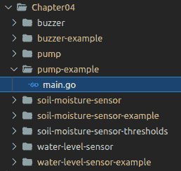

图 4.16 – 测试水泵

在 `main` 函数内部，我们添加以下内容：

1.  通过调用 `NewPump` 函数创建一个 `pump` 的新实例，并将 `machine.D5` 作为 `pin` 传入：

    ```go
    pump := pump.NewPump(machine.D5)
    pump.Configure()
    ```

1.  无限循环，并 `pump 3` 次每次 `350` 毫秒，之后 `sleep` `30` 秒，如下所示：

    ```go
    for {
        pump.Pump(350*time.Millisecond, 3)
        time.Sleep(30 * time.Second)
    }
    ```

这是尝试我们水泵的完整示例代码。

注意

由于物理定律是这样的，我建议接收容器应始终放置在源容器的水位之上，即使水泵停止抽水，水也会继续流动。

现在，将你的水泵放入一杯水或其他水罐中，并通过以下命令闪烁程序来测试它：

```go
tinygo flash –target=arduino Chapter04/pump-example/main.go
```

使用此示例找出良好的水泵持续时间迭代时间，不要泵入过多的水。记住，我们想要灌溉植物，这将帮助我们找到良好的值。

这是我们需要的最后一个组件。我们已经学会了如何使用继电器来供电和控制水泵，并且我们编写了一个新的库。现在，我们将把所有内容在下一节中组合在一起。

# 灌溉你的植物

现在，我们将利用之前章节中创建的每一个组件。将所有组件组合起来，我们将构建一个完全自动化的植物灌溉系统。

首先，我们需要在 `Chapter04` 文件夹内创建一个名为 `plant-watering-system` 的新文件夹。在新文件夹内，创建一个包含空 `main()` 函数的新 `main.go` 文件。最终项目结构现在应如下所示：

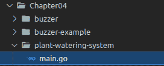

图 4.17 – 植物灌溉系统项目结构

现在，在`main`函数中，按照以下步骤操作：

1.  初始化`ADC`接口：

    ```go
    machine.InitADC()
    ```

1.  初始化一个新的`soilSensor`：

    ```go
    soilSensor := soil.NewSoilSensor(18000, 34800, machine.
                  ADC5, machine.D2)
    soilSensor.Configure()
    ```

1.  初始化一个新的`waterLevelSensor`：

    ```go
    waterLevelSensor := waterlevel.NewWaterLevel(7000,
                        machine.ADC4, machine.D3)
    waterLevelSensor.Configure()
    ```

1.  初始化一个新的`pump`：

    ```go
    pump := pump.NewPump(machine.D5)
    pump.Configure()
    ```

1.  初始化一个新的`buzzer`：

    ```go
    buzzer := buzzer.NewBuzzer(machine.D4)
    buzzer.Configure()
    ```

1.  打开`waterLevelSensor`并短暂睡眠，以便读数稳定：

    ```go
    for {
        waterLevelSensor.On()
        time.Sleep(100 * time.Millisecond)
    ```

1.  在继续`for`循环之前，检查水容器是否为空，关闭传感器，蜂鸣三次，然后睡眠一小时：

    ```go
        if waterLevelSensor.IsEmpty() {
            waterLevelSensor.Off()
            buzzer.Beep(150*time.Millisecond, 3)
            time.Sleep(time.Hour)
            continue
    }
    ```

1.  如果水容器不为空，关闭`waterLevelSensor`：

    ```go
    waterLevelSensor.Off()
    ```

1.  打开`soilSensor`并短暂睡眠，以便让读数稳定：

    ```go
    soilSensor.On()
    time.Sleep(100 * time.Millisecond)
    ```

1.  然后切换`soilSensor.Get()`的结果：

    ```go
    switch soilSensor.Get() {
    ```

1.  如果土壤是`非常干燥`或`完全干燥`，关闭土壤传感器并浇水：

    ```go
    case soil.VeryDry, soil.CompletelyDry:
        pump.Pump(350*time.Millisecond, 3)
    ```

1.  在所有其他情况下，关闭`soilSensor`并睡眠一小时：

    ```go
    default:
        soilSensor.Off()
        time.Sleep(time.Hour)
    }
    }
    ```

这是我们这个最终项目所需的一切。您可以通过以下命令将程序烧录到您的 Arduino 上以尝试程序：

```go
tinygo flash –target=arduino Chapter04/plant-watering-system/main.go
```

重要注意事项

请记住，每种植物对水的需求都不同。因此，我们需要调整泵水量以适应被灌溉的植物的需求。

我们现在已经成功构建了一个完整的自动植物灌溉系统，并将其烧录到 Arduino 上。

# 摘要

在本章中，我们学习了如何使用 ADC 接口读取传感器值。我们还学习了 ADC 接口如何将电压转换为数字值，然后我们利用这些知识编写了`土壤湿度传感器`库。

我们随后利用在第一章的第一个项目中收集到的知识编写了`水位传感器`库。然后我们学习了如何使用**蜂鸣器**，并编写了一个非常简单的库，使我们能够让蜂鸣器发出警告声音。之后，我们学习了继电器的工作原理，并利用这些知识通过我们编写的库来控制**水泵**。在本章的最后，我们将所有库合并到一个项目中，并且只需要添加少量控制逻辑来构建自动植物灌溉系统。

在下一章中，我们将学习如何使用超声波传感器以及如何控制七段显示器。

# 问题

1.  为什么水位传感器和土壤湿度传感器不永久供电？

1.  在继电器中，电路在*常开*和*GND*之间何时闭合？

# 参考文献

电容式土壤湿度传感器的 fritzing 部分来自以下存储库的集合：[`github.com/OgreTransporter/fritzing-parts-extra`](https://github.com/OgreTransporter/fritzing-parts-extra)
