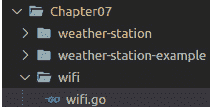

# *第七章*：在 TinyGo Wasm 仪表板上显示天气警报

我们已经学习了如何使用不同类型的显示器来显示数据，这些显示器通过**互集成电路**（**I2C**）协议或**串行外设接口**（**SPI**）连接。在这个过程中，我们深入了解了 SPI 的工作原理，通过学习得知多个设备可以监听 SPI 总线，并且我们可以在总线上级联设备。此外，我们还构建了一个**命令行界面**（**CLI**），它可以解释通过串行发送的命令，并根据输入执行相应的功能。

在完成本章内容后，你将熟悉使用**消息队列遥测传输**（**MQTT**），通过 Web 服务器提供**WebAssembly**（**Wasm**）页面，如何设置本地 MQTT 代理，以及如何使用 Arduino Nano 33 IoT 板的 Wi-Fi 功能。

在本章中，我们将涵盖以下主要主题：

+   构建一个气象站

+   向代理发送 MQTT 消息

+   介绍 Wasm

+   在 Wasm 页面上显示传感器数据和天气警报

在本章结束时，你将了解如何利用 MQTT 代理从你的微控制器通过 Wi-Fi 发送消息。你还将了解如何在 Wasm 应用程序内部订阅 MQTT 消息，以及如何显示作为 MQTT 消息有效载荷发送的数据。

# 技术要求

以下软件需要安装：

+   Docker——你可以通过以下链接找到安装指南：[`docs.docker.com/engine/install/`](https://docs.docker.com/engine/install/)

我们将需要以下组件来完成这个项目：

+   一个 Arduino Nano 33 IoT 板

+   一个外部电源（**5 伏**（**5V**））

+   一个 BME280 传感器（I2C）

+   一个 ST7735 显示器

+   一个面包板

+   跳线

你可以在以下链接找到本章的代码：[`github.com/PacktPublishing/Creative-DIY-Microcontroller-Projects-with-TinyGo-and-WebAssembly/tree/master/Chapter07`](https://github.com/PacktPublishing/Creative-DIY-Microcontroller-Projects-with-TinyGo-and-WebAssembly/tree/master/Chapter07)

本章的“代码在行动”视频可以在以下链接找到：[`bit.ly/3dXGe4o`](https://bit.ly/3dXGe4o)

# 构建一个气象站

我们将通过构建一个**气象站**来开始我们的物联网（**IoT**）和 Wasm 世界的旅程。在本章的第一个项目中，我们将构建一个程序，在**ST7735**显示器上显示天气数据。我们将构建一些可重用的组件，这些组件将在本章的最终项目中使用。我们将学习如何使用能够感知空气压力、温度和湿度的**BME280**传感器——这些是记录天气变化所需的元素。但首先，我们需要组装一个电路——所以，让我们看看它是如何工作的。

## 组装电路

在我们能够读取和显示传感器数据之前，我们需要组装电路。我们将使用 I2C 接口连接 BME/BMP280 传感器，并使用 SPI 接口连接 ST7735 显示屏。为此，请执行以下步骤：

1.  将带有串行数据引脚（**SDA**）的**BME/BMP280**传感器放置在*F21*。

1.  使用跳线将引脚*H21*（SDA）与面包板上的*J56*（SDA）引脚连接。

1.  使用跳线将引脚*I22* **串行时钟**（**SCL**）与面包板上的*I55*（SCL）引脚连接。

1.  将*J23**地**（**GND**）与电源总线上的*GND*通道连接。

1.  将*J24*（VIN）与电源总线上的**电压公共收集器**（**VCC**）通道连接。

1.  将带有**发光二极管**（**LED**）引脚的显示屏放置在面包板上的*A31*引脚。

1.  使用跳线将*E31*（LED）与面包板上的*A53*（D2）引脚连接。

1.  使用跳线将*E32*（SCK）与面包板上的*A54*（D13）引脚连接。

1.  使用跳线将*E33*（SDA）与面包板上的*A62*（D11）引脚连接。

1.  使用跳线将*E34**模拟引脚**（**AO**）与面包板上的*A56*引脚连接。

1.  使用跳线将*E35*（AO）与面包板上的*A57*（D5）引脚连接。

1.  使用跳线将*E36*（复位）与面包板上的*A58*（D6）引脚连接。

1.  使用跳线将*E37**芯片选择**（**CS**）与面包板上的*A59*（D7）引脚连接。

1.  将*E37*（GND）与电源总线上的*GND*通道连接。

1.  将*E38*（VCC）与电源总线上的*VCC*通道连接。

1.  将*J51*（GND）与电源总线上的*GND*通道连接。

电路现在应看起来类似于以下这样：


图 7.1 – 气象站电路（图片来自 Fritzing）

这是我们组装完整章节所需的所有内容。我们可以继续到下一节，编写能够*读取传感器数据并将其显示在 ST7735 上*的代码。

## 编程气象站

我们将把气象站逻辑，包括读取和解释传感器数据，放入一个单独的包中，以便我们可以在仅显示数据的示例中使用它。完成此操作后，我们将重用此包来获取传感器数据并计算警报以发送到**MQTT 代理**。

我们首先在项目文件夹内创建一个名为`Chapter07`的新文件夹，然后在`Chapter07`内创建一个名为`weather-station`的新文件夹。接着创建一个名为`weather.go`的新文件，并将包命名为`weatherstation`。此时，项目结构应如下所示：


图 7.2 – 编程气象站的工程结构

要实现逻辑，请按照以下步骤操作：

1.  定义随后在显示屏上绘制内容时将使用的颜色，如下所示：

    ```go
    var (
        white = color.RGBA{255, 255, 255, 255}
        black = color.RGBA{0, 0, 0, 255}
    )
    ```

1.  接下来，定义一个接口并插入以下函数。我们将在此列表的一些后续步骤中，一旦实现就详细解释每个函数：

    ```go
    type Service interface {
        CheckSensorConnectivity()
        ReadData() (temperature, pressure, humidity int32,
            err error)
        DisplayData(temperature, pressure, humidity int32)
        GetFormattedReadings(temperature, pressure,
            humidity int32) (temp, press, hum string)
        SavePressureReading(pressure float64)
        CheckAlert(alertThreshold float64, timeSpan int8)
            (bool, float64)
    }
    ```

1.  然后我们定义一个`struct`，其中包含传感器和显示，以及一些我们将使用时解释的更多字段。对于 BME280 设备，我们将使用 TinyGo `drivers`存储库中的驱动程序。您可以使用以下路径导入它：[tinygo.org/x/drivers/bme280](http://tinygo.org/x/drivers/bme280)。代码如下所示：

    ```go
    type service struct {
        sensor *bme280.Device
        display *st7735.Device
        readings [6]float64
        readingsIndex int8
        firstReadingSaved bool
    }
    ```

1.  然后我们添加一个新的构造函数，用于设置传感器和显示，并初始化所有值，如下所示：

    ```go
    func New(sensor *bme280.Device, 
        display *st7735.Device) Service {
             return &service{
             sensor: sensor,
             display: display,
             readingsIndex: int8(0),
             readings: [6]float64{},
             firstReadingSaved: false,
            }
        }
    ```

1.  然后，添加`ReadData`函数，这是一个便利函数，它读取所有传感器值并返回它们。代码如下所示：

    ```go
    func (service *service) ReadData() (temp, press, hum
         int32, err error) {temp, err =
             service.sensor.ReadTemperature()
                if err != nil {
                    return
    }
    press, err = service.sensor.ReadPressure()
                if err != nil {
                    return
    }
    hum, err = service.sensor.ReadHumidity()
                if err != nil {
                    return
    }
    return
    }
    ```

1.  然后我们添加一个函数，该函数将阻止程序执行，直到 BME280 传感器的连接得到批准，如下所示：

    ```go
    func (service *service) CheckSensorConnectivity() {
        for {
            connected := service.sensor.Connected()
            if !connected {
                println("could not detect BME280")
                time.Sleep(time.Second)
    }
           println("BME280 detected")
           break
      }
    }
    ```

1.  现在我们添加一个函数，该函数接收传感器读取值并在屏幕上显示，如下所示：

    ```go
    func (service *service) DisplayData(
        temperature, pressure, humidity int32) {
    ```

1.  填充屏幕，以确保没有来自先前调用的残留物。如果我们跳过此步骤，我们可能会在上面绘制之前绘制的图像，这将显得非常混乱。代码如下所示：

    ```go
    service.display.FillScreen(black)
    ```

1.  使用`tinyfont`编写标题，如下所示：

    ```go
    tinyfont.WriteLineRotated(service.display,
        &freemono.Bold9pt7b, 110, 3, "Tiny Weather",
            white, tinyfont.ROTATION_90)
    ```

1.  将读取值转换为字符串，如下所示：

    ```go
    temp, press, hum :=
        service.GetFormattedReadings(temperature,
            pressure, humidity)
    ```

1.  构建并显示温度、压力和湿度字符串，如下所示：

    ```go
    tempString := "Temp:" + temp + "C"
    tinyfont.WriteLineRotated(service.display,
        &freemono.Bold9pt7b, 65, 3, tempString,
        white,tinyfont.ROTATION_90)
    pressString := "P:" + press + "hPa"
    tinyfont.WriteLineRotated(service.display,
        &freemono.Bold9pt7b, 45, 3, pressString, white,
        tinyfont.ROTATION_90)
    humString := "Hum:" + hum + "%"
    tinyfont.WriteLineRotated(service.display,
        &freemono.Bold9pt7b, 25, 3, humString, white,
        tinyfont.ROTATION_90)
    }
    ```

1.  添加一个函数，将传感器读取值转换为°C、**百帕斯卡**（**hPa**）和相对湿度百分比字符串，如下所示：

    ```go
    func (service *service)
        GetFormattedReadings(
        temperature, pressure, humidity int32) (temp,
            press, hum string) {
    temp = strconv.FormatFloat(
        float64(temperature/1000), 'f', 2, 64)
    press = strconv.FormatFloat(
        float64(pressure/100000), 'f', 2, 64)
    hum = strconv.FormatFloat(
        float64(humidity/100), 'f', 2, 64)
    return
    }
    ```

我们现在已经完成了读取和显示传感器数据的逻辑实现。下一步是计算天气警报。

### 计算天气警报

为了计算警报，我们需要保存一些读取值。我们可以通过以下步骤来实现：

1.  对于天气警报的计算，我们只需要压力。这就是为什么我们在`service`结构体中保留一个`float64`数组，如下所示：

    ```go
    func (service *service) SavePressureReading(
        pressure float64) {
    ```

1.  如果我们之前保存过值，我们将用相同的值填充整个数组。这可以防止在计算警报时出现一些边缘情况。代码如下所示：

    ```go
    if !service.firstReadingSaved {
        for i := 0; i < len(service.readings); i++ {
            service.readings[i] = pressure
    }
    ```

1.  由于我们已经插入了第一个读取值，我们可以设置`true`标志并`return`。这确保我们只执行前面的逻辑一次。代码如下所示：

    ```go
    service.firstReadingSaved = true
    service.readingsIndex = 0
    return
    }
    ```

1.  将读取值存储到当前索引。如果当前索引超过存储数据集的最大数量，我们将重置索引；因此，下一次读取将覆盖索引`0`中的读取值。代码如下所示：

    ```go
    service.readingsIndex++
    service.readingsIndex = service.readingsIndex %
        int8(len(service.readings))
    service.readings[service.readingsIndex] = pressure
    }
    ```

1.  添加一个函数，该函数使用保存的读取值，计算两者之间的差异，并在差异超过阈值时发出警报。我们将在本节稍后讨论阈值和时间段，当我们调用此函数时。代码如下所示：

    ```go
    func (service *service) CheckAlert(alertThreshold
        float64, timeSpan int8) (bool, float64) {
            currentReading :=
                   service.readings[service.readingsIndex]
    ```

1.  根据时间跨度值计算`comparisonIndex`值，如下所示：

    ```go
    currentReading := service.readings[currentIndex]
    comparisonIndex := currentIndex - timeSpan
    if comparisonIndex < 0 {
        comparisonIndex = 5 + comparisonIndex
    }
    ```

1.  计算两个值之间的差异，如果差异大于阈值，则返回`diff`以发出警报，如下所示：

    ```go
    comparisonReading := service.readings[comparisonIndex]
    diff := comparisonReading - currentReading
    return diff >= alertThreshold, diff
    }
    ```

好的——我们刚刚实现了一个**应用程序编程接口**（**API**），它允许我们读取、转换和显示传感器数据，并且我们可以保存传感器读数并计算天气警报。

现在，让我们尝试一下代码是否真的能够读取并显示传感器数据。为此，我们首先在`Chapter07`文件夹内创建一个名为`weather-station-example`的新文件夹。然后，我们创建一个包含空`main`函数的新`main.go`文件。现在，项目结构应该看起来像这样：


图 7.3 – 读取代码和显示传感器数据的项目结构

现在，按照以下步骤实现示例：

1.  在`main`函数内部，我们休眠`5`秒，以便有足够的时间打开 PuTTY，这样我们就能监控串行端口上的输出。代码如下所示：

    ```go
    time.Sleep(5 * time.Second)
    ```

1.  初始化并配置显示屏，如下所示：

    ```go
    machine.SPI0.Configure(machine.SPIConfig{
        Frequency: 12000000,
    })
    resetPin := machine.D6
    dcPin := machine.D5
    csPin := machine.D7
    backLightPin := machine.D2
    display := st7735.New(
        machine.SPI0, resetPin, dcPin, csPin,
            backLightPin)
    display.Configure(st7735.Config{
        Rotation: st7735.ROTATION_180,
    })
    ```

1.  初始化并配置传感器。传感器需要校准，这是在`Configure`函数中完成的。代码如下所示：

    ```go
    machine.I2C0.Configure(machine.I2CConfig{})
    sensor := bme280.New(machine.I2C0)
    sensor.Configure()
    ```

1.  创建`weatherstation`的新实例并等待传感器连接。代码如下所示：

    ```go
    weatherStation := weatherstation.New(
        &sensor, &display)
    weatherStation.CheckSensorConnectivity()
    ```

1.  读取并显示数据，如下所示：

    ```go
    for {
    temperature, pressure, humidity, err :=
        weatherStation.ReadData()
    if err != nil {
        println("could not read sensor data:", err)
        time.Sleep(1 * time.Second)
        continue
    }
    weatherStation.DisplayData(
        temperature, pressure, humidity)
    time.Sleep(2 * time.Second)
    }
    ```

这个例子就到这里。现在，使用以下命令烧录程序：

```go
tinygo flash --target=arduino-nano33 ch7/weather-station-example/main.go
```

稍微过一会儿，显示屏现在应该看起来与下面所示类似：


图 7.4 – 显示输出

我们现在已经验证了我们能够读取并显示传感器数据。因为我们已经学会了如何使用 BMP280 传感器，并准备了一个能够计算天气警报的包，我们现在可以继续到下一节，学习如何与 Wi-Fi 芯片通信以及如何发送 MQTT 消息。

# 向代理发送 MQTT 消息

现在，让我们开始深入探索物联网的世界。由于每个连接到互联网——或者至少连接到某些网络的设备——都可以被认为是物联网设备，本节中的项目可以被认为是物联网项目。Arduino Nano 33 IoT 板上有一个`u-blox NINA-W102`芯片，它能够进行 Wi-Fi 通信。我们可以使用 SPI 接口与该芯片通信。由于已经存在 NINA 芯片的驱动程序，我们不需要自己实现。

因此，我们的计划是通过 SPI 将数据发送到 NINA 芯片，然后该芯片通过网络将数据发送到 MQTT 代理。以下图表说明了这个过程：


图 7.5 – 通信图

尽管驱动功能被封装在一个包中，但仍然需要一些样板代码来开始使用 Wi-Fi 芯片。因此，让我们将其封装在一个新的包中。

## 实现 Wi-Fi 包

我们将创建一个 API，它提供初始化 NINA 芯片、检查硬件和设置连接的功能。因此，让我们首先在`Chapter07`文件夹内创建一个名为`wifi`的新文件夹，并在新创建的文件夹内创建一个名为`wifi.go`的新文件，并将包命名为`wifi`。项目结构现在应该如下所示：



图 7.6 – 项目结构

现在，执行以下步骤以实现逻辑：

1.  定义包的接口，如下所示：

    ```go
    type Client interface {
        Configure() error
        CheckHardware()
        ConnectWifi()
    }
    ```

1.  添加一个客户端，它存储凭证以及 SPI 总线和`wifinina.Device`，如下所示：

    ```go
    type client struct {
        ssid string
        password string
        spi machine.SPI
        wifi *wifinina.Device
    }
    ```

1.  添加一个构造函数，用于设置 SPI 总线和凭证，如下所示：

    ```go
    func New(ssid, password string) Client {
        return &client{
            spi: machine.NINA_SPI,
            ssid: ssid,
            password: password,
        }
    }
    ```

1.  添加`Configure`函数，如下所示：

    ```go
    func (client *client) Configure() error {
    ```

1.  使用默认引脚配置 NINA SPI 总线，如下所示：

    ```go
    err := client.spi.Configure(machine.SPIConfig{
        Frequency: 8 * 1e6,
        SDO: machine.NINA_SDO,
        SDI: machine.NINA_SDI,
        SCK: machine.NINA_SCK,
    })
        if err != nil {return err
    }
    ```

1.  创建一个新的`wifinina`驱动实例，并传递 SPI 总线和默认引脚，如下所示：

    ```go
    client.wifi = &wifinina.Device{
        SPI: client.spi,
        CS: machine.NINA_CS,
        ACK: machine.NINA_ACK,
        GPIO0: machine.NINA_GPIO0,
        RESET: machine.NINA_RESETN,
    }
    client.wifi.Configure()
    ```

1.  芯片在准备好使用之前需要一点时间，这就是为什么我们要短暂休眠。代码如下所示：

    ```go
    time.Sleep(5 * time.Second)
    return nil
    }
    ```

1.  现在，我们添加一个检查硬件的函数，如下所示：

    ```go
    func (client *client) CheckHardware() {
    ```

1.  首先，我们打印当前安装的**固件版本**。如果您在使用 NINA 芯片时遇到任何问题，此信息可能很重要。此外，您可以使用此信息来检查固件支持哪些功能。代码如下所示：

    ```go
    firmwareVersion, err := client.wifi.GetFwVersion()
    if err != nil {
        return err
    }
    println("firmware version: ", firmwareVersion)
    ```

1.  现在，我们扫描可用的 Wi-Fi 网络并打印所有结果。内部缓冲区仅存储最多 10 个**服务集标识符**（**SSID**）。如果 Wi-Fi 网络的扫描没有错误，我们可以确信我们能够与芯片通信。代码如下所示：

    ```go
    result, err := client.wifi.ScanNetworks()
    if err != nil {
        return err
    }
    for i := 0; i < int(result); i++ {
        ssid := client.wifi.GetNetworkSSID(i)
        println("ssid:", ssid, "id:", i)
      }
    }
    ```

1.  现在，我们实现一个便利函数，用于建立与网络的连接，如下所示：

    ```go
    func (client *client) ConnectWifi() {
        println("trying to connect to network: ",
            client.ssid)
    client.connect()
    for {
    ```

1.  休眠一秒钟，因为连接建立可能需要一段时间。代码如下所示：

    ```go
    time.Sleep(1 * time.Second)
    ```

1.  获取连接状态并打印，如下所示：

    ```go
    status, err := client.wifi.GetConnectionStatus()
    if err != nil {
        println("error:",err.Error())
    }
    println("status:",status.String())
    ```

1.  如果状态等于`StatusConnected`，如下面的代码片段所示，我们就成功连接到了网络：

    ```go
    if status == wifinina.StatusConnected {
        break
    }
    ```

1.  有时，第一次尝试无法建立连接，这就是为什么我们只是再次尝试，如下面的代码片段所示：

    ```go
    if status == wifinina.StatusConnectFailed || 
        status == wifinina.StatusDisconnected {
            client.connect()
      }
    }
    ```

1.  连接成功建立后，我们打印出由**动态主机配置协议**（**DHCP**）分配给我们的设备的**互联网协议**（**IP**）地址，如下所示：

    ```go
    ip, _, _, err := client.wifi.GetIP()
    if err != nil {
        println("could not get ip address:", err.Error())
    }
    println("connected to wifi. got ip:", ip.String())
    }
    ```

1.  我们可以只设置网络（`ssid`），对于开放网络不设置密码，或者我们可以设置网络（`ssid`）和密码。设置这些选项中的任何一个都会触发连接尝试。如果没有设置密码，我们将尝试连接到一个开放网络。如果设置了密码和`ssid`，我们将尝试连接到一个受保护的网络，如下所示：

    ```go
    func (client *client) connect() error {
        if client.password == "" {
            return client.wifi.SetNetwork(client.ssid)
    }
    return client.wifi.SetPassphrase(
        client.ssid, client.password)
    }
    ```

这是我们实现抽象层所需的所有内容。我们将与 MQTT 客户端抽象层一起测试这个包，我们将在下一个步骤中实现这个抽象层。

## 实现 MQTT 客户端抽象层

就像 Wi-Fi 驱动程序一样，MQTT 客户端需要一些样板代码才能启动运行。我们将通过添加一个抽象层来减少样板代码。这样，我们只需在一个可重用的组件中编写一次样板代码，就不必在未来的每个项目中重复编写相同的代码。

我们首先在`Chapter07`文件夹内创建一个名为`mqtt-client`的新文件夹，并在`mqttclient`包内创建一个名为`client.go`的新文件。现在，项目结构应该看起来像这样：


图 7.7 – 项目结构

在我们开始编写代码之前，我们首先需要了解 MQTT 是什么以及它是如何工作的。

### 理解 MQTT

MQTT 是一种物联网的消息协议。它基于**发布/订阅**架构。一个读取传感器数据的微控制器可以向所谓的**主题**（在物联网世界中这样的微控制器就是一个“物”）**发布消息**。这些消息被发送到一个**代理**。

MQTT 标准允许使用**传输层安全性**（**TLS**），以及**开放授权**（**OAuth**）进行身份验证。也可以完全不进行身份验证。可用的身份验证流程取决于所使用的 MQTT 代理的实现和配置。当在互联网上发送敏感数据时，使用身份验证流程来保护代理非常重要。以下图显示了单个 MQTT 代理和多个 MQTT 客户端的示例架构：


图 7.8 – MQTT 架构

为了使用 MQTT，我们需要一个活跃的代理，客户端可以向其发布消息。我们还需要一个或多个客户端，以便能够订阅来自特定主题的消息。

典型 MQTT 通信的序列图简单直接，基于**命令和命令确认**模式。让我们看看以下示例序列：

1.  客户端连接到代理。

1.  代理确认连接。

1.  可选：客户端订阅一个主题。

1.  代理确认订阅。

1.  可选：客户端发布一条消息。

1.  代理确认已发布的消息。

这看起来像是以下图中所示的序列：


图 7.9 – MQTT 序列图（图像使用 PlantUML 创建）

总结一下，这里我们指的是一个代理可以服务多个客户端，一个客户端可以订阅一个或多个主题，并且一个客户端可以在一个主题中发布消息。这应该就足够了，关于 MQTT 的基础知识。

注意

如果你想要深入了解 MQTT，你可能想查看规范：

[`mqtt.org/mqtt-specification/`](https://mqtt.org/mqtt-specification/)

现在，让我们编写抽象层。由于我们已经准备好了项目结构，我们可以在`client.go`文件中按照以下步骤直接开始编写代码：

1.  由于我们的客户端只将发布消息，我们的 API 将相对简单。我们需要能够连接到代理，并且需要能够发布消息。现在我们添加`struct`，它包含来自`drivers`存储库的`mqtt.Client`，如下所示：

    ```go
    type Client struct {
        mqttBroker string
        mqttClientID string
        MqttClient mqtt.Client
    }
    ```

1.  要创建一个新的`Client`，我们只需要设置`mqttBroker` URL，如下所示：

    ```go
    func New(mqttBroker, clientID string) *Client {
        return &client{
            mqttBroker: mqttBroker,
            MqttClientID: clientID,
        }
    }
    ```

1.  现在，添加`ConnectBroker`函数，该函数将建立与代理的连接。代码如下所示：

    ```go
    func (client *client) ConnectBroker() error {
    ```

1.  我们创建新的客户端选项，这些选项将在创建新客户端时作为参数传递。这些选项包含建立连接所需的所有参数。当使用需要密码和用户名的代理时，这些也可以在这里设置。代码如下所示：

    ```go
    opts := mqtt.NewClientOptions().
            AddBroker(client.mqttBroker).
    ```

    当使用本地代理测试程序时，我们有时会在旧客户端连接尚未丢弃的情况下尝试连接，这可能导致再次使用相同的`clientID`时遇到问题，因此使用随机字符串非常有帮助。MQTT 规范指出，`clientID`的长度应在 1 到 23 个字符之间，但像 Mosquitto 这样的代理并没有实现这一点。我们将在本节后面学习关于 Mosquitto MQTT 代理的内容。

    客户端 ID 必须是唯一的——否则，客户端将被代理踢出。

1.  我们将使用我们传入的`clientID`和一个长度为`4`的随机字符串的组合，如下面的代码片段所示：

    ```go
    SetClientID(client.mqttClientID + randomString(4))
    ```

1.  现在我们创建一个新的客户端，并将`opts`作为参数传递，并尝试以下方式连接到代理：

    ```go
    client.mqttClient = mqtt.NewClient(opts)
    token := client.MqttClient.Connect()
    ```

1.  尽管当前实现中，使用`wait`函数时令牌总是返回`true`，但我们仍然在这里添加它，以防你在完成本章内容时它已经被实现。我们可以使用这个函数来等待任何命令被*确认*（即被认可）。或者，我们也可以使用`token.WaitTimeout`，当给定的时间跨度结束后，它会内部超时。以下代码片段展示了第一种选项：

    ```go
    if token.Wait() && token.Error() != nil {
        return token.Error()
    }
    return nil
    }
    ```

1.  添加`PublishMessage`函数。`qos`（`0`、`1`或`2`）。在我们完全实现这个包之后，我们将更深入地了解`qos`级别。`retain`标志告诉代理存储带有`retain`标志的最后一条消息。当新客户端订阅代理时，保留消息将直接被投递。代码如下所示：

    ```go
    func (client *client) PublishMessage(
        topic string, message []byte, qos uint8, retain
            bool) error {
        token := client.MqttClient.Publish(
            topic, qos, retain, message)
        if token.WaitTimeout(time.Second) && 
            token.Error() != nil {
                return token.Error()
        }
        return nil
    }
    ```

1.  下一步是添加一个允许我们订阅特定主题的功能。以下代码片段说明了这一点：

    ```go
    func (client *Client) Subscribe(
        topic string, qos byte, callback mqtt.MessageHandler)
            error {
        token := 
        client.MqttClient.Subscribe( topic, qos, callback)
        if token.WaitTimeout(time.Second) 
            && token.Error() != nil {
                return token.Error()
    }
    return nil
    }
    ```

1.  现在，添加一个生成包含`A`到`Z`字符的随机字符串的功能。以下函数是从`mqtt`驱动程序示例中取出的：

    ```go
    func randomInt(min, max int) int {
        return min + rand.Intn(max-min)
    }
    func randomString(len int) string {
        bytes := make([]byte, len)
        for i := 0; i < len; i++ {
            bytes[i] = byte(randomInt(65, 90))
        }
        return string(bytes)
    }
    ```

我们的抽象层就到这里。在我们继续编写实际的气象站程序之前，让我们看看 QOS 级别。

MQTT 提供了三个 QOS 级别，其工作方式如下：

+   **QOS 0**：*消息只投递一次*。消息不会被发送者存储，也不会被确认。因此，客户端只会尝试投递一次，如果失败，则消息将被丢弃。

+   `duplicate`标志直到它被代理确认。所有这些消息都将发送给订阅的客户端。

+   `duplicate`标志直到消息被确认。区别在于，只有当客户端发送`PUBREL`（发布释放）消息时，消息才会被投递给订阅者。

您可以通过以下链接了解有关底层过程的更多信息：

[`www.hivemq.com/blog/mqtt-essentials-part-6-mqtt-quality-of-service-levels/`](https://www.hivemq.com/blog/mqtt-essentials-part-6-mqtt-quality-of-service-levels/)

由于我们现在已经对 MQTT 有了基本的了解并实现了我们的抽象层，现在是时候在下一步中将所有内容组合起来，并实际上开始向代理发送消息。

## 实现气象站

我们已经准备好了实现实际逻辑所需的所有代码，但我们还没有 MQTT 代理。因此，让我们设置一个本地 MQTT 代理，我们可以用它来运行这个程序。

### 设置 Eclipse Mosquitto MQTT 代理

我们将使用 Eclipse Mosquitto MQTT 代理。有关代理的更多信息，请参阅[`mosquitto.org/`](https://mosquitto.org/)。

如果您不想设置本地 MQTT 代理或现在无法使用 Docker，您可以跳过此步骤并使用 Mosquitto 测试系统。*但请仅将 Mosquitto 测试系统用于测试目的；此外，请不要向测试系统发布任何敏感数据，因为任何人都可以监听消息。*您可以在以下位置找到测试系统所需的 URL 和端口号：[`test.mosquitto.org/`](http://test.mosquitto.org/)。

也可以在不使用 Docker 的情况下本地安装 Mosquitto 代理，但这个过程不会在本书中介绍，因为使用 Docker 是一个简单直接的过程，而本地设置 Mosquitto 则更为复杂。要使用 Docker 设置 Mosquitto，我们需要创建一个配置文件。为此，在 `Chapter07` 文件夹内创建一个名为 `mosquitto` 的新文件夹，并在 `mosquitto` 文件夹内创建一个名为 `config` 的新文件夹。现在，创建一个新文件并将其命名为 `mosquitto.conf`。下一步是插入以下配置：

```go
user mosquitto
listener 9001 127.0.0.1
protocol websockets
allow_anonymous true
```

我们已将 Mosquitto 配置为使用用户 `mosquitto` 并监听主机的所有 IP 地址。我们还监听本地主机的 Websocket 连接，使用端口 `9001`，这在本章后面的 *实现天气应用* 部分中的 Wasm 应用中会用到。

`allow_anonymous` 标志允许未经身份验证的客户端连接。有关可能的配置选项的更多信息，请参阅主手册页[`mosquitto.org/man/mosquitto-conf-5.html`](https://mosquitto.org/man/mosquitto-conf-5.html)。

现在，我们只需要启动容器。映射端口 `1883` 和 `9001` 非常重要，这样我们才能实际访问这些端口。此外，我们需要 *传递我们的配置文件路径*。因此，*将我使用的路径替换为你的系统上配置文件的实际路径*，如下所示：

```go
docker run -it --name mosquitto \
--restart=always \
-p 1883:1883 \
-p 9001:9001 \
-v ~/go/src/ github.com/PacktPublishing/Creative-DIY-Microcontroller-Projects-with-TinyGo-and-WebAssembly /Chapter07/mosquitto/config/mosquitto.conf:/mosquitto/config/mosquitto.conf:ro \
eclipse-mosquitto
```

由于我们现在有一个运行的 Mosquitto 实例，我们可以真正开始实现我们的客户端逻辑。

让我们从在 `Chapter07` 文件夹内创建一个名为 `weather-station-mqtt` 的新文件夹开始，然后在其中创建一个包含空 `main` 函数的新 `main.go` 文件。现在，项目结构应该看起来像这样：

![图 7.10 – weather-station-mqtt 项目的结构

![img/Figure_7.10_B16555.jpg]

图 7.10 – weather-station-mqtt 项目的结构

在开发这些示例时，我在 TinyGo `drivers` 仓库中的 `wifinina` 驱动程序遇到了一些问题。我目前正在努力解决这些问题。因此，如果你在连接 Wi-Fi 网络时遇到任何问题，请使用以下代码片段中显示的两个导入，而不是官方的导入。你还需要更改我们在本章早期开发的 `wifi` 和 `mqtt-client` 包中的这些导入：

```go
github.com/Nerzal/drivers/wifinina
github.com/Nerzal/drivers/net/mqtt
```

此外，当使用我为 `wifinina` 驱动程序创建的 `drivers` 仓库的分支时，`wifi.Client` 的初始化看起来略有不同。当使用该驱动程序时，你会在 `Configure` 函数中看到一个错误。为了修复它，将 `client.wifi` 对象的初始化替换为以下片段：

```go
wifiDevice := wifinina.NewSPI(
   client.spi,
   machine.NINA_CS,
   machine.NINA_ACK,
   machine.NINA_GPIO0,
   machine.NINA_RESETN,
)
client.wifi = wifiDevice
```

要实现程序，请按照以下步骤操作：

1.  定义 `ssid` 和 `password` 的常量，如下面的代码片段所示。你必须在这里插入你自己的凭证：

    ```go
    const ssid = "changeMe"
    const password = "changeMe"
    ```

1.  定义 `temperature`、`pressure` 和 `humidity` 的变量，如下面的代码片段所示。这些变量将被多个 goroutine 访问：

    ```go
    var (
        temperature float64
        pressure float64
        humidity float64
    )
    ```

1.  当观看 Ron Evans（他是 TinyGo 维护者之一）的直播时，我学到了一个有用的技巧。如果在做非常重要的事情时发生错误，我们希望能够在串行输出中找到错误信息。在这种情况下，我们暂停程序执行并反复打印消息，如下所示：

    ```go
    func printError(message string, err error) {
        for {
            println(message, err.Error())
            time.Sleep(time.Second)
        }
    }
    ```

1.  现在，在`main`函数内部，我们首先短暂休眠，以便我们有足够的时间打开 PuTTY 来监控串行输出，同时初始化传感器和气象站，如下所示：

    ```go
    time.Sleep(5 * time.Second)
    ```

1.  初始化`weatherStation`，如下所示：

    ```go
    machine.I2C0.Configure(machine.I2CConfig{})
    sensor := bme280.New(machine.I2C0)
    sensor.Configure()
    weatherStation := weatherstation.New(&sensor, nil)
    weatherStation.CheckSensorConnectivity()
    ```

1.  创建一个新的`wifi`客户端，如下所示：

    ```go
    wifiClient := wifi.New(ssid, password)
    ```

1.  配置`wifi`客户端，如下所示：

    ```go
    println("configuring nina wifi chip")
    err := wifiClient.Configure()
    if err != nil {
        printError("could not configure wifi client", err)
    }
    ```

1.  现在，我们调用`CheckHardware`函数，该函数将在扫描网络时输出固件版本和找到的`ssids`。如果这可行，我们可以确信微控制器能够与 NINA 芯片通信。代码如下所示：

    ```go
    println("checking firmware")
    err = wifiClient.CheckHardware()
    if err != nil {
        printError("could not check hardware", err)
    }
    ```

1.  尝试连接到网络，如下所示：

    ```go
    wifiClient.ConnectWifi()
    ```

    创建一个新的`mqttClient`实例。请注意，您必须将 IP 地址更改为 MQTT 代理运行的主机的地址。*不要省略* `tcp://` *部分*，因为驱动程序实现正在使用它来估计需要建立哪种类型的连接。代码如下所示：

    ```go
    mqttClient := mqttclient.New("tcp://192.0.2.22:1883")
    ```

1.  尝试连接到 MQTT 代理，如下所示：

    ```go
    println("connecting to mqtt broker")
    err = mqttClient.ConnectBroker()
    if err != nil {
        printError("could not configure mqtt", err)
    }
    println("connected to mqtt broker")
    ```

1.  启动一个 goroutine 来发布传感器数据，如下所示：

    ```go
    go publishSensorData(
        mqttClient, wifiClient, weatherStation)
    ```

1.  启动一个 goroutine 来发布天气警报，如下所示：

    ```go
    go publishAlert(
        mqttClient, wifiClient, weatherStation)
    ```

1.  每分钟读取一次新的传感器值，如下所示：

    ```go
    for {
        temperature, pressure, humidity, err 
            = weatherStation.ReadData()
            if err != nil {
            printError("could not read sensor data:", err)
    }
    time.Sleep(time.Minute)
    }
    ```

1.  现在，添加`publishSensorData`函数。为了测试目的，它每分钟运行一次，但您可以根据需要自定义它。代码如下所示：

    ```go
    func publishSensorData(mqttClient mqttclient.Client,
        wifiClient wifi.Client, weatherStation
        weatherstation.Service) {
        for {
            time.Sleep(time.Minute)
            println("publishing sensor data")
            tempString, pressString,
            humidityString:=weatherStation.
            GetFormattedReadings(temperature, pressure,
            humidity)
    ```

1.  由于目前大多数编码包不支持 TinyGo，我们使用**字符分隔的字符串**来序列化数据，因为这将便于在订阅者端反序列化。代码如下所示：

    ```go
    message := []byte(fmt.Sprintf("sensor
        readings#%s#%s#%s", tempString, pressString,
            humidityString))
    ```

    有时，我们会失去与 Wi-Fi 或 MQTT 代理的连接。在这种情况下，我们只需尝试建立一个新的连接，如下所示：

    ```go
    err := mqttClient.PublishMessage("weather/data", 
    message, 0, true)
    if err != nil {
        switch err.(type) {
        println(err.Error())
        case wifinina.Error:
            wifiClient.ConnectWifi()
            mqttClient.ConnectBroker()
        default:
            println(err.Error())
        }
    }
    }
    }
    ```

1.  我们现在添加`publishAlert`函数，该函数每小时运行一次，如下所示：

    ```go
    func publishAlert(mqttClient mqttclient.Client,
        wifiClient wifi.Client, weatherStation
        weatherstation.Service) {
            for {
                time.Sleep(time.Hour)
    ```

1.  我们每小时保存一次压力读数，如下所示：

    ```go
    weatherStation.SavePressureReading(pressure)
    ```

1.  现在，我们检查是否需要发送警报。我们将`2`作为警报阈值的值，用于每小时检查。在完成函数实现后，我们将更详细地讨论这些值。代码如下所示：

    ```go
    alert, diff := weatherStation.CheckAlert(2, 1)
    ```

1.  如果我们有`alert`，我们将通过运行以下代码来发布它：

    ```go
    if alert {
        err := mqttClient.PublishMessage("weather/alert",
            []byte(fmt.Sprintf("%s#%v#%s", "possible storm
            incoming", diff, "1 hour")), 0, true)
        if err != nil {
            switch err.(type) {
            case wifinina.Error:
                println(err.Error())
                wifiClient.ConnectWifi()
                mqttClient.ConnectBroker()
            default:
                println(err.Error())
            }
        }
    }
    ```

1.  现在，我们按照 3 小时的时间表检查是否有`alert`，如下所示：

    ```go
    alert, diff = weatherStation.CheckAlert(6, 3)
    ```

    如果我们没有`alert`，我们将继续运行以下代码：

    ```go
    if !alert {
        continue
    }
    ```

1.  按照每 3 小时的时间表发布警报（如果我们有的话），如下所示：

    ```go
    err := mqttClient.PublishMessage("weather/alert",
        []byte(fmt.Sprintf("%s#%v#%s", "possible storm
        incoming", diff, "3 hours")), 0, true)
    if err != nil {
        println(err.Error())
        switch err.(type) {
            case wifinina.Error:
                wifiClient.ConnectWifi()
                mqttClient.ConnectBroker()
          }
        }
      }
    }
    ```

这是我们第一个物联网项目所需的一切。我们现在已经开发了一个客户端，可以从传感器读取数据并将其发布到 MQTT 代理。该客户端还会检查数据中可能出现的风暴，并将这些警告作为不同主题上的消息发布。在我们尝试程序之前，让我们简要谈谈我们在警报中用作参数的阈值和时间段。

非常重要提示

我绝不是气象学家。*这个程序无法预测所有可能出现的风暴*。我用作示例值的数据未经测试，因为我写这本书时没有遇到任何风暴。此外，这些信息基于我在网上阅读的文章，可能只在我居住的地方效果很好，因此您可能需要自己研究压力变化与即将到来的恶劣天气的相关性。如果这个程序没有预测到即将到来的风暴，但您感觉可能会有，请检查您当地的新闻和天气预报信息。*所以，再次提醒，如果您居住在经常遭受危险风暴的地区，请不要盲目相信这个程序*。气象学比这个程序复杂得多，我们只根据压力的突然下降来检查即将到来的风暴。还有更多即将到来的风暴的指标，所以请将这个程序视为一个原型。

我的阈值值的来源是以下网页：

[`www.bohlken.net/airpressure2.htm`](http://www.bohlken.net/airpressure2.htm)

这表示在 1 小时期间压力下降**>=2hPa**可能表明可能出现的风暴。它还表示在 3 小时期间压力下降**>=6hPa**可能表明可能出现的风暴。

如果您对 MQTT 最佳实践感兴趣，请查看以下链接：

[`www.hivemq.com/blog/mqtt-essentials-part-5-mqtt-topics-best-practices/`](https://www.hivemq.com/blog/mqtt-essentials-part-5-mqtt-topics-best-practices/)

我们现在可以继续并最终使用以下命令将程序烧录到微控制器上：

```go
tinygo flash --target=arduino-nano33 ch7/weather-station-mqtt/main.go
```

我们现在已经烧录了程序，一切似乎都在正常运行，但我们如何知道消息确实被成功发布了呢？在这种情况下，我们可以使用 MQTT 图形用户界面（GUI）客户端。我强烈推荐**MQTT Explorer**。您可以从以下链接下载适用于每个平台的程序：

[`mqtt-explorer.com/`](https://mqtt-explorer.com/)

程序启动后，您只需插入`hostname`和`port`值。只需将`localhost`和端口`1883`作为参数，然后保存您的连接。现在连接窗口应该看起来类似于以下内容：


图 7.11 – MQTT Explorer 连接窗口

当程序在微控制器上运行时，您应该能够看到被发布到代理的主题和消息。这看起来类似于以下输出：


图 7.12 – MQTT 探索器发布的消息

我们已经学会了如何实现一个能够向 MQTT 代理发布不同主题消息的气象站。我们还学会了如何使用 Docker 设置 Mosquitto，以及如何使用 MQTT 探索器来检查我们的消息是否真的被发布。下一步是创建一个显示这些消息的 Wasm 应用程序。

# 介绍 Wasm

让我们弄清楚 Wasm 是什么。*WebAssembly* 主页声明如下：

“WebAssembly（简称 Wasm）是一种基于栈的虚拟机的二进制指令格式。Wasm 被设计为编程语言的便携式编译目标，使得客户端和服务器应用程序能够在网络上部署。”

来源：[`webassembly.org/`](https://webassembly.org/)

换句话说，我们可以用任何语言编写代码，并将其编译成 Wasm 二进制格式，然后由浏览器执行。这使得 Wasm 非常有价值，因为我们可以使用除 JavaScript 之外的语言创建客户端应用程序。

与 JavaScript 相比，Wasm 的一个巨大优势是它旨在以原生速度执行，并且因为它在浏览器内的沙箱环境中运行，所以可以被认为是相对安全的。幸运的是，TinyGo 支持 Wasm 作为编译目标，因此我们可以利用 TinyGo 产生的极小的二进制文件大小，这与其他技术相比将显著加快页面加载时间。

这里有一个列表来总结前面的信息：

+   **Wasm 是一种新的语言**，它正式成为网络上的第四种语言，继 **超文本标记语言**（**HTML**）、**层叠样式表**（**CSS**）和 JavaScript 之后。来源：[`www.w3.org/2019/12/pressrelease-wasm-rec.html.en`](https://www.w3.org/2019/12/pressrelease-wasm-rec.html.en)

+   **Wasm 是一种二进制格式**。它不旨在是可读的。

+   **Wasm 非常底层**，与 JavaScript 等高级语言相比，它带来了性能提升。

+   Go 代码可以编译成 Wasm 二进制格式。

既然我们现在对 Wasm 理论上是什么有一个简短的基本了解，我们就用它来获得更好的理解。

# 在 Wasm 页面上显示传感器数据和天气警报

我们的目的是开发一个小型应用程序，显示气象警报和发布到 MQTT 代理的传感器数据，因此我们需要一些非常基本的 HTML 和 JavaScript 技能才能实现这一点。我们首先开发一个小型服务器，向客户端提供 Wasm 应用程序。

## 提供应用程序服务

由于 Wasm 是提供给浏览器的，我们需要一个 HTTP 端点来提供我们可能需要的所有文件。我们首先在 `Chapter07` 文件夹内创建一个名为 `wasm-server` 的新文件夹，并在该文件夹内创建一个包含空 `main` 函数的新 `main.go` 文件。现在，按照以下步骤实现服务器：

1.  定义`FileServer`应查找文件的目录，如下所示：

    ```go
    const dir = "Chapter07/html"
    ```

1.  现在，在`main`函数中，创建一个新的`FileServer`实例，并将目录作为参数传递，如下所示：

    ```go
    fs := http.FileServer(http.Dir(dir))
    ```

1.  启动一个监听端口`8080`的 HTTP 服务器，如下所示：

    ```go
    err := http.ListenAndServe(":8080",
           http.HandlerFunc(func(resp http.ResponseWriter, 
           req *http.Request) {
    ```

1.  告诉浏览器不要缓存文件。*我们只在我们的发展环境中使用此功能*，以确保我们永远不会得到应用的缓存版本。在生产环境中，你不会希望禁用缓存。代码如下所示：

    ```go
    resp.Header().Add("Cache-Control", "no-cache")
    ```

1.  我们需要为不同类型的文件设置正确的`content-type`头，如下所示：

    ```go
    if strings.HasSuffix(req.URL.Path, ".wasm") {
        resp.Header(). Set("content-type",
            "application/wasm")
    }
    ```

1.  现在，最后，让文件服务器按照以下方式提供文件：

    ```go
    fs.ServeHTTP(resp, req)
    }))
    if err != nil {
        println("failed to server http requests:",
            err.Error())
    }
    ```

这是我们准备服务器所需的一切。现在，服务器能够从我们稍后创建的`html`目录中提供所有文件。请注意，这个示例服务器几乎与 TinyGo 存储库中的示例服务器完全相同。

## 实现天气应用

现在，让我们创建实际的应用程序。该应用将包括三个部分，如下所示：

1.  一个将包含页面内容的 HTML 文件。

1.  一个`wasm.js`文件，它将执行 Go 代码并包含一些其他辅助函数。

1.  一个`wasm_exec.js`文件，可以被认为是粘合代码，因为它将 Go 函数映射到 JavaScript 函数。这个文件将由 TinyGo 本身提供。

让我们开始创建我们的 HTML 文件。为此，在`Chapter07`文件夹内创建一个名为`weather-app`的新文件夹，并在该新文件夹内创建一个名为`index.html`的新文件。现在，在 HTML 文件内按照以下步骤操作：

1.  在头部声明元数据，如`charset`、`title`和`viewport`，如下所示：

    ```go
    <!DOCTYPE html>
    <html>
    <head>
        <meta charset="utf-8" />
        <title>TinyGo Weather Station</title>
        <meta name="viewport" content="width=device-width,
        initial-scale=1" />
    ```

1.  导入`paho mqtt`库。我们将在使用它时详细介绍这一点。代码如下所示：

    ```go
    <script src="img/mqttws31.min.js" type="text/javascript"></script>
    ```

1.  导入`wasm_exec.js`和`wasm.js`文件。这些文件由我们的服务器提供。代码如下所示：

    ```go
    <script src="img/wasm_exec.js"
        type="text/javascript"></script>
    <script src="img/wasm.js" type="text/javascript"></script>
    </head>
    ```

1.  现在，在主体中，我们想要告诉用户应用的内容，并显示我们的数据，如下所示：

    ```go
    <body>
        <h1>TinyGo Weather Station</h1>
        <p>Alerts:</p>
    ```

1.  定义一个包含四个列的表格，这些列将动态填充我们的天气警报。`tbody`列获得一个`id`属性，以便我们能够识别该元素。代码如下所示：

    ```go
    <table>
        <thead>
            <tr>
                <th>TimeStamp</th>
                <th>Message</th>
                <th>Pressure Difference</th>
                <th>Time span</th>
            </tr>
        </thead>
        <tbody id="tbody-alerts"></tbody>
    </table>
    ```

1.  定义一个包含五个列的表格，这些列将填充我们的传感器数据。`tbody`列再次获得一个`id`。代码如下所示：

    ```go
    <p>Events:</p>
    <table>
        <thead>
            <tr>
                <th>TimeStamp</th>
                <th>Message</th>
                <th>Temperature</th>
                <th>Pressure</th>
                <th>Humidity</th>
            </tr>
        </thead>
        <tbody id="tbody-data"></tbody>
    </table>
    </body>
    </html>
    ```

这是我们显示数据所需的一切。我没有包含任何 CSS，以使示例尽可能容易理解且简短。当然，你也可以包含内联 CSS 或引用一个可以从`html`目录提供的 CSS 文件。

阅读更多

如果你想学习如何使用 HTML5 和 CSS 创建漂亮的 Web 应用，我推荐由出色的作者本·弗莱恩（Ben Frain）所著的书籍《Responsive Web Design with HTML5 and CSS》。你可以在以下链接找到它：

[《使用 HTML5 和 CSS 的响应式网页设计（第三版）》](https://www.packtpub.com/product/responsive-web-design-with-html5-and-css-third-edition/9781839211560)

下一步是实现实际的客户端逻辑。我们首先在`weather-app`目录中创建一个新文件，命名为`wasm.go`，并在新创建的文件中创建一个空的`main`函数。现在，按照以下步骤操作：

1.  定义一个用于我们的传感器事件的 struct，如下所示：

    ```go
    type sensorEvent struct {
        TimeStamp string
        Message string
        Temperature float32
        Pressure float32
        Humidity float32
    }
    ```

1.  定义一个用于我们的警报事件的 struct，如下所示：

    ```go
    type alertEvent struct {
        TimeStamp string
        Message string
        Diff string
        TimeSpan string
    }
    ```

1.  创建一个用于处理传感器事件的 channel，如下所示：

    ```go
    var sensorEvents = make(chan sensorEvent)
    ```

1.  创建一个用于处理警报事件的 channel，如下所示：

    ```go
    var alertEvents = make(chan alertEvent)
    ```

1.  在`main`函数内部，我们将`sensorDataHandler`函数导出为`sensorDataHandler`到 JavaScript 环境。这样，我们就可以从 JavaScript 中调用`go`函数。代码如下所示：

    ```go
    js.Global().Set("sensorDataHandler",
        js.FuncOf(sensorDataHandler))
    ```

1.  我们还导出`alertHandler`函数，如下所示：

    ```go
    js.Global().Set("alertHandler",
        js.FuncOf(alertHandler))
    ```

1.  启动一个处理传感器事件的 goroutine，如下所示：

    ```go
    go handleSensorEvents()
    ```

1.  启动一个处理警报事件的 goroutine，如下所示：

    ```go
    go handleAlertEvents()
    ```

1.  阻塞主 goroutine 的执行，这样程序在执行完`main`函数后不会立即关闭，如下所示：

    ```go
    wait := make(chan struct{}, 0)
    <-wait
    ```

1.  添加`alertHandler`函数。为了能够使用`js.Global().Set()`调用导出函数，该函数必须具有接受一个`js.Value`和一个`[]js.Value`并返回`interface{}`的签名，如下所示：

    ```go
    func alertHandler(this js.Value, args []js.Value)
        interface{} {
    ```

1.  在调用此函数时，我们传递一个字符串作为参数。我们将在`args`的第一个索引中找到该字符串。之后，我们需要使用井号作为分隔符来分割消息。代码如下所示：

    ```go
    message := args[0].String()
    splittedStrings := strings.Split(message, "#")
    ```

1.  将反序列化的消息添加到 channel 中。由于我们在发送消息时没有放置时间戳，我们现在添加时间戳，如下所示：

    ```go
    alertEvents <- alertEvent{
        TimeStamp: time.Now().Format(time.RFC1123),
        Message: splittedStrings[0],
        Diff: splittedStrings[1],
        TimeSpan: splittedStrings[2],
    }
    ```

1.  简单地返回`nil`，因为我们不需要将任何值写回调用此函数的 JavaScript 代码，如下所示：

    ```go
    return nil
    }
    ```

1.  我们现在对传感器数据事件执行相同的程序，如下所示：

    ```go
    func sensorDataHandler(this js.Value, args []js.Value)
        interface{} {
    message := args[0].String()
    splittedStrings := strings.Split(message, "#")
    sensorEvents <- sensorEvent{
        TimeStamp: time.Now().Format(time.RFC1123),
        Message: splittedStrings[0],
        Temperature: splittedStrings[1],
        Pressure: splittedStrings[2],
        Humidity: splittedStrings[3],
    }
    return nil
    }
    ```

1.  添加`handleAlertEvents()`函数。此函数无限循环并从 channel 中读取警报。代码如下所示：

    ```go
    func handleAlertEvents() {
    for {
        event := <-alertEvents
    ```

1.  由于我们已经读取了一个警报事件，我们需要在`html`目录中找到`tbody`元素以便添加新行。我们使用一些辅助函数，我们将在实现它们时解释。代码如下所示：

    ```go
        tableBody := dom.GetElementByID("tbody-alerts")
    ```

1.  创建一个新的表格行，如下所示：

    ```go
        tr := dom.CreateElement("tr")
    ```

1.  添加列数据，如下所示：

    ```go
        dom.AddTd(tr, event.TimeStamp)
        dom.AddTd(tr, event.Message)
    ```

1.  添加格式化的列数据，如下所示：

    ```go
        dom.AddTdf(tr, "%s hPa", event.Diff)
        dom.AddTdf(tr, "%s", event.TimeSpan)
    ```

1.  将新的`tableRow`添加到`tbody`中，如下所示：

    ```go
        dom.AppendChild(tableBody, tr)
        println("successfully added sensor event to
           table")
    }
    }
    ```

1.  `handleSensorEvents`函数以非常相似的方式工作。我们无限循环，从`sensorEvents`通道读取事件，并将数据添加到`tbody`中。代码如下所示：

    ```go
    func handleSensorEvents() {
    for {
        event := <-sensorEvents
        tableBody := dom.GetElementByID("tbody-data")
        tr := dom.CreateElement("tr")
        dom.AddTd(tr, event.TimeStamp)
        dom.AddTd(tr, event.Message)
        dom.AddTdf(tr, "%s°C", event.Temperature)
        dom.AddTdf(tr, "%s hPa", event.Pressure)
        dom.AddTdf(tr, "%s", event.Humidity)
        dom.AppendChild(tableBody, tr)
        println("successfully added sensor event to
        table")
    }
    }
    ```

我们 Go 代码中缺少的只有`dom`辅助函数。因此，在`Chapter07`文件夹内创建一个名为`dom`的新文件夹，在该文件夹内创建一个名为`dom.go`的新文件，并将包命名为`dom`。现在，按照以下步骤来实现它：

1.  添加一个`GetDocument`函数来包装获取文档的调用。您也可以将`Getdocument`称为 HTML。代码如下所示：

    ```go
    func GetDocument() js.Value {
        return js.Global().Get("document")
    }
    ```

1.  为`createElement`调用添加一个包装器。创建的元素不会直接可见。在渲染之前，需要将新创建的元素添加到文档中。代码如下所示：

    ```go
    func CreateElement(tag string) js.Value {
        document := GetDocument()
        return document.Call("createElement", tag)
    }
    ```

1.  为`getElementById`函数添加一个包装器。我们使用此函数通过在`html`目录中定义的`id`获取`tbody`元素。代码如下所示：

    ```go
    func GetElementByID(id string) js.Value {
        document := GetDocument()
        return document.Call("getElementById", id)
    }
    ```

1.  为`appendChild`函数添加一个包装器。我们使用此函数将`tableRows`添加到`tbody`元素中。这实际上是将元素添加到`html`目录中。代码如下所示：

    ```go
    func AppendChild(parent js.Value, child js.Value) {
        parent.Call("appendChild", child)
    }
    ```

1.  添加一个设置`innerHTML`函数的包装器。此函数在`html`标签之间添加给定的值。代码如下所示：

    ```go
    func SetInnerHTML(object js.Value, value interface{}) {
        object.Set("innerHTML", value)
    }
    ```

1.  `AddTd`函数创建一个新的`td`元素，设置`innerHTML`函数，并将子元素追加到给定的`tr`元素中，如下代码片段所示：

    ```go
    func AddTd(tr js.Value, value interface{}) {
        td := CreateElement("td")
        SetInnerHTML(td, value)
        AppendChild(tr, td)
    }
    ```

1.  `AddTdf`函数与`AddTd`函数的功能相同，区别在于`innerHTML`函数进行了格式化。代码如下所示：

    ```go
    func AddTdf(tr js.Value, formatString string, value
        interface{}) {
        td := CreateElement("td")
        SetInnerHTML(td, fmt.Sprintf(formatString, value))
        AppendChild(tr, td)
    }
    ```

我们现在已经实现了在`wasm.go`文件中使用到的所有辅助函数。在我们能够构建和测试应用程序之前，唯一缺少的是`wasm.js`文件。因此，让我们创建一个名为`wasm.js`的新文件，并按照以下步骤来实现最后一部分：

1.  声明此文件应在严格模式下执行。有关严格模式的更多信息，请查看以下网站：

    [`www.w3schools.com/js/js_strict.asp`](https://www.w3schools.com/js/js_strict.asp)

1.  为`wasm`文件定义一个`const`值。我们构建的二进制文件将被命名为`wasm.wasm`。我们还添加了新的变量来存储`mqtt`客户端和`wasm`对象，如下代码片段所示：

    ```go
    const WASM_URL = 'wasm.wasm';
    var wasm;
    var mqtt;
    ```

1.  由于我无法找到适用于 Wasm 目标的 TinyGo 构建的 Go MQTT 客户端，我们正在使用 JavaScript 实现的 MQTT 客户端。*将主机值替换为您的 MQTT 代理的 IP 地址*。将来，肯定会有几个客户端可以用于 TinyGo Wasm 项目。代码如下所示：

    ```go
    const host = "192.2.0.23";
    const port = 9001;
    ```

1.  当 MQTT 客户端成功建立连接时，会调用此函数。当这一事件发生时，我们会订阅对我们感兴趣的主题。代码如下所示：

    ```go
    function onConnect() {
        mqtt.subscribe("weather/data");
        mqtt.subscribe("weather/alert");
    }
    ```

1.  如果我们失去了与 MQTT 代理的连接，我们想要将错误记录到控制台。此函数稍后作为 `connectionLost` 事件的回调函数传递。代码如下所示：

    ```go
    function onConnectionLost(responseObject) {
        if (responseObject.errorCode !== 0) {
            console.log("onConnectionLost:" +
            responseObject.errorMessage);
    }
    }
    ```

1.  当收到一条新消息时，我们想要检查消息的类型并调用正确的 Go 函数。我们使用消息内部提供的信息来确定消息的类型。代码如下所示：

    ```go
    function onMessageArrived(message) {
        console.log("onMessageArrived:" +
        message.payloadString);
    var payload = message.payloadString;
    if (payload.indexOf("possible storm incoming") !== -1)
    {
        alertHandler(payload);
    } else {
        sensorDataHandler(payload);
    }
    }
    ```

1.  现在我们添加 `MQTTconnect` 函数。此函数简单地创建一个新的 `mqttClient` 并为 `connect`、`connectionLost` 和 `messageArrived` 事件添加回调函数。代码如下所示：

    ```go
    function MQTTconnect() {
        var cname = "weather-consumer";
        mqtt = new Paho.MQTT.Client(host, port, cname);
        var options = {
            timeout: 3,
            onSuccess: onConnect,
    };
        mqtt.onConnectionLost = onConnectionLost;
        mqtt.onMessageArrived = onMessageArrived;
        mqtt.connect(options);
    }
    ```

1.  现在，添加将要运行我们的 Go 代码的 `init` 函数，如下所示：

    ```go
    function init() {
    ```

1.  创建一个新的 go 实例，如下所示：

    ```go
    const go = new Go();
    ```

1.  检查浏览器是否支持 `instantiateStreaming` 函数，如果是，则使用此函数加载和运行 Wasm，如下所示：

    ```go
    if ('instantiateStreaming' in WebAssembly) {
    WebAssembly.instantiateStreaming(fetch(WASM_URL),
        go.importObject).then(function(obj) {
            wasm = obj.instance;
            go.run(wasm);
    })
    }
    ```

1.  如果浏览器不支持 `instantiateStreaming` 函数，我们将使用 `instantiate` 函数加载和运行 Wasm，如下所示：

    ```go
    else {
        fetch(WASM_URL).then(resp =>
        resp.arrayBuffer()
        ).then(bytes =>
            WebAssembly.instantiate(bytes,
            go.importObject).then(function(obj) {
            wasm = obj.instance;
            go.run(wasm);
    })
    )
    ```

1.  在启动我们的 `go` 代码后，我们可以尝试连接到 MQTT 代理，如下所示：

    ```go
    MQTTconnect()
    }
    ```

1.  在文件末尾添加对 `init()` 函数的调用，如下所示：

    ```go
    init();
    ```

这就是我们的程序的全部代码。现在，我们需要下载 `wasm_exec.js` 文件并将其添加到 `weather-app` 文件夹。始终使用您当前安装的 TinyGo 版本的 `wasm_exec.js` 版本。您可以从这里简单地下载当前 TinyGo 发布版本的文件：

[`github.com/tinygo-org/tinygo/blob/release/targets/wasm_exec.js`](https://github.com/tinygo-org/tinygo/blob/release/targets/wasm_exec.js)

为了构建和启动应用程序，我通常使用一个 `Makefile` 函数。`Makefile` 的内容如下所示：

```go
wasm-app: 
rm -rf Chapter07/html
mkdir Chapter07/html
tinygo build -o Chapter07/html/wasm.wasm -target wasm -no-debug     ch7/weather-app/wasm.go
cp Chapter07/weather-app/wasm_exec.js ch7/html/
cp Chapter07/weather-app/wasm.js ch7/html/
cp Chapter07/weather-app/index.html ch7/html/
go run Chapter07/wasm-server/main.go
```

为了构建应用程序并启动服务器，我只需要使用以下命令调用那个 `Makefile` 函数：

```go
make wasm-app
```

这在 Linux 和 Mac 系统上运行良好，如果安装了 GNU Make，也可能在 Windows 系统上运行。但让我们一步一步地完成这个过程，这样你也可以在不使用 `make` 的情况下构建和运行该应用程序，如下所示：

1.  删除现有的 `html` 文件夹。

1.  创建一个新的 html 文件夹。

1.  使用 Wasm 目标构建 Wasm 应用程序。此外，我们省略了调试信息，这导致二进制文件大小更小。

1.  现在，将 `wasm_exec.js` 文件复制到 `html` 文件夹。

1.  将 `wasm.js` 文件复制到 `html` 文件夹。

1.  将 `index.html` 文件复制到 `HTML` 文件夹。

1.  使用 `go run` 命令运行服务器。

在使用 `make` 命令或手动执行步骤之后，打开您的浏览器并访问以下 URL：`localhost:8080`。您现在应该看到一个类似于以下网站的网站：


图 7.13 –TinyGo 气象站，已打开开发者工具

太棒了！我们已经成功实现了一个订阅 MQTT 代理上主题并动态更新网站内容的 Wasm 应用程序。

# 摘要

在本章中，我们学习了如何使用 Arduino Nano 33 IoT 板上集成的 Wi-Fi 芯片。然后，我们编写了可重用的包来使用 Wi-Fi 芯片和 MQTT 客户端，我们发现了 MQTT 是什么，并学习了如何向一个主题发布消息。我们还学习了如何从 BME280 传感器读取传感器数据并将其发布到我们本地设置的 MQTT 代理。

然后，我们学习了 Wasm 是什么，并实现了我们的第一个 Wasm 应用。我们还学习了如何使用 JavaScript MQTT 客户端来订阅 MQTT 主题并对消息做出反应。在这个过程中，我们学习了如何操作 **文档对象模型** (**DOM**) 以动态更新视图。

在下一章中，我们将学习如何通过使用登录视图来尝试 Wasm 应用，还将学习如何通过 MQTT 实现双向通信。

# 问题

1.  要确保一个 MQTT 消息真正送达，需要做些什么？

1.  是否可以有多个客户端订阅 MQTT 代理上的同一个主题？
