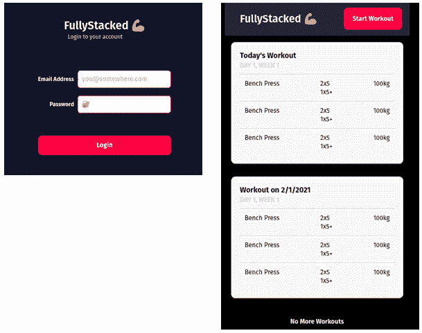
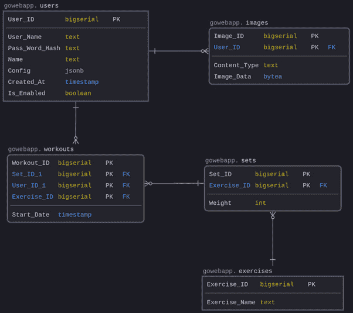
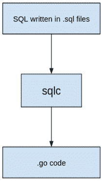

# 1

# 构建数据库和模型

在本章中，我们将设计我们的示例应用程序将使用的数据库。我们将逐步介绍数据库的设计，并查看我们将使用的一些工具，这些工具将帮助我们进行数据库设计之旅。我们将使用 **Postgres** 数据库，并查看如何使用 **Docker** 在本地运行它。什么是 Docker？简单来说，Docker 是一个允许开发者本地或云端运行各种应用程序的工具，如数据库、HTTP 服务器、系统工具等。Docker 消除了安装特定应用程序（如数据库）所需的所有不同依赖项的需求，并且它使得在本地和云端环境中管理维护应用程序比在裸机上安装更为容易。这是可能的，因为 Docker 将所有内容打包到一个单独的文件中，就像压缩文件内部包含不同的文件一样。

我们将学习如何设计一个支持我们想要构建的功能的数据库，例如以下内容：

+   创建练习

+   创建锻炼计划

+   登录系统

我们还将探索一些工具，这些工具将帮助我们基于 SQL 查询进行自动代码生成，这在很大程度上减少了需要编写的数据库相关代码的数量。读者将学习如何使用该工具自动生成所有相关的 CRUD 操作，而无需编写任何 Go 代码。

在本章中，我们将涵盖以下内容：

+   安装 Docker

+   设置 Postgres

+   设计数据库

+   安装 sqlc

+   使用 sqlc

+   设置数据库

+   使用 sqlc 生成 CRUD

+   构建 makefile

# 技术要求

在这本书中，我们将使用 Go 编程语言的 1.16 版本，但你也可以自由地使用 Go 的后续版本，因为代码无需任何修改即可运行。为了方便，本章中解释的所有相关文件都可以在 [`github.com/PacktPublishing/Full-Stack-Web-Development-with-Go/tree/main/Chapter01`](https://github.com/PacktPublishing/Full-Stack-Web-Development-with-Go/tree/main/Chapter01) 上检出。要在此章节中工作样本代码，请确保将目录更改为 `Chapter 1` – `Full-Stack-Web-Development-with-Go/chapter1`。如果你使用 Windows 作为开发机器，请使用 WSL2 来执行本章中解释的所有不同操作。

# 安装 Docker

在这本书中，我们将使用 Docker 来执行诸如运行数据库和执行数据库工具等任务。你可以安装 Docker Desktop 或 Docker Engine。要了解 Docker Desktop 和 Engine 之间的区别，请访问以下链接：[`docs.docker.com/desktop/linux/install/#differences-between-docker-desktop-for-linux-and-docker-engine`](https://docs.docker.com/desktop/linux/install/#differences-between-docker-desktop-for-linux-and-docker-engine)。作者在 Linux 上使用 Docker Engine，在 Mac 上使用 Docker Desktop。

如果你正在本地机器上安装 Docker Desktop，以下链接是不同操作系统的链接：

+   Windows – [`docs.docker.com/desktop/windows/install/`](https://docs.docker.com/desktop/windows/install/)

+   Linux – [`docs.docker.com/desktop/linux/install/`](https://docs.docker.com/desktop/linux/install/)

+   macOS – [`docs.docker.com/desktop/mac/install/`](https://docs.docker.com/desktop/mac/install/)

如果你想要安装 Docker 二进制文件，你可以按照以下指南进行：[`docs.docker.com/engine/install/binaries/`](https://docs.docker.com/engine/install/binaries/)。

# 设置 Postgres

我们为示例应用程序选择的数据库是 Postgres；我们选择 Postgres 而不是其他数据库，是因为有大量开源工具可用于构建、配置和维护 Postgres。自 1989 年版本 1 以来，Postgres 就是开源的，并且被全球的大型科技初创公司所使用。该项目在工具和实用程序方面拥有大量的社区支持，这使得管理和维护变得更加容易。该数据库适用于从小型到大型复制的数据库存储。

在本地运行它的最简单方法是将其作为 Docker 容器运行。首先，使用以下命令来运行 Postgres：

```go
docker run --name test-postgres \
-e POSTGRES_PASSWORD=mysecretpassword -p 5432:5432 -d postgres
```

命令将在端口`5432`上运行`postgres`；如果不幸有其他应用程序或其他 Postgres 实例监听此端口，则命令将失败。如果你需要在不同的端口上运行 Postgres，请将`-p`参数（例如，`-p 5555:5432`）更改为不同的端口号。

如果成功，你将看到打印出的容器 ID。ID 将与此处显示的不同：

```go
f7bdfb7d2c10c5f0c9227c9b0a720f21d3c7fa65907eb0c546b8f20f12621102
```

通过使用`docker ps`检查 Postgres 是否正在运行。接下来要做的事情是使用`psql-client`工具连接到 Postgres 以测试它。不同平台上可用的不同 Postgres 客户端工具的列表可以在此找到：[`wiki.postgresql.org/wiki/PostgreSQL_Clients`](https://wiki.postgresql.org/wiki/PostgreSQL_Clients)。

我们将使用 Docker 的标准`postgres psql`工具。打开另一个终端，并使用以下 Docker 命令来运行`psql`：

```go
docker exec -it test-postgres psql -h localhost -p 5432 -U postgres -d postgres
```

我们所做的是在运行的 Postgres 容器内执行`psql`命令。你将看到如下输出，表明它已成功连接到 Postgres 数据库：

```go
psql (12.3, server 14.5 (Debian 14.5-1.pgdg110+1))
WARNING: psql major version 12, server major version 14.
         Some psql features might not work.
Type "help" for help.
postgres=#
```

在成功连接后，你将看到以下输出。请注意，警告信息提到了服务器主版本 14 – 这是为了表明服务器版本比根据文档（[`www.postgresql.org/docs/12/app-psql.xhtml`](https://www.postgresql.org/docs/12/app-psql.xhtml)）中所述的当前`psql`版本更新。`psql`客户端将与 Postgres 服务器无任何问题地工作：

```go
psql (12.3, server 14.0 (Debian 14.0-1.pgdg110+1))
WARNING: psql major version 12, server major version 14.
         Some psql features might not work.
Type "help" for help.
postgres=#
```

通过输入`exit`退出`psql`，回到命令提示符。

以下是在尝试连接到数据库时遇到的一些常见错误的指导：

| **错误信息** | **描述** |
| --- | --- |
| `psql: 错误：无法连接到服务器：FATAL: 密码认证失败 for` `user “postgres”` | 运行 Postgres 时指定的密码与使用`psql`传入的密码不匹配。检查密码。 |
| psql: 错误：无法连接到服务器：无法连接到服务器：主机不可达 | 你用于连接 Postgres 的 IP 地址是错误的。 |

通过这样，你已经完成了 Postgres 的本地设置，现在可以开始设计数据库了。

# 设计数据库

在本节中，我们将探讨如何设计数据库，以便我们能够存储健身跟踪应用程序的信息。以下截图显示了应用程序的模拟：



图 1.1 – 样本应用的截图

在查看这些功能后，我们将探讨设计一个如下实体关系图所示的数据库结构：

实体关系图

实体关系图显示了存储在数据库中的实体集之间的关系。



图 1.2 – 我们健身应用的实体关系图

让我们进一步深入到每个表中，以了解它们包含的数据：

| **表名** | **描述** |
| --- | --- |
| 用户 | 此表包含用于登录的用户信息。密码将以哈希形式存储，而不是明文。 |
| 图片 | 此表包含用户想要做的练习的图片。此表将存储用户上传的所有练习图片。 |
| 练习 | 此表包含用户想要做的练习的名称。用户将定义他们想要做的练习类型。 |
| 组数 | 此表包含用户想要做的每个练习的组数。 |
| 训练 | 此表包含用户想要做的训练。用户将训练定义为一系列他们想要做的练习的组合，包括他们想要做的组数。 |

我们为了在数据库中存储图片所做的权衡是简化设计；在现实中，这可能不适合更大的图片和生产环境。现在我们已经定义了数据库结构并了解了它将存储的数据类型，我们需要看看如何实现它。我们想要关注的主要标准之一是完全将编写 SQL 与代码分开；这样，我们就有了一个清晰的分离，这将允许更高的可维护性。

# 安装 sqlc

我们已经定义了数据库结构，现在让我们更多地谈谈我们将要使用的工具，称为 sqlc。**sqlc**是一个开源工具，它从 SQL 生成类型安全的代码；这允许开发者专注于编写 SQL，将 Go 代码留给 sqlc。这减少了开发时间，因为 sqlc 负责查询和类型的日常编码。

工具可在 [`github.com/kyleconroy/sqlc`](https://github.com/kyleconroy/sqlc) 获取。该工具帮助开发者专注于编写应用程序所需的 SQL 代码，并将生成应用程序所需的所有相关代码。这样，开发者将使用纯 Go 代码进行数据库操作。这种分离是清晰且易于追踪的。

以下图表显示了开发者在使用此工具时通常采用的高级流程。



图 1.3 – 使用 sqlc 生成 Go 代码的流程

所有 SQL 代码都将写入 `.sql` 文件中，这些文件将由 sqlc 工具读取并转换为不同的 Go 代码。

使用以下命令下载并安装 SQL 二进制文件：

```go
go install github.com/kyleconroy/sqlc/cmd/sqlc@latest
```

确保你的路径包括 `GOPATH/bin` 目录 – 例如，在我们的案例中，我们的路径看起来如下：

```go
…:/snap/bin:/home/nanik/goroot/go1.16.15/go/bin:/home/nanik/go/bin
```

如果你没有将 `GOPATH` 作为 `PATH` 环境变量的一部分，那么你可以使用以下命令来运行 sqlc：

```go
$GOPATH/bin/sqlc
Usage:
  sqlc [command]
Available Commands:
  compile     Statically check SQL for syntax and type
  errors
  completion  Generate the autocompletion script for the
  specified shell
  generate    Generate Go code from SQL
  help        Help about any command
  init        Create an empty sqlc.yaml settings file
  upload      Upload the schema, queries, and configuration
  for this project
  version     Print the sqlc version number
Flags:
  -x, --experimental   enable experimental features (default: false)
  -f, --file string    specify an alternate config file (default: sqlc.yaml)
  -h, --help           help for sqlc
```

使用 `"sqlc [command] --help"` 获取有关命令的更多信息。

在编写本文时，sqlc 的最新版本是 v1.13.0。

现在我们已经安装了工具并了解了我们将使用此工具时遵循的开发工作流程，我们将看看如何为我们的应用程序使用此工具。

# 使用 sqlc

首先，让我们看看 sqlc 提供的不同命令以及它们是如何工作的。

| **命令** | **说明** |
| --- | --- |
| `compile` | 此命令有助于检查 SQL 语法并报告任何类型错误。 |
| `completion` | 此命令用于为你的环境生成自动完成脚本。以下支持的环境：Bash、Fish、PowerShell 和 zsh。 |
| `generate` | 一个基于提供的 SQL 语句生成 `.go` 文件的命令。这将是我们在应用程序中大量使用的命令。 |
| `init` | 此命令是第一个用于初始化你的应用程序以开始使用此工具的命令。 |

以下将展示如何开始使用 sqlc 来设置项目。在 `chapter1` 目录内创建一个目录 – 例如，`dbtest` – 然后将目录更改为新目录（`dbtest`）。接下来，我们将使用 `init` 命令运行 sqlc：

```go
sqlc init
```

这将自动生成一个名为 `sqlc.yaml` 的文件，其中包含如所示的一个空白配置：

```go
version: "1"
project:
    id: ""
packages: []
```

`sqlc.yaml` 包含 sqlc 将使用它来为我们的 SQL 语句生成所有相关 `.go` 代码的配置信息。

让我们看看 `.yaml` 文件的结构，以了解不同的属性。以下是一个完成结构的示例：

```go
version: "1"
packages:
 - name: "db"
   path: "db"
   queries: "./sqlquery"
   schema: "./sqlquery/schema/"
   engine: "postgresql"
   sql_engine: "database/sql"
   emit_db_tags: "true"
   emit_prepared_queries: true
   emit_interface: false
   emit_exact_table_names: false
   emit_empty_slices: false
   emit_exported_queries: false
   emit_json_tags: true
   json_tags_case_style: "snake"
   output_db_file_name: "db.go"
   output_models_file_name: "dbmodels.go"
   output_querier_file_name: "dbquerier.go"
   output_files_suffix: "_gen"
```

以下表格解释了不同的字段：

| **标签名称** | **描述** |
| --- | --- |
| `Name` | 任何用作包名的字符串。 |
| `Path` | 指定将托管生成的 `.go` 代码的目录名称。 |
| `Queries` | 指定包含 sqlc 将用于生成 `.``go` 代码的 SQL 查询的目录名称。 |
| `Schema` | 包含用于生成所有相关 `.``go` 文件的 SQL 文件的目录。 |
| `Engine` | 指定将要使用的数据库引擎：sqlc 支持 MySQL 或 Postgres。 |

| `emit_db_tags` | 设置此为 `true` 将生成带有 `db` 标签的 `struct` – 例如：`type ExerciseTable` `struct {```go ExerciseID int64 ` ```db:"exercise_id"``ExerciseName` ``string `db:"exercise_name"```go}` |
| `emit_prepared_queries` | Setting this to `true` instructs sqlc to support prepared queries in the generated code. |
| `emit_interface` | Setting this to `true` will instruct sqlc to generate the querier interface. |
| `emit_exact_table_names` | Setting this to `true` will instruct sqlc to mirror the struct name to the table name. |
| `emit_empty_slices` | Setting this to `true` will instruct sqlc to return an empty slice for returning data on many sides of the table. |
| `emit_exported_queries` | Setting this to `true` will instruct sqlc to allow the SQL statement used in the auto-generated code to be accessed by an outside package. |
| `emit_json_tags` | Setting this to `true` will generate the struct with JSON tags. |
| `json_tags_case_style` | This setting can accept the following – `camel`, `pascal`, `snake`, and `none`. The case style is used for the JSON tags used in the struct. Normally, this is used with `emit_json_tags`. |
| `output_db_file_name` | Name used as the filename for the auto-generated database file. |
| `output_models_file_name` | Name used as the filename for the auto-generated model file. |
| `output_querier_file_name` | Name used as the filename for the auto-generated querier file. |
| `output_files_suffix` | Suffix to be used as part of the auto-generated query file. |

We have looked at the different parameters available in the tool, along with how to use the `.yaml` file to specify the different properties used to generate the relevant Go files. In the next section, we will set up our sample app database.

# Setting up the database

We need to prepare and create the database using the `psql` client tool. The SQL database script can be found inside `schema.sql` under the `db` folder in the GitHub repository, and we are going to use this to create all the relevant tables inside Postgres.

Change the directory to `chapter1` and run the Postgres database using the following Docker command:

```

docker run --name test-postgres -e POSTGRES_PASSWORD=mysecretpassword -v $(pwd):/usr/share/chapter1 -p 5432:5432 postgres

```go

Once `postgres` is running, use the following command to enter into `psql`:

```

docker exec -it test-postgres psql -h localhost -p 5432 -U postgres -d postgres

```go

Once inside the `psql` command, run the following:

```

\i /usr/share/chapter1/db/schema.sql

```go

This will instruct `psql` to execute the commands inside `schema.sql`, and on completion, you will see the following output:

```

postgres=# \i /usr/share/chapter1/db/schema.sql

CREATE SCHEMA

CREATE TABLE

CREATE TABLE

CREATE TABLE

CREATE TABLE

CREATE TABLE

```go

To reconfirm that everything is set up correctly, use the following command (do not forget to include the dot after `gowebapp`):

```

\dt gowebapp.*

```go

You should see the following output:

```

postgres=# \dt gowebapp.*

列出关系

Schema  |   Name    | Type  |  Owner

----------+-----------+-------+----------

gowebapp | exercises | table | postgres

gowebapp | images    | table | postgres

gowebapp | sets      | table | postgres

gowebapp | users     | table | postgres

gowebapp | workouts  | table | postgres

(5 rows)

```go

Now that we have completed setting up our database, we are ready to move to the next section, where we will be setting up sqlc to generate the Go files.

# Generating CRUD with sqlc

**CRUD** stands for **Create, Read, Update, and Delete**, which refers to all the major functions that are inherent to relational databases. In this section, we will do the following for the application:

*   Complete the sqlc configuration file
*   Create SQL query files

Once done, we will be able to autogenerate the different files required to allow us to perform CRUD operations to the database from the application. First, open `sqlc.yaml` and enter the following configuration:

```

---

version: '1'

packages:

- name: chapter1

path: gen

schema: db/

queries: queries/

engine: postgresql

emit_db_tags: true

emit_interface: false

emit_exact_table_names: false

emit_empty_slices: false

emit_exported_queries: false

emit_json_tags: true

json_tags_case_style: camel

output_files_suffix: _gen

emit_prepared_queries: false

```go

Our application is now complete with all that we need for the database, and sqlc will autogenerate the `.go` files. The following is how the application directory and files will look:

```

.

├── db

│   └── schema.sql

├── go.mod

├── queries

│   └── query.sql

└── sqlc.yaml

```go

We can run sqlc to generate the `.go` files using the following command:

```

sqlc generate

```go

By default, sqlc will look for the `sqlc.yaml` file. If the filename is different, you can specify it using the `-f` flag as follows:

```

sqlc generate -f sqlc.yaml

```go

Once the operation completes, there will be no output; however, a new directory called `gen` will be generated as shown here:

```

./gen/

├── db.go

├── models.go

└── query.sql_gen.go

```go

We have completed the auto-generation process using sqlc; now, let’s take a look at the schema and queries that sqlc uses to generate the code.

The following is a snippet of the `schema.sql` file that is used by sqlc to understand the structure of the database:

```

CREATE SCHEMA IF NOT EXISTS gowebapp;

CREATE TABLE gowebapp.users (

User_ID        BIGSERIAL PRIMARY KEY,

User_Name      text NOT NULL,

....

);

....

CREATE TABLE gowebapp.sets (

Set_ID      BIGSERIAL PRIMARY KEY,

Exercise_ID BIGINT NOT NULL,

Weight      INT NOT NULL DEFAULT 0

);

```go

The other file sqlc uses is the query file. The query file contains all the relevant queries that will perform CRUD operations based on the database structure given here. The following is a snippet of the `query.sql` file:

```

-- name: ListUsers :many

-- 获取所有用户，按用户名排序

SELECT *

FROM gowebapp.users

ORDER BY user_name;

...

-- name: DeleteUserImage :exec

-- 删除特定用户的图片

DELETE

FROM gowebapp.images i

WHERE i.user_id = $1;

...

-- name: UpsertExercise :one

-- 插入或更新特定 ID 的练习

INSERT INTO gowebapp.exercises (Exercise_Name)

VALUES ($1) ON CONFLICT (Exercise_ID) DO

UPDATE

SET Exercise_Name = EXCLUDED.Exercise_Name

RETURNING Exercise_ID;

-- name: CreateUserImage :one

-- 插入一个新的图片

INSERT INTO gowebapp.images (User_ID, Content_Type,

Image_Data)

values ($1,

$2,

$3) RETURNING *;

...

```go

Using `query.sql` and `schema.sql`, sqlc will automatically generate all the relevant `.go` files, combining information for these two files together and allowing the application to perform CRUD operations to the database by accessing it like a normal struct object in Go.

The last piece that we want to take a look at is the generated Go files. As shown previously, there are three auto-generated files inside the `gen` folders: `db.go`, `models.go`, and `query.sql_gen.go.`

Let’s take a look at each one of them to understand what they contain and how they will be used in our application:

*   `db.go`:

This file contains an interface that will be used by the other auto-generated files to make SQL calls to the database. It also contains functions to create a Go struct that is used to do CRUD operations.

A new function is used to create a query struct, passing in a `DBTX` struct. The `DBTX` struct implementation is either `sql.DB` or `sql.Conn`.

The `WithTx` function is used to wrap the `Queries` object in a database transaction; this is useful in situations where there could be an update operation on multiple tables that need to be committed in a single database transaction:

```

func New(db DBTX) *Queries {

return &Queries{db: db}

}

func (q *Queries) WithTx(tx *sql.Tx) *Queries {

return &Queries{

db: tx,

}

}

```go

*   `models.go`:

This file contains the struct of the tables in the database:

```

type GowebappExercise struct {

ExerciseID   int64  `db:"exercise_id"

json:"exerciseID"`

ExerciseName string `db:"exercise_name"

json:"exerciseName"`

}

...

type GowebappWorkout struct {

WorkoutID int64     `db:"workout_id"

json:"workoutID"`

UserID    int64     `db:"user_id" json:"userID"`

SetID     int64     `db:"set_id" json:"setID"`

StartDate time.Time `db:"start_date"

json:"startDate"`

}

```go

*   `query.sql_gen.go`:

This file contains CRUD functions for the database, along with the different parameters struct that can be used to perform the operation:

```

const deleteUsers = `-- name: DeleteUsers :exec

DELETE FROM gowebapp.users

WHERE user_id = $1

`

func (q *Queries) DeleteUsers(ctx context.Context,

userID int64) error {

_, err := q.db.ExecContext(ctx, deleteUsers, userID)

return err

}

...

const getUsers = `-- name: GetUsers :one

SELECT user_id, user_name, pass_word_hash, name, config, created_at, is_enabled FROM gowebapp.users

WHERE user_id = $1 LIMIT 1

`

func (q *Queries) GetUsers(ctx context.Context, userID int64) (GowebappUser, error) {

row := q.db.QueryRowContext(ctx, getUsers, userID)

var i GowebappUser

err := row.Scan(

&i.UserID,

&i.UserName,

&i.PassWordHash,

&i.Name,

&i.Config,

&i.CreatedAt,

&i.IsEnabled,

)

return i, err

}

...

```go

Now that the database and auto-generated data to perform CRUD operations are complete, let’s try all this by doing a simple insert operation into the user table.

The following is a snippet of `main.go`:

```

包 main

import (

...

)

func main() {

...

// 打开数据库

db, err := sql.Open("postgres", dbURI)

if err != nil {

panic(err)

}

// 连通性检查

如果 db.Ping() 出现错误 {

log.Fatalln("数据库 ping 错误:", err)

}

// 创建存储

st := chapter1.New(db)

st.CreateUsers(context.Background(),

chapter1.CreateUsersParams{

用户名:     "testuser",

PassWordHash: "hash",

名称:         "test",

})

}

```go

The app is doing the following:

1.  Initializing the URL and opening the database
2.  Pinging the database
3.  Creating a new user using the `CreateUsers(..)` function

Make sure you are in the `chapter1` directory and build the application by running the following command:

```

go build -o chapter1

```go

The compiler will generate a new executable called `chapter1`. Execute the file, and on a successful run, you will see the data inserted successfully into the `users` table:

```

2022/05/15 16:10:49 完成！

名称 : test, ID : 1

```go

We have completed setting up everything from the database and using sqlc to generate the relevant Go code. In the next section, we are going to put everything together for ease of development.

# Building the makefile

A makefile is a file that is used by the `make` utility; it contains a set of tasks consisting of different combined shell scripts. Makefiles are most used to perform operations such as compiling source code, installing executables, performing checks, and many more. The `make` utility is available for both macOS and Linux, while in Windows, you need to use Cygwin ([`www.cygwin.com/`](https://www.cygwin.com/)) or NMake ([`docs.microsoft.com/en-us/cpp/build/reference/nmake-reference`](https://docs.microsoft.com/en-us/cpp/build/reference/nmake-reference)).

We will create the makefile to automate the steps that we have performed in this chapter. This will make it easy to do the process repetitively when required without typing it manually. We are going to create a makefile that will do tasks such as the following:

*   Bringing up/down Postgres
*   Generating code using sqlc

The makefile can be seen in the `chapter1` directory; the following shows a snippet of the script:

```

..

.PHONY : postgresup postgresdown psql createdb teardown_recreate generate

postgresup:

docker run --name test-postgres -v $(PWD):/usr/share/chapter1 -e POSTGRES_PASSWORD=$(DB_PWD) -p 5432:5432 -d $(DB_NAME)

...

# 手动创建数据库的任务

createdb:

docker exec -it test-postgres psql $(PSQLURL) -c "\i /usr/share/chapter1/db/schema.sql"

...

```go

With the makefile, you can now bring up the database easily using this command:

```

make postgresup

```go

The following is used to bring down the database:

```

make postgresdown

```go

sqlc will need to be invoked to regenerate the auto-generated code whenever changes are made to the schema and SQL queries. You can use the following command to regenerate the files:

```

make generate

```

# 摘要

在本章中，我们介绍了我们需要经历的各个阶段来为我们的健身应用程序设置数据库。我们还编写了一个 makefile，通过自动化开发过程中所需的不同数据库相关任务来节省我们的时间。

在下一章中，我们将探讨我们示例应用程序的日志记录。日志记录是一个简单但至关重要的组件。应用程序使用日志来提供对应用程序运行状态的可见性。
