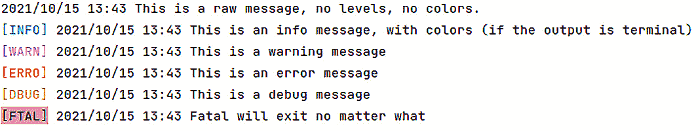
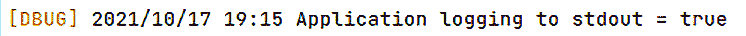
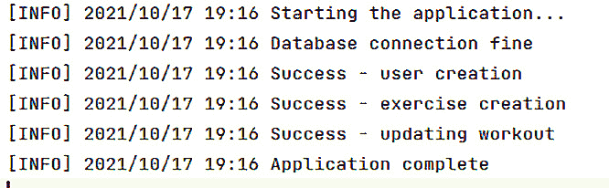

# 应用程序日志记录

构建任何类型的应用程序以满足用户需求是拼图的一部分；另一部分是弄清楚我们如何设计它，以便在出现生产问题的情况下支持它。日志记录是在出现问题时提供可见性的最重要的事情之一。应用程序日志记录是保存应用程序事件和错误的过程；简单来说，它生成一个包含关于软件应用程序中发生的事件信息的文件。在生产中支持应用程序需要快速响应，而为了实现这一点，应用程序应该记录足够的信息。

在本章中，我们将探讨构建一个用于记录事件（例如错误）的应用程序日志服务器。我们还将学习如何进行多路复用日志记录，以便根据我们的配置记录不同的事件。本章将涵盖以下内容：

+   探索 Go 标准日志记录

+   本地日志记录

+   将日志消息写入日志服务器

+   配置多个输出

# 技术要求

本章中解释的所有源代码都可以在[`github.com/PacktPublishing/Full-Stack-Web-Development-with-Go/tree/main/Chapter02`](https://github.com/PacktPublishing/Full-Stack-Web-Development-with-Go/tree/main/Chapter02)中查看，而日志服务器可以在[`github.com/PacktPublishing/Full-Stack-Web-Development-with-Go/tree/main/logserver`](https://github.com/PacktPublishing/Full-Stack-Web-Development-with-Go/tree/main/logserver)中查看

# 探索 Go 标准日志记录

在本节中，我们将探讨 Go 语言提供的默认日志库。Go 提供了一套丰富的库；然而，就像其他库一样，它也有局限性——它不提供分级日志记录（`INFO`、`DEBUG`等）、文件日志文件功能等。这些局限性可以通过使用开源日志库来克服。

Go 为应用程序提供了非常多样化和丰富的标准库。日志记录是其中之一，它位于`log`包中。以下文档链接提供了关于`pkg.go.dev/log@latest`包内不同函数的完整信息。

在 Go 标准库中可用的另一个包是`fmt`包，它提供了打印、输入等 I/O 操作的功能。更多信息可以在`https://pkg.go.dev/fmt@latest`中找到。`log`包内的可用函数与`fmt`包类似，在阅读示例代码时，我们会看到它使用起来非常简单。

以下是一些由`log`包（`https://pkg.go.dev/log`）提供的功能：

```go
func (l *Logger) Fatal(v ...interface{})
func (l *Logger) Fatalf(format string, v ...interface{})
func (l *Logger) Fatalln(v ...interface{})
func (l *Logger) Panic(v ...interface{})
func (l *Logger) Prefix() string
func (l *Logger) Print(v ...interface{})
func (l *Logger) Printf(format string, v ...interface{})
func (l *Logger) Println(v ...interface{})
func (l *Logger) SetFlags(flag int)
func (l *Logger) SetOutput(w io.Writer)
func (l *Logger) SetPrefix(prefix string)
```

让我们看看示例代码，来自样本仓库[`github.com/PacktPublishing/Full-Stack-Web-Development-with-Go/tree/main/Chapter02`](https://github.com/PacktPublishing/Full-Stack-Web-Development-with-Go/tree/main/Chapter02)。`main.go`文件位于`example/stdlog`目录下。为了了解如何使用`log`包，请构建并运行以下代码：

```go
go run .
```

在成功运行后，您将得到以下输出：

```go
2021/10/15 10:12:38 Just a log text
main.go:38: This is number 1
10:12:38 {
        «name»: «Cake»,
        «batters»: {
                «batter»: [
                        {
                                «id»: «001»,
                                «type»: «Good Food»
                        }
                ]
        },
        «topping»: [
                {
                        «id»: «002»,
                        «type»: «Syrup»
                }
        ]
}
```

输出显示标准日志库是可配置的，允许不同的日志输出格式 - 例如，您可以在以下内容中看到消息前面带有格式化的日期和时间：

```go
2021/10/15 10:12:38 Just a log text
```

负责格式化日志前缀的函数是`SetFlags(..)`函数：

```go
func main() {
  ...
  // set log format to - dd/mm/yy hh:mm:ss
  ol.SetFlags(log.LstdFlags)
  ol.Println(«Just a log text»)
  ...
}
```

代码将标志设置为使用`LstdFlags`，这是一个日期和时间的组合。以下表格显示了可以使用的不同标志：

| **Flag** | **说明** |
| --- | --- |
| `Ldate` | 一个用于指定以 YYYY/MM/DD 格式显示本地时区的日期的标志 |
| `Ltime` | 一个用于指定以 HH:MM:SS 格式使用本地时区的时间的标志 |
| `Lmicroseconds` | 一个用于指定微秒的标志 |
| `Llongfile` | 一个用于指定文件名和行号的标志 |
| `Lshortfile` | 最后的文件名元素和行号 |
| `LUTC` | 当使用`Ldate`或`Ltime`标志时，我们可以使用此标志来指定使用 UTC 而不是本地时区 |
| `Lmsgprefix` | 一个用于指定在消息之前显示的前缀文本的标志 |
| `LstdFlags` | 此标志使用已定义的标准标志，基本上是`Ldate`或`Ltime` |

标准库可以覆盖一些应用程序日志需求的使用场景，但有时应用程序需要更多标准库中没有的功能 - 例如，将日志信息发送到多个输出将需要构建额外的功能，或者在某些情况下，您可能需要将嵌套的错误日志转换为 JSON 格式。在下一节中，我们将探索为我们样本应用程序的另一个替代方案。

# 使用 golog

现在我们已经了解了标准库中有什么可用，我们想要探索使用一个可以为我们提供更多灵活性的库。我们将查看`golog`开源项目([`github.com/kataras/golog`](https://github.com/kataras/golog))。`golog`库是一个无依赖的日志库，它提供了诸如分级日志(`INFO`、`ERROR`等)、基于 JSON 的输出和可配置的彩色输出等功能。

日志功能中最常用的特性之一是日志级别，也称为分级日志。日志级别用于将应用程序的输出信息分类到不同的严重级别。以下表格显示了不同的严重级别：

| `INFO` | 仅用于信息目的 |
| --- | --- |
| `WARN` | 有某些东西运行不正确，所以请留意，以防出现更严重的错误 |
| `ERROR` | 存在一个需要关注的错误 |
| `DEBUG` | 用于在生产环境中协助故障排除或添加到应用程序中用于跟踪目的的重要信息 |
| `FATAL` | 应用程序中发生了需要立即响应/调查的严重问题 |

示例代码可以在 `example/golog` 目录中找到。构建并运行代码，你将得到以下输出：



图 2.1 – golog 输出示例

日志消息的前缀颜色各不相同，这对应着不同的严重级别；当你浏览大量日志消息时，这非常有用。不同的日志级别被分配了不同的颜色，以便于查看。

生成此日志的代码与标准库代码类似，如下所示：

```go
func main() {
  golog.SetLevel(«error»)
  golog.Println(«This is a raw message, no levels, no
                 colors.»)
  golog.Info(«This is an info message, with colors (if the
              output is terminal)»)
  golog.Warn(«This is a warning message»)
  golog.Error(«This is an error message»)
  golog.Debug(«This is a debug message»)
  golog.Fatal(`Fatal will exit no matter what,
              but it will also print the log message if
              logger›s Level is >=FatalLevel`)
}
```

该库提供基于级别的日志记录。这意味着库可以根据配置显示日志消息；例如，对于开发，我们希望配置记录器显示所有日志消息，而在生产中，我们只想显示错误消息。以下表格显示了为 `golog` 配置不同级别时的输出外观：

| **级别** | **输出** |
| --- | --- |
| `golog.SetLevel("info")` | `2021/10/15 12:07 这是一条原始消息，没有级别，` `没有颜色。``[INFO] 2021/10/15 12:07 这是一条 info 消息，带有颜色（如果输出` `是终端）``[WARN] 2021/10/15 12:07 这是一条` `警告消息``[ERRO] 2021/10/15 12:07 这是一条` `错误消息``[FTAL] 2021/10/15 12:07 致命错误将退出，无论什么情况` |
| `golog.SetLevel("debug")` | `2021/10/15 12:08 这是一条原始消息，没有级别，` `没有颜色。``[INFO] 2021/10/15 12:08 这是一条 info 消息，带有颜色（如果输出` `是终端）``[WARN] 2021/10/15 12:08 这是一条` `警告消息``[ERRO] 2021/10/15 12:08 这是一条` `错误消息``[DBUG] 2021/10/15 12:08 这是一条` `调试消息``[FTAL] 2021/10/15 12:08 致命错误将退出，无论什么情况` |
| `golog.SetLevel("warn")` | `2021/10/15 12:08 这是一条原始消息，没有级别，` `没有颜色。``[WARN] 2021/10/15 12:08 这是一条` `警告消息``[ERRO] 2021/10/15 12:08 这是一条` `错误消息``[FTAL] 2021/10/15 12:08 致命错误将退出，无论什么情况` |
| `golog.SetLevel("error")` | `2021/10/15 12:11 这是一条原始消息，没有级别，` `没有颜色。``[ERRO] 2021/10/15 12:11 这是一条` `错误消息``[FTAL] 2021/10/15 12:11 致命错误将退出，无论什么情况` |
| `golog.SetLevel("fatal")` | `2021/10/15 12:11 这是一条原始消息，没有级别，` `没有颜色。``[FTAL] 2021/10/15 12:11 致命错误将退出，无论什么情况` |

我们在本节中介绍了 golog 及其功能，现在我们对可用于日志记录的不同选项有了很好的理解。在下一节中，我们将更深入地探讨 golog。

# 本地日志记录

现在我们已经了解了如何使用 golog，我们将使用其更多功能来扩展它。库提供了一个函数，允许应用程序处理每个日志级别的日志消息写入——例如，一个应用程序希望将所有错误写入文件，其余的打印到控制台。

我们将查看`example/gologmoutput`目录内的示例代码。构建并运行它，你会看到创建了两个新文件，分别命名为`infoerr.txt`和`infolog.txt`。这两个文件的内容输出如下：

```go
[ERRO] 2021/11/26 21:11 This is an error message [INFO] 2021/11/26 21:11 This is an info message, with colors (if the output is terminal)
```

应用程序使用`os.OpenFile`标准库创建或追加名为`infolog.txt`和`infoerr.txt`的文件，这些文件将包含使用 golog 的`SetLevelOutput`函数配置的不同日志信息。以下是用 golog 配置不同日志输出的函数片段：

```go
func configureLogger() {
  // open infolog.txt  append if exist (os.O_APPEND) or
  // create if not (os.O_CREATE) and read write
  // (os.O_WRONLY)
  infof, err := os.OpenFile(logFile,
                  os.O_APPEND|os.O_CREATE|os.O_WRONLY,
                  0666)
  ...
  golog.SetLevelOutput(«info», infof)
   // open infoerr.txt  append if exist (os.O_APPEND) or
      create if not (os.O_CREATE) and read write
   // (os.O_WRONLY)
   // errf, err := os.OpenFile(«infoerr.txt»,
                 os.O_APPEND|os.O_CREATE|os.O_WRONLY,
                 0666)
    ...
  golog.SetLevelOutput(«error», errf)
}
```

其余的日志级别消息将被写入`stdout`，这是库默认配置的。

在本节中，我们学习了如何配置 golog 以允许我们分别记录错误和信息。这在生产环境中非常有用，因为如果我们将所有内容都记录到单个文件中，我们将很难处理。在下一节中，我们将探讨构建自己的简单日志服务器以接收应用程序的日志请求。

# 将日志消息写入日志服务器

在现代云环境中，同一应用程序的多个实例在不同的服务器上运行。由于云环境的分布式特性，跟踪不同应用程序实例产生的不同日志将很困难。这需要使用集中式日志系统，该系统能够捕获来自不同应用程序和系统的所有不同日志消息。

为了满足我们的需求，我们将构建自己的日志服务器来捕获所有日志消息在一个地方；代码可以在[`github.com/PacktPublishing/Full-Stack-Web-Development-with-Go/tree/main/logserver`](https://github.com/PacktPublishing/Full-Stack-Web-Development-with-Go/tree/main/logserver)找到。日志服务器将成为一个中心位置，将汇总应用程序的日志信息，这有助于在应用程序部署在云环境中时的故障排除。拥有集中日志服务器的缺点是，当日志服务器宕机时，我们除了访问托管应用程序的服务器外，无法看到任何日志信息。

**REST**代表**表示状态转移**；用通俗易懂的话来说，它描述了一个使用 HTTP 协议和方法与服务器中的资源进行通信的服务器。信息以不同的格式交付，其中 JSON 是最流行的格式。它是语言无关的，这意味着任何可以发送和接收 HTTP 的应用程序都可以使用日志服务器。

构建成功后，日志服务器将显示以下消息：

```go
2021/10/15 23:37:31 Initializing logging server at port 8010
```

一旦日志服务器启动，返回到包含示例应用的`chapter2`根目录，并通过运行以下命令来测试应用：

```go
make build
```

完成后，运行名为`sampledb`的新二进制文件。`sampledb`应用会将日志消息发送到日志服务器：

```go
"{\n  \"timestamp\": 1634301479,\n  \"level\": \"info\",\n  \"message\": \"Starting the application...\"\n}\n"
"{\n  \"timestamp\": 1634301479,\n  \"level\": \"info\",\n  \"message\": \"Database connection fine\"\n}\n"
"{\n  \"timestamp\": 1634301479,\n  \"level\": \"info\",\n  \"message\": \"Success - user creation\"\n}\n"
"{\n  \"timestamp\": 1634301479,\n  \"level\": \"info\",\n  \"message\": \"Success - exercise creation\"\n}\n"
"{\n  \"timestamp\": 1634301479,\n  \"level\": \"info\",\n  \"message\": \"Application complete\"\n}\n"
"{\n  \"timestamp\": 1634301479,\n  \"level\": \"info\",\n  \"message\": \"Application complete\"\n}\nut\"\n}\n"
```

日志服务器作为一个普通的 HTTP 服务器运行，监听端口`8010`，注册一个单一端点`/log`以接收传入的日志消息。让我们来了解一下，并尝试理解日志服务器是如何工作的。但在那之前，让我们看看服务器代码是如何工作的：

```go
import (
  ...
  «github.com/gorilla/mux»
  ...
)
func runServer(addr string) {
  router = mux.NewRouter()
  initializeRoutes()
  ...
  log.Fatal(http.ListenAndServe(addr, router))
}
```

服务器使用一个名为 Gorilla Mux 的框架([github.com/gorilla/mux](http://github.com/gorilla/mux))，该框架负责接收和分发传入请求到相应的处理器。我们在这个示例中使用的`gorilla/mux`包被开源社区积极使用；然而，目前它正在寻找维护者以继续该项目。

负责处理请求的处理器位于`initializeRoutes()`函数内部，如下所示：

```go
func initializeRoutes() {
  router.HandleFunc(«/log», loghandler).Methods(http.    MethodPost)
}
```

`router.HandleFunc(..)`函数配置了`/log`端点，该端点将由`loghandler`函数处理。`Methods("POST")`指示框架它应该只接受针对`/log`端点的传入请求的`POST` HTTP 方法。

现在我们将查看`loghandler`函数，该函数负责处理传入的日志消息：

```go
func loghandler(w http.ResponseWriter, r *http.Request) {
  body, err := ioutil.ReadAll(r.Body)
  ...
  w.WriteHeader(http.StatusCreated)
}
```

`http.ResponseWriter`参数是一个定义为一个接口的类型，用于构建 HTTP 响应 – 例如，它包含`WriteHeader`方法，允许将标题写入响应。`http.Request`参数提供了一个接口，使函数能够与服务器接收到的请求进行交互 – 例如，它提供了一个`Referer`函数来获取引用 URL。

`loghandler`函数执行以下操作：

1.  读取请求体，因为它包含日志消息。

1.  在成功读取体后，处理器将返回 HTTP 状态码`201`（`StatusCreated`）。状态码`201`表示请求已成功处理，资源（在本例中为日志 JSON 消息）已成功创建，或者在我们的情况下，已成功打印。

1.  将日志消息打印到`stdout`。

关于不同标准 HTTP 状态码的更详细信息，请参考以下网站：[`developer.mozilla.org/en-US/docs/Web/HTTP/Status`](https://developer.mozilla.org/en-US/docs/Web/HTTP/Status)。

我们已经学习了如何向应用程序添加日志，以及如何构建一个可以独立于我们的应用程序托管的基础日志服务器。在下一节中，我们将创建一个日志包装器，允许我们的应用程序选择是本地记录还是记录到服务器。

# 配置多个输出

为什么我们要配置多个输出？嗯，在开发过程中，它有助于更容易地本地查看日志以进行故障排除，但在生产环境中，无法查看日志文件，因为所有内容都将位于日志服务器内部。

我们将编写一层薄薄的包装代码，该代码将包装`golog`库；我们将要查看的代码位于`chapter2/`目录下的`logger/log.go`文件中。为`golog`库编写包装代码的好处是隔离应用程序，以便直接与库进行接口；这将使得在需要时轻松切换到不同的日志库变得容易。应用程序通过将解析标志传递给`SetLoggingOutput(..)`函数来配置包装代码。

通过运行以下命令来构建应用程序：

```go
make build
```

然后，运行它，将标志传递给`true`，如下所示，以将日志消息写入`stdout`：

```go
./sampledb -local=true
```

调试日志将被打印到`stdout`：



图 2.2 – sampledb 的日志输出

所有信息日志消息将被打印到`logs.txt`文件中：



图 2.3 – logs.txt 中的日志消息

应用程序通过调用`SetLoggingOutput(..)`函数使用`local`标志配置日志记录器：

```go
func main() {
  l := flag.Bool(«local», false, «true - send to stdout, false                      - send to logging server»)
  flag.Parse()
  logger.SetLoggingOutput(*l)
  logger.Logger.Debugf(«Application logging to stdout =
                        %v», *l)
  ...
```

包装代码中的两个主要函数执行了`golog`框架的大部分包装：

+   `configureLocal()`

+   `configureRemote()`

```go
...
func configureLocal() {
  file, err := os.OpenFile(«logs.txt»,
                 os.O_APPEND|os.O_CREATE|os.O_WRONLY, 0666)
  ...
  Logger.SetOutput(os.Stdout)
  Logger.SetLevel(«debug»)
  Logger.SetLevelOutput(«info», file)
}
...
```

`configureLocal()`函数负责配置日志记录以写入`stdout`和配置的文件名为`logs.txt`。该函数将 golog 的输出设置为`stdout`并将级别设置为`debug`，这意味着所有内容都将发送到`stdout`。

另一个函数是`configureRemote()`，它配置 golog 将所有消息以 JSON 格式发送到远程服务器。`SetLevelOutput()`函数接受`io.Writer`接口，这是示例应用程序实现以发送所有信息日志消息的接口：

```go
//configureRemote for remote logger configuration
func configureRemote() {
  r := remote{}
  Logger.SetLevelFormat(«info», «json»)
  Logger.SetLevelOutput(«info», r)
```

`Write(data []byte)`函数执行`POST`操作，将日志消息传递给日志服务器：

```go
func (r remote) Write(data []byte) (n int, err error) {
  go func() {
     req, err := http.NewRequest("POST",
        «http://localhost:8010/log»,
        bytes.NewBuffer(data),
     )
     ...
        resp, _ := client.Do(req)
        defer resp.Body.Close()
     }
  }()
  return len(data), nil
}
```

在本节最后，我们学习了如何创建可配置的日志记录，这将允许应用程序在本地或远程进行日志记录。这有助于我们的应用程序在不同环境中做好准备和部署。

# 摘要

在本章中，我们探讨了向应用程序添加日志功能的不同方法。我们还了解了`golog`库，它提供的灵活性和功能比标准库所能提供的更多。我们研究了创建自己的简单日志服务器，使我们的应用程序能够发送在多服务环境中使用的日志信息。

在下一章中，我们将探讨如何向应用程序添加可观察性功能。我们将探讨跟踪和指标，并介绍 OpenTelemetry 规范。
