# 第三章：应用程序指标和跟踪

在*第二章* *应用程序日志*中，我们探讨了日志记录以及如何在我们的后端 Go 代码中使用日志记录。在本章中，我们将继续探讨监控和跟踪。为了监控和跟踪应用程序，我们将研究不同的开源工具和库。

我们已经开始构建我们的应用程序，现在我们需要开始考虑如何支持它。一旦应用程序在生产环境中运行，我们需要了解应用程序中发生了什么。拥有这种可见性将使我们能够理解出现的问题。在软件系统中，我们经常会遇到*可观察性*的概念。这个概念指的是软件系统捕获和存储用于分析和故障排除目的的数据的能力。这包括用于实现允许用户观察系统中发生情况的目标的过程和工具。

在本章中，我们将介绍以下主题：

+   理解 OpenTelemetry 规范

+   跟踪应用程序

+   使用 Prometheus 为我们的应用程序添加指标

+   运行 `docker-compose`

# 技术要求

本章中解释的所有源代码都可以从 GitHub 这里获取：[`github.com/PacktPublishing/Full-Stack-Web-Development-with-Go/tree/main/Chapter03`](https://github.com/PacktPublishing/Full-Stack-Web-Development-with-Go/tree/main/Chapter03)。

我们将使用另一个名为 OpenTelemetry 的工具，它将在下一节中解释，我们在这本书中使用的是 v1.2.0 版本，可在以下链接找到：[`github.com/open-telemetry/opentelemetry-go/tree/v1.2.0`](https://github.com/open-telemetry/opentelemetry-go/tree/v1.2.0)。

# 理解 OpenTelemetry

OpenTelemetry 是一个开源项目，它使开发者能够为他们的应用程序提供可观察性能力。该项目为不同的编程语言提供了软件开发工具包（SDK），其中 Go 是支持的语言之一，它与应用程序集成。SDK 用于指标收集和报告，因为它与不同的开源框架集成了，使得集成过程无缝。OpenTelemetry 还提供了一个通用标准，为应用程序提供了灵活性，可以将收集到的数据报告到不同的可观察性后端系统。OpenTelemetry 的网站是 [`opentelemetry.io/`](https://opentelemetry.io/)。

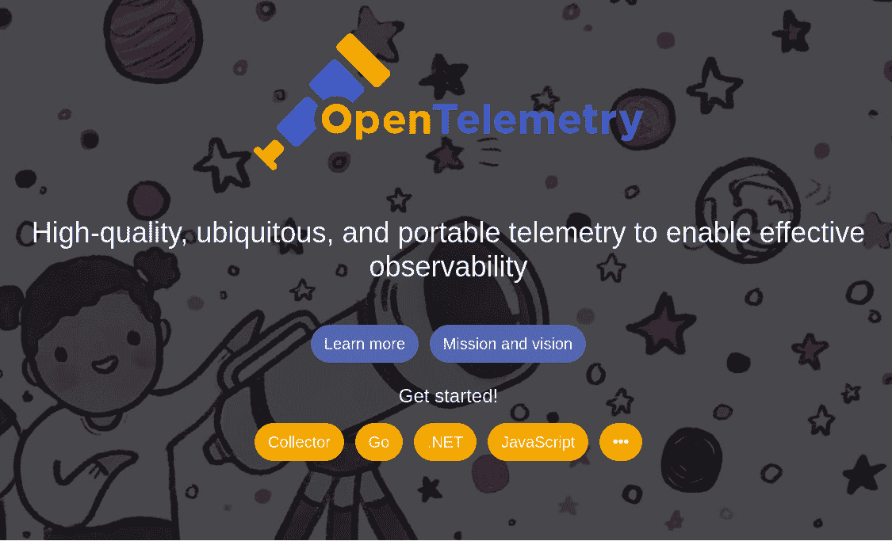

图 3.1 – OpenTelemetry 标志

**OpenTelemetry** 实际上是 OpenTracing 和 OpenCensus 项目的合并。该项目用于对应用程序进行仪器化、收集和导出指标、日志和跟踪。OpenTelemetry 可以跨多种语言使用，Go 是支持的语言之一。

遵循 OpenTelemetry 规范的主要好处是它是供应商无关的，这意味着使用它们的 API 编写的应用程序可以在不同的可观察性供应商之间移植。例如，编写写入文件系统的应用程序将需要几行代码更改，以便将其指标存储在 Prometheus 中，我们将在“使用 Prometheus 添加指标”部分讨论。

OpenTelemetry 的两个主要组件如下：

+   **跟踪**: 这为应用程序提供了通过收集数据跟踪服务请求在系统中流动的能力。例如，使用跟踪功能，我们可以看到 HTTP 请求如何通过网络中的不同系统流动。

+   **指标**: 这为应用程序提供了收集和存储测量数据的能力，用于检测性能异常和预测。例如，在我们的应用程序中收集指标将使我们能够了解数据库查询需要多长时间，或者处理某个特定批处理作业需要多长时间。

您可以在以下链接找到 OpenTelemetry 规范：[`opentelemetry.io/docs/reference/specification/`](https://opentelemetry.io/docs/reference/specification/)。

规范允许用户轻松地插入和播放不同的 OpenTelemetry 实现，而无需依赖单一供应商的库。这意味着规范文档中概述的所有相关合同都可以实现。为了有效地使用 OpenTelemetry，以下是一些重要的概念：

+   **组件**: 这些基本上是核心供应商无关的规范，概述了需要实现的不同系统部分。组件包括收集器、API、SDK 和仪器库。

+   **数据源**: 这是规范支持的数据：跟踪、日志、指标和行李。

+   **仪器化和库**: 有两种方法可以集成提供的库——要么通过使用供应商提供的库或开源贡献自动进行，要么根据应用程序要求手动进行。

在下一节中，我们将探讨规范的实施方面，这涉及到 API 和 SDK 两个方面。

## OpenTelemetry 的 API 和 SDK

OpenTelemetry 由几个组件组成，我们将讨论的两个主要组件是 API 和 SDK。规范定义了任何实现都必须遵守的跨语言要求，作为要求的一部分：

+   **APIs**: 这定义了将用于生成遥测数据的数据类型和操作

+   **SDK**: 这定义了 API 的处理和导出功能的实现

API 和 SDK 之间存在明显的区别——很明显，API 是由规范提供的合约，而 SDK 提供了允许处理和导出指标数据的所需的不同功能。指标数据包含诸如内存使用、CPU 使用率等信息。

规范为以下内容提供了 API：

+   **上下文**：这包含在 API 调用之间携带的值。这是可以在系统调用之间传递并携带应用程序信息的数据。

+   **Baggage**：一组描述用户定义属性的键值对。

+   **跟踪**：一个提供跟踪功能的 API 定义

+   **指标**：一个提供指标记录功能的 API 定义

我们将探讨 OpenTelemetry 跟踪 API 的外观以及如何将跟踪功能添加到应用程序中。

# 跟踪应用程序

在上一章中，我们学习了日志记录以及日志如何让我们了解应用程序内部正在发生的事情。日志和跟踪之间的界限模糊；我们需要理解的是，日志只是提供了关于进程当前正在做什么的信息，而跟踪则提供了跨不同组件的横切可见性，使我们能够更好地理解数据流和进程完成所需的时间。

例如，使用跟踪，我们可以回答以下问题：

+   添加到购物车的过程需要多长时间？

+   下载支付文件需要多长时间？

我们将探讨规范中概述的不同 API，并使用 OpenTelemetry 库提供的实现来实现这些 API。

下图显示了不同实体之间的链接。

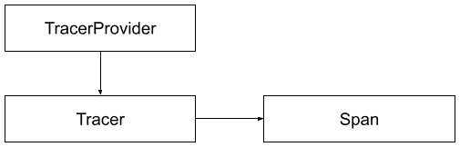

图 3.2 – 跟踪 API 关系

**TracerProvider** 是使用跟踪 API 的入口点，它提供了对 **Tracer** 的访问，**Tracer** 负责创建 **Span**。**Span** 用于跟踪我们应用程序中的操作。在我们进一步探讨下一层，即 SDK 之前，我们将简要了解一下 **Jaeger**，这是 OpenTelemetry 库提供的用于跟踪的支持工具之一。

## 安装 Jaeger

Jaeger ([`www.jaegertracing.io/`](https://www.jaegertracing.io/)) 是一个流行的开源分布式跟踪平台；它为各种编程语言提供了自己的客户端库，可以在 [`github.com/orgs/jaegertracing/repositories`](https://github.com/orgs/jaegertracing/repositories) 上看到。我们将以 Docker 容器的形式运行 Jaeger，以减少手动安装应用程序时所需的设置量。让我们使用以下 `docker` 命令启动 Jaeger：

```go
docker run --name jaeger \
  -p 5775:5775/udp \
  -p 6831:6831/udp \
  -p 6832:6832/udp \
  -p 5778:5778 \
  -p 16686:16686 \
  -p 14268:14268 \
  -p 14250:14250 \
  -p 9411:9411 \
  jaegertracing/all-in-one:latest
```

在成功启动后，将打印出大量的日志，如下所示：

```go
{"level":"info","ts":1637930923.8576558,"caller":"flags/service.go:117","msg":"Mounting metrics handler on admin server","route":"/metrics"}
{"level":"info","ts":1637930923.857689,"caller":"flags/service.go:123","msg":"Mounting expvar handler on admin server","route":"/debug/vars"}
{"level":"info","ts":1637930923.8579082,"caller":"flags/admin.go:104","msg":"Mounting health check on admin server","route":"/"}
{"level":"info","ts":1637930923.8579528,"caller":"flags/admin.go:115","msg":"Starting admin HTTP server","http-addr":":14269"}
…
…
{"level":"info","ts":1637930923.8850179,"caller":"app/server.go:258","msg":"Starting HTTP server","port":16686,"addr":":16686"}
{"level":"info","ts":1637930923.8850145,"caller":"healthcheck/handler.go:129","msg":"Health Check state change","status":"ready"}
{"level":"info","ts":1637930923.8850334,"caller":"app/server.go:277","msg":"Starting GRPC server","port":16685,"addr":":16685"}
{"level":"info","ts":1637930924.8854718,"caller":"channelz/logging.go:50","msg":"[core]Subchannel Connectivity change to IDLE","system":"grpc","grpc_log":true}
{"level":"info","ts":1637930924.8855824,"caller":"grpclog/component.go:71","msg":"[core]pickfirstBalancer: UpdateSubConnState: 0xc00003af30, {IDLE connection error: desc = \"transport: Error while dialing dial tcp :16685: connect: connection refused\"}","system":"grpc","grpc_log":true}
{"level":"info","ts":1637930924.885613,"caller":"channelz/logging.go:50","msg":"[core]Channel Connectivity change to IDLE","system":"grpc","grpc_log":true}
```

Jaeger 现在已准备好，这个工具不是一个桌面应用程序，但它提供了一个可以通过浏览器访问的用户界面。打开您的浏览器，输入以下 URL：http://localhost:16686。它将打开 Jaeger 主页面（*图 3.3**.3*）：

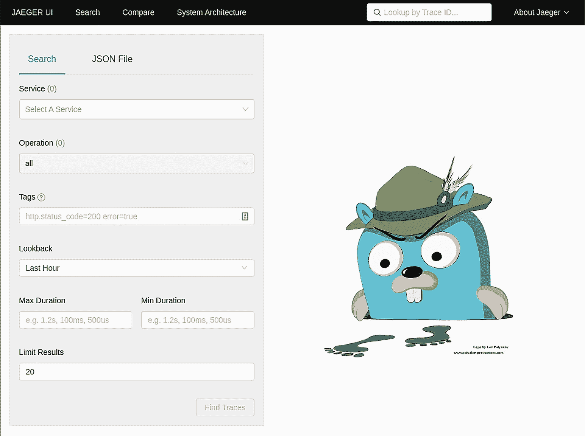

图 3.3 – Jaeger 主页面

目前，Jaeger 没有任何内容，因为没有应用程序在使用它。

# 集成 Jaeger SDK

现在 Jaeger 已经准备好了，让我们看看我们如何使用 OpenTelemetry 来编写跟踪信息。该库为 Jaeger SDK 提供了开箱即用的支持；这使得应用程序可以使用 API 将跟踪信息写入 Jaeger。

我们在本节中将使用的示例位于章节 GitHub 仓库的`jaeger/opentelem/trace`目录中。我们想要查看的文件是`tracing.go`，如下所示：

```go
  package trace
  import (
           «context»
           «go.opentelemetry.io/otel"
           «go.opentelemetry.io/otel/exporters/jaeger"
           «go.opentelemetry.io/otel/sdk/resource"
           «go.opentelemetry.io/otel/sdk/trace"
           sc "go.opentelemetry.io/otel/semconv/v1.4.0"
  )
  type ShutdownTracing func(ctx context.Context) error
  func InitTracing(service string) (ShutdownTracing, error)
  {
    // Create the Jaeger exporter.
    exp, err := jaeger.New(jaeger.WithCollectorEndpoint())
    if err != nil {
     return func(ctx context.Context) error { return nil },
       err
    }
    // Create the TracerProvider.
    tp := trace.NewTracerProvider(
            trace.WithBatcher(exp),
            trace.WithResource(resource.NewWithAttributes(
                    sc.SchemaURL,
                    sc.ServiceNameKey.String(service),
            )),
    )
    otel.SetTracerProvider(tp)
    return tp.Shutdown, nil
  }
```

让我们看看代码的每一部分在做什么。第 18 行在 OpenTelemetry 库内部初始化 Jaeger SDK。在成功初始化 Jaeger SDK 后，代码继续提供新创建的 Jaeger，并使用它与 OpenTelemetry 库一起创建一个新的`TracerProvider` API。如前所述，`TracerProvider`是作为 OpenTelemetry 主要入口的 API。这是在第 24-30 行执行的。

在获取`TracerProvider`后，我们需要调用全局的`SetTracerProvider`来让 OpenTelemetry 了解它，这是在第 32 行完成的。一旦 Jaeger SDK 成功初始化，现在就是将其用于应用程序中的时候了。

让我们看看使用跟踪功能的代码示例。我们将要查看的示例应用程序位于`jaeger/opentelem`目录内的`main.go`中。

## 与 Jaeger 的集成

我们将逐节解释代码的功能。以下代码部分显示了负责初始化过程的`InitTracing`函数被调用的情况：

```go
  package main
  import (
           t "chapter.3/trace/trace"
           "context"
           "fmt"
           "go.opentelemetry.io/otel"
           "go.opentelemetry.io/otel/attribute"
           "go.opentelemetry.io/otel/trace"
           "log"
           "sync"
           "time"
  )
  const serviceName = "tracing"
  func main() {
    sTracing, err := t.InitTracing(serviceName)
    if err != nil {
      log.Fatalf("Failed to setup tracing: %v\n", err)
    }
    defer func() {
      if err := sTracing(context.Background()); err != nil
      {
        log.Printf("Failed to shutdown tracing: %v\n", err)
      }
    }()
    ctx, span := otel.Tracer(serviceName)
                 .Start(context.Background(), "outside")
    defer span.End()
    var wg sync.WaitGroup
    wg.Add(1)
    go func() {
      _, s := otel.Tracer(serviceName).Start(ctx, "inside")
      ...
      wg.Done()
    }()
      wg.Add(1)
      go func() {
        _, ss := otel.Tracer(serviceName).Start(ctx,
                                                "inside")
       ...
        wg.Done()
      }()
      wg.Wait()
      fmt.Println("\nDone!")
  }
```

一旦 SDK 完成初始化过程，代码就可以开始使用 API 来编写跟踪信息，这是通过使用`Tracer` API 获取`Span`来完成的，如第 27-29 行所示。代码使用`sync.WaitGroup`（第 35 和 45 行）确保在 goroutine 完成之前`main`线程不会结束——goroutine 被添加来模拟一些需要完成的处理，以生成将被报告给 Jaeger 的跟踪。

`Tracer` API 只有一个`Start`函数，用于启动跟踪操作，当在`Span`上调用`End`函数时，跟踪操作被认为是完成的——那么，什么是`Span`？`Span`是一个用于跟踪操作的 API；它具有以下接口声明：

```go
type Span interface {
  End(options ...SpanEndOption)
  AddEvent(name string, options ...EventOption)
  IsRecording() bool
  RecordError(err error, options ...EventOption)
  SpanContext() SpanContext
  SetStatus(code codes.Code, description string)
  SetName(name string)
  SetAttributes(kv ...attribute.KeyValue)
  TracerProvider() TracerProvider
}
```

多个`Span`被拼接在一起以创建一个跟踪；它可以被认为是一个**有向无环图**（**DAG**）的`Span`。

DAGs

DAG 是数学和计算机科学中的一个术语。它是一个显示依赖关系的图，在我们的案例中，是应用追踪的依赖关系。

*图 3**.4* 展示了追踪成分的组成：

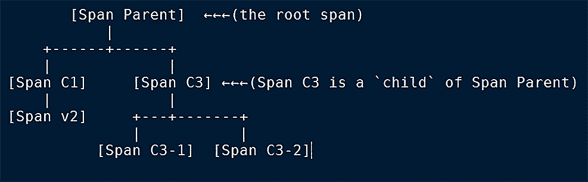

图 3.4 – 简单追踪的 DAG

示例代码创建了两个 goroutines 来执行 `sleep` 操作并写入追踪信息，如下所示：

```go
go func() {
  _, s := otel.Tracer(serviceName).Start(ctx, "inside")
  defer s.End()
  time.Sleep(1 * time.Second)
  s.SetAttributes(attribute.String("sleep", "done"))
  s.SetAttributes(attribute.String("go func", "1"))
  wg.Done()
}()
...
...
go func() {
  _, ss := otel.Tracer(serviceName).Start(ctx, "inside")
  defer ss.End()
  time.Sleep(2 * time.Second)
  ss.SetAttributes(attribute.String("sleep", "done"))
  ss.SetAttributes(attribute.String("go func", "2"))
  wg.Done()
}()
```

使用以下命令在 `jaeger/opentelem` 目录中的 `main.go` 内运行完整的示例应用：

```go
go run main.go
```

完成后，应用将追踪信息写入 Jaeger。通过在浏览器中访问 http://localhost:16686 打开 Jaeger。打开后，您将在 **服务** 下拉菜单中看到一个新条目，如 *图 3**.5* 所示：

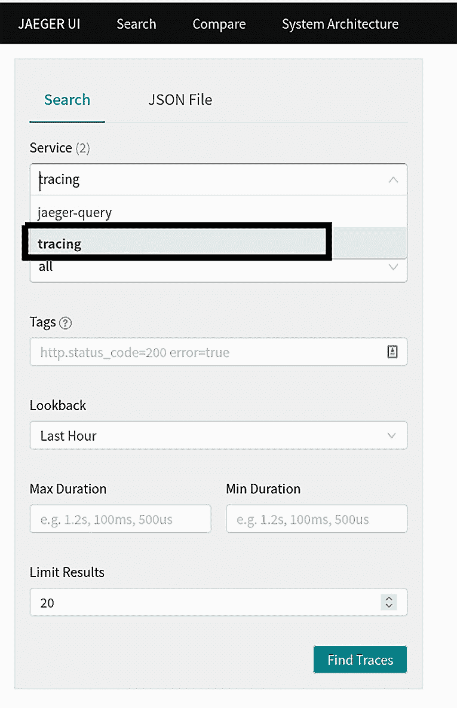

图 3.5 – 应用追踪搜索

示例应用的追踪信息使用代码中定义的相同字符串注册，称为 `tracing`：

```go
const serviceName = "tracing"
```

点击 **查找追踪** 按钮将读取存储的追踪信息（*图 3**.6*）：

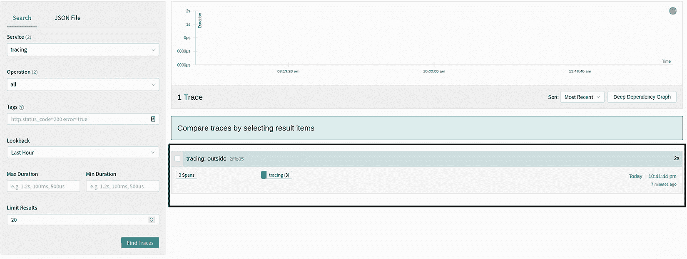

图 3.6 – 应用追踪

如 *图 3**.6* 所示，只有一个条目，如果您点击它，它将展开应用通过 `Span` API 提交的更多信息。

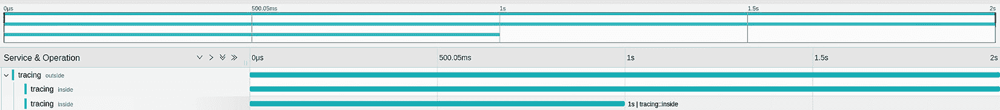

图 3.7 – 追踪信息

*图 3**.7* 展示了完整的追踪信息，这是从应用中获取的跨度组合。点击每个图表将显示包含在跨度中的更多信息，如代码所示：

```go
go func() {
  ...
  s.SetAttributes(attribute.String("sleep", "done"))
  s.SetAttributes(attribute.String("go func", "1"))
  ...
}()
...
go func() {
  ...
  ss.SetAttributes(attribute.String("sleep", "done"))
  ss.SetAttributes(attribute.String("go func", "2"))
  ...
}()
```

现在我们知道了如何向我们的应用添加追踪，在下一节中，我们将探讨添加指标仪表化，这将使我们能够了解与应用相关的某些性能指标。

# 使用 Prometheus 添加指标

由于 OpenTelemetry 是供应商无关的，它为监控、导出和收集指标提供了广泛的支持，其中一种选择是 Prometheus。OpenTelemetry 支持的不同项目的完整列表可以在 [`opentelemetry.io/registry/`](https://opentelemetry.io/registry/) 找到。Prometheus 是一个开源的监控和警报系统服务器，在云环境中被广泛使用；它还提供了各种编程语言的库。

在上一节中，我们看到了如何向我们的应用添加追踪功能以及如何使用 Jaeger 检索追踪。在本节中，我们将探讨如何使用 `OpenTelemetry` 库创建指标。指标使我们能够获取应用的仪表化信息；它可以回答以下问题：

+   服务 A 中处理了多少个总请求？

+   通过支付网关 B 处理了多少笔总交易？

通常，收集的指标会存储一段时间，以便我们通过查看特定指标来更好地了解应用的性能。

我们将使用 Prometheus 开源项目 ([`prometheus.io/`](https://prometheus.io/))，它提供了一个完整的监控解决方案堆栈，并且非常易于使用。该项目提供了许多用于收集和存储指标以及监控我们的应用程序的有用功能。

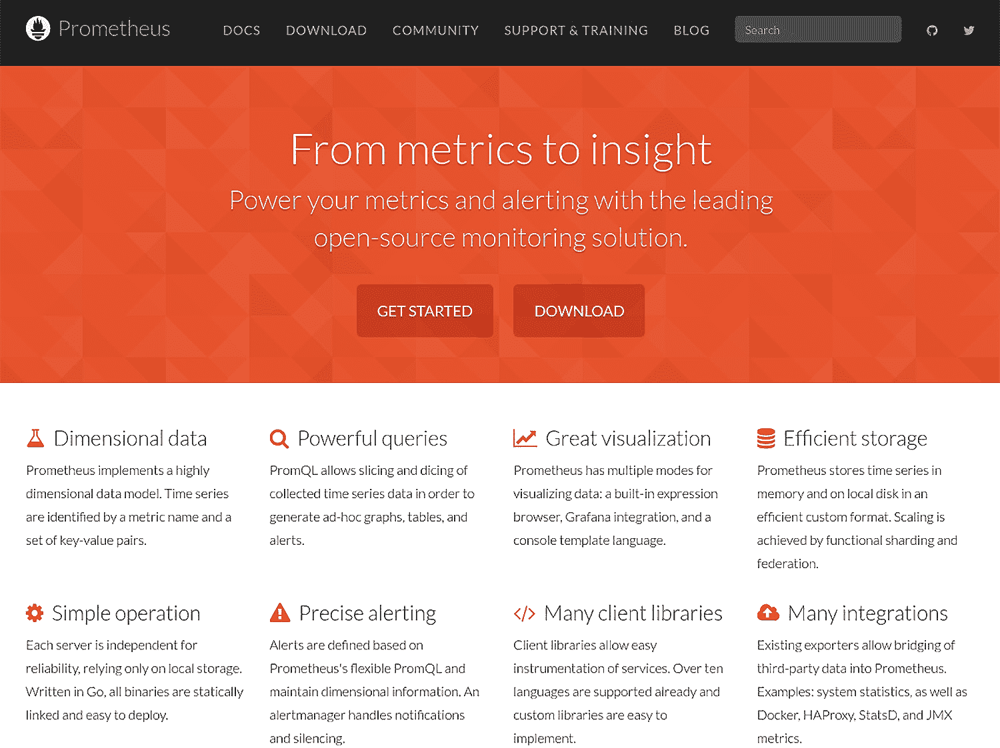

图 3.8 – Prometheus 监控堆栈

与跟踪类似，OpenTelemetry 规范指定了指标和 SDK 的 API，如图 *图 3.9* 所示。

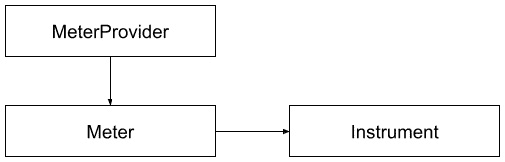

图 3.9 – 指标 API

以下是对指标 API 的解释：

+   **计量器提供者**：这是一个提供对计量器访问的 API。

+   **计量器**：这是负责创建仪表的，并且对于所涉及的仪表是唯一的。

+   **仪表**：它包含我们想要报告的指标；它可以是同步的或异步的。

## 使用 Prometheus 添加指标

让我们启动 Prometheus；请确保您在终端中位于 `chapter3/prom/opentelem` 目录内，并执行以下 `docker` 命令：

```go
docker run --name prom \
-v $PWD/config.yml:/etc/prometheus/prometheus.yml \
-p 9090:9090 prom/prometheus:latest
```

注意：

如果您使用的是 Linux 机器，请使用以下命令：

```go
 docker run --name prom \
 -v $PWD/config.yml:/etc/prometheus/prometheus.yml\
 -p 9090:9090  --add-host=host.docker.internal:host-gateway prom/prometheus:latest
```

额外的参数 `--add-host=host.docker.internal:host-gateway` 将允许 Prometheus 使用 `host.docker.internal` 主机名访问主机机器。

用于配置 Prometheus 的 `config.yml` 文件位于 `prom/opentelem` 目录中，其外观如下：

```go
scrape_configs:
 - job_name: 'prometheus'
   scrape_interval: 5s
   static_configs:
     - targets:
         - host.docker.internal:2112
```

我们在本节中不会详细介绍不同可用的 Prometheus 配置选项。我们使用的配置通知 Prometheus，我们想要从容器主机获取指标，在容器内部称为 `host.docker.internal`，在端口 `2112`，以 5 秒的间隔。

一旦 Prometheus 成功运行，您将看到以下日志：

```go
….
ts=2021-11-30T11:13:56.688Z caller=main.go:451 level=info fd_limits="(soft=1048576, hard=1048576)"
...
ts=2021-11-30T11:13:56.694Z caller=main.go:996 level=info msg="Loading configuration file" filename=/etc/prometheus/prometheus.yml
ts=2021-11-30T11:13:56.694Z caller=main.go:1033 level=info msg="Completed loading of configuration file" filename=/etc/prometheus/prometheus.yml totalDuration=282.112µs db_storage=537ns remote_storage=909ns web_handler=167ns query_engine=888ns scrape=126.942µs scrape_sd=14.003µs notify=608ns notify_sd=1.207µs rules=862ns
ts=2021-11-30T11:13:56.694Z caller=main.go:811 level=info msg="Server is ready to receive web requests."
```

接下来，打开您的浏览器并输入以下内容：http://localhost:9090。您将看到 Prometheus 的主 UI：

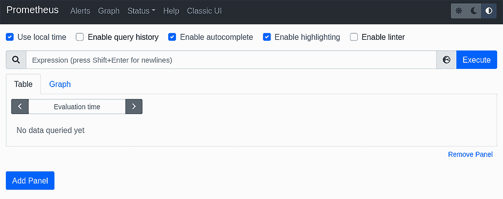

图 3.10 – Prometheus UI

*图 3.11* 展示了 Prometheus 通过拉取机制收集指标的方式，它通过连接到应用程序中运行的 HTTP 服务器暴露的端口 `2112`，从您的应用程序中 *拉取* 指标信息。我们稍后将看到，大部分繁重的工作都是由 `OpenTelemetry` 库完成的；我们的应用程序只需提供我们想要报告的指标。

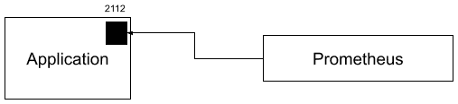

图 3.11 – Prometheus 指标收集

现在 Prometheus 已经准备就绪，我们可以开始记录应用程序的指标。按照以下步骤在 `prom/opentelem` 目录内运行应用程序：

```go
go run main.go
```

让应用程序运行一段时间，您将看到以下日志：

```go
2021/11/30 22:42:08 Starting up server on port 8000
2021/11/30 22:42:12 Reporting metric metric.random
2021/11/30 22:42:22 Reporting metric metric.random
2021/11/30 22:42:32 Reporting metric metric.random
2021/11/30 22:42:47 Reporting metric metric.random
2021/11/30 22:42:57 Reporting metric metric.random
```

+   `metric.totalrequest`：此指标报告应用程序处理的总请求数量；示例应用程序在端口 `8000` 上运行一个 HTTP 服务器

+   `metric.random`：此指标报告一个随机数

在样本应用程序成功运行后，我们可以在 Prometheus UI 中看到这个指标。打开你的浏览器，转到 http://localhost:9090，并输入`metric_random`，你将看到类似于*图 3.12*所示的输出；点击**执行**按钮。

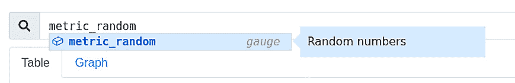

图 3.12 – `metric_random`指标

选择**图形**选项卡，你将看到以下图示：

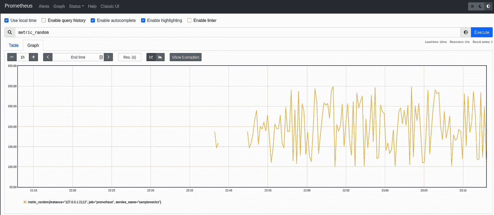

图 3.13 – `metric_random`图形

我们还想要展示的另一个指标是样本应用程序的 HTTP 服务器处理的总请求数。为了生成一些指标，打开浏览器并输入 http://localhost:8000；多次这样做，以便生成一些指标。

再次打开 Prometheus UI（http://localhost:9090），添加`metric_totalrequest`指标，如图*图 3.14*所示，然后点击**执行**：

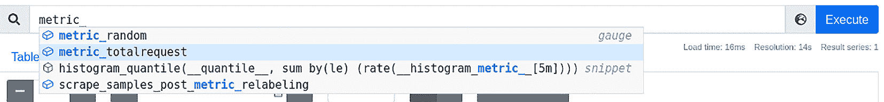

图 3.14 – `metric_totalrequest`指标

图形将如下所示：

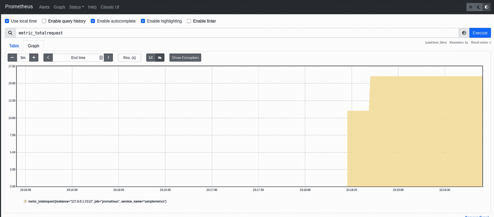

图 3.15 – `metric_totalrequest`图形

如果你遇到问题并且看不到指标，请更改`chapter3/prom/opentelem`目录中的 Prometheus 配置文件`config.yml`，将目标从`host.docker.internal`更改为`localhost`，如下所示：

```go
scrape_configs:
 - job_name: 'prometheus'
   scrape_interval: 5s
   static_configs:
     - targets:
     - localhost:2112
```

`metrics.go`源代码包含初始化`otel` SDK 并为其配置 Prometheus 的代码，如下面的代码片段所示：

```go
package metric
...
type ShutdownMetrics func(ctx context.Context) error
// InitMetrics use Prometheus exporter
func InitMetrics(service string) (ShutdownMetrics, error) {
    config := prometheus.Config{}
    c := controller.New(
        processor.NewFactory(
            selector.NewWithExactDistribution(),
            aggregation.CumulativeTemporalitySelector(),
            processor.WithMemory(true),
        ),
        controller.WithResource(resource.NewWithAttributes(
            semconv.SchemaURL,
            semconv.ServiceNameKey.String(service),
        )),
    )
    exporter, err := prometheus.New(config, c)
    if err != nil {
      return func(ctx context.Context) error { return nil},
        err
    }
    global.SetMeterProvider(exporter.MeterProvider())
    srv := &http.Server{Addr: ":2112", Handler: exporter}
    go func() {
        _ = srv.ListenAndServe()
    }()
    return srv.Shutdown, nil
```

以下代码片段显示了它如何将指标发送到 Prometheus – 代码可以在`chapter3/prom/opentelem`目录中的`main.go`文件中找到：

```go
package main
...
const serviceName = "samplemetrics"
func main() {
    ...
    //setup handler for rqeuest
    r.HandleFunc("/", func(rw http.ResponseWriter, r
      *http.Request) {
        log.Println("Reporting metric metric.totalrequest")
        ctx := r.Context()
        //add request metric counter
        ctr.Add(ctx, 1)
        ...
    }).Methods("GET")
    ...
}
```

现在我们已经成功地将指标和跟踪添加到我们的应用程序中，并且可以使用 Jaeger 和 Prometheus 查看它们；在下一节中，我们将探讨如何将这些工具组合在一起，以便作为一个单一单元运行。

# 运行 docker-compose

我们通常使用`docker`命令运行容器，但如果我们想一次性运行多个容器怎么办？这就是`docker-compose`发挥作用的地方。这个工具允许你配置你想要作为一个单一单元运行的容器。它还允许为不同的容器设置不同的配置 – 例如，容器 A 可以通过网络与容器 B 通信，但不能与容器 C 通信。

本书使用的`docker-compose`工具是 v2，这是推荐的版本。你可以在这里找到为不同操作系统安装工具的说明 – [`docs.docker.com/compose/install/other/`](https://docs.docker.com/compose/install/other/)。

为了方便运行 Prometheus 和 Jaeger，你可以使用`docker-compose`。`docker-compose.yml`文件如下所示：

```go
version: '3.3'
services:
 jaeger:
   image: jaegertracing/all-in-one:latest
   ports:
     - "6831:6831/udp"
     - "16686:16686"
     - "14268:14268"
 prometheus:
   image: prom/prometheus:latest
   volumes:
     -./prom/opentelem/config.yml:/etc/prometheus/
      prometheus.yml
   command:
     - '--config.file=/etc/prometheus/prometheus.yml'
     - '--web.console.libraries=/usr/share/prometheus/
       console_libraries'
     - '--web.console.templates=/usr/share/prometheus/
       consoles›
   ports:
     - 9090:9090
   network_mode: "host"
```

使用以下命令运行`docker-compose`：

```go
docker-compose -f docker-compose.yml  up
```

在成功运行后，你将看到以下日志：

```go
prometheus_1  | ts=2021-12-04T07:45:02.443Z caller=main.go:406 level=info msg="No time or size retention was set so using the default time retention" duration=15d
prometheus_1  | ts=2021-12-04T07:45:02.443Z caller=main.go:444 level=info msg="Starting Prometheus" version="(version=2.31.1, branch=HEAD, revision=411021ada9ab41095923b8d2df9365b632fd40c3)"
prometheus_1  | ts=2021-12-04T07:45:02.443Z caller=main.go:449 level=info build_context="(go=go1.17.3, user=root@9419c9c2d4e0, date=20211105-20:35:02)"
prometheus_1  | ts=2021-12-04T07:45:02.443Z caller=main.go:450 level=info host_details="(Linux 5.3.0-22-generic #24+system76~1573659475~19.10~26b2022-Ubuntu SMP Wed Nov 13 20:0 x86_64 pop-os (none))"
prometheus_1  | ts=2021-12-04T07:45:02.444Z caller=main.go:451 level=info fd_limits="(soft=1048576, hard=1048576)"
prometheus_1  | ts=2021-12-04T07:45:02.444Z caller=main.go:452 level=info vm_limits="(soft=unlimited, hard=unlimited)"
jaeger_1      | 2021/12/04 07:45:02 maxprocs: Leaving GOMAXPROCS=12: CPU quota undefined
prometheus_1  | ts=2021-12-04T07:45:02.445Z caller=web.go:542 level=info component=web msg="Start listening for connections" address=0.0.0.0:9090
....
....
....
jaeger_1      | {"level":"info","ts":1638603902.657881,"caller":"healthcheck/handler.go:129","msg":"Health Check state change","status":"ready"}
jaeger_1      | {"level":"info","ts":1638603902.657897,"caller":"app/server.go:277","msg":"Starting GRPC server","port":16685,"addr":":16685"}
jaeger_1      | {"level":"info","ts":1638603902.6579142,"caller":"app/server.go:258","msg":"Starting HTTP server","port":16686,"addr":":16686"}
```

我们使用的`up`参数将在终端中启动容器并以附加模式运行，这允许您在屏幕上显示所有日志。您也可以以分离模式运行，如下所示，让容器在后台运行：

```go
docker-compose -f docker-compose.yml  up -d
```

# 摘要

在本节中，我们探讨了如何使用`OpenTelemetry`库将指标和跟踪添加到应用程序中。在应用程序中拥有这种可观察性将使我们能够更快地解决问题，并从提供的指标中跟踪我们应用程序的性能。我们还查看了一些开源项目，这些项目允许我们查看从我们的应用程序收集的数据。

在本章中，我们探讨了监控和跟踪我们的应用程序所需的管道和基础设施。在下一章中，我们将探讨为我们的 Web 应用程序构建动态和静态内容的不同方面，以及如何打包应用程序以使其更容易部署到任何地方。

# 第二部分：服务网页内容

完成本书的这一部分后，您将能够使用 HTML/template 和 Gorilla Mux 创建服务器端渲染的页面。您还将学习如何创建和公开一个将被前端使用的 API。将讨论保护 API，包括中间件。

本部分包括以下章节：

+   *第四章**，服务并嵌入 HTML 内容*

+   *第五章**，保护后端和中间件*

+   *第六章**，转向 API 优先*
