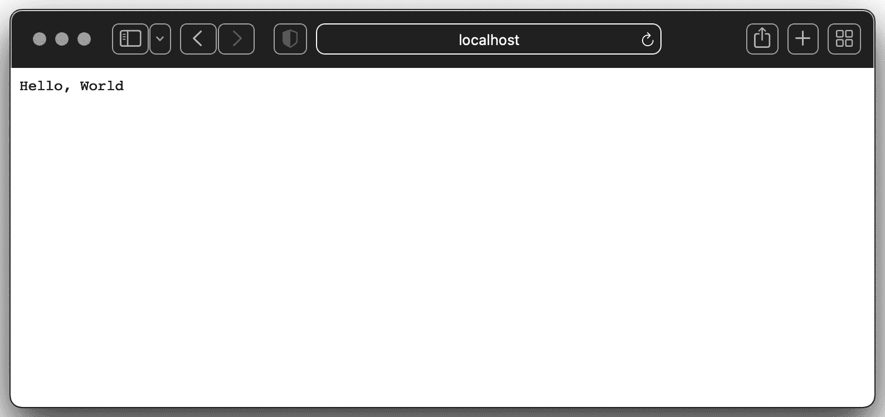
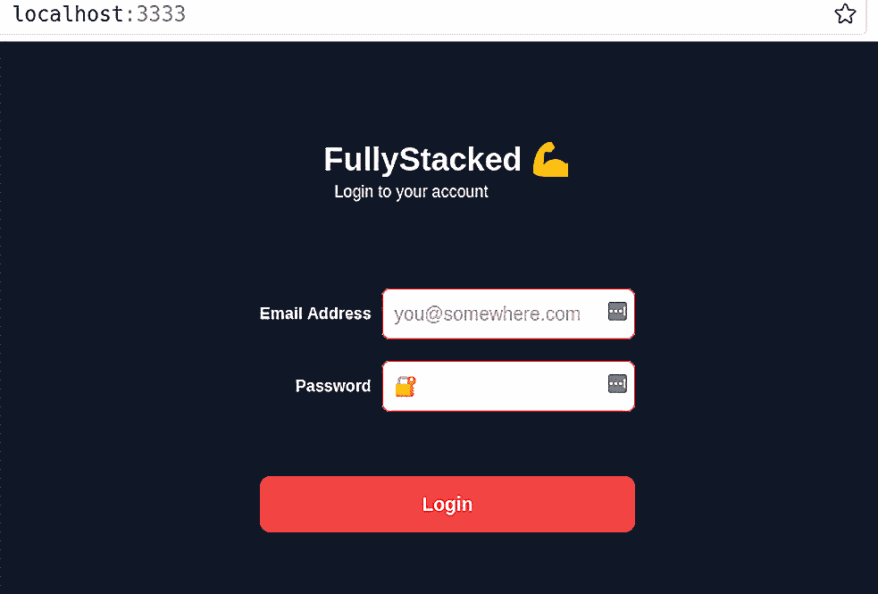
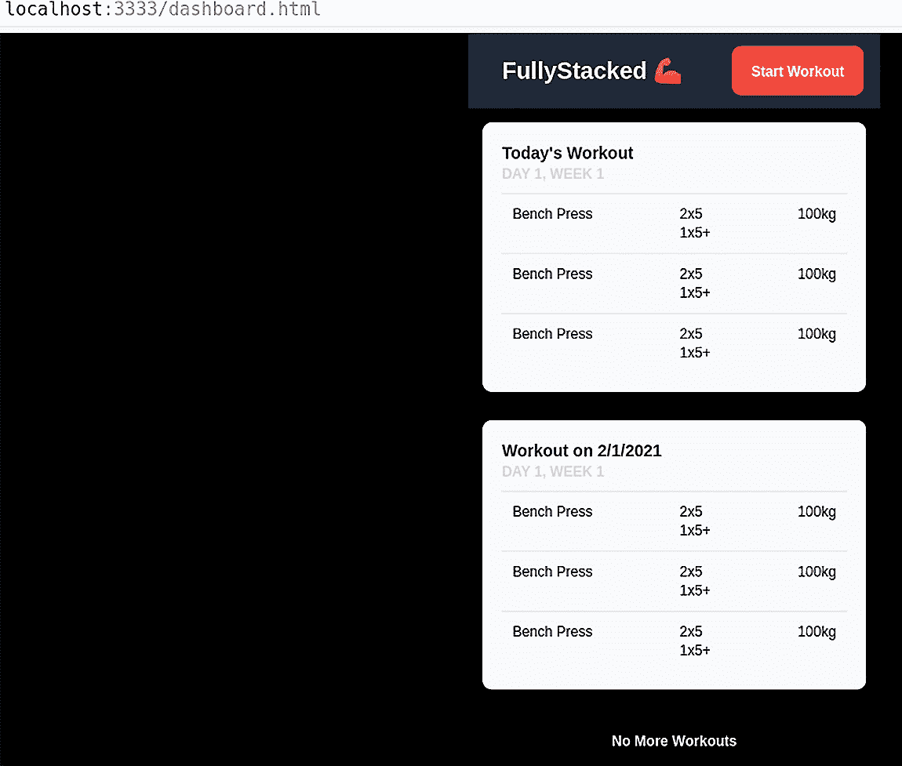

# 4

# 服务和嵌入 HTML 内容

随着我们基础的构建，我们查看处理 HTTP 用户请求的另一个方面——路由。路由很有用，因为它允许我们根据不同的 HTTP 方法（如可以检索的 `GET` 和可以在同一路由上替换数据的 `POST`）来组织我们的应用程序。这个概念是设计基于 REST 的应用程序的基本原则。我们将通过查看如何使用 Go 版本 1.16 中引入的新 `embed` 指令将我们的 Web 应用程序打包为单个自包含的可执行文件来结束本章。本章将为我们提供处理用户数据和创建用户界面的工具。

到本章结束时，你将学会应用程序如何服务静态和动态内容。你还将学会如何使用单个二进制文件将所有不同的资产（图标、`.xhtml`、`.css` 等）嵌入到应用程序中，这些资产将由 Web 应用程序提供。在本章中，我们将涵盖以下主题：

+   处理 HTTP 函数和 Gorilla Mux

+   渲染静态和动态内容

+   使用 Go embed 打包你的内容

# 技术要求

本章的所有源代码都可以在 [`github.com/PacktPublishing/Full-Stack-Web-Development-with-Go/tree/main/Chapter04`](https://github.com/PacktPublishing/Full-Stack-Web-Development-with-Go/tree/main/Chapter04) 上访问。

# 处理 HTTP 函数和 Gorilla Mux

当我们查看 **Go 标准库** 时，我们可以看到在 **HTTP 库** 上投入了大量的思考。你可以在这里查看 Go 标准库的文档：[`pkg.go.dev/net/http`](https://pkg.go.dev/net/http)。然而，我们将涵盖基础并探讨如何在此基础上构建。值得注意的是，Go 标准库涵盖了客户端和服务器端的实现。我们只将关注我们需要的用于服务内容的部分。

我们将创建一个简单的应用程序，它将回复 `Hello, World`，同时在我们扩展了路由后，我们还将查看返回 `POST` 数据。

## 默认值下的 Hello, World

创建 **Golang** 服务器的基本概念如下：

```go
     1    package main
     2
     3    import (
     4        "fmt"
     5        "log"
     6        "net/http"
     7        "os"
     8        "time"
     9    )
    10
    11    func handlerGetHelloWorld(wr http.ResponseWriter,
                                    req *http.Request) {
    12        fmt.Fprintf(wr, "Hello, World\n")
    13        log.Println(req.Method) // request method
    14        log.Println(req.URL)    // request URL
    15        log.Println(req.Header) // request headers
    16        log.Println(req.Body)   // request body)
    17    }
    18
...
    29
    30    func main() {
...
    43        router := http.NewServeMux()
    44
    45        srv := http.Server{
    46            Addr:           ":" + port,
    47            Handler:        router,
    48            ReadTimeout:    10 * time.Second,
    49            WriteTimeout:   120 * time.Second,
    50            MaxHeaderBytes: 1 << 20,
    51        }
    52
...
    57        router.HandleFunc("/", handlerGetHelloWorld)
    58        router.Handle("/1", dummyHandler)
    59        err := srv.ListenAndServe()
    60        if err != nil {
    61            log.Fatalln("Couldnt ListenAndServe()",
                              err)
    62        }
    63    }
```

你可以在 Git 仓库的 `library-mux` 子目录下看到这段代码。

这是如何工作的：我们定义了一个 `handlerGetHelloWorld` 处理函数（第 11 行），并将其作为参数传递给 `router.HandleFunc` 函数。`HandleFunc` 参数需要一个具有以下签名的函数参数：`func(ResponseWriter, *Request)`。

处理器的任务是接收一个请求类型和一个`ResponseWriter`，并根据请求做出决定；也就是说，决定向`ResponseWriter`写入什么。在我们的例子中，`handlerGetHelloWorld`处理器将通过`fmt.Fprintf(...)`函数发送`Hello, World`字符串作为响应。之所以能够将响应发送回去，是因为`http.ResponseWriter`实现了`Write()`函数，该函数在`fmt.Fprintf(...)`函数内部使用。

我们现在为主函数定义以下步骤：

1.  首先，我们创建一个路由器：这是我们处理器将要连接的。我们通过`NewServeMux`（第 43 行）创建我们自己的路由器。我们也可以使用默认库中找到的`DefaultServeMux`，但正如你将在[`github.com/golang/go/blob/5ec87ba554c2a83cdc188724f815e53fede91b66/src/expvar/expvar.go#L334`](https://github.com/golang/go/blob/5ec87ba554c2a83cdc188724f815e53fede91b66/src/expvar/expvar.go#L334)中看到的那样，它包含了一些我们可能不想公开的额外调试端点。通过注册我们自己的，我们可以获得更多的控制权，并且如果我们想要的话，可以自己添加相同的端点。

1.  其次，我们创建我们的服务器实例并将其绑定到一个可用的端口。服务器上的`Addr`字段指定了要绑定的地址和端口。在我们的例子中，我们使用的是`9002`。不同的操作系统对可用的端口有不同的限制。例如，Linux 系统只允许管理员或 root 用户运行使用`1`到`1023`之间端口的程序。

1.  最后一步是将我们的路由器附加到服务器上，启动服务器，并让它开始监听。这是在第 57 行完成的。我们在这里告诉路由器，当它收到对`"/"`的任何 HTTP 请求，即文档根时，应该通过传递给我们的处理器来处理这个请求。

1.  最后一个函数，`srv.ListenAndServe()`（第 59 行），是一个阻塞函数，它启动我们的服务器并开始在服务器定义的端口上监听传入的请求。当找到有效的 HTTP 请求时，它会被传递到`"/"`，然后我们的处理器被调用。我们可以运行我们的应用程序并访问`http://localhost:9002/`；我们应该收到服务器以下响应：



图 4.1 – Go 的“Hello, World!”

在这里值得注意的一点是，每个请求都会被分配一个自己的 goroutine 来并发执行，并且每个请求的生命周期由服务器管理，因此我们不需要做任何显式操作来利用这一点。

在下一节中，我们将探讨使用`GET`和`POST`构建不同的功能。

## 在 Gorilla Mux 的基础上构建基础知识

可在 [`github.com/gorilla/mux`](https://github.com/gorilla/mux) 访问的 Gorilla Mux 是 **Gorilla 项目** 的一个子项目。Gorilla Mux 是一个 *HTTP 请求多路复用器*，它使得匹配不同的处理器与匹配的传入请求变得容易。开发者通过使用这个库可以获得很多好处，因为它使得编写大量的样板代码变得不再必要。该库提供了基于不同标准（如方案和动态 URL）匹配请求的高级功能。

Go 标准库提供的服务器和路由器对于“免费”来说非常强大，但我们将看看如何将 Gorilla Mux 添加到我们的项目中，以及它提供的一些好处。

网页的使用不仅仅局限于返回 *Hello World*，通常，大多数网页应用接受用户提供的数据，更新数据，甚至删除数据，这是可能的，因为浏览器接受各种内容，如图片、视频、数据字段和纯文本。之前的练习专注于所谓的 `GET` 方法，这是在您的网页浏览器中加载页面时默认发送的方法，但还有更多。

标准库实现使得显式处理其他类型的方法变得容易，例如 `GET`、`POST`、`PUT`、`DELETE` 等，这些方法在 HTTP 标准中定义。这通常在处理器函数中完成，如下所示：

```go
func methodFunc(wr http.ResponseWriter, req http.Request) {
   ...
   switch req.Method {
   case http.MethodGet:
       // Serve page - GET is the default when you visit a
       // site.
   case http.MethodPost:
       // Take user provided data and create a record.
   case http.MethodPut:
       // Update an existing record.
   case http.MethodDelete:
       // Remove the record.
   default:
       http.Error(wr, "Unsupported Method!",
                  http.StatusMethodNotAllowed)
   }
}
```

让我们看看一个例子，说明我们如何将两个处理器，`GET` 和 `POST`，以及 Gorilla Mux 提供的一些辅助工具分开：

```go
         1    package main
     2
     3    import (
     4        "bytes"
     5        "fmt"
     6        "io"
     7        "io/ioutil"
     8        "log"
     9        "net/http"
    10        "os"
    11
    12        "github.com/gorilla/mux"
    13    )
    14
    15    func handlerSlug(wr http.ResponseWriter, req
                           *http.Request) {
    16        slug := mux.Vars(req)["slug"]
    17        if slug == "" {
    18            log.Println("Slug not provided")
    19            return
    20        }
    21        log.Println("Got slug", slug)
    22    }
    23
    24    func handlerGetHelloWorld(wr http.ResponseWriter,
                                    req *http.Request) {
    25        fmt.Fprintf(wr, "Hello, World\n")
              // request method
    26        log.Println("Request via", req.Method)
              // request URL
    27        log.Println(req.URL)
              // request headers
    28        log.Println(req.Header)
              // request body)
    29        log.Println(req.Body)
    30    }
    31
    32    func handlerPostEcho(wr http.ResponseWriter,
                               req *http.Request) {
              // request method
    33        log.Println("Request via", req.Method)
              // request URL
    34        log.Println(req.URL)
              // request headers
    35        log.Println(req.Header)
    36
    37        // We are going to read it into a buffer
    38        // as the request body is an io.ReadCloser
    39        // and so we should only read it once.
    40        body, err := ioutil.ReadAll(req.Body)
    41
    42        log.Println("read >", string(body), "<")
    43
    44        n, err := io.Copy(wr, bytes.NewReader(body))
    45        if err != nil {
    46            log.Println("Error echoing response",
                               err)
    47        }
    48        log.Println("Wrote back", n, "bytes")
    49    }
    50
    51    func main() {
    52        // Set some flags for easy debugging
    53        log.SetFlags(log.Lshortfile | log.Ldate |
                           log.Lmicroseconds)
    54
    55        // Get a port from ENV var or default to 9002
    56        port := "9002"
    57        if value, exists :=
                os.LookupEnv("SERVER_PORT"); exists {
    58            port = value
    59        }
    60
    61        // Off the bat, we can enforce StrictSlash
    62        // This is a nice helper function that means
    63        // When true, if the route path is "/foo/",
              // accessing "/foo" will perform a 301
              // redirect to the former and vice versa.
    64        // In other words, your application will
              // always see the path as specified in the
              // route.
    65        // When false, if the route path is "/foo",
              // accessing "/foo/" will not match this
              // route and vice versa.
    66
    67        router := mux.NewRouter().StrictSlash(true)
    68
    69        srv := http.Server{
    70            Addr:    ":" + port, // Addr optionally
                  // specifies the listen address for the
                  // server in the form of "host:port".
    71            Handler: router,
    72        }
    73
    74        router.HandleFunc("/", handlerGetHelloWorld)
                .Methods(http.MethodGet)
    75        router.HandleFunc("/", handlerPostEcho)
                .Methods(http.MethodPost)
    76        router.HandleFunc("/{slug}", handlerSlug)
                .Methods(http.MethodGet)
    77
    78        log.Println("Starting on", port)
    79        err := srv.ListenAndServe()
    80        if err != nil {
    81            log.Fatalln("Couldnt ListenAndServe()", err)
    82        }
    83    }
```

我们已经将 Gorilla Mux 库导入为 `mux` 并设置了两个不同的处理器：`handlerGetHelloWorld`（第 24 行）和 `handlerPostEcho`（第 32 行）。`handlerGetHelloWorld` 是我们在上一个例子中定义的相同处理器，它响应 *Hello, World*。在这里，多亏了路由器的扩展功能，我们明确指定了处理器只能在用户对 `"/"` 端点执行 `GET` 方法时解析（第 74 行）。

让我们从首先切换到 `chapter4/gorilla-mux` 目录并运行以下命令开始样本：

```go
go run main.go
```

我们可以使用 cURL，这是一个在 Windows 上可用的标准实用工具（使用 cmd 而不是 PowerShell），在 Linux（取决于您的 Linux 发行版）和 macOS 上默认安装。这个工具允许用户在终端中发出 HTTP 请求，而无需使用浏览器。在单独的终端中使用 `curl localhost:9002` 命令来测试服务器是否正在运行：

```go
$ curl localhost:9002
Hello, World
$ # Specify DELETE as the option...
$ curl localhost:9002 -v -X DELETE
```

我们可以看到 `GET` 正常工作，但使用 `-X DELETE` 来告诉 cURL 使用 `HTTP DELETE` 方法会导致没有内容返回。在底层，端点正在响应一个 `405 Method Not Allowed` 错误消息。默认情况下，报告给用户的 405 错误消息来自库。

我们添加了第二个处理器（第 75 行），用于从`POST`请求中获取数据。`POST`方法的处理器`handlerPostEcho`（第 32 行）的行为与`GET`请求类似，但我们添加了一些额外的代码来读取用户提供的输入数据，存储它，打印它，然后返回未修改的数据。

我们可以使用 cURL 来查看这是如何工作的，就像之前一样：

```go
$ curl -X POST localhost:9002 -d "Echo this back"
Echo this back
```

在这个阶段，我们跳过了很多验证，并且明确地检查/处理数据格式，例如 JSON，但我们将在后面的章节中逐步实现这一点。

使用 Gorilla Mux 的另一个好处是它使得路径模式匹配变得非常容易。这些路径变量或`slugs`使用`{name}`格式或`{name:pattern}`定义。以下表格展示了不同的`slugs`及其示例：

| `/books/{pagetitle}/page/{pageno}` | `/books/mytitle/page/1, /books/anothertitle/page/100` |
| --- | --- |
| `/posts/{slug}` | /posts/titlepage/posts/anothertitle |

模式可以是正则表达式的一种类型。例如，在我们的示例代码中，我们添加了一个`handlerSlug`处理器（第 15 行）来执行简单的捕获。我们可以使用 cURL 来测试这一点，如下面的代码所示：

```go
$ curl localhost:9002/full-stack-go
…
$ # Our server will show the captured variable in its output
...
2022/01/15 14:58:36.171821 main.go:21: Got slug > full-stack-go <
```

在本节中，我们学习了如何编写处理器并使用 Gorilla Mux。我们还探讨了如何配置 Gorilla Mux 来处理由处理器处理的动态路径。在下一节中，我们将探讨如何从我们的应用程序向用户提供内容。提供的内容将包含静态和动态内容。

# 渲染静态内容

在本节中，我们将学习如何将我们创建的网页作为静态内容提供。我们将使用标准的 Go `net/http`包来提供网页服务。所有代码和 HTML 文件都可以在`static/web`目录内找到（[`github.com/PacktPublishing/Full-Stack-Web-Development-with-Go/tree/main/Chapter04/static/web`](https://github.com/PacktPublishing/Full-Stack-Web-Development-with-Go/tree/main/Chapter04/static/web)）。

使用以下命令执行服务器：

```go
go run main.go
```

您将在屏幕上看到以下消息：

```go
2022/01/11 22:22:03 Starting up server on port 3333 ...
```

打开您的浏览器，输入`http://localhost:3333`作为 URL。您将看到如图*图 4.2*所示的登录页面：



图 4.2 – 登录页面

要访问仪表盘页面，您可以使用 URL `http://localhost:3333/dashboard.xhtml`。您将看到如下截图：



图 4.3 – 仪表盘页面

快速浏览一下提供静态页面的代码：

```go
    1    package main
     2
     3    import (
     4        "log"
     5        "net/http"
     6    )
     7
     8    func main() {
     9        fs := http.FileServer(http.Dir("./static"))
    10        http.Handle("/", fs)
    11
    12        log.Println("Starting up server on port 3333
                           ...")
    13        err := http.ListenAndServe(":3333", nil)
    14        if err != nil {
    15            log.Fatal("error occurred starting up
                            server : ", err)
    16        }
    17    }
```

如所示，这是一个简单的 HTTP 服务器，它使用了 Go 标准库中的`http.FileServer(..)`函数（在第 9 行显示）。该函数通过传递`(./static)`参数到我们想要提供服务的目录（第 9 行）来调用。示例代码可以在`chapter4/static/web/static`文件夹内找到。

# 渲染动态内容

现在我们已经了解了如何使用 `net/http` 包提供静态内容，让我们看看如何添加一些动态内容，使用的是在这里找到的 Gorilla Mux：[`github.com/PacktPublishing/Full-Stack-Web-Development-with-Go/tree/main/Chapter04/dynamic`](https://github.com/PacktPublishing/Full-Stack-Web-Development-with-Go/tree/main/Chapter04/dynamic)。使用以下命令执行服务器：

```go
go run main.go
```

启动浏览器并输入 `http://localhost:3333` 作为地址；你将看到一个与静态内容相似的登录界面。在登录界面上执行以下步骤：

1.  在登录界面上输入任意用户名和密码组合。

1.  点击 `登录` 按钮。

你将得到一个 **登录失败** 的消息，如图 *4**.4* 所示。


图 4.4 – 登录后的消息屏幕

我们为登录操作引入了动态内容，这意味着应用程序将根据某些条件提供页面，在这种情况下，是用户名/密码组合的成功验证。为了成功验证，请输入 `admin/admin` 作为用户名/密码组合，因为这在数据库中存在。

让我们进一步探索代码，以了解它是如何工作的：

```go
     1    package main
     2
     3    import (
     4        "fmt"
     5        "github.com/gorilla/mux"
     6        "html/template"
     7        "log"
     8        "net/http"
     9        "os"
    10        "path/filepath"
    11        "time"
    12    )
    13
    14    type staticHandler struct {
    15        staticPath string
    16        indexPage  string
    17    }
    18
    19    func (h staticHandler) ServeHTTP(w
                http.ResponseWriter, r *http.Request) {
    20        path, err := filepath.Abs(r.URL.Path)
    21        log.Println(r.URL.Path)
    22        if err != nil {
    23            http.Error(w, err.Error(),
                             http.StatusBadRequest)
    24            return
    25        }
    26
    27        path = filepath.Join(h.staticPath, path)
    28
    29        _, err = os.Stat(path)
    30
    31        http.FileServer(
                http.Dir(h.staticPath)).ServeHTTP(w, r)
    32    }
    33
    34    func postHandler(w http.ResponseWriter,
                           r *http.Request) {
    35        result := "Login "
    36        r.ParseForm()
    37
    38        if validateUser(r.FormValue("username"),
                              r.FormValue("password")) {
    39            result = result + "successfull"
    40        } else {
    41            result = result + "unsuccessful"
    42        }
    43
    44        t, err :=
                template.ParseFiles("static/tmpl/msg.xhtml")
    45
    46        if err != nil {
    47            fmt.Fprintf(w, "error processing")
    48            return
    49        }
    50
    51        tpl := template.Must(t, err)
    52
    53        tpl.Execute(w, result)
    54    }
    55
    56    func validateUser(username string,
                            password string) bool {
    57        return (username == "admin") &&
                (password == "admin")
    58    }
    59
    60    func main() {
    61        router := mux.NewRouter()
    62
    63        router.HandleFunc("/login",
                postHandler).Methods("POST")
    64
    65        spa := staticHandler{staticPath: "static",
                                   indexPage: "index.xhtml"}
    66        router.PathPrefix("/").Handler(spa)
    67
    68        srv := &http.Server{
    69            Handler:      router,
    70            Addr:         "127.0.0.1:3333",
    71            WriteTimeout: 15 * time.Second,
    72            ReadTimeout:  15 * time.Second,
    73        }
    74
    75        log.Fatal(srv.ListenAndServe())
    76    }
```

`ServeHTTP` 函数（第 19 行）负责根据在 `staticHandler` 结构体（第 65 行）中定义的目录指定的内容提供服务，该结构体指向包含索引页面 `index.xhtml` 的 `static` 目录。处理器的配置是通过附加到 `/` 路径前缀的 Gorilla Mux 注册的（第 66 行）。

下一个部分是处理 `/login` 端点注册的代码（第 63 行）。`postHandler` 函数（第 34 行）从请求中提取并验证用户名和密码信息。

网页包含两个输入元素，即用户名和密码，当用户点击 `ParseForm()` 函数（第 36 行）时，浏览器会发送这些元素，然后通过引用字段名 `username` 和 `password`（第 38 行）提取传递的值，这些字段名对应于 `chapter04/dynamic/static/index.xhtml` 文件内指定的 HTML 元素名称。

完成验证过程后，应用程序随后使用 Go 的 `html/template` 包（第 44 行）解析另一个 HTML 文件（`static/tmpl/msg.xhtml`）。应用程序将解析 HTML 文件，并使用 `template.Must` 函数（第 51 行）将所有相关信息插入到 HTML 页面中。

此 `msg.xhtml` 文件包含一个 `{{.}}` 占位符字符串，该字符串被 `html/template` 包（第 18 行）理解：

```go
     1    <!DOCTYPE html>
     2    <html>
     3      <head>
    ...
    18                <p class="text-xs text-gray-50">{{.}}
                      </p>
 ...
    24    </html>
```

在本节中，我们学习了如何渲染动态内容。在下一节中，我们将查看如何捆绑我们的静态和动态内容，以便我们可以作为一个单独的文件运行应用程序。

# 使用 Go embed 打包你的内容

在本节中，我们将探讨如何将应用程序打包成一个单独的二进制文件。将应用程序所需的所有内容打包成一个二进制文件，使其更容易在云中的任何地方部署。我们将使用由 *Go 标准库* 提供的 `embed` 包。以下链接提供了关于 embed 包内不同函数的更多详细信息：[`pkg.go.dev/embed`](https://pkg.go.dev/embed)。

注意

embed 包仅在 Go 版本 1.16 及以上版本中可用。

以下代码提供了一个使用 embed 包的简单示例，以三种不同的方式——嵌入特定文件、嵌入文件夹的全部内容以及嵌入特定文件类型：

```go
     1    package main
     2
     3    import (
     4        "embed"
     5        "fmt"
     6        "github.com/gorilla/mux"
     7        "html/template"
     8        "io/fs"
     9        "log"
    10        "net/http"
    11        "os"
    12        "path/filepath"
    13        "strings"
    14        "time"
    15    )
    16
    17    var (
    18        Version string = strings.TrimSpace(version)
    19        //go:embed version/version.txt
    20        version string
    21
    22        //go:embed static/*
    23        staticEmbed embed.FS
    24
    25        //go:embed tmpl/*.xhtml
    26        tmplEmbed embed.FS
    27    )
    28
    29    type staticHandler struct {
    30        staticPath string
    31        indexPage  string
    32    }
    33
    34    func (h staticHandler) ServeHTTP(w
                http.ResponseWriter, r *http.Request) {
    35        path, err := filepath.Abs(r.URL.Path)
    36        log.Println(r.URL.Path)
    37        if err != nil {
    38            http.Error(w, err.Error(),
                             http.StatusBadRequest)
    39            return
    40        }
    41
    42        path = filepath.Join(h.staticPath, path)
    43
    44        _, err = os.Stat(path)
    45
    46        log.Print("using embed mode")
    47        fsys, err := fs.Sub(staticEmbed, "static")
    48        if err != nil {
    49            panic(err)
    50        }
    51
    52        http.FileServer(http.FS(fsys)).ServeHTTP(w,
                                                       r)
    53    }
    54
    55    //renderFiles renders file and push data (d) into
          // the templates to be rendered
    56    func renderFiles(tmpl string, w
            http.ResponseWriter, d interface{}) {
    57        t, err := template.ParseFS(tmplEmbed,
                fmt.Sprintf("tmpl/%s.xhtml", tmpl))
    58        if err != nil {
    59            log.Fatal(err)
    60        }
    61
    62        if err := t.Execute(w, d); err != nil {
    63            log.Fatal(err)
    64        }
    65    }
    66
    67    func postHandler(w http.ResponseWriter,
                           r *http.Request) {
    68        result := "Login "
    69        r.ParseForm()
    70
    71        if validateUser(r.FormValue("username"),
                              r.FormValue("password")) {
    72            result = result + "successfull"
    73        } else {
    74            result = result + "unsuccessful"
    75        }
    76
    77        renderFiles("msg", w, result)
    78    }
    79
    80    func validateUser(username string,
                            password string) bool {
    81        return (username == "admin") &&
                     (password == "admin")
    82    }
    83
    84    func main() {
    85        log.Println("Server Version :", Version)
    86
    87        router := mux.NewRouter()
    88
    89        router.HandleFunc("/login", postHandler)
                .Methods("POST")
    90
    91        spa := staticHandler{staticPath: "static",
                                   indexPage: "index.xhtml"}
    92        router.PathPrefix("/").Handler(spa)
    93
    94        srv := &http.Server{
    95            Handler:      router,
    96            Addr:         "127.0.0.1:3333",
    97            WriteTimeout: 15 * time.Second,
    98            ReadTimeout:  15 * time.Second,
    99        }
   100
   101        log.Fatal(srv.ListenAndServe())
   102    }
```

源代码位于 `chapter4/embed` 文件夹中。代码使用 `//go:embed` 指令（第 19、22 和 25 行）。这告诉编译器 `version string`（第 20 行）将从 `version/version.txt` 获取内容，其中包含我们想要向用户显示的版本信息。

我们还声明了 `//go:embed` 指令，告诉编译器我们想要包含 `static/`（第 22 行）和 `tmpl/`（第 25 行）文件夹中的所有内容。在编译过程中，编译器检测到前面的指令，并自动将所有不同的文件包含到二进制文件中。

`tmpl` 目录包含将渲染动态内容的模板，由于我们已经将其嵌入到二进制文件中，我们需要使用不同的方式来渲染它（第 56 行）。新的 `renderFiles` 函数使用 `template.ParseFS` 函数（第 57 行），它渲染 `tmplEmbed` 变量中声明的模板。

`renderFiles` 函数是从 `postHandler` 函数（第 77 行）调用的，传递模板名称和其他参数。

现在，当我们构建应用程序时，最终的可执行文件包含不同的文件（HTML、CSS 等）在一个文件中。我们现在可以编译应用程序，如下所示：

```go
go build -o embed
```

这将生成一个可执行文件——例如，在 Linux 中，它将被称为 `embed`，在 Windows 中，它将被称为 `embed.exe`。接下来，按照以下方式运行应用程序：

```go
./emded
```

打开浏览器并访问 `http://localhost:3333/`。它应该看起来和之前一样，只是所有内容都是通过 `embed.FS` 获取的。现在你拥有了一个完全嵌入的应用程序，它可以作为一个单独的二进制文件在云端部署。

# 摘要

这章内容相当丰富，它作为我们首次了解与用户提供的数据进行交互和处理 Web 请求的起点。我们看到了如何使用 Go 标准库添加 RESTful 端点，并学习了如何利用 Gorilla Mux 的实用函数快速为我们的应用程序添加更多功能和强大功能。我们还探索了处理请求的不同方法。在一种方法中，我们现在可以利用 Go 的`html/template`库动态创建内容并将其打包为从磁盘读取的目录。或者，我们可以使用新的 Go `embed`指令来获得一个包含所有资源的单个二进制文件，从而实现简单的部署。

在下一章中，我们将探讨如何添加中间件以帮助处理请求管道，并引入安全机制以确保内容可以安全访问。
