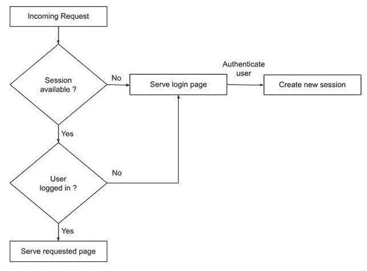
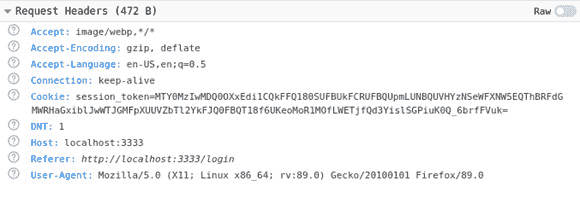

# 第五章：保护后端和中间件

在前面的章节中，我们学习了如何构建我们的数据库，以服务器形式运行我们的 Web 应用程序，并服务动态内容。在本章中，我们将讨论安全性——特别是，我们将查看如何保护 Web 应用程序。安全性是一个广泛的话题，所以对于本章，我们只会查看与我们的应用程序相关的安全方面。我们还将探讨的另一个主题是中间件以及将其作为我们应用程序的一部分使用。

中间件是一种软件，它被引入到应用程序中以提供通用的功能，这些功能用于我们应用程序的入站和出站流量。中间件使得在不同部分的应用程序中集中使用功能变得容易，这将在本章的后续部分中进一步讨论。

在本章中，我们将涵盖以下主题：

+   添加身份验证

+   添加中间件

+   使用 Redis 添加 cookies 和会话

完成本章后，您将学习如何设置用户数据库并为应用添加身份验证。我们还将了解中间件以及如何将其添加到现有应用中。最后，您将学习关于 cookies、在会话中存储信息以及使用 Redis 作为这些会话的持久化存储。

# 技术要求

本章中解释的所有源代码都可以在[`github.com/PacktPublishing/Becoming-a-Full-Stack-Go-Developer/tree/main/Chapter05`](https://github.com/PacktPublishing/Becoming-a-Full-Stack-Go-Developer/tree/main/Chapter05)中找到。

# 添加身份验证

构建应用程序需要在设计应用程序时进行一些考虑，并且需要提前考虑的关键部分之一是安全性。安全性有许多方面，但在这个应用程序的部分，我们将查看身份验证。

注意

身份验证是验证用户是否是他们所声称的过程。

要为我们的应用添加身份验证，我们首先需要在数据库中存储用户信息。用户信息将用于在使用应用程序之前验证用户。数据库用户表可以在`db/schema.sql`文件中找到：

```go
CREATE TABLE gowebapp.users (
User_ID        BIGSERIAL PRIMARY KEY,
User_Name      text NOT NULL,
Password_Hash text NOT NULL,
Name           text NOT NULL,
Config         JSONB DEFAULT '{}'::JSONB NOT NULL,
Created_At     TIMESTAMP WITH TIME ZONE DEFAULT NOW() NOT NULL,
Is_Enabled     BOOLEAN DEFAULT TRUE NOT NULL
```

下表概述了用于用户表的数据类型：

| `BIGSERIAL` | 一种自动递增的数据类型，通常用作主键。 |
| --- | --- |
| `TEXT` | 可变长度的字符字符串。 |
| `JSONB` | JSON 二进制数据类型适合 JSON 数据。数据库提供此数据类型以使其更容易索引、解析和直接查询 JSON 数据。 |
| `TIMESTAMP` | 日期和时间数据类型。 |
| `BOOLEAN` | 包含真或假的逻辑数据类型。 |

身份验证将通过检查`User_Name`和`Pass_Word_Hash`字段来执行。有一点需要注意——`Pass_Word_Hash`字段包含一个加密密码，我们将在稍后进一步探讨加密密码。

如同在 *第一章* 中讨论的，*构建数据库和模型*，我们正在使用 sqlc 生成与数据库通信的 Go 代码。要生成 Go 代码，请执行以下命令：

```go
make generate
```

将读取用户信息的代码将存储在 `gen/query.sql_gen.go` 文件中，如下所示：

```go
...
func (q *Queries) GetUserByName(ctx context.Context, userName string) (GowebappUser, error) {
  row := q.db.QueryRowContext(ctx, getUserByName, userName)
  var i GowebappUser
  err := row.Scan(
     &i.UserID,
     &i.UserName,
     &i.PasswordHash,
     &i.Name,
     &i.Config,
     &i.CreatedAt,
     &i.IsEnabled,
  )
  return i, err
}
...
```

`GetUserByName` 函数通过调用 `QueryRowContext()` 函数查询数据库，传递我们想要使用的查询，该查询定义如下：

```go
const getUserByName = `-- name: GetUserByName :one
SELECT user_id, user_name, pass_word_hash, name, config, created_at, is_enabled
FROM gowebapp.users
WHERE user_name = $1
`
```

查询使用了 `WHERE` 子句，并期望一个参数，即 `user_name` 字段。这是通过将 `userName` 参数传递给 `QueryRowContext()` 函数来填充的。

在下一节中，我们将探讨在启动应用程序时如何创建虚拟用户。虚拟用户通常用于测试目的的用户 - 在我们的案例中，我们想要创建一个虚拟用户来测试身份验证过程。

## 创建我们的虚拟用户

我们的数据库是空的，因此我们需要用虚拟用户来填充它。在本节中，我们将探讨如何创建一个虚拟用户。当应用程序启动时，我们将添加代码来创建虚拟用户。`main.go` 中的以下函数创建虚拟用户，该用户将用于登录应用程序：

```go
func createUserDb(ctx context.Context) {
  //has the user been created
  u, _ := dbQuery.GetUserByName(ctx, "user@user")
  if u.UserName == "user@user" {
     log.Println("user@user exist...")
     return
  }
  log.Println("Creating user@user...")
  hashPwd, _ := pkg.HashPassword("password")
  _, err := dbQuery.CreateUsers(ctx,
                                chapter5.CreateUsersParams{
     UserName:     "user@user",
     PassWordHash: hashPwd,
     Name:         "Dummy user",
  })
...
}
```

当应用程序启动时，它将首先检查是否存在现有的测试用户，如果不存在，它将自动创建一个。这是放在应用程序中，以便我们更容易测试应用程序。`createUserDb()` 函数使用生成的 sqlc 函数 `CreateUsers()` 来创建用户。

您会注意到密码是通过以下代码片段创建的：

```go
hashPwd, _ := pkg.HashPassword("password")
```

密码被传递给 `HashPassword` 函数，该函数将返回明文密码的哈希版本。

`HashPassword` 函数使用了 Go 的 `crypto` 或 `bcrypt` 标准库，这些库提供了一个函数来返回一个普通字符串的哈希值，如下所示：

```go
func HashPassword(password string) (string, error) {
  bytes, err := 
    bcrypt.GenerateFromPassword([]byte(password), 14)
  return string(bytes), err
}
```

从字符串密码生成的哈希值，每次调用 `bcrypt.GenerateFromPassword` 函数时都会不同。`GenerateFromPassword()` 函数使用标准密码学库来生成密码的哈希值。

密码学是将文本消息转换为不易阅读或分解的形式的实践。这提供了数据安全，使得很难分解数据的内容。Go 提供了一个标准库，该库提供了密码学函数，这些函数可在 `golang.org/x/crypto` 包中使用。`crypto` 库提供了一系列密码学函数，您可以根据应用程序的需求进行选择。在我们的示例中，我们使用了 `bcrypt`，这是一个密码哈希函数。

现在我们已经添加了一个在数据库中创建虚拟用户的功能，在下一节中，我们将探讨如何与数据库进行身份验证。

## 用户身份验证

用户认证很简单，因为应用程序将使用 sqlc 生成的函数，如下所示：

```go
func validateUser(username string, password string) bool {
  ...
  u, _ := dbQuery.GetUserByName(ctx, username)
  ...
  return pkg.CheckPasswordHash(password, u.PassWordHash)
}
```

`GetUserByName` 函数用于通过将用户名作为参数传递来获取用户信息。一旦成功检索到信息，它将通过调用 `CheckPasswordHash` 来检查密码是否正确。

`CheckPasswordHash` 函数使用相同的 `crypto` 或 `bcrypt` 包，并调用 `CompareHashAndPassword` 函数，该函数将哈希密码与客户端发送的密码进行比较。如果密码匹配，函数返回 `true`。

```go
func CheckPasswordHash(password, hash string) bool {
  err := bcrypt.CompareHashAndPassword([]byte(hash), 
                                       []byte(password))
return err == nil
}
```

`validateUser` 函数将在用户名和密码组合存在于数据库且正确时返回 `true`。

启动您的应用程序，并在 Web 浏览器中导航到 `http://127.0.0.1:3333/`，您应该会看到一个登录提示。在输入 `user@user / password` 之前，尝试使用错误的凭据登录 – 您现在应该被发送到成功的登录屏幕！恭喜 – 您成功认证了！

在下一节中，我们将探讨中间件，它是什么，以及如何将其添加到我们的应用程序中。

# 添加中间件

中间件是一段配置为 HTTP 处理器的代码。中间件将预处理和后处理请求，并位于主 Go 服务器和已声明的实际 HTTP 处理器之间。

将中间件作为我们应用程序的一部分添加有助于处理主要应用程序功能之外的任务。中间件可以处理身份验证、日志记录和速率限制等任务。在下一节中，我们将探讨添加简单的日志中间件。

## 基本中间件

在本节中，我们将向我们的应用程序添加一个简单的基本中间件。基本中间件的代码片段如下：

```go
func basicMiddleware(h http.Handler) http.Handler {
   return http.HandlerFunc(func(wr http.ResponseWriter,
                                   req *http.Request) {
       log.Println("Middleware called on", req.URL.Path)
       // do stuff
       h.ServeHTTP(wr, req)
   })
}
```

Gorilla Mux 使得使用我们的中间件变得非常容易。这是通过在路由器上公开一个名为 `Use()` 的函数来完成的，该函数通过可变数量的参数实现，可以用来堆叠多个中间件以按顺序执行：

```go
func (*mux.Router).Use(mwf ...mux.MiddlewareFunc)
```

以下代码片段显示了如何实现 `Use()` 函数以注册中间件：

```go
func main() {
    ...
    // Use our basicMiddleware
    router.Use(basicMiddleware)
    ...
}
```

`mux.MiddlewareFunc` 简单地是 `func(http.Handler) http.Handler` 的类型别名，这样任何满足该接口的东西都可以工作。

要查看我们的函数如何工作，我们只需调用 `router.Use()`，传入我们的中间件，导航到我们的 Web 应用程序，在那里我们可以看到它被调用：

```go
go build && ./chapter5 
2022/01/24 19:51:56 Server Version : 0.0.2
2022/01/24 19:51:56 user@user exists...
2022/01/24 19:52:02 Middleware called on /app
2022/01/24 19:52:02 Middleware called on /css/minified.css
…
```

您可能想知道为什么您可以看到它被多次以不同的路径调用 – 原因是当请求我们的应用程序时，它正在执行针对大量托管资源的多个 `GET` 请求。这些请求中的每一个都像 *图 5**.1* 中所示的那样通过我们的中间件：


图 5.1 – 请求通过中间件传递

`handlers` 库（可在 [`github.com/gorilla/handlers`](https://github.com/gorilla/handlers) 找到）包含许多其他有用的中间件方法，我们将在稍后使用其中一些，包括 `handlers.CORS()` 中间件，允许我们处理**跨源资源共享**（**CORS**）。我们将在第九章*Tailwind, Middleware,* 和 CORS.*中更详细地探讨 CORS 和使用此中间件。

在本节中，我们学习了中间件，它可以提供的不同功能，以及如何将其添加到应用程序中。在下一节中，我们将探讨会话处理和使用 cookies 跟踪用户信息，当他们使用应用程序时。

# 添加 cookies 和会话

在本节中，我们将探讨在使用我们的应用程序时如何跟踪用户。我们将探讨会话管理以及它如何帮助我们的应用程序理解用户是否有权访问我们的应用程序。我们还将探讨 cookies，这是我们将要使用的会话管理工具。

本章讨论的会话管理是 Gorilla 项目的组成部分，该项目可在 [`github.com/gorilla/sessions`](https://github.com/gorilla/sessions) 找到。

## Cookies 和会话处理

在本节中，我们将探讨会话处理以及如何使用它来存储与特定用户相关的信息。我们所知的网络在本质上是无状态的，这意味着请求实际上并没有与任何其他之前的请求绑定。这使得很难知道哪些请求属于哪个用户。因此，需要跟踪这一点并存储有关用户的信息。

注意

网络会话用于促进用户与在请求和响应序列中使用的不同服务之间的交互。会话对特定用户是唯一的。

会话存储在内存中，每个会话属于特定用户。如果应用程序停止运行或应用程序决定删除会话信息，会话信息将会丢失。有不同方法可以将会话信息永久存储在存储中，以便在未来使用。

*图 5**.2* 展示了会话创建和使用的高级流程，用于每个传入的请求。当不存在会话时，将创建新的会话，一旦会话可用，应用程序就可以使用它来存储相关的用户信息。



图 5.2 – 会话检查流程

我们知道会话用于存储特定用户的信息——问题是应用程序如何知道为哪个用户使用哪个会话。答案是应用程序和浏览器之间来回发送的一个密钥。这个密钥被称为会话密钥，如 *图 5**.3* 所示，它被添加到 cookie 标头中。



图 5.3 – 包含会话令牌的 cookie

如*图 5**.3*所示，带有`session_token`标签的 cookie 包含将发送回服务器以识别存储在会话中的用户的键。*图 5**.3*显示了浏览器的开发者控制台。对于 Firefox，您可以通过**工具** > **Web 开发者** > **Web 开发者工具**菜单打开它，如果您使用的是 Chrome，您可以通过*Ctrl* + *Shift* + *J*访问它。

以下代码片段展示了`sessionValid`函数，该函数检查传入的请求是否包含有效的`session_token`键。如果当前用户没有可用的现有会话，`store.Get`函数将自动创建一个新的会话：

```go
//sessionValid check whether the session is a valid session
func sessionValid(w http.ResponseWriter, r *http.Request) bool {
  session, _ := store.Get(r, "session_token")
  return !session.IsNew
}
```

一旦应用程序找到用户的会话，它将检查用户的认证状态，如下所示。会话信息存储为映射，映射类型以键值对的形式存储信息，因此在我们的情况下，我们正在检查会话是否包含`authenticated`键：

```go
func hasBeenAuthenticated(w http.ResponseWriter, r *http.Request) bool {
  session, _ := store.Get(r, "session_token")
  a, _ := session.Values["authenticated"]
  ...
}
```

如果在获取`authenticated`键时出现失败，应用程序将自动将请求重定向到显示登录页面，如下所示：

```go
//if it does have a valid session make sure it has been //authenticated
if hasBeenAuthenticated(w, r) {
  ...
}
//otherwise it will need to be redirected to /login
...
http.Redirect(w, r, "/login", 307)
```

我们已经学习了会话以及如何使用它们来检查用户是否已认证。我们将进一步探讨这个问题。

## 存储会话信息

在上一节中，我们学习了会话和 cookie 处理。在本节中，我们将探讨如何存储与用户相关的会话信息。存储在会话中的信息存储在服务器内存中，这意味着只要服务器仍在运行，这些数据将临时可用。一旦服务器停止运行，存储在内存中的所有数据将不再可用。这就是为什么我们将在下一节中探讨如何在单独的存储系统中持久化数据。

在我们的示例应用程序中，我们存储有关用户是否成功认证的信息。只有当用户成功认证后，他们才能访问应用程序的其他部分。

运行示例应用程序，并在私密模式（Firefox）或隐身模式（Chrome）下打开您的浏览器，将`http://localhost:3333/dashboard.xhtml`作为地址输入。由于会话不存在，应用程序将重定向您到登录页面。检查`authenticated`键存在性的操作是在以下所示的`storeAuthenticated`函数中执行的：

```go
func storeAuthenticated(w http.ResponseWriter, r *http.Request, v bool) {
  session, _ := store.Get(r, "session_token")
  session.Values["authenticated"] = v
  err := session.Save(r, w)
  ...
}
```

`session.Save`函数在创建带有新值作为函数调用一部分的`authenticated`键后，将会话保存到内存中。

## 使用 Redis 进行会话

如前节所述，会话存储在内存中。在本节中，我们将探讨使用 Redis 永久存储会话信息。本节的代码示例可以在[`github.com/PacktPublishing/Full-Stack-Web-Development-with-Go/tree/main/Chapter05-redis`](https://github.com/PacktPublishing/Full-Stack-Web-Development-with-Go/tree/main/Chapter05-redis)找到。

我们想要使用 Redis 的原因是因为它在数据存储方面的简单性，只包含键值。它还可以配置为内存和永久外部存储。对于我们的应用程序，我们需要配置`redis`以将信息存储在磁盘上，使其永久化。执行以下`make`命令以运行`redis`：

```go
make redis
```

以下是在运行`redis`时使用的完整 Docker 命令：

```go
docker run -v $(PWD)/redisdata:/data --name local-redis -p 6379:6379 -d redis --loglevel verbose
```

该命令使用 Docker 运行`redis`，并将`redisdata`本地目录指定为数据永久文件存储的位置。要运行示例应用程序，请确保您还使用以下命令运行`postgres`：

```go
make teardown_recreate
```

一旦`redis`和`postgres`都启动并运行，现在您可以运行示例应用程序并使用 Web 应用程序。以下代码片段显示了`initRedis()`函数，该函数负责初始化 Redis。该函数使用两个不同的包，您可以在[`github.com/redis/go-redis`](https://github.com/redis/go-redis)和[`github.com/rbcervilla/redisstore`](https://github.com/rbcervilla/redisstore)找到。`go-redis/redis`包包含与 Redis 通信的驱动程序和 API，而`rbcervilla/redisstore`包含一个简单的 API，用于从 Redis 读取、写入和删除数据：

```go
func initRedis() {
  var err error
  client = redis.NewClient(&redis.Options{
     Addr: "localhost:6379",
  })
  store, err = rstore.NewRedisStore(context.Background(), 
                                    client)
  if err != nil {
     log.Fatal("failed to create redis store: ", err)
  }
  store.KeyPrefix("session_token")
}
```

初始化完成后，`store`变量将用于向 Redis 写入数据并从中读取。在`gorilla`库中，`sessions`包自动使用配置的`client`对象来处理所有向 Redis 写入和读取信息。

添加了一个新的处理程序，允许用户从应用程序中注销，如处理程序片段所示：

```go
func logoutHandler(w http.ResponseWriter, r *http.Request) {
  if hasBeenAuthenticated(w, r) {
     session, _ := store.Get(r, "session_token")
     session.Options.MaxAge = -1
     err := session.Save(r, w)
     if err != nil {
        log.Println("failed to delete session", err)
}
  }
  http.Redirect(w, r, "/login", 307)
}
```

注销操作是通过设置会话的`Options.MaxAge`字段来完成的。这表示当相同的`session_token`下次传递给服务器时，它被视为无效/过期的会话，并将重定向到登录页面。

# 摘要

在本章中，我们了解了一些可以帮助我们应用程序更好地新事物。我们学习了如何向应用程序添加认证层以保护它，这有助于保护我们的应用程序免受匿名访问。我们还探讨了向应用程序添加中间件，并展示了如何轻松地向应用程序添加不同的中间件而无需更改太多代码。

最后，我们探讨了会话处理，并学习了如何使用它来跟踪用户信息和用户与我们的应用程序的旅程。由于会话处理不会永久存储，我们研究了使用`redis`数据存储来存储用户会话信息，这使得应用程序能够在应用程序重启时随时记住用户信息。

在下一章中，我们将探讨编写代码以在浏览器和我们的应用程序之间来回处理信息。我们将研究构建一个 REST API，该 API 将用于对我们的数据进行不同的操作。
