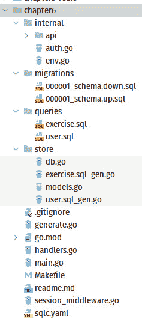
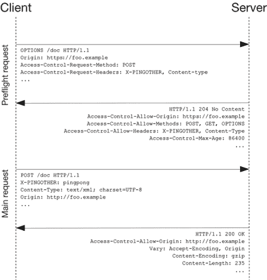

# 6

# 转向 API 优先

在前面的章节中，我们学习了如何构建数据库、向应用程序添加监控、使用中间件以及处理会话。在本章中，我们将学习如何在我们的应用程序中构建 API，以及为什么 API 是编写应用程序的重要部分，因为它构成了前端和后端之间的接口。首先构建 API 很重要，因为它形成了数据交换的桥梁，可以将其视为前端和后端之间的合同。在构建应用程序之前，拥有正确和正确的合同形式很重要。

我们还将探讨 REST 和 JSON 的概念，以更好地理解它们是什么以及如何在我们的应用程序中应用。

在完成本章后，你将了解如何使用 Gorilla Mux 设计 REST API，以及如何通过将数据转换为 JSON 和从 JSON 转换回来来处理请求以执行操作。你还将学习如何处理错误。

在本章中，我们将涵盖以下主题：

+   结构化 API 优先应用程序

+   暴露 REST API

+   使用 Go 将数据转换为 JSON 以及从 JSON 转换回来

+   使用 JSON 进行错误处理

# 技术要求

本章中解释的所有源代码都可以从[`github.com/PacktPublishing/Full-Stack-Web-Development-with-Go/tree/main/Chapter06`](https://github.com/PacktPublishing/Full-Stack-Web-Development-with-Go/tree/main/Chapter06)获取。

# 结构化应用程序

Go 应用程序在目录内结构化，每个目录包含对应用程序有意义的 Go 源代码。有多种方式可以在不同的目录中结构化你的 Go 应用程序；然而，你必须记住的是，始终给目录起一个易于他人理解的名字。随着应用程序随着时间的推移而增长，所选的目录结构和代码放置的位置对其他开发人员如何轻松地与代码库一起工作有重大影响。

## 定义包

到目前为止，我们保持事情相对简单，但我们将提高我们的水平，转向一个相当常见的布局。我们不会使用“标准布局”这个术语，因为在 Go 中并没有这样的东西，但我们将查看我们如何构建我们的新项目，并讨论我们如何通过最佳结构化我们的 Go 应用程序来推理它们，以便清晰和易于理解，如图*6**.1*所示。



图 6.1：第六章包结构

让我们更详细地检查一些这些文件，以了解这些决策。

### generate.go

如果你查看这个文件，一开始可能会觉得有些混乱，但我们使用了一个叫做`go generate`的整洁的 Go 特性，它可以提供帮助：

```go
package main
//go:generate echo Generating SQL Schemas
//go:generate sqlc generate
```

乍一看，它看起来像一条注释，因为 Go 中的注释以 `//` 字符开始。然而，这个以单词 `go:generate` 开始。这被称为 `go:generate` 指令；这意味着当执行 `go generate`（如下面的代码块所示）时，它将执行指定的命令——在我们的例子中，它将打印文本 `Generating SQL Schemas` 并执行 sqlc 命令行工具（`sqlc generate`）：

```go
$ go generate
Generating SQL Schemas
$
```

这是一个有用的技术，可以轻松地生成你的构建前提条件；这可以作为你的工作流程的一部分来完成，由 `Makefile` 执行，或者由 CI/CD 执行。`Makefile` 是一个包含规则集的文件，用于确定程序哪些部分需要编译以及编译源代码时使用什么命令。它可以用来编译各种编程语言的源代码。

在我们的 `generate.go` 文件中，我们只是确保为 sqlc 生成最新的模式文件。我们可以添加模拟生成、更多的信息性消息，或者生成存档或其他任何可能构成我们构建的有用事物。

### handlers.go

这个名字纯粹来源于我们使用相同命名模式的经验，即根据其中定义的功能来命名文件。我们的 `handlers` 文件提供了一个单一的位置（目前是这样），我们的 HTTP 处理器可以在这里找到。我们的包含登录、注销以及与我们的应用程序交互所需的所有类型的处理程序及其请求和响应类型。我们在这个文件中不做任何超出处理程序的事情；所有连接性和中间件的添加都是作为 `main.go` 的一部分来执行的，以确保关注点的分离。

### internal/

在 Go 的“旧时代”——在 1.0 版本发布之前——Go 源代码中有一个名为 `pkg` 的目录，它是仅限内部使用的代码，成为社区的习惯用语，同时也是标记子目录/包为特定项目内部的方式。

`pkg` 文件夹最终被从 Go 项目中移除，但它留下了一丝未满足的需求，因此创建了 `internal` 目录。`internal` 是一个特殊的目录，因为它被 Go 工具本身所识别，这允许作者限制导入包，除非它们共享一个共同的祖先。为了演示这一点，我们将我们的 API 包以及 `env.go`（用于简化在应用程序中读取环境变量的方式）和 `auth.go`（我们处理授权的特定方式）存储在这里——特别是 `auth.go` 或 `handlers.go` 文件是防止他人导入的好选择，而像 `env` 包这样的其他包则更为通用，可以将其移动到更高层次。

### 迁移、查询和存储

使用 `sqlc` 和 `golang-migrate`，我们为自己在使事情易于组织和提高快速创建应用程序的能力方面提供了优势。我们只是将事物分开，使生活变得更容易，正如这里所示的 `sqlc.yaml` 配置文件所示：

```go
path: store/
schema: migrations/
queries: queries/
```

要了解实际应用中的工作原理，请查看仓库中提供的`readme`文件。

我们已经通过将应用程序的不同部分分别放入不同的文件夹来研究了应用程序的结构化。将源代码分组到不同的文件夹中，使得在维护和开发过程中更容易导航应用程序。在下一节中，我们将探讨构建一个用于消费数据的 API。

# 暴露我们的 REST API

让我们了解一些在本节中将要使用到的概念：

+   REST – `https://what-ever-shop.com/orders/1`。

+   使用 JSON 作为交换格式 – 例如，对`https://what-ever-shop.com/orders/1`的`GET`请求可能会返回以下响应体：

    ```go
    GET, POST, PUT, PATCH, and DELETE.
    ```

+   API – **API**是**应用程序编程接口**（Application Programming Interface）的缩写，是一种软件中介，允许两个应用程序相互通信。例如，如果你正在使用谷歌搜索引擎，你正在使用它提供的 API。

结合上述两个概念，我们得到了 REST API，我们正在构建的软件被称为 RESTful API，这意味着我们提供的 API 可以使用 REST 进行访问。

在本节中，我们将探讨暴露我们的 RESTful 处理器，这是一种 API 服务器的模式，并讨论我们的新`middleware.Main`会话和 API 包。

我们对新的 API-first 项目进行了一些重构。我们将 API 服务器抽象为`internal/api`中的独立包。其责任是提供一个服务器，该服务器接受一个要绑定的端口，并具有启动服务器、停止服务器和添加带有可选中间件的路由的能力。

以下是从`chapter06/main.go`中提取的我们的新主函数片段，展示了这种方法：

```go
     1    func main() {
     2        ...
     3        server := api.NewServer(internal.GetAsInt(
                                      "SERVER_PORT", 9002))
     4
     5        server.MustStart()
     6        defer server.Stop()
     7
     8        defaultMiddleware := []mux.MiddlewareFunc{
     9            api.JSONMiddleware,
    10            api.CORSMiddleware(internal.GetAsSlice(
                      "CORS_WHITELIST",
    11                []string{
    12                    "http://localhost:9000",
    13                    "http://0.0.0.0:9000",
    14                }, ","),
    15            ),
    16        }
    17
    18        // Handlers
    19        server.AddRoute("/login", handleLogin(db),
                http.MethodPost, defaultMiddleware...)
    20        server.AddRoute("/logout", handleLogout(),
                http.MethodGet, defaultMiddleware...)
    21
    22        // Our session protected middleware
    23        protectedMiddleware :=
                append(defaultMiddleware,
                       validCookieMiddleware(db))
    24        server.AddRoute("/checkSecret",
                 checkSecret(db), http.MethodGet,
                 protectedMiddleware...)
    25
    26        ...
    27    }
```

仔细注意我们是如何创建默认中间件的，它声明在`defaultMiddleware`变量（第 8 行）中。对于我们的受保护路由，我们将`protectedMiddleware`变量（第 23 行）追加到现有的`defaultMiddleware`变量中。我们的自定义会话验证中间件被添加到中间件链中（第 23 行），以确保在允许访问我们的其他处理器之前进行有效的登录。

我们还向这个`api`包中推入了两种类型的中间件，`JSONMiddleware`（第 9 行）和`CORSMiddleware`（第 10 行），它接受一个字符串切片作为**CORS**允许列表，我们将在下一节中更深入地探讨。

## 跨源资源共享（CORS）

任何使用 API 优先应用程序的人都会遇到 CORS 的概念。这是现代浏览器的一个安全特性，确保一个域上的 Web 应用程序有权限请求不同源上的 API。它是通过执行所谓的预检请求来做到这一点的，这基本上就是一个普通的`OPTIONS`请求。这会返回信息，告诉我们的应用程序它被允许与 API 端点通信，以及它支持的方法和源。源包含客户端在`origin`头中发送的相同域名，或者它可能是一个通配符（`*`），这意味着所有源都被允许，如*图 6.2*所示。



图 6.2：CORS 流程（来源：Mozilla MDN，授权于 Creative Commons）

我们的中间件包装了 Gorilla Mux CORS 中间件，使我们更容易提供我们的 CORS 白名单域名（我们愿意响应请求的域名）以及这些域的所有 HTTP 方法。

## JSON 中间件

另一个功能上需要的中间件是 JSON 中间件，用于强制执行我们为 API 应用程序设定的要求。**JSON**，即**JavaScript 对象表示法**，是一个开放标准文件格式，用于以键值对和数组的形式表示数据。

JSON 中间件使用 HTTP 头检查请求中发送的数据类型。它检查`Content-Type`头键，该键应该包含`application/json`值。

如果它找不到所需的值，那么中间件将检查`Accept`头的值，看看是否可以找到`application/json`值。一旦检查完成并且找不到它正在寻找的值，它就会回复说这不是我们工作的合适内容类型。我们还添加了该头到我们的`ResponseWriter`中，这样我们就可以确保我们告诉消费者我们只支持 JSON，并将它发送回他们。

以下代码片段显示了 JSON 中间件：

```go
     1    func JSONMiddleware(next http.Handler)
            http.Handler {
     2        return http.HandlerFunc(func(wr
                http.ResponseWriter, req *http.Request) {
     3            contentType :=
                    req.Header.Get("Content-Type")
     4
     5            if strings.TrimSpace(contentType) == "" {
     6                var parseError error
     7                contentType, _, parseError =
                        mime.ParseMediaType(contentType)
     8                if parseError != nil {
     9                    JSONError(wr,
                            http.StatusBadRequest,
                            "Bad or no content-type header
                             found")
    10                    return
    11                }
    12            }
    13
    14            if contentType != "application/json" {
    15                JSONError(wr,
                        http.StatusUnsupportedMediaType,
                        "Content-Type not
                         application/json")
    16                return
    17            }
    18            // Tell the client we're talking JSON as
                  // well.
    19            wr.Header().Add("Content-Type",
                                  "application/json")
    20            next.ServeHTTP(wr, req)
    21        })
    22    }
```

第 14 行检查 Content-Type 头是否包含`application/json`值；如果不是，它将作为响应的一部分返回错误（第 15 行）。

现在我们已经理解了中间件的概念，我们将开发一些中间件来简化我们的会话处理。

## 会话中间件

这个会话中间件不适合我们的`api`包，因为它与我们的会话处理功能紧密相关，如下面的代码片段所示：

```go
     1    session, err := cookieStore.Get(req,
                                          "session-name")
     2    if err != nil {
     3       api.JSONError(wr,
                           http.StatusInternalServerError,
                           "Session Error")
     4       return
     5    }
     6
     7    userID, userIDOK :=
            session.Values["userID"].(int64)
     8    isAuthd, isAuthdOK :=
            session.Values["userAuthenticated"].(bool)
     9    if !userIDOK || !isAuthdOK {
    10       api.JSONError(wr,
               http.StatusInternalServerError,
               "Session Error")
    11       return
    12    }
    13
    14    if !isAuthd || userID < 1 {
    15       api.JSONError(wr, http.StatusForbidden,
                           "Bad Credentials")
    16       return
    17    }
    18    ...
    19    ctx := context.WithValue(req.Context(),
                                   SessionKey, UserSession{
    20       UserID: user.UserID,
    21    })
    22    h.ServeHTTP(wr, req.WithContext(ctx))
    23
```

前面的中间件所做的是尝试从`cookiestore`（第 1 行）中检索我们的会话，这部分我们在上一章中已经讨论过。从返回的会话映射中，我们在第 7 行对两个值进行断言，将`userID`赋值为`int64`类型，以及布尔值`userIDOK`。

最后，如果一切检查无误，包括对用户数据库的检查，我们使用 `context.WithValue()`（第 19 行）提供一个带有我们的 `sessionKey` 的新上下文，这是我们包中唯一的类型。

然后，我们提供了一个简单的函数 `userFromSession`，我们的处理程序可以调用它来检查键类型的有效性和传入的会话数据。

在本节中，我们学习了中间件，并探讨了向应用程序添加不同类型的中间件。我们还探讨了 CORS 以及在开发 Web 应用程序时它的工作方式。在下一节中，我们将更详细地探讨 JSON，并使用模型来表示请求和响应的 JSON。

# 转换为和从 JSON

在本节中，我们将探讨从和向 JSON 获取和发送数据。我们还将探讨创建一个结构来处理数据以及如何进行 JSON 转换。

在使用 Golang 标准库处理 JSON 时，我们有两个主要选项——`json.Marshal/Unmarshal` 和 `json.NewEncoder(io.Writer)/NewDecoder(io.Reader)`。在本章中，我们将探讨使用 `Encoder`/`Decoder` 方法。使用这些方法的原因在于我们可以将一个函数链接到返回的编码器/解码器上，并轻松地调用 `.Encode` 和 `.Decode` 函数。这种方法的另一个好处是它使用了流式接口（即 `io.Reader` 和 `io.Writer`，用于表示可以从中读取或写入字节流的对象——`Reader` 和 `Writer` 接口被标准库中的许多实用程序和函数作为输入和输出接受），因此我们除了 `Marshal`（它使用预分配的字节）之外还有其他选择，这意味着我们在分配上更加高效，而且速度也更快。

## 定义请求模型

在我们的应用程序中流动的数据将被封装在一个结构体中。结构体是一个定义用来保存数据的结构。这使得在不同部分之间传输数据变得更加容易；如果你需要将 10 个不同的数据片段传输到应用程序的不同部分，通过调用一个带有 10 个参数的函数来做这件事是没有意义的，但如果它在一个结构体内部，该函数只需要接受一个该类型的参数。为了简单起见，保存数据的结构体也被称为模型，因为结构体内部定义的字段是根据它所表示的数据来建模的。

让我们看看以下代码中定义的用于封装登录数据（用户名和密码）的模型：

```go
func handleLogin(db *sql.DB) http.HandlerFunc {
 return http.HandlerFunc(func(wr http.ResponseWriter, req    *http.Request) {
   type loginRequest struct {
    Username string `json:"username"`
    Password string `json:"password"`
   }
  ...
}
```

如前述代码所示，`loginRequest` 模型使用 `json:"username"` 定义声明。这告诉标准库 JSON 转换器以下内容：

+   `username` – 转换为 JSON 字符串时使用的键名

+   `omitempty` – 如果值是空的，则该键将不会包含在 JSON 字符串中

更多信息可以在[`pkg.go.dev/encoding/json#Marshal`](https://pkg.go.dev/encoding/json#Marshal)找到，在那里您可以查看模型可以具有的不同配置，以从/转换为 JSON。

现在我们已经在函数内部定义了模型，我们想要使用它。`handleLogin`函数使用存在于`json`标准库中的`Decode`函数来解码数据，如下面的代码片段所示：

```go
payload := loginRequest{}
if err := json.NewDecoder(req.Body).Decode(&payload); err != nil {
 ...
}
```

一旦成功转换，代码可以使用`payload`变量来访问作为 HTTP 请求一部分传递的值。

让我们看看代码定义的另一个模型，用于存储用户传递的锻炼集合信息。将数据转换为`newSetRequest`的方式与`loginRequest`相同，使用`Decode`函数：

```go
   1    func handleAddSet(db *sql.DB) http.HandlerFunc {
   2     return http.HandlerFunc(func(wr
           http.ResponseWriter,
           req *http.Request) {
   3
   4       ...
   5
   6       type newSetRequest struct {
   7        ExerciseName string
             `json:"exercise_name,omitempty"`
   8        Weight    int  `json:"weight,omitempty"`
   9       }
  10
  11       payload := newSetRequest{}
  12       if err := json.NewDecoder(req.Body)
             .Decode(&payload); err != nil {
  13         ...
  14        return
  15       }
  16
  17       ...
  18     })
  19    }
  20
```

函数声明了一个新的结构体（第 6 行）称为`newSetRequest`，它将通过调用`json.NewDecoder()`函数（第 12 行）来填充，该函数将填充到`payload`（第 11 行）变量中。

在本节中，我们查看使用模型来托管用户传递的信息。在下一节中，我们将查看使用模型发送响应。

## 定义响应模型

在本节中，我们将查看如何使用模型来托管将作为响应发送给用户的信息。在*第一章*，*构建数据库和模型*中，我们学习了 sqlc 工具，它生成我们将要使用应用程序的不同数据库模型。我们将使用 sqlc 定义的相同数据库模型，将其转换为 JSON 字符串作为对用户的响应。`json`包库足够智能，可以将模型转换为 JSON 字符串。

让我们看看当用户创建一个新的锻炼计划时返回的响应——在这个例子中，是`handleAddSet`函数，如下所示：

```go
func handleAddSet(db *sql.DB) http.HandlerFunc {
 return http.HandlerFunc(func(wr http.ResponseWriter,
                              req *http.Request) {
   ...
   set, err :=
     querier.CreateDefaultSetForExercise(req.Context(),
       store.CreateDefaultSetForExerciseParams{
      WorkoutID:  int64(workoutID),
      ExerciseName: payload.ExerciseName,
      Weight:    int32(payload.Weight),
    })
   ...
   json.NewEncoder(wr).Encode(&set)
 })
}
```

如您所见，函数调用了`CreateDefaultSetForExercise`函数，并使用`set`变量作为响应通过`Encode`函数发送给用户。返回的`set`变量是`GowebappSet`类型，其定义如下：

```go
type GowebappSet struct {
 SetID    int64 `json:"set_id"`
 WorkoutID  int64 `json:"workout_id"`
 ExerciseName string `json:"exercise_name"`
 Weight    int32 `json:"weight"`
 Set1     int64 `json:"set1"`
 Set2     int64 `json:"set2"`
 Set3     int64 `json:"set3"`
}
```

当模型使用`Encode`转换并发送作为响应时，它将看起来是这样的：

```go
{
 "set_id": 1,
 "workout_id": 1,
 "exercise_name": "Barbell",
 "weight": 700,
 "set1": 0,
 "set2": 0,
 "set3": 0
}
```

在本节中，我们查看了一个由 sqlc 生成的模型，它不仅用于在数据库中读取/写入数据，而且还用于将响应作为 JSON 字符串发送给用户。在下一节中，我们将探讨需要添加到应用程序中的另一个重要功能，即错误处理，它将使用 JSON 进行报告。

# 使用 JSON 报告错误

在编写 Web 应用程序时，处理错误有许多方法。在我们的示例应用程序中，我们处理错误以通知用户他们的请求发生了什么。在向用户报告关于他们请求的错误时，请记住不要过多地暴露有关系统正在发生的事情的信息。以下是一些包含此类信息的错误消息示例，报告给用户：

+   与数据库存在连接错误

+   用户名和密码无法用于连接到数据库

+   用户名验证失败

+   密码无法转换为纯文本

上述 JSON 错误用例通常用于需要向前端提供更多信息以通知用户的情况。也可以使用包含错误代码的更简单的错误消息。

## 使用 JSONError

标准化错误信息与编写正确的代码一样重要，以确保应用程序的可维护性。同时，它使得在调试时其他人更容易阅读和理解你的代码。

在我们的示例应用程序中，我们将使用 JSON 来封装报告给用户的错误消息。这确保了错误格式和内容的一致性。以下代码片段可以在 `internal/api/wrappers.go` 文件中找到：

```go
   1    func JSONError(wr http.ResponseWriter,
          errorCode int, errorMessages ...string) {
   2     wr.WriteHeader(errorCode)
   3     if len(errorMessages) > 1 {
   4       json.NewEncoder(wr).Encode(struct {
   5        Status string  `json:"status,omitempty"`
   6        Errors []string `json:"errors,omitempty"`
   7       }{
   8        Status: fmt.Sprintf("%d / %s", errorCode,
              http.StatusText(errorCode)),
   9        Errors: errorMessages,
  10       })
  11       return
  12     }
  13
  14     json.NewEncoder(wr).Encode(struct {
  15       Status string `json:"status,omitempty"`
  16       Error string `json:"error,omitempty"`
  17     }{
  18       Status: fmt.Sprintf("%d / %s", errorCode,
             http.StatusText(errorCode)),
  19       Error: errorMessages[0],
  20     })
  21    }
```

`JSONError` 函数将使用传递的 `errorCode` 参数和 `errorMessages(line 1)` 作为报告给用户的 JSON 的一部分——例如，假设我们使用以下 cURL 命令调用 `/login` 端点，使用错误的凭据：

```go
curl http://localhost:9002/login -H 'Content-Type: application/json' -X POST -d '{"username" : "user@user", "password" : "wrongpassword"}
```

你将得到以下 JSON 错误消息：

```go
{"status":"403 / Forbidden","error":"Bad Credentials"}
```

错误是通过使用在编码 JSON 字符串时定义的结构体构建的（第 14 行）。

## 使用 JSONMessage

样本应用程序不仅使用 JSON 报告错误消息，还用于报告成功消息。让我们看看成功消息的输出。使用以下 cURL 命令登录：

```go
curl http://localhost:9002/login -v -H 'Content-Type: application/json' -X POST -d '{"username" : "user@user", "password" : "password"}'
```

你将得到如下输出的结果：

```go
*  Trying ::1:9002...
* TCP_NODELAY set
* Connected to localhost (::1) port 9002 (#0)
> POST /login HTTP/1.1
> Host: localhost:9002
…
< Set-Cookie: session-name=MTY0NTM0OTI1OXxEdi1CQkFFQ180SUFBUkFCRUFBQVJQLUNBQUlHYzNSeWFXNW5EQk1BRVhWelpYSkJkWFJvWlc1MGFXTmhkR1ZrQkdKdmIyd0NBZ0FCQm5OMGNtbHVad3dJQUFaMWMyVnlTVVFGYVc1ME5qUUVBZ0FDfHMy75qzLVPoMZ3BbNY17qBWd_puOhl6jpgY-d29ULUV; Path=/; Expires=Sun, 20 Feb 2022 09:42:39 GMT; Max-Age=900; HttpOnly
…
* Connection #0 to host localhost left intact
```

使用 `session-name` 令牌，使用以下 cURL 命令创建一个锻炼：

```go
curl http://localhost:9002/workout -H 'Content-Type: application/json' -X POST --cookie 'session-name=MTY0NTM0OTI1OXxEdi1CQkFFQ180SUFBUkFCRUFBQVJQLUNBQUlHYzNSeWFXNW 5EQk1BRVhWelpYSkJkWFJvWlc1MGFXTmhkR1ZrQkdKdmIyd0NBZ0FCQm5OM
GNtbHVad3dJQUFaMWMyVnlTVVFGYVc1ME5qUUVBZ0FDfHMy75qzLVPoMZ3BbNY 17qBWd_puOhl6jpgY-d29ULUV'
```

在成功创建锻炼后，你将看到如下 JSON 消息：

```go
{"workout_id":3,"user_id":1,"start_date":"2022-02-20T09:29:25.406523Z"}
```

# 摘要

在本章中，我们探讨了创建和利用我们自己的中间件来处理会话以及在我们的 API 上强制使用 JSON，我们还重构了我们的项目以使用通用的包布局，以帮助我们分离关注点并为未来的工作和迭代做好准备。

在本章中，我们还介绍了一些辅助函数，包括两个用于通过 JSON 和 API 包创建和报告错误和消息给用户的函数，以及一个用于抽象我们的服务器处理，使其易于理解并为我们适应 CORS 做好准备的函数。

在下一章中，我们将更详细地讨论编写前端，并学习如何使用前端框架编写前端应用程序。

# 第三部分：使用 Vue 和 Go 的单页应用程序

在 *第三部分* 中，我们在深入了解如何将 Vue 与 Go 结合以及探索不同的前端技术来为我们的示例应用程序提供动力之前，介绍了前端框架。我们将探讨实现 **跨源资源共享** (**CORS**) 以及在我们的应用程序中使用 JWT 进行会话，以简化并保护我们的应用程序免受恶意行为者的影响！

本部分包括以下章节：

+   *第七章**，前端框架*

+   *第八章**，前端库*

+   *第九章**，Tailwind，中间件和 CORS*

+   *第十章**，会话管理*
