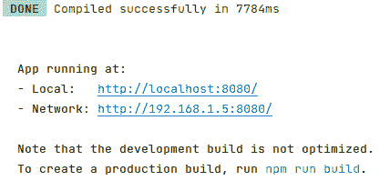
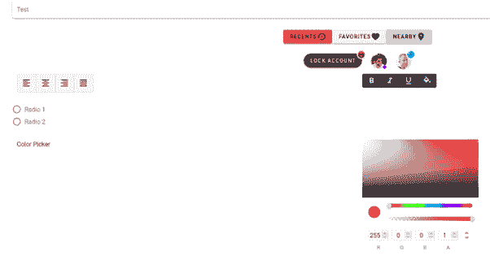
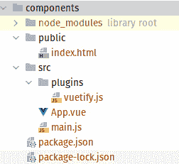
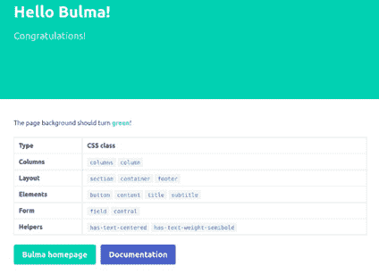
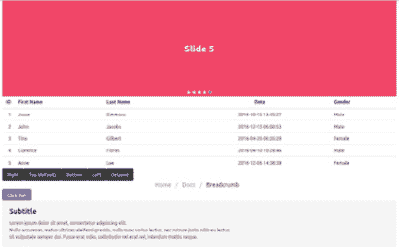
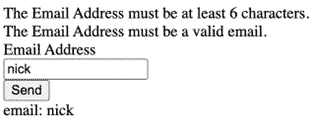
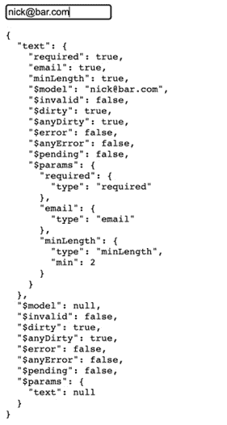
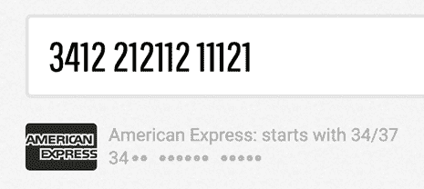
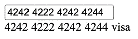

# 第八章：前端库

在上一章中，我们探讨了构建前端应用程序的不同框架。在本章中，我们将探讨对构建网络应用程序有用的不同前端库。前端库是预定义的函数和类，可以在构建前端应用程序时提供功能，否则我们可能需要自己构建和开发。在本章中，我们将探讨以下库：

+   `Vuetify`

+   `Buefy`

+   `Vuelidate`

+   `Cleave.js`

完成本章后，你将探索以下内容：

+   使用 `Vuelidate` 验证数据

+   使用 `Cleave.js` 进行更好的输入处理

+   使用 `Vuetify` 处理不同的 UI 组件

# 技术要求

本章中解释的所有源代码都可以在[`github.com/PacktPublishing/Full-Stack-Web-Development-with-Go/tree/main/Chapter08`](https://github.com/PacktPublishing/Full-Stack-Web-Development-with-Go/tree/main/Chapter08)中检出。

确保你已经按照以下链接中提供的 `node.js` 文档说明在你的本地机器上安装了所有必要的工具：[`docs.npmjs.com/downloading-and-installing-node-js-and-npm`](https://docs.npmjs.com/downloading-and-installing-node-js-and-npm)。

本章中，将有使用 [codesandbox.io](http://codesandbox.io) 和 [jsfiddle.net](http://jsfiddle.net) 分享的示例代码，这将使你更容易进行实验。

让我们通过下一节了解 Vuetify 来开始我们的旅程。

# 理解 Vuetify

在*第七章*“前端框架”中，我们学习了 Vue 框架，这是一个丰富的前端框架，它允许前端代码易于扩展和维护。Vuetify ([`vuetifyjs.com`](https://vuetifyjs.com)) 提供了许多用户界面组件，可以直接用于应用程序。该框架还允许开发者根据需要定制用户界面。

在本节中，我们将了解 Vuetify，这是一个基于 Vue 构建的 Material 设计框架。Material 是由 Google 在其网络应用和 Android 应用中推广的设计语言 – 你可以在[`m3.material.io/`](https://m3.material.io/)上了解更多信息 – 并且是一个非常受欢迎的选择。

# 设置 Vuetify

我们将查看 `chapter08/vuetify/components` 目录内的示例代码。示例代码演示了如何使用 `Vuetify` 框架。在运行示例代码之前，请确保你从 `chapter08/vuetify/components` 目录中运行以下命令来安装所有必要的组件：

```go
npm install
```

安装完成后，使用以下命令运行示例代码：

```go
npx vue-cli-service serve
```

一旦服务器启动并运行，你将得到如图 8**.1** 所示的输出：



图 8.1：运行 npx 的输出

您可以使用输出中指定的 URL 访问应用程序——例如，http://localhost:8080。*图 8.2*显示了应用程序的输出：



图 8.2：示例应用的输出

示例应用程序显示了 Vuetify 内部可用的不同组件。如您所见，除了单选按钮组和颜色选择器之外，还有许多其他组件。

在下一节中，我们将探讨如何在示例应用程序中使用 Vuetify 以及如何连接各个部分。

# 使用 UI 组件

Vuetify 提供了许多组件，但在这个部分，我们将只讨论其中的一些，以便了解如何使用它们。示例代码使用了颜色选择器、按钮、徽章等组件。

*图 8.3*显示了示例的目录结构。所有源文件都位于`src/`文件夹中：



图 8.3：Vuetify 示例应用的目录结构

初始化 Vue 和 Vuetify 的`main.js`宿主代码如下片段所示：

```go
import Vue from 'vue'
import App from './App.vue'
import vuetify from './plugins/vuetify';
Vue.config.productionTip = false
new Vue({
 vuetify,
 render: h => h(App)
}).$mount('#app')
```

代码看起来像任何其他基于 Vue 的应用程序，除了它添加了从`plugins/vuetify`目录导入的 Vuetify 框架，如本片段所示：

```go
import Vue from 'vue';
import Vuetify from 'vuetify/lib/framework';
Vue.use(Vuetify);
export default new Vuetify({});
```

Vuetify 通过`Vue.use()`函数调用作为插件初始化，并导出以供代码的其他部分使用。

现在初始化已完成，让我们看看示例是如何使用 Vuetify 组件的。这里从`App.vue`中的代码片段显示了示例代码如何使用 Vuetify 的颜色选择器组件：

```go
<template>
 <v-app>
   <v-container>
    ...
     <v-row>
       <v-col>
         Color Picker
       </v-col>
       <v-col>
         <v-color-picker/>
       </v-col>
     </v-row>
   </v-container>
 </v-app>
</template>
```

在片段中可以看到的标签——`<v-row>`、`<v-col>`、`<v-container>`等——都是 Vuetify 组件。组件可以通过可用的属性进行配置；例如，如果我们查看`<v-row>`的组件文档([`vuetifyjs.com/en/api/v-row/#props`](https://vuetifyjs.com/en/api/v-row/#props))，我们可以看到我们可以设置不同的参数，例如对齐。

在本节中，我们了解了 Vuetify 及其组件的使用方法，以及如何将它们连接起来以在 Vue 应用程序中使用。在下一节中，我们将探讨与 Vuetify 相比更轻量级的不同用户界面库。下一节我们将从 Buefy 开始。

# 理解 Buefy

Buefy 是建立在 Bulma 之上的另一个用户界面框架。Bulma([`bulma.io/`](https://bulma.io/))是一个开源 CSS 项目，为 HTML 元素提供不同类型的样式；CSS 文件可以在以下链接查看：[`github.com/jgthms/bulma/blob/master/css/bulma.css`](https://github.com/jgthms/bulma/blob/master/css/bulma.css)。

让我们快速查看一个使用 Bulma CSS 的网页示例。这将让我们更好地了解 Bulma 是什么，以及 Buefy 是如何使用它的。

# Bulma 示例

在您的浏览器中打开示例文件`chapter08/bulma/bulma_sample.xhtml`，HTML 页面将看起来像*图 8.4*：



图 8.4：Bulma 示例页面

以下代码片段显示了网页中使用的 Bulma CSS 文件：

```go
<head>
   ...
   <link rel="stylesheet" href=
      "https://cdn.jsdelivr.net/npm/bulma@0.9.3/css/
       bulma.min.css">
</head>
```

网页使用 Bulma CSS 样式化的不同 HTML 元素标签，如下面的代码片段所示：

```go
<section class="hero is-medium is-primary">
   <div class="hero-body">
       <div class="container">
           <div class="columns">
               ...
           </div>
       </div>
   </div>
</section>
<section class="section">
   <div class="container">
       <div class="columns">
           <div class="column is-8-desktop
                       is-offset-2-desktop">
               <div class="content">
                   ...
               </div>
           </div>
       </div>
   </div>
</section>
```

现在我们已经了解了 Bulma 是什么以及如何将其用于网页，我们将在下一节中查看如何设置 Buefy。

# 设置 Buefy

我们将查看位于`chapter8/buefy`目录中的 Buefy 示例。请确保您位于该目录中，并运行以下命令：

```go
npm install
npx vue-cli-service serve
```

在您的浏览器中打开服务器，您将看到类似于*图 8.5*的输出：



图 8.5：Buefy 示例输出

# UI 组件

网页显示了 Buefy 中可用的不同组件，例如滑块、带下拉菜单的可点击按钮和面包屑。

初始化 Buefy 与初始化任何其他 Vue 插件相同。它看起来与我们在上一节中查看 Vuetify 时看到的一样。代码将通过使用`Vue.use(Buefy)`初始化 Vue：

```go
import Vue from 'vue'
import App from './App.vue'
import Buefy from "buefy";
Vue.use(Buefy);
new Vue({
 render: h => h(App)
}).$mount('#app')
```

我们在示例应用程序中使用的一个组件是`carousel`，它显示一个类似于幻灯片的用户界面。要创建`carousel`，只需几行代码，如下面的代码片段所示，使用`<b-carousel>`标签：

```go
<!--example from https://buefy.org/documentation-->
<template>
 <section>
   <div class="container">
     <b-carousel>
       <b-carousel-item v-for="(carousel, i) in carousels"
        :key="i">
         <section :class="`hero is-medium
                           is-${carousel.color}`">
           <div class="hero-body has-text-centered">
             <h1 class="title">{{ carousel.text }}</h1>
           </div>
         </section>
       </b-carousel-item>
     </b-carousel>
   </div>
...
 </section>
</template>
```

类似于`carousel`，Buefy 提供了许多不同的预构建组件，可以帮助设计复杂用户界面。

在下一节中，我们将探讨如何使用 Vuelidate 库来验证我们在用户界面中捕获和展示的数据，以确保我们正确地解释了客户的数据。

# 使用 Vuelidate 验证数据输入

如果您的应用程序有任何交互功能，它很可能会处理用户输入的数据，这意味着您必须检查用户提供的输入是否有效。

输入验证库可以用来确保用户只输入有效数据，并在数据接收时立即提供反馈。这意味着我们在用户点击输入字段时就开始验证！

我们将探索前端中的 HTML 表单验证以及输入和值验证之间的区别。同样重要的是要注意，无论前端验证如何，它都不能替代后端和 API 端点的验证。我们在前端的目标是防止用户犯错误；然而，您永远无法阻止坏人向您的应用程序提交不良数据。

我们可以通过两个角度来观察前端验证，因为市面上有无数种解决方案，但我们将对比两种选项并展示一个可行的解决方案——第一个是验证输入，另一个是验证值。

如果我们只想验证输入，我们可以使用 `vee-validate` 库，它通过让你在代码的 `<template>` 中编写规则来实现。例如，请看以下内容：

```go
<script>
Vue.use(VeeValidate);
var app = new Vue({
  el: '#app',
  data: {
    email: '',
  },
  methods: {
    onSubmit: function(scope) {
      this.errors.clear(scope);
      this.$validator.validateAll(scope);
    }
  }
});
</script>
<template>
<div>
  <form v-on:submit.prevent="onSubmit('scope')">
    <div>
      <div v-for="error in errors.all('scope')">
        {{error}}
      </div>
    </div>
    <div>
      <label>Email Address</label>
      <input type="text" v-model="email"
        name="Email Address" v-validate data-scope="scope"
        data-rules="required|min:6|email">
    </div>
    <div>
      <button type="submit">
        Send
      </button>
    </div>
  </form>
  <div class="debug">
    email: {{email}}<br>
  </div>
</div>
</template>
```

这种内联验证——在我们提交数据时执行 `ValidateAll()`——将允许我们使用预定义的规则来验证数据内容，例如字段是必需的、其最小长度，或者它必须是一个有效的电子邮件 ID 等。如果输入了无效数据，我们可以遍历错误并将它们展示给用户：



图 8.6：验证错误信息

你可以在 JS Playground 网站的 `JSFiddle` 上看到这一点：[`jsfiddle.net/vteudms5/`](https://jsfiddle.net/vteudms5/)。

这对于简单的验证很有用，但当我们想要对值和值的集合添加额外的逻辑，而不仅仅是单个输入时，这就是像 Vuelidate 这样的库变得强大的地方。

使用 Vuelidate，你会注意到验证与我们所编写的模板代码解耦，这与 `vee-validate` 示例中的内联验证不同。这允许我们针对数据模型编写规则，而不是针对模板中的输入。

在 Vuelidate 中，验证结果会生成一个名为 `this.$v` 的验证对象，我们可以用它来验证我们的模型状态。让我们重新构建之前的示例，以展示我们将如何使用 Vuelidate 验证数据——这个示例可以在 [`jsfiddle.net/34gr7vq0/3/`](https://jsfiddle.net/34gr7vq0/3/) 找到：

```go
<script>
Vue.use(window.vuelidate.default)
const { required, minLength,email } = window.validators
new Vue({
    el: "#app",
  data: {
      text: ''
  },
  validations: {
      text: {
        required,
      email,
      minLength: minLength(2)
    }
  },
  methods: {
      status(validation) {
        return {
        error: validation.$error,
        dirty: validation.$dirty
      }
    }
  }
})
</script>
<template>
<div>
  <form>
    <div>
      <label>Email Address</label>
      <input v-model="$v.text.$model"
        :class="status($v.text)">
      <pre>{{ $v }}</pre>
    <div>
  </form>
</div>
</template>
```

生成的输出显示了 `$v` 对象。当你在框中输入时，`required`、`email` 和 `minLength` 字段会被触发。在我们的例子中，当我们输入 nick@bar.com 时，字段值会改变：



图 8.7：JSFiddle 示例的浏览器输出示意图

虽然在风格上与 `vee-validate` 的实现相似，但通过利用 `$v` 对象概念并允许其为验证的来源，我们可以将其连接到多个表单的额外输入，并验证整个集合。例如，如果我们有多个字段，如 `formA` 和 `formB` 中的名称、电子邮件、用户和标签，我们就能创建如下验证：

```go
...
validations: {
  name: { alpha },
  email: { required, email }
  users: {
    minLength: minLength(2)
  },
  tags: {
    maxLength: maxLength(5)
  },
  formA: ['name', 'email'],
  formB: ['users', 'tags']
}
```

Vuelidate 有一个庞大的验证器集合可供导入。这使我们能够访问诸如条件性必需字段；长度验证器；电子邮件、字母/字母数字、正则表达式、十进制、整数和 URL 选项等验证器，以及通过导入 `validators` 库可以访问的更多验证器：

```go
import { required, maxLength, email } from '@vuelidate/validators'
```

完整列表可在 Vuelidate 网站上找到，网址为[`vuelidate-next.netlify.app/validators.xhtml`](https://vuelidate-next.netlify.app/validators.xhtml)。

# 使用 Cleave.JS 进行更好的输入处理

正如我们刚才看到的，以正确的形状和形式从用户那里获取数据可能是一个挑战 - 不论是 YYYY/MM 格式的日期，带有前缀的电话号码，还是其他更结构化的输入类型。

我们之前已经讨论了验证，但你可以通过提供视觉线索和反馈来进一步帮助用户，在他们输入时防止他们因为验证错误而到达终点 - 例如，那些由流行的信用卡和在线支付处理器提供的库。Stripe 在帮助用户正确输入信用卡信息方面做得很好，但对我们预算有限的人来说，我们可以使用 Cleave.js 来获得类似体验。



图 8.7：信用卡验证（图片来自 https://nosir.github.io/cleave.js/）

令人沮丧的是，Vue 不是作为一等公民得到支持，但我们没有理由不能设置这个指令，该指令可在[codesandbox.io](http://codesandbox.io)这里找到 - [`bit.ly/3Ntvv27`](https://bit.ly/3Ntvv27)。*图 8**.8*显示了[`bit.ly/3Ntvv27`](https://bit.ly/3Ntvv27)中验证的工作方式：



图 8.8：codesandbox.io 上我们的 Cleave.js 示例示例

在我的硬编码示例中（CSS 留作你的练习！）它并不那么漂亮，但关键部分是从沙盒示例中如何通过以下方式对`custom-input`进行重载，使用我们的`cleave`指令：

```go
<template>
<div id="app">
  <div>
   <custom-input
    v-cleave="{ creditCard: true,
    onCreditCardTypeChanged: cardChanged, }"
    v-model="ccNumber" />
</div>
<pre>
{{ ccNumber }}
{{ cardType }}
</pre>
</template>
```

在未来，看到 Cleave.js 为 Vue 提供第一方实现将非常棒，但在此之前，存在许多 npm 包可以跳过我们的示例设置，并提供类似的效果，这将使我们能够为用户提供美好的体验。

要跟踪 Cleave.js 官方支持的状态，你可以查看[`github.com/nosir/cleave.js/blob/master/doc/vue.md`](https://github.com/nosir/cleave.js/blob/master/doc/vue.md)。

使用 Cleave.js，我们已经到达了本章的结尾。

# 摘要

在本章中，我们学习了几个前端库和工具，帮助我们更快地迭代代码和设计，以便为我们的产品构建前端用户界面。

我们已经探讨了使用 Vuetify 来创建可定制的用户界面，并探讨了 Buefy，它提供了一个庞大的 UI 组件集合，使我们能够快速构建我们的应用程序。

然后，我们通过介绍和对比使用 Vuelidate 和 VeeValidate 进行输入和值验证，以及最后解释如何使用 Cleave.js 创建更智能的界面来帮助用户理解我们的应用程序期望的内容，结束了本章。

在下一章中，我们将探讨那些将前端和后端连接起来的中间件组件。
