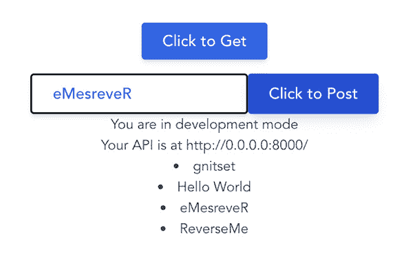

# 9

# Tailwind、中间件和 CORS

在本章中，我们将基于之前介绍的前端原则，引入 Tailwind CSS，探讨我们如何通过前端应用中的 API 消费后端服务，了解我们如何利用中间件来转换我们的 JSON 请求，以及如何提供一个具有用户登录功能的**单页应用**（**SPA**）。

在本章中，我们将涵盖以下主题：

+   使用 Tailwind CSS 框架创建和设计前端应用程序

+   了解如何使用 Vite CLI 创建新的 Vue 应用程序

+   配置我们的 Go 服务以支持 CORS

+   设置 JavaScript Axios 库

+   创建中间件以管理前端和后端之间的 JSON 格式化

# 技术要求

本章中解释的所有源代码都可以在[`github.com/PacktPublishing/Full-Stack-Web-Development-with-Go/tree/main/Chapter09`](https://github.com/PacktPublishing/Full-Stack-Web-Development-with-Go/tree/main/Chapter09)上查看。

# 介绍 Tailwind

在上一章中，我们查看了一些不同的前端框架，以帮助我们更快地开发，但我们一直忽略了一个现代网络生态系统中显而易见的“大象”——Tailwind CSS。

像 Buefy 和 Vuetify 这样的框架有一个主要缺点。由于对更多和更多功能的日益增长的需求，增长和使用，它们成为了自己成功的受害者，最终变得过于庞大，使我们对自己的组件样式控制减少。

了解像 Buefy 这样的框架变得越来越具有挑战性。开发者必须学习数百个类和组件，然后可能只是为了对上游社区没有预想的微小样式调整而重新构建它们。

与其他框架不同，Tailwind 是一个 CSS 框架，它不预先内置类以添加到 HTML 标签中。相反，它采用不同的方法。通过从样式表中移除所有默认样式并使用基于实用性的类来组合和构建您的应用程序，它提供了更低的控制级别。这些基于实用性的类提供了直接操作某些 CSS 属性的方法，例如文本大小、边距、间距、填充和颜色，以及针对移动、桌面和其他视口的交互行为。通过应用不同的 Tailwind 修饰符，我们可以在确保一致样式的同时，对元素的最终外观进行细粒度控制，并在需要构建微小变化时提供简单的解决方案。这真有助于构建我们的 Vue 组件。


图 9.1：按钮示例

创建蓝色按钮的快速示例如下：

```go
<button type="button" class="
 inline-block px-6 py-2.5 bg-blue-600
 text-white font-medium text-lg leading-tight
 rounded shadow-md
 hover:bg-blue-700 hover:shadow-lg
 focus:bg-blue-700 focus:shadow-lg
 focus:outline-none focus:ring-0
 active:bg-blue-800 active:shadow-lg
 transition duration-150 ease-in-out
">Button</button>
```

你可能会对自己说，“哇，对于一个按钮来说，CSS 真的很多，”但当你考虑到 Vue 如何帮助我们构建可重用的 `button`、`link`、`image`、`div` 或 `paragraph` 时，你会这样想。你可以查看官方文档[`tailwindcss.com/docs/utility-first`](https://tailwindcss.com/docs/utility-first)以深入了解“实用优先”CSS 的概念以及各个类的作用。

## 创建一个新的 Tailwind 和 Vite 项目

要创建我们的项目，我们首先将使用 `Vite CLI` 生成它。这将给我们带来熟悉的“`Hello World`”输出，如下所示：


图 9.2：Hello World 网页输出

让我们使用以下命令使用 Vite 创建一个新的 Vue 项目：

```go
npm create vite@latest
```

对于每个提出的问题，请输入此处显示的信息：

```go
✔ Project name: … vue-frontend
✔ Select a framework: › vue
✔ Select a variant: › vue
Scaffolding project in /Users/.../vue-frontend...
Done. Now run:
  cd vue-frontend
  npm install
  npm run dev
$ npm install
$ npm run dev
> vue-frontend@0.0.0 dev
> vite
  vite v2.9.12 dev server running at:
  > Local: http://localhost:3000/
  > Network: use `--host` to expose
  ready in 332ms.
```

访问 `http://localhost:3000` 现在将显示图 9**.2** 的截图。我们的项目启用了“热重载”或“实时重载”，所以当你更改项目代码时，你将在保存文件时看到浏览器中的设计更新。

之前版本的 Tailwind CSS 有一点点以生成大型样式表（3 到 15 MB！）和减慢构建时间为特点。

在 Tailwind CSS 版本 2 时代的末期，团队引入了一个新的**即时编译器**（**JIT**），它会自动生成仅用于样式化设计的必要 CSS。最初这作为一个可选插件提供，但通过减少冗余，带来了巨大的改进，并且有了 JIT，开发中的 CSS 与最终代码相同，这意味着最终构建不需要对 CSS 进行后处理。自从 Tailwind CSS 版本 3 及以上，JIT 编译器在安装 Tailwind CSS 时默认启用，所以我们不需要担心在配置文件中更改任何东西，除了我们需要的布局项目之外。

现在，我们将向我们的项目添加 Tailwind CSS 并对来自 Vue 和 Tailwind 包的脚手架提供的默认 Vue `Hello World` 输出进行一些修改：

```go
$ npm install -D tailwindcss postcss autoprefixer
$ npx tailwindcss init -p
Created Tailwind CSS config file: tailwind.config.js
Created PostCSS config file: postcss.config.js
$ cat << EOF > tailwind.config.js
/** @type {import('tailwindcss').Config} */
module.exports = {
  content: [
    "./index.xhtml",
    "./src/**/*.{vue,js}",
  ],
  theme: {
    extend: {},
  },
  plugins: [],
}
EOF
$ cat << EOF > ./src/tailwind.css
@tailwind base;
@tailwind components;
@tailwind utilities;
EOF
$ cat << EOF > ./src/main.js
import { createApp } from 'vue'
import App from './App.vue'
import './tailwind.css'
createApp(App).mount('#app')
EOF
```

在 `tailwind.css` 文件中，以 `@tailwind` 开头的指令是告诉我们即时编译器应用什么以生成 CSS 的一部分——我们将仅利用基础、组件和实用指令，并将你指引到 Tailwind CSS 官方文档以了解更多信息——[`tailwindcss.com/docs/functions-and-directives`](https://tailwindcss.com/docs/functions-and-directives)。

我们现在可以打开我们的 `HelloWorld.vue` 文件，将其内容替换为以下内容以创建我们的按钮。由于我们的开发服务器仍在运行，所以在你操作 `button` 类时，如果你将文件保存为实时，你应该能够看到变化：

```go
<template>
  <div class="flex space-x-2 justify-center">
    <button
      @click="count++"
      type="button"
      class="inline-block px-6 py-2.5 bg-blue-600
             text-white font-medium text-lg leading-tight
             normal-case rounded shadow-md hover:bg-blue-
             700 hover:shadow-lg focus:bg-blue-700
             focus:shadow-lg focus:outline-none
             focus:ring-0 active:bg-blue-800
             active:shadow-lg transition duration-150
             ease-in-out"
    >
      Click me - my count is {{ count }}
    </button>
  </div>
</template>
```

你最终应该得到类似这样的结果：


图 9.3：点击我按钮

恭喜！您已成功创建了您的第一个 Tailwind 和 Vite 项目。您可以在 `chapter9/tailwind-vite-demo` 文件夹内看到完整的示例。

在下一节中，我们将探讨如何从我们的前端使用我们用 Golang 开发的 API。

# 消费您的 Golang API

我们将在之前的前端示例基础上添加一些功能，以从简单的后端服务中实现 `GET` 和 `POST`。源代码可以在 `chapter9/backend` 文件夹内找到；它主要关注两个简化的函数，这两个函数除了为 `GET` 返回一个固定的字符串外，还基于我们发送的 `POST` 请求返回一个反转的字符串。

`appGET()` 函数提供了执行 `GET` 操作的功能，而 `appPOST()` 函数提供了 `POST` 操作的功能：

```go
func appGET() http.HandlerFunc {
    type ResponseBody struct {
        Message string
    }
    return func(rw http.ResponseWriter, req *http.Request) {
        log.Println("GET", req)
        json.NewEncoder(rw).Encode(ResponseBody{
            Message: "Hello World",
        })
    }
}
func appPOST() http.HandlerFunc {
    type RequestBody struct {
        Inbound string
    }
    type ResponseBody struct {
        OutBound string
    }
    return func(rw http.ResponseWriter, req *http.Request) {
        log.Println("POST", req)
        var rb RequestBody
        if err := json.NewDecoder(req.Body).Decode(&rb);
                  err != nil {
            log.Println("apiAdminPatchUser: Decode
                         failed:", err)
            rw.WriteHeader(http.StatusBadRequest)
            return
        }
        log.Println("We received an inbound value of",
                     rb.Inbound)
        json.NewEncoder(rw).Encode(ResponseBody{
            OutBound: stringutil.Reverse(rb.Inbound),
        })
    }
}
```

我们将使用 `go run server.go` 来启动我们的服务，目的是从我们的前端应用程序中消费这些数据。

我们将在我们的前端应用程序中创建两个实用函数，以便我们能够与之交互，并且我们将基于 Axios 来构建这些函数。Axios 是一个基于 Promise 的浏览器 HTTP 客户端，它抽象了与后端服务交互所需的浏览器特定代码，并在提供跨所有浏览器的单一接口进行网络请求方面做得非常出色，您可以在官方文档中了解更多信息：[`axios-http.com/`](https://axios-http.com/)。

我们将首先安装 `axios`，然后设置我们的 Axios 实例，然后我们可以添加功能层：

```go
$ npm install axios
```

安装了 `axios` 后，您现在将想要创建一个包含以下内容的 `lib/api.js` 文件：

```go
import axios from 'axios';
// Create our "axios" object and export
// to the general namespace. This lets us call it as
// api.post(), api.get() etc
export default axios.create({
  baseURL: import.meta.env.VITE_BASE_API_URL,
  withCredentials: true,
});
```

这里有几个有趣的地方需要注意；第一个是 `baseURL` 值，第二个是 `withCredentials`。

`baseURL` 值是 Axios 用于构建所有后续请求的基础。如果我们使用 `baseURL` 值为 [`www.packtpub.com/`](https://www.packtpub.com/) 调用 `axios.Patch('/foo')`，它将执行一个 `PATCH` 调用到 [`www.packtpub.com/foo`](https://www.packtpub.com/foo)。这是一种在开发和生产之间切换并确保您减少错误的好方法。

但我们是如何使用 `import.meta.env` 的呢？这部分是 Vite 如何导入和暴露环境变量的方式。我们将把我们的 `VITE_BASE_API_URL` 添加到项目根目录下的 `.env` 文件中，包含以下内容：

```go
VITE_BASE_API_URL="http://0.0.0.0:8000"
```

结合这一点和我们的新 `lib/api.js` 文件，我们现在可以从我们的代码中调用 `axios.Put('/test')`，默认情况下，它将引用 http://0.0.0.0:8000/test。您可以在 [`vitejs.dev/guide/env-and-mode.xhtml`](https://vitejs.dev/guide/env-and-mode.xhtml) 了解更多关于 Vite 处理环境变量和更多信息。

另一点需要注意的是 `withCredentials` 属性。此值指示是否应使用诸如 cookies 和授权头之类的凭据进行跨站访问控制请求。

加粗的部分是最有趣的部分。这些展示了我们如何使用 `GET` 和 `POST` 与我们的数据一起使用，使用我们后端服务器上设置的库和 API 调用，以及我们如何在 Vue 模块中绑定数据和引用它。

安全应用的 CORS

```go
import api from '@/lib/api';
export function getFromServer() {
    return api.get(`/`);
}
export function postToServer(data) {
    return api.post(`/`, data );
}
```

现在我们已经使用它来实例化我们的 `axios` 实例，我们可以在我们的前端应用程序的 `src` 文件夹内创建自己的 `api/demo.js` 文件。这个名字可能不是非常原创，但对我们来说很适用：

这里有一个小技巧，就是使用 `@` 导入——这在很多设置中很常见，允许我们快速指定代码的基础路径，使事情保持整洁，并移除到处都有很多 `../..` 的相对/绝对路径。

```go
12:23:46 [vite] Internal server error: Failed to resolve import "@/api/demo" from "src/components/HelloWorld.vue". Does the file exist?
  Plugin: vite:import-analysis
  File: /Users/nickglynn/Projects/Becoming-a-Full-Stack-Go-
        Developer/chapter 9/frontend/src/components/
        HelloWorld.vue
  1  |  import { ref } from 'vue';
  2  |  import * as demoAPI from '@/api/demo';
     |                            ^
  3  |
  4  |  // Sample to show how we can inspect mode
```

还不错！为了解决这个问题，打开你的 `vite.config.js` 文件，并用以下内容替换其内容：

```go
import { defineConfig } from 'vite'
import vue from '@vitejs/plugin-vue'
import path from 'path';
// https://vitejs.dev/config/
export default defineConfig({
  plugins: [vue()],
  // Add the '@' resolver
  resolve: {
    alias: {
      '@': path.resolve(__dirname, 'src'),
    },
  },
})
```

在 *第六章* 中，*转向 API-First*，我们介绍了我们的后端 CORS 中间件。现在我们需要更新我们的新后端服务。它需要响应 `OPTION` 预检请求，正如我们在 *第六章* 中讨论的，*转向 API-First*，还需要确定我们将允许与我们的服务通信的 URL。这是必要的，以确保我们的浏览器不会被欺骗提交/修改来自其他来源的应用程序。

现在所有这些都设置好了，我们将打开我们的 `HelloWorld.vue` 并更新它，目标是创建一个看起来像 *图 9**.4* 的东西。


我们想要这个属性的原因是我们希望所有的 cookie 设置都是一致的，但我们需要确保我们的后端应用理解它，这我们将在稍后讨论。设置 `withCredentials` 对同站请求没有影响。

它不起作用！我们非常接近，但首先，我们必须回顾一下我们之前章节中提到的 CORS。

```go
<script setup>
import { ref } from 'vue';
import * as demoAPI from '@/api/demo';
// Sample to show how we can inspect mode
// and import env variables
const deploymentMode = import.meta.env.MODE;
const myBaseURL = import.meta.env.VITE_BASE_API_URL;
async function getData() {
  const { data } = await demoAPI.getFromServer()
  result.value.push(data.Message)
}
async function postData() {
  const { data } = await demoAPI.postToServer({ Inbound: msg.     value })
  result.value.push(data.OutBound)
}
const result = ref([])
const msg = ref("")
defineProps({
  sampleProp: String,
});
</script>
<template>
  <div class="flex space-2 justify-center">
    <button
      @click="getData()"
      type="button"
      class="inline-block px-6 py-2.5 bg-blue-600
             text-white font-medium text-lg leading-tight
             normal-case rounded shadow-md hover:bg-blue-
             700 hover:shadow-lg focus:bg-blue-700
             focus:shadow-lg focus:outline-none
             focus:ring-0 active:bg-blue-800
             active:shadow-lg transition              duration-150 ease-in-out"
    >
      Click to Get
    </button>
  </div>
  <div class="flex mt-4 space-2 justify-center">
    <input type="text"
      class="inline-block px-6 py-2.5 text-blue-600
             font-medium text-lg leading-tight
             rounded shadow-md border-2 border-solid
             border-black focus:shadow-lg  focus:ring-1 "
      v-model="msg" />
    <button
      @click="postData()"
      type="button"
      class="inline-block px-6 py-2.5 bg-blue-600
             text-white font-medium text-lg leading-tight
             normal-case rounded shadow-md hover:bg-blue-
             700 hover:shadow-lg focus:bg-blue-700
             focus:shadow-lg focus:outline-none
             focus:ring-0 active:bg-blue-800
             active:shadow-lg transition
             duration-150 ease-in-out"
    >
      Click to Post
    </button>
  </div>
  <p>You are in {{ deploymentMode }} mode</p>
  <p>Your API is at {{ myBaseURL }}</p>
  <li v-for="(r, index) in result">
    {{ r }}
  </li>
</template>
<style scoped></style>
```

打开你一直在运行的 `backend/server.go` 示例并审查主函数：

如果你忘记了这一点，你会看到这样的错误：


图 9.5：窥视 HTTP 流量

这段代码导出了两个函数，分别称为 `getFromServer` 和 `postToServer`，在后者函数中，还有一个额外的 `data` 参数作为 POST 主体的发送。

# 图 9.4：GET 和 POST 的 UI

希望在做出所有这些更改后，你的 Vite 实例仍然在运行；如果不是，请使用 `npm run dev` 启动它，你应该会得到 *图 9**.4* 的截图。点击 **点击获取** 按钮并输入一些要通过 **点击** **POST** 按钮发送的数据。

我已经加粗了我们要添加的关键部分。我们告诉 Vite 使用 `@` 符号作为别名，这样当我们使用 `@` 在路径中时，它就会调用 `path.resolve()` 将路径段解析为绝对路径。

```go
...
    port := ":8000"
    rtr := mux.NewRouter()
    rtr.Handle("/", appGET()).Methods(http.MethodGet)
    rtr.Handle("/", appPOST()).Methods(http.MethodPost,
                                       http.MethodOptions)
    // Apply the CORS middleware to our top-level router, with     // the defaults.
    rtr.Use(
        handlers.CORS(
          handlers.AllowedHeaders(
           []string{"X-Requested-With",            "Origin", "Content-Type",}),
          handlers.AllowedOrigins([]string{
           "http://0.0.0.0:3000",            "http://localhost:3000"}),
            handlers.AllowCredentials(),
            handlers.AllowedMethods([]string{
                http.MethodGet,
                http.MethodPost,
            })),
    )
    log.Printf("Listening on http://0.0.0.0%s/", port)
    http.ListenAndServe(port, rtr)
```

如前所述，我将关键部分加粗。你可以看到我们向我们的 `POST` 处理器添加了 `http.MethodOptions`，并且我们还添加了一些额外的中间件。

包含了 `AllowedHeaders`，我们特别接受 `Content-Type`，因为我们默认不接受 JSON – 只接受 `application/x-www-form-urlencoded`、`multipart/form-data` 或 `text/plain`。

我们还使用 `AllowCredentials` 来指定用户代理可以将身份验证详情与请求一起传递，并且最后，我们指定了我们的开发服务器的位置，包括 `localhost` 和 `0.0.0.0` 地址。这可能有点过度，但如果你的后端和前端以不同的方式启动，这可能会很有帮助。

对于我们项目的生产版本，你将想要将这些作为环境变量注入，以避免混合开发和生产配置文件。如果你利用来自 *第六章* 的 `env.go` – 可在 [`github.com/PacktPublishing/Full-Stack-Web-Development-with-Go/blob/main/Chapter06/internal/env.go`](https://github.com/PacktPublishing/Full-Stack-Web-Development-with-Go/blob/main/Chapter06/internal/env.go) 获取 – 你将做如下操作：

```go
rtr.Use(
    handlers.CORS(
        handlers.AllowedHeaders(
            env.GetAsSlice("ALLOWED_HEADERS")),
        handlers.AllowedOrigins(
            env.GetAsSlice("ORIGIN_WHITELIST")),
        handlers.AllowCredentials(),
        handlers.AllowedMethods([]string{
            http.MethodGet,
            http.MethodPost,
        })),
    )
```

一旦你的服务器配置正确，重新启动后端和前端，你现在应该能够调用你的后端服务以使用 `GET` 和 `POST`。你现在已经完成了一个全栈项目！



图 9.6：显示服务器输出的 UI

在本节中，我们探讨了向我们的应用程序添加 CORS 功能，允许前端访问我们的 API。在下一节中，我们将探讨探索 Vue 中间件，这将有助于提供常见的数据转换功能。

# 创建 Vue 中间件

使用 Vue（和 Axios）以及 Golang，我们展示了我们可以将迄今为止的所有学习内容整合在一起，但我们遗漏了一个小的方面。我们故意从我们的 Golang 代码中省略了 JSON `struct` 标签。如果我们将它们添加回我们的 `backend/server.go` 并重新运行服务器和应用程序，我们的请求将不再工作！

```go
func appPOST() http.HandlerFunc {
    type RequestBody struct {
        InboundMsg string `json:"inbound_msg,omitempty"`
    }
    type ResponseBody struct {
        OutboundMsg string `json:"outbound_msg,omitempty"`
    }
...
```

由于合约已更改，我们的前端和后端无法再进行通信；前端使用 CamelCase 进行通信，而后端使用 snake_case 进行通信。

这并不是一个阻止我们前进的问题，因为我们已经证明我们可以绕过它，但有时我们没有告诉后端服务使用什么格式的奢侈。幸运的是，Axios 可以修改以添加转换器到我们的请求中，这将修改传入和传出的请求以匹配我们给出的任何后端格式。

要构建我们的转换器，我们将安装并使用两个新的包来帮助我们创建转换器。这些将被用于在不同的格式/大小写类型之间进行转换：

```go
$ npm install snakecase-keys camelcase-keys
```

最后，我们将修改我们的 `lib/api.js` 文件以使用这些库来格式化我们的有效载荷：

```go
import axios from 'axios';
import camelCaseKeys from 'camelcase-keys';
import snakeCaseKeys from 'snakecase-keys';
function isObject(value) {
  return typeof value === 'object' && value instanceof
    Object;
}
export function transformSnakeCase(data) {
  if (isObject(data) || Array.isArray(data)) {
    return snakeCaseKeys(data, { deep: true });
  }
  if (typeof data === 'string') {
    try {
      const parsedString = JSON.parse(data);
      const snakeCase = snakeCaseKeys(parsedString, { deep:
                                      true });
      return JSON.stringify(snakeCase);
    } catch (error) {
      // Bailout with no modification
      return data;
    }
  }
  return data;
}
export function transformCamelCase(data) {
  if (isObject(data) || Array.isArray(data)) {
    return camelCaseKeys(data, { deep: true });
  }
  return data;
}
export default axios.create({
  baseURL: import.meta.env.VITE_BASE_API_URL,
  withCredentials: true,
  transformRequest: [...axios.defaults.transformRequest,
                     transformSnakeCase],
  transformResponse: [...axios.defaults.transformResponse,
                      transformCamelCase],
});
```

这段代码可能看起来很多，但这是我们创建转换器所需的内容。我们创建一个`to`函数和一个`from`函数，将其作为转换器添加到 Axios 实例化中。我们将请求转换为 snake_case（蛇形命名），在出站/请求时，并将它们转换为 CamelCase（驼峰命名），在入站/响应时。如果您想深入了解为 Axios 创建转换器的具体细节，您可以在网站[`axios-http.com/docs/req_config`](https://axios-http.com/docs/req_config)上找到更多信息，其中包含了对所有其他众多可以提供给 Axios 库的配置和参数的查看。

我们可以使用几种不同的方法/库来实现相同的目标——例如，来自[`www.npmjs.com/package/humps`](https://www.npmjs.com/package/humps)的`humps`包是我们可以使用来提供类似功能的另一个库，但我们所使用的方法非常适合我们的用例。

# 摘要

本章介绍了 Tailwind CSS，并讨论了其以实用工具为先的方法。我们之前在*第四章*中看到了它的示例，*服务和嵌入 HTML 内容*，在那里我们提供了 HTML/CSS，但这是我们第一次使用它，以及我们如何快速创建组件，以及如何快速将其与我们的前端 Vue 应用程序集成，包括配置，以及如何测试其成功的安装。

在本章中，我们创建了一个全栈应用程序，将迄今为止的专长结合起来。我们成功地在 Vue 中构建了一个前端应用程序，并与我们的 Golang 后端进行通信；作为其中的一部分，我们还探讨了如何配置和使用 Axios，以及如何减轻常见的 CORS 问题，最后简要地查看如何在 Vue 应用程序中使用中间件，以便我们能够在后端的不同 JSON 模式之间进行通信。

在下一章中，我们将探讨如何确保我们的会话安全，使用 JWT 进行会话、中间件，以及在 Vue 中创建和使用导航守卫。
