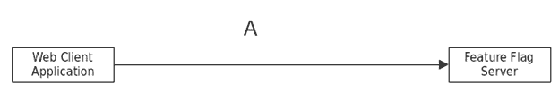
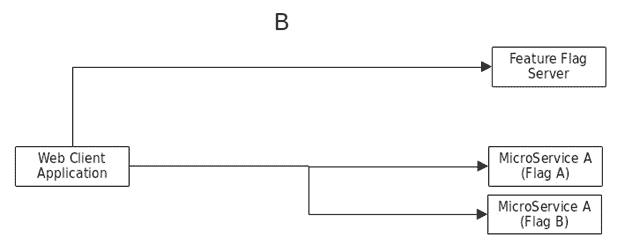
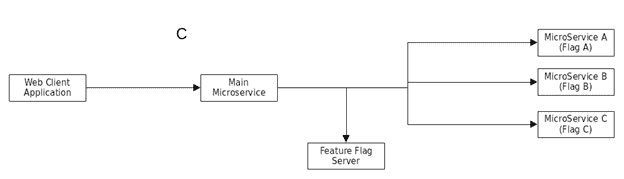
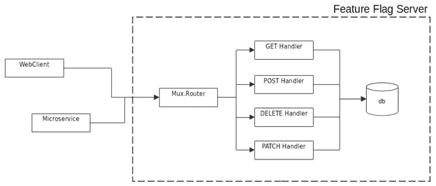
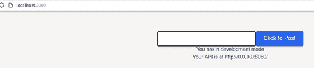
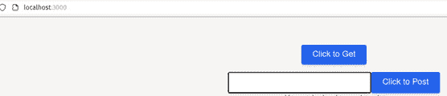
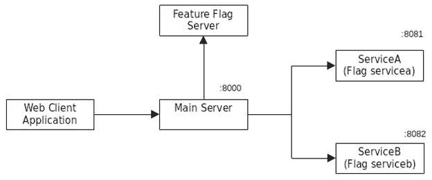

# 特性标志

本章，我们将了解特性标志，它们是什么，如何使用它们，以及使用它们的益处。使用特性标志对于应用程序不是强制性的。然而，随着应用程序复杂性的增加，对特性标志的需求将会出现。

特性标志提供了许多不同的特性，但本章我们将专注于如何使用特性标志在应用程序中启用/禁用特定特性。我们将使用一个开源的简单版本特性标志服务器来演示前端和后端服务的集成。

本章将涵盖以下主题：

+   理解特性标志的实质

+   安装开源特性标志服务器

+   使用特性标志启用/禁用特性

+   集成前端和后端服务的特性标志

# 技术要求

本章中解释的所有源代码都可以在[`github.com/PacktPublishing/Full-Stack-Web-Development-with-Go/tree/main/chapter11`](https://github.com/PacktPublishing/Full-Stack-Web-Development-with-Go/tree/main/chapter11)找到。

本章使用 cURL 工具执行 HTTP 操作。该工具适用于不同的操作系统，可以从[`curl.se/download.xhtml`](https://curl.se/download.xhtml)下载。

# 特性标志简介

在当前快速变化的世界中，开发者几乎每天都需要进行更改和推出新特性，如果不是更快的话。有时，这甚至需要在有用户需求之前构建特性。能够在不造成干扰的情况下将特性部署到生产环境中是软件开发的神圣目标。

部署到生产环境中的特性可能对用户开放也可能不开放；这完全取决于业务方面的战术决策。开发者会持续将特性发布到生产环境中，当时机成熟时，特性将通过业务端的一个按钮点击来启用。这种功能正是特性标志提供的。

简而言之，特性标志就像是我们可以在不造成干扰的情况下启用/禁用应用程序中特性的开关。启用特性也将允许公司根据市场和用户需求有策略地启用或禁用特性，这可能影响公司的底线。

作为一种工具，特性标志不仅提供了运行/关闭特性的能力，还有许多其他好处你可以从中获得：

+   根据某些条件（如地理位置、用户年龄等）对特定人群进行特性测试

+   根据网络条件对流量请求进行分割

+   进行用户体验实验以了解哪种设计效果良好

在本章中，我们将探讨一个开源项目特性标志工具，以展示如何使用和集成它。

# 特性标志配置

您可以通过在您的基础设施中部署功能标志或使用如 LaunchDarkly、Flagsmith 以及许多其他可用的软件即服务解决方案来使用功能标志。每个解决方案都提供自己的 API，需要将其集成到您的应用程序中。这意味着您的应用程序与您选择的解决方案绑定。没有一种适合所有情况的解决方案；这完全取决于您应用程序需要哪些功能。

让我们看看使用功能标志的不同配置。*图 11.1*展示了使用功能标志的最简单方法。



图 11.1：使用功能标志的 Web 客户端

Web 客户端将根据功能标志启用或禁用用户界面。例如，在应用程序中，当与菜单相关的功能标志开启时，可以启用特定的菜单选择。

*图 11.2*展示了不同的配置，其中 Web 客户端将根据哪个功能标志开启/关闭而调用不同的微服务：



图 11.2：功能标志微服务

在前面的示例中，当功能标志 A 开启时，Web 客户端会调用微服务 A。

在*图 11.3*中展示了另一个有趣的配置，其中主微服务将确定将返回给 Web 客户端的用户界面，这取决于哪个功能标志已被配置：



图 11.3：微服务的功能标志

在上述示例中，如果主微服务检测到功能标志 C 已被启用，Web 客户端将获得不同的响应以进行渲染，这将从微服务 C 获取响应。

因此，正如我们所看到的，使用功能标志有不同的方法和不同的地方，这都取决于您应用程序的需求。

在下一节中，我们将探讨如何使用开源功能标志服务器来在示例 Web 应用程序中启用/禁用按钮。

# 使用功能标志的用例

功能标志不仅限于可以配置为在应用程序内部开启/关闭功能的标志；还有许多其他功能和能力。在本节中，我们将探讨完整功能标志服务器提供的功能：

+   **分段目标** – 假设您正在构建一个希望在应用程序中的一组用户上测试的功能。例如，您可能希望基于 PayPal 的结账功能仅适用于位于美国的特定用户组。

+   **风险缓解** – 构建产品功能并不能保证功能会带来更多用户。新功能可以发布，随着时间的推移和更多的分析，如果发现该功能提供了不良的用户体验，它将作为风险缓解过程的一部分被关闭。

+   **在发布前收集反馈** – 通过对特定用户组的定向发布，可以尽早从用户那里获得反馈。这些反馈将为团队提供洞察力，以决定该功能是否确实为用户提供任何额外的好处。

现在我们对功能标志的使用案例有了很好的理解，我们将在下一节中探讨安装功能标志服务器。

## 安装功能标志服务器

我们将使用一个开源功能标志服务器。按照以下方式从 [github.com/nanikjava/feature-flags](http://github.com/nanikjava/feature-flags) 仓库克隆项目：

```go
git clone https://github.com/nanikjava/feature-flags
```

从您的终端，切换到项目目录，并使用以下命令构建服务器：

```go
go build -o fflag .
```

我们使用 `-o` 标志来编译应用程序，并将其输出到名为 `fflag` 的文件中。现在服务器已经编译完成并准备好使用，请打开一个新的终端窗口，并按照以下方式运行服务器：

```go
./fflag
```

您将看到以下输出：

```go
2022/07/30 15:10:38 Feature flag is up listening on  :8080
```

服务器现在正在监听端口 `8080`。现在，我们需要为我们的网络应用程序添加一个新的功能标志，其键名为 `disable_get`。要这样做，请使用 `curl` 命令行以以下方式发送数据：

```go
curl -v -X POST http://localhost:8080/features -H "Content-Type:application/json" -d '{"key":"disable_get","enabled":false,"users":[],"groups":["dev","admin"],"percentage":0}' 
```

`curl` 命令正在调用 `/features` 端点并传递 JSON 数据。一旦成功完成，您将看到以下输出：

```go
{
  "key": "disable_get",
  "enabled": false,
  "users": [],
  "groups": [
    "dev",
    "admin"
  ],
  "percentage": 0
} 
```

JSON 输出显示，功能标志服务器现在有一个名为 `disable_get` 的新键，并且它被禁用，如 `enabled: false` 标志所示。输出应如下所示，显示数据已成功添加：

```go
*   Trying 127.0.0.1:8080...
* Connected to localhost (127.0.0.1) port 8080 (#0)
…
* Mark bundle as not supporting multiuse
< HTTP/1.1 201 Created
…
< Content-Length: 89
<
{"key":"disable_get","enabled":false,"users":[],"groups":["dev","admin"],"percentage":0}
* Connection #0 to host localhost left intact
```

功能标志服务器已准备好所需的数据。在下一节中，我们将探讨如何在我们的网络应用程序中使用该标志。

# 功能标志的高级架构

*图 11.4* 展示了开源功能标志服务器的高级架构。



图 11.4：高级架构

从图中可以看出，服务器使用 `mux.Router` 来路由不同的 HTTP 请求，例如 `GET`、`POST`、`DELETE` 和 `PATCH`。服务器使用内部数据库作为应用程序所需功能标志的持久存储。

服务器可以通过 HTTP 请求调用访问，这些调用可以通过使用正常 HTTP 协议的 Web 客户端和微服务进行。

# 功能标志集成

在我们安装了功能标志服务器之后，我们希望在应用程序中使用它。在本节中，我们将探讨如何集成功能标志以在前端启用/禁用某些用户界面元素，并仅从我们的服务器调用已启用的后端服务。

## 网络应用程序

我们将要使用的示例应用程序位于 `chapter11/frontend-enable-disable` 文件夹内；该示例应用程序演示了如何使用功能标志来启用/禁用用户界面按钮。打开终端并切换到 `chapter11/frontend-enable-disable` 目录以运行网络应用程序，如下所示：

```go
npm install
npm run dev
```

这些命令将安装所有必要的包并运行网络应用程序。一旦命令完成，打开您的浏览器并在地址栏中输入 `http://localhost:3000`。你将看到如图 *图 11.5* 所示的 web 应用程序。



图 11.5：使用功能标志的 web 应用程序的初始视图

你在 *图 11.5* 中看到的是其中一个按钮已被禁用。这是基于我们在上一节中设置的标志值。标志数据如下所示：

```go
{
  "key": "disable_get",
  "enabled": false,
  "users": [],
  "groups": [
    "dev",
    "admin"
  ],
  "percentage": 0
}
```

`disable_get` 键是我们添加到服务器上的标志键，而 `enabled` 字段被设置为 `false`，这意味着按钮已被禁用。让我们将 `enabled` 字段更改为 `true`，然后看看网页如何变化。

在终端中使用以下命令更新数据：

```go
curl -v -X PATCH http://localhost:8080/features/disable_get -H "Content-Type: application/json" -d '{"key":"disable_get","enabled":true}'
```

`curl` 命令将 `enabled` 字段更新为 `true`。刷新浏览器页面，你会看到按钮已被启用，如图 *图 11.6* 所示。



图 11.6：点击获取按钮已启用

以下是从 `HelloWorld.vue` 文件中的代码片段，负责从服务器读取键，使用它来启用/禁用按钮：

```go
...
<script>
import axios from 'axios';
export default {
 data() {
   return {
     enabled: true
   }
 },
 mounted() {
   axios({method: "GET", "url":
     "http://localhost:8080/features/disable_get"}).then(result        => {
     this.enabled = result.data.enabled
     console.log(result);
   }, error => {
     console.error(error);
   });
 }
}
</script>
<template>
 <div  v-if="enabled" class="flex space-2 justify-center">
   ...
   </button>
 </div>
 ...
```

在下一节中，我们将探讨使用功能标志在后端服务上启用/禁用某些功能。

## 微服务集成

在本节中，我们将使用功能标志来启用/禁用某些服务。这将使应用程序能够仅访问当前已启用的服务。*图 11.7* 展示了微服务的结构。应用程序位于 `chapter11/multiple-service` 文件夹中。



图 11.7：功能标志的微服务结构

按照上一节中的步骤运行功能标志服务器，使用以下命令创建标志：

```go
curl -v -X POST http://localhost:8080/features -H "Content-Type: application/json" -d '{"key":"serviceb", "enabled":true,"users":[],"groups":["dev","admin"],"percentage":0}'
curl -v -X POST http://localhost:8080/features -H "Content-Type: application/json" -d '{"key":"servicea", "enabled":false,"users":[],"groups":["dev","admin"],"percentage":0}' 
```

该命令创建两个键：`servicea` 和 `serviceb`。目前，`servicea` 已被禁用，而 `serviceb` 已被启用。一旦设置了功能标志，我们将运行不同的服务：

+   `chapter11/multiple-service/mainserver` 目录。使用以下命令运行主服务器：

    ```go
    go run main.go 
    ```

主服务器将在端口 `8080` 上运行。

+   `servicea` – 打开终端并切换到 `chapter11/multiple-service/servicea` 目录。使用以下命令运行服务：

    ```go
    go run main.go  
    ```

`servicea` 将在端口 `8081` 上运行。

+   `serviceb` – 打开终端并将目录更改为`chapter11/multiple-service/serviceb`。使用以下命令运行服务：

    ```go
    go run main.go 
    ```

`serviceb`将在端口`8082`上运行。

现在，我们有三个不同的服务正在端口`8080`、`8081`和`8082`上运行。打开您的浏览器，使用`http://localhost:8000`访问服务。您将得到以下类似的结果：

```go
{"Message":"-ServiceB active"}
```

返回的响应来自`serviceb`，因为根据功能标志服务器的配置，`servicea`已被禁用。现在，让我们使用以下命令打开`servicea`的标志：

```go
curl -v -X PATCH http://localhost:8080/features/servicea -H "Content-Type: application/json" -d '{"enabled":true}'
```

通过使用*Ctrl + C*强制停止主服务器来重新启动它。使用之前讨论的相同命令重新运行它。打开您的浏览器并使用`http://localhost:8000`访问服务。您应该得到以下类似的结果：

```go
{"Message":"ServiceA active-ServiceB active"}
```

现在两个服务都已启用，我们收到了来自这两个服务的响应。

让我们看看代码，以了解如何使用功能标志。以下代码片段显示了启动服务的一部分代码：

```go
...
func main() {
  port := ":8000"
  ...
  wg := &sync.WaitGroup{}
  wg.Add(1)
  go func(w *sync.WaitGroup) {
     defer w.Done()
     serviceA = checkFlags("servicea")
     serviceB = checkFlags("serviceb")
  }(wg)
  wg.Wait()
  http.ListenAndServe(port, rtr)
}
```

代码通过 goroutine 调用功能标志服务器以获取`servicea`和`serviceb`的标志信息。一旦完成，它就开始服务器监听端口`8000`。服务的状态存储在`servicea`和`serviceb`变量中，这些变量将在代码的其他部分中使用，如下面的代码片段所示：

```go
func handler() http.HandlerFunc {
  type ResponseBody struct {
     Message string
  }
  return func(rw http.ResponseWriter, req *http.Request) {
     var a, b string
     if serviceA {
        a = callService("8081")
     }
     if serviceB {
        b = callService("8082")
     }
     json.NewEncoder(rw).Encode(ResponseBody{
        Message: a + "-" + b,
     })
  }
}
```

当您访问端口`8000`的服务器时，会调用`handler()`方法。在代码内部，如所见，它仅在服务启用时调用服务。一旦调用服务，服务的结果将被合并并作为单个 JSON 响应发送回客户端。

以下代码片段显示了如何访问功能标志服务器以提取不同的标志。它使用正常的 HTTP GET 调用：

```go
func checkFlags(key string) bool {
  ...
  requestURL := fmt.Sprintf("http://localhost:%d/features/%s",    8080, key)
  res, err := http.Get(requestURL)
  ...
  resBody, err := ioutil.ReadAll(res.Body)
  if err != nil {
     log.Printf("client: could not read response body: %s\n",       err)
     os.Exit(1)
  }
  ...
  return f.Enabled
}
```

代码通过获取我们感兴趣的每个键来调用功能标志服务器。因此，在示例中，我们使用以下 URL 进行调用：

```go
http://localhost:8080/features/servicea
http://localhost:8080/features/serviceb
```

例如，当调用`http://localhost:8080/features/servicea`时，代码将从功能标志服务器获取以下 JSON 响应：

```go
{
  "key": "servicea",
  "enabled": true,
  "users": [],
  "groups": [
    "dev",
    "admin"
  ],
  "percentage": 0
} 
```

`checkFlags()`函数只对`enabled`字段感兴趣，它将被反序列化到如下所示的`FeatureFlagServerResponse`结构体中：

```go
func checkFlags(key string) bool {
  type FeatureFlagServerResponse struct {
     Enabled bool `json:"enabled"`
  }
  ...
  var f FeatureFlagServerResponse
  err = json.Unmarshal(resBody, &f)
  ...
}
```

在成功将 JSON 转换为结构体后，它将返回此处所示的`Enabled`值：

```go
func checkFlags(key string) bool {
  ...
  return f.Enabled
}
```

我们已经到达了本章的结尾。在本节中，我们探讨了在不同场景中集成功能标志，例如在 Web 应用程序内部以及将其用作访问不同微服务的功能切换。还有其他用例，其中可以使用功能标志，例如在生产中启用/禁用性能指标，以及在生产中启用跟踪以调试错误。

# 摘要

在本章中，我们学习了功能标志，包括它们的使用目的以及如何使用它们。我们学习了如何安装简单的功能标志服务器，并看到了如何将其与我们的示例应用程序集成。

我们已经通过两个不同的用例介绍了使用功能标志的步骤——通过检查标志来在我们的前端启用/禁用按钮，以及在后端调用不同的微服务。使用功能标志来启用或禁用某些服务，使应用程序在向前端发送响应方面具有灵活性，这给了开发者按需允许访问某些服务的能力。

在下一章中，我们将通过探索 GitHub 提供的不同功能来构建持续集成。
