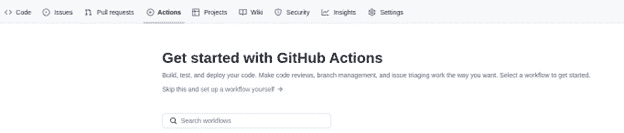

# 12

# 构建持续集成

构建解决问题的 Web 应用程序是很好的，但我们还需要让这些应用程序对用户可用，以便他们可以开始使用它们。作为开发者，我们编写代码。但是，同时，这段代码需要被构建或编译，以便它可以部署，使用户能够使用它。我们需要了解我们如何自动构建我们的 Web 应用程序，而不需要任何手动过程来工作。这就是我们将在本章中讨论的内容。我们将探讨所谓的**持续****集成**（**CI**）。

CI 是一种自动化将不同贡献者的代码集成到项目中的实践或过程。CI 允许开发者频繁地将代码合并到代码库中，在那里它将被自动测试和构建。

在本章中，我们将学习 CI 的以下内容：

+   GitHub 工作流程

+   使用 GitHub Actions

+   发布到 GitHub Packages

# 技术要求

本章的源代码可以在[`github.com/PacktPublishing/Full-Stack-Web-Development-with-Go/tree/main/chapter12`](https://github.com/PacktPublishing/Full-Stack-Web-Development-with-Go/tree/main/chapter12)找到。在本章中，我们还将使用另一个存储库来设置 CI 以进行说明。该存储库是[`GitHub.com/nanikjava/golangci`](https://GitHub.com/nanikjava/golangci)。

# CI 的重要性

你可以将 CI 视为你的开发过程中的一个方面。这之所以重要，主要是因为它允许你作为开发者确保所有提交到中央代码库的代码都经过测试和验证。

当你在团队环境中工作时，多个开发者正在同一个项目上工作，这一点变得至关重要。拥有适当的 CI 将会给开发者带来安心和保证，即他们所使用的所有代码都可以正确编译，并且自动测试用例已经成功运行。想象一下，你必须从 GitHub 检出一些项目，但当你尝试编译和运行一些测试用例时，它失败了；这将是一场灾难，因为你将不得不花时间修复问题，但如果项目有一个适当的 CI 流程，它将确保所有提交的代码都能正确编译，测试用例都能通过。

即使作为一个独立开发者在一个项目上工作，也强烈建议设置 CI。你从这得到的最小好处是确保你的代码可以正确构建。这也确保了当构建失败发生时，任何意外添加到代码中的与你的本地机器相关的本地依赖项被检测到。

在下一节中，我们将通过查看构建我们 Web 应用程序的 CI 所需的不同步骤，来探讨使用 GitHub 构建 CI。

## 设置 GitHub

在本节中，我们将解释为了在 GitHub 中获得自动化 CI 需要准备的不同事项。为了更好地理解 CI 过程，建议您创建一个单独的 GitHub 仓库，并将`chapter12`目录中的所有内容复制到新仓库中。最初，当创建`nanikjava/golangci`仓库时，它将类似于*图 12.1*。


图 12.1：一个全新的 GitHub 仓库

对于本章，我们已设置一个单独的仓库([`GitHub.com/nanikjava/golangci`](https://GitHub.com/nanikjava/golangci))，我们将将其用作本章讨论的参考指南。我们将通过在仓库中创建简单 GitHub 工作流程的步骤进行说明。GitHub 工作流程是一组运行一个或多个作业的指令。这些指令定义在仓库`.GitHub/workflows`目录中扩展名为`.yaml`的 YAML 文件中。

您可以为您的仓库定义多个工作流程，以执行不同的自动化过程。例如，您可以有一个工作流程文件来构建和测试您的应用程序，另一个用于将应用程序部署到中央位置。

让我们按照以下步骤在新的仓库中创建一个简单的工作流程文件：

1.  从您的仓库中，点击**操作**菜单。这将带您到**GitHub 操作入门**页面，如图*图 12.2*所示。



图 12.2：GitHub 操作入门页面

1.  点击**自行设置工作流程**链接。这将带您到一个新页面，您可以在其中开始编写工作流程，如图*图 12.3*所示。


图 12.3：创建新工作流程屏幕

现在，我们将创建一个简单的可以用于 GitHub 的工作流程。该工作流程可以在[`docs.GitHub.com/en/actions/quickstart`](https://docs.GitHub.com/en/actions/quickstart)找到。按照*图 12.4*所示复制并粘贴工作流程。


图 12.4：一个示例 GitHub 工作流程.yaml 文件

1.  通过点击**开始提交**按钮来提交文件，如图*图 12.3*所示。在填写完所有提交信息后，点击**提交新文件**按钮。


图 12.5：.yaml 文件的提交信息

您的仓库现在有一个新的 GitHub 工作流程文件。如果您再次选择**操作**菜单，这次您将看到屏幕看起来像*图 12.6*。屏幕显示 GitHub 已成功运行工作流程。


图 12.6：GitHub 已成功运行工作流程

我们可以通过点击**创建 main.yaml**链接来查看工作流程结果。您将看到输出指示**Explore-GitHub-Actions**作业已成功运行，如图*12.7*所示。


图 12.7：Explore-GitHub-Actions 步骤已成功运行

点击**Explore-GitHub-Actions**作业链接后，输出将如图*12.8*所示。


图 12.8：Explore-GitHub-Actions 作业输出

我们在本节中创建的工作流程实际上是 GitHub Actions 工作流程。我们将在下一节中更深入地探讨它。

# GitHub Actions

什么是 GitHub Actions？它是一个允许您通过自动化构建、测试和部署过程来自动化项目完整集成和交付的平台。GitHub Actions 还赋予您自动化工作流程过程，如拉取请求、问题创建等的能力。

我们现在已成功创建了我们的第一个 GitHub 工作流程。让我们查看工作流程文件，了解我们正在使用哪些 GitHub Actions。我们将使用的工作流程文件如下：

```go
name: GitHub Actions Demo
on: [push]
jobs:
  Explore-GitHub-Actions:
    runs-on: ubuntu-latest
    steps:
      - run: echo "🎉 The job was automatically triggered by a 
                   ${{ GitHub.event_name }} event."
      - run: echo "🐧 This job is now running on a ${{ runner.                   os }} 
                     server hosted by GitHub!"
      - run: echo "🔎 The name of your branch is ${{ GitHub.                   ref }} and your repository is ${{ GitHub.                   repository }}."
      - name: Check out repository code
        uses: actions/checkout@v3
      - run: echo "💡 The ${{ GitHub.repository }} repository                     has been cloned to the runner."
      - run: echo "🖥 The workflow is now ready to test your                    code on the runner."
      - name: List files in the repository
        run: |
          ls ${{ GitHub.workspace }}
      - run: echo "🍏 This job's status is ${{ job.status }}."
```

下表解释了文件中的不同配置：

| **配置键** | **说明** |
| --- | --- |
| Name | 我们为将用作在 Actions 页面查看结果标签的工作流程提供的通用名称。 |
| On | 告知 GitHub 哪种 Git 操作将触发工作流程。在示例中，它是`push`。这意味着每当在存储库中检测到 Git `push`操作时，工作流程将被触发。不同的 Git 事件操作可以在 GitHub 文档中查看：[`docs.GitHub.com/en/actions/using-workflows/triggering-a-workflow#using-events-to-trigger-workflows`](https://docs.GitHub.com/en/actions/using-workflows/triggering-a-workflow#using-events-to-trigger-workflows)。 |
| Jobs | 工作流程由一个或多个作业组成。默认情况下，作业会并行运行。作业可以被视为您想在代码上执行的单个任务。在我们的例子中，我们命名作业为`Explore-GitHub-Actions`，它执行由*run*配置定义的任务。 |
| runs-on | 定义了我们想要使用的运行者。运行者是您选择在之上运行工作流程的机器。在我们的例子中，我们使用的是*ubuntu-latest*机器，换句话说，我们想要使用运行最新版 Ubuntu 的机器。完整的运行者列表可以在以下链接中查看：[`docs.GitHub.com/en/actions/using-jobs/choosing-the-runner-for-a-job`](https://docs.GitHub.com/en/actions/using-jobs/choosing-the-runner-for-a-job)。 |
| 步骤 | 每个作业包含一系列称为步骤的任务。步骤是您定义要为工作流程执行的操作的地方。在我们的示例中，我们定义了几个步骤，例如 `run`，我们只是打印出信息。 |

现在，我们将查看针对示例应用程序的 GitHub Action 工作流程。工作流程可以在 `chapter12/.GitHub/workflows/build.yml` 文件中找到，如下所示：

```go
name: Build and Package
on:
 push:
   branches:
     - main
 pull_request:
jobs:
 lint:
   name: Lint
   runs-on: ubuntu-latest
   steps:
     - name: Set up Go
       uses: actions/setup-go@v1
       with:
         go-version: 1.18
     - name: Check out code
       uses: actions/checkout@v1
     - name: Lint Go Code
       run: |
         curl -sSfL 
         https://raw.GitHubusercontent.com/golangci/golangci-           lint/
         master/install.sh | sh -s -- -b $(go env GOPATH)/bin
         $(go env GOPATH)/bin/golangci-lint run
 build:
   name: Build
   runs-on: ubuntu-latest
   needs: [ lint ]
   steps:
     - name: Set up Go
       uses: actions/setup-go@v1
       with:
         go-version: 1.18
     - name: Check out code
       uses: actions/checkout@v1
     - name: Build
       run: make build
```

我们现在将逐行分析，了解工作流程正在做什么。以下代码片段告诉 GitHub，当源代码推送到 `main` 分支时，将触发工作流程：

```go
name: Build and Package
on:
 push:
   branches:
     - main
```

下面的代码片段显示了当检测到事件时，GitHub 将运行的不同作业；在这种情况下，是 `lint` 和 `build` 作业。作业将在由 `runs-on` 配置指定的 Ubuntu 机器上运行：

```go
jobs:
 lint:
   name: Lint
   runs-on: ubuntu-latest
   steps:
     ...
 build:
   name: Build
   runs-on: ubuntu-latest
   needs: [ lint ]
   steps:
     ...
```

定义的工作由以下代码片段中显示的步骤组成：

```go
...
jobs:
 lint:
   ...
   steps:
     - name: Set up Go
       uses: actions/setup-go@v1
       with:
         go-version: 1.18
     - name: Check out code
       uses: actions/checkout@v1
     - name: Lint Go Code
       run: |
         curl -sSfL  
         https://raw.GitHubusercontent.com/golangci/golangci-           lint/
         master/install.sh | sh -s -- -b $(go env GOPATH)/bin
         $(go env GOPATH)/bin/golangci-lint run
 build:
   ...
   steps:
     - name: Set up Go
       uses: actions/setup-go@v1
       with:
         go-version: 1.18
     - name: Check out code
       uses: actions/checkout@v1
     - name: Build
       run: make build
```

对于 `lint` 作业执行的步骤的解释如下：

1.  使用 `actions/setup-go` GitHub Action 设置 Go 1.18 环境。

1.  使用 `actions/checkout` GitHub Action 检出源代码。

1.  对源代码执行 linting 操作。shell 脚本将安装 `golangci-lint` 工具并使用 `golangci-lint run` 命令运行它。

另一个 `build` 作业将执行以下步骤：

1.  使用 `actions/setup-go` GitHub Action 设置 Go 1.18 环境。

1.  使用 `actions/checkout` GitHub Action 检出源代码。

1.  通过执行 `make build` 命令构建应用程序。

在作业中定义的每个步骤都使用 GitHub Actions 执行不同的操作，例如检出代码、运行 shell 脚本和设置编译 Go 应用程序的环境。

在下一节中，我们将探讨 GitHub Packages 以及如何使用它们来部署我们将为应用程序构建的 Docker 镜像。

# 发布 Docker 镜像

在开发完您的应用程序后，下一步是部署应用程序，以便用户可以开始使用它。为此，您需要打包您的应用程序。这就是 Docker 出现的地方。Docker 是一个用于将您的应用程序打包到单个文件的工具，使其易于部署到云环境，如 Amazon、Google 等。我们将在 *第十三章**，应用程序 Docker 化* 中深入了解 Docker 镜像和容器。我们将查看配置 Docker 的文件，称为 `Dockerfile`。我们将简要地看看这个文件的作用。

## Dockerfile

`Dockerfile` 是用于命名包含构建应用程序镜像指令的文件的默认文件名。`Dockerfile` 包含 Docker 执行的步骤，以便将您的应用程序打包到 Docker 镜像中。

让我们看看 `Chapter12` 目录中我们拥有的 `Dockerfile`：

```go
# 1\. Compile the app.
FROM golang:1.18  as builder
WORKDIR /app
COPY . .
RUN CGO_ENABLED=0 GOOS=linux go build -a -o bin/embed
# 2\. Create final environment for the compiled binary.
FROM alpine:latest
RUN apk --update upgrade && apk --no-cache add curl ca-certificates && rm -rf /var/cache/apk/*
RUN mkdir -p /app
# 3\. Copy the binary from step 1 and set it as the default command.
COPY --from=builder /app/bin/embed /app
WORKDIR /app
CMD /app/embed
```

打包应用程序有三个主要步骤：

1.  将我们的 Go 应用程序编译成一个名为 `embed` 的二进制文件。

1.  创建一个将用于运行我们的应用程序的环境。在我们的示例中，我们使用一个名为 `alpine` 的环境或操作系统。

1.  将第一步中构建的二进制文件复制到我们在第二步中设置的新环境中。

在下一节中，我们将使用 `Dockerfile` 将镜像存储在 GitHub Packages 中。

# GitHub Packages

GitHub Packages 是 GitHub 提供的一项服务，允许开发者托管他们的包。这些包可以通过您的团队访问，或者对公众开放。我们将使用这项服务来发布我们的 Docker 镜像，使其可供公众使用。

在我们可以将 Docker 镜像部署到 GitHub Packages 之前，我们需要设置一些东西。本节将指导您完成设置仓库所需的步骤。在本节中，我们将使用 `GitHub.com/nanikjava/golangci` 作为参考。

您可以通过点击 **包** 链接从您的仓库访问 GitHub Packages，如图 *图 12**.9* 所示。


图 12.9：访问 GitHub Packages

一旦您点击 **包** 链接，您将看到一个类似于 *图 12**.10* 的屏幕。由于我们尚未发布任何包，因此将不会显示 **包**。


图 12.10：GitHub Packages 页面

在下一节中，我们将探讨如何将我们转换成包的 Docker 镜像发布到 GitHub Packages。

## 发布到 GitHub Packages

安全性是 GitHub 的重要组成部分。为了能够将 Docker 镜像写入 GitHub Packages，让我们尝试了解所需的内容。每次 GitHub 运行工作流程时，都会分配一个临时令牌给工作流程，该令牌可以用作认证密钥，允许 GitHub Actions 执行某些操作。这个密钥在内部被称为 `GITHUB_TOKEN`。

`GITHUB_TOKEN` 密钥具有默认权限，可以根据您组织的需要设置为限制性。要查看默认权限，请从您的仓库点击 **设置** 选项卡，如图 *图 12**.11* 所示。


图 12.11：设置中的操作菜单

点击 **操作** 菜单并选择 **常规**。您将看到默认权限，如图 *图 12**.12* 所示。如您所见，默认权限是工作流程的 **读和写**。


图 12.12：GITHUB_TOKEN 默认权限

我们将要查看的工作流程位于 `chapter12/.GitHub/workflows/builddocker.yml` 内，其外观如下：

```go
name: Build Docker Image
on:
 push:
   branches:
     - main
 pull_request:
env:
 REGISTRY: ghcr.io
 IMAGE_NAME: ${{ GitHub.repository }}
jobs:
 push_to_GitHub_registry:
   name: Push Docker image to Docker Hub
   runs-on: ubuntu-latest
   steps:
     ...
     - name: Log in to the Container registry
       uses: docker/login-action@v2
       with:
         registry: ${{ env.REGISTRY }}
         username: ${{ GitHub.actor }}
         password: ${{ secrets.GITHUB_TOKEN }}
     - name: Build and push Docker image
       uses: docker/build-push-action@v3
       with:
         context: .
         file: ./Dockerfile
         push: true
         tags: ${{ env.REGISTRY }}/${{ env.IMAGE_NAME 
               }}/chapter12:latest
```

工作流程按照以下步骤顺序执行以发布 Docker 镜像：

1.  工作流程使用`docker/login-action@v2` GitHub Action 登录到注册表（GitHub Packages）。传递给 GitHub Action 的参数是`username`、`password`和`registry`。

1.  `username`是 GitHub 用户名，它触发工作流程过程。`registry`参数将是`REGISTRY`环境变量的值，即`- ghcr.io`。`password`字段将自动使用`secrets.GITHUB_TOKEN`填充。

1.  最后一步是使用`docker/build-push-action@v3` GitHub Action 构建并发布 Docker 镜像。传递给 GitHub Action 的参数是用于构建 Docker 镜像的*文件*。在我们的例子中，它被称为`Dockerfile`。用于标记或标签 Docker 镜像的标签名称将类似于`ghcr.io/golangci/chapter12:latest`。

现在我们已经设置好了一切，下次你将任何代码更改推送到`main`分支时，工作流程将运行。一个成功的运行示例可以在*图 12.13*中看到。


图 12.13：成功运行的工作流程发布 Docker 镜像

Docker 镜像可以在 GitHub Packages 页面上看到，如图*图 12.14*所示。


图 12.14：GitHub Packages 中的 chapter12 Docker 镜像

在下一节中，我们将查看下载我们新创建的 Docker 镜像并本地使用它。

## 从 GitHub Packages 拉取

我们已经成功为我们的应用程序设置了 CI。现在，我们必须测试作为 CI 过程一部分运行的 Docker 镜像是否成功构建了我们的应用程序的 Docker 镜像。

我们的 Docker 镜像托管在 GitHub Packages 中，默认情况下是公开的，因为我们的仓库是公开仓库。*图 12.14*显示了可用的 Docker 镜像，包括拉取镜像到本地的命令。打开你的终端，然后运行以下命令：

```go
docker pull ghcr.io/nanikjava/golangci/chapter12:latest
```

你将得到以下输出：

```go
latest: Pulling from nanikjava/golangci/chapter12
213ec9aee27d: Already exists 
3a904afc80b3: Pull complete 
561cc7c7d83b: Pull complete 
aee36b390937: Pull complete 
4f4fb700ef54: Pull complete 
Digest: sha256:a355f55c33a400290776faf20b33d45096eb19a6431fb0b3 f723c17236e8b03e
Status: Downloaded newer image for ghcr.io/nanikjava/golangci/chapter12:latest
```

镜像已下载到你的本地机器。使用以下命令运行 Docker 镜像：

```go
docker run -p 3333:3333 ghcr.io/nanikjava/golangci/chapter12
```

当你看到以下输出时，你知道容器正在运行：

```go
2022/08/18 08:03:10 Server Version : 0.0.1
```

打开你的浏览器，并在浏览器地址栏中输入`http://localhost:3333`。你会看到登录页面。我们已经成功完成了我们的 CI 过程，并且能够运行我们构建的 Docker 镜像。

# 摘要

在本章中，我们探讨了持续集成（CI），了解了为什么它很重要，以及通过为项目设置自动化的 CI 流程所获得的益处。我们学习了如何设置 GitHub 仓库以准备我们的 CI 流程，还学习了如何编写 GitHub Actions 工作流程，使我们能够自动化应用程序的多个步骤。

通过使用 GitHub Actions，我们能够将我们的应用程序构建成一个可执行的二进制文件。这在我们每次将代码推送到仓库时都会执行。我们学习了如何为我们的应用程序构建 Docker 镜像，以及将应用程序打包成 Docker 镜像所带来的好处。

我们学习了 GitHub Packages 以及如何配置它，以便我们可以将我们的 Docker 镜像推送到一个中央位置。将我们的应用程序打包成 Docker 镜像使得我们可以在任何地方轻松测试我们的应用程序。我们不必担心构建源代码，因为所有内容都已打包成一个单独的 Docker 镜像文件。

在下一章中，我们将学习如何将我们的应用程序打包成容器，这将使得将其作为单个镜像部署变得容易，并允许我们使用不同的云提供商在云中部署应用程序。
