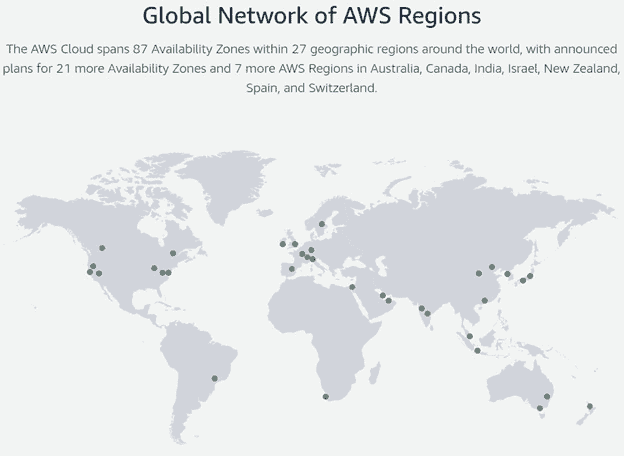
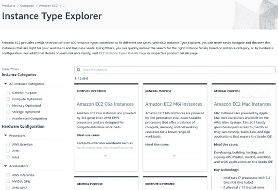
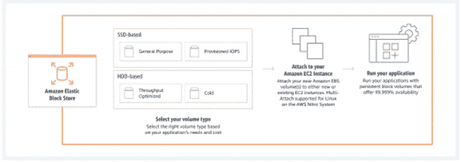
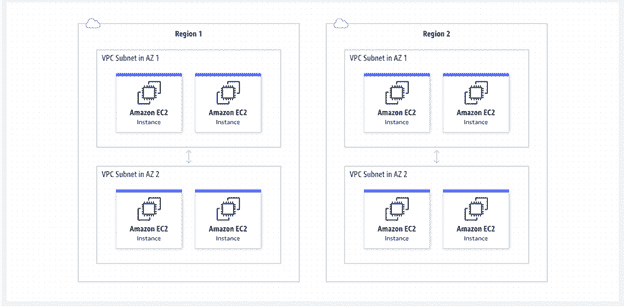
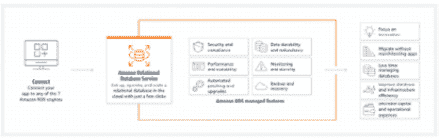
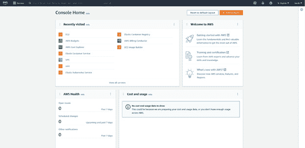
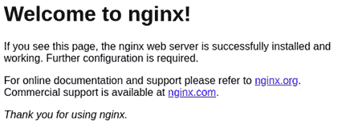
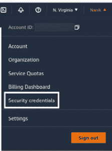
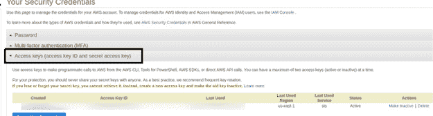
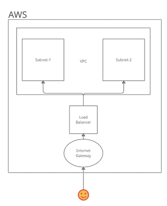

# 第十四章：云部署

在本章中，我们将学习关于云部署的知识，特别是使用 AWS 作为云提供商。我们将查看 AWS 提供的一些基础设施服务以及如何使用它们。我们将学习如何使用和编写代码来创建不同的 AWS 基础设施服务，使用一个名为 Terraform 的开源工具。了解云以及云部署的工作原理已经成为开发者的必需品，而不是例外。深入了解云部署的不同方面将使您能够跳出思维定式，思考您的应用程序如何在云中运行。

完成本章后，我们将学习以下关键主题：

+   学习基本的 AWS 基础设施

+   理解和使用 Terraform

+   编写用于本地和云部署的 Terraform

+   部署到 AWS 弹性容器服务

本章的最终目标是为您提供有关云以及如何执行某些基本操作以部署应用程序到云的一些知识。

# 技术要求

本章中解释的所有源代码都可以在[`github.com/PacktPublishing/Full-Stack-Web-Development-with-Go/tree/main/chapter14`](https://github.com/PacktPublishing/Full-Stack-Web-Development-with-Go/tree/main/chapter14)上查看。

本章使用 AWS 服务，因此您预计将拥有一个 AWS 账户。AWS 为新用户提供免费层；更多信息可以在[`aws.amazon.com/free`](https://aws.amazon.com/free)找到。

注意

使用任何类型的 AWS 服务都会产生费用。请在使用服务之前阅读并了解相关信息。我们强烈建议您阅读 AWS 网站上关于免费层的信息。

# AWS 复习

**AWS**代表**Amazon Web Services**，属于亚马逊公司，该公司提供电子商务平台[amazon.com.au](http://amazon.com.au)。AWS 提供的服务允许组织在其完整的基础设施中运行其应用程序，而不需要拥有任何所需的硬件。

对于开发者来说，AWS 品牌是一个家喻户晓的名字，几乎所有开发者都直接或间接地接触过使用 AWS 工具或其服务。在本节中，我们将回顾 AWS 提供的一些服务。

我们心中浮现的问题是，为什么还要使用 AWS 这样的服务？*图 14.1*很好地总结了答案。AWS 提供的服务遍布世界各地的不同大陆，并准备好供组织使用以满足其需求。想象一下，如果您的组织在不同大陆都有客户，那么在没有在每个大陆投资硬件的负担的情况下，在各个大陆上运行您的应用程序会容易多少？



图 14.1：全球 AWS 区域

在下一节中，我们将探讨 AWS 提供的基本服务，称为 AWS EC2，它提供计算资源。

## 亚马逊弹性计算云

亚马逊**弹性计算云**（**EC2**）是开发者在其上运行应用程序的基本计算资源。您可以选择在 Amazon 基础设施上的某个位置运行的计算机配置，从 512-MB 内存的小型计算机到具有不同存储配置的 384-GB 内存的大型计算机。*图 14.2*显示了可以使用以下 URL 访问的实例类型探索器：[`aws.amazon.com/ec2/instance-explorer/`](https://aws.amazon.com/ec2/instance-explorer/)。



图 14.2：实例类型探索器

在下一节中，我们将探讨另一个与计算相关的 AWS 资源，这对应用程序来说非常重要，那就是存储。

存储

计算能力非常适合运行应用程序，但应用程序需要长期存储来存储诸如日志文件和数据库之类的数据。AWS 提供了多种不同的存储类型。例如，*图 14.3*显示了**弹性块存储**（**EBS**），这是一种块存储服务。这种块存储类似于您在本地计算机上拥有的普通存储，提供为硬盘或**固态硬盘**（**SSD**）。



图 14.3：EBS

拥有这种存储方式的惊人之处在于其弹性特性——这意味着您可以在需要时随时增加或减少存储大小，而无需担心添加新的硬件。想象一下，如果您在本地计算机上快用完硬盘空间会发生什么。您需要购买一块新硬盘并安装和配置它，而使用 AWS 存储服务时，这些都不需要。

我们将探讨另一个与 AWS 服务一样重要的服务：网络。

## 虚拟专用云

现在您的应用程序正在自己的虚拟计算机上运行，包括存储，接下来的问题是我们在 AWS 中如何配置网络，以便用户可以访问应用程序。这被称为**虚拟专用云**（**VPC**）。将 VPC 视为您自己的网络设置，但没有电缆——所有配置和运行都是通过软件完成的。*图 14.4*显示了 VPC 的强大功能，使您能够连接在不同区域配置的不同网络。

将区域视为 AWS 存储其硬件的物理位置，如果您在不同的物理位置运行应用程序，您可以使用 VPC 将它们连接起来。



图 14.4：虚拟专用网络

您可以对应用程序运行在每个区域的网络进行完全控制，这些区域如何与您的网络通信，以及您的应用程序如何通过公共互联网访问。

在下一节中，我们将探讨许多应用程序都需要的重要服务之一，即存储在数据库中的数据。

## 数据库存储

无论您正在构建什么类型的应用程序，您都需要数据库来存储数据，这需要运行数据库服务器。AWS 提供了不同的数据库服务，从存储少量数据的服务到跨不同大陆的广泛分布的数据库。其中一项服务称为 Amazon **关系数据库服务**（**RDS**），这是一种托管服务，用于设置、扩展和运行数据库。

RDS 可以支持的数据库包括 MySQL、PostgreSQL、MariaDB、Oracle 和 SQL Server。*图 14**.5*概述了 RDS 提供的功能。



图 14.5：RDS

## 弹性容器服务

在*第十三章*，“将应用程序 Docker 化”，我们学习了如何创建 Docker 镜像来打包我们的应用程序，使其可以作为容器运行。将应用程序打包为 Docker 镜像允许我们在任何环境中运行我们的应用程序，从本地机器到云端。AWS 提供了一个相关服务，称为**弹性容器服务**（**ECS**）。

ECS 帮助我们部署、管理和扩展已构建为容器的应用程序。ECS 的一个关键扩展功能是使用应用程序自动扩展功能来扩展您的应用程序。此功能允许开发人员根据某些条件扩展应用程序，例如以下内容：

+   **步骤扩展**：这意味着根据警报的触发来扩展应用程序

+   **计划扩展**：这是基于预定时间的扩展

## AWS 工具

AWS 提供了不同的方式来使用其服务，包括 Web 用户界面和**命令行界面**（**CLI**）。Web UI 的主页可以在*图 14**.6*中看到。在使用任何 AWS 工具之前，您需要先注册 AWS 账户。

UI 是一个非常好的起点，可以探索不同的服务，并通过一些示例教程来更好地理解每个服务。



图 14.6：AWS web UI

另一个用于与 AWS 服务交互的 AWS 工具是 CLI，需要本地安装([`docs.aws.amazon.com/cli/latest/userguide/getting-started-install.xhtml`](https://docs.aws.amazon.com/cli/latest/userguide/getting-started-install.xhtml))。CLI 比 Web UI 更容易与 AWS 服务交互。如果您已本地安装，当您从终端运行`aws`时，您将看到以下输出：

```go
usage: aws [options] <command> <subcommand> [<subcommand> ...] [parameters]
To see help text, you can run:
  aws help
  aws <command> help
  aws <command> <subcommand> help
aws: error: the following arguments are required: command
```

在下一节中，我们将探讨如何使用这里描述的一些功能在 AWS 中部署我们的应用程序。

# 理解和使用 Terraform

在本节中，我们将探讨另一个使我们可以更轻松地与 AWS 服务一起工作的工具：Terraform。在前一节中，我们了解到 AWS 提供了自己的工具，这对于小任务来说很棒，但一旦开始组合不同的服务，使用起来就变得困难了。

## 什么是 Terraform？

Terraform ([`www.terraform.io/`](https://www.terraform.io/)) 是一个开源工具，它提供 **基础设施即代码** (**IaC**)。这意味着您编写代码来定义您想要使用的服务类型以及您想要如何使用它，这样，您就可以将不同的服务组合并链接在一起作为一个单一的整体。这使得作为开发者的您能够作为一个单元运行和销毁基础设施，而不是单独的片段。

Terraform 提供的另一个好处是能够像正常的应用程序代码一样对基础设施代码进行版本控制，在将基础设施部署到生产之前，它将经过正常的审查流程，包括同行评审流程和单元测试。这样，您的应用程序和基础设施现在将经历相同的发展过程，这是可追踪的。

## 安装 Terraform

Terraform 的安装过程很简单：您可以在 HashiCorp 文档中找到适用于您操作系统的完整指令集，网址为 [`www.terraform.io/downloads`](https://www.terraform.io/downloads)。

例如，在编写这本书时，我们使用的是基于 Ubuntu 的发行版，因此我们下载了来自 [`releases.hashicorp.com/terraform/1.3.0/terraform_1.3.0_linux_amd64`](https://releases.hashicorp.com/terraform/1.3.0/terraform_1.3.0_linux_amd64)`.zip` 的 AMD64 二进制文件，并将 Terraform 目录添加到我们的 `PATH` 中，如下面的代码片段所示。添加到 `PATH` 环境变量的目录是用于您所使用的终端的临时解决方案。为了存储它，您需要将其作为您 shell 脚本的一部分（对于 Linux，如果您使用 Bash，可以将此添加到您的 `.bashrc` 文件中）：

```go
export PATH=$PATH:/home/user/Downloads/
```

要测试安装是否成功，请打开终端并执行 `Terraform`：

```go
Terraform
```

您应该得到以下输出：

```go
Usage: terraform [global options] <subcommand> [args]
The available commands for execution are listed below.
The primary workflow commands are given first, followed by
less common or more advanced commands.
Main commands:
  init          Prepare your working directory for other
                commands
  ...
All other commands:
  console       Try Terraform expressions at an interactive
                command prompt
  fmt           Reformat your configuration in the standard
                style
  ...
```

有关如何在您的环境中安装 Terraform 的详细信息，请参阅 [`developer.hashicorp.com/terraform/tutorials/aws-get-started/install-cli`](https://developer.hashicorp.com/terraform/tutorials/aws-get-started/install-cli)。

现在我们已经完成了 Terraform 的安装，我们将学习如何使用 Terraform 中的一些基本命令。这些命令将帮助你快速开始云部署之旅。

# Terraform 基本命令

在本节中，我们将学习一些在编写代码时经常使用的 Terraform 基本命令。我们还将检查与 Terraform 相关的概念。

## init 命令

每次我们开始编写 Terraform 代码时，我们运行的第一条命令是`terraform init`。此命令准备运行代码所需的全部必要依赖项。该命令执行以下步骤：

1.  下载代码中使用的所有必要模块。

1.  初始化代码中使用的插件。例如，如果代码部署在 AWS 上，它将下载 AWS 插件。

1.  创建一个名为锁文件的文件，以注册代码使用的不同依赖项和版本。

为了更好地理解前面的步骤，让我们运行该命令。打开终端并切换到`chapter14/simple`目录，并执行以下命令：

```go
terraform init
```

你将看到以下输出：

```go
Initializing the backend...
Initializing provider plugins...
- Finding kreuzwerker/docker versions matching "~> 2.16.0"...
- Installing kreuzwerker/docker v2.16.0...
- Installed kreuzwerker/docker v2.16.0 (self-signed, key ID BD080C4571C6104C)
...
```

一旦`init`过程完成，你的目录将看起来如下所示：

```go
.
├── main.tf
├── .terraform
│   └── providers
│       └── registry.terraform.io
│           └── kreuzwerker
│               └── docker
│                   └── 2.16.0
│                       └── linux_amd64
│                           ├── CHANGELOG.md
│                           ├── LICENSE
│                           ├── README.md
│                           └── terraform-provider-docker_v2.16.0
├── .terraform.lock.hcl
└── versions.tf
```

`.terraform`目录包含代码中指定的依赖项。在这个例子中，它使用`kreuzwerker/docker`插件，该插件用于运行 Docker 容器。

`.terraform.lock.hcl`文件包含依赖项的版本信息，其外观如下：

```go
# This file is maintained automatically by "terraform
# init".
# Manual edits may be lost in future updates.
provider "registry.terraform.io/kreuzwerker/docker" {
 version     = "2.16.0"
 constraints = "~> 2.16.0"
 hashes = [
   "h1:OcTn2QyCQNjDiJYy1vqQFmz2dxJdOF/2/HBXBvGxU2E=",
   ...
 ]
}
```

## 计划命令

`plan`命令用于帮助我们了解 Terraform 将要执行的执行计划。这是一个非常重要的功能，因为它让我们能够看到将对我们的基础设施执行哪些更改。这将让我们更好地了解代码将影响基础设施的哪些部分。与 Chef 或 Ansible 等工具不同，Terraform 有趣的地方在于它将趋向于目标状态，并且只进行达到该状态的必要更改。例如，如果你有一个五个 EC2 实例的目标，但 Terraform 只知道三个，它将采取达到五个目标的必要步骤。

打开终端，切换到`chapter14/simple`目录，并执行以下命令：

```go
terraform plan
```

你将得到以下输出：

```go
...
Terraform will perform the following actions:
  # docker_container.nginx will be created
  + resource "docker_container" "nginx" {
      + attach           = false
      + bridge           = (known after apply)
      + command          = (known after apply)
      + container_logs   = (known after apply)
      + entrypoint       = (known after apply)
      + env              = (known after apply)
      + exit_code        = (known after apply)
      ...
      + remove_volumes   = true
      + restart          = "no"
      + rm               = false
      + security_opts    = (known after apply)
      + shm_size         = (known after apply)
      + start            = true
      + stdin_open       = false
      + tty              = false
      + healthcheck {
          + interval     = (known after apply)
          + retries      = (known after apply)
          + start_period = (known after apply)
          + test         = (known after apply)
          + timeout      = (known after apply)
        }
      + labels {
          + label = (known after apply)
          + value = (known after apply)
        }
      + ports {
          + external = 8000
          + internal = 80
          + ip       = "0.0.0.0"
          + protocol = "tcp"
        }
    }
  # docker_image.nginx will be created
  + resource "docker_image" "nginx" {
      + id           = (known after apply)
      ...
      + repo_digest  = (known after apply)
    }
Plan: 2 to add, 0 to change, 0 to destroy.
...
```

输出显示将有`2`项添加，`0`项更改或销毁操作，这告诉我们这是我们第一次运行代码，或者它仍然很新。

### 应用命令

运行 Terraform 的正常流程是在`init`之后运行`apply`（然而，如果我们不确定影响，我们会使用前面显示的`plan`命令）。打开终端，切换到`chapter14/simple`目录，并执行以下命令：

```go
terraform apply –auto-aprove
```

你将得到以下输出：

```go
...
Terraform will perform the following actions:
  # docker_container.nginx will be created
  + resource "docker_container" "nginx" {
      + attach           = false
      + bridge           = (known after apply)
      ...
    }
  # docker_image.nginx will be created
  + resource "docker_image" "nginx" {
      + id           = (known after apply)
      ...
    }
Plan: 2 to add, 0 to change, 0 to destroy.
docker_image.nginx: Creating...
docker_image.nginx: Still creating... [10s elapsed]
docker_image.nginx: Creation complete after 17s [id=sha256:2d389e545974d4a93ebdef09b650753a55f72d1ab4518d17a 30c0e1b3e297444nginx:latest]
docker_container.nginx: Creating...
docker_container.nginx: Creation complete after 2s [id=d0c94bd4 b548e6a19c3afb907a777bcb602e965bc05db8ef6d0d380601bb0694]
Apply complete! Resources: 2 added, 0 changed, 0 destroyed.
```

如输出所示，`nginx`容器将被下载（如果尚未存在）然后运行。一旦命令成功运行，你可以通过打开浏览器并访问 http://localhost:8080 来测试它。你将看到类似*图 14.7*的内容。



图 14.7：nginx 在容器中运行

## 销毁命令

我们将要查看的最后一个命令是`destroy`。正如其名所示，它用于销毁使用`apply`命令创建的基础设施。如果你不确定代码对你的基础设施的影响，请谨慎使用此命令。在运行此命令之前使用`plan`命令以获得更好的可见性，了解将要从基础设施中移除的内容。

打开终端，从`chapter14/simple`目录运行以下命令：

```go
Terraform destroy –auto-approve
```

你将得到以下输出：

```go
docker_image.nginx: Refreshing state... [id=sha256:2d389e545974d4a93ebdef09b650753a55f72d1ab4518d17a30c 0e1b3e297444nginx:latest]
docker_container.nginx: Refreshing state... [id=9c46cff8 1a27edb6aba08a448d715599c644aaa79b192728016db0d903da9fb0]
...
Terraform will perform the following actions:
  # docker_container.nginx will be destroyed
  - resource "docker_container" "nginx" {
      - attach            = false -> null
      - command           = [
          - "nginx",
          - "-g",
          - "daemon off;",
        ] -> null
      - cpu_shares        = 0 -> null
      …
    }
  # docker_image.nginx will be destroyed
  - resource "docker_image" "nginx" {
      - id           =
         "sha256:2d389e545974d4a93ebdef09b650753a55f7
         2d1ab4518d17a30c0e1b3e297444nginx:latest" ->
         null
      - keep_locally = false -> null
      - latest       =
         "sha256:2d389e545974d4a93ebdef09b650753a55f72
          d1ab4518d17a30c0e1b3e297444" -> null
      - name         = "nginx:latest" -> null
      - repo_digest  =
          "nginx@sha256:0b970013351304af46f322da126351
           6b188318682b2ab1091862497591189ff1" -> null
    }
Plan: 0 to add, 0 to change, 2 to destroy.
docker_container.nginx: Destroying... [id=9c46cff81a27edb6aba 08a448d715599c644aaa79b192728016db0d903da9fb0]
docker_container.nginx: Destruction complete after 1s
docker_image.nginx: Destroying... [id=sha256:2d389e545974d4a93 ebdef09b650753a55f72d1ab4518d17a30c0e1b3e297444nginx:latest]
docker_image.nginx: Destruction complete after 0s
Destroy complete! Resources: 2 destroyed.
```

在输出中，我们可以看到有`2`个基础设施被破坏 – 一个是从内存中移除的容器，另一个是从本地 Docker 注册表中移除的镜像。

`-auto-approve`命令用于自动批准步骤；通常，如果不使用此命令，Terraform 将在每个步骤停止执行并要求用户输入`Yes`或`No`以继续。这是一项预防措施，以确保用户确实想要销毁基础设施。

在下一节中，我们将查看编写 Terraform 代码以及它是如何使用提供者的。我们将查看一些 Terraform 示例，以了解它是如何为部署应用程序启动不同的 AWS 基础设施服务的。

# 在 Terraform 中进行编码

Terraform 的创建者 HashiCorp 创建了**HashiCorp 配置语言**（**HCL**），它用于编写 Terraform 代码。HCL 是一种具有循环、if 语句、变量和逻辑流程等通常在编程语言中找到的功能的函数式编程语言。完整的 HCL 文档可以在[`www.terraform.io/language/`](https://www.terraform.io/language/)找到。

## 提供者

Terraform 之所以被广泛使用，是因为公司及开源社区提供了大量的扩展；这些扩展被称为提供者。提供者是一段软件，它与其他云提供商和云中的其他资源进行交互。我们将查看 Terraform 代码，以了解更多关于提供者的信息。以下代码片段可以在`chapter14/simple`目录中找到：

```go
terraform {
 required_providers {
   docker = {
     source = "kreuzwerker/docker"
     version = "~> 2.16.0"
   }
 }
}
resource "docker_image" "nginx" {
 name         = "nginx:latest"
 keep_locally = false
}
resource "docker_container" "nginx" {
 image = docker_image.nginx.name
 name  = "hello-terraform"
 ports {
   internal = 80
   external = 8000
 }
}
```

代码中的`resource`块可以用来声明基础设施或 API。在这个例子中，我们使用的是 Docker，具体是`docker_image`和`docker_container`。当 Terraform 运行代码时，它会检测到`required_providers`块，该块用于定义提供者。提供者是一个外部模块，代码将使用它，并且 Terraform 将从中央仓库自动下载它。在我们的例子中，我们使用的提供者是`kreuzwerker/docker` Docker 提供者。有关此提供者的更多信息，请参阅以下链接：[`registry.terraform.io/providers/kreuzwerker/docker/`](https://registry.terraform.io/providers/kreuzwerker/docker/)。

打开终端，确保你位于`chapter14/simple`目录中，然后运行以下命令：

```go
terraform init
```

您将在终端中看到以下输出：

```go
Initializing the backend...
Initializing provider plugins...
- Finding kreuzwerker/docker versions matching "~> 2.16.0"...
- Installing kreuzwerker/docker v2.16.0...
- Installed kreuzwerker/docker v2.16.0 (self-signed, key ID BD080C4571C6104C)
...
```

Terraform 下载提供程序并将其存储在 `chapter14/simple/.terraform` 文件夹中。现在，让我们运行示例代码并查看结果，通过在相同的终端中运行以下命令：

```go
terraform apply -auto-approve
```

您将看到以下输出：

```go
…
  # docker_container.nginx will be created
  + resource "docker_container" "nginx" {
      + attach           = false
      ...
    }
  # docker_image.nginx will be created
  + resource "docker_image" "nginx" {
      + id           = (known after apply)
     …
    }
Plan: 2 to add, 0 to change, 0 to destroy.
  …
docker_image.nginx: Creation complete after 22s [id=sha256:2d389e545974d4a93ebdef09b650753a55f72d1ab4518d17a 30c0e1b3e297444nginx:latest]
docker_container.nginx: Creating...
docker_container.nginx: Creation complete after 2s [id=b860780 af83a4c719a916b87171d96801cc2243a61242354815f6d82dc6a5e40]
```

打开您的浏览器并转到 http://localhost:8000。您将看到类似 *图 14.7* 的内容。

Terraform 自动将 `nginx` Docker 镜像下载到您的本地机器，并使用 `ports` 代码块中定义的端口（端口 `8000`）运行 `nginx` 容器。要销毁正在运行的容器并从 Docker 仓库中删除镜像，您只需运行以下命令：

```go
terraform destroy -auto-approve
```

如果您将手动使用 Docker 命令执行相同操作的步骤进行比较，会发现它更复杂且容易出错；使用 Terraform 编写可以使运行和删除容器通过单个命令变得容易得多。

在下一节中，我们将探索更多示例，以更好地了解如何使用 Terraform 部署应用程序。

# Terraform 示例

在接下来的几节中，我们将探讨不同的使用 Terraform 的方式，例如从 GitHub 拉取镜像并在本地运行，或者构建和发布 Docker 镜像。

注意

确保每次运行创建 AWS 资源的 Terraform 示例时，都要记得使用 `terraform` `destroy` 命令来销毁资源。

在 AWS 中创建的所有资源都会产生费用，通过销毁它们，您将确保不会有意外费用。

## 从 GitHub Packages 拉取

本节的示例代码位于 `chapter14/github` 文件夹中。以下片段来自 `pullfromgithub.tf`：

```go
#script to pull chapter12 image and run it locally
#it also store the image locally
terraform {
 required_providers {
   docker = {
     source  = "kreuzwerker/docker"
     version = "~> 2.13.0"
   }
 }
}
data "docker_registry_image" "github" {
 name = "ghcr.io/nanikjava/golangci/chapter12:latest"
}
resource "docker_image" "embed" {
 ...
}
resource "docker_container" "embed" {
 ...
}
```

代码的主要目标是下载我们在 *第十二章* 中构建的 Docker 镜像，即 *构建持续集成*。一旦下载了 Docker 镜像，它将在本地运行。打开您的终端，确保您位于 `chapter14/github` 目录中，并运行以下命令：

```go
terraform init
```

然后运行以下命令：

```go
terraform apply -auto-approve
```

您将在终端中看到类似以下内容的输出：

```go
…
data.docker_registry_image.github: Reading...
data.docker_registry_image.github: Read complete after 1s [id=sha256:a355f55c33a400290776faf20b33d45096eb19a6431fb 0b3f723c17236e8b03e]
…
  # docker_container.embed will be created
  + resource "docker_container" "embed" {
      + attach           = false
     …
      + ports {
          + external = 3333
          + internal = 3333
          …
        }
    }
  # docker_image.embed will be created
  + resource "docker_image" "embed" {
      …
      + name         =
         "ghcr.io/nanikjava/golangci/chapter12:latest"
       …
    }
Plan: 2 to add, 0 to change, 0 to destroy.
… [id=sha256:684e34e77f40ee1e75bfd7d86982a4f4fae1dbea3286682af 3222a270faa49b7ghcr.io/nanikjava/golangci/chapter12:latest]
docker_container.embed: Creation complete after 7s [id=f47d1ab90331dd8d6dd677322f00d9a06676b71dda3edf2cb2e66 edc97748329]
Apply complete! Resources: 2 added, 0 changed, 0 destroyed.
```

打开您的浏览器并转到 http://localhost:3333。您将看到示例应用的登录页面。

代码使用与上一节中讨论的相同的 `docker` 提供程序，我们使用新的 `docker_registry_image` 命令来指定从哪里下载 Docker 镜像的地址，在这种情况下是从 `ghcr.io/nanikjava/golangci/chapter12:latest` GitHub 包中下载。

我们使用的另一个 HCL 功能是 `data` 块，如下所示：

```go
...
data "docker_registry_image" "github" {
 name = "ghcr.io/nanikjava/golangci/chapter12:latest"
}
...
```

`data` 块与 `resource` 类似，但它仅用于读取值，而不是创建或销毁资源，或者获取将作为其他资源的内部配置使用的数据。在我们的示例中，它被 `docker_image` 资源使用，如下所示：

```go
resource "docker_image" "embed" {
 keep_locally = true
 name         = "${data.docker_registry_image.github.name}"
}
```

## AWS EC2 设置

在之前的示例中，我们探讨了使用 Docker 提供者本地运行 Docker 容器。在这个示例中，我们将探讨创建 AWS 资源，特别是 EC2 实例。EC2 实例基本上是一个虚拟机，可以通过一定的配置初始化，在云中运行以托管您的应用程序。

为了在 AWS 中创建资源，您首先需要已经有一个 AWS 账户。如果您没有 AWS 账户，您可以在[`aws.amazon.com/`](https://aws.amazon.com/)创建一个。一旦您的 AWS 账户准备就绪，登录 AWS 网站，在主控制台（*图 14.6*）网页上，点击右侧的您的名字，它将显示一个下拉菜单，如图*图 14.8*所示。然后点击**安全凭证**。



图 14.8：安全凭证选项

您的浏览器现在将显示**身份和访问管理**（**IAM**）页面，如图*图 14.9*所示。选择**访问密钥（访问密钥 ID 和秘密访问密钥）**选项。由于您尚未创建任何密钥，因此它将是空的。点击**创建新访问密钥**按钮，按照指示创建一个新的密钥。



图 14.9：访问密钥部分

完成步骤后，您将获得两个密钥——访问密钥 ID 和秘密访问密钥。请妥善保管这些密钥，因为它们就像您用于在 AWS 基础设施中创建资源的用户名和密码组合一样。

现在您已经拥有了所需的密钥，您现在可以打开一个终端，切换到`chapter14/simpleec2`目录，并按照以下方式运行示例：

```go
terraform init
```

接下来，运行以下命令创建 EC2 实例：

```go
terraform apply  -var="aws_access_key=xxxx" -var="aws_secret_key=xxx" -auto-approve
```

完成后，您将看到以下输出：

```go
...
Terraform will perform the following actions:
  # aws_instance.app_server will be created
  + resource "aws_instance" "app_server" {
      + ami = "ami-0ff8a91507f77f867"
      ...
    }
  # aws_subnet.default-subnet will be created
  + resource "aws_subnet" "default-subnet" {
      ...
    }
  # aws_vpc.default-vpc will be created
  + resource "aws_vpc" "default-vpc" {
      + arn                      = (known after apply)
      ...
    }
Plan: 3 to add, 0 to change, 0 to destroy.
...
aws_instance.app_server: Creation complete after 24s [id=i-0358d1df58e055d70]
```

输出结果显示创建了三个资源——AWS 实例（EC2）、一个 IP 子网和 VPC 网络。现在，让我们看一下代码（完整的代码可以在`chapter14/simpleec2`目录中查看）。该代码需要您的 AWS 密钥，将它们存储在`variable`块中，分别命名为`aws_access_key`和`aws_secret_key`：

```go
terraform {
 ...
}
variable "aws_access_key" {
 type = string
}
variable "aws_secret_key" {
 type = string
}
provider "aws" {
 region     = "us-east-1"
 access_key = var.aws_access_key
 secret_key = var.aws_secret_key
}
```

这些密钥将被传递给`aws`提供者，以便提供者可以使用我们的密钥与 AWS 服务进行通信。

以下代码部分创建 VPC 和 IP 子网，这些子网将被 EC2 实例用作私有网络：

```go
resource "aws_vpc" "default-vpc" {
 cidr_block           = "10.0.0.0/16"
 enable_dns_hostnames = true
 tags                 = {
   env = "dev"
 }
}
resource "aws_subnet" "default-subnet" {
 cidr_block = "10.0.0.0/24"
 vpc_id     = aws_vpc.default-vpc.id
}
```

代码定义的最后一个资源是 EC2 实例，如下所示：

```go
resource "aws_instance" "app_server" {
 ami             = "ami-0ff8a91507f77f867"
 instance_type   = "t2.nano"
 subnet_id       = aws_subnet.default-subnet.id
 tags = {
   Name = "Chapter14"
 }
}
```

EC2 实例类型是`t2.nano`，这是可以配置的最小虚拟机。它通过将子网 ID 分配给`subnet_id`参数，与之前定义的 IP 子网相连接。

## 使用负载均衡器部署到 ECS

我们将要查看的最后一个示例是使用 AWS ECS。源代码可以在 `chapter14/lbecs` 目录中找到。代码将使用 ECS 来部署我们托管在 GitHub Packages 中的 *第十二章* 容器，并通过使用负载均衡器使其可扩展。*图 14.9* 展示了运行代码后的基础设施配置。



图 14.10：带有负载均衡器的 ECS

代码使用了以下服务：

+   **互联网网关**：正如其名所示，这是一个网关，它允许在 AWS VPC 私有网络和互联网之间建立通信。借助网关，我们将我们的应用程序向世界开放。

+   **负载均衡器**：这项服务帮助在不同配置的网络之间平衡传入流量，确保应用程序可以处理所有传入请求。

ECS 提供了扩展容器部署过程的能力。这意味着作为开发者，我们不必担心如何扩展运行我们应用程序的容器，因为这一切都由 ECS 来处理。更深入的信息可以在 [`aws.amazon.com/ecs/`](https://aws.amazon.com/ecs/) 找到。应用程序的运行方式与之前的示例相同，使用 `terraform init` 和 `terraform apply` 命令。

注意

与其他示例相比，ECS 示例的执行时间要长一些。

你将得到如下所示的输出：

```go
...
Terraform will perform the following actions:
  # aws_default_route_table.lbecs-subnet-default-route-
  # table will be created
  + resource "aws_default_route_table"
             "lbecs-subnet-default-route-table" {
      ...
    }
  # aws_ecs_cluster.lbecs-ecs-cluster will be created
  + resource "aws_ecs_cluster" "lbecs-ecs-cluster" {
      ...
    }
  # aws_ecs_service.lbecs-ecs-service will be created
  + resource "aws_ecs_service" "lbecs-ecs-service" {
      ...
    }
  # aws_ecs_task_definition.lbecs-ecs-task-definition will
  # be created
  + resource "aws_ecs_task_definition"
             "lbecs-ecs-task-definition" {
      ...
    }
  # aws_internet_gateway.lbecs-igw will be created
  + resource "aws_internet_gateway" "lbecs-igw" {
     ...
    }
  # aws_lb.lbecs-load-balancer will be created
  + resource "aws_lb" "lbecs-load-balancer" {
      ...
    }
  # aws_lb_listener.lbecs-load-balancer-listener will be
  # created
  + resource "aws_lb_listener"
             "lbecs-load-balancer-listener" {
      ...
    }
  # aws_lb_target_group.lbecs-load-balancer-target-group
  # will be created
  + resource "aws_lb_target_group"
             "lbecs-load-balancer-target-group" {
      ...
    }
  # aws_security_group.lbecs-security-group will be created
  + resource "aws_security_group" "lbecs-security-group" {
      ...
    }
  # aws_subnet.lbecs-subnet will be created
  + resource "aws_subnet" "lbecs-subnet" {
      ...
    }
  # aws_subnet.lbecs-subnet-1 will be created
  + resource "aws_subnet" "lbecs-subnet-1" {
      ...
    }
  # aws_vpc.lbecs-vpc will be created
  + resource "aws_vpc" "lbecs-vpc" {
      ...
    }
Plan: 12 to add, 0 to change, 0 to destroy.
...
aws_ecs_service.lbecs-ecs-service: Creation complete after 2m49s [id=arn:aws:ecs:us-east-1:860976549008:service/lbecs-ecs-cluster/lbecs-ecs-service]
...
Outputs:
url = "load-balancer-1956367690.us-east-1.elb.amazonaws.com"
```

让我们分解代码，看看它是如何使用 ECS 以及如何配置互联网网关、负载均衡器和网络的。以下代码显示了互联网网关的声明，这很简单，因为它需要连接到 VPC：

```go
resource "aws_internet_gateway" "lbecs-igw" {
 vpc_id = aws_vpc.lbecs-vpc.id
 tags = {
   Name = "Internet Gateway"
 }
}
resource "aws_default_route_table" "lbecs-subnet-default-route-table" {
 default_route_table_id =
   aws_vpc.lbecs-vpc.default_route_table_id
 route {
   cidr_block = "0.0.0.0/0"
   gateway_id = "${aws_internet_gateway.lbecs-igw.id}"
 }
}
```

此外，网关还将连接到在 `aws_default_route_table` 块内声明的路由表。这是必要的，因为它告诉网关如何通过内部私有 VPC 网络路由传入和传出的流量。

现在我们内部的私有网络可以通过网关与互联网通信，我们需要设置网络规则以确保我们的网络安全，这将在以下代码中完成：

```go
resource "aws_security_group" "lbecs-security-group" {
 name        = "allow_http"
 description = "Allow HTTP inbound traffic"
 vpc_id      = aws_vpc.lbecs-vpc.id
 egress {
   from_port   = 0
   to_port     = 0
   protocol    = "-1"
   cidr_blocks = ["0.0.0.0/0"]
 }
 ingress {
   description = "Allow HTTP for all"
   from_port   = 80
   to_port     = 3333
   protocol    = "tcp"
   cidr_blocks = ["0.0.0.0/0"]
 }
}
```

`egress` 块声明了出站网络流量的规则，允许所有协议通过。入站网络流量规则在 `ingress` 块中声明，并允许 `80`-`3333` 端口之间的通信，并且仅通过 TCP。

使用负载均衡器需要声明两个不同的子网。在我们的代码示例中，如下所示：

```go
resource "aws_lb" "lbecs-load-balancer" {
 name               = "load-balancer"
 internal           = false
 load_balancer_type = "application"
 security_groups    = [aws_security_group.lbecs-security-group.                       id]
 subnets            = [aws_subnet.lbecs-subnet.id,
                       aws_subnet.lbecs-subnet-1.id]
 tags               = {
   env = "dev"
 }
}
```

我们将要查看的最后一段代码是 ECS 块，如下所示：

```go
resource "aws_ecs_cluster" "lbecs-ecs-cluster" {
 name = "lbecs-ecs-cluster"
}
resource "aws_ecs_task_definition" "lbecs-ecs-task-definition" {
 family                   = "service"
 requires_compatibilities = ["FARGATE"]
 network_mode             = "awsvpc"
 cpu                      = 1024
 memory                   = 2048
 container_definitions    = jsonencode([
   {
     name         = "lbecs-ecs-cluster-chapter14"
     image        =
       "ghcr.io/nanikjava/golangci/chapter12:latest"
     ...
     portMappings = [
       {
         containerPort = 3333
       }
     ]
   }
 ])
}
resource "aws_ecs_service" "lbecs-ecs-service" {
 name            = "lbecs-ecs-service"
 cluster         = aws_ecs_cluster.lbecs-ecs-cluster.id
 task_definition =
   aws_ecs_task_definition.lbecs-ecs-task-definition.arn
 desired_count   = 1
 launch_type     = "FARGATE"
 network_configuration {
   ...
 }
 load_balancer {
   target_group_arn = aws_lb_target_group.lbecs-load-
                      balancer-target-group.arn
   container_name   = "lbecs-ecs-cluster-chapter14"
   container_port   = 3333
 }
 tags = {
   env = "dev"
 }
}
```

以下代码包含三个不同的代码块，具体解释如下：

+   `aws_ecs_cluster`：此块配置 ECS 集群的名称

+   `aws_ecs_task_definition`：此块配置 ECS 任务，指定它必须运行的容器类型、容器将运行的虚拟机配置、网络模式、安全组以及其他选项

+   `aws_ecs_service`：此块将不同的服务连接起来，以描述将要运行的完整基础设施，例如安全、ECS 任务、网络配置、负载均衡器、公网 IP 地址等

一旦 ECS 启动，它将在您的控制台中打印出您可以使用以访问应用程序的负载均衡器公网地址。例如，当它运行时，我们在终端中得到了以下输出：

```go
…
aws_lb_listener.lbecs-load-balancer-listener: Creating...
aws_lb_listener.lbecs-load-balancer-listener: Creation complete after 1s [id=arn:aws:elasticloadbalancing:us-east-1:860976549008:listener/app/load-balancer/4ad0f8b815a06f02/d945bba078d0c365]
aws_ecs_service.lbecs-ecs-service: Creation complete after 2m27s [id=arn:aws:ecs:us-east-1:860976549008:service/lbecs-ecs-cluster/lbecs-ecs-service]
Apply complete! Resources: 12 added, 0 changed, 0 destroyed.
Outputs:
url = "load-balancer-375816308.us-east-1.elb.amazonaws.com"
```

使用浏览器中的`load-balancer-375816308.us-east-1.elb.amazonaws.com`地址将显示应用程序登录页面。此地址由 AWS 动态生成，您将得到与之前输出中显示的内容不同的内容。

# 摘要

在本章中，我们探讨了 AWS 提供的云解决方案，并简要了解了提供的服务，如 EC2、VPC、存储等。我们了解了开源的 Terraform 工具，它使得在 AWS 中创建、管理和销毁云基础设施变得容易。

我们学习了如何在本地安装和使用 Terraform，以及如何编写 Terraform 代码以使用 Docker 作为提供者，使我们能够在本地运行容器。Terraform 还允许我们使用单个命令在本地下载、运行和销毁容器。

我们还探讨了创建 AWS 基础设施资源的不同 Terraform 示例，并查看 AWS ECS 的一个高级功能。

在本书的最后一章，您学习了将应用程序部署到 AWS 云所需执行的不同操作。
