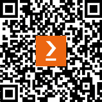

# 前言

Go 是一种多范式编程语言。这意味着面向对象范式和函数式范式都是完全有效的解决问题的方法。在这本书中，我们将探讨函数式编程技术在 Go 中的应用。但本书不会仅仅关注函数式方面，而是会拥抱 Go 的本质——多范式。这意味着我们将突出函数式和面向对象解决问题的不同方式。

为了编写更易于测试、阅读和可靠的 Go 代码，我们将探讨以函数式编程为首要方法的途径，如函数作为一等公民、函数纯净性、柯里化等。我们将不仅探讨如何编写函数式代码，还将探讨 Go 的性能影响和局限性。

本书的目标是让读者习惯将函数式编程作为一种有效的范式，无论你是在开发一个全新的项目，还是在已经深入 OO 范式的项目中工作，都能通过它来提升你的代码质量。

对于不熟悉 Go 中新引入的泛型的读者，本书也提供了一个示例，展示了泛型成为标准库的一部分后，现在可以实现的可能性。最后，我们还将探讨可以用来为 Go 的泛型前和泛型后版本编写函数式代码的库。

# 这本书面向的对象

如果你是一位有 Java 或 C++等传统面向对象语言背景的 Go 工程师，希望扩展你对函数式编程的了解，这本书就是为你准备的。本书旨在教你如何将函数式编程的概念应用于现有的 Go 代码中，以及何时选择函数式方法。在每一步中，我们将突出函数式和面向对象方法之间的权衡，以了解它们是如何比较的。

# 本书涵盖的内容

在*第一章*《介绍函数式编程》中，我们将从宏观的角度了解函数式编程背后的*是什么*和*为什么*。首先，我们将简要回顾函数式编程方法的历史和当代状态。然后，我们将探讨函数式编程与传统面向对象编程的比较。

在*第二章*《将函数视为一等公民》中，我们将详细探讨为什么在将函数视为**一等公民**的语言中，函数如此强大。Go 语言天生就支持函数作为一等公民，这意味着我们能够获得这种功能。我们将看到这是如何使我们能够创建以函数为中心的结构，从而提高我们代码的可读性和可测试性。

在*第三章*，*高阶函数*中，我们将通过高阶函数探索函数组合的概念。这里引入了许多新的概念，例如闭包、部分应用和函数柯里化。我们将探讨一些实际示例和实际用例。

在*第四章*，*使用纯函数编写可测试的代码*中，我们将探讨一个语言和一个函数被认为是纯函数的含义。我们将探讨函数纯度与不纯度之间的权衡，并探讨纯函数如何帮助我们编写可测试的代码。

在*第五章*，*不可变性*中，我们讨论了不可变性的确切含义，以及 Go 语言如何帮助在结构级别上保持不可变性。为了理解这是如何工作的，我们将看看 Go 如何处理对象的指针和引用，性能影响是什么，以及如何在指针-引用权衡之间做出决定。我们还将深入研究垃圾收集、单元测试和纯函数式编程的影响。

在*第六章*，*函数的三个常见类别*中，我们将探讨一些利用到目前为止所涵盖的函数式编程概念的函数的实际实现。我们将构建过滤器函数、映射函数和归约器。

在*第七章*，*递归*中，我们将讨论递归。这是一个所有程序员迟早都会遇到的话题，因为它并不仅限于函数式范式。任何允许你表达函数调用的语言也允许你表达本质上递归的函数。但在函数式语言中，这些函数占据了中心舞台。我们将探讨 Go 语言中这一点的含义。

在*第八章*，*使用流畅编程进行可读性函数组合*中，我们将探讨在函数式编程中链式调用函数的不同方法。这里的最终目标是编写更易于阅读的代码，并减少视觉混乱。我们将探讨三种实现这一目标的方法。首先，我们将看看如何使用类型别名将方法附加到容器类型上，从而允许我们使用熟悉的*点符号*创建链式函数。接下来，我们将探讨传递风格编程，并考虑每种方法的权衡。

在*第九章*，*功能设计模式*中，我们将提升到更高的抽象层次。我们不会谈论单个函数和操作，而是会探讨设计模式。虽然我们不会详细解释每个设计模式，但我们会看看面向对象模式如何转化为函数式世界。

在*第十章**，并发和函数式编程*中，我们考虑了并发无处不在，无论是在现实世界还是在虚拟世界中。在这一章中，我们将首先探讨并发、并行和分布式计算。接下来，我们将关注 Go 中的并发机制如何帮助我们编写函数式代码。

在*第十一章**，函数式编程库*中，我们将探讨几个可以帮助我们在函数式范式下构建程序的库。我们将查看既有的非泛型库和泛型库。

# 为了充分利用这本书

在拿起这本书之前，读者应该熟悉 Go 和泛型。编程语言的基本概念（控制流、结构体和导入）、如何构建和运行应用程序以及如何从 GitHub 导入开源库也应该为读者所理解。

| **本书涵盖的软件/硬件** | **操作系统要求** |
| --- | --- |
| Go（泛型和泛型之前） | Windows、macOS 或 Linux |

安装 Go 1.18 或更高版本是本书大多数内容的先决条件。某些章节也将适用于 1.18 之前的 Go 版本，这将在每个章节中说明。大多数代码也将适用于 Go playground[`go.dev/play/`](https://go.dev/play/)。

**如果您正在使用本书的数字版，我们建议您自己输入代码或从本书的 GitHub 仓库（下一节中有一个链接）获取代码。这样做将有助于避免与代码复制和粘贴相关的任何潜在错误。**

*一些章节将包含 Haskell 和 Java 的代码片段，以说明 Go 的（纯）函数式和面向对象对应物的示例*。

# 下载示例代码文件

您可以从 GitHub 下载本书的示例代码文件：[`github.com/PacktPublishing/Functional-Programming-in-Go`](https://github.com/PacktPublishing/Functional-Programming-in-Go)。如果代码有更新，它将在 GitHub 仓库中更新。

我们还有其他来自我们丰富的图书和视频目录的代码包，可在[`github.com/PacktPublishing/`](https://github.com/PacktPublishing/)找到。查看它们！

# 下载彩色图像

我们还提供了一份包含本书中使用的截图和图表彩色图像的 PDF 文件。您可以从这里下载：[`packt.link/5tPDg`](https://packt.link/5tPDg)。

# 使用的约定

本书使用了多种文本约定。

`文本中的代码`：表示文本中的代码单词、数据库表名、文件夹名、文件名、文件扩展名、路径名、虚拟 URL、用户输入和 Twitter 昵称。以下是一个示例：“在调用`rollDice`函数时，输出并不一致。如果它始终输出相同的数字，那将是一个非常糟糕的随机化函数。”

代码块设置如下：

```go
func rollDice() int {
	return rand.Intn(6)
}
```

任何命令行输入或输出都应如下所示：

```go
go test -bench=.
```

**粗体**：表示新术语、重要单词或屏幕上看到的单词。例如，菜单或对话框中的单词以**粗体**显示。以下是一个示例：“在这个主函数中，我们首先定义了一个在主函数结束前、函数退出前运行的**延迟**函数。”

小贴士或重要注意事项

看起来像这样。

# 联系我们

我们始终欢迎读者的反馈。

`customercare@packtpub.com`并在您的消息主题中提及书名。

**勘误表**：尽管我们已经尽一切努力确保内容的准确性，但错误仍然可能发生。如果您在此书中发现错误，我们将不胜感激，如果您能向我们报告，我们将不胜感激。请访问[www.packtpub.com/support/errata](http://www.packtpub.com/support/errata)并填写表格。

`copyright@packt.com`，并提供材料链接。

`authors.packtpub.com`。

# 分享您的想法

一旦您阅读了《Golang 中的函数式编程》，我们很乐意听到您的想法！请[点击此处直接进入此书的亚马逊评论页面](https://packt.link/r/9781803238012)并分享您的反馈。

您的评论对我们和科技社区非常重要，并将帮助我们确保我们提供高质量的内容。

# 下载此书的免费 PDF 副本

感谢您购买此书！

您喜欢在路上阅读，但无法随身携带您的印刷书籍吗？

您的电子书购买是否与您选择的设备不兼容？

不要担心，现在，随着每本 Packt 书籍，您都可以免费获得该书的 DRM 免费 PDF 版本。

在任何地方、任何设备上阅读。直接从您最喜欢的技术书籍中搜索、复制和粘贴代码到您的应用程序中。

优惠远不止于此，您还可以获得独家折扣、时事通讯和每日免费内容的每日电子邮件。

按照以下简单步骤获取好处：

1.  扫描下面的二维码或访问以下链接



[`packt.link/free-ebook/9781801811163`](https://packt.link/free-ebook/9781801811163)

1.  提交您的购买证明

1.  就这些！我们将直接将您的免费 PDF 和其他优惠发送到您的邮箱。

# 第一部分：函数式编程范式基础

在这部分，我们将探讨函数式编程范式包含的内容。我们将比较它与传统的面向对象方法，并学习每个范式编程语言之间的语言设计差异。我们还将讨论 Go 成为多范式语言的意义，并看看这对我们的用例有何好处。最后，我们将探讨函数式编程的一些关键思想，我们可以利用这些思想来编写更易读、可维护和可测试的代码。

本部分包含以下章节：

+   *第一章*，*介绍函数式编程*

+   *第二章*, *将函数视为一等公民*

+   *第三章**, 高阶函数*

+   *第四章**, 使用纯函数编写可测试的代码*

+   *第五章**, 不可变性*
