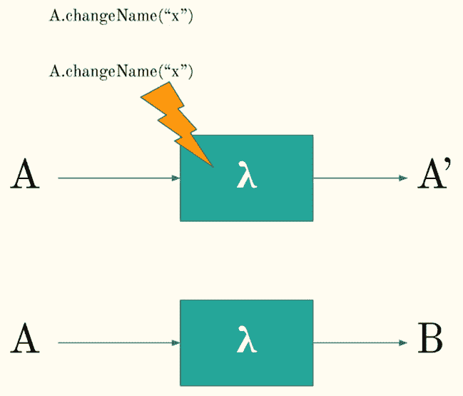
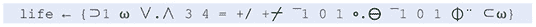

# 1

# 介绍函数式编程

在第一章中，我们将从宏观的角度了解**函数式编程**（**FP**）背后的**是什么**和**为什么**。在我们深入 FP 的细节之前，我们首先需要了解从应用这些技术到我们的代码中我们能获得什么好处。首先，我们将简要回顾 FP 的历史和当代状态。接下来，我们将探讨 FP 与传统**面向对象编程**（**OOP**）的比较。最后，我们还将讨论“Go 编程范式”。

本章我们将涵盖的主要内容如下：

+   什么是 FP？

+   FP 的简要历史

+   FP 的当前状态一览

+   传统面向对象和函数式方法的比较

+   关于 Go 编程范式及其如何融入 FP 的讨论

# 什么是函数式编程？

如你所猜，FP 是一种以函数为主角的编程范式。函数将是函数式程序员工具箱中的主食。我们的程序将由函数组成，以各种方式链接在一起以执行更复杂的任务。这些函数通常很小且模块化。

这与 OOP 形成对比，在 OOP 中，对象是主角。函数在 OOP 中也被使用，但它们的使用通常是为了改变对象的状态。它们通常与一个对象绑定在一起。这导致了熟悉的调用模式*someObject.doSomething()*。在这些语言中，函数被视为二等公民；它们被用来服务于对象的功能，而不是用于函数本身。

## 介绍一等函数

在 FP 中，函数被视为**一等公民**。这意味着它们被以类似于在传统面向对象语言中处理对象的方式对待。函数可以被绑定到变量名上，它们可以被传递给其他函数，甚至可以作为函数的返回值。本质上，函数被当作任何其他“类型”一样对待。这种类型与函数之间的等价性是 FP 力量的源泉。正如我们将在后面的章节中看到的，将函数视为一等公民为如何构建程序打开了一扇广泛的大门。

让我们看看将函数视为一等公民的一个例子。如果你觉得这里发生的事情还不完全清楚，不要担心；我们将在本书稍后的章节中对此进行详细介绍：

```go
package main
import “fmt”
type predicate func(int) bool
func main() {
    is := []int{1, 1, 2, 3, 5, 8, 13}
    larger := filter(is, largerThan5)
    fmt.Printf(“%v”, larger)
}
func filter(is []int, condition predicate) []int {
    out := []int{}
    for _, i := range is {
        if condition(i) {
            out = append(out, i)
        }
    }
    return out
}
func largerThan5(i int) bool {
    return i > 5
}
```

让我们稍微分析一下这里发生的事情。首先，我们使用“类型别名”来定义一个新的类型。这个新类型实际上是一个“函数”，而不是原始类型或结构体：

```go
type predicate func(int) bool
```

这告诉我们，在我们代码库的任何地方，当我们找到`predicate`类型时，它期望看到一个接受`int`并返回`bool`的函数。在我们的`filter`函数中，我们使用这个来表示我们期望一个整数切片作为输入，以及一个匹配`predicate`类型的函数：

```go
func filter(is []int, condition predicate) []int {…}
```

这些是函数在函数式语言和面向对象语言中处理方式不同的两个示例。首先，类型可以定义为函数，而不仅仅是类或原语。其次，我们可以将满足我们的类型签名的任何函数传递给`filter`函数。

在`main`函数中，我们展示了将`isLargerThan5`函数传递给`filter`函数的示例，类似于在面向对象语言中传递对象的方式：

```go
larger := filter(is, largerThan5)
```

这是我们可以用 FP 做到的一小部分示例。这个基本思想，即把函数视为我们系统中的一种类型，可以像结构体一样使用，将引导我们在这本书中探索的强大技术。

## 什么是纯函数？

FP 通常被认为是一种纯粹学术范式，在工业界应用很少或没有。我认为这源于一种观念，即 FP 在某种程度上比 OOP 更复杂、不够成熟。虽然 FP 的根源在学术领域，但这些语言的核心概念可以应用于我们在工业界解决的许多问题。

通常，FP 被认为比传统的 OOP 更复杂。我认为这是一个误解。当人们提到 FP 时，他们真正想说的是*纯 FP*。一个纯函数程序是 FP 的一个子集，其中每个函数都必须是纯的——它不能改变系统的状态或产生任何副作用。因此，纯函数是完全可预测的。给定相同的输入集，它总是产生相同的输出集。我们的程序变得完全确定。

本书将专注于 FP，而不将其视为“纯”FP 的更严格子集。这并不是说纯度没有给我们带来价值。在纯函数语言中，函数是完全确定的，系统的状态在调用它们时不会改变。这使得代码更容易调试和理解，并提高了可测试性。第六章专门讨论函数纯度，因为它可以为我们的程序带来巨大的价值。然而，从我们的代码库中根除所有副作用通常弊大于利。本书的目标是帮助您以改进可读性的方式编写代码，因此我们经常需要在（纯）函数式风格和更宽容的 FP 风格之间做出权衡。

为了简要而抽象地展示函数纯度是什么，考虑以下示例。假设我们有一个`Person`类型的结构体，其中有一个`Name`字段。我们可以创建一个函数来更改人的姓名，例如`changeName`。有两种实现方式：

+   我们可以创建一个函数，它接受一个对象，将`name`字段的内文更改为新名称，然后不返回任何内容。

+   我们可以创建一个函数，它接受一个对象，并返回一个应用了更改的新对象。原始对象不会被更改。

第一种方法并没有创建一个纯函数，因为它已经改变了我们系统的状态。如果我们想避免这种情况，我们可以创建一个`changeName`函数，该函数返回一个新的`Person`对象，该对象每个字段与原始`Person`对象具有相同的字段值，但在`name`字段中有一个新名字。这里的图更抽象地展示了这一点：



图 1.1：纯函数（顶部）与不纯函数（底部）的比较

在顶部的图中，我们有一个函数（用 Lambda 符号表示），它接受一个特定的对象**A**作为输入。它对这个对象执行一个操作，但不是改变这个对象，而是返回一个新的对象**B**，这个新对象应用了变换。底部的图显示了前面段落中解释的内容。该函数接受对象**A**，在对象值上“就地”进行更改，并返回空值。它只改变了系统的状态。

让我们看看这将在代码中是什么样子。我们首先定义我们的结构体，`Person`：

```go
type Person struct {
    Age  int
    Name string
}
```

要实现一个会修改`Person`对象并在`Name`字段中放置新值的函数，我们可以编写以下代码：

```go
func changeName(p *Person, newName string) {
    p.Name = newName
}
```

这与图的下部相当；传递给函数的`Person`对象被修改了。现在我们系统的状态与函数调用之前不同。现在所有引用该`Person`对象的地方都将看到新名字而不是旧名字。

如果我们用纯函数的方式来写这个，我们会得到以下结果：

```go
func changeNamePure(p Person, newName string) Person {
    return Person{
        Age:  p.Age,
        Name: newName,
    }
}
```

在这个第二个函数中，我们复制了原始`Person`对象（`p`）的`Age`值，并将`newName`值放置在`Name`字段中。这个结果作为新对象返回。

虽然从表面上看，前一种不纯的写法似乎更容易且更省力，但对于维护一个函数可以改变系统状态的系统来说，其影响是巨大的。在更大的应用程序中，保持对你系统状态的清晰理解将帮助你更容易地调试和复制错误。

这个例子考察了在不可变数据结构上下文中的纯函数。纯函数不会改变我们系统的状态，并且对于相同的输入总是返回相同的输出。

在这本书中，我们将关注函数式编程（FP）的精髓以及我们如何将技术应用于 Go 语言以创建更易读、可维护和可测试的代码。我们将探讨核心构建块，如高阶函数、函数柯里化、递归和声明式编程。如前所述，FP 不等同于“纯”FP，但我们将讨论纯度方面。

## 随意说出你想要的内容，而不是你想要的方式

函数式编程语言之间有一个共同点，那就是函数是声明性的，而不是命令性的。在函数式语言中，作为程序员，你可以说出你想要实现的目标，而不是实现它的方法。比较这两个 Go 代码片段。

这里第一个片段是一个有效的 Go 代码示例，其中结果是通过声明性获得的：

```go
func DeclarativeFunction() int {
    return IntRange(-10,10).
        Abs().
        Filter(func(i int64) bool {
            return i % 2 == 0
        }).
        Sum()
    // result = 60 
}
```

注意，在这段代码中，我们说了以下内容：

+   给我们一个介于 -10 和 10 之间的整数范围

+   将这些数字转换为它们的绝对值

+   筛选出所有的偶数

+   给我们这些偶数的总和

我们没有说如何实现这些事情。在命令式风格中，代码看起来如下：

```go
func iterativeFunction() int {     
    sum := 0
    for i := -10; i <= 10; i++ {
        absolute := int(math.Abs(float64(i)))
        if absolute%2 == 0 {
            sum += absolute
        }
    }    
    return sum
}
```

虽然，在这个例子中，对于有 Go 经验的人来说，这两个片段都很容易阅读，但我们可以想象，对于更大的例子，这种情况将不再成立。在命令式示例中，我们必须明确地说明计算机应该如何给我们一个结果。

# 函数式编程的简要历史

如果你看看过去十年的主流语言，你会注意到主流的编程范式是**面向对象编程**（OOP）。这可能会让你认为函数式编程是一种新兴的范式，与成熟的面向对象方法相比，它处于一个年轻的状态。然而，当我们看看函数式编程的历史，我们可以追溯到 1930 年代，这比我们谈论现代意义上的编程要早得多。

函数式编程的根源可以追溯到 1930 年代由 Alonzo Church 开发的 Lambda 演算。这是一个基于函数抽象和应用的正式系统，使用变量绑定。这个演算有两种变体；它可以是**类型化**的，也可以是**无类型**的。这与今天的编程语言直接平行，例如 Java 和 Go 是**静态类型**的，而 Python 是**动态类型**的。Lambda 演算在 1937 年被证明是图灵完备的——再次，这与今天所有主流编程语言都是图灵完备的相似。

Lambda 演算比现代编程早了几十年。要到达第一个可以被认为是函数式编程的代码，就像我们今天理解的编程一样，我们必须向前推进几十年。**LISt Processor**（**LISP**）最初在 1950 年代被创建，作为一种数学符号的实际应用。这受到了 1930 年代 Church 提出的 Lambda 演算的影响。

LISP 可以被认为是第一个达到一定知名度的函数式编程语言。它在人工智能研究领域尤其受欢迎，但经过几十年，它逐渐进入了工业领域。LISP 的衍生语言在很长时间内一直很受欢迎， notable achievements such as the Crash Bandicoot game, and Hacker News being written in derivatives of this language.

LISP 是在 20 世纪 50 年代末由约翰·麦卡锡开发的。为了定义 LISP 函数，他从丘奇开发的 Lambda 演算中汲取了灵感。通过引入递归，一个对于函数式语言工作方式的基本概念，它将 LISP 扩展到了数学系统之外。除了递归之外，LISP 还将函数视为一等公民，并通过包括垃圾回收和条件语句等特性推动了编程语言设计的创新。

在 20 世纪 60 年代初，肯尼思·E·伊夫森开发了**A 编程语言**（**APL**）。APL 再次是一种函数式语言，它最著名的可能是其符号的使用和简洁的代码。例如，以下是一个生成康威生命游戏的代码片段的图像：



图 1.2：APL 中的康威生命游戏

跳过十年，到了 1973 年，我们得到了一种名为**元语言**（**ML**）的语言。这种语言引入了*多态的 Hindley-Milner 类型系统*——也就是说，一个类型系统，其中类型是自动分配的，无需显式类型注解。此外，它还支持诸如**函数柯里化**等特性，我们将在本书后面的功能 Go 代码中应用这些特性。它还支持对函数参数进行模式匹配，正如我们可以在以下计算数字阶乘的函数片段中看到的那样：

```go
fun fac 0 = 1
  | fac n = n * fac (n – 1)
```

在这个例子中，模式匹配器将查看输入值是`fac`函数的什么，然后如果输入值是`0`，则继续第一行，在其他所有情况下则继续第二行。请注意，这也是一个表达得相当优美的递归函数。遗憾的是，本书将不会进一步探讨模式匹配，因为 Go 目前没有提供执行此操作的方法。我们将看到一种使用映射和高阶函数执行类似类型函数分派的方法。

1977 年，创建了一种名为 FP 的语言。约翰·巴克特开发这种语言是为了专门支持 FP 范式。虽然这种语言本身在学术界之外并没有得到太多关注，但它介绍该语言的论文（*能否从冯·诺伊曼风格中解放编程？*）确实重新激起了对 FP 的兴趣。

在 ML 和 FP 相同的十年中，还开发了一种名为**Scheme**的语言。这是 LISP 的第一个使用词法作用域和尾调用优化的方言。尾调用优化导致了递归算法的实际实现。虽然本书第七章（[B18771_07.xhtml#_idTextAnchor113]）将讨论尾调用优化的细节，但简要地说，它允许递归算法以有效的方式实现，并且不需要比传统循环更多的内存，从而消除了在深度递归过程中可能发生的“栈溢出异常”。

Scheme 是影响最大的 LISP 方言之一，至今仍有一定的人气。尽管它是在 1975 年创建的，但最新的标准是在 2013 年定义的（R7RS-Small）。Scheme 反过来又影响了其他 LISP 方言，其中最著名的是 Common Lisp。有趣的是，尽管起源于 FP，Common Lisp 引入了**Common Lisp 对象系统**（**CLOS**）。CLOS 促进了 LISP 中的面向对象编程。因此，我们可以将 LISP 视为一个真正的多范式语言，就像 Go 一样。

在我们转向当代函数式语言之前，最后要讨论的语言是 Miranda。Miranda 是一种懒加载的纯函数式语言。这里引入的关键概念是懒加载。当一个语言声称支持懒加载时，这意味着表达式只有在实际需要值时才会被解析。它可以用来实现无限数据结构。例如，你可以定义一个生成所有斐波那契数的函数，这是一个永不结束的序列——但是，而不是创建整个列表（这是不可能的），它只会生成与你要解决的问题相关的列表子集。例如，以下 Miranda 代码片段计算所有平方数：

```go
squares = [ n*n | n <- [0..] ]
```

这样，我们就到达了下一个要简要讨论的语言，即 Haskell。

# 现代函数式编程

在简要回顾了函数式编程的历史之后，是时候深入现代函数式语言了。在严格的函数式编程语言中，Haskell 是今天流行的一种语言。当人们学习 FP 或接触到它时，通常是通过这种语言。Haskell 是一种静态类型函数式语言。它有诸如类型推断（类似于 ML）和懒加载（类似于 Miranda）等好处。

当人们想要了解更多关于纯 FP 的知识时，我的建议总是从 Haskell 开始。它有一个优秀的社区和丰富的资源，并教你所有关于 FP 领域的内容。

它可能是最受欢迎的纯函数式语言，但在 GitHub 上的活跃用户不到 1%([`www.benfrederickson.com/ranking-programming-languages-by-github-users/`](https://www.benfrederickson.com/ranking-programming-languages-by-github-users/))。有趣的是，如果我们看看 Go，它目前大约有大约 4%的活跃用户。对于一个大约十年前才出现的语言来说，这已经很不错了！

在.NET 的世界中，另一种相对流行的语言是 F#。虽然这并不是像 Haskell 那样的纯函数式语言，但它是一种*以函数优先*的语言。它更倾向于函数范式，但并不强制执行。与 Haskell 类似，它在 GitHub 上的活跃用户不到 1%。然而，C#似乎获得了 F#的所有流行特性，因此至少 F#为.NET 带来的函数概念将会受到欢迎。

那这意味着函数式编程在到来时就死了？嗯，并不完全是这样。你现在正在阅读的这本书是关于 Go 的，而 Go 并不是一种纯粹的函数式编程语言。我的看法是，函数式编程的概念通常是有用的，并且可以在面向对象的语言中创建更好的代码——而且我希望我不是唯一这样想的人。我们认为是面向对象的语言中的许多语言已经变得越来越函数式。

我们甚至可以在最流行的主流面向对象语言中看到这种转变的发生。Java 在每次迭代中都引入了函数式编程的概念，提供了诸如模式匹配、高阶函数和通过 Lambda 函数的声明式编程等功能。C# 在每次发布中都越来越像 F#（C# 的微软函数式编程对应物）。它们实现了模式匹配、不可变性、内置元组支持等更多功能。

这种转变正在发生，因为尽管纯粹的函数式编程语言可能并不总是适合工业界，但函数式编程语言的概念使我们能够更有信心地编写面向对象的代码。它们导致代码更容易测试、更容易阅读，并且更容易调试。

目前最受欢迎的编程语言是 JavaScript。虽然当谈到函数式编程时，这或许不会立刻出现在人们的脑海中，但它确实满足了我们对于函数式语言的一部分“要求”。它具有以下特点：

+   首等函数

+   匿名（Lambda）函数

+   闭包

当结合这些特性时，我们可以创建许多结构，使我们能够以函数式编程风格利用代码。

对于那些希望在浏览器中拥有纯粹函数式语言的人来说，有一些语言可以转换为 JavaScript，例如 Elm 和 PureScript。

现在让我们来看看这本书的明星，Go 语言，以及它是如何融入这幅图画的。

# Go 编程范式

除非这是你第一次接触 Go 语言，否则你可能知道 Go 是一种静态类型编程语言。你也知道它有 struct，我们可以从这些 struct 中实例化对象。你很可能也知道 Go 语言可以选择性地将函数绑定到 struct 上，但这不是必需的。完全有可能编写一个不创建对象的整个 Go 程序，这在更严格的面向对象语言中很少允许。

事实上，Go 语言中最简单的 `Hello World` 程序并没有 struct 或对象的意识：

```go
package main
import “fmt”
func main() {
     fmt.Println(“Hello Reader!”)    
}
```

如你所见，当我们开始学习 Go 语言时，许多人编写的入门级 Go 程序没有 struct 或对象的意识来执行有用的操作。`Println` 是在 `fmt` 包中定义的函数，但它并没有绑定到对象上。

对于像 Go 这样的语言，术语是多范式的。Go 语言并不强迫我们用面向对象范式或函数式范式来编写代码。我们，程序员，有完全的自由来按自己的意愿使用这种语言。这就是你现在正在阅读的这本书存在的原因。

Go 提供了几个特性，使我们能够相对轻松地编写功能性的 Go 代码：

+   函数作为一等公民

+   高阶函数

+   不可变性保证

+   泛型（虽然不是必需的，但可以使生活更轻松）

+   递归

这些内容将在本书的后续部分进行更详细的探讨。我还想指出一些 Go（截至 1.18 版本）缺乏的特性，这些特性将提高我们的生活质量：

+   尾调用优化

+   惰性求值

+   纯净性保证

这些并不是决定性的因素。本书的重点是利用 FP 在 Go 中编写更好的代码。即使我们没有纯静态类型系统可供工作，我们也可以利用我们所拥有的。

我绝不想将 FP 定位为编写 Go 代码的优越方式。我也不想将其定位为“正确”的范式选择。Go 是多范式的，就像程序员为任何问题选择正确的语言一样，我们也要为每个问题选择正确的范式。我们甚至可以选择在 90% 的时间里坚持函数式概念，最终得到的代码比完全坚持它时更干净。例如，编写纯函数式代码将防止使用任何副作用。然而，许多副作用确实有其作用。任何我们想要向用户展示输出或从用户那里获取输入的时候，我们实际上都在处理副作用。

# 为什么选择函数式编程？

所有这些还不足以告诉我们为什么我们要投入时间学习函数式编程。我们希望通过函数式编程获得的主要好处如下：

+   更易于阅读的代码

+   更容易理解和调试代码

+   更容易的测试

+   更少的错误

+   更容易的并发

这些可以通过一组相对较小的 FP 特性来实现。为了编写更易于阅读的代码，可以通过声明式编程来实现。声明式编程将向我们展示正在发生的事情，而不是如何发生。声明式代码通常比命令式代码更简洁。简洁性并不一定是代码可读性的好处（记得之前提到的 APL 例子吗？），但正确应用时，它可以成为好处。

FP 通过优先考虑纯净性而非杂质，使代码更容易理解、调试和测试。当每个函数总是产生一个确定的输出时，我们可以相信函数只做它所说的。当你遇到一个名为 `square(n int)` 的函数时，我们可以确信该函数所做的只是对输入进行平方。

此外，系统状态不会改变。如果我们正在处理结构和对象，这有助于我们保证对象持有的值不会被操作它的函数所改变。这减少了推理程序时的认知负担。

纯净、不可变的代码使代码更容易测试，以下是一些原因：

+   系统的状态不会影响我们的函数——因此我们在测试时不需要模拟状态。

+   对于给定的输入，一个给定的函数总是返回相同的输出。这意味着我们得到了可预测的、确定的函数。

我不会在这里提倡测试驱动开发或任何类似的东西，但我确实认为测试对于编写好代码至关重要。至少，可以避免在凌晨 3 点被叫醒，因为一个函数开始向用户抛出无法理解的错误代码。

与可测试的代码相结合，函数式编程帮助我们编写更少的错误。这可能很难量化，但这里的想法是，没有可变状态，并且代码中只有可预测的函数，我们将有更少的边缘情况需要考虑。如果状态对程序很重要，你必须知道，在每一个时间点，系统的状态可能是什么以及它如何影响你正在编写的函数。这会很快变得复杂。

最后，函数式编程将使编写并发代码变得更加容易。Go 以其内置的并发特性而闻名。并发性是 Go 从诞生之初就具备的特性，而不是像一些其他主流语言那样后来才添加的。因此，Go 拥有相当坚实的并发编程工具。

函数式编程帮助的方式在于函数是确定性和不可变的。因此，并发运行相同的函数永远不会影响另一个正在运行函数的结果。如果函数从不依赖于系统的状态，线程 A 不能使线程 B 的系统状态无效。

我想再次强调的一点，因为它很重要，就是我不会提倡在 Go 中坚持纯函数式编程。这样做可能会让你的生活，以及你同事的生活，比本应更艰难。选择适合工作的正确工具——有时那将是对象，有时那将是函数。

# 为什么不在 Go 中使用函数式编程？

为了提供一个全面的视角，了解函数式编程如何帮助我们，作为 Go 程序员，我们还应该考虑何时不使用函数式编程。我认为函数式编程是我的工具箱中的一个工具，当一个问题适合使用它时，我会乐意使用它——但同样重要的是，我们必须认识到何时这行不通。

关于函数式编程（FP）的一个担忧是性能——虽然关于这个话题有很多可以说的，正如我们将在后面的章节中看到的，性能担忧可能意味着我们会为了追求速度而放弃一些函数式概念，比如不可变性。这比一开始听起来要复杂得多，因为 Go 的指针并不保证比 Go 的按值传递函数更快。我们将在后面的章节中进一步探讨性能担忧。

不选择函数式编程的另一个原因是 Go 缺乏尾调用优化。理论上，你程序中写的每个循环都可以被递归调用所替代，但截至 Go 1.18，Go 没有必要的工具来有效地执行此操作，你可能会遇到栈溢出。我们将会看到有绕过这个问题的方法，但如果它开始显著牺牲性能或可读性，我的建议是直接写一个循环。这并不是说递归永远不会是正确的方法。如果你广泛地使用过树或图，你可能已经编写了一些递归算法，并发现它们工作得很好。

最后，如果你正在处理一个有许多其他贡献者的现有代码库，最好的做法是遵循代码库的风格。虽然函数式编程的一些概念可以相当容易地引入，但在一个不支持整个想法的团队中强制执行它们会更难。幸运的是，今天许多程序员都看到了函数式编程关键概念的益处。即使在 Java 或 C# 中，不可变代码的想法也被接受。同样，副作用也越来越被视为不受欢迎的。

让我们拥抱 Go 作为一种完全的多范式语言，并在合理的地方利用每个范式。

# 比较函数式编程（FP）和面向对象编程（OOP）

正如我们在前面的页面所看到的，函数式编程并不完全是新事物。实际上，它比面向对象范式早了几十年。虽然 Go 是多范式的，我们可以接受两种编程风格，但让我们快速看一下两者之间的具体比较。

| **函数式编程** | **面向对象编程** |
| --- | --- |
| 函数是基础 | 类和对象是基础 |
| 声明式代码 | 命令式代码 |
| 优先考虑不可变性 | 可变状态 |
| 可以强制纯净性 | 通常不关注纯净性 |
| 递归 | 循环 |

表 1.1：比较函数式编程（左）和面向对象编程（右）

这种比较有点肤浅。许多面向对象的语言也有递归的概念，但并不总是语言设计的核心。同样，面向对象的代码可以封装可变状态，并尽可能多地尝试实现不可变性。

在当今世界，即使是传统上被认为是面向对象的编程语言，如 Java，实际上也在变得越来越多范式。

作为旁注，这种比较可能会让人感觉只有三种可能的范式：函数式、面向对象或多范式。虽然这些确实是最常见的，但还有其他范式，如文献编程、逻辑编程和响应式编程。由于面向对象编程在这个领域是主要参与者，因此大多数读者都熟悉，这本书将重点关注比较。

# 摘要

正如我们在第一章中看到的，FP 范式并不是“新来的孩子”。它是一种起源于 20 世纪 30 年代 Alonzo Church 工作的范式。自 20 世纪 50 年代以来，它一直持续稳定地受到投资，各种语言推动了这一范式不断向前发展。

正如我们看到的，FP 和 OOP 在现代语言中越来越多地被结合在一起，Java 和 C#将函数式范式的思想整合到它们的面向对象范式中。本书的明星语言 Go 更进一步，是一种多范式语言。Go 赋予我们完全的自由，以最适合我们的领域编写代码。

从本章中需要记住的核心思想是，FP 范式将帮助我们编写更容易测试、阅读和维护的代码。它通过限制副作用、不改变我们系统的状态以及偏好小型可组合函数来减少认知负担。

最后，我们还需要记住，尽管在这本书中我们提倡 FP 范式，但 Go 语言是多范式的，我们必须为解决我们正在解决的问题选择正确的范式。
