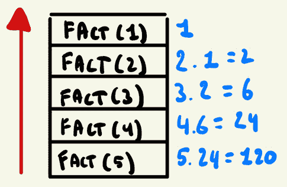
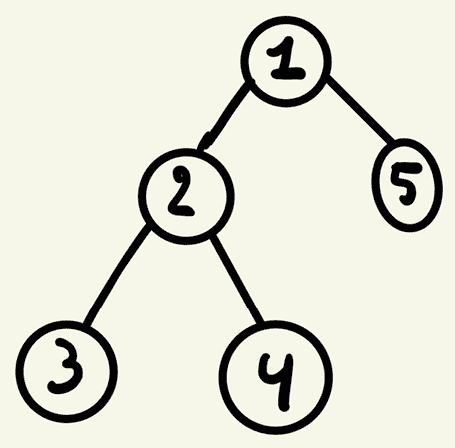
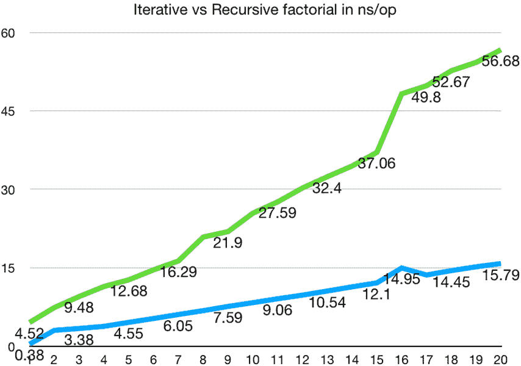

# 7

# 递归

在本章中，我们将讨论递归。这是一个所有程序员迟早都会遇到的话题，因为它并不局限于函数式范式。任何允许你表达函数调用的语言都允许你表达本质上递归的函数。对于许多人来说，这并不是一个一开始就难以理解的话题。在 Haskell 等函数式编程语言中，递归占据着中心舞台。

因此，本章致力于理解递归的确切工作方式，包括这样做所带来的性能影响，以及 Go 中递归的限制。我们还将探讨一些使用函数作为一等公民处理递归的实用结构。

在本章中，我们将涵盖以下主要内容：

+   递归的含义

+   为什么使用递归函数？

+   何时以及如何使用递归函数

+   利用函数作为一等公民来编写递归函数

+   理解 Go 中递归函数的限制

+   理解尾递归和编译器优化

本章我们将学习的内容将为我们在后续章节中讨论 Continuation-Passing style 和流畅编程打下成功的基础。

# 技术要求

对于本章，您应使用 Go 1.18 或更高版本的任何版本。所有代码都可以在 GitHub 上找到，链接为 [`github.com/PacktPublishing/Functional-Programming-in-Go./tree/main/Chapter7`](https://github.com/PacktPublishing/Functional-Programming-in-Go./tree/main/Chapter7)。

# 什么是递归？

简而言之，递归函数是一个调用自身的函数。在实践中，这意味着以下函数是一个递归函数的例子：

```go
func recursive() {
    recursive()
}
```

在这个例子中，如果用户调用函数“recursive”，它只会无限期地调用自身。实际上，这是一个无限循环，并不是最有用的函数。为了使递归函数有用，我们可以通过设置两条规则来进一步扩展递归函数的定义：

+   函数必须有一个条件，以便它可以调用自身（递归）

+   函数必须有一个条件，它在不调用自身的情况下返回

第一个条件只是说明，在函数体中的某个点上，函数 `X` 将再次被调用。第二个条件是存在一种情况，函数 `X` 在不调用自身的情况下从函数中返回。这个第二个条件通常被称为递归函数的*基准情况*。

为了理解这看起来是什么样子，让我们实现一个经典的数学运算，这个运算非常适合递归，即阶乘函数。阶乘函数定义为给定一个输入 *N*，将 *N* 下的所有数字乘到 1；例如：

```go
Fact(5) = 5 * 4 * 3 * 2 * 1
```

为了理解为什么这是一个递归函数，我们可以展示调用 `Fact(5)` 的结果实际上是调用 5 乘以调用 `Fact(4)` 的结果。因此，如果我们这样写出来，我们会得到以下结果：

```go
Fact(5) = 5 * Fact(4) = 5 * 24 = 120
Fact(4) = 4 * Fact(3) = 4 * 6 = 24
Fact(3) = 3 * Fact(2) = 3 * 2 = 6
Fact(2) = 2 * Fact(1) = 2 * 1 = 2
Fact(1) = 1 * Fact(0) = 1 * 1
Fact(0) = 1
```

注意，在这个例子中，0 的阶乘简单地等于 1。这被定义为我们的基本情况；当将 0 的值传递给我们的函数时，我们简单地返回整数值 1。然而，在所有其他输入情况下，我们正在将输入数字与调用阶乘函数 `input-1` 的输出相乘。

如果我们将这段代码转换为 Go 代码，我们会得到以下结果：

```go
func main() {
    fmt.Println(Fact(5))
}
func Fact(input int) int {
    if input == 0 {
        return 1
    }
    return input * Fact(input-1)
}
```

如果你有一段时间没有看到递归了，可能需要几分钟的时间来理解这里发生的事情。一种思考方式是，每次对 `Fact` 的函数调用都会将一个函数推入我们的栈中。当所有函数都推入栈中时，它们从上到下被评估，栈的每一层都可以使用来自上一层的结果：



图 7.1：递归函数调用和栈分配

以这种方式思考基于栈的递归将帮助我们理解本章后面递归的例子和陷阱。但在我们到达那里之前，让我们看看你为什么可能想要选择编写递归函数而不是迭代函数，以及为什么函数式语言通常更喜欢递归。

# 为什么函数式语言更喜欢递归？

在我们讨论在 Go 中何时使用递归函数之前，让我们回答一下为什么函数式语言似乎更喜欢递归而不是 `for` 循环。最好的答案是递归本质上比迭代解决方案更纯净。尽管每个可以用递归表示的程序也可以用迭代表示，但迭代解决方案需要维护比递归解决方案更多的状态。

我们简单的阶乘示例在编写迭代实现时突出了这一点：

```go
func factorial(n int) int {
    result := 1
    for i := 1; i <= n; i++ {
        result = result * i
    }
    return result
}
```

在这个阶乘实现中，我们在 `for` 循环的每次迭代中修改“结果”。这是一个封闭的修改，因为它没有逃离函数本身，但无论如何它是一个修改状态的操作。与此同时，我们的纯递归示例从不修改状态。它不是修改状态，而是通过将输入参数与函数调用的输出组合来返回一个新的值：

```go
return input * Fact(input-1)
```

作为一条一般规则，递归允许我们创建具有复制状态的新函数，修改这些复制，并返回结果，所有这些都不需要在递归调用本身中修改任何值。这意味着程序状态的变化被包含在每个栈帧中。

Go 中的递归状态变化

在 Go 和其他非纯语言中，在递归函数调用中修改状态是可能的。在这些语言中，递归并不保证状态的不可变性，但它确实使得编写不可变实现变得更加容易。

# 何时使用递归函数

要了解何时使用递归函数，我们必须讨论迭代函数和递归函数之间的主要权衡。但在我们到达那里之前，让我们首先说，任何可以用迭代实现的东西也可以用递归实现。因此，任何在 Go 中有`for`语句的函数都可以替换为使用递归函数调用的等效函数来代替`for`循环。

然而，我们并不总是希望这样做。递归函数的两个主要缺点是它们通常需要更多的时间和空间。多次调用函数会创建多个栈帧。这些栈帧消耗了我们程序部分的工作内存。通常，每个栈帧都会包含从其下方栈帧（在递归函数中）复制的数据，这意味着在先前的阶乘示例中，每个函数调用使用的内存量与之前的函数相似。然而，所有这些栈帧在某个时刻都是活跃的。递归调用栈不会在最后的递归调用完成之前弹出栈。因此，在*图 7.1*中，我们可以看到所有栈帧叠加在一起，然后从上到下进行评估（**后进先出**，或**LIFO**）。如果我们以迭代的方式编写相同的函数，我们只会有一个函数在调用栈上。

递归函数的第二个限制是它们通常比它们的迭代版本慢。这主要是因为从编程语言特性的角度来看，函数调用是昂贵的操作。鉴于我们刚刚学到的关于调用栈的知识，这很有道理。每个函数调用都必须将内存复制到新位置，执行核心算法，然后再次复制以供下一次递归调用使用。

那么，我们为什么还想继续使用递归函数呢？好吧，尽管这些限制很重要，但我们的主要目标是实现代码的可读性和可维护性。一旦掌握递归，可以使程序不仅更容易编写，也更容易理解。涉及遍历图或树的问题很容易适合递归函数（因为这些数据结构本身就是递归数据结构）。本书的一个主要主题是我们将为了你，程序员，以及代码的后续读者方便而权衡性能。

作为旁注，在 Haskell 等语言中，编写递归函数比在 Go 中涉及更少的语法开销——特别是当与称为*模式匹配*的概念结合使用时。在不偏离本章核心内容太多的情况下，让我们快速看一下 Haskell 中的阶乘实现：

```go
factorial :: Integral -> Integral
factorial 0 = 1
factorial n = n * factorial (n-1)
```

上述代码片段是阶乘函数的完整实现。注意，它几乎就像是对问题的更数学化的描述。这使得编写递归解决方案更具吸引力。此外，Haskell 还会对递归函数进行编译器级别的优化。我们将在本章后面简要介绍一种这样的优化，即尾调用优化。

## 遍历树

为了演示前面的假设，即某些代码以递归方式编写比以函数方式编写更容易，让我们看看遍历树的示例。树是递归数据结构，因此应该适合这种实现。为了简单起见，让我们假设我们有一个存储整数的树；实际值并不那么重要。我们将构建一个看起来像这样的树：



图 7.2：二叉树示例

每个节点的实际值并不重要，但让我们假设我们想要找到所有节点的和。用简单的话说，我们必须获取每个节点的值。然后，对于每个节点，我们需要确定它是否有子节点。如果有，我们将子节点的值添加到我们的运行和中。接下来，对于所有这些子节点，我们需要确定它们是否有子节点，如果有，也将它们的值添加到我们的运行和中。我们这样做，直到我们看到了所有节点。

为了演示这一点，让我们创建一个表示我们的树的数据结构。类型声明本身很简单：我们有一个包含值的节点，每个节点都有一个指向左子节点和右子节点的指针。这些子节点是可选的：

```go
type node struct {
        value int
        left  *node
        right *node
}
```

在设置好这个结构之后，让我们也介绍一个实际的树，我们可以在本章后面演示我们的示例函数。我们可以在 `var` 块中创建这个作为包级别的对象。我们将模拟 *图 7.2* 中显示的树：

```go
var (
        ExampleTree = &node{
                value: 1,
                left: &node{
                        value: 2,
                        left: &node{
                                value: 3,
                        },
                        right: &node{
                                value: 4,
                        },
                },
                right: &node{
                        value: 5,
                },
        }
)
```

在我们将它写成递归解决方案之前，让我们先使用普通的 `for` 循环将其写成迭代解决方案。

### 使用 `for` 循环迭代解决树问题

在我们能够使这成为可能之前，我们需要引入一些额外的数据结构。我们将使用的数据结构是一个 `Queue`。对于每个我们访问的节点，我们将节点的值添加到我们的和中。对于节点的每个子节点，我们将子节点添加到我们的 `Queue` 中。我们将继续这样做，直到我们的 `Queue` 为空。作为一个起始值，我们将树的根添加到我们的 `Queue` 中，以启动整个过程。

一个重要的免责声明是，在撰写本文时，Go 并没有提供易于使用的、开箱即用的队列实现。然而，Go 确实包含开箱即用的缓冲通道。我们可以使用缓冲通道来获得类似队列的行为，这正是我们将要演示的。要获得类似队列的行为，以下是一些主要属性：

+   能够将一个元素推送到队列中

+   能够以 LIFO（后进先出）风格从队列中弹出（移除）一个元素

你可以使用切片来获取这种行为，但这甚至需要一些管理切片的开销，并且这不是最高效的实现。一个真正的队列将提供常数时间的添加和删除。关于这一点，也许缓冲通道在底层以优化的方式执行此操作，但这超出了本书的范围。然而，我们必须做出的一个必要假设是，我们事先知道队列的大小。

在现实世界的场景中，情况往往并非如此。你可以将队列大小的最佳努力估计传递给缓冲通道，但这似乎容易出错。为了教学目的，并且不分散对算法本质的注意力，我们暂时接受这些假设。在此声明之后，让我们学习如何迭代地实现一个获取树中所有节点之和的函数：

```go
func sumIterative(root *node) int {
        queue := make(chan *node, 10)
        queue <- root
        var sum int
        for {
                select {
                case node := <-queue:
                        sum += node.value
                        if node.left != nil {
                                queue <- node.left
                        }
                        if node.right != nil {
                                queue <- node.right
                        }
                default:
                        return sum
                }
        }
}
```

在这个例子中，我们增加了一些额外的开销，因为我们正在使用缓冲通道管理我们的队列行为。然而，核心算法是相同的。你可以想象，在使用真正的队列实现时，如果没有`select`块，可以节省一些代码行。

接下来，让我们看看我们如何递归地解决这个问题。

### 递归解决树问题

当递归地思考这个问题时，它变得更加清晰和易于实现。

记住，从我们的阶乘示例中，我们是在遇到一个基本案例时向我们的栈帧添加调用，对于这个基本案例，我们可以返回一个值而不调用函数本身。这个实现的基本案例是一个缺失的节点（nil 指针）。这样的节点将返回 0，因为没有要做的和。对于其他每个节点，我们返回其值的和，以及所有子节点值的和。将此可视化为一个栈，我们是从底部到顶部向栈中添加帧，但是从顶部到底部进行评估，随着我们的进行，汇总总和：

```go
func sumRecursive(node *node) int {
        if node == nil {
                return 0
        }
        return node.value + sumRecursive(node.left) +
            sumRecursive(node.right)
}
```

这段递归代码是解决此问题的一种方法，开销不大。它是迭代解决方案的更易读版本，我们的代码更接近我们的意图。递归解决方案如何与我们迄今为止学到的函数式编程相关？

在函数式编程语言中，你想要告诉计算机“解决什么”问题，而不是“如何”解决问题。当你手动编写循环时，你坚定地处于给定问题的“如何”领域，而不是“解决什么”领域。此外，我们的递归解决方案在任何地方都没有修改状态，这使我们更接近函数式编程世界中的理想函数。

函数式语言与循环

虽然在函数式语言中更倾向于使用递归，但许多语言也提供了创建手动循环的结构。话虽如此，它们通常为递归函数提供编译器优化，这使得它们成为解决问题的更有吸引力的选择。

# 递归与函数作为一等公民

本章到目前为止所看到的内容可以应用于任何具有函数调用的语言，即使在更严格遵循面向对象领域的语言中也是如此。在本节中，我们将学习如何利用一些使递归编写和管理更简单的函数式和多范式语言的概念。

我发现最有用的功能之一是将递归与闭包结合。为了举例说明何时这很有用，想象一下在递归处理数据结构时需要跟踪一些状态。与其在包级别跟踪状态，或者使递归函数复杂化以在递归函数中跟踪状态，*我们可以创建一个非递归的外部函数，然后使用递归的内层函数*。让我们用一个例子来演示这一点，以消除一些潜在的混淆。

使用与上一个例子相同的树，让我们编写一个函数来找到树中节点的最大值。为了实现这一点，我们需要一种跟踪最大值的方法，我们之前已经看到了。实现这一点的选项之一是在递归函数外部跟踪状态。这很混乱但会起作用。例如，以下代码遍历树并使用全局变量跟踪遇到的最大值如下：

```go
var maximum = 0
func MaxGlobalVariable(node *node) {
        if node == nil {
                return
        }
        if node.value > maximum {
                maximum = node.value
        }
        MaxGlobalVariable(node.left)
        MaxGlobalVariable(node.right)
}
func main() {
        maximum = int(math.MinInt)
        MaxGlobalVariable(ExampleTree)
        fmt.Println(maximum)
}
```

上述代码不是理想的解决方案。首先，使用全局变量跟踪任何状态应该受到谴责。在编写多线程代码时，这会导致巨大的麻烦，如果你在递归函数运行之前忘记重置全局变量，结果将不可靠，即使是单线程运行。

另一种更好的方法是跟踪每次递归调用中的当前最大值。这是通过扩展函数签名来实现的，使其包括我们正在跟踪的整数值，如下面的代码所示：

```go
func.maxInline(node *node,
    maxValue int) int {
        if node == nil {
                return maxValue
        }
        if node.value > maxValue {
                maxValue = node.value
        }
        maxLeft := maxInline(node.left, maxValue)
        maxRight := maxInline(node.right, maxValue)
        if maxLeft > maxRight {
                return maxLeft
        }
        return maxRight
}
```

在这里，我们在`maxValue`变量中跟踪最大值，该变量在每次递归调用中传递。然后，在每次调用中，我们使用`node.value`和`maxValue`之间的最大值继续递归调用向下。我们通过比较树的左右两侧并返回两侧的最大值来结束调用。

这可能是忽略调用者代码外观的情况下编写递归函数本身最干净的方式。如果我们想调用`maxInline`函数，我们的调用函数将看起来像这样：

```go
func main() {
        fmt.Println(maxInline(ExampleTree, 0))
}
```

在 `maxInline` 函数调用中，我们实际上向调用者泄露了实现细节。调用者必须将初始起始值传递给我们的递归函数。这相当混乱，对于更复杂的函数，我们不一定期望调用者知道适当的值。理想情况下，我们不希望向调用者泄露这样的状态细节。传统的面向对象语言通过暴露一个公开的非递归函数来解决此问题，该函数调用一个带有状态附加的私有递归函数。在 Go 中建模，我们得到以下代码：

```go
func main() {
        fmt.Println(MaxInline(ExampleTree))
}
func MaxInline(root *node) int {
        return maxInline(root, 0)
}
func maxInline(node *node, maxValue int) int {
        if node == nil {
                return maxValue
        }
        if node.value > maxValue {
                maxValue = node.value
        }
        maxLeft := maxInline(node.left, maxValue)
        maxRight := maxInline(node.right, maxValue)
        if maxLeft > maxRight {
                return maxLeft
        }
        return maxRight
}
```

在这里，我们创建了一个公开的 `MaxInline` 函数，它不暴露 `maxInline` 的内部机制。调用者只需要将根节点提供给公开函数。然后，这个函数将使用适当的起始状态调用私有的 `maxInline` 函数。这种模式在面向对象的语言中非常常见，如果这些语言不支持一等函数，这是正确的做法。

然而，在 Go 语言中，我们可以做得更好。前面方法的主要问题是，你仍然在包私有空间中添加了一个任何在包中工作的人都可以使用的函数。这可能是期望的行为，但并不总是如此。一种解决方法是将递归函数封装在非递归函数中。这样，我们可以在非递归函数内部跟踪状态，这个状态对递归内部函数是可访问的。

以下实现正是如此：

```go
func Max(root *node) int {
        currentMax := math.MinInt
        var inner func(node *node)
        inner = func(node *node) {
                if node == nil {
                        return
                }
                if node.value > currentMax {
                        currentMax = node.value
                }
                inner(node.left)
                inner(node.right)
        }
        inner(root)
        return currentMax
}
```

让我们看看这里发生了什么。首先，请注意，我们的 `Max` 函数本身不是递归的。这允许我们执行一些我们知道只会发生在 `Max` 调用一次的操作。例如，这是一个记录活动、添加性能指标或添加一些状态的绝佳位置，就像我们在这里所做的那样。在我们的例子中，我们创建了一个名为 `currentMax` 的变量。这个变量将跟踪我们遇到的最大值。

接下来，我们创建了一个名为 `inner` 的变量，其类型为 `func(node *node)`。这是一个重要的步骤。我们不是立即内联创建函数；首先，我们需要设置这个变量而不附加实现。我们这样做的原因是，我们可以在匿名函数内部引用 `inner` 变量。

下一步是实例化这个 `inner` 函数。如果我们把这个块连接起来，我们得到这个：

```go
var inner func(node *node)
inner = func(node *node) {
        if node == nil {
                return
        }
        if node.value > currentMax {
                currentMax = node.value
        }
        inner(node.left)
        inner(node.right)
}
```

这显示了我们在 `inner` 函数内部如何调用 `inner(node.left)` 和 `inner(node.right)`。如果我们没有先定义函数而不实例化，这将不会工作。换句话说，以下代码将不会工作：

```go
inner := func(node *node) {
   if node == nil {
      return
   }
   if node.value > currentMax {
      currentMax = node.value
   }
   inner(node.left)
   inner(node.right)
}
```

这看似是一个小的改动，但它会破坏我们的函数。毕竟，如果没有编译器编译你试图创建的函数，我们怎么能引用 `inner` 呢？

我们代码的最后一个步骤是调用内部的递归函数本身：

```go
inner(root)
```

在这个例子中，我们看到了如何使用函数作为一等公民来帮助我们编写递归代码。但是，这样做也有性能影响。我们将在下一节中探讨这一点。

# 递归函数的限制

递归函数有性能惩罚。在创建递归函数调用时，我们正在从一个函数栈复制状态到下一个函数栈。这涉及到将大量数据复制到我们的工作内存中，但还需要额外的计算开销来使函数调用本身发生。至少在 Go 中，解决递归问题的主要限制是我们最终会耗尽空间来使递归调用发生。另一个限制是递归解决方案通常比迭代解决方案慢。

## 测量递归与迭代解决方案的性能

在我们查看递归函数调用期间程序使用的空间影响之前，让我们比较适合我们工作内存的递归和迭代解决方案的性能。为了演示这一点，我们将使用本章开头看到的相同的迭代和递归解决方案来解决阶乘问题：

```go
package pkg
func IterativeFact(n int) int {
        result := 1
        for i := 2; i <= n; i++ {
                result *= i
        }
        return result
}
func RecursiveFact(n int) int {
        if n == 0 {
                return 1
        }
        return n * RecursiveFact(n-1)
}
```

为了测试这两个函数，我们可以使用 Go 的基准测试功能，这在之前的章节中已经探讨过。迭代和递归方法的基准测试设置都很简单：

```go
package pkg
import "testing"
func BenchmarkIterative100(b *testing.B) {
        for n := 0; n < b.N; n++ {
                IterativeFact(10)
        }
}
func BenchmarkRecursive100(b *testing.B) {
        for n := 0; n < b.N; n++ {
                RecursiveFact(10)
        }
}
```

为了基准测试这些函数，我们将生成`Factorial(10)`的结果。这是一个相当小的数字，因为它只需要 10 步就能得出答案。然而，性能影响是明显的。多次运行的平均值如下：

| 函数 | ns/op |
| --- | --- |
| 迭代 | 8.2 |
| 递归 | 24.8 |

表 7.1：迭代函数与递归函数在 ns/op 中的性能

如我们所见，每个迭代函数完成所需的时间大约是递归函数的四分之一。以下图表显示了不同输入到阶乘函数的每个函数的运行时间（ns/op）：



图 7.3：迭代（底部）与递归（顶部）在 ns/op 中的运行时间

前面的图表显示，递归函数通常比它们的迭代对应物慢，而且它们比迭代解决方案慢得更加明显。在决定编写递归函数时，请记住这些性能考虑因素。

基准测试注意事项

这些结果是在使用运行 Amazon Linux 的 Amazon Web Services EC2 实例（`t2.micro`）的情况下获得的。这些结果的实际值是机器相关的。在不同的机器上运行这些基准测试不一定会得到不同的结果，但总体趋势应该保持不变。在相同的`t2.micro`实例上运行基准测试仍然可能导致结果的变化。

## 递归函数的空间限制

除了在典型场景中速度较慢之外，递归函数还遭受另一个缺点：每个被递归函数调用的函数都会给我们的栈添加另一个帧。所有当前迭代的当前数据都会被复制并传递给新函数。回想一下 *图 7**.1* 中，这些栈以**后进先出**的方式叠加。一旦我们的栈无法再增长，程序将停止。好消息是，在 Go 中，这个限制相对较大，可能不会立即引起实际问题的出现。在现代 64 位机器上，这个栈可以容纳高达 1 GB 的数据，而在 32 位机器上，限制是 250 MB。

在实践中，限制最终会被触及。让我们看看以下例子：

```go
func main() {
        infiniteCount(0)
}
func infiniteCount(i int) {
        if i%1000 == 0 {
                fmt.Println(i)
        }
        infiniteCount(i + 1)
}
```

如果我们在 32 位机器上运行这个函数，输出的尾部将看起来像这样：

```go
1861000
1862000
1863000
1864000
runtime: goroutine stack exceeds 262144000-byte limit
runtime: sp=0xc008080380 stack=[0xc008080000, 0xc010080000]
fatal error: stack overflow
runtime stack:
runtime.throw({0x496535?, 0x50e900?})
        /usr/lib/golang/src/runtime/panic.go:992 +0x71
runtime.newstack()
        /usr/lib/golang/src/runtime/stack.go:1101 +0x5cc
runtime.morestack()
        /usr/lib/golang/src/runtime/asm_amd64.s:547 +0x8b
```

因此，在大约 180 万次迭代后，我们的程序将崩溃。实际的限制取决于每个栈帧的大小。对于更复杂且管理更多内部状态的递归函数，这个限制会低一些。但我们可以做些什么来避免触及这个限制呢？在 Go 中，处理递归函数时，没有完全避免这个限制的方法。然而，我们可以调整限制（尽管在 64 位机器上的 1 GB 限制应该足够了）。

要更改限制，我们可以使用 `debug.SetMaxStack(bytes)` 函数。为了演示这一点，让我们将 32 位机器的限制更改为默认大小的两倍：

```go
func main() {
        debug.SetMaxStack(262144000 * 2)
        infiniteCount(0)
}
func infiniteCount(i int) {
        if i%1000 == 0 {
                fmt.Println(i)
        }
        infiniteCount(i + 1)
}
```

现在，函数可以在耗尽栈空间之前运行更长的时间：

```go
3724000
3725000
3726000
3727000
3728000
runtime: goroutine stack exceeds 524288000-byte limit
runtime: sp=0xc010080388 stack=[0xc010080000, 0xc020080000]
fatal error: stack overflow
runtime stack:
runtime.throw({0x496535?, 0x50e900?})
        /usr/lib/golang/src/runtime/panic.go:992 +0x71
runtime.newstack()
        /usr/lib/golang/src/runtime/stack.go:1101 +0x5cc
runtime.morestack()
        /usr/lib/golang/src/runtime/asm_amd64.s:547 +0x8b
```

如我们所见，我们现在可以在遇到 500 MB 栈的限制之前完成大约 370 万次迭代。虽然 32 位机器上的 250 MB 限制并不大，但对于大多数实际应用来说，64 位机器上的 1-GB 限制应该是足够的。

## 尾递归作为解决栈限制的方案

考虑到递归函数的这些限制，功能语言更倾向于递归而不是迭代，这似乎有些奇怪。通常，这些语言，如 Haskell，只有递归可用，并且它们嘲笑迭代函数。在本节中，我们将简要探讨 Haskell 等语言是如何使递归工作的。

提示

这里需要注意的重要一点是，在编写 Go 语言时，这是不可能实现的。

一些功能语言使用的技巧被称为**尾调用优化**。即使是非功能语言也可能提供这种优化——JavaScript 是一个显著的例子。这是一种编译器（或解释器）优化，其中递归函数调用不会分配新的栈帧。回想一下，递归函数的主要缺点是它们可能会耗尽栈空间——因此，如果我们解决了这个问题，我们就可以实现无限递归。

编译器确实需要程序员的帮助才能实现这一点。我们将使用 Go 语言来演示这些示例，但请注意，到目前为止，在 Go 语言中，编译器不执行任何优化，因此我们最终仍然会溢出栈。

### 将递归函数重写为尾调用递归函数

尾调用递归函数和普通递归函数之间的关键区别在于，在尾调用变体中，每个栈帧都是相互独立的。为了展示这一点，让我们再次检查阶乘函数：

```go
func Fact(input int) int {
    if input == 0 {
        return 1
    }
    return input * Fact(input-1)
}
```

在这个函数的最后一行，我们返回`input * Fact(input – 1)`。这实际上将每个调用的结果与后续调用的结果绑定在一起。为了评估乘法，我们首先必须运行`Fact`函数一个层级更深。我们可以重写这个函数来避免这种情况，并使每个栈帧独立于下一个。

要做到这一点，让我们再次利用我们的函数作为一等公民。我们将创建一个名为`tailCallFactorial`的外部函数，它不是递归的，它反过来调用一个名为`factorial`的内部函数，该函数是递归的。

要递归地编写这个函数并解耦每个栈帧，我们将进行两个更改。首先，我们将使用一个计数器，从`input`递减到 0。这相当于`for i := n; i > 0; i—` `for`循环。接下来，我们还将继续累加每次乘法的结果。我们将通过在下一个帧的输入参数上执行乘法并传递乘积值来完成这项工作：

```go
func tailCallFactorial(n int) int {
    var factorial func(counter, result int) int
    factorial = func(counter, result int) int {
        if counter == 0 {
            return result
        }
        return factorial(counter-1, result*counter)
    }
    return factorial(n, 1)
}
```

使这个函数成为尾递归的关键代码行如下：

```go
return factorial(counter-1, result*counter)
```

通过这个简单的更改，每个栈帧都可以单独评估。并且一些编译器检测到当前栈帧可以在下一个帧被调用时立即释放。这是对尾调用优化的高级概述，但请注意，在编写本文时，Go 并不执行此类编译器优化。

# 摘要

在本章中，我们探讨了递归为什么是函数式编程语言的一个关键部分。我们研究了递归函数如何使强制函数纯净性和不可变性变得更容易。接下来，我们看到了函数作为一等公民如何使管理我们的递归函数调用状态变得更容易。我们通过创建外部非递归函数来实现这一点，这些函数利用内部递归函数来执行计算。

之后，我们探讨了递归和迭代解决方案的性能问题。在这里，我们注意到递归解决方案通常比它们的迭代版本要慢，并且最终，递归函数会耗尽内存来执行操作，导致我们的程序停止（即使这在 64 位机器上可能需要非常长的时间）。

最后，我们探讨了尾调用优化和尾调用递归函数。尾调用优化是一种实用的编译器优化，许多语言，如 Haskell 和 JavaScript，都支持这种优化以克服递归函数的限制。关键的是，我们了解到 Go 语言不支持尾调用优化，即使我们编写了尾调用递归函数。

在下一章中，我们将探讨声明式和流畅式编程。我们将利用递归以传递继续风格编写程序。
