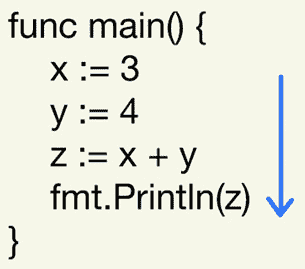
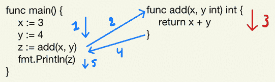
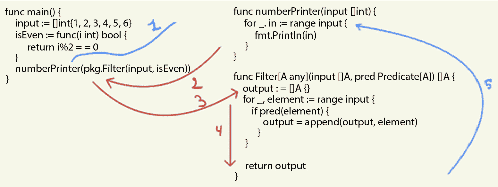
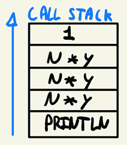

# 可读的函数组合与流畅编程

在本章中，我们将探讨在函数式编程中链式调用函数的不同方法。我们的最终目标是编写易于阅读且占用较少视觉空间的代码。我们将探讨三种实现这一目标的方法：

+   首先，我们将探讨如何使用类型别名将方法附加到容器类型上，从而允许我们使用熟悉的*点符号*创建链式函数。

+   我们接下来将讨论懒加载与急加载代码评估。

+   接下来，我们将探讨**延续传递风格**（**CPS**）编程。在 CPS 中，我们将使用高阶函数来创建控制流，而无需我们的函数。

+   我们还将讨论每种方法的权衡。

# 技术要求

对于本章，最低要求是 Go 1.18，因为我们将会使用泛型编写代码。所有代码都可以在 GitHub 上找到：[`github.com/PacktPublishing/Functional-Programming-in-Go./tree/main/Chapter8`](https://github.com/PacktPublishing/Functional-Programming-in-Go./tree/main/Chapter8)。

本章中的一些代码将建立在第五章和第六章中创建的函数之上。*第五章* 和 *第六章*。在必要时，我已经将那些章节中的相关函数和类型复制到了`Chapter8`子文件夹中。例如，`Chapter8/LazyEvaluation/pkg`是`Chapter5/Monads/pkg`和`Chapter6/pkg`的副本。这样，`Chapter8`中的示例始终可以在不要求其他章节的情况下运行。

# 通过点符号链式调用函数

通过点符号链式调用函数并不是函数式编程独有的概念。实际上，许多面向对象的设计模式，如建造者模式，也明确地这样做。在我们深入探讨如何利用 Go 的类型别名来实现这一点之前，让我们先看看一个更面向对象风格的编程示例，然后再深入链式调用函数。

## 对象创建的链式方法（建造者模式）

我们将创建一个包私有`person`对象，并添加一些公共函数来改变人的状态，尽管记住在 Go 中，这不是实例化新对象的最佳方式。然而，这是许多传统面向对象语言选择的方法：

```go
type person struct {
        firstName string
        lastName  string
        age       int
}
func newPerson() *person {
        return &person{}
}
func (p *person) SetFirstName(firstName string) {
        p.firstName = firstName
}
func (p *person) SetLastName(lastName string) {
        p.lastName = lastName
}
func (p *person) SetAge(age int) {
        p.age = age
}
```

在此示例中，我们有一个`person`结构体和三个设置器 - `SetFirstName`、`SetLastName`和`SetAge`。所有这三个都用于修改我们的对象状态。如果我们想创建一个新的对象，我们可以使用以下函数调用：

```go
func main() {
        alice := newPerson()
        alice.SetFirstName("alice")
        alice.SetLastName("elvi")
        alice.SetAge(30)
        fmt.Println(alice)
}
```

或者，可以创建一个构造函数：

```go
func constructor(firstName, lastName string, age int)
    person {
        return person{firstName, lastName, age}
}
```

只要我们的对象包含的字段不多，这种方法就可以很好地工作。如果一个对象包含很多字段，构造函数和设置器方法就会变得容易出错，而且坦白说，编写和维护起来都很繁琐。当一些字段需要默认值时，在许多传统语言中建模就变得更加困难（尽管一些语言，如 Python 和 TypeScript，可以优雅地处理这种场景）。解决这个特定问题的方法是**构建器模式**，它允许你链式调用函数，以获得更易读的对象创建体验。它还提供了额外的优势，例如能够定义默认值，但为了本章的目的，我们只关注链式调用方法。

为了实现这一点，我们将创建一个新的类型，`personBuilder`，它为每个我们想要设置的域都有一个函数。然而，我们不会简单地修改`person`对象，而是将应用了更改的`personBuilder`返回。回想一下前面的章节，这是一种确保我们的函数是纯函数的方法。这也允许我们创建这些函数，而无需使用指针，因为我们的状态将是不可变的。我们还需要一个额外的函数`build()`，它将返回一个完全实例化的对象：

```go
type personBuilder struct {
        person
}
func (pb personBuilder) FirstName(firstName string)
  personBuilder {
        pb.person.firstName = firstName
        return pb
}
func (pb personBuilder) LastName(lastName string)
  personBuilder {
        pb.person.lastName = lastName
        return pb
}
func (pb personBuilder) Age(age int) personBuilder {
        pb.person.age = age
        return pb
}
func (pb personBuilder) Build() person {
        return pb.person
}
```

当我们想要使用`personBuilder`创建一个人时，我们可以使用熟悉的点表示法链式调用函数：

```go
func main() {
        bob := personBuilder{}.FirstName("bob").
          LastName("Vande").
          Age(88).
          Build()
        fmt.Println(bob)
}
```

## 点表示法用于在切片上链式调用函数

在简要回顾了点表示法的工作原理以及它在面向对象语言中的应用之后，让我们深入探讨如何利用这个概念来处理在函数式编程语言中遇到的函数。回想一下前面的章节，我们创建了诸如`filter`、`map`和`sum`（作为`reduce`的抽象）之类的函数。当我们想要按顺序运行多个函数时，我们必须在单独的语句中这样做，并在其中跟踪值。例如，假设我们有一个数字切片。我们想要将每个数字翻倍，然后只保留大于 10 的数字，最后返回它们的总和。使用*第六章*中的函数，我们可以这样写：

```go
func main() {
        ints := []int{1, 2, 3, 4, 5, 6, 7, 8, 9, 10}
        doubled := Map(ints, func(i int) int { return i * 2 })
        larger10 := Filter(doubled, func(i int) bool {
          return i >= 10 })
        sum := Sum(larger10)
        fmt.Println(sum)
}
```

从技术上讲，我们不需要中间步骤。我们可以将其写为一行，但这很快就会变得难以理解：

```go
func oneliner() {
        ints := []int{1, 2, 3, 4, 5, 6, 7, 8, 9, 10}
        sum := Sum(Filter(Map(ints, func(i int) int {
           return i * 2 }), func(i int) bool {
             return i >= 10 }))
        fmt.Println(sum)
}
```

经过一些微小的格式调整，它变得稍微容易阅读一些，但仍然不是很好，尽管它带有一点 Lisp 风格的气息：

```go
func oneliner() {
        ints := []int{1, 2, 3, 4, 5, 6, 7, 8, 9, 10}
        sum := .Sum(
                .Filter(
                        .Map(ints,
                            func(i int) int {
                                return i * 2 }),
                      func(i int) bool { return i >= 10 }))
        fmt.Println(sum)
}
```

如果你花些时间阅读像前面例子那样的函数，你会逐渐习惯它。Lisp 是一个很好的例子；括号使得它一开始难以阅读，但随着时间的推移，它变得像第二本能一样自然。然而，我敢打赌，大多数你的同事并不是熟练的 Lisp 程序员，并且可能不想花时间学习如何阅读这样的代码。由于面向对象的点表示法是方法链的最常见方式，我们应该选择一个更接近大多数人习惯的解决方案。我们可以在 Go 中使用类型别名来实现这一点。记得从*第二章*中，类型别名允许我们将函数附加到自定义类型，并且我们可以创建一个自定义类型来表示一个切片。

第一步，然后，是为我们的容器类型创建一个类型别名。这对所有类型都适用，但我们将用整数来演示它：

```go
type ints []int
```

接下来，我们将为此类型别名附加自定义方法。在我们的例子中，我们将使用 `Map`、`Filter` 和 `Sum`，就像前面的例子一样，但这适用于任何函数。对于每个函数，它们将调用我们现有的（通用的）`Map`、`Filter` 和 `Sum` 方法。然而，值得注意的是，这些函数现在被附加到一个具体类型上。这在某种程度上类似于创建一个 *外观* 模式来进行函数分发：

```go
func (i ints) Map(f func(i int) int) ints {
        return .Map(i, f)
}
func (i ints) Filter(f func(i int) bool) ints {
        return Filter(i, f)
}
func (i ints) Sum() int {
        return .Sum(i)
}
```

如你所见，前面的片段中并没有真正发生什么魔法，但这个小小的变化将允许我们以熟悉的点表示法将我们的函数链接在一起。例如，以下方法与前面的非链式示例相同：

```go
func chaining() int {
        input := ints([]int{1, 2, 3, 4, 5, 6, 7, 8, 9, 10})
        return input.Map(func(i int) int { return i * 2 }).
              Filter(func(i int) bool { return i >= 10 }).
                Sum()
}
```

我敢打赌，对于许多人来说，这是更易读的版本，尤其是与更 Lisp 风格的例子相比。然而，在某种程度上，这仅仅是个人偏好和习惯。话虽如此，在 Go 程序员群体中，点表示法函数链是更常见的方法。这种方法的主要缺点是，需要创建新的函数来简单地允许点表示法链。好消息是，有可用的解决方案，但它们会使你的项目设置变得更加复杂。我们可以使用 Go 编译器预处理器系统自动为我们生成这些函数。在*第十一章*中，我们将看到一些可以做到这一点的库的例子。

### 函数调用的惰性评估

每当我们选择 Go 中的前面点表示法声明性编程风格时，都会发生权衡。为了理解为什么在 Go 中链式调用函数时可能会有潜在的性能影响，而在像 Haskell 这样的语言中则没有，我们需要理解函数评估的概念，尤其是惰性评估。当一个编程语言声称支持函数调用的 **惰性评估** 时，这意味着函数只有在需要结果的时候才会执行，而不是提前执行。

我们可以将这与其他的**贪婪求值**（也称为严格求值）进行对比，在函数调用时，每个函数的整个结果都会被计算。贪婪求值是大多数编程语言采用的执行策略，因此你很可能最熟悉它。*Go 语言没有选择惰性求值，但我们仍然可以模拟它。* 要了解编程语言惰性求值的意义，我们首先来谈谈贪婪求值及其相关的思维模型。考虑以下代码片段的执行流程：

```go
func main() {
     x := 3
     y := 4
     z := x + y
     fmt.Println(z)
}
```

当阅读这段代码时，执行流程基本上遵循我们阅读的方式。首先评估最上面的一行，然后是下面的一行，一直到最后一行代码。



图 8.1：从上到下的执行流程

这是一种自然的方式来阅读代码并跟踪正在发生的事情。让我们通过一些函数调用来扩展这个例子。



图 8.2：带有函数调用的执行流程

在*图 8.2*中，我们可以看到当存在函数调用时，执行流程是如何建模的。首先，是`main`函数，它最终会打印出我们创建在*第六章*中的`Filter`方法中存储的结果：

```go
func main() {
    input := []int{1, 2, 3, 4, 5, 6}
    isEven := func(i int) bool {
        return i%2 == 0
    }
    numberPrinter(pkg.Filter(input, isEven))
}
func numberPrinter(input []int) {
    for _, in := range input {
        fmt.Println(in)
    }
}
```

在贪婪求值中，前面的代码片段中发生的情况是，在将整个结果传递给`numberPrinter`之前，会先解析对`Filter`的调用。本质上，最深层嵌套的函数会首先被评估，最外层的函数最后被评估（并使用内部评估的结果）。再次强调，这是我们大多数人合理化代码的方式。*然而，惰性求值只想在结果变得需要时才执行计算。* 在前面的例子中，“偶数过滤器”变得相关的那一刻，是我们开始在`numberPrinter`中迭代结果的时候。因此，执行流程看起来就像*图 8.3*所示的那样。



图 8.3：惰性求值执行流程

在*图 8**.3*中，我们聚焦于一旦到达`numberPrinter(pkg.Filter(input, isEven))`行时发生的情况。在惰性求值期间发生的事情是，我们跳入`numberPrinter`函数。因为过滤后的数字列表尚未与该函数相关，所以对`pkg.Filter`的调用尚未发生。然而，我们的运行时记录下这个函数最终需要被调用。接下来，我们到达`numberPrinter`的第一行，它遍历我们的输入。在这个时候，`Filter`函数的结果变得相关。因此，我们需要通过调用`pkg.Filter`来确定哪些数字是奇数。一旦计算出了结果，执行将继续在`[..] range input [..]`行。因此，执行实际上被延迟到需要的时候。这就是惰性求值的要点——直到我们知道它绝对必要之前，不会消耗任何工作（即不会消耗处理能力）。

建立在这一点上的语言强烈需要函数的纯净性，因为如果系统状态发生变化与这种惰性求值执行模式相结合，那将是一场灾难，也将是函数程序员头疼的主要原因。Go 不会自动将我们的代码翻译成使用惰性求值的函数，但我们可以通过利用高阶函数来强制它这样做。在讨论急切求值与惰性求值如何影响我们正在编写的声明式代码之前，让我们构建一个简单的程序，在前面场景中强制惰性求值。再一次，我们将创建一个数字列表，过滤出仅保留偶数的数字，然后将它们传递给`numberPrinter`：

```go
func main() {
    input := []int{1, 2, 3, 4, 5, 6}
    isEven := func(i int) bool {
        return i%2 == 0
    }
    numberPrinter(func() []int {
       return Filter(input, isEven)
})
    }
func numberPrinter(lazyGet func() []int) {
    fmt.Println("At this line, we don't yet know what our
      input values will be")
    for _, in := range lazyGet() {
        fmt.Println(in)
    }
}
```

在前面的修改示例中，我们的`numberPrinter`函数不再接受一个整数切片作为输入。*相反，它接受一个返回整数切片的函数作为输入。* 这是一个关键的区别，因为它现在允许我们在不知道要打印的数字的情况下调用`numberPrinter`函数。一旦`numberPrinter`认为有必要知道这些数字，它就可以调用`lazyGet`函数，该函数将生成每个数字。当我们想要使用`numberPrinter`时，我们必须提供一种方法让函数能够获取真实输入。我们通过一个匿名函数做到了这一点，简单地将对`Filter`的调用封装在一个新函数中，该函数将输出传递下去：

```go
    numberPrinter(func() []int {
       return pkg.Filter(input, isEven)
})
```

这样，我们就可以在 Go 中模拟惰性求值。我认为这种方法与通常被认为是“惰性求值语言”的方法的主要区别在于，在“惰性语言”中，这种惰性是由编程语言本身处理的。在 Go 中，虽然我们可以对函数的每个中间结果进行惰性求值，但这样做会需要大量的开销。

### 延迟和避免执行

正确理解惰性评估的方式并非仅仅是延迟执行，而是*延迟和避免*执行。当与列表一起工作时，这转化为仅生成解决问题所需的列表子集。如果我们不想编写声明式代码并手动编写循环，那么在 Go 中模拟这种行为很容易，但如果我们要编写声明式代码，那就困难得多。正如本书前面提到的，我们的目标是使代码尽可能声明式，因为这会增加可读性。下一个示例将突出*延迟和* *避免*执行的含义。

假设我们想要找到第一个大于一千万的阶乘结果，并且我们想要以声明式的方式编写这个程序。为了演示这一点，我们还将重用前面章节中学到的知识。我们将使用在*第五章*中引入的`Maybe`类型，创建一个新的函数（`head`），将这个函数附加到切片类型（`ints`）上，创建一个生成预填充整数切片的函数（`IntRange`），最后，将这些结合起来形成一个单一解决方案。

完整示例可以在 GitHub 上找到：[`github.com/PacktPublishing/Functional-Programming-in-Go./tree/main/Chapter8/LazyEvaluation`](https://github.com/PacktPublishing/Functional-Programming-in-Go./tree/main/Chapter8/LazyEvaluation)。让我们首先设置`head`函数：

```go
func HeadA any Maybe[A] {
        if len(input) == 0 {
                return Nothing[A]()
        }
        return Just(input[0])
}
```

此函数返回`Maybe`，它要么包含列表的底层头元素，要么返回`Nothing`。为了将其附加到类型以用于我们的点符号链，我们需要提供一个包装函数：

```go
func (i ints) Head() Maybe[int] {
        return Head(i)
}
```

接下来，我们需要生成一个数字切片。`IntRange`函数将生成介于下限和上限之间的数字范围。记住，在编写声明式代码时，我们想要关注的是*什么*，而不是*如何*。由于 Go 没有提供这种功能，我们将一次性编写生成器函数（*如何*），然后只在以后重用生成器（*什么*）：

```go
func IntRange(start, end int) []int {
        out := []int{}
        for i := start; i <= end; i++ {
                out = append(out, i)
        }
        return out
}
```

如果我们编写足够多的这种类型的生成器，我们理想情况下将永远不需要再手动编写循环。现在我们已经编写了这些函数，结合*第六章*中的`Filter`和*第七章*中的`Factorial`，我们可以将这些结合起来形成一个声明式解决方案。在我们的`main`函数中，我们首先创建一个内部函数，该函数检查一个数字是否大于一千万。然后，我们将通过以下方式声明性地链接步骤，以找到第一个大于一千万的阶乘：

1.  从 0 生成到 100 的范围。

1.  将范围内的每个数字映射到其阶乘结果。

1.  筛选出大于一千万的结果。

1.  返回此列表的第一个元素：

```go
func main() {
        largerThan10Mil := func(i int) bool {
                return i > 10_000_000
        }
        res := ints(IntRange(0, 100)).
                Map(Factorial).
                Filter(largerThan10Mil).
                Head()
        fmt.Printf("%v\n", res)
}
```

如果我们运行此代码，我们得到以下结果 - `{``39916800}`。

虽然这很容易阅读和理解，但实现中隐藏着一个相当大的缺点，这是由于 Go 缺乏惰性评估。我们在前两个步骤中所做的是如下：

1.  生成从 0 到 100 的所有数字。

1.  获取它们的阶乘结果。

然而，第一个超过 `10_000_000` 的阶乘实际上发生在 `n=11` 的值上。这意味着从 12 到 100 的每个后续数字都被生成并添加到切片中，然后没有理由地计算了它的阶乘。在像 Haskell 这样的惰性评估语言中，列表只会生成找到结果所需的价值，然后短路执行。

谓词中的短路

大多数主流编程语言，包括 Go，都存在一种短路和惰性评估的形式，这是对谓词的短路。在 `if` 条件中，如果有多个条件，例如 `if A() && B()`，如果 `A` 已经返回 `false`，则不会执行 `B` 函数。同样，对于 `if A() || B()` 语句，如果 `A` 已经返回 `true`，则不会执行 `B` 函数。这样可以节省不必要的计算。（如果你正在编写依赖运行两个谓词结果的副作用代码，这可能会很难调试。又是避免副作用的一个原因。）

## 无限数据结构和惰性评估

惰性评估的另一个优点是可以对无限数据结构进行建模，例如包含从 0 到无穷大所有数字的列表。我们之所以能够在惰性评估语言中处理无限结构，是因为你只计算整个操作链所需的数据。Go 不支持惰性评估，因此在这个关于无限数据结构世界的简短过渡中，示例将使用 Haskell 和一个假想的 Go 实现。

在 Haskell 中，定义一个无限列表是一个简单的操作：

```go
InfiniteInts :: [Int]
InfiniteInts = [1..]
```

那么，我们如何处理它们呢？嗯，我们需要一个终止函数。为了使惰性评估与无限列表一起工作，我们需要有一个清晰的结束状态，使得列表操作完成。例如，让我们创建一个无限列表，检查每个数字是否是素数，一旦我们生成了 100 万个素数就停止。

首先，让我们创建 `naturals` 函数，它生成从 2 到无穷大的所有数字。这样做的原因是我们不知道确切在哪里停止。让我们还定义一下欧几里得筛子看起来是什么样子：

```go
naturals :: [Int]
naturals = [2..]
sieve :: [Int] -> [Int]
sieve (p:xs) = p : sieve [x | x <- xs, x `mod` p /= 0]
```

筛子将移除（筛选出）给定起始值列表中的所有非素数。接下来，让我们将这些两个步骤组合成一个函数，通过将无限数字列表输入到筛子中，并指定我们想要生成的数量（`n`）来生成素数：

```go
primes :: Int -> [Int]
primes n = take n (sieve naturals)
```

在这里，我们有我们的终止函数。`take n`告诉我们，从无限的数据列表中，我们只想生成达到`n`所需的数量。让我们在`main`函数中调用它来生成前一百方个：

```go
main :: IO ()
main = do
  let millionPrimes = primes 1000000
  putStrLn $ "Generated " ++ show (length millionPrimes)
    ++ " prime numbers"
```

前面的代码全部是用 Haskell 编写的，但现在让我们回到这本书的主角 Go 的领域。如果我们考虑如何在 Go 中实现类似的功能，最简单的方法是使用`for { }`循环。具体来说，我的意思是循环的*while*行为。我们循环直到满足条件，没有后置条件来增加值。忽略素数检查，我们可能会编写类似以下的内容：

```go
func main() {
    primes := []int{}
    for len(primes) != 1_000_000 {
        // sieve or other algorithm to get prime
    }
}
```

前面的实现方法是可行的，假设我们填充了`for`循环的主体（这实际上是一个事实上的无限生成器；如果我们从未达到一百万的计数，它将永远循环。在实践中，这意味着你的算法是错误的）。然而，在编写这段代码时，我们已经放弃了声明式编程风格。*我们回到了详细说明“如何”达到结果而不是关注“结果应该是什么”的领域。*在一个假想的 Go 实现中，我们想要编写的代码如下：

```go
func main() {
    millionPrimes :=
        IntRange(2
            Filter(func(i int) bool {
                return isPrime(i)
            }).
            Take(1_000_000)
}
```

前面的代码将是等效的（函数式）实现，尽管我们为了简单起见，是在过滤而不是使用筛子。这结束了我们对惰性评估及其益处的过渡。现在让我们转向另一种将函数链接在一起的风格。

## 延续传递风格编程

我们将要探讨的下一个编程风格是**延续传递风格**（**CPS**）。与熟悉的方法链点号表示法不同，CPS 只能在支持函数作为一等公民的语言中实现。核心思想是延续——换句话说，执行的下一步——是另一个作为参数传递给原始函数的函数。这允许我们通过函数传递来控制程序的流程，而不是通过分支和显式函数调用。主要好处是这将帮助我们阅读和理解复杂的函数链，并且我们可以以最小的努力来更改它们。在我们深入 Go 的 CPS 编程实现之前，让我们简要地偏离一下，并解释延续的概念。

### 延续是什么？

在编程语言的领域中，延续（continuation）是一个相对抽象的概念。它是一个表示程序下一次计算的函数。它本质上捕捉了程序在执行时刻的状态（更具体地说，是栈），并提供了一个可以调用的执行下一步的函数。

延续被用来在编程语言中实现控制流程。它们可以被看作是一种数据结构，它代表了我们的当前执行状态以及我们将要过渡到的下一个执行状态。这个抽象概念是编程语言如何实现我们日常编程中更熟悉的控制流程结构，例如异常处理、`for` 循环和 goroutines 的方式。

在某些语言中，例如 Scheme，延续（continuations）被暴露给程序员，并且可以用来在更高层次上抽象地控制程序执行的流程。这相当于编程自己的控制结构，但额外的优势在于延续可以在原地修改以采取不同的行为。在 Go 语言中，这并不容易实现。在 Go 中实现这一点的挑战之一是它是一种静态类型语言，这使得定义延续作为数据结构变得更加困难。

接近 Go 中延续的例子可能是 `panic` 和 `recover` 模式。想象以下函数：

```go
func main() {
    defer func() {
        if r := recover(); r != nil {
            fmt.Println("Recovered from panic:", r)
        }
    }()
    fmt.Println("Normal execution happening")
    panic("Execution flow is broken")
    fmt.Println("This line will not be executed")
}
```

在这个 `main` 函数中，我们首先定义了一个 `main` 函数，就在函数退出之前。`defer` 指定了一个函数的延续，在 Go 中是一个特殊情况，因为它在函数退出之前执行，无论我们如何退出函数。在延迟函数内部，如果父函数的执行过程中遇到了 `panic`，我们将从中恢复。

除了延迟函数（deferred function）之外，我们在第一个 `print` 语句之后明确地调用了 `panic`。这同样是一个延续的例子。这里发生了一些可能不是立即明显的事情。首先，对 `panic` 的调用不是一个简单的函数调用。`panic` 用于表示我们的执行栈最终处于损坏状态，正常的执行流程不再可能。它捕获了 `panic` 被调用时的整个栈状态，并停止了我们的函数。然而，因为我们已经将 `defer` 函数作为延续添加到 `main` 中，`defer` 能够从 `panic` 中访问这个保存的栈。然后，它可以在 `panic` 被调用时的那一刻显示栈的内容，帮助我们恢复到无效状态，并继续程序执行而不会停止。换句话说，我们的 `panic` 延续正在捕获有关程序状态的宝贵信息，并在执行过程中稍后将其暴露给另一个函数。然而，请记住，在 Go 中不建议使用 `panic`。

深入探讨延续超出了本书的范围，但这个小引言应该足以说明，尽管在 Go 中没有明确地称为延续，但延续在语言本身中仍然很普遍。尽管如此，我们可以利用一种显式的延续形式，这就是我们最终进入 CPS（Continuation-Passing Style）编程领域的原因。

### 在 Go 中实现 CPS 代码

为了理解 CPS（Continuation Passing Style，延续传递风格），让我们先来看一个简单的例子。回想一下上一章，我们创建了几种计算数字阶乘的方法。在这个例子中，让我们重写递归版本以遵循 CPS 模式。为了启用 CPS，我们需要将延续作为参数传递给我们的递归函数。计算阶乘的逻辑的其他部分保持不变：

```go
func factorial(n int, f func(int)) {
    if n == 1 {
        f(1) // base-case
    } else {
        factorial(n-1, func(y int) {
            f(n * y)
        })
    }
}
```

在这个阶乘示例中，我们使用一个高阶函数 `f` 来表示我们递归函数调用的延续。而在递归函数调用中，我们只是简单地将函数的当前输入乘以函数调用的结果，这里我们使用闭包在更深的一层进行乘法操作。我们说的是，为了继续计算阶乘，我们需要将 `n` 乘以 `y`。然而，`y` 在这个栈帧中尚未定义；它只会在下一个函数调用中定义。

要运行这个函数，让我们创建一个主函数来打印乘法的结果：

```go
func main() {
    factorial(5, func(i int) {
        fmt.Printf("result: %v", i)
    })
}
```

注意在这个函数中，我们在闭包内部调用 `fmt.Printf`。这意味着打印语句将沿着我们的函数调用链传递下去，最终将由我们的阶乘函数进行评估。这是 CPS 的一个优点——它使递归的较低步骤发生的事情变得明确，而不是让程序员看不到。最顶层的栈帧被推入一个函数，即 `print` 函数，而每个后续的调用栈都会推入一个函数，即“将我们的输入与下一个调用的输入相乘”的函数。



图 8.4：带有可变函数的调用栈

如果我们查看 *图 8**.4*，我们可以看到不同的函数被推送到我们的调用栈的不同层级。最底层的调用栈有一个 `Println` 函数调用，而上面的那些有一个乘法闭包的函数调用。最后的栈帧简单地有一个常数 `n * 1`)。通过引入 CPS，我们有效地抽象了递归函数调用，并为我们程序通过调用栈的流程增加了额外的灵活性。而在正常的递归函数中，每一层后续层主要是前一层的一个副本（除了基本情况），而使用 CPS，我们可以在每个帧中引入不同的行为，具体取决于我们想要做什么。

当我们使用调用栈的这种心理模型时，有一点需要注意，它们永远不会被返回。在 CPS 程序中，我们不使用`return`语句；相反，我们通过传递一个高阶函数作为后续步骤（下一个动作）。这就是为什么我们的`print`语句会一直传递到最终迭代。为了明确这一点，每个调用栈帧都会被添加到栈中，但评估是从底部向上滚动的——也就是说，我们的`print`语句被推送到它上面的栈帧，然后推送到更高的栈帧，以此类推，直到顶部。

函数的结果在执行过程中被逐步展开，这与常规递归不同，在常规递归中，我们的栈帧是以相同的方式添加的，但评估是从顶部到底部的。理解这种评估流程的倒置可能需要一点时间。背后的原因是，在每一个栈帧中，我们都是将闭包作为*输入*传递给下一个函数。*然而，请记住，将一个函数作为输入传递给另一个函数并不会立即评估该函数。* 因此，我们在到达最终栈帧之前延迟了每个函数的执行（就像惰性求值一样）。在这种情况下，`f(1)`是最终的栈帧。一旦我们到达这个栈帧，所有的闭包函数都会被有效地评估。（从最后一个闭包到第一个闭包，它们在最终栈帧中被评估。因此，底部的`print`语句打印出最终评估的结果。）

现在我们已经看到了这个递归示例的工作原理，让我们看看一个稍微复杂一点的例子，在这个例子中，我们实际上并没有使用递归。这是为了表明任何类型的控制流都可以用 CPS 来建模。

### 使用 CPS 进行简单的数学运算

在前面的例子中，我们看到了使用 CPS 进行的递归阶乘计算。这可能会让我们认为 CPS 只是编写递归函数的另一种方式。虽然使用 CPS 编写递归函数确实有一些优势，但函数不一定是递归的。以下是一个例子。假设我们从一个整数切片开始。我们首先想要过滤掉输入中的偶数。如果一个数字是偶数，我们想要将其翻倍。最后，我们想要打印出结果整数。如果我们想用 CPS 来编写这个程序，我们需要将每个后续动作（后续步骤）视为一个要传递给原始函数的函数。不深入细节的话，这会产生以下后续动作流：

```go
Input []int -> isEven(int) -> double(int) -> print(int)
```

这表明我们需要三个后续函数，以及一个第四个函数，在这个函数中我们将创建输入的切片并开始操作链。用 Go 语言编写，这将产生以下结果：

```go
func main() {
    is := []int{1, 2, 3, 4, 5, 6}
    isEven(is, func(i int) {
        double(i, print)
    })
}
func isEven(input []int, cont func(int)) {
    for _, i := range input {
        if i%2 == 0 {
            cont(i)
        }
    }
}
func double(input int, cont func(int)) {
    cont(input * 2)
}
func print(i int) {
    fmt.Println(i)
}
```

我们的所有函数，除了`print`，都会对我们的输入执行操作并调用一个延续函数。延续函数将提供我们算法的下一步。在`isEven`函数中，只有当数字匹配`i%2==0`条件时，才会调用延续，从而确保延续只发生在偶数上。现在，当我们阅读我们的`main`函数时，整个操作链都被明确地列出来了：

```go
func main() {
    is := []int{1, 2, 3, 4, 5, 6}
    isEven(is, func(i int) {
        double(i, print)
    })
}
```

首先，我们创建一个整数切片。接下来，我们调用`isEven`；然后，我们进行加倍，最后打印。注意，这里奇怪的是，我们实际上正在创建一个匿名函数作为`isEven`延续的输入。在 Go 中，我们不能简单地这样写函数：

```go
func main() {
    is := []int{1, 2, 3, 4, 5, 6}
    isEven(is,    double(i, print))
}
```

好吧，如果我们改变`isEven`的签名，使其接受以下输入参数：

```go
func isEven(input []int, cont func(int, func(int))) {
```

然而，现在我们的`isEven`函数绑定到一个显式接受一个延续作为请求的函数。如果我们只想打印偶数而不对它们执行任何其他操作会怎样呢？

这触及了为什么 CPS 在 Go 中难以正确实现的核心原因。类型系统过于严格，难以轻松管理 CPS 编程风格的函数。我们将更详细地讨论 CPS 的缺点，但首先，让我们看看 CPS 实际上可以带来真正优势的场景。

## CPS 和 goroutines

CPS 确实可以帮助的一个领域是管理并发代码。每当你在像 JavaScript 这样的语言中听到关于*回调*的时候，你实际上是在使用一个延续并将其传递给一个异步函数。一旦异步部分完成，延续（回调）会自动调用，并带有异步部分的结果。通常，这是通过 Web 请求完成的，其中启动一个 Web 请求，当请求完成时调用回调，回调的状态被填充为请求的结果。这个结果通常是一个状态码（例如，`200`）和一个有效负载（在`GET`请求的情况下）。这种模式现在如此常见，以至于我们忽略了其背后的概念，而且我们实际上也不需要真正理解它们就能使用回调。然而，让我们用回调和异步 Go 代码来模拟我们的*如果偶数则加倍*函数，以提供一个明确的例子：

```go
func main() {
        callback := func(input int, b bool) {
                if b {
                        fmt.Printf("the number %v is
                            even\n", input)
                } else {
                        fmt.Printf("the number %v is
                            odd\n", input)
                }
        }
        for i := 0; i < 10; i++ {
                go isEven(i, callback)
        }
        _ := <-make(chan int)
}
func isEven(i int, callback func(int, bool)) {
        if i%2 == 0 {
                callback(i, true)
        } else {
                callback(i, false)
        }
}
```

之前的代码是一个略微修改的版本。我们将异步验证一个数字是否为偶数，如果是，我们将打印`the number x is even`；如果不是，我们将打印`the number x is odd`。CPS 旨在简化的关键部分是异步调用的流程控制部分。我们将使用`go`关键字启动一个调用，因为延续被编码为我们调用的函数的一部分，所以我们不需要担心异步等待函数调用的结果然后启动下一个函数。在不支持高阶函数的语言中，*启动调用，等待结果，继续计算*的模式通常被建模为 async/await 操作。由于 Go 是一种多范式语言，我们可以利用高阶函数和 CPS。这使我们能够专注于*异步*部分，而不必担心*等待和继续*部分。话虽如此，Go 实际上有一个基于 goroutines 和 channels 的坚实的并发范式，所以这种 CPS 风格的编程需求大部分得到了缓解。

## 何时使用 CPS？

对于大多数用例来说，CPS 可能会使你的程序比它应有的复杂。这不是阅读递归函数最容易的方式，即使你习惯了它，它也可能让你出错。然而，它在某些领域，如编译器/解释器设计中被使用。通常，如果你想要模拟复杂的控制流，CPS 可以使这种控制更加明确，从而更容易理解和阅读。

除了这个之外，另一个用例是在异步编程中使用回调。虽然我们并不经常调用那些 CPS（Continuation-Passing Style，即延续传递风格），甚至延续，但它们确实是一种 CPS 的形式。由于使用了 goroutines 和 channels，我们在像 JavaScript 这样的语言中找到的更熟悉的回调风格稍微少一些，但无论如何，这是一个我们可以使用它们的有用领域。

# 摘要

在本章中，我们探讨了两种不同的方式来组合我们的函数式代码。第一种方式是通过熟悉的点符号链式连接方法。这是一种连接各种函数的输入和输出的方式，而不需要在它们之间进行中间变量赋值。虽然大多数程序员熟悉这种编程风格，但在 Go 中使用泛型编写（纯）函数式代码时，需要一些开销。

我们在这里讨论的另一个权衡是函数评估的急切模式与懒模式。虽然在 Go 中可以模拟懒评估，但编译器和语言并没有为我们做任何繁重的处理。这意味着如果我们从像 Haskell 这样的函数式语言移植代码，性能特征将会有显著的不同。

最后，我们还探讨了延续和 CPS 编程。延续是对算法中任何“下一步”的抽象表示，无论是函数调用、循环还是“goto”语句。CPS 编程使递归操作的本质变得明确，并允许我们抽象地处理函数链的生成。虽然 CPS 是一种强大的技术，但在日常生活中的应用场景相对有限，尽管我们在底层大量使用了 CPS，例如在建模回调函数时。

在下一章中，我们将提升一个抽象层次，通过功能设计模式来观察程序组合。

# 第三部分：设计模式和函数式编程库

在这部分，我们将通过使用函数式编程技术来观察软件架构，从而提升到一个更高的抽象层次。我们再次比较面向对象方法与更函数式方法的差异。我们将看到 Go 的并发范式如何在函数式环境中得到利用。最后，我们将了解有助于我们构建函数式应用的库。

本部分包含以下章节：

+   *第九章**，函数式设计模式*

+   *第十章**，并发与函数式编程*

+   *第十一章**，函数式编程库*
