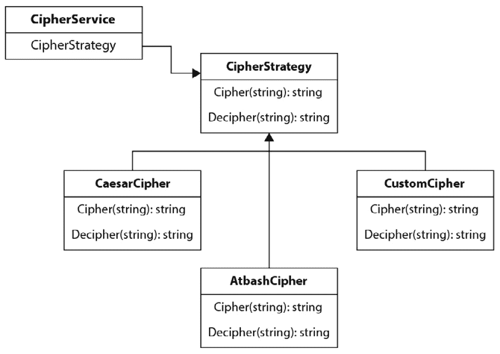
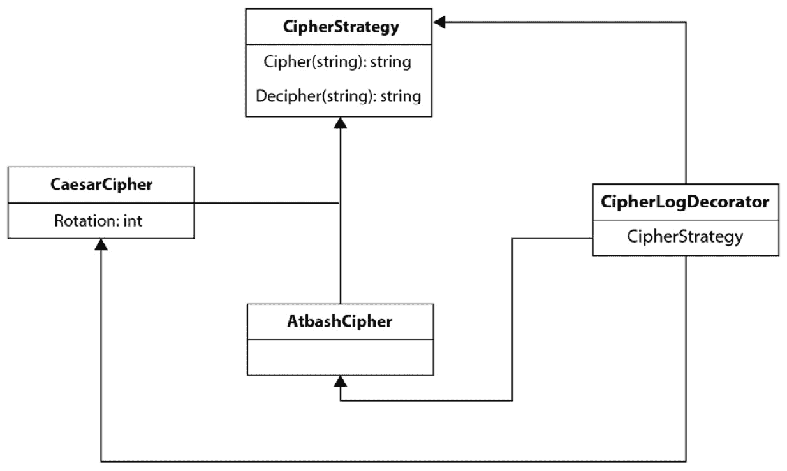

# 第九章：函数式设计模式

在本章中，我们将提升到一个更高的抽象层次。而不是讨论单个函数和操作，让我们来看看一些设计模式。虽然我们不会详细解释每个设计模式，但我们会看看面向对象模式如何转化为函数式世界。 

在本章中，我们将涵盖以下主要内容：

+   函数范式中的经典设计模式：

    +   策略模式

    +   装饰者模式

    +   好莱坞原则

+   函数式设计模式

# 技术要求

在本章中，任何 1.18 版或更高版本的 Go 都将适用于所有 Go 相关代码。一些代码片段是用 Java 编写的；这些代码片段将适用于 1.5 版以上的任何 Java 版本。

本章的代码可以在 GitHub 上找到：[`github.com/PacktPublishing/Functional-Programming-in-Go./tree/main/Chapter9`](https://github.com/PacktPublishing/Functional-Programming-in-Go./tree/main/Chapter9)。

# 函数范式中的经典设计模式

任何在面向对象语言中编程的人都会在某个时刻遇到设计模式。设计模式是一种针对常见工程问题的通用解决方案。一个关键点是，他们提供的解决方案应被视为一个起点，一种解决问题的方法，这种方法已被证明是有用的。通常，解决方案不能直接使用，需要根据你的具体环境和情况进行调整。一个给定的设计模式可能为问题提供 90%的解决方案，其余的 10%则需要用自定义的非模式代码来填补。

本章的目标不是全面覆盖设计模式。实际上，关于设计模式已经写出了整本书，例如著名的《设计模式：可复用面向对象软件元素》（Gang of Four）一书。本章的目标是展示某些面向对象设计模式如何转化为函数范式，以及它们在这个范式下通常如何更简单地进行表达。对于每个设计模式，我们将查看面向对象实现、模式的一般问题和好处，以及最终，函数实现的样子。我们将从策略模式开始，然后继续装饰模式，最后是**控制反转**（**IoC**）原则。

这三种模式在面向对象代码中很常见。策略模式是一种在运行时改变程序行为并解耦具有具体实现类的方法。装饰者模式允许我们动态地扩展函数而不破坏开闭原则，而 IoC 原则是许多面向对象框架的基石，其中控制顺序被委派给调用树的最高层。

## 策略模式

我们将要查看的第一个模式是策略模式。策略模式是一种设计模式，它允许我们在运行时动态地更改方法或函数的算法。通过这样做，我们可以修改程序在整个运行期间的行为。在我们将要解决的例子中，我们将有一个 `EncryptionService`，它支持各种密码。

我们将保持简单，并使用改变输出中字母的替换密码。我们将实现三种不同的密码机制：

+   凯撒密码

+   Atbash 密码

+   自定义密码

每个密码都需要支持给定字符串的加密和解密，如下所示：

```go
Input = decipher(cipher(Input))
```

换句话说，我们应该能够从加密输出中重建输入。对于我们的实现，我们还将限制自己只改变字母表中的字母 a-z，并忽略大小写。

密码和安全

值得注意的是，这些密码绝对不应该用于实际的加密。它们非常脆弱，在当今这个时代无法提供真正的保护来抵御恶意行为者。它们对于研究历史背景很有趣，实现起来既有趣又容易理解。

### 面向对象策略模式

首先，我们将以面向对象的方式解决这个问题。记住，Go 是一种多范式语言，因此我们可以在 Go 中轻松应用面向对象的设计模式。*图 9**.1 显示了这个解决方案的架构：



图 9.1：密码实现的策略模式

在面向对象的实现中，我们从 `CipherService` 开始。这是任何想要使用密码的类。而不是有一个具体的实现，`CipherService` 通过对象组合包含一个 `CipherStrategy`。这个 `CipherStrategy` 是一个接口，它指定了 `Cipher` 和 `Decipher` 方法。这两个方法都接受一个字符串作为输入，并返回加密或解密后的字符串。在 *图 9**.1 中，我们有三种具体的密码实现：

+   凯撒

+   Atbash

+   自定义密码

这些都是实现所需方法（`Cipher` 和 `Decipher`）的类（结构体）。我们还可以在这些类中包含一个有用的状态，正如我们将在接下来的代码示例中所看到的，其中我们将 `Rotation` 变量作为凯撒密码的一部分来维护。凯撒密码和 Atbash 密码都是所谓的替换密码。它们用一个字母替换另一个字母。在凯撒密码的情况下，替换字母位于字母表中一定数量的位置之后。对于 Atbash 密码，这是将每个字母简单地替换为反向字母表中相同位置的字母（z-a）。

#### 凯撒

让我们在 Go 中开始实现这个。首先，我们将设置`CipherService`，以及一个包含我们将支持的所有字母表的切片。我们还需要确定给定 rune 在这个字母表切片中的索引，我们将通过实现一个`indexOf`函数来完成：

```go
var (
    alphabet [26]rune = [26]rune{'a', 'b', 'c', 'd', 'e',
    'f', 'g', 'h', 'i', 'j', 'k', 'l', 'm', 'n', 'o', 'p',
    'q', 'r', 's', 't', 'u', 'v', 'w', 'x', 'y', 'z'}
)
func indexOf(r rune, rs [26]rune) (int, bool) {
    for i := 0; i < len(rs); i++ {
        if r == rs[i] {
            return i, true
        }
    }
    return -1, false
}
type CipherService struct {
    Strategy CipherStrategy
}
```

为了遵循更传统的面向对象语言模式，我们还可以将`Cipher`和`Decipher`方法附加到`CipherService`上。这只会将调用委托给选择的实现（`Strategy`）：

```go
func (c CipherService) Cipher(input string) string {
        return c.Strategy.Cipher(input)
}
func (c CipherService) Decipher(input string) string {
        return c.Strategy.Decipher(input)
}
```

在设置好之后，我们还将定义一个接口，`CipherStrategy`，它将强制任何实现都必须有`Cipher`和`Decipher`方法：

```go
type CipherStrategy interface {
    Cipher(string) string
    Decipher(string) string
}
```

在此基础上，我们可以开始实现我们将支持的战略。为了简洁，我们只会实现凯撒和 Atbash 密码。实现自定义密码，如*图 9**.1*所示，将是这个的简单扩展。为了实现凯撒密码，我们首先定义一个结构体来表示这个策略：

```go
type CaesarCipher struct {
    Rotation int
}
```

凯撒密码是一种密码，其中输入中的字母被替换为字母表中一定位置的字母。我们使用的位置数定义为密码的*旋转*。例如，如果我们有`abc`输入和一个旋转`1`，每个字母都被替换为字母表中位置更进一步的字母，所以输出将是`bcd`。

类似地，如果旋转是`2`，输出将是`cde`，依此类推。以下是在 Go 中实现凯撒`Cipher`和`Decipher`方法的实现。理解实现并不那么重要；重要的是要注意我们如何选择`CipherService`使用的实现，甚至在程序执行期间更改它：

```go
func (c CaesarCipher) Cipher(input string) string {
        output := ""
        for _, r := range input {
                if idx, ok := indexOf(r, alphabet); ok {
                        idx += c.Rotation
                        idx = idx % 26
                        output += string(alphabet[idx])
                } else {
                        output += string(r)
                }
        }
        return output
}
func (c CaesarCipher) Decipher(input string) string {
        output := ""
        for _, r := range input {
                if idx, ok := indexOf(r, alphabet); ok {
                        idx += (26 - c.Rotation)
                        idx = idx % 26
                        output += string(alphabet[idx])
                } else {
                        output += string(r)
                }
        }
        return output
}
```

现在我们已经实现了凯撒密码，让我们也实现 Atbash 密码。

#### Atbash

Atbash 密码是直接将每个字母替换为字母表中相同索引位置的字母，但字母表是反向的。所以，`a`变成`z`，`b`变成`y`，以此类推，直到`z`变成`a`。因此，解密可以通过再次调用密码来实现，因为我们实际上是在镜像字母表（镜像两次会返回原始结果）。

与`CaesarCipher`不同，我们不需要任何真实的状态来管理`AtbashCipher`结构体，因为`CaesarCipher`中我们维护旋转作为一个类变量。然而，我们仍然需要创建这个结构体，以便我们的策略模式实现能够正确工作。它将只是一个空的结构体，带有附加到它的函数：

```go
type AtbashCipher struct {}
func (a AtbashCipher) Cipher(input string) string {
        output := ""
        for _, r := range input {
                if idx, ok := indexOf(r, alphabet); ok {
                        idx = 25 - idx
                        output += string(alphabet[idx])
                } else {
                        output += string(r)
                }
        }
        return output
}
func (a AtbashCipher) Decipher(input string) string {
        return a.Cipher(input)
}
```

再次，这里的代码实现并不那么重要。很整洁的是，我们可以通过再次调用`Cipher`来解密它，这在函数式示例中会变得更加有趣。无论如何，让我们看看我们如何在执行期间更改实现，并在`CaesarCipher`和`AtbashCipher`之间切换：

```go
func main() {
        svc := CipherService{}
        svc.Strategy = CaesarCipher{Rotation: 10}
        fmt.Println(svc.Cipher("helloworld"))
        svc.Strategy = AtbashCipher{}
        fmt.Println(svc.Cipher("helloworld"))
}
```

这是策略模式的面向对象实现。我们创建了三个类（`CipherService`、`CaesarCipher`和`AtbashCipher`），一个接口（`CipherStrategy`），以及每个 struct 两个函数（用于加密和解密）。现在，让我们看看函数式实现。

### 策略模式的函数式实现

我们已经在之前的章节中看到，我们可以通过利用函数是一等公民的事实，像在传统的面向对象语言中一样传递它们，动态地改变算法的实现细节。如果我们重构了我们的`CipherService`，我们只需要知道这个服务需要一个函数，该函数接受一个字符串并返回一个字符串两次（一次用于加密，一次用于解密）。

首先，让我们定义这个新服务的结构，以及两个类型来定义`Cipher`和`Decipher`函数：

```go
type (
        CipherFunc   func(string) string
        DecipherFunc func(string) string
)
type CipherService struct {
    CipherFn   CipherFunc
    DecipherFn DecipherFunc
}
func (c CipherService) Cipher(input string) string {
    return c.CipherFn(input)
}
func (c CipherService) Decipher(input string) string {
    return c.DecipherFn(input)
}
```

现在我们已经有了`CipherService`，我们需要定义我们的 Caesar 和 Atbash 加密相关的函数。与面向对象的例子不同，我们不需要定义一个新的 struct 来这样做。我们可以在与我们的`CipherService`相同的包中定义我们的函数，但我们不必这样做。事实上，任何正确类型的函数都可以用作`Cipher`或`Decipher`函数。

让我们先实现`CaesarCipher`。我们必须注意的一件事是我们不再有一个可以保存状态的 struct。在我们的例子中，`CaesarCipher` struct 将`Rotation`存储为一个类变量。在函数式方法中，旋转需要成为`CaesarCipher`函数本身的一部分。这是一个微小但重要的变化。除了这个变化之外，实现保持不变：

```go
func CaesarCipher(input string, rotation int) string {
    output := ""
    for _, r := range input {
        idx := indexOf(r, alphabet)
        idx += rotation
        idx = idx % 26
        output += string(alphabet[idx])
    }
    return output
}
func CaesarDecipher(input string, rotation int) string {
    output := ""
    for _, r := range input {
        idx := indexOf(r, alphabet)
        idx += (26 - rotation)
        idx = idx % 26
        output += string(alphabet[idx])
    }
    return output
}
```

同样，我们可以将`AtbashCipher`实现为一个函数。这里的一个优点是由于 Atbash 加密和解密之间的关系，我们实际上不需要为`Decipher`函数编写任何实现。相反，我们可以直接将`Decipher`函数等同于`Cipher`函数：

```go
func AtbashCipher(input string) string {
    output := ""
    for _, r := range input {
        if idx, ok := indexOf(r, alphabet); ok {
            idx = 25 - idx
            output += string(alphabet[idx])
        } else {
            output += string(r)
        }
    }
    return output
}
var AtbashDecipher = AtbashCipher
```

最后一行实际上定义了一个新的函数，`AtbashDecipher`，其实现与`AtbashCipher`相同，再次利用了这样一个事实，即我们的函数仅仅是数据，可以在 Go 中以变量的形式存储。

当在 Go 中使用这种函数式实现时，我们必须为我们的服务的`Cipher`和`Decipher`实现提供`func(string) string`类型的函数。由于`CaesarCipher`需要一个额外的变量来确定旋转，我们确实需要为我们的`CipherService`创建一个闭包。在我们的`main`方法中，我们可以动态地更新我们想要使用的加密方式为`AtbashCipher`，而不需要闭包，因为 Atbash 加密是一种简单的加密方式，遵循`func(string) string`：

```go
func main() {
    fpSvc := {
        CipherFn: func(input string) string {
            return (input, 10)
        },
        DecipherFn: func(input string) string {
            Return fp.CaesarDecipher(input, 10)
        },
    }
    fmt.Println(fpSvc.Cipher("helloworld"))
    fpSvc.CipherFn = AtbashCipher
    fpSvc.DecipherFn = AtbashDeciphe
    fmt.Println(fpSvc.Cipher("helloworld"))
    fmt.Println(fpSvc.Decipher(fpSvc.Cipher("hello")))
}
```

这个例子展示了如何使用我们的函数式实现来打印一些加密和解密的内容。使用这个函数式实现，我们可以轻松地实现特定的加密算法，而不必将它们定义为独立的函数。`Cipher`和`Decipher`的实现都接受匿名函数来指定实现细节。这就是我们通过将凯撒密码包裹在匿名函数中来使其工作的方式。

## 装饰器模式

让我们修改我们的代码，使其也遵循装饰器模式。装饰器模式是一种在不修改它们的情况下向我们的方法和类添加功能的方式。这意味着 SOLID 中的*开闭*部分得到了尊重。在面向对象编程中，这是通过函数组合（以及在支持这种功能的语言中通常与继承一起）来实现的。在 Go 语言中，组合是构建结构体的首选方式，因此装饰器模式对于函数式和面向对象风格的实现来说都很自然。

面向对象设计的 SOLID 原则

SOLID 是一组设计健壮面向对象系统的原则。它代表**单一职责、开闭原则、里氏替换原则、接口隔离原则和依赖倒置原则**。无论你使用哪种范式，这些原则都是值得遵循的，但它们的实现方式不同。例如，函数应该只有一个职责，对修改封闭但对扩展开放，并且函数应该依赖于抽象（高阶）函数而不是具体实现。

### 面向对象的装饰器模式

首先，让我们从以面向对象的方式实现装饰器模式开始。我们将扩展我们的策略模式示例，包括各种加密算法。为了保持简单，让我们假设我们只想为每个`Cipher`和`Decipher`函数记录输入。为了使我们的程序更易于组合，我们不希望通过修改现有的`CaesarCipher`和`AtbashCipher`结构体来添加`log`函数。如果我们这样做，我们还需要更新每个结构体的`log`功能，以防日志要求发生变化。相反，我们将实现一个`LogCipherDecorator`结构体。这个结构体通过实现`Cipher`和`Decipher`的函数来遵循`CipherStrategy`接口。这些函数将首先写入日志，然后将每个调用委托给底层的`Cipher`或`Decipher`实现。"图*9**.2"显示了该模式的类图。



图 9.2：装饰器模式的类图

现在，我们可以将其转换为代码；让我们首先看看结构定义。我们有一个新的`LogCipherDecorator`结构体，它通过组合使用`CipherStrategy`：

```go
type CipherLogDecorator struct {
    CipherI CipherStrategy
}
```

现在，我们将实现必要的函数，使这个新的结构本身遵守`CipherStrategy`。在每个函数中，首先，我们将记录输入，然后再将调用分派到底层的`CipherStrategy`：

```go
func (c CipherLogDecorator) Cipher(input string) string {
    log.Printf("ciphering: %s\n", input)
    return c.CipherI.Cipher(input)
}
func (c CipherLogDecorator) Decipher(input string) string {
    log.Printf("deciphering: %s\n", input)
    return c.CipherI.Decipher(input)
}
```

这基本上就是实现装饰器模式所需的所有内容。它在各种场景中都很有用，但在与**用户界面**（**UI**）代码（例如 Swing 这样的 Java UI 库）一起工作时，尤其经常遇到。

在`main`函数中，我们现在可以在期望`CipherStrategy`的任何地方使用`CipherLogDecorator`。我们将必须实例化装饰器并使用底层类来获取额外的功能：

```go
func main() {
    cld := {
        CipherI: oop.CaesarCipher{Rotation: 10},
    }
    svc := oop.CipherService{Strategy: cld}
    ciphered := svc.Cipher("helloworld")
    fmt.Println(ciphered)
}
```

在这个片段中，我们可以看到`CipherService`如何接受`CipherLogDecorator`，就像接受任何其他`CipherService`一样。当我们运行这个`main`函数时，日志语句出现在每个打印语句之前。运行该函数，我们得到以下结果：

```go
[ec2-user@ip-172-31-29-49 Chapter9]$ go run main.go
2023/01/14 15:50:05 ciphering: helloworld
rovvygybvn
```

接下来，让我们以函数式的方式实现这一点，并比较两种方法。

### 函数式装饰器模式实现

将装饰器模式应用于函数式编程并不需要我们在本书中之前没有见过的任何东西。我们已经学习了函数组合，并在前面的章节中使用了它。面向对象的代码中的装饰器模式实际上不过是函数式编程范式中的函数组合。

因此，创建一个在每次`cipher`或`decipher`调用之前添加日志语句的函数，就是一个创建高阶函数的问题，该函数接受一个`Cipher`或`Decipher`函数作为输入，并返回一个新的函数，该函数首先调用`log`，然后委托剩余的功能到底层函数。让我们通过查看加密和解密时的装饰函数`LogCipher`和`LogDecipher`来具体说明：

```go
func LogCipher(cipher CipherFunc) CipherFunc {
    return func(input string) string {
        log.Printf("ciphering: %s\n", input)
        return cipher(input)
    }
}
func LogDecipher(decipher DecipherFunc) DecipherFunc {
    return func(input string) string {
        log.Printf("deciphering: %s\n", input)
        return decipher(input)
    }
}
```

实质上，这就是装饰函数以添加新功能所需发生的所有事情。`LogCipher`接受任何遵守`CipherFunc`类型定义的函数，并返回一个新的函数，该函数也遵守那个类型定义。然后，作为从`LogCipher`返回的匿名函数创建的新函数，调用`log`并随后调用最初传递的`CipherFunc`。

与面向对象和函数式范式相比，实现策略中的主要区别只是我们如何定义对预期功能的遵守。在面向对象的方法中，我们使用接口来定义遵守，而在函数式方法中，我们使用类型系统来定义遵守。

在我们的`main`函数中，我们可以使用装饰函数而不是底层加密来创建`CipherService`：

```go
func main() {
    caesarCipher := func(input string) string {
        return CaesarCipher(input, 10)
    }
    caesarDecipher := func(input string) string {
        return CaesarDecipher(input, 10)
    }
    fpSvc := {
        CipherFn:  LogCipher(caesarCipher),
        DecipherFn: LogDecipher(caesarDecipher),
    }
    fmt.Println(fpSvc.Cipher("hello"))
}
```

注意，在这个例子中，为了可读性，装饰器函数与`CipherService`的创建是分开的，但这也可能在一行内完成，就像早期策略模式实现中那样。如果我们用`AtbashCipher`来创建`CipherService`，这将是一个更易读的例子：

```go
func main() {
    fpSvc := fp.CipherService{
        CipherFn:   fp.LogCipher(caesarCipher),
        DecipherFn: fp.LogDecipher(caesarDecipher),
    }
    fmt.Println(fpSvc.Cipher("hello"))
}
```

从这些例子中我们可以看到，函数组合是装饰函数以添加额外功能的关键，这些功能随后可以在实现之间共享。我们迄今为止所做事情的另一个优点可以描述为“好莱坞原则”，也称为“IoC”原则。

## 好莱坞原则

好莱坞原则“别叫我们，我们会叫你”也被称为 IoC 原则。IoC 是众所周知的依赖注入模式的抽象。依赖注入是编写面向对象应用程序的一个重要方面，并且对函数式范式也很有用。

不深入面向对象的实现，关键要点是对象应该将它们依赖的具体实现推迟到对象/调用层次结构中的最高级别。我们在之前的例子中通过利用接口而不是具体实现来隐式地做到了这一点。注意，面向对象的`CipherService`没有指定它将使用哪种加密，而是通过请求`CipherStrategy`接口的实现来将这个选择推迟给了`CipherService`的创建者：

```go
type CipherStrategy interface {
    Cipher(string) string
    Decipher(string) string
}
type CipherService struct {
    Strategy CipherStrategy
}
```

Go 通过没有为 struct 提供显式构造函数而非常自然地适合这种编程方式。在像 Java 这样的语言中，对象可以通过对象组合使用默认的类级对象进行实例化，因此更容易忽略针对抽象实现的编程。例如，以下 Java 代码片段将展示一个不遵循 IoC 但使用特定类型的加密（在这种情况下是凯撒加密）的`CipherService`实现：

```go
class CaesarCipher {
    int rotation;
    CaesarCipher(int rotation) {
        this.rotation = rotation;
    }
}
class CipherService {
    CaesarCipher cipher = new CaesarCipher();
    CipherService() {}
    public String cipher(String input) {
        String result = "";
        // implement cipher
        return result;
    }
}
```

为什么在这里突出显示这段 Java 代码？首先，为了展示 Go 的 struct 范式通过无构造函数的 struct 实例化自然地适合 IoC。这意味着 struct 没有固有的类状态。

这使我们转向服务的函数式实现。在 Go 中，我们有两种方式来实现 IoC：

+   第一种方式是通过使用接口，正如我们在面向对象示例中所做的那样

+   第二种方式是使用类型定义和函数作为一等公民来抽象 struct 的行为

为了说明差异，以下是我们使用的`CipherService`的两个定义，并且两者都按照它们的范式应用 IoC。

首先，让我们展示面向对象的方式：

```go
type CipherStrategy interface {
    Cipher(string) string
    Decipher(string) string
}
type CipherService struct {
    Strategy CipherStrategy
}
```

现在让我们看看函数式的方式：

```go
type (
    CipherFunc   func(string) string
    DecipherFunc func(string) string
)
type CipherService struct {
    CipherFn   CipherFunc
    DecipherFn DecipherFunc
}
```

这只是一个简短的过渡，目的是指出在这两种情况下都在发生什么。让我们继续讨论设计模式。

# 函数式设计模式

在本章前面的部分，我们比较了函数式和面向对象的设计模式（策略、装饰者和依赖注入/IoC）。如果我们看看函数式和面向对象模式之间的主要区别，那么我们的模式是通过不同的函数组合来实现的。我们要么使用函数作为一等公民，将它们存储在结构体中的变量中，要么使用函数组合、高阶函数、匿名函数和闭包来实现传统上通过接口和类的继承所实现的功能。

这实际上应该是编写函数式代码时的主要收获。一切都是函数。设计模式变成了函数组合的模式。因此，对于面向对象世界的传统设计模式，没有真正的对应物。那么，函数范式在设计模式方面提供了什么？好吧，如果我们回到设计模式的定义，我们可以看到，模式是针对常见问题的可重用解决方案。这是一种可能解决 85%问题的模板方法，而剩余的 15%则需要超出模式本身来解决。函数式编程确实提供了这些解决方案，我们在这本书的前面讨论了许多。

当你想到函数柯里化，将不同的函数组合在一起，并将每个函数简化为 1 元函数，然后组合成任何 n 元函数时，这些步骤可以被视为一种函数式设计模式。同样，通过 CPS 使用闭包、单子以及回调都可以被视为解决常见问题的模式。在函数式编程中，我们没有对象分类法的开销，这正是面向对象代码中的设计模式所反映的。你可以争论，在传统的面向对象语言中，设计模式的需求更多的是对编程语言自身局限性的解决方案，而不是对程序员真正的益处。

避免传统设计模式的一种方式是通过函数组合的使用，但一个同样关键的部分是利用类型系统——一个可以将具体类型分配给具有指定签名的函数的类型系统。观察面向对象的设计模式，无论是装饰者模式、工厂模式还是访问者模式，它们都广泛利用接口来抽象实现细节。在 Go 语言中，我们可以使用类型系统来抽象实现，就像我们在前面的例子中所做的那样。

如果我们总结一下如何在函数范式下解决特定设计问题，那将会相当无聊，因为问题要么不存在，要么通过函数来解决。我们的解决方案看起来就像*表 9.1*：

| **设计模式** | **解决方案** |
| --- | --- |
| 策略模式 | 函数（高阶函数 + 函数类型） |
| 装饰器模式 | 函数组合（闭包） |
| 工厂模式 | 实际上不需要，因为我们不需要对象，但我们可以创建具有一组默认值的函数——因此，这将属于函数柯里化 |
| 访问者模式 | 函数 |
| 单例模式 | 不需要，因为我们避免使用对象和可变状态 |
| 适配器 | 可以看作是函数映射 |
| 门面模式 | 再次提及函数 |

表 9.1：设计模式及其函数式解决方案

然而，在 Go 语言中，我们使用的是一种多范式语言，因此我们可以兼得两者之长。当我们与结构体一起工作时，我们可以利用一些设计模式，但它们的实现通过使用函数式编程原则而不是面向对象原则而大大简化。尽管我们创建了一个接口来抽象结构体功能的实现，但我们仍然可以使用一个符合给定类型的函数，就像我们使用`CipherService`时所做的那样。

# 摘要

在本章中，我们探讨了在面向对象代码中常见的几种设计模式，即策略模式、装饰器模式和好莱坞原则（IoC）。我们了解到，这些模式可以在 Go 语言中通过利用函数作为一等公民来实现，而无需构建广泛的对象分类。我们还讨论了在函数式范式中对设计模式的需求，并得出结论：要么模式不是必需的，要么可以使用函数来解决。在解决常见问题的可重用实际函数式代码方面，我们指出了函数柯里化和函数组合等概念。在下一章中，我们将探讨如何利用函数式编程来实现并发代码。
