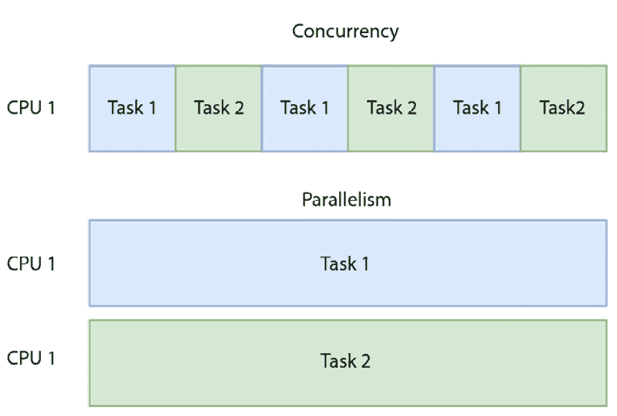

# 并发与函数式编程

并发无处不在，无论是在现实世界还是在虚拟世界中。人类可以轻松地多任务处理（尽管我们可能两个任务都做不好）。在你阅读本章的同时喝一杯咖啡或者边听播客边跑步是完全可能的。对于机器来说，并发是一个复杂的任务，尽管我们可以通过选择编程语言来隐藏很多这种复杂性。

Go 语言被设计成一种包含现代软件工程师所需所有工具的语言。鉴于我们现在生活在一个 CPU 能力在大多数情况下都很充足的世界，当开发这门语言时，并发自然成为了一个主要关注点，而不是后来不得不添加上去。在本章中，我们将探讨函数式编程如何帮助处理并发，以及反过来，并发如何帮助函数式编程。

在本章中，我们将涵盖以下主题：

+   为什么函数式编程有助于我们编写并发代码

+   如何创建并发函数（过滤、映射等）

+   如何使用管道模式并发地链接函数

# 技术要求

对于本章，你可以使用 Go 语言 1.18 或更高版本。本章的所有代码都可以在 GitHub 上找到，链接为[`github.com/PacktPublishing/Functional-Programming-in-Go./tree/main/Chapter10`](https://github.com/PacktPublishing/Functional-Programming-in-Go./tree/main/Chapter10)。

# 函数式编程与并发

我们已经在整本书中暗示了这一点，但函数式编程背后的思想可以帮助我们编写并发代码。通常，即使有 goroutines 和 channels 等现代工具支持，思考并发也会让人头疼。在我们深入探讨这个材料之前，让我们先稍微偏离一下，作为一个复习，来明确当我们谈论并发代码时我们到底指的是什么，以及它与并行和分布式计算有何不同。

## 并发、并行和分布式计算

有时，“并发”、“并行”和“分布式计算”这些术语会被互换使用。虽然它们是相关的，但它们并不完全相同。让我们首先指出我们所说的“并发”是什么意思。**并发**是指我们的程序可以同时执行多个任务的情况。例如，当我们玩游戏时，通常有一个线程播放音频，另一个处理玩家的输入，还有一个处理游戏内部逻辑，更新游戏状态并执行主游戏循环。

电子游戏已经存在很长时间了，像 *DOOM* 这样的游戏就是以这种方式运行的。也可以说，在 1995 年，人们并没有在拥有多个核心的电脑上玩这样的游戏。换句话说，单个核心可以管理这些不同任务的执行，并给人一种同时执行这些任务的外观。确切地说，这是如何做到的，超出了本书的范围，但作为总结，只需记住，我们将主要关注的并发性，是之前定义的并发性——不是代码的同时执行，而是代码的并发执行。不过，有一点需要注意，并发可以发生在多个核心或流水线上。然而，为了简化问题，我们可以想象使用单个核心的并发。

这引出了第二个术语，**并行性**。当我们谈论一个程序并行执行时，这意味着多个核心正在同时执行一个任务。没有物理手段同时运行两个任务，就无法实现并行性。Go 的本地机制，如通道和 goroutines，专注于并发而不是并行。这是两者之间的重要区别。然而，Go 仍然适合构建并行算法。

要了解这看起来是什么样子，有几个 Go 包提供了并行解决方案，例如 ExaScience 的 Pargo 包：[`github.com/ExaScience/pargo`](https://github.com/ExaScience/pargo)。在撰写本文时，这个包是以预泛型的方式编写的，所以在查看代码时请记住这一点。在 *图 10*.1 中，通过任务执行方式突出了并发和并行之间的区别。值得注意的是，在并发模型中，两个任务被分割成多个部分，并且每个部分交替分配 CPU 时间。



图 10.1：并发（上方）与并行（下方）执行对比

最后，我们有 **分布式计算**。虽然并发是分布式计算的一部分，但这并不是唯一的要求。分布式计算确实意味着将计算任务分散到多台机器上，从这个意义上讲，它是并发的，但与通常的并发或并行应用程序相比，它有更多的开销。

在分布式系统中，你需要有容错机制（如果网络中的一个节点变得不可用怎么办？）以及处理网络的机制（不可靠或不安全的网络）。因此，尽管人们可能会将分布式计算作为并发的例子来讨论，但并发只提供了所需的最基本功能。物理基础设施以及使分布式系统正常工作的无数困难超出了本书的范围。有一点需要记住的是，Go 是一种可以用来编写分布式系统的语言。事实上，goroutines 和 channels 的使用可能有助于构建分布式系统所需的基础设施，但你将需要比语言的基本功能更多。如果你想学习更多关于使用 Go 进行分布式计算的知识，那么《使用 Go 进行分布式计算》这本书是一个很好的起点：[`www.packtpub.com/product/distributed-computing-with-go/9781787125384?_ga=2.217817046.1391922680.1675144438-1944326834.1674539572`](https://www.packtpub.com/product/distributed-computing-with-go/9781787125384?_ga=2.217817046.1391922680.1675144438-1944326834.1674539572)。

在本章中，我们将只关注并发，而不会深入探讨并行化或分布式计算。然而，为什么我们想让我们的代码并发执行呢？这可以带来一些明显的优势：

+   **更高的响应性**：一个程序不需要等待单个长时间运行的任务完成后再开始另一个任务

+   **更高的性能**：如果我们能够将繁重的工作量分成几块，并在多个线程上执行（Go 可能会将这些线程调度到多个核心以获得并行性），这将减少完成操作所需的时间

## 函数式编程与并发

我在这本书中之前已经提出过，函数式编程使得编写并发代码更容易，但这个说法需要进一步细化。当我们谈论函数式编程如何使并发更容易时，我们是在谈论函数式编程的更严格子集，即“纯”函数式编程。纯函数式编程为我们提供了一些关键特性，使得推理并发执行更容易，并且我们的代码更不容易出错。这些是负责这一点的最主要特性：

+   不可变变量和状态

+   纯函数（无副作用）

+   引用透明性

+   惰性求值

+   可组合性

在本章的剩余部分，当我们谈论函数式编程时，可以假设我们严格指的是纯函数式编程。让我们分别关注这些特性，并解释为什么它们使得编写安全的并发代码更容易，或者至少使得我们的代码更容易推理。结果是，当我们的代码更容易理解时，它应该有助于我们减少其中的错误数量。

### 不可变变量和状态

当在面向对象模型中工作时，对象通常持有内部状态。如果允许这种状态发生改变，那么两个线程正在处理的状态可能会发生分歧。通过不允许状态改变，即使操作相同的数据源（或者更确切地说，相同数据的副本），我们的函数可以独立执行，而不会干扰共享内存。

在 Go 语言中，如果我们想使用结构体，有一些陷阱，我们已经在前面的章节中讨论过了。通过避免使用指针，我们可以避免结构体中突变的主要原因。在编写纯函数式代码时，我们代码的每个单独组件都需要是不可变的。当每个组件都是不可变的时候，我们可以更安全地并发执行函数。

通过使用不可变变量和状态，我们还可以避免资源竞争的问题。如果我们有一个真正的单一资源（面向对象模型中的单例），那么这个资源可能会被线程 A 锁定，导致线程 B 在资源被释放之前必须等待才能使用。通常，这是通过资源锁定机制实现的（线程 A 锁定资源 *X*，在其它线程等待资源 *X* 的同时执行操作，然后完成操作后最终移除锁）。在纯函数式世界中，我们不需要这样的单例操作，部分原因是我们的不可变状态，部分原因是其他好处，比如纯函数。

### 纯函数

正如我们在第四章中看到的，一个函数被认为是没有产生任何副作用并且不与外界交互时是纯函数。在这本书中，我们实现了许多函数，这些函数是函数式编程中常见的。所有这些都是在纯函数式风格下编写的（尽管请记住，纯函数式是函数式编程的一个子集，并不是严格必需的）。这里的优势与不可变状态相关，但也超出了它。如果我们的函数不依赖于程序状态，那么任何修改我们程序状态的操作都不能干扰我们的函数。

此外，它还消除了另一类问题。如果我们的函数被允许改变状态或系统，操作顺序就会变得重要。例如，想象一下，如果我们编写一个并发函数来向文件追加内容。向文件写入是一个明显的副作用案例，但在并发应用程序中，我们的文件内容现在将取决于我们的线程执行的顺序。这破坏了应用程序的确定性，并且还可能导致一个与我们期望不完全一致的文件。在面向对象模型中，这同样通过锁定来解决。在纯函数式语言中，“不纯”的函数将由 monads 处理。Go 语言不是纯函数式语言，但在这章的后面，我们将通过管道模式来查看如何建模数据流和控制副作用。

### 引用透明性

**引用透明性**意味着我们可以用函数的结果替换函数调用，而不会改变我们计算的结果。我们在*第二章*中更详细地介绍了这一点，但对于并发，重要的方面是如果所有我们的调用都是引用透明的，那么调用解决的确切时间（提前或即时）并不重要。这意味着当我们把代码分成并发函数时，在并发方式中提前解决某些函数调用是安全的。

### 惰性评估

对 URL 的`GET`请求。我们将使用两个回调，这些回调将被惰性评估。第一个回调只有在`GET`请求成功完成时才会解决，而第二个回调将在`GET`请求失败时解决。请注意，这里我们指的是`GET`请求本身确实工作，但我们收到了不在`200`范围内的响应代码：

```go
import (
        "fmt"
        "io/ioutil"
        "net/http"
)
type ResponseFunc func(*http.Response)
func getURL(url string, onSuccess, onFailure ResponseFunc)
    {
        resp, err := http.Get(url)
        if err != nil {
                panic(err)
        }
        if resp.StatusCode >= 200 && resp.StatusCode < 300 {
                onSuccess(resp)
        } else {
                onFailure(resp)
        }
}
```

在前面的代码中，我们可以看到`getURL`需要一个表示要解析的 URL 的字符串，以及两个函数。这两个函数都有相同的`ResponseFunc`类型，它是一个具有`func(*http.Response)`签名的函数。

接下来，我们可以编写一个`main`函数，在其中调用`getURL`并提供两个回调：

+   第一次回调，`onSuccess`，将在我们的`GET`请求返回`200`范围内的状态码时执行；这个函数将简单地打印出响应体的内容。

+   第二次回调，`onFailure`，将简单地打印出错误消息以及我们收到的相应状态码。我们将调用`getURL`两次，一次是有效的 URL，一次是无效的 URL。然而，我们不会同步运行此代码，而是通过在每个调用前加上`go`前缀，在单独的 goroutines 上调用`getURL`。这意味着我们不知道哪个调用会先完成，但因为我们使用的是惰性函数（一种传递继续风格的编程），所以我们不需要编排我们程序的流程控制。正确回调将在其时间到来时执行。不必要的回调将永远不会被评估，因此我们避免了在不必要的情况下进行可能昂贵的计算：

    ```go
    func main() {
            success := func(response *http.Response) {
                    fmt.Println("success")
                    content, err := ioutil.ReadAll
                        (response.Body)
                    if err != nil {
                            panic(err)
                    }
                    fmt.Printf("%v\n", string(content))
            }
            failure := func(response *http.Response) {
                    fmt.Printf("something went wrong,
                      received: %d\n", response
                        .StatusCode)
            }
            go getURL("https://news.ycombinator.com",
              success, failure)
            go getURL("https://news.ycombinator.com/
              ThisPageDoesNotExist", success, failure)
            done := make(chan bool)
            <-done // keep main alive
    }
    ```

在前面的示例中，我们的`GET`请求异步完成，然后调用在`getURL`函数中定义的相应回调。在主代码片段的末尾有一个有趣的代码片段。我们创建了一个`bool`通道，然后我们从未向其中写入过。这实际上使我们的应用程序保持活跃。如果我们没有这两条语句，我们的`main`函数可能会退出，从而在 goroutines 完成计算之前终止我们的程序。在实际应用中，您也可以使用`waitgroup`等待线程解决。如果您在终端运行此代码后卡住了，请按*Ctrl* + *C*来终止进程。

惰性求值将在本章后面当我们查看实现函数管道时再次出现。然而，我们将更多地从并发应用程序的直接视角来探讨它，而不是我们在这里看到的回调机制。

线程与 goroutine

虽然*线程*和*goroutine*这两个术语经常被互换使用，但它们是不同的事物。Goroutines 是 Go 语言中的一个结构，旨在利用并发执行任务。它们由 Go 运行时管理，轻量级且启动和执行速度快，并且内置了通信介质（通道）。另一方面，线程在硬件级别实现，由操作系统管理。它们启动较慢，没有内置的通信介质，并且依赖于硬件。

### 可组合性

函数可以通过无数种方式组合。这使我们能够定义应用程序的构建块，然后将它们链接起来以解决具体问题。由于每个块都是相互独立的，我们可以在它们之间构建并发层。这将是本章最后部分的重点，届时我们将创建可以并发运行的函数管道。然而，在我们到达那里之前，让我们先看看如何使我们的函数内部并发。

# 创建并发函数

从广义上讲，在本章中我们将探讨两种类型的并发。我们可以称它们为**内部并发**和**外部并发**：

+   *内部并发*是关于创建在函数内部并发实现的函数。例如，在*第六章*中，我们看到了各种函数，如`Filter`、`Map`和`FMap`，它们适合并发实现。这将是本节的重点。值得注意的是，它们可以相互结合使用，这样我们就可以在算法的多个步骤中实现并发，甚至可以单独决定每个步骤所需的并发级别。

+   *外部并发*是关于使用 Go 内置的并发特性（通道和 goroutine）链接函数。这将在本章后面进行探讨。

为什么许多函数式编程的基本构建块是并发实现的良好候选者？首先，这是因为纯函数式实现本身非常适合并发实现，而不会带来太多麻烦。正如我们在上一章中看到的，不可变状态和副作用消除的概念使得我们可以轻松地将函数并发重写。不应该有其他函数的干扰，没有外部状态需要处理，也没有 I/O 需要竞争。然而，仅仅因为我们“可以”并不意味着我们“应该”。在本章中，我将假设并发实现将是解决我们问题的正确选择。在现实世界中，并发并不是零成本实现。编写并发应用程序确实会有一些实际的开销，因为线程执行需要由我们的系统（或者，在 Go 的情况下，是我们的运行时）来管理。

虽然在 Go 语言中我们不需要自己管理 goroutines，但在 Go 运行时的底层，上下文切换并不是零成本实现。这意味着仅仅添加并发调用并不能保证性能提升，实际上可能会损害性能。最终，就像任何为了性能而做的事情一样，理解可以获得的收益的关键在于通过分析你的应用程序来获得。分析本身超出了本节的范围；对此唯一要说的就是，Go 语言内置了基准测试工具，我们已经在前面的章节中看到了这些工具。这些工具也可以用来确定并发函数与顺序函数的成本效益。

## 并发过滤器实现

由于我们在前面的章节中从顺序过滤器实现开始，并在整本书中对其越来越熟悉，让我们从这个函数开始，将其转换为并发实现。请注意，我们的初始函数是一个纯函数，因此将其重构为并发函数不会引起太多麻烦。使这个函数并发化有几个步骤：

1.  将输入数据分割成批次。

1.  启动一个进程来过滤每个批次。

1.  聚合每个批次的处理结果。

1.  返回聚合后的输出。

为了实现这一点，我们确实需要重构初始的`Filter`实现。我们将利用 Go 的一些内置并发特性来实现这一点，我们首先想要利用的是通道和 goroutines。在我们的初始`Filter`函数中，我们遍历每个元素，如果它匹配谓词，则将其追加到输出切片中，最后返回输出切片。在这个版本中，我们不会返回输出切片，而是将结果写入通道：

```go
type Predicate[A any] func(A) bool
func FilterA any
  {
        output := []A{}
        for _, element := range input {
                if p(element) {
                        output = append(output, element)
                }
        }
        out <- output
}
```

将数据写入通道允许我们在 Go 中以传统的并发方式调用这个函数。然而，在我们到达那里之前，我们将在`Filter`周围建立一个包装函数，我们将称之为`ConcurrentFilter`。这个函数做了一些事情，包括允许我们配置批次大小。玩弄批次大小可以帮助我们调整性能，使其达到我们想要的状态（如果批次太少，并发运行的好处很小；太多，管理 goroutines 带来的开销同样会减少我们的好处）。除了批处理我们的输入之外，我们还需要调用前面带有`go`关键字的`Filter`函数，以便启动一个新的 goroutine。最后，这个函数将读取我们启动的每个 goroutine 的结果，并将这些结果汇总到一个单一的输出切片中：

```go
func ConcurrentFilterA any []A {
	output := []A{}
out := make(chan []A)
	threadCount := int(math.Ceil(float64(len(input)) /
		float64(batchSize)))
	fmt.Printf("goroutines: %d\n", threadCount)
	for i := 0; i < threadCount; i++ {
		fmt.Println("spun up thread")
		if ((i + 1) * batchSize) < len(input) {
			go Filter(input[i*batchSize:(i+1)*batchSize],  	                     p, out)
		} else {
			go Filter(input[i*batchSize:], p, out)
		}
	}
	for i := 0; i < threadCount; i++ {
		filtered := <-out
		fmt.Printf("got data: %v\n", filtered)
		output = append(output, filtered...)
	}
	close(out)
	return output
}
```

在前面的代码片段中，我们保留了打印语句，这样我们就可以看到运行这个函数时的执行情况。让我们创建一个简单的`main`函数，它将以这种方式过滤整数切片，并查看相应的输出：

```go
func main() {
        ints := []int{1, 2, 3, 4, 5, 6, 7, 8, 9, 10}
        output := ConcurrentFilter(ints, func(i int) bool {
           return i%2 == 0 }, 3)
        fmt.Printf("%v\n", output)
}
```

运行这个函数会给我们以下输出：

```go
goroutines: 4
spun up thread
spun up thread
spun up thread
spun up thread
got data: [10]
got data: [2]
got data: [4 6]
got data: [8]
[10 2 4 6 8]
```

在这个输出中，我们可以看到需要启动`4`个 goroutine 来处理我们的输入，批次大小为`3`。这已经将我们的输入数据分片成以下段：

```go
[]int{1,2,3}
[]int{4,5,6}
[]int{7,8,9}
[]int{10}
```

接下来，我们可以看到线程完成并返回输出的顺序。正如你可以从输出中看到的，我们以随机顺序得到输出。这在`got data`输出以及最终的汇总结果中都是可见的。

提示

在这里的一个重要提示是，通过分片我们的数据和并发运行我们的函数，我们不再在输出列表中有一个可预测的顺序。如果我们想恢复我们数据的顺序，我们应该在并发调用我们的函数之后实现一个`Sort`函数。

当我们想要使我们的函数并发运行时，这个`Filter`实现是一个很好的起点模板。让我们看看`Map`和`FMap`函数的并发实现。

## 并发 Map 和 FMap 实现

实现并发`Map`和`FMap`函数需要与并发`Filter`实现相同的步骤，如下所示：

1.  将输入分割成批次。

1.  启动一个进程来过滤每个批次。

1.  汇总每个批次的结果。

1.  返回汇总的输出。

因此，我们不会详细说明这些实现的每个步骤。每个步骤背后的解释以及我们如何实现它基本上与`Filter`实现相同。我们在这里展示这些是为了完整性，并展示将这些函数重构为并发操作的一般模式。

### 并发 Map

要并发实现我们的 `Map` 函数，我们首先重构了在 *第六章* 中创建的 `Map` 函数。在这里，我们再次移除了显式的返回，并将使用通道来传递映射每个元素的输出：

```go
type MapFunc[A any] func(A) A
func MapA any {
        output := make([]A, len(input))
        for i, element := range input {
                output[i] = m(element)
        }
        out <- output
}
```

接下来，我们将实现 `ConcurrentMap` 函数，像我们在 `ConcurrentFilter` 实现中做的那样，批量处理输出：

```go
func ConcurrentMapA any []A {
        output := make([]A, 0, len(input))
        out := make(chan []A)
        threadCount := int(math.Ceil(float64(len(input)) /
            float64(batchSize)))
        fmt.Printf("goroutines: %d\n", threadCount)
        for i := 0; i < threadCount; i++ {
                fmt.Println("spun up thread")
                if ((i + 1) * batchSize) < len(input) {
                        go Map(input[i*batchSize:(i+1)
                           *batchSize], mapFn, out)
                } else {
                        go Map(input[i*batchSize:],
                            mapFn, out)
                }
        }
        for i := 0; i < threadCount; i++ {
                mapped := <-out
                fmt.Printf("got data: %v\n", mapped)
                output = append(output, mapped...)
        }
        close(output)
        return output
}
```

注意，`ConcurrentFilter` 和 `ConcurrentMap` 的实现都需要将 `batchSize` 作为输入传递给函数。这意味着我们可以用不同数量的 goroutines 处理每个步骤，并单独调整每个函数：

```go
func main() {
        ints := []int{1, 2, 3, 4, 5, 6, 7, 8, 9, 10}
        output := ConcurrentFilter(ints, func(i int) bool {
            return i%2 == 0 }, 3)
        fmt.Printf("%v\n", output)
        output = ConcurrentMap(output, func(i int) int {
            return i * 2 }, 2)
        fmt.Printf("%v\n", output)
}
```

在这个例子中，我们使用 `3` 作为过滤的批量大小，但只使用 `2` 作为映射的批量大小。这个 `main` 函数的输出如下所示：

```go
goroutines: 4
spun up thread
spun up thread
spun up thread
spun up thread
got data: [10]
got data: [2]
got data: [4 6]
got data: [8]
[10 2 4 6 8]
{next statements are the output for the map function}
goroutines: 3
spun up thread
spun up thread
spun up thread
got data: [16]
got data: [20 4]
got data: [8 12]
[16 20 4 8 12]
```

### 并发 FMap 实现

这个实现与 `Map` 实现非常相似。主要区别在于我们的通道类型已经改变。而不是让整个函数签名都操作相同的 `A` 类型，我们现在将有一个 `A` 和 `B` 的混合。这是一个小的变化，不会影响实现细节，除了需要为通道创建正确的类型：

```go
func FMapA, B any B, out chan []B) {
        output := make([]B, len(input))
        for i, element := range input {
                output[i] = m(element)
        }
        out <- output
}
func ConcurrentFMapA, B any []B {
        output := make([]B, 0, len(input)
        out := make(chan []B)
        threadCount := int(math.Ceil(float64(len(input)) /
            float64(batchSize)))
        fmt.Printf("goroutines: %d\n", threadCount)
        for i := 0; i < threadCount; i++ {
                fmt.Println("spun up thread")
                if ((i + 1) * batchSize) < len(input) {
                        go FMap(input[i*batchSize:
                           (i+1)*batchSize], fMapFn, out)
                } else {
                        go FMap(input[i*batchSize:],
                            fMapFn, out)
                }
        }
        for i := 0; i < threadCount; i++ {
                mapped := <-out
                fmt.Printf("got data: %v\n", mapped)
                output = append(output, mapped...)
        }
        return output
}
```

我希望这能说明，对于以纯函数风格编写的函数，创建并发实现是多么容易。Go 语言的一个限制使得这比其他语言要冗长一些。由于 Go 是一种严格类型化的语言（这在一般情况下是好事），当使用高阶函数时，我们的函数签名需要完全匹配。否则，我们可以模板化函数的递归部分，并在每个节点上调用高阶函数进行实际实现。在伪代码中，我们可能会得到以下内容：

```go
func ConcurrentRunner(input []Input, fn func(), batchSize
  int) []Output {
     // set up channels and batch logic
     for batch in batches {
         go Run(fn(batch))
     }
     // collect output and return
}
```

无论哪种方式，我们都看到，在我们的函数中利用并发相对无头痛，只需稍作重构即可实现。让我们继续本章的最后一个主题，即使用并发机制将函数链接在一起。

# 管道模式

在前面的章节中，我们关注的是在函数内部组织并发。然而，我们基本上是按照常规顺序在主函数中调用它们来将它们链接在一起。在本节中，我们将探讨管道模式，这将允许我们利用 goroutines 和通道将函数调用链接在一起。首先，让我们讨论一下管道究竟是什么。在 1964 年，道格·麦克伊罗伊写了以下内容：

我们应该有一些方法来耦合程序，就像花园的水管一样——当需要以另一种方式处理数据时，可以拧上另一个段。

这句话巧妙地表达了 Unix 编程哲学中的程序组合思想。我们很多人对 Unix 管道的概念都很熟悉，管道用`|`符号表示。通过使用管道，我们可以将 Unix 程序连接起来。一个程序输出成为下一个程序的输入。例如，我们可以使用`cat`来读取文件，使用`wc`来获取该文件的单词数。要将它们组合在一起，我们会写`cat file.txt | wc`。在 Unix 的模块化程序方法中，其理念是每个程序只服务于单一目的，但可以组合起来创建复杂的程序。这种哲学可以移植到函数式编程范式。我们希望将简单的函数连接起来，每个函数只具有单一目的，以创建复杂的程序。以下是一个例子；每个函数只服务于单一目的，我们通过管道（`|`）字符将它们连接起来：

```go
cat main.go | grep "func" | wc -l | awk '{print "lines: "
  $1}'
```

在这个例子中，我们首先使用`cat`读取`main.go`文件。我们将该文件的内容发送到`grep`，在内容中搜索`func`关键字。然后，我们将匹配此搜索的每一行发送到`wc`程序，并计算输出中的行数（`-l`标志计算换行符）。最后，我们将这些发送到`awk`并打印结果。以下是以类似方式链式调用 Go 函数的方法，而不是 Unix 命令。

### 使用通道链式调用函数

Go 语言自带了创建此类构建程序的必要工具，即通道。通道是向另一个函数发送消息（数据）的方式；因此，我们可以将通道作为 Unix 管道的替代品。

创建我们的管道的第一步是改变我们的函数获取输入和输出的方式。在本章的剩余部分，我们将主要关注两个函数，`Filter`和`Map`，但这可以扩展到任何其他函数。核心思想是使用通道进行输入和输出数据通信。首先，让我们看看`Filter`函数以及如何将其修改为遵循我们的通道输入/输出方法。我们将我们的新函数命名为`FilterNode`。我们将在稍后回到这个命名约定，但每个函数都可以被视为我们函数链中的一个节点。我们不再接受切片作为输入，而将有一个通道作为输入，我们可以从中读取传入的数据。我们仍然会有`predicate`，最后，我们将返回一个通道而不是数据切片：

```go
func FilterNodeA any
  <-chan A {
        out := make(chan A)
        go func() {
                for n := range in {
                        if predicate(n) {
.                                out <- n
                        }
                }
                close(out)
        }()
        return out
}
```

在前面的函数中，过滤元素的算法保持不变。我们将测试每个值是否满足谓词；如果谓词返回`true`，我们将保留该值（通过将其发送到输出通道）；否则，我们将丢弃它。请注意这里`go`关键字的使用。这个函数虽然立即执行，但它是在自己的 goroutine 上启动的。函数立即返回`out`通道，尽管 goroutine 上的评估不一定已经完成计算。

我们将要重构的下一个函数是`Map`函数。它与`Filter`函数类似。我们将使用一个通道接收函数的输入，一个通道返回输出，并在返回通道之前在 goroutine 中运行实际的映射逻辑：

```go
func MapNodeA any <-chan A
  {
        out := make(chan A)
        go func() {
                for n := range in {
                        out <- mapf(n)
                }
                close(out)
        }()
        return out
}
```

到目前为止，一切顺利——我们已经重构了两个函数以适应这种新的设计。接下来，让我们解决接收这些函数输入的问题。从函数签名中，我们可以看出我们需要在类型为`A`的通道上接收数据。因此，任何可以提供这种数据的函数都可以用作我们函数的输入。我们将这些类型的函数称为*生成器*。我们将创建的第一个生成器接受类型为`A`的可变数量输入，并将每个这些值推送到通道中：

```go
func GeneratorA any <-chan A {
        out := make(chan A)
        go func() {
                for _, element := range input {
                        out <- element
                }
                close(out)
        }()
        return out
}
```

如你所见，主要逻辑仍然类似于之前的`Filter`和`Map`实现。主要区别在于我们不再通过通道接收值，而是通过其他输入数据结构（在这种情况下，可变数量输入参数）接收值。这也可能是一个读取文件并将每一行放置在通道上的函数。这与我们早期 Unix 示例中的`cat`操作类似：

```go
func Cat(filepath string) <-chan string {
        out := make(chan string)
        f, err := ioutil.ReadFile(filepath)
        if err != nil {
                panic(err)
        }
        go func() {
                lines := strings.Split(string(f), "\n")
                for _, line := range lines {
                        out <- line
                }
                close(out)
        }()
        return out
}
```

关键点在于我们的函数将值放置在通道上并返回这个通道。如何获取这些值对于我们构建流水线来说并不那么重要。在我们能够从头到尾测试这个实现之前，我们仍然有一个障碍需要克服。在这个设置中，每个节点都将数据写入一个通道，但为了在最后收集输出，我们希望将其存储在一个更常见的数据结构中。切片是我们例子中的完美结构。我们可以将这种最后类型的函数称为*收集器*。收集器接收一个通道作为输入，并返回一个元素切片作为输出。本质上，它是在执行*生成器*的相反操作：

```go
func CollectorA any []A {
        output := []A{}
        for n := range in {
                output = append(output, n)
        }
        return output
}
```

在此基础上，我们可以将它们全部整合成一个单一的流水线。为了演示这一点，在我们的`main`函数中，我们将使用`Generator`将一些数字推送到一个通道中。然后，我们使用`FilterNode`对这些数字进行过滤，只保留偶数。这些数字随后通过`MapNode`进行平方，最后，我们使用`Collector`函数在一个切片中收集输出：

```go
func main(){
        generated := Generator(1, 2, 3, 4)
        filtered := FilterNode(generated, func(i int) bool
            { return i%2 == 0 })
        mapped := MapNode(filtered, func(i int) int {
            return i * 2 })
        collected := Collector(mapped)
        fmt.Printf("%v\n", collected)
}
```

运行此代码的输出如下：

```go
[4 8]
```

上述步骤是串联我们的函数的一个很好的第一步。然而，我们可以让它更简洁。我们可以构建一个`ChainPipes`函数，它将连接各种函数并为我们管理通道。

### 改进的函数链式调用

将函数链式连接起来的初始方法是一个可行的解决方案，但它需要一些开销，因为我们必须管理传递正确的通道给每个后续函数。我们想要实现的是，使用我们设置的工程师只需要关注要调用的函数以及它们的调用顺序。我们不希望他们关心通道在底层是如何操作的；我们可以将其视为实现细节。在本节中，我们将努力实现以下内容：

```go
        out := pkg.ChainPipes(generated,
                pkg.CurriedFilterNode(func(i int) bool { return i%2 == 0 }),
                pkg.CurriedMapNode(func(i int) int { return
                    i * i }))
```

这个代码片段给我们一些关于接下来要发生什么的暗示。为了像这样链式连接函数，我们需要利用函数柯里化。让我们一步一步地实现它。我们想要实现的是通过将函数传递给`ChainPipes`来执行函数组合，就像我们在前面的代码片段中看到的那样。Go 有一个严格的类型系统，因此为了使这个函数正常工作，我们想要为这样的函数定义一个自定义类型，这将允许我们在函数签名中使用它，并让编译器为我们进行类型检查。

我们首先要做的是定义代表我们对数据进行操作的主要函数的自定义类型。我们将称之为`Nodes`。根据之前的讨论，我们可以定义三种不同的节点类型——生成通道的节点、接收通道并返回新通道的节点，以及最终接收通道并返回具体数据结构（如切片）的节点：

```go
type (
        Node[A any]          func(<-chan A) <-chan A
        GeneratorNode[A any] func() <-chan A
        CollectorNode[A any] func(<-chan A) []A
)
```

这些类型定义构成了我们可以用来链式连接应用程序的功能类型的精华。有了这个，我们可以定义`ChainPipes`函数如下：

```go
func ChainPipesA any []A {
        for _, node := range nodes {
                in = node(in)
        }
        return Collector(in)
}
```

前面的代码片段创建了一个`ChainPipes`函数，它接受一个通道作为输入和一系列节点。最后，它将调用默认的收集器，并以类型`[]A`的切片返回数据。请注意，一个限制是我们假设在链中的每个节点都具有兼容的类型（`A`）。

为了使类型系统正常工作，每个节点都需要有相同的函数签名。在我们的初始设置中，这很困难，因为我们已经有了两个不同的函数签名用于`Filter`和`Map`：

```go
func FilterNodeA any
  <-chan A
func MapNodeA any <-chan A
```

更多的函数意味着更多的不同函数签名。因此，我们需要重构这些函数，使它们遵循相同的类型签名。我们已经通过函数柯里化学习了如何做到这一点。我们需要为每个`Node`创建两个新函数。每个函数都将包含`Filter`和`Map`的原始功能，但返回一个接受通道作为输入的新函数（因此函数是部分应用的）：

```go
func CurriedFilterNodeA any Node[A] {
        return func(in <-chan A) <-chan A {
                out := make(chan A)
                go func() {
                        for n := range in {
                                if p(n) {
                                        out <- n
                                }
                        }
                        close(out)
                }()
                return out
        }
}
func CurriedMapNodeA any Node[A] {
        return func(in <-chan A) <-chan A {
                out := make(chan A)
                go func() {
                        for n := range in {
                                out <- mapFn(n)
                        }
                        close(out)
                }()
                return out
        }
}
```

我们可以从前面的例子中看出，每个函数的核心逻辑保持不变。然而，而不是在函数被调用时立即应用，返回一个新的函数，该函数期望接收一个通道作为输入，并返回一个通道作为输出。在这个匿名函数内部，我们分别编写了`Filter`和`Map`逻辑。

由于返回类型是`Node`，这意味着当我们调用`CurriedFilterNode`函数时，我们并没有收到一个结果，而是收到另一个需要在稍后阶段调用的函数，以实际计算过滤后的值列表：

```go
pkg.CurriedFilterNode(func(i int) bool { return i%2 == 0 }}
```

这是使我们的管道构建器正常工作的关键部分。如果我们再次查看`ChainPipes`，主循环是调用提供给它的节点（函数），以通道作为输入，并将输出重新分配到用作输入的相同通道：

```go
        for _, node := range nodes {
                in = node(in)
        }
```

我们可以更进一步，将生成器从`ChainPipes`函数中抽象出来：

```go
func ChainPipesA any []A {
        in := gn()
        for _, node := range nodes {
                in = node(in)
        }
        return Collector(in)
}
```

实施这一变化意味着在调用函数时，我们需要另一个柯里化函数来提供生成器。这可以在行内完成，但为了清晰起见，以下示例是一个存在于包级别的独立函数。在这种情况下，我们将使用我们之前引入的`Cat`函数，并返回其柯里化版本：

```go
func CurriedCat(filepath string) func() <-chan string {
        return func() <-chan string {
                out := make(chan string)
                f, err := ioutil.ReadFile(filepath)
                if err != nil {
                        panic(err)
                }
                go func() {
                        lines := strings.Split(string(f),
                            "\n")
                        for _, line := range lines {
                                out <- line
                        }
                        close(out)
                }()
                return out
        }
}
```

再次强调，这个柯里化版本的函数与未柯里化的版本以相同的方式运行。然而，通过柯里化，我们可以使其符合`ChainPipes`函数指示的类型签名。现在我们可以将生成器和节点都传递给这个函数：

```go
func main() {
        out := ChainPipesstring,
                CurriedFilterNode(func(s string) bool {
                    return strings.Contains(s, "func") }),
                CurriedMapNode(func(i string) string {
                    return "line contains func: " + i }))
        fmt.Printf("%v\n", out2)
}
```

注意，在前面的例子中，我们确实需要给`ChainPipes`提供一个类型提示，以指示`CurriedCat`函数的结果类型。在前一节中我们看到，通过使用通道、Go 类型系统、高阶函数，特别是函数柯里化，我们可以通过正确链接函数来构建程序。使用这种函数组合方法，重构我们的应用程序也更容易。如果我们想在过滤之前应用映射，我们只需更改传递给`ChainPipes`的节点的顺序即可。

# 摘要

在本章中，我们探讨了在函数式编程范式编写代码时如何使用 Go 的并发模型。我们以对并发、并行和分布式计算之间差异的简要讨论开始本章，以明确并发是什么。

一旦我们确立了并发是同时执行多个任务的能力（尽管不一定必须是同时进行），我们就研究了如何将第六章中的函数重构为并发实现，利用通道和 goroutines。我们通过查看管道来结束这一章，管道是一种通过组合函数来创建程序并使用通道来协调数据流的方法。我们还探讨了如何创建一个高阶函数来组合函数（`ChainPipes`），并观察到通过使用函数柯里化，我们可以创建符合我们的类型系统而不牺牲类型安全的函数。

在下一章和最后一章中，我们将探讨一些编程库，这些库可以帮助我们创建 Go 程序，同时遵循我们在本书中探讨的一些函数式编程原则。
