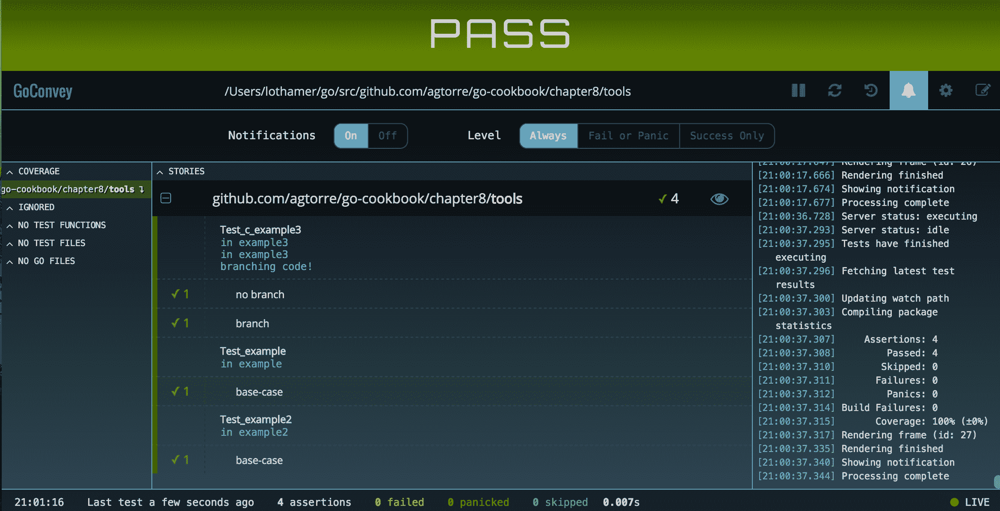

# 测试

在本章中，我们将介绍以下食谱：

+   使用标准库进行模拟

+   使用 Mockgen 包

+   使用表格驱动测试来提高覆盖率

+   使用第三方测试工具

+   实践模糊测试

+   使用 Go 进行行为测试

# 简介

本章将与前面的章节不同；这将专注于测试和测试方法。Go 提供了出色的测试支持，然而，对于来自更动态的语言（在这些语言中猴子补丁和模拟相对简单）的开发者来说，这可能很难理解。

Go 测试鼓励代码采用特定的结构，特别是测试和模拟接口非常直接且支持良好。某些类型的代码可能更难测试。例如，测试使用包级全局变量、未抽象为接口的地方以及具有非导出变量或方法的结构的代码可能很困难。本章将分享一些测试 Go 代码的食谱。

# 使用标准库进行模拟

在 Go 中，模拟通常意味着实现一个带有测试版本的接口，允许您从测试中控制运行时行为。它也可能指代模拟函数和方法，我们将在本食谱中探索另一个技巧。这个技巧使用了在[`play.golang.org/p/oLF1XnRX3C`](https://play.golang.org/p/oLF1XnRX3C)中定义的`Patch`和`Restore`函数。

通常，将代码组合起来以便频繁使用接口，并将代码分成小块进行测试会更好。包含大量分支条件或深层嵌套逻辑的代码可能很难测试，并且测试最终可能更脆弱。这是因为开发者需要在测试中跟踪更多的模拟对象、补丁、返回值和状态。

# 准备工作

根据以下步骤配置您的环境：

1.  从[`golang.org/doc/install`](https://golang.org/doc/install)下载并安装 Go 到您的操作系统上，并配置您的`GOPATH`环境变量。

1.  打开一个终端/控制台应用程序。

1.  导航到您的`GOPATH/src`并创建一个项目目录，例如，`$GOPATH/src/github.com/yourusername/customrepo`。

所有代码都将从这个目录运行和修改。

1.  可选地，使用`go get github.com/agtorre/go-cookbook/`命令安装代码的最新测试版本。

# 如何做到这一点...

这些步骤涵盖了编写和运行您的应用程序：

1.  从您的终端/控制台应用程序中，创建`chapter8/mocking`目录并导航到它。

1.  从[`github.com/agtorre/go-cookbook/tree/master/chapter8/mocking`](https://github.com/agtorre/go-cookbook/tree/master/chapter8/mocking)复制测试或将其作为练习编写一些自己的代码。

1.  创建一个名为`mock.go`的文件，内容如下：

```go
        package mocking

        // DoStuffer is a simple interface
        type DoStuffer interface {
            DoStuff(input string) error
        }

```

1.  创建一个名为`patch.go`的文件，内容如下：

```go
        package mocking

        import "reflect"

        // Restorer holds a function that can be used
        // to restore some previous state.
        type Restorer func()

        // Restore restores some previous state.
        func (r Restorer) Restore() {
            r()
        }

        // Patch sets the value pointed to by the given destination to 
        // the given value, and returns a function to restore it to its 
        // original value. The value must be assignable to the element 
        //type of the destination.
        func Patch(dest, value interface{}) Restorer {
            destv := reflect.ValueOf(dest).Elem()
            oldv := reflect.New(destv.Type()).Elem()
            oldv.Set(destv)
            valuev := reflect.ValueOf(value)
            if !valuev.IsValid() {
                // This isn't quite right when the destination type is 
                // not nilable, but it's better than the complex 
                // alternative.
                valuev = reflect.Zero(destv.Type())
            }
            destv.Set(valuev)
            return func() {
                destv.Set(oldv)
            }
        }

```

1.  创建一个名为`exec.go`的文件，内容如下：

```go
        package mocking

        import "errors"

        var ThrowError = func() error {
            return errors.New("always fails")
        }

        func DoSomeStuff(d DoStuffer) error {

            if err := d.DoStuff("test"); err != nil {
                return err
            }

            if err := ThrowError(); err != nil {
                return err
            }

            return nil
        }

```

1.  创建一个名为`mock_test.go`的文件，内容如下：

```go
        package mocking

        type MockDoStuffer struct {
            // closure to assist with mocking
            MockDoStuff func(input string) error
        }

        func (m *MockDoStuffer) DoStuff(input string) error {
            if m.MockDoStuff != nil {
                return m.MockDoStuff(input)
            }
            // if we don't mock, return a common case
            return nil
        }

```

1.  创建一个名为`exec_test.go`的文件，内容如下：

```go
        package mocking

        import (
            "errors"
            "testing"
        )

        func TestDoSomeStuff(t *testing.T) {
            tests := []struct {
                name       string
                DoStuff    error
                ThrowError error
                wantErr    bool
            }{
                {"base-case", nil, nil, false},
                {"DoStuff error", errors.New("failed"), nil, true},
                {"ThrowError error", nil, errors.New("failed"), true},
            }
            for _, tt := range tests {
                t.Run(tt.name, func(t *testing.T) {
                    // An example of mocking an interface
                    // with our mock struct
                    d := MockDoStuffer{}
                    d.MockDoStuff = func(string) error {
                    return tt.DoStuff }

                   // mocking a function that is declared as a variable
                   // will not work for func A(),
                   // must be var A = func()
                   defer Patch(&ThrowError, func() error { return 
                   tt.ThrowError }).Restore()

                  if err := DoSomeStuff(&d); (err != nil) != tt.wantErr 
                  {
                      t.Errorf("DoSomeStuff() error = %v, 
                      wantErr %v", err, tt.wantErr)
                  }
                })
            }
        }

```

1.  为剩余的函数填写测试，然后向上移动一个目录并运行`go test`。确保所有测试都通过：

```go
 $go test
 PASS
 ok github.com/agtorre/go-cookbook/chapter8/mocking 0.006s

```

# 它是如何工作的...

这个食谱演示了如何模拟接口以及已声明为变量的函数。还有一些库可以直接在声明的函数上模拟这个补丁/恢复，但为了完成这个功能，它们绕过了 Go 的许多类型安全性。如果你需要从外部包中修补函数，你可以使用以下技巧：

```go
// whatever package you wanna patch
import "github.com/package" 

// this is patchable using the method described in this recipe
var packageDoSomething = package.DoSomething

```

对于这个食谱，我们首先设置测试并使用表格驱动测试。关于这种技术的文献有很多，我建议进一步探索。一旦我们的测试设置完成，我们就为模拟函数选择输出。为了模拟我们的接口，我们的模拟对象定义了可以在运行时重写的闭包。我们应用补丁/恢复技术来更改全局函数，并在每次循环后恢复它。这要归功于`t.Run`，它为测试的每个循环设置一个新的函数。

# 使用 Mockgen 包

之前的例子使用了我们的自定义模拟对象。当你与许多接口一起工作时，编写这些对象可能会变得繁琐且容易出错。这是一个生成代码非常有意义的地方。幸运的是，有一个名为`github.com/golang/mock/gomock`的包，它提供了模拟对象的生成，并为我们提供了一个非常实用的库，可以与接口测试一起使用。

这个食谱将探索`gomock`的一些功能，并涵盖在哪里、何时以及如何与生成模拟对象一起工作的权衡。

# 准备就绪

按照以下步骤配置你的环境：

1.  参考本章“使用标准库进行模拟”食谱中的“准备就绪”部分。

1.  运行`go get github.com/golang/mock/`命令。

# 如何做...

这些步骤涵盖了编写和运行你的应用程序：

1.  从你的终端/控制台应用程序中，创建`chapter8/mockgen`目录并导航到它。

1.  从[`github.com/agtorre/go-cookbook/tree/master/chapter8/mockgen`](https://github.com/agtorre/go-cookbook/tree/master/chapter8/mockgen)复制测试或将其作为练习来编写你自己的测试。

1.  创建一个名为`interface.go`的文件，内容如下：

```go
        package mockgen

        // GetSetter implements get a set of a
        // key value pair
        type GetSetter interface {
            Set(key, val string) error
            Get(key string) (string, error)
        }

```

1.  创建一个名为`internal`的目录。

1.  运行`mockgen -destination internal/mocks.go -package internal github.com/agtorre/go-cookbook/chapter8/mockgen GetSetter`命令：

    +   确保你将包路径替换为你的本地版本。

    +   这将创建一个名为`internal/mocks.go`的文件。

1.  创建一个名为`exec.go`的文件，内容如下：

```go
        package mockgen

        // Controller is a struct demonstrating
        // one way to initialize interfaces
        type Controller struct {
            GetSetter
        }

        // GetThenSet checks if a value is set. If not
        // it sets it.
        func (c *Controller) GetThenSet(key, value string) error {
            val, err := c.Get(key)
            if err != nil {
                return err
            }

            if val != value {
                return c.Set(key, value)
            }
            return nil
        }

```

1.  创建一个名为`interface_test.go`的文件，内容如下：

```go
        package mockgen

        import (
            "errors"
            "testing"

            "github.com/agtorre/go-cookbook/chapter8/mockgen/internal"
            "github.com/golang/mock/gomock"
        )

        func TestExample(t *testing.T) {
            ctrl := gomock.NewController(t)
            defer ctrl.Finish()

            mockGetSetter := internal.NewMockGetSetter(ctrl)

            var k string
            mockGetSetter.EXPECT().Get("we can put anything 
            here!").Do(func(key string) {
                k = key
            }).Return("", nil)

            customError := errors.New("failed this time")

            mockGetSetter.EXPECT().Get(gomock.Any()).Return("", 
            customError)

            if _, err := mockGetSetter.Get("we can put anything 
            here!"); err != nil {
                t.Errorf("got %#v; want %#v", err, nil)
            }
            if k != "we can put anything here!" {
                t.Errorf("bad key")
            }

            if _, err := mockGetSetter.Get("key"); err == nil {
                t.Errorf("got %#v; want %#v", err, customError)
            }
        }

```

1.  创建一个名为`exec_test.go`的文件，内容如下：

```go
        package mockgen

        import (
            "errors"
            "testing"

            "github.com/agtorre/go-cookbook/chapter8/mockgen/internal"
            "github.com/golang/mock/gomock"
        )

        func TestController_Set(t *testing.T) {
            tests := []struct {
                name string
                getReturnVal string
                getReturnErr error
                setReturnErr error
                wantErr bool
            }{
                {"get error", "value", errors.New("failed"), nil, 
                true},
                {"value match", "value", nil, nil, false},
                {"no errors", "not set", nil, nil, false},
                {"set error", "not set", nil, errors.New("failed"),
                true},
            }
            for _, tt := range tests {
                t.Run(tt.name, func(t *testing.T) {
                    ctrl := gomock.NewController(t)
                    defer ctrl.Finish()

                    mockGetSetter := internal.NewMockGetSetter(ctrl)
                    mockGetSetter.EXPECT().Get("key").AnyTimes()
                    .Return(tt.getReturnVal, tt.getReturnErr)
                    mockGetSetter.EXPECT().Set("key", 
                    gomock.Any()).AnyTimes().Return(tt.setReturnErr)

                    c := &Controller{
                        GetSetter: mockGetSetter,
                    }
                    if err := c.GetThenSet("key", "value"); (err != 
                    nil) != tt.wantErr {
                        t.Errorf("Controller.Set() error = %v, wantErr 
                        %v", err, tt.wantErr)
                    }
                })
             }
        }

```

1.  为剩余的函数填写测试，然后向上移动一个目录并运行`go test`。确保所有测试都通过。

# 它是如何工作的...

生成的模拟对象允许测试指定预期的参数，函数将被调用的次数，以及返回的内容，并且允许我们设置额外的工件，例如，如果原始函数有类似的流程，我们可以直接写入通道。`interface_test.go`文件展示了在调用时使用模拟对象的示例。通常，测试将看起来更像`exec_test.go`，我们将在其中拦截实际代码执行的接口函数调用并在测试时改变它们的行为。

`exec_test.go`文件还展示了如何在表格驱动测试环境中使用模拟对象。`Any()`函数意味着模拟函数可以被调用零次或多次，这对于代码提前终止的情况非常有用。

在这个菜谱中演示的最后一个技巧是将模拟对象放入`internal`包中。当你需要模拟你自己的包外声明的函数时，这很有用。这允许这些方法在非`_test.go`文件中定义，但不会允许将它们导出给库的用户。通常，直接将模拟对象放入与当前编写的测试相同的包名的`_test.go`文件中会更简单。

# 使用表格驱动测试来提高覆盖率

这个菜谱将演示编写表格驱动测试、收集测试覆盖率并提高覆盖率的过程。它还将使用`github.com/cweill/gotests`包来生成测试。如果你已经下载了其他章节的测试代码，这些应该看起来非常熟悉。通过结合这个菜谱和前两个菜谱，你应该能够在所有情况下通过一些工作实现 100%的测试覆盖率。

# 准备工作

根据以下步骤配置你的环境：

1.  参考本章“Mocking using the standard library”菜谱的“准备工作”部分。

1.  运行`go get github.com/cweill/gotests/`命令。

# 如何做...

这些步骤涵盖了编写和运行你的应用程序：

1.  在你的终端/控制台应用程序中，创建`chapter8/coverage`目录并导航到它。

1.  从[`github.com/agtorre/go-cookbook/tree/master/chapter8/coverage`](https://github.com/agtorre/go-cookbook/tree/master/chapter8/coverage)复制测试或将其用作练习编写一些你自己的代码。

1.  创建一个名为`coverage.go`的文件，其内容如下：

```go
        package main

        import "errors"

        // Coverage is a simple function with some branching conditions
        func Coverage(condition bool) error {
            if condition {
                return errors.New("condition was set")
            }
            return nil
        }

```

1.  运行`gotests -all -w`命令。

1.  这将生成一个名为`coverage_test.go`的文件，其内容如下：

```go
        package main

        import "testing"

        func TestCoverage(t *testing.T) {
            type args struct {
                condition bool
            }
            tests := []struct {
                name string
                args args
                wantErr bool
            }{
                // TODO: Add test cases.
            }
            for _, tt := range tests {
                t.Run(tt.name, func(t *testing.T) {
                    if err := Coverage(tt.args.condition); (err != nil) 
                    != tt.wantErr {
                        t.Errorf("Coverage() error = %v, wantErr %v", 
                        err, tt.wantErr)
                    }
                })
            }
        }

```

1.  在`TODO`部分填写以下内容：

```go
        {"no condition", args{true}, true},

```

1.  运行`go test -cover`命令，你将看到以下输出：

```go
 go test -cover 
 PASS
 coverage: 66.7% of statements
 ok github.com/agtorre/go-cookbook/chapter8/coverage 0.007s

```

1.  在`TODO`部分添加另一个条目：

```go
        {"condition", args{false}, false},

```

1.  运行`go test -cover`命令，你将看到以下输出：

```go
 go test -cover 
 PASS
 coverage: 100.0% of statements
 ok github.com/agtorre/go-cookbook/chapter8/coverage 0.007s

```

1.  运行以下命令：

```go
 go test -coverprofile=cover.out 
 go tool cover -html=cover.out -o coverage.html

```

1.  在浏览器中打开`coverage.html`文件以查看图形覆盖率报告。

# 它是如何工作的...

`go test -cover`命令是基本 Go 安装的一部分。它可以用来收集 Go 应用程序的覆盖率报告。此外，它还具有输出覆盖率指标和 HTML 覆盖率报告的能力。这个工具通常被其他工具包装，将在下一个配方中介绍。这些基于表格的测试风格在[`github.com/golang/go/wiki/TableDrivenTests`](https://github.com/golang/go/wiki/TableDrivenTests)中有介绍，是编写干净测试的极好方式，可以处理许多情况而无需编写大量额外的代码。

这个配方首先自动生成测试代码，然后根据需要填充测试用例，以帮助创建更多覆盖率。唯一特别棘手的时候是当你调用非变量函数或方法时。例如，让`gob.Encode()`返回错误以增加测试覆盖率可能很棘手。使用本章中*使用标准库进行模拟*配方中描述的方法，并使用`var gobEncode = gob.Encode`来允许修补，也可能显得有些奇怪。因此，很难主张 100%的测试覆盖率，相反，可以主张重点测试外部接口，即测试许多输入和输出的变体，在某些情况下，正如我们在本章的*使用 Go 进行行为测试*配方中所看到的，模糊测试可能变得有用。

# 使用第三方测试工具

有许多有助于 Go 测试的工具。这些工具可以更容易地了解代码覆盖率，每个函数级别的工具，用于断言以减少测试代码行数，以及测试运行器。这个配方将涵盖`github.com/axw/gocov`和`github.com/smartystreets/goconvey`包，以展示一些这种功能。根据您的需求，还有许多其他值得注意的测试框架。`github.com/smartystreets/goconvey`包支持断言和测试运行器。在 Go 1.7 之前，它曾经是拥有标记子测试的最干净的方式。

# 准备就绪

按照以下步骤配置您的环境：

1.  参考本章*准备就绪*部分中的*使用标准库进行模拟*

    本章的配方。

1.  运行`go get github.com/axw/gocov`命令。

1.  运行`go get github.com/smartystreets/goconvey/`命令。

# 如何做...

这些步骤涵盖了编写和运行您的应用程序：

1.  从您的终端/控制台应用程序中，创建`chapter8/tools`目录并导航到它。

1.  从[`github.com/agtorre/go-cookbook/tree/master/chapter8/tools`](https://github.com/agtorre/go-cookbook/tree/master/chapter8/tools)复制测试或将其用作练习来编写一些您自己的代码。

1.  创建一个名为`funcs.go`的文件，内容如下：

```go
        package tools

        import (
            "fmt"
        )

        func example() error {
            fmt.Println("in example")
            return nil
        }

        var example2 = func() int {
            fmt.Println("in example2")
            return 10
        }

```

1.  创建一个名为`structs.go`的文件，内容如下：

```go
        package tools

        import (
            "errors"
            "fmt"
        )

        type c struct {
            Branch bool
        }

        func (c *c) example3() error {
            fmt.Println("in example3")
            if c.Branch {
                fmt.Println("branching code!")
                return errors.New("bad branch")
            }
            return nil
        }

```

1.  创建一个名为`funcs_test.go`的文件，内容如下：

```go
        package tools

        import (
            "testing"

            . "github.com/smartystreets/goconvey/convey"
        )

        func Test_example(t *testing.T) {
            tests := []struct {
                name string
            }{
                {"base-case"},
            }
            for _, tt := range tests {
                Convey(tt.name, t, func() {
                    res := example()
                    So(res, ShouldBeNil)
                })
            }
        }

        func Test_example2(t *testing.T) {
            tests := []struct {
                name string
            }{
                {"base-case"},
            }
            for _, tt := range tests {
                Convey(tt.name, t, func() {
                    res := example2()
                    So(res, ShouldBeGreaterThanOrEqualTo, 1)
                })
            }
        }

```

1.  创建一个名为`structs_test.go`的文件，内容如下：

```go
        package tools

        import (
            "testing"

            . "github.com/smartystreets/goconvey/convey"
        )

        func Test_c_example3(t *testing.T) {
            type fields struct {
                Branch bool
            }
            tests := []struct {
                name string
                fields fields
                wantErr bool
            }{
                {"no branch", fields{false}, false},
                {"branch", fields{true}, true},
            }
            for _, tt := range tests {
                Convey(tt.name, t, func() {
                    c := &c{
                        Branch: tt.fields.Branch,
                    }
                    So((c.example3() != nil), ShouldEqual, tt.wantErr)
                })
            }
        }

```

1.  运行`gocov test | gocov report`命令，您将看到以下输出：

```go
 $ gocov test | gocov report
 ok github.com/agtorre/go-cookbook/chapter8/tools 0.006s 
      coverage: 100.0% of statements

 github.com/agtorre/go-cookbook/chapter8/tools/struct.go 
      c.example3 100.00% (5/5)
 github.com/agtorre/go-cookbook/chapter8/tools/funcs.go example 
      100.00% (2/2)
 github.com/agtorre/go-cookbook/chapter8/tools/funcs.go @12:16 
      100.00% (2/2)
 github.com/agtorre/go-cookbook/chapter8/tools ---------- 
      100.00% (9/9)

 Total Coverage: 100.00% (9/9)

```

1.  运行`goconvey`命令，它将打开一个看起来像这样的浏览器：



1.  确保所有测试都通过。

# 它是如何工作的...

本食谱演示了如何将`goconvey`命令连接到您的测试。`Convey`关键字基本上替换了`t.Run`并在`goconvey`网络 UI 中添加了额外的标签，但它的行为略有不同。如果您有嵌套的 convey 块，它们总是按顺序重新执行，即如下所示：

```go
Convey("Outer loop", t, func(){
    a := 1
    Convey("Inner loop", t, func() {
        a = 2
    })
    Convey ("Inner loop2", t, func(){
        fmt.Println(a)
     })
})

```

之前使用`goconvey`命令的代码将打印`1`。如果我们使用内置的`t.Run`，它将打印`2`。换句话说，Go 的`t.Run`测试是顺序执行的，并且永远不会重复。这种行为对于在外部 convey 块中放置设置代码很有用，但如果有必要同时使用两者，请记住这个区别。

当使用 convey 断言时，UI 中的成功会有一个勾选标记，并且还有额外的统计数据。它还可以将 if 检查的长度减少到一行，甚至可以创建自定义断言。

如果您打开`goconvey`网络界面并开启通知，每次保存代码时，测试将自动运行，并且您将收到关于覆盖率增加或减少以及构建失败的通知。

所有三种工具断言、测试运行器和网络 UI 都可以独立使用或一起使用。

当您努力提高测试覆盖率时，`gocov`工具非常有用。它可以快速识别缺乏覆盖率的函数，并帮助您深入了解覆盖率报告。此外，`gocov`可以通过使用`github.com/matm/gocov-html`包生成与 Go 代码一起分发的替代 HTML 报告。

# 实践模糊测试

本食谱将探讨模糊测试及其如何帮助验证函数。在第三章的“货币转换和 float64 考虑”食谱中，我们在“数据转换和组合”中创建了一个函数，该函数接受作为字符串的十进制美国货币并返回表示美分的 int64 版本。我们将修改该函数并通过模糊测试演示如何找到 panic。

# 准备就绪

根据以下步骤配置您的环境：

1.  参考本章“使用标准库进行模拟”食谱中的“准备就绪”部分。

1.  运行`go get github.com/dvyukov/go-fuzz/go-fuzz`命令。

1.  运行`go get github.com/dvyukov/go-fuzz/go-fuzz-build`命令。

# 如何做到这一点...

这些步骤涵盖了编写和运行您的应用程序：

1.  在您的终端/控制台应用程序中，创建`chapter8/fuzz`目录并导航到它。

1.  从 [`github.com/agtorre/go-cookbook/tree/master/chapter8/fuzz`](https://github.com/agtorre/go-cookbook/tree/master/chapter8/fuzz) 复制测试，或者将其作为练习编写您自己的代码。

1.  创建一个名为`dollars.go`的文件，内容如下：

```go
        package fuzz

        import (
            "errors"
            "strconv"
            "strings"
        )

        // ConvertStringDollarsToPennies takes a dollar amount
        // as a string, i.e. 1.00, 55.12 etc and converts it
        // into an int64
        func ConvertStringDollarsToPennies(amount string) (int64, 
        error) {
            // check if amount can convert to a valid float
            val, err := strconv.ParseFloat(amount, 64)
            if err != nil {
                return 0, err
            }

            if val > 1000 && val < 1100 {
                panic("invalid range")
            }

            // split the value on "."
            groups := strings.Split(amount, ".")

            // if there is no . result will still be
            // captured here
            result := groups[0]

            // base string
            r := ""

            // handle the data after the "."
            if len(groups) == 2 {
                if len(groups[1]) != 2 {
                    return 0, errors.New("invalid cents")
                }
                r = groups[1]
                if len(r) > 2 {
                    r = r[:2]
                }
            }

            // pad with 0, this will be
            // 2 0's if there was no .
            for len(r) < 2 {
                r += "0"
            }

            result += r

            // convert it to an int
            return strconv.ParseInt(result, 10, 64)
        }

```

1.  创建一个名为`fuzz.go`的文件，内容如下：

```go
        package fuzz

        // Fuzz is the interface required to use gofuzz
        func Fuzz(data []byte) int {
            amount := string(data)

            _, err := ConvertStringDollarsToPennies(amount)
            if err != nil {
                return 0
            }
            return 1
        }

```

1.  运行`go-fuzz-build github.com/agtorre/go-cookbook/chapter8/fuzz`命令或更改路径以匹配您的代码。

1.  运行以下命令：

```go
 mkdir -p output/corpus

 echo "0.01" > output/corpus/a
 echo "-0.01" > output/corpus/b
 echo "0.10" > output/corpus/c
 echo "1.00" > output/corpus/d
 echo "-1.00" > output/corpus/e
 echo "1.11" > output/corpus/f
 echo "1" > output/corpus/g
 echo "2" > output/corpus/h
 echo "999.99" > output/corpus/i

```

1.  运行`go-fuzz -bin=./fuzz-fuzz.zip -workdir=output`命令，你将看到以下输出：

```go
 go-fuzz -bin=./fuzz-fuzz.zip -workdir=output

 .
 .
 .
 2017/04/02 10:58:43 slaves: 4, corpus: 91 (11s ago), crashers: 
      1, restarts: 1/7064, execs: 204856 (13630/sec), cover: 453, 
      uptime: 15s
 2017/04/02 10:58:46 slaves: 4, corpus: 91 (14s ago), crashers: 
      1, restarts: 1/7244, execs: 253555 (14086/sec), cover: 453, 
      uptime: 18s

```

1.  运行几次迭代后，通过按*Ctrl* + *C*退出。

1.  填写剩余函数的测试，向上移动一个目录，并运行`go test`。确保所有测试都通过。

# 它是如何工作的...

`github.com/dvyukov/go-fuzz`包使用进化算法构建输入语料库以测试 Go 代码。在我们的例子中，我们故意引入了 panic，以演示找到崩溃时的行为。模糊测试是一种发现意外 panic 的实用方法，尤其是在处理数组边界或任意输入的编程中。

在模糊测试一个应用程序时，最困难的部分之一是编写一个合适的模糊函数。`go-fuzz`应用程序将根据此函数的响应进行适应。如果你的模糊函数返回`1`，则被视为成功的输入。如果返回`-1`，则该条目将不会包含在语料库中，如果返回`0`，则给予较低优先级。我们可以通过在步骤 4 中更改模糊函数以返回`-1`而不是`0`来找到被接受但可能未预期的有趣输入。例如，`+1`是这个函数的可能输入。

我们还通过向语料库建议一些项目来帮助我们的 fuzzer。这些项目来自我们的单元测试，代表已知的好值。这有助于 Go 模糊收敛到相关输入，例如，如果您的函数以整数范围作为输入，测试非整数输入可能需要很长时间。

# 使用 Go 进行行为测试

行为测试或集成测试是执行端到端黑盒测试的好方法。此类测试的一个流行框架是 cucumber ([`cucumber.io/`](https://cucumber.io/))，它使用 Gherkin 语言用英语描述测试步骤，然后在代码中实现这些步骤。Go 也有一个 cucumber 库（`github.com/DATA-DOG/godog`）。本食谱将探讨使用`godog`包编写行为测试。

# 准备工作

根据以下步骤配置您的环境：

1.  参考文档的*准备工作*部分。

    本章的食谱。

1.  运行`go get github.com/DATA-DOG/godog`命令。

1.  运行`go get github.com/DATA-DOG/godog/cmd/godog`命令。

# 如何操作...

这些步骤涵盖了编写和运行您的应用程序：

1.  从您的终端/控制台应用程序中，创建`chapter8/bdd`目录并导航到它。

1.  从[`github.com/agtorre/go-cookbook/tree/master/chapter8/bdd`](https://github.com/agtorre/go-cookbook/tree/master/chapter8/bdd)复制测试或将其用作练习编写一些自己的代码。

1.  创建一个名为 `handler.go` 的文件，内容如下：

```go
        package bdd

        import (
            "encoding/json"
            "fmt"
            "net/http"
        )

        // HandlerRequest will be json decoded
        // into by Handler
        type HandlerRequest struct {
            Name string `json:"name"`
        }

        // Handler takes a request and renders a response
        func Handler(w http.ResponseWriter, r *http.Request) {
            w.Header().Set("Content-Type", "text/plain; charset=utf-8")
            if r.Method != http.MethodPost {
                w.WriteHeader(http.StatusMethodNotAllowed)
                return
            }

            dec := json.NewDecoder(r.Body)
            var req HandlerRequest
            if err := dec.Decode(&req); err != nil {
                w.WriteHeader(http.StatusBadRequest)
                return
            }

            w.WriteHeader(http.StatusOK)
            w.Write([]byte(fmt.Sprintf("BDD testing %s", req.Name)))
        }

```

1.  创建一个名为 `features` 的新目录，并创建一个名为 `features/handler.go` 的文件，内容如下：

```go
        Feature: Bad Method
         Scenario: Good request
         Given we create a HandlerRequest payload with:
            | reader |
            | coder |
            | other |
         And we POST the HandlerRequest to /hello
         Then the response code should be 200
         And the response body should be:
            | BDD testing reader |
            | BDD testing coder |
            | BDD testing other |

```

1.  运行 `godog` 命令，你将看到以下输出：

```go
 $ godog
 .
 1 scenarios (1 undefined)
 4 steps (4 undefined)
 89.062µs
 .

```

1.  这应该为你提供了一个实现我们在特性文件中编写的测试的框架；将这些内容复制到 `handler_test.go` 中并实现前两个步骤：

```go
        package bdd

        import (
            "bytes"
            "encoding/json"
            "fmt"
            "net/http/httptest"

            "github.com/DATA-DOG/godog"
            "github.com/DATA-DOG/godog/gherkin"
        )

        var payloads []HandlerRequest
        var resps []*httptest.ResponseRecorder

        func weCreateAHandlerRequestPayloadWith(arg1 
        *gherkin.DataTable) error {
            for _, row := range arg1.Rows {
                h := HandlerRequest{
                    Name: row.Cells[0].Value,
                }
                payloads = append(payloads, h)
            }
            return nil
        }

        func wePOSTTheHandlerRequestToHello() error {
            for _, p := range payloads {
                v, err := json.Marshal(p)
                if err != nil {
                    return err
                }
                w := httptest.NewRecorder()
                r := httptest.NewRequest("POST", "/hello", 
                bytes.NewBuffer(v))

                Handler(w, r)
                resps = append(resps, w)
            }
            return nil
        }

```

1.  运行 `godog` 命令，你将看到以下输出：

```go
 $ godog
 .
 1 scenarios (1 pending)
 4 steps (2 passed, 1 pending, 1 skipped)
 .

```

1.  填写剩余的两个步骤：

```go
        func theResponseCodeShouldBe(arg1 int) error {
            for _, r := range resps {
                if got, want := r.Code, arg1; got != want {
                    return fmt.Errorf("got: %d; want %d", got, want)
                }
            }
            return nil
        }

        func theResponseBodyShouldBe(arg1 *gherkin.DataTable) error {
            for c, row := range arg1.Rows {
                b := bytes.Buffer{}
                b.ReadFrom(resps[c].Body)
                if got, want := b.String(), row.Cells[0].Value;
                got != want 
                {
                    return fmt.Errorf("got: %s; want %s", got, want)
                }
            }
            return nil
        }

        func FeatureContext(s *godog.Suite) {
            s.Step(`^we create a HandlerRequest payload with:$`, 
            weCreateAHandlerRequestPayloadWith)
            s.Step(`^we POST the HandlerRequest to /hello$`, 
            wePOSTTheHandlerRequestToHello)
            s.Step(`^the response code should be (d+)$`, 
            theResponseCodeShouldBe)
            s.Step(`^the response body should be:$`, 
            theResponseBodyShouldBe)
        }

```

1.  运行 `godog` 命令，你将看到以下输出：

```go
 $ godog 
 .
 1 scenarios (1 passed)
 4 steps (4 passed)
 552.605µs
 .

```

# 它是如何工作的...

Cucumber 框架非常适合结对编程、端到端测试以及任何最好用书面指令进行沟通且对非技术人员可理解的测试类型。一旦某个步骤被实现，通常可以在需要的地方重用它。如果你想要测试服务之间的集成，可以编写使用实际 HTTP 客户端的测试，前提是你首先确保你的环境已经设置好以接收 HTTP 连接。

Datadog 对 BDD 的实现缺少一些你可能期望的功能，如果你使用过其他 Cucumber 框架，包括缺少示例、在函数间传递上下文以及许多其他关键字。然而，这是一个良好的开端，通过在这个菜谱中使用一些技巧，例如使用全局变量来跟踪状态（并确保在场景之间清理这些全局变量），可以构建一个相当健壮的测试集。Datadog 测试包还使用第三方测试运行器，因此无法与 `gocov` 或 `go test -cover` 等包一起使用。
