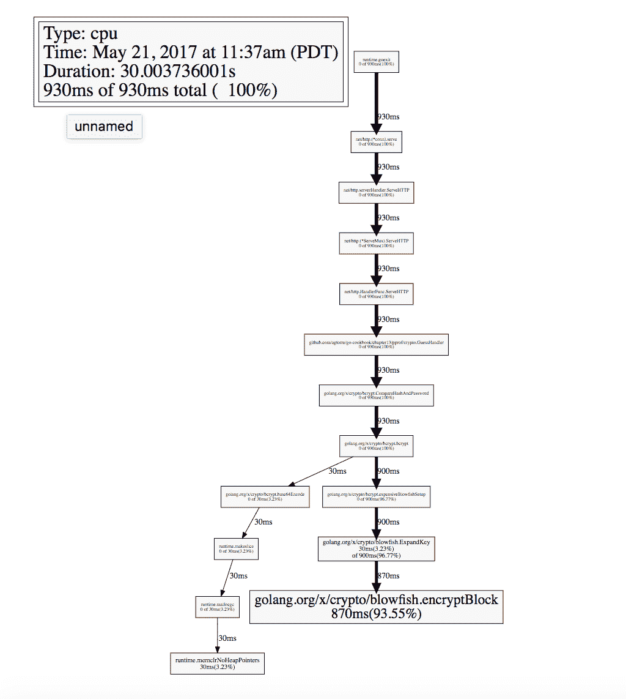

# 性能改进、技巧和窍门

在本章中，我们将介绍以下菜谱：

+   加快编译和测试周期

+   使用 pprof 工具

+   基准测试和查找瓶颈

+   内存分配和堆管理

+   依赖项和项目布局

+   使用 fasthttprouter 和 fasthttp

# 简介

本章将专注于优化应用程序，发现瓶颈，以及依赖项的 vendoring。这些是一些可以立即用于现有应用程序的技巧和窍门。如果你或你的组织需要完全可重复构建，这些菜谱是必要的。当你想基准测试应用程序的性能时，它们也非常有用。最后的菜谱专注于提高 HTTP 的速度，然而，始终要记住，网络世界变化迅速，了解最佳实践很重要。例如，如果你需要 HTTP/2，从版本 1.6 开始，可以使用内置的 Go `net/http`包来使用它。

# 加快编译和测试周期

有几个原因可能导致应用程序编译缓慢，进而运行测试也缓慢。通常，这是需要应用程序每次从头开始编译（没有中间构建）、大型代码库和许多依赖的组合。这个菜谱将探讨一些可以用来查看当前依赖列表并加快编译速度的工具。

# 准备工作

通过以下步骤配置你的环境：

1.  从[`golang.org/doc/install`](https://golang.org/doc/install)下载并安装 Go 到你的操作系统，并配置你的`GOPATH`环境变量。

1.  打开一个终端/控制台应用程序。

1.  导航到你的`GOPATH/src`目录并创建一个项目目录，例如，`$GOPATH/src/github.com/yourusername/customrepo`。

所有代码都将从这个目录运行和修改。

1.  可选地，使用`go get github.com/agtorre/go-cookbook/`命令安装代码的最新测试版本。

# 如何做...

这些步骤涵盖了编写和运行你的应用程序：

1.  为了演示 go 构建性能如何退化，你可以通过运行`rm -rf $GOPATH/pkg/`命令来删除你的`pkg`目录，或者为这个菜谱设置一个新的`GOPATH`。确保`$GOPATH`已设置。

1.  通过运行`cd $GOPATH/src/github.com/agtorre/go-cookbook/chapter6/grpc/server`命令来构建`github.com/agtorre/go-cookbook/chapter6/grpc/server`包。

1.  运行`time go build`命令：

```go
 $ time go build .
 go build 4.10s user 0.59s system 181% cpu 2.580 total

```

1.  使用以下命令测试`github.com/agtorre/go-cookbook/chapter6/grpc/server`包：

```go
 $ time go test
 PASS
 ok github.com/agtorre/go-cookbook/chapter6/grpc/server 0.014s
 go test 4.01s user 0.60s system 176% cpu 2.608 total

```

1.  探索导致 4 秒构建的原因；看起来并不是我们项目的大小：

```go
 $ wc -l *.go
 25 greeter.go
 44 greeter_test.go
 20 server.go
 89 total

```

1.  列出所有导入：

```go
 $ go list -f '{{ join .Imports "\n"}}'
 fmt
 github.com/agtorre/go-cookbook/chapter6/grpc/greeter
 golang.org/x/net/context
 google.golang.org/grpc
 net

 $go list -f '{{ join .Imports "\n"}}' github.com/agtorre/go-
 cookbook/chapter6/grpc/greeter
 fmt
 github.com/golang/protobuf/proto
 golang.org/x/net/context
 google.golang.org/grpc
 math

```

1.  列出依赖项；检查数量。注意与空`main.go`文件相比的差异：

```go
 $ go list -f '{{ join .Deps "\n"}}' . 
 .
 .
 .
 google.golang.org/grpc
 google.golang.org/grpc/codes
 google.golang.org/grpc/credentials
 google.golang.org/grpc/grpclog
 google.golang.org/grpc/internal
 google.golang.org/grpc/metadata
 google.golang.org/grpc/naming
 google.golang.org/grpc/peer
 google.golang.org/grpc/stats
 google.golang.org/grpc/tap
 google.golang.org/grpc/transport
 .
 .
 .

 $ go list -f '{{ join .Deps "\n"}}' . | wc -l 
 111

 $ go list -f '{{ join .Deps "\n"}}' /path/to/empty/main/package | 
 wc -l
 4

```

1.  加速：

```go
 $ cd $GOPATH/src/github.com/agtorre/go-
 cookbook/chapter6/grpc/server
 $ go install ./...
 $ go test -i ./...

```

1.  再次尝试运行以下命令：

```go
 $ time go build .
 go build . 0.65s user 0.15s system 117% cpu 0.683 total

 $ time go test .
 ok github.com/agtorre/go-cookbook/chapter6/grpc/server 0.015s
 go test . 0.63s user 0.17s system 118% cpu 0.669 total

```

# 它是如何工作的...

如果你遇到 Go 编译速度慢的问题，有几个方面需要考虑。首先，Go 1.5 是第一个完全用 Go 编写的 Go 编译器。这带来了编译时间的显著增加，并且从那时起，每个版本都对此进行了改进。如果你使用的是 Go 1.5 或更高版本，你的第一步应该是升级到最新的 Go 版本。

接下来，对依赖关系的分析可能至关重要。一些 Go 包有较大的依赖关系变化，你可能会在不知情的情况下通过单个导入添加数十万行代码。分析你的依赖关系是值得的。这可以通过 Go list 工具实现，但也有一些第三方工具，包括新的 dep ([`github.com/golang/dep`](https://github.com/golang/dep))、godep ([`github.com/tools/godep`](https://github.com/tools/godep))和 glide ([`github.com/Masterminds/glide`](https://github.com/Masterminds/glide))，以及大多数供应商仓库都会将所有依赖项放在供应商目录中。

最后，保存库的中间构建版本通常会带来显著的提升。这可以通过`go install ./...`和`go test -i ./...`命令实现，这些命令将在`pkg`目录中创建工件。`install`命令为导入的包执行此操作，而`go test -i`为测试包执行相同的操作。如果你使用的是`goconvey`这样的框架，这可能会很有用。

# 使用 pprof 工具

pprof 工具允许 Go 应用程序收集和导出运行时分析数据。它还提供了通过 Web 界面访问工具的 Web 钩子。这个方案将创建一个基本的应用程序，用于验证 bcrypt 散列密码与明文密码是否匹配，然后分析该应用程序。

你可能期望在第十章“分布式系统”中找到 pprof 工具，以及其他指标和监控方案。然而，它被放在了这一章，因为它将用于分析和改进程序，这与基准测试的使用方式非常相似。因此，这个方案将主要关注 pprof 在分析和改进应用程序内存使用方面的应用。

# 准备工作

通过执行以下步骤来配置你的环境：

1.  参考本章中“加快编译和测试周期”方案的*准备工作*部分。

1.  可选地，从[`www.graphviz.org/Home.php`](http://www.graphviz.org/Home.php)安装 Graphviz。

# 如何操作...

这些步骤涵盖了编写和运行你的应用程序：

1.  在你的终端/控制台应用程序中，创建并导航到`chapter13/pprof`目录。

1.  从**[`github.com/agtorre/go-cookbook/tree/master/chapter13/pprof`](https://github.com/agtorre/go-cookbook/tree/master/chapter13/pprof)**复制测试或将其作为练习编写一些自己的代码。

1.  创建一个名为`crypto`的目录并导航到它。

1.  创建一个名为`handler.go`的文件，内容如下：

```go
        package crypto

        import (
            "net/http"

            "golang.org/x/crypto/bcrypt"
        )

        // GuessHandler checks if ?message=password
        func GuessHandler(w http.ResponseWriter, r *http.Request) {
            r.ParseForm()

            msg := r.FormValue("message")

            // "password"
            real := 
            []byte("$2a$10$2ovnPWuIjMx2S0HvCxP/mutzdsGhyt8rq/
            JqnJg/6OyC3B0APMGlK")

            if err := bcrypt.CompareHashAndPassword(real, []byte(msg)); 
            err != nil {
                w.WriteHeader(http.StatusBadRequest)
                w.Write([]byte("try again"))
                return
            }

            w.WriteHeader(http.StatusOK)
            w.Write([]byte("you got it"))
            return
        }

```

1.  向上导航一个目录。

1.  创建一个名为 `example` 的新目录并导航到它。

1.  创建一个包含以下内容的 `main.go` 文件。确保你将 `crypto` 导入修改为在步骤 2 中设置的路径：

```go
        package main

        import (
            "fmt"
            "log"
            "net/http"
            _ "net/http/pprof"

            "github.com/agtorre/go-cookbook/chapter13/pprof/crypto"
        )

        func main() {

            http.HandleFunc("/guess", crypto.GuessHandler)
            fmt.Println("server started at localhost:8080")
            log.Panic(http.ListenAndServe("localhost:8080", nil))
        }

```

1.  运行 `go run main.go`。

1.  你也可以运行以下命令：

```go
 go build ./example

```

你现在应该看到以下输出：

```go
 $ go run main.go
 server started at localhost:8080

```

1.  在另一个终端中运行以下命令：

```go
 $ go tool pprof http://localhost:8080/debug/pprof/profile

```

1.  这将启动一个 30 秒的计时器。

1.  在 `pprof` 运行时运行多个 curl：

```go
 $ curl "http://localhost:8080/guess?message=test"
 try again

 $curl "http://localhost:8080/guess?message=password" 
 you got it

 .
 .
 .
 .

 $curl "http://localhost:8080/guess?message=password" 
 you got it  

```

1.  返回到 `pprof` 命令并等待其完成。

1.  从 `pprof` 命令运行 `top10` 命令：

```go
 (pprof) top 10
 930ms of 930ms total ( 100%)
 Showing top 10 nodes out of 15 (cum >= 930ms)
 flat flat% sum% cum cum%
 870ms 93.55% 93.55% 870ms 93.55% 
 golang.org/x/crypto/blowfish.encryptBlock
 30ms 3.23% 96.77% 900ms 96.77% 
 golang.org/x/crypto/blowfish.ExpandKey
 30ms 3.23% 100% 30ms 3.23% runtime.memclrNoHeapPointers
 0 0% 100% 930ms 100% github.com/agtorre/go-
 cookbook/chapter13/pprof/crypto.GuessHandler
 0 0% 100% 930ms 100% 
 golang.org/x/crypto/bcrypt.CompareHashAndPassword
 0 0% 100% 30ms 3.23% golang.org/x/crypto/bcrypt.base64Encode
 0 0% 100% 930ms 100% golang.org/x/crypto/bcrypt.bcrypt
 0 0% 100% 900ms 96.77% 
 golang.org/x/crypto/bcrypt.expensiveBlowfishSetup
 0 0% 100% 930ms 100% net/http.(*ServeMux).ServeHTTP
 0 0% 100% 930ms 100% net/http.(*conn).serve

```

1.  如果你安装了 Graphviz，运行 `pprof web` 命令。你应该看到类似以下的内容：



1.  如果你复制或编写了自己的测试用例，请向上导航一个目录并运行 `go test`。确保所有测试都通过。

# 它是如何工作的...

pprof 工具提供了关于你的应用程序的大量运行时信息。使用 `net/pprof` 包通常是最简单的配置方式——所需做的就是监听一个端口并进行导入。

在我们的案例中，我们编写了一个使用非常计算密集型应用程序（bcrypt）的处理程序，以便我们可以演示它们在 pprof 分析时是如何出现的。这将快速隔离创建应用程序瓶颈的代码块。

我们选择收集一个通用配置文件，使 pprof 在 30 秒内轮询我们的应用程序端点。然后我们生成针对端点的流量以帮助产生结果。这在你尝试检查单个处理器或代码分支时可能很有帮助。

最后，我们查看 CPU 利用率最高的前 10 个函数。也可以使用 `pprof http://localhost:8080/debug/pprof/heap` 命令查看内存/堆管理。`pprof web` 命令可以用来查看你的 CPU/内存配置文件的可视化，并有助于突出更活跃的代码。

# 基准测试和查找瓶颈

确定代码中缓慢部分的另一种方法是使用基准测试。基准测试可以用来测试函数的平均性能，也可以并行运行基准测试。这在对函数进行比较或对某些代码进行微优化时可能很有用，特别是为了查看函数实现在使用并发时可能的表现。对于这个菜谱，我们将创建两个都实现了原子计数器的结构体。第一个将使用 `sync` 包，另一个将使用 `sync/atomic`。然后我们将基准测试这两个解决方案。

# 准备工作

参考本章中 *加快编译和测试周期* 菜单的 *准备工作* 部分。

# 如何做到...

这些步骤涵盖了编写和运行你的应用程序：

1.  从你的终端/控制台应用程序中，创建名为 `chapter13/bench` 的目录并导航到它。

1.  从 [`github.com/agtorre/go-cookbook/tree/master/chapter13/bench`](https://github.com/agtorre/go-cookbook/tree/master/chapter13/bench) 复制测试用例，或者将其作为练习编写一些自己的代码。

注意，复制的测试也包括在此配方中稍后编写的基准测试。

1.  创建一个名为 `lock.go` 的文件，内容如下：

```go
        package bench

        import "sync"

        // Counter uses a sync.RWMutex to safely
        // modify a value
        type Counter struct {
            value int64
            mu *sync.RWMutex
        }

        // Add increments the counter
        func (c *Counter) Add(amount int64) {
            c.mu.Lock()
            c.value += amount
            c.mu.Unlock()
        }

        // Read returns the current counter amount
        func (c *Counter) Read() int64 {
            c.mu.RLock()
            defer c.mu.RUnlock()
            return c.value
        }

```

1.  创建一个名为 `atomic.go` 的文件，内容如下：

```go
        package bench

        import "sync/atomic"

        // AtomicCounter implements an atmoic lock
        // using the atomic package
        type AtomicCounter struct {
            value int64
        }

        // Add increments the counter
        func (c *AtomicCounter) Add(amount int64) {
            atomic.AddInt64(&c.value, amount)
        }

        // Read returns the current counter amount
        func (c *AtomicCounter) Read() int64 {
            var result int64
            result = atomic.LoadInt64(&c.value)
            return result
        }

```

1.  创建一个名为 `lock_test.go` 的文件，内容如下：

```go
        package bench

        import "testing"

        func BenchmarkCounterAdd(b *testing.B) {
            c := Counter{0, &sync.RWMutex{}}
            for n := 0; n < b.N; n++ {
                c.Add(1)
            }
        }

        func BenchmarkCounterRead(b *testing.B) {
            c := Counter{0, &sync.RWMutex{}}
            for n := 0; n < b.N; n++ {
                c.Read()
            }
        }

        func BenchmarkCounterAddRead(b *testing.B) {
            c := Counter{0, &sync.RWMutex{}}
            b.RunParallel(func(pb *testing.PB) {
                for pb.Next() {
                    c.Add(1)
                    c.Read()
                }
            })
        }

```

1.  创建一个名为 `atomic_test.go` 的文件，内容如下：

```go
        package bench

        import "testing"

        func BenchmarkAtomicCounterAdd(b *testing.B) {
            c := AtomicCounter{0}
            for n := 0; n < b.N; n++ {
                c.Add(1)
            }
        }

        func BenchmarkAtomicCounterRead(b *testing.B) {
            c := AtomicCounter{0}
            for n := 0; n < b.N; n++ {
                c.Read()
            }
        }

        func BenchmarkAtomicCounterAddRead(b *testing.B) {
            c := AtomicCounter{0}
            b.RunParallel(func(pb *testing.PB) {
                for pb.Next() {
                    c.Add(1)
                    c.Read()
                }
            })
        }

```

1.  运行 `go test -bench1` 命令，你将看到以下输出：

```go
 $ go test -bench . 
 BenchmarkAtomicCounterAdd-4 200000000 8.38 ns/op
 BenchmarkAtomicCounterRead-4 1000000000 2.09 ns/op
 BenchmarkAtomicCounterAddRead-4 50000000 24.5 ns/op
 BenchmarkCounterAdd-4 50000000 34.8 ns/op
 BenchmarkCounterRead-4 20000000 66.0 ns/op
 BenchmarkCounterAddRead-4 10000000 146 ns/op
 PASS
 ok github.com/agtorre/go-cookbook/chapter13/bench 10.919s

```

1.  如果你复制或编写了自己的测试，请向上导航一个目录并运行 `go test`。确保所有测试都通过。

# 它是如何工作的...

本配方是代码关键路径比较的一个示例。例如，有时你的应用程序必须经常执行某些功能，可能每次调用都要执行。在这种情况下，我们编写了一个原子计数器，可以从多个 goroutine 中添加或读取值。

第一个解决方案使用 `RWMutex` 和 `Lock` 或 `RLock` 对象分别进行写入和读取。第二个使用提供相同功能的原子包。我们使函数的签名相同，以便基准测试可以经过少量修改后重用，并且两个都可以满足相同的原子整数接口。

最后，我们编写了添加值和读取值的基准测试。然后，我们编写了一个并行基准测试，该测试调用添加和读取函数。并行基准测试将创建大量的锁竞争，因此我们预计会有性能下降。也许出乎意料的是，原子包在性能上显著优于 `RWMutex`。

# 内存分配和堆管理

一些应用程序可以从优化中受益良多。以路由器为例，我们将在后面的配方中探讨。幸运的是，基准测试工具集提供了收集大量内存分配以及内存分配大小的标志。这有助于调整某些关键代码路径以最小化这两个属性。

本配方将展示两种编写将字符串粘合在一起的方法，类似于 `strings.Join("a", "b", "c")`。一种方法将使用连接，而另一种将使用 `strings` 包。然后我们将比较两种方法的性能和内存分配。

# 准备就绪

参考本章中 *Speeding up compilation and testing cycles* 配方的 *准备就绪* 部分。

# 如何操作...

这些步骤涵盖了编写和运行你的应用程序：

1.  在你的终端/控制台应用程序中，创建 `chapter13/tuning` 目录并导航到该目录。

1.  从 [`github.com/agtorre/go-cookbook/tree/master/chapter13/tuning`](https://github.com/agtorre/go-cookbook/tree/master/chapter14/tuning) 复制测试或将其作为练习编写一些自己的代码。

注意，复制的测试也包括在此配方中稍后编写的基准测试。

1.  创建一个名为 `concat.go` 的文件，内容如下：

```go
        package tuning

        func concat(vals ...string) string {
            finalVal := ""
            for i := 0; i < len(vals); i++ {
                finalVal += vals[i]
                if i != len(vals)-1 {
                    finalVal += " "
                }
            }
            return finalVal
        }

```

1.  创建一个名为 `join.go` 的文件，内容如下：

```go
        package tuning

        import "strings"

        func join(vals ...string) string {
            c := strings.Join(vals, " ")
            return c
        }

```

1.  创建一个名为 `concat_test.go` 的文件，内容如下：

```go
        package tuning

        import "testing"

        func Benchmark_concat(b *testing.B) {
            b.Run("one", func(b *testing.B) {
                one := []string{"1"}
                for i := 0; i < b.N; i++ {
                    concat(one...)
                }
            })
            b.Run("five", func(b *testing.B) {
                five := []string{"1", "2", "3", "4", "5"}
                for i := 0; i < b.N; i++ {
                    concat(five...)
                }
            })

            b.Run("ten", func(b *testing.B) {
                ten := []string{"1", "2", "3", "4", "5",
                "6", "7", "8", "9", "10"}
                for i := 0; i < b.N; i++ {
                    concat(ten...)
                }
            })
        }

```

1.  创建一个名为 `join_test.go` 的文件，内容如下：

```go
        package tuning

        import "testing"

        func Benchmark_join(b *testing.B) {
            b.Run("one", func(b *testing.B) {
                one := []string{"1"}
                for i := 0; i < b.N; i++ {
                    join(one...)
                }
            })
            b.Run("five", func(b *testing.B) {
                five := []string{"1", "2", "3", "4", "5"}
                for i := 0; i < b.N; i++ {
                    join(five...)
                }
            })

            b.Run("ten", func(b *testing.B) {
                ten := []string{"1", "2", "3", "4", "5",
                "6", "7", "8", "9", "10"}
                    for i := 0; i < b.N; i++ {
                        join(ten...)
                    }
            })
        }

```

1.  运行 `GOMAXPROCS=1 go test -bench=. -benchmem -benchtime=1s` 命令，您将看到以下输出：

```go
 $ GOMAXPROCS=1 go test -bench=. -benchmem -benchtime=1s
 Benchmark_concat/one 100000000 13.6 ns/op 0 B/op 0 allocs/op
 Benchmark_concat/five 5000000 386 ns/op 48 B/op 8 allocs/op
 Benchmark_concat/ten 2000000 992 ns/op 256 B/op 18 allocs/op
 Benchmark_join/one 200000000 6.30 ns/op 0 B/op 0 allocs/op
 Benchmark_join/five 10000000 124 ns/op 32 B/op 2 allocs/op
 Benchmark_join/ten 10000000 183 ns/op 64 B/op 2 allocs/op
 PASS
 ok github.com/agtorre/go-cookbook/chapter13/tuning 12.003s

```

1.  如果您复制或编写了自己的测试，请向上移动一个目录并运行 `go test`。确保所有测试都通过。

# 它是如何工作的...

基准测试帮助我们调整应用程序，并对内存分配等事物进行某些微优化。当对具有输入的应用程序进行基准测试时，尝试各种输入大小以确定它是否会影响分配是很重要的。我们编写了两个函数，`concat` 和 `join`。这两个函数都将一个可变字符串参数与空格连接起来，所以参数 (*a*, *b*, *c*) 将返回字符串 *a b c*。

`concat` 方法仅通过字符串连接来完成这项工作。我们创建一个字符串，并在 `for` 循环中追加列表中的字符串和空格。在最后一个循环中我们省略添加空格。`join` 函数使用内部的 `Strings.Join` 函数在大多数情况下更有效地完成这项工作。将标准库与您自己的函数进行比较进行基准测试可能有助于更好地理解性能、简单性和功能方面的权衡。

我们使用了子基准测试来测试所有参数，这也非常适合与表格驱动基准测试一起使用。我们可以看到 `concat` 方法在至少对于单长度输入的情况下，比连接方法产生了更多的分配。一个很好的练习是尝试使用可变长度的输入字符串以及不同的参数数量。

# 供应商化和项目布局

将 Go 应用程序进行供应商化仍然是一个很大程度上未解决的问题。有关于创建官方供应商解决方案的讨论和计划（[`github.com/golang/dep`](https://github.com/golang/dep)），但目前还处于早期阶段，事情远未完成。目前，有几种替代方案。默认情况下，您可以将包放置到本地供应商目录中，以使用它们而不是 `GOPATH` 环境变量中的那些。这允许包锁定其供应商目录中的版本，并允许在不将整个 `GOPATH` 提交到版本控制的情况下进行可重复构建。大多数包管理器都利用了这一点。对于这个食谱，我们将探讨 Web 应用程序的布局以及如何使用 `godep` [github.com/tools/godep](http://github.com/tools/godep)，一个流行的依赖管理工具来管理其供应商依赖。

# 准备就绪

通过以下步骤配置您的环境：

1.  参考本章中“加速编译和测试周期”食谱的“准备就绪”部分。

1.  运行 `go get github.com/tools/godep` 命令。

1.  运行 `go get github.com/sirupsen/logrus` 命令。

# 如何操作...

这些步骤涵盖了编写和运行您的应用程序：

1.  在您的终端/控制台应用程序中，创建 `chapter13/vendoring` 目录并导航到它。

1.  从 [`github.com/agtorre/go-cookbook/tree/master/chapter13/vendoring`](https://github.com/agtorre/go-cookbook/tree/master/chapter14/vendoring) 复制测试

    或者将其用作练习来编写你自己的代码。

1.  创建一个名为 `models` 的目录并进入该目录。

1.  创建一个名为 `models.go` 的文件，内容如下：

```go
        package models

        import "sync/atomic"

        // DB Interface is our storage
        // layer
        type DB interface {
            GetScore() (int64, error)
            SetScore(int64) error
        }

        // NewDB returns our db struct that
        // satisfies DB interface
        func NewDB() DB {
            return &db{0}
        }

        type db struct {
            score int64
        }

        // GetScore returns the score atomically
        func (d *db) GetScore() (int64, error) {
            return atomic.LoadInt64(&d.score), nil
        }

        // SetScore stores a new value atomically
        func (d *db) SetScore(score int64) error {
            atomic.StoreInt64(&d.score, score)
            return nil
        }

```

1.  向上导航一个目录。

1.  创建一个名为 `handlers` 的目录并进入该目录。

1.  创建一个名为 `controller.go` 的文件，内容如下：

```go
        package handlers

        import "github.com/agtorre/go-
        cookbook/chapter13/vendoring/models"

        type Controller struct {
            db models.DB
        }

        func NewController(db models.DB) *Controller {
            return &Controller{db: db}
        }

        type resp struct {
            Status string `json:"status"`
            Value int64 `json:"value"`
        }

```

1.  创建一个名为 `get.go` 的文件，内容如下：

```go
        package handlers

        import (
            "encoding/json"
            "net/http"

            "github.com/sirupsen/logrus"
        )

        // GetHandler returns the current score in a resp object
        func (c *Controller) GetHandler(w http.ResponseWriter, r 
        *http.Request) {
            enc := json.NewEncoder(w)
            payload := resp{Status: "error"}
            oldScore, err := c.db.GetScore()
            if err != nil {
                logrus.WithField("error", err).Error("failed to get the 
                score")
                w.WriteHeader(http.StatusInternalServerError)
                enc.Encode(&payload)
                return
            }
            w.WriteHeader(http.StatusOK)
            payload.Value = oldScore
            payload.Status = "ok"
            enc.Encode(&payload)
        }

```

1.  创建一个名为 `set.go` 的文件，内容如下：

```go
        package handlers

        import (
            "encoding/json"
            "net/http"
            "strconv"

            "github.com/sirupsen/logrus"
        )

        // SetHandler Sets the value, and returns it in a resp
        func (c *Controller) SetHandler(w http.ResponseWriter, r 
        *http.Request) {
            enc := json.NewEncoder(w)
            payload := resp{Status: "error"}
            r.ParseForm()
            val := r.FormValue("score")
            score, err := strconv.ParseInt(val, 10, 64)
            if err != nil {
                logrus.WithField("error", err).Error("failed to parse 
                input")
                w.WriteHeader(http.StatusBadRequest)
                enc.Encode(&payload)
                return
            }

            if err := c.db.SetScore(score); err != nil {
                logrus.WithField("error", err).Error("failed to set the 
                score")
                w.WriteHeader(http.StatusInternalServerError)
                enc.Encode(&payload)
                return
            }
            w.WriteHeader(http.StatusOK)
            payload.Value = score
            payload.Status = "ok"
            enc.Encode(&payload)
        }

```

1.  供应商你的依赖项：

```go
 $ godep save ./...
 $ cat Godeps/Godeps.json
 {
 "ImportPath": "github.com/agtorre/go-
 cookbook/chapter13/vendoring",
 "GoVersion": "go1.8",
 "GodepVersion": "v79",
 "Packages": [
 "./..."
 ],
 "Deps": [
 {
 "ImportPath": "github.com/sirupsen/logrus",
 "Comment": "v0.11.2-1-g3f603f4",
 "Rev": "3f603f494d61c73457fb234161d8982b9f0f0b71"
 },
 {
 "ImportPath": "golang.org/x/sys/unix",
 "Rev": "dbc2be9168a660ef302e04b6ff6406de6f967473"
 }
 ]
 }

```

1.  向上导航一个目录。

1.  创建一个名为 `main.go` 的文件，内容如下：

```go
        package main

        import (
            "net/http"

            "github.com/agtorre/go-
            cookbook/chapter13/vendoring/handlers"
            "github.com/agtorre/go-cookbook/chapter13/vendoring/models"
            "github.com/sirupsen/logrus"
        )

        func main() {
            c := handlers.NewController(models.NewDB())

            logrus.SetFormatter(&logrus.JSONFormatter{})

            http.HandleFunc("/get", c.GetHandler)
            http.HandleFunc("/set", c.SetHandler)
            fmt.Println("server started at localhost:8080")
            panic(http.ListenAndServe("localhost:8080", nil))
        }

```

1.  运行 `go run main.go`。

1.  你也可以运行以下命令：

```go
 go build
 ./vendoring

```

你应该看到以下输出：

```go
 $ go run main.go
 server started at localhost:8080

```

1.  在另一个终端中运行一些 curl 命令：

```go
 $ curl "http://localhost:8080/set?score=24" 
 {"status":"ok","value":24}

 $ curl "http://localhost:8080/get"
 {"status":"ok","value":24}

 $ curl "http://localhost:8080/set?score=abc" 
 {"status":"error","value":0}

```

1.  查看服务器日志：

```go
 {"error":"strconv.ParseInt: parsing \"abc\": invalid 
 syntax","level":"error","msg":"failed to parse 
 input","time":"2017-05-26T20:49:47-07:00"}

```

1.  如果你复制或编写了自己的测试，请运行 `go test`。确保所有测试都通过。

# 它是如何工作的...

本食谱展示了如何在应用程序中分离基本关注点。对于模型或客户端等资源，首先创建一个执行动作的接口是一个好主意，然后满足该接口并提供方便的设置函数。模型/客户端代码也会经常产生自定义错误类型。

接下来，我们创建我们的控制器和处理器，将所有客户端请求隔离到服务器。`Controller` 对象使用存储接口，这使得在不修改应用程序代码的情况下轻松切换存储解决方案变得容易。最后，`main.go` 用于设置路由、初始化控制器和配置诸如日志记录等事项。我们使用包级别的全局日志记录器，以便我们的任何方法都可以在需要时自由记录。我们仍然尝试只在处理错误时记录，而不是在遇到并快速返回时。

我们使用了 logrus 作为我们的日志系统，这引入了一个我们希望供应商以便于可重复构建的依赖项。我们使用了 Godep 工具将 logrus 的本地副本存储在我们的供应商目录中。本项目检查将使用 vendors 中的固定版本进行未来构建，并且可以在准备就绪时升级。

# 使用 fasthttprouter 和 fasthttp

虽然 Go 标准库提供了运行 HTTP 服务器所需的一切，但有时你需要进一步优化路由和请求时间等问题。本食谱将探讨一个名为 `fasthttp` 的库，它可以加快请求处理速度（[`github.com/valyala/fasthttp`](https://github.com/valyala/fasthttp)）以及一个名为 `fasthttprouter` 的路由器，它可以显著提高路由性能（[`github.com/buaazp/fasthttprouter`](https://github.com/buaazp/fasthttprouter)）。虽然 fasthttp 很快，但需要注意的是，它不支持 HTTP/2 ([`github.com/valyala/fasthttp/issues/45`](https://github.com/valyala/fasthttp/issues/45))。

# 准备工作

通过执行以下步骤来配置你的环境：

1.  参考本章中“加速编译和测试周期”食谱的“准备就绪”部分。

1.  运行 `go get github.com/buaazp/fasthttprouter` 命令。

1.  运行 `go get github.com/valyala/fasthttp` 命令。

# 如何操作...

这些步骤涵盖了编写和运行你的应用程序：

1.  从你的终端/控制台应用程序中，创建 `chapter13/fastweb` 目录并导航到它。

1.  从 [`github.com/agtorre/go-cookbook/tree/master/chapter13/fastweb`](https://github.com/agtorre/go-cookbook/tree/master/chapter14/fastweb) 复制测试或将其作为练习编写你自己的代码。

1.  创建一个名为 `items.go` 的文件，并包含以下内容：

```go
        package main

        import (
            "sync"
        )

        var items []string
        var mu *sync.RWMutex

        func init() {
            mu = &sync.RWMutex{}
        }

        // AddItem adds an item to our list
        // in a thread-safe way
        func AddItem(item string) {
            mu.Lock()
            items = append(items, item)
            mu.Unlock()
        }

        // ReadItems returns our list of items
        // in a thread-safe way
        func ReadItems() []string {
            mu.RLock()
            defer mu.RUnlock()
            return items
        }

```

1.  创建一个名为 `handlers.go` 的文件，并包含以下内容：

```go
        package main

        import (
            "encoding/json"

            "github.com/valyala/fasthttp"
        )

        // GetItems will return our items object
        func GetItems(ctx *fasthttp.RequestCtx) {
            enc := json.NewEncoder(ctx)
            items := ReadItems()
            enc.Encode(&items)
            ctx.SetStatusCode(fasthttp.StatusOK)
        }

        // AddItems modifies our array
        func AddItems(ctx *fasthttp.RequestCtx) {
            item, ok := ctx.UserValue("item").(string)
            if !ok {
                ctx.SetStatusCode(fasthttp.StatusBadRequest)
            }

            AddItem(item)
            ctx.SetStatusCode(fasthttp.StatusOK)
        }

```

1.  创建一个名为 `main.go` 的文件，并包含以下内容：

```go
        package main

        import (
            "fmt"
            "log"

            "github.com/buaazp/fasthttprouter"
            "github.com/valyala/fasthttp"
        )

        func main() {
            router := fasthttprouter.New()
            router.GET("/item", GetItems)
            router.POST("/item/:item", AddItems)

            fmt.Println("server starting on localhost:8080")
            log.Fatal(fasthttp.ListenAndServe("localhost:8080", 
            router.Handler))
        }

```

1.  运行 `go build` 命令。

1.  运行 `./fastweb` 命令：

```go
 $ ./fastweb
 server starting on localhost:8080

```

1.  在另一个终端中，使用一些 curl 命令进行测试：

```go
 $ curl "http://localhost:8080/item/hi" -X POST 

 $ curl "http://localhost:8080/item/how" -X POST 

 $ curl "http://localhost:8080/item/are" -X POST 

 $ curl "http://localhost:8080/item/you" -X POST 

 $ curl "http://localhost:8080/item" -X GET 
 ["hi","how", "are", "you"]

```

1.  如果你复制或编写了自己的测试，运行 `go test`。确保所有测试都通过。

# 它是如何工作的...

`fasthttp` 和 `fasthttprouter` 包可以为加快 Web 请求的生命周期做很多事情。这两个包在代码的热路径上做了很多优化，但不幸的是，你必须将处理器重写为使用新的上下文对象，而不是传统的请求和响应写入器。

有许多框架采用了类似的路由方法，其中一些直接集成了 `fasthttp`。这些项目在它们的 `README` 文件中保持信息更新。

我们的食谱实现了一个简单的列表对象，我们可以通过一个端点向其添加内容，另一个端点将返回它。本食谱的主要目的是演示如何使用参数，设置一个现在明确定义了支持方法的路由器，而不是通用的 `Handle` 和 `HandleFunc`，并展示它如何与标准处理器相似，但具有许多其他优点。
