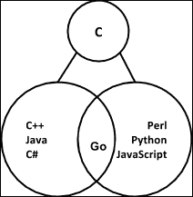
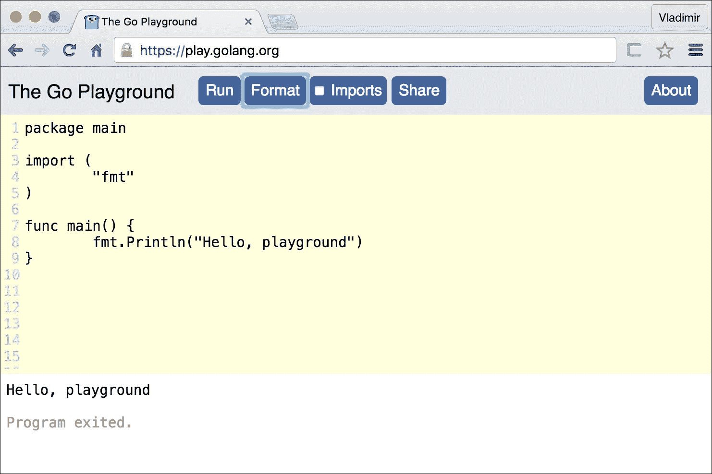
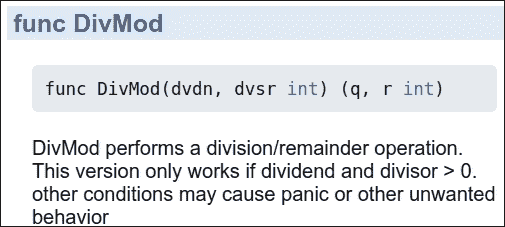

# 第一章. Go 的第一步

在本书的第一章中，您将了解 Go 并游览使该语言成为其采用者喜爱的特性的功能。本章的开始提供了 Go 编程语言的动机。如果您不耐烦，欢迎您跳转到任何其他主题，学习如何编写您的第一个 Go 程序。最后，“Go 概览”部分提供了语言特性的高级总结。

本章涵盖了以下主题：

+   Go 编程语言

+   玩转 Go

+   安装 Go

+   您的第一个 Go 程序

+   Go 概览

# Go 编程语言

自从 1970 年代初在贝尔实验室由*Dennis Ritchie*发明 C 语言以来，计算行业已经产生了许多直接基于（或借鉴了其语法）的流行语言。通常被称为 C 语言家族，它们可以分为两个广泛的进化分支。在一个分支中，如 C++、C#和 Java 等衍生语言已经发展到采用强类型系统、面向对象和使用编译二进制文件。然而，这些语言往往具有缓慢的构建-部署周期，程序员被迫采用复杂的面向对象类型系统以获得运行时安全性和执行速度：



在其他进化语言分支中，有诸如 Perl、Python 和 JavaScript 等语言，它们因其缺乏类型安全形式、使用轻量级脚本语法以及代码解释而非编译而被描述为动态语言。动态语言已成为网络和云规模开发的优先工具，在这些领域，速度和部署的便捷性比运行时安全性更重要。然而，动态语言的解释性质意味着它们通常比编译型语言运行得慢。此外，运行时缺乏类型安全性意味着随着应用程序的增长，系统的正确性扩展得不好。

Go 是在 2007 年由*Robert Griesemer*、*Rob Pike*和*Ken Thomson*在 Google 创建的系统语言，用于处理应用程序开发的需求。Go 的设计者希望减轻上述语言的问题，同时创建一个简单、安全、一致且可预测的新语言。正如 Rob Pike 所说：

> *"Go 是尝试将静态类型语言的安全性和性能与动态类型解释语言的表达性和便利性相结合。"*

Go 借鉴了之前出现的不同语言的理念，包括：

+   简洁但易于使用的语法

+   一种感觉更像动态语言的系统类型

+   对面向对象编程的支持

+   静态类型，用于编译和运行时安全性

+   编译成本地二进制文件，以实现快速的运行时执行

+   几乎零编译时间，感觉更像解释型语言

+   一个简单的并发惯用语，以利用多核、多芯片机器

+   一个用于安全自动内存管理的垃圾回收器

本章的剩余部分将引导你通过一系列入门步骤，让你预览该语言，并开始构建和运行你的第一个 Go 程序。这是本书剩余章节详细讨论的主题的先导。如果你已经对 Go 有基本的了解，欢迎跳转到其他章节。

# 玩转 Go

在我们一头扎进在本地机器上安装和运行 Go 工具之前，让我们先看看**Go 演练场**。语言的创造者提供了一种简单的方法，让你在不安装任何工具的情况下熟悉语言。被称为 Go 演练场，这是一个基于网络的工具，可以通过[`play.golang.org/`](https://play.golang.org/)访问，它使用编辑器隐喻，让开发者可以在网页浏览器窗口中直接编写代码来测试他们的 Go 技能。演练场允许用户在 Google 的远程服务器上编译和运行他们的代码，并立即获得以下截图所示的结果：



编辑器很简单，因为它旨在用作学习工具和与他人分享代码的方式。演练场包括诸如行号和格式化等实用功能，以确保代码在超过几行长时仍然可读。由于这是一个消耗真实计算资源的免费服务，Google 理所当然地对可以在演练场中完成的事情施加了一些限制：

+   你对代码消耗的内存量有限制

+   运行时间长的程序将被终止

+   文件访问通过内存文件系统模拟。

+   网络访问仅模拟回环接口

## 不需要 IDE

除了 Go 演练场，人们应该如何编写 Go 代码呢？编写 Go 代码不需要花哨的**集成开发环境**（**IDE**）。实际上，你可以使用操作系统捆绑的喜欢的纯文本编辑器开始编写简单的 Go 程序。然而，大多数主要的文本编辑器（以及完整的 IDE）都有 Go 插件，例如 Atom、Vim、Emacs、Microsoft Code、IntelliJ 以及许多其他编辑器。Go 的编辑器和 IDE 插件完整列表可以在[`github.com/golang/go/wiki/IDEsAndTextEditorPlugins`](https://github.com/golang/go/wiki/IDEsAndTextEditorPlugins)找到。

## 安装 Go

要在本地机器上使用 Go 进行编程，你需要在计算机上安装**Go 工具链**。在撰写本文时，Go 已经准备好可以安装在以下主要操作系统平台上：

+   Linux

+   FreeBSD Unix

+   Mac OSX

+   Windows

官方的安装包适用于所有基于 32 位和 64 位 Intel 架构的系统。同时，也有适用于 ARM 架构的官方二进制发布版本。随着 Go 语言的流行，未来肯定会有更多的二进制分发选项可供选择。

让我们跳过详细的安装说明，因为它们在你阅读时肯定会发生变化。相反，我们邀请你访问[`golang.org/doc/install`](http://golang.org/doc/install)并遵循针对你特定平台的指示。完成后，务必在继续使用以下命令之前测试你的安装是否正常工作。

```go
$> go version
go version go1.6.1 linux/amd64

```

之前的命令应该会打印出 Go 及其工具安装的版本号、目标操作系统和机器架构。如果你没有得到与前面命令类似的输出，请确保将 Go 二进制文件的路径添加到你的操作系统的执行`PATH`环境变量中。

在你开始编写自己的代码之前，请确保你已经正确设置了你的`GOPATH`。这是一个本地目录，当你使用 Go 工具链时，你的 Go 源文件和编译后的工件都保存在这里。按照[`golang.org/doc/install#testing`](https://golang.org/doc/install#testing)中找到的说明来设置你的 GOPATH。

## 源代码示例

本书中的编程示例可在 GitHub 源代码仓库服务上找到。在那里，你可以找到按章节分组的所有源文件，位于[`github.com/vladimirvivien/learning-go/`](https://github.com/vladimirvivien/learning-go/)的仓库中。为了节省读者一些按键，示例使用了以`golang.fyi`开头的缩短 URL，它直接指向 GitHub 中的相应文件。

或者，你也可以通过下载并解压（或克隆）本地仓库来跟随。在你的`GOPATH`中创建一个目录结构，使得源文件的根目录位于`$GOPATH/src/github.com/vladimirvivien/learning-go/`。

# 你的第一个 Go 程序

在你的本地机器上成功安装 Go 工具后，你现在可以编写并执行你的第一个 Go 程序了。为此，只需打开你喜欢的文本编辑器，并输入以下代码中的简单 Hello World 程序：

```go
package main
import "fmt"
func main() { 
  fmt.Println("Hello, World!")
} 

```

golang.fyi/ch01/helloworld.go

将源代码保存在名为`helloworld.go`的文件中，该文件位于你的 GOPATH 中的任何位置。然后使用以下 Go 命令来编译并运行程序：

```go
$> go run helloworld.go 
Hello, World!

```

如果一切顺利，你应该会在屏幕上看到消息**Hello, World!**输出。恭喜你，你已经编写并执行了你的第一个 Go 程序。现在，让我们从高层次上探讨 Go 语言的特征和属性。

# Go 语言概述

设计上，Go 语言拥有简洁的语法。其设计者希望创建一种清晰、简洁且语法一致，且没有太多语法惊喜的语言。在阅读 Go 代码时，请记住这个口诀：*所见即所得*。Go 语言避免使用巧妙且紧凑的编码风格，而是倾向于编写清晰易读的代码，如下面的程序所示：

```go
// This program prints molecular information for known metalloids 
// including atomic number, mass, and atom count found 
// in 100 grams of each element using the mole unit. 
// See http://en.wikipedia.org/wiki/Mole_(unit) 
package main 

import "fmt" 

const avogadro float64 = 6.0221413e+23 
const grams = 100.0 

type amu float64 

func (mass amu) float() float64 { 
  return float64(mass) 
} 

type metalloid struct { 
  name   string 
  number int32 
  weight amu 
} 

var metalloids = []metalloid{ 
  metalloid{"Boron", 5, 10.81}, 
  metalloid{"Silicon", 14, 28.085}, 
  metalloid{"Germanium", 32, 74.63}, 
  metalloid{"Arsenic", 33, 74.921}, 
  metalloid{"Antimony", 51, 121.760}, 
  metalloid{"Tellerium", 52, 127.60}, 
  metalloid{"Polonium", 84, 209.0}, 
} 

// finds # of moles 
func moles(mass amu) float64 { 
  return grams / float64(mass) 
} 

// returns # of atoms moles 
func atoms(moles float64) float64 { 
  return moles * avogadro 
} 

// return column headers 
func headers() string { 
  return fmt.Sprintf( 
    "%-10s %-10s %-10s Atoms in %.2f Grams\n", 
    "Element", "Number", "AMU", grams, 
  ) 
} 

func main() { 
  fmt.Print(headers()) 

    for _, m := range metalloids { 
      fmt.Printf( 
    "%-10s %-10d %-10.3f %e\n", 
      m.name, m.number, m.weight.float(), atoms(moles(m.weight)), 
      ) 
    } 
}

```

golang.fyi/ch01/metalloids.go

当代码执行时，它将给出以下输出：

```go
$> go run metalloids.go 
Element    Number     AMU        Atoms in 100.00 Grams 
Boron      5          10.810     6.509935e+22 
Silicon    14         28.085     1.691318e+23 
Germanium  32         74.630     4.494324e+23 
Arsenic    33         74.921     4.511848e+23 
Antimony   51         121.760    7.332559e+23 
Tellerium  52         127.600    7.684252e+23 
Polonium   84         209.000    1.258628e+24

```

如果您之前从未见过 Go，您可能无法理解前面程序中使用的语法和习惯用法的一些细节。然而，当您阅读代码时，您有很大机会能够跟随逻辑并形成一个程序流程的心理模型。这正是 Go 简单之美以及为什么这么多程序员使用它的原因。如果您完全迷失方向，无需担心，因为后续章节将涵盖语言的各个方面，帮助您入门。

## 函数

Go 程序由函数组成，这是语言中最小的可调用代码单元。在 Go 中，函数是有类型的实体，可以是命名的（如前例所示），也可以作为值赋给变量：

```go
// a simple Go function 
func moles(mass amu) float64 { 
    return float64(mass) / grams 
} 

```

关于 Go 函数的另一个有趣特性是它们能够返回多个值作为函数调用的结果。例如，前面的函数可以被重写为除了返回计算出的 `float64` 类型的值外，还返回一个 `error` 类型的值：

```go
func moles(mass amu) (float64, error) { 
    if mass < 0 { 
        return 0, error.New("invalid mass") 
    } 
    return (float64(mass) / grams), nil 
}
```

前面的代码使用了 Go 函数的多返回值功能来返回质量和错误值。你将在本书中遇到这种用法，它被用作向函数的调用者正确地传递错误信息的一种手段。关于多返回值函数的进一步讨论将在第五章，*Go 中的函数*中展开。

## 包

包含 Go 函数的源文件可以进一步组织成称为包的目录结构。包是逻辑模块，用于在 Go 中作为库共享代码。您可以创建自己的本地包或使用 Go 提供的工具自动从源代码仓库拉取并使用远程包。您将在第六章，*Go 包和程序*中了解更多关于 Go 包的内容。

## 工作空间

Go 采用简单的代码布局约定，以可靠地组织源代码包并管理它们的依赖关系。您的本地 Go 源代码存储在工作空间中，这是一个包含源代码和运行时文件的目录约定。这使得 Go 工具能够自动查找、构建和安装编译后的二进制文件。此外，Go 工具还依赖于 `workspace` 设置来从远程仓库（如 Git、Mercurial 和 Subversion）拉取源代码包，并满足它们的依赖关系。

## 强类型

Go 中的所有值都是静态类型的。然而，该语言提供了一个简单但表达力强的类型系统，它可以给人一种动态语言的感觉。例如，类型可以安全地推断，如下面的代码片段所示：

```go
const grams = 100.0 

```

如你所预期，常量克会由 Go 类型系统分配一个数值类型，精确地说，是 `float64` 类型。这不仅适用于常量，任何变量都可以使用如下示例所示的简写形式进行声明和赋值：

```go
package main  
import "fmt"  
func main() { 
  var name = "Metalloids" 
  var triple = [3]int{5,14,84} 
  elements := []string{"Boron","Silicon", "Polonium"} 
  isMetal := false 
  fmt.Println(name, triple, elements, isMetal) 

} 

Chapter 2, *Go Language Essentials* and Chapter 4, *Data Types*, go into more details regarding Go types.
```

## 复合类型

除了简单值的类型外，Go 还支持诸如 `array`、`slice` 和 `map` 这样的复合类型。这些类型被设计用来存储指定类型的值的索引元素。例如，之前展示的 `metalloid` 示例就使用了切片，它是一个可变大小的数组。变量 `metalloid` 被声明为一个 `slice`，用来存储 `metalloid` 类型的集合。代码使用字面量语法结合了 `metalloid` 类型的 `slice` 的声明和赋值：

```go
var metalloids = []metalloid{ 
    metalloid{"Boron", 5, 10.81}, 
    metalloid{"Silicon", 14, 28.085}, 
    metalloid{"Germanium", 32, 74.63}, 
    metalloid{"Arsenic", 33, 74.921}, 
    metalloid{"Antimony", 51, 121.760}, 
    metalloid{"Tellerium", 52, 127.60}, 
    metalloid{"Polonium", 84, 209.0}, 
} 

```

Go 还支持一种 `struct` 类型，它是一个复合类型，存储了称为字段的命名元素，如下面的代码所示：

```go
func main() { 
  planet := struct { 
      name string 
      diameter int  
  }{"earth", 12742} 
} 

```

之前的示例使用字面量语法声明了 `struct{name string; diameter int}`，其值为 `{"earth", 12742}`。你可以在第七章 *复合类型* 中阅读有关复合类型的所有内容。

## 命名类型

```go
metalloid in the earlier example:
```

```go
type amu float64 

type metalloid struct { 
  name string 
  number int32 
  weight amu 
} 

amu, which uses type float64 as its underlying type. Type metalloid, on the other hand, uses a struct composite type as its underlying type, allowing it to store values in an indexed data structure. You can read more about declaring new named types in Chapter 4, *Data Types*.
```

## 方法和对象

```go
amu receiving a method called float() that returns the mass as a float64 value:
```

```go
type amu float64 

func (mass amu) float() float64 { 
    return float64(mass) 
} 

```

这一概念的力量在第八章 *方法、接口和对象* 中被详细探讨。

## 接口

Go 支持程序化接口的概念。然而，正如你将在第八章 *方法、接口和对象* 中看到的，Go 的接口本身就是一个类型，它聚合了一组可以将能力投射到其他类型值的方法。保持其简单性，实现 Go 接口不需要使用关键字显式声明接口。相反，类型系统隐式地使用附加到类型的函数来解析实现的接口。

例如，Go 包含一个名为 `Stringer` 的内置接口，其定义如下：

```go
type Stringer interface { 
    String() string 
} 

```

任何附加了 `String()` 方法的类型，都会自动实现 `Stringer` 接口。因此，将 `metalloid` 类型的定义从之前的程序中修改为附加 `String()` 方法，将自动实现 `Stringer` 接口：

```go
type metalloid struct { 
    name string 
    number int32 
    weight amu 
} 
func (m metalloid) String() string { 
  return fmt.Sprintf( 
    "%-10s %-10d %-10.3f %e", 
    m.name, m.number, m.weight.float(), atoms(moles(m.weight)), 
  ) 
}  

```

golang.fyi/ch01/metalloids2.go

`String()` 方法返回一个预格式化的字符串，表示 `metalloid` 的值。标准库包 `fmt` 中的 `Print()` 函数会自动调用 `stringer` 参数实现的 `String()` 方法。因此，我们可以使用这个事实来打印 `metalloid` 值，如下所示：

```go
func main() { 
  fmt.Print(headers()) 
  for _, m := range metalloids { 
    fmt.Print(m, "\n") 
  } 
} 

```

再次，请参考第八章，*方法、接口和对象*，以深入了解接口这一主题。

## 并发与通道

将 Go 推向当前采用水平的其中一个主要特性是其对简单并发习惯的固有支持。该语言使用一个称为`goroutine`的并发单元，允许程序员以独立和高度并发的代码结构化程序。

在下面的示例中，您将看到 Go 还依赖于一种称为通道的构造，用于独立运行的`goroutines`之间的通信和协调。这种方法避免了通过共享内存进行线程通信的传统方法的风险和（有时脆弱）的缺点。相反，Go 通过使用通道进行通信来促进共享。以下示例展示了使用`goroutines`和通道作为处理和通信原语的方法：

```go
// Calculates sum of all multiple of 3 and 5 less than MAX value. 
// See https://projecteuler.net/problem=1 
package main 

import ( 
  "fmt" 
) 

const MAX = 1000 

func main() { 
  work := make(chan int, MAX) 
  result := make(chan int) 

  // 1\. Create channel of multiples of 3 and 5 
  // concurrently using goroutine 
  go func(){ 
    for i := 1; i < MAX; i++ { 
      if (i % 3) == 0 || (i % 5) == 0 { 
        work <- i // push for work 
      } 
    } 
    close(work)  
  }() 

  // 2\. Concurrently sum up work and put result 
  //    in channel result  
  go func(){ 
    r := 0 
    for i := range work { 
      r = r + i 
    } 
    result <- r 
  }() 

  // 3\. Wait for result, then print 
  fmt.Println("Total:", <- result) 
} 

```

golang.fyi/ch01/euler1.go

之前示例中的代码将待完成的工作分配给了两个并发运行的`goroutines`（使用`go`关键字声明），如代码注释所示。每个`goroutine`独立运行，并使用 Go 的通道`work`和`result`来通信和协调最终结果的计算。再次强调，如果这段代码完全看不懂，请放心，并发内容在第九章，*并发*中进行了详细阐述。

## 内存管理与安全性

与其他编译和静态类型语言（如 C 和 C++）类似，Go 允许开发者直接影响内存分配和布局。例如，当开发者创建一个字节的`slice`（相当于数组）时，这些字节在机器的底层物理内存中有直接的表示。此外，Go 借鉴了指针的概念来表示存储值的内存地址，这使得 Go 程序能够通过值和引用两种方式传递函数参数。

Go 在内存管理方面设定了一个高度意见化的安全屏障，几乎没有可配置的参数。Go 使用运行时垃圾回收器自动处理内存分配和释放的繁琐工作。运行时不允许指针算术；因此，开发者不能通过向或从基本内存地址添加或减去来遍历内存块。

## 快速编译

Go 的另一个吸引力是它为中等规模项目提供的毫秒级构建时间。这是通过诸如简单语法、无冲突的语法和严格的标识符解析等特性实现的，这些特性禁止使用未使用的声明资源，例如导入的包或变量。此外，构建系统使用依赖树中最接近的源节点中存储的传递性信息来解决包。再次，这减少了代码-编译-运行周期，使其更像动态语言而不是编译语言。

## 测试和代码覆盖率

虽然其他语言通常依赖于第三方工具进行测试，但 Go 包含内置的 API 和专门为自动化测试、基准测试和代码覆盖率设计的工具。与 Go 中的其他功能类似，测试工具使用简单的约定来自动检查和仪器化代码中找到的测试函数。

以下函数是欧几里得除法算法的简单实现，它返回一个商和一个余数值（作为变量`q`和`r`）用于正整数：

```go
func DivMod(dvdn, dvsr int) (q, r int) { 
  r = dvdn 
  for r >= dvsr { 
    q += 1 
    r = r - dvsr 
  } 
  return 
} 

```

golang.fyi/ch01/testexample/divide.go

在单独的源文件中，我们可以编写一个测试函数来验证算法，通过使用 Go 测试 API 检查被测试函数返回的余数值来验证，如下面的代码所示：

```go
package testexample 
import "testing" 
func TestDivide(t *testing.T) { 
  dvnd := 40 
    for dvsor := 1; dvsor < dvnd; dvsor++ { 
      q, r := DivMod(dvnd, dvsor) 
  if (dvnd % dvsor) != r { 
    t.Fatalf("%d/%d q=%d, r=%d, bad remainder.", dvnd, dvsor, q, r) 
    } 
  } 
}  

```

golang.fyi/ch01/testexample/divide_test.go

要测试源代码，只需像以下示例中那样运行 Go 的测试工具：

```go
$> go test . 
ok   github.com/vladimirvivien/learning-go/ch01/testexample  0.003s

```

测试工具报告了测试结果的摘要，指示了被测试的包及其通过/失败结果。Go 工具链包含许多更多功能，旨在帮助程序员创建可测试的代码，包括：

+   自动在测试期间对代码进行仪器化以收集覆盖率统计信息

+   为覆盖的代码和测试路径生成 HTML 报告

+   一个基准 API，允许开发者从测试中收集性能指标

+   基准报告包含用于检测性能问题的有价值指标

你可以在第十二章*代码测试*中阅读有关测试及其相关工具的所有内容。

## 文档

文档在 Go 中是一个一等组件。可以说，该语言的部分流行度归因于其广泛的文档（参见[`golang.org/pkg`](http://golang.org/pkg)）。Go 附带 Godoc 工具，这使得从源代码中直接嵌入的注释文本中提取文档变得容易。例如，要记录上一节中的函数，我们只需在`DivMod`函数上方直接添加注释行，如下面的示例所示：

```go
// DivMod performs a Eucledan division producing a quotient and remainder. 
// This version only works if dividend and divisor > 0\. 
func DivMod(dvdn, dvsr int) (q, r int) { 
... 
}
```

Go 文档工具可以自动提取并创建 HTML 格式的页面。例如，以下命令将 Godoc 工具作为服务器在`localhost 端口 6000`上启动：

```go
$> godoc -http=":6001"

http://localhost:6001/pkg/github.com/vladimirvivien/learning-go/ch01/testexample/:
```



## 一个广泛的库

由于其短暂的寿命，Go 迅速积累了一系列高质量的 API，作为其标准库的一部分，这些 API 与其他流行和更成熟的语言相当。以下列出的核心 API 并非详尽无遗，但程序员可以开箱即用：

+   完全支持正则表达式，包括搜索和替换

+   强大的 IO 原语，用于读取和写入字节

+   完全支持从套接字、TCP/UDP、IPv4 和 IPv6 进行网络操作

+   用于编写生产就绪的 HTTP 服务和客户端的 API

+   支持传统的同步原语（互斥锁、原子操作等）

+   支持 HTML 的通用模板框架

+   支持 JSON/XML 序列化

+   支持多种线格式的 RPC

+   存档和压缩算法的 API：`tar`、`zip`/`gzip`、`zlib`等

+   对大多数主要算法和哈希函数的加密支持

+   访问操作系统级别的进程、环境信息、信号等更多功能

## Go 工具链

在我们结束本章之前，应该强调 Go 的一个最后方面，那就是它的工具集合。虽然其中一些工具已经在之前的章节中提到过，但其他一些工具在此列出，以便您了解：

+   `fmt`: 重新格式化源代码以符合标准

+   `vet`: 报告源代码结构的错误使用

+   `lint`: 另一个源代码工具，报告明显的样式违规

+   `goimports`: 分析并修复源代码中的包导入引用

+   `godoc`: 生成和组织源代码文档

+   `generate`: 从源代码中存储的指令生成 Go 源代码

+   `get`: 远程检索和安装包及其依赖项

+   `build`: 编译指定包及其依赖项的代码

+   `run`: 提供编译和运行 Go 程序的便利性

+   `test`: 执行单元测试，支持基准和覆盖率报告

+   `oracle`静态分析工具：查询源代码结构和元素

+   `cgo`: 为 Go 和 C 之间的互操作性生成源代码

# 摘要

在其相对较短的存在期间，Go 赢得了许多重视简洁性作为编写精确且能够长期扩展的代码方式的采用者的心。正如您在本章前面的部分所看到的，开始编写第一个 Go 程序很容易。

本章还向读者展示了 Go 最基本特性的高级概述，包括其简化的语法、对并发的强调以及使 Go 成为数据中心计算时代软件工程师首选的系统工具。正如您可能想象的那样，这仅仅是即将到来的一小部分。

在接下来的章节中，本书将继续详细探讨构成 Go 成为优秀学习语言的句法和语言概念。让我们开始吧！
