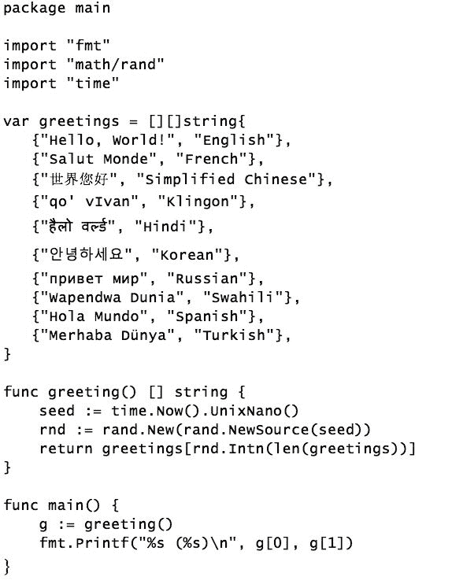
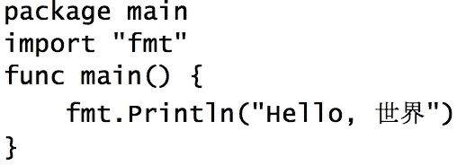
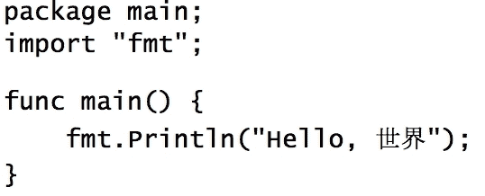
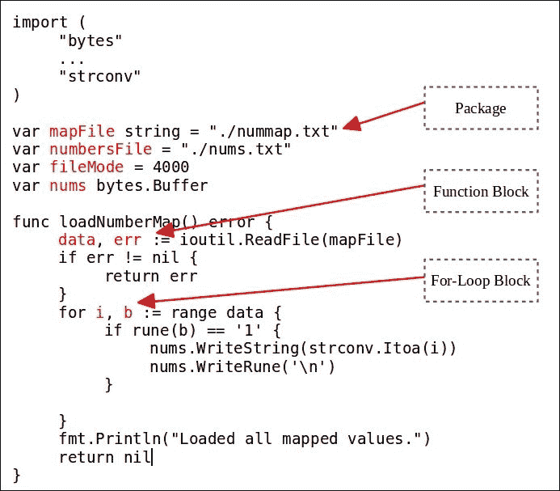

# 第二章。Go 语言基础

在上一章中，我们确立了使 Go 成为创建现代系统程序的优秀语言的元素特性。在本章中，我们将深入探讨语言的语法，以探索其组件和功能。

我们将涵盖以下主题：

+   Go 源代码文件

+   标识符

+   变量

+   常量

+   运算符

# Go 源代码文件

我们在第一章中，即《Go 语言的第一步》中，看到了一些 Go 程序的示例。在本节中，我们将检查 Go 源代码文件。让我们考虑以下源代码文件（该文件以不同语言打印"Hello World"问候语）：



golang.fyi/ch02/helloworld2.go

一个典型的 Go 源代码文件，如前面所列，可以分为三个主要部分，如下所示：

+   **包声明**：

    ```go
          //1 Package Clause 
          package main 

    ```

+   **导入声明**：

    ```go
          //2 Import Declaration 
          import "fmt" 
          import "math/rand" 
          import "time" 

    ```

+   **源代码体**：

    ```go
          //3 Source Body 
          var greetings = [][]string{ 
            {"Hello, World!","English"}, 
            ... 
          } 

          func greeting() [] string { 
            ... 
          } 

          func main() { 
            ... 
          } 

    ```

**包**子句表示此源文件所属的包的名称（有关包组织的详细讨论，请参阅第六章，Go *包和程序*）。**导入**声明列出源代码希望使用的任何外部包。Go 编译器严格强制执行包声明使用。在源文件中包含未使用的包被认为是错误（编译错误）。源代码的最后部分被认为是源文件的主体。这是你声明变量、常量、类型和函数的地方。

所有 Go 源代码文件都必须以`.go`后缀结尾。通常，你可以根据需要命名 Go 源代码文件。例如，与 Java 不同，Go 文件名与其内容中声明的类型之间没有直接关联。然而，将文件名命名为能表明其内容的名称被认为是良好的实践。

在我们更详细地探讨 Go 的语法之前，了解一些语言的基本结构元素是很重要的。虽然其中一些元素在语法上被固定在语言中，但其他元素是简单的习语和约定，你应该了解这些，以便使你的 Go 语言入门简单而愉快。

## 可选的分号

你可能已经注意到 Go 不需要分号作为语句分隔符。这是从其他较轻和解释性语言中借用的一项特性。以下两个程序在功能上是等效的。第一个程序使用惯用的 Go 并省略了分号：



程序的第二个版本，如下所示，使用了多余的分号来显式终止其语句。虽然编译器可能会感谢你的帮助，但这在 Go 中不是惯用的用法：



虽然在 Go 中分号是可选的，但 Go 的正式语法仍然要求它们作为语句终止符。因此，Go 编译器将在以下行末插入分号：

+   标识符

+   字符串、布尔值、数值或复数的字面值

+   控制流指令，如 break、continue 或 return

+   一个闭合括号或方括号，例如 `)`、`}` 或 `]`

+   增量 `++` 或递减 `--` 运算符

由于这些规则，编译器强制执行严格的语法形式，这对 Go 中的源代码风格有很大影响。例如，所有代码块都必须在其前一个语句的同一行上以开大括号 `{` 开始。否则，编译器可能会在破坏代码的位置插入分号，如下面的 `if` 语句所示：

```go
func main() { 
    if "a" == "a" 
    { 
      fmt.Println("Hello, World!") 
    } 
} 

```

将花括号移动到下一行会导致编译器提前插入分号，这将导致以下语法错误：

```go
$> ... missing condition in if statement ... 

```

这是因为编译器在 `if` 语句（`if "a"=="a";`）之后插入了分号，使用了本节讨论的分号插入规则。你可以通过手动在 `if` 条件语句后插入分号来验证这一点；你将得到相同的错误。这是一个很好的地方，可以过渡到下一节，讨论代码块中的尾随逗号。

## 多行

将表达式拆分成多行必须遵循上一节中讨论的分号规则。主要是在多行表达式中，每一行都必须以一个防止提前插入分号的标记结束，如下表所示。应注意，表中带有无效表达式的行将无法编译：

| **表达式** | **有效** |
| --- | --- |

|

```go
lonStr := "Hello World! " +
"How are you?"

```

| 是的，`+` 运算符防止了提前插入分号。 |
| --- |

|

```go
lonStr := "Hello World! "
+ "How are you?"

```

| 不，分号将在第一行之后插入，从语义上破坏了该行。 |
| --- |

|

```go
fmt.Printf("[%s] %d %d %v",
str,
num1,
num2,
nameMap)

```

| 是的，逗号正确地打破了表达式。 |
| --- |

|

```go
fmt.Printf("[%s] %d %d %v",
str,
num1,
num2,
nameMap)

```

| 是的，编译器只在最后一行之后插入分号。 |
| --- |

|

```go
weekDays := []string{
"Mon", "Tue",
"Wed", "Thr",
"Fri"
}

```

| 不，`Fri` 行导致提前插入分号。 |
| --- |

|

```go
weekDays2 := []string{
"Mon", "Tue",
"Wed", "Thr",
"Fri",
}

```

| 是的，`Fri` 行包含尾随逗号，导致编译器在下一行插入分号。 |
| --- |
| `weekDays1 := []string{``"Mon", "Tue",``"Wed", "Thr",``"Fri"}` | 是的，分号是在闭合括号之后的行中插入的。 |

你可能会想知道为什么 Go 编译器将责任放在开发者身上，要求他们提供行断点提示以指示语句的结束。当然，Go 设计者可以设计一个复杂的算法来自动解决这个问题。是的，他们可以。然而，通过保持语法简单和可预测，编译器能够快速解析和编译 Go 源代码。

### 注意

Go 工具链包括 gofmt 工具，它可以用来一致地应用适当的格式化规则到你的源代码中。还有一个 `govet` 工具，它通过分析你的代码中的结构问题来走得更远，这些问题与代码元素有关。

# Go 标识符

Go 标识符用于命名程序元素，包括包、变量、函数和类型。以下总结了 Go 中标识符的一些属性：

+   标识符支持 Unicode 字符集

+   标识符的第一个位置必须是字母或下划线

+   Go 的惯用用法偏好混合大小写（驼峰式）命名

+   包级别标识符必须在给定的包内是唯一的

+   标识符必须在代码块（函数、控制语句）内是唯一的

## 空标识符

Go 编译器对声明标识符用于变量或包的使用特别严格。基本规则是：“你声明了它，就必须使用它”。如果你尝试编译包含未使用标识符（如变量或命名包）的代码，编译器将不会高兴，并且会失败编译。

Go 允许您使用空标识符（由下划线字符 `_` 表示）来关闭此行为。任何使用空标识符的声明或赋值都不会绑定到任何值，并且在编译时被忽略。空标识符通常用于以下两个上下文中，如下所述的小节。

## 消除包导入

当包声明前有一个下划线时，编译器允许在不进行任何进一步引用使用的情况下声明包：

```go
import "fmt" 
import "path/filepath" 
import _ "log" 

log will be muted without any further reference in the code. This can be a handy feature during active development of new code, where developers may want to try new ideas without constantly having to comment out or delete the declarations. Although a package with a blank identifier is not bound to any reference, the Go runtime will still initialize it. Chapter 6, *Go Packages and Programs*, discusses the package initialization lifecycle.
```

## 抑制不需要的函数结果

当 Go 函数调用返回多个值时，返回列表中的每个值都必须分配给一个变量标识符。然而，在某些情况下，可能希望抑制返回列表中的不需要的结果，同时保留其他结果，如下面的调用所示：

```go
_, execFile := filepath.Split("/opt/data/bigdata.txt")
```

之前对函数 `filepath.Split("/opt/data/bigdata.txt")` 的调用接受一个路径并返回两个值：第一个是父路径（`/opt/data`），第二个是文件名（`bigdata.txt`）。第一个值分配给空标识符，因此未绑定到任何命名标识符，这导致编译器忽略它。在未来的讨论中，我们将探讨该习语在其他上下文中的其他用途，例如错误处理和 `for` 循环。

## 内置标识符

Go 包含了许多内置标识符。它们分为不同的类别，包括类型、值和内置函数。

### 类型

以下标识符用于 Go 的内置类型：

| **类别** | **标识符** |
| --- | --- |
| 数字 | `byte`, `int`, `int8`, `int16`, `int32`, `int64`, `rune`, `uint`, `uint8`, `uint16`, `uint32`, `uint64`, `float32`, `float64`, `complex64`, `complex128`, `uintptr` |
| 字符串 | `string` |
| 布尔 | `bool` |
| 错误 | `error` |

### 值

这些标识符具有预分配的值：

| **类别** | **标识符** |
| --- | --- |
| 布尔常量 | `true`, `false` |
| 常量计数器 | `iota` |
| 未初始化值 | `nil` |

### 函数

以下函数作为 Go 的内置预声明标识符的一部分可用：

| **类别** | **标识符** |
| --- | --- |
| 初始化 | `make()`, `new()` |
| 集合 | `append()`, `cap()`, `copy()`, `delete()` |
| 复数 | `complex()`, `imag()`, `real()` |
| 错误处理 | `panic()`, `recover()` |

# Go 变量

Go 是一种强类型语言，这意味着所有变量都是命名元素，它们绑定到一个值和一个类型。您将看到，其语法简单灵活，这使得在 Go 中声明和初始化变量感觉更像动态类型语言。

## 变量声明

在 Go 中使用变量之前，必须使用命名标识符声明变量，以便在代码中将来引用。Go 变量声明的长格式如下所示：

```go
*var <identifier list> <type>*

main():
```

```go
package main 

import "fmt" 

var name, desc string 
var radius int32 
var mass float64 
var active bool 
var satellites []string 

func main() { 
  name = "Sun" 
  desc = "Star" 
  radius = 685800 
  mass = 1.989E+30 
  active = true 
  satellites = []string{ 
    "Mercury", 
    "Venus", 
    "Earth", 
    "Mars", 
    "Jupiter", 
    "Saturn", 
    "Uranus", 
    "Neptune", 
  } 
  fmt.Println(name) 
  fmt.Println(desc) 
  fmt.Println("Radius (km)", radius) 
  fmt.Println("Mass (kg)", mass) 
  fmt.Println("Satellites", satellites) 
} 

```

golang.fyi/ch02/vardec1.go

## 零值

之前的源代码展示了几个使用不同类型的变量声明的例子。然后，这些变量在函数 `main()` 内部被赋予值。乍一看，似乎这些声明的变量在声明时并没有被赋予值。这会与我们的先前的断言相矛盾，即所有 Go 变量都绑定到一个类型和一个值。

我们如何声明一个变量而不将其绑定到一个值上？在变量声明时，如果没有提供值，Go 会自动将默认值（或零值）绑定到变量上，以进行适当的内存初始化（我们稍后会看到如何在单个表达式中同时进行声明和初始化）。

以下表格显示了 Go 类型及其默认零值：

| **类型** | **零值** |
| --- | --- |
| `string` | `""`（空字符串） |
| 数值 - 整数：`byte`, `int`, `int8`, `int16`, `int32`, `int64`, `rune`, `uint`, `uint8`, `uint16`, `uint32`, `uint64`, `uintptr` | 0 |
| 数值 - 浮点数：`float32`, `float64` | 0.0 |
| `bool` | false |
| `Array` | 每个索引位置都有一个与数组元素类型对应的零值。 |
| `Struct` | 每个成员都有其相应零值的空 `struct`。 |
| 其他类型：接口、函数、通道、切片、映射和指针 | nil |

## 初始化声明

如前所述，Go 还支持使用以下格式将变量声明和初始化组合为一个表达式：

*var <标识符列表> <类型> = <值列表或初始化表达式>*

这种声明格式具有以下特性：

+   在等号左侧提供的标识符列表（后跟一个类型）

+   右侧的匹配的逗号分隔值列表

+   赋值按照标识符和值的相应顺序进行

+   初始化表达式必须返回一个匹配的值列表

以下简化的示例展示了声明和初始化组合的使用：

```go
var name, desc string = "Earth", "Planet" 
var radius int32 = 6378 
var mass float64 = 5.972E+24 
var active bool = true 
var satellites = []string{ 
  "Moon", 
} 

```

golang.fyi/ch02/vardec2.go

## 省略变量类型

到目前为止，我们已经讨论了所谓的 Go 变量声明和初始化的长格式。为了使语言感觉更接近它的动态类型近亲，可以省略类型指定，如下面的声明格式所示：

*var <标识符列表> = <值列表或初始化表达式>*

在编译期间，编译器根据赋值值或等号右侧的初始化表达式推断变量的类型，如下面的示例所示。

```go
var name, desc = "Mars", "Planet" 
var radius = 6755 
var mass = 641693000000000.0 
var active = true 
var satellites = []string{ 
  "Phobos", 
  "Deimos", 
} 

```

golang.fyi/ch02/vardec3.go

如前所述，当一个变量被赋予一个值时，它必须与该值一起接收一个类型。当省略变量的类型时，类型信息从赋值值或表达式的返回值中推断出来。以下表格显示了给定字面值时推断出的类型：

| **字面值** | **推断类型** |
| --- | --- |
| 双引号或单引号（原始）文本:`"火星"``"所有行星都围绕太阳旋转。"` | `string` |
| 整数:`-76`0`1244``1840` | `int` |
| 小数:`-0.25``4.0``3.1e4``7e-12` | `float64` |
| 复数:`-5.0i``3i``(0+4i)` | `complex128` |
| 布尔值:`true``false` | `bool` |
| 数组值:`[2]int{-76, 8080}` | 在字面值中定义的`array`类型。在这种情况下，它是:`[2]int` |
| 映射值:`map[string]int{ "Sun": 685800, "Earth": 6378, "Mars": 3396,}` | 在字面值中定义的映射类型。在这种情况下，它是:`map[string]int` |
| 切片值:`[]int{-76, 0, 1244, 1840}` | 在字面值中定义的`slice`类型:`[]int` |
| 结构体值:`struct{ name string diameter int}``{ "Mars", 3396,}` | 在字面值中定义的结构体类型。在这种情况下，类型是:`struct{name string; diameter int}` |
| 函数值:`var sqr = func (v int) int { return v * v }` | 在函数定义字面值中定义的函数类型。在这种情况下，`variable`sqr 将具有类型:`func (v int) int` |

## 短变量声明

Go 语言可以使用*短变量声明*格式进一步简化变量声明语法。在这个格式中，声明去掉了`var`关键字和类型指定，并使用赋值运算符`:=`（冒号等于），如下所示：

*<标识符列表> := <值列表或初始化表达式>*

这是一个简单且简洁的惯用语，在 Go 语言中声明变量时常用。以下代码示例展示了短变量声明的用法：

```go
func main() { 
    name := "Neptune" 
    desc := "Planet" 
    radius := 24764 
    mass := 1.024e26 
    active := true 
    satellites := []string{ 
         "Naiad", "Thalassa", "Despina", "Galatea", "Larissa", 
     "S/2004 N 1", "Proteus", "Triton", "Nereid", "Halimede", 
         "Sao", "Laomedeia", "Neso", "Psamathe", 
    } 
... 
} 

```

golang.fyi/ch02/vardec4.go

注意在声明中省略了关键字`var`和变量类型。短变量声明使用与前面讨论的相同机制来推断变量的类型。

## 短变量声明的限制

为了方便，短变量声明的简写形式确实附带了一些限制，你应该注意这些限制以避免混淆：

+   首先，它只能在函数块中使用

+   赋值运算符`:=`声明变量并赋值

+   `:=`不能用来更新之前已声明的变量

+   变量的更新必须使用等号

虽然这些限制可能有其根植于 Go 语法简单性的合理理由，但它们通常被视为语言新手的混淆来源。例如，不能在包级别变量赋值中使用冒号等于运算符。学习 Go 的开发者可能会发现使用赋值运算符来更新变量很有吸引力，但这样做会导致编译错误。

## 变量作用域和可见性

Go 使用基于代码块的词法作用域来确定包内变量的可见性。根据变量在源文本中的声明位置，将决定其作用域。一般来说，变量只能从声明它的块内部访问，并且对所有嵌套的子块可见。

下面的截图展示了在源文本中声明的几个变量的作用域。每个变量声明都标有它的作用域（`package`、`function`、`for` 循环和 `if...else` 块）：



golang.fyi/ch02/makenums.go

如前所述，变量可见性是自顶向下的。具有包作用域的变量，如 `mapFile` 和 `numbersFile`，对包中的所有其他元素都是全局可见的。向下移动作用域层级，函数块变量如 `data` 和 `err` 对函数及其子块中的所有元素可见。内层 `for` 循环块中的变量 `i` 和 `b` 只在该块内部可见。一旦循环完成，`i` 和 `b` 就会超出作用域。

### 注意

对于 Go 的新手来说，包作用域变量的可见性是一个容易混淆的问题。当一个变量在包级别（在函数或方法块之外）声明时，它对整个包都是全局可见的，而不仅仅是声明变量的源文件。这意味着包作用域的变量标识符只能在组成包的文件组中声明一次，这对于刚开始学习 Go 的开发者来说可能并不明显。有关包组织的详细信息，请参阅第六章，*Go 包和程序*。

## 变量声明块

Go 的语法允许将顶层变量的声明分组到一起，以提高可读性和代码组织。以下示例展示了使用变量声明块重写之前的一个示例：

```go
var ( 
  name string = "Earth" 
  desc string = "Planet" 
  radius int32 = 6378 
  mass float64 = 5.972E+24 
  active bool = true 
  satellites []string   
) 

```

golang.fyi/ch02/vardec5.go

# Go 常量

在 Go 语言中，常量是一个具有字面表示的值，例如文本字符串、布尔值或数字。常量的值是静态的，在初始赋值后不能更改。虽然它们所代表的概念很简单，但常量却有一些有趣的特性，使它们非常有用，尤其是在处理数值时。

## 常量字面量

常量是语言中可以用文本字面量表示的值。常量最有趣的特性之一是它们的字面表示可以是带类型的或未指定类型的值。与本质上绑定到类型的变量不同，常量可以存储为内存空间中的未指定类型值。没有这种类型约束，例如，数值常量值可以以极高的精度存储。

以下是在 Go 中可以表示的有效常量字面值示例：

```go
"Mastering Go" 
'G' 
false 
111009 
2.71828 
94314483457513374347558557572455574926671352 1e+500 
5.0i 

```

## 带类型的常量

```go
golang.fyi/ch02/const.goNotice in the previous source snippet that each declared constant identifier is explicitly given a type. As you would expect, this implies that the constant identifier can only be used in contexts that are compatible with its types. However, the next section explains how this works differently when the type is omitted in the constant declaration.
```

## 未指定类型的常量

当常量未指定类型时，它们甚至更有趣。未指定类型的常量声明如下：

`*const <标识符列表> = <值列表或初始化表达式>*

与之前一样，使用关键字`const`来声明一系列标识符作为常量，以及它们各自的边界值。然而，在这个格式中，声明中省略了类型指定。作为一个未指定类型的实体，常量在内存中只是一个没有类型精度限制的字节块。以下是一些未指定类型常量的示例声明：

```go
const i = "G is" + " for Go " 
const j = 'V' 
const k1, k2 = true, !k1 
const l = 111*100000 + 9 
const m1 = math.Pi / 3.141592 
const m2 = 1.414213562373095048801688724209698078569671875376... 
const m3 = m2 * m2 
const m4 = m3 * 1.0e+400 
const n = -5.0i * 3 
const o = time.Millisecond * 5 

m2 is assigned a long decimal value (truncated to fit on the printed page as it goes another 17 digits). Constant m4 is assigned a much larger number of m3 x 1.0e+400. The entire value of the resulting constant is stored in memory without any loss in precision. This can be an extremely useful tool for developers interested in computations where a high level of precision is important.
```

## 分配未指定类型的常量

未指定类型的常量值在分配给变量、用作函数参数或作为分配给变量的表达式的部分之前是有限的用途。在像 Go 这样的强类型语言中，这意味着存在一些类型调整的潜在可能性，以确保存储在常量中的值可以正确地分配给目标变量。使用未指定类型常量的一个优点是类型系统放宽了对类型检查的严格应用。未指定类型的常量可以分配给不同但兼容的不同精度的类型，而编译器不会提出任何异议，如下面的示例所示：

```go
const m2 = 1.414213562373095048801688724209698078569671875376... 
var u1 float32 = m2 
var u2 float64 = m2 
u3 := m2 

m2 being assigned to two variables of different floating-point precisions, u1 and u2, and to an untyped variable, u3. This is possible because constant m2 is stored as a raw untyped value and can therefore be assigned to any variable compatible with its representation (a floating point).
```

虽然类型系统可以适应将`m2`分配给不同精度的变量，但结果分配会被调整以适应变量类型，如下所示：

```go
u1 = 1.4142135      //float32 
u2 = 1.4142135623730951   //float64 

```

关于变量`u3`，它本身是一个未指定类型的变量，这是怎么回事呢？由于`u3`没有指定类型，它将依赖于从常量值中推断出的类型来接收类型分配。回想一下之前在*省略变量类型*部分中的讨论，常量字面量根据其文本表示映射到基本的 Go 类型。由于常量`m2`表示一个十进制值，编译器将推断其默认类型为`float64`，这将自动分配给变量`u3`，如下所示：

```go
U3 = 1.4142135623730951  //float64 

```

如您所见，Go 对未指定类型的原始常量字面量的处理通过自动应用一些简单但有效的类型推断规则，在不牺牲类型安全性的情况下提高了语言的可用性。与其他语言不同，开发者不需要在值字面量中显式指定类型或执行某种类型的转换来使这成为可能。

## 常量声明块

如您所猜测的，常量声明可以组织为代码块以提高可读性。前面的示例可以重写如下：

```go
const ( 
  a1, a2 string        = "Mastering", "Go" 
  b      rune          = 'G' 
  c      bool          = false 
  d      int32         = 111009 
  e      float32       = 2.71828 
  f      float64       = math.Pi * 2.0e+3 
  g      complex64     = 5.0i 
  h      time.Duration = 4 * time.Second 
... 
) 

```

golang.fyi/ch02/const2.go

## 常量枚举

常量的一种有趣用法是创建枚举值。使用声明块格式（如前一小节所示），您可以轻松创建数值递增的枚举整数值。只需将预声明的常量值 `iota` 赋给声明块中的常量标识符，如下面的代码示例所示：

```go
const ( 
  StarHyperGiant = iota 
  StarSuperGiant 
  StarBrightGiant 
  StarGiant 
  StarSubGiant 
  StarDwarf 
  StarSubDwarf 
  StarWhiteDwarf 
  StarRedDwarf 
  StarBrownDwarf 
) 

```

golang.fyi/ch02/enum0.go

编译器将自动执行以下操作：

+   将块中的每个成员声明为无类型的整型常量值

+   使用零值初始化 `iota`

+   将 `iota` 或零赋给第一个常量成员（`StarHyperGiant`）

+   每个后续常量都被分配一个增加一的 `int` 值

因此，前面的常量列表将被分配从零到九的值序列。每当 `const` 出现在声明块中时，它都会将计数器重置为零。在以下代码片段中，每组常量分别从零到四进行枚举：

```go
const ( 
  StarHyperGiant = iota 
  StarSuperGiant 
  StarBrightGiant 
  StarGiant 
  StarSubGiant 
) 
const ( 
  StarDwarf = iota 
  StarSubDwarf 
  StarWhiteDwarf 
  StarRedDwarf 
  StarBrownDwarf 
) 

```

golang.fyi/ch02/enum1.go

## 覆盖默认枚举类型

默认情况下，枚举常量被声明为无类型的整数值。然而，您可以通过为枚举常量提供显式的数值类型来覆盖枚举值的默认类型，如下面的代码示例所示：

```go
const ( 
  StarDwarf byte = iota 
  StarSubDwarf 
  StarWhiteDwarf 
  StarRedDwarf 
  StarBrownDwarf 
) 

```

您可以指定任何可以表示整数或浮点值的数值类型。例如，在前面的代码示例中，每个常量将被声明为类型 `byte`。

## 在表达式中使用 `iota`

当 `iota` 出现在表达式中时，相同的机制按预期工作。编译器将为 `iota` 的每个后续递增值应用表达式。以下示例将偶数分配给常量声明块中的枚举成员：

```go
const ( 
  StarHyperGiant = 2.0*iota 
  StarSuperGiant 
  StarBrightGiant 
  StarGiant 
  StarSubGiant 
) 

```

golang.fyi/ch02/enum2.go

如您所预期的那样，前面的示例将偶数值分配给每个枚举常量，从 0 开始，如下面的输出所示：

```go
 StarHyperGiant = 0    [float64]
    StarSuperGiant = 2    [float64]
    StarBrightGiant = 4   [float64]
    StarGiant = 6         [float64]
    StarSubGiant = 8      [float64] 

```

## 跳过枚举值

当处理枚举常量时，您可能希望丢弃某些不应包含在枚举中的值。这可以通过在枚举中所需位置将 `iota` 赋给空标识符来实现。例如，以下跳过了值 0 和 `64`：

```go
_              = iota    // value 0 
StarHyperGiant = 1 << iota 
StarSuperGiant 
StarBrightGiant 
StarGiant 
StarSubGiant 
_          // value 64 
StarDwarf 
StarSubDwarf 
StarWhiteDwarf 
StarRedDwarf 
StarBrownDwarf 

```

golang.fyi/ch02/enum3.go

由于我们跳过了 `iota` 位置 `0`，第一个分配的常量值位于位置 `1`。这导致表达式 `1 << iota` 解析为 `1 << 1 = 2`。同样，在第六个位置，表达式 `1 << iota` 返回 `64`。该值将被跳过，不会分配给任何常量，如下面的输出所示：

```go
 StarHyperGiant = 2
    StarSuperGiant = 4
    StarBrightGiant = 8
    StarGiant = 16
    StarSubGiant = 32
    StarDwarf = 128
    StarSubDwarf = 256
    StarWhiteDwarf = 512
    StarRedDwarf = 1024
    StarBrownDwarf = 2048 

```

# Go 运算符

保留其简洁的本质，Go 语言中的运算符确实如您所期望的那样工作，主要允许操作数组合成表达式。Go 语言的运算符没有像 C++或 Scala 中那样的操作符重载，因此没有隐藏的意外行为。这是设计者有意做出的决定，以保持语言的语义简单和可预测。

本节探讨了您开始学习 Go 语言时最常遇到的运算符。其他运算符将在本书的其他章节中介绍。

## 算术运算符

以下表格总结了 Go 语言支持的算术运算符。

| **运算符** | **操作** | **兼容类型** |
| --- | --- | --- |
| `*`, `/`, `-` | 乘法、除法和减法 | 整数、浮点数和复数 |
| `%` | 余数 | 整数 |
| `+` | 加法 | 整数、浮点数、复数和字符串（连接） |

注意，加法运算符`+`可以应用于字符串，例如在表达式`var i = "G is" + " for Go"`中。两个字符串操作数连接起来创建一个新的字符串，并将其赋值给变量`i`。

## 增量和减量运算符

与其他 C 语言类似的语言一样，Go 语言支持`++`（增量）和`--`（减量）运算符。当应用这些运算符时，它们分别将操作数的值增加或减少一。以下是一个使用减量运算符来以相反顺序遍历字符串`s`中的字母的函数示例：

```go
func reverse(s string) { 
  for i := len(s) - 1; i >= 0; { 
    fmt.Print(string(s[i])) 
    i-- 
  } 
} 

```

重要提示：增量运算符和减量运算符是语句，而不是表达式，如下面的代码片段所示：

```go
nextChar := i++       // syntax error 
fmt.Println("Current char", i--)   // syntax error 
nextChar++        // OK 

i:
```

```go
for i := len(s) - 1; i >= 0; { 
  fmt.Print(string(s[i])) 
  --i   //syntax error 
} 

```

## Go 语言赋值运算符

| **运算符** | **描述** |
| --- | --- |
| `=` | 简单赋值按预期工作。它将右操作数的值更新到左操作数。 |
| `:=` | 冒号等于运算符声明一个新变量，左侧运算符，并将其赋值为右侧操作数的值（和类型）。 |
| `+=`, `-=`, `*=`, `/=`, `%=` | 使用左右运算符执行指定的操作，并将结果存储在左运算符中。例如，`a *= 8`表示`a = a * 8`。 |

## 按位运算符

Go 语言完全支持以最基本的形式操作值。以下总结了 Go 语言支持的按位运算符：

| **运算符** | **描述** |
| --- | --- |
| `&` | 按位与 |
| `&#124;` | 按位或 |
| `a ^ b` | 按位异或 |
| `&^` | 按位与非 |
| `^a` | 一元按位补码 |
| `<<` | 左移 |
| `>>` | 右移 |

在位移操作中，右操作数必须是无符号整数或能够转换为无符号值。当左操作数是无类型的常量值时，编译器必须能够从其值推导出有符号整数类型，否则将无法编译。

Go 中的位移操作符也支持算术位移和逻辑位移。如果左操作数是无符号的，Go 会自动应用逻辑位移；如果是符号的，Go 将应用算术位移。

## 逻辑操作符

下表列出了 Go 语言对布尔值进行的逻辑操作：

| **操作符** | **操作** |
| --- | --- |
| `&&` | 逻辑与 |
| ` | | ` | 逻辑或 |
| `!` | 逻辑非 |

## 比较操作符

所有 Go 类型都可以用于比较，包括基本类型和组合类型。然而，只有字符串、整数和浮点值可以使用排序运算符进行比较，如下表所示：

| **操作符** | **操作** | **支持类型** |
| --- | --- | --- |
| `==` | 等于 | 字符串、数值、布尔、接口、指针和结构体类型 |
| `!=` | 不等于 | 字符串、数值、布尔、接口、指针和结构体类型 |
| `<`, `<=`, `>`, `>=` | 排序操作符 | 字符串、整数和浮点数 |

## 操作符优先级

由于 Go 的操作符比其对应语言（如 C 或 Java）要少，因此其操作符优先级规则要简单得多。以下表格列出了 Go 的操作符优先级等级，从最高开始：

| **操作符** | **优先级** |
| --- | --- |
| 乘法 | `*`, `/`, `%`, `<<`, `>>`, `&`, `&^` |
| 加法 | `+`, `-`, ` | `, `^` |
| 比较操作符 | `==`, `!=`, `<`, `<=`, `>`, `>=` |
| 逻辑与 | `&&` |
| 逻辑或 | ` | | ` |

# 概述

本章涵盖了 Go 语言基本结构的大量内容。它从 Go 源代码文本文件的结构开始，逐步介绍变量标识符、声明和初始化。本章还广泛介绍了 Go 的常量、常量声明和操作符。

在这一点上，你可能觉得关于语言及其语法的这么多基础信息让你有些不知所措。好消息是，你不必知道所有这些细节就能有效地使用这门语言。在接下来的章节中，我们将继续探讨 Go 语言的一些更有趣的方面，包括数据类型、函数和包。
