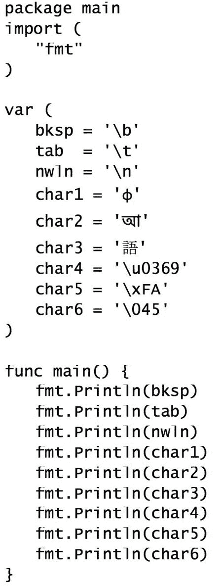
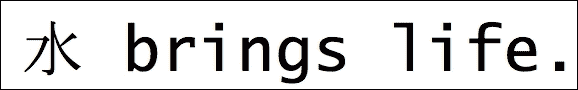

# 第四章 数据类型

Go 是一种强类型语言，这意味着任何存储值（或产生值的表达式）的语言元素都有一个与之关联的类型。在本章中，读者将了解类型系统的特性，当他们探索语言支持的语言数据类型时，这些类型将在以下内容中概述：

+   Go 类型

+   数值类型

+   布尔类型

+   指针

+   类型声明

+   类型转换

# Go 类型

为了帮助启动关于类型的对话，让我们看看可用的类型。Go 实现了一个简单的类型系统，它为程序员提供了直接控制内存分配和布局的能力。当程序声明一个变量时，必须发生两件事：

+   变量必须接收一个类型

+   变量也将被绑定到一个值（即使没有分配）

这允许类型系统分配存储声明值所需的字节数。声明变量的内存布局直接映射到它们的声明类型。没有类型装箱或自动类型转换发生。你期望分配的空间实际上是在内存中保留的。

为了证明这一点，以下程序使用一个名为 `unsafe` 的特殊包来绕过类型系统并提取声明变量的内存大小信息。重要的是要注意，这纯粹是说明性的，因为大多数程序并不经常使用 `unsafe` 包。

```go
package main 
import ( 
   "fmt" 
   "unsafe" 
) 

var ( 
   a uint8   = 72 
   b int32   = 240 
   c uint64  = 1234564321 
   d float32 = 12432345.232 
   e int64   = -1233453443434 
   f float64 = -1.43555622362467 
   g int16   = 32000 
   h [5]rune = [5]rune{'O', 'n', 'T', 'o', 'p'} 
) 

func main() { 
   fmt.Printf("a = %v [%T, %d bits]\n", a, a, unsafe.Sizeof(a)*8) 
   fmt.Printf("b = %v [%T, %d bits]\n", b, b, unsafe.Sizeof(b)*8) 
   fmt.Printf("c = %v [%T, %d bits]\n", c, c, unsafe.Sizeof(c)*8) 
   fmt.Printf("d = %v [%T, %d bits]\n", d, d, unsafe.Sizeof(d)*8) 
   fmt.Printf("e = %v [%T, %d bits]\n", e, e, unsafe.Sizeof(e)*8) 
   fmt.Printf("f = %v [%T, %d bits]\n", f, f, unsafe.Sizeof(f)*8) 
   fmt.Printf("g = %v [%T, %d bits]\n", g, g, unsafe.Sizeof(g)*8) 
   fmt.Printf("h = %v [%T, %d bits]\n", h, h, unsafe.Sizeof(h)*8) 
} 

```

golang.fyi/ch04/alloc.go

当程序执行时，它将打印出每个声明变量消耗的内存量（以位为单位）：

```go
$>go run alloc.go
a = 72 [uint8, 8 bits]
b = 240 [int32, 32 bits]
c = 1234564321 [uint64, 64 bits]
d = 1.2432345e+07 [float32, 32 bits]
e = -1233453443434 [int64, 64 bits]
f = -1.43555622362467 [float64, 64 bits]
g = 32000 [int16, 16 bits]
h = [79 110 84 111 112] [[5]int32, 160 bits]

```

从前面的输出中，我们可以看到变量 `a`（类型为 `uint8`）将使用八个位（或一个字节）存储，变量 `b` 使用 32 位（或四个字节），依此类推。结合影响内存消耗的能力以及 Go 对指针类型的支持，程序员能够强有力地控制程序中内存的分配和消耗。

本章将介绍以下表格中列出的类型。它们包括基本类型，如数值、布尔值和字符串：

| **类型** | **描述** |
| --- | --- |
| `string` | 用于存储文本值的类型 |
| `rune` | 用于表示字符的整数类型（int32）。 |
| `byte`, `int`, `int8`, `int16`, `int32`, `int64`, `rune`, `uint`, `uint8`, `uint16`, `uint32`, `uint64`, `uintptr` | 用于存储整数值的类型。 |
| `float32`, `float64` | 用于存储浮点十进制值的类型。 |
| `complex64`, `complex128` | 可以表示具有实部和虚部的复数的类型。 |
| `bool` | 用于布尔值的类型。 |
| `*T`, 指向类型 T 的指针 | 表示存储类型 T 值的内存地址的类型。 |

Go 支持的其余类型，如以下表格中列出，包括复合类型、接口、函数和通道。它们将在各自的章节中详细说明。

| **类型** | **描述** |
| --- | --- |
| 数组 `[n]T` | 一个有序的、大小为 `n` 的、数值索引的元素序列集合，元素类型为 `T`。 |
| 切片 `[]T` | 一个由类型 `T` 的元素组成的、大小未指定的、数值索引的序列集合。 |
| `struct{}` | 结构体是由称为字段的元素组成的复合类型（可以想象为一个对象）。 |
| `map[K]T` | 一个由类型 `T` 的元素组成的、无序序列，由任意类型的键 `K` 索引。 |
| `interface{}` | 一个命名函数声明集，定义了一组可以被其他类型实现的操作。 |
| `func (T) R` | 表示具有给定参数类型 `T` 和返回类型 `R` 的所有函数的类型。 |
| `chan T` | 一个用于发送或接收类型 `T` 值的内部通信通道的类型。 |

# 数值类型

Go 的数值类型包括对从 8 位到 64 位各种大小的整数和小数值的支持。每种数值类型在内存中都有自己的布局，并且由类型系统视为独特。为了强制执行这一点，并避免在将 Go 移植到不同平台时产生任何混淆，数值类型的名称反映了其大小要求。例如，类型 `*int16*` 表示一个使用 16 位内部存储的整数类型。这意味着在赋值、表达式和操作跨越类型边界时，数值值必须显式转换。

以下程序并不十分功能化，因为所有值都分配给了空白标识符。然而，它说明了 Go 支持的所有数值数据类型。

```go
package main 
import ( 
   "math" 
   "unsafe" 
) 

var _ int8 = 12 
var _ int16 = -400 
var _ int32 = 12022 
var _ int64 = 1 << 33 
var _ int = 3 + 1415 

var _ uint8 = 18 
var _ uint16 = 44 
var _ uint32 = 133121 
var i uint64 = 23113233 
var _ uint = 7542 
var _ byte = 255 
var _ uintptr = unsafe.Sizeof(i) 

var _ float32 = 0.5772156649 
var _ float64 = math.Pi 

var _ complex64 = 3.5 + 2i 
var _ complex128 = -5.0i 

func main() { 
   fmt.Println("all types declared!") 
} 

```

golang.fyi/ch04/nums.go

## 无符号整数类型

以下表格列出了 Go 中可以表示无符号整数及其存储要求的所有类型：

| **类型** | **大小** | **描述** |
| --- | --- | --- |
| `uint8` | 无符号 8 位 | 范围 0 - 255 |
| `uint16` | 无符号 16 位 | 范围 0 - 65535 |
| `uint32` | 无符号 32 位 | 范围 0 - 4294967295 |
| `uint64` | 无符号 64 位 | 范围 0 - 18446744073709551615 |
| `uint` | 实现特定 | 一个预定义的类型，用于表示 32 或 64 位整数。截至 Go 1.x 版本，`uint` 表示 32 位无符号整数。 |
| `byte` | 无符号 8 位 | `uint8` 类型的别名。 |
| `uintptr` | 无符号 | 一种无符号整数类型，用于存储底层机器架构的指针（内存地址）。 |

## 有符号整数类型

以下表格列出了 Go 中可以表示有符号整数及其存储要求的所有类型：

| **类型** | **大小** | **描述** |
| --- | --- | --- |
| `int8` | 有符号 8 位 | 范围 -128 - 127 |
| `int16` | 有符号 16 位 | 范围 -32768 - 32767 |
| `int32` | 有符号 32 位 | 范围 -2147483648 - 2147483647 |
| `int64` | 有符号 64 位 | 范围 -9223372036854775808 - 9223372036854775807 |
| `int` | 实现特定 | 一个预定义的类型，用于表示 32 或 64 位整数。截至 Go 1.x 版本，`int` 表示 32 位有符号整数。 |

## 浮点数类型

Go 支持以下类型，用于使用 IEEE 标准表示十进制值：

| **类型** | **大小** | **描述** |
| --- | --- | --- |
| `float32` | 有符号 32 位 | IEEE-754 标准表示的单精度浮点值。 |
| `float64` | 有符号 64 位 | IEEE-754 标准表示的双精度浮点值。 |

## 复数类型

Go 还支持以下表格所示，具有实部和虚部的复数表示：

| **类型** | **大小** | **描述** |
| --- | --- | --- |
| `complex64` | float32 | 表示具有实部和虚部的复数，实部和虚部存储为 `float32` 值。 |
| `complex128` | float64 | 表示具有实部和虚部的复数，实部和虚部存储为 `float64` 值。 |

## 数值文字

Go 支持使用数字序列的自然表示法表示整数值，结合符号和小数点（如前例所示）。可选地，Go 整数文字也可以表示十六进制和八进制数字，如下面的程序所示：

```go
package main 
import "fmt" 

func main() { 
   vals := []int{ 
       1024, 
       0x0FF1CE, 
       0x8BADF00D, 
       0xBEEF, 
       0777, 
   } 
   for _, i := range vals { 
         if i == 0xBEEF { 
               fmt.Printf("Got %d\n", i) 
               break 
         } 
   } 
} 

```

golang.fyi/ch04/intslit.go

十六进制值以 `0x` 或 (`0X`) 前缀开头，而八进制值以数字 0 开头，如前例所示。浮点值可以使用十进制和指数表示法表示，如下例所示：

```go
package main 

import "fmt" 

func main() { 
   p := 3.1415926535 
   e := .5772156649 
   x := 7.2E-5 
   y := 1.616199e-35 
   z := .416833e32 

   fmt.Println(p, e, x, y, z) 
} 

```

golang.fyi/ch04/floats.go

之前的程序展示了 Go 中浮点文字的几种表示形式。数字可以包含一个可选的指数部分，由数字末尾的 `e`（或 `E`）表示。例如，代码中的 `1.616199e-35` 表示数值 1.616199 x 10^(-35)。最后，Go 支持以下示例所示的表达复数的文字：

```go
package main 
import "fmt" 

func main() { 
   a := -3.5 + 2i 
   fmt.Printf("%v\n", a) 
   fmt.Printf("%+g, %+g\n", real(a), imag(a)) 
} 

```

golang.fyi/ch04/complex.go

在上一个示例中，变量 `a` 被分配了一个具有实部和虚部的复数。虚数文字是一个浮点数后跟字母 `i`。请注意，Go 还提供了两个内置函数，`real()` 和 `imag()`，可以将复数分解为其实部和虚部。

# 布尔类型

在 Go 中，布尔二进制值使用 `bool` 类型存储。尽管 `bool` 类型的变量存储为一个字节的值，但它并不是一个数值的别名。Go 提供了两个预定义的文字 `true` 和 `false`，用于表示布尔值，如下例所示：

```go
package main 
import "fmt" 

func main() { 
   var readyToGo bool = false 
   if !readyToGo { 
       fmt.Println("Come on") 
   } else { 
       fmt.Println("Let's go!") 
   } 
} 

```

golang.fyi/ch04/bool.go

# 运行时和字符串类型

为了开始我们关于 `rune` 和 `string` 类型的讨论，一些背景信息是必要的。Go 可以将其源代码中的字符和字符串文字常量视为 Unicode。这是一个全球标准，其目标是通过对每个字符分配一个数值（称为代码点）来编目已知书写系统的符号。

默认情况下，Go 内置支持 UTF-8，这是一种高效编码和存储 Unicode 数值的方法。这就是继续本主题所需的全部背景知识。本书范围之外将不再讨论更多细节。

## 符文

那么，`rune`类型究竟与 Unicode 有什么关系？`rune`是`int32`类型的别名。它专门用于存储编码为 UTF-8 的 Unicode 整数值。让我们看看以下程序中的某些`rune`字面量：



golang.fyi/ch04/rune.go

前一个程序中的每个变量都存储一个作为`rune`值的 Unicode 字符。在 Go 中，`rune`可以指定为单引号包围的字符串字面量常量。字面量可以是以下之一：

+   可打印字符（如变量`char1`、`char2`和`char3`所示）

+   使用反斜杠转义的非打印控制值（如制表符、换行符、换行等）的单个字符

+   `\u`后跟直接 Unicode 值（`\u0369`）

+   `\x`后跟两个十六进制数字

+   一个反斜杠后跟三个八进制数字（`\045`）

无论单引号内的`rune`字面量值如何，编译器都会编译并分配一个整数值，如前一个变量的打印输出所示：

```go
$>go run runes.go
8
9
10
632
2438
35486
873
250
37 

```

## 字符串

```go
txt being assigned a string literal containing seven characters including two embedded Chinese characters. As referenced earlier, the Go compiler will automatically interpret string literal values as Unicode characters and encode them using UTF-8\. This means that under the cover, each literal character is stored as a rune and may end up taking more than one byte for storage per visible character. In fact, when the program is executed, it prints the length of txt as 11, instead of the expected seven characters for the string, accounting for the additional bytes used for the Chinese symbols.
```

## 解释和原始字符串字面量

```go
txt2 and txt3 respectively. As you can see, these two literals have the exact same content, however, the compiler will treat them differently:
```

```go
var ( 
   txt2 = "\u6C34\x20brings\x20\x6c\x69\x66\x65." 
   txt3 = ` 
   \u6C34\x20 
   brings\x20 
   \x6c\x69\x66\x65\. 
   ` 
) 

```

golang.fyi/ch04/string.go

分配给变量`txt2`的字面量值用双引号括起来。这被称为解释字符串。解释字符串可以包含正常可打印字符以及反斜杠转义值，这些转义值被解析和解释为`rune`字面量。因此，当`txt2`被打印时，转义值被翻译为以下字符串：



解释字符串中的每个符号对应于以下表格中总结的转义值或可打印符号：

|  | **<space>** | **带来** | **<space>** | **生命** | . |
| --- | --- | --- | --- | --- | --- |
| \u6C34 | \x20 | brings | \x20 | \x6c\x69\x66\x65 | . |

另一方面，分配给变量`txt3`的字面量值被方括号```go `` ```包围。这创建了 Go 中的原始字符串。原始字符串值是不解释的，其中转义序列被忽略，所有有效字符都按字面量中的方式编码。

当变量`txt3`被打印时，它会产生以下输出：

```go
\u6C34\x20brings\x20\x6c\x69\x66\x65.

```

注意，打印的字符串包含原始字符串字面量中出现的所有转义值。未解释的字符串字面量是嵌入源代码体中大量多行文本内容的好方法，而不会破坏其语法。

# 指针

在 Go 中，当数据存储在内存中时，可以直接访问该数据的值，或者使用指针来引用数据所在的内存地址。与其他 C 系列语言一样，Go 中的指针提供了一种间接级别，允许程序员更有效地处理数据，而无需每次需要时都复制实际的数据值。

与 C 语言不同，然而，Go 运行时在运行时维护对指针管理的控制。程序员不能将任意整数值添加到指针以生成新的指针地址（这种做法称为指针算术）。一旦某个内存区域被指针引用，该区域的数据将保持可访问状态，直到它不再被任何指针变量引用。到那时，未引用的值将符合垃圾回收的条件。

## 指针类型

与 C/C++类似，Go 使用`*`运算符来指定一个类型为指针。以下代码片段展示了几个具有不同底层类型的指针：

```go
package main 
import "fmt" 

var valPtr *float32 
var countPtr *int 
var person *struct { 
   name string 
   age  int 
} 
var matrix *[1024]int 
var row []*int64 

func main() { 
   fmt.Println(valPtr, countPtr, person, matrix, row) 
} 

```

golang.fyi/ch04/pointers.go

给定一个类型为`T`的变量，Go 使用表达式`*T`作为其指针类型。类型系统认为`T`和`*T`是不同的，并且不是可互换的。指针的零值，当它没有指向任何东西时，是地址 0，用字面常量*nil*表示。

## 地址运算符

指针值只能分配其声明类型的地址。在 Go 中，你可以使用地址运算符`&`（和号）来获取变量的地址值，如下例所示：

```go
package main 
import "fmt" 

func main() { 
   var a int = 1024 
   var aptr *int = &a 

   fmt.Printf("a=%v\n", a) 
   fmt.Printf("aptr=%v\n", aptr) 
} 

```

golang.fyi/ch04/pointers.go

指针类型的变量`aptr`被初始化并分配了变量`a`的地址值，使用表达式`&a`，如下所示：

```go
var a int = 1024 
var aptr *int = &a  

```

当变量`a`存储实际值时，我们说`aptr`指向`a`。以下展示了程序输出，其中变量`a`的值及其内存位置被分配给`aptr`：

```go
a=1024 
aptr=0xc208000150

```

分配的地址值始终相同（始终指向`a`），无论`aptr`在代码中的访问位置如何。还值得注意的是，Go 不允许使用地址运算符与数值、字符串和 bool 类型的字面常量一起使用。因此，以下代码将无法编译：

```go
var aptr *int = &1024  
fmt.Printf("a ptr1 = %v\n", aptr)  

```

然而，在用字面常量初始化复合类型，如 struct 和 array 时，存在一个语法上的例外。以下程序说明了这种情况：

```go
package main 
import "fmt" 

func main() { 
   structPtr := &struct{ x, y int }{44, 55} 
   pairPtr := &[2]string{"A", "B"} 

   fmt.Printf("struct=%#v, type=%T\n", structPtr, structPtr) 
   fmt.Printf("pairPtr=%#v, type=%T\n", pairPtr, pairPtr) 
} 

&struct{ x, y int }{44, 55} and &[2]string{"A", "B"} to return pointer types *struct { x int; y int } and *[2]string respectively. This is a bit of syntactic sugar that eliminates the intermediary step of assigning the values to a variable, then retrieving their assigned addresses.
```

## new()函数

内置函数`*new(<type>)*`也可以用来初始化指针值。该函数首先为指定类型的零值分配适当的内存。然后函数返回新创建值的地址。以下程序使用`new()`函数初始化变量`intptr`和`p`：

```go
package main 
import "fmt" 

func main() { 
   intptr := new(int) 
   *intptr = 44 

   p := new(struct{ first, last string }) 
   p.first = "Samuel" 
   p.last = "Pierre" 

   fmt.Printf("Value %d, type %T\n", *intptr, intptr) 
   fmt.Printf("Person %+v\n", p) 
} 

```

golang.fyi/ch04/newptr.go

变量 `intptr` 被初始化为 `*int`，而 `p` 被初始化为 `*struct{first, last string}`。一旦初始化，这两个值将在代码的后续部分相应地更新。当初始化时实际值不可用时，您可以使用 `new()` 函数用零值初始化指针变量。

## 指针间接引用 - 访问引用的值

如果您只有地址，可以通过将 `*` 操作符应用于指针值本身（或解引用）来访问它所指向的值。以下程序通过函数 `double()` 和 `cap()` 说明了这一概念：

```go
package main 
import ( 
   "fmt" 
   "strings" 
) 

func main() { 
   a := 3 
   double(&a) 
   fmt.Println(a) 
   p := &struct{ first, last string }{"Max", "Planck"} 
   cap(p) 
   fmt.Println(p) 
} 

func double(x *int) { 
   *x = *x * 2 
} 

func cap(p *struct{ first, last string }) { 
   p.first = strings.ToUpper(p.first) 
   p.last = strings.ToUpper(p.last) 
} 

```

golang.fyi/ch04/derefptr.go

在前面的代码中，函数 `double()` 中的表达式 `*x = *x * 2` 可以如下分解，以了解其工作原理：

| **表达式** | **步骤** |
| --- | --- |

|

```go
*x * 2   

```

| 原始表达式，其中 `x` 是 `*int` 类型。 |
| --- |

|

```go
*(*x) * 2   

```

| 通过将 `*` 应用于地址值来解引用指针。 |
| --- |

|

```go
3 * 2 = 6   

```

| `*(*x) = 3` 的解引用值。 |
| --- |

|

```go
*(*x) = 6   

```

| 此表达式的右侧解引用了 `x` 的值。它被更新为结果 6。 |
| --- |

在函数 `cap()` 中，使用类似的方法来访问和更新复合变量 `p` 的字段，其类型为 `struct{first, last string}`。然而，当处理复合类型时，惯用法更为宽容。访问指针的字段值不需要写 `*p.first`。我们可以省略 `*` 并直接使用 `p.first = strings.ToUpper(p.first).`

# 类型声明

在 Go 中，可以将类型绑定到标识符以创建新的命名类型，该类型可以在需要类型的地方进行引用和使用。声明类型的通用格式如下：

*type <名称标识符> <基础类型名称>*

类型声明以关键字 `type` 开头，后跟一个 *名称标识符* 和一个现有 *基础类型* 的名称。基础类型可以是以下类型之一：数值类型、布尔值或字符串类型，如下面的类型声明片段所示：

```go
type truth bool 
type quart float64 
type gallon float64 
type node string 

```

### 注意

类型声明还可以使用复合 *类型字面量* 作为其基础类型。复合类型包括数组、切片、映射和结构体。本节重点介绍非复合类型。有关复合类型的更多详细信息，请参阅 第七章，*复合类型*。

以下示例说明了命名类型在基本形式下的工作方式。示例中的代码将温度值进行转换。每个温度单位都由一个声明的类型表示，包括 `fahrenheit`、`celsius` 和 `kelvin`。

```go
package main 
import "fmt" 

type fahrenheit float64 
type celsius float64 
type kelvin float64 

func fharToCel(f fahrenheit) celsius { 
   return celsius((f - 32) * 5 / 9) 
} 

func fharToKel(f fahrenheit) celsius { 
   return celsius((f-32)*5/9 + 273.15) 
} 

func celToFahr(c celsius) fahrenheit { 
   return fahrenheit(c*5/9 + 32) 
} 

func celToKel(c celsius) kelvin { 
   return kelvin(c + 273.15) 
} 

func main() { 
   var c celsius = 32.0 
   f := fahrenheit(122) 
   fmt.Printf("%.2f \u00b0C = %.2f \u00b0K\n", c, celToKel(c)) 
   fmt.Printf("%.2f \u00b0F = %.2f \u00b0C\n", f, fharToCel(f)) 
} 

float64. Once the new type has been declared, it can be assigned to variables and participate in expressions just like its underlying type. The newly declared type will have the same zero-value and can be converted to and from its underlying type.
```

# 类型转换

通常，Go 将每个类型视为不同。这意味着在正常情况下，不同类型的值在赋值、函数参数和表达式上下文中是不可互换的。这对于内置和声明的类型都适用。例如，以下代码将由于类型不匹配而导致构建错误：

```go
package main 
import "fmt" 

type signal int 

func main() { 
   var count int32 
   var actual int 
   var test int64 = actual + count 

   var sig signal 
   var event int = sig 

   fmt.Println(test) 
   fmt.Println(event) 
} 

```

golang.fyi/ch04/type_conv.go

表达式 `actual + count` 会导致编译时错误，因为这两个变量属于不同的类型。尽管变量 `actual` 和 `count` 都是数值类型，且 `int32` 和 `int` 具有相同的内存表示，但编译器仍然拒绝这个表达式。

对于声明的命名类型及其底层类型，也是如此。编译器会拒绝赋值 `var event int = sig`，因为类型 `signal` 被认为是与类型 `int` 不同的。即使 `signal` 使用 `int` 作为其底层类型，这也是正确的。

要跨越类型边界，Go 支持类型转换表达式，可以将值从一种类型转换为另一种类型。类型转换使用以下格式进行：

*<目标类型>(<值或表达式>)*

以下代码片段通过将变量转换为正确的类型来修复前面的示例：

```go
type signal int 
func main() { 
   var count int32 
   var actual int 
   var test int32 = int32(actual) + count 

   var sig signal 
   var event int = int(sig) 
} 

var test int32 = int32(actual) + count converts variable actual to the proper type to match the rest of the expression. Similarly, expression var event int = int(sig) converts variable sig to match the target type int in the assignment.
```

转换表达式通过显式更改封装值的类型来满足赋值。显然，并非所有类型都可以相互转换。以下表格总结了类型转换适当且允许的常见场景：

| **描述** | **代码** |
| --- | --- |
| 目标类型和转换后的值都是简单的数值类型。 |

```go
var i int   
var i2 int32 = int32(i)   
var re float64 = float64(i +   int(i2))   

```

|

| 目标类型和转换后的值都是复杂的数值类型。 |
| --- |

```go
var cn64 complex64   
var cn128 complex128 =   complex128(cn64)   

```

|

| 目标类型和转换后的值具有相同的底层类型。 |
| --- |

```go
type signal int   
var sig signal   
var event int = int(sig)   

```

|

| 目标类型是字符串，转换后的值是有效的整数类型。 |
| --- |

```go
a := string(72)   
b := string(int32(101))   
c := string(rune(108))   

```

|

| 目标类型是字符串，转换后的值是字节切片、int32 或 rune。 |
| --- |

```go
msg0 := string([]byte{'H','i'})   
msg1 := string([]rune{'Y','o','u','!'})   

```

|

| 目标类型是字节切片、int32 或 rune 值的切片，转换后的值是字符串。 |
| --- |

```go
data0 := []byte("Hello")   
data0 := []int32("World!")   

```

|

此外，当目标类型和转换后的值都是指向相同类型的指针时，转换规则也适用。除了上表中的这些场景外，Go 类型不能显式转换。任何尝试这样做都会导致编译错误。

# 概述

本章向读者介绍了 Go 的类型系统。本章从类型概述开始，深入探讨了基本内置类型，如数值、布尔、字符串和指针类型。讨论继续，向读者介绍了其他重要主题，例如命名类型定义。本章以类型转换机制的内容结束。在接下来的章节中，你将有机会了解更多关于其他类型，如复合类型、函数和接口。
