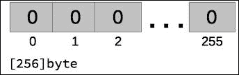
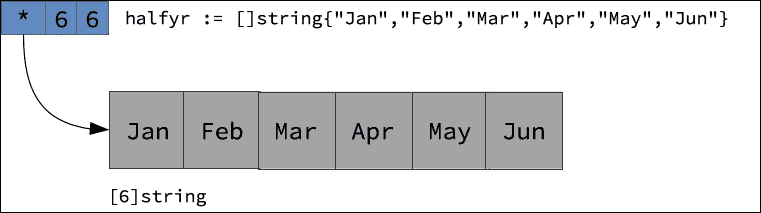
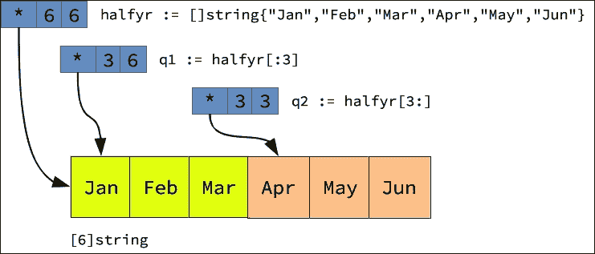

# 第七章。复合类型

在前面的章节中，你可能在一些示例代码中瞥见了复合类型（如数组、切片、映射和结构体）的使用。虽然早期接触这些类型可能让你感到好奇，但请放心，在本章中，你将有机会学习所有关于这些复合类型的内容。本章继续了第四章中开始的内容，*数据类型*，讨论以下主题：

+   数组类型

+   切片类型

+   映射类型

+   结构体类型

# 数组类型

正如你可能在其他语言中找到的那样，Go 数组是用于存储相同类型数值序列的容器，这些数值可以通过数字索引访问。以下代码片段展示了被分配数组类型的变量示例：

```go
var val [100]int 
var days [7]string 
var truth [256]bool 
var histogram [5]map[string]int 

```

golang.fyi/ch07/arrtypes.go

注意在前面示例中分配给每个变量的类型是使用以下类型格式指定的：

*[<长度>]<元素类型>*

数组的类型定义由其长度组成，长度用括号括起来，后跟存储元素的类型。例如，`days` 变量被分配了一个类型 `[7]string`。这是一个重要的区别，因为 Go 的类型系统认为存储相同类型元素但长度不同的两个数组是不同类型的。以下代码说明了这种情况：

```go
var days [7]string 
var weekdays [5]string 

```

即使这两个变量都是类型为 `string` 的数组，类型系统仍然将 `days` 和 `weekdays` 变量视为不同的类型。

### 注意

在本章的后面部分，你将看到如何使用切片类型而不是数组来减轻这种类型限制。

数组类型可以被定义为多维。这是通过组合和嵌套一维数组类型的定义来实现的，如下面的代码片段所示：

```go
var board [4][2]int
var matrix [2][2][2][2] byte
```

golang.fyi/ch07/arrtypes.go

Go 没有单独的多维数组类型。具有多个维度的数组是由嵌套在彼此内部的一维数组组成的。下一节将介绍如何初始化单维和多维数组。

## 数组初始化

当一个数组变量没有显式初始化时，它的所有元素都将被分配给声明类型为零值。数组可以使用以下通用格式的复合字面量值进行初始化：

*<数组类型>{<逗号分隔的元素值列表}>*

数组的字面值由数组类型定义（在上一节中讨论）后跟一组逗号分隔的值组成，并用大括号括起来，如下面的代码片段所示，该片段展示了几个数组的声明和初始化：

```go
var val [100]int = [100]int{44,72,12,55,64,1,4,90,13,54}
var days [7]string = [7]string{
  "Monday",
  "Tuesday",
  "Wednesday",
  "Thursday",
  "Friday",
  "Saturday",
  "Sunday",
}
var truth = [256]bool{true}
var histogram = [5]map[string]int {
  map[string]int{"A":12,"B":1, "D":15},
  map[string]int{"man":1344,"women":844, "children":577,...},
}
```

golang.fyi/ch07/arrinit.go

字面值中的元素数量必须小于或等于数组类型中声明的尺寸。如果定义的数组是多维的，可以通过在每个维度内部嵌套另一个维度的括号来使用字面值进行初始化，如下面的示例片段所示：

```go
var board = [4][2]int{ 
   {33, 23}, 
   {62, 2}, 
   {23, 4}, 
   {51, 88}, 
} 
var matrix = [2][2][2][2]byte{ 
   {{{4, 4}, {3, 5}}, {{55, 12}, {22, 4}}}, 
   {{{2, 2}, {7, 9}}, {{43, 0}, {88, 7}}}, 
} 

[5]string to variable weekdays:
```

```go
var weekdays = [...]string{ 
   "Monday", 
   "Tuesday", 
   "Wednesday", 
   "Thursday", 
   "Friday",    
}  

```

数组的字面值也可以进行索引。如果你只想初始化某些数组元素，同时允许其他元素使用它们的自然零值进行初始化，这很有用。以下指定了位置 0、`2`、`4`、`6`、`8`的元素初始值。其余元素将被分配空字符串：

```go
var msg = [12]rune{0: 'H', 2: 'E', 4: 'L', 6: 'O', 8: '!'} 

```

## 声明命名数组类型

```go
matrix, using a multi-dimension array as its underlying type:
```

```go
type matrix [2][2][2][2]byte 

func main() { 
   var mat1 matrix 
   mat1 = initMat() 
   fmt.Println(mat1) 
} 

func initMat() matrix { 
   return matrix{ 
         {{{4, 4}, {3, 5}}, {{55, 12}, {22, 4}}}, 
         {{{2, 2}, {7, 9}}, {{43, 0}, {88, 7}}}, 
   } 
} 

```

golang.fyi/ch07/arrtype_dec.go

声明的命名类型`matrix`可以在所有其底层数组类型被使用的上下文中使用。这允许使用简化的语法，从而促进复杂数组类型的重用。

## 使用数组

数组是静态实体，一旦声明了指定长度，就不能增长或缩小。当程序需要分配一个预定义大小的连续内存块时，数组是一个很好的选择。当声明数组类型的变量时，它就准备好使用，无需任何进一步的分配语义。

因此，以下`image`变量的声明将分配一个由 256 个相邻的`int`值组成的内存块，这些值初始化为零，如图所示：

```go
var image [256]byte
```



与 C 和 Java 类似，Go 使用方括号索引表达式来访问存储在数组变量中的值。这是通过指定变量标识符后跟方括号内元素的索引来完成的，如下面的代码示例所示：

```go
p := [5]int{122,6,23,44,6} 
p[4] = 82 
fmt.Println(p[0]) 

```

之前的代码更新了数组的第五个元素并打印了第一个元素。

## 数组长度和容量

```go
seven of type [7]string will return 7 as its length and capacity:
```

```go
func main() { 
   seven := [7]string{"grumpy", "sleepy", "bashful"} 
   fmt.Println(len(seven), cap(seven)) 
} 

```

对于数组，`cap()`函数始终返回与`len()`相同的值。这是因为数组值的最大容量是其声明的长度。容量函数更适合与切片类型（本章后面讨论）一起使用。

## 数组遍历

```go
for statement, to initialize an array with random numbers in init(), and the for range statement used to realize the max() function:
```

```go
const size = 1000 
var nums [size]int 

func init() { 
   rand.Seed(time.Now().UnixNano()) 
   for i := 0; i < size; i++ { 
         nums[i] = rand.Intn(10000) 
   } 
} 

func max(nums [size]int) int { 
   temp := nums[0] 
   for _, val := range nums { 
         if val > temp { 
               temp = val 
         } 
   } 
   return temp 
} 

```

golang.fyi/ch07/arrmax_iter.go

在传统的`for`循环语句中，循环的索引变量`i`用于通过索引表达式`num[i]`访问数组的值。在`for…range`语句中，在`max`函数中，每次循环迭代值存储在`val`变量中，而索引被忽略（赋给空标识符）。如果你不明白`for`语句是如何工作的，请参阅第三章，*Go 控制流*，以详细了解 Go 中循环的机制。

## 数组作为参数

数组值被视为一个单一单元。数组变量不是指向内存中位置的指针，而是代表包含数组元素的整个内存块。这意味着当数组变量被重新赋值或作为函数参数传递时，会创建数组值的副本。

这可能会对程序的内存消耗产生不良影响。一个解决方案是使用指针类型来引用数组值。在以下示例中，声明了一个名为`numbers`的命名类型，以表示数组类型`[1024 * 1024]int`。函数`initialize()`和`max()`接收类型为`*numbers`的指针，如下面的源代码片段所示：

```go
type numbers [1024 * 1024]int 
func initialize(nums *numbers) { 
   rand.Seed(time.Now().UnixNano()) 
   for i := 0; i < size; i++ { 
         nums[i] = rand.Intn(10000) 
   } 
} 
func max(nums *numbers) int { 
   temp := nums[0] 
   for _, val := range nums { 
         if val > temp { 
               temp = val 
         } 
   } 
   return temp 
} 
func main() { 
   var nums *numbers = new(numbers) 
   initialize(nums) 
} 

&galaxies{...} returns pointer *galaxies, initialized with the specified element values:
```

```go
type galaxies [14]string 
func main() { 
   namedGalaxies = &galaxies{ 
         "Andromeda", 
         "Black Eye", 
         "Bode's", 
          ...   
   } 
   printGalaxies(namedGalaxies) 
} 

```

golang.fyi/ch07/arraddr.go

数组类型是 Go 中的低级存储结构。例如，数组通常用作存储原语的基础，其中对内存分配有严格的限制，以最小化空间消耗。然而，在更常见的案例中，下一节中介绍的切片通常用作处理有序索引集合的更习惯的方式。

# 切片类型

切片类型在 Go 中通常用作索引数据的习惯构造。切片比数组更灵活，具有许多更有趣的特性。切片本身是一个复合类型，其语义类似于数组。实际上，切片使用数组作为其底层数据存储机制。切片类型的通用形式如下所示：

*[ ]<element_type>*

切片类型与数组类型之间一个明显的区别是在类型声明中省略了大小，如下面的示例所示：

```go
var ( 
    image []byte      
    ids []string 
    vector []float64 
    months []string 
    q1 []string 
    histogram []map[string]int // slice of map (see map later) 
) 

```

golang.fyi/ch07/slicetypes.go

切片类型中缺失的大小属性表示以下内容：

+   与数组不同，切片的大小不是固定的

+   切片类型代表所有指定元素类型的集合

这意味着切片理论上可以无限制地增长（尽管在实践中并不总是这样，因为切片由一个底层的有界数组支持）。给定元素类型的切片被认为是同一类型，无论其底层大小如何。这消除了数组中存在的限制，即大小决定了类型。

例如，以下变量`months`和`q1`具有相同的`[]string`类型，并且可以无问题编译：

```go
var ( 
    months []string 
    q1 []string 
) 
func print(strs []string){ ... } 
func main() { 
   print(months) 
   print(q1) 
} 

```

golang.fyi/ch07/slicetypes.go

与数组类似，切片类型可以嵌套以创建多维切片，如下代码片段所示。每个维度可以独立地有自己的大小，并且必须单独初始化：

```go
var( 
    board [][]int 
    graph [][][][]int 
) 

```

## 切片初始化

切片在类型系统中表示为一个值（下一节将探讨切片的内部表示）。然而，与数组类型不同，未初始化的切片具有零值`nil`，这意味着尝试访问未初始化切片的元素将导致程序崩溃。

初始化切片的最简单方法之一是使用以下格式的复合字面值（类似于数组）：

*<slice_type>{<逗号分隔的元素值列表}>*

切片的字面值由切片类型后跟一系列用逗号分隔的值组成，这些值用花括号括起来，并分配给切片的元素。以下代码片段展示了几个使用复合字面值初始化的切片变量：

```go
var ( 
    ids []string = []string{"fe225", "ac144", "3b12c"} 
    vector = []float64{12.4, 44, 126, 2, 11.5}  
    months = []string { 
         "Jan", "Feb", "Mar", "Apr", 
         "May", "Jun", "Jul", "Aug", 
         "Sep", "Oct", "Nov", "Dec", 
    } 
    // slice of map type (maps are covered later) 
    tables = []map[string][]int { 
         { 
               "age":{53, 13, 5, 55, 45, 62, 34, 7}, 
               "pay":{124, 66, 777, 531, 933, 231}, 
         }, 
    } 
    graph  = [][][][]int{ 
         {{{44}, {3, 5}}, {{55, 12, 3}, {22, 4}}}, 
         {{{22, 12, 9, 19}, {7, 9}}, {{43, 0, 44, 12}, {7}}},     
    } 
) 

```

golang.fyi/ch07/sliceinit.go

如前所述，切片的复合字面值使用与数组类似的形式表示。然而，字面值中提供的元素数量不受固定大小的限制。这意味着字面值可以按需扩展。然而，在幕后，Go 会创建并管理一个适当大小的数组来存储字面值中表达的价值。

## 切片表示

之前提到，切片值使用底层数组来存储数据。实际上，“切片”这个名字是指向数组数据段的引用。在内部，切片通过以下三个属性表示为一个复合值：

| **属性** | **描述** |
| --- | --- |
| *指针* | 指针是切片存储在底层数组中的第一个元素的地址。当切片值未初始化时，其指针值为 nil，表示它尚未指向一个数组。Go 使用指针作为切片本身的零值。未初始化的切片将返回 nil 作为其零值。然而，切片值在类型系统中不被视为引用值。这意味着某些函数可以应用于 nil 切片，而其他函数将导致恐慌。一旦创建切片，指针就不会改变。要指向不同的起始点，必须创建一个新的切片。 |
| *长度* | 长度表示从第一个元素开始可以访问的连续元素的数量。它是一个动态值，可以增长到切片的容量（见下文容量）。切片的长度始终小于或等于其容量。尝试访问切片长度之外的元素，而不进行大小调整，将导致恐慌。即使容量大于长度，这也适用。 |
| *容量* | 切片的容量是指从第一个元素开始可能存储在切片中的最大元素数量。切片的容量受底层数组长度的限制。 |

因此，当以下变量 `halfyr` 如下初始化时：

```go
halfyr := []string{"Jan","Feb","Mar","Apr","May","Jun"}
```

它将被存储在一个类型为 `[6]string` 的数组中，包含指向第一个元素的指针、长度和容量为 `6`，如图所示：



## 切片操作

创建切片值的另一种方法是通过对现有数组或另一个切片值（或这些值的指针）进行切片。Go 提供了一种索引格式，使得表达切片操作变得容易，如下所示：

*<切片或数组值>[<低索引>:<高索引>]*

切片表达式使用 `[:]` 操作符来指定低界和高界索引，由冒号分隔，用于切片段。

+   *低*值是切片段开始的零基于索引

+   *高*值是段停止处的第 *n* 个元素偏移量

下表展示了通过重新切片以下值 `halfyr := []string{"Jan","Feb","Mar","Apr","May","Jun"}` 的切片表达式示例。

| **表达式** | **描述** |
| --- | --- |
| `all := halfyr[:]` | 在表达式中省略低索引和高索引相当于以下内容：`all := halfyr[0 : 6]` 这将产生一个新的切片段，与原始切片相等，从索引位置 0 开始，到偏移位置 `6` 结束：`["Jan","Feb","Mar","Apr","May","Jun"]` |
| `q1 := halfyr[:3]` | 这里切片表达式省略了低索引值并指定了切片段长度为 `3`。它返回一个新的切片，`["Jan","Feb","Mar"]`。 |
| `q2 := halfyr[3:]` | 这通过指定起始索引位置为 `3` 并省略高界索引值（默认为 `6`），创建了一个新的切片段，包含最后三个元素。 |
| `mapr := halfyr[2:4]` | 为了消除对切片表达式的任何混淆，此示例展示了如何创建一个新的切片，包含月份 `"Mar"` 和 `"Apr"`。这返回一个值为 `["Mar","Apr"]` 的切片。 |

## 切片切片

切片现有的切片或数组值不会创建一个新的底层数组。新的切片创建新的指针位置指向底层数组。例如，以下代码展示了将切片值 `halfyr` 切片成两个额外的切片：

```go
var ( 
    halfyr = []string{ 
         "Jan", "Feb", "Mar", 
         "Apr", "May", "Jun", 
    } 

    q1 = halfyr[:3] 
    q2 = halfyr[3:] 
) 

```

golang.fyi/ch07/slice_reslice.go

支持数组的切片可能有多个，以特定视图投影其数据。以下图示说明了前述代码中的切片可能如何直观表示：



注意，切片 `q1` 和 `q2` 都指向同一底层数组中的不同元素。切片 `q1` 的初始长度为 `3`，容量为 `6`。这意味着 `q1` 可以调整大小至总共 `6` 个元素。然而，切片 `q2` 的大小为 `3`，容量为 `3`，不能超过其初始大小（切片调整大小将在后面介绍）。

## 切片数组

如前所述，数组也可以直接切片。在这种情况下，提供的数组值成为底层数组。切片的容量和长度将使用提供的数组来计算。以下源代码片段展示了现有数组值 `months` 的切片：

```go
var ( 
    months [12]string = [12]string{ 
         "Jan", "Feb", "Mar", "Apr", "May", "Jun", 
         "Jul", "Aug", "Sep", "Oct", "Nov", "Dec", 
    } 

    halfyr = months[:6] 
    q1 = halfyr[:3] 
    q2 = halfyr[3:6] 
    q3 = months[6:9] 
    q4 = months[9:] 
) 

```

golang.fyi/ch07/slice_reslice_arr.go

## 带容量的切片表达式

最后，Go 的切片表达式支持更长的形式，其中包含切片的最大容量，如下所示：

*<切片或数组值>[<低索引>:<高索引>:max]*

*max* 属性指定用作新切片最大容量的索引值。该值可能小于或等于底层数组的实际容量。以下示例展示了包含最大值的数组切片：

```go
var ( 
    months [12]string = [12]string{ 
         "Jan", "Feb", "Mar", "Apr", "May", "Jun", 
         "Jul", "Aug", "Sep", "Oct", "Nov", "Dec", 
    } 
    summer1 = months[6:9:9] 
) 

summer1 with size 3 (starting at index position 6 to 9). The max index is set to position 9, which means the slice has a capacity of 3. If the max was not specified, the maximum capacity would automatically be set to the last position of the underlying array as before.
```

## 创建切片

```go
make() function to initialize the slice:
```

```go
func main() { 
   months := make([]string, 6) 
   ... 
} 

make() does the followings:
```

+   创建类型为`[6]string`的底层数组

+   使用长度和容量为`6`创建切片值

+   返回切片值（不是指针）

使用`make()`函数初始化后，访问合法的索引位置将返回切片元素的零值，而不是导致程序崩溃。`make()`函数可以接受一个可选的第三个参数，用于指定切片的最大容量，如下面的示例所示：

```go
func main() { 
   months := make([]string, 6, 12)  
   ... 
} 

months variable with a slice value with an initial length of 6 and a maximum capacity of 12.
```

## 使用切片

使用切片值最简单的操作是访问其元素。如前所述，切片使用索引表示法来访问其元素，类似于数组。以下示例访问索引位置为 0 的元素并将其更新为`15`：

```go
func main () { 
   h := []float64{12.5, 18.4, 7.0} 
   h[0] = 15 
   fmt.Println(h[0]) 
   ... 
} 

```

golang.fyi/ch07/slice_use.go

当程序运行时，它使用索引表达式`h[0]`打印更新后的值，以检索位置`0`的项的值。请注意，只有索引数字的切片表达式，例如`h[0]`，返回该位置的项的值。然而，当表达式包含冒号时，例如`h[2:]`或`h[:6]`，该表达式返回一个新的切片。

使用传统的`for`语句或更惯用的`for…range`语句进行切片遍历，如下面的代码片段所示：

```go
func scale(factor float64, vector []float64) []float64 { 
   for i := range vector { 
         vector[i] *= factor 
   } 
   return vector 
} 

func contains(val float64, numbers []float64) bool { 
   for _, num := range numbers { 
         if num == val { 
               return true 
         } 
   } 
   return false 
} 

scale uses index variable i to update the values in slice factor directly, while function contains uses the iteration-emitted value stored in num to access the slice element. If you need further detail on the for…range statement, see Chapter 3, *Go Control Flow*.
```

## 将切片作为参数

```go
vector parameter will be seen by the caller of function scale:
```

```go
func scale(factor float64, vector []float64) { 
   for i := range vector { 
         vector[i] *= factor 
   } 
} 

```

golang.fyi/ch07/slice_loop.go

## 长度和容量

Go 提供了两个内置函数来查询切片的长度和容量属性。给定一个切片，可以使用`len`和`cap`函数分别查询其长度和最大容量，如下面的示例所示：

```go
func main() { 
    var vector []float64 
    fmt.Println(len(vector)) // prints 0, no panic 
    h := make([]float64, 4, 10) 
    fmt.Println(len(h), ",", cap(h)) 
} 

```

回想一下，切片是一个值（不是指针），其零值为 nil。因此，代码能够在运行时查询未初始化切片的长度（和容量）而不会导致崩溃。

## 向切片中追加

切片类型的一个不可或缺的特性是它们能够动态增长。默认情况下，切片具有静态的长度和容量。任何尝试访问超出该限制的索引的操作都将导致崩溃。Go 提供了内置的变长函数`append`，可以动态地向指定的切片添加新值，根据需要增长其长度和容量。以下代码片段展示了如何实现这一点：

```go
func main() { 
   months := make([]string, 3, 3) 
   months = append(months, "Jan", "Feb", "March",  
    "Apr", "May", "June") 
   months = append(months, []string{"Jul", "Aug", "Sep"}...) 
   months = append(months, "Oct", "Nov", "Dec") 
   fmt.Println(len(months), cap(months), months) 
} 

3. The append function is used to dynamically add new values to the slice beyond its initial size and capacity. Internally, append will attempt to fit the appended values within the target slice. If the slice has not been initialized or has an inadequate capacity, append will allocate a new underlying array, to store the values of the updated slice.
```

## 复制切片

```go
clone() function, which makes a new copy of a slice of numbers:
```

```go
func clone(v []float64) (result []float64) { 
   result = make([]float64, len(v), cap(v)) 
   copy(result, v) 
   return 
} 

copy function copies the content of v slice into result. Both source and target slices must be the same size and of the same type or the copy operation will fail.
```

## 字符串作为切片

在内部，字符串类型是通过使用指向底层 rune 数组复合值的切片实现的。这使得字符串类型获得了与切片相同的惯用处理方式。例如，以下代码片段使用索引表达式从给定的字符串值中提取字符串切片：

```go
func main() { 
   msg := "Bobsayshelloworld!" 
   fmt.Println( 
         msg[:3], msg[3:7], msg[7:12],  
         msg[12:17], msg[len(msg)-1:], 
   ) 
} 

```

golang.fyi/ch07/slice_string.go

在字符串上的切片表达式将返回一个指向其底层 runes 数组的新的字符串值。字符串值可以转换为字节数组（或 rune 切片），如下面的函数片段所示，该片段对给定字符串的字符进行排序：

```go
func sort(str string) string { 
   bytes := []byte(str) 
   var temp byte 
   for i := range bytes { 
         for j := i + 1; j < len(bytes); j++ { 
               if bytes[j] < bytes[i] { 
                     temp = bytes[i] 
                     bytes[i], bytes[j] = bytes[j], temp 
               } 
         } 
   } 
   return string(bytes) 
} 

```

golang.fyi/ch07/slice_string.go

之前的代码展示了将字节数组显式转换为字符串值。请注意，每个字符都可以使用索引表达式访问。

# 映射类型

Go 语言中的映射是一个复合类型，用作存储无序元素的容器，这些元素由任意键值索引。以下代码片段展示了具有各种键类型的多种映射变量声明：

```go
var ( 
    legends map[int]string 
    histogram map[string]int 
    calibration map[float64]bool 
    matrix map[[2][2]int]bool    // map with array key type 
    table map[string][]string    // map of string slices 

   // map (with struct key) of map of string 
   log map[struct{name string}]map[string]string 
) 

*map[<key_type>]<element_type>*
```

*关键字*指定了将要用于索引映射存储元素的值的类型。与数组和切片不同，映射的键可以是任何类型，而不仅仅是`int`。然而，映射的键必须是可比较的类型，包括数值、字符串、布尔值、指针、数组、结构体和接口类型（参见第四章*数据类型*，关于可比较类型的讨论）。

## 映射初始化

与切片类似，映射管理一个对用户不可见的底层数据结构来存储其值。未初始化的映射具有 nil 的零值。尝试向未初始化的映射中插入数据将导致程序崩溃。然而，与切片不同，从 nil 映射中访问元素是可能的，这将返回元素的零值。

与其他复合类型一样，映射可以使用以下形式的复合字面量值进行初始化：

*<映射类型>{<逗号分隔的键值对列表>}*

以下代码片段展示了使用映射复合字面量进行变量初始化：

```go
var ( 
   histogram map[string]int = map[string]int{ 
         "Jan":100, "Feb":445, "Mar":514, "Apr":233, 
         "May":321, "Jun":644, "Jul":113, "Aug":734, 
         "Sep":553, "Oct":344, "Nov":831, "Dec":312,  
   } 

   table = map[string][]int { 
         "Men":[]int{32, 55, 12, 55, 42, 53}, 
         "Women":[]int{44, 42, 23, 41, 65, 44}, 
   } 
) 

```

golang.fyi/ch07/mapinit.go

使用冒号分隔的键值对指定映射的文本值，如先前的例子所示。每个键值对的类型必须与映射中声明的元素类型相匹配。

## 创建映射

与切片类似，映射值也可以使用*make*函数进行初始化。使用 make 函数初始化底层存储，允许数据以如下所示的方式插入映射中：

```go
func main() { 
   hist := make(map[int]string) 
   hist["Jan"] = 100 
   hist["Feb"] = 445 
   hist["Mar"] = 514 
... 
} 

```

golang.fyi/ch07/maptypes.go

`make`函数接受映射的类型作为参数，并返回一个初始化后的映射。在先前的例子中，`make`函数将初始化一个类型为`map[int]string`的映射。`make`函数可以可选地接受第二个参数来指定映射的容量。然而，映射会根据需要继续增长，忽略指定的初始容量。

## 使用映射

```go
"Jan" key being updated with the value 100:
```

```go
hist := make(map[int]string) 
hist["Jan"] = 100 

```

使用索引表达式访问给定键的元素，将其放置在赋值表达式的右侧，如下例所示，其中使用`"Mar"`键索引的值被分配给`val`变量：

```go
val := hist["Mar"] 

```

之前提到，访问不存在的键将返回该元素的零值。例如，如果键为 `"Mar"` 的元素在映射中不存在，则前面的代码将返回 0。正如你所想象的那样，这可能会成为一个问题。你如何知道你得到的是实际值还是零值？幸运的是，Go 提供了一种方法，可以通过返回索引表达式的结果中的可选布尔值来显式测试元素是否存在，如下面的代码片段所示：

```go
func save(store map[string]int, key string, value int) { 
   val, ok := store[key] 
   if !ok { 
         store[key] = value 
   }else{ 
         panic(fmt.Sprintf("Slot %d taken", val)) 
   } 
} 

comma-ok idiom, the Boolean value stored in the ok variable is set to false when the value is not actually found. This allows the code to distinguish between the absence of a key and the zero value of the element.
```

## 映射遍历

```go
hist:
```

```go
for key, val := range hist { 
   adjVal := int(float64(val) * 0.100) 
   fmt.Printf("%s (%d):", key, val) 
   for i := 0; i < adjVal; i++ { 
         fmt.Print(".") 
   } 
   fmt.Println() 
} 

```

golang.fyi/ch07/map_use.go

每次迭代返回一个键及其关联的元素值。然而，迭代顺序是不确定的。内部映射迭代器可能会在每次程序运行时以不同的顺序遍历映射。为了保持可预测的遍历顺序，请保留（或生成）一个单独的结构中的键的副本，例如切片。在遍历过程中，遍历键的切片以可预测的方式遍历。

### 注意

你应该知道，在迭代过程中对发出的值进行的更新将会丢失。相反，使用索引表达式，例如 `hist[key]`，在迭代过程中更新元素。有关 `for…range` 循环的详细信息，请参阅 第三章，*Go 控制流*，以获得对 Go `for` 循环的全面解释。

## 映射函数

除了之前讨论的 `make` 函数之外，映射类型还支持以下表格中讨论的两个附加函数：

| **函数** | **描述** |
| --- | --- |

| len(map) | 与其他复合类型一样，内置的 `len()` 函数返回映射中的条目数。例如，以下将打印 **3**:

```go
h := map[int]bool{3:true, 7:false, 9:false}   
fmt.Println(len(h))   

```

`len` 函数对于未初始化的映射将返回零。|

| delete(map, key) | 内置的 `delete` 函数用于从给定的映射中删除与提供的键关联的元素。以下代码片段将打印 **2**:

```go
h := map[int]bool{3:true, 7:false, 9:false}   
delete(h,7)   
fmt.Println(len(h))   

```

|

### 映射作为参数

由于映射维护对其后端存储结构的内部指针，因此调用函数中对映射参数的所有更新将在函数返回后由调用者看到。以下示例显示了调用 `remove` 函数以更改映射内容。传递的变量 `hist` 将在 `remove` 函数返回后反映更改：

```go
func main() { 
   hist := make(map[string]int) 
   hist["Jun"] = 644 
   hist["Jul"] = 113 
   remove(hit, "Jun") 
   len(hist) // returns 1 
} 
func remove(store map[string]int, key string) error { 
   _, ok := store[key] 
   if !ok { 
         return fmt.Errorf("Key not found") 
   } 
   delete(store, key) 
   return nil 
} 

```

golang.fyi/ch07/map_use.go

# 结构体类型

本章最后讨论的类型是 Go 的 `struct`。它是一种复合类型，用作其他称为字段的命名类型的容器。以下代码片段显示了几个作为结构体声明的变量：

```go
var( 
   empty struct{} 
   car struct{make, model string} 
   currency struct{name, country string; code int} 
   node struct{ 
         edges []string 
         weight int 
   } 
   person struct{ 
         name string 
         address struct{ 
               street string 
               city, state string 
               postal string 
         } 
   } 
) 

struct also support anonymous fields, covered later).
struct { name string; address struct { street string; city string; state string; postal string }}. Therefore, any variable or expression requiring that type must repeat that long declaration. We will see later how that is mitigated by using named types for struct.
```

## 访问结构体字段

```go
fmt.Pritnln(person.name)
```

选择器可以链式使用，以访问嵌套在结构体内部的字段。以下代码片段将打印嵌套在 `person` 变量的地址值中的街道和城市：

```go
fmt.Pritnln(person.address.street)
fmt.Pritnln(person.address.city)
```

## 结构体初始化

与数组类似，结构体是纯值，没有额外的底层存储结构。未初始化的结构体的字段被分配其各自的零值。这意味着未初始化的结构体不需要进一步分配，即可使用。

尽管如此，可以使用以下形式的复合字面量显式初始化结构体变量：

*<struct_type>{<positional or named field values>}*

结构体的复合字面量值可以通过指定一组字段值来初始化，这些值由它们的相应位置指定。使用这种方法，必须提供所有字段值，以匹配它们的声明类型，如下面的片段所示：

```go
var( 
   currency = struct{ 
         name, country string 
         code int 
   }{ 
         "USD", "United States",  
         840, 
   } 
... 
) 

```

golang.fyi/ch07/structinit.go

在前面的结构体字面量中，提供了 `struct` 的所有字段值，与它们的声明字段类型相匹配。或者，可以使用字段索引及其关联值来指定 `struct` 的复合字面量值。与之前一样，索引（字段名称）及其值由冒号分隔，如下面的片段所示：

```go
var( 
   car = struct{make, model string}{make:"Ford", model:"F150"} 
   node = struct{ 
         edges []string 
         weight int 
   }{ 
         edges: []string{"north", "south", "west"}, 
   } 
... 
) 

```

golang.fyi/ch07/structinit.go

如您所见，当提供索引及其值时，可以选择性指定复合字面量的字段值。例如，在 `node` 变量的初始化中，`edge` 字段被初始化，而 `weight` 被省略。

## 声明命名结构体类型

尝试重复使用结构体类型可能会很快变得难以管理。例如，每次需要表达结构体类型时，都必须编写 `struct { name string; address struct { street string; city string; state string; postal string }}`，这不会扩展，容易出错，并且会让 Go 开发者感到沮丧。幸运的是，修复这个问题的正确习惯是使用命名类型，如下面的源代码片段所示：

```go
type person struct { 
   name    string 
   address address 
} 

type address struct { 
   street      string 
   city, state string 
   postal      string 
} 

func makePerson() person { 
   addr := address{ 
         city: "Goville", 
         state: "Go", 
         postal: "12345", 
   } 
   return person{ 
         name: "vladimir vivien", 
         address: addr, 
   } 
} 

```

golang.fyi/ch07/structtype_dec.go

之前的示例将结构体类型定义绑定到标识符 person 和 address。这允许在不同的上下文中重复使用结构体类型，而无需携带类型定义的长形式。您可以参考第四章，*数据类型*，以了解更多关于命名类型的信息。

## 匿名字段

```go
diameter and the name, are embedded as anonymous fields in the planet type:
```

```go
type diameter int 

type name struct { 
   long   string 
   short  string 
   symbol rune 
} 

type planet struct { 
   diameter 
   name 
   desc string 
} 

func main() { 
   earth := planet{ 
         diameter: 7926, 
         name: name{ 
               long:   "Earth", 
               short:  "E", 
               symbol: '\u2641', 
         }, 
         desc: "Third rock from the Sun", 
   } 
   ... 
} 

planet struct. Notice the names of the embedded types become the field identifiers in the composite literal value for the struct.
```

为了简化字段名称解析，Go 在使用匿名字段时遵循以下规则：

+   类型名称成为字段名称

+   匿名字段的名称不能与其他字段名称冲突

+   仅使用未限定的（省略包）类型名称导入类型

当直接使用选择器表达式访问内嵌结构体的字段时，这些规则同样适用，如下面的代码片段所示。注意，内嵌类型的名称被解析为字段名称：

```go
func main(){ 
   jupiter := planet{} 
   jupiter.diameter = 88846 
   jupiter.name.long = "Jupiter" 
   jupiter.name.short = "J" 
   jupiter.name.symbol = '\u2643' 
   jupiter.desc = "A ball of gas" 
   ... 
} 

```

golang.fyi/ch07/struct_embed.go

### 提升字段

内嵌结构体的字段可以被*提升*到其封装类型。提升字段在选择器表达式中出现时，不需要它们的类型限定名称，如下面的示例所示：

```go
func main() {
...
saturn := planet{}
saturn.diameter = 120536
saturn.long = "Saturn"
saturn.short = "S"
saturn.symbol = '\u2644'
saturn.desc = "Slow mover"
...
}
name by omitting it from the selector expression. The values of the fields long, short, and symbol come from embedded type name. Again, this will only work if the promotion does not cause any identifier clashes. In case of ambiguity, the fully qualified selector expression can be used.
```

## 结构体作为参数

回想一下，结构体变量存储实际值。这意味着每当将`struct`变量重新分配或作为函数参数传递时，就会创建结构体值的新副本。例如，以下在调用`updateName()`后不会更新 name 的值：

```go
type person struct { 
   name    string 
   title string       
} 
func updateName(p person, name string) { 
   p.name = name 
}  

func main() { 
   p := person{} 
   p.name = "uknown" 
   ... 
   updateName(p, "Vladimir Vivien") 
} 

```

golang.fyi/ch07/struct_ptr.go

这可以通过传递指向`person`类型`struct`值的指针来修复，如下面的代码片段所示：

```go
type person struct { 
   name    string 
   title string 
} 

func updateName(p *person, name string) { 
   p.name = name 
} 

func main() { 
   p := new(person) 
   p.name = "uknown" 
   ... 
   updateName(p, "Vladimir Vivien") 
} 

```

golang.fyi/ch07/struct_ptr2.go

在这个版本中，`p`变量被声明为`*person`，并使用内置的`new()`函数进行初始化。在`updateName()`返回后，调用函数可以看到其更改。

## 字段标签

结构体的最后一个主题与字段标签有关。在定义`struct`类型时，可以为每个字段声明添加可选的`string`值。字符串的值是任意的，它可以作为提示，供使用反射来消费标签的工具或其他 API 使用。

以下展示了带有 JSON 注释的 Person 和 Address 结构体的定义，这些注释可以被 Go 的 JSON 编码器和解码器（在标准库中找到）解释：

```go
type Person struct { 
   Name    string `json:"person_name"` 
   Title   string `json:"person_title"` 
   Address `json:"person_address_obj"` 
} 

type Address struct { 
   Street string `json:"person_addr_street"` 
   City   string `json:"person_city"` 
   State  string `json:"person_state"` 
   Postal string `json:"person_postal_code"` 
} 
func main() { 
   p := Person{ 
         Name: "Vladimir Vivien", 
         Title : "Author", 
         ... 
   } 
   ... 
   b, _ := json.Marshal(p) 
   fmt.Println(string(b)) 
} 

```

golang.fyi/ch07/struct_ptr2.go

注意，标签被表示为原始字符串值（用一对```go `` ```括起来）。在正常代码执行中，标签会被忽略。然而，它们可以通过 Go 的反射 API 被收集，正如 JSON 库所做的那样。你将在第十章，*Go 中的数据输入输出*中遇到更多关于这个主题的内容，当本书讨论输入和输出流时。

# 摘要

本章在遍历 Go 中找到的每个复合类型时覆盖了大量的内容，为它们的特性提供了深入的覆盖。章节从对数组类型的覆盖开始，读者学习了如何声明、初始化和使用数组值。接下来，读者学习了关于切片类型的所有内容，特别是声明、初始化以及使用切片索引表达式创建新切片或重新切片现有切片的实用示例。本章还涵盖了 map 类型，包括有关 map 初始化、访问、更新和遍历的信息。最后，本章提供了有关结构体类型定义、初始化和使用的详细信息。

不言而喻，这可能是本书中最长的章节之一。然而，这里涵盖的信息将在本书继续探索新主题时证明是无价的。下一章将介绍使用 Go 通过方法和接口支持类似对象的习惯用法。
