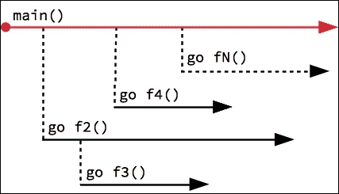
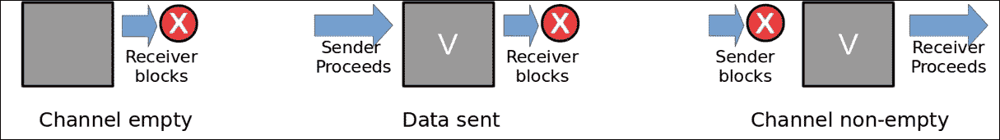
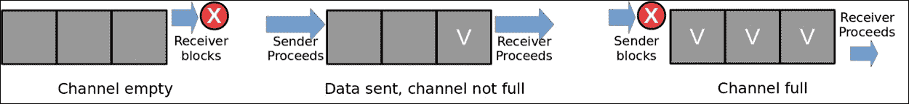

# 第九章。并发

并发被认为是 Go 语言最吸引人的特性之一。语言的采用者享受其原语表达正确并发实现的简单性，而无需承担通常与这种努力相关的陷阱。本章涵盖了理解和创建并发 Go 程序所必需的主题，包括以下内容：

+   Goroutines

+   通道

+   编写并发程序

+   sync 包

+   检测竞态条件

+   Go 中的并行性

# Goroutines

如果你曾在其他语言（如 Java 或 C/C++）中工作过，你可能熟悉并发的概念。这是程序运行两个或更多独立执行路径的能力。这通常是通过直接向程序员暴露线程原语来创建和管理并发来实现的。

Go 语言有其自己的并发原语，称为 *goroutine*，它允许程序独立于调用函数启动一个函数（例程）执行。Goroutines 是轻量级的执行上下文，在少数几个由操作系统支持的线程之间进行多路复用，并由 Go 的运行时调度器进行调度。这使得它们在创建时无需真正的内核线程的开销。因此，Go 程序可以启动成千上万（甚至数十万）的 goroutine，而对性能和资源退化影响最小。

## go 语句

Goroutines 是使用以下格式的 `go` 语句启动的：

*go <函数或表达式>*

使用 `go` 关键字后跟要调度的函数创建一个 goroutine。指定的函数可以是现有的函数、匿名函数或调用函数的表达式。以下代码片段展示了使用 goroutines 的一个示例：

```go
func main() { 
   go count(10, 50, 10) 
   go count(60, 100, 10) 
   go count(110, 200, 20) 
} 
func count(start, stop, delta int) { 
   for i := start; i <= stop; i += delta { 
         fmt.Println(i) 
   } 
} 

```

golang.fyi/ch09/goroutine0.go

在前面的代码示例中，当在 `main` 函数中遇到 `go count()` 语句时，它将在一个独立的执行上下文中启动 `count` 函数。`main` 和 `count` 函数将并发执行。作为副作用，`main` 将在 `count` 函数有机会向控制台打印任何内容之前完成。

在本章的后面部分，我们将看到如何习惯性地在 goroutine 之间处理同步。现在，让我们使用 `fmt.Scanln()` 来阻塞并等待键盘输入，如下面的示例所示。在这个版本中，在等待键盘输入的同时，并发函数有机会完成：

```go
func main() { 
   go count(10, 30, 10) 
   go count(40, 60, 10) 
   go count(70, 120, 20) 
   fmt.Scanln() // blocks for kb input 
} 

```

golang.fyi/ch09/goroutine1.go

Goroutines 也可以直接在 `go` 语句中定义为函数字面量，如下面代码片段中更新的示例所示：

```go
func main() { 
   go count(10, 30, 10) 
   go func() { 
         count(40, 60, 10) 
   }() 
   ... 
}  

```

golang.fyi/ch09/goroutine2.go

函数字面量提供了一种方便的惯用法，允许程序员在`go`语句的位置直接组装逻辑。当使用函数字面量与`go`语句一起使用时，它被视为一个常规闭包，具有对非局部变量的词法访问，如下面的示例所示：

```go
func main() { 
   start := 0 
   stop := 50 
   step := 5 
   go func() { 
         count(start, stop, step) 
   }() 
} 

j from the loop:
```

```go
func main() { 
   starts := []int{10,40,70,100} 
   for _, j := range starts{ 
         go func() { 
               count(j, j+20, 10) 
         }() 
   } 
} 

```

golang.fyi/ch09/goroutine4.go

由于`j`在每次迭代中都会更新，因此无法确定闭包将读取什么值。在大多数情况下，goroutine 闭包将在它们执行时看到`j`的最后一个更新值。这可以通过在函数字面量中将变量作为参数传递给 goroutine 来轻松修复，如下所示：

```go
func main() { 
   starts := []int{10,40,70,100} 
   for _, j := range starts{ 
         go func(s int) { 
               count(s, s+20, 10) 
         }(j) 
   } 
} 

```

golang.fyi/ch09/goroutine5.go

每次循环迭代都会调用 goroutine 闭包，通过函数参数接收`j`变量的一个副本。这创建了一个带有正确值的`j`值的局部副本，以便在 goroutine 被调度运行时使用。

## Goroutine 调度

通常，所有 goroutine 都是相互独立运行的，如下面的插图所示。创建 goroutine 的函数不会等待其返回，除非存在阻塞条件，否则它将继续执行自己的执行流。稍后，本章将介绍同步惯用法来协调 goroutine：



Go 的运行时调度器使用一种协作调度形式来调度 goroutine。默认情况下，调度器将允许正在运行的 goroutine 执行完成。然而，如果发生以下事件之一，调度器将自动将执行权让给另一个 goroutine：

+   在执行的 goroutine 中遇到`go`语句

+   遇到通道操作（通道将在后面介绍）

+   遇到阻塞的系统调用（例如文件或网络 I/O）

+   在垃圾回收周期完成后

当在运行的 goroutine 中遇到上述事件之一时，调度器将调度一个准备就绪的 goroutine 以进入执行。重要的是要指出，调度器不对 goroutine 的执行顺序做出保证。例如，当执行以下代码片段时，每次运行的输出顺序将是任意的：

```go
func main() { 
   go count(10, 30, 10) 
   go count(40, 60, 10) 
   go count(70, 120, 20) 
   fmt.Scanln() // blocks for kb input 
} 
func count(start, stop, delta int) { 
   for i := start; i <= stop; i += delta { 
         fmt.Println(i) 
   } 
} 

```

golang.fyi/ch09/goroutine1.go

下面的示例显示了上一个程序的可能输出：

```go
10
70
90
110
40
50
60
20
30

```

# 通道

当谈论并发时，一个自然出现的担忧是数据安全和同步。如果你在 Java 或 C/C++等语言中做过并发编程，你可能会熟悉确保运行线程可以安全访问共享内存值以在线程之间进行通信和同步所需的，有时是脆弱的编排。

这是在 Go 与其 C 系谱有所不同的一个领域。Go 不是通过使用共享内存位置来让并发代码进行通信，而是使用通道作为运行 goroutine 之间通信和数据共享的通道。博客文章*Effective Go*（[`golang.org/doc/effective_go.html`](https://golang.org/doc/effective_go.html)）将这个概念简化为以下口号：

*不要通过共享内存来通信；相反，通过通信来共享内存。*

### 注意

通道的概念源于**通信顺序过程**（**CSP**），这是著名计算机科学家 C. A. Hoare 的工作，他用通信原语来模拟并发。正如本节将要讨论的，通道提供了同步和在不同运行 goroutine 之间安全通信数据的方法。

本节讨论 Go 通道类型，并提供了对其特性的见解。稍后，你将学习如何使用通道来构建并发程序。

## 通道类型

```go
chan int, assigned to the variable ch, to communicate integer values:
```

```go
func main() { 
   var ch chan int 
   ... 
} 

```

在本章的后面部分，我们将学习如何使用通道在运行程序的不同并发部分之间发送数据。

### 发送和接收操作

Go 使用`<-`（箭头）运算符来指示通道内的数据移动。以下表格总结了如何从通道发送或接收数据：

| **示例** | **操作** | **描述** |
| --- | --- | --- |
| `intCh <- 12` | 发送 | 当箭头放置在值、变量或表达式的左侧时，它表示向它指向的通道发送操作。在这个例子中，`12`被发送到`intCh`通道。 |
| `value := <- intCh` | 接收 | 当`<-`运算符放置在通道的左侧时，它表示从通道接收操作。`value`变量被分配从`intCh`通道接收到的值。 |

一个未初始化的通道具有*nil*的零值，必须使用内置的*make*函数进行初始化。正如以下章节将要讨论的，通道可以初始化为无缓冲或有缓冲，这取决于其指定的容量。每种类型的通道都有不同的特性，这些特性在不同的并发结构中被利用。

## 无缓冲通道

```go
chan int:
```

```go
func main() { 
   ch := make(chan int) // unbuffered channel 
   ... 
} 

```

无缓冲通道的特性在以下图中展示：



上述图中的序列（从左到右）显示了无缓冲通道的工作方式：

+   如果通道为空，接收者会阻塞，直到有数据。

+   发送者只能向空通道发送，并且会阻塞直到下一个接收操作

+   当通道有数据时，接收者可以继续接收数据。

如果操作未在 goroutine 中包装，向无缓冲通道发送可能会轻易导致*死锁*。以下代码在向通道发送`12`后将会阻塞：

```go
func main() { 
   ch := make(chan int) 
   ch <- 12 // blocks   
   fmt.Println(<-ch) 
} 

```

golang.fyi/ch09/chan-unbuff0.go

当你运行前面的程序时，你会得到以下结果：

```go
$> go run chan-unbuff0.go
fatal error: all goroutines are asleep - deadlock!

```

回想一下，发送者一旦向无缓冲通道发送数据就会立即阻塞。这意味着任何后续的语句，例如从通道接收，将变得不可达，导致死锁。以下代码展示了向无缓冲通道发送的正确方式：

```go
func main() { 
   ch := make(chan int) 
   go func() { ch <- 12 }() 
   fmt.Println(<-ch) 
} 

```

golang.fyi/ch09/chan-unbuff1.go

注意，发送操作被封装在一个匿名函数中，并作为单独的 goroutine 调用。这允许 `main` 函数在不阻塞的情况下到达接收操作。正如你将看到的，无缓冲通道的这种阻塞特性被广泛用作 goroutine 之间的同步和协调惯用语。

## 缓冲通道

当 `make` 函数使用容量参数时，它返回一个双向 *缓冲* 通道，如下面的代码片段所示：

```go
func main 
   ch := make(chan int, 3) // buffered channel  
} 

```

之前的代码将创建一个容量为 `3` 的缓冲通道。缓冲通道作为一个先进先出（FIFO）的阻塞队列，如下面的图所示：



前面图中描述的缓冲通道具有以下特性：

+   当通道为空时，接收者会阻塞，直到至少有一个元素。

+   只要通道未满，发送者总是成功的。

+   当通道满时，发送者会阻塞，直到至少有一个元素被接收。

使用缓冲通道，可以在同一个 goroutine 中发送和接收值，而不会导致死锁。以下是一个使用容量为 `4` 个元素的缓冲通道发送和接收的示例：

```go
func main() { 
   ch := make(chan int, 4) 
   ch <- 2 
   ch <- 4 
   ch <- 6 
   ch <- 8 

   fmt.Println(<-ch) 
   fmt.Println(<-ch) 
   fmt.Println(<-ch) 
   fmt.Println(<-ch) 

} 

```

golang.fyi/ch09/chan0.go

之前示例中的代码能够将值 `2`、`4`、`6` 和 `8` 发送到 `ch` 通道，而不会阻塞。四个 `fmt.Println(<-ch)` 语句用于依次接收通道中缓冲的值。然而，如果在第一次接收之前添加第五次发送操作，代码将如以下片段所示死锁：

```go
func main() { 
   ch := make(chan int, 4) 
   ch <- 2 
   ch <- 4 
   ch <- 6 
   ch <- 8 
   ch <- 10  
   fmt.Println(<-ch) 
   ... 
} 

```

在本章的后面部分，你将了解到使用通道进行通信的惯用和安全的用法。

## 单向通道

在声明时，通道类型也可以包括一个单向操作符（再次使用 `<-` 箭头），以指示通道是单向发送还是单向接收，如下表所示：

| **声明** | **操作** |
| --- | --- |

| `<-` *chan <元素类型>* | 声明一个如后所述的单向接收通道。

```go
var Ch <-chan int
```

|

| *chan* `<-`*<元素类型>* | 声明一个如后所述的单向发送通道。

```go
var Ch <-chan int
```

|

```go
makeEvenNums with a send-only channel argument of type chan <- int:
```

```go
func main() { 
   ch := make(chan int, 10) 
   makeEvenNums(4, ch) 

   fmt.Println(<-ch) 
   fmt.Println(<-ch) 
   fmt.Println(<-ch) 
   fmt.Println(<-ch) 
} 

func makeEvenNums(count int, in chan<- int) { 
   for i := 0; i < count; i++ { 
         in <- 2 * i 
   } 
} 

```

golang.fyi/ch09/chan1.go

由于通道的方向性在类型中是固定的，访问违规将在编译时被检测到。因此，在之前的示例中，`in` 通道只能用于接收操作。

可以显式或自动地将双向通道转换为单向通道。例如，当从`main()`调用`makeEvenNums()`时，它接收双向通道`ch`作为参数。编译器自动将通道转换为适当类型。

## 通道长度和容量

```go
2:
```

```go
func main() { 
   ch := make(chan int, 4) 
   ch <- 2 
   ch <- 2 
   fmt.Println(len(ch)) 
} 

```

`cap`函数返回通道类型的声明容量，与长度不同，在整个通道的生命周期中保持不变。

### 注意

无缓冲通道的长度和容量为零。

## 关闭通道

一旦初始化通道，它就准备好进行发送和接收操作。通道将保持打开状态，直到使用内置的*close*函数强制关闭，如下例所示：

```go
func main() { 
   ch := make(chan int, 4) 
   ch <- 2 
   ch <- 4 
   close(ch) 
   // ch <- 6 // panic, send on closed channel 

   fmt.Println(<-ch) 
   fmt.Println(<-ch) 
   fmt.Println(<-ch) // closed, returns zero value for element 

} 

ch channel is closed after two send operations. As indicated in the comment, a third send operation would cause a panic because the channel is closed. On the receiving side, the code gets the two elements in the channel before it is closed. A third receive operation returns 0, the zero value for the channel's elements.
```

Go 提供了接收操作的扩展形式，它返回从通道读取的值，后跟一个表示通道关闭状态的布尔值。这可以用来正确处理从关闭通道的零值，如下例所示：

```go
func main() { 
   ch := make(chan int, 4) 
   ch <- 2 
   ch <- 4 
   close(ch) 

   for i := 0; i < 4; i++ { 
         if val, opened := <-ch; opened { 
               fmt.Println(val) 
         } else { 
               fmt.Println("Channel closed!") 
         } 
   } 
} 

```

golang.fyi/ch09/chan3.go

# 编写并发程序

到目前为止，关于 goroutines 和通道的讨论有意识地保持分离，以确保每个主题都得到适当的覆盖。然而，通道和 goroutines 的真正力量在于它们结合在一起创建并发程序时，正如本节所述。

## 同步

通道的主要用途之一是在运行中的 goroutines 之间进行同步。为了说明这种用法，让我们检查以下代码，该代码实现了一个单词直方图。程序从`data`切片中读取单词，然后在单独的 goroutine 中收集每个单词的出现次数：

```go
func main() { 
   data := []string{ 
         "The yellow fish swims slowly in the water", 
         "The brown dog barks loudly after a drink ...", 
         "The dark bird bird of prey lands on a small ...", 
   } 

   histogram := make(map[string]int) 
   done := make(chan bool) 

   // splits and count words 
   go func() { 
         for _, line := range data { 
               words := strings.Split(line, " ") 
               for _, word := range words { 
                     word = strings.ToLower(word) 
                     histogram[word]++ 
               } 
         } 
         done <- true 
   }() 

   if <-done { 
         for k, v := range histogram { 
               fmt.Printf("%s\t(%d)\n", k, v) 
         } 
   } 
} 

```

golang.fyi/ch09/pattern0.go

之前示例中的代码使用`done := make(chan bool)`创建用于同步程序中两个运行 goroutines 的通道。`main`函数启动一个次要 goroutine，执行单词计数，然后它继续执行，直到在`<-done`表达式处阻塞，导致它等待。

同时，次要 goroutine 运行直到它完成其循环。然后，它向`done`通道发送一个值，使用`done <- true`，导致阻塞的`main`程序变为非阻塞并继续执行。

### 注意

之前的代码有一个可能导致竞态条件的错误。将在本章后面介绍修正。

在之前的示例中，代码分配并发送了一个用于同步的布尔值。经过进一步检查，很明显通道中的值无关紧要，我们只想发出信号。因此，我们可以进一步提炼同步习语，以以下代码片段中的口语形式呈现：

```go
func main() { 
... 
   histogram := make(map[string]int) 
   done := make(chan struct{}) 

   // splits and count 
   go func() { 
         defer close(done) // closes channel upon fn return 
         for _, line := range data { 
               words := strings.Split(line, " ") 
               for _, word := range words { 
                     word = strings.ToLower(word) 
                     histogram[word]++ 
               } 
         } 
   }() 

   <-done // blocks until closed 

   for k, v := range histogram { 
         fmt.Printf("%s\t(%d)\n", k, v) 
   } 
} 

```

golang.fyi/ch09/pattern1.go

此版本的代码使用以下方式实现 goroutine 同步：

+   已完成的通道，声明为类型 `chan struct{}`

+   主 goroutine 在接收表达式`<-done`处阻塞

+   当`done`通道关闭时，所有接收者都成功完成而不会阻塞

虽然使用不同的结构来完成信号，但这个版本的代码与第一个版本（`pattern0.go`）等效。空的`struct{}`类型不存储任何值，它仅用于信号。这个版本的代码关闭了`done`通道（而不是发送一个值）。这允许主 goroutine 解除阻塞并继续执行。

## 流式数据

通道的一个自然用途是从一个 goroutine 流式传输数据到另一个 goroutine。这种模式在 Go 代码中相当常见，为了使其工作，必须执行以下操作：

+   在通道上持续发送数据

+   从该通道持续接收传入的数据

+   通知接收者流的结束，以便它停止

正如你所见，所有这些都可以使用单个通道完成。下面的代码片段是之前示例的重写。它展示了如何使用单个通道从一个 goroutine 流式传输数据到另一个 goroutine。相同的通道也被用作信号设备，以指示流的结束：

```go
func main(){ 
... 
   histogram := make(map[string]int) 
   wordsCh := make(chan string) 

   // splits lines and sends words to channel 
   go func() { 
         defer close(wordsCh) // close channel when done 
         for _, line := range data { 
               words := strings.Split(line, " ") 
               for _, word := range words { 
                     word = strings.ToLower(word) 
                     wordsCh <- word 
               } 
         } 
   }() 

   // process word stream and count words 
   // loop until wordsCh is closed 
   for { 
         word, opened := <-wordsCh 
         if !opened { 
               break 
         } 
         histogram[word]++ 
   } 

   for k, v := range histogram { 
         fmt.Printf("%s\t(%d)\n", k, v) 
   } 
} 

```

golang.fyi/ch09/pattern2.go

这个版本的代码生成的单词直方图与之前相同，但引入了不同的方法。这是通过以下表格中显示的代码的高亮部分实现的：

| **代码** | **描述** |
| --- | --- |

|

```go
wordsCh := make(chan string)   

```

| 用于流式传输数据的通道。 |
| --- |

|

```go
wordsCh <- word   

```

| 发送 goroutine 逐行遍历文本，每次发送一个单词。然后它会阻塞，直到接收（主）goroutine 接收到该单词。 |
| --- |

|

```go
defer close(wordsCh)   

```

| 随着单词的持续接收（见后文），发送 goroutine 在完成时关闭通道。这将向接收者发出停止的信号。 |
| --- |

|

```go
for {   
  word, opened := <-wordsCh   
  if !opened {   
    break   
  }   
  histogram[word]++   
}   

```

| 这是接收者代码。由于它事先不知道预期多少数据，所以被放置在一个循环中。在循环的每次迭代中，代码执行以下操作：

+   从通道中拉取数据

+   检查通道的打开状态

+   如果已关闭，则退出循环

+   否则记录直方图

|

## 使用 for…range 接收数据

之前的模式在 Go 中非常常见，以至于这种习语以以下`for…range`语句的形式内置到语言中：

*for <elemem> := range <channel>{…}*

在每次迭代中，这个`for…range`语句将阻塞，直到它从指定的通道接收到传入的数据，如下面的代码片段所示：

```go
func main(){                           
... 
   go func() { 
         defer close(wordsCh) 
         for _, line := range data { 
               words := strings.Split(line, " ") 
               for _, word := range words { 
                     word = strings.ToLower(word) 
                     wordsCh <- word 
               } 
         } 
   }() 

   for word := range wordsCh { 
         histogram[word]++ 
   } 
... 
} 

```

golang.fyi/ch09/pattern3.go

之前的代码展示了使用 for-range 语句的代码更新版本，`for word := range wordsCh`。它依次发出从`wordsCh`通道接收到的值。当通道关闭（来自 goroutine）时，循环会自动中断。

### 注意

总是记得关闭通道，以便正确地通知接收者。否则，程序可能会进入死锁，这可能导致 panic。

## 生成器函数

通道和 goroutines 为使用生成函数实现生产者/生产者模式提供了一种自然的底层支持。在这种方法中，一个 goroutine 被封装在一个函数中，该函数生成通过函数返回的通道发送的值。消费者 goroutine 接收这些值，就像它们被生成一样。

将单词 histogram 更新为使用此模式，如下面的代码片段所示：

```go
func main() { 
   data := []string{"The yellow fish swims...", ...} 
   histogram := make(map[string]int) 

   words := words(data) // returns handle to data channel 
   for word := range words { 
         histogram[word]++ 
   } 
... 
} 

// generator function that produces data 
func words(data []string) <-chan string { 
   out := make(chan string) 
   go func() { 
         defer close(out) // closes channel upon fn return 
         for _, line := range data { 
               words := strings.Split(line, " ") 
               for _, word := range words { 
                     word = strings.ToLower(word) 
                     out <- word 
               } 
         } 
   }() 
   return out 
} 

```

golang.fyi/ch09/pattern4.go

在这个示例中，生成函数，声明为`func words(data []string) <-chan string`，返回一个只读的字符串元素通道。消费者函数，在这个例子中是`main()`，接收生成函数发出的数据，该数据通过`for…range`循环进行处理。

## 从多个通道中选择

```go
select statement. The generator function words select between two channels, out to send data as before and a new channel stopCh, passed as a parameter, which is used to detect an interruption signal to stop sending data:
```

```go
func main() { 
... 
   histogram := make(map[string]int) 
   stopCh := make(chan struct{}) // used to signal stop 

   words := words(stopCh, data) // returns handle to channel 
   for word := range words { 
         if histogram["the"] == 3 { 
               close(stopCh) 
         } 
         histogram[word]++ 
   } 
... 
} 

func words(stopCh chan struct{}, data []string) <-chan string { 
   out := make(chan string) 
   go func() { 
         defer close(out) // closes channel upon fn return 
         for _, line := range data { 
               words := strings.Split(line, " ") 
               for _, word := range words { 
                     word = strings.ToLower(word) 
                     select { 
                     case out <- word: 
                     case <-stopCh: // succeeds first when close 
                         return 
                     } 
               } 
         } 
   }() 
   return out 
} 

words generator function will select the first communication operation that succeeds: out <- word or <-stopCh. As long as the consumer code in main() continues to receive from the out channel, the send operation will succeed first. Notice, however, the code in main() closes the stopCh channel when it encounters the third instance of "the". When that happens, it will cause the receive case, in the select statement, to proceed first causing the goroutine to return.
```

## 通道超时

在 Go 并发中常见的一个流行惯用法是使用之前介绍过的 select 语句来实现超时。这是通过使用 select 语句等待在给定时间范围内使用`time`包的 API（[`golang.org/pkg/time/`](https://golang.org/pkg/time/））成功完成通道操作来实现的。

以下代码片段显示了单词直方图示例的一个版本，如果程序在 200 微秒内完成计数和打印单词，则会超时：

```go
func main() { 
   data := []string{...} 
   histogram := make(map[string]int) 
   done := make(chan struct{}) 

   go func() { 
         defer close(done) 
         words := words(data) // returns handle to channel 
         for word := range words { 
               histogram[word]++ 
         } 
         for k, v := range histogram { 
               fmt.Printf("%s\t(%d)\n", k, v) 
         } 
   }() 

   select { 
   case <-done: 
         fmt.Println("Done counting words!!!!") 
   case <-time.After(200 * time.Microsecond): 
         fmt.Println("Sorry, took too long to count.") 
   } 
} 
func words(data []string) <-chan string {...} 

```

golang.fyi/ch09/pattern6.go

这个版本的直方图示例引入了`done`通道，用于在处理完成后发出信号。在`select`语句中，接收操作`case <-done:`会阻塞，直到 goroutine 关闭`done`通道。同样，在`select`语句中，`time.After()`函数返回一个通道，该通道将在指定的时间后关闭。如果在`done`关闭之前有 200 微秒的时间流逝，那么`time.After()`的通道将首先关闭，导致超时情况首先成功。

# The sync package

有时候，使用传统方法访问共享值比使用通道更简单、更合适。*sync*包（[`golang.org/pkg/sync/`](https://golang.org/pkg/sync/））提供了几个同步原语，包括互斥（mutex）锁和同步屏障，用于安全地访问共享值，如本节所述。

## 使用互斥锁同步

互斥锁允许通过使 goroutines 阻塞并等待锁释放来串行访问共享资源。以下示例展示了使用`Service`类型的典型代码场景，该类型必须在准备使用之前启动。服务启动后，代码更新一个内部布尔变量`started`以存储其当前状态：

```go
type Service struct { 
   started bool 
   stpCh   chan struct{} 
   mutex   sync.Mutex 
} 
func (s *Service) Start() { 
   s.stpCh = make(chan struct{}) 
   go func() { 
         s.mutex.Lock() 
         s.started = true 
         s.mutex.Unlock() 
         <-s.stpCh // wait to be closed. 
   }() 
} 
func (s *Service) Stop() { 
   s.mutex.Lock() 
   defer s.mutex.Unlock() 
   if s.started { 
         s.started = false 
         close(s.stpCh) 
   } 
} 
func main() { 
   s := &Service{} 
   s.Start() 
   time.Sleep(time.Second) // do some work 
   s.Stop() 
} 

mutex, of type sync.Mutex, to synchronize access to the shared variable started. For this to work effectively, all contentious areas where the started variable is updated must use the same lock with successive calls to mutex.Lock() and mutex.Unlock(), as shown in the code.
Lock() and Unlock()methods as part of the struct itself:
```

```go
type Service struct { 
   ... 
   sync.Mutex 
} 

func (s *Service) Start() { 
   s.stpCh = make(chan struct{}) 
   go func() { 
         s.Lock() 
         s.started = true 
         s.Unlock() 
         <-s.stpCh // wait to be closed. 
   }() 
} 

func (s *Service) Stop() { 
   s.Lock() 
   defer s.Unlock() 
   ... 
} 

```

golang.fyi/ch09/sync3.go

`sync`包还提供了 RWMutex（读写互斥锁），在只有一个写者更新共享资源，而可能有多个读者的情况下可以使用。写者将使用完整的锁来更新资源，就像之前一样。然而，读者使用`RLock()`/`RUnlock()`方法对（分别用于读锁/解锁）来在读取共享资源时应用只读锁。RWMutex 类型将在下一节，*同步访问复合值*中使用。

## 同步访问复合值

上一节讨论了在共享简单值时的并发安全性。在共享复合类型值（如 map 和 slice）的访问时，必须采取相同级别的谨慎，因为 Go 不提供这些类型的并发安全版本，如下面的示例所示：

```go
type Service struct { 
   started bool 
   stpCh   chan struct{} 
   mutex   sync.RWMutex 
   cache   map[int]string 
} 

func (s *Service) Start() { 
   ... 
   go func() { 
         s.mutex.Lock() 
         s.started = true 
         s.cache[1] = "Hello World" 
         ... 
         s.mutex.Unlock() 
         <-s.stpCh // wait to be closed. 
   }() 
} 
... 
func (s *Service) Serve(id int) { 
   s.mutex.RLock() 
   msg := s.cache[id] 
   s.mutex.RUnlock() 
   if msg != "" { 
         fmt.Println(msg) 
   } else { 
         fmt.Println("Hello, goodbye!") 
   } 
} 

```

golang.fyi/ch09/sync4.go

之前的代码使用`sync.RWMutex`变量（参见前述部分，*使用互斥锁进行同步*）来管理访问 map 变量`cache`时的锁。代码将更新`cache`变量的操作包裹在`mutex.Lock()`和`mutex.Unlock()`方法调用的一对中。然而，当从`cache`变量读取值时，使用`mutex.RLock()`和`mutex.RUnlock()`方法来提供并发安全性。

## 使用 sync.WaitGroup 的并发屏障

```go
3 and 5 up to MAX. The code uses the WaitGroup variable, wg, to create a concurrency barrier that waits for two goroutines to calculate the partial sums of the numbers, then gathers the result after all goroutines are done:
```

```go
const MAX = 1000 

func main() { 
   values := make(chan int, MAX) 
   result := make(chan int, 2) 
   var wg sync.WaitGroup 
   wg.Add(2) 
   go func() { // gen multiple of 3 & 5 values 
         for i := 1; i < MAX; i++ { 
               if (i%3) == 0 || (i%5) == 0 { 
                     values <- i // push downstream 
               } 
         } 
         close(values) 
   }() 

   work := func() { // work unit, calc partial result 
         defer wg.Done() 
         r := 0 
         for i := range values { 
               r += i 
         } 
         result <- r 
   } 

   // distribute work to two goroutines 
   go work() 
   go work() 

   wg.Wait()                    // wait for both groutines 
   total := <-result + <-result // gather partial results 
   fmt.Println("Total:", total) 
} 

```

golang.fyi/ch09/sync5.go

在之前的代码中，方法调用`wg.Add(2)`配置了`WaitGroup`变量`wg`，因为工作被分配给了两个 goroutine。`work`函数调用`defer wg.Done()`，每次完成时将 WaitGroup 计数器减一。

最后，`wg.Wait()`方法调用会阻塞，直到其内部计数器达到零。如前所述，这将在两个 goroutine 的`work`运行函数成功完成后发生。当发生这种情况时，程序将解除阻塞并收集部分结果。重要的是要记住，如果其内部计数器永远不会达到零，`wg.Wait()`将无限期地阻塞。

# 检测竞态条件

使用带有竞态条件的并发代码进行调试可能既耗时又令人沮丧。当发生竞态条件时，它通常是不一致的，并且显示很少或没有可识别的模式。幸运的是，自从版本 1.1 以来，Go 已经将其竞态检测器作为其命令行工具链的一部分包含在内。在构建、测试、安装或运行 Go 源代码时，只需添加`-race`命令标志即可启用代码的竞态检测器。

例如，当使用`-race`标志执行源文件`golang.fyi/ch09/sync1.go`（一个带有竞态条件的代码）时，编译器的输出显示了导致竞态条件的违规 goroutine 位置，如下面的输出所示：

```go
$> go run -race sync1.go 
================== 
WARNING: DATA RACE 
Read by main goroutine: 
  main.main() 
/github.com/vladimirvivien/learning-go/ch09/sync1.go:28 +0x8c 

Previous write by goroutine 5: 
  main.(*Service).Start.func1() 
/github.com/vladimirvivien/learning-go/ch09/sync1.go:13 +0x2e 

Goroutine 5 (running) created at: 
  main.(*Service).Start() 
/github.com/vladimirvivien/learning-go/ch09/sync1.go:15 +0x99 
  main.main() 
/github.com/vladimirvivien/learning-go/ch09/sync1.go:26 +0x6c 
================== 
Found 1 data race(s) 
exit status 66 

```

竞态检测器列出了存在对共享值并发访问的行号。它列出了随后的*读取*操作，然后是可能并发发生*写入*操作的地点。代码中的竞态条件可能不会被注意到，即使在经过良好测试的代码中，直到它随机地表现出来。如果您正在编写并发代码，强烈建议您将竞态检测器集成到您的测试套件中作为一部分。

# Go 中的并行性

到目前为止，本章的讨论主要集中在同步并发程序上。正如本章前面提到的，Go 运行时调度器自动将 goroutines 多路复用和调度到可用的操作系统管理的线程中。这意味着可以并行化的并发程序能够利用底层处理器核心，而无需进行很少或没有配置。例如，以下代码干净地分离了其工作单元（计算 3 和 5 的倍数的和），通过启动`workers`数量的 goroutines 来计算：

```go
const MAX = 1000 
const workers = 2 

func main() { 
   values := make(chan int) 
   result := make(chan int, workers) 
   var wg sync.WaitGroup 

   go func() { // gen multiple of 3 & 5 values 
         for i := 1; i < MAX; i++ { 
               if (i%3) == 0 || (i%5) == 0 { 
                     values <- i // push downstream 
               } 
         } 
         close(values) 
   }() 

   work := func() { // work unit, calc partial result 
         defer wg.Done() 
         r := 0 
         for i := range values { 
               r += i 
         } 
         result <- r 
   } 

   //launch workers 
   wg.Add(workers) 
   for i := 0; i < workers; i++ { 
         go work() 
   } 

   wg.Wait() // wait for all groutines 
   close(result) 
   total := 0 
   // gather partial results 
   for pr := range result { 
         total += pr 
   } 
   fmt.Println("Total:", total) 
} 

```

golang.fyi/ch09/sync6.go

在多核机器上执行时，前面的代码将自动以并行方式启动每个 goroutine，使用`go work()`。默认情况下，Go 运行时调度器将为调度创建与 CPU 核心数量相等的操作系统支持的线程。这个数量由运行时值*GOMAXPROCS*标识。

可以显式更改 GOMAXPROCS 值以影响提供给调度器的线程数量。该值可以使用同名的命令行环境变量进行更改。GOMAXPROCS 还可以通过`runtime`包中的使用函数`GOMAXPROCS()`进行更新（[`golang.org/pkg/runtime`](https://golang.org/pkg/runtime)）。两种方法都允许程序员微调将参与 goroutine 调度的线程数量。

# 摘要

并发在任何语言中都可能是一个复杂的话题。本章涵盖了主要主题，以指导读者了解 Go 语言中并发原语的使用。本章的第一部分概述了 goroutines 的关键属性，包括`go`语句的创建和使用。接下来，本章介绍了 Go 的运行时调度机制以及用于运行中 goroutines 之间通信的通道概念。最后，用户被介绍了几种并发模式，这些模式用于使用 goroutines、通道和来自 sync 包的同步原语创建并发程序。

接下来，您将了解在 Go 中进行数据输入和输出的标准 API。
