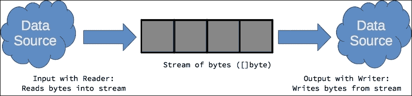

# 第十章. Go 中的数据 IO

本书的前几章主要关注基础知识。在本章和未来的章节中，读者将介绍 Go 标准库提供的强大 API 的一些内容。本章详细讨论如何使用标准库及其各自的包的 API 输入、处理、转换和输出数据，以下是一些主题：

+   使用读取器和写入器进行 IO 操作

+   `io.Reader` 接口

+   `io.Writer` 接口

+   使用 `io` 包进行工作

+   与文件一起工作

+   使用 `fmt` 进行格式化 IO

+   缓冲 IO

+   内存中的 IO

+   数据的编码和解码

# 使用读取器和写入器进行 IO 操作

与其他语言，如 Java，Go 将数据输入和输出建模为从源到目标的流。数据资源，如文件、网络连接，甚至一些内存中的对象，都可以建模为字节流，可以从其中读取或写入数据，如下面的图示所示：



数据流表示为可以访问以读取或写入的 **字节切片**（**[]byte**）。正如我们将在本章中探讨的，`*io*` 包提供了 `io.Reader` 接口以实现代码，从源读取并传输数据到字节流。相反，`io.Writer` 接口允许实现者创建代码，从提供的字节流中读取数据并将其写入目标资源。这两个接口在 Go 中被广泛用作标准习语来表示 IO 操作。这使得可以以可预测的结果交换不同实现和上下文中的读取器和写入器。

# `io.Reader` 接口

如下所示，`io.Reader` 接口很简单。它由一个方法组成，`Read([]byte)(int, error)`，旨在让程序员实现代码，从任意源读取数据并将其传输到提供的字节切片中。

```go
type Reader interface { 
        Read(p []byte) (n int, err error) 
} 

```

`Read` 方法返回传输到提供的切片中的总字节数和一个错误值（如果需要）。作为一个指导原则，`io.Reader` 的实现应该在读取器没有更多数据传输到流 `p` 时返回错误值 `io.EOF`。以下显示了 `alphaReader` 类型，这是一个从其字符串源过滤掉非 alpha 字符的 `io.Reader` 的简单实现：

```go
type alphaReader string 

func (a alphaReader) Read(p []byte) (int, error) { 
   count := 0 
   for i := 0; i < len(a); i++ { 
         if (a[i] >= 'A' && a[i] <= 'Z') || 
               (a[i] >= 'a' && a[i] <= 'z') { 
               p[i] = a[i] 
         } 
         count++ 
   } 
   return count, io.EOF 
} 

func main() { 
   str := alphaReader("Hello! Where is the sun?") 
   io.Copy(os.Stdout, &str) 
   fmt.Println() 
} 

```

golang.fyi/ch10/reader0.go

由于 `alphaReader` 类型的值实现了 `io.Reader` 接口，因此它们可以在需要读取器的任何地方参与，如 `io.Copy(os.Stdout, &str)` 调用所示。这会将 `alphaReader` 变量发出的字节流复制到写入器接口 `os.Stdout`（稍后介绍）。

## 连接读取器

```go
alphaReader. This time, it takes an io.Reader as its source as shown in the following code:
```

```go
type alphaReader struct { 
   src io.Reader 
} 

func NewAlphaReader(source io.Reader) *alphaReader { 
   return &alphaReader{source} 
} 

func (a *alphaReader) Read(p []byte) (int, error) { 
   if len(p) == 0 { 
         return 0, nil 
   } 
   count, err := a.src.Read(p) // p has now source data 
   if err != nil { 
         return count, err 
   } 
   for i := 0; i < len(p); i++ { 
         if (p[i] >= 'A' && p[i] <= 'Z') || 
               (p[i] >= 'a' && p[i] <= 'z') { 
               continue 
         } else { 
               p[i] = 0 
         } 
   } 
   return count, io.EOF 
} 

func main() { 
   str := strings.NewReader("Hello! Where is the sun?") 
   alpha := NewAlphaReader(str) 
   io.Copy(os.Stdout, alpha) 
   fmt.Println() 
} 

alphaReader type can now be combined with an os.File to filter out non-alphabetic characters from a file (the Go source code itself):
```

```go
... 
func main() { 
   file, _ := os.Open("./reader2.go") 
   alpha := NewAlphaReader(file) 
   io.Copy(os.Stdout, alpha) 
   fmt.Println() 
} 

```

golang.fyi/ch10/reader2.go

# `io.Writer` 接口

如下所示，`io.Writer` 接口与其读取器对应者一样简单：

```go
type Writer interface { 
   Write(p []byte) (n int, err error) 
} 

channelWriter type, a writer that decomposes and serializes its stream that is sent over a Go channel as consecutive bytes:
```

```go
type channelWriter struct { 
   Channel chan byte 
} 

func NewChannelWriter() *channelWriter { 
   return &channelWriter{ 
         Channel: make(chan byte, 1024), 
   } 
} 

func (c *channelWriter) Write(p []byte) (int, error) { 
   if len(p) == 0 { 
         return 0, nil 
   } 

   go func() { 
         defer close(c.Channel) // when done 
         for _, b := range p { 
               c.Channel <- b 
         } 
   }() 

   return len(p), nil 
} 

fmt.Fprint function to serialize the "Stream me!" string as a sequence of bytes over a channel using channelWriter:
```

```go
func main() { 
   cw := NewChannelWriter() 
   go func() { 
         fmt.Fprint(cw, "Stream me!") 
   }() 

   for c := range cw.Channel { 
         fmt.Printf("%c\n", c) 
   } 
} 

for…range statement as they are successively printed. The following snippet shows another example where the content of a file is serialized over a channel using the same channelWriter. In this implementation, an io.File value and io.Copy function are used to source the data instead of the fmt.Fprint function:
```

```go
func main() { 
   cw := NewChannelWriter() 
   file, err := os.Open("./writer2.go") 
   if err != nil { 
         fmt.Println("Error reading file:", err) 
         os.Exit(1) 
   } 
   _, err = io.Copy(cw, file) 
   if err != nil { 
         fmt.Println("Error copying:", err) 
         os.Exit(1) 
   } 

   // consume channel 
   for c := range cw.Channel { 
         fmt.Printf("%c\n", c) 
   } 
} 

```

golang.fyi/ch10/writer2.go.

# 使用 `io` 包进行工作

在 IO 操作中，最明显的地方是从 `io` 包开始，嗯，`io` 包（[`golang.org/pkg/io`](https://golang.org/pkg/io)）。正如我们已经看到的，`io` 包定义了输入和输出原语为 `io.Reader` 和 `io.Writer` 接口。以下表格总结了在 `io` 包中可用的其他函数和类型，这些函数和类型有助于简化流式 IO 操作。

| **函数** | **描述** |
| --- | --- |

| `io.Copy()` | `io.Copy` 函数（及其变体 `io.CopyBuffer` 和 `io.CopyN`）使得从任意 `io.Reader` 源复制数据到任意 `io.Writer` 汇入变得容易，如下面的代码片段所示：

```go
data := strings.NewReader("Write   me down.")   
file, _ := os.Create("./iocopy.data")   
io.Copy(file, data)   

```

golang.fyi/ch10/iocopy.go |

| `PipeReader PipeWriter` | `io` 包包括 *PipeReader* 和 *PipeWriter* 类型，它们将 IO 操作建模为内存管道。数据写入管道的 `io.Writer`，然后可以独立地从管道的 `io.Reader` 读取。以下简化的代码片段演示了一个简单的管道，它将字符串写入写入器 `pw`。然后使用 `pr` 读取器消耗数据，并将其复制到文件中：

```go
file, _ := os.Create("./iopipe.data")   
pr, pw := io.Pipe()    
go func() {   
    fmt.Fprint(pw, "Pipe   streaming")   
    pw.Close()   
}()   

wait := make(chan struct{})   
go func() {   
    io.Copy(file, pr)   
    pr.Close()   
    close(wait)   
}()   
<-wait //wait for pr to finish   

```

golang.fyi/ch10/iopipe.go 注意，管道写入器将在读取器完全消耗管道内容或遇到错误时阻塞。因此，读取器和写入器都应该被包装在 goroutine 中，以避免死锁。|

| `io.TeeReader()` | 与 `io.Copy` 函数类似，`io.TeeReader` 将内容从读取器传输到写入器。然而，该函数还会通过返回的 `io.Reader` 发射复制的字节（未更改）。

```go
TeeReader. The resulting reader, data, is then streamed to a gzip writer zip:
```

```go
fin, _ := os.Open("./ioteerdr.go")   
defer fin.Close()   
fout, _ := os.Create("./teereader.gz")   
defer fout.Close()   

zip := gzip.NewWriter(fout)   
defer zip.Close()   
sha := sha1.New()   
data := io.TeeReader(fin, sha)    
io.Copy(zip, data)   

fmt.Printf("SHA1 hash %x\n",   sha.Sum(nil))   

```

golang.fyi/ch10/ioteerdr0.go 如果我们想要同时计算 SHA-1 和 MD5，我们可以更新代码，将两个 `TeeReader` 值嵌套，如下面的代码片段所示：

```go
sha := sha1.New()   
md := md5.New()   
data := io.TeeReader(
  io.TeeReader(fin, md), sha,   
)    
io.Copy(zip, data)   

```

golang.fyi/ch10/ioteerdr1.go |

| `io.WriteString()` | `io.WriteString` 函数将字符串的内容写入指定的写入器。以下示例将字符串的内容写入文件：

```go
fout, err := os.Create("./iowritestr.data")   
if err != nil {   
    fmt.Println(err)   
    os.Exit(1)   
}   
defer fout.Close()   
io.WriteString(fout, "Hello   there!\n")   

```

golang.fyi/ch10/iowritestr.go |

| `io.LimitedReader` | 如其名称所示，`io.LimitedReader` 结构体是一个只从指定的 `io.Reader` 读取 *N* 个字节的读取器。以下代码片段将打印字符串的前 19 个字节：

```go
str := strings.NewReader("The   quick brown " +       
    "fox jumps over the lazy   dog")   
limited :=   &io.LimitedReader{R: str, N: 19}   
io.Copy(os.Stdout, limited)   

```

golang.fyi/ch10/iolimitedrdr.go

```go
$> go run iolimitedrd.go   
The quick brown fox   

```

|

| `io.SectionReader` | `io.SectionReader` 类型通过指定一个索引（基于零）来开始读取，以及一个表示要读取的字节数的偏移量值来实现 seek 和 skip 原语，如下面的代码片段所示：

```go
str := strings.NewReader("The   quick brown"+   
    "fox jumps over the lazy   dog")   
section := io.NewSectionReader(str,   19, 23)   
io.Copy(os.Stdout, section)   

```

golang.fyi/ch10/iosectionrdr.go 此示例将打印 `jumps over the lazy dog`。|

| 包 `io/ioutil` | `io/ioutil` 子包实现了一小部分函数，这些函数提供了对 IO 原语（如文件读取、目录列出、临时目录创建和文件写入）的实用快捷方式。 |
| --- | --- |

# 处理文件

`os` 包 ([`golang.org/pkg/os/`](https://golang.org/pkg/os/)) 提供了 `os.File` 类型，它表示系统上的文件句柄。`os.File` 类型实现了多个 IO 原语，包括 `io.Reader` 和 `io.Writer` 接口，这使得可以使用标准的流式 IO API 处理文件内容。

## 创建和打开文件

```go
io.Copy function. One common, and recommended practice to notice is the deferred call to the method Close on the file. This ensures a graceful release of OS resources when the function exits:
```

```go
func main() { 
   f1, err := os.Open("./file0.go") 
   if err != nil { 
         fmt.Println("Unable to open file:", err) 
         os.Exit(1) 
   } 
   defer f1.Close() 

   f2, err := os.Create("./file0.bkp") 
   if err != nil { 
         fmt.Println("Unable to create file:", err) 
         os.Exit(1) 
   } 
   defer f2.Close() 

   n, err := io.Copy(f2, f1) 
   if err != nil { 
         fmt.Println("Failed to copy:", err) 
         os.Exit(1) 
   } 

   fmt.Printf("Copied %d bytes from %s to %s\n",  
       n, f1.Name(), f2.Name()) 
} 

```

golang.fyi/ch10/file0.go

## 函数 os.OpenFile

```go
os.FileOpen function to demonstrate how it works:
```

```go
func main() { 
   f1, err := os.OpenFile("./file0.go", os.O_RDONLY, 0666) 
   if err != nil {...} 
   defer f1.Close() 

   f2, err := os.OpenFile("./file0.bkp", os.O_WRONLY, 0666) 
   if err != nil {...} 
   defer f2.Close() 

   n, err := io.Copy(f2, f1) 
   if err != nil {...} 

   fmt.Printf("Copied %d bytes from %s to %s\n",  
      n, f1.Name(), f2.Name()) 
} 

```

golang.fyi/ch10/file1.go

### 注意

如果你已经有一个指向操作系统文件描述符的引用，你也可以使用 `os.NewFile` 函数在你的程序中创建一个文件句柄。`os.NewFile` 函数很少使用，因为文件通常使用之前讨论过的文件函数进行初始化。

## 文件读写

```go
WriteString method from the os.File variable, fout, to create a text file:
```

```go
func main() { 
   rows := []string{ 
         "The quick brown fox", 
         "jumps over the lazy dog", 
   } 

   fout, err := os.Create("./filewrite.data") 
   if err != nil { 
         fmt.Println(err) 
         os.Exit(1) 
   } 
   defer fout.Close() 

   for _, row := range rows { 
         fout.WriteString(row) 
   } 
} 

```

golang.fyi/ch10/filewrite0.go

然而，如果你的数据源不是文本，你可以直接将原始字节写入文件，如下面的源代码片段所示：

```go
func main() { 
   data := [][]byte{ 
         []byte("The quick brown fox\n"), 
         []byte("jumps over the lazy dog\n"), 
   } 
   fout, err := os.Create("./filewrite.data") 
   if err != nil { ... } 
   defer fout.Close() 

   for _, out := range data { 
         fout.Write(out) 
   } 
} 

../ch0r/dict.txt as raw bytes assigned to slice p up to 1024-byte chunks at a time:
```

```go
func main() { 
   fin, err := os.Open("../ch05/dict.txt") 
   if err != nil { 
         fmt.Println(err) 
         os.Exit(1) 
   } 
   defer fin.Close() 
   p := make([]byte, 1024) 
   for { 
         n, err := fin.Read(p) 
         if err == io.EOF { 
               break 
         } 
         fmt.Print(string(p[:n])) 
   } 
} 

```

golang.fyi/ch10/fileread.go

## 标准输入、输出和错误

```go
f1 and writes its content to io.Stdout, standard output, using the os.Copy function (standard input is covered later):
```

```go
func main() { 
   f1, err := os.Open("./file0.go") 
   if err != nil { 
         fmt.Println("Unable to open file:", err) 
         os.Exit(1) 
   } 
   defer f1.Close() 

   n, err := io.Copy(os.Stdout, f1) 
   if err != nil { 
         fmt.Println("Failed to copy:", err) 
         os.Exit(1) 
   } 

   fmt.Printf("Copied %d bytes from %s \n", n, f1.Name()) 
} 

```

golang.fyi/ch10/osstd.go

# 使用 fmt 进行格式化 IO

最常用的 IO 包之一是 `fmt` ([`golang.org/pkg/fmt`](https://golang.org/pkg/fmt))。它包含了一系列用于格式化输入和输出的函数。`fmt` 包最常用的用途是写入标准输出和读取标准输入。本节还突出了其他使 `fmt` 成为优秀 IO 工具的函数。

## 向 io.Writer 接口打印

```go
metalloid data to a specified text file using the fmt.Fprintf function:
```

```go
type metalloid struct { 
   name   string 
   number int32 
   weight float64 
} 

func main() { 
   var metalloids = []metalloid{ 
         {"Boron", 5, 10.81}, 
         ... 
         {"Polonium", 84, 209.0}, 
   } 
   file, _ := os.Create("./metalloids.txt") 
   defer file.Close() 

   for _, m := range metalloids { 
         fmt.Fprintf( 
               file, 
               "%-10s %-10d %-10.3f\n", 
               m.name, m.number, m.weight, 
         ) 
   } 
} 

```

golang.fyi/ch10/fmtfprint0.go

在上一个示例中，`fmt.Fprintf` 函数使用格式说明符将格式化文本写入到 io.File 变量 `file`。`fmt.Fprintf` 函数支持大量的格式说明符，其正确处理超出了本文的范围。请参阅在线文档以获取这些说明符的完整覆盖。

## 向标准输出打印

```go
fmt.Printf instead of the fmt.Fprintf function:
```

```go
type metalloid struct { ... } 
func main() { 
   var metalloids = []metalloid{ 
         {"Boron", 5, 10.81}, 
         ... 
         {"Polonium", 84, 209.0}, 
   } 

   for _, m := range metalloids { 
         fmt.Printf( 
               "%-10s %-10d %-10.3f\n", 
               m.name, m.number, m.weight, 
         ) 
   } 
} 

```

golang.fyi/ch10/fmtprint0.go

## 从 io.Reader 读取

```go
fmt.Fscanf for the formatted input of a space-delimited file (planets.txt) containing planetary data:
```

```go
func main() { 
   var name, hasRing string 
   var diam, moons int 

   // read data 
   data, err := os.Open("./planets.txt") 
   if err != nil { 
         fmt.Println("Unable to open planet data:", err) 
         return 
   } 
   defer data.Close() 

   for { 
         _, err := fmt.Fscanf( 
               data, 
               "%s %d %d %s\n", 
               &name, &diam, &moons, &hasRing, 
         ) 
         if err != nil { 
               if err == io.EOF { 
                     break 
               } else { 
                     fmt.Println("Scan error:", err) 
                     return 
               } 
         } 
         fmt.Printf( 
               "%-10s %-10d %-6d %-6s\n", 
               name, diam, moons, hasRing, 
         ) 
   } 

```

golang.fyi/ch10/fmtfscan0.go

代码从 `io.File` 变量 `data` 读取，直到遇到表示文件结束的 `io.EOF` 错误。它读取的每一行文本都使用格式说明符 `"%s %d %d %s\n"` 进行解析，这与存储在文件中的记录的空格分隔布局相匹配。然后，每个解析的标记被分配给相应的变量 `name`、`diam`、`moons` 和 `hasRing`，这些变量使用 `fm.Printf` 函数打印到标准输出。

## 从标准输入读取

与从任意的 `io.Reader` 读取不同，`fmt.Scan`、`fmt.Scanf` 和 `fmt.Scanln` 用于从标准输入文件句柄 `os.Stdin` 读取数据。以下代码片段展示了从控制台读取文本输入的简单程序：

```go
func main() { 
   var choice int 
   fmt.Println("A square is what?") 
   fmt.Print("Enter 1=quadrilateral 2=rectagonal:") 

   n, err := fmt.Scanf("%d", &choice) 
   if n != 1 || err != nil { 
         fmt.Println("Follow directions!") 
         return 
   } 
   if choice == 1 { 
         fmt.Println("You are correct!") 
   } else { 
         fmt.Println("Wrong, Google it.") 
   } 
} 

```

golang.fyi/ch10/fmtscan1.go

在上一个程序中，`fmt.Scanf` 函数使用格式说明符 `"%d"` 解析输入，从标准输入读取一个整数值。如果读取的值与指定的格式不精确匹配，该函数将抛出一个错误。例如，以下展示了当读取字符 `D` 而不是整数时会发生什么：

```go
$> go run fmtscan1.go
A square is what?
Enter 1=quadrilateral 2=rectagonal: D
Follow directions!

```

# 缓冲输入输出

到目前为止，大多数 IO 操作都是非缓冲的。这意味着每个读写操作都可能受到底层操作系统处理 IO 请求延迟的负面影响。另一方面，缓冲操作通过在 IO 操作期间在内部内存中缓冲数据来减少延迟。`bufio` 包（[`golang.org/pkg/bufio`](https://golang.org/pkg/bufio)/）提供了缓冲读写 IO 操作的函数。

## 缓冲写入器和读取器

`bufio` 包提供了几个函数，用于使用 `io.Writer` 接口进行缓冲的 IO 流写入。以下代码片段创建了一个文本文件，并使用缓冲 IO 向其写入：

```go
func main() { 
   rows := []string{ 
         "The quick brown fox", 
         "jumps over the lazy dog", 
   } 

   fout, err := os.Create("./filewrite.data") 
   writer := bufio.NewWriter(fout) 
   if err != nil { 
         fmt.Println(err) 
         os.Exit(1) 
   } 
   defer fout.Close() 

   for _, row := range rows { 
         writer.WriteString(row) 
   } 
   writer.Flush() 
} 

bufio.Reader variable reader by wrapping the file variable as its underlying source:
```

```go
func main() { 
   file, err := os.Open("./bufread0.go") 
   if err != nil { 
         fmt.Println("Unable to open file:", err) 
         return 
   } 
   defer file.Close() 

   reader := bufio.NewReader(file) 
   for { 
         line, err := reader.ReadString('\n') 
         if err != nil { 
               if err == io.EOF { 
                     break 
               } else { 
                     fmt.Println("Error reading:, err") 
                     return 
               } 
         } 
         fmt.Print(line) 
   } 
} 

```

golang`.fyi/ch10/bufread0.go`

之前的代码使用 `reader.ReadString` 方法通过 `'\n'` 字符作为内容分隔符来读取文本文件。要影响内部缓冲区的大小，请使用构造函数 `bufio.NewReaderSize(w io.Reader, n int)` 来指定内部缓冲区大小。`bufio.Reader` 类型还提供了 *Read*、*ReadByte* 和 *ReadBytes* 方法，用于从流中读取原始字节，以及 *ReadRune* 方法用于读取 Unicode 编码的字符。

## 扫描缓冲区

```go
bufio.Scanner (instead of the fmt.Fscan function) to scan the content of the text file using the bufio.ScanLines function:
```

```go
func main() { 
   file, err := os.Open("./planets.txt") 
   if err != nil { 
         fmt.Println("Unable to open file:", err) 
         return 
   } 
   defer file.Close() 

   fmt.Printf( 
         "%-10s %-10s %-6s %-6s\n", 
         "Planet", "Diameter", "Moons", "Ring?", 
   ) 
   scanner := bufio.NewScanner(file) 
   scanner.Split(bufio.ScanLines) 
   for scanner.Scan() { 
         fields := strings.Split(scanner.Text(), " ") 
         fmt.Printf( 
               "%-10s %-10s %-6s %-6s\n", 
               fields[0], fields[1], fields[2], fields[3], 
         ) 
   } 
} 

```

golang.fyi/ch10/bufscan0.go

使用 `bufio.Scanner` 的步骤如前一个示例所示，共有四个步骤：

+   首先，使用 `bufio.NewScanner(io.Reader)` 创建一个扫描器

+   调用 `scanner.Split` 方法来配置内容如何被标记化

+   使用 `scanner.Scan` 方法遍历生成的标记

+   使用 `scanner.Text` 方法读取标记化数据

代码使用预定义函数 `bufio.ScanLines` 使用行分隔符解析缓冲内容。`bufio` 包附带几个预定义的拆分函数，包括 *ScanBytes* 用于将每个字节作为标记扫描，*ScanRunes* 用于扫描 UTF-8 编码的标记，以及 *ScanWords* 用于将每个空格分隔的单词作为标记扫描。

# 内存中的 IO

```go
byte.Buffer variable, book. Then the buffer is streamed to os.Stdout:
```

```go
func main() { 
   var books bytes.Buffer 
   books.WriteString("The Great Gatsby") 
   books.WriteString("1984") 
   books.WriteString("A Tale of Two Cities") 
   books.WriteString("Les Miserables") 
   books.WriteString("The Call of the Wild") 

   books.WriteTo(os.Stdout) 
} 

```

golang.fyi/ch10/bytesbuf0.go

同样的示例可以很容易地更新为将内容流式传输到常规文件，如下面的简略代码片段所示：

```go
func main() { 
   var books bytes.Buffer 
   books.WriteString("The Great Gatsby\n") 
   books.WriteString("1984\n") 
   books.WriteString("A Take of Two Cities\n") 
   books.WriteString("Les Miserables\n") 
   books.WriteString("The Call of the Wild\n") 

   file, err := os.Create("./books.txt") 
   if err != nil { 
         fmt.Println("Unable to create file:", err) 
         return 
   } 
   defer file.Close() 
   books.WriteTo(file) 
} 

```

golang.fyi/ch10/bytesbuf1.go

# 数据的编码和解码

Go 中 IO 的另一个常见方面是在流式传输过程中将数据从一种表示形式编码到另一种表示形式。标准库中的编码器和解码器，位于 *encoding* 包中（[`golang.org/pkg/encoding/`](https://golang.org/pkg/encoding/）），使用 `io.Reader` 和 `io.Writer` 接口来利用 IO 原语作为编码和解码过程中流式传输数据的方式。

Go 支持多种编码格式，用于各种目的，包括数据转换、数据压缩和数据加密。本章将专注于使用*Gob*和*JSON*格式进行数据转换的编码和解码。在第十一章《编写网络程序》中，我们将探讨使用编码器将数据转换为客户端和服务器通信，使用**远程过程调用**（**RPC**）。

## 使用 gob 进行二进制编码

```go
books, a slice of the Book type with nested values, into the gob format. The encoder writes its generated binary data to an os.Writer instance, in this case the file variable of the *os.File type:
```

```go
type Name struct { 
   First, Last string 
} 

type Book struct { 
   Title       string 
   PageCount   int 
   ISBN        string 
   Authors     []Name 
   Publisher   string 
   PublishDate time.Time 
} 

func main() { 
   books := []Book{ 
         Book{ 
               Title:       "Leaning Go", 
               PageCount:   375, 
               ISBN:        "9781784395438", 
               Authors:     []Name{{"Vladimir", "Vivien"}}, 
               Publisher:   "Packt", 
               PublishDate: time.Date( 
                     2016, time.July, 
                     0, 0, 0, 0, 0, time.UTC, 
               ), 
         }, 
         Book{ 
               Title:       "The Go Programming Language", 
               PageCount:   380, 
               ISBN:        "9780134190440", 
               Authors:     []Name{ 
                     {"Alan", "Donavan"}, 
                     {"Brian", "Kernighan"}, 
               }, 
               Publisher:   "Addison-Wesley", 
               PublishDate: time.Date( 
                     2015, time.October, 
                     26, 0, 0, 0, 0, time.UTC, 
               ), 
         }, 
         ... 
   } 

   // serialize data structure to file 
   file, err := os.Create("book.dat") 
   if err != nil { 
         fmt.Println(err) 
         return 
   } 
   enc := gob.NewEncoder(file) 
   if err := enc.Encode(books); err != nil { 
         fmt.Println(err) 
   } 
} 

books.data file in the previous example. The decoder reads the data from an io.Reader, in this instance the variable file of the *os.File type:
```

```go
type Name struct { 
   First, Last string 
} 

type Book struct { 
   Title       string 
   PageCount   int 
   ISBN        string 
   Authors     []Name 
   Publisher   string 
   PublishDate time.Time 
} 

func main() { 
   file, err := os.Open("book.dat") 
   if err != nil { 
         fmt.Println(err) 
         return 
   } 

   var books []Book 
   dec := gob.NewDecoder(file) 
   if err := dec.Decode(&books); err != nil { 
         fmt.Println(err) 
         return 
   } 
} 

```

golang.fyi/ch10/gob1.go

通过创建一个解码器`dec := gob.NewDecoder(file)`来解码先前编码的 gob 数据。下一步是声明将存储解码数据的变量。在我们的例子中，`books`变量，其类型为`[]Book`，被声明为解码数据的目的地。实际的解码操作是通过调用`dec.Decode(&books)`来完成的。注意`Decode()`方法接受其目标变量的地址作为参数。一旦解码完成，`books`变量将包含从文件中流出的重构数据结构。

### 注意

到目前为止，gob 编码器和解码器 API 仅适用于 Go 编程语言。这意味着以 gob 编码的数据只能由 Go 程序消费。

## 将数据编码为 JSON

编码包还附带了一个*json*编码子包([`golang.org/pkg/encoding/json/`](https://golang.org/pkg/encoding/json/))，以支持 JSON 格式的数据。这大大增加了 Go 程序可以与之交换复杂数据结构的语言数量。JSON 编码与 gob 包中的编码器和解码器类似。区别在于生成数据采用清晰的文本 JSON 编码格式，而不是二进制格式。以下代码更新了先前的例子，以将数据编码为 JSON：

```go
type Name struct { 
   First, Last string 
} 

type Book struct { 
   Title       string 
   PageCount   int 
   ISBN        string 
   Authors     []Name 
   Publisher   string 
   PublishDate time.Time 
} 

func main() { 
   books := []Book{ 
         Book{ 
               Title:       "Leaning Go", 
               PageCount:   375, 
               ISBN:        "9781784395438", 
               Authors:     []Name{{"Vladimir", "Vivien"}}, 
               Publisher:   "Packt", 
               PublishDate: time.Date( 
                     2016, time.July, 
                     0, 0, 0, 0, 0, time.UTC), 
         }, 
         ... 
   } 

   file, err := os.Create("book.dat") 
   if err != nil { 
         fmt.Println(err) 
         return 
   } 
   enc := json.NewEncoder(file) 
   if err := enc.Encode(books); err != nil { 
         fmt.Println(err) 
   } 
} 

```

golang.fyi/ch10/json0.go

代码与之前完全相同。它使用分配给`books`变量的相同嵌套结构切片。唯一的区别是使用`enc := json.NewEncoder(file)`创建编码器，这将创建一个使用`file`变量作为其`io.Writer`目的地的 JSON 编码器。当执行`enc.Encode(books)`时，`books`变量的内容将被序列化为 JSON 格式并写入本地文件`books.dat`，如下面的代码所示（格式化以提高可读性）：

```go
[ 
 {
 "Title":"Leaning Go",
 "PageCount":375,
 "ISBN":"9781784395438",
 "Authors":[{"First":"Vladimir","Last":"Vivien"}],
 "Publisher":"Packt",
 "PublishDate":"2016-06-30T00:00:00Z"
 },
 {
 "Title":"The Go Programming Language",
 "PageCount":380,
 "ISBN":"9780134190440",
 "Authors":[
 {"First":"Alan","Last":"Donavan"},
                      {"First":"Brian","Last":"Kernighan"}
 ],
 "Publisher":"Addison-Wesley",
 "PublishDate":"2015-10-26T00:00:00Z"
 },
 ...
]

book.dat. Note that the data structure (not shown in the following code) is the same as before:
```

```go
func main() { 
   file, err := os.Open("book.dat") 
   if err != nil { 
         fmt.Println(err) 
         return 
   } 

   var books []Book 
   dec := json.NewDecoder(file) 
   if err := dec.Decode(&books); err != nil { 
         fmt.Println(err) 
         return 
   } 
} 

```

golang.fyi/ch10/json1.go

书本.dat 文件中的数据存储为一个 JSON 对象的数组。因此，代码必须声明一个变量，能够存储嵌套结构值的索引集合。在先前的例子中，`books`变量，其类型为`[]Book`，被声明为解码数据的目的地。实际的解码操作是通过调用`dec.Decode(&books)`来完成的。注意`Decode()`方法接受其目标变量的地址作为参数。一旦解码完成，`books`变量将包含从文件中流出的重构数据结构。

## 使用结构体标签控制 JSON 映射

```go
json: tag prefix to specify how object keys are to be encoded and decoded:
```

```go
type Book struct { 
   Title       string      `json:"book_title"` 
   PageCount   int         `json:"pages,string"` 
   ISBN        string      `json:"-"` 
   Authors     []Name      `json:"auths,omniempty"` 
   Publisher   string      `json:",omniempty"` 
   PublishDate time.Time   `json:"pub_date"` 
} 

```

golang.fyi/ch10/json2.go

以下表格总结了标签及其含义：

| **标签** | **描述** |
| --- | --- |
| `` Title string `json:"book_title"` `` | 将 `Title` 结构体字段映射到 JSON 对象键 `"book_title"`。 |
| `` PageCount int `json:"pages,string"` `` | 将 `PageCount` 结构体字段映射到 JSON 对象键 `"pages"`，并将值输出为字符串而不是数字。 |
| `` ISBN string `json:"-"` `` | 短横线导致 `ISBN` 字段在编码和解码过程中被跳过。 |
| `` Authors []Name `json:"auths,omniempty"` `` | 将 `Authors` 字段映射到 JSON 对象键 `"auths"`。注释 `omniempty` 导致字段值为 nil 时被省略。 |
| `` Publisher string `json:",omniempty"` `` | 将结构体字段名称 `Publisher` 映射为 JSON 对象键名称。注释 `omniempty` 导致字段为空时被省略。 |
| `` PublishDate time.Time `json:"pub_date"` `` | 将字段名称 `PublishDate` 映射到 JSON 对象键 `"pub_date"`。 |

当前面的结构体被编码时，在 `books.dat` 文件中产生以下 JSON 输出（格式化以提高可读性）：

```go
... 
{ 
   "book_title":"The Go Programming Language", 
   "pages":"380", 
   "auths":[ 
         {"First":"Alan","Last":"Donavan"}, 
         {"First":"Brian","Last":"Kernighan"} 
   ], 
   "Publisher":"Addison-Wesley", 
   "pub_date":"2015-10-26T00:00:00Z" 
} 
... 

```

注意 JSON 对象键的命名方式与 `struct` 标签中指定的一致。键 `"pages"`（映射到结构体字段 `PageCount`）被编码为字符串。最后，结构体字段 `ISBN` 被省略，如 `struct` 标签中注释所示。

## 自定义编码和解码

```go
Name is updated to implement json.Marshaller as shown:
```

```go
type Name struct { 
   First, Last string 
} 
func (n *Name) MarshalJSON() ([]byte, error) { 
   return []byte( 
         fmt.Sprintf(""%s, %s"", n.Last, n.First) 
   ), nil 
} 

type Book struct { 
   Title       string 
   PageCount   int 
   ISBN        string 
   Authors     []Name 
   Publisher   string 
   PublishDate time.Time 
} 
func main(){ 
   books := []Book{ 
         Book{ 
               Title:       "Leaning Go", 
               PageCount:   375, 
               ISBN:        "9781784395438", 
               Authors:     []Name{{"Vladimir", "Vivien"}}, 
               Publisher:   "Packt", 
               PublishDate: time.Date( 
                     2016, time.July, 
                     0, 0, 0, 0, 0, time.UTC), 
         }, 
         ... 
   } 
   ... 
   enc := json.NewEncoder(file) 
   if err := enc.Encode(books); err != nil { 
         fmt.Println(err) 
   } 
} 

```

golang.fyi/ch10/json3.go

在前面的示例中，`Name` 类型的值被序列化为 JSON 字符串（而不是之前的对象）。序列化由 `Name.MarshallJSON` 方法处理，该方法返回一个包含由逗号分隔的姓氏和名字的字节序列数组。前面的代码生成了以下 JSON 输出：

```go
 [
 ...
 {
                "Title":"Leaning Go",
                "PageCount":375,
                "ISBN":"9781784395438",
                "Authors":["Vivien, Vladimir"],
                "Publisher":"Packt",
                "PublishDate":"2016-06-30T00:00:00Z"
          },
          ...
    ] 

json.Unmarshaler to handle the JSON output for the Name type:
```

```go
type Name struct { 
   First, Last string 
} 

func (n *Name) UnmarshalJSON(data []byte) error { 
   var name string 
   err := json.Unmarshal(data, &name) 
   if err != nil { 
         fmt.Println(err) 
         return err 
   } 
   parts := strings.Split(name, ", ") 
   n.Last, n.First = parts[0], parts[1] 
   return nil 
} 

```

golang.fyi/ch10/json4.go

`Name` 类型是 `json.Unmarshaler` 的实现。当解码器遇到键为 `"Authors"` 的 JSON 对象时，它使用 `Name.Unmarshaler` 方法从 JSON 字符串重新构建 Go 结构体 `Name` 类型。

### 注意

Go 标准库提供了额外的编码器（此处未涵盖），包括 `base32`、`base64`、`binary`、`csv`、`hex`、`xml`、`gzip` 以及许多加密格式编码器。

# 摘要

本章提供了 Go 的数据输入和输出惯用语的概述以及实现 IO 原语所涉及的包。本章首先介绍了 Go 中基于流的 IO 的基础知识，包括 `io.Reader` 和 `io.Writer` 接口。读者将了解 `io.Reader` 和 `io.Writer` 的实现策略和示例。

本章继续介绍支持流式 IO 机制的各种包、类型和函数，包括处理文件、格式化 IO、缓冲 IO 和内存 IO。本章的最后部分涵盖了编码器和解码器，它们在数据流传输过程中将数据进行转换。在下一章中，当讨论转向创建使用网络进行通信的程序时，IO 主题将进一步展开。
