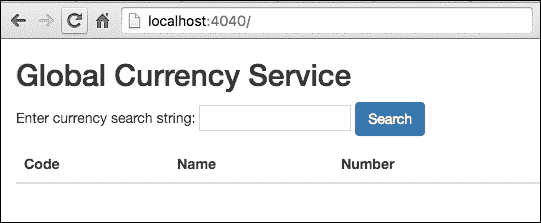

# 第十一章。编写网络服务

Go 作为系统语言广受欢迎的许多原因之一是其创建网络程序的内建支持。标准库公开了从低级套接字原语到高级服务抽象（如 HTTP 和 RPC）的 API。本章探讨了创建连接应用程序的基本主题，包括以下内容：

+   `net` 包

+   TCP API 服务器

+   HTTP 包

+   JSON API 服务器

# `net` 包

Go 中所有网络程序的起点是 *net* 包 ([`golang.org/pkg/net`](https://golang.org/pkg/net))。它提供了一套丰富的 API，用于处理低级网络原语以及应用层协议，如 HTTP。网络中的每个逻辑组件都由一个 Go 类型表示，包括硬件接口、网络、数据包、地址、协议和连接。此外，每个类型都公开了大量的方法，使 Go 拥有支持 IPv4 和 IPv6 的最完整的标准库之一，用于网络编程。

无论创建客户端还是服务器程序，Go 程序员至少需要以下章节中涵盖的网络原语。这些原语作为函数和类型提供，以方便客户端连接到远程服务以及服务器处理传入请求。

## 地址解析

在进行网络编程时，一个基本原语是 *地址*。`net` 包的类型和函数使用字符串字面量来表示地址，例如 `"127.0.0.1"`。地址还可以包括由冒号分隔的服务端口，例如 `"74.125.21.113:80"`。`net` 包中的函数和方法还支持 IPv6 地址的字符串字面量表示，例如 `"::1"` 或 `"[2607:f8b0:4002:c06::65]:80"`，其中地址的服务端口为 80。

## `net.Conn` 类型

`net.Conn` 接口表示网络中两个节点之间建立的通用连接。它实现了 `io.Reader` 和 `io.Writer` 接口，允许连接的节点使用流式 I/O 原语交换数据。`net` 包提供了针对 `net.Conn` 接口的特定网络协议实现，例如 *IPConn*、*UDPConn* 和 *TCPConn*。每个实现都公开了其各自网络和协议特有的额外方法。然而，正如我们将在本章中看到的，`net.Conn` 中定义的默认方法集对于大多数用途来说是足够的。

## 建立连接

客户端程序使用 `net.Dial` 函数连接到网络上的主机服务，该函数具有以下签名：

```go
func Dial(network, address string) (Conn, error) 

"tcp" network at the host address, www.gutenberg.org:80, which returns a TCP connection of the *net.TCPConn type. The abbreviated code uses the TCP connection to issue an "HTTP GET" request to retrieve the full text of the literary classic Beowulf from the Project Gutenberg's website (http://gutenberg.org/). The raw and unparsed HTTP response is subsequently written to a local file, beowulf.txt:
```

```go
func main() { 
   host, port := "www.gutenberg.org", "80" 
   addr := net.JoinHostPort(host, port) 
   httpRequest:="GET  /cache/epub/16328/pg16328.txt HTTP/1.1\n" + 
         "Host: " + host + "\n\n" 

   conn, err := net.Dial("tcp", addr) 
   if err != nil { 
         fmt.Println(err) 
         return 
   } 
   defer conn.Close() 

   if _, err = conn.Write([]byte(httpRequest)); err != nil { 
         fmt.Println(err) 
         return 
   } 

   file, err := os.Create("beowulf.txt") 
   if err != nil { 
         fmt.Println(err) 
         return 
   } 
   defer file.Close() 

   io.Copy(file, conn) 
   fmt.Println("Text copied to file", file.Name()) 
}

```

golang.fyi/ch11/dial0.go

因为 `net.Conn` 类型实现了 `io.Reader` 和 `io.Writer`，它可以用来发送和接收数据，使用流式 I/O 语义。在先前的示例中，`conn.Write([]byte(httpRequest))` 将 HTTP 请求发送到服务器。主机返回的响应通过 `io.Copy(file, conn)` 从 `conn` 变量复制到 `file` 变量。

### 注意

注意，前面的示例展示了如何使用原始 TCP 连接到 HTTP 服务器。Go 标准库提供了一个专门为 HTTP 编程设计的独立包，该包抽象了低级协议细节（将在本章后面介绍）。

`net` 包还提供了网络特定的拨号函数，如 `DialUDP`、`DiapTCP` 或 `DialIP`，每个都返回其相应的连接实现。在大多数情况下，`net.Dial` 函数和 `net.Conn` 接口提供了连接和管理远程主机连接的足够功能。

## 监听传入连接

创建服务程序时，第一步是宣布服务将使用的端口号，以便监听来自网络的传入请求。这是通过调用 `net.Listen` 函数来完成的，该函数具有以下签名：

```go
func Listen(network, laddr string) (net.Listener, error) 

```

它接受两个参数，其中第一个参数指定一个协议，有效值为 `"tcp"`、`"tcp4"`、`"tcp6"`、`"unix"` 或 `"unixpacket"`。

第二个参数是服务的本地主机地址。本地地址可以指定为没有 IP 地址，例如 `":4040"`。省略主机 IP 地址意味着服务绑定到主机上安装的所有网络接口卡。作为替代，可以通过指定网络上的 IP 地址将服务绑定到主机上的特定网络硬件接口，即 `"10.20.130.240:4040"`。

成功调用 `net.Listen` 函数返回 `net.Listener` 类型的值（如果失败，则返回非空错误）。`net.Listener` 接口公开用于管理传入客户端连接生命周期的方法。根据 `network` 参数的值（`"tcp"`、`"tcp4"`、`"tcp6"` 等），`net.Listen` 将返回 `net.TCPListener` 或 `net.UnixListener`，两者都是 `net.Listener` 接口的具体实现。

## 接受客户端连接

`net.Listener` 接口使用 `*Accept*` 方法无限期地阻塞，直到从客户端收到新的连接。以下简化的代码片段展示了简单的服务器，它向每个客户端连接返回字符串 "很高兴见到你！" 然后立即断开连接：

```go
func main() { 
   listener, err := net.Listen("tcp", ":4040") 
   if err != nil { 
         fmt.Println(err) 
         return 
   } 
   defer listener.Close() 

   for { 
         conn, err := listener.Accept() 
         if err != nil { 
               fmt.Println(err) 
               return 
         } 
         conn.Write([]byte("Nice to meet you!")) 
         conn.Close() 
   } 
} 

```

golang.fyi/ch11/listen0.go

在代码中，`listener.Accept` 方法返回 `net.Conn` 类型的值以处理服务器和客户端之间的数据交换（如果失败，则返回非空错误）。`conn.Write([]byte("Nice to meet you!"))` 方法调用用于向客户端写入响应。当服务器程序运行时，可以使用以下输出中的 *telnet* 客户端进行测试：

```go
$> go run listen0.go & 
[1] 83884 

$> telnet 127.0.0.1 4040 
Trying 127.0.0.1... 
Connected to localhost. 
Escape character is '^]'. 
Nice to meet you! Connection closed by foreign host.

```

为了确保服务器程序持续运行并处理后续的客户端连接，`Accept`方法的调用被包裹在一个无限循环中。一旦连接关闭，循环将重新启动周期以等待下一个客户端连接。同时请注意，在服务器进程关闭时，通过调用`Listener.Close()`关闭监听器是一个好的实践。

### 注意

仔细的读者可能会注意到这个简单的服务器无法扩展，因为它不能同时处理多个客户端请求。在下一节中，我们将看到创建可扩展服务器的技术。

# TCP API 服务器

到目前为止，本章已经涵盖了创建客户端和服务程序所需的最基本的网络组件。本章的剩余部分将讨论实现*货币信息*服务的服务器不同版本。该服务在每个请求中返回 ISO 4217 货币信息。目的是展示使用不同的应用层协议创建网络服务和它们的客户端的后果。

之前我们介绍了一个非常简单的服务器来演示设置网络服务所需的必要步骤。本节通过创建一个可以扩展以处理多个并发连接的 TCP 服务器来深入探讨网络编程。本节中展示的服务器代码有以下设计目标：

+   使用原始 TCP 在客户端和服务器之间进行通信

+   开发一个基于 TCP 的简单文本协议，用于通信

+   客户端可以使用文本命令查询服务器的全局货币信息

+   使用每个连接一个 goroutine 来处理连接并发

+   维持连接直到客户端断开

以下列出了服务器代码的简略版本。程序使用`curr`包（位于[`github.com/vladimirvivien/learning-go/ch11/curr0`](https://github.com/vladimirvivien/learning-go/ch11/curr0)），此处未讨论，用于从本地 CSV 文件中加载货币数据到切片`currencies`。

在成功连接到客户端后，服务器使用简单的文本协议解析传入的客户端命令，格式为*GET <currency-filter-value>*，其中*<currency-filter-value>*指定一个字符串值，用于搜索货币信息：

```go
import ( 
   "net" 
   ... 
   curr "https://github.com/vladimirvivien/learning-go/ch11/curr0" 
) 

var currencies = curr.Load("./data.csv") 

func main() { 
   ln, _ := net.Listen("tcp", ":4040") 
   defer ln.Close() 

   // connection loop 
   for { 
         conn, err := ln.Accept() 
         if err != nil { 
               fmt.Println(err) 
               conn.Close() 
               continue 
         }      
         go handleConnection(conn) 
   } 
} 

// handle client connection 
func handleConnection(conn net.Conn) { 
   defer conn.Close() 

   // loop to stay connected with client 
   for { 
         cmdLine := make([]byte, (1024 * 4)) 
         n, err := conn.Read(cmdLine) 
         if n == 0 || err != nil { 
               return 
         } 
         cmd, param := parseCommand(string(cmdLine[0:n])) 
         if cmd == "" { 
               continue 
         } 

         // execute command 
         switch strings.ToUpper(cmd) { 
         case "GET": 
               result := curr.Find(currencies, param) 
               // stream result to client 
               for _, cur := range result { 
                     _, err := fmt.Fprintf( 
                           conn, 
                           "%s %s %s %s\n", 
                           cur.Name, cur.Code, 
                           cur.Number, cur.Country, 
                     ) 
                     if err != nil { 
                           return 
                     } 
                     // reset deadline while writing, 
                     // closes conn if client is gone 
                     conn.SetWriteDeadline( 
                           time.Now().Add(time.Second * 5)) 
               } 
               // reset read deadline for next read 
               conn.SetReadDeadline( 
                     time.Now().Add(time.Second * 300)) 

         default: 
               conn.Write([]byte("Invalid command\n")) 
         } 
   } 
} 

func parseCommand(cmdLine string) (cmd, param string) { 
   parts := strings.Split(cmdLine, " ") 
   if len(parts) != 2 { 
         return "", "" 
   } 
   cmd = strings.TrimSpace(parts[0]) 
   param = strings.TrimSpace(parts[1]) 
   return 
} 

```

golang.fyi/ch11/tcpserv0.go

与上一节中介绍的简单服务器不同，这个服务器能够同时服务多个客户端连接。在通过`ln.Accept()`接受新的连接后，它将新客户端连接的处理委托给一个 goroutine，使用`go handleConnection(conn)`。然后连接循环立即继续并等待下一个客户端连接。

`handleConnection` 函数管理服务器与连接客户端的通信。它首先使用 `cmd, param := parseCommand(string(cmdLine[0:n]))` 读取并解析从客户端接收的字节数组到命令字符串。接下来，代码使用 `switch` 语句测试命令。如果 `cmd` 等于 `"GET"`，代码通过调用 `curr.Find(currencies, param)` 在 `currencies` 切片中搜索与 `param` 匹配的值。最后，它使用 `fmt.Fprintf(conn, "%s %s %s %s\n", cur.Name, cur.Code, cur.Number, cur.Country)` 将搜索结果流式传输到客户端的连接。

服务器支持的单个文本协议不包含任何类型的会话控制或控制消息。因此，代码使用 `conn.SetWriteDeadline` 方法确保与客户端的连接不会不必要地长时间挂起。该方法在循环中调用，循环将响应流式传输到客户端。它设置为 5 秒的截止日期，以确保客户端总是在该时间内准备好接收下一块字节，否则它将超时连接。

## 使用 telnet 连接到 TCP 服务器

由于前面提出的货币服务器使用简单的基于文本的协议，它可以使用 telnet 客户端进行测试，假设服务器代码已被编译并运行（并监听端口 `4040`）。以下是一个 telnet 会话的输出，该会话查询服务器以获取货币信息：

```go
$> telnet localhost 4040
Trying ::1...
Connected to localhost.
Escape character is '^]'.
GET Gourde
Gourde HTG 332 HAITI
GET USD
US Dollar USD 840 AMERICAN SAMOA
US Dollar USD 840 BONAIRE, SINT EUSTATIUS AND SABA
US Dollar USD 840 GUAM
US Dollar USD 840 HAITI
US Dollar USD 840 MARSHALL ISLANDS (THE)
US Dollar USD 840 UNITED STATES OF AMERICA (THE)
...
get india
Indian Rupee INR 356 BHUTAN
US Dollar USD 840 BRITISH INDIAN OCEAN TERRITORY (THE)
Indian Rupee INR 356 INDIA

```

如您所见，您可以通过使用前面解释的 `get` 命令后跟一个过滤器参数来查询服务器。telnet 客户端将原始文本发送到服务器，服务器解析它并作为响应发送回原始文本。您可以对服务器打开多个 telnet 会话，并且所有请求都在各自的 goroutine 中并发处理。

## 使用 Go 连接到 TCP 服务器

```go
golang.fyi/ch11/tcpclient0.goThe source code for the Go client follows the same pattern as we have seen in the earlier client example. The first portion of the code dials out to the server using `net.Dial()`. Once a connection is obtained, the code sets up an event loop to capture text commands from the standard input, parses it, and sends it as a request to the server.There is a nested loop that is set up to handle incoming responses from the server (see code comment). It continuously streams incoming bytes into variables `buff` with `conn.Read(buff)`. This continues until the `Read` method encounters an error. The following lists the sample output produced by the client when it is executed:

```

$> 连接到全球货币服务

curr> get pound

埃及镑 EGP 818 埃及

直布罗陀镑 GIP 292 直布罗陀

苏丹镑 SDG 938 苏丹（THE）

...

叙利亚镑 SYP 760 叙利亚阿拉伯共和国

英镑 GBP 826 大不列颠及北爱尔兰联合王国（THE）

curr>

conbuf 变量，bufio.Buffer 类型，用于使用 conbuf.ReadString 方法读取和分割来自服务器的输入流：

```go

```

        conbuf := bufio.NewReaderSize(conn, 1024)

        for {

            str, err := conbuf.ReadString('\n')

            if err != nil {

                    break

            }

            fmt.Print(str)

            conn.SetReadDeadline(

                    time.Now().Add(time.Millisecond * 700))

        }

```go

golang.fyi/ch11/tcpclient1.goAs you can see, writing networked services directly on top of raw TCP has some costs. While raw TCP gives the programmer complete control of the application-level protocol, it also requires the programmer to carefully handle all data processing which can be error-prone. Unless it is absolutely necessary to implement your own custom protocol, a better approach is to leverage an existing and proven protocols to implement your server programs. The remainder of this chapter continues to explore this topic using services that are based on HTTP as an application-level protocol.
```

# HTTP 包

由于其重要性和普遍性，HTTP 是 Go 直接实现的一小部分协议之一。`net/http` 包 ([`golang.org/pkg/net/http/`](https://golang.org/pkg/net/http/)) 提供了实现 HTTP 客户端和 HTTP 服务器的代码。本节探讨了使用 `net/http` 包创建 HTTP 客户端和服务器的基本原理。稍后，我们将把注意力转回到使用 HTTP 构建我们的货币服务版本。

## HTTP 客户端类型

`http.Client` 结构体代表一个 HTTP 客户端，用于创建 HTTP 请求并从服务器检索响应。以下示例展示了如何使用 `http.Client` 类型的 `client` 变量从位于 [`gutenberg.org/cache/epub/16328/pg16328.txt`](http://gutenberg.org/cache/epub/16328/pg16328.txt) 的 Project Gutenberg 网站检索 Beowulf 的文本内容，并将其内容打印到标准输出：

```go
func main() { 
   client := http.Client{} 
   resp, err := client.Get( 
         " http://gutenberg.org/cache/epub/16328/pg16328.txt") 
   if err != nil { 
         fmt.Println(err) 
         return 
   } 
   defer resp.Body.Close() 
   io.Copy(os.Stdout, resp.Body) 
} 

```

golang.fyi/ch11/httpclient1.go

前一个示例使用 `client.Get` 方法通过 HTTP 协议内部方法 `GET` 从远程服务器检索内容。`GET` 方法是客户端类型提供的几个便利方法之一，用于与 HTTP 服务器交互，如下表所示。请注意，所有这些方法都返回 `*http.Response` 类型的值（稍后讨论），以处理 HTTP 服务器返回的响应。

| **方法** | **描述** |
| --- | --- |

| `Client.Get` | 如前所述，`Get` 是一个便利方法，它向服务器发送一个 HTTP `GET` 方法，以从服务器检索由 `url` 参数指定的资源：

```go
Get(url string,   
) (resp *http.Response, err   error)     

```

|

| `Client.Post` | `Post` 方法是一个便利方法，它向服务器发送一个 HTTP `POST` 方法，将 `body` 参数指定的内容发送到由 `url` 参数指定的服务器：

```go
Post(   
  url string,    
  bodyType string,    
  body io.Reader,   
) (resp *http.Response, err error)   

```

|

| `Client.PostForm` | `PostForm` 方法是一个便利方法，它使用 HTTP `POST` 方法将表单 `data`（指定为映射的键/值对）发送到服务器：

```go
PostForm(   
  url string,    
  data url.Values,   
) (resp *http.Response, err error)   

```

|

| `Client.Head` | `Head` 方法是一个便利方法，它向由 `url` 参数指定的远程服务器发送 HTTP 方法 `HEAD`：

```go
Head(url string,   
)(resp *http.Response, err error)   

```

|

| `Client.Do` | 此方法泛化了与远程 HTTP 服务器的请求和响应交互。它被列在此表中的方法内部包装。*处理客户端请求和响应*节讨论了如何使用此方法与服务器通信。 |
| --- | --- |

应注意，HTTP 包使用一个内部 `http.Client` 变量，该变量旨在作为包函数来镜像前面的方法，以提供进一步的便利。它们包括 `http.Get`、`*http.Post*`、`http.PostForm` 和 `http.Head`。以下代码片段显示了使用 `http.Get` 而不是 `http.Client` 方法的前一个示例：

```go
func main() { 
   resp, err := http.Get( 
       "http://gutenberg.org/cache/epub/16328/pg16328.txt") 
   if err != nil { 
         fmt.Println(err) 
         return 
   } 
   defer resp.Body.Close() 
   io.Copy(os.Stdout, resp.Body) 
} 

```

golang.fyi/ch11/httpclient1a.go

## 配置客户端

```go
Timeout attribute of the Client type:
```

```go
func main() { 
   client := &http.Client{ 
         Timeout: 21 * time.Second 
   } 
   resp, err := client.Get( 
         "http://tools.ietf.org/rfc/rfc7540.txt") 
   if err != nil { 
         fmt.Println(err) 
         return 
   } 
   defer resp.Body.Close() 
   io.Copy(os.Stdout, resp.Body) 
} 

DisableKeepAlive field. The code also uses the Dial function to specify further granular control over the HTTP connection used by the underlying client, setting its timeout value to 30 seconds:
```

```go
func main() { 
   client := &http.Client{ 
         Transport: &http.Transport{ 
               DisableKeepAlives: true, 
               Dial: (&net.Dialer{ 
                  Timeout:   30 * time.Second, 
               }).Dial, 
         }, 
   } 
... 
} 

```

## 处理客户端请求和响应

```go
http.Request type to create a new request which is used to specify the headers sent to the server:
```

```go
func main() { 
   client := &http.Client{} 
   req, err := http.NewRequest( 
         "GET", "http://tools.ietf.org/rfc/rfc7540.txt", nil, 
   ) 
   req.Header.Add("Accept", "text/plain") 
   req.Header.Add("User-Agent", "SampleClient/1.0") 

   resp, err := client.Do(req) 
   if err != nil { 
         fmt.Println(err) 
         return 
   } 
   defer resp.Body.Close() 
   io.Copy(os.Stdout, resp.Body) 
} 

```

golang.fyi/ch11/httpclient3.go

`http.NewRequest` 函数具有以下签名：

```go
func NewRequest(method, uStr string, body io.Reader) (*http.Request, error) 

Do method of the http.Client type and has the following signature:
```

```go
Do(req *http.Request) (*http.Response, error) 

```

该方法接受一个指向 `http.Request` 值的指针，如前节所述。然后它返回一个指向 `http.Response` 值的指针或一个错误（如果请求失败）。在前面的源代码中，`resp, err := client.Do(req)` 用于向服务器发送请求并将响应分配给 `resp` 变量。

服务器响应被封装在结构体 `http.Response` 中，该结构体包含多个字段来描述响应，包括 HTTP 响应状态、内容长度、头部信息和响应体。响应体作为 `http.Response.Body` 字段暴露，实现了 `io.Reader` 接口，这使得可以使用流式 IO 原语来消费响应内容。

`Body` 字段还实现了 `*io.Closer*` 接口，这允许关闭 IO 资源。前面的源代码使用 `defer resp.Body.Close()` 来关闭与响应体相关的 IO 资源。当预期服务器返回非 nil 的响应体时，这是一个推荐的惯用法。

## 简单的 HTTP 服务器

HTTP 包提供了两个主要组件来接受 HTTP 请求和提供响应：

+   `http.Handler` 接口

+   `http.Server` 类型

`http.Server` 类型使用 `http.Handler` 接口类型，该接口在以下列表中定义，用于接收请求和服务器响应：

```go
type Handler interface { 
        ServeHTTP(ResponseWriter, *Request) 
} 

msg type as handler registered to handle incoming client requests:
```

```go
type msg string 

func (m msg) ServeHTTP( 
   resp http.ResponseWriter, req *http.Request) { 
   resp.Header().Add("Content-Type", "text/html") 
   resp.WriteHeader(http.StatusOK) 
   fmt.Fprint(resp, m) 
} 

func main() { 
   msgHandler := msg("Hello from high above!") 
   server := http.Server{Addr: ":4040", Handler: msgHandler} 
   server.ListenAndServe() 
} 

```

golang.fyi/ch11/httpserv0.go

在前面的代码中，`msg` 类型，其底层类型为字符串，实现了 `ServeHTTP()` 方法，使其成为一个有效的 HTTP 处理程序。其 `ServeHTTP` 方法使用响应参数 `resp` 来打印响应头部 `"200 OK"` 和 `"Content-Type: text/html"`。该方法还使用 `fmt.Fprint(resp, m)` 将字符串值 `m` 写入响应变量，并将其发送回客户端。

在代码中，变量 `server` 被初始化为 `http.Server{Addr: ":4040", Handler: msgHandler}`。这意味着服务器将在端口 `4040` 上监听所有网络接口，并使用变量 `msgHandler` 作为其 `http.Handler` 实现方式。一旦初始化，服务器通过调用 `server.ListenAndServe()` 方法启动，该方法用于阻塞并监听传入的请求。

除了 `Addr` 和 `Handler` 之外，`http.Server` 结构体还公开了几个其他字段，可用于控制 HTTP 服务的不同方面，如连接、超时值、头部大小和 TLS 配置。例如，以下片段显示了一个更新的示例，它指定了服务器的读取和写入超时：

```go
type msg string 
func (m msg) ServeHTTP( 
   resp http.ResponseWriter, req *http.Request) { 
   resp.Header().Add("Content-Type", "text/html") 
   resp.WriteHeader(http.StatusOK) 
   fmt.Fprint(resp, m) 
} 
func main() { 
   msgHandler := msg("Hello from high above!") 
   server := http.Server{ 
         Addr:         ":4040", 
         Handler:      msgHandler, 
         ReadTimeout:  time.Second * 5, 
         WriteTimeout: time.Second * 3, 
   } 
   server.ListenAndServe() 
} 

```

golang.fyi/ch11/httpserv1.go

### 默认服务器

应当注意，HTTP 包包含一个默认的服务器，在不需要配置服务器的情况下，可以用于更简单的场景。以下简化的代码片段启动了一个简单的服务器，而没有显式创建服务器变量：

```go
type msg string 

func (m msg) ServeHTTP( 
    resp http.ResponseWriter, req *http.Request) { 
   resp.Header().Add("Content-Type", "text/html") 
   resp.WriteHeader(http.StatusOK) 
   fmt.Fprint(resp, m) 
} 

   func main() { 
   msgHandler := msg("Hello from high above!") 
   http.ListenAndServe(":4040", msgHandler) 
} 

```

golang.fyi/ch11/httpserv2.go

在代码中，使用 `http.ListenAndServe(":4040", msgHandler)` 函数启动了一个服务器，该服务器在 HTTP 包中声明为一个变量。服务器配置了本地地址 `":4040"` 和处理程序 `msgHandler`（如之前所述）来处理所有传入的请求。

## 使用 http.ServeMux 路由请求

```go
http.ServeMux variable mux configured to handle two URL paths "/hello" and "/goodbye":
```

```go
func main() { 
   mux := http.NewServeMux() 
   hello := func(resp http.ResponseWriter, req *http.Request) { 
         resp.Header().Add("Content-Type", "text/html") 
         resp.WriteHeader(http.StatusOK) 
         fmt.Fprint(resp, "Hello from Above!") 
   } 

   goodbye := func(resp http.ResponseWriter, req *http.Request) { 
         resp.Header().Add("Content-Type", "text/html") 
         resp.WriteHeader(http.StatusOK) 
         fmt.Fprint(resp, "Goodbye, it's been real!") 
   } 

   mux.HandleFunc("/hello", hello) 
   mux.HandleFunc("/goodbye", goodbye) 

   http.ListenAndServe(":4040", mux) 
} 

```

golang.fyi/ch11/httpserv3.go

代码声明了两个函数，分别赋值给变量 `hello` 和 `goodbye`。每个函数分别使用 `mux.HandleFunc("/hello", hello)` 和 `mux.HandleFunc("/goodbye", goodbye)` 方法调用映射到路径 `"/hello"` 和 `"/goodbye"`。当服务器启动时，使用 `http.ListenAndServe(":4040", mux)`，其处理程序将请求 `"http://localhost:4040/hello"` 路由到 `hello` 函数，并将路径为 `"http://localhost:4040/goodbye"` 的请求路由到 `goodbye` 函数。

### 默认 ServeMux

值得指出的是，HTTP 包内部提供了一个默认的 ServeMux。当使用时，不需要显式声明一个 ServeMux 变量。相反，代码使用包函数 `http.HandleFunc` 将路径映射到处理函数，如下面的代码片段所示：

```go
func main() { 
   hello := func(resp http.ResponseWriter, req *http.Request) { 
   ... 
   } 

   goodbye := func(resp http.ResponseWriter, req *http.Request) { 
   ... 
   } 

   http.HandleFunc("/hello", hello) 
   http.HandleFunc("/goodbye", goodbye) 

   http.ListenAndServe(":4040", nil) 
}

```

golang.fyi/ch11/httpserv4.go

要启动服务器，代码调用 `http.ListenAndServe(":4040", nil)`，其中 ServerMux 参数设置为 `nil`。这意味着服务器将默认使用每个声明的包实例的 http.ServeMux 来处理传入的请求。

# 一个 JSON API 服务器

借助上一节的信息，可以使用 HTTP 包在 HTTP 上创建服务。在我们创建用于全球货币货币服务的服务器时，我们讨论了使用原始 TCP 直接创建服务的风险。在本节中，我们将探讨如何使用 HTTP 作为底层协议创建相同服务的 API 服务器。基于 HTTP 的新服务有以下设计目标：

+   使用 HTTP 作为传输协议

+   使用 JSON 在客户端和服务器之间进行结构化通信

+   客户端使用 JSON 格式的请求查询服务器以获取货币信息

+   服务器使用 JSON 格式的响应进行响应

下面的代码展示了实现新服务所涉及的代码。这次，服务器将使用 `curr1` 包（参见 [github.com/vladimirvivien/learning-go /ch11/curr1](https://github.com/vladimirvivien/learning-go%20/ch11/curr1)）从本地 CSV 文件中加载和查询 ISO 4217 货币数据。

curr1 包中的代码定义了两种类型，`CurrencyRequest` 和 `Currency`，分别用于表示客户端请求和服务器返回的货币数据，如下所示：

```go
type Currency struct { 
   Code    string `json:"currency_code"` 
   Name    string `json:"currency_name"` 
   Number  string `json:"currency_number"` 
   Country string `json:"currency_country"` 
} 

type CurrencyRequest struct { 
   Get   string `json:"get"` 
   Limit int    `json:limit` 
} 

```

golang.fyi/ch11/curr1/currency.go

注意，前面显示的结构体类型都带有标签，这些标签描述了每个字段的 JSON 属性。这些信息被 JSON 编码器用于编码 JSON 对象的键名（参见第十章，*Go 中的数据输入输出*，有关编码的详细信息）。以下代码片段中列出的代码定义了设置服务器和接收请求的处理函数：

```go
import ( 
   "encoding/json" 
   "fmt" 
   "net/http" 

   " github.com/vladimirvivien/learning-go/ch11/curr1" 
) 
var currencies = curr1.Load("./data.csv") 

func currs(resp http.ResponseWriter, req *http.Request) { 
   var currRequest curr1.CurrencyRequest 
   dec := json.NewDecoder(req.Body) 
   if err := dec.Decode(&currRequest); err != nil { 
         resp.WriteHeader(http.StatusBadRequest) 
         fmt.Println(err) 
         return 
   } 

   result := curr1.Find(currencies, currRequest.Get) 
   enc := json.NewEncoder(resp) 
   if err := enc.Encode(&result); err != nil { 
         fmt.Println(err) 
         resp.WriteHeader(http.StatusInternalServerError) 
         return 
   } 
} 

func main() { 
   mux := http.NewServeMux() 
   mux.HandleFunc("/currency", get) 

   if err := http.ListenAndServe(":4040", mux); err != nil { 
         fmt.Println(err) 
   } 
} 

```

golang.fyi/ch11/jsonserv0.go

由于我们正在利用 HTTP 作为服务的传输协议，您可以看到代码现在比之前使用纯 TCP 的实现要小得多。`currs` 函数实现了处理传入请求的处理程序。它设置了一个解码器，将传入的 JSON 编码请求解码为 `curr1.CurrencyRequest` 类型的值，如下面的代码片段所示：

```go
var currRequest curr1.CurrencyRequest 
dec := json.NewDecoder(req.Body) 
if err := dec.Decode(&currRequest); err != nil { ... } 

```

接下来，函数通过调用 `curr1.Find(currencies, currRequest.Get)` 执行货币搜索，该函数返回分配给 `result` 变量的 `[]Currency` 切片。然后，代码创建了一个编码器，将 `result` 编码为 JSON 有效负载，如下面的代码片段所示：

```go
result := curr1.Find(currencies, currRequest.Get) 
enc := json.NewEncoder(resp) 
if err := enc.Encode(&result); err != nil { ... } 

```

最后，处理程序函数通过调用 `mux.HandleFunc("/currency", currs)` 将其映射到 `main` 函数中的 `"/currency"` 路径。当服务器收到对该路径的请求时，它自动执行 `currs` 函数。

## 使用 cURL 测试 API 服务器

由于服务器是在 HTTP 上实现的，它可以很容易地使用任何支持 HTTP 的客户端工具进行测试。例如，以下展示了如何使用 `cURL` 命令行工具 ([`curl.haxx.se/`](http://curl.haxx.se/))) 连接到 API 端点并检索有关 `Euro` 的货币信息：

```go
$> curl -X POST -d '{"get":"Euro"}' http://localhost:4040/currency 
[ 
... 
  { 
    "currency_code": "EUR", 
    "currency_name": "Euro", 
    "currency_number": "978", 
    "currency_country": "BELGIUM" 
  }, 
  { 
    "currency_code": "EUR", 
    "currency_name": "Euro", 
    "currency_number": "978", 
    "currency_country": "FINLAND" 
  }, 
  { 
    "currency_code": "EUR", 
    "currency_name": "Euro", 
    "currency_number": "978", 
    "currency_country": "FRANCE" 
  }, 
... 
] 

```

使用 `-X POST -d '{"get":"Euro"}'` 参数，`cURL` 命令将一个 JSON 格式的请求对象发送到服务器。服务器输出的结果（为了便于阅读进行了格式化）是一个包含先前货币项的 JSON 数组。

## Go 语言中的 API 服务器客户端

```go
http.Client type to communicate with the server. It also uses the encoding/json sub-package to decode incoming data (note that the client also makes use of the curr1 package, shown earlier, which contains the types needed to communicate with the server):
```

```go
import ( 
   "bytes" 
   "encoding/json" 
   "fmt" 
   "net/http" 

   " github.com/vladimirvivien/learning-go/ch11/curr1" 
) 

func main() { 
   var param string 
   fmt.Print("Currency> ") 
   _, err := fmt.Scanf("%s", &param) 

   buf := new(bytes.Buffer) 
   currRequest := &curr1.CurrencyRequest{Get: param} 
   err = json.NewEncoder(buf).Encode(currRequest) 
   if err != nil { 
         fmt.Println(err) 
         return 
   } 

   // send request 
   client := &http.Client{} 
   req, err := http.NewRequest( 
         "POST", "http://127.0.0.1:4040/currency", buf) 
   if err != nil { 
         fmt.Println(err) 
         return 
   } 

   resp, err := client.Do(req) 
   if err != nil { 
         fmt.Println(err) 
         return 
   } 
   defer resp.Body.Close() 

   // decode response 
   var currencies []curr1.Currency 
   err = json.NewDecoder(resp.Body).Decode(&currencies) 
   if err != nil { 
         fmt.Println(err) 
         return 
   } 
   fmt.Println(currencies) 
} 

```

golang.fyi/ch11/jsonclient0.go

在前面的代码中，创建了一个 HTTP 客户端来发送 JSON 编码的请求值，`currRequest := &curr1.CurrencyRequest{Get: param}`，其中 `param` 是要检索的货币字符串。服务器的响应是一个表示 JSON 编码对象数组的有效负载（请参阅 *使用 cURL 测试 API 服务器* 部分的 JSON 数组）。然后，代码使用 JSON 解码器，`json.NewDecoder(resp.Body).Decode(&currencies)`，将响应体中的有效负载解码到 `[]curr1.Currency` 切片中。

## JavaScript API 服务器客户端

到目前为止，我们已经看到了如何使用 `cURL` 命令行工具和原生 Go 客户端来使用 API 服务。本节展示了使用 HTTP 实现网络服务的多功能性，通过展示一个基于 Web 的 JavaScript 客户端。在这种方法中，客户端是一个基于 Web 的图形用户界面，它使用现代的 HTML、CSS 和 JavaScript 来创建与 API 服务器交互的界面。

首先，服务器代码更新了一个额外的处理程序来服务渲染浏览器上 GUI 的静态 HTML 文件。以下代码展示了这一点：

```go
// serves HTML gui 
func gui(resp http.ResponseWriter, req *http.Request) { 
   file, err := os.Open("./currency.html") 
   if err != nil { 
         resp.WriteHeader(http.StatusInternalServerError) 
         fmt.Println(err) 
         return 
   } 
   io.Copy(resp, file) 
} 

func main() { 
   mux := http.NewServeMux() 
   mux.HandleFunc("/", gui) 
   mux.HandleFunc("/currency", currs) 

   if err := http.ListenAndServe(":4040", mux); err != nil { 
         fmt.Println(err) 
   } 
} 

gui handler function responsible for serving a static HTML file that renders the GUI for the client. The root URL path is then mapped to the function with mux.HandleFunc("/", gui). So, in addition to the "/currency" path, which hosts the API end-point the "/" path will return the web page shown in the following screenshot:
```



下一页 HTML 页面([golang.fyi/ch11/currency.html](http://learning.golang.fyi/ch11/currency.html))负责显示货币搜索的结果。它使用 JavaScript 函数以及`jQuery.js`库（此处未介绍）将 JSON 编码的请求发送到后端 Go 服务，如下面的简略 HTML 和 JavaScript 片段所示：

```go
<body> 
<div class="container"> 
  <h2>Global Currency Service</h2> 
  <p>Enter currency search string: <input id="in"> 
     <button type="button" class="btn btn-primary" onclick="doRequest()">Search</button> 
  </p>             
  <table id="tbl" class="table table-striped"> 
    <thead> 
      <tr> 
           <th>Code</th> 
           <th>Name</th> 
           <th>Number</th> 
           <th>Country</th> 
      </tr> 
    </thead> 
    <tbody/> 
  </table> 
</div> 

<script> 
 var tbl = document.getElementById("tbl"); 
   function addRow(code, name, number, country) { 
         var rowCount = tbl.rows.length; 
         var row = tbl.insertRow(rowCount); 
         row.insertCell(0).innerHTML = code; 
         row.insertCell(1).innerHTML = name; 
         row.insertCell(2).innerHTML = number; 
         row.insertCell(3).innerHTML = country; 
   } 

    function doRequest() { 
   param = document.getElementById("in").value 
        $.ajax('/currency', { 
            method: 'PUT', 
               contentType: 'application/json', 
               processData: false, 
               data: JSON.stringify({get:param}) 
         }).then( 
         function success(currencies) { 
               currs = JSON.parse(currencies) 
               for (i=0; i < currs.length; i++) { 
                     addRow( 
                           currs[i].currency_code, 
                           currs[i].currency_name, 
                           currs[i].currency_number, 
                           currs[i].currency_country 
                     ); 
               } 

         }); 
   } 
</script> 

```

golang.fyi/ch11/currency.html

对本例中 HTML 和 JavaScript 代码的逐行分析超出了本书的范围；然而，值得注意的是，JavaScript 的`doRequest`函数是客户端与服务器交互的地方。它使用 jQuery 的`$.ajax`函数构建一个使用`PUT`方法的 HTTP 请求，并指定一个 JSON 编码的货币请求对象`JSON.stringify({get:param})`发送到服务器。`then`方法接受回调函数`success(currencies)`，该函数处理来自服务器的响应，并将其解析显示在 HTML 表格中。

当在 GUI 上的文本框中提供搜索值时，页面会动态地在表格中显示其结果，如下面的屏幕截图所示：


# 摘要

本章总结了关于在 Go 中创建网络服务的一些重要概念。它从 Go 的`net`包的概述开始，包括用于在节点之间创建连接的`net.Conn`类型，用于连接远程服务的`net.Dial`函数，以及用于处理来自客户端的传入连接的`net.Listen`函数。本章继续介绍客户端和服务器程序的多种实现，并展示了在原始 TCP 上直接创建自定义协议与使用现有协议（如 HTTP，JSON 数据格式）之间的差异。

下一章将探讨不同的方向。它探讨了 Go 中可用于简化源代码测试的包、类型、函数和工具。
