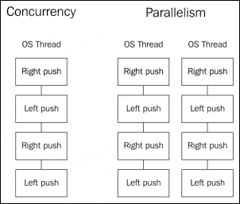
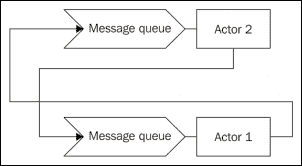
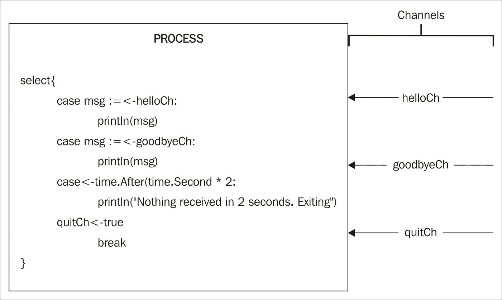

# 第八章。Go 并发简介

我们刚刚完成了在面向对象编程语言中常用到的**四人帮**设计模式。这些模式在过去几十年里被广泛使用（甚至在它们在书中被明确定义之前）。

在本章中，我们将探讨 Go 语言中的并发。我们将了解到，通过多个核心和多个进程，应用程序可以帮助我们实现更好的性能和无限的可能性。我们将探讨如何以并发安全的方式使用一些已知模式。

# 一点历史和理论

当我们谈论 Go 的并发时，不可避免地要谈到历史。在过去的几十年里，我们看到了 CPU 速度的提高，直到我们达到了由当前硬件材料、设计和架构强加的硬件限制。当我们达到这一点时，我们开始玩多核计算机，首先是双 CPU 主板，然后是具有一个以上核心的单核 CPU。

不幸的是，我们使用的语言仍然是我们在单核 CPU 时代创建的，如 Java 或 C++。虽然它们是出色的系统语言，但它们在设计上缺乏适当的并发支持。你可以在项目中使用的两种语言中通过使用第三方工具或开发自己的（这不是一件容易的任务）来开发并发应用程序。

Go 的并发设计时考虑到了这些注意事项。创造者希望有一个垃圾回收和过程式语言，这对新手来说很熟悉，但同时又可以轻松地编写并发应用程序，而不会影响语言的内核。

我们在早期章节中已经体验到了这一点。我们开发了 20 多个设计模式，而没有提及并发。这清楚地表明，Go 语言的并发特性完全独立于核心语言，同时又是其一部分，这是抽象和封装的完美例子。

计算机科学中有许多并发模型，其中最著名的是存在于**Erlang**或**Scala**等语言中的 actor 模型。另一方面，Go 使用**通信顺序进程**（**CSP**），它对并发有不同方法。

## 并发与并行

许多人误解了两者之间的区别，甚至认为它们是相同的。Go 的创造者之一 Rob Pike 有一句流行的话，“并发不是并行”，我非常赞同。作为对这次谈话的简要总结，我们可以提取以下内容：

+   并发是关于同时处理很多事情。

+   并行性是关于同时做很多事情。

并发通过设计正确的并发工作结构来启用并行性。

例如，我们可以思考自行车的机制。当我们踩踏板时，我们通常向下推踏板以产生力量（并且这种推力，也会抬起我们另一只脚对应的踏板）。我们不能同时用两只脚推，因为曲柄不允许我们这样做。但这个设计允许构建一种并行自行车，通常称为**双人自行车**。双人自行车是一种两个人可以同时骑行的自行车；他们两人都踩踏板并给自行车施加力量。

在自行车示例中，并发是自行车的结构设计，通过两条腿（Goroutines），你可以自己产生力量来推动自行车。这个设计是并发的且是正确的。如果我们使用双人自行车和两个人（两个核心），解决方案是并发的、正确的，并且是并行的。但关键在于，在并发设计中，我们不必担心并行性；如果我们并发设计正确，我们可以将其视为一个额外功能。实际上，我们可以用一个人使用双人自行车，但自行车的腿、踏板、链条、轮子的并发设计仍然是正确的。



在并发方面，在左侧，我们有一个由同一 CPU 核心顺序执行的设计和结构。一旦我们有了这个设计和结构，通过简单地在不同线程上重复这个结构，就可以实现并行性。

这就是 Go 通过简单地不过多担心并行执行，而更多地关注并发设计和结构，来简化对并发和并行程序推理的方法。将大任务分解成可以并行运行的小任务，通常在单核计算机上提供更好的性能，但如果这种设计也可以并行运行，我们就可以实现更高的吞吐量（或者不能，这取决于设计）。

事实上，我们可以在 Go 应用程序中通过设置环境变量 `GOMAXPROCS` 为我们想要的核数来设置使用的核心数。这不仅在使用调度器，如**Apache Mesos**时很有用，而且它让我们对 Go 应用程序的工作方式和性能有了更多的控制。

因此，总结一下，我们必须牢记，并发是关于结构，而并行是关于执行。我们必须考虑以更好的方式使我们的程序并发，通过将它们分解成更小的任务块，Go 的调度器将尝试在可能和允许的情况下使它们并行。

## CSP 与基于演员的并发

考虑并发的最常见和可能最直观的方式几乎与演员模型的工作方式相似。



在 actor 模型中，如果**Actor 1**想要与**Actor 2**通信，那么**Actor 1**必须首先知道**Actor 2**；例如，它必须知道它的进程 ID，可能来自创建步骤，并将消息放在它的收件箱队列中。放置消息后，如果**Actor 2**不能立即处理消息，**Actor 1**可以继续其任务而不会阻塞。

在另一方面，CSP 引入了方程中的新实体——通道。通道是进程间通信的方式，因为它们是完全匿名的（与 actor 不同，我们需要知道它们的进程 ID）。在 CSP 的情况下，我们没有进程 ID 来用于通信。相反，我们必须为进程创建一个通道，以允许传入和传出通信。在这种情况下，我们知道接收者是它用来接收数据的通道：


在这个图中，我们可以看到进程是匿名的，但我们有一个 ID 为 1 的通道，即**通道 1**，它将它们连接在一起。这种抽象并没有告诉我们通道两边的进程数量；它只是将它们连接起来，并允许通过通道进行进程间的通信。

关键在于通道隔离了两个极端，使得进程 A 可以通过一个通道发送数据，这个通道将由一个或多个对 A 透明的进程处理。反之亦然；进程 B 可以逐个接收来自多个通道的数据。

# Goroutines

在 Go 中，我们通过使用 Goroutines 来实现并发。它们就像在计算机上并发运行应用程序的进程；实际上，Go 的主循环也可以被认为是 Goroutine。Goroutines 用于我们本应使用 actor 的地方。它们执行一些逻辑然后死亡（或如果需要则继续循环）。

但 Goroutines 不是线程。我们可以启动成千上万的并发 Goroutines，甚至数百万。它们非常便宜，具有较小的增长堆栈。我们将使用 Goroutines 来执行我们想要并发工作的代码。例如，对三个服务的三个调用可以设计成三个 Goroutines 并发执行服务调用，以及一个第四个 Goroutine 来接收它们并组合响应。这里的要点是什么？如果我们有一台具有四个核心的计算机，我们可以在理论上并行运行这个服务调用，但如果我们使用单核计算机，设计仍然正确，调用将在单个核心中并发执行。通过设计并发应用程序，我们不需要担心并行执行。

回到自行车的比喻，我们用两条腿推动自行车的踏板。这是两个 Goroutine 同时推动踏板。当我们使用双人自行车时，我们总共有四个 Goroutine，可能并行工作。但我们还有两只手来处理前后刹车。对于我们的双线程自行车，总共有八个 Goroutine。实际上，我们在刹车时不会踩踏板，我们在踩踏板时不会刹车；这是一个正确的并发设计。我们的神经系统传递关于何时停止踩踏板和何时开始刹车的信息。在 Go 中，我们的神经系统由通道组成；我们将在玩了一会儿 Goroutine 之后看到它们。

## 我们的第一个 Goroutine

现在已经解释得够多了。让我们动手实践一下。对于我们的第一个 Goroutine，我们将在一个 Goroutine 中打印消息 `Hello World!`。让我们从到目前为止我们所做的一切开始：

```go
package main 

func main() { 
  helloWorld() 
} 

func helloWorld(){ 
  println("Hello World!") 
} 

Hello World! in the console:
```

```go
$ go run main.go
Hello World!

```

完全不令人印象深刻。要在一个新的 Goroutine 中运行它，我们只需要在函数调用的开头添加关键字 `go`：

```go
package main 

func main() { 
  go helloWorld() 
} 

func helloWorld(){ 
  println("Hello World!") 
} 

```

用这个简单的词，我们告诉 Go 启动一个新的 Goroutine，运行 `helloWorld` 函数的内容。

那么，让我们运行它：

```go
$ go run main.go 
$

```

什么？它什么都没打印出来！为什么？当你开始处理并发应用程序时，事情会变得复杂。问题是 `main` 函数在 `helloWorld` 函数执行之前就结束了。让我们一步一步地分析。`main` 函数开始并安排一个新的 Goroutine 来执行 `helloWorld` 函数，但函数在结束时并没有执行——它仍然处于调度过程中。

因此，我们的 `main` 问题在于 `main` 函数必须在完成之前等待 Goroutine 执行。所以让我们暂停一下，给 Goroutine 一些空间：

```go
package main 
import "time" 

func main() { 
  go helloWorld() 

  time.Sleep(time.Second) 
} 

func helloWorld(){ 
  println("Hello World!") 
} 

```

`time.Sleep` 函数有效地让主 Goroutine 睡眠一秒钟，然后再继续（并退出）。如果我们现在运行这个程序，我们必须得到以下消息：

```go
$ go run main.go
Hello World!

```

我想你现在一定注意到了程序在完成前短暂冻结的小间隙。这是睡眠函数。如果你要做很多任务，你可能想将等待时间提高到你想的任何长度。只需记住，在任何应用程序中，`main` 函数不能在其余的 Goroutine 执行之前结束。

## 作为新 Goroutine 启动的匿名函数

我们定义了 `helloWorld` 函数，以便它可以由不同的 Goroutine 启动。这并不是严格必要的，因为你可以直接在函数的作用域内启动代码片段：

```go
package main 
import "time" 

func main() { 
  go func() { 
    println("Hello World") 
  }() 
  time.Sleep(time.Second) 
} 

```

这也是有效的。我们使用了一个匿名函数，并且使用 `go` 关键字在新的 Goroutine 中启动了它。仔细看看函数的闭合括号——它们后面跟着一个开括号和一个闭括号，这表明函数的执行。

我们也可以将数据传递给匿名函数：

```go
package main 
import "time" 

func main() { 
  go func(msg string) { 
    println(msg) 
  }("Hello World") 
  time.Sleep(time.Second) 
} 

```

这也是有效的。我们定义了一个匿名函数，它接收一个字符串，然后打印接收到的字符串。当我们在一个不同的 Goroutine 中调用该函数时，我们传递了想要打印的消息。从这个意义上说，以下示例也是有效的：

```go
package main 
import "time" 

func main() { 
  messagePrinter := func(msg string) { 
    println(msg) 
  } 

  go messagePrinter("Hello World") 
  go messagePrinter("Hello goroutine") 
  time.Sleep(time.Second) 
} 

```

在这种情况下，我们在 `main` 函数的作用域内定义了一个函数，并将其存储在一个名为 `messagePrinter` 的变量中。现在我们可以通过使用 `messagePrinter(string)` 签名并发地打印我们想要的任意数量的消息：

```go
$ go run main.go
Hello World
Hello goroutine

```

我们刚刚触及了 Go 中并发编程的表面，但我们已经可以看到它可以非常强大。但我们肯定必须做些什么来处理那个睡眠期。WaitGroups 可以帮助我们解决这个问题。

## WaitGroups

WaitGroup 属于同步包（`sync` 包），它帮助我们同步多个并发 Goroutine。它工作起来非常简单——每次我们不得不等待一个 Goroutine 完成，我们就向组中添加 `1`，一旦所有这些都被添加，我们就要求组等待。当 Goroutine 完成时，它会说 `Done`，WaitGroup 将从组中减去一个：

```go
package main 

import ( 
  "sync" 
  "fmt" 
) 

func main() { 
  var wait sync.WaitGroup 
  wait.Add(1) 

  go func(){ 
    fmt.Println("Hello World!") 
    wait.Done() 
  }() 
  wait.Wait() 
} 

```

这是 WaitGroup 的最简单示例。首先，我们创建了一个变量来持有它，称为 `wait` 变量。然后，在启动新的 Goroutine 之前，我们通过使用 `wait.Add(1)` 方法告诉 WaitGroup “嘿，你将不得不等待某件事情完成”。现在我们可以启动 WaitGroup 必须等待的那个 `1`，在这个例子中是打印 `Hello World` 并在 Goroutine 结束时说 `Done`（通过使用 `wait.Done()` 方法）的之前的 Goroutine。最后，我们向 WaitGroup 表明它需要等待。我们必须记住，函数 `wait.Wait()` 可能是在 Goroutine 之前执行的。

让我们再次运行代码：

```go
$ go run main.go 
Hello World!

```

现在它只等待必要的时长，而不是多一毫秒就退出应用程序。记住，当我们使用 `Add(value)` 方法时，我们向 WaitGroup 添加实体，当我们使用 `Done()` 方法时，我们减去一个。

实际上，`Add` 函数接受一个增量值，所以以下代码与之前的代码等价：

```go
package main 

import ( 
  "sync" 
  "fmt" 
) 

func main() { 
  var wait sync.WaitGroup 
  wait.Add(1) 

  go func(){ 
    fmt.Println("Hello World!") 
    wait.Add(-1) 
  }() 
  wait.Wait() 
} 

```

在这种情况下，我们在启动 Goroutine 之前添加了 `1`，并在其末尾添加了 `-1`（减去 1）。如果我们事先知道将要启动多少个 Goroutine，我们也可以只调用一次 `Add` 方法：

```go
package main 
import ( 
  "fmt" 
  "sync" 
) 

func main() { 
  var wait sync.WaitGroup 

  goRoutines := 5 
  wait.Add(goRoutines) 

  for i := 0; i < goRoutines; i++ { 
    go func(goRoutineID int) { 
      fmt.Printf("ID:%d: Hello goroutines!\n", goRoutineID) 
      wait.Done() 
    }(i) 
  } 
  wait.Wait() 
} 

```

在这个例子中，我们将创建五个 Goroutine（如 `goroutines` 变量所述）。我们事先知道这一点，所以我们只需将它们全部添加到 WaitGroup 中。然后我们将使用 `for` 循环启动相同数量的 `goroutine` 变量。每次一个 Goroutine 完成，它都会调用 WaitGroup 的 `Done()` 方法，该 WaitGroup 实际上是在主循环的末尾等待。

再次强调，在这种情况下，代码在所有 Goroutine（如果有）启动之前就已经到达了 `main` 函数的末尾，WaitGroup 使得主流程的执行等待直到所有 `Done` 消息都被调用。让我们运行这个小程序：

```go
$ go run main.go 

ID:4: Hello goroutines!
ID:0: Hello goroutines!
ID:1: Hello goroutines!
ID:2: Hello goroutines!
ID:3: Hello goroutines!

```

我们之前没有提到过，但我们已经将迭代索引作为参数`GoroutineID`传递给每个 Goroutine，以便用消息`Hello goroutines!`打印它。您可能也注意到了 Goroutines 不是按顺序执行的。当然！我们正在处理一个不保证 Goroutine 执行顺序的调度器。这是在编写并发应用程序时需要注意的事情。实际上，如果我们再次执行它，我们不一定能得到相同的输出顺序：

```go
$ go run main.go
ID:4: Hello goroutines!
ID:2: Hello goroutines!
ID:1: Hello goroutines!
ID:3: Hello goroutines!
ID:0: Hello goroutines!

```

# 回调

现在我们知道了如何使用 WaitGroups，我们也可以引入回调的概念。如果您曾经使用过像 JavaScript 这样的语言，这些语言广泛使用回调，那么这一节对您来说将是熟悉的。回调是一个匿名函数，它将在另一个函数的上下文中执行。

例如，我们想要编写一个函数将字符串转换为大写，同时使其异步。我们如何编写这个函数以便我们可以使用回调？有一个小技巧——我们可以有一个函数，它接受一个字符串并返回一个字符串：

```go
func toUpperSync(word string) string { 
  //Code will go here 
} 

```

因此，将这个函数的返回类型（一个字符串）作为匿名函数的第二个参数，如下所示：

```go
func toUpperSync(word string, f func(string)) { 
  //Code will go here 
} 

```

现在，`toUpperSync`函数不返回任何内容，但它也接受一个函数，巧合的是，它也接受一个字符串。我们可以使用我们将通常返回的结果来执行这个函数。

```go
func toUpperSync(word string, f func(string)) { 
  f(strings.ToUpper(word)) 
} 

```

我们使用调用`strings.ToUpper`方法的结果（它返回大写单词`parameter`）来执行`f`函数。让我们也写一下`main`函数：

```go
package main 

import ( 
  "fmt" 
  "strings" 
) 

func main() { 
  toUpperSync("Hello Callbacks!", func(v string) {   
    fmt.Printf("Callback: %s\n", v) }) 
} 

func toUpperSync(word string, f func(string)) { 
  f(strings.ToUpper(word)) 
} 

```

在我们的主代码中，我们定义了我们的回调。如您所见，我们将测试`Hello Callbacks!`传递给它以将其转换为大写。接下来，我们传递回调以执行，我们将字符串传递给大写的结果。在这种情况下，我们只是在控制台前加上文本`Callback`来打印文本。当我们执行这段代码时，我们得到以下结果：

```go
$ go run main.go
Callback: HELLO CALLBACKS!

```

严格来说，这是一个同步回调。要使其异步，我们必须引入一些并发处理：

```go
package main 
import ( 
  "fmt" 
  "strings" 
  "sync" 
) 

var wait sync.WaitGroup 

func main() { 
  wait.Add(1) 

  toUpperAsync("Hello Callbacks!", func(v string) { 
    fmt.Printf("Callback: %s\n", v) 
    wait.Done() 
  }) 

  println("Waiting async response...") 
  wait.Wait() 
} 

func toUpperAsync(word string, f func(string)) { 
  go func(){ 
    f(strings.ToUpper(word)) 
  }() 
} 

```

这段代码是以异步方式执行的。我们使用 WaitGroups 来处理并发（我们稍后会看到通道也可以用于此）。现在，我们的函数`toUpperAsync`正如其名所示，是异步的。我们在调用回调时使用关键字`go`在另一个 Goroutine 中启动了回调。我们写了一条小消息来更精确地显示并发执行中的顺序性。我们等待回调信号表示已完成，然后我们可以安全地退出程序。当我们执行这段代码时，我们得到以下结果：

```go
$ go run main.go 

Waiting async response...
Callback: HELLO CALLBACKS!

```

如您所见，程序在执行`toUpperAsync`函数中的回调之前就到达了`main`函数的末尾。这种模式带来了许多可能性，但让我们面临一个称为回调地狱的大问题。

## 回调地狱

术语 **回调地狱** 通常用来指代当许多回调层层嵌套在一起时的情况。这使得它们在增长过多时难以推理和处理。例如，使用之前相同的代码，我们可以将另一个异步调用与之前打印到控制台的内容堆叠起来：

```go
func main() { 
  wait.Add(1) 

  toUpperAsync("Hello Callbacks!", func(v string) { 
    toUpperAsync(fmt.Sprintf("Callback: %s\n", v), func(v string) { 
      fmt.Printf("Callback within %s", v) 
      wait.Done() 
    }) 
  }) 
  println("Waiting async response...") 
  wait.Wait() 
} 

```

（我们省略了导入、包名和 `toUpperAsync` 函数，因为它们没有变化。）现在我们有一个 `toUpperAsync` 函数在另一个 `toUpperAsync` 函数内部，如果我们想的话，可以嵌入更多。在这种情况下，我们再次传递之前打印到控制台上的文本，以便在下一个回调中使用。内部回调最终将其打印到控制台，得到以下输出：

```go
$ go run main.go 
Waiting async response...
Callback within CALLBACK: HELLO CALLBACKS!

```

在这种情况下，我们可以假设外部回调将在内部回调之前执行。这就是为什么我们不需要向 WaitGroup 添加另一个的原因。

这里的要点是，在使用回调时我们必须小心。在非常复杂的系统中，太多的回调难以推理和处理。但是，只要小心和理性，它们是强大的工具。

# 互斥锁

如果你正在处理并发应用程序，你必须处理多个资源可能访问某些内存位置的情况。这通常被称为 **竞态条件**。

简单来说，竞态条件类似于两个人试图同时拿到最后一片披萨的那一刻——他们的手撞在一起。将披萨替换为一个变量，将他们的手替换为 Goroutines，我们就会有一个完美的类比。

桌上有一个角色可以解决这个问题——父亲或母亲。他们将披萨放在另一张桌子上，我们必须在拿到披萨片之前请求许可。无论所有孩子是否同时请求——他们只会允许一个孩子站起来。

好吧，互斥锁就像我们的父母一样。他们会控制谁可以访问披萨——我的意思是，一个变量——并且不允许其他人访问它。

要使用互斥锁（mutex），我们必须主动锁定它；如果它已经被锁定（另一个 Goroutine 正在使用它），我们就必须等待它再次解锁。一旦我们获得对互斥锁的访问权限，我们可以再次锁定它，进行所需的任何修改，然后再次解锁。我们将通过一个示例来查看这一点。

## 使用互斥锁的示例 - 并发计数器

互斥锁在并发编程中被广泛使用。也许在 Go 中不是那么多，因为 Go 在使用通道进行并发编程时有一个更符合语法的编程方式，但了解它们是如何工作的对于通道不适合的情况是很有价值的。

对于我们的示例，我们将开发一个小型的并发计数器。这个计数器将向 `Counter` 类型的整数字段加一。这应该以并发安全的方式进行。

我们的 `Counter` 结构定义如下：

```go
type Counter struct { 
  sync.Mutex 
  value int 
} 

```

`Counter`结构有一个`int`类型的字段，用于存储计数的当前值。它还嵌入了`sync`包中的`Mutex`类型。嵌入这个字段将允许我们在不主动调用特定字段的情况下锁定和解锁整个结构。

我们的`main`函数启动了 10 个 Goroutines，这些 Goroutines 试图将`Counter`结构字段的值加一。所有这些都是在并发中完成的：

```go
package main 

import ( 
  "sync" 
  "time" 
) 

func main() { 
  counter := Counter{} 

  for i := 0; i < 10; i++ { 
    go func(i int) { 
      counter.Lock() 
      counter.value++ 
      defer counter.Unlock() 
    }(i) 
  } 
  time.Sleep(time.Second) 

  counter.Lock() 
  defer counter.Unlock() 

  println(counter.value) 
} 

```

我们创建了一个名为`Counter`的类型。使用`for`循环，我们总共启动了 10 个 Goroutines，正如我们在*作为新 Goroutines 启动的匿名函数*部分所看到的。但在每个 Goroutine 内部，我们锁定计数器，以便没有更多的 Goroutines 可以访问它，将`1`添加到字段值，然后再解锁，以便其他人可以访问它。

最后，我们将打印计数器持有的值。它必须是 10，因为我们已经启动了 10 个 Goroutines。

但我们如何知道这个程序是线程安全的呢？嗯，Go 自带一个非常实用的内置功能，称为“竞争检测器”。

## 展示竞争检测器

我们已经知道什么是竞争条件。为了回顾，当两个进程试图在同一个时间访问相同的资源，并且涉及一个或多个写操作（两个进程都写或一个进程写而另一个读）时，就会使用它。

Go 有一个非常实用的工具可以帮助诊断竞争条件，你可以在测试或主应用程序中直接运行它。所以让我们重用我们刚刚为*互斥锁*部分编写的示例，并使用竞争检测器运行它。这就像在我们的程序命令执行中添加`-race`命令行标志一样简单：

```go
$ go run -race main.go 
10

```

嗯，不是很令人印象深刻，对吧？但实际上，它告诉我们，它没有在程序的代码中检测到潜在的竞争条件。让我们通过在修改`counter`之前不锁定它来让`-race`标志的检测器警告我们可能存在的竞争条件：

```go
for i := 0; i < 10; i++ { 
  go func(i int) { 
    //counter.Lock() 
    counter.value++ 
    //counter.Unlock() 
  }(i) 
} 

```

在`for`循环中，在将`1`添加到字段值之前和之后，注释掉`Lock`和`Unlock`调用。这将引入竞争条件。让我们再次运行相同的程序，并激活竞争标志：

```go
$ go run -race main.go 
==================
WARNING: DATA RACE
Read at 0x00c42007a068 by goroutine 6:
 main.main.func1()
 [some_path]/concurrency/locks/main.go:19 +0x44
Previous write at 0x00c42007a068 by goroutine 5:
 main.main.func1()
 [some_path]/concurrency/locks/main.go:19 +0x60
Goroutine 6 (running) created at:
 main.main()
 [some_path]/concurrency/locks/main.go:21 +0xb6
Goroutine 5 (finished) created at:
 main.main()
 [some_path]/concurrency/locks/main.go:21 +0xb6
==================
10
Found 1 data race(s)
exit status 66

```

我已经减少了输出，以便更清楚地看到事情。我们可以看到一个大的、大写的信息，读取`WARNING: DATA RACE`。但这个输出很容易理解。首先，它告诉我们，在我们的`main.go`文件的*第 19 行*上，有一个内存位置正在读取某个变量。但在同一文件的*第 19 行*也有写操作！

这是因为一个"`++`"操作需要读取当前值并将其加一。这就是为什么竞争条件出现在同一行，因为每次执行时都会读取并写入`Counter`结构中的字段。

但让我们记住，竞争检测器在运行时工作。它不会静态分析我们的代码！这意味着什么？这意味着我们可能有一个潜在的设计竞争条件，竞争检测器将无法检测到。例如：

```go
package main 

import "sync" 

type Counter struct { 
  sync.Mutex 
  value int 
} 

func main() { 
  counter := Counter{} 

  for i := 0; i < 1; i++ { 
    go func(i int) { 
      counter.value++ 
    }(i) 
  } 
} 

```

我们将保留前面示例中的代码。我们将从代码中移除所有锁和解锁操作，并启动一个单独的 Goroutine 来更新`value`字段：

```go
$ go run -race main.go
$

```

没有警告，所以代码是正确的。然而，我们知道，按照设计，它并不是。我们可以将执行的 Goroutines 数量提高到两个，看看会发生什么：

```go
for i := 0; i < 2; i++ { 
  go func(i int) { 
    counter.value++ 
  }(i) 
} 

```

让我们再次执行程序：

```go
$ go run -race main.go
WARNING: DATA RACE
Read at 0x00c42007a008 by goroutine 6:
 main.main.func1()
 [some_path]concurrency/race_detector/main.go:15 +0x44
Previous write at 0x00c42007a008 by goroutine 5:
 main.main.func1()
 [some_path]/concurrency/race_detector/main.go:15 +0x60
Goroutine 6 (running) created at:
 main.main()
 [some_path]/concurrency/race_detector/main.go:16 +0xad
Goroutine 5 (finished) created at:
 main.main()
 [some_path]/concurrency/race_detector/main.go:16 +0xad
==================
Found 1 data race(s)
exit status 66

```

现在，是的，检测到了竞争条件。但如果我们减少使用的处理器数量到只有一个呢？我们也会出现竞争条件吗？

```go
$ GOMAXPROCS=1 go run -race main.go
$

```

看起来没有检测到竞争条件。这是因为调度器首先执行了一个 Goroutine，然后是另一个，所以最终没有发生竞争条件。但是，即使只使用一个核心，更高的 Goroutines 数量也会警告我们存在竞争条件。

因此，竞争检测器可以帮助我们检测代码中正在发生的竞争条件，但它不会保护我们免受那些不会立即执行竞争条件的糟糕设计的影响。这是一个非常有用的功能，可以让我们避免许多头疼的问题。

# Channels

Channels 是 Go 语言中的第二个基本元素，它允许我们编写并发应用程序。我们在*通信顺序进程*部分已经谈到了一些关于 channel 的内容。

Channels 是我们进程间通信的方式。我们可能会共享一个内存位置，并使用互斥锁来控制进程的访问。但 channels 为我们提供了一种更自然的方式来处理并发应用程序，这也会在我们的程序中产生更好的并发设计。

## 我们的第一个 channel

如果我们无法在它们之间创建一些同步，那么与许多 Goroutines 一起工作似乎相当困难。一旦它们同步，执行顺序可能就无关紧要了。Channels 是 Go 中编写并发应用程序的第二个关键特性。

在现实生活中，电视频道是将发射（来自工作室）连接到数百万台电视（接收器）的东西。Go 中的 channel 以类似的方式工作。一个或多个 Goroutines 可以作为发射器工作，一个或多个 Goroutine 可以作为接收器工作。

还有一点，channels 默认情况下会阻塞 Goroutines 的执行，直到接收到某些东西。这就像我们最喜欢的电视剧延迟播出，直到我们打开电视，这样我们就不会错过任何内容。

在 Go 中是如何做到这一点的？

```go
package main 

import "fmt" 

func main() { 
  channel := make(chan string) 
  go func() { 
    channel <- "Hello World!" 
  }() 

  message := <-channel 
  fmt.Println(message) 
} 

```

在 Go 中创建 channel 时，我们使用与创建切片相同的语法。`make`关键字用于创建 channel，我们必须传递关键字`chan`以及 channel 将要传输的类型，在这种情况下是字符串。有了这个，我们就有一个名为`channel`的阻塞 channel。接下来，我们启动一个 Goroutine，将消息`Hello World!`发送到 channel。这通过直观的箭头表示流程——`Hello World!`文本流向（`<-`）一个 channel。这就像在变量中赋值一样工作，因此我们只能通过首先写出 channel，然后是箭头，最后是传递的值来向 channel 传递东西。我们不能写出`"Hello World!" -> channel`。

如我们之前提到的，这个通道会阻塞 Goroutines 的执行，直到接收到消息。在这种情况下，`main`函数的执行被停止，直到从启动的 Goroutines 发送的消息到达通道的另一端，在`message := <-channel`这一行。在这种情况下，箭头指向同一方向，但它放在通道之前，表示数据正在从通道中提取并分配给一个名为`message`的新变量（使用新的赋值操作符"`:=`"）。

在这种情况下，我们不需要使用 WaitGroup 来同步`main`函数与创建的 Goroutines，因为通道的默认性质是阻塞直到接收到数据。但是反过来呢？如果 Goroutine 发送消息时没有接收者，它会继续吗？让我们编辑这个例子来看看：

```go
package main 

import ( 
  "fmt" 
  "time" 
) 

func main() { 
  channel := make(chan string) 

  var waitGroup sync.WaitGroup 

  waitGroup.Add(1) 
  go func() { 
    channel <- "Hello World!" 
    println("Finishing goroutine") 
    waitGroup.Done() 
  }() 

  time.Sleep(time.Second) 
  message := <-channel 
  fmt.Println(message) 
  waitGroup.Wait() 
} 

```

我们将再次使用`Sleep`函数。在这种情况下，当 Goroutine 完成时，我们打印一条消息。与`main`函数中的主要区别在于，现在我们在监听通道以获取数据之前等待一秒钟：

```go
$ go run main.go

Finishing goroutine
Hello World!

```

输出可能不同，因为，同样地，执行顺序没有保证，但现在我们可以看到，直到一秒钟过去之前，没有任何消息被打印出来。在初始延迟之后，我们开始监听通道，获取数据，并打印它。因此，发射器也必须等待来自通道另一侧的提示才能继续执行。

为了回顾，通道是通过在一端发送数据并在另一端接收数据（就像管道一样）来在 Goroutines 之间进行通信的方式。在它们的默认状态下，发射器 Goroutine 会阻塞其执行，直到接收器 Goroutine 获取数据。同样，接收器 Goroutine 也会阻塞，直到某个发射器通过通道发送数据。因此，你可以有被动的监听者（等待数据）或被动的发射器（等待监听者）。

## 缓冲通道

缓冲通道的工作方式与默认的非缓冲通道类似。你同样可以通过使用箭头从它们中传递和获取值，但与未缓冲通道不同，发送者不需要等待某个 Goroutine 取走它们发送的数据：

```go
package main 

import ( 
  "fmt" 
  "time" 
) 

func main() { 
  channel := make(chan string, 1) 

  go func() { 
    channel <- "Hello World!" 
    println("Finishing goroutine") 
  }() 

  time.Sleep(time.Second) 

  message := <-channel 
  fmt.Println(message) 
} 

```

这个例子就像我们最初用于通道的例子一样，但现在我们在`make`语句中将通道的容量设置为 1。通过这种方式，我们告诉编译器，在阻塞之前，这个通道有一个字符串的容量。所以第一个字符串不会阻塞发射器，但第二个会。让我们运行这个例子：

```go
$ go run main.go

Finishing goroutine
Hello World!

```

现在，我们可以运行这个小程序无数次——输出将始终以相同的顺序出现。这次，我们启动了并发函数并等待了一秒钟。之前，匿名函数不会继续执行，直到第二秒过去并且有人可以取走发送的数据。在这种情况下，使用带缓冲的通道，数据被保持在通道中，并允许 Goroutine 继续其执行。在这种情况下，Goroutine 总是会在等待时间过去之前完成。

这个新通道的大小为 1，因此第二个消息将会阻塞 Goroutine 的执行：

```go
package main 

import ( 
  "fmt" 
  "time" 
) 

func main() { 
  channel := make(chan string, 1) 

  go func() { 
    channel <- "Hello World! 1" 
    channel <- "Hello World! 2" 
    println("Finishing goroutine") 
  }() 

  time.Sleep(time.Second) 

  message := <-channel 
  fmt.Println(message) 
} 

```

这里，我们添加了第二条`Hello world! 2`消息，并给它提供了一个索引。在这种情况下，这个程序的输出可能如下所示：

```go
$ go run main.go
Hello World! 1

```

表示我们刚刚从通道缓冲区中取出了一条消息，并打印了它，在启动的 Goroutine 完成之前，`main`函数已经结束。当发送第二条消息时，Goroutine 被阻塞，直到另一端取走第一条消息。然后它打印得如此之快，以至于没有时间打印消息来显示 Goroutine 的结束。如果你在控制台持续执行程序，迟早调度器会在主线程之前完成 Goroutine 的执行。

## 方向性通道

关于 Go 通道的一个酷特性是，当我们将它们作为参数使用时，我们可以限制它们的方向性，使得它们只能用于发送或接收。如果在一个受限的方向上使用通道，编译器会报错。这个特性为 Go 应用带来了新的静态类型级别，使得代码更加易于理解和阅读。

我们将用一个简单的通道示例来展示：

```go
package main 

import ( 
  "fmt" 
  "time" 
) 

func main() { 
  channel := make(chan string, 1) 

 go func(ch chan<- string) { 
    ch <- "Hello World!" 
    println("Finishing goroutine") 
  }(channel) 

  time.Sleep(time.Second) 

  message := <-channel 
  fmt.Println(message) 
} 

```

我们启动新 Goroutine 的行`go func(ch chan<- string)`表示传递给这个函数的通道只能用作输入通道，你不能监听它。

我们也可以传递一个仅用作接收通道的通道：

```go
func receivingCh(ch <-chan string) { 
  msg := <-ch 
  println(msg) 
} 

```

如你所见，箭头位于关键字`chan`的对面，表示从通道中提取操作。请记住，通道箭头始终指向左边，表示接收通道，它必须位于左边，而表示插入通道，它必须位于右边。

如果我们尝试通过这个*只接收*通道发送一个值，编译器会对此报错：

```go
func receivingCh(ch <-chan string) { 
  msg := <-ch 
  println(msg) 
  ch <- "hello" 
} 

```

这个函数有一个只接收的通道，我们将尝试通过它发送消息`hello`。让我们看看编译器会说什么：

```go
$ go run main.go
./main.go:20: invalid operation: ch <- "hello2" (send to receive-only type <-chan string)

```

它不喜欢它，并要求我们进行修正。现在代码的阅读性和安全性都得到了提升，我们已经在`chan`参数前或后放置了一个箭头。

## 选择语句

选择语句也是 Go 中的一个关键特性。它用于在 Goroutine 中处理多个通道输入。实际上，它打开了众多可能性，我们将在接下来的章节中广泛使用它。



在 `select` 结构中，我们要求程序在多个通道中选择一个或多个来接收它们的数据。我们可以在变量中保存这些数据，并在完成 select 之前对其进行处理。`select` 结构只执行一次；如果它正在监听更多通道，它也只会执行一次，代码将继续执行。如果我们想让它多次处理相同的通道，我们必须将其放入 `for` 循环中。

我们将创建一个小程序，它将向同一个 Goroutine 发送消息 `hello` 和消息 `goodbye`，该 Goroutine 将打印它们，并在五秒钟内没有收到其他任何消息时退出。

首先，我们将创建一个通用的函数，通过通道发送字符串：

```go
func sendString(ch chan<- string, s string) { 
  ch <- s 
} 

```

现在，我们可以通过简单地调用 `sendString` 方法在通道上发送字符串。现在是接收者的时间。接收者将接收来自两个通道的消息——发送 `hello` 消息的通道和发送 `goodbye` 消息的通道。你也可以在之前的图中看到这一点：

```go
func receiver(helloCh, goodbyeCh <-chan string, quitCh chan<- bool) { 
  for { 
    select { 
    case msg := <-helloCh: 
      println(msg) 
    case msg := <-goodbyeCh: 
      println(msg) 
    case <-time.After(time.Second * 2): 
      println("Nothing received in 2 seconds. Exiting") 
      quitCh <- true 
      break 
    } 
  } 
} 

```

让我们从参数开始。这个函数接受三个通道——两个接收通道和一个通过它发送东西的通道。然后，它使用 `for` 关键字启动一个无限循环。这样我们就可以永远监听两个通道。

在 `select` 块的作用域内，我们必须为每个我们想要处理的通道使用一个 case（你有没有意识到它和 `switch` 语句多么相似？）。让我们一步一步地看看三个 case：

+   第一个情况从 `helloCh` 参数接收传入的数据，并将其保存到名为 `msg` 的变量中。然后它打印了这个变量的内容。

+   第二个情况从 `goodbyeCh` 参数接收传入的数据，并将其保存到名为 `msg` 的变量中。然后它还打印了这个变量的内容。

+   第三个情况非常有趣。它调用了 `time` 函数。之后，如果我们检查它的签名，它接受一个时间和持续时间值，并返回一个接收通道。这个接收通道将接收一个时间，即在指定持续时间过后 `time` 的值。在我们的例子中，我们使用它返回的通道作为超时。因为 select 在每次处理后会重新启动，计时器也会重新启动。这是一种非常简单的方法，为等待一个或多个通道响应的 Goroutine 设置计时器。

一切都为 `main` 函数准备好了：

```go
package main 
import "time" 

func main() { 
  helloCh := make(chan string, 1) 
  goodbyeCh := make(chan string, 1) 
  quitCh := make(chan bool) 
  go receiver(helloCh, goodbyeCh, quitCh) 

  go sendString(helloCh, "hello!") 

  time.Sleep(time.Second) 

  go sendString(goodbyeCh, "goodbye!") 
  <-quitCh 
} 

```

再次，一步一步地，我们创建了在这个练习中需要的三个通道。然后，我们在不同的 Goroutine 中启动了我们的 `receiver` 函数。这个 Goroutine 由 Go 的调度器处理，我们的程序继续运行。我们启动了一个新的 Goroutine 来向 `helloCh` 参数发送消息 `hello`。同样，这最终会在 Go 的调度器决定时发生。

我们的程序再次继续并等待一秒钟。在这个中断期间，Go 的调度器将有时间执行接收器和第一条消息（如果尚未执行），因此 `hello!` 消息将在中断期间出现在控制台上。

在一个新的 Goroutine 中通过 `goodbye` 通道发送了一条包含 `goodbye!` 文本的新消息，我们的程序再次继续到等待 `quitCh` 参数中传入消息的行。

我们已经启动了三个 Goroutines——接收器仍在运行，第一条消息在`select`语句处理消息时已经完成，第二条消息几乎立即打印出来并也已完成。所以此刻只有接收器在运行，如果接下来两秒内没有接收到其他消息，它将处理来自`time`结构的传入消息。在`channel`类型之后，打印一条消息表示它正在退出，向`quitCh`发送一个`true`，并跳出它正在循环的无穷循环。

让我们运行这个小应用程序：

```go
$ go run main.go

hello!
goodbye!
Nothing received in 2 seconds. Exiting

```

结果可能不太引人注目，但概念是清晰的。我们可以通过使用 select 语句在同一个 Goroutine 中处理多个传入通道。

## 通道的遍历！

我们将要看到的关于通道的最后一个特性是遍历通道。我们正在讨论 range 关键字。我们已经广泛地使用它来遍历列表，我们也可以用它来遍历通道：

```go
package main 

import "time" 

func main() { 
  ch := make(chan int) 

  go func() { 
    ch <- 1 
    time.Sleep(time.Second) 

    ch <- 2 

    close(ch) 
  }() 
  for v := range ch { 
    println(v) 
  } 
} 

```

在这种情况下，我们创建了一个无缓冲的通道，但它也可以与缓冲通道一起工作。我们在一个新的 Goroutine 中启动了一个函数，该函数通过通道发送数字 "1"，等待一秒，然后发送数字 "2"，并关闭通道。

最后一步是遍历通道。语法与列表范围非常相似。我们将来自通道的传入数据存储在变量 `v` 中，并将此变量打印到控制台。range 会持续迭代，直到通道关闭，从通道中获取数据。

你能猜出这个小程序的输出吗？

```go
$ go run main.go

1
2

```

再次，并不十分引人注目。它打印数字 "1"，然后等待一秒，打印数字 "2"，并退出应用程序。

根据这个并发应用程序的设计，范围遍历可能的传入数据

通道

直到并发 Goroutine 关闭这个通道。在那个时刻，range 完成，应用程序可以退出。

Range 在从通道获取数据时非常有用，它通常用于扇入模式，其中许多不同的 Goroutines 将数据发送到同一个通道。

# 使用它所有 - 并发单例

现在我们已经知道了如何创建 Goroutines 和通道，我们将所有知识放在一个单独的包中。回想一下前几章，当我们解释单例模式时——它是在我们的代码中只能存在一次的结构或变量。对这个结构的所有访问都应该使用所描述的模式进行，但实际上它并不是并发安全的。

现在，我们将考虑到并发来编写代码。我们将编写一个并发计数器，就像我们在 *互斥锁* 部分所写的那样，但这次我们将使用通道来解决它。

## 单元测试

为了限制对 `singleton` 实例的并发访问，只有一个 Goroutine 能够访问它。我们将使用通道来访问它——第一个用于加一，第二个用于获取当前计数，第三个用于停止 Goroutine。

我们将使用 10,000 个不同的 Goroutine，从两个不同的 `singleton` 实例启动，来加一 10,000 次。然后，我们将引入一个循环来检查 `singleton` 的计数，直到它达到 5,000，但我们将先写出循环开始前的计数。

当计数达到 5,000 时，循环将退出，并停止运行的 Goroutine——测试代码如下：

```go
package channel_singleton 
import ( 
  "testing" 
  "time" 
  "fmt" 
) 

func TestStartInstance(t *testing.T) { 
  singleton := GetInstance() 
  singleton2 := GetInstance() 

  n := 5000 

  for i := 0; i < n; i++ { 
    go singleton.AddOne() 
    go singleton2.AddOne() 
  } 

  fmt.Printf("Before loop, current count is %d\n", singleton.GetCount()) 

  var val int 
  for val != n*2 { 
    val = singleton.GetCount() 
    time.Sleep(10 * time.Millisecond) 
  } 
  singleton.Stop() 
} 

```

在这里，我们可以看到我们将使用的完整测试。在创建了两个 `singleton` 实例之后，我们创建了一个 `for` 循环，从每个实例启动 `AddOne` 方法 5,000 次。这还没有发生；它们正在被调度，最终将被执行。我们正在打印 `singleton` 实例的计数，以便清楚地看到这个可能性；根据计算机的不同，它将打印一个大于 0 且小于 10,000 的数字。

在停止保持计数的 Goroutine 之前，最后一步是进入一个循环，检查计数的值，如果值不是预期的值（10,000），则等待 10 毫秒。一旦达到这个值，循环将退出，我们就可以停止 `singleton` 实例。

我们将直接跳到实现，因为要求非常简单。

## 实现

首先，我们将创建一个将保持计数的 Goroutine：

```go
var addCh chan bool = make(chan bool) 
var getCountCh chan chan int = make(chan chan int) 
var quitCh chan bool = make(chan bool) 

func init() { 
  var count int 

  go func(addCh <-chan bool, getCountCh <-chan chan int, quitCh <-chan bool) { 
    for { 
      select { 
      case <-addCh: 
        count++ 
      case ch := <-getCountCh: 
        ch <- count 
      case <-quitCh: 
        return 
      } 
    } 
  }(addCh, getCountCh, quitCh) 
} 

```

正如我们之前提到的，我们创建了三个通道：

+   `addCh` 通道用于与将计数加一的动作进行通信，并接收一个 `bool` 类型的值，仅用于表示“加一”（我们不需要发送数字，尽管我们可以）。

+   `getCountCh` 通道将返回一个通道，该通道将接收计数的当前值。花点时间来思考一下 `getCountCh` 通道——这是一个接收接收整数类型的通道的通道。听起来有点复杂，但当我们完成示例后，你就会明白，不用担心。

+   `quitCh` 通道将通知 Goroutine 它应该结束其无限循环并自行结束。

现在我们有了执行我们想要执行的操作所需的通道。接下来，我们启动一个传递通道作为参数的 Goroutine。正如你所看到的，我们限制了通道的方向，以提供更多的类型安全性。在这个 Goroutine 内部，我们创建了一个无限 `for` 循环。这个循环将不会停止，直到其中执行了 `break`。

最后，如果你还记得，`select` 语句是一种同时从不同通道接收数据的方法。我们有三种情况，所以我们要监听作为参数传入的三个输入通道：

+   `addCh` 的情况会将计数加一。记住，在每次迭代中只能执行一个情况，这样就没有任何 Goroutine 能够在加一完成之前访问当前的计数。

+   `getCountCh` 通道接收一个接收整数的通道，因此我们捕获这个新通道并通过它发送当前值到另一端。

+   `quitCh` 通道中断 `for` 循环，因此 Goroutine 结束。

最后一件事情。任何包中的 `init()` 函数在程序执行时都会被执行，所以我们不需要担心从我们的代码中特别执行这个函数。

现在，我们将创建测试所期望的类型。我们将看到所有魔法和逻辑都隐藏在这个类型中（正如我们在测试代码中所看到的）：

```go
type singleton struct {} 

var instance singleton 
func GetInstance() *singleton { 
  return &instance 
} 

```

`singleton` 类型的工作方式与它在第二章中的工作方式相似，*创建型模式 - 单例、建造者、工厂、原型和抽象工厂*，但这次它不会持有计数值。我们为它创建了一个局部值，称为 `instance`，当我们调用 `GetInstance()` 方法时，我们返回这个实例的指针。这样做并不严格必要，但每次我们想要访问计数值变量时，我们不需要分配 `singleton` 类型的新的实例。

首先，`AddOne()` 方法必须将当前计数加一。如何做？通过向 `addCh` 通道发送 `true`。很简单：

```go
func (s *singleton) AddOne() { 
  addCh <- true 
} 

addCh case in our Goroutine in turn. The addCh case simply executes count++ and finishes, letting select channel control flow that is executed on init function above to execute the next instruction:
```

```go
func (s *singleton) GetCount() int { 
  resCh := make(chan int) 
  defer close(resCh) 
  getCountCh <- resCh 
  return <-resCh 
} 

```

`GetCount` 方法每次被调用时都会创建一个通道，并在函数结束时延迟关闭它的动作。这个通道是无缓冲的，正如我们在本章前面所看到的。一个无缓冲的通道在接收到数据之前会阻塞执行。因此，我们将这个通道发送到 `getCountCh`，它也是一个通道，并且实际上期望通过它发送当前的计数值。`GetCount()` 方法将不会返回，直到 `count` 变量的值到达 `resCh` 通道。

你可能会想，为什么我们不在两个方向上使用相同的通道来接收计数值？这样我们可以避免分配。好吧，如果我们使用 `GetCount()` 方法中的相同通道，这个通道将有两个监听器--一个在文件的开始处的 `select` 语句中，另一个在 `init` 函数的开始处，所以发送值回传时可能会解析到任何一个：

```go
func (s *singleton) Stop() { 
  quitCh <- true 
  close(addCh) 
  close(getCountCh) 
  close(quitCh) 
} 

```

最后，我们必须在某个时刻停止 Goroutine。`Stop` 方法将值发送到 `singleton` 类型的 Goroutine，从而触发 `quitCh` 的情况并中断 `for` 循环。下一步是关闭所有通道，这样就不能再通过它们发送数据了。当你知道你不会再使用一些通道时，这非常方便。

执行测试并查看时间：

```go
$ go test -v .
=== RUN   TestStartInstance
Before loop, current count is 4911
--- PASS: TestStartInstance (0.03s)
PASS
ok

```

代码输出非常少，但一切如预期般工作。在测试中，我们在进入迭代直到达到 10,000 这个值的循环之前打印了计数器的值。正如我们之前所看到的，Go 调度器会尝试使用你通过`GOMAXPROCS`配置设置的尽可能多的操作系统线程来运行 Goroutines 的内容。在我的电脑上，它被设置为`4`，因为我的电脑有四个核心。但关键是，我们可以看到在启动 Goroutine（或 10,000 个）之后和下一执行行之间会发生很多事情。

但它的互斥锁（mutexes）的使用又是如何呢？

```go
type singleton struct { 
  count int 
  sync.RWMutex 
} 

var instance singleton 

func GetInstance() *singleton { 
  return &instance 
} 

func (s *singleton) AddOne() { 
  s.Lock() 
  defer s.Unlock() 
  s.count++ 
} 

func (s *singleton) GetCount()int { 
  s.RLock() 
  defer s.RUnlock() 
  return s.count 
} 

```

在这个例子中，代码更加简洁。正如我们之前所看到的，我们可以在`singleton`结构体内部嵌入互斥锁。计数器也保存在`count`字段中，`AddOne()`和`GetCount()`方法锁定和解锁要并发安全的值。

还有一件事。在这个`singleton`实例中，我们使用的是`RWMutex`类型而不是已知的`sync.Mutex`类型。这里的主要区别在于`RWMutex`类型有两种锁——读锁和写锁。通过调用`RLock`方法执行的读锁，只有在当前有一个写锁活动时才会等待。同时，它只阻止写锁，这样就可以并行执行许多读操作。这很有意义；我们不希望因为另一个 Goroutine 也在读取值而阻塞想要读取值的 Goroutine——它不会改变。`sync.RWMutex`类型帮助我们实现代码中的这种逻辑。

# 总结

我们已经看到了如何使用互斥锁和通道（channels）编写并发单例（Singleton）。虽然通道的例子更为复杂，但它也展示了 Go 并发机制的核心力量，因为你可以通过简单地使用通道来实现复杂的事件驱动架构。

只需记住，如果你以前没有编写过并发代码，可能需要一些时间才能开始以舒适的方式并发思考。但这是练习可以解决的问题。

我们已经看到了设计并发应用程序以在程序中实现并行性的重要性。我们已经处理了 Go 的大多数原语来编写并发应用程序，现在我们可以编写常见的并发设计模式。
