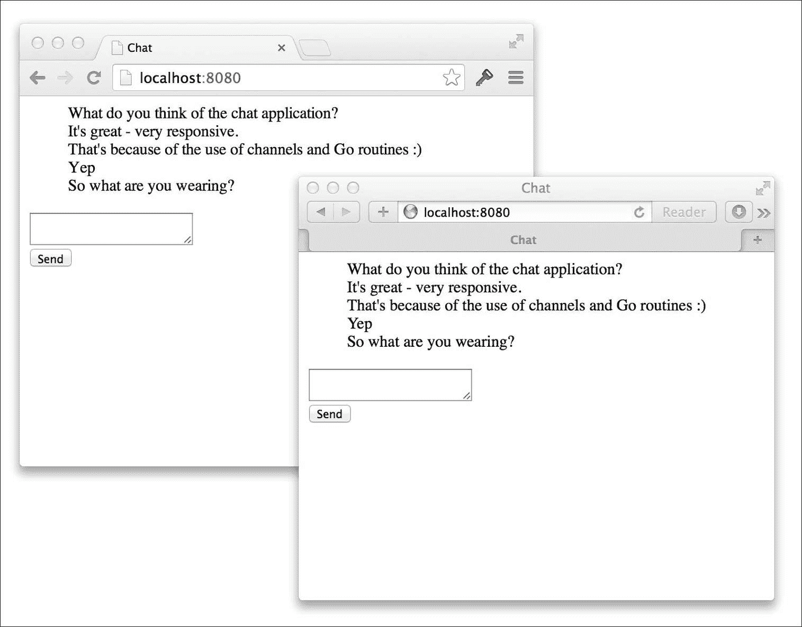
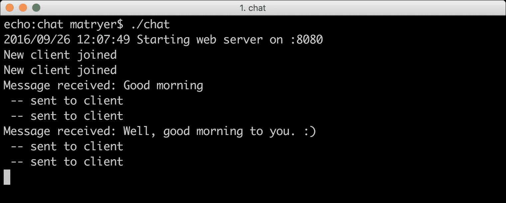

# 第一章. 基于 WebSocket 的聊天应用程序

Go 是编写高性能、并发服务器应用程序和工具的绝佳选择，而网络是交付它们的完美媒介。如今，很难找到不是网络化的设备，这使得我们可以构建一个针对几乎所有平台和设备的单一应用程序。

我们的第一个项目将是一个基于网络的聊天应用程序，它允许多个用户在他们的网络浏览器中进行实时对话。惯用的 Go 应用程序通常由许多包组成，这些包通过在不同的文件夹中放置代码来组织，Go 标准库也是如此。我们将从使用 `net/http` 包构建一个简单的网络服务器开始，该服务器将提供 HTML 文件。然后我们将继续添加对 WebSocket 的支持，我们的消息将通过它流动。

在 C#、Java 或 Node.js 等语言中，需要使用复杂的线程代码和锁的巧妙使用来保持所有客户端的同步。正如我们将看到的，Go 通过其内置的通道和并发范式极大地帮助我们。

在本章中，您将学习如何：

+   使用 `net/http` 包来服务 HTTP 请求

+   向用户浏览器提供模板驱动的内容

+   满足 Go 接口以构建我们自己的 `http.Handler` 类型

+   使用 Go 的 goroutines 允许应用程序并发执行多个任务

+   使用通道在运行的 goroutines 之间共享信息

+   将 HTTP 请求升级以使用现代功能，如 WebSocket

+   向应用程序添加跟踪以更好地理解其内部工作原理

+   使用测试驱动开发实践编写一个完整的 Go 包

+   通过导出接口返回未导出类型

### 注意

本项目的完整源代码可以在 [`github.com/matryer/goblueprints/tree/master/chapter1/chat`](https://github.com/matryer/goblueprints/tree/master/chapter1/chat) 找到。源代码定期提交，因此 GitHub 中的历史记录也遵循本章的流程。

# 一个简单的网络服务器

我们聊天应用程序需要的第一件事是一个具有两个主要职责的网络服务器：

+   为在用户浏览器中运行的 HTML 和 JavaScript 聊天客户端提供服务

+   接受 WebSocket 连接以允许客户端进行通信

### 注意

`GOPATH` 环境变量在 附录 中详细说明，*稳定 Go 环境的最佳实践*。如果您需要帮助设置，请务必先阅读。

在您的 `GOPATH` 中创建一个名为 `chat` 的新文件夹内的 `main.go` 文件，并添加以下代码：

```go
package main 
import ( 
  "log" 
  "net/http" 
) 
func main() { 
  http.HandleFunc("/", func(w http.ResponseWriter, r  *http.Request) { 
    w.Write([]byte(`)) 
      <html> 
        <head> 
          <title>Chat</title> 
        </head> 
        <body> 
          Let's chat! 
        </body> 
      </html> 
    )) 
  }) 
  // start the web server 
  if err := http.ListenAndServe(":8080", nil); err != nil { 
    log.Fatal("ListenAndServe:", err) 
  } 
} 

```

这是一个完整、尽管简单的 Go 程序，它将：

+   使用 `net/http` 包监听根路径

+   在请求时写入硬编码的 HTML

+   使用 `ListenAndServe` 方法在端口 `:8080` 上启动网络服务器

`http.HandleFunc`函数将路径模式`/`映射为我们作为第二个参数传递的函数，因此当用户访问`http://localhost:8080/`时，该函数将被执行。`func(w http.ResponseWriter, r *http.Request)`函数签名是 Go 标准库中处理 HTTP 请求的常见方式。

### 小贴士

我们使用`package main`是因为我们想要从命令行构建和运行我们的程序。然而，如果我们正在构建一个可重用的聊天包，我们可能会选择使用不同的包名，例如`package chat`。

在终端中，通过导航到您刚刚创建的`main.go`文件并执行以下命令来运行程序：

```go
go run main.go

```

### 小贴士

`go run`命令是运行简单 Go 程序的便捷快捷方式。它一次构建并执行一个二进制文件。在现实世界中，你通常使用`go build`自己创建和分发二进制文件。我们将在稍后探讨这一点。

打开浏览器并输入`http://localhost:8080`以查看**Let's chat!**信息。

将 HTML 代码嵌入我们的 Go 代码中像这样是可行的，但它看起来相当丑陋，并且随着我们项目的增长，情况只会变得更糟。接下来，我们将看看模板如何帮助我们清理这个问题。

## 使用模板将视图与逻辑分离

模板允许我们将通用文本与特定文本混合，例如，将用户的姓名注入到欢迎信息中。例如，考虑以下模板：

```go
Hello {{name}}, how are you? 

```

我们能够替换前面模板中的`{{name}}`文本，用一个人的真实姓名替换。所以如果布鲁斯登录，他可能会看到：

```go
Hello Bruce, how are you? 

```

Go 标准库有两个主要的模板包：一个叫做`text/template`用于文本，另一个叫做`html/template`用于 HTML。`html/template`包与文本版本的功能相同，但它理解数据将被注入模板的上下文。这很有用，因为它避免了脚本注入攻击，并解决了需要为 URL 编码特殊字符等常见问题。

初始时，我们只想将 HTML 代码从 Go 代码内部移动到自己的文件中，但暂时不会混合任何文本。模板包使得加载外部文件变得非常容易，因此对我们来说是一个不错的选择。

在我们的`chat`文件夹下创建一个新的文件夹，命名为`templates`，并在其中创建一个`chat.html`文件。我们将把 HTML 从`main.go`移动到这个文件中，但我们会进行一些小的修改以确保我们的更改生效：

```go
<html> 
  <head> 
    <title>Chat</title> 
  </head> 
  <body> 
    Let's chat (from template) 
  </body> 
</html> 

```

现在，我们的外部 HTML 文件已经准备好了，但我们需要一个方法来编译模板并将其提供给用户的浏览器。

### 小贴士

编译模板是一个将源模板进行解释并准备与各种数据混合的过程，这必须在模板可以使用之前发生，但只需要发生一次。

我们将编写自己的 `struct` 类型，该类型负责加载、编译和交付我们的模板。我们将定义一个新的类型，它将接受一个 `filename` 字符串，一次性编译模板（使用 `sync.Once` 类型），保留编译后的模板引用，然后响应 HTTP 请求。你需要导入 `text/template`、`path/filepath` 和 `sync` 包来构建你的代码。

在 `main.go` 中，在 `func main()` 行之前插入以下代码：

```go
// templ represents a single template 
type templateHandler struct { 
  once     sync.Once 
  filename string 
  templ    *template.Template 
} 
// ServeHTTP handles the HTTP request. 
func (t *templateHandler) ServeHTTP(w http.ResponseWriter, r  *http.Request) { 
  t.once.Do(func() { 
    t.templ =  template.Must(template.ParseFiles(filepath.Join("templates",
      t.filename))) 
  }) 
  t.templ.Execute(w, nil) 
} 

```

### 小贴士

你知道你可以自动化添加和删除导入的包吗？请参阅 附录，*稳定 Go 环境的良好实践*，了解如何做到这一点。

`templateHandler` 类型有一个名为 `ServeHTTP` 的单一方法，其签名看起来与之前传递给 `http.HandleFunc` 的方法非常相似。此方法将加载源文件，编译模板并执行它，然后将输出写入指定的 `http.ResponseWriter` 方法。因为 `ServeHTTP` 方法满足 `http.Handler` 接口，所以我们可以直接将其传递给 `http.Handle`。

### 小贴士

快速查看位于 [`golang.org/pkg/net/http/#Handler`](http://golang.org/pkg/net/http/#Handler) 的 Go 标准库源代码，会发现 `http.Handler` 接口定义指定，只有 `ServeHTTP` 方法存在，类型才能被 `net/http` 包用来服务 HTTP 请求。

### 一次性完成任务

我们只需要编译一次模板，在 Go 中有几种不同的方法来实现这一点。最明显的方法是有一个 `NewTemplateHandler` 函数，它创建类型并调用一些初始化代码来编译模板。如果我们确定该函数只会被一个 goroutine 调用（可能是 `main` 函数中的设置阶段），这将是一个完全可接受的方法。另一种方法，我们在前面的部分中已经使用过，是在 `ServeHTTP` 方法内部一次性编译模板。`sync.Once` 类型保证我们传递给参数的函数只执行一次，无论有多少个 goroutine 调用 `ServeHTTP`。这很有帮助，因为 Go 中的 web 服务器是自动并发的，一旦我们的聊天应用风靡全球，我们完全可能期望有多个并发调用 `ServeHTTP` 方法。

在 `ServeHTTP` 方法内部编译模板也确保了我们的代码不会在确定需要之前浪费时间做工作。这种惰性初始化方法在我们当前的案例中节省不了多少时间，但在设置任务耗时和资源密集且功能使用频率较低的情况下，很容易看出这种方法会很有用。

### 使用自己的处理器

要实现我们的 `templateHandler` 类型，我们需要更新 `main` 函数的主体，使其看起来像这样：

```go
func main() { 
  // root 
  http.Handle("/", &templateHandler{filename: "chat.html"}) 
  // start the web server 
  if err := http.ListenAndServe(":8080", nil); err != nil { 
    log.Fatal("ListenAndServe:", err) 
  } 
} 

```

`templateHandler` 结构体是一个有效的 `http.Handler` 类型，因此我们可以直接将其传递给 `http.Handle` 函数，并要求它处理与指定模式匹配的请求。在之前的代码中，我们创建了一个新的 `templateHandler` 类型的对象，指定文件名为 `chat.html`，然后我们使用操作符的地址（`&`）获取其地址，并将其传递给 `http.Handle` 函数。我们没有存储新创建的 `templateHandler` 类型的引用，但这没关系，因为我们不需要再次引用它。

在您的终端中，通过按 *Ctrl + C* 退出程序，然后重新运行它，然后刷新浏览器，注意（来自模板）文本的添加。现在我们的代码比 HTML 代码简单得多，并且摆脱了其丑陋的块。

## 正确构建和执行 Go 程序

使用 `go run` 命令运行 Go 程序在我们代码仅由一个 `main.go` 文件组成时非常棒。然而，我们可能很快就需要添加其他文件。这要求我们在运行之前正确地将整个包构建成一个可执行的二进制文件。这很简单，从现在开始，这就是您在终端中构建和运行程序的方式：

```go
go build -o {name}
./{name}

```

`go build` 命令使用指定文件夹中的所有 `.go` 文件创建输出二进制文件，`-o` 标志表示生成的二进制文件名。然后您可以直接通过名称调用程序来运行程序。

例如，在我们的聊天应用案例中，我们可以运行：

```go
go build -o chat
./chat

```

由于我们是在页面首次提供服务时编译模板，因此每次有任何更改时，我们都需要重新启动您的 Web 服务器程序，以便看到更改生效。

# 在服务器上模拟聊天室和客户端

我们聊天应用的所有用户（客户端）将自动被放置在一个大型的公共聊天室中，每个人都可以与任何人聊天。`room` 类型将负责管理客户端连接和消息的进出路由，而 `client` 类型代表与单个客户端的连接。

### 提示

Go 将类称为类型，将那些类的实例称为对象。

为了管理我们的 WebSocket，我们将使用 Go 社区开源第三方包中最强大的功能之一。每天都有新的包解决现实世界的问题发布，供您在自己的项目中使用，它们甚至允许您添加功能、报告和修复错误，并获得支持。

### 提示

除非你有非常好的理由，否则重新发明轮子通常是不明智的。所以在开始构建一个新的包之前，值得搜索任何可能已经解决了你问题的现有项目。如果你找到一个类似的项目，但它并不完全满足你的需求，考虑为该项目做出贡献并添加功能。Go 有一个特别活跃的开源社区（记住 Go 本身是开源的），它总是准备好欢迎新面孔或头像。

我们将使用 Gorilla Project 的`websocket`包来处理我们的服务器端套接字，而不是自己编写。如果你对它是如何工作的感到好奇，请前往 GitHub 上的项目主页[`github.com/gorilla/websocket`](https://github.com/gorilla/websocket)，并浏览开源代码。

## 客户端建模

在`chat`文件夹中与`main.go`文件并列创建一个名为`client.go`的新文件，并添加以下代码：

```go
package main  
import ( 
  "github.com/gorilla/websocket" 
) 
// client represents a single chatting user. 
type client struct { 
  // socket is the web socket for this client. 
  socket *websocket.Conn 
  // send is a channel on which messages are sent. 
  send chan []byte 
  // room is the room this client is chatting in. 
  room *room 
} 

```

在前面的代码中，`socket`将持有对网络套接字的引用，这将允许我们与客户端通信，而`send`字段是一个缓冲通道，通过它接收到的消息被排队，准备转发到用户的浏览器（通过套接字）。`room`字段将保持对客户端正在聊天的房间的引用，这是必要的，这样我们才能将消息转发给房间中的其他所有人。

如果你尝试构建此代码，你会注意到一些错误。你必须确保你已经调用`go get`来检索`websocket`包，这就像打开一个终端并输入以下内容一样简单：

```go
go get github.com/gorilla/websocket

```

再次构建代码将产生另一个错误：

```go
./client.go:17 undefined: room

```

问题是我们引用了一个`room`类型，但没有在任何地方定义它。为了让编译器高兴，创建一个名为`room.go`的文件，并插入以下占位符代码：

```go
package main 
type room struct { 
  // forward is a channel that holds incoming messages 
  // that should be forwarded to the other clients. 
  forward chan []byte 
} 

```

我们将在了解我们的房间需要做什么之后，稍后改进这个定义，但现在这将允许我们继续前进。稍后，`forward`通道是我们将用来将传入的消息发送给所有其他客户端的通道。

### 注意

你可以将通道想象成一个内存中的线程安全消息队列，发送者通过它传递数据，接收者以非阻塞、线程安全的方式读取数据。

为了让客户端做任何工作，我们必须定义一些方法，这些方法将执行实际的读取和写入操作，从/到网络套接字。将以下代码添加到`client.go`文件中（在`client`结构体外部下方）将为`client`类型添加两个名为`read`和`write`的方法：

```go
func (c *client) read() { 
  defer c.socket.Close() 
  for { 
    _, msg, err := c.socket.ReadMessage() 
    if err != nil { 
      return 
    } 
    c.room.forward <- msg 
  } 
} 
func (c *client) write() { 
  defer c.socket.Close() 
  for msg := range c.send { 
    err := c.socket.WriteMessage(websocket.TextMessage, msg) 
    if err != nil { 
      return 
    } 
  } 
} 

```

`read`方法允许我们的客户端通过`ReadMessage`方法从套接字读取，并将接收到的任何消息持续发送到`room`类型的`forward`通道。如果遇到错误（例如`'the socket has died'`），循环将中断，套接字将被关闭。同样，`write`方法持续从`send`通道接收消息，并通过`WriteMessage`方法将所有内容写入套接字。如果写入套接字失败，`for`循环将中断，套接字将被关闭。再次构建包以确保一切都能编译。

### 注意

在前面的代码中，我们介绍了`defer`关键字，这值得稍微探索一下。我们要求 Go 在函数退出时运行`c.socket.Close()`。这在需要在一个函数中做一些清理工作（例如关闭文件或，在我们的例子中，关闭套接字）但不确定函数将在哪里退出时非常有用。随着代码的增长，如果这个函数有多个`return`语句，我们就不需要添加更多关闭套接字的调用，因为这个单独的`defer`语句会捕获它们所有。

有些人抱怨使用`defer`关键字时的性能，因为它不如在函数的每个退出点之前键入`close`语句那样表现得好。你必须权衡运行时性能成本与代码维护成本以及可能引入的潜在错误。一般来说，编写干净、清晰的代码是获胜的关键；毕竟，如果我们足够幸运，我们总是可以回来优化我们认为会减慢我们的产品速度的任何代码片段。

## 建模房间

我们需要一个方法让客户端能够加入和离开房间，以确保上一节中的`c.room.forward <- msg`代码实际上将消息转发给所有客户端。为了确保我们不会同时尝试访问相同的数据，一个合理的方法是使用两个通道：一个用于将客户端添加到房间，另一个用于将其移除。让我们更新我们的`room.go`代码，使其看起来像这样：

```go
package main 
type room struct { 
  // forward is a channel that holds incoming messages 
  // that should be forwarded to the other clients. 
  forward chan []byte 
  // join is a channel for clients wishing to join the room. 
  join chan *client 
  // leave is a channel for clients wishing to leave the room. 
  leave chan *client 
  // clients holds all current clients in this room. 
  clients map[*client]bool 
} 

```

我们添加了三个字段：两个通道和一个映射。`join`和`leave`通道仅仅是为了允许我们安全地向`clients`映射添加和移除客户端。如果我们直接访问映射，可能两个并发运行的 goroutine 会尝试同时修改映射，从而导致内存损坏或不可预测的状态。

## 使用惯用的 Go 进行并发编程

现在我们可以使用 Go 并发提供的非常强大的功能——`select`语句。当我们需要同步或修改共享内存，或者根据我们通道中的各种活动采取不同的操作时，我们可以使用`select`语句。

在`room`结构体下面，添加以下包含三个`select`情况的`run`方法：

```go
func (r *room) run() { 
  for { 
    select { 
    case client := <-r.join: 
      // joining 
      r.clients[client] = true 
    case client := <-r.leave: 
      // leaving 
      delete(r.clients, client) 
      close(client.send) 
    case msg := <-r.forward: 
      // forward message to all clients 
      for client := range r.clients { 
        client.send <- msg 
      } 
    } 
  } 
} 

```

虽然这看起来可能是一大堆难以消化的代码，但如果我们稍微分解一下，我们会看到它相当简单，尽管非常强大。顶部的`for`循环表示该方法将永远运行，直到程序终止。这看起来可能像是一个错误，但请记住，如果我们以 goroutine 的形式运行此代码，它将在后台运行，这不会阻塞我们的应用程序的其他部分。前面的代码将不断监视房间内的三个通道：`join`、`leave`和`forward`。如果任何这些通道收到消息，`select`语句将运行特定情况的代码。

### 注意

重要的是要记住，它一次只会运行一个代码块。这就是我们能够同步以确保我们的`r.clients`映射一次只被一件事修改的原因。

如果我们在`join`通道上收到消息，我们只需更新`r.clients`映射以保持对已加入房间的客户端的引用。请注意，我们将值设置为`true`。我们更像是使用切片，但不必担心随着客户端的来去而缩小切片，将值设置为`true`只是存储引用的一种方便、低内存的方式。

如果我们在`leave`通道上收到消息，我们只需从映射中删除`client`类型，并关闭其`send`通道。如果我们收到`forward`通道上的消息，我们将遍历所有客户端并将消息添加到每个客户端的`send`通道。然后，我们的客户端类型的`write`方法将取回它并通过套接字发送到浏览器。

## 将房间转换为 HTTP 处理程序

现在我们将我们的`room`类型转换为`http.Handler`类型，就像我们之前对模板处理程序所做的那样。如您所回忆的，要做到这一点，我们必须简单地添加一个名为`ServeHTTP`的方法，并具有适当的签名。

将以下代码添加到`room.go`文件的底部：

```go
const ( 
  socketBufferSize  = 1024 
  messageBufferSize = 256 
)  
var upgrader = &websocket.Upgrader{ReadBufferSize:  socketBufferSize,
  WriteBufferSize: socketBufferSize}  
func (r *room) ServeHTTP(w http.ResponseWriter, req *http.Request) { 
  socket, err := upgrader.Upgrade(w, req, nil) 
  if err != nil { 
    log.Fatal("ServeHTTP:", err) 
    return 
  } 
  client := &client{ 
    socket: socket, 
    send:   make(chan []byte, messageBufferSize), 
    room:   r, 
  } 
  r.join <- client 
  defer func() { r.leave <- client }() 
  go client.write() 
  client.read() 
} 

TipIf you accessed the chat endpoint in a web browser, you would likely crash the program and see an error like **ServeHTTPwebsocket: version != 13**. This is because it is intended to be accessed via a web socket rather than a web browser.
```

为了使用 WebSockets，我们必须使用`websocket.Upgrader`类型升级 HTTP 连接，它是可重用的，所以我们只需要创建一个。然后，当通过`ServeHTTP`方法收到请求时，我们通过调用`upgrader.Upgrade`方法来获取套接字。如果一切顺利，我们然后创建我们的客户端并将其传递到当前房间的`join`通道。我们还推迟了客户端完成后的离开操作，这将确保在用户离开后一切都会整理干净。

客户端的`write`方法随后作为 goroutine 调用，如行首的三个字符`go`（单词`go`后跟一个空格字符）所示。这告诉 Go 在另一个线程或 goroutine 中运行该方法。

### 注意

将在其他语言中实现多线程或并发的代码量与 Go 中实现它的三个按键进行比较，您将了解为什么它已成为系统开发人员中的宠儿。

最后，我们在主线程中调用 `read` 方法，这将阻塞操作（保持连接活跃）直到关闭它。在代码片段顶部添加常量是声明那些在其他地方硬编码的值的良好实践。随着这些值的增加，你可能考虑将它们放在一个单独的文件中，或者至少在各自的文件顶部，以便它们易于阅读和修改。

## 使用辅助函数来减少复杂性

我们的房间几乎准备好了，尽管为了使其有用，需要创建通道和地图。目前，这可以通过要求开发者使用以下代码来确保完成这项工作：

```go
r := &room{ 
  forward: make(chan []byte), 
  join:    make(chan *client), 
  leave:   make(chan *client), 
  clients: make(map[*client]bool), 
} 

```

另一个稍微更优雅的解决方案是提供一个 `newRoom` 函数，为我们完成这项工作。这消除了其他人了解为了使我们的房间有用需要做什么的必要。在 `type room struct` 定义下方添加此函数：

```go
// newRoom makes a new room. 
func newRoom() *room { 
  return &room{ 
    forward: make(chan []byte), 
    join:    make(chan *client), 
    leave:   make(chan *client), 
    clients: make(map[*client]bool), 
  } 
} 

```

现在我们的代码用户只需要调用 `newRoom` 函数，而不是更冗长的六行代码。

## 创建和使用房间

让我们更新 `main.go` 中的 `main` 函数，首先创建一个房间，然后运行一个供所有人连接的房间：

```go
func main() { 
  r := newRoom() 
  http.Handle("/", &templateHandler{filename: "chat.html"}) 
  http.Handle("/room", r) 
  // get the room going 
  go r.run() 
  // start the web server 
  if err := http.ListenAndServe(":8080", nil); err != nil { 
    log.Fatal("ListenAndServe:", err) 
  } 
} 

```

我们在一个单独的 goroutine 中运行房间（再次注意 `go` 关键字），这样聊天操作就会在后台进行，允许我们的主 goroutine 运行网络服务器。我们的服务器现在已经完成并成功构建，但没有客户端与之交互就毫无用处。

# 构建 HTML 和 JavaScript 聊天客户端

为了让我们的聊天应用的用户能够与服务器以及其他用户交互，我们需要编写一些客户端代码，利用现代浏览器中找到的 Web Sockets。当用户点击我们应用的根目录时，我们已经在通过模板传递 HTML 内容，因此我们可以增强这一点。

在 `templates` 文件夹中的 `chat.html` 文件更新以下标记：

```go
<html> 
  <head> 
    <title>Chat</title> 
    <style> 
      input { display: block; } 
      ul    { list-style: none; } 
    </style> 
  </head> 
  <body> 
    <ul id="messages"></ul> 
    <form id="chatbox"> 
      <textarea></textarea> 
      <input type="submit" value="Send" /> 
       </form>  </body> 
</html> 

```

上述 HTML 将在页面上渲染一个简单的表单，包含一个文本区域和一个 **发送** 按钮，这是用户向服务器提交消息的方式。上述代码中的 `messages` 元素将包含聊天消息的文本，以便所有用户都能看到正在说的话。接下来，我们需要添加一些 JavaScript 来为我们的页面添加一些功能。在 `form` 标签下方，在关闭 `</body>` 标签上方，插入以下代码：

```go
<script  src="img/jquery.min.js"> </script> 
    <script> 
      $(function(){ 
        var socket = null; 
        var msgBox = $("#chatbox textarea"); 
        var messages = $("#messages"); 
        $("#chatbox").submit(function(){ 
          if (!msgBox.val()) return false; 
          if (!socket) { 
            alert("Error: There is no socket connection."); 
            return false; 
          } 
          socket.send(msgBox.val()); 
          msgBox.val(""); 
          return false; 
        }); 
        if (!window["WebSocket"]) { 
          alert("Error: Your browser does not support web  sockets.") 
        } else { 
          socket = new WebSocket("ws://localhost:8080/room"); 
          socket.onclose = function() { 
            alert("Connection has been closed."); 
          } 
          socket.onmessage = function(e) { 
            messages.append($("<li>").text(e.data)); 
          } 
        } 
      }); 
    </script> 

```

`socket = new WebSocket("ws://localhost:8080/room")` 这一行是打开套接字并为两个关键事件 `onclose` 和 `onmessage` 添加事件处理程序的地方。当套接字接收到消息时，我们使用 jQuery 将消息追加到列表元素中，从而将其展示给用户。

提交 HTML 表单会触发对 `socket.send` 的调用，这是我们向服务器发送消息的方式。

再次构建并运行程序以确保模板重新编译，以便反映这些更改。

在两个不同的浏览器（或同一浏览器的两个标签页）中导航到`http://localhost:8080/`并玩转这个应用。你会注意到从一个客户端发送的消息会立即出现在其他客户端：



## 从模板中获得更多

目前，我们正在使用模板来提供静态 HTML，这很好，因为它为我们提供了一个干净简单的方法来将客户端代码与服务器端代码分离。然而，模板实际上功能更强大，我们将调整我们的应用程序以更现实地使用它们。

目前，我们的应用程序的主机地址（`:8080`）在两个地方硬编码。第一个实例是在`main.go`中，我们启动了 Web 服务器：

```go
if err := http.ListenAndServe(":8080", nil); err != nil { 
  log.Fatal("ListenAndServe:", err) 
} 

```

第二次在打开套接字时硬编码在 JavaScript 中：

```go
socket = new WebSocket("ws://localhost:8080/room"); 

```

我们的聊天应用如果坚持只在本地的`8080`端口上运行，就会显得相当固执，因此我们将使用命令行标志来使其可配置，然后利用模板的注入功能确保我们的 JavaScript 知道正确的宿主。

更新`main.go`中的`main`函数：

```go
func main() {   
  var addr = flag.String("addr", ":8080", "The addr of the  application.") 
  flag.Parse() // parse the flags 
  r := newRoom() 
  http.Handle("/", &templateHandler{filename: "chat.html"}) 
  http.Handle("/room", r) 
  // get the room going 
  go r.run() 
  // start the web server 
  log.Println("Starting web server on", *addr) 
  if err := http.ListenAndServe(*addr, nil); err != nil { 
    log.Fatal("ListenAndServe:", err) 
  } 
} 

```

为了使此代码构建，你需要导入`flag`包。`addr`变量的定义将我们的标志设置为一个默认值为`:8080`的字符串（带有对值用途的简短描述）。我们必须调用`flag.Parse()`来解析参数并提取适当的信息。然后，我们可以通过使用`*addr`来引用主机标志的值。

### 注意

`flag.String`的调用返回一个`*string`类型，这意味着它返回一个字符串变量的地址，其中存储了标志的值。为了获取值本身（而不是值的地址），我们必须使用指针间接运算符，`*`。

我们还添加了一个`log.Println`调用，以便在终端输出地址，这样我们就可以确保我们的更改已经生效。

我们将修改我们编写的`templateHandler`类型，使其将请求的详细信息作为数据传递给模板的`Execute`方法。在`main.go`中，更新`ServeHTTP`函数，将请求`r`作为`data`参数传递给`Execute`方法：

```go
func (t *templateHandler) ServeHTTP(w http.ResponseWriter, r  *http.Request) { 
  t.once.Do(func() { 
    t.templ =  template.Must(template.ParseFiles(filepath.Join("templates",
      t.filename))) 
  }) 
  t.templ.Execute(w, r) 
} 

```

这告诉模板使用可以从`http.Request`中提取的数据来渲染自身，这恰好包括我们需要的宿主地址。

要使用`http.Request`的`Host`值，我们可以利用特殊的模板语法，允许我们注入数据。更新在`chat.html`文件中创建套接字的行：

```go
socket = new WebSocket("ws://{{.Host}}/room"); 

```

双大括号表示注释，以及我们告诉模板源注入数据的方式。`{{.Host}}`基本上等同于告诉它用`request.Host`的值替换注释（因为我们作为数据传递了请求`r`对象）。

### 提示

我们只是触及了 Go 标准库内置的模板的强大功能的一角。《text/template》包文档是一个学习更多关于你可以实现什么的好地方。你可以在[`golang.org/pkg/text/template`](http://golang.org/pkg/text/template)了解更多。

再次重建并运行聊天程序，但这次请注意，无论我们指定哪个主机，聊天操作都不会产生错误：

```go
go build -o chat 
./chat -addr=":3000" 

```

在浏览器中查看页面的源代码，并注意`{{.Host}}`已被实际的应用程序主机名替换。有效的宿主不仅限于端口号；您还可以指定环境允许的 IP 地址或其他主机名，例如，`-addr="192.168.0.1:3000"`。

# 编写跟踪代码以查看内部结构

我们知道我们的应用程序正在工作的唯一方法是通过打开两个或更多浏览器并使用我们的 UI 发送消息。换句话说，我们正在手动测试我们的代码。这对于像我们的聊天应用这样的实验性项目或预期不会增长的小项目来说是可以的，但如果我们的代码要有一个更长的生命周期或由多个人共同工作，这种手动测试就成为一种负担。我们不会在我们的聊天程序中处理**测试驱动开发**（**TDD**），但我们应该探索另一种有用的调试技术，称为**跟踪**。

跟踪是一种实践，通过它我们在程序的流程中记录或打印关键步骤，以便使底层的操作变得可见。在前一节中，我们添加了一个`log.Println`调用，以输出聊天程序正在绑定的地址。在本节中，我们将正式化这一过程，并编写我们自己的完整跟踪包。

我们将在编写跟踪代码时探索 TDD 实践，因为 TDD 是我们可能重用、添加、共享，甚至希望开源的包的完美示例。

## 使用 TDD 编写包

Go 中的包组织到文件夹中，每个文件夹一个包。在同一个文件夹内有不同的包声明是一个构建错误，因为所有兄弟文件都预期为单个包做出贡献。Go 没有子包的概念，这意味着嵌套包（在嵌套文件夹中）仅存在于美学或信息目的，但不从父包继承任何功能或可见性。在我们的聊天应用中，所有文件都贡献给了`main`包，因为我们想构建一个可执行工具。我们的跟踪包永远不会直接运行，因此它可以，并且应该使用不同的包名。我们还需要考虑我们包的**应用程序编程接口**（**API**），考虑如何构建一个包，使其尽可能地对用户具有可扩展性和灵活性。这包括应该导出（对用户可见）并为了简单起见保持隐藏的字段、函数、方法和类型。

### 注意

Go 使用名称的大写来表示哪些项是导出的，这意味着以大写字母开头的名称（例如，`Tracer`）对包的用户是可见的，而以小写字母开头的名称（例如，`templateHandler`）是隐藏的或私有的。

在`chat`文件夹旁边创建一个名为`trace`的新文件夹，这样文件夹结构现在看起来是这样的：

```go
/chat 
  client.go 
  main.go 
  room.go 
/trace 

```

在我们开始编写代码之前，让我们就我们的包的一些设计目标达成一致，这样我们就可以衡量成功：

+   该包应该易于使用

+   单元测试应涵盖功能

+   用户应该有灵活性，可以用自己的实现替换跟踪器

## 接口

Go 中的接口是一个非常强大的语言特性，它允许我们定义一个 API，而不必在实现细节上过于严格或具体。 wherever possible，使用接口描述你的包的基本构建块通常会在未来带来回报，这就是我们将从我们的跟踪包开始的地方。

在`trace`文件夹内创建一个名为`tracer.go`的新文件，并编写以下代码：

```go
package trace 
// Tracer is the interface that describes an object capable of 
// tracing events throughout code. 
type Tracer interface { 
  Trace(...interface{}) 
} 

```

首先要注意的是，我们已经将我们的包定义为`trace`。

### 注意

虽然让文件夹名称与包名称匹配是一个好习惯，但 Go 工具并不强制执行这一点，这意味着如果你觉得有意义，你可以自由地给它们不同的名称。记住，当人们导入你的包时，他们会输入文件夹的名称，如果突然导入了一个不同名称的包，可能会造成混淆。

我们的`Tracer`类型（大写`T`表示我们打算将其作为一个公开可见的类型）是一个接口，它描述了一个名为`Trace`的单个方法。`...interface{}`参数类型表示我们的`Trace`方法将接受零个或多个任何类型的参数。你可能认为这是一个冗余的规定，因为该方法应该只接受一个字符串（我们只想追踪一些字符字符串，不是吗？）。然而，考虑像`fmt.Sprint`和`log.Fatal`这样的函数，它们都遵循 Go 标准库中普遍存在的模式，在尝试一次性传达多个事物时提供了一个有用的快捷方式。 wherever possible，我们应该遵循这样的模式和做法，因为我们希望我们的 API 对 Go 社区来说既熟悉又清晰。

## 单元测试

我们承诺自己会遵循测试驱动实践，但接口只是定义，不提供任何实现，因此不能直接进行测试。但我们即将编写一个真正的`Tracer`方法实现，我们确实会先编写测试。

在`trace`文件夹中创建一个名为`tracer_test.go`的新文件，并插入以下脚手架代码：

```go
package trace 
import ( 
  "testing" 
)  
func TestNew(t *testing.T) { 
  t.Error("We haven't written our test yet") 
} 

```

测试从一开始就被构建到 Go 工具链中，使得编写可自动化的测试成为一等公民。测试代码与生产代码一起生活在以`_test.go`结尾的文件中。Go 工具将任何以`Test`开头（接受单个`*testing.T`参数）的函数视为单元测试，并且当运行我们的测试时将执行它。要为此包运行它们，在终端中导航到`trace`文件夹，并执行以下操作：

```go
go test

```

你会发现我们的测试失败是因为我们在`TestNew`函数体中调用了`t.Error`：

```go
--- FAIL: TestNew (0.00 seconds)
 tracer_test.go:8: We haven't written our test yet
FAIL
exit status 1
FAIL  trace 0.011s

```

### 小贴士

在每次测试运行之前清除终端是一个很好的方法，以确保你不会将之前的运行与最近的运行混淆。在 Windows 上，你可以使用`cls`命令；在 Unix 机器上，`clear`命令做同样的事情。

显然，我们没有正确编写我们的测试，并且我们不期望它通过，所以让我们更新`TestNew`函数：

```go
func TestNew(t *testing.T) { 
  var buf bytes.Buffer 
  tracer := New(&buf) 
  if tracer == nil { 
    t.Error("Return from New should not be nil") 
  } else { 
    tracer.Trace("Hello trace package.") 
    if buf.String() != "Hello trace package.\n" { 
      t.Errorf("Trace should not write '%s'.", buf.String()) 
    } 
  } 

} 

```

书中的大多数包都来自 Go 标准库，所以你可以添加适当的包的`import`语句来访问该包。其他的是外部的，这时你需要使用`go get`来下载它们，然后才能导入。对于这个案例，你需要在文件顶部添加`import "bytes"`。

我们通过成为它的第一个用户来开始设计我们的 API。我们希望能够在`bytes.Buffer`变量中捕获我们的跟踪器的输出，这样我们就可以确保缓冲区中的字符串与预期值匹配。如果不匹配，调用`t.Errorf`将使测试失败。在此之前，我们检查确保从虚构的`New`函数返回的不是`nil`；如果是，测试将因为调用`t.Error`而失败。

### 红绿测试

现在运行`go test`实际上会产生一个错误；它抱怨没有`New`函数。我们在这里没有犯错误；我们正在遵循一种称为红绿测试的实践。红绿测试建议我们首先编写一个单元测试，看到它失败（或产生错误），编写尽可能少的代码来使该测试通过，然后重复这个过程。这里的关键点是，我们想要确保我们添加的代码实际上在做一些事情，同时确保我们编写的测试代码在测试有意义的内容。

考虑一下一个无意义的测试一分钟：

```go
if true == true { 
  t.Error("True should be true") 
} 

```

对于`true`不可能是`true`（如果`true`等于`false`，那么是时候换一台新电脑了）在逻辑上是不可能的，因此我们的测试是毫无意义的。如果一个测试或声明无法失败，那么在其中找不到任何价值。

用你期望在特定条件下设置为`true`的变量替换`true`意味着这样的测试确实可以失败（比如当被测试的代码行为不当时），在这个时候，你有一个有意义的测试，值得贡献给代码库。

你可以将`go test`的输出视为一个待办事项列表，一次只解决一个问题。目前，关于缺少`New`函数的抱怨是我们唯一要解决的问题。在`trace.go`文件中，让我们添加尽可能少的代码来推进事情；在接口类型定义下方添加以下片段：

```go
func New() {} 

```

现在运行`go test`显示我们的确取得了一些进展，尽管进展不大。我们现在有两个错误：

```go
./tracer_test.go:11: too many arguments in call to New
./tracer_test.go:11: New(&buf) used as value

```

第一个错误告诉我们我们在向`New`函数传递参数，但`New`函数不接受任何参数。第二个错误说我们将`New`函数的返回值用作一个值，但`New`函数实际上并没有返回任何东西。你可能已经预料到了这一点，而且随着你编写测试驱动代码经验的增加，你很可能会跳过这样的琐事。然而，为了正确说明这种方法，我们将会详细说明。让我们通过更新我们的`New`函数以接受预期的参数来解决第一个错误：

```go
func New(w io.Writer) {} 

```

我们正在使用满足`io.Writer`接口的参数，这意味着指定的对象必须有一个合适的`Write`方法。

### 注意

使用现有的接口，尤其是 Go 标准库中的接口，是确保你的代码尽可能灵活和优雅的极其强大且通常必要的方法。

接受`io.Writer`意味着用户可以决定跟踪输出将被写入的位置。这个输出可以是标准输出、一个文件、网络套接字、`bytes.Buffer`（如我们的测试用例所示），甚至是一些自定义对象，只要它可以像`io.Writer`接口一样行动。

再次运行`go test`显示我们已经解决了第一个错误，我们只需要添加一个返回类型就可以解决第二个错误：

```go
func New(w io.Writer) Tracer {} 

```

我们声明`New`函数将返回一个`Tracer`，但我们实际上没有返回任何东西，这让`go test`很不高兴：

```go
./tracer.go:13: missing return at end of function

```

修复这个问题很简单；我们只需从`New`函数返回`nil`即可：

```go
func New(w io.Writer) Tracer { 
  return nil 
} 

```

当然，我们的测试代码已经断言返回值不应该为`nil`，所以`go test`现在给出了一个失败信息：

```go
tracer_test.go:14: Return from New should not be nil

```

你可以看到这种对红绿原则的过度严格遵循可能会变得有些繁琐，但我们必须确保不要过于急躁。如果我们一次性写很多实现代码，我们很可能会有一些没有被单元测试覆盖的代码。

总是深思熟虑的核心团队甚至为我们解决了这个问题，通过提供代码覆盖率统计。以下命令提供了代码统计：

```go
go test -cover

```

假设所有测试都通过，添加`-cover`标志将告诉我们测试执行期间我们的代码有多少被触及。显然，我们越接近 100%，就越好。

## 实现接口

为了满足这个测试，我们需要从 `New` 方法中正确返回一些内容，因为 `Tracer` 只是一个接口，我们必须返回一些真实的东西。让我们在我们的 `tracer.go` 文件中添加一个跟踪器的实现：

```go
type tracer struct { 
  out io.Writer 
}  
func (t *tracer) Trace(a ...interface{}) {} 

```

我们的实现非常简单：`tracer` 类型有一个名为 `out` 的 `io.Writer` 字段，这是我们将会写入跟踪输出的地方。而 `Trace` 方法正好符合 `Tracer` 接口所需的方法，尽管目前它还没有做任何事情。

现在我们可以最终修复 `New` 方法：

```go
func New(w io.Writer) Tracer { 
  return &tracer{out: w} 
} 

```

再次运行 `go test` 显示我们的预期没有达到，因为在我们的 `Trace` 调用期间没有任何内容被写入：

```go
tracer_test.go:18: Trace should not write ''.

```

让我们更新我们的 `Trace` 方法，将混合参数写入指定的 `io.Writer` 字段：

```go
func (t *tracer) Trace(a ...interface{}) { 
  fmt.Fprint(t.out, a...) 
  fmt.Fprintln(t.out) 
} 

```

当调用 `Trace` 方法时，我们使用 `fmt.Fprint`（和 `fmt.Fprintln`）来格式化和将跟踪细节写入 `out` 写入器。

我们最终满足我们的测试了吗？

```go
go test -cover
PASS
coverage: 100.0% of statements
ok    trace 0.011s

```

恭喜！我们已经成功通过了测试，并且测试覆盖率达到了 100%。在我们喝完一杯香槟之后，我们可以花一分钟时间考虑一下我们实现中非常有趣的一点。

### 返回给用户的未导出类型

我们编写的 `tracer` 结构体类型是 **未导出的**，因为它以小写字母 `t` 开头，那么我们是如何从导出的 `New` 函数中返回它的呢？毕竟，用户不会收到返回的对象吗？这是完全可接受和有效的 Go 代码；用户将只会看到一个满足 `Tracer` 接口的对象，并且永远不会知道我们的私有 `tracer` 类型。由于他们无论如何只与接口交互，所以我们的 `tracer` 实现公开了其他方法或字段，它们永远不会被看到。这使我们能够保持我们包的公共 API 清洁和简单。

这种隐藏的实现技术在整个 Go 标准库中都有使用；例如，`ioutil.NopCloser` 方法是一个将正常的 `io.Reader` 接口转换为 `io.ReadCloser` 的函数，其中 `Close` 方法不做任何事情（用于当不需要关闭的 `io.Reader` 对象被传递到需要 `io.ReadCloser` 类型的函数中时）。该方法对用户而言返回 `io.ReadCloser`，但在底层，有一个隐藏的 `nopCloser` 类型隐藏了实现细节。

### 注意

要亲自查看，请浏览 Go 标准库源代码在 [`golang.org/src/pkg/io/ioutil/ioutil.go`](http://golang.org/src/pkg/io/ioutil/ioutil.go) 并搜索 `nopCloser` 结构体。

## 使用我们新的跟踪包

现在我们已经完成了 `trace` 包的第一个版本，我们可以在我们的聊天应用中使用它，以便更好地理解当用户通过用户界面发送消息时发生了什么。

在`room.go`中，让我们导入我们的新包并调用`Trace`方法。我们刚刚编写的`trace`包的路径将取决于你的`GOPATH`环境变量，因为导入路径是相对于`$GOPATH/src`文件夹的。所以如果你在`$GOPATH/src/mycode/trace`中创建你的`trace`包，那么你需要导入`mycode/trace`。

按照以下方式更新`room`类型和`run()`方法：

```go
type room struct { 
  // forward is a channel that holds incoming messages 
  // that should be forwarded to the other clients. 
  forward chan []byte 
  // join is a channel for clients wishing to join the room. 
  join chan *client 
  // leave is a channel for clients wishing to leave the room. 
  leave chan *client 
  // clients holds all current clients in this room. 
  clients map[*client]bool  
  // tracer will receive trace information of activity 
  // in the room. 
  tracer trace.Tracer 
} 
func (r *room) run() { 
  for { 
    select { 
    case client := <-r.join: 
      // joining 
      r.clients[client] = true 
      r.tracer.Trace("New client joined") 
    case client := <-r.leave: 
      // leaving 
      delete(r.clients, client) 
      close(client.send) 
      r.tracer.Trace("Client left") 
    case msg := <-r.forward: 
      r.tracer.Trace("Message received: ", string(msg)) 
      // forward message to all clients 
      for client := range r.clients { 
        client.send <- msg 
        r.tracer.Trace(" -- sent to client") 
      } 
    } 
  } 
}  

```

我们在我们的`room`类型中添加了一个`trace.Tracer`字段，然后在代码中周期性地调用`Trace`方法。如果我们运行我们的程序并尝试发送消息，你会注意到应用程序崩溃，因为`tracer`字段是`nil`。我们可以通过在创建我们的`room`类型时创建和分配适当的对象来解决这个问题。更新`main.go`文件以执行此操作：

```go
r := newRoom() 
r.tracer = trace.New(os.Stdout) 

```

我们使用我们的`New`方法创建一个对象，该对象将输出发送到`os.Stdout`标准输出管道（这是一种技术性的说法，意思是我们要将其输出打印到我们的终端）。

重新构建并运行程序，使用两个浏览器来玩这个应用程序，并注意现在终端有一些有趣的跟踪信息供我们查看：



现在我们能够使用调试信息来深入了解应用程序正在做什么，这将有助于我们在开发和支持我们的项目时。

## 使跟踪可选

一旦应用程序发布，如果我们只是将生成的跟踪信息打印到某个终端，或者更糟糕的是，如果它给我们的系统管理员造成了很多噪音，那么这种跟踪信息将变得相当无用。此外，请记住，当我们没有为我们的`room`类型设置跟踪器时，我们的代码会崩溃，这不是一个用户友好的情况。为了解决这两个问题，我们打算通过在`trace`包中添加一个`trace.Off()`方法来增强我们的`trace`包，该方法将返回一个满足`Tracer`接口的对象，但在调用`Trace`方法时不会做任何事情。

让我们添加一个测试，在调用`Trace`方法之前调用`Off`函数来获取一个静默跟踪器，以确保代码不会崩溃。由于跟踪不会发生，我们可以在测试代码中做的就只有这些。将以下测试函数添加到`tracer_test.go`文件中：

```go
func TestOff(t *testing.T) { 
  var silentTracer Tracer = Off() 
  silentTracer.Trace("something") 
} 

```

为了使其通过，将以下代码添加到`tracer.go`文件中：

```go
type nilTracer struct{} 

func (t *nilTracer) Trace(a ...interface{}) {} 

// Off creates a Tracer that will ignore calls to Trace. 
func Off() Tracer { 
  return &nilTracer{} 
} 

```

我们的`nilTracer`结构体定义了一个不执行任何操作的`Trace`方法，调用`Off()`方法将创建一个新的`nilTracer`结构体并返回它。请注意，我们的`nilTracer`结构体与我们的`tracer`结构体不同，因为它不接收`io.Writer`接口；它不需要，因为它不会写入任何内容。

现在，让我们通过更新`room.go`文件中的`newRoom`方法来解决我们的第二个问题：

```go
func newRoom() *room { 
  return &room{ 
    forward: make(chan []byte), 
    join:    make(chan *client), 
    leave:   make(chan *client), 
    clients: make(map[*client]bool), 
    tracer:  trace.Off(), 
  } 
} 

```

默认情况下，我们的 `room` 类型将使用 `nilTracer` 结构体创建，并且对 `Trace` 的任何调用都将被忽略。你可以通过从 `main.go` 文件中移除 `r.tracer = trace.New(os.Stdout)` 行来尝试这一点：注意当你使用应用程序时，终端上没有任何内容被写入，也没有发生恐慌。

## 清洁的包 API

快速查看我们的 `trace` 包的 API（在这个上下文中，暴露的变量、方法和类型）突显出一个简单且明显的设计已经出现：

+   `New()` 方法 - 创建一个 Tracer 的新实例

+   `Off()` 方法 - 获取一个不执行任何操作的 Tracer 对象

+   `Tracer` 接口 - 描述 Tracer 对象将实现的方法

我会非常有信心将这个包提供给一个没有文档或指南的 Go 程序员，而且我相当确信他们会知道如何使用它。

### 注意

在 Go 中，添加文档就像在每项之前添加注释一样简单。关于这个主题的博客文章值得一读（[`blog.golang.org/godoc-documenting-go-code`](http://blog.golang.org/godoc-documenting-go-code)），在那里你可以看到 `tracer.go` 的托管源代码副本，它是 `trace` 包的一个示例，展示了你如何注释 `trace` 包。更多信息，请参阅 [`github.com/matryer/goblueprints/blob/master/chapter1/trace/tracer.go`](https://github.com/matryer/goblueprints/blob/master/chapter1/trace/tracer.go)。

# 摘要

在本章中，我们开发了一个完整的并发聊天应用程序，以及我们自己的简单包来跟踪程序流程，以帮助我们更好地理解底层发生了什么。

我们使用了 `net/http` 包来快速构建了一个最终证明非常强大的并发 HTTP 网络服务器。在某个特定情况下，我们将连接升级以在客户端和服务器之间打开一个 WebSocket。这意味着我们可以轻松快速地向用户的网络浏览器发送消息，而无需编写混乱的轮询代码。我们探讨了模板如何有助于将代码与内容分离，以及如何将数据注入模板源，这使得我们可以使主机地址可配置。命令行标志帮助我们向托管我们应用程序的人提供简单的配置控制，同时也让我们可以指定合理的默认值。

我们的聊天应用程序利用了 Go 强大的并发能力，使我们能够在几行惯用的 Go 代码中编写清晰的 *线程* 代码。通过通过通道控制客户端的进出，我们能够在代码中设置同步点，防止我们尝试同时修改相同的对象而损坏内存。

我们学习了如何通过接口如 `http.Handler` 和我们自己的 `trace.Tracer` 接口，在不触及使用它们的代码的情况下提供不同的实现，在某些情况下，甚至不需要向用户暴露实现名称。我们看到，只需在我们的 `room` 类型中添加一个 `ServeHTTP` 方法，我们就能将我们的自定义房间概念转换成一个有效的 HTTP 处理器对象，该对象管理我们的 WebSocket 连接。

实际上，我们离能够正确发布我们的应用程序并不遥远，除了一个主要的疏忽：你无法看到谁发送了每条消息。我们没有用户或用户名的概念，对于一个真正的聊天应用程序来说，这是不可接受的。

在下一章中，我们将添加回复消息的人的名字，以便让他们感觉像是在与其他人类进行真正的对话。
