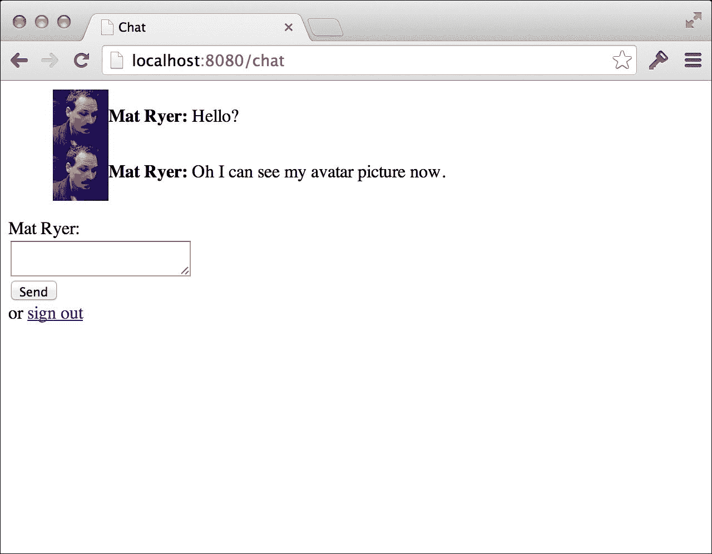
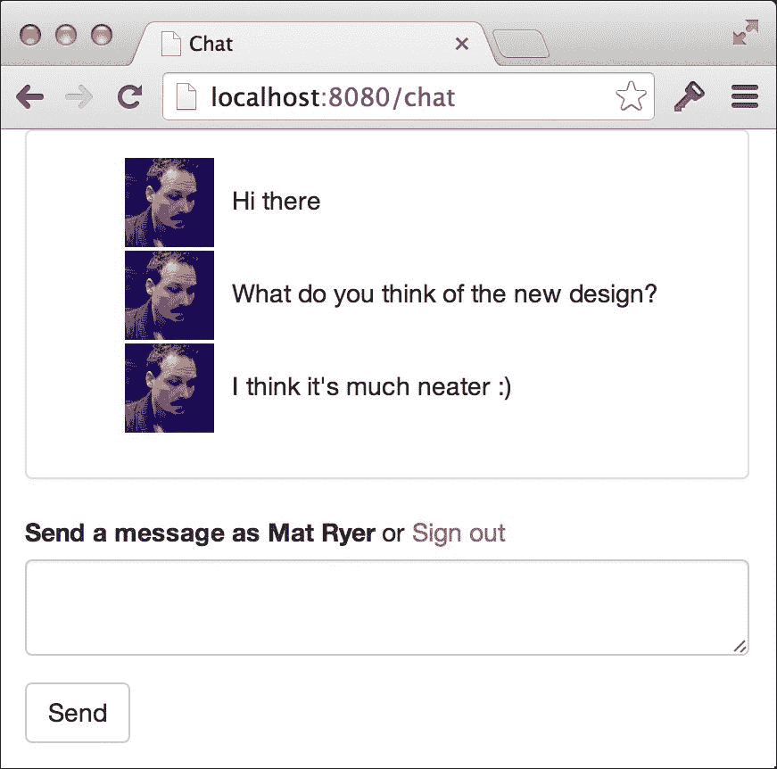
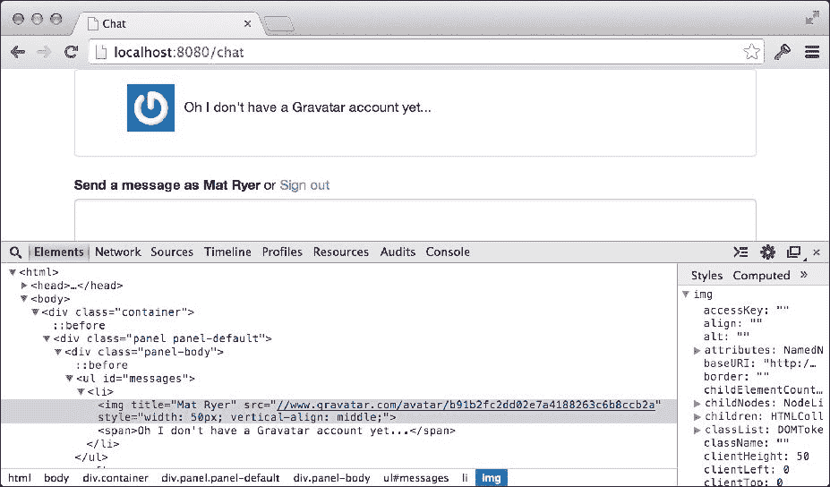
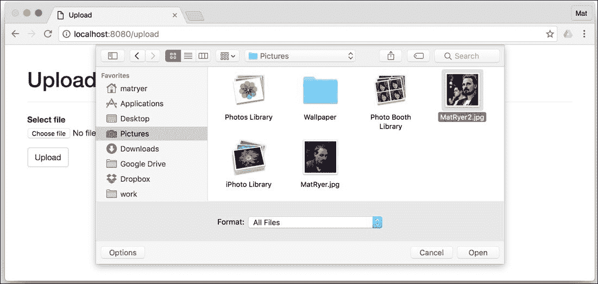

# 第三章. 实现个人头像的三种方式

到目前为止，我们的聊天应用程序已经使用了**OAuth2**协议来允许用户登录我们的应用程序，这样我们就能知道是谁在说什么。在本章中，我们将添加个人头像，使聊天体验更加吸引人。

我们将探讨以下几种在应用程序中的消息旁边添加图片或头像的方法：

+   使用认证服务提供的头像图片

+   使用[`en.gravatar.com/`](https://en.gravatar.com/)网络服务通过用户的电子邮件地址查找图片

+   允许用户上传自己的图片并自行托管

前两种选项允许我们将图片的托管委托给第三方，无论是授权服务还是[`en.gravatar.com/`](https://en.gravatar.com/)，这很好，因为它减少了我们托管应用程序的成本（在存储成本和带宽方面，因为用户的浏览器实际上会从认证服务的服务器下载图片，而不是我们的服务器）。第三种选项要求我们自己在网络上可访问的位置托管图片。

这些选项不是相互排斥的；你很可能在实际的生产应用程序中结合使用它们。在本章的结尾，你将看到灵活的设计如何使我们能够依次尝试每种实现，直到找到合适的头像。

在本章中，我们将对设计保持敏捷，完成每个里程碑所需的最少工作。这意味着在每个部分的结尾，我们将有可演示的、在浏览器中可工作的实现。这也意味着我们将根据需要重构代码，并在进行决策时讨论其背后的理由。

具体来说，在本章中，你将学习：

+   即使没有标准，从认证服务中获取额外信息的良好实践是什么

+   在什么情况下将抽象构建到我们的代码中是合适的

+   Go 的零初始化模式如何节省时间和内存

+   如何通过重用接口以与现有接口相同的方式处理集合和单个对象

+   如何使用[`en.gravatar.com/`](https://en.gravatar.com/)网络服务

+   如何在 Go 中进行 MD5 哈希

+   如何通过 HTTP 上传文件并将它们存储在服务器上

+   如何通过 Go 网络服务器提供静态文件

+   如何使用单元测试来指导代码重构

+   如何以及何时将功能从`struct`类型抽象到接口中

# 来自 OAuth2 服务器的头像

结果表明，大多数认证服务器已经为他们的用户提供了图像，并且他们通过我们已使用来获取用户名的受保护用户资源提供这些图像。为了使用这个头像图片，我们需要从提供者那里获取 URL，将其存储在我们的用户 cookie 中，并通过 Websocket 发送，以便每个客户端都可以在相应的消息旁边渲染图片。

## 获取头像 URL

用户或配置文件资源的模式不是 OAuth2 规范的一部分，这意味着每个提供者都有责任决定如何表示这些数据。确实，提供者做事情的方式不同；例如，GitHub 用户资源中的头像 URL 存储在一个名为`avatar_url`的字段中，而在 Google 中，相同的字段称为`picture`。Facebook 甚至更进一步，将头像 URL 值嵌套在一个名为`picture`的对象的`url`字段中。幸运的是，Gomniauth 为我们抽象了这一点；它在提供者标准上的`GetUser`调用标准化了获取常用字段的接口。

为了使用头像 URL 字段，我们需要返回并存储该信息到我们的 cookie 中。在`auth.go`中，查看`callback`动作的 switch case 内部，并更新创建`authCookieValue`对象的代码，如下所示：

```go
authCookieValue := objx.New(map[string]interface{}{ 
  "name":       user.Name(), 
  "avatar_url":  user.AvatarURL(), 
}).MustBase64() 

```

在前面代码中调用的`AvatarURL`字段将返回适当的 URL 值，并将其存储在我们的`avatar_url`字段中，然后我们将其放入 cookie 中。

### 小贴士

Gomniauth 定义了一个`User`类型的接口，每个提供者实现自己的版本。从认证服务器返回的通用`map[string]interface{}`数据存储在每个对象中，方法调用使用正确的字段名访问相应的值。这种描述信息访问方式而不严格关注实现细节的方法——是 Go 中使用接口的绝佳例子。

## 传输头像 URL

我们需要更新我们的`message`类型，使其也能携带头像 URL。在`message.go`中添加`AvatarURL`字符串字段：

```go
type message struct { 
  Name      string 
  Message   string 
  When      time.Time 
  AvatarURL string 
} 

```

到目前为止，我们实际上并没有为`AvatarURL`字段分配值，就像我们对`Name`字段所做的那样；因此，我们必须更新`client.go`中的`read`方法：

```go
func (c *client) read() { 
  defer c.socket.Close() 
  for { 
    var msg *message 
    err := c.socket.ReadJSON(&msg) 
    if err != nil { 
      return 
    } 
    msg.When = time.Now() 
    msg.Name = c.userData["name"].(string) 
    if avatarURL, ok := c.userData["avatar_url"]; ok { 
      msg.AvatarURL = avatarURL.(string) 
    } 
    c.room.forward <- msg 
  } 
} 

```

我们在这里所做的一切只是从表示我们放入 cookie 中的`userData`字段中获取值，并将其分配给`message`中的相应字段，如果该值存在于映射中。我们现在采取额外的步骤来检查值是否存在，因为我们不能保证认证服务会为这个字段提供一个值。而且，由于它可能是`nil`，如果实际上缺失，将其分配给`string`类型可能会引起 panic。

## 将头像添加到用户界面

现在 JavaScript 客户端通过 socket 获取了头像 URL 值，我们可以使用它来在消息旁边显示图像。我们通过更新`chat.html`中的`socket.onmessage`代码来完成此操作：

```go
socket.onmessage = function(e) { 
  var msg = JSON.parse(e.data); 
  messages.append( 
    $("<li>").append( 
      $("").css({ 
        width:50, 
        verticalAlign:"middle" 
      }).attr("src", msg.AvatarURL), 
      $("<strong>").text(msg.Name + ": "), 
      $("<span>").text(msg.Message) 
    ) 
  ); 
} 

```

当我们收到消息时，我们将插入一个 `img` 标签，其源设置为 `AvatarURL` 字段。我们将使用 jQuery 的 `css` 方法强制宽度为 `50` 像素。这可以保护我们免受大量图片破坏我们的界面，并允许我们将图像与周围的文本对齐。

如果我们使用之前版本登录并构建和运行我们的应用程序，你会发现仍然存在不包含头像 URL 的 `auth` cookie。我们没有再次被要求进行身份验证（因为我们已经登录），添加 `avatar_url` 字段的代码也从未有机会运行。我们可以删除我们的 cookie 并刷新页面，但我们在开发过程中每次更改时都必须这样做。让我们通过添加登出功能来正确解决这个问题。

## 登出

退出用户的最简单方法是删除 `auth` cookie 并将用户重定向到聊天页面，这将反过来导致重定向到登录页面（因为我们刚刚删除了 cookie）。我们通过在 `main.go` 中添加一个新的 `HandleFunc` 调用来实现这一点：

```go
http.HandleFunc("/logout", func(w http.ResponseWriter, r  *http.Request) { 
  http.SetCookie(w, &http.Cookie{ 
    Name:   "auth", 
    Value:  "", 
    Path:   "/", 
    MaxAge: -1, 
  }) 
  w.Header().Set("Location", "/chat") 
  w.WriteHeader(http.StatusTemporaryRedirect) 
}) 

```

前一个处理函数使用 `http.SetCookie` 更新 cookie 设置 `MaxAge` 为 `-1`，这表示浏览器应立即删除它。并非所有浏览器都会强制删除 cookie，这就是为什么我们还提供了一个新的空字符串 `Value` 设置，从而删除之前存储的用户数据。

### 小贴士

作为额外的任务，你可以通过更新 `auth.go` 中 `authHandler` 方法的 `ServeHTTP` 中的第一行来使你的应用程序更加健壮，使其能够处理空值情况以及缺失 cookie 的情况：

`if cookie, err := r.Cookie("auth"); err == http.ErrNoCookie || cookie.Value == ""`

我们不再忽略 `r.Cookie` 的返回值，我们保留返回的 cookie 的引用（如果实际上有一个的话），并添加一个额外的检查来查看 cookie 的 `Value` 字符串是否为空。

在我们继续之前，让我们添加一个 `登出` 链接，使其更容易删除 cookie，并允许我们的最终用户登出。在 `chat.html` 中，更新 `chatbox` 表单以插入一个简单的 HTML 链接到新的 `/logout` 处理程序：

```go
<form id="chatbox"> 
  {{.UserData.name}}:<br/> 
  <textarea></textarea> 
  <input type="submit" value="Send" /> 
  or <a href="/logout">sign out</a> 
</form> 

```

现在构建并运行应用程序，并在浏览器中打开 `localhost:8080/chat`：

```go
go build -o chat
./chat -host=:8080

```

如果需要，请登出并重新登录。当你点击 **发送** 时，你会看到你的头像图片出现在你的消息旁边：



## 让事物更美观

我们的应用程序开始看起来有点丑陋，是时候做些改变了。在上一章中，我们将 Bootstrap 库集成到我们的登录页面中，现在我们将扩展其使用到我们的聊天页面。在 `chat.html` 中，我们将进行三项更改：包含 Bootstrap 并调整页面的 CSS 样式，更改表单的标记，以及调整我们在页面上渲染消息的方式：

1.  首先，让我们更新页面顶部的`style`标签，并在其上方插入一个`link`标签以包含 Bootstrap：

    ```go
            <link rel="stylesheet"href="//netdna.bootstrapcdn.com/bootstrap
              /3.3.6/css/bootstrap.min.css"> 
            <style> 
              ul#messages        { list-style: none; } 
              ul#messages li     { margin-bottom: 2px; } 
              ul#messages li img { margin-right: 10px; } 
            </style> 

    ```

1.  接下来，让我们用以下代码替换`body`标签顶部的标记（在`script`标签之前）：

    ```go
            <div class="container"> 
              <div class="panel panel-default"> 
                <div class="panel-body"> 
                  <ul id="messages"></ul> 
                </div> 
              </div> 
              <form id="chatbox" role="form"> 
                <div class="form-group"> 
                  <label for="message">Send a message as {{.UserData.name}}     
                   </label> or <a href="/logout">Sign out</a> 
                  <textarea id="message" class="form-control"></textarea> 
                </div> 
                <input type="submit" value="Send" class="btn btn-default" /> 
              </form> 
            </div>
    ```

    ### 注意

    此标记遵循 Bootstrap 标准，为各种项目应用适当的类；例如，form-control 类可以整洁地格式化表单内的元素（你可以查看 Bootstrap 文档以获取有关这些类如何工作的更多信息）。

1.  最后，让我们更新我们的`socket.onmessage` JavaScript 代码，将发送者的名字作为图像的标题属性。这样，当鼠标悬停时，它会显示图像，而不是在每条消息旁边显示它：

    ```go
            socket.onmessage = function(e) { 
              var msg = JSON.parse(e.data); 
              messages.append( 
                $("<li>").append( 
                  $("").attr("title", msg.Name).css({ 
                    width:50, 
                    verticalAlign:"middle" 
                  }).attr("src", msg.AvatarURL), 
                  $("<span>").text(msg.Message) 
                ) 
              ); 
            } 

    ```

构建并运行应用程序，刷新浏览器以查看是否出现新的设计：

```go
go build -o chat
./chat -host=:8080

```

前面的命令显示了以下输出：



通过对代码进行相对较少的修改，我们显著提高了应用程序的外观和感觉。

# 实现 Gravatar

Gravatar 是一个允许用户上传单个个人照片并将其与他们的电子邮件地址关联的在线服务，以便在任何网站上都可以访问。像我们这样的开发者可以通过对特定 API 端点执行`GET`操作来访问这些图像。在本节中，我们将探讨如何实现 Gravatar 而不是使用由认证服务提供的图片。

## 抽象头像 URL 过程

由于我们在应用程序中有三种获取头像 URL 的不同方式，我们已经达到了一个合理的点，即学习如何抽象功能以干净地实现选项。抽象是指将某物的概念与其特定的实现分离的过程。`http.Handler`方法是一个很好的例子，说明了如何使用处理程序及其输入输出，而不具体说明每个处理程序采取什么行动。

在 Go 中，我们通过定义一个接口来描述获取头像 URL 的想法。让我们创建一个名为`avatar.go`的新文件，并插入以下代码：

```go
package main 
import ( 
  "errors" 
) 
// ErrNoAvatar is the error that is returned when the 
// Avatar instance is unable to provide an avatar URL. 
var ErrNoAvatarURL = errors.New("chat: Unable to get an avatar  URL.") 
// Avatar represents types capable of representing 
// user profile pictures. 
type Avatar interface { 
  // GetAvatarURL gets the avatar URL for the specified client, 
  // or returns an error if something goes wrong. 
  // ErrNoAvatarURL is returned if the object is unable to get 
  // a URL for the specified client. 
  GetAvatarURL(c *client) (string, error) 
} 

```

`Avatar`接口描述了一个类型必须满足的`GetAvatarURL`方法，以便能够获取头像 URL。我们以客户端作为参数，以便我们知道要返回 URL 的用户。该方法返回两个参数：一个字符串（如果一切顺利，将是 URL）和一个错误，如果出现问题。

可能出错的事情之一是 `Avatar` 的某个特定实现无法获取 URL。在这种情况下，`GetAvatarURL` 将返回 `ErrNoAvatarURL` 错误作为第二个参数。因此，`ErrNoAvatarURL` 错误成为接口的一部分；它是方法可能的返回值之一，也是我们代码的用户可能需要明确处理的内容。我们在方法的注释部分提到了这一点，这是在 Go 中传达此类设计决策的唯一方式。

### 小贴士

由于错误是立即使用 `errors.New` 初始化并存储在 `ErrNoAvatarURL` 变量中，因此只会创建这些对象中的一个；传递错误指针作为返回值是低成本的。这与 Java 的检查异常类似，后者具有类似的目的，其中创建了昂贵的异常对象，并将其用作控制流的一部分。

### 身份验证服务和头像的实现

我们将要编写的 `Avatar` 的第一个实现将替换我们之前硬编码从身份验证服务获取的头像 URL 的现有功能。让我们采用 **测试驱动开发** （**TDD**） 方法，以确保我们的代码在没有手动测试的情况下也能正常工作。让我们在 `chat` 文件夹中创建一个名为 `avatar_test.go` 的新文件：

```go
package main 
import "testing" 
func TestAuthAvatar(t *testing.T) { 
  var authAvatar AuthAvatar 
  client := new(client) 
  url, err := authAvatar.GetAvatarURL(client) 
  if err != ErrNoAvatarURL { 
    t.Error("AuthAvatar.GetAvatarURL should return ErrNoAvatarURL 
    when no value present") 
  } 
  // set a value 
  testUrl := "http://url-to-gravatar/" 
  client.userData = map[string]interface{}{"avatar_url": testUrl} 
  url, err = authAvatar.GetAvatarURL(client) 
  if err != nil { 
    t.Error("AuthAvatar.GetAvatarURL should return no error 
    when value present") 
  } 
  if url != testUrl { 
    t.Error("AuthAvatar.GetAvatarURL should return correct URL") 
  } 
} 

```

此文件包含对我们目前尚不存在且未定义的 `AuthAvatar` 类型的 `GetAvatarURL` 方法的测试。首先，它使用一个没有用户数据的客户端，并确保返回 `ErrNoAvatarURL` 错误。在设置一个合适的 URL 之后，我们的测试再次调用该方法，这次断言它返回正确的值。然而，构建此代码失败，因为 `AuthAvatar` 类型不存在，所以我们将声明 `authAvatar`。

在编写实现之前，值得注意的是，我们只声明了 `authAvatar` 变量为 `AuthAvatar` 类型，但从未实际分配任何内容，因此其值保持为 `nil`。这并不是一个错误；我们实际上正在利用 Go 的零初始化（或默认初始化）功能。由于我们的对象不需要状态（我们将 `client` 作为参数传递），因此没有必要浪费时间和内存来初始化其实例。在 Go 中，在 `nil` 对象上调用方法是可以接受的，只要该方法不尝试访问字段。当我们实际编写实现时，我们将查看一种确保这种情况的方法。

让我们回到 `avatar.go` 并使测试通过。在文件底部添加以下代码：

```go
type AuthAvatar struct{} 
var UseAuthAvatar AuthAvatar 
func (AuthAvatar) GetAvatarURL(c *client) (string, error) { 
  if url, ok := c.userData["avatar_url"]; ok { 
    if urlStr, ok := url.(string); ok { 
      return urlStr, nil 
    } 
  } 
  return "", ErrNoAvatarURL 
} 

```

在这里，我们定义我们的 `AuthAvatar` 类型为一个空的结构体，并定义了 `GetAvatarURL` 方法的实现。我们还创建了一个方便的变量 `UseAuthAvatar`，它具有 `AuthAvatar` 类型，但其值为 `nil`。我们可以在以后将 `UseAuthAvatar` 变量分配给任何查找 `Avatar` 接口类型的字段。

### 注意

我们之前编写的 `GetAvatarURL` 方法没有很好的 **视线**；快乐的返回值被埋在两个 `if` 块中。看看你是否可以重构它，使得最后一行是 `return urlStr, nil`，如果 `avatar_url` 字段缺失，则方法提前退出。你可以有信心地重构，因为这段代码被单元测试覆盖。

想了解更多关于这种重构背后的原因，请参阅[`bit.ly/lineofsightgolang`](http://bit.ly/lineofsightgolang)上的文章。

通常，方法的接收者（在名称之前括号中定义的类型）将被分配给一个变量，以便可以在方法体中访问它。由于在我们的情况下，我们假设对象可以有 `nil` 值，我们可以省略变量名来告诉 Go 丢弃引用。这作为对我们自己的额外提醒，我们应该避免使用它。

我们的实现体在其他方面相对简单：我们安全地寻找 `avatar_url` 的值，并在返回之前确保它是一个字符串。如果任何东西失败，我们返回接口中定义的 `ErrNoAvatarURL` 错误。

让我们通过打开终端并导航到 `chat` 文件夹，然后输入以下内容来运行测试：

```go
go test

```

如果一切顺利，我们的测试将通过，我们将成功创建了我们的第一个 `Avatar` 实现。

### 使用实现

当我们使用实现时，我们可以直接引用辅助变量，或者在我们需要功能时创建接口的自己的实例。然而，这将违背抽象的目的。相反，我们使用 `Avatar` 接口类型来指示我们需要的能力。

对于我们的聊天应用程序，我们将为每个聊天室提供一个获取头像 URL 的唯一方式。因此，让我们更新 `room` 类型，使其可以持有 `Avatar` 对象。在 `room.go` 中，向 `room struct` 类型添加以下字段定义：

```go
// avatar is how avatar information will be obtained. 
avatar Avatar 

```

更新 `newRoom` 函数，以便我们可以传递一个 `Avatar` 实现用于使用；当我们创建 `room` 实例时，我们将只把这个实现分配给新的字段：

```go
// newRoom makes a new room that is ready to go. 
func newRoom(avatar Avatar) *room { 
  return &room{ 
    forward: make(chan *message), 
    join:    make(chan *client), 
    leave:   make(chan *client), 
    clients: make(map[*client]bool), 
    tracer:  trace.Off(), 
    avatar:  avatar, 
  } 
} 

```

现在构建项目将突出显示在 `main.go` 中的 `newRoom` 调用是错误的，因为我们没有提供 `Avatar` 参数；让我们通过传递我们手头的 `UseAuthAvatar` 变量来更新它，如下所示：

```go
r := newRoom(UseAuthAvatar) 

```

我们不需要创建 `AuthAvatar` 的实例，所以没有分配内存。在我们的情况下，这并不导致很大的节省（因为我们整个应用程序只有一个房间），但想象一下如果我们的应用程序有成千上万的房间，潜在节省的大小。我们命名 `UseAuthAvatar` 变量的方式意味着前面的代码非常易于阅读，它也使我们的意图明显。

### 小贴士

在设计接口时考虑代码可读性很重要。考虑一个只接受布尔输入的方法，仅传递 true 或 false 会隐藏真实含义，如果您不知道参数名称的话。考虑定义几个辅助常量，如下面的简短示例所示：

```go
func move(animated bool) { /* ... */ } 
const Animate = true const 
DontAnimate = false

```

考虑以下对`move`的调用哪个更容易理解：

```go

move(true) 
 move(false) 
 move(Animate) 
 move(DontAnimate) 

```

现在剩下的只是将`client`更改为使用我们新的`Avatar`接口。在`client.go`中更新`read`方法，如下所示：

```go
func (c *client) read() { 
  defer c.socket.Close() 
  for { 
    var msg *message 
    if err := c.socket.ReadJSON(&msg); err != nil { 
      return 
    } 
    msg.When = time.Now() 
    msg.Name = c.userData["name"].(string) 
    msg.AvatarURL, _ = c.room.avatar.GetAvatarURL(c) 
    c.room.forward <- msg 
  } 
} 

```

在这里，我们要求`room`中的`avatar`实例为我们获取头像 URL，而不是我们自己从`userData`中提取它。

当您构建并运行应用程序时，您会注意到（尽管我们进行了一些重构）行为和用户体验完全没有改变。这是因为我们告诉我们的房间使用`AuthAvatar`实现。

现在让我们为房间添加另一个实现。

### Gravatar 实现

`Avatar`中的 Gravatar 实现将执行与`AuthAvatar`实现相同的工作，但除了它会为托管在[`en.gravatar.com/`](https://en.gravatar.com/)上的个人资料图片生成一个 URL。让我们首先在我们的`avatar_test.go`文件中添加一个测试：

```go
func TestGravatarAvatar(t *testing.T) { 
  var gravatarAvatar GravatarAvatar 
  client := new(client) 
  client.userData = map[string]interface{}{"email": 
   "MyEmailAddress@example.com"} 
  url, err := gravatarAvatar.GetAvatarURL(client) 
  if err != nil { 
    t.Error("GravatarAvatar.GetAvatarURL should not return an error") 
  } 
  if url != "//www.gravatar.com/avatar/0bc83cb571cd1c50ba6f3e8a78ef1346" { 
    t.Errorf("GravatarAvatar.GetAvatarURL wrongly returned %s", url) 
  } 
} 

```

Gravatar 使用电子邮件地址的哈希值来为每个个人资料图片生成一个唯一的 ID，因此我们设置了一个客户端并确保`userData`包含一个电子邮件地址。接下来，我们调用相同的`GetAvatarURL`方法，但这次是在具有`GravatarAvatar`类型的对象上。然后我们断言返回了正确的 URL。因为我们知道这是指定电子邮件地址的正确 URL，因为它在 Gravatar 文档中作为示例列出，这是一个确保我们的代码正在执行其应执行的操作的绝佳策略。

### 小贴士

记住，本书的所有源代码都可以从出版社下载，并且已在 GitHub 上发布。您可以通过复制粘贴[`github.com/matryer/goblueprints`](https://github.com/matryer/goblueprints)中的部分内容来节省构建先前核心的时间。通常，硬编码诸如基本 URL 之类的信息不是一个好主意；我们在整本书中硬编码以使代码片段更容易阅读且更明显，但如果您喜欢，欢迎在过程中提取它们。

显然，运行这些测试（使用`go test`）会导致错误，因为我们还没有定义我们的类型。让我们回到`avatar.go`并添加以下代码，同时确保导入`io`包：

```go
type GravatarAvatar struct{} 
var UseGravatar GravatarAvatar 
func(GravatarAvatar) GetAvatarURL(c *client) (string, error) { 
  if email, ok := c.userData["email"]; ok { 
    if emailStr, ok := email.(string); ok { 
      m := md5.New() 
      io.WriteString(m, strings.ToLower(emailStr)) 
      return fmt.Sprintf("//www.gravatar.com/avatar/%x", m.Sum(nil)), nil 
    } 
  } 
  return "", ErrNoAvatarURL 
} 

```

我们使用了与`AuthAvatar`相同的模式：我们有一个空的 struct，一个有用的`UseGravatar`变量，以及`GetAvatarURL`方法实现本身。在这个方法中，我们遵循 Gravatar 的指南，从电子邮件地址生成 MD5 哈希（在我们确保它是小写之后），然后使用`fmt.Sprintf`将其附加到硬编码的基本 URL 上。

### 注意

前面的方法在代码中存在视线不佳的问题。你能忍受它，还是想以某种方式提高可读性？

由于 Go 标准库编写者的辛勤工作，在 Go 中实现哈希非常容易。`crypto` 包提供了一系列令人印象深刻的加密和哈希功能，使用起来非常简单。在我们的例子中，我们创建了一个新的 `md5` 哈希器，因为哈希器实现了 `io.Writer` 接口，我们可以使用 `io.WriteString` 将字节字符串写入其中。调用 `Sum` 返回已写入的字节当前哈希值。

### 小贴士

你可能已经注意到，每次我们需要头像 URL 时，我们都会对电子邮件地址进行哈希处理。这在规模较大时效率很低，但我们应该优先考虑完成工作而不是优化。如果需要，我们总是可以稍后回来并更改这种方式。

现在运行测试显示我们的代码正在工作，但我们还没有在 `auth` cookie 中包含电子邮件地址。我们通过定位在 `auth.go` 中分配给 `authCookieValue` 对象的代码，并将其更新为从 Gomniauth 获取 `Email` 值来完成此操作：

```go
authCookieValue := objx.New(map[string]interface{}{ 
  "name":       user.Name(), 
  "avatar_url": user.AvatarURL(), 
  "email":       user.Email(), 
}).MustBase64() 

```

我们必须做的最后一件事是告诉我们的房间使用 Gravatar 实现，而不是 `AuthAvatar` 实现。我们通过在 `main.go` 中调用 `newRoom` 并进行以下更改来完成此操作：

```go
r := newRoom(UseGravatar) 

```

再次构建并运行聊天程序，然后转到浏览器。记住，由于我们更改了 cookie 中存储的信息，我们必须注销并重新登录才能看到我们的更改生效。

假设你有一个不同的 Gravatar 账户图片，你会注意到系统现在是从 Gravatar 而不是身份验证提供者拉取图片。使用你浏览器的检查器或调试工具将显示 `img` 标签的 `src` 属性确实已更改：



如果你没有 Gravatar 账户，你很可能会看到默认占位符图片代替你的个人资料图片。

# 上传头像图片

在上传图片的第三种和最后一种方法中，我们将探讨如何允许用户从他们的本地硬盘上传图片作为聊天时的个人资料图片。然后，文件将通过 URL 供浏览器服务。我们需要一种方法将文件与特定用户关联起来，以确保我们将正确的图片与相应的消息关联起来。

## 用户标识

为了唯一标识我们的用户，我们将通过哈希他们的电子邮件地址并使用结果字符串作为标识符来复制 Gravatar 的方法。我们将把用户 ID 与其他用户特定数据一起存储在 cookie 中。这实际上还有额外的优点，即消除了与 `GravatarAuth` 持续哈希相关的低效性。

在 `auth.go` 中，将创建 `authCookieValue` 对象的代码替换为以下代码：

```go
m := md5.New() 
io.WriteString(m, strings.ToLower(user.Email())) 
userId := fmt.Sprintf("%x", m.Sum(nil)) 
authCookieValue := objx.New(map[string]interface{}{ 
  "userid":      userId, 
  "name":       user.Name(), 
  "avatar_url": user.AvatarURL(), 
  "email":      user.Email(), 
}).MustBase64() 

```

在这里，我们已经对电子邮件地址进行了哈希处理，并在用户登录时将结果值存储在`userid`字段中。从现在开始，我们可以在我们的 Gravatar 代码中使用这个值，而不是为每条消息都重新哈希电子邮件地址。为此，首先，我们通过从`avatar_test.go`中删除以下行来更新测试：

```go
client.userData = map[string]interface{}{"email":  "MyEmailAddress@example.com"} 

```

然后我们将前面的行替换为这一行：

```go
client.userData = map[string]interface{}{"userid":  "0bc83cb571cd1c50ba6f3e8a78ef1346"} 

```

我们不再需要设置`email`字段，因为它没有被使用；相反，我们只需要为新`userid`字段设置一个适当的值。然而，如果你在终端中运行`go test`，你会看到这个测试失败。

为了使测试通过，在`avatar.go`中，更新`GravatarAuth`类型的`GetAvatarURL`方法：

```go
func(GravatarAvatar) GetAvatarURL(c *client) (string, error) { 
  if userid, ok := c.userData["userid"]; ok { 
    if useridStr, ok := userid.(string); ok { 
      return "//www.gravatar.com/avatar/" + useridStr, nil 
    } 
  } 
  return "", ErrNoAvatarURL 
} 

```

这不会改变行为，但它允许我们进行一个意外的优化，这是一个很好的例子，说明为什么你不应该过早地优化代码——你早期发现的低效可能不会持续足够长的时间，以至于值得花费精力去修复它们。

## 一个上传表单

如果我们的用户要上传文件作为他们的头像，他们需要一种方式来浏览他们的本地硬盘并将文件提交到服务器。我们通过添加一个新的由模板驱动的页面来简化这个过程。在`chat/templates`文件夹中，创建一个名为`upload.html`的文件：

```go
<html> 
  <head> 
    <title>Upload</title> 
    <link rel="stylesheet"        
    href="//netdna.bootstrapcdn.com/bootstrap/3.6.6/css/bootstrap.min.css"> 
  </head> 
  <body> 
    <div class="container"> 
      <div class="page-header"> 
        <h1>Upload picture</h1> 
      </div> 
      <form role="form" action="/uploader" enctype="multipart/form-data"  
       method="post"> 
        <input type="hidden" name="userid" value="{{.UserData.userid}}" /> 
        <div class="form-group"> 
          <label for="avatarFile">Select file</label> 
          <input type="file" name="avatarFile" /> 
        </div> 
        <input type="submit" value="Upload" class="btn" /> 
      </form> 
    </div> 
  </body> 
</html> 

```

我们再次使用了 Bootstrap 来使我们的页面看起来更美观，并且使其与其他页面保持一致。然而，这里需要注意的是那个将提供用户界面以便上传文件的 HTML 表单。表单的动作指向`/uploader`，而我们还没有实现它的处理程序，并且`enctype`属性必须是`multipart/form-data`，这样浏览器才能通过 HTTP 传输二进制数据。然后，有一个类型为`file`的`input`元素，它将包含我们想要上传的文件的引用。此外，请注意，我们已经将`UserData`映射中的`userid`值作为一个隐藏的输入包含在内，这将告诉我们哪个用户正在上传文件。确保`name`属性正确是很重要的，因为这是我们将在服务器上实现处理程序时引用数据的方式。

让我们现在将新的模板映射到`main.go`中的`/upload`路径：

```go
http.Handle("/upload", &templateHandler{filename: "upload.html"}) 

```

## 处理上传

当用户在选择了文件后点击**上传**按钮，浏览器将发送文件的资料以及用户 ID 到`/uploader`，但到目前为止，这些数据实际上并没有去任何地方。我们将实现一个新的`HandlerFunc`接口，它能够接收文件，读取通过连接流过的字节，并将其作为新文件保存到服务器上。在`chat`文件夹中，让我们创建一个名为`avatars`的新文件夹，这是我们将会保存头像图片文件的地方。

接下来，创建一个名为`upload.go`的新文件，并插入以下代码（确保添加适当的包名和导入，即`ioutils`、`net/http`、`io`和`path`）：

```go
func uploaderHandler(w http.ResponseWriter, req *http.Request) { 
  userId := req.FormValue("userid") 
  file, header, err := req.FormFile("avatarFile") 
  if err != nil { 
    http.Error(w, err.Error(), http.StatusInternalServerError) 
    return 
  } 
  data, err := ioutil.ReadAll(file) 
  if err != nil { 
    http.Error(w, err.Error(), http.StatusInternalServerError) 
    return 
  } 
  filename := path.Join("avatars", userId+path.Ext(header.Filename)) 
  err = ioutil.WriteFile(filename, data, 0777) 
  if err != nil { 
    http.Error(w, err.Error(), http.StatusInternalServerError) 
    return 
  } 
  io.WriteString(w, "Successful") 
} 

```

在这里，首先`uploaderHandler`使用`http.Request`中的`FormValue`方法获取我们在 HTML 表单中隐藏输入中放置的用户 ID。然后，它通过调用`req.FormFile`获取一个能够读取上传字节的`io.Reader`类型，该函数返回三个参数。第一个参数代表文件本身，具有`multipart.File`接口类型，它也是`io.Reader`。第二个是一个包含文件元数据的`multipart.FileHeader`对象，例如文件名。最后，第三个参数是一个我们希望其值为`nil`的错误。

当我们说`multipart.File`接口类型也是`io.Reader`时，我们是什么意思？好吧，快速浏览一下[`golang.org/pkg/mime/multipart/#File`](http://golang.org/pkg/mime/multipart/#File)的文档，可以清楚地看出，该类型实际上只是几个更通用接口的包装器接口。这意味着`multipart.File`类型可以被传递到需要`io.Reader`的方法中，因为任何实现了`multipart.File`的对象都必须实现`io.Reader`。

### 小贴士

将标准库接口，如包装器，嵌入以描述新概念，是确保你的代码在尽可能多的上下文中都能正常工作的一种好方法。同样，你应该尽量编写使用你能找到的最简单接口类型的代码，理想情况下是从标准库中。例如，如果你编写了一个需要你读取文件内容的方法，你可以要求用户提供一个类型为`multipart.File`的参数。然而，如果你要求`io.Reader`，你的代码将变得更加灵活，因为任何具有适当`Read`方法的类型都可以传递，这包括用户定义的类型。

`ioutil.ReadAll`方法将不断从指定的`io.Reader`接口读取，直到接收到所有字节，因此这里是我们实际上从客户端接收字节流的地方。然后我们使用`path.Join`和`path.Ext`通过`userid`构建一个新的文件名，并从可以从中获取的原始文件名中复制扩展名`multipart.FileHeader`。

我们随后使用`ioutil.WriteFile`方法在`avatars`文件夹中创建一个新文件。我们使用`userid`作为文件名，以便将图像与正确的用户关联起来，这与 Gravatar 的做法非常相似。`0777`值指定了我们创建的新文件应具有完整的文件权限，如果你不确定应该设置哪些其他权限，这是一个很好的默认设置。

如果在任何阶段发生错误，我们的代码将将其写入响应中，并附带 500 状态码（因为我们指定了`http.StatusInternalServerError`），这将帮助我们调试它，或者如果一切顺利，它将写入**成功**。

为了将这个新的处理函数映射到`/uploader`，我们需要回到`main.go`，并在`func main`中添加以下行：

```go
http.HandleFunc("/uploader", uploaderHandler) 

```

现在构建并运行应用程序，并记得注销并重新登录，以便给我们的代码一个上传`auth`cookie 的机会：

```go
go build -o chat
./chat -host=:8080

```

打开`http://localhost:8080/upload`，点击**选择文件**，然后从你的硬盘上选择一个文件并点击**上传**。导航到你的`chat/avatars`文件夹，你会注意到文件确实已上传，并重命名为你的`userid`字段的值。

## 服务器端图像服务

现在我们有了在服务器上存储用户头像图片的地方，我们需要一种方法让浏览器能够访问它们。我们使用`net/http`包的内置文件服务器来完成这项工作。在`main.go`中添加以下代码：

```go
http.Handle("/avatars/", 
  http.StripPrefix("/avatars/", 
    http.FileServer(http.Dir("./avatars")))) 

```

这实际上是一行代码，为了提高可读性而被拆分。`http.Handle`调用应该感觉熟悉，因为我们指定了想要将`/avatars/`路径映射到指定的处理器，这就是事情变得有趣的地方。`http.StripPrefix`和`http.FileServer`都返回`http.Handler`，并且它们使用了我们在上一章中学到的包装模式。`StripPrefix`函数接收`http.Handler`作为输入，通过删除指定的前缀来修改路径，并将功能传递给内部处理器。在我们的例子中，内部处理器是一个`http.FileServer`处理器，它将简单地提供静态文件，提供索引列表，如果找不到文件，则生成`404 Not Found`错误。`http.Dir`函数允许我们指定我们想要公开哪个文件夹。

### 提示

如果我们没有使用`http.StripPrefix`从请求中去除`/avatars/`前缀，文件服务器将在实际的`avatars`文件夹内寻找另一个名为`avatars`的文件夹，即`/avatars/avatars/filename`而不是`/avatars/filename`。

在打开浏览器中的`http://localhost:8080/avatars/`之前，让我们构建并运行程序。你会注意到文件服务器已经生成了我们`avatars`文件夹内文件的列表。点击一个文件将下载该文件，或者在图像的情况下，简单地显示它。如果你还没有这样做，请转到`http://localhost:8080/upload`并上传一张图片，然后回到列表页面并点击它，在浏览器中查看。

## 本地文件的头像实现

使文件系统头像工作最终一步是编写一个实现我们的`Avatar`接口的代码，该接口生成指向我们在上一节中创建的文件系统端点的 URL。

让我们在`avatar_test.go`文件中添加一个测试函数：

```go
func TestFileSystemAvatar(t *testing.T) { 

  filename := filepath.Join("avatars", "abc.jpg") 
  ioutil.WriteFile(filename, []byte{}, 0777) 
  defer os.Remove(filename)  
  var fileSystemAvatar FileSystemAvatar 
  client := new(client) 
  client.userData = map[string]interface{}{"userid": "abc"} 
  url, err := fileSystemAvatar.GetAvatarURL(client) 
  if err != nil { 
    t.Error("FileSystemAvatar.GetAvatarURL should not return an error") 
  } 
  if url != "/avatars/abc.jpg" { 
    t.Errorf("FileSystemAvatar.GetAvatarURL wrongly returned %s", url) 
  } 
} 

```

这个测试与`GravatarAvatar`测试类似，但稍微复杂一些，因为我们还在我们的`avatars`文件夹中创建了一个测试文件，并在之后删除它。

### 提示

即使我们的测试代码崩溃，延迟调用的函数仍然会被调用。所以无论发生什么，我们的测试代码都会自行清理。

剩下的测试很简单：我们在`client.userData`中设置一个`userid`字段，并调用`GetAvatarURL`以确保我们得到正确的返回值。当然，运行这个测试将会失败，所以让我们去`avatar.go`中添加以下代码以便使其通过：

```go
type FileSystemAvatar struct{} 
var UseFileSystemAvatar FileSystemAvatar 
func (FileSystemAvatar) GetAvatarURL(c *client) (string, error) { 
  if userid, ok := c.userData["userid"]; ok { 
    if useridStr, ok := userid.(string); ok { 
      return "/avatars/" + useridStr + ".jpg", nil 
    } 
  } 
  return "", ErrNoAvatarURL 
} 

```

如您所见，为了生成正确的 URL，我们只是获取`userid`值，并通过添加适当的段来构建最终的字符串。您可能已经注意到我们硬编码了文件扩展名为`.jpg`，这意味着我们聊天应用程序的初始版本将只支持 JPEGs。

### 小贴士

仅支持 JPEGs 可能看起来像是一个半成品解决方案，但遵循敏捷方法，这完全没问题；毕竟，定制的 JPEG 个人资料图片比完全没有定制的个人资料图片要好。

让我们通过更新`main.go`以使用我们的新`Avatar`实现来查看我们的新代码的实际效果：

```go
r := newRoom(UseFileSystemAvatar) 

```

现在像往常一样构建并运行应用程序，然后转到`http://localhost:8080/upload`并使用网页表单上传一个 JPEG 图像作为您的个人资料图片。为了确保它正常工作，请选择一个独特的图像，而不是您的 Gravatar 图片或认证服务中的图片。一旦点击**上传**后看到成功消息，转到`http://localhost:8080/chat`并发布一条消息。您会注意到应用程序确实使用了您上传的个人资料图片。

要更改您的个人资料图片，请返回到`/upload`页面并上传不同的图片，然后跳回`/chat`页面并发布更多消息。



### 支持不同的文件类型

为了支持不同的文件类型，我们必须使`FileSystemAvatar`类型的`GetAvatarURL`方法变得更智能一些。

我们不会盲目地构建字符串，而是会使用非常重要的`ioutil.ReadDir`方法来获取文件列表。列表还包括目录，因此我们将使用`IsDir`方法来确定是否应该跳过它。

我们将通过调用`path.Match`来检查每个文件是否与`userid`字段匹配（记住我们这样命名文件）。如果文件名与`userid`字段匹配，那么我们就找到了该用户的文件，并返回该路径。如果发生任何错误或找不到文件，我们将像往常一样返回`ErrNoAvatarURL`错误。

在`avatar.go`中更新适当的方法，如下所示：

```go
func (FileSystemAvatar) GetAvatarURL(c *client) (string, error) { 
  if userid, ok := c.userData["userid"]; ok { 
    if useridStr, ok := userid.(string); ok { 
      files, err := ioutil.ReadDir("avatars") 
      if err != nil { 
        return "", ErrNoAvatarURL 
      } 
      for _, file := range files { 
        if file.IsDir() { 
          continue 
        } 
        if match, _ := path.Match(useridStr+"*", file.Name());
        match { 
          return "/avatars/" + file.Name(), nil 
        } 
      } 
    } 
  } 
  return "", ErrNoAvatarURL 
} 

```

删除`avatar`文件夹中的所有文件以避免混淆并重新构建程序。这次，上传一个不同类型的图片，并注意我们的应用程序没有困难地处理它。

## 代码重构和优化

当我们回顾我们的 `Avatar` 类型是如何被使用的时候，你会注意到，每次有人发送消息时，应用程序都会调用 `GetAvatarURL`。在我们的最新实现中，每次调用该方法时，我们都会遍历 `avatars` 文件夹中的所有文件。对于一个特别健谈的用户来说，这可能意味着我们每分钟会重复多次迭代。这是明显的资源浪费，并且很快就会成为一个可扩展性问题。

我们不应该为每条消息获取头像 URL，而应该在用户首次登录时只获取一次，并将其缓存到 `auth` cookie 中。不幸的是，我们的 `Avatar` 接口类型要求我们将 `client` 对象传递给 `GetAvatarURL` 方法，而在我们验证用户身份的点上我们没有这样的对象。

### 小贴士

那么我们在设计 `Avatar` 接口时犯了错误吗？虽然这是一个自然的结论，但事实上我们做得是对的。我们根据当时可用的最佳信息设计了解决方案，因此比尝试为所有可能的情况设计要早得多地拥有了一个工作的聊天应用程序。软件会进化，几乎总是会在开发过程中发生变化，并且在代码的整个生命周期中肯定会发生变化。

### 用接口替换具体类型

我们已经得出结论，我们的 `GetAvatarURL` 方法依赖于在我们需要它的点上不可用的类型，那么一个好的替代方案是什么？我们可以将每个必需字段作为单独的参数传递，但这会使我们的接口变得脆弱，因为一旦 `Avatar` 实现需要新的信息，我们就必须更改方法签名。相反，我们将创建一个新的类型，它将封装 `Avatar` 实现所需的信息，同时在概念上保持与我们特定情况的解耦。

在 `auth.go` 文件中，将以下代码添加到页面顶部（当然是在 `package` 关键字下方）：

```go
import gomniauthcommon "github.com/stretchr/gomniauth/common" 
type ChatUser interface { 
  UniqueID() string 
  AvatarURL() string 
} 
type chatUser struct { 
  gomniauthcommon.User 
  uniqueID string 
} 
func (u chatUser) UniqueID() string { 
  return u.uniqueID 
} 

ChatUser, which exposes the information needed in order for our Avatar implementations to generate the correct URLs. Then, we defined an actual implementation called chatUser (notice the lowercase starting letter) that implements the interface. It also makes use of a very interesting feature in Go: type embedding. We actually embedded the gomniauth/common.User interface type, which means that our struct interface implements the interface automatically.
```

你可能已经注意到，我们实际上只实现了两个必需方法中的一个来满足我们的 `ChatUser` 接口。我们之所以能够这样做，是因为 Gomniauth 的 `User` 接口恰好定义了相同的 `AvatarURL` 方法。在实践中，当我们实例化我们的 `chatUser` 结构体，并且为隐含的 Gomniauth `User` 字段设置适当的值时，我们的对象同时实现了 Gomniauth 的 `User` 接口和我们的 `ChatUser` 接口。

### 以测试驱动的方式更改接口

在我们能够使用我们的新类型之前，我们必须更新 `Avatar` 接口和适当的实现以使用它。由于我们将遵循 TDD 实践，我们将首先在我们的测试文件中做出这些更改，当我们尝试构建代码时，我们会看到编译错误，一旦我们修复了这些错误，我们就会看到失败的测试，最终使测试通过。

打开 `avatar_test.go` 文件，将 `TestAuthAvatar` 替换为以下代码：

```go
func TestAuthAvatar(t *testing.T) { 
  var authAvatar AuthAvatar 
  testUser := &gomniauthtest.TestUser{} 
  testUser.On("AvatarURL").Return("", ErrNoAvatarURL) 
  testChatUser := &chatUser{User: testUser} 
  url, err := authAvatar.GetAvatarURL(testChatUser) 
  if err != ErrNoAvatarURL { 
    t.Error("AuthAvatar.GetAvatarURL should return ErrNoAvatarURL 
     when no value present") 
  } 
  testUrl := "http://url-to-gravatar/" 
  testUser = &gomniauthtest.TestUser{} 
  testChatUser.User = testUser 
  testUser.On("AvatarURL").Return(testUrl, nil) 
  url, err = authAvatar.GetAvatarURL(testChatUser) 
  if err != nil { 
    t.Error("AuthAvatar.GetAvatarURL should return no error 
    when value present") 
  } 
  if url != testUrl { 
    t.Error("AuthAvatar.GetAvatarURL should return correct URL") 
  } 
} 

```

### 小贴士

你还需要导入`gomniauth/test`包，并将其命名为`gomniauthtest`，就像我们在上一节中所做的那样。

在定义之前使用我们的新接口是一个检查我们思考是否合理的有效方法，这也是练习 TDD 的另一个优点。在这个新的测试中，我们创建 Gomniauth 提供的`TestUser`，并将其嵌入到`chatUser`类型中。然后我们将新的`chatUser`类型传递给我们的`GetAvatarURL`调用，并对输出做出与以往相同的断言。

### 小贴士

Gomniauth 的`TestUser`类型很有趣，因为它使用了`Testify`包的模拟功能。有关更多信息，请参阅[`github.com/stretchr/testify`](https://github.com/stretchr/testify)。

`On`和`Return`方法允许我们告诉`TestUser`在调用特定方法时应该做什么。在第一种情况下，我们告诉`AvatarURL`方法返回错误，在第二种情况下，我们要求它返回`testUrl`值，这模拟了我们在测试中覆盖的两个可能的结果。

更新其他两个测试要简单得多，因为它们只依赖于`UniqueID`方法，我们可以直接控制其值。

将`avatar_test.go`中的其他两个测试替换为以下代码：

```go
func TestGravatarAvatar(t *testing.T) { 
  var gravatarAvatar GravatarAvatar 
  user := &chatUser{uniqueID: "abc"} 
  url, err := gravatarAvatar.GetAvatarURL(user) 
  if err != nil { 
    t.Error("GravatarAvatar.GetAvatarURL should not return an error") 
  } 
  if url != "//www.gravatar.com/avatar/abc" { 
    t.Errorf("GravatarAvatar.GetAvatarURL wrongly returned %s", url) 
  } 
} 
func TestFileSystemAvatar(t *testing.T) { 
  // make a test avatar file 
  filename := path.Join("avatars", "abc.jpg") 
  ioutil.WriteFile(filename, []byte{}, 0777) 
  defer func() { os.Remove(filename) }() 
  var fileSystemAvatar FileSystemAvatar 
  user := &chatUser{uniqueID: "abc"} 
  url, err := fileSystemAvatar.GetAvatarURL(user) 
  if err != nil { 
    t.Error("FileSystemAvatar.GetAvatarURL should not return an error") 
  } 
  if url != "/avatars/abc.jpg" { 
    t.Errorf("FileSystemAvatar.GetAvatarURL wrongly returned %s", url) 
  } 
} 

```

当然，这段测试代码甚至无法编译，因为我们还没有更新我们的`Avatar`接口。在`avatar.go`中，将`Avatar`接口类型中的`GetAvatarURL`签名更新为接受`ChatUser`类型而不是`client`类型：

```go
GetAvatarURL(ChatUser) (string, error) 

```

### 小贴士

注意，我们最终使用的是`ChatUser`接口（首字母大写），而不是我们内部的`chatUser`实现结构体。毕竟，我们希望我们的`GetAvatarURL`方法接受的类型更加灵活。

尝试构建这个项目将揭示我们现在有破损的实现，因为所有的`GetAvatarURL`方法仍在请求一个`client`对象。

### 修复现有实现

改变像我们这样的接口是一个自动找到我们代码中受影响部分的好方法，因为它们将导致编译错误。当然，如果我们正在编写其他人会使用的包，我们就必须对这种接口的改变更加严格，但我们还没有发布我们的 v1 版本，所以这没关系。

现在，我们将更新三个实现签名以满足新的接口，并将方法体更改为使用新类型。将`FileSystemAvatar`的实现替换为以下内容：

```go
func (FileSystemAvatar) GetAvatarURL(u ChatUser) (string, error) { 
  if files, err := ioutil.ReadDir("avatars"); err == nil { 
    for _, file := range files { 
      if file.IsDir() { 
        continue 
      } 
      if match, _ := path.Match(u.UniqueID()+"*", file.Name()); 
      match { 
        return "/avatars/" + file.Name(), nil 
      } 
    } 
  } 
  return "", ErrNoAvatarURL 
} 

```

这里关键的改变是我们不再访问客户端的`userData`字段，而是直接在`ChatUser`接口上调用`UniqueID`。

接下来，我们使用以下代码更新`AuthAvatar`实现：

```go
func (AuthAvatar) GetAvatarURL(u ChatUser) (string, error) { 
  url := u.AvatarURL() 
  if len(url) == 0 { 
    return "", ErrNoAvatarURL 
  } 
  return url, nil 
} 

```

我们的新设计证明要简单得多，如果我们能减少所需的代码量，那总是好事。前面的代码调用以获取`AvatarURL`值，如果它不为空，我们就返回它；否则，我们返回`ErrNoAvatarURL`错误。

### 小贴士

注意代码的预期流程缩进了一级，而错误情况被嵌套在`if`块中。虽然你不可能 100%地坚持这种做法，但这是一种值得努力的事情。能够快速扫描代码（在阅读时）以查看单列中的正常执行流程，可以使你更快地理解代码。将此与具有大量嵌套的`if...else`块的代码进行比较，后者需要更多的时间来理解。

最后，更新`GravatarAvatar`实现：

```go
func (GravatarAvatar) GetAvatarURL(u ChatUser) (string, error) { 
  return "//www.gravatar.com/avatar/" + u.UniqueID(), nil 
} 

```

### 全局变量与字段

到目前为止，我们已经将`Avatar`实现分配给了`room`类型，这使得我们可以为不同的房间使用不同的头像。然而，这也暴露了一个问题：当我们的用户登录时，没有关于他们要去的房间的概念，因此我们不知道应该使用哪个`Avatar`实现。因为我们的应用程序只支持一个房间，我们将考虑另一种选择实现的方法：使用全局变量。

全局变量简单地说是一个定义在任何类型定义之外且可以从包的任何部分（以及如果它被导出，则从包外部）访问的变量。对于简单的配置，例如要使用哪种类型的`Avatar`实现，全局变量是一个简单且直接的解决方案。在`main.go`中的`import`语句下面添加以下行：

```go
// set the active Avatar implementation 
var avatars Avatar = UseFileSystemAvatar 

```

这定义了`avatars`为一个全局变量，我们可以在需要获取特定用户的头像 URL 时使用它。

### 实现我们的新设计

我们需要更改调用`GetAvatarURL`的代码，使其仅访问我们放入`userData`缓存（通过`auth`cookie）中的值。更改`msg.AvatarURL`被分配的行，如下所示：

```go
if avatarUrl, ok := c.userData["avatar_url"]; ok { 
  msg.AvatarURL = avatarUrl.(string) 
} 

```

在`auth.go`中的`loginHandler`内部找到调用`provider.GetUser`的代码，并将其替换，直到我们设置`authCookieValue`对象的位置，替换为以下代码：

```go
user, err := provider.GetUser(creds) 
if err != nil { 
  log.Fatalln("Error when trying to get user from", provider, "-", err) 
} 
chatUser := &chatUser{User: user} 
m := md5.New() 
io.WriteString(m, strings.ToLower(user.Email())) 
chatUser.uniqueID = fmt.Sprintf("%x", m.Sum(nil)) 
avatarURL, err := avatars.GetAvatarURL(chatUser) 
if err != nil { 
  log.Fatalln("Error when trying to GetAvatarURL", "-", err) 
} 

```

在这里，我们在设置`User`字段（表示嵌入的接口）为 Gomniauth 返回的`User`值的同时创建了一个新的`chatUser`变量。然后我们将`userid`的 MD5 哈希保存到`uniqueID`字段中。

调用`avatars.GetAvatarURL`是我们所有辛勤工作的回报，因为我们现在在处理过程中更早地获得了用户的头像 URL。更新`auth.go`中的`authCookieValue`行，以在 cookie 中缓存头像 URL 并删除电子邮件地址，因为它不再需要：

```go
authCookieValue := objx.New(map[string]interface{}{ 
  "userid":     chatUser.uniqueID, 
  "name":       user.Name(), 
  "avatar_url": avatarURL, 
}).MustBase64() 

```

无论`Avatar`实现需要执行的工作多么昂贵，例如在文件系统上迭代文件，由于实现仅在用户首次登录时执行，而不是每次他们发送消息时执行，因此这种工作得到了缓解。

### 整理和测试

最后，我们可以在重构过程中积累的一些冗余代码上进行裁剪。

由于我们不再在 `room` 中存储 `Avatar` 实现了，让我们从类型中删除该字段及其所有引用。在 `room.go` 中，从 `room` 结构体中删除 `avatar Avatar` 定义并更新 `newRoom` 方法：

```go
func newRoom() *room { 
  return &room{ 
    forward: make(chan *message), 
    join:    make(chan *client), 
    leave:   make(chan *client), 
    clients: make(map[*client]bool), 
    tracer:  trace.Off(), 
  } 
} 

```

### 小贴士

记得尽可能使用编译器作为你的待办事项列表，并跟随错误找到你影响其他代码的地方。

在 `main.go` 中，删除传递给 `newRoom` 函数调用的参数，因为我们正在使用全局变量而不是这个变量。

在这个练习之后，最终用户体验保持不变。通常在重构代码时，内部结构会被修改，而公共接口保持稳定和不变。在这个过程中，记得重新运行单元测试，以确保你在代码演变过程中没有破坏任何东西。

### 小贴士

通常，运行像 `golint` 和 `go vet` 这样的工具来检查你的代码是一个好主意，以确保它遵循良好的实践，并且不包含任何 Go 伪错误，例如缺少注释或命名不当的函数。有一些故意留下供你自己修复。

# 结合所有三个实现

为了以响亮的方式结束这一章节，我们将实现一个机制，其中每个 `Avatar` 实现轮流尝试获取用户的 URL。如果第一个实现返回 `ErrNoAvatarURL` 错误，我们将尝试下一个，依此类推，直到找到可用的值。

在 `avatar.go` 中，在 `Avatar` 类型下方添加以下类型定义：

```go
type TryAvatars []Avatar 

```

`TryAvatars` 类型只是一个 `Avatar` 对象的切片，我们可以自由地向其中添加方法。让我们添加以下 `GetAvatarURL` 方法：

```go
func (a TryAvatars) GetAvatarURL(u ChatUser) (string, error) { 
  for _, avatar := range a { 
    if url, err := avatar.GetAvatarURL(u); err == nil { 
      return url, nil 
    } 
  } 
  return "", ErrNoAvatarURL 
} 

```

这意味着 `TryAvatars` 现在是一个有效的 `Avatar` 实现并且可以替代任何特定的实现。在先前的方法中，我们按顺序遍历 `Avatar` 对象的切片，为每个对象调用 `GetAvatarURL`。如果没有返回错误，我们返回 URL；否则，我们继续寻找。最后，如果我们无法找到值，我们根据接口设计返回 `ErrNoAvatarURL`。

在 `main.go` 中更新 `avatars` 全局变量以使用我们的新实现：

```go
var avatars Avatar = TryAvatars{ 
  UseFileSystemAvatar, 
  UseAuthAvatar, 
  UseGravatar} 

```

在这里，我们创建了一个新的 `TryAvatars` 切片类型实例，同时将其他 `Avatar` 实现放入其中。顺序很重要，因为它按切片中对象出现的顺序迭代。因此，首先我们的代码将检查用户是否上传了图片；如果没有，代码将检查认证服务是否有我们可以使用的图片。如果这些方法失败，将生成一个 Gravatar URL，在最坏的情况下（例如，如果用户没有添加 Gravatar 图片），将渲染一个默认占位符图像。

要查看我们的新功能如何工作，请执行以下步骤：

1.  构建并重新运行应用程序：

    ```go
    go build -o chat
    ./chat -host=:8080

    ```

1.  通过访问 `http://localhost:8080/logout` 来注销。

1.  从 `avatars` 文件夹中删除所有图片。

1.  通过导航到 `http://localhost:8080/chat` 来重新登录。

1.  发送一些消息，并注意你的个人资料图片。

1.  访问 `http://localhost:8080/upload` 并上传一个新的个人资料图片。

1.  再次注销并按照之前的方式重新登录。

1.  发送更多消息，并注意你的个人资料图片已经更新。

# 摘要

在本章中，我们在我们的聊天应用中添加了三种不同的个人资料图片实现。首先，我们要求身份验证服务为我们提供一个 URL。我们使用 Gomniauth 对用户资源数据的抽象，并将其作为用户界面的一部分包含在内，每次用户发送消息时都会这样做。利用 Go 的零（或默认）初始化，我们能够在不实际创建任何实例的情况下引用我们的 `Avatar` 接口的不同实现。

我们将数据存储在 cookie 中，以便用户登录时使用。鉴于 cookie 在我们代码的构建之间持续存在，我们添加了一个方便的注销功能来帮助我们验证我们的更改，我们还将其暴露给我们的用户，以便他们也可以注销。对代码的一些小改动以及 Bootstrap 在我们的聊天页面上的应用，极大地改善了我们的应用的外观和感觉。

我们在 Go 中使用 MD5 哈希来实现 [`en.gravatar.com/`](https://en.gravatar.com/) API，通过哈希身份验证服务提供的电子邮件地址。如果电子邮件地址在 Gravatar 中不为人知，他们将为我们提供一个漂亮的默认占位符图片，这意味着我们的用户界面永远不会因为缺少图片而损坏。

然后，我们构建并完成了一个上传表单，并将服务器功能关联到 `avatars` 文件夹中保存上传的图片。我们看到了如何通过标准库的 `http.FileServer` 处理器将保存的上传图片暴露给用户。由于这引入了设计中的低效，我们通过单元测试的帮助重构了我们的解决方案。通过将 `GetAvatarURL` 调用移动到用户登录的点，而不是每次发送消息时，我们使我们的代码具有更高的可扩展性。

我们特殊的 `ErrNoAvatarURL` 错误类型被用作我们界面设计的一部分，以便在无法获取适当的 URL 时通知调用代码。这在我们创建 `Avatars` 切片类型时变得特别有用。通过在 `Avatar` 类型的一个切片上实现 `Avatar` 接口，我们能够创建一个新的实现，该实现轮流尝试从不同的选项中获取有效的 URL，首先是文件系统，然后是身份验证服务，最后是 Gravatar。我们通过不对用户与界面交互的方式产生任何影响来实现这一点。如果一个实现返回 `ErrNoAvatarURL`，我们就尝试下一个。

我们的聊天应用已经准备好上线，因此我们可以邀请我们的朋友进行真正的对话。但首先，我们需要选择一个域名来托管它，这个问题我们将在下一章中探讨。
