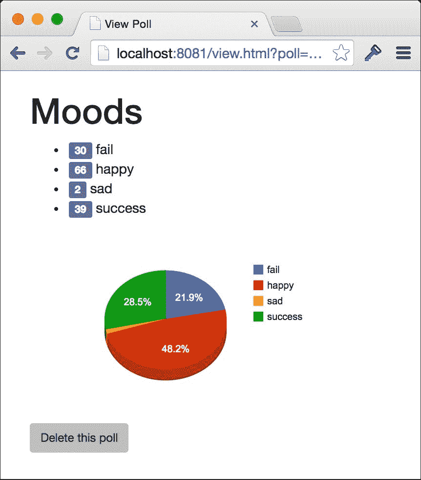

## 显示投票列表的索引页面

在 `web` 文件夹内创建一个名为 `public` 的文件夹，并在其中添加 `index.html` 文件，写入以下 HTML 代码：

```go
<!DOCTYPE html> 
<html> 
<head> 
  <title>Polls</title> 
  <link rel="stylesheet"
   href="//maxcdn.bootstrapcdn.com/bootstrap/3.2.0/css/     
    bootstrap.min.css"> 
</head> 
<body> 
</body> 
</html> 

```

我们将再次使用 Bootstrap 来使我们的简单 UI 看起来更美观，但我们需要在 HTML 页面的 `body` 标签中添加两个额外的部分。首先，添加将显示投票列表的 DOM 元素：

```go
<div class="container"> 
  <div class="col-md-4"></div> 
  <div class="col-md-4"> 
    <h1>Polls</h1> 
    <ul id="polls"></ul> 
    <a href="new.html" class="btn btn-primary">Create new poll</a> 
  </div> 
  <div class="col-md-4"></div> 
</div> 

```

在这里，我们使用 Bootstrap 的网格系统来居中对齐由投票列表和指向 `new.html` 的链接组成的内容，用户可以在该页面上创建新的投票。

接下来，添加以下 `script` 标签和 JavaScript 代码：

```go
<script  src="img/jquery.min.js"></script> 
 <script> 
  $(function(){ 
    var update = function(){ 
      $.get("http://localhost:8080/polls/?key=abc123", null, null,  "json") 
        .done(function(polls){ 
          $("#polls").empty(); 
          for (var p in polls) { 
            var poll = polls[p]; 
            $("#polls").append( 
              $("<li>").append( 
                $("<a>") 
                  .attr("href", "view.html?poll=polls/" + poll.id) 
                  .text(poll.title) 
              ) 
            ) 
          } 
        } 
      ); 
      window.setTimeout(update, 10000); 
    } 
    update(); 
  }); 
</script> 

```

我们正在使用 jQuery 的 `$.get` 函数向我们的网络服务发送 AJAX 请求。我们硬编码了 API URL –在实践中，你可能决定不这样做–或者至少使用域名来抽象化它。一旦加载了投票，我们使用 jQuery 构建一个包含指向 `view.html` 页面的超链接列表，并将投票的 ID 作为查询参数传递。

## 创建新的投票

为了允许用户创建新的投票，在 `public` 文件夹内创建一个名为 `new.html` 的文件，并将以下 HTML 代码添加到该文件中：

```go
<!DOCTYPE html> 
<html> 
<head> 
  <title>Create Poll</title> 
  <link rel="stylesheet"       
    href="//maxcdn.bootstrapcdn.com/bootstrap/3.2.0/css/
    bootstrap.min.css"> 
</head> 
<body> 
  <script src="img/jquery.min.js">   </script> 
</body> 
</html> 

```

我们将添加一个 HTML 表单的元素，用于在创建新的投票时捕获所需的信息，即投票的标题和选项。将以下代码添加到 `body` 标签内：

```go
<div class="container"> 
  <div class="col-md-4"></div> 
  <form id="poll" role="form" class="col-md-4"> 
    <h2>Create Poll</h2> 
    <div class="form-group"> 
      <label for="title">Title</label> 
      <input type="text" class="form-control" id="title" 
        placeholder="Title"> 
    </div> 
    <div class="form-group"> 
      <label for="options">Options</label> 
      <input type="text" class="form-control" id="options"
        placeholder="Options"> 
      <p class="help-block">Comma separated</p> 
    </div> 
    <button type="submit" class="btn btn-primary">
      Create Poll</button> or <a href="/">cancel</a> 
  </form> 
  <div class="col-md-4"></div> 
</div> 

```

由于我们的 API 使用 JSON，我们需要做一些工作将 HTML 表单转换为 JSON 编码的字符串，并将逗号分隔的选项字符串拆分为选项数组。添加以下 `script` 标签：

```go
<script> 
  $(function(){ 
    var form = $("form#poll"); 
    form.submit(function(e){ 
      e.preventDefault(); 
      var title = form.find("input[id='title']").val(); 
      var options = form.find("input[id='options']").val(); 
      options = options.split(","); 
      for (var opt in options) { 
        options[opt] = options[opt].trim(); 
      } 
      $.post("http://localhost:8080/polls/?key=abc123", 
        JSON.stringify({ 
          title: title, options: options 
        }) 
      ).done(function(d, s, r){ 
        location.href = "view.html?poll=" +
        r.getResponseHeader("Location"); 
      }); 
    }); 
  }); 
</script> 

```

在这里，我们为表单的 `submit` 事件添加了一个监听器，并使用 jQuery 的 `val` 方法收集输入值。我们用逗号分隔选项，并在使用 `$.post` 方法向适当的 API 端点发送 `POST` 请求之前移除空格。`JSON.stringify` 允许我们将数据对象转换为 JSON 字符串，我们使用这个字符串作为请求的主体，这是 API 所期望的。成功后，我们提取 `Location` 标头并将用户重定向到 `view.html` 页面，传递对新创建的投票的引用作为参数。

## 显示投票的详细信息

我们应用需要完成的最后一页是 `view.html` 页面，用户可以查看投票的详细信息和实时结果。在 `public` 文件夹内创建一个名为 `view.html` 的新文件，并将以下 HTML 代码添加到其中：

```go
<!DOCTYPE html> 
<html> 
<head> 
  <title>View Poll</title> 
  <link rel="stylesheet" 
   href="//maxcdn.bootstrapcdn.com/bootstrap/3.2.0/css/bootstrap.min.css"> 
</head> 
<body> 
  <div class="container"> 
    <div class="col-md-4"></div> 
    <div class="col-md-4"> 
      <h1 data-field="title">...</h1> 
      <ul id="options"></ul> 
      <div id="chart"></div> 
      <div> 
        <button class="btn btn-sm" id="delete">Delete this poll</button> 
      </div> 
    </div> 
    <div class="col-md-4"></div> 
  </div> 
</body> 
</html> 

```

这个页面与其他页面大部分相似；它包含用于展示投票标题、选项和饼图的元素。我们将把 Google 的可视化 API 与我们的 API 混合使用来展示结果。在 `view.html` 中的最后一个 `div` 标签下面（并且在关闭 `body` 标签之上），添加以下 `script` 标签：

```go
<script src="img/"></script> 
<script  src="img/jquery.min.js">
</script> 
<script> 
google.load('visualization', '1.0', {'packages':['corechart']}); 
google.setOnLoadCallback(function(){ 
  $(function(){ 
    var chart; 
    var poll = location.href.split("poll=")[1]; 
    var update = function(){ 
      $.get("http://localhost:8080/"+poll+"?key=abc123", null, null,
        "json") 
        .done(function(polls){ 
          var poll = polls[0]; 
          $('[data-field="title"]').text(poll.title); 
          $("#options").empty(); 
          for (var o in poll.results) { 
            $("#options").append( 
              $("<li>").append( 
                $("<small>").addClass("label label 
                default").text(poll.results[o]), 
                " ", o 
              ) 
            ) 
          } 
          if (poll.results) { 
            var data = new google.visualization.DataTable(); 
            data.addColumn("string","Option"); 
            data.addColumn("number","Votes"); 
            for (var o in poll.results) { 
              data.addRow([o, poll.results[o]]) 
            } 
            if (!chart) { 
              chart = new                 google.visualization.PieChart 
                (document.getElementById('chart')); 
            } 
            chart.draw(data, {is3D: true}); 
          } 
        } 
      ); 
      window.setTimeout(update, 1000); 
    }; 
    update(); 
    $("#delete").click(function(){ 
      if (confirm("Sure?")) { 
        $.ajax({ 
          url:"http://localhost:8080/"+poll+"?key=abc123", 
          type:"DELETE" 
        }) 
        .done(function(){ 
          location.href = "/"; 
        }) 
      } 
    }); 
  }); 
}); 
</script> 

```

我们包括了为我们的页面提供动力的依赖项，jQuery 和 Bootstrap，以及 Google JavaScript API。代码从 Google 加载适当的可视化库，并在 DOM 元素加载之前等待，通过在 `poll=` 上分割 URL 提取投票 ID。然后我们创建一个名为 `update` 的变量，它代表一个负责生成页面视图的函数。采取这种做法是为了让我们能够轻松地使用 `window.setTimeout` 来定期调用更新视图。在 `update` 函数内部，我们使用 `$.get` 向我们的 `/polls/{id}` 端点发送 `GET` 请求，将 `{id}` 替换为之前从 URL 中提取的实际 ID。一旦投票加载，我们更新页面上的标题，并遍历选项将它们添加到列表中。如果有结果（记住，在前一章中，只有在开始计票时，`results` 映射才被添加到数据中），我们创建一个新的 `google.visualization.PieChart` 对象，并构建一个包含结果的 `google.visualization.DataTable` 对象。在图表上调用 `draw` 会使其渲染数据，从而用最新的数字更新图表。然后我们使用 `setTimeout` 告诉我们的代码在另一秒后再次调用 `update`。

最后，我们将绑定到我们页面中添加的 `delete` 按钮的 `click` 事件，并在询问用户是否确定后，向投票 URL 发送 `DELETE` 请求，然后将其重定向回主页。实际上，这个请求会导致首先发出 `OPTIONS` 请求，请求权限，这就是为什么我们在之前的 `handlePolls` 函数中添加了对它的显式支持。

# 运行解决方案

在前两章中，我们构建了许多组件，现在是时候看看它们一起工作的情况了。本节包含您需要的一切，以便在正确设置环境的情况下运行所有项目，正如前一章开头所述。本节假设您有一个包含四个子文件夹的单一文件夹：`api`、`counter`、`twittervotes` 和 `web`。

假设没有任何程序正在运行，请按照以下步骤操作（每个步骤都在自己的终端窗口中执行）：

1.  在顶级文件夹中，启动 `nsqlookupd` 守护进程：

    ```go
    nsqlookupd

    ```

1.  在同一目录下，启动 `nsqd` 守护进程：

    ```go
    nsqd --lookupd-tcp-address=localhost:4160

    ```

1.  启动 MongoDB 守护进程：

    ```go
    mongod

    ```

1.  导航到 `counter` 文件夹并构建和运行它：

    ```go
    cd counter
    go build -o counter
    ./counter

    ```

1.  导航到 `twittervotes` 文件夹并构建和运行它。确保您已设置适当的环境变量；否则，在运行程序时您将看到错误：

    ```go
    cd ../twittervotes
    go build -o twittervotes
    ./twittervotes

    ```

1.  导航到 `api` 文件夹并构建和运行它：

    ```go
    cd ../api
    go build -o api
    ./api

    ```

1.  导航到 `web` 文件夹并构建和运行它：

    ```go
    cd ../web
    go build -o web
    ./web

    ```

现在所有程序都在运行，打开浏览器并访问 `http://localhost:8081/`。使用用户界面，创建一个名为 `Moods` 的投票，并输入选项为 `happy,sad,fail,success`。这些词足够常见，我们可能会在推特上看到一些相关的活动。

一旦你创建了你的投票，你将被带到查看页面，在那里你将开始看到结果陆续到来。等待几秒钟，享受你辛勤工作的果实，因为 UI 实时更新，显示实时、实时结果：



# 摘要

在本章中，我们通过一个高度可扩展的 RESTful API 公开了我们的社交投票解决方案的数据，并构建了一个简单的网站，该网站消费 API 以提供一种直观的方式供用户与之交互。该网站仅包含静态内容，没有服务器端处理（因为 API 为我们做了繁重的工作）。这使得我们能够在静态托管网站上以非常低廉的成本托管网站，例如[bitballoon.com](https://www.bitballoon.com/)，或者将文件分发到内容分发网络。

在我们的 API 服务中，我们学习了如何在不会破坏或混淆标准库中的处理程序模式的情况下在处理程序之间共享数据。我们还看到了如何编写包装处理程序函数，这允许我们以非常简单直观的方式构建功能管道。

我们编写了一些基本的编码和解码函数，虽然目前它们只是简单地包装了`encoding/json`包中的对应函数，但以后可以改进以支持一系列不同的数据表示，而不必更改我们代码的内部接口。我们还编写了一些简单的辅助函数，使响应数据请求变得容易，同时提供允许我们以后演进 API 的相同类型的抽象。

我们看到了在简单情况下，切换到 HTTP 方法是如何以一种优雅的方式支持单个端点上的许多功能。我们也看到了通过添加几行额外的代码，我们能够构建对 CORS 的支持，以便允许运行在不同域上的应用程序与我们的服务交互——无需使用诸如 JSONP 之类的黑客手段。

在下一章中，我们将演进我们的 API 和 Web 技能，以构建一个全新的创业应用，名为 Meander。我们还将探索一种在官方不支持枚举器的语言中表示枚举器的方法。
