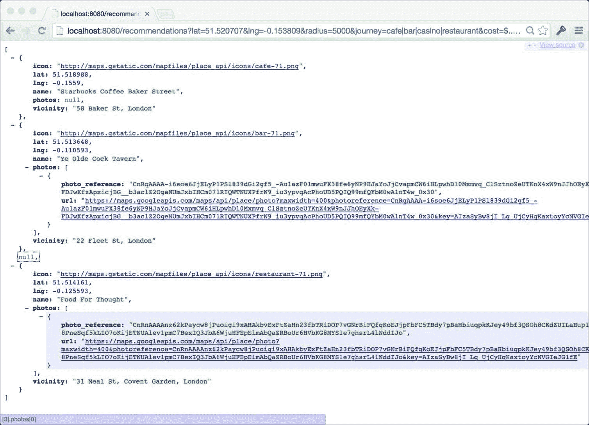

# 第七章. 随机推荐网络服务

我们在本章中将要构建的项目背后的概念很简单：我们希望用户能够根据我们通过 API 公开的预定义旅程类型生成特定地理位置的随机活动推荐。我们将给我们的项目取名为 Meander。

在现实世界的项目中，你通常不负责整个栈；有人可能构建了网站，另一个人可能编写了 iOS 应用程序，也许外包公司构建了桌面版本。在更成功的 API 项目中，你可能甚至不知道你的 API 的消费者是谁，尤其是如果它是一个公开 API 的话。

在本章中，我们将在实施 API 之前，通过与一个虚构的合作伙伴设计和同意一个最小 API 设计来模拟这种现实。一旦我们完成了我们这一部分的项目，我们将下载我们的队友构建的用户界面，以查看两者如何协同工作以产生最终的应用程序。

在本章中，你将：

+   学习如何使用简短和简单的敏捷用户故事来表达项目的总体目标

+   发现你可以在通过 API 设计达成一致的基础上在项目中达成一个会议点，这允许许多人并行工作

+   看看早期版本可以如何将数据固定写入代码并编译到程序中，这样我们可以在不触及接口的情况下稍后更改实现

+   学习一种策略，允许 struct（和其他类型）在需要隐藏或转换内部表示的情况下表示自己的公共版本

+   学习如何使用内嵌 struct 来表示嵌套数据，同时保持我们类型接口的简单性

+   学习如何使用`http.Get`来发起外部 API 请求，特别是对 Google Places API 的请求，而不产生代码膨胀

+   学习如何在 Go 中有效地实现枚举器，即使它们并不是真正的语言特性

+   经历一个真实的 TDD（测试驱动开发）示例

+   看看`math/rand`包如何使从切片中随机选择一个项目变得容易

+   学习一种简单的方法来从`http.Request`类型的 URL 参数中抓取数据

# 项目概述

按照敏捷方法论，让我们编写两个用户故事来描述我们项目的功能。用户故事不应该是不完整的文档，描述应用程序的全部功能集；相反，小卡片非常适合不仅描述用户试图做什么，还为什么这样做。此外，我们应该在不试图一开始就设计整个系统或深入实现细节的情况下完成这项工作。

首先，我们需要一个关于查看用户可以从中选择的不同旅程类型的故事：

| **作为** | **旅行者** |
| --- | --- |
| **我想** | 看看我可以获得推荐的不同旅程类型 |
| **为了** | 我可以决定带我的伴侣去哪种晚上的活动 |

其次，我们需要一个关于为选定的旅行类型提供随机推荐的故事：

| **作为一个** | **旅行者** |
| --- | --- |
| **我想** | 看到我选择的旅行类型的随机推荐 |
| **以便** | 我知道去哪里以及晚上将有什么活动 |

这两个故事代表了我们的 API 需要提供的两个核心功能，并且最终代表了两个端点。

为了发现指定地点周围的地方，我们将利用 Google Places API，它允许我们搜索具有给定类型（如`bar`、`cafe`或`movie_theater`）的商家列表。然后我们将使用 Go 的`math/rand`包从这些地点中随机选择，为我们的用户提供完整的旅程。

### 小贴士

Google Places API 支持许多商业类型；有关完整列表，请参阅[`developers.google.com/places/documentation/supported_types`](https://developers.google.com/places/documentation/supported_types)。

## 项目设计具体细节

为了将我们的故事变成一个交互式应用程序，我们将提供两个 JSON 端点：一个用于提供用户可以在应用程序中选择的旅行类型，另一个用于为选定的旅行类型生成随机推荐。

```go
GET /journeys 

```

前面的调用应该返回一个类似于以下列表的结果：

```go
[ 
  { 
    name: "Romantic", 
    journey: "park|bar|movie_theater|restaurant|florist" 
  }, 
  { 
    name: "Shopping", 
    journey: "department_store|clothing_store|jewelry_store" 
  } 
] 

```

`name`字段是应用程序生成的推荐类型的可读标签，而`journey`字段是支持旅行类型的管道分隔列表。我们将作为 URL 参数传递的旅行值传递给我们的另一个端点，该端点生成实际的推荐：

```go
GET /recommendations? 
 lat=1&lng=2&journey=bar|cafe&radius=10&cost=$...$$$$$ 

```

此端点负责查询 Google Places API 并在返回地点对象数组之前生成推荐。我们将使用 URL 中的参数来控制要进行的查询类型。`lat`和`lng`参数分别表示纬度和经度，告诉我们的 API 我们希望从世界的哪个地方获取推荐，而`radius`参数表示我们感兴趣的点的周围距离（以米为单位）。

`cost`值是以人类可读的方式表示 API 返回的地点的价格范围。它由两个值组成：一个下限和一个上限，由三个点分隔。美元字符的数量表示价格水平，其中`$`是最便宜的，而`$$$$$`是最贵的。使用这种模式，`$...$$`表示非常低成本的推荐，而`$$$$...$$$$$`则表示相当昂贵的体验。

### 小贴士

一些程序员可能会坚持认为成本范围应该用数值表示，但鉴于我们的 API 将由人们使用，为什么不使事情变得更有趣呢？这取决于作为 API 设计者的你。

对于这个调用，一个可能的负载示例可能看起来像这样：

```go
[ 
  { 
    icon: "http://maps.gstatic.com/mapfiles/place_api/icons/cafe-     
     71.png", 
    lat: 51.519583, lng: -0.146251, 
    vicinity: "63 New Cavendish St, London", 
    name: "Asia House", 
    photos: [{ 
      url: "https://maps.googleapis.com/maps/api/place/photo?        
      maxwidth=400&photoreference=CnRnAAAAyLRN" 
     }] 
  }, ... 
] 

```

返回的数组包含一个表示旅程中每个段落的随机推荐的地方对象，并按适当的顺序排列。前面的例子是在伦敦的咖啡馆。数据字段相当直观；`lat`和`lng`字段表示地点的位置，`name`和`vicinity`字段告诉我们业务是什么以及在哪里，`photos`数组提供了来自 Google 服务器的相关照片列表。`vicinity`和`icon`字段将帮助我们为用户提供更丰富的体验。

# 在代码中表示数据

我们首先将展示用户可以选择的旅程；因此，在`GOPATH`中创建一个名为`meander`的新文件夹，并添加以下`journeys.go`代码：

```go
package meander 
type j struct { 
  Name       string 
  PlaceTypes []string 
} 
var Journeys = []interface{}{ 
  j{Name: "Romantic", PlaceTypes: []string{"park", "bar",  
   "movie_theater", "restaurant", "florist", "taxi_stand"}}, 
  j{Name: "Shopping", PlaceTypes: []string{"department_store",  "cafe", 
   "clothing_store", "jewelry_store", "shoe_store"}}, 
  j{Name: "Night Out", PlaceTypes: []string{"bar", "casino", "food", 
   "bar", "night_club", "bar", "bar", "hospital"}}, 
  j{Name: "Culture", PlaceTypes: []string{"museum", "cafe", "cemetery", 
   "library", "art_gallery"}}, 
  j{Name: "Pamper", PlaceTypes: []string{"hair_care",  "beauty_salon", 
   "cafe", "spa"}}, 
} 

```

在这里，我们在`meander`包内部定义了一个名为`j`的内部类型，然后通过在`Journeys`切片内部创建其实例来描述旅程。这种方法是在不依赖外部数据存储的情况下在代码中表示数据的一种超简单方式。

### 小贴士

作为额外的作业，为什么不尝试在整个过程中保持`golint`满意呢？每次添加一些代码，就为包运行`golint`并满足出现的任何建议。它非常关注没有文档的导出项；因此，在正确的格式中添加简单的注释将使其保持满意。要了解更多关于`golint`的信息，请参阅[`github.com/golang/lint`](https://github.com/golang/lint)。

当然，这很可能会演变成那样，也许甚至允许用户创建和分享他们自己的旅程。由于我们通过 API 公开数据，我们可以自由地更改内部实现而不影响接口，因此这种方法非常适合版本 1。

### 小贴士

我们使用类型`[]interface{}`的切片，因为我们将在以后实现一种通用的公开数据方式，无论实际类型如何。

一场浪漫的旅程包括首先参观公园，然后是酒吧、电影院，接着是餐厅，在访问花店之后，最后乘坐出租车回家；你大概能理解这个概念。请随意发挥创意，并参考 Google Places API 支持的类型添加其他旅程。

你可能已经注意到，由于我们的代码包含在名为`meander`的包中（而不是`main`），我们的代码永远不能像我们迄今为止编写的其他 API 那样作为工具运行。在`meander`内部创建两个新文件夹，以便你有类似`meander/cmd/meander`的路径；这将容纳实际通过 HTTP 端点公开`meander`包功能的命令行工具。

由于我们主要是在构建一个用于我们蜿蜒项目的包（其他工具可以导入并使用），根目录中的代码是`meander`包，我们将我们的命令（`main`包）嵌套在`cmd`文件夹中。我们包括额外的最终`meander`文件夹，以遵循良好的实践，如果省略它，命令名将与文件夹相同，我们的命令将被称为`cmd`而不是`meander`，这可能会造成混淆。

在`cmd/meander`文件夹内，将以下代码添加到`main.go`文件中：

```go
package main 
func main() { 
  //meander.APIKey = "TODO" 
  http.HandleFunc("/journeys", func(w http.ResponseWriter,
  r *http.Request) { 
    respond(w, r, meander.Journeys) 
  }) 
  http.ListenAndServe(":8080", http.DefaultServeMux) 
} 
func respond(w http.ResponseWriter, r *http.Request, data  []interface{}) error { 
  return json.NewEncoder(w).Encode(data) 
} 

```

你会认出这是一个简单的 API 端点程序，映射到`/journeys`端点。

### 小贴士

你将不得不导入`encoding/json`、`net/http`和`runtime`包，以及你之前创建的自己的`meander`包。

在调用`net/http`包上的熟悉的`HandleFunc`函数以绑定我们的端点之前，我们在`meander`包中设置了`APIKey`的值（目前被注释掉，因为我们还没有实现它），然后只响应`meander.Journeys`变量。我们通过提供一个将指定数据编码到`http.ResponseWriter`类型的`respond`函数，从上一章借用了抽象响应的概念。

让我们通过在终端中导航到`cmd/meander`文件夹并使用`go run`来运行我们的 API 程序。在这个阶段我们不需要将其构建成一个可执行文件，因为它只是一个单独的文件：

```go
go run main.go

```

访问`http://localhost:8080/journeys`端点，并注意我们的`Journeys`数据负载被提供，看起来是这样的：

```go
[{ 
  Name: "Romantic", 
  PlaceTypes: [ 
    "park", 
    "bar", 
    "movie_theater", 
    "restaurant", 
    "florist", 
    "taxi_stand" 
  ] 
}, ...] 

```

这完全是可以接受的，但有一个主要的缺陷：它暴露了我们实现的一些内部信息。如果我们把`PlaceTypes`字段名改为`Types`，我们 API 中做出的承诺就会失效，因此我们避免这种情况是很重要的。

项目会随着时间的推移而发展和变化，尤其是那些成功的项目，作为开发者，我们应该尽我们所能来保护我们的客户免受演变的影响。抽象接口是做这件事的一个很好的方法，同样，负责我们数据对象面向公众的视图也是。

## Go 结构体的公共视图

为了控制 Go 中结构体的公共视图，我们需要发明一种方法，允许单个`journey`类型告诉我们它们希望如何被暴露。在根`meander`文件夹中，创建一个名为`public.go`的新文件，并添加以下代码：

```go
package meander 
type Facade interface { 
  Public() interface{} 
} 
func Public(o interface{}) interface{} { 
  if p, ok := o.(Facade); ok { 
    return p.Public() 
  } 
  return o 
} 

```

`Facade`接口公开了一个单一的`Public`方法，它将返回结构体的公共视图。导出的`Public`函数接受任何对象并检查它是否实现了`Facade`接口（它是否有`Public() interface{}`方法？）；如果实现了，它将调用该方法并返回结果；如果没有实现，它将原封不动地返回原始对象。这允许我们在将结果写入`ResponseWriter`对象之前通过`Public`函数传递任何内容，允许单个结构体控制它们的公共外观。

### 小贴士

通常，像我们的 `Facade` 这样的单方法接口会以它们描述的方法命名，例如 `Reader` 和 `Writer`。然而，`Publicer`这个名字很令人困惑，所以我故意打破了规则。

让我们在 `journeys.go` 中添加以下代码来实现我们的 `j` 类型的 `Public` 方法：

```go
func (j j) Public() interface{} { 
  return map[string]interface{}{ 
    "name":    j.Name, 
    "journey": strings.Join(j.PlaceTypes, "|"), 
  } 
} 

```

我们 `j` 类型的公共视图将 `PlaceTypes` 字段连接成一个由管道字符分隔的单个字符串，符合我们的 API 设计。

返回到 `cmd/meander/main.go` 并将 `respond` 方法替换为使用我们新 `Public` 函数的方法：

```go
func respond(w http.ResponseWriter, r *http.Request, data []interface{}) error { 
  publicData := make([]interface{}, len(data)) 
  for i, d := range data { 
    publicData[i] = meander.Public(d) 
  } 
  return json.NewEncoder(w).Encode(publicData) 
} 

```

在这里，我们遍历数据切片，对每个项目调用 `meander.Public` 函数，将结果构建成一个新的同大小切片。在我们的 `j` 类型中，其 `Public` 方法将被调用以提供数据的公共视图，而不是默认视图。在终端中，再次导航到 `cmd/meander` 文件夹，并在运行 `go run main.go` 之前访问 `http://localhost:8080/journeys`。请注意，相同的数据现在已更改为新的结构：

```go
[{ 
  journey: "park|bar|movie_theater|restaurant|florist|taxi_stand", 
  name: "Romantic" 
}, ...] 

```

### 注意

实现相同结果的一种替代方法是通过使用标签来控制字段名称，就像我们在前面的章节中所做的那样，并实现你自己的 `[]string` 类型，该类型提供了一个 `MarshalJSON` 方法，告诉编码器如何序列化你的类型。两者都是完全可以接受的，但 `Facade` 接口和 `Public` 方法可能更具表达性（如果有人阅读代码，这不是很明显吗？）并且给我们更多的控制。

# 生成随机推荐

为了从我们的代码随机构建推荐的地方，我们需要查询 Google Places API。在 `meander` 根目录下，添加以下 `query.go` 文件：

```go
package meander 
type Place struct { 
  *googleGeometry `json:"geometry"` 
  Name            string         `json:"name"` 
  Icon            string         `json:"icon"` 
  Photos          []*googlePhoto `json:"photos"` 
  Vicinity        string         `json:"vicinity"` 
} 
type googleResponse struct { 
  Results []*Place `json:"results"` 
} 
type googleGeometry struct { 
  *googleLocation `json:"location"` 
} 
type googleLocation struct { 
  Lat float64 `json:"lat"` 
  Lng float64 `json:"lng"` 
} 
type googlePhoto struct { 
  PhotoRef string `json:"photo_reference"` 
  URL      string `json:"url"` 
} 

```

此代码定义了我们解析 Google Places API 的 JSON 响应到可用对象所需的结构。

### 小贴士

前往 Google Places API 文档查看我们期望的响应示例。[`developers.google.com/places/documentation/search`](http://developers.google.com/places/documentation/search)

上述代码的大部分内容都很明显，但值得注意的是，`Place` 类型嵌入了 `googleGeometry` 类型，这允许我们按照 API 的要求表示嵌套数据，同时在我们的代码中将其扁平化。我们通过在 `googleGeometry` 中的 `googleLocation` 来实现这一点，这意味着我们甚至可以直接在 `Place` 对象上访问 `Lat` 和 `Lng` 值，尽管它们在技术上嵌套在其他结构中。

因为我们想控制 `Place` 对象的公开显示方式，让我们给这个类型以下 `Public` 方法：

```go
func (p *Place) Public() interface{} { 
  return map[string]interface{}{ 
    "name":     p.Name, 
    "icon":     p.Icon, 
    "photos":   p.Photos, 
    "vicinity": p.Vicinity, 
    "lat":      p.Lat, 
    "lng":      p.Lng, 
  } 
} 

```

### 小贴士

记得运行 `golint` 来查看哪些注释需要添加到导出项中。

## Google Places API 密钥

与大多数 API 一样，我们需要一个 API 密钥才能访问远程服务。前往 Google APIs Console，使用 Google 账户登录，并为 Google Places API 创建一个密钥。有关更详细的说明，请参阅 Google 开发者网站上的文档。

一旦你有了你的密钥，让我们在`meander`包内部创建一个变量来保存它。在`query.go`的顶部添加以下定义：

```go
var APIKey string 

```

现在，回到`main.go`，从`APIKey`行中移除双斜杠`//`，并将`TODO`值替换为 Google APIs Console 提供的实际密钥。记住，直接在代码中硬编码这样的密钥是不良的做法；相反，将它们分离到环境变量中是值得的，这样可以防止它们出现在源代码库中。

## Go 中的枚举器

为了处理我们 API 中的各种成本范围，使用枚举器（或**枚举**）来表示不同的值并处理字符串表示的转换是有意义的。Go 语言本身并不提供枚举器作为语言特性，但有一个巧妙的方法来实现它们，我们将在本节中探讨。

一个简单的灵活的清单，用于在 Go 中编写枚举器如下：

+   基于原始整数类型定义一个新的类型

+   当你需要用户指定适当的值时，使用该类型

+   使用`iota`关键字在`const`块中设置值，忽略第一个零值

+   实现一个映射，将合理的字符串表示与枚举器的值对应

+   在类型上实现一个`String`方法，该方法从映射中返回适当的字符串表示

+   实现一个`ParseType`函数，它使用映射将字符串转换为你的类型

现在，我们将编写一个枚举器来表示我们 API 中的成本级别。在根`meander`文件夹内创建一个名为`cost_level.go`的新文件，并添加以下代码：

```go
package meander 
type Cost int8 
const ( 
  _ Cost = iota 
  Cost1 
  Cost2 
  Cost3 
  Cost4 
  Cost5 
) 

```

在这里，我们定义了枚举器的类型，我们称之为`Cost`，由于我们只需要表示几个值，所以我们基于`int8`的范围。对于需要更大值的枚举器，你可以自由地使用任何与`iota`一起工作的整数类型。`Cost`类型现在是一个真正的类型，我们可以在需要表示支持的值的地方使用它，例如，我们可以将`Cost`类型作为函数的参数，或者我们可以将其用作结构体字段的类型。

我们然后定义该类型的一组常量，并使用`iota`关键字来指示我们想要常量的递增值。通过忽略第一个`iota`值（它总是零），我们表明必须显式使用指定的常量而不是零值。

为了提供枚举的字符串表示，我们只需要在`Cost`类型中添加一个`String`方法。即使你不需要在代码中使用这些字符串，这也是一个有用的练习，因为每次你使用 Go 标准库中的打印调用（如`fmt.Println`）时，默认情况下都会使用数值。通常，这些值没有意义，你需要查找它们，甚至数行来确定每个项目的数值。

### 注意

关于 Go 中`String()`方法的更多信息，请参考`fmt`包中的`Stringer`和`GoStringer`接口，网址为[`golang.org/pkg/fmt/#Stringer`](http://golang.org/pkg/fmt/#Stringer)。

### 测试驱动的枚举器

为了确保我们的枚举代码工作正确，我们将编写一些单元测试来对预期行为进行断言。

在`cost_level.go`旁边添加一个名为`cost_level_test.go`的新文件，并添加以下单元测试：

```go
package meander_test 
import ( 
  "testing" 
  "github.com/cheekybits/is" 
  "path/to/meander" 
) 
func TestCostValues(t *testing.T) { 
  is := is.New(t) 
  is.Equal(int(meander.Cost1), 1) 
  is.Equal(int(meander.Cost2), 2) 
  is.Equal(int(meander.Cost3), 3) 
  is.Equal(int(meander.Cost4), 4) 
  is.Equal(int(meander.Cost5), 5) 
} 

```

你需要运行`go get`来获取 CheekyBits 的`is`包（来自[`github.com/cheekybits/is`](https://github.com/cheekybits/is)）。

### 小贴士

`is`包是一个替代的测试辅助包，但这个包非常简单，故意保持基础。当你编写自己的项目或根本不使用它时，你可以选择你喜欢的。

通常，我们不会担心枚举器中常量的实际整数值，但鉴于 Google Places API 使用数值来表示相同的内容，我们需要关注这些值。

### 注意

你可能已经注意到了这个测试文件的一些奇怪之处，它打破了常规。尽管它位于根`meander`文件夹中，但它不是`meander`包的一部分；相反，它在`meander_test`中。

在 Go 中，这除了测试之外的所有情况下都是错误。因为我们把测试代码放入了自己的包中，这意味着我们不再能够访问`meander`包的内部。注意我们如何使用包前缀。这看起来可能是一个缺点，但实际上，它允许我们确信我们正在像真实用户一样测试这个包。我们只能调用导出方法，并且只能看到导出类型；就像我们的用户一样。我们无法对内部进行操作来做用户无法做的事情；这是一个真正的用户测试。在测试中，有时你需要调整内部状态，在这种情况下，你的测试需要与代码在同一个包中。

通过在终端中运行`go test`来运行测试，并注意它通过了。

让我们添加另一个测试来对每个`Cost`常量的字符串表示进行断言。在`cost_level_test.go`中添加以下单元测试：

```go
func TestCostString(t *testing.T) { 
  is := is.New(t) 
  is.Equal(meander.Cost1.String(), "$") 
  is.Equal(meander.Cost2.String(), "$$") 
  is.Equal(meander.Cost3.String(), "$$$") 
  is.Equal(meander.Cost4.String(), "$$$$") 
  is.Equal(meander.Cost5.String(), "$$$$$") 
} 

```

这个测试断言对每个常量调用`String`方法会得到预期的值。当然，运行这些测试将会失败，因为我们还没有实现`String`方法。

在`Cost`常量下方添加以下映射和`String`方法：

```go
var costStrings = map[string]Cost{ 
  "$":     Cost1, 
  "$$":    Cost2, 
  "$$$":   Cost3, 
  "$$$$":  Cost4, 
  "$$$$$": Cost5, 
} 
func (l Cost) String() string { 
  for s, v := range costStrings { 
    if l == v { 
      return s 
    } 
  } 
  return "invalid" 
} 

```

`map[string]Cost`变量将成本值映射到字符串表示形式，而`String`方法遍历映射以返回适当的值。

### 提示

在我们的情况下，简单的`strings.Repeat("$", int(l))`返回将同样有效（并且因为代码更简单而获胜）；但通常不会这样；因此，本节探讨了通用方法。

如果我们现在打印出`Cost3`值，我们实际上会看到`$$$`，这比数值更有用。由于我们想在 API 中使用这些字符串，我们还将添加一个`ParseCost`方法。

在`cost_value_test.go`中添加以下单元测试：

```go
func TestParseCost(t *testing.T) { 
  is := is.New(t) 
  is.Equal(meander.Cost1, meander.ParseCost("$")) 
  is.Equal(meander.Cost2, meander.ParseCost("$$")) 
  is.Equal(meander.Cost3, meander.ParseCost("$$$")) 
  is.Equal(meander.Cost4, meander.ParseCost("$$$$")) 
  is.Equal(meander.Cost5, meander.ParseCost("$$$$$")) 
} 

```

在这里，我们断言调用`ParseCost`将根据输入字符串产生适当的价值。

在`cost_value.go`中添加以下实现代码：

```go
func ParseCost(s string) Cost { 
  return costStrings[s] 
} 

```

解析`Cost`字符串非常简单，因为我们的映射就是这样布局的。

由于我们需要表示一系列成本值，让我们想象一个`CostRange`类型，并编写我们打算如何使用它的测试。将以下测试添加到`cost_value_test.go`中：

```go
func TestParseCostRange(t *testing.T) { 
  is := is.New(t) 
  var l meander.CostRange 
  var err error 
  l, err = meander.ParseCostRange("$$...$$$") 
  is.NoErr(err) 
  is.Equal(l.From, meander.Cost2) 
  is.Equal(l.To, meander.Cost3) 
  l, err = meander.ParseCostRange("$...$$$$$") 
  is.NoErr(err) 
  is.Equal(l.From, meander.Cost1) 
  is.Equal(l.To, meander.Cost5) 
} 
func TestCostRangeString(t *testing.T) { 
  is := is.New(t) 
  r := meander.CostRange{ 
    From: meander.Cost2, 
    To:   meander.Cost4, 
  } 
  is.Equal("$$...$$$$", r.String()) 
} 

```

我们指定，传入一个以两个美元符号开头，然后是三个点，最后是三个美元符号的字符串应该创建一个新的`meander.CostRange`类型，其中`From`设置为`meander.Cost2`，`To`设置为`meander.Cost3`。我们还使用`is.NoErr`来断言在解析我们的字符串时不会返回错误。第二个测试通过测试`CostRange.String`方法，该方法返回适当的值。

为了使我们的测试通过，添加以下`CostRange`类型及其相关的`String`和`ParseString`函数：

```go
type CostRange struct { 
  From Cost 
  To   Cost 
} 
func (r CostRange) String() string { 
  return r.From.String() + "..." + r.To.String() 
} 
func ParseCostRange(s string) (CostRange, error) { 
  var r CostRange 
  segs := strings.Split(s, "...") 
  if len(segs) != 2 { 
    return r, errors.New("invalid cost range") 
  } 
  r.From = ParseCost(segs[0]) 
  r.To = ParseCost(segs[1]) 
  return r, nil 
} 

```

这允许我们将类似于`$...$$$$$`的字符串转换为包含两个`Cost`值的结构：一个`From`和一个`To`，反之亦然。如果有人传入无效的成本范围（我们只是在点分割后的段数上执行简单的检查），则返回错误。如果您想进行额外的检查，例如确保字符串中只包含点和美元符号，您也可以在这里进行。

## 查询 Google Places API

现在我们能够表示 API 的结果，我们需要一种方式来表示和启动实际的查询。将以下结构添加到`query.go`中：

```go
type Query struct { 
  Lat          float64 
  Lng          float64 
  Journey      []string 
  Radius       int 
  CostRangeStr string 
} 

```

此结构包含构建查询所需的所有信息，所有这些信息实际上都来自客户端请求中的 URL 参数。接下来，添加以下`find`方法，该方法将负责向 Google 服务器发送实际请求：

```go
func (q *Query) find(types string) (*googleResponse, error) { 
  u :=  "https://maps.googleapis.com/maps/api/place/nearbysearch/json" 
  vals := make(url.Values) 
  vals.Set("location", fmt.Sprintf("%g,%g", q.Lat, q.Lng)) 
  vals.Set("radius", fmt.Sprintf("%d", q.Radius)) 
  vals.Set("types", types) 
  vals.Set("key", APIKey) 
  if len(q.CostRangeStr) > 0 { 
    r, err := ParseCostRange(q.CostRangeStr) 
    if err != nil { 
      return nil, err 
    } 
    vals.Set("minprice", fmt.Sprintf("%d", int(r.From)-1)) 
    vals.Set("maxprice", fmt.Sprintf("%d", int(r.To)-1)) 
  } 
  res, err := http.Get(u + "?" + vals.Encode()) 
  if err != nil { 
    return nil, err 
  } 
  defer res.Body.Close() 
  var response googleResponse 
  if err := json.NewDecoder(res.Body).Decode(&response); err != nil { 
    return nil, err 
  } 
  return &response, nil 
} 

```

首先，我们根据 Google Places API 规范构建请求 URL，通过附加`lat`、`lng`、`radius`和当然，`APIKey`值的`url.Values`编码字符串。

### 注意

`url.Values`类型实际上是`map[string][]string`类型，这就是为什么我们使用`make`而不是`new`。

我们作为参数指定的 `types` 值表示要查找的业务类型。如果有 `CostRangeStr`，我们将其解析并设置 `minprice` 和 `maxprice` 值，最后调用 `http.Get` 实际发出请求。如果请求成功，我们延迟关闭响应体，并使用 `json.Decoder` 方法将 API 返回的 JSON 解码到我们的 `googleResponse` 类型中。

## 构建推荐

接下来，我们需要编写一个方法，允许我们针对旅程中的不同步骤进行多次查找调用。在 `find` 方法下方，向 `Query` 结构体添加以下 `Run` 方法： 

```go
// Run runs the query concurrently, and returns the results. 
func (q *Query) Run() []interface{} { 
  rand.Seed(time.Now().UnixNano()) 
  var w sync.WaitGroup 
  var l sync.Mutex 
  places := make([]interface{}, len(q.Journey)) 
  for i, r := range q.Journey { 
    w.Add(1) 
    go func(types string, i int) { 
      defer w.Done() 
      response, err := q.find(types) 
      if err != nil { 
        log.Println("Failed to find places:", err) 
        return 
      } 
      if len(response.Results) == 0 { 
        log.Println("No places found for", types) 
        return 
      } 
      for _, result := range response.Results { 
        for _, photo := range result.Photos { 
          photo.URL =    
            "https://maps.googleapis.com/maps/api/place/photo?" + 
            "maxwidth=1000&photoreference=" + photo.PhotoRef + "&key=" 
             + APIKey 
        } 
      } 
      randI := rand.Intn(len(response.Results)) 
      l.Lock() 
      places[i] = response.Results[randI] 
      l.Unlock() 
    }(r, i) 
  } 
  w.Wait() // wait for everything to finish 
  return places 
} 

```

我们首先将随机种子设置为自 1970 年 1 月 1 日 UTC 以来纳秒级的当前时间。这确保了每次我们调用 `Run` 方法并使用 `rand` 包时，结果都会不同。如果我们不这样做，我们的代码每次都会提出相同的建议，这违背了初衷。

由于我们需要向 Google 发送许多请求，并且我们希望尽可能快地完成，我们将通过并发调用我们的 `Query.find` 方法同时运行所有查询。因此，接下来，我们创建 `sync.WaitGroup` 和一个映射来存储选定的地点，以及一个 `sync.Mutex` 方法，以允许许多 goroutines 安全地并发访问映射。

然后，我们遍历 `Journey` 切片中的每个项目，该项目可能是 `bar`、`cafe` 或 `movie_theater`。对于每个项目，我们向 `WaitGroup` 对象添加 `1` 并启动一个 goroutine。在例程内部，我们首先调用 `defer w.Done`，通知 `WaitGroup` 对象在调用我们的 `find` 方法进行实际请求之前，此请求已完成。假设没有错误发生并且确实找到了一些地点，我们遍历结果并为可能存在的任何照片构建一个可用的 URL。根据 Google Places API，我们得到了一个 `photoreference` 键，我们可以使用它来在另一个 API 调用中获取实际图像。为了使我们的客户端不必了解 Google Places API，我们为他们构建完整的 URL。

然后，我们锁定映射锁，通过调用 `rand.Intn` 随机选择一个选项并将其插入到 `places` 切片的正确位置，然后解锁 `sync.Mutex`。

最后，我们在返回地点之前，通过调用 `w.Wait` 等待所有 goroutines 完成。

## 使用查询参数的处理程序

现在，我们需要连接我们的 `/recommendations` 调用，所以回到 `cmd/meander` 文件夹中的 `main.go` 并在 `main` 函数中添加以下代码：

```go
http.HandleFunc("/recommendations", cors(func(w 
http.ResponseWriter, r *http.Request) { 
  q := &meander.Query{ 
    Journey: strings.Split(r.URL.Query().Get("journey"), "|"), 
  } 
  var err error 
  q.Lat, err = strconv.ParseFloat(r.URL.Query().Get("lat"), 64) 
  if err != nil { 
    http.Error(w, err.Error(), http.StatusBadRequest) 
    return 
  } 
  q.Lng, err = strconv.ParseFloat(r.URL.Query().Get("lng"), 64) 
  if err != nil { 
    http.Error(w, err.Error(), http.StatusBadRequest) 
    return 
  } 
  q.Radius, err = strconv.Atoi(r.URL.Query().Get("radius")) 
  if err != nil { 
    http.Error(w, err.Error(), http.StatusBadRequest) 
    return 
  } 
  q.CostRangeStr = r.URL.Query().Get("cost") 
  places := q.Run() 
  respond(w, r, places) 
})) 

```

此处理程序负责准备 `meander.Query` 对象并在响应结果之前调用其 `Run` 方法。`http.Request` 类型的 URL 值公开了提供 `Get` 方法的 `Query` 数据，该 `Get` 方法反过来查找给定键的值。

路径字符串是从 `bar|cafe|movie_theater` 格式通过管道字符分割转换为一个字符串切片。然后，通过调用 `strconv` 包中的几个函数，将字符串纬度、经度和半径值转换为数值类型。如果值格式不正确，我们将得到一个错误，然后我们将使用带有 `http.StatusBadRequest` 状态的 `http.Error` 辅助函数将错误写入客户端。

## CORS

我们 API 第一版中的最后一部分是实现 CORS，就像我们在上一章中所做的那样。在你阅读下一节关于解决方案的说明之前，看看你是否能自己解决这个问题。

### 小贴士

如果你打算自己解决这个问题，请记住你的目标是设置 `Access-Control-Allow-Origin` 响应头为 `*`。同时，考虑我们在上一章中做的 `http.HandlerFunc` 包装。这段代码的最佳位置可能是在 `cmd/meander` 程序中，因为它是通过 HTTP 端点公开功能的地方。

在 `main.go` 文件中，添加以下 `cors` 函数：

```go
func cors(f http.HandlerFunc) http.HandlerFunc { 
  return func(w http.ResponseWriter, r *http.Request) { 
    w.Header().Set("Access-Control-Allow-Origin", "*") 
    f(w, r) 
  } 
} 

```

这种熟悉的模式接受一个 `http.HandlerFunc` 类型，并在调用传入的函数之前设置适当的头信息，然后返回一个新的函数。现在，我们可以修改我们的代码，确保 `cors` 函数在我们的两个端点都被调用。更新 `main` 函数中的相应行：

```go
func main() { 
  meander.APIKey = "YOUR_API_KEY" 
  http.HandleFunc("/journeys", cors(func(w http.ResponseWriter,
  r *http.Request) 
  { 
    respond(w, r, meander.Journeys) 
  })) 
  http.HandleFunc("/recommendations", cors(func(w http.ResponseWriter, 
  r *http.Request) { 
    q := &meander.Query{ 
      Journey: strings.Split(r.URL.Query().Get("journey"), "|"), 
    } 
    var err error 
    q.Lat, err = strconv.ParseFloat(r.URL.Query().Get("lat"), 64) 
    if err != nil { 
      http.Error(w, err.Error(), http.StatusBadRequest) 
      return 
    } 
    q.Lng, err = strconv.ParseFloat(r.URL.Query().Get("lng"), 64) 
    if err != nil { 
      http.Error(w, err.Error(), http.StatusBadRequest) 
      return 
    } 
    q.Radius, err = strconv.Atoi(r.URL.Query().Get("radius")) 
    if err != nil { 
      http.Error(w, err.Error(), http.StatusBadRequest) 
      return 
    } 
    q.CostRangeStr = r.URL.Query().Get("cost") 
    places := q.Run() 
    respond(w, r, places) 
  })) 
  log.Println("serving meander API on :8080") 
  http.ListenAndServe(":8080", http.DefaultServeMux) 
} 

```

现在，我们的 API 调用将允许来自任何域，而不会发生跨域错误。

### 小贴士

你能否找到一种方法，通过移除对 `r.URL.Query()` 的多次调用来使代码更智能？也许你可以这样做一次，并将结果缓存到局部变量中。然后，你可以避免多次解析查询。

## 测试我们的 API

现在我们准备测试我们的 API，请前往控制台并导航到 `cmd/meander` 文件夹。因为我们的程序导入了 `meander` 包，所以构建程序将自动构建我们的 `meander` 包。

构建并运行程序：

```go
go build -o meanderapi
./meanderapi

```

为了从我们的 API 中获得有意义的输出，让我们花一分钟时间找到你熟悉的实际纬度和经度。前往 [`mygeoposition.com/`](http://mygeoposition.com/) 并使用网络工具获取你熟悉位置的 `x,y` 值。

或者，从这些流行的城市中选择：

+   英国伦敦：`51.520707 x 0.153809`

+   美国纽约：`40.7127840 x -74.0059410`

+   日本东京：`35.6894870 x 139.6917060`

+   美国旧金山：`37.7749290 x -122.4194160`

现在，打开一个网页浏览器，并使用适当的字段值访问 `/recommendations` 端点：

```go
http://localhost:8080/recommendations? 
  lat=51.520707&lng=-0.153809&radius=5000& 
  journey=cafe|bar|casino|restaurant& 
  cost=$...$$$ 

```

以下截图显示了伦敦附近的一个示例推荐可能的样子：



随意尝试调整 URL 中的值，通过尝试不同的旅程字符串、调整位置和尝试不同的成本范围值字符串，来查看这个简单的 API 有多强大。

### 网络应用程序

我们将下载一个完全按照相同 API 规范构建的完整网络应用程序，并将其指向我们的实现，以便在我们眼前看到它变得生动。请访问 [`github.com/matryer/goblueprints/tree/master/chapter7/meanderweb`](https://github.com/matryer/goblueprints/tree/master/chapter7/meanderweb)，并将 `meanderweb` 项目下载到您的 `GOPATH` 文件夹中（与您的根 `meander` 文件夹放在一起即可）。

在终端中导航到 `meanderweb` 文件夹，构建并运行它：

```go
go build -o meanderweb
./meanderweb

```

这将启动一个运行在 `localhost:8081` 的网站，它硬编码为查找运行在 `localhost:8080` 的 API。因为我们添加了 CORS 支持，所以尽管它们运行在不同的域上，这不会成为问题。

打开浏览器访问 `http://localhost:8081/` 并与应用程序进行交互；虽然有人构建了用户界面，但没有我们构建的用于提供动力的 API，它将毫无用处。

# 摘要

在本章中，我们构建了一个 API，它消费并抽象了 Google Places API，为用户提供了一种有趣且有趣的方式来规划他们的白天和晚上。

我们首先编写了一些简单而简短的用户故事，描述了我们希望在非常高的层面上实现的目标，而没有试图事先设计实现方案。为了并行化项目，我们同意将项目会议点定在 API 设计上，并朝着这个方向构建（正如我们的合作伙伴所做的那样）。

我们直接在代码中嵌入数据，避免了在项目早期阶段调查、设计和实现数据存储的需求。通过关注如何访问这些数据（通过 API 端点），我们允许未来的自己完全改变数据的存储方式和位置，而不会破坏任何使用我们的 API 编写的应用程序。

我们实现了 `Facade` 接口，它允许我们的结构体和其他类型提供它们的公共表示，而不透露关于我们实现的混乱或敏感细节。

我们对枚举器的探索为我们构建枚举类型提供了一个有用的起点，尽管语言中没有官方支持。我们使用的 `iota` 关键字使我们能够指定我们自己的数值类型的常量，具有递增的值。我们实现的常见 `String` 方法向我们展示了如何确保我们的枚举类型不会成为日志中的晦涩数字。同时，我们还看到了一个真实世界的 TDD 和红/绿编程的例子，我们编写了首先失败的单元测试，然后通过编写实现代码使它们通过。

在下一章中，我们将暂时放下网络服务，构建一个代码备份工具，我们将探讨 Go 语言如何使我们轻松地与本地文件系统交互。
