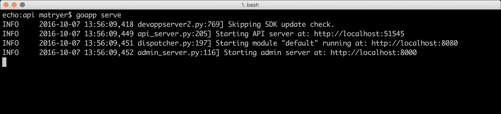
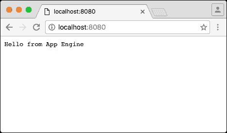
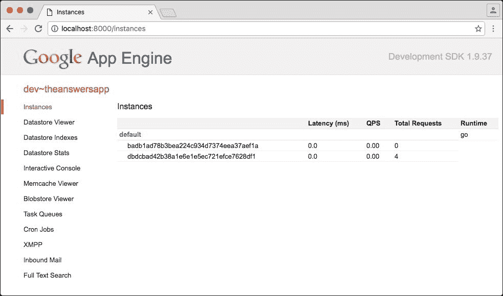
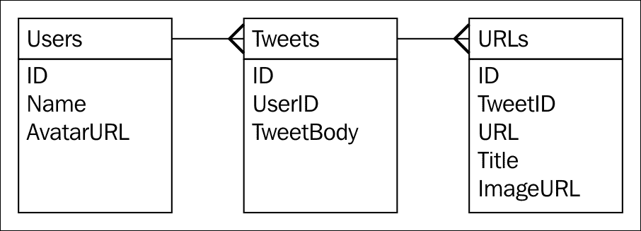
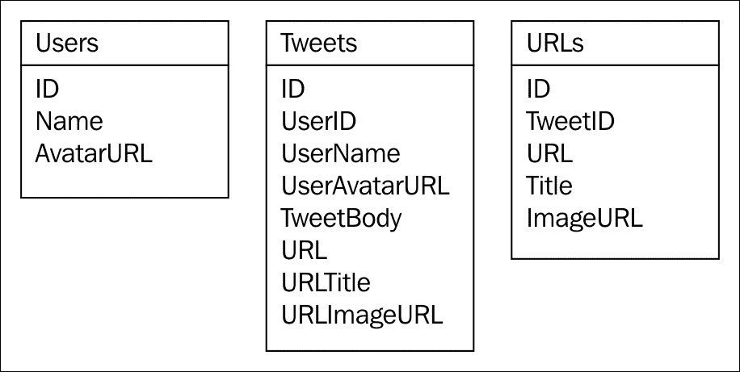

# 第九章：为 Google App Engine 构建 Q&A 应用程序

Google App Engine 为开发者提供了一种 **NoOps**（即 **No Operations**，表示开发者和工程师无需进行任何操作即可使代码运行并可用）的方式来部署他们的应用程序，而 Go 语言已经作为官方支持的语言选项存在了数年。Google 的架构运行着世界上一些最大的应用程序，例如 Google 搜索、Google 地图和 Gmail 等，因此在部署我们自己的代码时，这是一个相当安全的赌注。

Google App Engine 允许你编写一个 Go 应用程序，添加一些特殊的配置文件，并将其部署到 Google 的服务器上，在那里它将被托管并在一个高度可用、可扩展和弹性的环境中提供。实例将自动启动以满足需求，并在不再需要时优雅地关闭，同时保持健康的免费配额和预先批准的预算。

除了运行应用程序实例外，Google App Engine 还提供了一系列有用的服务，例如快速和大规模的数据存储、搜索、memcache 和任务队列。透明的负载均衡意味着你不需要构建和维护额外的软件或硬件来确保服务器不会过载，并且请求能够快速得到满足。

在本章中，我们将构建一个类似于 Stack Overflow 或 Quora 的问答服务的 API 后端，并将其部署到 Google App Engine。在这个过程中，我们将探讨可以应用于所有此类应用程序的技术、模式和最佳实践，并深入了解一些对我们应用程序更有用的服务。

具体来说，在本章中，你将学习：

+   如何使用 Google App Engine SDK for Go 在将应用程序部署到云端之前在本地构建和测试应用程序

+   如何使用 `app.yaml` 配置你的应用程序

+   Google App Engine 中的模块如何让你独立管理构成应用程序的不同组件

+   Google Cloud Datastore 如何让你以规模化的方式持久化和查询数据

+   在 Google Cloud Datastore 中建模数据和与键交互的合理模式

+   如何使用 Google App Engine Users API 对具有 Google 账户的人进行身份验证

+   将非规范化数据嵌入到实体中的模式

+   如何确保数据完整性和使用事务构建计数器

+   为什么在代码中保持良好的可读性有助于提高可维护性

+   如何在不添加第三方包依赖的情况下实现简单的 HTTP 路由

# Google App Engine SDK for Go

为了运行和部署 Google App Engine 应用程序，我们必须下载和配置 Go SDK。请访问 [`cloud.google.com/appengine/downloads`](https://cloud.google.com/appengine/downloads) 并下载适用于您计算机的最新 *Google App Engine SDK for Go*。ZIP 文件包含一个名为 `go_appengine` 的文件夹，您应该将其放置在 `GOPATH` 外的适当文件夹中，例如，在 `/Users/yourname/work/go_appengine`。

### 小贴士

这些 SDK 的名称将来可能会更改；如果发生这种情况，请确保您查阅项目主页上的说明，这些说明会在 [`github.com/matryer/goblueprints`](https://github.com/matryer/goblueprints) 指引您正确的方向。

接下来，您需要将 `go_appengine` 文件夹添加到您的 `$PATH` 环境变量中，就像您第一次配置 Go 时对 `go` 文件夹所做的那样。

要测试您的安装，请打开终端并输入以下内容：

```go
goapp version

```

您可能会看到以下类似的内容：

```go
go version go1.6.1 (appengine-1.9.37) darwin/amd64

```

### 注意

实际的 Go 版本可能有所不同，通常比实际的 Go 发布版落后几个月。这是因为 Google 的云平台团队需要在其端进行工作以支持 Go 的新版本。

`goapp` 命令是 `go` 命令的替代品，具有一些额外的子命令；因此，您可以执行类似 `goapp test` 和 `goapp vet` 之类的操作。

## 创建您的应用程序

为了将应用程序部署到 Google 的服务器，我们必须使用 Google Cloud Platform 控制台来设置它。在浏览器中，转到 [`console.cloud.google.com`](https://console.cloud.google.com/) 并使用您的 Google 账户登录。寻找 **创建项目** 菜单项，该菜单项通常会随着控制台的偶尔更改而移动。如果您已经有了一些项目，请点击项目名称以打开子菜单，您将在其中找到它。

### 小贴士

如果您找不到您想要的内容，只需搜索 **创建 App Engine 项目**，您就会找到它。

当 **新建项目** 对话框打开时，您将被要求为您的应用程序提供一个名称。您可以随意命名（例如，Answers），但请注意为您生成的项目 ID；您稍后配置应用程序时需要引用它。您还可以点击 **编辑** 并指定您自己的 ID，但请注意，该值必须是全局唯一的，因此您在构思时需要发挥创意。在这本书中，我们将使用 `answersapp` 作为应用程序 ID，但您无法使用它，因为它已经被占用。

您可能需要等待一分钟或两分钟以创建您的项目；您不需要监视页面，您可以继续并稍后检查。

## App Engine 应用程序是 Go 包

现在，Google App Engine SDK for Go 已配置，我们的应用程序也已创建，我们可以开始构建它了。

在 Google App Engine 中，一个应用程序只是一个带有`init`函数的正常 Go 包，该函数通过`http.Handle`或`http.HandleFunc`函数注册处理程序。它不需要像正常工具那样是`main`包。

在你的`GOPATH`文件夹内创建一个名为`answersapp/api`的新文件夹，并添加以下`main.go`文件：

```go
package api 
import ( 
  "io" 
  "net/http" 
) 
func init() { 
  http.HandleFunc("/", handleHello) 
} 
func handleHello(w http.ResponseWriter, r *http.Request) { 
  io.WriteString(w, "Hello from App Engine") 
} 

```

你现在应该熟悉大部分内容，但请注意，没有`ListenAndServe`调用，处理程序是在`init`函数中而不是`main`函数中设置的。我们将使用简单的`handleHello`函数来处理每个请求，该函数将只写入欢迎字符串。

## app.yaml 文件

为了将我们的简单 Go 包转换为 Google App Engine 应用程序，我们必须添加一个特殊的配置文件，称为`app.yaml`。该文件将位于应用程序或模块的根目录下，因此请在`answersapp/api`文件夹内创建它，并包含以下内容：

```go
application: YOUR_APPLICATION_ID_HERE 
version: 1 
runtime: go 
api_version: go1 
handlers: 
- url: /.* 
  script: _go_app 

```

该文件是一个简单的人类（和机器）可读的配置文件，以**YAML**（**另一种标记语言**）格式。以下表格描述了每个属性：

| **属性** | **描述** |
| --- | --- |
| `application` | 应用程序 ID（在创建项目时复制粘贴的）。 |
| `version` | 你的应用程序版本号。你可以部署多个版本，甚至可以在它们之间分割流量来测试新功能等。我们现在将坚持使用版本 1。 |
| `runtime` | 将执行你的应用程序的运行时名称。由于这是一本 Go 书，而且我们正在构建 Go 应用程序，我们将使用`go`。 |
| `api_version` | `go1` api 版本是 Google 支持的运行时版本；你可以想象未来这可能是`go2`。 |
| `handlers` | 配置的 URL 映射的选择。在我们的例子中，所有内容都将映射到特殊`_go_app`脚本，但你也可以在这里指定静态文件和文件夹。 |

## 在本地运行简单应用程序

在我们部署应用程序之前，在本地测试它是有意义的。我们可以使用我们之前下载的 App Engine SDK 来完成这项工作。

导航到你的`answersapp/api`文件夹，并在终端中运行以下命令：

```go
goapp serve

```

你应该看到以下输出：



这表示 API 服务器正在本地端口`:56443`上运行，管理服务器正在`:8000`上运行，我们的应用程序（默认模块）现在在`localhost:8080`上提供服务，所以让我们在浏览器中打开它。



如你所见，通过`Hello from App Engine`响应，我们的应用程序正在本地运行。通过将端口从`:8080`更改为`:8000`，导航到管理服务器。



前面的截图显示了我们可以用来查询应用程序内部结构的 Web 门户，包括查看运行实例、检查数据存储、管理任务队列等。

## 将简单应用程序部署到 Google App Engine

为了真正理解 Google App Engine 无操作（NoOps）承诺的力量，我们将把这个简单应用程序部署到云端。回到终端，通过按 *Ctrl*+*C* 停止服务器，并运行以下命令：

```go
goapp deploy

```

您的应用程序将被打包并上传到 Google 的服务器。一旦完成，您应该看到以下类似的内容：

```go
Completed update of app: theanswersapp, version: 1

```

真的是这样简单。

您可以通过导航到每个 Google App Engine 应用程序免费提供的端点来证明这一点，记得用您自己的应用程序 ID 替换：`https://YOUR_APPLICATION_ID_HERE.appspot.com/`。

您将看到与之前相同的输出（字体渲染可能会有所不同，因为 Google 的服务器将对内容类型做出假设，而本地开发服务器不会）。

### 注意

应用程序正在通过 HTTP/2 提供，并且已经能够处理相当大的规模，而我们所做的只是编写一个 `config` 文件和几行代码。

## Google App Engine 中的模块

模块是一个可以版本化、更新和管理独立的 Go 包。一个应用程序可能只有一个模块，或者它可以由许多模块组成，每个模块都是独立的，但又是同一应用程序的一部分，可以访问相同的数据和服务。即使应用程序没有做很多事情，它也必须有一个默认模块。

我们的应用程序将由以下模块组成：

| **描述** | **模块名称** |
| --- | --- |
| 必要的默认模块 | default |
| 提供 RESTful JSON 的 API 包 | api |
| 提供 HTML、CSS 和 JavaScript 的静态网站，该网站向 API 模块发出 AJAX 调用 | web |

每个模块都将是一个 Go 包，因此将存在于自己的文件夹中。

让我们通过在 `api` 文件夹旁边创建一个新的文件夹来重新组织我们的项目，命名为 `default`。

我们不会让默认模块做任何其他事情，除了用它来配置，因为我们希望其他模块做所有有意义的工作。但如果我们让这个文件夹为空，Google App Engine SDK 将会抱怨它没有东西可以构建。

在 `default` 文件夹内，添加以下占位符 `main.go` 文件：

```go
package defaultmodule 
func init() {} 

```

这个文件什么也不做，只是允许我们的 `default` 模块存在

### 注意

如果我们的包名能与文件夹匹配，那将很好，但 `default` 是 Go 中的一个保留关键字，所以我们有很好的理由打破这个规则。

我们应用程序中的另一个模块将被命名为 `web`，所以创建一个与 `api` 和 `default` 文件夹并排的新文件夹，命名为 `web`。在这一章中，我们只将构建我们应用程序的 API，并通过下载网络模块来作弊。

请访问项目主页[`github.com/matryer/goblueprints`](https://github.com/matryer/goblueprints)，访问**第二版**的内容，并在`README`文件的下载部分查找第九章的*Web 组件*下载链接，即*为 Google App Engine 构建问答应用*。ZIP 文件包含 Web 组件的源文件，应将其解压缩并放置在`web`文件夹内。

现在，我们的应用程序结构应该看起来像这样：

```go
/answersapp/api 
/answersapp/default 
/answersapp/web 

```

### 指定模块

要指定我们的`api`包将成为哪个模块，我们必须在我们的**api**文件夹中的`app.yaml`中添加一个属性。更新它以包含`module`属性：

```go
application: YOUR_APPLICATION_ID_HERE 
version: 1 
runtime: go 
module: api 
api_version: go1 
handlers: 
- url: /.* 
  script: _go_app 

```

由于我们的默认模块也需要部署，因此我们还需要向其中添加一个`app.yaml`配置文件。在`default/app.yaml`中复制`api/app.yaml`文件，将模块更改为`default`：

```go
application: YOUR_APPLICATION_ID_HERE 
version: 1 
runtime: go 
module: default 
api_version: go1 
handlers: 
- url: /.* 
  script: _go_app 

```

### 使用 dispatch.yaml 路由到模块

为了将流量适当地路由到我们的模块，我们将创建另一个名为`dispatch.yaml`的配置文件，它将允许我们将 URL 模式映射到模块。

我们希望所有以`/api/`路径开始的流量都路由到`api`模块，其他所有内容都路由到`web`模块。如前所述，我们不会期望我们的`default`模块处理任何流量，但它在以后会有更多用途。

在`answersapp`文件夹中（位于我们的模块文件夹之外），创建一个名为`dispatch.yaml`的新文件，内容如下：

```go
application: YOUR_APPLICATION_ID_HERE 
dispatch: 
  - url: "*/api/*" 
    module: api 
  - url: "*/*" 
    module: web 

```

同样的`application`属性告诉 Google App Engine SDK for Go 我们正在引用哪个应用程序，而`dispatch`部分将 URL 路由到模块。

# Google Cloud Datastore

App Engine 开发者可用的服务之一是 Google Cloud Datastore，这是一个为自动扩展和高性能而构建的 NoSQL 文档数据库。其有限的功能集保证了非常高的可扩展性，但了解注意事项和最佳实践对于成功项目至关重要。

## 反规范化数据

具有关系型数据库（RDBMS）经验的开发者通常会通过**规范化**数据，将其分散到多个表中，并在合并之前添加引用（外键），以减少数据冗余（试图让每条数据只在其数据库中显示一次），从而构建一个完整的图像。在无模式数据库和 NoSQL 数据库中，我们倾向于做相反的事情。我们**反规范化**数据，以便每个文档都包含它需要的完整图像，这使得读取时间极快，因为它只需要获取一个单一的事物。

例如，考虑我们如何在 MySQL 或 Postgres 等关系型数据库中建模推文：



一个推文本身只包含其唯一的 ID，一个指向表示推文作者的 Users 表的键外参照，以及可能在`TweetBody`中提到的许多 URL。

这个设计的一个优点是，用户可以更改他们的名字或头像 URL，这将反映在他们过去和未来的所有推文中，这在去规范化世界中是免费的。

然而，为了向用户展示推文，我们必须加载推文本身，通过连接查找用户以获取他们的名字和头像 URL，然后从 URL 表加载相关数据以显示链接的预览。在规模上，这变得很困难，因为这三个数据表可能物理上彼此分离，这意味着需要发生很多事情才能构建出这个完整的画面。

考虑一下去规范化设计会是什么样子：



我们仍然有相同的三类数据，但现在我们的推文包含了渲染给用户所需的所有内容，而无需从其他地方查找数据。现在，那些硬核的关系型数据库设计者已经意识到这意味着什么，这无疑让他们感到不安。

采用这种方法意味着：

+   数据是重复的 - 用户中的`AvatarURL`在推文中重复为`UserAvatarURL`（空间浪费，对吧？）

+   如果用户更改了`AvatarURL`，推文中的`UserAvatarURL`将过时

最终，数据库设计归结于物理层面。我们决定我们的推文将被阅读得比被写入的次数多得多，所以我们宁愿在前期承受痛苦并在存储上做出牺牲。只要理解了哪个集合是主集合，哪个是为了速度而复制的，重复的数据就没有什么问题。

数据的变更本身就是一个有趣的话题，但让我们思考一下我们可能为什么接受这种权衡。

首先，读取推文的速度优势可能值得主数据变更未反映在历史文档中的意外行为；出于这个原因，决定接受这种出现的功能是完全可以接受的。

其次，我们可能会决定保留特定时间点的数据快照是有意义的。例如，想象一下如果有人发推文询问人们是否喜欢他们的个人资料图片。如果图片改变了，推文上下文就会丢失。对于更严重的例子，考虑一下如果你在指向订单交付的地址表中的一行，而地址后来发生了变化，会发生什么。突然之间，订单可能看起来像被运往了不同的地方。

最后，存储变得越来越便宜，因此为了节省空间而进行数据规范化的需求减少了。Twitter 甚至将每个粉丝的整个推文文档都复制过来。在 Twitter 上有 100 个粉丝意味着你的推文至少会被复制 100 次，可能更多以增加冗余。这对关系型数据库爱好者来说听起来像是疯狂，但 Twitter 正在基于其用户体验做出明智的权衡；他们愿意花很多时间写推文并多次存储，以确保当你刷新你的信息流时，你不必等待很长时间才能获取更新。

### 注意

如果你想了解这个规模的感受，请查看 Twitter API 并查看一条推文文档包含的内容。这是一大批数据。然后，去看看 Lady Gaga 有多少粉丝。这在某些圈子中被称为“Lady Gaga 问题”，并且通过各种不同的技术和方法来解决，这些技术和方法超出了本章的范围。

现在我们已经了解了良好的 NoSQL 设计实践，让我们实现驱动我们 API 数据部分的类型、函数和方法。

# 实体和数据访问

要在 Google Cloud Datastore 中持久化数据，我们需要一个结构体来表示每个实体。这些实体结构体将在我们通过`datastore`API 保存和加载数据时进行序列化和反序列化。我们可以添加辅助方法来执行与数据存储的交互，这是一种将此类功能物理上靠近实体的好方法。例如，我们将使用名为`Answer`的结构体来建模答案，并添加一个`Create`方法，该方法会调用`datastore`包中的适当函数。这防止了我们的 HTTP 处理器因为大量的数据访问代码而膨胀，并允许我们保持它们的简洁和简单。

我们应用的基础块之一是问题的概念。一个问题可以被用户提出并由多人回答。它将有一个唯一的 ID，以便它是可寻址的（可以在 URL 中引用），我们还会存储创建时的时间戳。

在`answersapp`内部创建一个名为`questions.go`的新文件，并添加以下`struct`函数：

```go
type Question struct { 
  Key *datastore.Key `json:"id" datastore:"-"` 
  CTime time.Time `json:"created"` 
  Question string `json:"question"` 
  User UserCard `json:"user"` 
  AnswersCount int `json:"answers_count"` 
} 

```

结构描述了我们应用中的一个问题。其中大部分内容看起来相当明显，因为我们已经在之前的章节中做过类似的事情。`UserCard`结构体代表一个非规范化的`User`实体，这两个我们都会稍后添加。

### 小贴士

你可以使用以下方式在你的 Go 项目中导入`datastore`包：`import "google.golang.org/appengine/datastore"`

值得花点时间理解`datastore.Key`类型。

## Google Cloud Datastore 中的键

Datastore 中的每个实体都有一个键，它唯一地标识了它。它们可以由字符串或整数组成，具体取决于你的情况。你可以自己决定键，或者让 Datastore 为你自动分配它们；再次强调，你的用例通常将决定哪种方法最好，我们将在本章中探讨这两种方法。

键是通过`datastore.NewKey`和`datastore.NewIncompleteKey`函数创建的，并且通过`datastore.Get`和`datastore.Put`函数将数据放入和从 Datastore 中取出。

在 Datastore 中，键和实体体是分开的，与 MongoDB 或 SQL 技术不同，在那里它只是文档或记录中的另一个字段。这就是为什么我们使用`datastore:"-"`字段标签从`Question`结构体中排除`Key`的原因。就像`json`标签一样，这表示我们希望 Datastore 在获取和存储数据时完全忽略`Key`字段。

键可以可选地有父键，这是一种将相关数据分组在一起的好方法，Datastore 对这类实体组做出了一些保证，你可以在 Google Cloud Datastore 在线文档中了解更多信息。

## 将数据放入 Google Cloud Datastore

在我们将数据保存到 Datastore 之前，我们想要确保我们的问题是有效的。在`Question`结构体定义下面添加以下方法：

```go
func (q Question) OK() error { 
  if len(q.Question) < 10 { 
    return errors.New("question is too short") 
  } 
  return nil 
} 

```

如果问题有错误，`OK`函数将返回一个错误，否则将返回`nil`。在这种情况下，我们只是确保问题至少有 10 个字符。

为了将此数据持久化到数据存储中，我们将在`Question`结构体本身中添加一个方法。在`questions.go`的底部添加以下代码：

```go
func (q *Question) Create(ctx context.Context) error { 
  log.Debugf(ctx, "Saving question: %s", q.Question) 
  if q.Key == nil { 
    q.Key = datastore.NewIncompleteKey(ctx, "Question", nil) 
  } 
  user, err := UserFromAEUser(ctx) 
  if err != nil { 
    return err 
  } 
  q.User = user.Card() 
  q.CTime = time.Now() 
  q.Key, err = datastore.Put(ctx, q.Key, q) 
  if err != nil { 
    return err 
  } 
  return nil 
} 

```

`Create`方法接受一个指向`Question`的指针作为接收者，这是很重要的，因为我们想修改字段。

### 注意

如果接收者没有`*`而是`(q Question)`，我们会得到问题的副本而不是指向它的指针，并且我们对它所做的任何更改只会影响我们的本地副本，而不会影响原始的`Question`结构体本身。

我们首先使用`log`（来自[`godoc.org/google.golang.org/appengine/log`](https://godoc.org/google.golang.org/appengine/log)包）来写入一个调试语句，说明我们正在保存问题。当你在一个开发环境中运行你的代码时，你将在终端中看到这个语句；在生产环境中，它将进入由 Google Cloud Platform 提供的专用日志服务中。

如果键是`nil`（这意味着这是一个新问题），我们将一个不完整的键分配给字段，这会通知 Datastore 我们希望它为我们生成一个键。我们传递的三个参数是`context.Context`（我们必须传递给所有数据存储函数和方法），一个描述实体类型的字符串，以及父键；在我们的情况下，这是`nil`。

一旦我们知道已经有一个键存在，我们就调用一个方法（我们将在稍后添加）从 App Engine 用户获取或创建 `User` 并将其设置到问题中，然后设置 `CTime` 字段（创建时间）为 `time.Now`，标记问题被提出的时间点。

当我们的 `Question` 函数处于良好状态时，我们调用 `datastore.Put` 将其实际放置在数据存储中。像往常一样，第一个参数是 `context.Context`，然后是问题键和问题实体本身。

由于 Google Cloud Datastore 将键视为与实体分开且不同的，如果我们想在我们的代码中将它们放在一起，我们就必须做一些额外的工作。`datastore.Put` 方法返回两个参数：完整的键和 `error`。键参数实际上是有用的，因为我们发送了一个不完整的键并要求数据存储为我们创建一个，它在 put 操作期间这样做。如果成功，它返回一个新的 `datastore.Key` 对象给我们，代表完整的键，然后我们将其存储在 `Question` 对象的 `Key` 字段中。

如果一切顺利，我们返回 `nil`。

添加另一个辅助函数来更新现有问题：

```go
func (q *Question) Update(ctx context.Context) error { 
  if q.Key == nil { 
    q.Key = datastore.NewIncompleteKey(ctx, "Question", nil) 
  } 
  var err error 
  q.Key, err = datastore.Put(ctx, q.Key, q) 
  if err != nil { 
    return err 
  } 
  return nil 
} 

```

这个方法非常相似，只是它没有设置 `CTime` 或 `User` 字段，因为它们已经设置好了。

## 从 Google Cloud Datastore 读取数据

读取数据就像使用 `datastore.Get` 方法将其放入一样简单，但由于我们希望在实体中维护键（而 `datastore` 方法并不这样做），因此通常需要添加一个辅助函数，就像我们要添加到 `questions.go` 中的那样：

```go
func GetQuestion(ctx context.Context, key *datastore.Key) 
(*Question, error) { 
  var q Question 
  err := datastore.Get(ctx, key, &q) 
  if err != nil { 
    return nil, err 
  } 
  q.Key = key 
  return &q, nil 
} 

```

`GetQuestion` 函数接受 `context.Context` 和要获取的问题的 `datastore.Key` 方法。然后它执行一个简单的任务，调用 `datastore.Get` 并在返回之前将键分配给实体。当然，错误以通常的方式处理。

这是一个很好的模式，以便你的代码的用户知道他们永远不需要直接与 `datastore.Get` 和 `datastore.Put` 交互，而是使用可以确保实体正确填充键（以及他们可能在保存或加载之前想要做的任何其他调整）的辅助函数。

# Google App Engine 用户

我们还将使用另一个服务是 Google App Engine Users API，它提供 Google 帐户（和 Google Apps 帐户）的认证。

创建一个名为 `users.go` 的新文件，并添加以下代码：

```go
type User struct { 
  Key *datastore.Key `json:"id" datastore:"-"` 
  UserID string `json:"-"` 
  DisplayName string `json:"display_name"` 
  AvatarURL string `json:"avatar_url"` 
  Score int `json:"score"` 
} 

```

与 `Question` 结构体类似，我们有 `Key` 和一些组成 `User` 实体的字段。这个结构体代表一个属于我们应用程序的对象，描述了一个用户；我们将在系统中为每个经过认证的用户有一个，但这不是我们从 Users API 获取的用户对象。

导入 [`godoc.org/google.golang.org/appengine/user`](https://godoc.org/google.golang.org/appengine/user) 包并调用 `user.Current(context.Context)` 函数将返回 nil（如果没有用户经过身份验证）或 `user.User` 对象。此对象属于 Users API，不适合我们的数据存储，因此我们需要编写一个辅助函数，将 App Engine 用户转换为我们的 `User`。

### 小贴士

注意 `goimports` 不会自动导入 `os/user`；有时最好手动处理导入。

将以下代码添加到 `users.go` 文件中：

```go
func UserFromAEUser(ctx context.Context) (*User, error) { 
  aeuser := user.Current(ctx) 
  if aeuser == nil { 
    return nil, errors.New("not logged in") 
  } 
  var appUser User 
  appUser.Key = datastore.NewKey(ctx, "User", aeuser.ID, 0, nil) 
  err := datastore.Get(ctx, appUser.Key, &appUser) 
  if err != nil && err != datastore.ErrNoSuchEntity { 
    return nil, err 
  } 
  if err == nil { 
    return &appUser, nil 
  } 
  appUser.UserID = aeuser.ID 
  appUser.DisplayName = aeuser.String() 
  appUser.AvatarURL = gravatarURL(aeuser.Email) 
  log.Infof(ctx, "saving new user: %s", aeuser.String()) 
  appUser.Key, err = datastore.Put(ctx, appUser.Key, &appUser) 
  if err != nil { 
    return nil, err 
  } 
  return &appUser, nil 
} 

```

我们通过调用 `user.Current` 来获取当前经过身份验证的用户，如果它是 `nil`，则返回错误。这意味着用户未登录，操作无法完成。我们的 web 包将为我们检查并确保用户已登录，因此当它们到达 API 端点时，我们期望它们已经经过身份验证。

然后，我们创建一个新的 `appUser` 变量（它属于我们的 `User` 类型）并设置 `datastore.Key`。这次，我们不是创建一个不完整的键；相反，我们使用 `datastore.NewKey` 并指定一个字符串 ID，与用户 API ID 匹配。这个键的可预测性意味着在我们的应用程序中，每个经过身份验证的用户将只有一个 `User` 实体，同时它还允许我们无需查询即可加载 `User` 实体。

### 小贴士

如果我们将 App Engine 用户 ID 作为字段，那么我们需要进行查询以找到我们感兴趣的记录。与直接 `Get` 方法相比，查询是一个更昂贵的操作，因此如果可能，这种方法总是首选。

然后，我们调用 `datastore.Get` 来尝试加载 `User` 实体。如果这是用户第一次登录，将没有实体，返回的错误将是特殊的 `datastore.ErrNoSuchEntity` 变量。如果是这种情况，我们设置适当的字段并使用 `datastore.Put` 来保存它。否则，我们只需返回加载的 `User`。

### 注意

注意，我们在该函数中检查了早期返回。这是为了确保在不跟随代码的缩进块进进出出的情况下，我们的代码执行流程易于阅读。我称之为代码的视线，并在我的博客上写了一些关于它的内容，博客地址为 [`medium.com/@matryer`](https://medium.com/@matryer)。

目前，我们将再次使用 Gravatar 来处理头像图片，所以请将以下辅助函数添加到 `users.go` 文件的底部：

```go
func gravatarURL(email string) string { 
  m := md5.New() 
  io.WriteString(m, strings.ToLower(email)) 
  return fmt.Sprintf("//www.gravatar.com/avatar/%x", m.Sum(nil)) 
} 

```

## 嵌入非规范化数据

如果你还记得，我们的 `Question` 类型不将作者作为 `User`；相反，类型是 `UserCard`。当我们将非规范化数据嵌入到其他实体中时，有时我们希望它们看起来与主实体略有不同。在我们的例子中，由于我们没有在 `User` 实体中存储键（记住 `Key` 字段有 `datastore:"-"`），我们需要有一个新的类型来存储键。

在 `users.go` 文件的底部添加 `UserCard` 结构体及其为 `User` 相关的辅助方法：

```go
type UserCard struct { 
  Key         *datastore.Key `json:"id"` 
  DisplayName string         `json:"display_name"` 
  AvatarURL   string         `json:"avatar_url"` 
} 
func (u User) Card() UserCard { 
  return UserCard{ 
    Key:         u.Key, 
    DisplayName: u.DisplayName, 
    AvatarURL:   u.AvatarURL, 
  } 
} 

```

注意，`UserCard`没有指定`datastore`标签，所以`Key`字段确实会被持久化在数据存储中。我们的`Card()`辅助函数只是通过复制每个字段的值来构建和返回`UserCard`。这看起来很浪费，但提供了很好的控制，特别是如果你想嵌入的数据看起来与原始实体非常不同。

# Google Cloud Datastore 中的事务

事务允许您指定一系列对数据存储的更改，并将它们作为一个整体提交。如果任何单个操作失败，整个事务将不会应用。如果您想维护计数器或有多个人物实体依赖于彼此的状态，这将非常有用。在 Google Cloud Datastore 的事务期间，所有读取的实体都会被锁定（其他代码将阻止更改），直到事务完成，这提供了额外的安全性，并防止数据竞争。

### 注意

如果你在构建一家银行（这似乎很疯狂，但伦敦的 Monzo 公司确实正在使用 Go 构建一家银行），你可能将用户账户表示为一个名为`Account`的实体。要从账户 A 转账到账户 B，你需要确保从账户 A 扣除资金并作为单一事务存入账户 B。如果其中任何一个操作失败，人们可能不会高兴（公平地说，如果扣除操作失败，账户 A 的持有人可能会很高兴，因为 B 会得到钱而 A 不需要付出任何代价）。

为了了解我们将在哪里使用事务，让我们首先将模型答案添加到问题中。

创建一个名为`answers.go`的新文件，并添加以下结构和验证方法：

```go
type Answer struct { 
  Key    *datastore.Key `json:"id" datastore:"-"` 
  Answer string         `json:"answer"` 
  CTime  time.Time      `json:"created"` 
  User   UserCard       `json:"user"` 
  Score  int            `json:"score"` 
} 
func (a Answer) OK() error { 
  if len(a.Answer) < 10 { 
    return errors.New("answer is too short") 
  } 
  return nil 
} 

```

`Answer`类似于问题，有`datastore.Key`（将不会被持久化），有`CTime`来捕获时间戳，并嵌入`UserCard`（代表回答问题的人）。它还有一个`Score`整数字段，当用户对答案投票时，该字段会上升或下降。

## 使用事务来维护计数器

我们的`Question`结构体有一个名为`AnswerCount`的字段，我们打算在其中存储一个整数，表示问题所吸引的答案数量。

首先，让我们看看如果我们不使用事务来跟踪问题的答案 4 和 5 的并发活动来保持`AnswerCount`字段会发生什么：

| **步骤** | **答案 4** | **答案 5** | **Question.AnswerCount** |
| --- | --- | --- | --- |
| 1 | 加载问题 | 加载问题 | 3 |
| 2 | AnswerCount=3 | AnswerCount=3 | 3 |
| 3 | AnswerCount++ | AnswerCount++ | 3 |
| 4 | AnswerCount=4 | AnswerCount=4 | 3 |
| 5 | 保存答案和问题 | 保存答案和问题 | 4 |

从表中可以看出，如果没有锁定问题，如果答案同时到达，`AnswerCount`将最终变为 4 而不是 5。使用事务锁定将看起来像这样：

| **步骤** | **答案 4** | **答案 5** | **Question.AnswerCount** |
| --- | --- | --- | --- |
| 1 | 锁定问题 | 锁定问题 | 3 |
| 2 | AnswerCount=3 | 等待解锁 | 3 |
| 3 | AnswerCount++ | 等待解锁 | 3 |
| 4 | 保存答案和问题 | 等待解锁 | 4 |
| 5 | 释放锁 | 等待解锁 | 4 |
| 6 | 完成 | 锁定问题 | 4 |
| 7 |  | AnswerCount=4 | 4 |
| 8 |  | AnswerCount++ | 4 |
| 9 |  | 保存答案和问题 | 5 |

在这种情况下，首先获得锁的答案将执行其操作，而其他操作将在继续之前等待。这可能会减慢操作速度（因为它必须等待另一个操作完成），但为了得到正确的数字，这是值得付出的代价。

### 小贴士

最好将事务内的操作量尽可能保持小，因为在事务进行期间，您实际上是在阻止其他人。在事务之外，Google Cloud Datastore 非常快，因为它不提供相同类型的保证。

在代码中，我们使用`datastore.RunInTransaction`函数。将以下内容添加到`answers.go`中：

```go
func (a *Answer) Create(ctx context.Context, questionKey *datastore.Key) error { 
  a.Key = datastore.NewIncompleteKey(ctx, "Answer", questionKey) 
  user, err := UserFromAEUser(ctx) 
  if err != nil { 
    return err 
  } 
  a.User = user.Card() 
  a.CTime = time.Now() 
  err = datastore.RunInTransaction(ctx, func(ctx context.Context) error { 
    q, err := GetQuestion(ctx, questionKey) 
    if err != nil { 
      return err 
    } 
    err = a.Put(ctx) 
    if err != nil { 
      return err 
    } 
    q.AnswersCount++ 
    err = q.Update(ctx) 
    if err != nil { 
      return err 
    } 
    return nil 
  }, &datastore.TransactionOptions{XG: true}) 
  if err != nil { 
    return err 
  } 
  return nil 
} 

```

我们首先创建一个新的不完整键（使用`Answer`类型），并将父键设置为问题键。这意味着问题将成为所有这些答案的祖先。

### 小贴士

在 Google Cloud Datastore 中，祖先键是特殊的，建议您在 Google Cloud Platform 网站上阅读有关其细微之处的文档。

使用我们的`UserFromAEUser`函数，我们获取回答问题的用户，并在设置`CTime`为当前时间之前，在`Answer`内部设置`UserCard`，就像之前做的那样。

然后，我们通过调用`datastore.RunInTransaction`函数开始我们的事务，该函数接受一个上下文以及一个事务代码将要执行的函数。还有一个第三个参数，即一组`datastore.TransactionOptions`，我们需要使用它来将`XG`设置为`true`，这会通知数据存储我们将执行跨实体组的事务（包括`Answer`和`Question`类型）。

### 小贴士

当涉及到编写自己的函数和设计自己的 API 时，强烈建议将任何函数参数放在末尾；否则，如前述代码中的内联函数块会掩盖后面还有另一个参数的事实。很难意识到`TransactionOptions`对象是传递给`RunInTransaction`函数的参数，我怀疑谷歌团队中有人对此决定感到后悔。

事务通过为我们提供一个新上下文来工作，这意味着事务函数内的代码看起来与不在事务中时相同。这是一项很好的 API 设计（这也意味着我们可以原谅该函数不是最终参数）。

在事务函数内部，我们使用我们的`GetQuestion`辅助函数来加载问题。在事务函数内部加载数据是获取其锁的方式。然后我们保存答案，更新`AnswerCount`整数，并更新问题。如果一切顺利（前提是这些步骤中没有返回错误），答案将被保存，`AnswerCount`将增加一。

如果我们从事务函数返回错误，其他操作将被取消，并返回错误。如果发生这种情况，我们只需从我们的`Answer.Create`方法返回该错误，并让用户再次尝试。

接下来，我们将添加我们的`GetAnswer`辅助函数，它与我们的`GetQuestion`函数类似：

```go
func GetAnswer(ctx context.Context, answerKey *datastore.Key)  
(*Answer, error) { 
  var answer Answer 
  err := datastore.Get(ctx, answerKey, &answer) 
  if err != nil { 
    return nil, err 
  } 
  answer.Key = answerKey 
  return &answer, nil 
} 

```

现在我们将在`answers.go`中添加我们的`Put`辅助方法：

```go
func (a *Answer) Put(ctx context.Context) error { 
  var err error 
  a.Key, err = datastore.Put(ctx, a.Key, a) 
  if err != nil { 
    return err 
  } 
  return nil 
} 

```

这两个函数与`GetQuestion`和`Question.Put`方法非常相似，但让我们现在抵制抽象和简化代码的诱惑。

## 避免过早抽象

复制和粘贴通常被程序员视为坏事，因为这通常可以抽象出一般想法并**DRY**（**不要重复自己**）代码。然而，值得抵制立即这样做，因为很容易设计出一个糟糕的抽象，然后你将陷入其中，因为你的代码将开始依赖于它。最好是首先在几个地方复制代码，然后稍后回过头来看是否有一个合理的抽象隐藏在那里。

# Google Cloud Datastore 的查询

到目前为止，我们只将单个对象放入和取出 Google Cloud Datastore。当我们显示问题的答案列表时，我们希望一次性加载所有这些答案，这可以通过`datastore.Query`实现。

查询接口是一个流畅的 API，其中每个方法都返回相同的对象或修改后的对象，允许你将调用链在一起。你可以用它来构建一个包含排序、限制、祖先、过滤器等的查询。我们将用它来编写一个函数，该函数将加载给定问题的所有答案，首先显示最受欢迎的（那些具有更高`Score`值的）。

将以下函数添加到`answers.go`中：

```go
func GetAnswers(ctx context.Context, questionKey *datastore.Key)  
([]*Answer, error) { 
  var answers []*Answer 
  answerKeys, err := datastore.NewQuery("Answer"). 
    Ancestor(questionKey). 
    Order("-Score"). 
    Order("-CTime"). 
    GetAll(ctx, &answers) 
  for i, answer := range answers { 
    answer.Key = answerKeys[i] 
  } 
  if err != nil { 
    return nil, err 
  } 
  return answers, nil 
} 

```

我们首先创建一个指向`Answer`的空切片，并使用`datastore.NewQuery`开始构建查询。`Ancestor`方法表示我们只查找属于特定问题的答案，`Order`方法调用指定我们首先按降序`Score`排序，然后按最新排序。`GetAll`方法执行操作，它接受指向我们的切片的指针（结果将放入其中）并返回一个包含所有键的新切片。

### 小贴士

返回的键的顺序将与切片中实体的顺序相匹配。这就是我们知道哪个键对应于每个项目的方式。

由于我们将键和实体字段放在一起，我们在答案上遍历，并将`answer.Key`分配给`GetAll`返回的相应`datastore.Key`参数。

### 注意

我们在第一版中为了保持 API 简单，没有实现分页，但理想情况下你确实需要这样做；否则，随着问题和答案数量的增加，你最终会尝试在一个请求中发送所有内容，这可能会让用户和服务器不堪重负。

如果在我们的应用程序中有一个步骤是授权答案（以保护它免受垃圾邮件或不适当内容的影响），我们可能希望添加一个额外的过滤器，使`Authorized`为`true`，在这种情况下，我们可以这样做：

```go
datastore.NewQuery("Answer"). 
 Filter("Authorized =", true) 

```

### 小贴士

关于查询和过滤的更多信息，请参阅在线的 Google Cloud Datastore API 文档。

我们需要查询数据的另一个地方是在我们展示应用主页上的热门问题时。我们热门问题的第一版将只显示那些答案最多的问题；我们认为它们是最有趣的，但你可以将来更改此功能，而不会破坏 API，按分数或甚至按问题查看次数排序。

我们将在`Question`类型上构建`Query`，并使用`Order`方法首先按答案数量排序（数量最多者排在前面），然后按时间排序（也是数量最多/最新者排在前面）。我们还将使用`Limit`方法确保我们只为这个 API 选择前 25 个问题。稍后，如果我们实现了分页，我们甚至可以使这个排序动态化。

在`questions.go`中添加`TopQuestions`函数：

```go
func TopQuestions(ctx context.Context) ([]*Question, error) { 
  var questions []*Question 
  questionKeys, err := datastore.NewQuery("Question"). 
    Order("-AnswersCount"). 
    Order("-CTime"). 
    Limit(25). 
    GetAll(ctx, &questions) 
  if err != nil { 
    return nil, err 
  } 
  for i := range questions { 
    questions[i].Key = questionKeys[i] 
  } 
  return questions, nil 
} 

```

这段代码与加载答案类似，我们最终返回一个`Question`对象切片或一个错误。

# 投票

现在我们已经在应用程序中建模了问题和答案，是时候考虑投票可能的工作方式了。

让我们稍作设计：

+   用户根据自己的观点对答案进行上下投票

+   答案按其分数排序，因此最好的答案排在前面

+   每个人对每个答案只能投一次票

+   如果用户再次投票，他们应该替换他们之前的投票

我们将利用本章学到的几个知识点；事务将帮助我们确保正确计算答案的分数，我们还将再次使用可预测的键来确保每个人对每个答案只能投一次票。

我们首先构建一个结构来表示每个投票，并使用字段标签来更具体地说明我们希望数据存储如何索引我们的数据。
