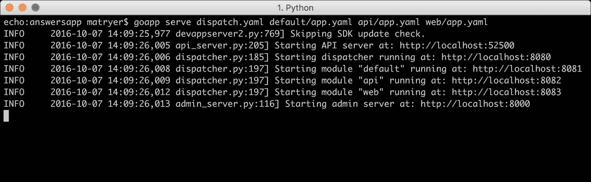
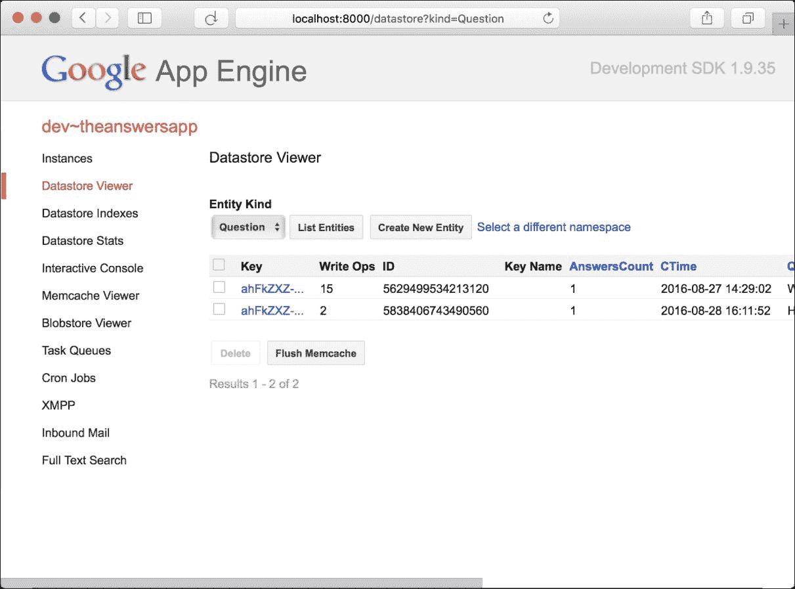

## 第三十三章：索引

由于广泛使用索引，从 Google Cloud Datastore 读取速度极快。默认情况下，我们结构中的每个字段都是索引的。尝试在未索引的字段上过滤的查询将失败（方法将返回错误）；数据存储不会像某些其他技术那样回退到扫描，因为这被认为太慢。如果一个查询过滤了两个或多个字段，必须添加一个额外的索引，该索引由所有字段组成。

当你放置一个包含 10 个字段的结构时，它将执行多个写操作：一个用于实体本身，一个用于需要更新的每个索引。因此，对于你不想查询的字段关闭索引是有意义的。

在 `questions.go` 中，向 `Question` 结构添加 `datastore` 字段标签：

```go
type Question struct { 
  Key *datastore.Key `json:"id" datastore:"-"` 
  CTime time.Time `json:"created" datastore:",noindex"` 
  Question string `json:"question" datastore:",noindex"` 
  User UserCard `json:"user"` 
  AnswersCount int `json:"answers_count"` 
} 

```

添加 `datastore:",noindex"` 字段标签将告诉数据存储不要索引这些字段。

### 注意

以逗号开头的 `,noindex` 值有点令人困惑。该值本质上是一个逗号分隔的参数列表，第一个是我们希望数据存储在存储每个字段时使用的名称（就像它对 `json` 标签所做的那样）。由于我们不想说任何关于我们希望数据存储使用的名称的事情，所以我们省略了真实字段名称；因此，第一个参数是空的，第二个参数是 `noindex`。

对于我们不想在 `Answer` 结构中索引的字段，这样做：

```go
type Answer struct { 
  Key *datastore.Key `json:"id" datastore:"-"` 
  Answer string `json:"answer" datastore:",noindex"` 
  CTime time.Time `json:"created"` 
  User UserCard `json:"user" datastore:",noindex"` 
  Score int `json:"score"` 
} 

```

对于 `Vote` 结构，这样做：

```go
type Vote struct { 
  Key *datastore.Key `json:"id" datastore:"-"` 
  MTime time.Time `json:"last_modified" datastore:",noindex"` 
  Question QuestionCard `json:"question" datastore:",noindex"` 
  Answer AnswerCard `json:"answer" datastore:",noindex"` 
  User UserCard `json:"user" datastore:",noindex"` 
  Score int `json:"score" datastore:",noindex"` 
} 

```

你也可以将 `noindex` 声明添加到我们卡片类型内部的全部字段：`AnswerCard`、`UserCard` 和 `QuestionCard`。

### 注意

我们没有添加 `noindex` 的字段将用于查询，我们需要确保 Google Cloud Datastore 确实在这些字段上维护索引。

## 嵌入实体的不同视图

现在是时候创建我们的 `Vote` 结构了，我们将在一个名为 `votes.go` 的新文件中完成：

```go
type Vote struct { 
  Key *datastore.Key `json:"id" datastore:"-"` 
  MTime time.Time `json:"last_modified" datastore:",noindex"` 
  Question QuestionCard `json:"question" datastore:",noindex"` 
  Answer AnswerCard `json:"answer" datastore:",noindex"` 
  User UserCard `json:"user" datastore:",noindex"` 
  Score int `json:"score" datastore:",noindex"` 
} 

```

`Vote` 结构包含许多我们可嵌入的卡片类型，代表 `Question`、`Answer` 和 `User` 投票。它还包含一个 `Score` 整数，其值为 `1` 或 `-1`（取决于他们是否投了赞成票或反对票）。我们还将使用 `MTime` `time.Time` 字段跟踪他们投票的时间（或最后更改它）。

### 注意

如果你喜欢，可以在 `Vote` 结构中使用 `*Card` 类型的指针。这会在你将 `Vote` 对象传入和传出函数时节省额外的副本，但这意味着在这些函数内部所做的任何更改都会影响原始数据，而不仅仅是它们的本地副本。在大多数情况下，使用指针的性能提升不大，可能更简单的是省略它们。这本书故意混合了两种方法，以向您展示它们是如何工作的，但在做出决定之前，您应该了解其影响。

就像我们的`UserCard`方法一样，我们将为问题和答案添加适当的版本，但这次我们将更仔细地选择哪些字段应该包含，哪些应该排除。

在`questions.go`中添加`QuestionCard`类型及其相关辅助方法：

```go
type QuestionCard struct { 
  Key *datastore.Key `json:"id" datastore:",noindex"` 
  Question string `json:"question" datastore:",noindex"` 
  User     UserCard `json:"user" datastore:",noindex"` 
} 
func (q Question) Card() QuestionCard { 
  return QuestionCard{ 
    Key:      q.Key, 
    Question: q.Question, 
    User:     q.User, 
  } 
} 

```

`QuestionCard`类型捕获`Question`字符串和谁提出了它（再次是我们的`UserCard`方法），但我们排除了`CTime`和`AnswersCount`字段。

让我们在`answers.go`中添加`AnswerCard`：

```go
type AnswerCard struct { 
  Key    *datastore.Key `json:"id" datastore:",noindex"` 
  Answer string         `json:"answer" datastore:",noindex"` 
  User   UserCard       `json:"user" datastore:",noindex"` 
} 

func (a Answer) Card() AnswerCard { 
  return AnswerCard{ 
    Key:    a.Key, 
    Answer: a.Answer, 
    User:   a.User, 
  } 
} 

```

同样，我们只捕获`Answer`字符串和`User`，排除`CTime`和`Score`。

决定要捕获哪些字段以及要排除哪些字段完全取决于你希望提供的用户体验。我们可能会决定，当我们显示投票时，我们想显示`Answer`在当时的分数，或者我们可能想显示`Answer`当前的分数，无论投票时它是什么。也许我们想向写答案的用户发送推送通知，比如“Blanca 已经对 Ernesto 的问题的答案进行了点赞，现在得分为 15”，在这种情况下，我们还需要获取`Score`字段。

# 投票

在我们的 API 功能完整之前，我们需要添加用户投票的能力。我们将把这个功能分成两个函数，以提高我们代码的可读性。

在`votes.go`内部，添加以下函数：

```go
func CastVote(ctx context.Context, answerKey *datastore.Key, score int) (*Vote, error) { 
  question, err := GetQuestion(ctx, answerKey.Parent()) 
  if err != nil { 
    return nil, err 
  } 
  user, err := UserFromAEUser(ctx) 
  if err != nil { 
    return nil, err 
  } 
  var vote Vote 
  err = datastore.RunInTransaction(ctx, func(ctx context.Context) error { 
    var err error 
    vote, err = castVoteInTransaction(ctx, answerKey, question, user, 
     score) 
    if err != nil { 
      return err 
    } 
    return nil 
  }, &datastore.TransactionOptions{XG: true}) 
  if err != nil { 
    return nil, err 
  } 
  return &vote, nil 
} 

```

`CastVote`函数接受（包括必填的`Context`）要投票的答案的`datastore.Key`和一个分数整数。它加载问题当前用户，开始数据存储事务，并将执行传递给`castVoteInTransaction`函数。

## 通过 datastore.Key 访问父键

我们的`CastVote`函数可能需要我们知道`Question`的`datastore.Key`以便加载它。但关于祖先键的一个很好的特性是，仅从键本身，你就可以访问父键。这是因为键的层次结构被保存在键本身中，有点像路径。

问题 1 可能有以下键的三个答案：

+   问题，1/答案，1

+   问题，1/答案，2

+   问题，1/答案，3

关键如何在底层工作的实际细节被保留在 datastore 包内部，并且可能会随时更改。因此，只依赖于 API 保证的事情是明智的，比如能够通过`Parent`方法访问父键。

## 代码的视线

相比于维护函数的成本，编写函数的成本相对较低，尤其是在成功且长期运行的项目中。因此，花时间确保代码可以被未来的我们和其他人阅读是值得的。

如果代码易于浏览，并且理解语句的通常、预期流程（即“快乐路径”），则可以说代码具有良好的视线。在 Go 中，我们可以通过编写代码时遵循一些简单的规则来实现这一点：

+   将“快乐路径”对齐到左侧边缘，这样你可以扫描单列并看到预期的执行流程。

+   不要将快乐路径逻辑隐藏在嵌套缩进的括号中

+   早期退出你的函数

+   仅缩进以处理错误或边缘情况

+   提取函数和方法以保持代码体小且可读

### 备注

写好视线代码还有一些更多细节，这些细节在 [`bit.ly/lineofsightincode`](http://bit.ly/lineofsightincode) 中概述并维护。

为了防止我们的 `CastVote` 函数变得太大且难以跟踪，我们将核心功能拆分到自己的函数中，现在我们将将其添加到 `votes.go` 中：

```go
func castVoteInTransaction(ctx context.Context, answerKey *datastore.Key, question *Question, user *User, score int) (Vote, error) { 
  var vote Vote 
  answer, err := GetAnswer(ctx, answerKey) 
  if err != nil { 
    return vote, err 
  } 
  voteKeyStr := fmt.Sprintf("%s:%s", answerKey.Encode(), user.Key.Encode()) 
  voteKey := datastore.NewKey(ctx, "Vote", voteKeyStr, 0, nil) 
  var delta int // delta describes the change to answer score 
  err = datastore.Get(ctx, voteKey, &vote) 
  if err != nil && err != datastore.ErrNoSuchEntity { 
    return vote, err 
  } 
  if err == datastore.ErrNoSuchEntity { 
    vote = Vote{ 
      Key:      voteKey, 
      User:     user.Card(), 
      Answer:   answer.Card(), 
      Question: question.Card(), 
      Score:    score, 
    } 
  } else { 
    // they have already voted - so we will be changing 
    // this vote 
    delta = vote.Score * -1 
  } 
  delta += score 
  answer.Score += delta 
  err = answer.Put(ctx) 
  if err != nil { 
    return vote, err 
  } 
  vote.Key = voteKey 
  vote.Score = score 
  vote.MTime = time.Now() 
  err = vote.Put(ctx) 
  if err != nil { 
    return vote, err 
  } 
  return vote, nil 
} 

```

虽然这个函数很长，但其视线并不太差。快乐路径沿着左侧边缘流动，我们仅缩进以在出现错误或创建新的 `Vote` 对象的情况下提前返回。这意味着我们可以轻松跟踪它在做什么。

我们接收答案键、相关问题和投票用户以及分数，并返回一个投票对象，或者在出错时返回一个错误。

首先，我们获取答案，由于我们处于事务中，它将锁定答案直到事务完成（或由于错误而停止）。

然后，我们为这次投票构建键，这个键由答案和用户键编码成单个字符串。这意味着对于每个用户/答案对，数据存储中只存在一个 `Vote` 实体；因此，根据我们的设计，用户对每个答案只能投一次票。

然后，我们使用投票键尝试从数据存储中加载 `Vote` 实体。当然，当用户第一次对一个问题进行投票时，将不存在实体，我们可以通过检查 `datastore.Get` 返回的错误是否是特殊的 `datastore.ErrNoSuchEntity` 值来检查这一点。如果是，我们创建新的 `Vote` 对象，并设置适当的字段。

我们维护一个名为 `delta` 的分数整数，它将代表在投票发生后需要添加到答案分数中的数字。当用户第一次对一个问题进行投票时，`delta` 将是 `1` 或 `-1`。如果他们从反对变为支持（`-1` 到 `1`），`delta` 将是 `2`，这将取消之前的投票并添加新的投票。我们通过将 `delta` 乘以 `-1` 来撤销之前的投票（如果有的话，即 `err != datastore.ErrNoSuchEntity`）。这也有一个很好的效果，即如果他们意外地在两个方向上投了相同的票两次，也不会有任何区别（`delta` 将为 0）。

最后，我们在更新 `Vote` 对象的最终字段并将它放回数据存储之前，更改答案的分数。然后我们返回，我们的 `CastVote` 函数退出 `datastore.RunInTransaction` 函数块，从而释放答案，让其他人也可以对其投票。

# 通过 HTTP 暴露数据操作

现在我们已经构建了所有实体以及操作它们的数据库访问方法，是时候将它们连接到 HTTP API 上了。这会感觉更熟悉，因为我们已经在书中做过几次类似的事情了。

## 带类型断言的可选功能

当你在 Go 中使用接口类型时，你可以执行类型断言来查看对象是否实现了其他接口，并且由于你可以内联编写接口，因此可以非常容易地找出对象是否实现了特定函数。

如果`v`是`interface{}`，我们可以使用以下模式查看它是否有`OK`方法：

```go
if obj, ok := v.(interface{ OK() error }); ok { 
  // v has OK() method 
} else { 
  // v does not have OK() method 
} 

```

如果`v`对象实现了接口中描述的方法，`ok`将为`true`，并且`obj`将是一个可以调用 OK 方法的对象。否则，`ok`将为`false`。

### 注意

这种方法的一个问题是它隐藏了代码用户的秘密功能，因此你必须非常详细地记录该函数，以便使其清晰，或者可能将该方法提升为其自己的第一类接口，并坚持要求所有对象实现它。记住，我们总是寻求清晰的代码而不是巧妙的代码。作为辅助练习，看看你是否可以添加接口并在解码签名中使用它。

我们将添加一个函数，帮助我们解码 JSON 请求体，并且可选地验证输入。创建一个名为`http.go`的新文件，并添加以下代码：

```go
func decode(r *http.Request, v interface{}) error { 
  err := json.NewDecoder(r.Body).Decode(v) 
  if err != nil { 
    return err 
  } 
  if valid, ok := v.(interface { 
    OK() error 
  }); ok { 
    err = valid.OK() 
    if err != nil { 
      return err 
    } 
  } 
  return nil 
} 

```

解码函数接受`http.Request`和一个名为`v`的目标值，其中 JSON 数据将放入。我们检查是否实现了`OK`方法，如果是，则调用它。我们期望`OK`在对象看起来不错时返回`nil`；否则，我们期望它返回一个错误，解释出了什么问题。如果我们得到一个错误，我们将返回它，并让调用代码处理它。

如果一切顺利，我们在函数底部返回`nil`。

## 响应辅助函数

我们将添加一对辅助函数，这将使响应 API 请求变得容易。将`respond`函数添加到`http.go`中：

```go
func respond(ctx context.Context, w http.ResponseWriter,
 r *http.Request, v interface{}, code int) { 
  var buf bytes.Buffer 
  err := json.NewEncoder(&buf).Encode(v) 
  if err != nil { 
    respondErr(ctx, w, r, err, http.StatusInternalServerError) 
    return 
  } 
  w.Header().Set("Content-Type", 
   "application/json; charset=utf-8") 
  w.WriteHeader(code) 
  _, err = buf.WriteTo(w) 
  if err != nil { 
    log.Errorf(ctx, "respond: %s", err) 
  } 
} 

```

响应方法包含一个`context`、`ResponseWriter`、`Request`、要响应的对象和状态码。它在设置适当的头和写入响应之前将`v`编码到内部缓冲区中。

我们在这里使用缓冲区，因为编码可能会失败。如果它失败了，但已经开始写入响应，那么 200 OK 头将被发送到客户端，这是误导的。相反，将编码到缓冲区让我们能够确保在决定响应的状态码之前，它能够无问题地完成。

现在将`respondErr`函数添加到`http.go`文件的底部：

```go
func respondErr(ctx context.Context, w http.ResponseWriter,
 r *http.Request, err error, code int) { 
  errObj := struct { 
    Error string `json:"error"` 
  }{ Error: err.Error() } 
  w.Header().Set("Content-Type", "application/json; charset=utf-8") 
  w.WriteHeader(code) 
  err = json.NewEncoder(w).Encode(errObj) 
  if err != nil { 
    log.Errorf(ctx, "respondErr: %s", err) 
  } 
} 

```

这个函数将`error`封装在一个结构体中，该结构体将错误字符串作为名为`error`的字段嵌入。

## 解析路径参数

我们的一些 API 端点将需要从路径字符串中提取 ID，但我们不想向我们的项目添加任何依赖（例如外部路由包）；相反，我们将编写一个简单的函数来为我们解析路径参数。

让我们先编写一个测试来解释我们希望我们的路径解析如何工作。创建一个名为 http_test.go 的文件，并添加以下单元测试：

```go
func TestPathParams(t *testing.T) { 
  r, err := http.NewRequest("GET", "1/2/3/4/5", nil) 
  if err != nil { 
    t.Errorf("NewRequest: %s", err) 
  } 
  params := pathParams(r, "one/two/three/four") 
  if len(params) != 4 { 
    t.Errorf("expected 4 params but got %d: %v", len(params), params) 
  } 
  for k, v := range map[string]string{ 
    "one":   "1", 
    "two":   "2", 
    "three": "3", 
    "four":  "4", 
  } { 
    if params[k] != v { 
      t.Errorf("%s: %s != %s", k, params[k], v) 
    } 
  } 
  params = pathParams(r, "one/two/three/four/five/six") 
  if len(params) != 5 { 
    t.Errorf("expected 5 params but got %d: %v", len(params), params) 
  } 
  for k, v := range map[string]string{ 
    "one":   "1", 
    "two":   "2", 
    "three": "3", 
    "four":  "4", 
    "five":  "5", 
  } { 
    if params[k] != v { 
      t.Errorf("%s: %s != %s", k, params[k], v) 
    } 
  } 
} 

```

我们期望能够传递一个模式，并返回一个映射，该映射从 `http.Request` 中的路径发现值。

运行测试（使用 `go test -v`），并注意它失败了。

在 `http.go` 的底部，添加以下实现以使测试通过：

```go
func pathParams(r *http.Request,pattern string) map[string]string{ 
  params := map[string]string{} 
  pathSegs := strings.Split(strings.Trim(r.URL.Path, "/"), "/") 
  for i, seg := range strings.Split(strings.Trim(pattern, "/"), "/") { 
    if i > len(pathSegs)-1 { 
      return params 
    } 
    params[seg] = pathSegs[i] 
  } 
  return params 
} 

```

该函数从特定的 `http.Request` 路径中分解，并构建一个包含从分解模式路径中获取的键的值映射。因此，对于模式 `/questions/id` 和路径 `/questions/123`，它将返回以下映射：

```go
questions: questions
id:        123

```

当然，我们会忽略 `questions` 键，但 `id` 将是有用的。

## 通过 HTTP API 暴露功能

现在我们已经拥有了构建我们的 API 所需的所有工具：用于在 JSON 中编码和解码数据负载的辅助函数、路径解析函数，以及所有实体和数据访问功能，以在 Google Cloud Datastore 中持久化和查询数据。

### Go 中的 HTTP 路由

我们将要添加的三个端点，以便处理问题，已在以下表格中概述：

| **HTTP 请求** | **描述** |
| --- | --- |
| `POST /questions` | 提出一个新问题 |
| `GET /questions/{id}` | 获取具有特定 ID 的问题 |
| `GET /questions` | 获取顶级问题 |

由于我们的 API 设计相对简单，没有必要通过添加额外的依赖来膨胀我们的项目以解决路由问题。相反，我们将使用正常的 Go 代码编写一个非常简单的 adhoc 路由。我们可以使用简单的 `switch` 语句来检测使用了哪种 HTTP 方法，并使用我们的 `pathParams` 辅助函数来查看是否指定了 ID，然后再将执行传递到适当的位置。

创建一个名为 `handle_questions.go` 的新文件，并添加以下 `http.HandlerFunc` 函数：

```go
func handleQuestions(w http.ResponseWriter, r *http.Request) { 
  switch r.Method { 
  case "POST": 
    handleQuestionCreate(w, r) 
  case "GET": 
    params := pathParams(r, "/api/questions/:id") 
    questionID, ok := params[":id"] 
    if ok { // GET /api/questions/ID 
      handleQuestionGet(w, r, questionID) 
      return 
    } 
    handleTopQuestions(w, r) // GET /api/questions/ 
  default: 
    http.NotFound(w, r) 
  } 
} 

```

如果 HTTP 方法是 `POST`，则我们将调用 `handleQuestionCreate`。如果是 `GET`，则我们将查看是否可以从路径中提取 ID，如果可以，则调用 `handleQuestionGet`，否则调用 `handleTopQuestions`。

## Google App Engine 中的 Context

如果你还记得，我们调用 App Engine 函数时，所有调用都使用了 `context.Context` 对象作为第一个参数，但那是什么，我们如何创建一个？

`Context`实际上是一个接口，它提供取消信号、执行截止时间和在整个函数调用堆栈中跨许多组件和 API 边界请求范围内的数据。Google App Engine SDK for Go 在其 API 中使用它，其细节保留在包内部，这意味着我们（作为 SDK 的用户）不必担心它。当您在自己的包中使用 Context 时，这是一个好的目标；理想情况下，复杂性应该保持在内部并隐藏起来。

### 注意

您可以通过各种在线资源了解更多关于`Context`的信息，从[`blog.golang.org/context`](https://blog.golang.org/context)上的*Go Concurrency Patterns: Context*博客文章开始。

要创建适合 App Engine 调用的上下文，您使用`appengine.NewContext`函数，该函数接受`http.Request`作为参数，上下文将属于该参数。

在我们刚刚添加的路由代码下面，让我们添加一个负责创建问题的处理器，我们可以看到我们将为每个请求创建一个新的上下文：

```go
func handleQuestionCreate(w http.ResponseWriter, r *http.Request) { 
  ctx := appengine.NewContext(r) 
  var q Question 
  err := decode(r, &q) 
  if err != nil { 
    respondErr(ctx, w, r, err, http.StatusBadRequest) 
    return 
  } 
  err = q.Create(ctx) 
  if err != nil { 
    respondErr(ctx, w, r, err, http.StatusInternalServerError) 
    return 
  } 
  respond(ctx, w, r, q, http.StatusCreated) 
} 

```

我们创建`Context`并将其存储在`ctx`变量中，这在 Go 社区中已经变成了一种接受的模式。然后我们在调用我们之前编写的`Create`辅助方法之前解码我们的`Question`（由于`OK`方法，它也会为我们验证它）。每一步，我们都传递我们的上下文。

如果有任何问题发生，我们会调用我们的`respondErr`函数，该函数会在返回并提前退出函数之前向客户端写入响应。

如果一切顺利，我们将以`Question`和`http.StatusCreated`状态代码（201）进行响应。

## 解码键字符串

由于我们将`datastore.Key`对象作为`id`字段暴露在我们的对象中（通过`json`字段标签），我们期望我们的 API 用户在引用特定对象时传递回这些相同的 ID 字符串。这意味着我们需要解码这些字符串并将它们转换回`datastore.Key`对象。幸运的是，`datastore`包以`datastore.DecodeKey`函数的形式提供了答案。

在`handle_questions.go`的底部，添加以下处理函数以获取单个问题：

```go
func handleQuestionGet(w http.ResponseWriter, r *http.Request,
 questionID string) { 
  ctx := appengine.NewContext(r) 
  questionKey, err := datastore.DecodeKey(questionID) 
  if err != nil { 
    respondErr(ctx, w, r, err, http.StatusBadRequest) 
    return 
  } 
  question, err := GetQuestion(ctx, questionKey) 
  if err != nil { 
    if err == datastore.ErrNoSuchEntity { 
      respondErr(ctx, w, r, datastore.ErrNoSuchEntity,
       http.StatusNotFound) 
      return 
    } 
    respondErr(ctx, w, r, err, http.StatusInternalServerError) 
    return 
  } 
  respond(ctx, w, r, question, http.StatusOK) 
} 

```

在我们再次创建 Context 之后，我们将解码`问题 ID`参数，将其字符串转换回`datastore.Key`对象。`问题 ID`字符串是从我们添加在文件顶部的路由处理器代码中传递进来的。

假设`问题 ID`是一个有效的键，并且 SDK 成功将其转换为`datastore.Key`，我们将调用我们的`GetQuestion`辅助函数来加载`Question`。如果我们得到`datastore.ErrNoSuchEntity`错误，那么我们将以 404（未找到）状态响应；否则，我们将使用`http.StatusInternalServerError`代码报告错误。

### 小贴士

在编写 API 时，检查 HTTP 状态码和其他 HTTP 标准，看看你是否可以利用它们。开发者们已经习惯了这些，如果你的 API 使用相同的语言，它将感觉更加自然。

如果我们能够加载问题，我们就调用 `respond` 并将 JSON 格式的数据发送回客户端。

接下来，我们将通过一个与用于问题的类似 API 来公开与答案相关的功能：

| **HTTP 请求** | **描述** |
| --- | --- |
| `POST /answers` | 提交答案 |
| `GET /answers` | 使用指定的问题 ID 获取答案 |

创建一个名为 `handle_answers.go` 的新文件，并添加路由 `http.HandlerFunc` 函数：

```go
func handleAnswers(w http.ResponseWriter, r *http.Request) { 
  switch r.Method { 
  case "GET": 
    handleAnswersGet(w, r) 
  case "POST": 
    handleAnswerCreate(w, r) 
  default: 
    http.NotFound(w, r) 
  } 
} 

```

对于 `GET` 请求，我们调用 `handleAnswersGet`；对于 `POST` 请求，我们调用 `handleAnswerCreate`。默认情况下，我们将响应一个 `404 Not Found`。

### 使用查询参数

作为解析路径的替代方案，你可以直接从请求的 URL 中获取查询参数，当我们添加读取答案的处理程序时，我们将这样做：

```go
func handleAnswersGet(w http.ResponseWriter, r *http.Request) { 
  ctx := appengine.NewContext(r) 
  q := r.URL.Query() 
  questionIDStr := q.Get("question_id") 
  questionKey, err := datastore.DecodeKey(questionIDStr) 
  if err != nil { 
    respondErr(ctx, w, r, err, http.StatusBadRequest) 
    return 
  } 
  answers, err := GetAnswers(ctx, questionKey) 
  if err != nil { 
    respondErr(ctx, w, r, err, http.StatusInternalServerError) 
    return 
  } 
  respond(ctx, w, r, answers, http.StatusOK) 
} 

```

这里，我们使用 `r.URL.Query()` 来获取包含查询参数的 `http.Values`，并使用 Get 方法提取 `question_id`。因此，API 调用将如下所示：

```go
/api/answers?question_id=abc123 

```

### 小贴士

在现实世界的 API 中，你应该保持一致性。我们使用了路径参数和查询参数的混合来展示它们之间的区别，但建议你选择一种风格并坚持下去。

### 请求数据的匿名结构体

回答问题的 API 是通过将包含答案详情以及问题 ID 字符串的正文发送到 `/api/answers` 来实现的。这个结构与我们的内部 `Answer` 表示不同，因为问题 ID 字符串需要解码成 `datastore.Key`。我们可以保留该字段，并通过字段标签指示它应从 JSON 和数据存储中省略，但有一个更干净的方法。

我们可以指定一个内联的匿名结构体来保存新的答案，并且最好的地方是在处理该数据的处理程序函数内部这样做意味着我们不需要在我们的 API 中添加一个新类型，但我们仍然可以表示我们期望的请求数据。

在 `handle_answers.go` 的底部添加 `handleAnswerCreate` 函数：

```go
func handleAnswerCreate(w http.ResponseWriter, r *http.Request) { 
  ctx := appengine.NewContext(r) 
  var newAnswer struct { 
    Answer 
    QuestionID string `json:"question_id"` 
  } 
  err := decode(r, &newAnswer) 
  if err != nil { 
    respondErr(ctx, w, r, err, http.StatusBadRequest) 
    return 
  } 
  questionKey, err := datastore.DecodeKey(newAnswer.QuestionID) 
  if err != nil { 
    respondErr(ctx, w, r, err, http.StatusBadRequest) 
    return 
  } 
  err = newAnswer.OK() 
  if err != nil { 
    respondErr(ctx, w, r, err, http.StatusBadRequest) 
    return 
  } 
  answer := newAnswer.Answer 
  user, err := UserFromAEUser(ctx) 
  if err != nil { 
    respondErr(ctx, w, r, err, http.StatusBadRequest) 
    return 
  } 
  answer.User = user.Card() 
  err = answer.Create(ctx, questionKey) 
  if err != nil { 
    respondErr(ctx, w, r, err, http.StatusInternalServerError) 
    return 
  } 
  respond(ctx, w, r, answer, http.StatusCreated) 
} 

```

看一下有些不寻常的 `var newAnswer struct` 行。我们声明了一个名为 `newAnswer` 的新变量，它具有匿名结构体的类型（它没有名字），包含 `QuestionID string` 并嵌入 `Answer`。我们可以将请求体解码到这种类型中，并捕获任何特定的 `Answer` 字段以及 `QuestionID`。然后，我们将问题 ID 解码成 `datastore.Key`，就像我们之前做的那样，验证答案，并通过获取当前认证用户并调用 `Card` 辅助方法来设置 `User` (`UserCard`) 字段。

如果一切顺利，我们将调用 `Create`，这将完成将答案保存到问题的相关工作。

最后，我们需要在我们的 API 中公开投票功能。

### 编写自相似代码

我们投票 API 只有一个端点，即对`/votes`的 POST 请求。所以，当然，在这个方法上不需要进行任何路由（我们可以在处理器本身中检查方法），但是编写熟悉且与其他同一包中的代码相似的代码是有一定道理的。在我们的情况下，如果有人查看我们的代码并看到问题路由器后期望有一个路由器，那么省略路由器可能会让人感到有些不适应。

因此，让我们向一个名为`handle_votes.go`的新文件中添加一个简单的路由处理器：

```go
func handleVotes(w http.ResponseWriter, r *http.Request) { 
  if r.Method != "POST" { 
    http.NotFound(w, r) 
    return 
  } 
  handleVote(w, r) 
} 

```

我们的路由器仅检查方法，如果它不是`POST`，则在调用`handleVote`函数之前就提前退出，我们将在下一部分添加这个函数。

### 返回错误的验证方法

我们添加到一些对象中的`OK`方法是一种很好的方式，可以将验证方法添加到我们的代码中。

我们想要确保传入的分数值是有效的（在我们的例子中，是`-1`或`1`），因此我们可以编写一个像这样的函数：

```go
func validScore(score int) bool { 
  return score == -1 || score == 1 
} 

```

如果我们在几个地方使用这个函数，我们就必须重复解释分数无效的代码。然而，如果函数返回一个错误，你可以在一个地方封装它。

将以下`validScore`函数添加到`votes.go`中：

```go
func validScore(score int) error { 
  if score != -1 && score != 1 { 
    return errors.New("invalid score") 
  } 
  return nil 
} 

```

在这个版本中，如果分数有效，我们返回`nil`；否则，我们返回一个错误，解释了哪里出了问题。

当我们将`handleVote`函数添加到`handle_votes.go`时，我们将使用这个验证函数：

```go
func handleVote(w http.ResponseWriter, r *http.Request) { 
  ctx := appengine.NewContext(r) 
  var newVote struct { 
    AnswerID string `json:"answer_id"` 
    Score    int    `json:"score"` 
  } 
  err := decode(r, &newVote) 
  if err != nil { 
    respondErr(ctx, w, r, err, http.StatusBadRequest) 
    return 
  } 
  err = validScore(newVote.Score) 
  if err != nil { 
    respondErr(ctx, w, r, err, http.StatusBadRequest) 
    return 
  } 
  answerKey, err := datastore.DecodeKey(newVote.AnswerID) 
  if err != nil { 
    respondErr(ctx, w, r, errors.New("invalid answer_id"), 
    http.StatusBadRequest) 
    return 
  } 
  vote, err := CastVote(ctx, answerKey, newVote.Score) 
  if err != nil { 
    respondErr(ctx, w, r, err, http.StatusInternalServerError) 
    return 
  } 
  respond(ctx, w, r, vote, http.StatusCreated) 
} 

```

到现在为止，这看起来已经很熟悉了，这突出了为什么我们将所有数据访问逻辑放在与我们的处理器不同的地方；处理器可以专注于 HTTP 任务，例如解码请求和写入响应，并将应用程序的特定细节留给其他对象。

我们还将逻辑分解为不同的文件，以`handle_`作为 HTTP 处理器代码的前缀模式，这样当我们想要工作在项目的特定部分时，我们可以快速知道在哪里查找。

## 路由处理器映射

让我们通过将`init`函数更改为将实际处理器映射到 HTTP 路径来更新我们的`main.go`文件：

```go
func init() { 
  http.HandleFunc("/api/questions/", handleQuestions) 
  http.HandleFunc("/api/answers/", handleAnswers) 
  http.HandleFunc("/api/votes/", handleVotes) 
} 

```

你也可以移除现在多余的`handleHello`处理器函数。

# 运行具有多个模块的应用程序

对于像我们这样的具有多个模块的应用程序，我们需要列出所有`goapp`命令的 YAML 文件。

要提供我们的新应用程序，在终端中执行以下命令：

```go
goapp serve dispatch.yaml default/app.yaml api/app.yaml
     web/app.yaml

```

从调度文件开始，我们列出了所有相关的配置文件。如果你遗漏了任何一个，当你尝试提供你的应用程序服务时，你会看到一个错误。在这里，你会注意到输出现在列出了每个模块正在不同的端口上部署：



我们可以直接通过访问每个端口来访问模块，但幸运的是，我们的分发器正在端口`:8080`上运行，它将根据我们在`dispatch.yaml`配置文件中指定的规则为我们做这件事。

## 本地测试

现在我们已经构建了应用程序，转到`localhost:8080`来查看它的实际运行情况。通过以下步骤使用应用程序的功能：

1.  使用你的真实电子邮件地址登录（这样，你将看到你的 Gravatar 图片）。

1.  提出一个问题。

1.  提交几个答案。

1.  对答案进行上下投票，并查看分数的变化。

1.  打开另一个浏览器，以其他身份登录，看看应用程序从他们的角度来看是什么样子。

### 使用管理控制台

管理控制台与我们的应用程序并行运行，并且可以通过`localhost:8000`访问：



**数据存储查看器**让你检查应用程序的数据。你可以用它来查看（甚至修改）当你使用应用程序时生成的问答和投票数据。

#### 自动生成的索引

你还可以查看开发服务器为满足你的应用程序查询而自动创建的哪些索引。实际上，如果你查看默认文件夹，你会注意到一个名为`index.yaml`的新文件神奇地出现了。这个文件描述了你的应用程序需要的相同索引，当你部署你的应用程序时，这个文件会随着它一起上传到云端，以告诉谷歌云数据存储维护这些相同的索引。

# 部署具有多个模块的应用程序

部署具有多个模块的应用程序稍微复杂一些，因为分发器和索引文件每个都需要一个专门的部署命令。

使用以下命令部署模块：

```go
goapp deploy default/app.yaml api/app.yaml web/app.yaml

```

一旦操作完成，我们可以使用`appcfg.py`命令（你必须确保它在你的路径中，你可以在我们本章开始时下载的谷歌应用引擎 SDK for Go 文件夹中找到它）更新分发器：

```go
appcfg.py update_dispatch .

```

一旦分发器更新后，我们可以将索引推送到云端：

```go
appcfg.py update_indexes -A **YOUR_APPLICATION_ID_HERE** ./default

```

现在应用程序已经部署，我们可以通过导航到我们的*appspot* URL 来在野外看到它；`https://YOUR_APPLICATION_ID_HERE.appspot.com/`。

### 注意

你可能会得到一个错误，说“此查询的索引尚未准备好提供服务”。这是因为谷歌云数据存储需要一点时间来在服务器上准备事情；通常，这不会超过几分钟，所以去喝杯咖啡，稍后再试。

一个有趣的细节是，如果你用 HTTPS 访问 URL，谷歌的服务器将使用 HTTP/2 来提供服务。

一旦你的应用程序功能正常，提出一个有趣的问题，并将链接发送给你的朋友以征求答案。

# 摘要

在本章中，我们为谷歌应用引擎构建了一个完全功能性的问答应用。

我们学习了如何使用谷歌应用引擎 SDK for Go 在本地构建和测试我们的应用程序，然后再将其部署到云端，以便我们的朋友和家人使用。如果应用程序突然开始获得大量流量，它就可以扩展，我们可以依赖健康的配额来满足早期流量。

我们探讨了如何在 Go 代码中建模数据，跟踪键，以及在 Google Cloud Datastore 中持久化和查询数据。我们还探讨了如何通过去规范化这些数据来提高大规模读取的速度。我们看到了如何通过确保在特定时间点只发生一个操作来保证数据完整性，从而为我们答案的得分构建可靠的计数器。我们使用可预测的数据存储键来确保我们的用户对每个答案只能投一票，当我们希望数据存储为我们生成键时，我们使用不完整的键。

本章探讨的许多技术都适用于任何需要持久化数据并通过 RESTful JSON API 进行交互的应用程序，因此这些技能具有很强的可迁移性。

在下一章中，我们将通过使用 Go Kit 框架构建一个真实的微服务来探索现代软件架构。使用微服务构建解决方案有很多好处，因此它们已经成为大型分布式系统的一个非常流行的选择。许多公司已经在生产中运行这样的架构（主要是用 Go 编写的），我们将看看他们是怎样做到的。
