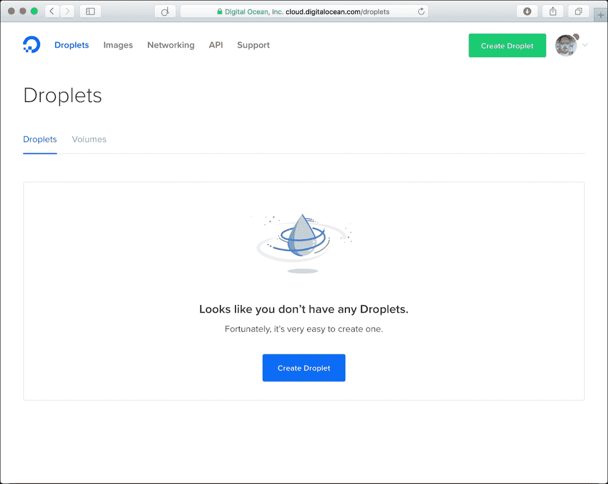
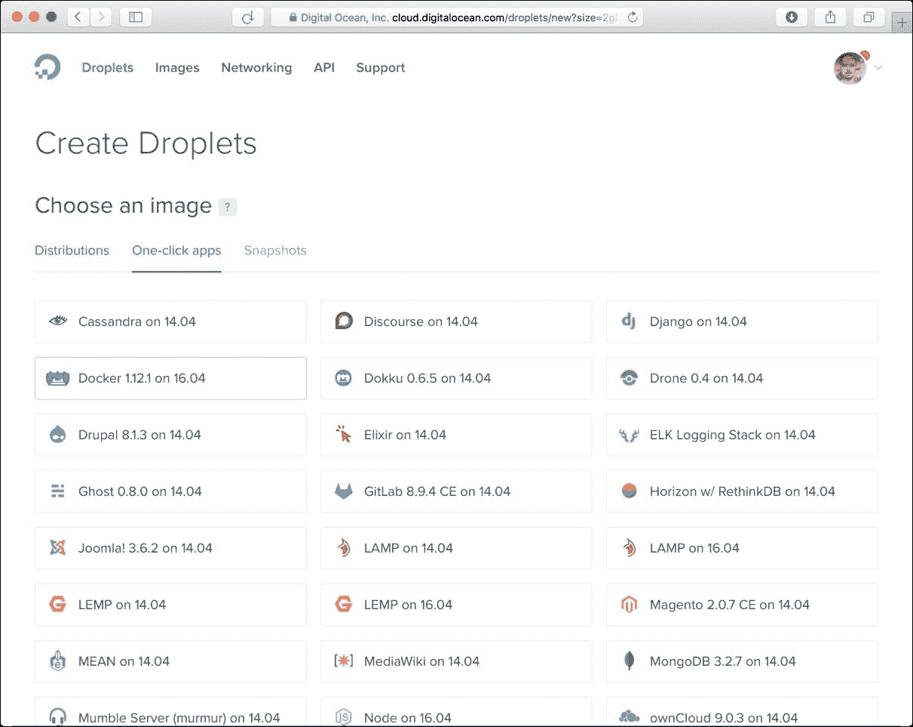
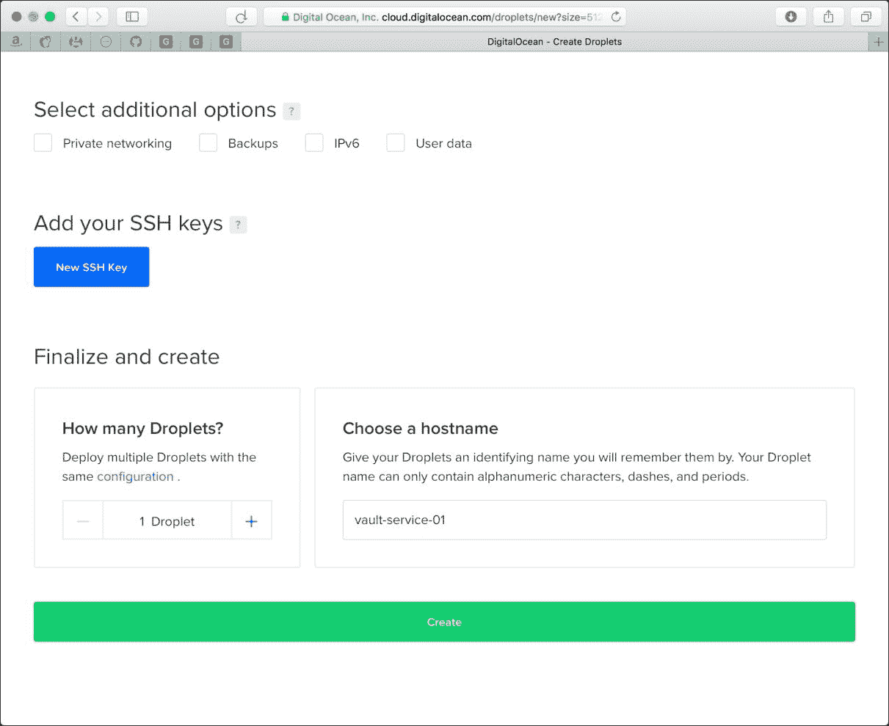
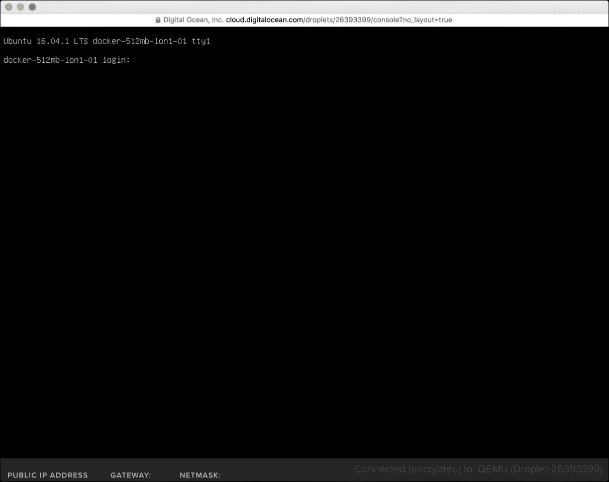
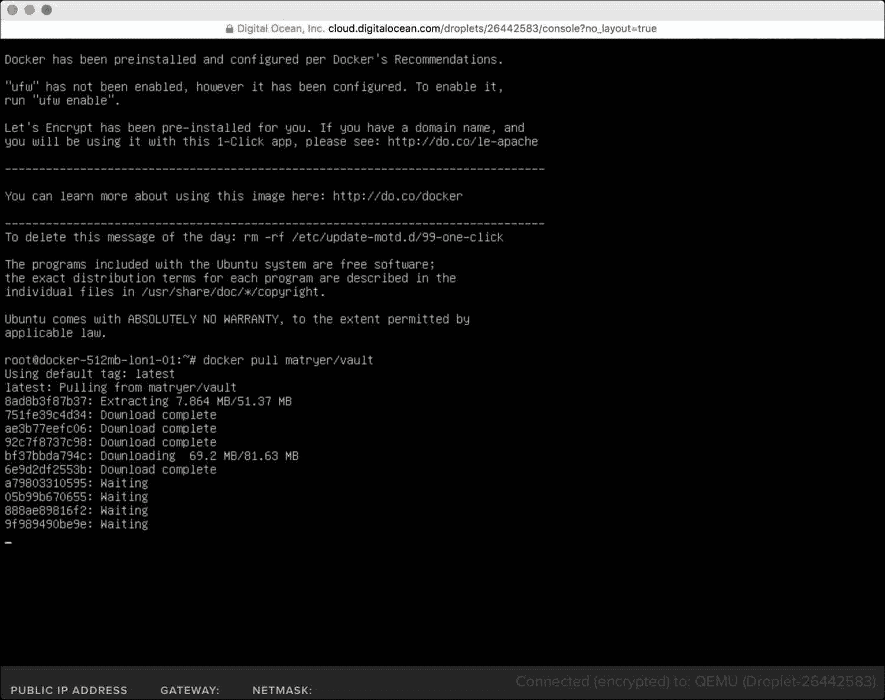
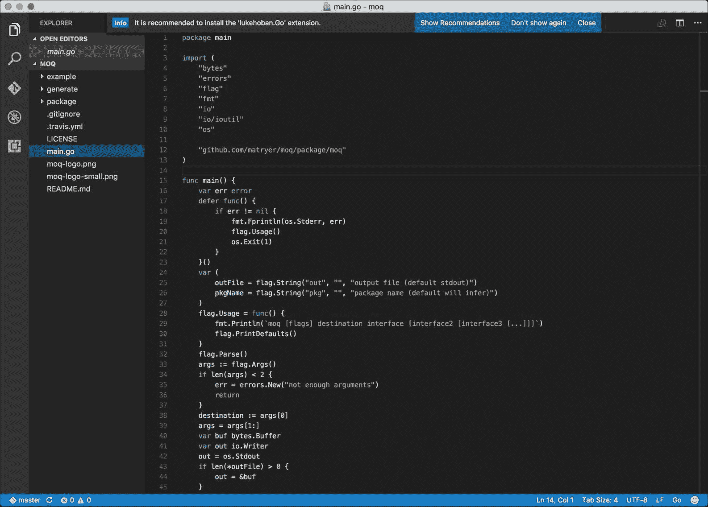
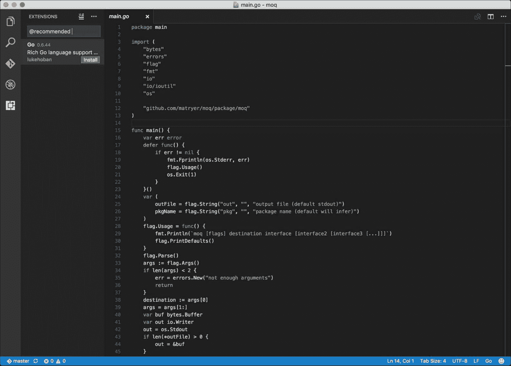
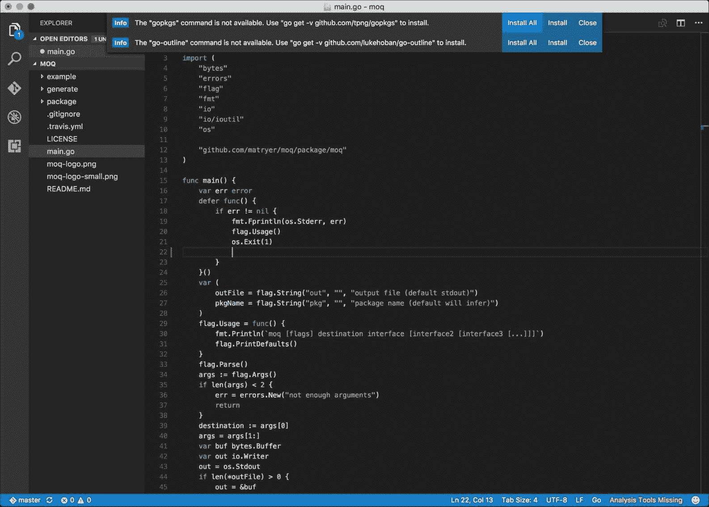

# 第十一章。使用 Docker 部署 Go 应用程序

Docker 是一个开源生态系统（技术和一系列相关服务），它允许您将应用程序打包到简单、轻量级且可移植的容器中；它们将在任何环境中以相同的方式运行。考虑到我们的开发环境（可能是一个 Mac）与生产环境（如 Linux 服务器甚至云服务）不同，以及我们可能希望部署相同应用程序的大量不同位置，这非常有用。

大多数云平台已经支持 Docker，这使得它成为将我们的应用程序部署到野外的绝佳选择。

在第九章, *为 Google App Engine 构建问答应用程序*中，我们构建了一个适用于 Google App Engine 的应用程序。如果我们决定在另一个平台上运行我们的应用程序，即使忘记了我们对 Google Cloud Datastore 的使用，我们也需要对我们的代码进行重大修改。以在 Docker 容器内部署应用程序为目的构建应用程序，为我们提供了额外的灵活性。

### 注意

您知道 Docker 本身是用 Go 编写的吗？通过浏览[`github.com/docker/docker`](https://github.com/docker/docker)的源代码来亲自看看吧。

在本章中，您将学习：

+   如何编写简单的 Dockerfile 来描述应用程序

+   如何使用`docker`命令构建容器

+   如何在本地运行 Docker 容器并终止它们

+   如何将 Docker 容器部署到 Digital Ocean

+   如何使用 Digital Ocean 中的功能启动已预配置 Docker 的实例

我们将把在第十章 *使用 Go kit 框架的 Go 微服务* 中创建的 Vault 服务放入 Docker 镜像，并将其部署到云中。

# 在本地使用 Docker

在我们能够将代码部署到云之前，我们必须使用开发机器上的 Docker 工具构建并推送镜像到 Docker Hub。

## 安装 Docker 工具

为了构建和运行容器，您需要在您的开发机器上安装 Docker。请访问[`www.docker.com/products/docker`](https://www.docker.com/products/docker)并下载适合您电脑的相应安装程序。

Docker 及其生态系统正在快速发展，因此确保您与最新版本保持同步是个好主意。同样，本章中的一些细节可能会发生变化；如果您遇到困难，请访问项目主页[`github.com/matryer/goblueprints`](https://github.com/matryer/goblueprints)以获取一些有用的提示。

## Dockerfile

Docker 镜像就像一个迷你虚拟机。它包含运行应用程序所需的一切：代码将运行的操作系统，我们代码可能需要的任何依赖项（例如，在我们的 Vault 服务中是 Go kit），以及我们应用程序本身的二进制文件。

一个镜像是通过`Dockerfile`描述的；一个包含一系列特殊命令的文本文件，这些命令指导 Docker 如何构建镜像。它们通常基于另一个容器，这样可以节省您构建和运行 Go 应用程序所需的一切。

在代码中第十章的`vault`文件夹内，添加一个名为`Dockerfile`的文件（注意，此文件名没有扩展名），包含以下代码：

```go
FROM scratch 
MAINTAINER Your Name <your@email.address> 
ADD vaultd vaultd 
EXPOSE 8080 8081 
ENTRYPOINT ["/vaultd"] 

```

`Dockerfile`文件中的每一行代表在构建镜像时运行的不同命令。以下表格描述了我们使用的每个命令：

| **Command** | **描述** |
| --- | --- |
| `FROM` | 此镜像将基于的镜像名称。单词，如 scratch，代表托管在 Docker Hub 上的官方 Docker 镜像。有关关于 scratch 镜像的更多信息，请参阅`https://hub.docker.com/_/scratch/`。 |
| `ADD` | 将文件复制到容器中。我们正在复制我们的`vaultd`二进制文件，并将其命名为`vaultd`。 |
| `EXPOSE` | 公开端口号列表；在我们的案例中，Vault 服务绑定到`:8080`和`:8081`。 |
| `ENTRYPOINT` | 当容器在我们的情况下执行时运行的二进制文件，即`vaultd`二进制文件，它将由之前的 go install 调用放置在那里。 |
| `MAINTAINER` | 维护 Docker 镜像的人的姓名和电子邮件地址。 |

### 注意

要获取支持的命令的完整列表，请查阅在线 Docker 文档：[`docs.docker.com/engine/reference/builder/#dockerfile-reference`](https://docs.docker.com/engine/reference/builder/#dockerfile-reference)。

## 为不同架构构建 Go 二进制文件

Go 支持交叉编译，这是一种机制，我们可以在一台机器（比如我们的 Mac）上为目标操作系统（如 Linux 或 Windows）和架构构建二进制文件。Docker 容器是基于 Linux 的；因此，为了提供一个可以在该环境中运行的二进制文件，我们必须首先构建一个。

在终端中，导航到 vault 文件夹并运行以下命令：

```go
CGO_ENABLED=0 GOOS=linux go build -a ./cmd/vaultd/

```

我们在这里实际上是在调用 go build，但增加了一些额外的部分来控制构建过程。`CGO_ENABLED`和`GOOS`是 go build 会注意到的环境变量，`-a`是一个标志，`./cmd/vaultd/`是我们想要构建的命令的位置（在我们的案例中，是我们在上一章中构建的`vaultd`命令）。

+   `CGO_ENABLED=0`表示我们不希望启用 cgo。由于我们没有绑定任何 C 依赖项，我们可以通过禁用此功能来减小构建的大小。

+   `GOOS`是 Go 操作系统的缩写，允许我们指定我们正在针对哪个操作系统，在我们的例子中，是 Linux。要查看完整的选项列表，可以直接访问 Go 源代码，通过访问[`github.com/golang/go/blob/master/src/go/build/syslist.go`](https://github.com/golang/go/blob/master/src/go/build/syslist.go)。

一段时间后，你会注意到出现了一个新的二进制文件，名为`vaultd`。如果你使用的是非 Linux 机器，你将无法直接执行这个文件，但不用担心；它将在我们的 Docker 容器中正常运行。

## 构建 Docker 镜像

要构建镜像，在终端中导航到`Dockerfile`并运行以下命令：

```go
docker build -t vaultd

```

我们使用`docker`命令来构建镜像。最后的点表示我们想要从当前目录构建 Dockerfile。`-t`标志指定我们想要给我们的镜像命名为`vaultd`。这将允许我们通过名称而不是 Docker 分配给它的哈希值来引用它。

如果你第一次使用 Docker，特别是使用`scratch`基础镜像，那么根据你的网络连接，从 Docker Hub 下载所需的依赖项将需要一些时间。一旦完成，你将看到类似以下输出的内容：

```go
Step 1 : FROM scratch
 --->
Step 2 : MAINTAINER Your Name <your@email.address>
 ---> Using cache
 ---> a8667f8f0881
Step 3 : ADD vaultd vaultd
 ---> 0561c999c1e3
Removing intermediate container 4b75fde507df
Step 4 : EXPOSE 8080 8081
 ---> Running in 8f169f5b3b44
 ---> 1d7758c20b3a
Removing intermediate container 8f169f5b3b44
Step 5 : ENTRYPOINT /vaultd
 ---> Running in b5d55d6429be
 ---> b7178985dddf
Removing intermediate container b5d55d6429be
Successfully built b7178985dddf

```

对于每个命令，都会创建一个新的镜像（你可以在过程中看到中间容器被销毁），直到我们得到最终的镜像。

由于我们在本地机器上构建二进制文件并将其复制到容器中（使用`ADD`命令），我们的 Docker 镜像最终只有大约 7 MB：考虑到它包含了运行服务所需的所有内容，这相当小。

## 在本地运行 Docker 镜像

现在我们已经构建了镜像，我们可以通过以下命令来测试它：

```go
docker run -p 6060:8080 -p 6061:8081 --name localtest --rm vaultd

```

`docker run`命令将启动`vaultd`镜像的一个实例。

`-p`标志指定了一对要公开的端口，第一个值是主机端口，第二个值（冒号之后）是镜像内的端口。在我们的例子中，我们表示我们想要将端口`8080`公开到端口`6060`，端口`8081`通过端口`6061`公开。

我们使用`--name`标志给运行实例命名为`localtest`，这将帮助我们识别它，当我们检查和停止它时。`--rm`标志表示我们希望在停止后删除镜像。

如果成功，你会注意到 Vault 服务确实已经开始，因为它在告诉我们它绑定到的端口：

```go
2016/09/20 15:56:17 grpc: :8081
2016/09/20 15:56:17 http: :8080

```

### 小贴士

这些是内部端口；记住，我们已经将这些映射到不同的外部端口。这看起来可能有些混乱，但最终却非常强大，因为负责启动服务实例的人可以决定哪些端口适合他们的环境，而 Vault 服务本身则无需担心这一点。

要查看这个运行状态，打开另一个终端并使用`curl`命令访问我们的密码散列服务的 JSON 端点：

```go
curl -XPOST -d '{"password":"monkey"}' localhost:6060/hash

```

你将看到类似运行服务输出的内容：

```go
{"hash":"$2a$0$wk4qc74ougOkbkt/TWuRQHSg03i1ataNupbDADBwpe"}

```

## 检查 Docker 进程

要查看正在运行的 Docker 实例，我们可以使用`docker ps`命令。在终端中，输入以下内容：

```go
docker ps

```

你将看到一个文本表格，概述以下属性：

| **CONTAINER ID** | `0b5e35dca7cc` |
| --- | --- |
| **IMAGE** | `vaultd` |
| **COMMAND** | `/bin/sh -c /go/bin/vaultd` |
| **CREATED** | `3 seconds ago` |
| **STATUS** | `Up 2 seconds` |
| **PORTS** | `0.0.0.0:6060->8080/tcp, 0.0.0.0:6061->8081/tcp` |
| **NAMES** | `localtest` |

详细信息显示了我们刚刚启动的镜像的高级概述。请注意，**PORTS**部分显示了外部到内部的映射。

## 停止 Docker 实例

我们习惯于在运行代码的窗口中按*Ctrl + C*来停止它，但由于它是在容器中运行的，所以这不会起作用。相反，我们需要使用`docker stop`命令。

由于我们给我们的实例命名为`localtest`，我们可以在一个可用的终端窗口中输入以下内容来停止它：

```go
docker stop localtest

```

几分钟后，你会注意到运行镜像的终端现在已经返回到提示符。

# 部署 Docker 镜像

现在我们已经将 Vault 服务封装在一个 Docker 容器中，我们将对它做一些有用的事情。

我们将要做的第一件事是将这个镜像推送到 Docker Hub，这样其他人就可以启动自己的实例，甚至基于它构建新的镜像。

## 部署到 Docker Hub

访问 Docker Hub [`hub.docker.com`](https://hub.docker.com)，点击右上角的**登录**链接，然后点击**创建账户**来创建一个账户。当然，如果你已经有了账户，只需登录即可。

现在，在终端中，你将通过运行 Docker 的`login`命令来使用此账户进行认证：

```go
docker login -u **USERNAME** -p **PASSWORD** https://index.docker.io/v1/

```

### 小贴士

如果你看到类似`WARNING: Error loading config, permission denied`的错误，那么请尝试使用带有`sudo`命令前缀的命令再次执行。这一点适用于从现在开始的所有 Docker 命令，因为我们正在使用一个受保护的配置。

确保将`USERNAME`和`PASSWORD`替换为你刚刚创建的账户的实际用户名和密码。

如果成功，你将看到“**登录成功**”。

接下来，回到网页浏览器中，点击**创建仓库**并创建一个名为`vault`的新仓库。这个镜像的实际名称将是`USERNAME/vault`，因此我们需要在本地重新构建镜像以匹配这个名称。

### 小贴士

注意，为了公开使用，我们称镜像为`vault`而不是`vaultd`。这是一个故意的区别，以确保我们处理的是正确的镜像，但这对用户来说也是一个更好的名称。

在终端中，使用正确的名称构建新的存储库：

```go
docker build -t USERNAME/vault

```

这将再次构建镜像，这次使用适当的名称。要将镜像部署到 Docker Hub，我们使用 Docker 的`push`命令：

```go
docker push USERNAME/vault

```

经过一段时间，镜像及其依赖项将被推送到 Docker Hub：

```go
f477b97e9e48: Pushed
384c907d1173: Pushed
80168d020f50: Pushed
0ceba54dae47: Pushed
4d7388e75674: Pushed
f042db76c15c: Pushing [====>               ] 21.08 MB/243.6 MB
d15a527c2ee1: Pushing [=====>              ] 15.77 MB/134 MB
751f5d9ad6db: Pushing [======>             ] 16.49 MB/122.6 MB
17587239b3df: Pushing [===================>] 17.01 MB/44.31 MB
9e63c5bce458: Pushing [==================> ] 65.58 MB/125.1 MB

```

现在转到 Docker Hub 查看您镜像的详细信息，或者查看[`hub.docker.com/r/matryer/vault/`](https://hub.docker.com/r/matryer/vault/)的示例。

# 部署到 Digital Ocean

Digital Ocean 是一家提供具有竞争力的价格来托管虚拟机的云服务提供商。它使得部署和提供 Docker 镜像变得非常容易。在本节中，我们将部署一个 droplet（Digital Ocean 对单个机器的术语），在云中运行我们的 docker 化 Vault 服务。

具体来说，以下是将 Docker 镜像部署到 Digital Ocean 的步骤：

1.  创建 droplet。

1.  通过基于 Web 的控制台访问它。

1.  拉取`USERNAME/vault`容器。

1.  运行容器。

1.  通过`curl`命令远程访问我们的托管 Vault 服务。

Digital Ocean 是一个**平台即服务**（**PaaS**）架构，因此用户体验可能会不时发生变化，所以这里描述的精确流程在您执行这些任务时可能并不完全准确。通常，通过查看选项，您将能够找出如何进行操作，但已经包括了截图以帮助您。

本节还假设您已启用创建 droplets 可能需要的任何计费。

## 创建 droplet

通过浏览器访问[`www.digitalocean.com`](https://www.digitalocean.com)注册或登录到 Digital Ocean。请确保您使用真实的电子邮件地址，因为这将是他们发送您创建的 droplet 的 root 密码的地方。

如果您没有其他 droplets，您将看到一个空白屏幕。点击**创建 Droplet**：



在**一键应用**标签页中，查找最新的 Docker 选项；在撰写本文时，它是**Docker 1.12.1 on 16.04**，这意味着 Docker 版本 1.12.1 正在 Ubuntu 16.04 上运行。

滚动页面选择剩余的选项，包括选择大小（目前最小的尺寸即可）和位置（选择离您最近的地理位置）。现在我们不会添加额外的服务（如卷、网络或备份），只需进行简单的 droplet。

给您的 droplet 起一个有意义的名称可能是个好主意，这样以后就更容易找到，比如`vault-service-1`或类似名称；现在这并不重要：



### 小贴士

你可以选择添加 SSH 密钥以增加额外的安全性，但为了简单起见，我们将继续不添加它。对于生产环境，建议你始终这样做。

在页面底部，点击**创建**：



## 访问 droplet 的控制台

一旦你的 droplet 创建完成，从**Droplets**列表中选择它，并查找**控制台**选项（它可能被写成`Access console`）。

几分钟后，你将看到一个基于 Web 的终端。这就是我们将如何控制 droplet，但首先，我们必须登录：



输入登录用户名为`root`，并检查你的电子邮件以获取 Digital Ocean 发送给你的 root 密码。在撰写本文时，你不能复制粘贴，所以请准备好尽可能准确地输入一个长字符串。

### 小贴士

密码可能是一个小写十六进制字符串，这将帮助你了解哪些字符可能出现。例如，所有看起来像*O*的字符可能都是*零*，而*1*不太可能是*I*或*L*。

第一次登录后，你将被要求更改密码，这需要再次输入生成的长密码！有时安全性会如此不方便。

## 拉取 Docker 镜像

由于我们选择了 Docker 应用作为我们的 droplet 的起点，Digital Ocean 已经友好地配置了 Docker，使其已经在我们的实例中运行，因此我们可以直接使用`docker`命令来完成设置。

在基于 Web 的终端中，使用以下命令拉取你的容器，记得将`USERNAME`替换为你的 Docker Hub 用户名：

```go
docker pull USERNAME/vault

```

### 小贴士

如果由于任何原因，这对你不起作用，你可以尝试使用作者放置在那里的 Docker 镜像，通过输入以下命令：`docker pull matryer/vault`

Docker 将会去拉取它运行我们之前创建的镜像所需的所有内容：



## 在云中运行 Docker 镜像

一旦镜像及其依赖项成功下载，我们就可以使用`docker run`命令来运行它，这次使用`-d`标志来指定我们希望它作为后台守护进程运行。在基于 Web 的终端中，输入以下命令：

```go
docker run -d -p 6060:8080 -p 6061:8081 --name vault USERNAME/vault

```

这与之前我们运行的命令类似，但这次我们给它命名为 vault，并且省略了`--rm`标志，因为它与后台守护进程模式不兼容（并且没有意义）。

包含我们的 Vault 服务的 Docker 镜像将开始运行，现在已准备好测试。

## 访问云中的 Docker 镜像

现在，我们的 Docker 镜像已经在 Digital Ocean 平台上运行的 droplet 中运行，我们可以开始使用它了。

在 Digital Ocean 的 Web 控制面板中，选择**Droplets**并查找我们刚刚创建的那个。我们需要知道 IP 地址，以便我们可以远程访问服务。一旦你找到了 droplet 的 IP 地址，点击它以复制它。

在你的电脑上打开本地终端（不要使用基于网页的终端）并使用 `curl` 命令（或等效命令）执行以下请求：

```go
curl -XPOST -d '{"password":"Monkey"}' http://IPADDRESS:6060/hash

```

记得将 `IPADDRESS` 替换为你从 Digital Ocean 的网页控制面板中复制的实际 IP 地址。

当你收到以下类似响应时，你会注意到你已经成功管理访问了我们的 Vault 服务的 JSON/HTTP 端点：

```go
{"hash":"$2a$10$eGFGRZ2zMfsXss.6CgK6/N7TsmF.6MAv6i7Km4AHC"}

```

看看你是否可以修改 `curl` 命令，使用 `/validate` 端点验证提供的哈希值。

# 摘要

在本章中，我们使用 Docker 在 Digital Ocean 的云平台上构建和部署了 Vault Go 应用程序。

在安装 Docker 工具后，我们看到了如何轻松地将我们的 Go 应用程序打包成 Docker 镜像并推送到 Docker Hub。我们使用他们提供的有用的 Docker 应用程序创建了 Digital Ocean 的 Droplet，并通过基于网页的控制台进行控制。一旦进入，我们就能从 Docker Hub 拉取我们的 Docker 镜像并在 Droplet 中运行它。

使用 Droplet 的公网 IP，我们能够远程访问 Vault 服务器的 JSON/HTTP 端点以哈希和验证密码。

# 附录 附录。稳定 Go 环境的良好实践

编写 Go 代码是一种有趣且愉快的体验，编译时错误不再是痛苦，而是引导你编写健壮、高质量的代码。然而，时不时地，你将遇到一些环境问题，这些问题开始妨碍你的工作流程。虽然你通常可以通过一些搜索和微调来解决这些问题，但正确设置你的开发环境在很大程度上可以减少问题，让你能够专注于构建有用的应用程序。

在本章中，我们将从头开始在新的机器上安装 Go，并讨论我们的一些环境选项及其可能对未来产生的影响。我们还将考虑协作如何影响我们的决策，以及开源我们的包可能产生的影响。

具体来说，我们将：

+   在你的开发机上安装 Go

+   了解 `GOPATH` 环境变量的用途，并讨论其合理的使用方法

+   了解 Go 工具及其使用方法，以保持我们代码的高质量

+   学习如何使用工具自动管理我们的导入

+   考虑到我们的 `.go` 文件的 *保存* 操作，以及我们如何将 Go 工具集成到日常开发中

+   查看一些流行的代码编辑器选项来编写 Go 代码

# 安装 Go

安装 Go 的最佳方式是使用网络上可用的众多安装程序之一，请访问 [`golang.org/dl/`](https://golang.org/dl/)。访问 Go 网站，点击 **下载**，然后查找适合你电脑的最新 1.x 版本。页面顶部的 **特色下载** 部分包含指向最受欢迎版本的链接，所以你的版本可能就在这个列表中。

本书中的代码已经使用 Go 1.7 进行了测试，但任何 1.x 版本都将工作。对于 Go 的未来版本（2.0 及更高版本），你可能需要调整代码，因为主要版本发布可能包含破坏性更改。

# 配置 Go

Go 现已安装，但为了使用工具，我们必须确保它已正确配置。为了使调用工具更简单，我们需要将我们的 `go/bin` 路径添加到 `PATH` 环境变量中。

### 注意

在 Unix 系统上，你应该将 `export PATH=$PATH:/opt/go/bin`（确保它是你安装 Go 时选择的路径）添加到你的 `.bashrc` 文件中。

在 Windows 上，打开 **系统属性**（尝试右键单击 **我的电脑**），然后在 **高级** 选项卡中点击 **环境变量** 按钮，并使用 UI 确保路径变量包含你的 `go/bin` 文件夹路径。

在终端中（你可能需要重启终端以使更改生效），你可以通过打印 `PATH` 变量的值来确保这已经生效：

```go
echo $PATH

```

确保打印的值包含正确的 `go/bin` 文件夹路径；例如，在我的机器上它打印如下：

```go
/usr/local/bin:/usr/bin:/bin:/opt/go/bin

```

### 注意

路径之间的冒号（在 Windows 上是分号）表示 `PATH` 变量实际上是一个文件夹列表，而不仅仅是一个文件夹。这表明当你输入终端中的命令时，将搜索每个包含的文件夹。

现在，我们可以确保我们刚刚创建的 Go 构建可以成功运行：

```go
go version

```

以这种方式执行 `go` 命令（可以在你的 `go/bin` 位置找到）将为我们打印出当前版本。例如，对于 Go 1.77.1，你应该看到以下类似的内容：

```go
go version go1.77.1 darwin/amd64

```

## 正确设置 GOPATH

`GOPATH` 是另一个指向文件夹的环境变量（如上一节中的 `PATH`），用于指定 Go 源代码和编译的二进制包的位置。在你的 Go 程序中使用 `import` 命令会导致编译器在 `GOPATH` 位置查找你引用的包。当使用 `go get` 和其他命令时，项目会被下载到 `GOPATH` 文件夹中。

虽然 `GOPATH` 位置可以包含一系列由冒号分隔的文件夹，例如 `PATH`，并且你可以根据你正在工作的项目为 `GOPATH` 设置不同的值，但强烈建议你为所有内容使用单个 `GOPATH` 位置，这是我们假设你在本书的项目中会这样做。

创建一个名为 `go` 的新文件夹，这次在 `Users` 文件夹中，可能在 `Work` 子文件夹中。这将是我们 `GOPATH` 的目标，所有第三方代码和二进制文件都将在这里结束，我们也将在这里编写我们的 Go 程序和包。使用你在上一节中设置 `PATH` 环境变量时使用的相同技术，将 `GOPATH` 变量设置为新的 `go` 文件夹。让我们打开一个终端并使用新安装的命令之一为我们获取第三方包：

```go
go get github.com/matryer/silk

```

获取 `silk` 库实际上会导致创建以下文件夹结构：`$GOPATH/src/github.com/matryer/silk`。你可以看到路径段在 Go 组织事物的方式中非常重要，这有助于命名空间项目并保持它们的独特性。例如，如果你创建了一个名为 `silk` 的自己的包，你不会将其保存在 `matryer` 的 GitHub 仓库中，所以路径就会不同。

当我们在本书中创建项目时，你应该考虑一个合理的 `GOPATH` 根目录。例如，我使用了 `github.com/matryer/goblueprints`，如果你去获取它，你实际上会在你的 `GOPATH` 文件夹中获得这本书所有源代码的完整副本！

# Go 工具

Go 核心团队早期做出的一个决定是，所有 Go 代码都应该对说 Go 语的每个人来说都熟悉且明显，而不是每个代码库都需要额外的学习才能让新程序员理解它或对其进行工作。当你考虑到开源项目时，这是一个特别合理的做法，其中一些项目有数百名贡献者来来去去。

有许多工具可以帮助我们达到 Go 核心团队设定的高标准，我们将在本节中查看一些工具的实际应用。

在你的 `GOPATH` 位置，创建一个名为 `tooling` 的新文件夹，并创建一个包含以下代码的新 `main.go` 文件：

```go
package main 
import ( 
  "fmt" 
) 
func main() { 
  return 
  var name string 
  name = "Mat" 
  fmt.Println("Hello ", name) 
} 

```

紧凑的空间和缺乏缩进是有意为之的，因为我们将要查看 Go 附带的一个非常酷的实用工具。

在终端中，导航到你的新文件夹并运行以下命令：

```go
go fmt -w

```

### 注意

在 2014 年科罗拉多州丹佛的 Gophercon 大会上，大多数人了解到，与其将这个小三元组读作 *format* 或 *f, m, t*，实际上它是作为一个单词来发音的。现在试着对自己说：*fhumt*；看来，计算机程序员们如果不互相说一种外星语就已经够奇怪的了！

你会注意到这个小小的工具实际上调整了我们的代码文件，以确保我们的程序布局（或格式）符合 Go 标准。新版本更容易阅读：

```go
package main  
import ( 
  "fmt" 
)  
func main() { 
  return 
  var name string 
  name = "Mat" 
  fmt.Println("Hello ", name) 
} 

```

`go fmt` 命令关注缩进、代码块、不必要的空白、不必要的额外换行符等等。以这种方式格式化你的代码是一种很好的实践，以确保你的 Go 代码看起来像其他所有 Go 代码。

接下来，我们将审查我们的程序，以确保我们没有犯任何错误或可能让用户感到困惑的决定；我们可以使用另一个免费获得的神器来自动完成这项工作：

```go
go vet

```

我们的小程序输出显示了一个明显且令人瞩目的错误：

```go
main.go:10: unreachable code
exit status 1

```

我们在函数顶部调用 `return`，然后尝试做其他事情。`go vet` 工具注意到了这一点，并指出我们在文件中有不可达的代码。

`go vet`不仅能捕捉到这种愚蠢的错误，它还会寻找你程序中更微妙的问题，这些问题将指导你编写尽可能好的 Go 代码。要查看 vet 工具将报告的最新列表，请查看[`golang.org/cmd/vet/`](https://golang.org/cmd/vet/)上的文档。

我们将要使用的最后一个工具叫做`goimports`，它是由 Brad Fitzpatrick 编写的，用于自动修复（添加或删除）Go 文件的`import`语句。在 Go 中，导入一个包而不使用它是错误的，显然，尝试使用未导入的包也不会工作。`goimports`工具将根据我们的代码文件内容自动重写我们的`import`语句。首先，让我们使用这个熟悉的命令来安装`goimports`：

```go
go get golang.org/x/tools/cmd/goimports

```

更新你的程序，导入一些我们不会使用的包，并移除`fmt`包：

```go
import ( 
  "net/http" 
  "sync" 
) 

```

当我们通过调用`go run main.go`来尝试运行我们的程序时，我们会看到一些错误：

```go
./main.go:4: imported and not used: "net/http"
./main.go:5: imported and not used: "sync"
./main.go:13: undefined: fmt

```

这些错误告诉我们，我们导入了未使用的包，缺少了`fmt`包，并且为了继续，我们需要进行修正。这就是`goimports`发挥作用的地方：

```go
goimports -w *.go

```

我们使用带有`-w`写入标志的`goimports`命令，这将节省我们修正所有以`.go`结尾的文件的麻烦。

现在查看你的`main.go`文件，注意`net/http`和`sync`包已经被移除，而`fmt`包已经被放回。

你可能会认为切换到终端运行这些命令比手动操作花费的时间更多，在大多数情况下你可能是对的，这就是为什么强烈建议你将 Go 工具与你的文本编辑器集成。

# 清理、构建和保存时运行测试

由于 Go 核心团队为我们提供了像`fmt`、`vet`、`test`和`goimports`这样出色的工具，我们将探讨一种已被证明极其有用的开发实践。每次我们保存`.go`文件时，我们都希望自动执行以下任务：

1.  使用`goimports`和`fmt`修复我们的导入并格式化代码。

1.  检查代码中的任何错误，并立即告诉我们。

1.  尝试构建当前包并输出任何构建错误。

1.  如果构建成功，运行包的测试并输出任何失败。

由于 Go 代码编译速度非常快（Rob Pike 曾经实际上说过它并不快，但并不像其他所有东西那样慢），我们每次保存文件时都可以舒适地构建整个包。这也适用于运行测试以帮助我们进行 TDD 风格开发的情况，体验非常棒。每次我们对代码进行更改时，我们都可以立即看到是否破坏了某些内容，或者对我们的项目其他部分产生了意外影响。我们将不再看到包导入错误，因为我们的`import`语句已经为我们修正，而且我们的代码将直接在我们的眼前正确格式化。

一些编辑器可能不支持在特定事件（如保存文件）响应下运行代码，这给您留下了两个选择：您可以选择切换到更好的编辑器，或者您可以编写自己的脚本文件，该文件会在文件系统更改时运行。后者超出了本书的范围；相反，我们将专注于如何在几个流行的编辑器中实现此功能。

# 集成开发环境

**集成开发环境**（**IDEs**）本质上是一些具有额外功能，使编写代码和构建软件更简单的文本编辑器。具有特殊意义的文本，如字符串字面量、类型、函数名等，通常通过语法高亮以不同的颜色显示，或者您在键入时可能会获得自动完成选项。一些编辑器甚至会在您执行代码之前指出代码中的错误。

有许多选项可供选择，大多数情况下，这取决于个人喜好，但我们将探讨一些更受欢迎的选择以及如何设置它们以构建 Go 项目。

最受欢迎的编辑器包括以下几种：

+   Sublime Text 3

+   Visual Studio Code

+   Atom

+   Vim（带 vim-go）

您可以在[`github.com/golang/go/wiki/IDEsAndTextEditorPlugins`](https://github.com/golang/go/wiki/IDEsAndTextEditorPlugins)查看一个完整的精选选项列表。

在本节中，我们将探讨 Sublime Text 3 和 Visual Studio Code。

## Sublime Text 3

Sublime Text 3 是一个优秀的编辑器，可以用于编写在 OS X、Linux 和 Windows 上运行的 Go 代码，它拥有极其强大的扩展模型，这使得它易于定制和扩展。您可以从[`www.sublimetext.com/`](http://www.sublimetext.com/)下载 Sublime Text，并在决定是否购买之前免费试用。

感谢**DisposaBoy**（请参阅[`github.com/DisposaBoy`](https://github.com/DisposaBoy)），已经有一个针对 Go 的 Sublime 扩展包，实际上为我们提供了许多 Go 程序员实际上错过的丰富功能和力量。我们将安装这个`GoSublime`包，然后在此基础上添加我们想要的保存功能。

在我们能够安装 `GoSublime` 之前，我们需要将 Package Control 安装到 Sublime Text 中。访问 [`sublime.wbond.net/`](https://sublime.wbond.net/) 并点击 **安装** 链接，获取安装 Package Control 的说明。在撰写本文时，这只是一个复制单行命令（尽管很长）并将其粘贴到 Sublime 控制台中的简单过程，控制台可以通过从菜单中选择 **视图** | **显示控制台** 来打开。

完成这些后，按 *shift + command + P* 并输入 `Package Control: Install Package`，当你选择了选项后按 *return*。经过短暂的延迟（Package Control 正在更新其列表），将出现一个框，允许你通过输入、选择并按 *return* 来搜索和安装 GoSublime。如果一切顺利，GoSublime 将被安装，编写 Go 代码将变得容易得多。

### 小贴士

现在你已经安装了 GoSublime，你可以通过按 *command + ., command + 2*（同时按住命令键和点号，然后按住命令键和数字 2）来打开一个包含包详细信息的简短帮助文件。

在保存时需要一些额外帮助的话，请按 *command + ., command + 5* 打开 GoSublime 设置，并在对象中添加以下条目：

```go
"on_save": [ 
  { 
    "cmd": "gs9o_open",  
    "args": { 
      "run": ["sh", "go build . errors && go test -i && go test && 
       go vet && golint"], 
      "focus_view": false 
    } 
  } 
] 

```

### 小贴士

注意，设置文件实际上是一个 JSON 对象，所以确保你在不损坏文件的情况下添加 `on_save` 属性。例如，如果你在前后都有属性，确保适当的逗号已经放置好。

之前的设置将告诉 Sublime Text 在保存文件时查找代码错误、安装测试依赖项、运行测试和审查代码。保存设置文件（暂时不要关闭它），让我们看看这个功能是如何实际应用的。

从菜单中选择 **选择文件** | **打开...** 并选择一个文件夹现在打开，让我们打开我们的 `tooling` 文件夹。Sublime Text 的简单用户界面清楚地表明，我们目前项目中的文件只有一个：`main.go`。点击文件并添加一些额外的换行符，并添加和删除一些缩进。然后，从菜单中选择 **文件** | **保存**，或者按 *command + S*。请注意，代码会立即被清理，并且如果你没有从 `main.go` 中移除放置不当的返回语句，你会注意到控制台已经出现并报告了问题，这是由于 go vet 的功劳：

```go
main.go:8: unreachable code

```

按住 *command + shift* 并在控制台中的不可达代码行上双击，将打开文件并将光标跳转到相关的行。当你继续编写 Go 代码时，你可以看到这个功能将多么有用。

如果你向文件中添加了不需要的导入，你将注意到在使用 `on_save` 时你会被告知问题，但它并没有自动修复。这是因为我们还需要进行另一个调整。在添加 `on_save` 属性的相同设置文件中，添加以下属性：

```go
"fmt_cmd": ["goimports"]

```

这告诉 GoSublime 使用 `goimports` 命令而不是 `go fmt`。再次保存此文件，然后返回 `main.go`。再次将 `net/http` 添加到导入中，删除 `fmt` 导入，并保存文件。请注意，已删除未使用的包，并将 `fmt` 再次放回。

## Visual Studio Code

在最佳 Go IDE 竞选中出现的一个惊喜是微软的 Visual Studio Code，可在 [`code.visualstudio.com`](https://code.visualstudio.com) 免费获得。

一旦您从网站上下载它，打开一个 Go 文件（任何以 `.go` 扩展名结尾的文件），请注意 Visual Studio Code 会询问您是否希望安装推荐的插件以使处理 Go 文件更容易：



点击 **显示推荐** 并点击建议的 Go 插件旁边的 **安装**：



它可能会要求您重新启动 Visual Studio Code 以启用插件，并且它还可能要求您安装一些额外的命令：



点击 **安装所有** 以安装所有依赖项，确保在启动其他安装过程之前等待之前的安装过程完成。不久后，您会注意到安装了一些工具。

在 Visual Studio Code 中编写一些混乱的代码（或从 [`github.com/matryer/goblueprints/blob/master/appendixA/messycode/main.go`](https://github.com/matryer/goblueprints/blob/master/appendixA/messycode/main.go) 复制粘贴一些）并保存。您会注意到导入已修复，代码已按照 Go 标准格式化。

您可以利用更多功能，但在这里我们不会进一步探讨。

# 摘要

在本附录中，我们安装了 Go，现在准备好开始构建真实的项目。我们了解了 `GOPATH` 环境变量，并发现了一个常见做法，即对所有项目保持一个值。这种方法大大简化了在 Go 项目上的工作，否则您可能会继续遇到棘手的失败。

我们发现了 Go 工具集如何真正帮助我们产生高质量、符合社区标准的代码，任何其他程序员都可以轻松地拾起并在此基础上进行工作，无需额外的学习。更重要的是，我们探讨了自动化这些工具的使用意味着我们可以真正专注于编写应用程序和解决问题，这正是开发者真正想做的事情。

我们查看了一些代码编辑器或 IDE 的选项，并看到了如何轻松添加插件或扩展，以使编写 Go 代码更容易。

# 参考文献列表

这条学习路径是为您准备的，以帮助您使用最先进的技术和技巧在 Go 中构建生产就绪的解决方案。它包括以下 Packt 产品：

+   *学习 Go 编程，弗拉基米尔·维维安*

+   *Go 设计模式，马里奥·卡斯特罗·孔特拉斯*

+   *Go 编程蓝图 - 第二版，马特·瑞尔*
