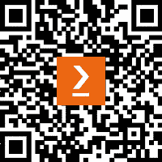

# 前言

欢迎来到 Go 编程 – 从入门到专业！在这里，你将学习到构建现代软件所需的一切，利用 Go。本课程专为没有编程经验的初学者设计，提供了一种全面的方法来理解和利用 Go 的力量和惯用性。

学习的最佳方式是通过实践。在这本书中，你将确切地这样做。Go 编程 – 从入门到专业将带你进行一场引人入胜的、循序渐进的旅程，从基础知识开始理解 Go。每一章都包含了激动人心的练习和活动，你可以根据自己的节奏进行，或者跳过某些部分。随着你继续阅读，你将逐步深入到更高级的主题，在那里你会发现如何利用 Go 的效率、简洁性和并发性来构建健壮和可扩展的软件解决方案。以你自己的方式和节奏学习，你将逐步建立并加强关键技能，这些技能将随着你作为 Go 开发者的成长而感到有成就感。

本书将突出 Go 1.21 及以后的最新特性，确保你在提升技能的过程中始终跟上这种多才多艺的语言的尖端能力。你将像 Go Gopher 一样构建和迭代你的代码，在学习过程中不断进步。

加入这个激动人心的冒险，随着我们解锁 Go 的全部潜力，我们将赋予你成为一名熟练的 Go 开发者的能力。无论你是构建 Web 应用程序、微服务，还是解决一般的软件挑战并希望利用 Go，这本书都为你提供了成功所需的知识和技能。让我们深入其中，用 Go 提升你的编程之旅。

# 这本书适合谁

本书专为 Go 的新手设计，无论你是从零开始还是从其他语言过渡过来，本书都赋予开发者构建现实世界项目和发展在 Go 中开启职业生涯所需技能的能力。提供了一种循序渐进的方法，即使是初学者也能在没有先前的编程经验的情况下掌握 Go 的基础知识。随着读者的进步，他们将发现 Go 的惯用最佳实践并探索语言的最新特性。读者将在 Go 中构建现代软件方面获得专业知识，通过实践学习经验，使他们能够成为专业的开发者。

# 这本书涵盖的内容

*第一章*，*变量和运算符*，解释了变量如何暂时保存数据。它还展示了你如何使用运算符来更改数据或对数据进行比较。

*第二章*，*命令与控制*，教你如何通过创建基于变量中数据的规则来使你的代码动态和响应。循环让你在学习过程中重复逻辑，并学会用 Go 掌控你的控制流。

*第三章*，*核心类型*，向你介绍了数据的基本构建块。你将学习什么是类型以及如何定义核心类型。

*第四章*, *复杂类型*，解释了复杂类型是在核心类型的基础上构建的，以便您可以使用数据分组和从核心类型组合新类型来模拟现实世界的数据。您还将了解在需要时如何克服 Go 的类型系统。

*第五章*, *函数 – 减少、重用和回收*，教授您构建函数的基本知识。然后，我们将深入了解使用函数的更高级功能，例如将函数作为参数传递、返回函数、将函数赋值给变量以及许多您可以用函数做的有趣事情。您将学习代码重用的基础知识。

*第六章*, *不要恐慌！处理错误*，教授您如何处理错误，涵盖诸如声明自己的错误以及以 Go 的方式处理错误等主题。您将了解什么是*panic*以及如何从中恢复。

*第七章*, *接口*，首先讲解接口的机制，然后演示 Go 中的接口提供了多态性、鸭子类型、能够拥有空接口以及接口的隐式实现。

*第八章*, *泛型算法超级能力*，展示了 Go 提供的泛型参数语法，以创建一个适用于多种类型的通用代码版本。您将理解何时、为什么以及如何利用泛型来减少代码重复。

*第九章*, *使用 Go 模块定义项目*，演示了如何利用 Go 模块来构建和管理 Go 项目，涵盖了基本的 Go 依赖管理文件。

*第十章*, *包保持项目可管理*，演示了如何在我们的程序中利用 Go 包来保持代码可管理并将代码分组到有用的功能子系统。

*第十一章*, *调试技巧破除错误*，教授您在应用程序中查找错误的基本原理。您将使用在代码中打印标记、使用值和类型以及执行日志记录的各种技术。

*第十二章*, *关于时间*，让您提前了解 Go 如何管理时间变量，以及提供了哪些功能来提高您的应用程序，例如测量执行时间和在时区之间导航。

*第十三章*, *从命令行编程*，教授您如何使用 Go 提供的所有功能创建命令行实用程序。您将练习标志解析、处理大量数据、退出代码、终端用户界面，并在过程中学习最佳实践。

*第十四章*, *文件和系统*，展示了 Go 在处理文件和底层操作系统方面有很好的支持。你将处理文件系统，学习如何在操作系统上创建、读取和修改文件。你还将看到 Go 如何读取 CSV 文件，这是管理员常用的文件格式。

*第十五章*, *SQL 和数据库*，涵盖了连接数据库和操作表的最重要方面，这些方面在当今是非常常见的任务，你将学习如何使用 Go 高效地与数据库工作。

*第十六章*, *Web 服务器*，教你如何使用 Go 标准包创建 HTTP 服务器、构建网站和创建 REST API。你将学习如何接受来自网页表单或来自另一个程序的请求并以人类或机器可读的格式进行响应。

*第十七章*, *使用 Go HTTP 客户端*，指导你如何使用 Go 标准包创建 HTTP 客户端并与 REST API 交互。你将学习如何向服务器发送 GET 请求并处理响应，以及如何向服务器发送表单数据以及如何上传文件到服务器。

*第十八章*, *并发工作*，展示了如何利用 Go 的并发特性使你的软件能够同时执行多个任务，将工作分配到独立的 Goroutines 中，从而减少处理时间。

*第十九章*, *测试*，帮助你理解 Go 支持的各种测试类型，包括 HTTP 测试、模糊测试、基准测试、使用测试套件以及生成测试报告和代码覆盖率。

*第二十章*, *使用 Go 工具*，使你熟悉随 Go 一起提供的工具，并解释如何使用它们来改进你的代码。你将学习如何使用`gofmt`和`goimports`自动格式化代码。你还将学习如何使用`go vet`进行静态分析以及如何使用 Go 的竞态条件检测器检测竞态条件。

*第二十一章*, *云中的 Go*，帮助你理解如何为云部署准备 Go 代码。你将学习如何通过使用 Prometheus、OpenTelemetry 等工具添加监控功能，以及如何将 Go 应用程序容器化以与 Kubernetes 等编排器一起工作。

# 为了充分利用这本书

每一段伟大的旅程都是从一小步开始的。我们即将开始的 Go 编程之旅也不例外。在我们能够使用 Go 做些酷的事情之前，我们需要准备一个高效的环境。为了这本书能更好地为你服务，你应该安装 Git、Docker 和 1.21 或更高版本的 Go。建议你有 4GB 的 RAM，并在 BIOS 中启用虚拟化（通常默认启用）。这本书最适合 macOS 或 Linux，如果需要，将需要为 Windows 等效命令进行一些调整。建议使用 1.6 GHz 或更快的桌面处理器。

关于额外设置的辅助说明：

## 安装 Go 编译器

为了将你的 Go 源代码转换成可运行的形式，你需要 Go 编译器。对于 Windows 和 macOS，我们推荐使用安装程序。作为替代，为了获得更多控制权，你可以下载预编译的二进制文件。你可以在[`packt.live/2PRUGjp`](https://packt.live/2PRUGjp)找到它们。Windows、macOS 和 Linux 上两种方法的安装说明在[`packt.live/375DQDA`](https://packt.live/375DQDA)。Go 编译器免费下载和使用。

## 安装 Git

Go 使用版本控制工具 Git 来安装额外的工具和代码。你可以在[`packt.live/35ByRug`](https://packt.live/35ByRug)找到 Windows、macOS 和 Linux 的说明。Git 免费安装和使用。

## 安装 Visual Studio Code（编辑器/IDE）

你需要某种东西来编写你的 Go 源代码。这个工具被称为编辑器或**集成开发环境**（**IDE**）。如果你已经有了喜欢的编辑器，你可以使用它来学习这门课程，如果你愿意的话。

如果你还没有编辑器，我们推荐你使用免费的编辑器 Visual Studio Code。你可以从[`packt.live/35KD2Ek`](https://packt.live/35KD2Ek)下载安装程序：

1.  一旦安装，打开 Visual Studio Code。

1.  从顶部菜单栏中选择**查看**。

1.  从选项列表中选择**扩展**。

1.  应该在左侧出现一个面板。在顶部是一个搜索输入框。输入`Go`。

1.  第一个选项应该是一个名为**Go by Microsoft**的扩展。

1.  点击该选项上的**安装**按钮。

1.  等待一个消息说它已成功安装。

如果你已经安装了 Git，请按照以下步骤操作：

1.  同时按下*Ctrl/Cmd + Shift + P*。应在窗口顶部出现一个文本输入框。

1.  输入`go tools`。

1.  选择标签类似于**转到**：**安装/更新工具**的选项。

1.  你会看到一个选项和复选框的列表。

1.  在搜索输入框旁边的第一个复选框会选中所有复选框。选择此复选框，然后选择其右侧的**转到**按钮。

1.  应该从底部出现一个面板，其中包含一些活动。一旦停止（可能需要几分钟），你就完成了。

完成后，从顶部菜单栏中选择**查看**，然后选择**资源管理器**。

## 安装 Docker

Docker 允许我们运行数据库服务器等，而无需安装它们，并将我们的应用程序容器化。Docker 可免费安装和使用。

对于 macOS 用户，请遵循[`packt.live/34VJLJD`](https://packt.live/34VJLJD)中的说明。

对于 Windows 用户，请遵循[`packt.live/2EKGDG6`](https://packt.live/2EKGDG6)中的说明。

Linux 用户，您应该能够使用内置的包管理器安装 Docker。常见发行版的说明在[`packt.live/2Mn8Cjc`](https://packt.live/2Mn8Cjc)。

书完成后，如果您愿意，可以安全地卸载 Docker。

## 安装 PostgreSQL

在涵盖数据库交互的章节中使用了 PostgreSQL。要安装 PostgreSQL 驱动程序，请遵循[`www.postgresql.org/download/`](https://www.postgresql.org/download/)中的说明。

**如果您使用的是本书的数字版，我们建议您亲自输入代码或从书的 GitHub 仓库（下一节中有一个链接）获取代码。这样做将帮助您避免与代码的复制和粘贴相关的任何潜在错误。**

# 下载示例代码文件

您可以从 GitHub 在[`packt.link/sni2F`](https://packt.link/sni2F)下载本书的示例代码文件。如果代码有更新，它将在 GitHub 仓库中更新。

我们还有来自我们丰富的图书和视频目录的其他代码包，可在[`github.com/PacktPublishing/`](https://github.com/PacktPublishing/)找到。查看它们吧！

# 使用的约定

本书中使用了多种文本约定。

`文本中的代码`：表示文本中的代码单词、数据库表名、文件夹名、文件名、文件扩展名、路径名、虚拟 URL、用户输入和 Twitter 账号。以下是一个示例：“在前一章中，我们学习了如何在 Go 中使用 `if`、`if-else`、`else-if`、`switch`、`case`、`continue`、`break` 和 `goto`。”

代码块设置如下：

```go
package main
import "fmt"
func main() {
  fmt.Println(10 > 5)
  fmt.Println(10 == 5)
}
```

当我们希望您注意代码块中的特定部分时，相关的行或项目将以粗体显示：

```go
go doc -all
```

任何命令行输入或输出都按以下方式编写：

```go
error, unexpected nil value
```

**粗体**：表示新术语、重要单词或屏幕上看到的单词。例如，菜单或对话框中的单词以**粗体**显示。以下是一个示例：“完成操作后，从顶部菜单栏中选择**查看**，然后选择**资源管理器**。”

小贴士或重要注意事项

看起来是这样的。

# 联系我们

我们的读者反馈总是受欢迎的。

**一般反馈**：如果您对本书的任何方面有疑问，请通过电子邮件 customercare@packtpub.com 联系我们，并在邮件主题中提及书名。

**勘误**: 尽管我们已经尽最大努力确保内容的准确性，但错误仍然可能发生。如果您在这本书中发现了错误，如果您能向我们报告，我们将不胜感激。请访问 [www.packtpub.com/support/errata](http://www.packtpub.com/support/errata) 并填写表格。

**盗版**: 如果您在互联网上以任何形式发现我们作品的非法副本，如果您能提供位置地址或网站名称，我们将不胜感激。请通过 copyright@packt.com 与我们联系，并提供材料的链接。

**如果您有兴趣成为作者**：如果您在某个领域有专业知识，并且您有兴趣撰写或为书籍做出贡献，请访问 [authors.packtpub.com](http://authors.packtpub.com)。

# 分享您的想法

一旦您阅读了《Go 编程 - 从入门到专业》，我们很乐意听听您的想法！[请点击此处直接进入此书的亚马逊评论页面并分享您的反馈](https://packt.link/r/1803243058)。

您的评论对我们和科技社区非常重要，并将帮助我们确保我们提供高质量的内容。

# 下载此书的免费 PDF 副本

感谢您购买此书！

您喜欢在路上阅读，但又无法携带您的印刷书籍到处走？

您的电子书购买是否与您选择的设备不兼容？

别担心，现在，每本 Packt 书籍都免费提供该书的 DRM 免费 PDF 版本，无需额外费用。

在任何地方、任何时间、任何设备上阅读。直接从您最喜欢的技术书籍中搜索、复制和粘贴代码到您的应用程序中。

优惠远不止于此，您还可以获得独家折扣、时事通讯和每日免费内容的邮箱访问权限。

按照以下简单步骤获取这些福利：

1.  扫描下面的二维码或访问以下链接



[`packt.link/free-ebook/9781803243054`](https://packt.link/free-ebook/9781803243054)

1.  提交您的购买证明

1.  就这些！我们将直接将您的免费 PDF 和其他福利发送到您的电子邮件。

# 第一部分：脚本

编写简单的单文件软件应用程序通常是大多数软件开发之旅的起点。在本节中，您将深入脚本的世界，让您轻松地创建酷炫且实用的工具和助手。

本部分包含以下章节：

+   *第一章**，变量和运算符*

+   *第二章**，命令与控制*

+   *第三章**，核心类型*

+   *第四章**，复杂类型*
