# 变量和运算符

概述

在本章中，你将了解 Go 的各种特性，并基本了解 Go 代码的样子。你还将深入了解变量是如何工作的，并通过练习和活动来获得实践经验，从而开始学习。

到本章结束时，你将能够使用 Go 中的变量、包和函数。你还将了解如何在 Go 中更改变量的值。在本章的后面部分，你将使用数字与运算符一起使用，并使用指针设计函数。

# 技术要求

对于本章，你需要 Go 版本 1.21 或更高版本。本章的代码可以在以下位置找到：[`github.com/PacktPublishing/Go-Programming-From-Beginner-to-Professional-Second-Edition-/tree/main/Chapter01`](https://github.com/PacktPublishing/Go-Programming-From-Beginner-to-Professional-Second-Edition-/tree/main/Chapter01)。

# Go 语言简介

Go（或通常称为 Golang）是一种编程语言，它因使用它来开发软件的回报而受到开发者的喜爱。它也受到公司的青睐，因为所有规模的团队能够使用它来提高生产力。Go 还因其持续提供性能极高的软件而赢得了声誉。

Go 有着令人印象深刻的血统，因为它是由一支来自 Google 的团队创造的，这支团队有着悠久的构建优秀的编程语言和操作系统的历史。他们创造了一种感觉上类似于 JavaScript 或 PHP 这样的动态语言，但具有 C++和 Java 这样的强类型语言的性能和效率。他们希望有一种既吸引程序员又适合有数百名开发者的项目的语言。

Go 语言包含了许多有趣且独特的特性，例如符合内存安全性和基于通道的并发。在本章中，我们将探讨这些特性。通过这样做，你会发现它们在 Go 中的独特实现正是使 Go 真正特殊的原因。

Go 语言是用文本文件编写的，然后编译成机器码并打包成一个单一的独立可执行文件。该可执行文件是自包含的，无需先安装任何东西即可运行。拥有单个文件使得部署和分发 Go 软件变得轻松。在编译时，你可以选择多个目标操作系统之一，包括但不限于 Windows、Linux、macOS 和 Android。使用 Go，你只需编写一次代码，就可以在任何地方运行。编译型语言不再受欢迎，因为程序员讨厌等待代码编译的漫长过程。Go 团队深知这一点，并构建了一个闪电般的编译器，即使项目规模扩大，编译速度依然很快。

Go 具有静态类型和类型安全的内存模型，并带有垃圾回收器来自动化内存管理。这种组合保护开发者免受在软件中常见的许多错误和安全漏洞的影响，同时仍然提供出色的性能和效率。动态类型语言，如 Ruby 和 Python，之所以受欢迎，部分原因是程序员认为，如果他们不必担心类型和内存，他们可以更高效地工作。这些语言的缺点是，它们牺牲了性能和内存效率，并且更容易出现类型不匹配的错误。Go 在动态类型语言具有相同的生产力水平的同时，并没有放弃性能和效率。

计算机性能发生了巨大的转变。现在要快速运行，您需要能够尽可能并行或并发地完成更多工作。这种变化是由于现代 CPU 的设计，它强调更多的核心而不是高时钟速度。目前所有流行的编程语言都没有被设计用来利用这一事实，这使得在这些语言中编写并行和并发代码容易出错。Go 被设计用来利用多个 CPU 核心，并消除了所有挫折和充满错误的代码。Go 被设计成允许任何开发者轻松且安全地编写并行和并发代码，使他们能够利用现代的多核 CPU 和云计算 – 无需戏剧性地解锁高性能处理和巨大的可扩展性。

# Go 看起来是什么样子？

让我们先看看一些 Go 代码。以下代码会从预定义的消息列表中随机打印一条消息到控制台：

```go
package main
// Import extra functionality from packages
import (
  "errors"
  "fmt"
  "log"
  "math/rand"
  "strconv"
  "time"
)// Taken from: https://en.wiktionary.org/wiki/Hello_World#Translations
var helloList = []string{
  "Hello, world",
  "Καλημέρα κόσμε",
  "こんにちは世界",
  "سلام دنیا‎",
  "Привет, мир",
}
```

`main()` 函数定义如下：

```go
func main() {
  // Seed random number generator using the current time
  rand.NewSource(time.Now().UnixNano())
  // Generate a random number in the range of out list
  index := rand.Intn(len(helloList))
  // Call a function and receive multiple return values
  msg, err := hello(index)
  // Handle any errors
  if err != nil {
    log.Fatal(err)
  }
  // Print our message to the console
  fmt.Println(msg)
}
```

让我们考虑 `hello()` 函数：

```go
func hello(index int) (string, error) {
  if index < 0 || index > len(helloList)-1 {
    // Create an error, convert the int type to a string
    return "", errors.New("out of range: " + strconv.Itoa(index))
  }
  return helloList[index], nil
}
```

现在，让我们逐行分析这段代码。

在我们的脚本顶部是以下内容：

```go
package main
```

这段代码是我们的包声明。所有 Go 文件都必须以其中之一开始。如果您想直接运行代码，您需要将其命名为 `main`。如果您不命名为 `main`，那么您可以用它作为库，并将其导入其他 Go 代码中。当创建可导入的包时，您可以给它任何名称。同一目录下的所有 Go 文件都被视为同一包的一部分，这意味着所有文件都必须有相同的包名。

在以下代码中，我们正在从包中导入代码：

```go
// Import extra functionality from packages
import (
  "errors"
  "fmt"
  "log"
  "math/rand"
  "strconv"
  "time"
)
```

在这个例子中，所有包都来自 Go 的标准库。Go 的标准库质量很高且功能全面。强烈建议您最大限度地利用它。如果您发现一个包看起来像 URL – 例如，`github.com/fatih/color`，那么这个包就不是来自标准库的。

Go 有一个模块系统，使得使用外部包变得简单。要使用一个新的模块，只需将其添加到您的导入路径。下次您构建代码时，Go 会自动为您下载它。

导入只适用于它们声明的文件，这意味着您必须在同一个包和项目中反复声明相同的导入。但不用担心——您不需要手动这样做。有许多工具和 Go 编辑器可以自动为您添加和删除导入：

```go
// Taken from: https://en.wiktionary.org/wiki/Hello_World#Translations
var helloList = []string{
  "Hello, world",
  "Καλημέρα κόσμε",
  "こんにちは世界",
  "سلام دنیا‎",
  "Привет, мир",
}
```

在这里，我们声明了一个全局变量，它是一个字符串列表，并用数据初始化它。Go 中的文本或字符串支持多字节 UTF-8 编码，这使得它们对任何语言都是安全的。我们在这里使用的列表类型被称为切片。Go 中有三种列表类型：切片、数组和映射。这三种都是键值对的集合，您使用键从集合中获取值。切片和数组集合使用数字作为键。在切片和数组中，第一个键始终是 0。此外，在切片和数组中，数字是连续的，这意味着数字序列中永远不会出现中断。使用 `map` 类型时，您可以选择 `key` 类型。当您想使用其他数据在映射中查找值时，您会使用它。例如，您可以使用一本书的 ISBN 来查找其标题和作者：

```go
func main() {
…
}
```

在这里，我们声明了一个函数。函数是当被调用时运行的代码。您可以将一个或多个变量作为数据传递给函数，并可选择从它那里接收一个或多个变量。Go 中的 `main()` 函数是特殊的。`main()` 函数是 Go 代码的入口点。在 `main` 包中只能有一个 `main()` 函数。当您的代码运行时，Go 会自动调用 `main` 来开始执行：

```go
  // Seed random number generator using the current time
  rand.Seed(time.Now().UnixNano())
  // Generate a random number in the range of out list
  index := rand.Intn(len(helloList))
```

在前面的代码中，我们正在生成一个随机数。我们首先需要确保它是一个好的随机数；为了做到这一点，我们必须对随机数生成器进行 *初始化*。我们使用格式化为 Unix 时间戳（包含纳秒）的当前时间来初始化它。为了获取时间，我们调用 `time` 包中的 `Now` 函数。`Now` 函数返回一个结构体类型的变量。结构体是属性和函数的集合，类似于其他语言中的对象。在这种情况下，我们立即在该结构体上调用 `UnixNano` 函数。`UnixNano` 函数返回一个 `int64` 类型的变量，这是一个 64 位整数，或者更简单地说，是一个数字。这个数字被传递到 `rand.Seed`。`rand.Seed` 函数接受一个 `int64` 类型的变量作为其输入。请注意，来自 `time.UnixNano` 和 `rand.Seed` 的变量的类型必须相同。有了这些，我们就成功地初始化了随机数生成器。

我们想要的是一个可以用来获取随机消息的数字。我们将使用 `rand.Intn` 来完成这项工作。这个函数给我们一个介于 0 和 1 之间的随机数，减去我们传入的数字。这听起来可能有点奇怪，但它对我们想要做的事情来说非常完美。这是因为我们的列表是一个从 0 开始，每个值递增 1 的切片。这意味着最后一个索引比切片长度少 1。

为了向您展示这意味着什么，这里有一些简单的代码：

```go
package main
import (
  "fmt"
)
func main() {
  helloList := []string{
    "Hello, world",
    "Καλημέρα κόσμε",
    "こんにちは世界",
    "سلام دنیا‎",
    "Привет, мир",
  }
  fmt.Println(len(helloList))
  fmt.Println(helloList[len(helloList)-1])
  fmt.Println(helloList[len(helloList)])
}
```

这段代码打印列表的长度，然后使用这个长度来打印最后一个元素。为了做到这一点，我们必须减去 1；否则，我们会得到一个错误，这就是最后一行引起的问题：

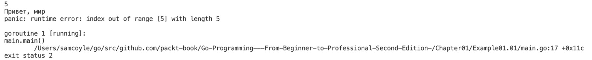

图 1.1：显示错误的输出

一旦我们生成了随机数，我们就将其分配给一个变量。我们使用与 `:=` 符号一起看到的简短变量声明来做这件事，这在 Go 语言中是一个非常流行的快捷方式，在函数内部使用。它告诉编译器继续将那个值分配给变量，并隐式地选择适合那个值的类型。这个快捷方式是使 Go 语言感觉像动态类型语言的多件事之一：

```go
  // Call a function and receive multiple return values
  msg, err := hello(index)
```

然后，我们使用那个变量来调用一个名为 `hello` 的函数。我们稍后会看看 `hello`。重要的是要注意，我们从函数中接收两个值，并且能够使用 `:=` 符号将它们分配给两个新变量，`msg` 和 `err`，其中 `err` 作为第二个值：

```go
func hello(index int) (string, error) {
…
}
```

这段代码是 `hello` 函数的定义；我们现在不展示其主体。函数作为一个逻辑单元，在需要时被调用。当调用函数时，调用它的代码会停止运行，等待函数运行完成。函数是保持代码组织和可理解性的优秀工具。在 `hello` 的签名中，我们定义了它接受一个 `int` 类型的值，并返回一个 `string` 类型的值和一个 `error` 类型的值。在 Go 语言中，将 `error` 作为最后一个返回值是非常常见的事情。`{}` 之间的代码是函数的主体。以下代码是函数被调用时运行的代码：

```go
  if index < 0 || index > len(helloList)-1 {
    // Create an error, convert the int type to a string
    return "", errors.New("out of range: " + strconv.Itoa(index))
  }
  return helloList[index], nil
```

在这里，我们处于函数内部；主体中的第一行是一个 `if` 语句。一个 `if` 语句在其布尔表达式为真时运行其 `{}` 内的代码。布尔表达式是 `if` 和 `{` 之间的逻辑。在这种情况下，我们正在测试传递的 `index` 变量是否小于 0 或大于可能的最大切片索引键。

如果布尔表达式为真，那么我们的代码将返回一个空的 `string` 和一个 `error` 值。此时，函数将停止运行，调用函数的代码将继续运行。如果布尔表达式不为真，其代码将被跳过，我们的函数将从 `helloList` 返回一个值，并返回 `nil`。在 Go 语言中，`nil` 代表没有值和没有类型的东西：

```go
  // Handle any errors
  if err != nil {
    log.Fatal(err)
  }
```

在我们运行`hello`之后，我们需要做的第一件事是检查它是否成功运行。我们可以通过检查存储在`err`中的`error`值来完成。如果`err`不等于`nil`，那么我们知道我们有一个错误。您将看到对`err`是否不等于`nil`的检查，而不是对`err`是否等于`nil`的检查，因为这简化了代码库的检查和逻辑。在出现错误的情况下，我们调用`log.Fatal`，它会写入日志消息并终止我们的应用程序。一旦应用程序被终止，就没有更多的代码运行：

```go
  // Print our message to the console
  fmt.Println(msg)
```

如果没有错误，那么我们知道`hello`已成功运行，并且`msg`的值可以信赖以包含有效值。我们需要做的最后一件事是通过终端将消息打印到屏幕上。

这就是它的样子：

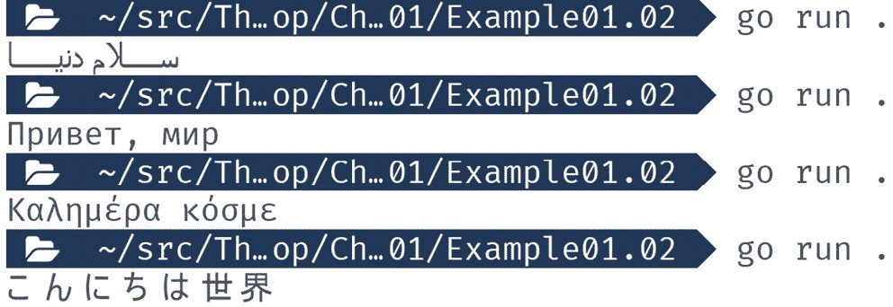

图 1.2：显示有效值的输出

在这个简单的 Go 程序中，我们已经能够涵盖许多关键概念，我们将在接下来的章节中详细探讨。

## 练习 1.01 – 使用变量、包和函数打印星号

在这个练习中，我们将使用前面示例中学习的一些内容来打印一个介于 1 和 5 之间的随机星号（`*`）到控制台。这个练习将让您了解使用 Go 的感觉，并练习我们将需要继续使用的 Go 功能。让我们开始吧：

1.  创建一个新的文件夹，并向其中添加一个`main.go`文件。

1.  在`main.go`中，将`main`包名添加到文件顶部：

    ```go
    package main
    ```

1.  现在，添加我们将在这个文件中使用的导入：

    ```go
    import (
      "fmt"
      "math/rand"
      "strings"
      "time"
    )
    ```

1.  创建一个`main()`函数：

    ```go
    func main() {
    ```

1.  初始化随机数生成器：

    ```go
      rand.Seed(time.Now().UnixNano())
    ```

1.  生成一个介于 0 和 1 之间的随机数，然后加 1 以得到一个介于 1 和 5 之间的数字：

    ```go
      r := rand.Intn(5) + 1
    ```

1.  使用字符串重复器创建所需数量的星号字符串：

    ```go
      stars := strings.Repeat("*", r)
    ```

1.  在控制台打印带有星号的字符串，并在末尾添加换行符，然后关闭`main()`函数：

    ```go
      fmt.Println(stars)
    }
    ```

1.  保存文件。然后，在新文件夹中运行以下命令：

    ```go
    go run .
    ```

以下为输出结果：

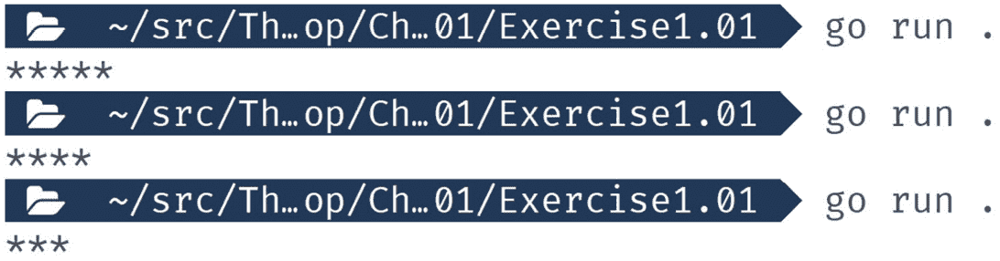

图 1.3：显示星号的输出

在这个练习中，我们通过定义包含`main()`函数的`main`包来创建了一个可运行的 Go 程序。我们通过添加包导入来使用标准库。这些包帮助我们生成随机数、重复字符串以及写入控制台。

## 活动练习 1.01 – 定义和打印

在这个活动中，我们将为医生的办公室创建一个医疗表格，以记录病人的姓名、年龄以及他们是否有花生过敏：

1.  为以下内容创建变量：

    1.  首先以字符串形式输入名字。

    1.  以字符串形式输入姓氏。

    1.  年龄作为一个`int`类型的值。

    1.  花生过敏作为一个`bool`类型的值。

1.  确保它们有一个初始值。

1.  将值打印到控制台。

以下为预期输出：

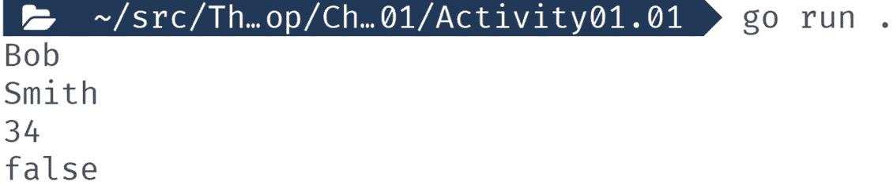

图 1.4：分配变量后的预期输出

注意

本章所有活动的解决方案都可以在以下 GitHub 仓库中找到：[`github.com/PacktPublishing/Go-Programming-From-Beginner-to-Professional-Second-Edition-/tree/main/Chapter01`](https://github.com/PacktPublishing/Go-Programming-From-Beginner-to-Professional-Second-Edition-/tree/main/Chapter01)

接下来，我们将详细讲解到目前为止我们已经覆盖的内容，所以如果你对之前看到的内容感到困惑或有任何疑问，请不要担心。

# 声明变量

现在，你已经对 Go 有了一定的了解并完成了你的第一个练习，我们将深入探讨。我们旅程的第一个目的地是变量。

变量暂时存储数据，以便你可以使用它。当你声明一个变量时，它需要四个要素：一个声明变量的语句、变量的名称、它可以存储的数据类型以及它的初始值。幸运的是，其中一些部分是可选的，但这也意味着定义变量的方式不止一种。

让我们来看看你可以声明变量的所有方法。

## 使用 var 声明变量

使用 `var` 是声明变量的基础方法。我们将要讲解的其他所有方法都是这种方法的变体，通常是通过省略定义的一部分。一个完整的 `var` 定义，包含所有要素，看起来像这样：

```go
var foo string = "bar"
```

关键部分是 `var`、`foo`、`string` 和 `= "bar"`：

+   `var` 是我们定义变量的声明

+   `foo` 是变量的名称

+   `string` 是变量的类型

+   `= "bar"` 是其初始值

## 练习 1.02 – 使用 var 声明变量

在这个练习中，我们将使用完整的 `var` 语法声明两个变量。然后，我们将它们打印到控制台。你会发现你可以在代码的任何地方使用 `var` 语法，这不是所有变量声明语法都有的。让我们开始吧：

1.  创建一个新的文件夹，并向其中添加一个 `main.go` 文件。

1.  在 `main.go` 中，将主包名添加到文件顶部：

    ```go
    package main
    ```

1.  添加导入：

    ```go
    import (
      "fmt"
    )
    ```

1.  在包级作用域中声明一个变量。我们将在稍后详细解释作用域的概念：

    ```go
    var foo string = "bar"
    ```

1.  创建 `main()` 函数：

    ```go
    func main() {
    ```

1.  在我们的函数中使用 `var` 声明另一个变量：

    ```go
      var baz string = "qux"
    ```

1.  将两个变量都打印到控制台：

    ```go
      fmt.Println(foo, baz)
    ```

1.  关闭 `main()` 函数：

    ```go
    }
    ```

1.  保存文件。然后，在新文件夹中运行以下命令：

    ```go
    go run .
    ```

以下是将显示的输出：

```go
bar qux
```

在这个例子中，`foo` 在包级别被声明，而 `baz` 在函数级别被声明。变量声明的位置很重要，因为声明的位置也限制了你可以用来声明变量的语法。

接下来，我们将看看使用 `var` 语法的另一种方法。

## 使用 var 一次性声明多个变量

我们可以使用单个 `var` 声明来定义多个变量，使用 `var` 块或语句。当声明包级变量时，这种方法很常见。变量不需要是同一类型，它们都可以有自己的初始值。这种语法的样子是这样的：

```go
var (
  <name1> <type1> = <value1>
  <name2> <type2> = <value2>
…
  <nameN> <typeN> = <valueN>
)
```

你可以有多个这种类型的声明。这是一种将相关变量分组的好方法，从而使你的代码更易于阅读。你可以在函数中使用这种表示法，但很少在那里看到它。

## 练习 1.03 – 使用 var 同时声明多个变量

在这个练习中，我们将使用单个 `var` 语句声明多个变量，每个变量具有不同的类型和初始值。然后，我们将打印每个变量的值到控制台。让我们开始吧：

1.  创建一个新的文件夹，并向其中添加一个 `main.go` 文件。

1.  在 `main.go` 文件中，将 `main` 包名添加到文件顶部：

    ```go
    package main
    ```

1.  添加导入：

    ```go
    import (
      "fmt"
      "time"
    )
    ```

1.  开始 `var` 声明：

    ```go
    var (
    ```

1.  定义三个变量：

    ```go
      Debug   bool   = false
      LogLevel  string  = "info"
      startUpTime time.Time = time.Now()
    ```

1.  关闭 `var` 声明：

    ```go
    )
    ```

1.  在 `main()` 函数中，将每个变量打印到控制台：

    ```go
    func main() {
      fmt.Println(Debug, LogLevel, startUpTime)
    }
    ```

1.  保存文件。然后，在新的文件夹中，运行以下命令：

    ```go
    go run .
    ```

    以下为输出：


图 1.5：显示三个变量值的输出

在这个练习中，我们使用单个 `var` 语句声明了三个变量。对于 `time.Time` 变量，你的输出可能会有所不同，但这是正确的。格式是相同的，但时间本身是不同的。

使用这种 `var` 表示法是一种保持代码井然有序并节省一些输入的好方法。

接下来，我们将开始移除 `var` 表示法的一些可选部分。

## 在声明变量时跳过类型或值

在现实世界的代码中，不常见到使用完整的 `var` 表示法。有一些情况需要定义具有初始值并严格控制其类型的包级变量。在这些情况下，你需要完整的表示法。当你需要时，这将是明显的，因为你会有某种类型不匹配，所以现在不必过于担心这个问题。其余时间，你可以删除一个可选部分或使用简短的变量声明。

在声明变量时，你不需要同时包含类型和初始值。你可以只使用其中一个；Go 会处理其余部分。如果你在声明中有一个类型但没有初始值，Go 会使用你选择的类型的零值。我们将在本书的后面讨论零值是什么。另一方面，如果你有一个初始值但没有类型，Go 有一个规则集，用于从你使用的字面值中推断所需的类型。

## 练习 1.04 – 在声明变量时跳过类型或值

在这个练习中，我们将更新我们之前的练习，以便跳过变量声明中的可选初始值或类型声明。然后，我们将像之前一样打印值到控制台，以显示结果相同。让我们开始吧：

1.  创建一个新的文件夹，并向其中添加一个 `main.go` 文件。

1.  在 `main.go` 文件中，将 `main` 包名添加到文件顶部：

    ```go
    package main
    ```

1.  导入我们需要的包：

    ```go
    import (
      "fmt"
      "time"
    )
    ```

1.  开始多变量声明：

    ```go
    var (
    ```

1.  第一项练习中的`bool`值初始值为`false`。这是`bool`值的零值，因此我们将从其声明中省略初始值，因为它默认已设置：

    ```go
      Debug   bool
    ```

1.  下两个变量都有非零的类型值，因此我们将省略它们的类型声明：

    ```go
      LogLevel  = "info"
      startUpTime = time.Now()
    ```

1.  关闭`var`声明：

    ```go
    )
    ```

1.  在`main()`函数中，打印出每个变量：

    ```go
    func main() {
      fmt.Println(Debug, LogLevel, startUpTime)
    }
    ```

1.  保存文件。然后，在新文件夹中运行以下命令：

    ```go
    go run .
    ```

    以下为输出：


图 1.6：输出显示变量值，尽管在声明变量时没有提及类型

在这个练习中，我们能够更新之前的代码，使其使用更紧凑的变量声明。声明变量是你必须经常做的事情，不需要使用这种表示法可以让编写代码的体验更好。

接下来，我们将探讨一个你不能跳过任何部分的场景。

## 类型推断出错

有时候你需要使用声明中的所有部分——例如，当 Go 无法猜出你需要的正确类型时。让我们看看这个例子：

```go
package main
import "math/rand"
func main() {
  var seed = 1234456789
  rand.NewSource(seed)
}
```

以下为输出：

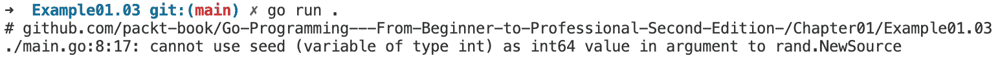

图 1.7：显示错误的输出

这里的问题是`rand.NewSource`需要一个`int64`类型的变量。Go 的类型推断规则与整数（如我们用作`int`值的整数）交互操作。我们将在本书的后面更详细地探讨它们之间的区别。为了解决这个问题，我们将向声明中添加`int64`类型。以下是它的样子：

```go
package main
import "math/rand"
func main() {
  var seed int64 = 1234456789
  rand.NewSource(seed)
}
```

接下来，我们将探讨一种更快声明变量的方法。

## 简短变量声明

当在函数中声明变量时，我们可以使用`:=`简写。这种简写允许我们使我们的声明更短。它是通过允许我们不必使用`var`关键字，并且总是从所需的初始值推断类型来实现的。

## 练习 1.05 – 实现简短变量声明

在这个练习中，我们将更新之前的练习，使其使用简短的变量声明。由于你只能在函数中使用简短变量声明，我们将把变量移出包作用域。之前`Debug`有类型但没有初始值，我们将将其切换回有初始值，因为使用简短变量声明时需要初始值。最后，我们将将其打印到控制台。让我们开始吧：

1.  创建一个新的文件夹，并向其中添加一个`main.go`文件。

1.  在`main.go`文件顶部添加`main`包名：

    ```go
    package main
    ```

1.  导入我们需要的包：

    ```go
    import (
      "fmt"
      "time"
    )
    ```

1.  创建`main()`函数：

    ```go
    func main() {
    ```

1.  使用简短变量声明符号声明每个变量：

    ```go
      Debug := false
      LogLevel := "info"
      startUpTime := time.Now()
    ```

1.  将变量打印到控制台：

    ```go
      fmt.Println(Debug, LogLevel, startUpTime)
    }
    ```

1.  保存文件。然后，在新文件夹中运行以下命令：

    ```go
    go run .
    ```

以下为输出：


图 1.8：显示使用简短变量声明符号后打印的变量值输出

在这个练习中，我们更新了之前的代码，以便在有一个初始值可以使用时以非常紧凑的方式声明变量。

`:=`简写法在 Go 开发者中非常受欢迎，并且在现实世界的 Go 代码中定义变量的最常见方式。开发者喜欢它使他们的代码简洁紧凑，同时仍然清楚地表明了正在发生什么。

另一个快捷方式是在同一行上声明多个变量。

## 使用简短的变量声明声明多个变量

可以使用简短的变量声明同时声明多个变量。它们必须在同一行上，并且每个变量都必须有一个相应的初始值。表示法看起来像`<var1>, <var2>, …, <varN> := <val1>, <val2>, …, <valN>`。变量名位于`:=`的左侧，由逗号分隔。初始值再次位于`:=`的右侧，每个值由逗号分隔。最左侧的变量名获得最左侧的值。必须具有相同数量的名称和值。

以下是一个使用我们之前练习代码的示例：

```go
package main
import (
  "fmt"
  "time"
)
func main() {
  Debug, LogLevel, startUpTime := false, "info", time.Now()
  fmt.Println(Debug, LogLevel, startUpTime)
}
```

以下是将输出：


图 1.9：显示具有变量声明函数的程序变量值的示例输出

有时，你确实会看到像这样的现实世界代码。它有点难读，所以在字面值方面并不常见。但这并不意味着这不常见——在调用返回多个值的函数时，这种情况非常常见。我们将在本书稍后讨论函数时详细说明这一点。

## 练习 1.06 – 从函数中声明多个变量

在这个练习中，我们将调用一个返回多个值的函数，并将每个值分配给一个新的变量。然后，我们将打印这些值到控制台。让我们开始吧：

1.  创建一个新的文件夹，并向其中添加一个`main.go`文件。

1.  在`main.go`中，将`main`包名添加到文件顶部：

    ```go
    package main
    ```

1.  导入我们需要的包：

    ```go
    import (
      "fmt"
      "time"
    )
    ```

1.  创建一个返回三个值的函数：

    ```go
    func getConfig() (bool, string, time.Time) {
    ```

1.  在函数中，返回三个字面值，每个值由逗号分隔：

    ```go
      return false, "info", time.Now()
    ```

1.  关闭函数：

    ```go
    }
    ```

1.  创建`main()`函数：

    ```go
    func main() {
    ```

1.  使用简短的变量声明，捕获函数返回的三个新变量的值：

    ```go
      Debug, LogLevel, startUpTime := getConfig()
    ```

1.  将三个变量打印到控制台：

    ```go
      fmt.Println(Debug, LogLevel, startUpTime)
    ```

1.  关闭`main()`函数：

    ```go
    }
    ```

1.  保存文件。然后，在新文件夹中运行以下命令：

    ```go
    go run .
    ```

    以下是将输出：


图 1.10：显示程序中变量声明函数的变量值输出

在这个练习中，我们能够调用一个返回多个值的函数，并使用一行简短变量声明来捕获它们。如果我们使用`var`表示法，它将看起来像这样：

```go
var (
  Debug bool
  LogLevel string
  startUpTime time.Time
)
Debug, LogLevel, startUpTime = getConfig()
```

简短的变量表示法是 Go 语言具有动态语言感觉的一个重要部分。

尽管如此，我们还没有完全结束`var`的使用——它仍然有一些有用的技巧。

## 使用`var`在单行上声明多个变量

虽然使用简短变量声明更为常见，但你也可以使用`var`在单行上定义多个变量。这种方法的局限性在于，在声明类型时，所有值必须具有相同的类型。如果你使用初始值，那么每个值都会从字面值推断其类型，这样它们就可以不同。以下是一个例子：

```go
package main
import (
  "fmt"
  "time"
)
func getConfig() (bool, string, time.Time) {
  return false, "info", time.Now()
}
func main() {
  // Type only
  var start, middle, end float32
  fmt.Println(start, middle, end)
  // Initial value mixed type
  var name, left, right, top, bottom = "one", 1, 1.5, 2, 2.5
  fmt.Println(name, left, right, top, bottom)
  // works with functions also
  var Debug, LogLevel, startUpTime = getConfig()
  fmt.Println(Debug, LogLevel, startUpTime)
}
```

以下是输出：

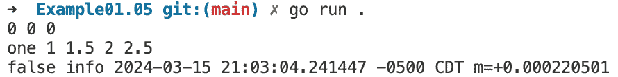

图 1.11：显示变量值的输出

在使用简短变量声明时，这些通常更紧凑。这个事实意味着它们在现实世界的代码中很少出现。例外是相同类型仅有的例子。这种表示法在需要许多相同类型的变量，并且需要仔细控制该类型时非常有用。

## 非英语变量名

Go 是一种 UTF-8 兼容的语言，这意味着你可以使用除英语使用的拉丁字母以外的字母来定义变量名。关于变量名可以是什么有一些限制。名称的第一个字符必须是字母或`_`。其余可以是字母、数字和`_`的混合。让我们看看它是什么样子：

```go
package main
import (
  "fmt"
  "time"
)
func main() {
  デバッグ := false
  日志级别 := "info"
  ይጀምሩ := time.Now()
  _A1_Μείγμα := "" 
"
  fmt.Println(デバッグ, 日志级别, ይጀምሩ, _A1_Μείγμα)
}
```

以下是输出：

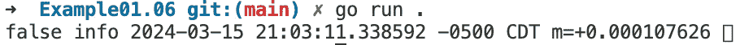

图 1.12：显示变量值的输出

注意

**语言与语言**：并非所有编程语言都允许你使用 UTF-8 字符作为变量和函数名。这个特性可能是 Go 在亚洲国家，尤其是中国如此受欢迎的原因之一。

# 改变变量的值

现在我们已经定义了我们的变量，让我们看看我们可以用它们做什么。首先，让我们改变变量的初始值。要做到这一点，我们将使用与设置初始值时相似的表示法。这看起来像 `<变量> = <值>`。

## 练习 1.07 – 改变变量的值

按照以下步骤操作：

1.  创建一个新的文件夹并将`main.go`文件添加到其中。

1.  在`main.go`中，将`main`包名添加到文件顶部：

    ```go
    package main
    ```

1.  导入我们将需要的包：

    ```go
    import "fmt"
    ```

1.  创建`main()`函数：

    ```go
    func main() {
    ```

1.  声明一个变量：

    ```go
      offset := 5
    ```

1.  将变量打印到控制台：

    ```go
      fmt.Println(offset)
    ```

1.  改变变量的值：

    ```go
      offset = 10
    ```

1.  再次将其打印到控制台并关闭`main()`函数：

    ```go
      fmt.Println(offset)
    }
    ```

1.  保存文件。然后，在新文件夹中运行以下命令：

    ```go
    go run .
    ```

以下是在更改变量值之前的输出：

```go
5
10
```

在这个例子中，我们将偏移量的值从初始值`5`更改为`10`。任何你使用原始值的地方，例如我们例子中的`5`和`10`，你都可以使用变量。下面是如何做到这一点：

```go
package main
import "fmt"
var defaultOffset = 10
func main() {
  offset := defaultOffset
  fmt.Println(offset)
  offset = offset + defaultOffset
  fmt.Println(offset)
}
```

以下是更改变量值后的输出：

```go
10
20
```

接下来，我们将看看我们如何在单行语句中更改多个变量。

## 一次性更改多个值

与你可以在一行中声明多个变量一样，你也可以一次性更改多个变量的值。语法也类似；看起来像`<var1>, <var2>, …, <varN> = <val1>, <val2>, …, <valN>`。

## 练习 1.08 - 一次性更改多个值

在这个练习中，我们将定义一些变量，并使用单行语句更改它们的值。然后，我们将打印它们的新值到控制台。让我们开始吧：

1.  创建一个新的文件夹，并向其中添加一个`main.go`文件。

1.  在`main.go`中，将`main`包名添加到文件顶部：

    ```go
    package main
    ```

1.  导入我们需要的包：

    ```go
    import "fmt"
    ```

1.  创建`main()`函数：

    ```go
    func main() {
    ```

1.  使用初始值声明我们的变量：

    ```go
      query, limit, offset := "bat", 10, 0
    ```

1.  使用单行语句更改每个变量的值：

    ```go
      query, limit, offset = "ball", offset, 20
    ```

1.  将值打印到控制台并关闭`main()`函数：

    ```go
      fmt.Println(query, limit, offset)
    }
    ```

1.  保存文件。然后，在新文件夹中运行以下命令：

    ```go
    go run .
    ```

以下是通过单行语句显示更改变量值的输出：

```go
ball 0 20
```

在这个练习中，我们能够在单行中更改多个变量。这种方法在调用函数时同样适用，就像在变量声明中一样。你需要小心使用这种特性，确保首先你的代码易于阅读和理解。如果使用这种单行语句使得难以了解代码的功能，那么最好使用更多行来编写代码。

接下来，我们将看看运算符是什么以及它们如何以有趣的方式更改你的变量。

# 运算符

当变量存储你的应用程序的数据时，当你开始使用它们来构建软件的逻辑时，它们才变得真正有用。运算符是你用来处理软件数据的工具。使用运算符，你可以比较数据与其他数据——例如，你可以在交易应用程序中检查价格是否过低或过高。你还可以使用运算符来操作数据。例如，你可以使用运算符将购物车中所有商品的成本相加以获取总价。

以下列表提到了运算符的组：

+   **算术运算符**：这些用于与数学相关的任务，如加法、减法和乘法。

+   **比较运算符**：这些用于比较两个值；例如，它们是否相等，不相等，小于还是大于对方。

+   `bool`值是 false。

+   **地址运算符**：我们将在查看指针时详细介绍这些。这些用于处理它们。

+   **接收运算符**：当与 Go 通道一起工作时使用。我们将在本书的后面部分介绍这一点。

## 练习 1.09 – 使用数字运算符

在这个练习中，我们将模拟餐厅账单。为了构建我们的模拟，我们需要使用数学和比较运算符。我们将首先探索运算符的所有主要用途。

在我们的模拟中，我们将把所有东西加起来，并根据百分比计算小费。然后，我们将使用比较运算符来查看顾客是否获得奖励。让我们开始吧：

注意

我们在这个练习中将美元视为货币。你可以考虑任何你选择的货币；这里的主要重点是操作。

1.  创建一个新的文件夹，并向其中添加一个 `main.go` 文件。

1.  在 `main.go` 文件中，将 `main` 包名添加到文件顶部：

    ```go
    package main
    ```

1.  导入你需要的包：

    ```go
    import "fmt"
    ```

1.  创建 `main()` 函数：

    ```go
    func main() {
    ```

1.  创建一个变量来保存总额。对于账单上的这个项目，顾客购买了两个价值 13 美元的商品。我们必须使用 `*` 进行乘法。然后，我们必须打印小计：

    ```go
      // Main course
      var total float64 = 2 * 13
      fmt.Println("Sub :", total)
    ```

1.  在这里，他们购买了四件价值 2.25 美元的商品。我们必须使用乘法来计算这些商品的总价，然后使用 `+` 将其加到之前的总价值上，并将这个值赋回总价值：

    ```go
      // Drinks
      total = total + (4 * 2.25)
      fmt.Println("Sub :", total)
    ```

1.  这位顾客将获得 5 美元的折扣。在这里，我们使用 `–` 从总额中减去 5 美元：

    ```go
      // Discount
      total = total - 5
      fmt.Println("Sub :", total)
    ```

1.  然后，我们使用乘法来计算 10%的小费：

    ```go
      // 10% Tip
      tip := total * 0.1
      fmt.Println("Tip :", tip)
    ```

1.  最后，我们将小费加到总额上：

    ```go
      total = total + tip
      fmt.Println("Total:", total)
    ```

1.  账单将分给两个人。使用 `/` 来将总额分成两部分：

    ```go
      // Split bill
      split := total / 2
      fmt.Println("Split:", split)
    ```

1.  在这里，我们将计算顾客是否获得奖励。首先，我们将设置 `visitCount` 并给这次访问加 1 美元：

    ```go
      // Reward every 5th visit
      visitCount := 24
      visitCount = visitCount + 1
    ```

1.  然后，我们将使用 `%` 来获取 `visitCount` 除以 5 美元后的任何余数：

    ```go
      remainder := visitCount % 5
    ```

1.  顾客在每次第五次访问时获得奖励。如果余数是 0，那么这次访问就是其中之一。使用 `==` 运算符检查余数是否为 0：

    ```go
      if remainder == 0 {
    ```

1.  如果是，打印一条消息说明他们获得奖励：

    ```go
        fmt.Println("With this visit, you've earned a reward.")
      }
    }
    ```

1.  保存文件。然后在新的文件夹中，运行以下命令：

    ```go
    go run .
    ```

以下是输出结果：

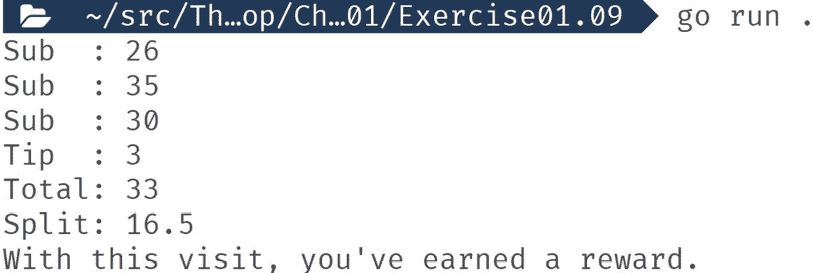

图 1.13：使用数字运算符的输出

在这个练习中，我们使用了数学和比较运算符与数字。它们使我们能够模拟复杂的情况——计算餐厅账单。有许多运算符，你可以使用的运算符类型因不同类型的值而异。例如，除了有数字的加法运算符外，你还可以使用 `+` 符号将字符串连接起来。下面是它的实际应用：

```go
package main
import "fmt"
func main() {
  givenName := "John"
  familyName := "Smith"
  fullName := givenName + " " + familyName
  fmt.Println("Hello,", fullName)
}
```

以下是输出结果：

```go
Hello, John Smith
```

对于某些情况，我们可以通过运算符来简化一些操作。我们将在下一节中介绍这一点。

位运算符

Go 语言拥有你在编程语言中常见的所有位运算符。如果你知道什么是位运算符，那么这里对你来说不会有惊喜。如果你不知道什么是位运算符，不要担心——它们在现实世界的代码中并不常见。

## 简写运算符

当你想对现有值及其自身值执行操作时，有几个简写赋值运算符：

+   `--`: 将数字减 1

+   `++`: 将数字加 1

+   `+=`: 加上并赋值

+   `-=`: 减去并赋值

## 练习 1.10 – 实现简写运算符

在这个练习中，我们将使用一些运算符简写的例子来展示它们如何使你的代码更加紧凑且易于编写。我们将创建一些变量，然后使用简写来改变它们，在过程中打印它们。让我们开始吧：

1.  创建一个新的文件夹，并向其中添加一个 `main.go` 文件。

1.  在 `main.go` 文件中，将 `main` 包名添加到文件顶部：

    ```go
    package main
    ```

1.  导入我们需要的包：

    ```go
    import "fmt"
    ```

1.  创建 `main()` 函数：

    ```go
    func main() {
    ```

1.  创建一个具有初始值的变量：

    ```go
      count := 5
    ```

1.  我们将向其添加内容，然后将结果赋值回它本身。然后，我们将打印它：

    ```go
      count += 5
      fmt.Println(count)
    ```

1.  将值增加 1 并打印出来：

    ```go
      count++
      fmt.Println(count)
    ```

1.  减少它的值并打印出来：

    ```go
      count--
      fmt.Println(count)
    ```

1.  减去并赋值结果回它本身。打印出新的值：

    ```go
      count -= 5
      fmt.Println(count)
    ```

1.  对于字符串，也存在一个简写运算符。定义一个字符串：

    ```go
      name := "John"
    ```

1.  接下来，我们将另一个字符串追加到其末尾，然后打印出来：

    ```go
      name += " Smith"
      fmt.Println("Hello,", name)
    ```

1.  关闭 `main()` 函数：

    ```go
    }
    ```

1.  保存文件。然后，在新文件夹中，运行以下命令：

    ```go
    go run .
    ```

以下为输出结果：


图 1.14：使用简写运算符的输出

在这个练习中，我们使用了一些简写运算符。一组专注于修改然后赋值。这种操作很常见，并且有这些快捷方式可以使编码更加有趣。其他运算符是递增和递减。这些在需要逐个遍历数据时在循环中很有用。这些快捷方式使任何阅读你的代码的人都能清楚地了解你在做什么。

接下来，我们将详细探讨如何比较两个值。

## 比较值

在应用程序中，逻辑是让你的代码做出决策的问题。这些决策是通过比较变量的值与您定义的规则来实现的。这些规则以比较的形式出现。我们使用另一组运算符来进行这些比较。这些比较的结果总是真或假。你通常还需要进行很多这样的比较才能做出一个决策。为了帮助做到这一点，我们有了逻辑运算符。

这些运算符大部分都作用于两个值，并且总是产生布尔值。你只能用逻辑运算符与布尔值一起使用。让我们更详细地看看比较运算符和逻辑运算符。

**比较运算符**:

+   `==`: 如果两个值相同，则为真

+   `!=`: 如果两个值不相同，则为真

+   `<`: 如果左边的值小于右边的值，则为真

+   `<=`: 如果左边的值小于或等于右边的值，则为真

+   `>`: 如果左边的值大于右边的值，则为真

+   `>=`: 如果左边的值大于或等于右边的值，则为真

**逻辑运算符**:

+   `&&`: 如果左右两边的值都为真，则为真

+   `||`：如果左边的值或右边的值之一为真，则为真

+   `!`：此运算符仅与单个值一起使用，如果值为假，则结果为真

## 练习 1.11 – 比较值

在这个练习中，我们将使用比较和逻辑运算符来查看测试不同条件时得到的布尔结果。我们正在测试根据用户访问次数来确定用户会员等级。

我们的会员等级如下：

+   **银级**：10 到 20 次访问（包括 10 和 20）

+   **金级**：21 到 30 次访问（包括 21 和 30）

+   **白金级**：超过 30 次访问

让我们开始吧：

1.  创建一个新的文件夹并向其中添加一个`main.go`文件。

1.  在`main.go`中，将`main`包名添加到文件顶部：

    ```go
    package main
    ```

1.  导入我们需要的包：

    ```go
    import "fmt"
    ```

1.  创建`main()`函数：

    ```go
    func main() {
    ```

1.  定义我们的`visits`变量并初始化它：

    ```go
      visits := 15
    ```

1.  使用等于运算符查看这是否是他们的第一次访问。然后，将结果打印到控制台：

    ```go
      fmt.Println("First visit   :", visits == 1)
    ```

1.  使用不等号运算符查看他们是否是回头客：

    ```go
      fmt.Println("Return visit  :", visits != 1)
    ```

1.  让我们使用以下代码检查他们是否是银级会员：

    ```go
      fmt.Println("Silver member :", visits >= 10 && visits < 21)
    ```

1.  让我们使用以下代码检查他们是否是金会员：

    ```go
      fmt.Println("Gold member   :", visits > 20 && visits <= 30)
    ```

1.  让我们使用以下代码检查他们是否是白金会员：

    ```go
      fmt.Println("Platinum member :", visits > 30)
    ```

1.  关闭`main()`函数：

    ```go
    }
    ```

1.  保存文件。然后，在新的文件夹中，运行以下命令：

    ```go
    go run .
    ```

以下是输出结果：

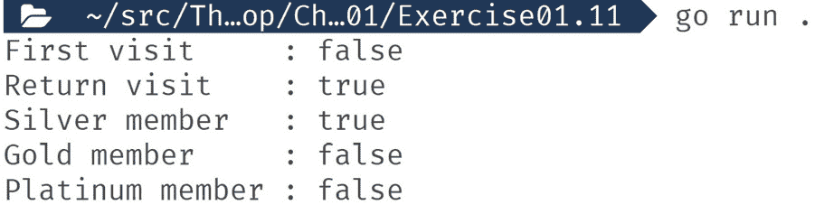

图 1.15：显示比较结果的输出

在这个练习中，我们使用了比较和逻辑运算符来对数据进行决策。你可以以无限多种方式组合这些运算符，以表达你的软件需要的几乎任何类型的逻辑。

接下来，我们将查看当你不给变量一个初始值时会发生什么。

## 零值

变量的零值是该变量类型的空或默认值。Go 有一套规则说明零值适用于所有核心类型。让我们看看：

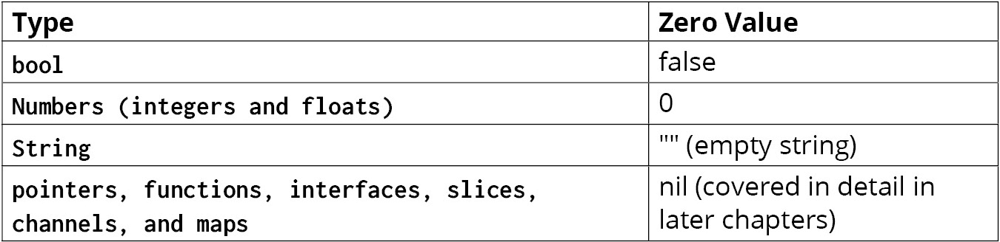

图 1.16：变量类型及其零值

还有其他类型，但它们都是从这些核心类型派生出来的，所以相同的规则仍然适用。

在接下来的练习中，我们将查看一些类型的零值。

## 练习 1.12 – 零值

在这个例子中，我们将定义一些没有初始值的变量。然后，我们将打印出它们的值。我们在这个练习中使用`fmt.Printf`来帮助我们，因为我们可以得到更多关于值类型的详细信息。`fmt.Printf`使用模板语言，允许我们转换传递的值。我们使用的替换是`%#v`。这种转换是显示变量值和类型的有用工具。以下是一些你可以尝试的其他常见替换：

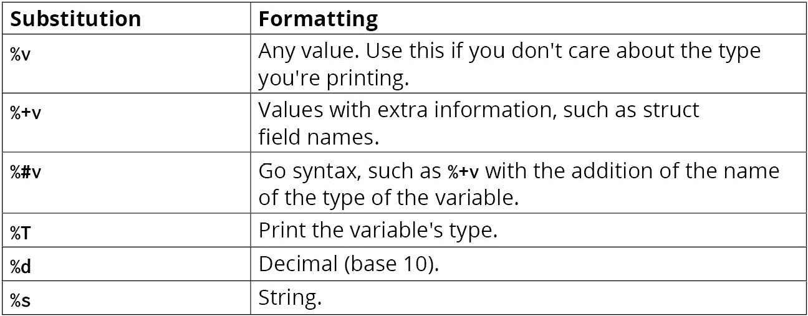

图 1.17：替换表

当使用 `fmt.Printf` 时，你需要自己添加换行符号。你可以通过在字符串末尾添加 `\n` 来做到这一点。让我们开始吧：

1.  创建一个新的文件夹并将 `main.go` 文件添加到其中。

1.  在 `main.go` 文件顶部添加 `main` 包名称：

    ```go
    package main
    ```

1.  导入我们需要的包：

    ```go
    import (
      "fmt"
      "time"
    )
    ```

1.  创建 `main()` 函数：

    ```go
    func main() {
    ```

1.  声明并打印一个整数：

    ```go
      var count int
      fmt.Printf("Count  : %#v \n", count)
    ```

1.  声明并打印一个 `float` 值：

    ```go
      var discount float64
      fmt.Printf("Discount : %#v \n", discount)
    ```

1.  声明并打印一个 `bool` 值：

    ```go
      var debug bool
      fmt.Printf("Debug  : %#v \n", debug)
    ```

1.  声明并打印一个 `string` 值：

    ```go
      var message string
      fmt.Printf("Message : %#v \n", message)
    ```

1.  声明并打印一组字符串：

    ```go
      var emails []string
      fmt.Printf("Emails : %#v \n", emails)
    ```

1.  声明并打印一个结构体（由其他类型组成的类型；我们将在本书的后面部分介绍）：

    ```go
      var startTime time.Time
      fmt.Printf("Start  : %#v \n", startTime)
    ```

1.  关闭 `main()` 函数：

    ```go
    }
    ```

1.  保存文件。然后，在新的文件夹中，运行以下命令：

    ```go
    go run .
    ```

以下为输出结果：

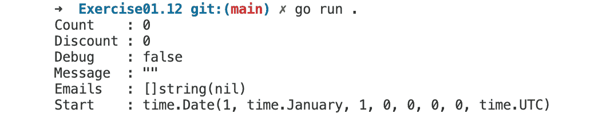

图 1.18：显示初始变量值的输出

在这个练习中，我们定义了各种变量类型而没有初始值。然后，我们使用 `fmt.Printf` 打印它们，以暴露更多关于值的细节。了解零值是什么以及 Go 如何控制它们，可以帮助你避免错误并编写简洁的代码。

接下来，我们将探讨指针是什么以及它们如何帮助你编写高效的软件。

# 值与指针

当使用 `int`、`bool` 和 `string` 等值时，当你将它们传递给函数时，Go 会复制该值，并在函数中使用这个副本。这种复制意味着在函数中对值的更改不会影响你在调用函数时使用的值。

通过复制传递值往往会导致更少的错误。使用这种传递值的方法，Go 可以使用其简单的内存管理系统，称为栈。缺点是，随着值从函数传递到函数，复制会消耗越来越多的内存。在实际代码中，函数往往很小，值会被传递到很多函数中，所以按值复制有时会使用比所需更多的内存。

有一种比复制更节省内存的替代方法。不是传递一个值，我们创建一个称为指针的东西，然后将它传递给函数。指针本身不是一个值，你不能用指针做任何有用的事情，除了用它来获取值。你可以把指针看作是你想要的值的地址，要获取这个值，你必须到达这个地址。如果你使用指针，Go 不会在传递指针到函数时复制该值。

当创建一个指向值的指针时，Go 无法使用栈来管理该值的内存。这是因为栈依赖于简单的范围逻辑来知道何时可以回收由值使用的内存，而拥有一个变量的指针意味着这些规则不再适用。相反，Go 将值放在堆上。堆允许值存在，直到你的软件中没有部分再指向它为止。Go 通过其所谓的垃圾回收过程回收这些值。这个过程在后台定期发生，你不需要担心它。

指向一个值的指针意味着该值被放在堆上，但这不是唯一的原因。确定一个值是否需要放在堆上的过程称为逃逸分析。有时，没有指针的值也会被放在堆上，而且并不总是清楚为什么。

你无法直接控制值是放在栈上还是堆上。内存管理不是 Go 语言规范的一部分。内存管理被认为是内部实现细节。这意味着它可以在任何时候更改，而我们所说的只是一般性指南，而不是固定规则，可能会在以后更改。

当使用指针而不是传递给许多函数的值时，指针的优点在内存使用方面是明显的，但在 CPU 使用方面并不明显。当一个值被复制时，Go 需要 CPU 周期来获取该内存，然后稍后释放它。使用指针在传递给函数时避免了这种 CPU 使用。另一方面，堆上的值需要被复杂的垃圾回收过程管理。这个过程在某些情况下可能成为 CPU 瓶颈——例如，如果堆上有许多值。当这种情况发生时，垃圾收集器需要进行大量的检查，这会消耗 CPU 周期。这里没有正确答案，最佳方法是经典的性能优化方法。首先，不要过早优化。当你确实有性能问题时，在做出更改之前进行测量，然后在做出更改之后进行测量。

除了性能之外，你可以使用指针来改变你的代码设计。有时，使用指针可以使接口更清晰，并简化你的代码。例如，如果你需要知道一个值是否存在，非指针值总是至少有它的零值，这在你的逻辑中可能是有效的。你可以使用指针来允许`未设置`状态，同时持有值。这是因为指针，除了持有值的地址外，还可以是`nil`，这意味着没有值。在 Go 中，`nil`是一个特殊类型，表示没有值。

指针能够为 `nil` 的能力还意味着，当它没有与之关联的值时，你可以获取指针的值，这意味着你将得到一个运行时错误。为了防止运行时错误，在尝试获取其值之前，你可以将指针与 `nil` 进行比较。这看起来像 `<pointer> != nil`。你可以将指针与相同类型的其他指针进行比较，但只有在比较的是指针本身时，它们才会返回 `true`。不会比较关联的值。

指针是语言中的强大工具，这得益于它们的效率、能够通过引用（而不是值）传递以允许函数修改原始值，以及它们如何允许使用垃圾回收器进行动态内存分配。然而，任何伟大的工具都伴随着巨大的责任。如果误用，指针可能会很危险，例如，在内存被释放（解除分配）且指针成为“悬垂指针”的情况下，如果访问它可能会导致未定义的行为。还存在内存泄漏、由于直接内存访问而不安全操作以及如果存在共享指针可能会引入数据竞争的并发挑战。总的来说，Go 的指针通常比其他语言（如 C 语言）简单且错误更少。 

## 获取指针

要获取指针，你有几种选择。你可以使用 `var` 语句声明一个变量为指针类型。你可以通过在大多数类型前添加 `*` 来这样做。这种表示法看起来像 `var <name> *<type>`。使用此方法创建的变量的初始值是 `nil`。你可以使用内置的 `new` 函数来做这件事。这个函数旨在用于获取某种类型的内存并返回对该地址的指针。表示法看起来像 `<name> := new(<type>)`。`new` 函数也可以与 `var` 一起使用。你也可以使用 `&` 从现有变量获取指针，你可以将其读作 "地址为"。这看起来像 `<var1> := &<var2>`。

## 练习 1.13 – 获取指针

在这个练习中，我们将使用我们能够使用的所有方法来获取指针变量。然后，我们将使用 `fmt.Printf` 将它们打印到控制台，以查看它们的类型和值。让我们开始吧：

1.  创建一个新的文件夹，并向其中添加一个 `main.go` 文件。

1.  在 `main.go` 中，将 `main` 包名添加到文件顶部：

    ```go
    package main
    ```

1.  导入我们需要的包：

    ```go
    import (
      "fmt"
      "time"
    )
    ```

1.  创建 `main()` 函数：

    ```go
    func main() {
    ```

1.  使用 `var` 语句声明指针：

    ```go
      var count1 *int
    ```

1.  使用 `new` 创建变量：

    ```go
      count2 := new(int)
    ```

1.  你不能取一个字面量的地址。创建一个临时变量来保存一个数字：

    ```go
      countTemp := 5
    ```

1.  使用 `&` 从现有变量创建指针：

    ```go
      count3 := &countTemp
    ```

1.  可以从某些类型创建指针而不需要临时变量。这里，我们使用我们信任的 `time` 结构体：

    ```go
      t := &time.Time{}
    ```

1.  使用 `fmt.Printf` 打印每个变量：

    ```go
      fmt.Printf("count1: %#v\n", count1)
      fmt.Printf("count2: %#v\n", count2)
      fmt.Printf("count3: %#v\n", count3)
      fmt.Printf("time : %#v\n", t)
    ```

1.  关闭 `main()` 函数：

    ```go
    }
    ```

1.  保存文件。然后在新的文件夹中，运行以下命令：

    ```go
    go run .
    ```

以下是输出：

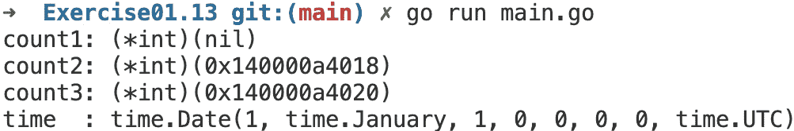

图 1.19：显示指针的输出

在这个练习中，我们探讨了创建指针的三种不同方式。每一种都有用，取决于你的代码需要什么。使用 `var` 语句时，指针的值为 `nil`，而其他指针已经与它们关联的地址值有关。对于 `time` 变量，我们可以看到其值，但我们可以判断它是一个指针，因为其输出以 `&` 开头。

接下来，我们将看到如何从指针中获取值。

## 从指针获取值

在上一个练习中，当我们将 `int` 指针的指针变量打印到控制台时，我们要么得到 `nil`，要么看到内存地址。要获取指针关联的值，你必须使用变量名前的 `*` 解引用该值。这看起来像 `fmt.Println(*<val>)`。

在 Go 软件中，解引用零或 `nil` 指针是一个常见的错误，因为编译器无法警告你，并且它发生在应用程序运行时。因此，在解引用之前始终检查指针不是 `nil` 是最佳实践，除非你确定它不是 `nil`。

你并不总是需要解引用 - 例如，当属性或函数位于结构体上时。不必过于担心何时不应解引用，因为 Go 会明确告诉你何时可以和不可以解引用一个值。

## 练习 1.14 - 从指针获取值

在这个练习中，我们将更新我们之前的练习，以从指针解引用值。我们还将添加 `nil` 检查以防止我们得到任何错误。让我们开始吧：

1.  创建一个新的文件夹，并向其中添加一个 `main.go` 文件。

1.  在 `main.go` 文件顶部添加 `main` 包名：

    ```go
    package main
    ```

1.  导入我们需要的包：

    ```go
    import (
      "fmt"
      "time"
    )
    ```

1.  创建 `main()` 函数：

    ```go
    func main() {
    ```

1.  我们声明的指针与之前相同：

    ```go
      var count1 *int
      count2 := new(int)
      countTemp := 5
      count3 := &countTemp
      t := &time.Time{}
    ```

1.  对于计数 1、2 和 3，我们需要添加一个 `nil` 检查，并在变量名前添加 `*`：

    ```go
      if count1 != nil {
        fmt.Printf("count1: %#v\n", *count1)
      }
      if count2 != nil {
        fmt.Printf("count2: %#v\n", *count2)
      }
      if count3 != nil {
        fmt.Printf("count3: %#v\n", *count3)
      }
    ```

1.  我们还将为我们的 `time` 变量添加一个 `nil` 检查：

    ```go
      if t != nil {
    ```

1.  我们将使用 `*` 解引用变量，就像我们处理 `count` 变量一样：

    ```go
        fmt.Printf("time : %#v\n", *t)
    ```

1.  这里，我们正在调用 `time` 变量上的一个函数。这次，我们不需要解引用它：

    ```go
        fmt.Printf("time : %#v\n", t.String())
    ```

1.  关闭 `nil` 检查：

    ```go
      }
    ```

1.  关闭 `main()` 函数：

    ```go
    }
    ```

1.  保存文件。然后，在新的文件夹中，运行以下命令：

    ```go
    go run .
    ```

以下为输出结果：

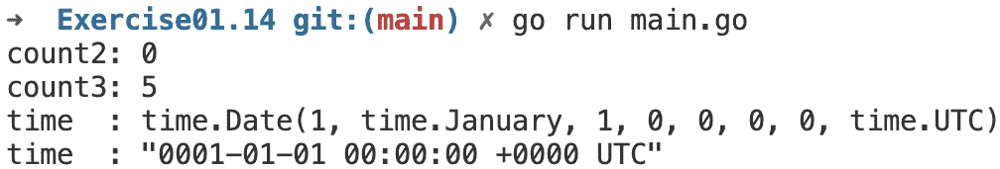

图 1.20：显示从指针获取值的输出

在这个练习中，我们使用了解引用来从我们的指针获取值。我们还使用了 `nil` 检查来防止解引用错误。从这个练习的输出中，我们可以看到 `count1` 是一个 `nil` 值，如果我们尝试解引用，我们会得到一个错误。`count2` 是使用 `new` 创建的，其值是其类型的零值。`count3` 也有一个与从指针获取的变量的值相匹配的值。对于我们的 `time` 变量，我们能够解引用整个结构体，这就是为什么我们的输出不以 `&` 开头的原因。

接下来，我们将探讨使用指针如何允许我们改变代码的设计：

## 使用指针进行函数设计

我们将在本书的后面部分更详细地介绍函数，但到目前为止你所了解的已经足够让你看到使用指针如何改变你对函数的使用方式。函数必须被编码为接受指针，这不是你可以选择是否要做的事情。如果你有一个指针变量或者已经将变量的指针传递给了一个函数，那么在函数中对变量值所做的任何更改也会影响函数外部的变量值。

## 练习 1.15 – 使用指针进行函数设计

在这个练习中，我们将创建两个函数：一个接受一个数字按值传递，将其加 5，然后将其打印到控制台；另一个接受一个数字作为指针，将其加 5，然后将其打印出来。我们还将调用每个函数后打印数字，以评估它对传递给函数的变量的影响。让我们开始吧：

1.  在其中创建一个名为`main.go`的新文件：

1.  在`main.go`文件顶部添加`main`包名：

    ```go
    package main
    ```

1.  导入我们需要的包：

    ```go
    import "fmt"
    ```

1.  创建一个接受`int`指针作为参数的函数：

    ```go
    func add5Value(count int) {
    ```

1.  给传递的数字加上`5`：

    ```go
      count += 5
    ```

1.  将更新的数字打印到控制台：

    ```go
      fmt.Println("add5Value   :", count)
    ```

1.  关闭函数：

    ```go
    }
    ```

1.  创建另一个接受`int`指针的函数：

    ```go
    func add5Point(count *int) {
    ```

1.  取消值的引用并给它加上`5`：

    ```go
      *count += 5
    ```

1.  打印`count`更新的值并取消其引用：

    ```go
      fmt.Println("add5Point   :", *count)
    ```

1.  关闭函数：

    ```go
    }
    ```

1.  创建`main()`函数：

    ```go
    func main() {
    ```

1.  声明一个`int`变量：

    ```go
      var count int
    ```

1.  使用变量调用第一个函数：

    ```go
      add5Value(count)
    ```

1.  打印变量的当前值：

    ```go
      fmt.Println("add5Value post:", count)
    ```

1.  调用第二个函数。这次，你需要使用`&`来传递变量的指针：

    ```go
      add5Point(&count)
    ```

1.  打印变量的当前值：

    ```go
      fmt.Println("add5Point post:", count)
    ```

1.  关闭`main()`函数：

    ```go
    }
    ```

1.  保存文件。然后，在新文件夹中运行以下命令：

    ```go
    go run .
    ```

以下为输出：

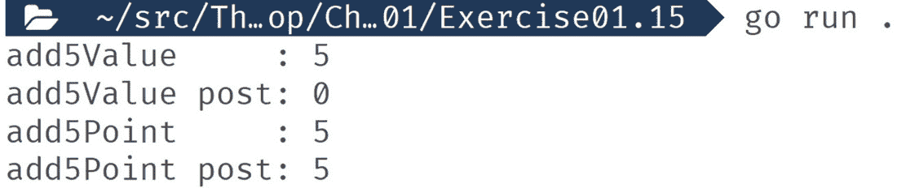

图 1.21：显示变量当前值的输出

在这个练习中，我们向你展示了通过指针传递值如何影响传递给它们的变量值。我们看到了，在按值传递时，你在函数中对值所做的更改不会影响传递给函数的变量的值，而传递值的指针则改变了传递给函数的变量的值。

你可以利用这个事实来克服尴尬的设计问题，有时还可以简化代码的设计。传统上，通过指针传递值被认为更容易出错，所以请谨慎使用这种设计。在函数中使用指针以创建更高效的代码也是常见的，Go 的标准库在这方面做了很多。

## 活动 1.02 – 指针值交换

在这个活动中，你的任务是完成一位同事开始的一些代码。在这里，我们有一些未完成的代码需要你完成。你的任务是填写缺失的代码，其中注释指示交换`a`和`b`的值。`swap`函数只接受指针，不返回任何内容：

```go
package main
import "fmt"
func main() {
  a, b := 5, 10
  // call swap here
  fmt.Println(a == 10, b == 5)
}
func swap(a *int, b *int) {
  // swap the values here
}
```

按照以下步骤操作：

1.  调用`swap`函数，确保你传递了一个指针。

1.  在`swap`函数中，将值赋给另一个指针，确保你解引用了这些值。

下面的输出是预期的：

```go
true true
```

接下来，我们将探讨如何创建具有固定值的变量。

# 常量

常量就像变量，但你不能更改它们的初始值。这些在代码运行时常量的值不需要或不应更改的情况下非常有用。你可以认为你可以将这些值硬编码到代码中，它会产生类似的效果。经验告诉我们，虽然这些值在运行时不需要更改，但它们可能以后需要更改。如果发生这种情况，追踪和修复所有硬编码的值可能是一项艰巨且容易出错的任务。使用常量现在只需做一点工作，但可以节省你以后的大量精力。

常量声明与`var`语句类似。对于常量，需要提供初始值。类型是可选的，如果省略则自动推断。初始值可以是字面量或简单的表达式，可以使用其他常量的值。像`var`一样，你可以在一个语句中声明多个常量。以下是一些表示法：

```go
constant <name> <type> = <value>
constant (
  <name1> <type1> = <value1>
  <name2> <type2> = <value3>
…
  <nameN> <typeN> = <valueN>
)
```

## 练习 1.16 – 常量

在这个练习中，我们遇到了一个性能问题：我们的数据库服务器太慢。我们将创建一个自定义内存缓存。我们将使用 Go 的`map`集合类型，它将充当缓存。缓存中可以存放的项目数量有一个全局限制。我们将使用一个`map`来帮助跟踪缓存中的项目数量。我们需要缓存两种类型的数据：书籍和 CD。两者都使用 ID，因此我们需要一种方法在共享缓存中区分这两种类型的项。我们需要一种设置和从缓存中获取项的方法。

我们将设置缓存中项目数量的最大值。我们还将使用常量添加一个前缀来区分书籍和 CD。让我们开始吧：

1.  创建一个新的文件夹，并向其中添加一个`main.go`文件。

1.  在`main.go`中，将`main`包名添加到文件顶部：

    ```go
    package main
    ```

1.  导入我们将需要的包：

    ```go
    import "fmt"
    ```

1.  创建一个代表全局限制大小的常量：

    ```go
    const GlobalLimit = 100
    ```

1.  创建一个`MaxCacheSize`常量，其值是全球限制大小的 10 倍：

    ```go
    const MaxCacheSize int = 10 * GlobalLimit
    ```

1.  创建我们的缓存前缀：

    ```go
    const (
      CacheKeyBook = "book_"
      CacheKeyCD = "cd_"
    )
    ```

1.  声明一个具有`string`键和`string`值的`map`值作为我们的缓存：

    ```go
    var cache map[string]string
    ```

1.  创建一个从缓存中获取项目的函数：

    ```go
    func cacheGet(key string) string {
      return cache[key]
    }
    ```

1.  创建一个设置缓存中项的函数：

    ```go
    func cacheSet(key, val string) {
    ```

1.  在这个函数中，查看`MaxCacheSize`常量以防止缓存超过该大小：

    ```go
      if len(cache)+1 >= MaxCacheSize {
        return
      }
      cache[key] = val
    }
    ```

1.  创建一个从缓存中获取书籍的函数：

    ```go
    func GetBook(isbn string) string {
    ```

1.  使用书籍缓存前缀创建一个唯一的键：

    ```go
      return cacheGet(CacheKeyBook + isbn)
    }
    ```

1.  创建一个向缓存中添加书籍的函数：

    ```go
    func SetBook(isbn string, name string) {
    ```

1.  使用书籍缓存前缀来创建一个唯一的键：

    ```go
      cacheSet(CacheKeyBook+isbn, name)
    }
    ```

1.  创建一个从缓存中获取 CD 数据的函数：

    ```go
    func GetCD(sku string) string {
    ```

1.  使用 `CD` 缓存前缀来创建一个唯一的键：

    ```go
      return cacheGet(CacheKeyCD + sku)
    }
    ```

1.  创建一个向共享缓存中添加 CD 的函数：

    ```go
    func SetCD(sku string, title string) {
    ```

1.  使用 `CD` 缓存前缀常量来为共享缓存构建一个唯一的键：

    ```go
      cacheSet(CacheKeyCD+sku, title)
    }
    ```

1.  创建 `main()` 函数：

    ```go
    func main() {
    ```

1.  通过创建一个 `map` 值来初始化我们的缓存：

    ```go
      cache = make(map[string]string)
    ```

1.  向缓存中添加一本书：

    ```go
      SetBook("1234-5678", "Get Ready To Go")
    ```

1.  将 `CD` 缓存前缀添加到缓存中：

    ```go
      SetCD("1234-5678", "Get Ready To Go Audio Book")
    ```

1.  从缓存中获取并打印那个 `Book`：

    ```go
      fmt.Println("Book :", GetBook("1234-5678"))
    ```

1.  从缓存中获取并打印那个 `CD`：

    ```go
      fmt.Println("CD :", GetCD("1234-5678"))
    ```

1.  关闭 `main()` 函数：

    ```go
    }
    ```

1.  保存文件。然后，在新文件夹中运行以下命令：

    ```go
    go run .
    ```

以下是输出：

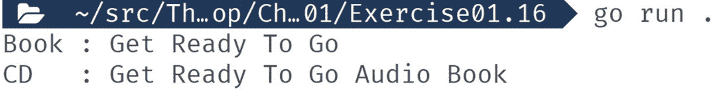

图 1.22：显示书籍和 CD 缓存的输出

在这个练习中，我们使用常量来定义在代码运行期间不需要更改的值。我们使用各种表示法声明了它们，一些带有排版，一些没有。我们在一个语句中声明了一个常量，也声明了多个常量。

接下来，我们将查看与值更紧密相关的常数的变体。

# 枚举

枚举是一种定义一组相关值的固定列表的方法。Go 没有内置的枚举类型，但它提供了诸如 `iota` 这样的工具，允许你使用常量来定义自己的枚举。我们现在将探讨这一点。

例如，在以下代码中，我们将一周中的日子定义为常量。这段代码是 Go 的 `iota` 功能的良好候选者：

```go
…
const (
  Sunday  = 0
  Monday  = 1
  Tuesday = 2
  Wednesday = 3
  Thursday = 4
  Friday  = 5
  Saturday = 6
)
…
```

使用 `iota`，Go 帮助我们像这样管理列表。使用 `iota`，以下代码等同于前面的代码：

```go
…
const (
  Sunday = iota
  Monday
  Tuesday
  Wednesday
  Thursday
  Friday
  Saturday
)
…
```

现在，我们有 `iota` 在为我们分配数字。使用 `iota` 使得枚举更容易创建和维护，特别是如果你需要在代码的中间添加新值时。在使用 `iota` 时，顺序很重要，因为它是一个标识符，告诉 Go 编译器从这个例子中的第一个值开始，每次递增 1。使用 `iota`，你可以使用 `_` 跳过值，以不同的偏移量开始，甚至可以使用更复杂的计算。

接下来，我们将详细探讨 Go 的变量作用域规则以及它们如何影响你编写代码的方式。

作用域

Go 中的所有变量都存在于一个作用域中。顶级作用域是包作用域。作用域可以包含其内部的作用域。定义子作用域的方法有几种；最容易想到的是，当你看到 `{` 时，你开始了一个新的子作用域，并且该子作用域在遇到匹配的 `}` 时结束。父-子关系是在代码编译时定义的，而不是在代码运行时。当访问一个变量时，Go 会查看代码定义的作用域。如果它找不到具有该名称的变量，它会查看父作用域，然后是祖父作用域，一直到最后到达包作用域。它会在找到匹配名称的变量时停止查找，如果找不到匹配项，则会引发错误。

换句话说，当你的代码使用一个变量时，Go 需要确定该变量是在哪里定义的。它从当前正在运行的代码的作用域开始搜索。如果在那个作用域中有一个使用该名称的变量定义，它就会停止搜索并使用该变量定义来完成工作。如果找不到变量定义，它就会开始沿着作用域栈向上搜索，一旦找到具有该名称的变量就停止。这种搜索完全是基于变量名称进行的。如果在找到具有该名称的变量但类型不正确时，Go 会引发错误。

在这个例子中，我们有四个不同的作用域，但我们只定义了一个 `level` 变量。这意味着无论你在哪里使用 `level`，都使用的是同一个变量：

```go
package main
import "fmt"
var level = "pkg"
func main() {
  fmt.Println("Main start :", level)
  if true {
    fmt.Println("Block start :", level)
    funcA()
  }
}
func funcA() {
  fmt.Println("funcA start :", level)
}
```

以下是在使用 `level` 时显示变量的输出结果：

```go
Main start : pkg
Block start : pkg
funcA start : pkg
```

在这个例子中，我们遮蔽了 `level` 变量。这个新的 `level` 变量与包作用域中的 `level` 变量无关。当我们在这个代码块中打印 `level` 时，Go 运行时会停止寻找名为 `level` 的变量，一旦找到在 `main` 中定义的那个。这种逻辑导致一旦新变量遮蔽了包变量，就会打印出不同的值。你还可以看到它是一个不同的变量，因为它是一个不同的类型，而在 Go 中变量类型不能改变：

```go
package main
import "fmt"
var level = "pkg"
func main() {
  fmt.Println("Main start :", level)
  // Create a shadow variable
  level := 42
  if true {
    fmt.Println("Block start :", level)
    funcA()
  }
  fmt.Println("Main end :", level)
}
func funcA() {
  fmt.Println("funcA start :", level)
}
```

以下输出结果：

```go
Main start : pkg
Block start : 42
funcA start : pkg
Main end : 42
```

Go 语言的静态作用域解析在调用 `funcA` 时发挥作用。这就是为什么当 `funcA` 运行时，它仍然可以看到包作用域的 `level` 变量。作用域解析并不关注 `funcA` 是在哪里被调用的。

你无法访问在子作用域中定义的变量：

```go
package main
import "fmt"
func main() {
  {
    level := "Nest 1"
    fmt.Println("Block end :", level)
  }
  // Error: undefined: level
  //fmt.Println("Main end  :", level)
}
```

以下为输出结果：

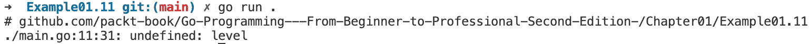

图 1.23：显示错误的输出

## 活动 1.03 – 消息错误

以下代码无法工作。编写它的那个人无法修复它，他们已经请求你帮助他们。你能让它工作吗？

```go
package main
import "fmt"
func main() {
  count := 5
  if count > 5 {
    message := "Greater than 5"
  } else {
    message := "Not greater than 5"
  }
  fmt.Println(message)
}
```

按照以下步骤操作：

1.  运行代码并查看输出结果。

1.  问题出在 `message` 上；对代码进行修改。

1.  重新运行代码并查看它带来的差异。

1.  重复此过程，直到看到预期的输出。

    以下为预期的输出结果：

    ```go
    Not greater than 5
    ```

在这个活动中，我们看到了变量定义的位置对代码有重大影响。在定义变量时，始终考虑你需要变量在哪个作用域中。

在下一个活动中，我们将探讨一个稍微复杂一点的问题。

## 活动 1.04 – 错误的计数问题

你的朋友回来了，他们代码中又出现了另一个错误。这段代码应该打印 `true`，但它打印的是 `false`。你能帮助他们修复错误吗？

```go
package main
import "fmt"
func main() {
  count := 0
  if count < 5 {
    count := 10
    count++
  }
  fmt.Println(count == 11)
}
```

按照以下步骤操作：

1.  运行代码并查看输出结果。

1.  问题出在 `count` 上；对代码进行修改。

1.  重新运行代码并查看它带来的差异。

1.  重复此过程，直到看到预期的输出。

以下为预期的输出结果：

```go
True
```

# 摘要

在本章中，我们深入探讨了变量的细节，包括变量的声明方式，以及你可以用来声明变量的所有不同符号。这种符号的多样性为你提供了 90%工作所需的紧凑符号，同时仍然在你需要时提供非常具体的 10%的能力。我们探讨了在声明变量后如何更改和更新变量的值。同样，Go 为你提供了一些简写，以帮助在最常见的用例中使你的生活更轻松。所有数据最终都以某种形式存储在变量中。数据是使代码动态和响应性的因素。没有数据，你的代码只能永远做一件事；数据释放了软件的真正力量。

现在您的应用程序有了数据，它需要根据这些数据做出选择。这就是变量比较的用武之地。这有助于我们判断某事是真是假，是更大还是更小，等等，同时也帮助我们根据这些比较的结果做出选择。

我们通过查看零值、指针和作用域逻辑来探索 Go 如何实现其变量系统。到目前为止，我们知道这些是交付无错误高效软件和未能做到之间的区别。

我们还探讨了如何通过使用常量来声明不可变变量，以及`iota`如何帮助管理列表或相关常量以协同工作，例如枚举。

在下一章中，我们将开始通过定义逻辑和遍历变量集合来使用我们的变量。
