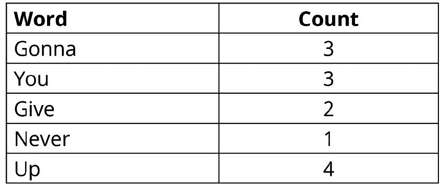
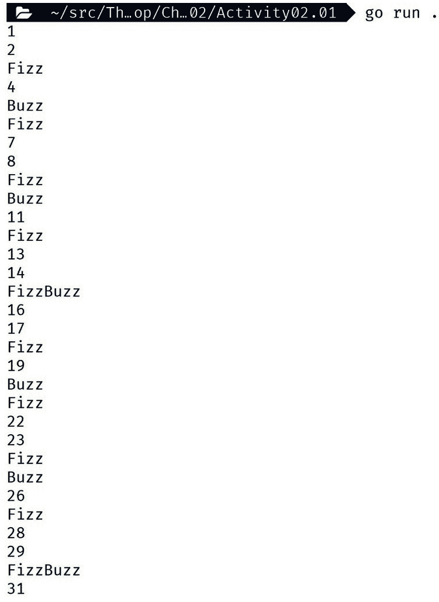

# 命令与控制

概述

在本章中，我们将使用分支逻辑和循环来展示如何控制逻辑并选择性运行。有了这些工具，你将能够根据变量的值控制你想运行或不运行的代码。

到本章结束时，你将能够使用`if`、`else`和`else if`实现分支逻辑；使用`switch`语句简化复杂的分支逻辑；使用`for`循环创建循环逻辑；使用`range`遍历复杂的数据集合；使用`continue`和`break`控制循环的流程；以及使用`goto`语句在函数内跳转到标记的语句。

# 技术要求

对于本章，你需要 Go 版本 1.21 或更高版本。本章的代码可以在以下位置找到：[`github.com/PacktPublishing/Go-Programming-From-Beginner-to-Professional-Second-Edition-/tree/main/Chapter02`](https://github.com/PacktPublishing/Go-Programming-From-Beginner-to-Professional-Second-Edition-/tree/main/Chapter02)。

# 简介

在上一章中，我们探讨了变量和值以及我们如何在变量中临时存储数据并更改这些数据。现在，我们将探讨如何使用这些数据在代码中运行或选择性运行逻辑。“逻辑”指的是控制程序如何操作或处理数据的指令序列。这种逻辑允许你控制数据在软件中的流动方式。你可以根据变量的值做出反应并执行不同的操作。

这种逻辑可以用来验证用户的输入。如果我们正在编写管理银行账户的代码，并且用户要求取款，我们可以检查他们是否请求了有效的金额。我们会检查他们账户中是否有足够的钱。如果验证成功，我们会使用逻辑来更新他们的余额，转账并显示成功消息。如果验证失败，我们会显示一条解释出错原因的消息。

如果你的软件是一个虚拟世界，那么逻辑就是该世界的物理定律。像我们世界的物理定律一样，这些定律必须遵守，不能违反。如果你在法律中存在缺陷，那么你的虚拟世界将无法顺利运行，甚至可能爆炸。

另一种逻辑形式是循环；使用循环可以使你多次执行相同的代码。使用循环的一种常见方式是遍历一组数据。对于我们的虚拟银行软件，我们会使用循环来遍历用户的交易，以便在用户请求时向用户显示。

循环和逻辑使软件能够具有复杂的行为，能够响应变化和动态的数据。

# if 语句

`if`语句是 Go 中最基本的逻辑形式。`if`语句会根据布尔表达式运行或不运行代码块。其表示法如下：`if <布尔表达式> { <代码块> }`。

布尔表达式可以是简单的代码，结果为布尔值。代码块可以是任何逻辑，你还可以将其放入函数中，并且被限制在该函数的代码块中。当布尔表达式为真时，代码块会运行。你只能在函数的作用域内使用 `if` 语句。在 Go 中，“函数作用域”的概念指的是函数内变量和语句的可见性和可访问性。

## 练习 2.01 – 一个简单的 if 语句

在这个练习中，我们将使用 `if` 语句来控制某些代码是否运行。我们将定义一个硬编码的 `int` 值，但在实际应用中，这可能是用户输入。然后我们将使用 `%` 运算符（也称为取模表达式）检查变量的值是奇数还是偶数。取模运算给出了除法后的剩余量。我们将使用取模运算来获取除以 2 后的余数。如果我们得到余数为 0，那么我们知道这个数字是偶数。如果余数为 1，那么我们知道这个数字是奇数。取模运算的结果是一个 `int` 值，所以我们使用 `==`（比较运算符）来获取 `true` 或 `false` 的布尔值：

1.  创建一个新的文件夹并添加一个 `main.go` 文件。

1.  在 `main.go` 中添加包和导入：

    ```go
    package main
    import "fmt"
    ```

1.  创建一个 `main` 函数：

    ```go
    func main() {
    ```

1.  定义一个具有初始值的 `int` 变量。我们在这里将其设置为 5，这是一个奇数，但我们也可以将其设置为 6，这是一个偶数：

    ```go
      input := 5
    ```

1.  创建一个使用取模表达式的 `if` 语句，然后检查结果是否等于 0：

    ```go
      if input%2 == 0 {
    ```

1.  当布尔表达式结果为 `true` 时，这意味着数字是偶数。然后我们使用 `fmt` 包将“偶数”打印到控制台：

    ```go
        fmt.Println(input, "is even")
    ```

1.  关闭代码块：

    ```go
      }
    ```

1.  现在为奇数做同样的操作：

    ```go
      if input%2 == 1 {
        fmt.Println(input, "is odd")
      }
    ```

1.  关闭 `main`：

    ```go
    }
    ```

1.  保存文件，并在新文件夹中运行以下代码片段：

    ```go
    go run main.go
    ```

以下为预期的输出：

```go
5 is odd
```

在这个练习中，我们使用了逻辑来选择性运行代码。使用逻辑来控制哪些代码运行，让你能够在代码中创建流程。这允许你拥有能够对其数据进行反应的代码。这些流程允许你能够对你的代码如何处理数据进行推理，使其更容易理解和维护。

尝试将输入值更改为 6，看看偶数块是如何执行而不是奇数块的。

在下一个主题中，我们将探讨如何改进这段代码并使其更高效。

## if else 语句

在上一个练习中，我们进行了两次评估。一次是检查数字是否为偶数，另一次是查看它是否为奇数。正如我们所知，一个数字只能是奇数或偶数。有了这个知识，我们可以通过演绎来知道，如果一个数字不是偶数，那么它一定是奇数。

使用这种演绎逻辑在编程中很常见，目的是通过避免做不必要的工作来提高程序的效率。

我们可以使用`if else`语句来表示这种逻辑。表示法如下：`if <布尔表达式> { <代码块> } else { <代码块> }`。`if else`语句建立在`if`语句的基础上，并给我们第二个代码块。第二个代码块只有在第一个代码块不运行时才会运行；两个代码块不能同时运行。

## 练习 2.02 – 使用`if else`语句

在这个练习中，我们将更新我们之前的练习，使用`if else`语句：

1.  创建一个新的文件夹，并添加一个`main.go`文件。

1.  在`main.go`中添加包和导入：

    ```go
    package main
    import "fmt"
    ```

1.  创建一个`main`函数：

    ```go
    func main() {
    ```

1.  定义一个具有初始值的`int`变量，这次我们将给它赋予不同的值：

    ```go
      input := 4
    ```

1.  创建一个使用取模表达式的`if`语句，然后检查结果是否等于 0：

    ```go
      if input%2 == 0 {
        fmt.Println(input, "is even")
    ```

1.  这次，我们不是关闭代码块，而是开始一个新的`else`代码块：

    ```go
      } else {
        fmt.Println(input, "is odd")
      }
    ```

1.  关闭`main`：

    ```go
    }
    ```

1.  保存文件，并在新文件夹中运行以下代码片段：

    ```go
    go run main.go
    ```

下面的预期输出是：

```go
4 is even
```

在这个练习中，我们能够通过使用一个`if else`语句简化我们之前的代码。这不仅使代码更高效，还使得代码更容易理解和维护。

在下一个主题中，我们将演示我们如何添加尽可能多的代码块，同时只允许一个执行。

## `else if`语句

`if else`解决了仅针对一个或两个可能的逻辑结果运行代码的问题。这个问题解决了，那么如果我们的前一个练习的代码原本只打算对非负数有效呢？我们需要某种能够评估多个布尔表达式但只执行一个代码块的东西；即，负数、偶数或奇数的代码块。

在那种情况下，我们不能单独使用`if else`语句；然而，我们可以通过扩展`if`语句来覆盖它。在这个扩展中，你可以给`else`语句自己的布尔表达式。这个表示法看起来是这样的：`if <布尔表达式> { <代码块> } else if <布尔表达式> { <代码块> }`。你还可以在末尾结合一个最终的`else`语句，它看起来像这样：`if <布尔表达式> { <代码块> } else if <布尔表达式> { <代码块> } else { <代码块> }`。在初始的`if`语句之后，你可以有任意多的`else if`语句。Go 从语句的顶部评估布尔表达式，并逐个评估每个布尔表达式，直到其中一个结果为`true`或找到`else`实例。如果没有`else`实例，并且没有任何布尔表达式结果为`true`，则不会执行任何代码块，Go 会继续执行。当 Go 得到布尔`true`结果时，它只执行该语句的代码块，然后停止评估`if`语句的任何布尔表达式。

## 练习 2.03 – 使用`else if`语句

在这个练习中，我们将更新我们之前的练习。我们将添加对负数的检查。这个检查必须在偶数和奇数检查之前运行，因为只有一个代码块可以运行：

1.  创建一个新的文件夹并添加一个 `main.go` 文件。

1.  在 `main.go` 中添加包和导入：

    ```go
    package main
    import "fmt"
    ```

1.  创建一个 `main` 函数：

    ```go
    func main() {
    ```

1.  定义一个带有初始值的 `int` 变量，我们将给它一个负值：

    ```go
      input := -10
    ```

1.  我们的第一个布尔表达式是检查负数。如果我们找到一个负数，我们将打印一条消息说明它们是不允许的：

    ```go
      if input < 0 {
        fmt.Println("input can't be a negative number")
    ```

1.  我们需要将我们的偶数检查移动到 `else` `if` 语句中：

    ```go
      } else if input%2 == 0 {
        fmt.Println(input, "is even")
    ```

1.  `else` 语句保持不变，然后关闭 `main`：

    ```go
      } else {
        fmt.Println(input, "is odd")
      }
    }
    ```

1.  保存文件，然后在新建的文件夹中运行以下代码片段：

    ```go
    go run main.go
    ```

以下是我们期望的输出：

```go
input can't be a negative number
```

在这个练习中，我们在 `if` 语句中添加了更复杂的逻辑。我们向其中添加了一个 `else if` 语句，这允许复杂的评估。这个添加将通常是一个简单的分叉路口，给你很多道路可以选择，但仍然受到只能选择其中一条的限制。

在下一个主题中，我们将使用 `if` 语句的一个微妙但强大的功能，它让你保持代码整洁。

## 初始 if 语句

需要调用一个函数但不关心返回值是很常见的。通常，你只想检查它是否正确执行，然后丢弃返回值；例如，发送电子邮件、写入文件或将数据插入数据库：大多数情况下，如果这些类型的操作执行成功，你不需要担心它们返回的变量。不幸的是，变量并没有消失，因为它们仍然在作用域内。

为了停止这些不想要的变量悬挂，我们可以使用我们对作用域规则的了解来消除它们。检查错误的最佳方式是在 `if` 语句上使用 `initial` 语句。符号看起来像这样：`if <initial statement>; <boolean expression> { <code block> }`。初始语句与布尔表达式在同一个部分，用 `;` 来分隔它们。

Go 只允许在初始语句部分使用它所称为的简单语句，包括以下内容：

+   赋值和短变量赋值：

    ```go
    i := 0
    ```

+   如数学或逻辑表达式之类的表达式：

    ```go
    i = (j * 10) == 40
    ```

+   发送用于处理通道的语句，我们将在后面的 *第十七章* 中介绍，我们将重点介绍并发

+   增量和减量表达式：

    ```go
    i++
    ```

一个常见的错误是尝试使用 `var` 定义变量。这是不允许的；你可以用简短的赋值来代替。

## 练习 2.04 – 实现初始的 if 语句

在这个练习中，我们将继续构建我们之前的练习。我们将添加更多关于哪些数字可以检查为奇数或偶数的规则。由于规则众多，将它们全部放入一个布尔表达式中很难理解。我们将把所有的验证逻辑移动到一个返回错误的函数中。这是一个用于错误的内置 Go 类型。如果错误的值为`nil`，则一切正常。如果不为`nil`，则表示有错误，你需要处理它。我们将在初始语句中调用该函数，然后检查错误：

1.  创建一个新文件夹并添加一个`main.go`文件。

1.  在`main.go`中添加包和导入：

    ```go
    package main
    import (
      "errors"
      "fmt"
    )
    ```

1.  创建一个用于验证的函数。这个函数接受一个整数并返回一个错误：

    ```go
    func validate(input int) error {
    ```

1.  我们定义了一些规则，如果其中任何一个是`true`，我们就会使用`errors`包中的`New`函数返回一个新的错误：

    ```go
      if input < 0 {
        return errors.New("input can't be a negative number")
      } else if input > 100 {
        return errors.New("input can't be over 100")
      } else if input%7 == 0 {
        return errors.New("input can't be divisible by 7")
    ```

1.  如果输入通过了所有的检查，则返回`nil`：

    ```go
      } else {
        return nil
      }
    }
    ```

1.  创建我们的`main`函数：

    ```go
    func main() {
    ```

1.  定义一个值为`21`的变量：

    ```go
      input := 21
    ```

1.  使用初始语句调用函数；使用短变量赋值来捕获返回的错误。在布尔表达式中，使用`!=`检查错误是否不等于`nil`：

    ```go
      if err := validate(input); err != nil {
        fmt.Println(err)
    }
    ```

1.  其余部分与之前相同：

    ```go
    else if input%2 == 0 {
        fmt.Println(input, "is even")
      } else {
        fmt.Println(input, "is odd")
      }
    }
    ```

1.  保存文件，并在新文件夹中运行以下代码片段：

    ```go
    go run main.go
    ```

以下为预期的输出，它显示了一个错误语句：

```go
input can't be divisible by 7
```

在这个练习中，我们使用初始语句定义并初始化了一个变量。这个变量可以在布尔表达式和相关的代码块中使用。一旦`if`语句完成，变量就会超出作用域，并由 Go 的内存管理系统回收。

# 表达式`switch`语句

虽然可以在`if`语句中添加任意多的`else if`语句，但最终它会变得难以阅读。

当这种情况发生时，你可以使用 Go 的逻辑替代方案：`switch`。对于需要大`if`语句的情况，`switch`可以是一个更紧凑的替代方案。

`switch`的表示法在以下代码片段中显示：

```go
switch <initial statement>; <expression> {
case <expression>:
  <statements>
case <expression>, <expression>:
  <statements>
default:
  <statements>
}
```

在`switch`语句中，*初始*语句与前面的`if`语句中的工作方式相同。表达式并不相同，因为`if`是一个布尔表达式。在这个表达式中，你可以有不仅仅是布尔值。`cases`是检查语句是否被执行的地方。语句就像`if`语句中的代码块，但这里不需要花括号。

初始语句和表达式都是可选的。如果要只有表达式，它看起来会是这样：`switch <expression> {…}`。如果要只有初始语句，你会写成`switch <initial statement>; {…}`。你可以两者都不写，最终你会得到`switch {…}`。当表达式缺失时，它就像在那里放置了`true`的值。

使用`case`表达式有两种主要方式。它们可以像`if`语句或布尔表达式一样使用，其中你使用逻辑来控制语句是否执行。另一种方式是在那里放置一个字面值。在这种情况下，该值与`switch`表达式的值进行比较。如果它们匹配，则执行语句。你可以通过逗号分隔来拥有任意数量的`case`表达式。如果`case`有多个表达式，则从顶部开始检查，然后从左到右。

当`case`匹配时，只有其语句会被执行，这与许多其他语言不同。为了获得那些语言中找到的 fall-through 行为，必须在想要该行为的每个`case`的末尾添加一个`fallthrough`语句。如果在`case`的末尾之前调用`fallthrough`，它将在那一刻跳过并继续到下一个`case`。

可选的`default`可以在`switch`语句的任何位置添加，但最佳实践是在末尾添加。`default`与在`if`语句中使用`else`语句的效果相同。

这种形式的`switch`语句称为*表达式* `switch`语句。还有一种形式的`switch`语句，称为*类型* `switch`语句，我们将在*第四章*中探讨。

## 练习 2.05 – 使用`switch`语句

在这个练习中，我们需要创建一个程序，根据某人出生的日子打印出特定的消息。我们使用`time`包中的星期几常量集。我们将使用`switch`语句来创建一个更紧凑的逻辑结构：

1.  加载`main`包：

    ```go
    package main
    ```

1.  导入`fmt`和`time`包：

    ```go
    import (
      "fmt"
      "time"
    )
    ```

1.  定义一个`main`函数：

    ```go
    func main() {
    ```

1.  定义一个变量，表示某人出生的那一周的某一天。使用`time`包中的常量来完成。我们将将其设置为星期一，但可以是任何一天：

    ```go
      dayBorn := time.Monday
    ```

1.  创建一个使用变量作为表达式的`switch`语句：

    ```go
      switch dayBorn {
    ```

1.  每个`case`表达式都会尝试将其表达式值与`switch`表达式值进行匹配：

    ```go
      case time.Monday:
      fmt.Println("Monday's child is fair of face")
      case time.Tuesday:
      fmt.Println("Tuesday's child is full of grace")
      case time.Wednesday:
      fmt.Println("Wednesday's child is full of woe")
      case time.Thursday:
      fmt.Println("Thursday's child has far to go")
      case time.Friday:
      fmt.Println("Friday's child is loving and giving")
      case time.Saturday:
      fmt.Println("Saturday's child works hard for a living")
      case time.Sunday:
      fmt.Println("Sunday's child is bonny and blithe")
    ```

1.  我们在这里使用`default`作为验证的一种形式：

    ```go
      default:
      fmt.Println("Error, day born not valid")
      }
    ```

1.  关闭`main`函数：

    ```go
    }
    ```

1.  保存文件，然后在新建文件夹中运行以下代码片段：

    ```go
    go run main.go
    ```

以下为预期输出：

```go
Monday's child is fair of face
```

在这个练习中，我们使用`switch`创建了一个紧凑的逻辑结构，将许多不同的可能值与给用户的特定消息匹配。在这里使用常量作为`switch`语句是很常见的，就像我们这里使用`time`包中的星期几常量一样。

接下来，我们将使用`case`功能，它允许我们匹配多个值。

## 练习 2.06 – `switch`语句和多个`case`值

在这个练习中，我们将打印出一个消息，告诉我们某人出生的那天是工作日还是周末。我们只需要两个`case`，因为每个`case`可以支持检查多个值：

1.  加载`main`包：

    ```go
    package main
    ```

1.  导入`fmt`和`time`包：

    ```go
    import (
      "fmt"
      "time"
    )
    ```

1.  定义一个`main`函数：

    ```go
    func main() {
    ```

1.  使用`time`包的某个常量定义我们的`dayBorn`变量：

    ```go
      dayBorn := time.Sunday
    ```

1.  `switch`通过使用变量作为表达式以相同的方式开始：

    ```go
      switch dayBorn {
    ```

1.  这次，对于`case`，我们有星期几的常量。Go 会从左到右逐个检查每个常量与`switch`表达式的匹配，一次一个。一旦 Go 找到匹配项，它就会停止评估并只运行该`case`的语句：

    ```go
      case time.Monday, time.Tuesday, time.Wednesday, time.Thursday, time.Friday:
       fmt.Println("Born on a weekday")
    ```

1.  然后，它会对周末的日子做同样的处理：

    ```go
      case time.Saturday, time.Sunday:
       fmt.Println("Born on the weekend")
    ```

1.  我们再次使用`default`进行验证并关闭`switch`语句：

    ```go
      default:
       fmt.Println("Error, day born not valid")
      }
    ```

1.  关闭`main`函数：

    ```go
    }
    ```

1.  保存文件，然后在新建的文件夹中运行以下代码片段：

    ```go
    go run main.go
    ```

以下是我们预期的输出：

```go
Born on the weekend
```

在这个练习中，我们使用了具有多个值的`case`。这允许一个非常紧凑的逻辑结构，可以用几行代码评估一周的 7 天，并进行验证检查。这使得逻辑的意图变得清晰，反过来，也使得它更容易更改和维护。

接下来，我们将看看如何在`case`表达式中使用更复杂的逻辑。

有时，你会看到在`switch`语句中没有进行任何评估的代码，但在`case`表达式中进行了检查。

## 练习 2.07 – 无表达式的`switch`语句

并非总是能够使用`switch`表达式的值来匹配值。有时，你需要根据多个变量进行匹配。其他时候，你可能需要匹配比相等检查更复杂的东西。例如，你可能需要检查一个数字是否在特定的范围内。在这些情况下，`switch`仍然有助于构建紧凑的逻辑语句，因为`case`允许与`if`布尔表达式相同的表达式范围。

在这个练习中，让我们构建一个简单的`switch`表达式，检查一个日子是否在周末，以展示`case`可以做什么：

1.  加载`main`包：

    ```go
    package main
    ```

1.  导入`fmt`和`time`包：

    ```go
    import (
      "fmt"
      "time"
    )
    ```

1.  定义一个`main`函数：

    ```go
    func main() {
    ```

1.  我们的`switch`表达式使用初始语句来定义我们的变量。表达式被留空，因为我们不会使用它：

    ```go
    switch dayBorn := time.Sunday; {
    ```

1.  `case`使用一些复杂的逻辑来检查这一天是否在周末：

    ```go
      case dayBorn == time.Sunday || dayBorn == time.Saturday:
       fmt.Println("Born on the weekend")
    ```

1.  添加一个`default`语句并关闭`switch`表达式：

    ```go
      default:
       fmt.Println("Born some other day")
      }
    ```

1.  关闭`main`函数：

    ```go
    }
    ```

1.  保存文件，然后在新建的文件夹中运行以下代码片段：

    ```go
    go run main.go
    ```

以下是我们预期的输出：

```go
Born on the weekend
```

在这个练习中，我们学习了当简单的`switch`语句匹配不足时，你可以在`case`表达式中使用复杂逻辑。这仍然比你有超过几个情况时管理逻辑语句提供了更紧凑和更简单的方法。

接下来，我们将放下逻辑结构，开始探讨我们可以多次运行相同语句的方法，以使数据处理更容易。

# 循环

在现实世界的应用中，你经常需要重复运行相同的逻辑。通常需要处理多个输入并给出多个输出。循环是重复你的逻辑的最简单方式。

Go 只有一个循环语句，即`for`，但它非常灵活。有两种不同的形式：第一种用于大量使用有序集合，如数组和切片，我们将在后面详细介绍。用于有序集合的循环如下所示：

```go
for <initial statement>; <condition>; <post statement> {
  <statements>
}
```

`initial`语句与`if`和`switch`语句中的语句类似。`initial`语句在所有其他语句之前运行，并允许使用之前定义的简单语句。在每次循环结束时，都会检查条件以确定是否应该运行语句或停止循环。与`initial`语句一样，`condition`也允许使用简单语句。`post`语句在执行语句之后运行，并允许运行简单语句。`post`语句主要用于递增诸如循环计数器之类的项目，这些项目将在下一次循环的`condition`中评估。这些语句是您想要作为循环一部分运行的任何 Go 代码。

`initial`、`condition`和`post`语句都是可选的，可以编写如下`for`循环：

```go
for {
  <statements>
}
```

这种形式会导致一个无限循环，除非使用`break`语句手动停止循环。除了`break`之外，还有一个`continue`语句，可以用来跳过循环的单次运行中的剩余部分，但不会停止整个循环。

`for`循环的另一种形式是读取返回布尔值的数据源，当有更多数据可读取时。这包括从数据库、文件、命令行输入和网络套接字读取。这种形式如下：

```go
for <condition> {
  <statements>
}
```

这种形式是用于从有序列表读取的形式的简化版本，但没有控制循环所需的逻辑，因为您使用的数据源旨在轻松地在`for`循环中工作。

`for`循环的另一种形式是遍历无序数据集合，如映射。我们将在后面的章节中更详细地介绍映射。遍历这些集合时，你将在循环中使用`range`语句。对于映射，其形式如下：

```go
for <key>, <value> := range <map> {
  <statements>
}
```

## 练习 2.08 – 使用 for i 循环

在这个练习中，我们将使用`for`循环的三个部分来创建一个变量并在循环中使用该变量。我们将能够通过将变量的值打印到控制台来看到每次循环迭代后变量的变化情况：

1.  将包定义为`main`并添加导入：

    ```go
    package main
    import "fmt"
    ```

1.  创建一个`main`函数：

    ```go
    func main() {
    ```

1.  定义一个`for`循环，在`initial`语句部分定义一个初始值为`0`的`i`变量。在子句中检查`i`是否小于`5`。在`post`语句中，将`i`增加`1`：

    ```go
      for i := 0; i < 5; i++ {
    ```

1.  在循环体中，打印出`i`的值：

    ```go
        fmt.Println(i)
    ```

1.  关闭循环：

    ```go
      }
    ```

1.  关闭`main`：

    ```go
    }
    ```

1.  保存文件，然后在新建的文件夹中运行以下代码片段：

    ```go
    go run main.go
    ```

以下为预期输出：

```go
0
1
2
3
4
```

在这个练习中，我们使用了一个仅在`for`循环中存在的变量。我们设置了变量，检查了它的值，修改了它，并输出了它。在处理有序、数值索引的集合（如数组切片）时，使用这样的循环非常常见。在这个例子中，我们硬编码了停止循环的值；然而，当查看数组和切片时，这个值会根据集合的大小动态确定。

接下来，我们将使用`for i`循环来处理切片。

## 练习 2.09 – 遍历数组和切片

在这个练习中，我们将遍历一个字符串集合。我们将使用切片，但循环逻辑也将是相同的一组数组。我们将定义一个集合；然后创建一个循环，使用该集合来控制何时停止循环，并使用一个变量来跟踪我们在集合中的位置。

数组和切片的索引方式意味着数字之间永远不会有空隙，并且第一个数字总是`0`。内置函数`len`用于获取任何集合的长度。我们将将其用作条件的一部分，以检查我们是否到达了集合的末尾：

1.  创建一个新的文件夹并添加一个`main.go`文件。

1.  在`main.go`中添加包和导入：

    ```go
    package main
    import "fmt"
    ```

1.  创建一个`main`函数：

    ```go
    func main() {
    ```

1.  定义一个变量，它是一个`strings`的切片，并用数据初始化它：

    ```go
      names := []string{"Jim", "Jane", "Joe", "June"}
    ```

    我们将在下一章更详细地介绍`collection`和`string`。

1.  循环的`initial`和`post`语句与之前相同；不同之处在于`condition`语句，我们在这里使用`len`来检查我们是否到达了集合的末尾：

    ```go
      for i := 0; i < len(names); i++ {
    ```

1.  其余部分与之前相同：

    ```go
        fmt.Println(names[i])
      }
    }
    ```

1.  保存文件，并在新文件夹中运行以下代码片段：

    ```go
    go run main.go
    ```

以下是我们预期的输出：

```go
Jim
Jane
Joe
June
```

在这个练习中，我们介绍了如何通过索引迭代对象。现在，我们将探讨使用`range`循环遍历对象的替代方法。

## `range`循环

`array`和`slice`类型始终有一个索引号，并且这个数字总是从`0`开始。我们之前看到的`for i`循环是这些类型在现实世界代码中最常见的选项。

另一种集合类型，`map`，并不能提供相同的保证。这意味着你需要使用`range`。你将使用`range`来代替`for`循环中的`condition`语句，并且，在每次循环中，`range`会提供一个集合中元素的键和值，然后移动到下一个元素。

使用`range`循环时，你不需要定义一个条件来停止循环，因为`range`会为我们处理这个问题。

调用`map`顺序

项目的顺序是随机化的，以防止开发者依赖于 map 中元素的顺序，这意味着如果需要，你可以将其用作伪数据随机化的形式。

## 练习 2.10 – 遍历 map

在这个练习中，我们将创建一个具有字符串键和字符串值的`map`类型。我们将在后面的章节中更详细地介绍`map`类型，所以如果你现在还不完全理解`map`类型，请不要担心。然后我们将使用`range`在`for`循环中遍历`map`。然后我们将键和值数据写入控制台：

1.  创建一个新的文件夹并添加一个`main.go`文件。

1.  在`main.go`中添加包和导入：

    ```go
    package main
    import "fmt"
    ```

1.  创建一个`main`函数：

    ```go
    func main() {
    ```

1.  定义一个具有`string`键和`strings`变量的`string`值的`map`类型，并用以下数据初始化它：

    ```go
      config := map[string]string{
       "debug":  "1",
       "logLevel": "warn",
       "version": "1.2.1",
      }
    ```

1.  使用`range`获取数组元素的`key`和`value`变量并将它们分配给变量：

    ```go
      for key, value := range config {
    ```

1.  打印出`key`和`value`变量：

    ```go
      fmt.Println(key, "=", value)
    ```

1.  关闭循环和`main`：

    ```go
      }
    }
    ```

1.  保存文件，并在新文件夹中运行以下代码片段：

    ```go
    go run main.go
    ```

以下为预期输出，显示一个具有字符串键和字符串值的`map`：

```go
debug = 1
logLevel = warn
version = 1.2.1
```

在这个练习中，我们使用`range`在`for`循环中，以便能够从`map`集合中读取所有数据。`map`类型不像数组或切片那样提供关于从零开始和没有间隙的保证（如果我们使用整数作为`map`键）。`range`还控制何时停止循环。

如果你不需要`key`或`value`变量，你可以使用`_`作为变量名来告诉编译器你不需要它。

## 活动二.01 – 使用`range`遍历`map`数据

假设你已经提供了以下表格中的数据。你必须找到计数最多的单词，并使用以下数据打印出单词及其计数：



图 2.1：执行活动的单词和计数数据

注意

前面的词来自 Rick Astley 演唱的歌曲*Never Gonna Give You Up*。

解决这个活动的步骤如下：

1.  将单词放入类似这样的`map`中：

    ```go
      words := map[string]int{
       "Gonna": 3,
       "You": 3,
       "Give": 2,
       "Never": 1,
       "Up":  4,
      }
    ```

1.  创建一个循环并使用`range`捕获单词和计数。

1.  使用一个变量跟踪具有最高计数的单词，以及与其关联的单词。

1.  打印变量。

以下为预期输出，显示最受欢迎的单词及其计数值：

```go
Most popular word: Up
With a count of: 4
```

注意

这个活动的解决方案可以在本章 GitHub 仓库文件夹中找到：[`github.com/PacktPublishing/Go-Programming-From-Beginner-to-Professional-Second-Edition-/tree/main/Chapter02/Activity02.01`](https://github.com/PacktPublishing/Go-Programming-From-Beginner-to-Professional-Second-Edition-/tree/main/Chapter02/Activity02.01)

## 活动二.02 – 实现 FizzBuzz

当面试编程工作时，你会被要求做一些编码练习。这些问题要求你从头开始编写一些内容，并且会有几个规则要遵循。为了给你一个大概的了解，我们将带你通过一个经典的练习，*FizzBuzz*。

规则是以下这些：

+   编写一个程序，打印出从 1 到 100 的数字

+   如果数字是 3 的倍数，则打印“Fizz”

+   如果数字是 5 的倍数，则打印“Buzz”

+   如果数字是 3 和 5 的倍数，则打印“FizzBuzz”

这里有一些提示：

+   你可以使用`strconv.Itoa()`将数字转换为字符串

+   需要评估的第一个数字必须是 1，最后一个数字必须是 100

这些步骤将帮助你完成活动：

1.  创建一个进行 100 次迭代的循环。

1.  有一个变量用于记录到目前为止的循环次数。

1.  在循环中，使用该计数并检查它是否能被 3 或 5 整除使用`%`。

1.  仔细思考你将如何处理“FizzBuzz”的情况。

以下截图显示了预期的输出：

注意

考虑到输出太大无法在此显示，只有*图 2.2*中的一部分将可见。



图 2.2：FizzBuzz 输出

注意

该活动的解决方案可以在本章节的 GitHub 仓库文件夹中找到：[`github.com/PacktPublishing/Go-Programming-From-Beginner-to-Professional-Second-Edition-/tree/main/Chapter02/Activity02.02`](https://github.com/PacktPublishing/Go-Programming-From-Beginner-to-Professional-Second-Edition-/tree/main/Chapter02/Activity02.02)

这个活动可以展示`switch`语句如何改进并驯服开始变得太大的`if else`语句。

接下来，我们将看看我们如何可以通过跳过迭代或停止循环来手动控制循环。

# break 和 continue

有时会需要跳过单个循环或完全停止循环的运行。可以使用变量和`if`语句做到这一点，但有一个更简单的方法。

`continue`关键字停止当前循环的执行，并开始一个新的循环。`post`循环逻辑运行，循环`条件`语句被评估。

`break`关键字也停止当前循环的执行，并停止任何新循环的运行。

当你想跳过集合中的一个项目时使用`continue`；例如，如果集合中的一个项目无效，但其余项目可以处理，这可能是可以接受的。当数据中存在错误且处理集合的其余部分没有价值时，使用`break`来停止处理。

这里，我们有一个示例，它生成一个介于`0`和`8`之间的随机数。循环跳过能被 3 整除的数字，并在能被 2 整除的数字上停止。它还打印出每个循环的`i`变量，以帮助我们看到`continue`和`break`是如何停止循环其余部分的执行。

## 练习 2.11 – 使用 break 和 continue 控制循环

在这个练习中，我们将使用 `continue` 和 `break` 在循环中，以向你展示你可以如何控制它。我们将创建一个永远继续的循环。这意味着我们必须手动使用 `break` 来停止它。我们还将随机使用 `continue` 跳过循环。我们将通过生成一个随机数来实现这种跳过，如果这个数能被 3 整除，我们将跳过循环的其余部分：

1.  创建一个新的文件夹并添加一个 `main.go` 文件。

1.  在 `main.go` 中添加包和导入：

    ```go
    package main
    import (
      "fmt"
      "math/rand"
    )
    ```

1.  创建一个 `main` 函数：

    ```go
    func main() {
    ```

1.  创建一个空的 `for` 循环。如果你不停止它，它将永远循环：

    ```go
      for {
    ```

1.  使用 `rand` 包中的 `Intn` 来选择一个介于 0 和 8 之间的随机数：

    ```go
        r := rand.Intn(8)
    ```

1.  如果随机数能被 3 整除，打印 `"Skip"` 并使用 `continue` 跳过循环的其余部分：

    ```go
        if r%3 == 0 {
          fmt.Println("Skip")
          continue
    ```

1.  如果随机数能被 2 整除，则打印 `"Stop"` 并使用 `break` 停止循环：

    ```go
        } else if r%2 == 0 {
          fmt.Println("Stop")
          break
        }
    ```

1.  如果数字不是上述两种情况之一，则打印该数字：

    ```go
        fmt.Println(r)
    ```

1.  关闭循环和 `main`：

    ```go
      }
    }
    ```

1.  保存文件，并在新文件夹中运行以下代码片段：

    ```go
    go run main.go
    ```

下面的预期输出显示了随机数、`Skip` 和 `Stop`：

```go
1
7
7
Skip
1
Skip
1
Stop
```

在这个练习中，我们创建了一个会无限循环的 `for` 循环，然后我们使用 `continue` 和 `break` 来覆盖正常的循环行为，以便我们自己控制它。这种能力可以让我们减少所需的嵌套 `if` 语句和变量数量，以防止逻辑在不应该运行时运行。使用 `break` 和 `continue` 有助于清理你的代码并使其更容易工作。

如果你使用一个空的 `for` 循环像这样，循环将永远继续，你必须使用 `break` 来防止无限循环。无限循环是代码中永远不会停止的循环。一旦你得到一个无限循环，你需要一种方法来终止你的应用程序；你如何做到这一点将取决于你的操作系统。如果你在终端中运行你的应用程序，正常关闭终端就可以做到这一点。不要慌张 – 这发生在我们所有人身上 – 你的系统可能会变慢，但这对它没有任何伤害。

接下来，我们将进行一些活动来测试你对逻辑和循环的所有新知识。

## 活动 2.03 – 冒泡排序

在这个活动中，我们将通过交换值来对给定的数字切片进行排序。这种排序技术被称为 *冒泡排序* 技术。Go 的 `sort` 包中内置了排序算法，但我们不希望你使用它们；我们希望你使用你刚刚学到的逻辑和循环。

这里是步骤：

1.  定义一个包含未排序数字的切片。

1.  将这个切片打印到控制台。

1.  使用交换排序值。

1.  完成后，将现在排序好的数字打印到控制台。

这里有一些提示：

+   你可以这样在 Go 中进行原地交换：

    ```go
    nums[i], nums[i-1] = nums[i-1], nums[i]
    ```

+   你可以使用以下代码创建一个新的切片：

    ```go
    var nums2 []int
    ```

+   你可以这样向切片末尾添加内容：

    ```go
    nums2 = append(nums2, 1)
    ```

下面的预期输出是：

```go
Before: [5, 8, 2, 4, 0, 1, 3, 7, 9, 6]
After : [0, 1, 2, 3, 4, 5, 6, 7, 8, 9]
```

注意

本活动的解决方案可以在本章节的 GitHub 仓库文件夹中找到：[`github.com/PacktPublishing/Go-Programming-From-Beginner-to-Professional-Second-Edition-/tree/main/Chapter02/Activity02.03`](https://github.com/PacktPublishing/Go-Programming-From-Beginner-to-Professional-Second-Edition-/tree/main/Chapter02/Activity02.03)

# `goto` 语句

有时候你可能想在函数中跳过某些逻辑，并使用 `goto` 关键字跳转到函数中的某个位置。这可以通过在函数中创建一个标签来实现，如果在函数作用域外尝试使用 `goto` 标签，将会导致编译错误。

`goto` 语句是调整 Go 控制流的一种方式；然而，它们需要谨慎使用，因为它们可能导致理解函数控制流困难，如果使用不当，会降低代码的可读性。在某些情况下，`goto` 语句被用于 Go 标准库中，例如 `math` 包，以使逻辑更容易阅读并减少对不必要的变量的需求。

## 练习 2.12 – 使用 `goto` 语句

在这个练习中，我们将在一个函数中使用 `goto` 来展示你如何控制它。我们将创建一个无限循环。这意味着我们将在某些自定义条件下手动停止它并退出。与之前的练习一样，我们将生成一个随机数，如果这个数能被 2 整除，我们将终止流程并跳转到我们的标签语句：

1.  创建一个新的文件夹并添加一个 `main.go` 文件。

1.  在 `main.go` 中添加包和导入：

    ```go
    package main
    import (
      "fmt"
      "math/rand"
    )
    ```

1.  创建一个 `main` 函数：

    ```go
    func main() {
    ```

1.  创建一个空的 `for` 循环。如果你不停止它，它将无限循环：

    ```go
      for {
    ```

1.  使用 `rand` 包中的 `Intn` 来选择一个介于 0 和 8 之间的随机数：

    ```go
        r := rand.Intn(8)
    ```

1.  如果随机数能被 3 整除，打印 `"Skip"` 并使用 `continue` 跳过循环的其余部分：

    ```go
        if r%3 == 0 {
          fmt.Println("Skip")
          continue
    ```

1.  如果随机数能被 2 整除，则打印 `"Stop"` 并使用 `goto` 关键字和自定义的 `STOP` 标签停止循环：

    ```go
        } else if r%2 == 0 {
          fmt.Println("Stop")
          goto STOP
        }
    ```

1.  如果数字不是上述两种情况之一，则打印数字：

    ```go
        fmt.Println(r)
    ```

1.  关闭循环：

    ```go
      }
    ```

    定义一个名为 `STOP` 的 `goto` 标签，然后打印 `"goto` `label reached"`：

    ```go
    STOP:
            fmt.Println("Goto label reached")
            // Close main function
    }
    ```

1.  保存文件，并在新文件夹中运行以下代码片段：

    ```go
    go run main.go
    ```

下面的预期输出将显示随机数、`Skip` 和 `Stop`：

```go
1
7
7
Skip
1
Skip
1
Stop
Goto label reached
```

在这个练习中，我们创建了一个会无限循环的 `for` 循环，然后我们使用 `goto` 来覆盖正常的循环行为，并根据自己的需求控制它，在特定条件下终止无限循环。这种能力可以让我们根据需要调整控制流。在这个例子中使用 `goto` 并不难理解函数逻辑的变化到“跳转到”函数逻辑的其他部分；然而，在更复杂的例子中，`goto` 可能会导致代码可读性的挑战。

接下来，我们将总结本章所学的内容。

# 摘要

在本章中，我们讨论了逻辑和循环。这些是构建复杂软件的基础构建块。它们允许数据流通过你的代码。它们通过让你对数据的每个元素执行相同的逻辑，让你能够处理数据集合。

能够定义你代码的规则和法律是将在软件中编码现实世界的起点。如果你正在创建银行软件，并且银行有关于你可以和不能做什么钱的规定，那么你也可以在你的代码中定义这些规则。

逻辑和循环是构建所有软件时你将使用的必要工具。

在下一章中，我们将探讨 Go 的类型系统和它所提供的核心类型。
