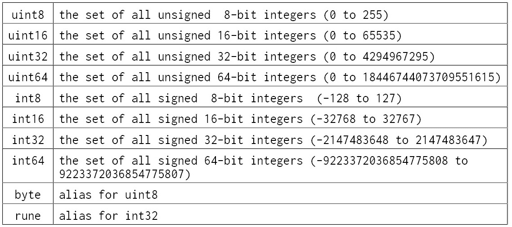
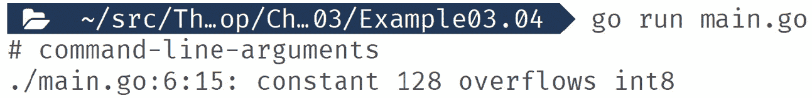
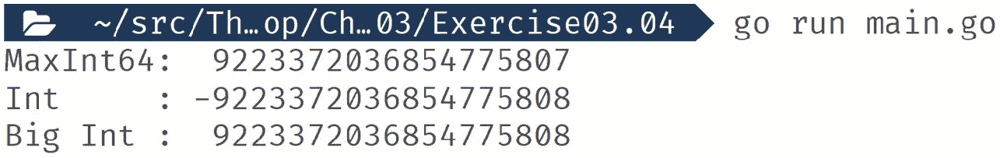
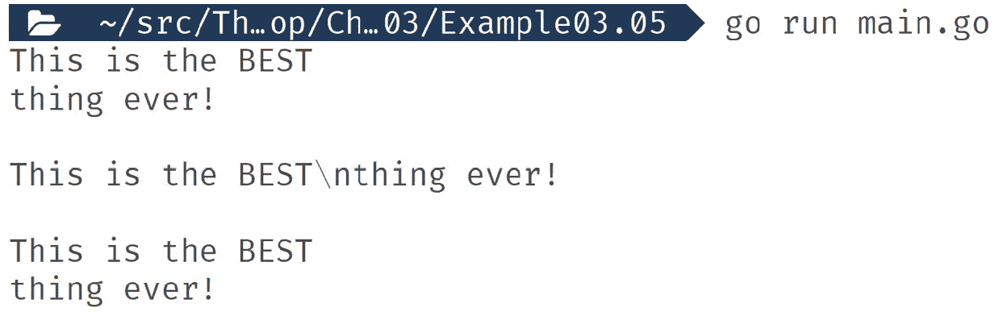
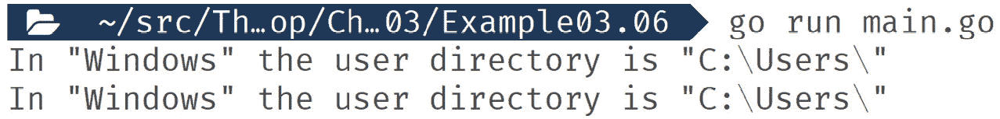
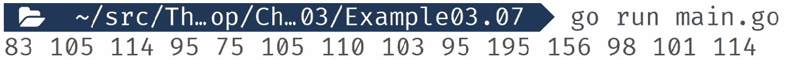
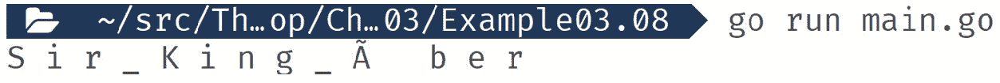
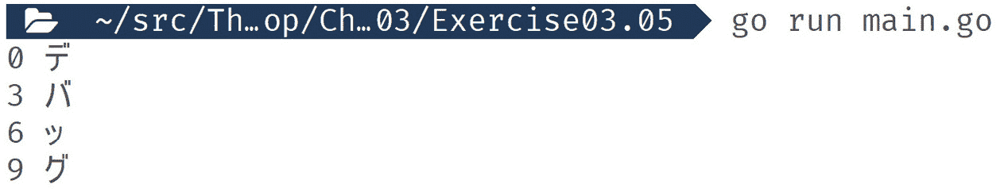
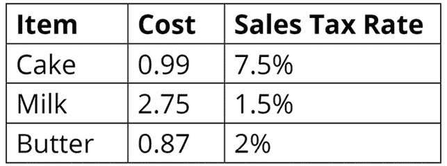

# 第三章：核心类型

概述

本章旨在向你展示如何使用 Go 的基本核心类型来设计你的软件数据。我们将逐一处理每种类型，展示它们有什么用以及如何在软件中使用它们。理解这些核心类型为你提供了学习如何创建复杂数据设计所需的基础。

到本章结束时，你将能够为 Go 程序创建不同类型的变量，并为不同类型的变量分配值。你将学习如何识别和选择任何编程情况下的合适类型。你还将编写一个程序来测量密码复杂度并实现空值类型。

# 技术要求

对于本章，你需要 Go 版本 1.21 或更高版本。本章的代码可以在以下位置找到：[`github.com/PacktPublishing/Go-Programming-From-Beginner-to-Professional-Second-Edition-/tree/main/Chapter03`](https://github.com/PacktPublishing/Go-Programming-From-Beginner-to-Professional-Second-Edition-/tree/main/Chapter03)。

# 简介

在上一章中，我们学习了如何在 Go 中使用`if`、`if-else`、`else-if`、`switch`、`case`、`continue`、`break`和`goto`。

Go 是一种强类型语言，所有数据都被分配了一个类型。这个类型是固定的，不能更改。你可以对你的数据做什么，不能做什么是由你分配的类型所决定的。准确理解定义 Go 每个核心类型的每一个方面对于在 Go 语言中取得成功至关重要。

在后面的章节中，我们将讨论 Go 的更复杂类型，但这些类型都是基于本章定义的核心类型构建的。

一旦你了解了细节，Go 的核心类型就考虑得很好，也容易理解。需要理解细节意味着 Go 的类型系统并不总是直观的。例如，Go 最常用的数字类型`int`的大小可能是 32 位或 64 位，这取决于编译代码所使用的计算机。

类型是使数据对人类更容易处理所必需的。计算机只考虑二进制数据。二进制对人类来说很难处理。通过在二进制数据上添加一层抽象并将其标记为数字或某些文本，人类更容易对其进行推理。减少认知负担使得人们能够构建更复杂的软件，因为他们不会被管理二进制数据细节所淹没。

编程语言需要定义什么是数字，或者什么是文本。编程语言定义了你可以称为什么样的数字，以及你可以对数字执行哪些操作。例如，一个整数 10 和一个浮点数 3.14 是否都可以存储为同一类型？虽然看起来很明显你可以乘以数字，但你能否乘以文本？随着我们进入本章，我们将明确定义每种类型的规则以及你可以对它们执行的操作。

数据的存储方式也是定义类型的一个重要部分。为了允许构建高效的软件，Go 对其某些类型的大小施加了限制。例如，Go 核心类型中数字的最大存储量是 64 位内存。这允许存储任何高达 18,446,744,073,709,551,615 的数字。理解这些类型的限制对于构建无错误的代码至关重要。

定义类型的因素如下：

+   你可以存储的数据类型

+   你可以使用它的操作

+   这些操作对其产生的影响

+   它可以使用的内存量

本章为你提供了使用 Go 类型系统的知识，并增强了你在代码中使用它的信心。

# 真和假

使用布尔类型`bool`表示真和假逻辑。当你需要在代码中实现开/关切换时使用此类型。布尔实例的值只能是`true`或`false`。布尔实例的零值是`false`。“零值”指的是变量在未指定显式初始值时声明的默认值。

当使用比较运算符如`==`或`>`时，该比较的结果是一个布尔值。

在这个代码示例中，我们在两个数字上使用比较运算符。你会看到结果是布尔值`bool`：

```go
package main
import "fmt"
func main() {
  fmt.Println(10 > 5)
  fmt.Println(10 == 5)
}
```

运行前面的代码会显示以下输出：

```go
true
false
```

## 练习 3.01 – 测量密码复杂度的程序

一个在线门户为用户创建用户账户，并接受长度为 8 到 15 个字符的密码。在这个练习中，我们为门户编写一个程序来显示输入的密码是否满足字符要求。字符要求如下：

+   包含一个小写字母

+   包含一个大写字母

+   包含一个数字

+   包含一个符号

+   至少 8 个字符长

为了完成这个练习，我们将使用一些新特性。如果你不完全理解它们的作用，不要担心；我们将在下一章详细讲解。这可以看作是一个预览。我们将边走边解释每一件事，但你的主要焦点应该是布尔逻辑：

1.  创建一个新的文件夹并添加一个`main.go`文件。

1.  在`main.go`中，将主包名添加到文件顶部：

    ```go
    package main
    ```

1.  现在添加我们将在此文件中使用的导入：

    ```go
    import (
      "fmt"
      "unicode"
    )
    ```

1.  创建一个函数，它接受一个字符串参数并返回一个布尔值：

    ```go
    func passwordChecker(pw string) bool {
    ```

1.  将密码字符串转换为`rune`类型，这对于多字节（UTF-8）字符是安全的：

    ```go
      pwR := []rune(pw)
    ```

    我们将在本章后面更详细地讨论`rune`。

1.  使用`len`计算多字节字符的数量。此代码产生一个可用于`if`语句的布尔结果：

    ```go
      if len(pwR) < 8 {
        return false
      }
    ```

1.  定义一些`bool`变量。我们将在最后检查这些变量：

    ```go
      hasUpper := false
      hasLower := false
      hasNumber := false
      hasSymbol := false
    ```

1.  逐个遍历多字节字符：

    ```go
      for _, v := range pwR {
    ```

1.  使用`unicode`包检查此字符是否为大写。此函数返回一个布尔值，我们可以直接在`if`语句中使用：

    ```go
       if unicode.IsUpper(v) {
    ```

1.  如果是，我们将设置`hasUpper`布尔变量为`true`：

    ```go
         hasUpper = true
       }
    ```

1.  对于小写字母也做同样的事情：

    ```go
       if unicode.IsLower(v) {
         hasLower = true
       }
    ```

1.  也对数字做同样的事情：

    ```go
       if unicode.IsNumber(v) {
         hasNumber = true
       }
    ```

1.  对于符号，我们也会接受标点符号。使用`or`运算符，它与布尔值一起工作，如果这两个函数中的任何一个返回`true`，则结果为`true`：

    ```go
       if unicode.IsPunct(v) || unicode.IsSymbol(v) {
         hasSymbol = true
       }
      }
    ```

1.  为了通过所有检查，所有变量都必须是`true`。在这里，我们通过组合多个`and`运算符创建一个检查所有四个变量的单行语句：

    ```go
      return hasUpper && hasLower && hasNumber && hasSymbol
    ```

1.  关闭函数：

    ```go
    }
    ```

1.  创建`main()`函数：

    ```go
    func main() {
    ```

1.  使用无效密码调用`passwordChecker()`函数。由于这个函数返回一个`bool`值，可以直接在`if`语句中使用：

    ```go
      if passwordChecker("") {
        fmt.Println("password good")
      } else {
        fmt.Println("password bad")
      }
    ```

1.  现在，使用有效的密码调用函数：

    ```go
      if passwordChecker("This!I5A") {
        fmt.Println("password good")
      } else {
        fmt.Println("password bad")
      }
    ```

1.  关闭`main()`函数：

    ```go
    }
    ```

1.  在新文件夹中保存文件，然后运行以下命令：

    ```go
    go run main.go
    ```

运行前面的代码会显示以下输出：

```go
password bad
password good
```

在这个练习中，我们强调了`bool`值在代码中表现出的各种方式。`bool`值对于赋予你的代码选择能力、动态性和响应性至关重要。没有`bool`，你的代码将很难做任何事情。

接下来，我们将探讨数字以及 Go 如何对它们进行分类。

# 数字

Go 有两种不同的数字类型——整数，也称为整数和浮点数。浮点数类型允许整数和包含整数分数的数。

1、54 和 5,436 是整数示例。1.5、52.25、33.333 和 64,567.00001 都是浮点数示例。

注意

所有数字类型的默认值和空值都是 0。

接下来，我们将从查看整数开始我们的数字之旅。

## 整数

根据以下条件，整数类型有两种分类方式：

+   它们是否可以存储负数

+   它们可以存储的最小和最大数值

可以存储负数的类型称为有符号整数。不能存储负数的类型称为无符号整数。每种类型可以存储的数值大小由它们内部存储的字节数决定。

这里是 Go 语言规范中所有相关整数类型的摘录：



图 3.1：Go 语言规范及相关整数类型

此外，还有以下特殊整数类型：


图 3.2：特殊整数类型

`uint`和`int`类型是 32 位或 64 位，这取决于你是否为 32 位系统或 64 位系统编译你的代码。如今，在 32 位系统上运行应用程序的情况很少，因为大多数系统现在都是 64 位的。

在 64 位系统上的`int`类型不是`int64`类型。虽然这两个类型是相同的，但它们不是同一整数类型，你不能将它们一起使用。如果 Go 允许这样做，当相同的代码在 32 位机器上编译时会出现问题，因此将它们分开可以确保代码的可靠性。

这种不兼容性不仅仅是`int`类型的问题；你不能将任何整数类型一起使用。

在定义变量时选择正确的整数类型很容易——使用 `int`。在编写应用程序代码时，`int` 大多数情况下都能完成任务。只有当使用 `int` 类型导致问题时，才考虑使用其他类型。您在 `int` 类型上遇到的问题通常与内存使用有关。

例如，假设您有一个内存不足的应用程序。该应用程序使用了大量的整数，但这些整数永远不会是负数，并且不会超过 255。一种可能的解决方案是将 `int` 类型切换为 `uint8` 类型。这样做可以将每个数字的内存使用从 64 位（8 字节）减少到 8 位（1 字节）。

我们可以通过创建这两种类型的数据集合，然后询问 Go 语言它使用了多少堆内存来展示这一点。输出结果可能因您的计算机而异，但效果应该是相似的。此代码创建了一个包含 `int` 或 `int8` 类型的数字集合。然后它向集合中添加了 1000 万个值。一旦完成，它使用运行时包来读取正在使用的堆内存量。我们可以将这个读取结果转换为 MB，然后打印出来：

```go
package main
import (
  "fmt"
  "runtime"
)
func main() {
  var list []int
  //var list []int8
  for i := 0; i < 10000000; i++ {
    list = append(list, 100)
  }
  var m runtime.MemStats
  runtime.ReadMemStats(&m)
  fmt.Printf("TotalAlloc (Heap) = %v MiB\n", m.TotalAlloc/1024/1024)
}
```

这是使用 `int` 类型的输出：

```go
TotalAlloc (Heap) = 403 MiB
```

这是使用 `int8` 类型的输出：

```go
TotalAlloc (Heap) = 54 MiB
```

我们在这里节省了相当多的内存，但我们需要 1000 万个值来使其变得有意义。希望现在您已经相信，从 `int` 类型开始是可行的，只有在出现问题时才需要关注性能。

接下来，我们将探讨浮点数。

## 浮点数

Go 语言有两种浮点数类型，`float32` 和 `float64`。较大的 `float64` 类型允许在数字中提供更高的精度。`float32` 类型有 32 位存储空间，而 `float64` 类型有 64 位存储空间。浮点数将它们的存储空间分配给整数部分（小数点左侧的所有内容）和小数部分（小数点右侧的所有内容）。用于整数部分或小数部分的存储空间大小根据存储的数字而变化。例如，9,999.9 会为整数部分使用更多的存储空间，而 9.9999 会为小数部分使用更多的存储空间。由于 `float64` 类型有更大的存储空间，它可以存储比 `float32` 类型更多的整数和/或小数。

## 练习 3.02 – 浮点数精度

在这个练习中，我们将比较当我们对不能整除的数字进行除法运算时会发生什么。我们将用 100 除以 3。表示结果的一种方式是 33 ⅓。大多数情况下，计算机无法计算这样的分数。相反，它们使用十进制表示法，即 33.3 重复，小数点后的 3 永远重复。如果我们让计算机这样做，它会耗尽所有内存，这并不很有帮助。

幸运的是，我们不需要担心这种情况发生，因为浮点类型有存储限制。缺点是这会导致一个不反映真实结果的数字；结果有一定的误差。你需要对误差的容忍度和你想要给浮点数的存储空间必须得到平衡：

1.  创建一个新的文件夹并添加一个`main.go`文件。

1.  在`main.go`中，将主包名添加到文件顶部：

    ```go
    package main
    ```

1.  现在添加我们将在文件中使用的导入：

    ```go
    import "fmt"
    ```

1.  创建`main()`函数：

    ```go
    func main() {
    ```

1.  声明一个`int`变量并将其初始化为 100：

    ```go
      var a int = 100
    ```

1.  声明一个`float32`变量并将其初始化为 100：

    ```go
      var b float32 = 100
    ```

1.  声明一个`float64`变量并将其初始化为 100：

    ```go
      var c float64 = 100
    ```

1.  将每个变量除以 3 并将结果打印到控制台：

    ```go
      fmt.Println(a / 3)
      fmt.Println(b / 3)
      fmt.Println(c / 3)
    }
    ```

1.  保存文件，然后在新的文件夹中运行以下命令：

    ```go
    go run main.go
    ```

运行前面的代码显示了以下输出，显示了`int`、`float32`和`float64`类型的等效起始值，除以 3：

```go
33
33.333332
33.333333333333336
```

在这个练习中，我们可以看到计算机不能给出这种除法的完美答案。你还可以看到，在进行这种整数数学运算时，你不会得到错误。Go 会忽略数字的任何分数部分，这通常不是你想要的。我们还可以看到`float64`给出的答案比`float32`更精确。

虽然这个限制看起来可能会导致不准确，但在现实世界的商业工作中，它大多数时候都能很好地完成任务。涉及高度精确计数的使用案例，例如在金融和银行业，你需要特别注意 Go 的数值类型，以确保数学准确性。

让我们看看如果我们尝试通过乘以 3 将我们的数字回到 100 会发生什么：

```go
package main
import "fmt"
func main() {
  var a int = 100
  var b float32 = 100
  var c float64 = 100
  fmt.Println((a / 3) * 3)
  fmt.Println((b / 3) * 3)
  fmt.Println((c / 3) * 3)
}
```

运行前面的代码显示了以下输出：

```go
99
100
100
```

在这个例子中，我们看到准确性并没有像你预期的那样受到很大影响。乍一看，浮点数学可能看起来很简单，但它很快就会变得复杂。当你定义浮点变量时，通常`float64`应该是你的首选，除非你需要更高效的内存使用。

接下来，我们将看看当你超出数字类型的限制时会发生什么。

## 溢出和回绕

当你尝试用一个超出你所用类型范围的值初始化一个数字时，你会得到一个溢出错误。`int8`类型中你能有的最大数字是 127。在下面的代码中，我们将尝试用 128 来初始化它，看看会发生什么：

```go
package main
import "fmt"
func main() {
  var a int8 = 128
  fmt.Println(a)
}
```

运行前面的代码会得到以下输出：



图 3.3：用 128 初始化后的输出

这个错误很容易修复，不会引起任何隐藏的问题。真正的问题在于编译器无法捕捉到它。当这种情况发生时，数字将“回绕”。回绕意味着数字从其可能的最大值变为可能的最小值。在开发代码时，回绕可能很容易被忽略，并可能给用户造成重大问题。

## 练习 3.03 – 触发数字回绕

在这个练习中，我们将声明两种小的整数类型 – `int8`和`uint8`。我们将它们初始化在其可能的最大值附近。然后我们将使用循环语句每次循环增加 1，然后打印它们的值到控制台。我们将能够看到它们何时回绕：

1.  创建一个新的文件夹并添加一个`main.go`文件。

1.  在`main.go`中，将主包名添加到文件顶部：

    ```go
    package main
    ```

1.  现在添加我们将在此文件中使用的导入：

    ```go
    import "fmt"
    ```

1.  创建`main()`函数：

    ```go
    func main() {
    ```

1.  声明一个初始值为 125 的`int8`变量：

    ```go
      var a int8 = 125
    ```

1.  声明一个初始值为 253 的`uint8`变量：

    ```go
      var b uint8 = 253
    ```

1.  创建一个运行五次的`for i`循环：

    ```go
      for i := 0; i < 5; i++ {
    ```

1.  将两个变量各加 1：

    ```go
        a++
        b++
    ```

1.  将变量的值打印到控制台：

    ```go
        fmt.Println(i, ")", "int8 ", a, "uint8 ", b)
    ```

1.  关闭循环：

    ```go
      }
    ```

1.  关闭`main()`函数：

    ```go
    }
    ```

1.  保存文件，并在新文件夹中运行以下命令：

    ```go
    go run main.go
    ```

    运行前面的代码会显示以下输出：


图 3.4：回绕后的输出

在这个练习中，我们看到了对于有符号整数，你会得到一个负数，而无符号整数则回绕到 0。你必须始终考虑变量的最大可能值，并确保有适当的数据类型来支持这个数字。

接下来，我们将看看当你需要一个比核心类型能提供的更大的数字时你能做什么。

## 大数

如果你需要一个比`int64`或`uint64`能存储的数字更高或更低的数字，你可以使用`math/big`包。与处理整数类型相比，这个包使用起来感觉有点笨拙，但你可以使用它的 API 做所有你通常可以用整数做的事情。

## 练习 3.04 – 大数

在这个练习中，我们将创建一个比 Go 的核心数字类型能存储的更大的数字。为了演示这一点，我们将使用加法操作。我们还将对`int`变量做同样的操作以显示差异。然后，我们将打印结果到控制台：

1.  创建一个新的文件夹并添加一个`main.go`文件。

1.  在`main.go`中，将主包名添加到文件顶部：

    ```go
    package main
    ```

1.  现在添加我们将在此文件中使用的导入：

    ```go
    import (
      "fmt"
      "math"
      "math/big"
    )
    ```

1.  创建`main()`函数：

    ```go
    func main() {
    ```

1.  声明一个`int`变量，并使用`math.MaxInt64`初始化它，这是 Go 中`int64`变量的可能最大值，它被定义为常量：

    ```go
      intA := math.MaxInt64
    ```

1.  向`int`加 1：

    ```go
      intA = intA + 1
    ```

1.  现在我们将创建一个`big` `int`变量。这是一个自定义类型，它不是基于 Go 的`int`类型。我们还将使用 Go 的最高可能数值初始化它：

    ```go
      bigA := big.NewInt(math.MaxInt64)
    ```

1.  我们将向我们的`big` `int`变量加 1。你可以看到这感觉有点笨拙：

    ```go
      bigA.Add(bigA, big.NewInt(1))
    ```

1.  打印出`int`的最大大小以及我们的 Go `int`和`big` `int`的值：

    ```go
      fmt.Println("MaxInt64: ", math.MaxInt64)
      fmt.Println("Int   :", intA)
      fmt.Println("Big Int : ", bigA.String())
    ```

1.  关闭`main()`函数：

    ```go
    }
    ```

1.  保存文件，然后在新的文件夹中运行以下命令：

    ```go
    go run main.go
    ```

    运行前面的代码会显示以下输出：



图 3.5：使用 Go 的数字类型显示大数字的输出

在这个练习中，我们看到了虽然`int`已经溢出，但`big.Int`正确地添加了数字。

如果你有一个数值高于 Go 可以处理的数字的情况，那么你需要使用标准库中的`big`包。接下来，我们将看看用于表示原始数据的特殊 Go 数字类型。

# byte

Go 中的`byte`类型只是`uint8`的别名，它是一个有八个存储位的数字。实际上，`byte`是一个重要的类型，你会在很多地方看到它。位是一个单一的二进制值——一个单一的开关。将位分组为八位是早期计算中的常见标准，并成为编码数据的一种几乎通用的方式。8 位有 256 种“关闭”和“开启”的组合，所以`uint8`有从 0 到 255 的 256 个可能的整数值。所有开启和关闭的组合都可以用这种类型表示。

你会在读取和写入网络连接以及读取和写入文件数据时看到`byte`的使用。

通过这种方式，我们完成了数字的讨论。现在，让我们看看 Go 如何存储和管理文本。

# 文本

Go 使用单个`string`类型来表示文本。

当你将文本写入一个`string`变量时，它被称为字符串字面量。在 Go 中，有两种字符串字面量：

+   原始型 - 通过在文本周围添加一对`` ` ``

+   解释型 - 通过在文本周围添加一对`"`来定义

使用原始字面量，最终出现在你的变量中的正是你在屏幕上看到的文本。使用解释型字面量，Go 会扫描你所写的文本，然后根据它自己的规则集应用转换。

这看起来是这样的：

```go
package main
import "fmt"
func main() {
  comment1 := `This is the BEST
thing ever!`
  comment2 := `This is the BEST\nthing ever!`
  comment3 := "This is the BEST\nthing ever!"
  fmt.Print(comment1, "\n\n")
  fmt.Print(comment2, "\n\n")
  fmt.Print(comment3, "\n")
}
```

运行前面的代码会得到以下输出：



图 3.6：打印文本的输出

在解释型字符串中，`\n`表示换行符。在我们的原始字符串中，`\n`不会对我们的格式化产生影响，并且会按照我们输入的方式打印出来。要在原始字符串中得到换行符，我们必须在我们的原始字面量中添加一个实际的新行。解释型字符串必须使用`\n`来得到换行符，因为不允许在解释型字符串中添加真实的新行。

虽然你可以用解释型字符串字面量做很多事情，但在现实世界的代码中，你最常见的两种是`\n`表示换行符，偶尔还有`\t`表示制表符。

解释型字符串字面量在现实世界的代码中是最常见的类型，但原始字面量也有其位置。如果你想复制和粘贴包含大量换行符或`"`或`\`字符的文本，使用原始字面量会更简单。

在下面的示例中，你可以看到使用原始字面量如何使代码更易读：

```go
package main
import "fmt"
func main() {
  comment1 := `In "Windows" the user directory is "C:\Users\"`
  comment2 := "In \"Windows\" the user directory is \"C:\\Users\\\""
  fmt.Println(comment1)
  fmt.Println(comment2)
}
```

运行前面的代码会显示以下输出：



图 3.7：更易读代码的输出

在原始字面量中，你不能有 `` ` `` 字符。如果你需要一个包含 `` ` `` 的字面量，你必须使用解释过的字符串字面量。

字符串字面量只是将文本放入 `string` 变量的方式。一旦你有了变量的值，就没有区别了。

接下来，我们将探讨如何安全地处理多字节字符串。

## 运行时

`rune` 是一种具有足够存储空间以存储单个 UTF-8 多字节字符的类型。字符串字面量使用 UTF-8 编码。UTF-8 是一种非常流行和常见的多字节文本编码标准。`string` 类型本身并不限于 UTF-8，因为 Go 还需要支持其他文本编码类型。`string` 不限于 UTF-8 意味着在处理字符串时，通常需要额外的一步来防止错误。

不同的编码使用不同数量的字节来编码文本。旧标准使用一个字节来编码一个字符。UTF-8 使用最多四个字节来编码一个字符。当文本在 `string` 类型中时，为了允许这种可变性，Go 将所有字符串存储为 `byte` 集合。为了能够安全地对任何类型的文本执行操作，无论是单字节还是多字节，它应该从 `byte` 集合转换为 `rune` 集合。

注意

如果你不知道文本的编码，通常将其转换为 UTF-8 是安全的。此外，UTF-8 与单字节编码的文本向后兼容。

Go 使得访问字符串的各个字节变得容易，如下面的示例所示：

1.  首先，我们定义包，导入所需的库，并创建 `main()` 函数：

    ```go
    package main
    import "fmt"
    func main() {
    ```

1.  我们将创建一个包含多字节字符的字符串：

    ```go
      username := "Sir_King_Über"
    ```

1.  我们将使用一个 `for i` 循环来打印出我们字符串的每个字节：

    ```go
      for i := 0; i < len(username); i++ {
        fmt.Print(username[i], " ")
      }
    ```

1.  然后我们将关闭 `main()` 函数：

    ```go
    }
    ```

运行前面的代码会得到以下输出：



图 3.8：根据输入长度显示字节的输出

打印出的数字是字符串的字节值。我们的字符串中只有 13 个字母。然而，它包含了一个多字节字符，所以我们打印出了 14 个字节值。

让我们将我们的字节转换回字符串。这种转换使用类型转换，我们将在后面详细讨论：

```go
package main
import "fmt"
func main() {
  username := "Sir_King_Über"
  for i := 0; i < len(username); i++ {
    fmt.Print(string(username[i]), " ")
  }
}
```

运行前面的代码会得到以下输出：



图 3.9：显示转换为字符串的字节的输出

输出正如预期，直到我们到达 `Ü` 字符。这是因为 `Ü` 使用了多个字节进行编码，而单独的字节本身不再有意义。

为了安全地处理多字节字符串的各个字符，你首先必须将 `byte` 类型的字符串切片转换为 `rune` 类型的切片。

考虑以下示例：

```go
package main
import "fmt"
func main() {
  username := "Sir_King_Über"
  runes := []rune(username)
  for i := 0; i < len(runes); i++ {
    fmt.Print(string(runes[i]), " ")
  }
}
```

运行前面的代码会得到以下输出：


图 3.10：显示字符串的输出

如果我们希望像这样在循环中处理每个字符，那么使用 `range` 会是一个更好的选择。当使用 `range` 时，它不是一次移动一个 `byte`，而是每次移动一个 `rune`。索引是字节偏移量，值是一个 `rune` 值。

## 练习 3.05 – 安全遍历字符串

在这个练习中，我们将声明一个字符串，并用多字节字符串值初始化它。然后我们将使用 `range` 遍历字符串，一次给出一个字符。然后我们将打印出字节索引和字符到控制台：

1.  创建一个新的文件夹并添加一个 `main.go` 文件。

1.  在 `main.go` 文件中，将主包名添加到文件顶部：

    ```go
    package main
    ```

1.  现在添加我们将在此文件中使用的导入：

    ```go
    import "fmt"
    ```

1.  创建 `main()` 函数：

    ```go
    func main() {
    ```

1.  声明一个包含多字节字符串值的 `string` 变量：

    ```go
      logLevel := "デバッグ"
    ```

1.  创建一个 `range` 循环，遍历字符串，然后在变量中捕获 `index` 和 `rune`：

    ```go
      for index, runeVal := range logLevel {
    ```

1.  将 `index` 和 `rune` 打印到控制台，将 `rune` 转换为字符串：

    ```go
        fmt.Println(index, string(runeVal))
    ```

1.  关闭循环：

    ```go
      }
    ```

1.  关闭 `main()` 函数：

    ```go
    }
    ```

1.  保存文件，并在新文件夹中运行以下命令：

    ```go
    go run main.go
    ```

运行前面的代码会得到以下输出：



图 3.11：安全遍历字符串后的输出

在这个练习中，我们展示了在语言中直接嵌入了对字符串进行安全、多字节遍历的支持。使用这种方法可以防止你得到无效的字符串数据。

另一种常见的查找错误的方法是检查字符串的字符数，通过直接在它上面使用 `len`。以下是如何错误处理多字节字符串的一个例子：

```go
package main
import "fmt"
func main() {
  username := "Sir_King_Über"
  // Length of a string
  fmt.Println("Bytes:", len(username))
  fmt.Println("Runes:", len([]rune(username)))
  // Limit to 10 characters
  fmt.Println(string(username[:10]))
  fmt.Println(string([]rune(username)[:10]))
}
```

运行前面的代码会得到以下输出：


图 3.12：使用 `len` 函数后显示错误的输出

你可以看到，当直接在字符串上使用 `len` 时，你会得到错误的结果。使用这种方式检查数据输入的长度，使用 `len` 会得到无效的数据。例如，如果我们需要输入正好是八个字符长，而有人输入了多字节字符，那么直接在输入上使用 `len` 将允许他们输入少于八个字符。

当处理字符串时，请务必首先检查 `strings` 包。它充满了可能已经完成你所需要的有用工具。

接下来，让我们仔细看看 Go 的特殊 `nil` 值。

# 空值

`nil`不是一个类型，而是一个特殊值。它表示没有类型的空值。当与指针、映射和接口（我们将在下一章中介绍）一起工作时，你需要确保它们不是`nil`。如果你尝试与一个`nil`值交互，你的代码将会崩溃。

如果你不能确定一个值是否是`nil`，你可以这样检查：

```go
package main
import "fmt"
func main() {
  var message [] string
  if message == nil {
    fmt.Println("error, unexpected nil value")
    return
  }
  fmt.Println(message)
}
```

运行前面的代码将显示以下输出：

```go
error, unexpected nil value
```

在前面的示例中，我们声明了`message`变量为一个字符串切片，但没有用任何值初始化它。因此，`message`的值是 nil。

## 活动三.01 – 销售税计算器

在这个活动中，我们创建了一个购物车应用程序，其中必须添加销售税来计算总额：

1.  创建一个计算单个物品销售税的计算器。

1.  计算器必须接受物品的成本及其销售税率。

1.  将销售税相加，打印以下物品所需的总销售税金额：



图 3.13：带有销售税率的物品列表

你的输出应该看起来像这样：

```go
Sales Tax Total: 0.1329
```

注意

该活动的解决方案可以在本章 GitHub 仓库文件夹中找到：[`github.com/PacktPublishing/Go-Programming-From-Beginner-to-Professional-Second-Edition-/tree/main/Chapter03/Activity03.01`](https://github.com/PacktPublishing/Go-Programming-From-Beginner-to-Professional-Second-Edition-/tree/main/Chapter03/Activity03.01)。

## 活动三.02 – 贷款计算器

在这个活动中，我们必须为在线财务顾问平台创建一个贷款计算器。我们的计算器应该有以下规则：

1.  良好的信用评分是 450 分或以上。

1.  对于良好的信用评分，你的利率是 15%。

1.  如果你的评分低于良好，你的利率是 20%。

1.  对于良好的信用评分，你的月供不能超过你月收入的 20%。

1.  如果你的信用评分不是至少良好，你的月供不能超过你月收入的 10%。

1.  如果信用评分、月收入、贷款金额或贷款期限小于 0，则返回错误。

1.  如果贷款期限不能被 12 个月整除，则返回错误。

1.  利息支付将是贷款金额 * 利率 * 贷款期限的简单计算。

1.  在完成这些计算后，向用户显示以下详细信息：

    ```go
    Applicant X
    -----------
    Credit Score : X
    Income : X
    Loan Amount : X
    Loan Term : X
    Monthly Payment : X
    Rate : X
    Total Cost : X
    Approved : X
    ```

这是预期的输出：


图 3.14：贷款计算器输出

注意

该活动的解决方案可以在[`github.com/PacktPublishing/Go-Programming-From-Beginner-to-Professional-Second-Edition-/tree/main/Chapter03/Activity03.02`](https://github.com/PacktPublishing/Go-Programming-From-Beginner-to-Professional-Second-Edition-/tree/main/Chapter03/Activity03.02)找到。

# 摘要

在本章中，我们在使用 Go 的类型系统中迈出了重要的一步。我们花费时间定义了类型是什么以及为什么需要它们。然后我们探讨了 Go 中的每个核心类型。我们从简单的 `bool` 类型开始，并展示了它在我们的代码中是多么关键。接着我们转向数字类型。Go 提供了大量的数字类型，反映了 Go 在内存使用和精度方面喜欢给予开发者的控制。在数字之后，我们研究了字符串的工作原理以及它们与 `rune` 类型的紧密关系。随着多字节字符的出现，很容易让你的文本数据变得一团糟。Go 提供了强大的内置功能来帮助你正确处理。最后，我们探讨了 `nil` 以及如何在 Go 中使用它。

本章中你学到的概念为你提供了应对 Go 中更复杂类型（如集合和结构体）所需的知识。我们将在下一章中探讨这些复杂类型。
