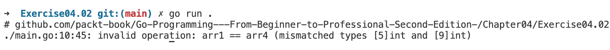
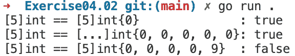
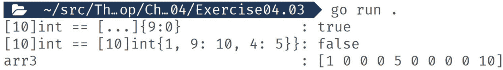
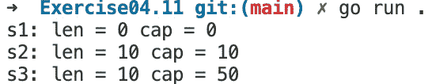
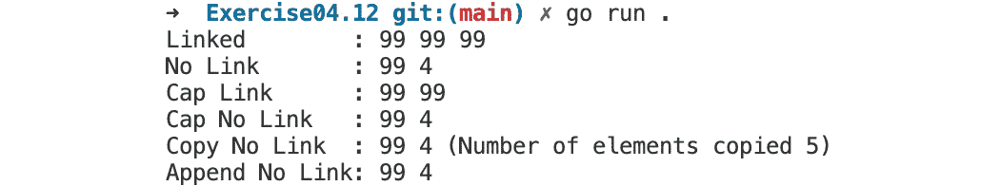
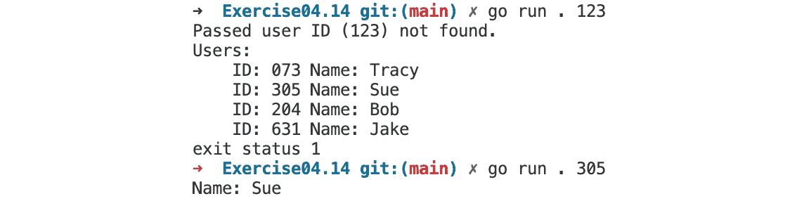
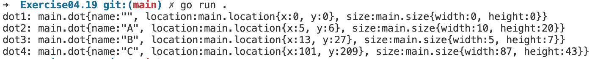
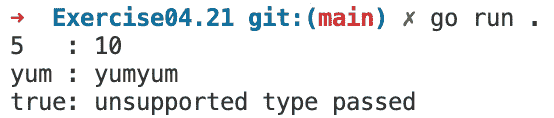
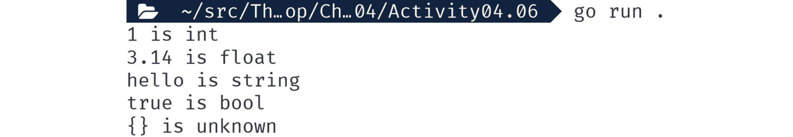

# 4

# 复杂类型

概述

本章介绍了 Go 的更复杂类型。这将建立在我们在上一章中关于 Go 核心类型所学的知识之上。当你构建更复杂的软件时，这些复杂类型是必不可少的，因为它们允许你逻辑地将相关数据分组在一起。这种分组数据的能力使得代码更容易理解、维护和修复。

到本章结束时，你将能够使用数组、切片和映射来分组数据。你将学习根据核心类型创建自定义类型。你还将学习使用结构体来创建由任何其他类型的命名字段组成的结构，并解释 `interface{}` 的重要性。

# 技术要求

对于本章，你需要 Go 版本 1.21 或更高。本章的代码可以在以下位置找到：[`github.com/PacktPublishing/Go-Programming-From-Beginner-to-Professional-Second-Edition-/tree/main/Chapter04`](https://github.com/PacktPublishing/Go-Programming-From-Beginner-to-Professional-Second-Edition-/tree/main/Chapter04)。

# 简介

在上一章中，我们介绍了 Go 的核心类型。这些类型对于你在 Go 中所做的所有事情都至关重要，但建模更复杂的数据可能具有挑战性。在现代计算机软件中，我们希望尽可能地将数据和逻辑分组在一起。我们还希望我们的逻辑能够反映我们正在构建的现实世界解决方案。

如果你正在为汽车编写软件，理想情况下你希望有一个体现汽车的定制类型。这个类型应该命名为“car”，并且它应该有属性可以存储有关它是哪种汽车的信息。影响汽车的逻辑，如启动和停止，应该与汽车类型相关联。如果我们需要管理多辆汽车，我们需要能够将所有汽车分组在一起。

在本章中，我们将学习 Go 中允许我们建模此挑战数据部分的特性。然后，在下一章中，我们将解决行为部分。通过使用自定义类型，你可以扩展 Go 的核心类型，使用结构体允许你组合由其他类型组成的类型，并将逻辑与它们关联起来。集合允许你将数据分组在一起，并允许你遍历和操作它们。

随着你任务的复杂性增加，Go 的复杂类型可以帮助你保持代码易于理解和维护。例如数组、切片和映射等集合允许你将相关数据分组在一起。Go 的 `struct` 类型允许你创建由其他字符串、数字和布尔值组成的单一类型，这让你能够构建复杂现实世界概念的模型。结构体还允许你将逻辑附加到它们上；这允许你将控制模型的逻辑紧密地结合在一起。

当类型变得复杂时，我们需要知道如何使用类型转换和断言来正确地处理类型不匹配。我们还将查看 Go 的 `interface{}` 类型。这种类型几乎是神奇的，因为它允许你克服 Go 的结构类型系统，但以一种仍然类型安全的方式。

# 集合类型

如果你只处理一个电子邮件地址，你会定义一个字符串变量来为你保存该值。现在，考虑如果你需要处理 0 到 100 个电子邮件地址，你会如何组织你的代码。你可以为每个电子邮件地址定义一个单独的变量，但 Go 有其他我们可以使用的东西。

当处理大量类似数据时，我们会将其放入集合中。Go 的集合类型包括数组、切片和映射。Go 的集合类型是强类型的，并且易于循环遍历，但它们各自具有独特的特性，意味着它们更适合不同的用例。

# 数组

Go 最基本的集合类型是数组。当你定义一个数组时，你必须指定它可以包含哪种类型的数据以及数组的大小，以下形式：`[<size>]<type>`。例如，`[10]int` 是一个包含整数的长度为 10 的数组，而 `[5]string` 是一个包含字符串的长度为 5 的数组。使这成为一个数组的关键是指定大小。如果你的定义没有大小，它看起来像可以工作，但它不会是一个数组——它将是一个切片。切片是不同于数组的一种更灵活的集合类型，我们将在数组之后讨论。您可以设置元素值为任何类型，包括指针和数组。

您可以使用以下形式使用数据初始化数组：`[<size>]<type>{<value1>,<value2>,…<valueN>}`。例如，`[5]string{1}` 会初始化一个数组，其第一个值为 1，而 `[5]string{9,9,9,9,9}` 会将每个元素填充为数值九。当使用数据初始化时，您可以让 Go 根据您初始化时使用的元素数量来设置数组的大小。您可以通过将长度数字替换为 `...` 来利用这一点。例如，`[...]string{9,9,9,9,9}` 会创建一个长度为五的数组，因为我们用五个元素初始化了它。就像所有数组一样，长度是在编译时设置的，并且在运行时不可更改。

## 练习 4.01 – 定义数组

在这个练习中，我们将定义一个包含整数的简单数组，大小为十。然后，我们将打印出其内容。让我们开始吧：

1.  创建一个新的文件夹，并向其中添加一个 `main.go` 文件。

1.  在 `main.go` 中，添加包和导入：

    ```go
    package main
    import "fmt"
    ```

1.  创建一个函数来定义一个数组，然后返回它：

    ```go
    func defineArray() [10]int {
      var arr [10]int
      return arr
    }
    ```

1.  定义一个 `main` 函数，调用该函数，并打印结果。我们将使用 `fmt.Printf` 与 `%#v` 来获取关于值的额外详细信息，包括其类型：

    ```go
    func main() {
      fmt.Printf("%#v\n", defineArray())
    }
    ```

1.  保存此文件。然后，在新的文件夹中，运行以下命令：

    ```go
    go run .
    ```

运行前面的代码会给我们以下输出：

```go
[10]int{0, 0, 0, 0, 0, 0, 0, 0, 0, 0}
```

在这个练习中，我们定义了一个数组，但没有填充任何数据。由于所有数组都有固定的大小，当数组被打印出来时，它包含了 10 个值。这些值是数组接受的任何类型的空值。

## 比较数组

数组的长度是其类型定义的一部分。如果你有两个接受相同类型的数组但大小不同，它们是不兼容的，并且不能相互比较。要比较数组，它们必须具有相同的长度（大小）和类型。

## 练习 4.02 – 比较数组

在这个练习中，我们将比较数组。首先，我们将定义几个数组；其中一些是可比较的，而另一些则不是。然后，我们将运行代码并修复出现的任何问题。让我们开始吧：

1.  创建一个新的文件夹并添加一个 `main.go` 文件到其中。

1.  在 `main.go` 中添加包和导入：

    ```go
    package main
    import "fmt"
    ```

1.  创建一个函数，定义四个数组：

    ```go
    func compArrays() (bool, bool, bool) {
      var arr1 [5]int
      arr2 := [5]int{0}
      arr3 := [...]int{0, 0, 0, 0, 0}
      arr4 := [9]int{0, 0, 0, 0, 9}
    ```

1.  比较这些数组并返回比较的结果。这完成了这个函数：

    ```go
      return arr1 == arr2, arr1 == arr3, arr1 == arr4
    }
    ```

1.  定义一个 `main` 函数，使其打印出结果：

    ```go
    func main() {
      comp1, comp2, comp3 := compArrays()
      fmt.Println("[5]int == [5]int{0}       :", comp1)
      fmt.Println("[5]int == [...]int{0, 0, 0, 0, 0}:", comp2)
      fmt.Println("[5]int == [9]int{0, 0, 0, 0, 9} :", comp3)
    }
    ```

1.  保存并运行代码：

    ```go
    go run .
    ```

运行前面的代码会产生以下输出：



图 4.1：数组类型不匹配错误

你应该看到一个错误。这个错误告诉你，`arr1`，它是一个 `[5] int` 类型的数组，和 `arr4`，它是一个 `[9] int` 类型的数组，它们的长度不同，因此在 Go 中它们不是同一类型的数组，这意味着它们是不可比较的。让我们来修复这个问题。

1.  这里，我们有以下内容：

    ```go
      arr4 := [9]int{0, 0, 0, 0, 9}
    ```

    我们需要将其替换为以下内容：

    ```go
      arr4 := [5]int{0, 0, 0, 0, 9}
    ```

1.  我们还有以下代码：

    ```go
      fmt.Println("[5]int == [9]int{0, 0, 0, 0, 9} :", comp3)
    ```

    我们需要将其替换为以下内容：

    ```go
      fmt.Println("[5]int == [5]int{0, 0, 0, 0, 9} :", comp3)
    ```

1.  使用以下命令再次保存并运行代码：

    ```go
    go run .
    ```

运行前面的代码会产生以下输出：



图 4.2：无错误输出

在我们的练习中，我们定义了一些数组，它们都是用稍微不同的方式定义的。起初，我们有一个错误，因为我们尝试比较不同长度的数组，在 Go 中这意味着它们是不同类型的。我们修复了这个问题，并再次运行了代码。然后，我们可以看到，尽管前三个数组是用不同的方法定义的，但它们最终是相同的或彼此相等。最后一个数组，现在类型已修复，包含不同的数据，所以它不与其它数组相同或相等。其他集合类型，即 `slice` 和 `map`，以这种方式是不可比较的。对于映射和切片，你必须遍历你正在比较的两个集合的内容，并手动比较它们。这种能力使得数组在比较集合中的数据是代码中的热点路径或频繁操作时具有优势。

## 使用键初始化数组

到目前为止，当我们用数据初始化数组时，我们让 Go 为我们选择键。键指的是用于初始化数组中特定值的索引或位置。通过使用键在特定索引处设置值，您可以在特定位置初始化具有所需值的数组，同时保留其他元素为默认值。Go 允许您使用 `[<size>]<type>{<key1>:<value1>,…<keyN>:<valueN>}` 选择您想要的数据键。Go 很灵活，允许您设置带有间隔的键，并且可以按任何顺序设置。如果您定义了一个数组，其中数字键具有特定的含义，并且您想为特定的键设置值，但不需要设置其他任何值，那么使用键来初始化数组可以提供更大的灵活性和对数组中值放置的控制。

## 练习 4.03 – 使用键初始化数组

在这个练习中，我们将使用一些键初始化几个数组，并设置特定的值。然后，我们将比较它们。之后，我们将打印出一个数组并查看其内容。让我们开始吧：

1.  创建一个新的文件夹，并向其中添加一个 `main.go` 文件。

1.  在 `main.go` 文件中，添加包和导入语句：

    ```go
    package main
    import "fmt"
    ```

1.  创建一个函数，定义三个数组：

    ```go
    func compArrays() (bool, bool, [10]int) {
      var arr1 [10]int
      // set key 9 to value 0
      arr2 := [...]int{9: 0}
      // set key 0 to value 1, set key 9 to value 10,
      // and set key 4 to value 5
      arr3 := [10]int{1, 9: 10, 4: 5}
    ```

1.  比较数组并返回最后一个，以便我们稍后打印出来：

    ```go
      return arr1 == arr2, arr1 == arr3, arr3
    }
    ```

1.  创建一个 `main` 函数并调用 `compArrays`。然后，打印出结果：

    ```go
    func main() {
      comp1, comp2, arr3 := compArrays()
      fmt.Println("[10]int == [...]{9:0}       :", comp1)
      fmt.Println("[10]int == [10]int{1, 9: 10, 4: 5}}:", comp2)
      fmt.Println("arr3               :", arr3)
    }
    ```

1.  保存文件。然后，在新建的文件夹中，运行以下命令：

    ```go
    go run .
    ```

运行前面的代码会产生以下输出：



图 4.3：使用键初始化的数组

在这个练习中，我们使用键初始化了数组的数组数据。对于 `arr2`，我们结合了 `...` 省略符和设置键，使数组长度直接与设置的键相关联。对于 `arr3`，我们混合了使用键和不使用键来初始化数组，并且在设置键 0 为值 1、键 9 为值 10 和键 4 为值 5 时，我们使用了不按顺序的键。Go 在使用键时的灵活性很强，使得以这种方式使用数组变得愉快。

现在我们已经了解了初始化数组，接下来让我们进一步看看如何读取它们的值。

## 从数组中读取

到目前为止，我们已经定义了一个数组并用一些数据初始化了它。现在，让我们读取这些数据。可以使用 `<array>[<index>]` 来访问数组的一个单独元素。例如，这访问了数组的第一个元素，`arr[0]`。我知道 0 是数组的第一个元素，因为数组总是使用零索引的整数键。零索引意味着数组的第一个索引总是 0，最后一个索引总是数组的长度减 1。

数组中元素的顺序是有保证的稳定的。顺序稳定性意味着放置在索引 0 处的项总是数组中的第一个项。

能够访问数组的特定部分在几种情况下可能很有用。通常需要通过检查第一个和/或最后一个元素来验证数组中的数据。有时，数据在数组中的位置很重要，例如，您可以从第三个索引获取产品名称。这种位置重要性在读取 **逗号分隔值**（**CSV**）文件或其他类似分隔符分隔的值文件时很常见。CSV 仍然很常见，因为它是从电子表格文档导出数据的一个流行选择。

## 练习 4.04 – 从数组中读取单个项目

在这个练习中，我们将定义一个数组并用一些单词初始化它。然后，我们将以消息的形式读取单词并打印它。让我们开始吧：

1.  创建一个新的文件夹，并向其中添加一个名为 `main.go` 的文件。

1.  在 `main.go` 中添加包和导入：

    ```go
    package main
    import "fmt"
    ```

1.  创建一个函数，该函数定义一个包含单词的数组。单词的顺序很重要：

    ```go
    func message() string {
      arr := [...]string{
       "ready",
       "Get",
       "Go",
       "to",
      }
    ```

1.  现在，通过以特定顺序连接单词来创建一条消息并返回它。我们在这里使用 `fmt.Sprintln` 函数，因为它允许我们在打印之前捕获格式化的文本：

    ```go
      return fmt.Sprintln(arr[1], arr[0], arr[3], arr[2])
    }
    ```

1.  创建我们的 `main()` 函数，调用 `message` 函数，并将其打印到控制台：

    ```go
    func main() {
      fmt.Print(message())
    }
    ```

1.  保存并运行代码：

    ```go
    go run .
    ```

运行前面的代码会产生以下输出：

```go
Get ready to Go
```

我们现在已经了解了如何使用索引访问数组中的特定元素。接下来，我们将探索如何向数组写入。

## 向数组写入

一旦定义了一个数组，您就可以使用其索引来更改单个元素，格式为 `<array>[<index>] = <value>`。这种赋值方式与其他类型的变量赋值方式相同。

在现实世界的代码中，您通常需要在定义集合后根据输入或逻辑修改数据。

## 练习 4.05 – 向数组写入

在这个练习中，我们将定义一个数组并用一些单词初始化它。然后，我们将对单词进行一些修改。最后，我们将读取单词以形成一条消息并打印它。让我们开始吧：

1.  创建一个新的文件夹，并向其中添加一个名为 `main.go` 的文件。

1.  在 `main.go` 中添加包和导入：

    ```go
    package main
    import "fmt"
    ```

1.  创建一个函数，该函数定义一个包含单词的数组。单词的顺序很重要：

    ```go
    func message() string {
      arr := [4]string{"ready", "Get", "Go", "to"}
    ```

1.  我们将通过使用数组索引分配新值来更改数组中的某些单词。这种操作的顺序并不重要：

    ```go
      arr[1] = "It’s"
      arr[0] = "time"
    ```

1.  现在，通过以特定顺序连接单词来创建一条消息并返回它：

    ```go
      return fmt.Sprintln(arr[1], arr[0], arr[3], arr[2])
    }
    ```

1.  创建我们的 `main()` 函数，调用 `message` 函数，并将其打印到控制台：

    ```go
    func main() {
      fmt.Print(message())
    }
    ```

1.  保存并运行代码：

    ```go
    go run .
    ```

运行前面的代码会产生以下输出：

```go
It’s time to Go
```

您现在已经了解了使用索引初始化、读取和向数组写入的基本知识。既然我们知道数组包含多个值，让我们看看如何遍历数组。

## 遍历数组

你最常使用数组的方式是在循环中使用它们。由于数组索引的工作方式，它们很容易被循环。索引始终从 0 开始，没有间隔，最后一个元素是数组的长度减 1。

由于这个原因，也常常使用循环来创建一个变量来表示索引并手动增加它。这种类型的循环通常被称为`for i`循环，因为`i`是分配给索引变量的名字。

注意

你可以使用除`i`以外的不同字母；然而，在循环数组的情况下，`i`非常代表单词索引，因此从风格上讲代表了 Go 的惯用用法。

如你从上一章所记得，`for`循环有三个可能的部分：循环前可以运行的逻辑、每次循环交互时运行的逻辑以检查循环是否应该继续，以及每次循环迭代结束时运行的逻辑。一个`for i`循环看起来像这样：`i := 0; i < len(arr); i++ {`。发生的事情是我们将`i`定义为零，这也意味着`i`只存在于循环的作用域内。然后，在循环的迭代中检查`i`以确保它小于数组的长度。我们检查它是否小于数组的长度，因为长度总是比最后一个索引键多 1。最后，我们在每次循环中增加`i`以让我们逐个遍历数组中的每个元素，直到我们达到数组的长度。

当涉及到数组的长度时，可能会诱使你直接硬编码最后一个索引的值而不是使用`len`，因为你知道数组的长度始终是相同的。硬编码长度是一个坏主意。硬编码会使你的代码更难维护。你的数据通常会发生变化和演变。如果你需要回来更改数组的尺寸，硬编码的数组长度会引入难以发现的错误，甚至可能导致运行时恐慌。在 Go 中，运行时恐慌基本上是在程序遇到它无法或不应从中恢复的异常情况时发生的事件。当触发恐慌时，程序将立即终止。

使用循环和数组允许你对每个元素重复相同的逻辑——即验证数据、修改数据或输出数据——而无需为多个变量重复相同的代码。

## 练习 4.06 - 使用“for i”循环遍历数组

在这个练习中，我们将定义一个数组并用一些数字初始化它。我们将遍历这些数字并对每个数字执行一个操作，将结果放入消息中。然后，我们将返回消息并打印它。让我们开始吧：

1.  创建一个新的文件夹，并向其中添加一个名为`main.go`的文件。

1.  在`main.go`中添加包和导入：

    ```go
    package main
    import "fmt"
    ```

1.  创建一个函数。在循环之前，我们将定义一个包含数据的数组和`m`变量：

    ```go
    func message() string {
      m := ""
      arr := [4]int{1,2,3,4}
    ```

1.  定义循环的开始。这管理索引和循环：

    ```go
      for i := 0; i < len(arr); i++ {
    ```

1.  然后，编写循环体，对数组的每个元素执行操作并将其添加到消息中：

    ```go
       arr[i] = arr[i] * arr[i]
       m += fmt.Sprintf("%v: %v\n", i, arr[i])
    ```

1.  现在，关闭循环，返回消息，并关闭函数：

    ```go
      }
      return m
    }
    ```

1.  创建我们的`main`函数，调用`message`函数，并将其打印到控制台：

    ```go
    func main() {
      fmt.Print(message())
    }
    ```

1.  保存此代码。然后，从新文件夹中运行代码：

    ```go
    go run .
    ```

在使用`for i`循环遍历数组并将值自乘后，运行前面的代码会产生以下输出：

```go
0: 1
1: 4
2: 9
3: 16
```

`for i`循环非常常见，所以请密切关注`for`循环，并确保你理解每个部分的作用。

注意

`len`。这个特性也适用于其他集合类型；即切片和映射。

## 在循环中修改数组的内容

除了在循环中从数组中读取内容外，你还可以在循环中更改数组的内容。在数组中的每个元素上工作就像在工作变量上一样。你也会使用相同的`for i`循环。

就像从数组中读取数据一样，能够更改集合中的数据可以减少你需要编写的代码量，如果每个元素都是一个独立的变量。

## 练习 4.07 – 在循环中修改数组的内容

在这个练习中，我们将定义一个空数组，用数据填充它，然后修改这些数据。最后，我们将打印填充和修改后的数组到控制台。让我们开始吧：

1.  创建一个新文件夹并将一个名为`main.go`的文件添加到其中。

1.  在`main.go`中添加包和导入：

    ```go
    package main
    import "fmt"
    ```

1.  创建一个函数，用从 1 到 10 的数字填充数组：

    ```go
    func fillArray(arr [10]int) [10]int {
      for i := 0; i < len(arr); i++ {
       arr[i] = i + 1
      }
      return arr
    }
    ```

1.  创建一个函数，将数组中的数字自乘并将结果设置回数组：

    ```go
    func opArray(arr [10]int) [10]int {
      for i := 0; i < len(arr); i++ {
        arr[i] = arr[i] * arr[i]
      }
      return arr
    }
    ```

1.  在我们的`main()`函数中，我们需要定义我们的空数组，填充它，修改它，然后将内容打印到控制台：

    ```go
    func main() {
      var arr [10]int
      arr = fillArray(arr)
      arr = opArray(arr)
      fmt.Println(arr)
    }
    ```

1.  保存此代码。然后，从新文件夹中运行代码：

    ```go
    go run .
    ```

运行前面的代码会产生以下输出：

```go
[1 4 9 16 25 36 49 64 81 100]
```

一旦你了解了如何在`for i`循环中使用数组，处理数组中的数据就变得简单了。与处理其他集合相比，处理数组的一个优点是它们的固定长度。使用数组时，不可能意外地更改数组的大小，从而导致无限循环，这是一种无法结束的循环，会导致软件无限期地运行并消耗大量资源。

## 活动 4.01 – 填充数组

在这个活动中，我们将定义一个数组并使用`for i`循环填充它。以下是这个活动的步骤：

1.  创建一个新的 Go 程序。

1.  定义一个包含 10 个元素的数组。

1.  使用`for i`循环将数字 1 到 10 填充到数组中。

1.  使用`fmt.Println`将数组打印到控制台。

预期输出如下：

```go
[1 2 3 4 5 6 7 8 9 10]
```

注意

这个活动的解决方案可以在本章节的 GitHub 仓库文件夹中找到：[`github.com/PacktPublishing/Go-Programming-From-Beginner-to-Professional-Second-Edition-/tree/main/Chapter04/Activity04.01`](https://github.com/PacktPublishing/Go-Programming-From-Beginner-to-Professional-Second-Edition-/tree/main/Chapter04/Activity04.01)。

# 切片

数组很棒，但它们在大小上的刚性可能会导致问题。如果你想要创建一个接受数组并对其中的数据进行排序的函数，它只能针对一个数组大小工作。这需要你为每种大小的数组创建一个函数。这种对大小的严格性使得使用数组感觉像是一种麻烦和不吸引人的体验。数组的另一面是，它们是管理排序数据集合的高效方式。如果有一种方法可以同时获得数组的效率和更大的灵活性，那岂不是很好？Go 通过切片的形式为你提供了这一点。

切片是围绕数组的一层薄层，它让你可以拥有一个排序的数值索引集合，而无需担心大小。在薄层下面仍然是 Go 数组，但 Go 管理所有细节，例如使用多大的数组。你使用切片的方式就像使用数组一样；它只持有一种类型的值，你可以使用`[`和`]`读取和写入每个元素，并且它们很容易使用`for` `i`循环进行遍历。

切片还可以通过内置的`append`函数轻松扩展。这个函数接受你的切片和要添加的值，并返回一个包含所有内容的新的切片。通常，我们会从一个空切片开始，并根据需要扩展它。

由于切片是围绕数组的一层薄层，这意味着它不是一个真正的类型，就像数组一样。你需要了解 Go 如何使用切片背后的隐藏数组。如果你不了解这一点，可能会导致微妙且难以调试的错误。

在现实世界的代码中，你应该将切片作为所有排序集合的首选。你将更加高效，因为你不需要像使用数组那样编写那么多代码。你将在现实世界的项目中看到的大部分代码都使用了大量的切片，而很少使用数组。数组仅在需要确切长度时使用，即使在这种情况下，切片也通常被使用，因为它们可以更容易地在代码中传递。

## 练习 4.08 – 使用切片

在这个练习中，我们将通过从切片中读取一些数据、将切片传递给函数、遍历切片、从切片中读取值以及将值追加到切片的末尾来展示切片的灵活性。让我们开始吧：

1.  创建一个新的文件夹，并向其中添加一个名为`main.go`的文件。

1.  在`main.go`中，添加包和导入：

    ```go
    package main
    import (
      "fmt"
      "os"
    )
    ```

1.  创建一个函数，该函数接受一个`int`参数并返回一个`string`切片：

    ```go
    func getPassedArgs(minArgs int) []string {
    ```

1.  在函数体中，检查是否通过命令行传递了正确的参数数量。如果不是，我们带错误退出程序。当我们从命令行运行程序时，Go 会自动将所有参数放入 `os.Args`，它是一个字符串切片：

    ```go
      if len(os.Args) < minArgs {
        fmt.Printf("At least %v arguments are needed\n", minArgs)
        os.Exit(1)
      }
    ```

1.  `os.Args` 切片的第一个元素 `os.Args[0]` 是如何调用代码的，而不是一个参数，所以我们将跳过它，并从索引 1 开始我们的 `for i` 循环：

    ```go
      var args []string
      for i := 1; i < len(os.Args); i++ {
        args = append(args, os.Args[i])
      }
    ```

1.  然后，我们将返回参数：

    ```go
      return args
    }
    ```

1.  现在，创建一个函数，该函数遍历一个切片并找到最长的字符串。当两个单词长度相同时，返回第一个单词：

    ```go
    func findLongest(args []string) string {
      var longest string
      for i := 0; i < len(args); i++ {
        if len(args[i]) > len(longest) {
          longest = args[i]
           }
      }
      return longest
    }
    ```

1.  在 `main()` 函数中，我们调用函数并检查错误。如果有错误，我们告诉用户然后终止程序使用 `os.Exit(1)`，这也会将错误代码 1 返回给操作系统：

    ```go
    func main() {  
     if longest := findLongest(getPassedArgs(3)); len(longest) > 0 {
         fmt.Println("The longest word passed was:", longest)
      } else {
        fmt.Println("There was an error")
        os.Exit(1)
      }
    }
    ```

1.  保存文件。然后，在保存文件的文件夹中，使用以下命令运行代码：

    ```go
    go run . Get ready to Go
    ```

运行前面的代码会产生以下输出：

```go
The longest word passed was: ready
```

在这个练习中，我们能够看到切片的灵活性以及它们如何像数组一样工作。这种使用切片的方式是 Go 感觉像是一种动态语言的原因之一。

## 向切片中添加多个项目

内置的 `append` 函数可以将多个值添加到切片中。由于最后一个参数是可变参数，因此你可以向 `append` 添加任意数量的参数。由于它是可变参数，这意味着你也可以使用 `...` 符号将切片作为可变参数使用，允许你向 `append` 传递任意数量的参数。

在实际代码中，经常需要向 `append` 传递多个参数，并且拥有它可以使 Go 代码更加紧凑，因为它不需要多次调用或循环来添加多个值。

## 练习 4.09 – 向切片中添加多个项目

在这个练习中，我们将使用 `append` 的可变参数来将预定义数据的形式添加到切片中。然后，我们将根据用户输入动态添加数据到同一个切片中。让我们开始吧：

1.  创建一个新的文件夹，并向其中添加一个名为 `main.go` 的文件。

1.  在 `main.go` 中，添加包和导入：

    ```go
    package main
    import (
      "fmt"
      "os"
    )
    ```

1.  创建一个安全获取用户输入的函数：

    ```go
    func getPassedArgs() []string {
      var args []string
      for i := 1; i < len(os.Args); i++ {
        args = append(args, os.Args[i])
      }
      return args
    }
    ```

1.  创建一个接受字符串切片作为参数并返回字符串切片的函数。然后定义一个 `strings` 类型的切片变量：

    ```go
    func getLocales(extraLocales []string) []string {
      var locales []string
    ```

1.  使用 `append` 方法向切片中添加多个字符串：

    ```go
      locales = append(locales, "en_US", "fr_FR")
    ```

1.  从参数中添加更多数据：

    ```go
      locales = append(locales, extraLocales...)
    ```

1.  返回变量并关闭函数定义：

    ```go
      return locales
    }
    ```

1.  在 `main()` 函数中，获取用户输入，将其传递给我们的函数，然后打印结果：

    ```go
    func main() {
      locales := getLocales(getPassedArgs())
      fmt.Println("Locales to use:", locales)
    }
    ```

1.  保存文件。然后，在 *步骤 1* 中创建的文件夹中，使用以下命令运行代码：

    ```go
    go run . fr_CN en_AU
    ```

运行前面的代码会产生以下输出：

```go
Locales to use: [en_US fr_FR fr_CN en_AU]
```

在这个练习中，我们使用了两种向切片添加多个值的方法。如果你需要将两个切片合并在一起，你也会使用这种技术。

虽然将这样的切片附加到另一个切片以添加它可能看起来效率不高，但 Go 运行时可以检测到你正在执行 append 操作，并在后台优化调用以确保不浪费资源。

## 从切片和数组创建切片

通过使用与访问数组或切片中单个元素类似的符号，你可以从数组或切片的内容中创建新的切片。最常用的符号是`[<low>:<high>]`。这个符号告诉 Go 创建一个新的切片，其值类型与源切片或数组相同，并通过从低索引开始填充新切片，直到但不包括高索引的值。低和高是可选的。如果你省略了低，那么 Go 默认为源的第一个元素。如果你省略了高，那么它将一直到最后一个值。你可以同时省略两者，如果你这样做，那么新切片将包含源中的所有值。

以这种方式创建新切片时，Go 不会复制值。如果源是数组，那么该源数组是新切片的隐藏数组。如果源是切片，那么新切片的隐藏数组与源切片使用的相同隐藏数组。

这是一个重要的概念，因为修改**任何**切片也会改变其底层数组，而不是它的副本。将切片视为底层数组的一个“视图”。

## 练习 4.10 – 从切片创建切片

在这个练习中，我们将使用切片范围符号来创建具有各种初始值的切片。在实际代码中，通常只需要处理切片或数组的一小部分。`range`符号是一种快速直接的方法，可以只获取所需的数据。让我们开始吧：

1.  创建一个新的文件夹并将一个名为`main.go`的文件添加到其中。

1.  在`main.go`中添加包和导入：

    ```go
    package main
    import "fmt"
    ```

1.  创建一个函数并定义一个包含九个`int`值的切片：

    ```go
    func message() string {
      s := []int{1, 2, 3, 4, 5, 6, 7, 8, 9}
    ```

1.  我们将提取第一个值，首先直接作为`int`值，然后作为使用低和高索引的切片，最后只使用高索引并跳过低索引。我们将这些值写入消息字符串：

    ```go
      m := fmt.Sprintln("First :", s[0], s[0:1], s[:1])
    ```

1.  现在，我们将获取最后一个元素。为了获取`int`值，我们将使用长度并从索引中减去 1。我们使用相同的逻辑来设置范围的低。对于高，我们可以使用切片的长度。最后，我们可以看到我们可以跳过高并得到相同的结果：

    ```go
      m += fmt.Sprintln("Last  :", s[len(s)-1], s[len(s)-1:len(s)], s[len(s)-1:])
    ```

1.  现在，让我们获取前五个值并将它们添加到消息中：

    ```go
      m += fmt.Sprintln("First 5 :", s[:5])
    ```

1.  接下来，我们将获取最后四个值并将它们添加到消息中：

    ```go
      m += fmt.Sprintln("Last 4 :", s[5:])
    ```

1.  最后，我们将从切片的中间提取五个值并将它们也添加到消息中：

    ```go
      m += fmt.Sprintln("Middle 5:", s[2:7])
    ```

1.  然后，我们将返回消息并关闭函数：

    ```go
      return m
    }
    ```

1.  在`main`中，我们将打印消息：

    ```go
    func main() {
      fmt.Print(message())
    }
    ```

1.  保存文件。然后，在你在*步骤 1*中创建的文件夹中，使用以下命令运行代码：

    ```go
    go run .
    ```

运行前面的代码会产生以下输出：


图 4.5：从切片创建切片后的输出

在这个练习中，我们尝试了几种从另一个切片创建切片的方法。你也可以将这些相同的技巧用于数组作为源。我们注意到起始索引和停止索引都是可选的。如果你没有起始索引，它将从源切片或数组的开始处开始。如果你没有停止索引，那么它将在数组的末尾停止。如果你省略了起始索引和停止索引，它将创建切片或数组的副本。这个技巧对于将数组转换为切片很有用，但对于复制切片却没有帮助，因为两个切片共享同一个隐藏数组。

## 理解切片内部机制

切片很棒，当你需要有序列表时应该首选使用它，但如果你不知道它们在底层是如何工作的，它们可能会导致难以发现的错误。

数组是一种类似于`string`或`int`类型的值类型。值类型可以被复制并与其自身进行比较。这些值类型一旦被复制，就不会与它们的源值连接。切片的工作方式不像值类型；它们更像指针，但它们也不是指针。

使用切片保持安全的关键在于理解存在一个隐藏数组用于存储值，并且对切片的更改会改变底层数组。这些更改可能需要也可能不需要用更大的数组替换隐藏数组。隐藏数组的管理在后台发生的事实使得很难很好地推理切片中正在发生的事情。

切片有三个隐藏属性：长度、指向隐藏数组的指针以及隐藏数组中起始点的位置。当你向切片追加内容时，这些属性中的一个或多个会得到更新。哪些属性会更新取决于隐藏数组是否已满。

隐藏数组的大小和切片的大小并不总是相同。切片的大小是其长度，我们可以通过使用`len`内置函数来找出它。隐藏数组的大小是切片的容量。还有一个内置函数可以告诉你切片的容量；即`cap`。当你使用`append`向切片添加新值时，会发生两件事之一：如果切片有额外的容量——也就是说，隐藏数组还没有满——它将值添加到隐藏数组中，然后更新切片的长度属性。如果隐藏数组已满，Go 将创建一个新的更大的数组。然后，Go 将所有值从旧数组复制到新数组中，并添加新值。然后，Go 更新切片，使其从指向旧数组变为指向新数组，并更新切片的长度以及可能的位置。

只有当切片是数组或从非第一个元素开始的切片的值的一个子集时，起始点才会发挥作用，就像在我们的例子中，我们得到了切片的最后五个元素。其余时间，它将是隐藏数组中的第一个元素。

当你定义切片时，可以控制隐藏数组的大小。Go 的内置`make`函数允许你在创建切片时设置其长度和容量。语法如下：`make(<sliceType>, <length>, <capacity>)`。当使用`make`创建切片时，容量是可选的，但长度是必需的。

## 练习 4.11 – 使用 make 控制切片的容量

在这个练习中，使用`make`函数，我们将创建几个切片并显示它们的长度和容量。让我们开始吧：

1.  创建一个新的文件夹并添加一个名为`main.go`的文件。

1.  在`main.go`中，添加包和导入：

    ```go
    package main
    import "fmt"
    ```

1.  创建一个返回三个`int`切片的函数：

    ```go
    func genSlices() ([]int, []int, []int) {
    ```

1.  使用`var`表示法定义一个切片：

    ```go
      var s1 []int
    ```

1.  使用`make`定义一个切片并只设置长度：

    ```go
      s2 := make([]int, 10)
    ```

1.  定义一个同时使用切片长度和容量的切片：

    ```go
      s3 := make([]int, 10, 50)
    ```

1.  返回三个切片并关闭函数定义：

    ```go
      return s1, s2, s3
    }
    ```

1.  在`main()`函数中，调用我们创建的函数并捕获返回的值。对于每个切片，将其长度和容量打印到控制台：

    ```go
    func main() {
      s1, s2, s3 := genSlices()
      fmt.Printf("s1: len = %v cap = %v\n", len(s1), cap(s1))
      fmt.Printf("s2: len = %v cap = %v\n", len(s2), cap(s2))
      fmt.Printf("s3: len = %v cap = %v\n", len(s3), cap(s3))
    }
    ```

1.  保存文件。然后，在你在*步骤 1*中创建的文件夹中，使用以下命令运行代码：

    ```go
    go run .
    ```

运行前面的代码会产生以下输出：



图 4.6：显示切片的输出

在这个练习中，我们使用了`make`、`len`和`cap`来在定义切片时控制和显示切片的长度和容量。

如果你已经知道切片所需的最大大小，提前设置容量可以提高性能，因为 Go 不需要花费额外的资源来调整底层数组的大小。

## 切片的后台行为

由于切片是什么以及它是如何工作的复杂性，你不能直接比较两个切片。如果你尝试这样做，Go 会给你一个错误。你可以将切片与 nil 进行比较，但仅此而已。

切片不是一个值，也不是一个指针，那么它是什么？切片是 Go 语言中的一个特殊构造。切片不会直接存储自己的值。在后台，它使用一个你无法直接访问的数组。切片存储的是指向那个隐藏数组的指针，它在数组中的起始点，切片的长度，以及切片的容量。这些值为切片提供了一个查看隐藏数组的窗口。这个窗口可以是整个隐藏数组，也可以是它的一部分。隐藏数组的指针可以被多个切片共享。这种指针共享可以导致多个切片共享同一个隐藏数组，即使不是所有的切片都包含相同的数据。这意味着其中一个切片可能比其他切片包含更多的数据。

当一个切片需要超出其隐藏数组的大小时，它会创建一个新的更大的数组，将旧数组的内容复制到新数组中，并将切片指向新数组。这种数组交换是为什么我们之前的切片变得不连接。最初，它们都指向同一个隐藏数组，但当我们扩展第一个切片时，它所指向的数组发生了变化。这种变化意味着扩展的切片的更改不再影响其他切片，因为它们仍然指向旧的、较小的数组。

如果你需要复制一个切片并且确保它们不相互连接，你有几种选择。你可以使用 `append` 将源切片的内容复制到另一个数组中，或者使用内置的 `copy` 函数。当使用 `copy` 时，Go 不会改变目标切片的大小，所以请确保它有足够的空间来存放你想要复制的所有元素。

## 练习 4.12 – 控制切片的内部行为

在这个练习中，我们将探索五种不同的从切片到切片复制数据的方法以及这对切片的内部行为有何影响。让我们开始吧：

1.  在新文件夹中创建一个名为 `main.go` 的文件。

1.  在 `main.go` 中添加包和导入：

    ```go
    package main
    import "fmt"
    ```

1.  创建一个返回三个 `int` 类型的值的函数：

    ```go
    func linked() (int, int, int) {
    ```

1.  定义一个初始化了某些数据的 `int` 切片：

    ```go
      s1 := []int{1, 2, 3, 4, 5}
    ```

1.  然后，我们将对该切片进行简单的变量复制：

    ```go
      s2 := s1
    ```

1.  通过切片范围操作将第一个切片的所有值复制到新切片中：

    ```go
      s3 := s1[:]
    ```

1.  在第一个切片中更改一些数据。稍后，我们将看到这如何影响第二个和第三个切片：

    ```go
      s1[3] = 99
    ```

1.  为每个切片返回相同的索引并关闭函数定义：

    ```go
      return s1[3], s2[3], s3[3]
    }
    ```

1.  创建一个将返回两个 `int` 类型的值的函数：

    ```go
    func noLink() (int, int) {
    ```

1.  定义一个包含一些数据的切片，然后再进行简单的复制：

    ```go
      s1 := []int{1, 2, 3, 4, 5}
      s2 := s1
    ```

1.  这次，我们在做任何事情之前将向第一个切片中追加。这个操作改变了切片的长度和容量：

    ```go
      s1 = append(s1, 6)
    ```

1.  然后，我们将更改第一个切片，从两个切片中返回相同的索引，并关闭函数：

    ```go
      s1[3] = 99
      return s1[3], s2[3]
    }
    ```

1.  在我们的下一个函数中，我们将返回两个 `int` 类型的值：

    ```go
    func capLinked() (int, int) {
    ```

1.  这次，我们将使用 `make` 定义第一个切片。当我们这样做时，我们将设置一个比其长度更大的容量：

    ```go
      s1 := make([]int, 5, 10)
    ```

1.  让我们用之前相同的数据填充第一个数组：

    ```go
      s1[0], s1[1], s1[2], s1[3], s1[4] = 1, 2, 3, 4, 5
    ```

1.  现在，我们将通过复制第一个切片来创建一个新的切片，就像我们之前做的那样：

    ```go
      s2 := s1
    ```

1.  我们将在第一个切片中追加一个新值，这将改变其长度但不会改变其容量：

    ```go
      s1 = append(s1, 6)
    ```

1.  然后，我们将更改第一个切片，从两个切片中返回相同的索引，并关闭函数：

    ```go
      s1[3] = 99
      return s1[3], s2[3]
    }
    ```

1.  在这个函数中，我们再次使用 `make` 来设置容量，但我们将使用 `append` 来添加将超出该容量的元素：

    ```go
    func capNoLink() (int, int) {
      s1 := make([]int, 5, 10)
      s1[0], s1[1], s1[2], s1[3], s1[4] = 1, 2, 3, 4, 5
      s2 := s1
      s1 = append(s1, []int{10: 11}...)
      s1[3] = 99
      return s1[3], s2[3]
    }
    ```

1.  在下一个函数中，我们将使用 `copy` 将第一个切片的元素复制到第二个切片中。`copy` 返回从一个切片复制到另一个切片的元素数量，所以我们也返回这个值：

    ```go
    func copyNoLink() (int, int, int) {
      s1 := []int{1, 2, 3, 4, 5}
      s2 := make([]int, len(s1))
      copied := copy(s2, s1)
      s1[3] = 99
      return s1[3], s2[3], copied
    }
    ```

1.  在最终的函数中，我们将使用`append`将值复制到第二个切片中。以这种方式使用`append`会导致值被复制到一个新的隐藏数组中：

    ```go
    func appendNoLink() (int, int) {
      s1 := []int{1, 2, 3, 4, 5}
      s2 := append([]int{}, s1...)
      s1[3] = 99
      return s1[3], s2[3]
    }
    ```

1.  在`main`函数中，我们将打印出我们返回的所有数据，并将其打印到控制台：

    ```go
    func main() {
      l1, l2, l3 := linked()
      fmt.Println("Linked   :", l1, l2, l3)
      nl1, nl2 := noLink()
      fmt.Println("No Link   :", nl1, nl2)
      cl1, cl2 := capLinked()
      fmt.Println("Cap Link  :", cl1, cl2)
      cnl1, cnl2 := capNoLink()
      fmt.Println("Cap No Link :", cnl1, cnl2)
      copy1, copy2, copied := copyNoLink()
      fmt.Print("Copy No Link: ", copy1, copy2)
      fmt.Printf(" (Number of elements copied %v)\n", copied)
      a1, a2 := appendNoLink()
      fmt.Println("Append No Link:", a1, a2)
    }
    ```

1.  保存文件。然后，在您在*步骤 1*中创建的文件夹中，使用以下命令运行代码：

    ```go
    go run .
    ```

运行前面的代码会产生以下输出：



图 4.7：显示数据的输出

在这个练习中，我们逐步通过了五种不同的场景，在这些场景中我们复制了切片数据。在`Linked`场景中，我们对第一个切片进行了简单的复制，然后对其进行了范围复制。虽然切片本身是不同的，并且不再是相同的切片，但在现实中，这对它们持有的数据没有影响。每个切片都指向相同的隐藏数组，所以当我们对第一个切片进行更改时，它影响了所有切片。

在`No Link`场景中，第一个和第二个切片的设置相同，但在我们对第一个切片进行更改之前，我们向其中追加了一个值。当我们向其中追加这个值时，在后台，Go 需要创建一个新的数组来存储现在的大量值。由于我们是在向第一个切片追加，其指针指向新的更大的切片。第二个切片没有更新其指针。这就是为什么当第一个切片的值发生变化时，第二个切片没有受到影响。第二个切片不再指向相同的隐藏数组，这意味着它们不再链接。

对于`Cap Link`场景，第一个切片使用`make`定义，并具有过大的容量。这额外的容量意味着当第一个切片追加值时，隐藏数组中已经有额外的空间。这额外的容量意味着不需要替换隐藏数组。结果是，当我们更新第一个切片的值时，它和第二个切片仍然指向相同的隐藏数组，这意味着更改影响了两者。

在`Cap No Link`场景中，设置与上一个场景相同，但在我们追加值时，追加的值比可用容量多。尽管有额外的容量，但仍然不够，第一个切片中的隐藏数组被替换了。结果是两个切片之间的链接断裂。

在`Copy No Link`中，我们使用了内置的`copy`函数来为我们复制值。虽然这会将值复制到一个新的隐藏数组中，但`copy`不会改变切片的长度。这个事实意味着在复制之前，目标切片必须是正确的长度。在现实世界的代码中，你很少看到复制；这可能是因为它很容易被误用。

最后，使用`Append No Link`，我们使用`append`执行类似于`copy`的操作，但无需担心长度。这种方法在现实世界的代码中很常见，当你需要确保获取到与源不链接的值的副本时。由于`append`经常被使用，这是一个一行解决方案。有一个稍微高效一点的解决方案，可以避免在`append`的第一个参数中分配空切片的额外内存。你可以通过创建一个 0 容量范围的副本来重用第一个切片。这个替代方案看起来是这样的：

```go
  s1 := []int{1, 2, 3, 4, 5}
  s2 := append(s1[:0:0], s1...)
```

你在这里看到了什么新东西吗？这里使用了很少使用的切片范围表示法`<slice>[<low>:<high>:<capacity>]`。在当前的 Go 编译器中，这是复制切片最节省内存的方法。

## 地图基础

虽然`array`和`slices`相似，有时可以互换使用，但 Go 的另一种集合类型`map`相当不同，并且不能与`array`和`slices`互换。Go 的`map`类型服务于不同的目的。

在计算机科学术语中，Go 的映射是一个哈希表。映射与其他集合类型的主要区别在于其键。在数组或切片中，键是一个占位符（索引号），它本身没有意义。它只在那里充当计数器，并且与值没有直接关系。

在映射中，键是数据——与值有真实关系的数据。例如，你可以在映射中有一个用户账户记录的集合。键将是用户的员工 ID。员工 ID 是真实数据，而不仅仅是一个任意的占位符。如果有人给你他们的员工 ID，你将能够查找他们的账户记录，而无需遍历数据来找到它。使用映射，你可以快速设置、获取和删除数据。

你可以使用与切片或数组相同的方式访问映射的各个元素：使用`[`和`]`。映射可以有直接可比较的任何类型的键，例如`int`或`string`类型。你不能比较切片，因此它们不能作为键。映射的值可以是任何类型，包括指针、切片和映射。

你不应该将映射用作有序列表。即使你打算为映射的键使用`int`类型，映射也不保证始终从索引 0 开始，也不保证键之间没有间隙。即使你想要`int`键，这个特性也可能是一个优势。如果你在切片或数组中有稀疏填充的数据——即键之间的值有间隙——它将包含大量零数据。在映射中，它只会包含你设置的数据。

要定义映射，你使用以下表示法：`map[<key_type>]<value_type>`

你可以使用 `make` 来创建映射，但使用 `make` 创建映射时的参数是不同的。Go 无法为映射创建键，因此无法像使用切片那样创建任意长度的映射。你可以建议编译器为你的映射使用容量。为映射建议容量是可选的，并且 `map` 不能与 `cap` 一起使用来检查其容量。

映射就像切片一样，它们既不是值也不是指针。映射是 Go 中的一个特殊构造。在复制变量或值时，你需要采取相同的谨慎。由于你无法控制或检查映射的容量，当你想要知道添加元素时会发生什么时，它们就更加具有挑战性。

由于 Go 不帮助你使用映射管理键，这意味着你必须指定键来初始化带有数据的映射。它与其他集合类型的表示法相同；也就是说，`map[<key_type>]<value_type>{<key1>: <value>, … <keyN>: <valueN>}`。

一旦定义，你就可以设置值，而无需担心映射的长度，就像你在处理数组和切片时那样。设置值就像其他集合一样；也就是说，`<map>[<key>] = <value>`。在设置映射的值之前，你需要确保首先已经初始化了它。如果你尝试设置一个未初始化映射的值，会导致运行时恐慌。为了避免这种情况，一个好的做法是避免使用 `var` 来定义映射。如果你使用数据初始化映射或使用 `make` 来创建你的映射，你就不会遇到这个问题。

## 练习 4.13 – 创建、读取和写入映射

在这个练习中，我们将定义一个带有数据的映射，然后向其中添加一个新元素。最后，我们将打印映射到控制台。让我们开始吧：

1.  创建一个新的文件夹，并向其中添加一个名为 `main.go` 的文件。

1.  在 `main.go` 中，添加包和导入：

    ```go
    package main
    import "fmt"
    ```

1.  创建一个返回 `map` 类型（具有 `string` 键和 `string` 值）的函数：

    ```go
    func getUsers() map[string]string {
    ```

1.  定义一个具有 `string` 键和 `string` 值的 `map` 类型，并使用一些元素初始化它：

    ```go
      users := map[string]string{
        "305": "Sue",
        "204": "Bob",
        "631": "Jake",
      }
    ```

1.  接下来，我们将向 `map` 类型添加一个新元素：

    ```go
      users["073"] = "Tracy"
    ```

1.  返回 `map` 类型并关闭函数：

    ```go
      return users
    }
    ```

1.  在 `main` 函数中，将 `map` 类型打印到控制台：

    ```go
    func main() {
      fmt.Println("Users:", getUsers())
    }
    ```

1.  保存文件。然后，在你在 *步骤 1* 中创建的文件夹中，使用以下命令运行代码：

    ```go
    go run .
    ```

运行前面的代码会产生以下输出：

```go
Users: map[073:Tracy 204:Bob 305:Sue 631:Jake]
```

在这个练习中，我们创建了一个映射，用数据初始化它，然后添加了一个新元素。这个练习表明，与映射一起工作与与数组切片一起工作相似。你应该使用映射取决于你将存储在其中的数据类型，以及你的访问模式是否需要访问单个项目而不是项目列表。

## 从映射中读取

在需要使用映射获取值之前，你并不总是知道键是否存在于映射中。当你获取一个在映射中不存在的键的值时，Go 会返回映射值类型的零值。使用与零值一起工作的逻辑是 Go 中编程的有效方式，但这并不总是可能的。如果你不能使用零值逻辑，当需要时，映射可以返回一个额外的返回值。这种表示法如下所示：`<value>, <exists_value> := <map>[<key>]`。在这里，`exists_value`是一个布尔值，如果键存在于映射中则为`true`；否则为`false`。这通常用名为`ok`的布尔值表示。当遍历映射时，你应该使用`range`关键字，永远不要依赖于其中项的顺序。Go 不保证映射中项的顺序。为了确保没有人依赖于元素的顺序，Go 在遍历映射时会故意随机化它们的顺序。如果你确实需要按特定顺序遍历映射中的元素，你需要使用数组或切片来帮助你完成这项工作。

## 练习 4.14 – 从映射中读取

在这个练习中，我们将使用直接访问和循环从映射中读取。我们还将检查键是否存在于映射中。让我们开始吧：

1.  创建一个新的文件夹，并向其中添加一个名为`main.go`的文件。

1.  在`main.go`中添加包和导入：

    ```go
    package main
    import (
      "fmt"
      "os"
    )
    ```

1.  创建一个返回具有字符串键和字符串值的`map`类型的函数：

    ```go
    func getUsers() map[string]string {
    ```

1.  定义一个`map`类型并用数据初始化它。然后，返回`map`类型并关闭函数：

    ```go
      return map[string]string{
       "305": "Sue",
       "204": "Bob",
       "631": "Jake",
       "073": "Tracy",
      }
    }
    ```

1.  在这个函数中，我们将接受一个字符串作为输入。该函数还将返回一个字符串和一个布尔值：

    ```go
    func getUser(id string) (string, bool) {
    ```

1.  从我们之前的功能中获取`users`映射的副本：

    ```go
      users := getUsers()
    ```

1.  使用传递的 ID 作为键从`users`映射中获取一个值。捕获值和`exists`值：

    ```go
      user, exists := users[id]
    ```

1.  返回两个值并关闭函数：

    ```go
      return user, exists
    }
    ```

1.  创建一个`main`函数：

    ```go
    func main() {
    ```

1.  检查是否至少传递了一个参数。如果没有，则退出：

    ```go
      if len(os.Args) < 2 {
        fmt.Println("User ID not passed")
        os.Exit(1)
      }
    ```

1.  捕获传递的参数并调用`getUser`函数：

    ```go
      userID := os.Args[1]
      name, exists := getUser(userID)
    ```

1.  如果找不到键，打印一条消息，然后使用`range`循环打印所有用户。之后，退出：

    ```go
      if !exists {
        fmt.Printf("Passed user ID (%v) not found.\nUsers:\n", userID)
        for key, value := range getUsers() {
          fmt.Println("  ID:", key, "Name:", value)
        }
        os.Exit(1)
      }
    ```

1.  如果一切正常，打印我们找到的名称：

    ```go
      fmt.Println("Name:", name)
    }
    ```

1.  保存文件。然后，在你在*步骤 1*中创建的文件夹中，使用以下命令运行代码：

    ```go
    go run . 123
    ```

1.  然后，运行以下命令：

    ```go
    go run . 305
    ```

运行前面的代码会产生以下输出：



图 4.8：显示所有用户和找到的名称的输出

在这个练习中，我们学习了如何检查键是否存在于映射中。从需要在使用值之前检查键存在性的其他语言来看，这种方式可能看起来有些奇怪。这种方式做事情确实意味着运行时错误的可能性要小得多。如果你的领域逻辑中不可能有零值，那么你可以使用这个事实来检查键是否存在。

我们使用`range`循环来优雅地打印出我们`map`中的所有用户。你的输出可能和前面截图中的输出顺序不同，这是因为当你使用`range`时，Go 会随机化`map`中元素的顺序。

## 活动四.02 – 根据用户输入打印用户的名字

现在轮到你来处理`map`了。我们将定义一个`map`并创建逻辑来根据传递给应用程序的键打印`map`中的数据。以下是本活动的步骤：

1.  创建一个新的 Go 程序。

1.  定义一个包含以下键值对的`map`类型：

    *键*: `305`, *值*: `Sue`

    *键*: `204`, *值*: `Bob`

    *键*: `631`, *值*: `Jake`

    *键*: `073`, *值*: `Tracy`

1.  使用`os.Args`读取传递进来的键，并打印相应的名字；例如，`go run .` `073`.

1.  正确处理没有传递参数或传递的参数与`map`类型中的值不匹配的情况。

1.  向用户打印包含在值中的名字的消息。

预期的输出如下：

```go
Hi, Tracy
```

注意

本活动的解决方案可以在本章节的 GitHub 仓库文件夹中找到：[`github.com/PacktPublishing/Go-Programming-From-Beginner-to-Professional-Second-Edition-/tree/main/Chapter04/Activity04.02`](https://github.com/PacktPublishing/Go-Programming-From-Beginner-to-Professional-Second-Edition-/tree/main/Chapter04/Activity04.02).

## 活动四.03 – 切片星期

在本活动中，我们将创建一个切片，并用一些数据初始化它。然后，我们将使用我们学到的关于子切片的知识来修改这个切片。以下是本活动的步骤：

1.  创建一个新的 Go 程序。

1.  创建一个切片，并用周一到周日的所有日子初始化它。

1.  使用切片范围和`append`修改切片，使得星期现在从星期日开始，到星期六结束。

1.  将切片打印到控制台。

预期的输出如下：

```go
[Sunday Monday Tuesday Wednesday Thursday Friday Saturday]
```

注意

本活动的解决方案可以在本章节的 GitHub 仓库文件夹中找到：[`github.com/PacktPublishing/Go-Programming-From-Beginner-to-Professional-Second-Edition-/tree/main/Chapter04/Activity04.03`](https://github.com/PacktPublishing/Go-Programming-From-Beginner-to-Professional-Second-Edition-/tree/main/Chapter04/Activity04.03).

## 从`map`中删除元素

如果你需要从一个`map`中删除一个元素，你需要做不同于数组或切片的事情。在数组中，你不能删除元素，因为长度是固定的；你最好的办法是将值置零。在切片中，你可以将值置零，但也可以使用切片`range`和`append`的组合来删除一个或多个元素。在`map`中，你可以将值置零，但元素仍然存在，所以在你的逻辑中检查键是否存在时会导致问题。你也不能在`map`上使用切片范围来删除元素。

要删除一个元素，我们需要使用内置的 `delete` 函数。当与映射一起使用时，`delete` 函数的函数签名是 `delete(<map>, <key>)`。`delete` 函数不返回任何内容，如果键不存在，则不执行任何操作。

## 练习 4.15 – 从映射中删除一个元素

在这个练习中，我们将定义一个映射，然后使用用户输入从其中删除一个元素。然后，我们将打印现在可能更小的映射到控制台。让我们开始吧：

1.  在新文件夹中创建一个名为 `main.go` 的文件。

1.  在 `main.go` 中，添加包和导入：

    ```go
    package main
    import (
      "fmt"
      "os"
    )
    ```

1.  我们将在包作用域中定义我们的 `users` 映射：

    ```go
    var users = map[string]string{
      "305": "Sue",
      "204": "Bob",
      "631": "Jake",
      "073": "Tracy",
    }
    ```

1.  创建一个函数，使用传入的字符串作为键从 `users` 映射中删除：

    ```go
    func deleteUser(id string){
      delete(users, id)
    }
    ```

1.  在 `main` 中，我们将获取传入的 `userID` 值并将 `users` 映射打印到控制台：

    ```go
    func main() {
      if len(os.Args) < 2 {
        fmt.Println("User ID not passed")
        os.Exit(1)
      }
      userID := os.Args[1]
      deleteUser(userID)
      fmt.Println("Users:", users)
    }
    ```

1.  保存文件。然后，在您在 *步骤 1* 中创建的文件夹中，使用以下命令运行代码：

    ```go
    go run . 305
    ```

运行前面的代码会产生以下输出：

```go
Users: map[073:Tracy 204:Bob 631:Jake]
```

在这个练习中，我们使用了内置的 `delete` 函数来完全从映射中删除一个元素。这个要求对映射是独特的；您不能在数组或切片上使用 `delete`。

## 活动 4.04 – 从切片中删除一个元素

Go 没有内置的函数来从切片中删除元素，但您可以使用您学到的技术来实现。在这个活动中，我们将设置一个包含一些数据和要删除的一个元素的切片。然后，您需要找出如何做到这一点。有几种方法可以完成这项工作，但您能找出最紧凑的方法吗？

进行此活动的步骤如下：

1.  创建一个新的 Go 程序。

1.  按以下顺序创建一个包含以下元素的切片：

    ```go
    Good
    Good
    Bad
    Good
    Good
    ```

1.  编写代码从切片中删除 `Bad` 元素。

1.  将结果打印到控制台。

以下为预期的输出：

```go
[Good Good Good Good]
```

注意

此活动的解决方案可以在 GitHub 仓库的此章节文件夹中找到：[`github.com/PacktPublishing/Go-Programming-From-Beginner-to-Professional-Second-Edition-/tree/main/Chapter04/Activity04.04`](https://github.com/PacktPublishing/Go-Programming-From-Beginner-to-Professional-Second-Edition-/tree/main/Chapter04/Activity04.04)。

# 简单自定义类型

您可以使用 Go 的简单类型作为起点来创建自定义类型。语法为 `type <name> <type>`。如果我们基于字符串创建一个 ID 类型，它将看起来像 `type id string`。自定义类型的行为与基于它的类型相同，包括获得相同的零值和与其他相同类型的值进行比较的能力。自定义类型与其基类型不兼容，但您可以将自定义类型转换回其基于的类型，以便进行交互。

## 练习 4.16 – 创建一个简单的自定义类型

在这个练习中，我们将定义一个映射，然后使用用户输入和简单的自定义类型从其中删除一个元素。然后，我们将打印现在可能更小的映射到控制台。让我们开始吧：

1.  在新文件夹中创建一个名为 `main.go` 的文件。

1.  在`main.go`中添加包和导入：

    ```go
    package main
    import "fmt"
    ```

1.  基于字符串类型定义一个名为`id`的自定义类型：

    ```go
    type id string
    ```

1.  创建一个返回三个`id`实例的函数：

    ```go
    func getIDs() (id, id, id) {
    ```

1.  对于`id1`，我们将初始化它并保留其零值：

    ```go
      var id1 id
    ```

1.  对于`id2`，我们将使用字符串字面量来初始化它：

    ```go
      var id2 id = "1234-5678"
    ```

1.  最后，对于`id3`，我们将将其初始化为零，然后单独设置一个值：

    ```go
      var id3 id
      id3 = "1234-5678"
    ```

1.  现在，返回`id`实例并关闭函数：

    ```go
      return id1, id2, id3
    }
    ```

1.  在`main`中调用我们的函数并进行一些比较：

    ```go
    func main() {
      id1, id2, id3 := getIDs()
      fmt.Println("id1 == id2    :", id1 == id2)
      fmt.Println("id2 == id3    :", id2 == id3)
    ```

1.  在此前的比较中，我们将`id`类型转换回字符串：

    ```go
      fmt.Println("id2 == \"1234-5678\":", string(id2) == "1234-5678")
    }
    ```

1.  保存文件。然后，在你在*步骤 1*中创建的文件夹中，使用以下命令运行代码：

    ```go
    go run .
    ```

运行前面的代码会产生以下输出：


图 4.9：比较后的输出

在这个练习中，我们创建了一个名为`id`的自定义类型，设置了它的数据，然后将其与相同类型和其基类型`string`的值进行了比较。

简单的自定义类型是构建现实世界中数据问题的基本部分。拥有旨在反映你需要处理的数据的类型有助于保持你的代码易于理解和维护。

# 结构体

集合非常适合将相同类型和目的的值分组在一起。在 Go 中，还有另一种方式将数据分组在一起，用于不同的目的。通常，一个简单的字符串、数字或布尔值并不能完全捕捉到你将拥有的数据的本质。

例如，对于我们的用户映射，一个用户通过他们的唯一 ID 和他们的名字来表示。这很少会有足够的细节来处理用户记录。你可以捕捉到关于一个人的数据几乎是无限的，比如他们的给定名、中间名和姓氏。他们偏好的前缀和后缀、他们的出生日期、他们的身高、体重或他们工作的地方也可以被捕捉。将此数据存储在多个具有相同键的映射中是可能的，但这很难处理和维护。

最佳做法是将所有这些不同的数据点收集到一个单一的数据结构中，你可以设计和控制它。这就是 Go 的`struct`类型：它是一个你可以命名的自定义类型，然后指定字段属性及其类型。

结构体的表示法看起来是这样的：

```go
type <name> struct {
  <fieldName1> <type>
  <fieldName2> <type>
  …
  <fieldNameN> <type>
}
```

字段名必须在结构体内部是唯一的。你可以为字段使用任何类型，包括指针、集合和其他结构体。

你可以使用以下表示法访问结构体上的字段：`<structValue>.<fieldName>`。要设置值，你使用以下表示法：`<structValue>.<fieldName> = <value>`。要读取值，你使用以下表示法：`value = <structValue>.<fieldName>`。

结构体是 Go 中与在其他语言中称为类的东西最接近的东西，但 Go 的设计者故意将其简化。一个关键的区别是结构体没有任何形式的继承。Go 的设计者认为，继承在现实世界的代码中造成的问题比解决的问题要多。

一旦你定义了自定义的 `struct` 类型，你就可以用它来创建一个值。你有几种方法可以从 `struct` 类型创建值。现在让我们看看它们。

## 练习 4.17 – 创建结构体类型和值

在这个练习中，我们将定义一个用户结构体。我们将定义一些不同类型的字段。然后，我们将使用几种不同的方法创建一些结构体值。让我们开始吧：

1.  创建一个新的文件夹，并向其中添加一个名为 `main.go` 的文件。

1.  在 `main.go` 中，添加包和导入语句：

    ```go
    package main
    import "fmt"
    ```

1.  我们首先要做的是定义我们的 `struct` 类型。你通常在包作用域中这样做（在函数体之外）。我们需要给它一个在包级别作用域中唯一的名称：

    ```go
    type user struct {
    ```

1.  我们将添加不同类型的字段，然后关闭结构定义：

    ```go
      name  string
      age   int
      balance float64
      member bool
    }
    ```

1.  我们将创建一个返回我们新定义的 `struct` 类型切片的函数：

    ```go
    func getUsers() []user {
    ```

1.  我们第一个用户使用这种键值表示法进行初始化。这是初始化结构体最常用的形式：

    ```go
      u1 := user{
       name:  "Tracy",
       age:   51,
       balance: 98.43,
       member: true,
      }
    ```

1.  当使用键值表示法时，字段的顺序不重要，任何你省略的字段都将获得其类型的零值：

    ```go
      u2 := user{
       age: 19,
       name: "Nick",
      }
    ```

1.  使用值初始化结构体是可能的。如果你这样做，所有字段都必须存在，并且它们的顺序必须与你在结构体中定义的顺序相匹配：

    ```go
      u3 := user{
       "Bob",
       25,
       0,
       false,
      }
    ```

1.  这个 `var` 符号将创建一个所有字段都为零值的结构体：

    ```go
      var u4 user
    ```

1.  现在，我们可以使用 `.` 和字段名来设置字段的值：

    ```go
      u4.name = "Sue"
      u4.age = 31
      u4.member = true
      u4.balance = 17.09
    ```

1.  现在，我们将返回包含在切片中的值，并关闭函数：

    ```go
      return []user{u1, u2, u3, u4}
    }
    ```

1.  在 `main` 函数中，我们将获取 `users` 的切片，遍历它，并将其打印到控制台：

    ```go
    func main() {
      users := getUsers()
      for i := 0; i < len(users); i++ {
       fmt.Printf("%v: %#v\n", i, users[i])
      }
    }
    ```

1.  保存文件。然后，在你在 *步骤 1* 中创建的文件夹中，使用以下命令运行代码：

    ```go
    go run .
    ```

运行前面的代码会产生以下输出：


图 4.10：根据新结构输出的结果

在这个练习中，你定义了一个包含多个字段的自定义 `struct` 类型，每个字段类型不同。然后，我们使用几种不同的方法从该结构体创建了值。这些方法在不同的上下文中都是有效和有用的。

我们在包作用域中定义了结构体，虽然这不是典型做法，但你也可以在函数作用域中定义 `struct` 类型。如果你在函数中定义了 `struct` 类型，它只在该函数中有效。在包级别定义类型时，它可以在整个包中使用。

同时定义和初始化结构体也是可能的。如果你这样做，就不能重用该类型，但这仍然是一种有用的技术。表示法如下：

```go
type <name> struct {
  <fieldName1> <type>
  <fieldName2> <type>
  …
  <fieldNameN> <type>
}{
  <value1>,
  <value2>,
  …
  <valueN>,
}
```

你也可以使用键值表示法进行初始化，但在这个场景下，只使用值进行初始化是最常见的。

## 比较结构体

如果一个结构体的所有字段都是可比较的类型，那么这个结构体也是可比较的。所以，如果你的结构体由 `string` 和 `int` 类型组成，那么你可以比较整个结构体。如果你的结构体中有一个切片，那么你就不可以。Go 是强类型的，所以你只能比较相同类型的值，但与结构体相比，这里有一些灵活性。如果结构体是匿名定义的并且与命名结构体具有相同的结构，那么 Go 允许比较。

## 练习 4.18 – 比较结构体

在这个练习中，我们将定义一个可比较的结构体并使用它创建一个值。我们还将定义并创建与我们的命名结构体具有相同结构的匿名结构体值。最后，我们将比较它们并将结果打印到控制台。让我们开始吧：

1.  创建一个新的文件夹，并向其中添加一个名为 `main.go` 的文件：

1.  在 `main.go` 中添加包和导入：

    ```go
    package main
    import "fmt"
    ```

1.  让我们定义一个简单、可比较的结构体：

    ```go
    type point struct {
      x int
      y int
    }
    ```

1.  现在，我们将创建一个返回两个布尔值的函数：

    ```go
    func compare() (bool, bool) {
    ```

1.  现在，我们将创建我们的第一个匿名结构体：

    ```go
      point1 := struct {
        x int
        y int
      }{
        10,
        10,
      }
    ```

注意

这个结构体被认为是匿名的，因为 `struct` 类型没有名称。`point1` 是一个包含匿名结构体实例的变量。

1.  在第二个匿名结构体中，我们将其初始化为零，然后在初始化后更改其值：

    ```go
      point2 := struct {
        x int
        y int
      }{}
      point2.x = 10
      point2.y = 5
    ```

1.  要创建的最后一个结构体使用我们之前创建的命名 `struct` 类型：

    ```go
      point3 := point{10, 10}
    ```

1.  比较它们。然后返回并关闭函数：

    ```go
      return point1 == point2, point1 == point3
    }
    ```

1.  在 `main` 中，我们将调用我们的函数并打印结果：

    ```go
    func main() {
      a, b := compare()
      fmt.Println("point1 == point2:", a)
      fmt.Println("point1 == point3:", b)
    }
    ```

1.  保存文件。然后，在你在 *步骤 1* 中创建的文件夹中，使用以下命令运行代码：

    ```go
    go run .
    ```

运行前面的代码会产生以下输出：


图 4.11：比较结构体的输出

在这个练习中，我们看到了我们可以像处理命名 `struct` 类型一样处理匿名结构体值，包括比较它们。使用命名类型，你只能比较相同类型的结构体。当你比较 Go 中的类型时，Go 会比较所有字段以检查是否有匹配。Go 允许比较这些匿名结构体，因为字段名称和类型匹配。Go 在比较这种结构体时有点灵活。

## 使用嵌入进行结构体组合

虽然 Go 的结构体不支持继承，但 Go 的设计者确实包含了一个令人兴奋的替代方案。这个替代方案是在 `struct` 类型中嵌入类型。使用嵌入，你可以从其他结构体向结构体添加字段。这种组合特性使得你可以使用其他结构体作为组件来向结构体添加内容。嵌入与有一个 `struct` 类型字段的区别。当你嵌入时，嵌入结构体的字段会被提升。一旦提升，字段就像是在目标结构体上定义的一样。

要嵌入一个结构体，你就像添加一个字段一样添加它，但不要指定一个名称。为此，你将 `struct` 类型名称添加到另一个结构体中，而不给它一个字段名，这看起来像这样：

```go
type <name> struct {
  <Type>
}
```

虽然不常见，但你可以将任何其他类型嵌入到结构体中。没有需要提升的内容，因此要访问嵌套类型，你需要使用类型的名称；例如，`<structValue>.<type>`。通过类型名称访问嵌套类型的方式也适用于结构体。这意味着在嵌套类型和根字段名称之间，类型的名称必须是唯一的。在嵌入指针类型时，类型的名称是不带指针表示的类型名称，所以 `*<type>` 变为 `<type>`。字段仍然是一个指针，只是名称不同。

在提升方面，如果你与结构体的字段名有重叠，Go 允许你嵌套，但重叠字段的提升不会发生。你仍然可以通过类型名路径访问该字段。

当使用嵌套类型初始化结构体时，不能使用提升。为了初始化数据，你必须使用嵌套类型的名称。

## 练习 4.19 – 结构体嵌套和初始化

在这个练习中，我们将定义一些结构体和自定义类型。我们将这些类型嵌入到一个结构体中。让我们开始吧：

1.  创建一个新的文件夹，并向其中添加一个名为 `main.go` 的文件。

1.  在 `main.go` 中添加包和导入：

    ```go
    package main
    import "fmt"
    ```

1.  创建一个名为 `name` 的自定义 `string` 类型：

    ```go
    type name string
    ```

1.  创建一个名为 `location` 的结构体，包含两个 `int` 字段；即 `x` 和 `y`：

    ```go
    type location struct {
      x int
      y int
    }
    ```

1.  创建一个包含两个 `int` 字段的结构体 `size`；即 `width` 和 `height`：

    ```go
    type size struct {
      width int
      height int
    }
    ```

1.  创建一个名为 `dot` 的结构体。这个结构体将包含前面所有结构体：

    ```go
    type dot struct {
      name
      location
      size
    }
    ```

1.  创建一个返回点切片的函数：

    ```go
    func getDots() []dot {
    ```

1.  我们第一个 `dot` 实例使用 `var` 表示法。这将导致所有字段都拥有零值：

    ```go
      var dot1 dot
    ```

1.  对于 `dot2`，我们也使用零值进行初始化：

    ```go
      dot2 := dot{}
    ```

1.  要设置名称，我们使用类型的名称，就像它是一个字段一样：

    ```go
      dot2.name = "A"
    ```

1.  对于 `size` 和 `location`，我们将使用提升的字段来设置它们的值：

    ```go
      dot2.x = 5
      dot2.y = 6
      dot2.width = 10
      dot2.height = 20
    ```

1.  在初始化嵌套类型时，不能使用提升。对于 `name`，结果是相同的，但对于 `location` 和 `size`，你需要做更多的工作：

    ```go
      dot3 := dot{
       name: "B",
       location: location{
         x: 13,
         y: 27,
       },
       size: size{
         width: 5,
         height: 7,
       },
      }
    ```

1.  对于 `dot4`，我们将使用类型名称来设置数据：

    ```go
      dot4 := dot{}
      dot4.name = "C"
      dot4.location.x = 101
      dot4.location.y = 209
      dot4.size.width = 87
      dot4.size.height = 43
    ```

1.  将所有点返回为一个切片，然后关闭函数：

    ```go
      return []dot{dot1, dot2, dot3, dot4}
    }
    ```

1.  在 `main` 中调用该函数。然后，遍历切片并将其打印到控制台：

    ```go
    func main() {
      dots := getDots()
      for i := 0; i < len(dots); i++ {
        fmt.Printf("dot%v: %#v\n", i+1, dots[i])
      }
    }
    ```

1.  保存文件。然后，在你在 *步骤 1* 中创建的文件夹中，使用以下命令运行代码：

    ```go
    go run .
    ```

运行前面的代码会产生以下输出：



图 4.12：结构体嵌套和初始化后的输出

在这个练习中，我们能够通过将其他类型嵌入其中来定义一个复杂的结构体。嵌套允许你通过减少重复代码来重用常见的结构体，同时仍然给你的结构体提供一个扁平的 API。

在实际的 Go 代码中，我们可能看不到太多的嵌入。虽然它确实会出现，但复杂性和异常意味着 Go 开发者更喜欢将其他结构体作为命名字段。

## 活动 4.05 – 创建地区检查器

在这个活动中，我们将创建一个地区验证器。地区是一个国际化本地化概念，它是语言和国家或地区的组合。我们将创建一个表示地区的结构体。之后，我们将定义我们的代码支持的地区列表。然后，我们将从命令行读取一些地区代码，并打印出我们的代码是否接受该地区。

本活动的步骤如下：

1.  创建一个新的 Go 程序。

1.  定义一个结构体，其中包含一个用于语言的字段和一个单独的用于国家或地区的字段。

1.  创建一个集合来存储至少五个地区的本地定义；例如，`en_US`、`en_CN`、`fr_CN`、`fr_FR` 和 `ru_RU`。

1.  从命令行读取地区；例如，使用 `os.Args`。确保有错误检查和验证功能。

1.  将传入的地区字符串加载到一个新的地区结构体中。

1.  使用该结构体来检查传入的结构体是否受支持。

1.  向控制台打印一条消息，说明该地区是否受支持。

预期的输出如下：


图 4.13：预期输出

注意

本活动的解决方案可以在本章的 GitHub 仓库文件夹中找到：[`github.com/PacktPublishing/Go-Programming-From-Beginner-to-Professional-Second-Edition-/tree/main/Chapter04/Activity04.05`](https://github.com/PacktPublishing/Go-Programming-From-Beginner-to-Professional-Second-Edition-/tree/main/Chapter04/Activity04.05)。

## 类型转换

有时候，你的类型可能不匹配，在 Go 的严格类型系统中，如果类型不同，它们就不能相互交互。在这些情况下，你有两种选择。如果两种类型兼容，你可以进行类型转换——也就是说，你可以通过将一个类型转换为另一个类型来创建一个新的值。进行此类转换的符号是 `<value>.(<type>)`。当处理字符串时，我们使用此符号将字符串转换为 runes 或 bytes 的切片，然后再转换回来。这是因为字符串是一个特殊类型，它将字符串数据存储为字节的切片。

*需要注意的是，并非所有类型转换都能保留原始值*。当处理数值类型转换时，数字可能会从其原始值改变。如果您将一个大的`int`类型（例如，`int64`）转换为一个较小的`int`类型（例如，`int8`），这将导致数字溢出。如果您将一个无符号的`int`类型（例如，`uint64`）转换为一个有符号的`int`类型（例如，`int64`），这种溢出发生是因为无符号`int`类型可以存储比有符号`int`类型更高的数字。当将`int`类型转换为`float`类型时，这种溢出也是相同的，因为`float`类型将其存储空间分割为整数部分和小数部分。当将`float`类型转换为`int`类型时，小数部分被截断。

在实际代码中，进行这些类型的损失性转换是完全合理的，并且这些转换经常发生。如果您知道您处理的数据不会跨越这些阈值，那么您无需担心。

Go 会尽力猜测需要转换的类型。这被称为隐式类型转换。例如，`math.MaxInt8`是一个`int`类型，如果您尝试将其赋值给一个非`int`类型的数字，Go 会为您进行隐式类型转换。

## 练习 4.20 – 数值类型转换

在这个练习中，我们将进行一些数值类型转换，并故意造成一些数据问题。让我们开始吧：

1.  创建一个新的文件夹，并向其中添加一个名为`main.go`的文件。

1.  在`main.go`中，添加包和导入：

    ```go
    package main
    import (
      "fmt"
      "math"
    )
    ```

1.  创建一个返回字符串的函数：

    ```go
    func convert() string{
    ```

1.  定义一些变量来完成我们的工作。Go 将`math.MaxInt8`的`int`类型隐式转换为`int8`类型：

    ```go
      var i8 int8 = math.MaxInt8
      i := 128
      f64 := 3.14
    ```

1.  在这里，我们将从较小的`int`类型转换为较大的`int`类型。这是一个始终安全的操作：

    ```go
      m := fmt.Sprintf("int8  = %v > int64  = %v\n", i8, int64(i8))
    ```

1.  现在，我们将从比`int8`最大值大 1 的`int`类型转换。这将导致溢出到`int8`的最小值：

    ```go
      m += fmt.Sprintf("int   = %v > int8   = %v\n", i, int8(i))
    ```

1.  接下来，我们将把我们的`int8`类型转换为`float64`类型。这不会导致溢出，数据保持不变：

    ```go
      m += fmt.Sprintf("int8  = %v > float32 = %v\n", i8, float64(i8))
    ```

1.  在这里，我们将把`float`类型转换为`int`类型。所有的小数数据都会丢失，但整数部分保持不变：

    ```go
      m += fmt.Sprintf("float64 = %v > int   = %v\n", f64, int(f64))
    ```

1.  返回消息然后关闭函数：

    ```go
      return m
    }
    ```

1.  在`main()`函数中，调用该函数并将其打印到控制台：

    ```go
    func main() {
      fmt.Print(convert())
    }
    ```

1.  保存文件。然后，在您创建的*步骤 1*中的文件夹中，使用以下命令运行代码：

    ```go
    go run .
    ```

运行前面的代码会产生以下输出：


图 4.14：转换后的输出

## 类型断言和 interface{}

我们已经大量使用了`fmt.Print`及其兄弟函数来编写我们的代码，但当一个像`fmt.Print`这样的函数在 Go 是一种强类型语言时如何接受任何类型的值呢？让我们看看`fmt.Print`的实际 Go 标准库代码：

```go
// Print formats using the default formats for its operands and writes to standard output.
// Spaces are added between operands when neither is a string.
// It returns the number of bytes written and any write error encountered.
func Print(a ...interface{}) (n int, err error) {
  return Fprint(os.Stdout, a...)
}
```

希望你能看到，查看 Go 的源代码并不可怕——这是一个很好的方式来了解你应该如何做事，我建议你在好奇他们如何正确使用惯用 Go 语法做事时查看它。

通过查看这段代码，我们可以看到 `fmt.Print` 有一个 `interface{}` 类型的可变参数。我们将在后面更详细地介绍接口，但就目前而言，你需要知道的是，Go 中的接口描述了一个类型必须具有哪些函数才能符合该接口。Go 中的接口不描述字段，也不描述类型的核心值，例如字符串或数字。在 Go 中，任何类型都可以有函数，包括字符串和数字。`interface{}` 描述的是一个没有函数的类型。没有函数、字段和核心值的值有什么用呢？没有用，但它仍然是一个值，并且仍然可以被传递。这个接口不是设置值的类型，而是控制它将允许哪些值用于具有该接口的变量。Go 中哪些类型符合 `interface{}`？所有类型都符合！Go 的任何类型或你创建的任何自定义类型都符合 `interface{}`，这就是 `fmt.Print` 可以接受任何类型的原因。你还可以在你的代码中使用 `interface{}` 来实现相同的结果。

Go 1.18 版本中包含了一个 `interface{}` 类型的别名，称为 `any`。由于它们在用法上等效，`any` 可以与我们在本节开头看到的早期代码示例中的 `interface{}` 互换。

一旦你有了符合 `interface{}` 的变量，你能用它做什么呢？即使你的 `interface{}` 变量的底层值有函数、字段或核心值，你也不能使用它们，因为 Go 正在强制执行接口的合约，这就是为什么这仍然是所有类型安全的。

为了解锁由 `interface{}` 或 `any` 隐藏的值的特性，我们需要使用类型断言。类型断言的表示法是 `<value>.(<type>)`。类型断言会产生一个请求的类型值，以及一个可选的布尔值，表示是否成功。这看起来像 `<value> := <value>.(<type>)` 或 `<value>, <ok> := <value>.(type)`。如果你省略布尔值，并且类型断言失败，Go 会引发恐慌。

当你将值放入 `interface{}` 类型或 `any` 变量中时，Go 并不会从值中移除任何内容。发生的情况是 Go 编译器阻止你使用它，因为它无法在编译时执行其类型安全检查。使用类型断言是你的指令，告诉 Go 你想要解锁这个值。当你进行类型断言时，Go 执行它在编译时和运行时会执行的类型安全检查，这些检查可能会失败。然后，你必须负责处理类型安全检查失败的情况。类型断言是一个会导致运行时错误和恐慌的特性，这意味着你必须非常小心地处理它们。

## 练习 4.21 – 类型断言

在这个练习中，我们将执行一些类型断言并确保在执行类型断言时所有安全检查都到位。让我们开始吧：

1.  创建一个新的文件夹，并向其中添加一个名为 `main.go` 的文件。

1.  在 `main.go` 中添加包和导入：

    ```go
    package main
    import (
      "errors"
      "fmt"
    )
    ```

1.  创建一个接受 `interface{}` 类型并返回字符串和错误的函数：

    ```go
    func doubler(v interface{}) (string, error) {
    ```

1.  首先，我们将检查我们的参数是否是 `int` 类型，如果是，我们将将其乘以 `2` 并返回：

    ```go
      if i, ok := v.(int); ok {
        return fmt.Sprint(i * 2), nil
      }
    ```

1.  在这里，我们将检查它是否是一个字符串，如果是，我们将将其与自身连接并返回：

    ```go
      if s, ok := v.(string); ok {
        return s + s, nil
      }
    ```

1.  如果没有匹配项，返回一个错误。然后，关闭函数：

    ```go
      return "", errors.New("unsupported type passed")
    }
    ```

1.  在 `main` 中，用各种数据调用 `doubler` 并将结果打印到控制台：

    ```go
    func main() {
      res, _ := doubler(5)
      fmt.Println("5 :", res)
      res, _ = doubler("yum")
      fmt.Println("yum :", res)
      _, err := doubler(true)
      fmt.Println("true:", err)
    }
    ```

1.  保存文件。然后，在您在*步骤 1*中创建的文件夹中，使用以下命令运行代码：

    ```go
    go run .
    ```

运行前面的代码会产生以下输出：



图 4.15：显示匹配结果的输出

`interface{}`, `any` 和类型断言的组合允许您克服 Go 的严格类型控制，从而创建可以处理任何类型变量的函数。挑战在于您失去了 Go 在编译时为类型安全提供的保护。仍然可能做到安全，但现在责任在您身上——如果做错了，您将得到一个讨厌的运行时错误。

## 类型开关

如果我们想要将 `doubler` 函数扩展到包括所有 `int` 类型，我们将会有很多重复的逻辑。Go 有一种处理更复杂类型断言情况的方法，称为类型开关。下面是这个样子：

```go
switch <value> := <value>.(type) {
case <type>:
  <statement>
case <type>, <type>:
  <statement>
default:
  <statement>
}
```

类型开关仅在匹配您所寻找的类型时运行您的逻辑，并将值设置为该类型。您可以在一个案例中匹配多个类型，但 Go 不能为您更改值的类型，因此您仍然需要进行类型断言。使这成为类型开关而不是表达式开关的一个特点是 `<value>.(type)` 符号。您只能将其用作类型开关的一部分。类型开关独有的另一个特点是您不能使用 `fallthrough` 语句。

## 练习 4.22 – 类型开关

在这个练习中，我们将更新我们的 `doubler` 函数以使用类型开关并扩展其处理更多类型的能力。让我们开始吧：

1.  创建一个新的文件夹，并向其中添加一个名为 `main.go` 的文件。

1.  在 `main.go` 中添加包和导入：

    ```go
    package main
    import (
      "errors"
      "fmt"
    )
    ```

1.  创建我们的函数，它接受一个 `interface{}` 类型的参数并返回一个字符串和一个错误：

    ```go
    func doubler(v interface{}) (string, error) {
    ```

1.  使用我们的参数创建一个类型开关：

    ```go
      switch t := v.(type) {
    ```

1.  对于 `string` 和 `bool`，由于我们只匹配一个类型，我们不需要进行任何额外的安全检查，可以直接处理该值：

    ```go
      case string:
       return t + t, nil
      case bool:
       if t {
         return "truetrue", nil
       }
       return "falsefalse", nil
    ```

1.  对于浮点数，我们在多个类型上进行匹配。这意味着我们需要进行类型断言才能处理该值：

    ```go
      case float32, float64:
       if f, ok := t.(float64); ok {
         return fmt.Sprint(f * 2), nil
       }
    ```

1.  如果这个类型断言失败，我们会崩溃，但我们可以依赖只有 `float32` 可以直接与类型断言的结果一起工作的逻辑：

    ```go
      return fmt.Sprint(t.(float32) * 2), nil
    ```

1.  匹配所有 `int` 和 `uint` 类型。我们通过不需要自己进行类型安全检查，已经能够在这里删除很多代码：

    ```go
      case int:
       return fmt.Sprint(t * 2), nil
      case int8:
       return fmt.Sprint(t * 2), nil
      case int16:
       return fmt.Sprint(t * 2), nil
      case int32:
       return fmt.Sprint(t * 2), nil
      case int64:
       return fmt.Sprint(t * 2), nil
      case uint:
       return fmt.Sprint(t * 2), nil
      case uint8:
       return fmt.Sprint(t * 2), nil
      case uint16:
       return fmt.Sprint(t * 2), nil
      case uint32:
       return fmt.Sprint(t * 2), nil
      case uint64:
       return fmt.Sprint(t * 2), nil
    ```

1.  我们将使用 `default` 返回一个错误。然后，我们将关闭 `switch` 语句和函数：

    ```go
      default:
      return "", errors.New("unsupported type passed")
      }
    }
    ```

1.  在 `main()` 函数中，用更多数据调用我们的函数，并将结果打印到控制台：

    ```go
    func main() {
      res, _ := doubler(-5)
      fmt.Println("-5 :", res)
      res, _ = doubler(5)
      fmt.Println("5 :", res)
      res, _ = doubler("yum")
      fmt.Println("yum :", res)
      res, _ = doubler(true)
      fmt.Println("true:", res)
      res, _ = doubler(float32(3.14))
      fmt.Println("3.14:", res)
    }
    ```

1.  保存文件。然后，在您在*步骤 1*中创建的文件夹中，使用以下命令运行代码：

    ```go
    go run .
    ```

运行前面的代码会产生以下输出：


图 4.16：调用函数后的输出

在这个练习中，我们使用了类型选择来构建一个复杂类型断言场景。使用类型选择仍然让我们对类型断言有完全的控制，同时也让我们在不需要这种控制级别时简化了类型安全逻辑。

## 活动 4.06 – 类型检查器

在这个活动中，您将编写一些包含切片或不同类型数据的逻辑。这些数据类型如下：

+   `int`

+   `float`

+   `string`

+   `bool`

+   `struct`

创建一个接受任何类型值的函数。该函数返回一个包含类型名称的字符串：

+   对于 `int`、`int32` 和 `int64`，它返回 `int`

+   对于所有浮点数，它返回 `float`

+   对于字符串，它返回 `string`

+   对于布尔值，它返回 `bool`

+   对于其他任何内容，它返回 `unknown`

+   通过将每个数据传递给您的函数来循环所有数据。

+   然后，将数据及其类型名称打印到控制台。

预期输出如下：



图 4.17：预期输出

注意

本活动的解决方案可以在本章节的 GitHub 仓库文件夹中找到：[`github.com/PacktPublishing/Go-Programming-From-Beginner-to-Professional-Second-Edition-/tree/main/Chapter04/Activity04.06`](https://github.com/PacktPublishing/Go-Programming-From-Beginner-to-Professional-Second-Edition-/tree/main/Chapter04/Activity04.06)。思考根据您使用的 Go 版本，您能以不同的方式实现此解决方案；例如，使用 Go 1.18 的 `any` 或 `interface{}` 类型别名来解决这个问题。

# 摘要

在本章中，我们探讨了 Go 中变量和类型的进阶用法。现实世界的代码很快就会变得复杂，因为现实世界本身就是复杂的。能够准确地对数据进行建模并在代码中逻辑上组织这些数据有助于将代码的复杂性降到最低。

您现在知道如何通过使用数组（固定长度有序列表）、切片（动态长度有序列表）或映射（键值哈希）来分组相似的数据。

我们学会了超越 Go 的核心类型，并开始创建基于核心类型或通过创建一个结构体（它是一个包含在单个类型和值中的其他类型的集合）的定制类型。

有时会遇到类型不匹配的情况，因此 Go 允许我们将兼容的类型进行转换，以便它们可以以类型安全的方式交互。

Go 允许我们摆脱其类型安全规则的限制，并赋予我们完全的控制权。通过使用类型断言，我们可以利用 `interface{}` 和 `any` 的魔法接受任何类型，然后获取这些类型。

在下一章中，我们将探讨如何将我们的逻辑分组为可重用组件，并将它们附加到我们的自定义类型上，从而使我们的代码更加简单，更容易维护和构建。

# 第二部分：组件

随着脚本的演变，它们可能会变得难以驾驭和管理。为了保持对代码库的控制，将代码分解成更小、更易于管理的组件至关重要。这不仅增强了代码组织，还促进了代码的重用。

本节深入探讨组件化的领域，使您能够创建模块化和可重用的代码结构。

本部分包含以下章节：

+   *第五章*，*函数 – 减少、重用和回收*

+   *第六章*，*不要慌张！处理你的错误*

+   *第七章*，*接口*

+   *第八章*，*泛型算法超级能力*
