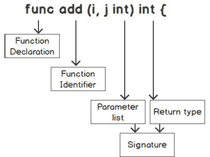
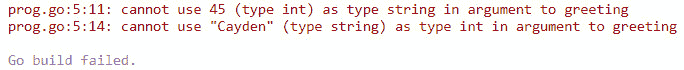
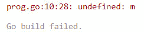
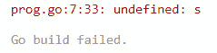
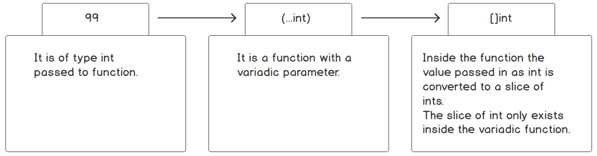
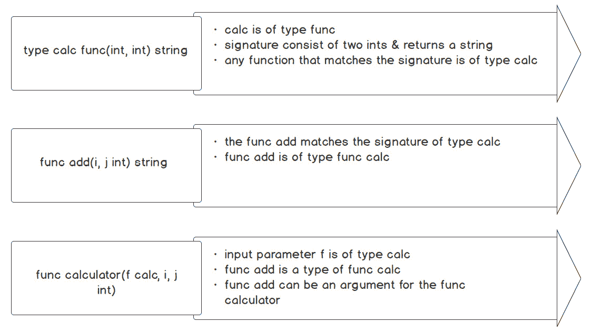
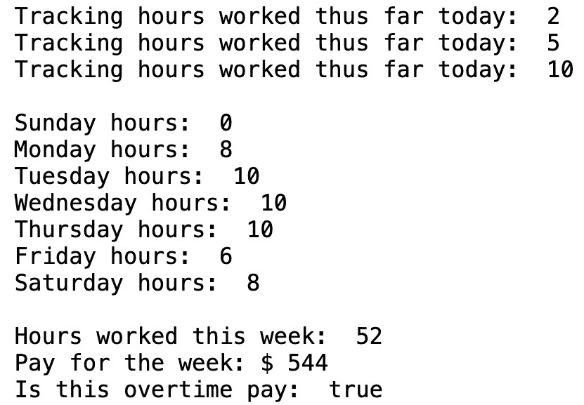

# 函数 – 减少、重用和回收

概述

本章将描述你可以减少、重用和回收代码的各种方法。它将包括对函数的广泛概述，以便你可以包括函数的部分，如定义函数、函数标识符、参数列表、返回类型和函数体。我们还将探讨设计代码时的最佳实践，以便你可以使其可重用和灵活，并使你的功能逻辑小巧且具有目的性。

到本章结束时，你将能够看到 Go 如何使减少、重用和回收代码变得容易。这包括如何描述一个函数以及构成函数的不同部分，以及使用函数评估变量的作用域。你将知道如何创建和调用函数，以及如何利用可变参数函数和匿名函数，并为各种结构创建闭包。你还将了解如何将函数用作参数和返回值，以及如何与函数一起使用`defer`语句。最后，你将了解如何通过在项目中使用多个文件和目录来将类似的功能分离成逻辑部分。

# 技术要求

对于本章，你需要安装 Go 编程语言。本章的代码可以在本书的 GitHub 仓库中找到：[`github.com/PacktPublishing/Go-Programming-From-Beginner-to-Professional-Second-Edition-/tree/main/Chapter05`](https://github.com/PacktPublishing/Go-Programming-From-Beginner-to-Professional-Second-Edition-/tree/main/Chapter05)。

# 简介

以一种易于维护和迭代的方式编写代码的能力是工程师的一项关键技能。这意味着要精心构建代码，使其可以被重用、易于扩展，并且易于他人理解。Go 语言使得保持代码的整洁和可读性变得容易，并且可以将逻辑块分开。编写易于减少、重用和回收的代码的第一种主要方式是通过使用函数。

函数是许多语言的核心部分，Go 语言也不例外。函数是一段被声明以执行任务的代码。Go 函数可以有零个或多个输入和输出。将 Go 与其他编程语言区分开来的一个特性是它支持多个返回值；大多数编程语言都限制为只有一个返回值。这导致了 Go 的灵活性和开发者持续编写可适应代码的能力。

在接下来的部分中，我们将看到 Go 函数的一些与其他语言不同的特性，例如返回多个类型。我们还将看到 Go 支持一等函数。这意味着 Go 可以将变量分配给函数，将函数作为参数传递，以及将函数作为函数的返回类型。我们将展示如何使用函数将复杂部分分解成更小的部分。

Go 语言中的函数被认为是第一类公民和高级函数。第一类公民是将函数分配给变量的函数。高级函数是可以接受函数作为参数的函数。Go 语言函数的丰富特性使它们能够在以下方式中使用在各个部分：

+   将函数作为参数传递给另一个函数

+   将函数作为值从函数返回

+   将函数用作类型

+   将函数用作闭包

+   使用匿名函数

+   将函数分配给变量

我们将逐一查看这些特性，因为它们在 Go 语言中都是支持的。

# 函数

函数是 Go 语言的关键部分，我们应该了解它们的位置。让我们考察一下使用函数的一些原因：

+   **分解复杂任务**：函数用于执行任务，但如果任务很复杂，应该将其分解成更小的任务。函数可以用于解决更大的问题的小任务。较小的任务更容易管理，使用函数解决特定任务将使整个代码库更容易维护。

+   **减少代码**：你应该使用函数的一个好迹象是在你的程序中看到重复的代码。当你有重复的代码时，会增加维护的难度。如果你需要做一次更改，你将需要在多个实例中更改你的代码。

+   **可重用性**：一旦你定义了函数，你就可以重复使用它。它也可以被其他程序员使用。这种函数的共享将减少代码行数并节省时间，因为你不需要重新发明轮子。在设计函数时，我们应该遵循以下几条准则：

    +   **单一职责**：一个函数应该执行一个任务。例如，一个函数不应该同时计算两点之间的距离并估算这两点之间的旅行时间。应该为每个任务创建一个函数。这有助于更好地测试该函数并更容易维护。将函数限制为执行单一任务可能很困难，所以如果你第一次没有做对，不要气馁。即使是经验丰富的程序员在分配函数的职责时也会遇到困难，而且职责可能会随时间而变化。

    +   **体积小**：函数不应该超过数百行代码。这是代码需要重构的迹象。当我们有大型函数时，违反单一职责原则的可能性更大。一个很好的经验法则是尝试将函数大小限制在大约 25 行代码；然而，这并不是一个硬性规定。保持代码简洁的好处是它减少了调试大型函数的复杂性。它还使得编写具有更好代码覆盖率的单元测试更容易。

## 函数的组成部分

让我们看看在定义函数时涉及的不同组件。以下是一个函数的典型布局：



图 5.1：函数的不同部分

这里描述了函数的不同部分：

+   `func`：在 Go 中，函数声明以 `func` 关键字开始。

+   `calculateTax`、`totalSum` 和 `fetchId`。

    标识符应该是描述性的，使代码易于阅读，并使函数的目的易于理解。标识符不是必需的。您可以有一个没有名称的函数；这被称为匿名函数。匿名函数将在本章后面详细讨论。

注意

当函数名的第一个字母是小写时，则该函数不能导出包外。这意味着它是私有的，不能从包外调用。它只能在包内调用。

使用 camelCase 命名约定时请注意这一点。如果您希望函数可导出，函数名的第一个字母必须大写。这意味着如果函数导出并以大写字母开头，其他包可以消费和使用您的函数。

+   `name string`, `age int`) 参数是函数的局部变量。

    参数对于函数是可选的。可能没有参数的函数。一个函数可以有零个或多个参数。

    当两个或多个参数具有相同的类型时，可以使用所谓的简写参数表示法。这消除了为每个参数指定相同类型的需要。例如，如果您的参数是 (`firstName string`, `lastName string`)，它们可以缩短为 (`firstName`, `lastName string`)。这减少了参数输入的冗长性，并增加了函数参数列表的可读性。

+   **返回类型**：返回类型是一系列数据类型，如布尔值、字符串、映射或另一个可以返回的函数。

    在声明函数的上下文中，我们把这些类型称为返回类型。然而，在调用函数的上下文中，它们被称为返回值。

    返回类型是函数的输出。通常，它们是提供给函数的参数的结果。它们是可选的。大多数编程语言返回单个类型；在 Go 中，您可以返回多个类型。

+   `{}`。

    函数中的语句决定了函数做什么。函数代码是用于执行函数被创建来完成的任务的代码。

    如果定义了返回类型，则函数体中需要有一个 `return` 语句。`return` 语句使函数立即停止并返回 `return` 语句之后列出的值类型。返回类型列表中的类型和 `return` 语句中的类型必须匹配。

    在函数体中，可以有多个`return`语句。你经常在出现错误的情况下看到这种情况，你可能需要返回与函数成功处理逻辑不同的值。

+   **函数签名**：尽管它没有在前面的代码片段中列出，但函数签名是一个术语，它指的是输入参数与返回类型的组合。这两个单元共同构成了函数签名。

    通常，当你在其他人使用函数时定义函数签名时，你希望努力不要对其进行更改，因为这可能会对你的代码和别人的代码产生不利影响。

随着我们在本章中继续前进，我们将深入探讨函数的各个部分。通过以下讨论，这些函数部分将更容易理解，随着我们通过本章，它们将变得更加清晰。

# `checkNumbers`函数

现在我们已经查看函数的不同部分，让我们看看这些部分如何与各种示例一起工作。让我们从一个简单的`checkNumbers`函数开始。`checkNumbers`函数根据数字是偶数还是奇数的某些数学结果打印出各种消息。规则根据给定的数字执行以下操作之一：

+   如果数字是`偶数`，打印`Even`

+   如果数字是`奇数`，打印`Odd`

以下是实现此输出的代码片段：

```go
func checkNumbers() {
    for i := 1; i <= 30; i++ {
        if i%2 == 0 {
            fmt.Println("Even")
        } else {
            fmt.Println("Odd")
        }
    }
}
```

让我们分部分查看代码：

```go
func checkNumbers() {
```

+   `func`，如你可能记得，是声明函数的关键字。这通知 Go，接下来的代码块将是一个函数。

+   `checkNumbers`是我们函数的名称。在 Go 中，使用驼峰式名称是惯例（标准做法）。

+   `()`，跟随函数名称的括号是空的：我们当前实现的`checkNumbers`游戏不需要任何输入参数。如果它确实需要输入参数，它们将包含在括号内。

+   参数列表`()`和开括号之间的空格将是返回类型。我们当前的实施不需要返回类型。

+   关于`{`，与你可能知道的其它编程语言不同，Go 要求开括号与函数声明在同一行上。如果你尝试运行程序时开括号不在函数签名同一行上，你会得到一个错误：

    ```go
    for i := 1; i <= 30; i++ {
    ```

    前面的行是一个`for`循环，它将`i`变量从`1`增加到`30`：

    ```go
    if i%2 == 0 {
    ```

注意

`%`是取模运算符；它给出两个被除整数相除的余数。使用我们的函数，如果`i`能被`2`整除，那么它将打印出单词`"Even"`；否则，它将打印“`Odd"`。

随着我们越来越熟悉 Go 的概念和语言语法，代码的解释将排除我们本会多次讨论的项目。

我们现在已经定义了我们的函数。它有一个我们希望它执行的具体任务，但如果我们不执行该函数，那就没有用了。那么，我们如何执行一个函数呢？我们必须调用我们的函数。当我们调用一个函数时，我们是在告诉我们的程序执行该函数。我们将在`main()`函数内部调用我们的函数。

函数可以调用其他函数。当这种情况发生时，控制权交给被调用的函数。在被调用的函数返回数据或达到结束花括号`}`后，控制权返回给调用者。让我们通过一个例子来更好地理解这一点：

```go
func main() {
  fmt.Println("Main is in control")
  checkNumbers()
  fmt.Println("Back to main")
}
```

+   `fmt.Println("main 函数控制中")`：这个`打印`语句是为了演示目的。它显示我们处于`main()`函数中。

+   `checkNumbers()`：我们现在在`main()`函数内部调用函数。尽管我们的函数没有参数，但括号仍然是必需的，程序的控制权交给`checkNumbers()`函数。在`checkNumbers()`函数完成后，控制权随后返回到`main()`函数。

+   `fmt.Println("回到 main")`：这个`打印`语句是为了演示目的，以显示控制权已经返回到`main()`函数。

输出将如下所示：


图 5.2：`checkNumbers`的输出

注意

即使没有输入参数，`checkNumbers`函数后面的括号仍然是必需的。如果省略了它们，Go 编译器将生成一个错误，指出`checkNumbers`被评估但没有使用。这是一个常见的错误。

## 练习 5.01 – 创建一个函数，根据售出的商品数量打印销售人员期望评级

在这个练习中，我们将创建一个没有参数或返回类型的函数。该函数将遍历映射并打印映射上的名称和售出的商品数量。它还将根据销售人员的销售情况打印一条声明。以下步骤将帮助您找到解决方案：

1.  使用您选择的集成开发环境（IDE）。

1.  创建一个新文件，并将其保存为`main.go`。

1.  在`main.go`中输入以下代码。`main`将首先调用的函数是`itemsSold()`；它没有参数，也没有返回值：

    ```go
    package main
    import (
      "fmt"
    )
    func main() {
      itemsSold()
    }
    ```

1.  接下来，我们将定义关于售出商品的逻辑函数：

    ```go
    func itemsSold() {
    ```

1.  在`itemsSold()`函数中，初始化一个将包含`string`到`int`键值对的映射。该映射将保存个人售出的`名称`（`string`）和`商品`数量（`int`）。名称是该映射的键。我们为售出的商品数量分配各种名称：

    ```go
      items := make(map[string]int)
      items["John"] = 41
      items["Celina"] = 109
      items["Micah"] = 24
    ```

1.  我们遍历`items`映射，将`k`分配给`key(名称)`，将`v`分配给`value(商品)`：

    ```go
      for k, v := range items{
    ```

1.  我们打印出`名称`和售出的`商品`数量：

    ```go
        fmt.Printf("%s sold %d items and ", k, v)
    ```

1.  根据变量`v`（`商品`）的值，我们将确定要打印的声明：

    ```go
        if v < 40 {
          fmt.Println("is below expectations.")
        } else if v > 40 && v <= 100 {
          fmt.Println("meets expectations.")
        } else if v > 100 {
          fmt.Println("exceeded expectations.")
        }
      }
    }
    ```

1.  打开您的终端并导航到代码目录。

1.  运行`go build`然后运行可执行文件。

预期的输出如下所示：

```go
John sold 41 items and meets expectations.
Celina sold 109 items and exceeded expectations.
Micah sold 24 items and is below expectations.
```

在这个练习中，我们看到了函数的一些基本部分。我们展示了如何使用`func`关键字声明一个函数，然后是如何给我们的函数一个标识符或名称，例如`itemsSold()`。然后，我们在函数体中添加了代码。在接下来的几节中，我们将扩展函数的核心部分，并学习如何使用参数将数据传递给函数。

注意

最好在 IDE 中输入代码。好处是如果你输入错误，你会看到错误信息，并可以进行一些调试来解决问题。

# 参数

参数定义了可以传递给我们的函数的参数。函数可以有零个或多个参数。尽管 Go 允许我们定义多个参数，但我们应小心不要有一个庞大的参数列表；这会使代码更难阅读。这也可能表明函数正在执行多个特定任务。如果是这样，我们应该重构函数。以下是一个代码片段的例子：

```go
func calculateSalary(lastName string, firstName string, age int, state string, country string, hoursWorked int, hourlyRate, isEmployee bool) {
// code
}
```

上述代码是一个参数列表膨胀的函数示例。参数列表应该只与函数的单个职责相关。我们只应该定义解决函数构建的特定问题所需的参数。

参数是我们函数将用于执行其任务的输入类型。函数参数是局部的，意味着它们只对那个函数可用。它们在函数的上下文之外不可用。此外，参数的顺序必须与正确的参数类型顺序相匹配。

**正确**：

```go
func main() {
  greeting("Cayden", 45)
}
func greeting(name string, age int) {
  fmt.Printf("%s is %d", name, age)
}
```

当正确参数匹配时的输出如下所示：

```go
Cayden is 45
```

**不正确**：

```go
func main() {
  greeting(45,"Cayden")
}
func greeting(name string, age int) {
  fmt.Printf("%s is %d",name, age)
}
```

输出如下所示：



图 5.3：不正确参数匹配的输出

在代码的不正确版本中，我们正在使用`age`参数调用`greeting()`函数，该参数是`integer`类型，而参数是`string`类型。你的参数序列必须与参数输入列表的序列相匹配。

此外，用户可能希望对代码遍历的数据有更多的控制。回到`checkNumbers`示例，当前的实现只做`1`到`30`。用户可能需要处理不同的数字范围，因此我们需要一种方法来决定循环的结束范围。我们可以修改我们的`checkNumbers`函数，使其接受一个输入参数。这将满足用户的需求：

```go
func main() {
  checkNumbers(10)
}
func checkNumbers(end int) {
  for i := 1; i <= end; i++ {
    if i%2 == 0 {
      fmt.Println("Even")
    } else {
      fmt.Println("Odd")
    }
  }
}
```

上述代码片段可以这样解释：

+   在`main()`函数中对于`checkNumbers(10)`，我们将`10`作为参数传递给我们的`checkNumbers`函数

+   对于`checkNumbers(end int)`，`end`是我们参数的名称，它是`int`类型

+   现在，我们的函数将只迭代到我们的结束参数的值；在这个例子中，它将迭代到`10`

## 参数和参数之间的区别

现在是讨论参数和参数之间区别的好时机。当你定义你的函数时，使用我们的例子，`checkNumbers(end int)` 被称为参数。当你调用一个函数，例如 `checkNumbers(10)`，`10` 被称为参数。此外，参数和参数的名称不需要匹配。

Go 中的函数也可以定义多个参数。我们需要给 `checkNumbers` 函数添加另一个参数以适应这个增强：

```go
func main() {
  start:= 10
  end:= 20
  checkNumbers(start, end)
}
func checkNumbers(start int, end int) {
  for i := start; i <= end; i++ {
    // code omitted for brevity
  }
}
```

前面的代码片段可以这样解释：

+   关于 `checkNumbers(start, end)`，我们现在向 `checkNumbers` 函数传递两个参数。当有多个参数时，它们必须通过逗号分隔。

+   关于 `func checkNumbers(start int, end int)`，当在函数中定义多个参数时，它们通过逗号分隔，遵循名称类型、名称类型、名称类型等约定。

我们的 `checkNumbers` 参数比必要的更详细。当我们有多个相同类型的输入参数时，我们可以通过逗号后跟类型来分隔输入名称。这被称为简写参数符号。请参见以下使用简写参数符号的示例：

```go
func main() {
  start, end := 10,20
  checkNumbers(start, end)
}
func checkNumbers(start, end int) {
  // code…
}
```

前面的代码片段可以这样解释：

+   使用简写参数符号时，调用者没有变化。

+   关于 `checkNumbers(start, end int)`，`start` 和 `end` 是 `int` 类型。为了适应简写参数符号，函数体内的内容不需要做任何改变。

## 练习 5.02 – 将索引值映射到列标题

我们将要创建的函数将从一个 CSV 文件中获取列标题的切片。它将打印出我们感兴趣的标题的索引值映射：

1.  打开您选择的 IDE。

1.  创建一个新文件，并将其保存为 `main.go`。

1.  在 `main.go` 中输入以下代码：

    ```go
    package main
    import (
      "fmt"
      "strings"
    )
    func main() {
      hdr :=[]string{"empid", "employee", "address", "hours worked", "hourly rate", "manager"}
      csvHdrCol(hdr)
      hdr2 :=[]string{"employee", "empid", "hours worked", "address", "manager", "hourly rate"}
      csvHdrCol(hdr2)
    }
    func csvHdrCol(header []string) {
            csvHeadersToColumnIndex:= make(map[int]string)
    ```

    首先，我们给一个 `int` 和 `string` 的键值对分配一个变量。`key(int)` 将是我们的 `header(string)` 列的索引。索引将映射到列标题。

1.  我们遍历 `header` 来处理切片中的每个字符串。在下面的 `for` 循环中，`i` 将存储索引，`v` 将被分配给标题中的每个值：

    ```go
    for i, v := range header {
    ```

1.  对于每个字符串，删除字符串前后任何多余的空格。一般来说，我们应该始终假设我们的数据可能包含一些错误字符：

    ```go
    v = strings.TrimSpace(v)
    ```

1.  在我们的 `switch` 语句中，我们将所有的大小写转换为精确匹配。如您所回忆的，Go 是一个区分大小写的语言。我们需要确保匹配时大小写相同。当我们的代码找到标题时，它将在映射中设置标题的索引值：

    ```go
                    switch strings.ToLower(v) {
                    case "employee":
                            csvHeadersToColumnIndex[i] = v
                    case "hours worked":
                            csvHeadersToColumnIndex[i] = v
                    case "hourly rate":
                            csvHeadersToColumnIndex[i] = v
          }
      }
    ```

1.  通常，我们不会打印出结果。我们应该返回 `csvHeadersToColumnIndex`，但由于我们还没有讲解如何返回值，我们现在将其打印出来：

    ```go
           fmt.Println(csvHeadersToColumnIndex)
    }
    ```

1.  打开您的终端并导航到代码目录。

1.  运行 `go build` 并运行可执行文件。

预期的输出如下：

```go
Map[1:employee 3:hours worked 4: hourly rate]
Map[0:employee 2:hours worked 5: hourly rate]
```

在这个练习中，我们看到了如何将数据传入函数：通过为我们的函数定义一个参数。我们的函数调用者能够将参数传递给函数。我们将继续发现 Go 中函数可以提供的各种能力。到目前为止，我们已经看到了如何将数据传入我们的函数。在下一节中，我们将看到如何从我们的函数中获取数据。

## 函数变量作用域

在设计函数时，我们需要考虑变量作用域。变量的作用域决定了变量在应用程序的不同部分中可访问或可见的位置。在函数内部声明的变量被认为是局部变量。这意味着它们只能被函数体内的代码访问。你不能从函数外部访问变量。调用函数无法访问被调用函数内部的变量。输入参数的作用域与函数的局部变量作用域相同。

在调用函数中声明的变量具有该函数的作用域。这意味着变量是函数内的局部变量，并且这些变量在函数外部不可访问。我们的函数无法访问调用函数的变量。要访问这些变量，它们必须作为输入参数传递给我们的函数：

```go
func main() {
  m:= "Uncle Bob"
  greeting()
}
func greeting() {
  fmt.Printf("Greeting %s", m)
}
```

这里是输出结果：



图 5.4：m 变量未定义时的错误输出

之前的代码片段将在 `func greeting()` 中导致错误，指出 `m` 未定义。这是因为 `m` 变量是在 `main()` 中声明的。`greeting()` 函数无法访问 `m` 变量。为了访问它，必须将 `m` 变量作为输入参数传递给 `greeting()` 函数：

```go
func main() {
  m:= "Uncle Bob"
  greeting(m)
  fmt.Printf("Hi from main: %s", s)
}
func greeting(name string) {
  fmt.Printf("Greeting %s", name)
  s := "Slacker"
  fmt.Printf("Greeting %s", s)
}
```

这里是输出结果：



图 5.5：s 变量未定义时的错误输出

之前的代码片段将在 `func main()` 中导致错误，错误将指出 `s` 未定义。这是因为 `s` 变量是在 `greeting()` 函数中声明的。`main()` 函数无法访问 `s` 变量。`s` 变量仅在 `greeting()` 函数体内部的代码中可见。

这些只是我们在声明和访问变量时需要考虑的一些注意事项。理解函数内部变量与函数外部声明的变量作用域之间的关系非常重要。当你试图访问变量但未处于你试图访问的上下文作用域时，可能会造成一些混淆。本章中的示例应该有助于你理解变量的作用域。

## 返回值

到目前为止，我们创建的函数都没有任何返回值。函数通常接受输入，对这些输入执行一些操作，然后返回这些操作的结果。某些编程语言的函数只返回一个值。Go 允许你从函数中返回多个值。这是 Go 函数的一个特性，使其与其他编程语言区分开来。

## 练习 5.03 – 创建带有返回值的`checkNumbers`函数

在这个练习中，我们将对我们的`checkNumbers`函数进行一些改进。我们将将其修改为只接受一个整数。我们将把是否进行循环的责任留给调用者，如果他们希望这样做。此外，我们将有两个返回值。第一个将是提供的数字和相应的文本，指示该数字是`Even`还是`Odd`。以下步骤将帮助你找到解决方案：

1.  打开你选择的 IDE。

1.  在不同的目录中创建一个新的文件，并将其保存为`main.go`。

1.  在`main()`函数中，将变量分配给我们的函数的返回值。`n`和`s`变量对应于从我们的函数返回的值，分别是`int`和`string`：

    ```go
    func main() {
      for i := 0; i <= 15; i++ {
        num, result := checkNumbers(i)
        fmt.Printf("Results:  %d %s\n", num, result)
      }
    }
    ```

1.  现在`checkNumbers`函数返回两个值；第一个是一个`int`值，后面跟着一个`string`值：

    ```go
    func checkNumbers(i int) (int, string) {
      switch {
    ```

1.  通过用`switch`语句替换`if{}else{}`语句来简化`if{}else{}`语句。当你编写代码时，你应该寻找简化事物和使代码更易读的方法。`case i%2 ==0`与我们之前的`if i%2 == 0`语句等价。我们不再使用之前的`fmt.Println()`语句，而是用`return`替换它们。`return`语句将立即停止函数的执行，并将结果返回给调用者：

    ```go
        case i%2 == 0:
          return i, "Even"
        default:
          return i, "Odd"
      }
    }
    ```

    预期的输出如下：


图 5.6：带有返回值的`checkNumbers`函数的输出

在这个练习中，我们看到了如何从一个函数中返回多个值。我们能够将变量分配给函数的多个返回值。我们还注意到分配给函数的变量与返回值的顺序相匹配。在下一节中，我们将了解到在函数体中，我们可以执行裸返回，在这种情况下，我们不需要在我们的返回语句中指定要返回的变量。

我们还看到了一个用于清理`if{}else{}`逻辑的`switch`语句。我们有一个偶数的`case`，还有一个`default`“通配”`case`，其中奇数会落入。`default``case`正如其名，如果它之前没有`case`，它将是默认`case`。

## 活动 5.01 – 计算员工的工作时间

在这个活动中，我们将创建一个函数来计算员工一周的工作小时数。然后，我们将使用这个函数来计算应支付的工资金额。`developer`结构体有一个名为`Individual`的字段，其类型为`Employee`。`developer`结构体跟踪他们收取的`HourlyRate`值以及他们每天工作的小时数。以下步骤将帮助你找到解决方案：

1.  创建一个具有以下字段的`Employee`类型：`Id`为`int`，`FirstName`为`string`，`LastName`为`string`。

1.  创建一个`developer`类型，它有以下字段：`Individual`为`Employee`，`HourlyRate`为`int`，`WorkWeek`为`[7]int`。

1.  创建一个表示一周七天的`enum`类型（枚举是只包含有限个固定值的类型）。这将是一个`Weekday` `int`类型，并为每周的每一天声明一个常量。

1.  为`Developer`类型创建一个名为`LogHours`的指针接收器方法，该方法将接受`WeekDay`类型和`int`类型作为输入。将当天工作的小时数分配给`Developer`的工作周切片。

1.  创建一个名为`HoursWorked()`的方法，该方法是一个指针接收器。这个方法将返回已经工作的总小时数。

1.  在`main()`函数中，初始化并创建一个`Developer`类型的变量。

1.  在`LogHours`方法中，调用两天的方法（例如星期一和星期二）。

1.  打印上一步骤中两天的小时数。

1.  接下来，打印`HoursWorked`方法的结果。

以下为预期的输出：

```go
Hours worked on Monday:  8
Hours worked on Tuesday:  10
Hours worked this week:  18
```

注意

这个活动的解决方案可以在本章节的 GitHub 仓库文件夹中找到：[`github.com/PacktPublishing/Go-Programming-From-Beginner-to-Professional-Second-Edition-/tree/main/Chapter05/Activity05.01`](https://github.com/PacktPublishing/Go-Programming-From-Beginner-to-Professional-Second-Edition-/tree/main/Chapter05/Activity05.01)

这个活动的目的是展示将问题分解为可管理的任务以供函数实现的能力，使得我们的每个函数都有一个单一的责任。`LogHours`负责分配每天的工作小时数。`HoursWorked`使用在`LogHours`中分配的值来显示每天的工作小时数。我们使用函数的返回类型来显示数据。这个练习展示了正确利用函数来解决问题。

# 裸返回

注意

有返回值的函数必须在函数的最后一个语句处有一个返回语句。如果你省略了返回语句，Go 编译器会给出一个错误，指出“函数末尾缺少返回语句。”

通常情况下，当一个函数返回两种类型时，第二种类型是`error`。我们还没有讲解错误，所以不会在这些示例中演示它们。了解在 Go 语言中，第二种返回类型通常是`error`类型是很重要的。

Go 也允许你忽略返回的变量。例如，假设我们对从`checkNumbers`函数返回的`int`值不感兴趣。在 Go 中，我们可以使用所谓的空白标识符，这允许我们在赋值时忽略值：

```go
_, err := file.Read(bytes)
```

例如，在读取文件时，我们可能不会关心读取的字节数。因此，在这种情况下，我们可以使用空白标识符`_`来忽略返回的值。当从函数返回额外数据，而这些数据对我们的程序没有任何必要信息时，例如读取文件，忽略返回值是一个很好的选择：

注意

你会发现，许多函数将错误作为第二个返回值返回。你不应该忽略错误函数的返回值。忽略函数返回的错误可能会导致意外的行为。错误返回值应该得到适当的处理。

```go
func main() {
  for i := 0; i <= 15; i++ {
    _, result := checkNumbers(i)
    fmt.Printf("Results: %s\n", result)
  }
}
```

在前面的例子中，我们使用了空白标识符`_`来忽略返回的`int`值：

```go
    _, result := checkNumbers(i)
```

在从函数赋值时，你必须始终为返回的值提供一个占位符。在进行赋值时，占位符的数量必须与函数返回值的数量相匹配。`_`和`result`是`int`和`string`返回值的占位符。

Go 还有一个允许你命名返回值的功能。如果你使用这个功能，它可以使你的代码更易于阅读，以及自我文档化。如果你为返回变量命名，它们将受到与上一节中讨论的局部变量相同的约束。通过命名返回值，你正在在函数中创建局部变量。然后你可以像处理输入参数一样为这些返回变量赋值：

```go
func greeting() (name string, age int) {
  name = "John"
  age = 21
  return name, age
}
```

在前面的代码中，`(name string, age int)`是命名返回。现在它们是函数的局部变量。

由于`name`和`age`是在函数返回列表中声明的局部变量，你现在可以给它们赋值。它们可以被视为局部变量。在`return`语句中，指定返回值。如果你没有在返回中指定变量名，它被称为*裸返回*：

```go
func greeting() (name string, age int) {
  name = "John"
  age = 21
  return
}
```

考虑前面的代码块。这段代码与之前相同，只是返回值没有命名变量。`return`语句将返回返回列表中命名的变量。

裸返回的一个缺点是它可能在阅读代码时引起混淆。为了避免混淆和其他可能的问题，建议避免使用裸返回功能，因为它可能会使跟踪要返回的变量变得困难。使用裸返回也可能存在阴影问题：

```go
func message() (message string, err error) {
  message = "hi"
  if message == "hi"{
    err := fmt.Errorf("say bye\n")
    return
  }
  return
}
```

上一段代码将导致以下错误：


图 5.7：裸返回的阴影输出

这是因为 `err` 变量在 `return` 语句中被命名，并在 `if` 语句中初始化。回想一下，在花括号内初始化的变量，如 `for` 循环、`if` 语句和 `switch` 语句，其作用域仅限于该上下文，这意味着它们只在前面的花括号内可见和可访问。

## 练习 5.04 – 将 CSV 索引映射到列标题并返回值

在 *练习 5.02 – 将索引值映射到列标题* 中，我们只打印了索引到列标题的结果。在这个练习中，我们将返回映射作为结果。返回的映射是索引到列标题的映射。以下步骤将帮助您找到解决方案：

1.  打开您选择的 IDE。

1.  打开之前列标题练习中的文件 `main.go`。

1.  在 `main.go` 文件中输入以下代码：

    ```go
    package main
    import (
      "fmt"
      "strings"
    )
    ```

1.  接下来，在 `main()` 函数中，定义列的标题。首先，我们将一个变量分配给 `int` 和 `string` 的键值对。`key(int)` 将是我们的 `header(string)` 列的索引。索引将映射到列标题：

    ```go
    func main() {
      hdr := []string{"empid", "employee", "address", "hours worked", "hourly rate", "manager"}
      result := csvHdrCol(hdr)
      fmt.Println("Result: ")
      fmt.Println(result)
      fmt.Println()
      hdr2 := []string{"employee", "empid", "hours worked", "address", "manager", "hourly rate"}
      result2 := csvHdrCol(hdr2)
      fmt.Println("Result2: ")
      fmt.Println(result2)
      fmt.Println()
    }
    func csvHdrCol(hdr []string) map[int]string {
      csvIdxToCol := make(map[int]string)
    ```

1.  我们使用 `range` 操作符遍历 `header` 来处理切片中的每个字符串：

    ```go
    for i, v := range hdr {
    ```

1.  对于每个字符串，我们移除了字符串前后任何多余的空格。一般来说，我们应该始终假设我们的数据可能包含一些错误字符：

    ```go
    v = strings.TrimSpace(v)
    ```

1.  在我们的 `switch` 语句中，我们将所有匹配项的字母大小写转换为小写。如您所回忆的，Go 是一个区分大小写的语言。我们需要确保匹配时的大小写相同。当我们的代码找到标题时，它将在映射中设置标题的索引值：

    ```go
    switch strings.ToLower(v) {
        case "employee":
          csvIdxToCol[i] = v
        case "hours worked":
          csvIdxToCol[i] = v
        case "hourly rate":
          csvIdxToCol[i] = v
        }
      }
      return csvIdxToCol
    }
    ```

1.  打开终端并导航到代码目录。

1.  运行 `go build` 并运行可执行文件。

返回值的预期输出如下：

```go
Result1:
Map[1:employee 3:hours worked 4: hourly rate]
Result2:
Map[0:employee 2:hours worked 5: hourly rate]
```

在这个练习中，我们看到了一个将 CSV 索引映射到列标题的实际例子。我们使用一个函数来解决这个复杂的问题。我们能够使函数返回一个 `map` 类型的单一值。在下一节中，我们将看到函数如何接受单个参数内的可变数量参数值。

## 可变参数函数

可变参数函数是一种接受可变数量参数值的函数。当指定类型的参数数量未知时，使用可变参数函数是很好的选择：

```go
func f(parameterName …Type)
```

前面的函数是一个可变参数函数的例子。类型前面的三个点 (`…`) 被称为 *打包操作符*。打包操作符使得它成为一个可变参数函数。它告诉 Go 将 `Type` 类型的所有参数存储在 `parameterName` 中。可变参数变量可以接受零个或多个变量作为参数：

```go
func main() {
  nums(99, 100)
  nums(200)
  nums()
}
func nums(i ...int) {
  fmt.Println(i)
}
```

`nums` 函数是一个接受 `int` 类型的可变函数。如前所述，你可以传递零个或多个该类型的参数。如果有多个值，你用逗号将它们分开，例如 `nums(99, 100)`。如果只有一个参数要传递，你只需传递那个参数，例如 `nums(200)`。如果没有参数要传递，你可以将其留空，例如 `nums()`。

可变函数可以有其他参数。然而，如果你的函数需要多个参数，可变参数必须是函数中的最后一个。此外，每个函数只能有一个可变变量。以下函数是不正确的，并且会在编译时出错，因为可变变量不是函数的最后一个参数。

**错误函数**：

```go
package main
import "fmt"
func main() {
  nums(99, 100, "James")
}
func nums(i ...int, str person) {
  fmt.Println(str)
  fmt.Println(i)
}
```

预期的输出如下：


图 5.8：可变语法错误输出

**正确函数**：

```go
package main
import "fmt"
func main() {
  nums("James", 99, 100)
}
func nums(str string, i ...int) {
  fmt.Println(str)
  fmt.Println(i)
}
```

输出将如下所示：

```go
James
[99 100]
```

到现在为止，你可能已经猜到了函数内部 `Type` 的实际类型是一个切片。该函数接收传入的参数并将它们转换为指定的新的切片。例如，如果可变类型是 `int`，那么一旦你进入函数，Go 会将那个可变 `int` 类型转换为整数的切片：



图 5.9：将可变整型转换为整数切片

让我们通过让 `variadic` 函数接受整数值来调整这个示例：

```go
package main
import "fmt"
func main() {
  nums(99, 100)
}
func nums(i ...int) {
  fmt.Println(i)
  fmt.Printf("%T\n", i)
  fmt.Printf("Len: %d\n", len(i))
  fmt.Printf("Cap: %d\n", cap(i))
}
```

可变函数的输出如下：

```go
[99 100]
[] int
Len: 2
Cap: 2
```

`nums()` 函数显示 `i` 的可变类型是一个整数的切片。一旦进入函数，`i` 将会是一个整数的切片。可变类型具有长度和容量，这对于切片来说是预期的。在下面的代码片段中，我们将尝试将一个整数的切片传递给一个可变函数 `nums()`：

```go
package main
import "fmt"
func main() {
  i := []int{ 5, 10, 15}
  nums(i)
}
func nums(i ...int) {
  fmt.Println(i)
}
```

预期的输出如下：


图 5.10：可变函数错误

为什么这个代码片段不起作用？我们刚刚证明了函数内部的可变变量是 `slice` 类型。原因是该函数期望一个 `int` 类型的参数列表被转换成一个切片。可变函数通过将传入的参数转换成指定类型的切片来工作。然而，Go 有一种将切片传递给可变函数的机制。为此，我们需要使用解包操作符；它是三个点（`…`）。当你调用一个可变函数，并且你想将一个切片作为参数传递给可变参数时，你需要在变量前放置三个点：

```go
func main() {
  i := []int{ 5, 10, 15}
  nums(i…)
}
func nums(i ...int) {
  fmt.Println(i)
}
```

这个函数版本与上一个版本的区别在于调用函数的代码，`nums` 函数。放在 `i` 变量后面的三个点是整数的切片。这允许将切片传递给可变函数。

## 练习 5.05 – 求和数字

在这个练习中，我们将对可变数量的参数进行求和。我们将以参数列表和切片的形式传递参数。返回值将是 `int` 类型——即我们传递给函数的所有值的总和。以下步骤将帮助您找到解决方案：

1.  打开您选择的集成开发环境（IDE）。

1.  在新目录中创建一个新文件，并将其保存为 `main.go`。

1.  在 `main.go` 文件中输入以下代码：

    ```go
    package main
    import (
      "fmt"
    )
    func main() {
      i := []int{ 5, 10, 15}
      fmt.Println(sum(5, 4))
      fmt.Println(sum(i...))
    }
    ```

1.  `sum` 函数接受一个可变数量的 `int` 类型参数。由于它被转换成了一个切片，我们可以遍历这些值并返回所有传入值的总和：

    ```go
    func sum(nums ...int) int {
      total := 0
      for _, num := range nums {
        total += num
      }
      return total
    }
    ```

1.  打开终端并导航到代码目录。

1.  运行 `go build` 并运行可执行文件。

求和数字的预期输出如下：

```go
9
30
```

在这个练习中，我们看到了通过使用可变参数，我们可以接受未知数量的参数。我们的函数允许我们求和任意数量的整数。我们可以看到，可变参数可以用于解决特定问题，其中作为参数传递的相同类型值的数量是未知的。在下一节中，我们将探讨如何创建一个没有名称的函数并将函数赋给一个变量。

## 匿名函数

到目前为止，我们一直在使用命名函数。如您所回忆的，命名函数是有标识符或函数名的函数。匿名函数，也称为函数字面量，是没有函数名的函数，因此得名“匿名函数”。匿名函数的声明方式与命名函数的声明方式类似。唯一的不同之处在于声明中省略了函数名。匿名函数可以执行 Go 中普通函数所能做的任何事情，包括接受参数和返回值。匿名函数也可以在另一个函数内部声明。

在本节中，我们将介绍匿名函数的基本原理及其一些基本用法。稍后，您将看到如何充分利用匿名函数。匿名函数用于（并与）以下：

+   闭包实现

+   `defer` 语句

+   定义一个用于与 goroutine 一起使用的代码块

+   定义一个一次性使用的函数

+   将一个函数传递给另一个函数

    以下是一个匿名函数的基本声明：

    ```go
    func main() {
      func() {
        fmt.Println("Greeting")
      }()
    }
    ```

让我们更仔细地看看：

+   注意，我们是在另一个函数内部声明一个函数。与命名函数一样，您必须以 `func` 关键字开始声明函数。

+   在 `func` 关键字之后通常会跟函数名，但匿名函数没有函数名。相反，是空括号。

+   在 `func` 关键字之后的空括号是定义函数参数的地方。

+   接下来是开括号 `{`，它标志着函数体的开始。

+   函数体只有一行；它将打印 “`Greeting`”。

+   结束的圆括号 `}` 表示函数的结束。

+   最后的一组括号称为执行括号。这些括号调用匿名函数。函数将立即执行。稍后，我们将看到如何在函数内的其他位置执行匿名函数。

    您也可以向匿名函数传递参数。要能够向匿名函数传递参数，它们必须在执行括号中提供：

    ```go
    func main() {
      message := "Greeting"
      func(str string) {
        fmt.Println(str)
      }(message)
    }
    ```

这里，我们有以下内容：

+   `func (str string)`: 正在声明的匿名函数有一个 `string` 类型的输入参数。

+   `} (message)`: 正在被传递到执行括号中的参数消息。

我们一直像声明时那样执行匿名函数，但还有其他执行匿名函数的方法。您还可以将匿名函数保存到变量中。这导致了一系列不同的机会，我们将在本章中探讨：

```go
func main() {
  f := func() {
    fmt.Println("Executing an anonymous function using a variable")
  }
  fmt.Println("Line after anonymous function declaration")
  f()
}
```

让我们更仔细地看看：

+   我们正在将 `f` 变量分配给我们的匿名函数。

+   `f` 现在是 `func()` 类型。

+   `f` 现在可以用来调用匿名函数，方式与命名函数类似。在 `f` 变量后必须包含 `()` 来执行函数。

## 练习 5.06 – 创建一个计算数字平方根的匿名函数

匿名函数非常适合执行函数内的小段代码。在这里，我们将创建一个匿名函数，该函数将接受一个参数。然后它将计算平方根。以下步骤将帮助您找到解决方案：

1.  使用您选择的 IDE。

1.  创建一个新文件并将其保存为 `main.go`。

1.  在 `main.go` 中输入以下代码。我们将我们的 `x` 变量分配给我们的匿名函数。我们的匿名函数接受一个参数 `(i int)`。它还返回一个 `int` 类型的值：

    ```go
    package main
    import (
      "fmt"
    )
    func main() {
      j := 9
      x := func(i int) int {
        return i * i
      }
    ```

1.  注意到最后的大括号没有 `()` 来执行函数。我们使用 `x(j)` 调用我们的匿名函数：

    ```go
      fmt.Printf("The square of %d is %d\n", j, x(j))
    }
    ```

1.  打开终端并导航到代码目录。

1.  运行 `go build` 并运行可执行文件。

预期输出如下：

```go
The square of 9 is 81
```

在这个练习中，我们看到了如何将变量分配给函数，然后通过分配给它的变量调用该函数。我们看到，当我们需要一个可能不在程序中可重用的简单函数时，我们可以创建一个匿名函数并将其分配给一个变量。在下一节中，我们将扩展匿名函数的使用到闭包。

# 闭包

到目前为止，我们已经通过一些基本示例介绍了匿名函数的语法。现在，我们对匿名函数的工作原理有了基本的理解，我们将探讨如何使用这个强大的概念。

闭包是一种匿名函数的形式。常规函数不能引用自身之外的变量；然而，匿名函数可以引用其定义之外的变量。闭包可以使用与匿名函数声明同一级别的变量。这些变量不需要作为参数传递。当匿名函数被调用时，它可以访问这些变量：

```go
func main() {
  i := 0
  incrementor := func() int {
    i +=1
    return i
  }
  fmt.Println(incrementor())
  fmt.Println(incrementor())
  i +=10
  fmt.Println(incrementor())
}
```

**代码摘要**:

1.  在`main()`函数中初始化一个名为`i`的变量并将其设置为`0`。

1.  我们将`incrementor`赋值给我们的匿名函数。

1.  匿名函数增加`i`的值并返回它。请注意，我们的函数没有任何输入参数。

1.  然后，我们两次打印`incrementor`的结果，得到`1`和`2`。

1.  注意，在我们的函数外部，我们通过`i`增加`10`。这是一个问题。我们希望`i`是隔离的，并且它不应该改变，因为这不是我们想要的行为。当我们再次打印`incrementor`的结果时，它将是`12`。我们希望它是`3`。我们将在下一个示例中纠正这个问题。

我们注意到上一个示例中的一个问题是，主函数中的任何代码都可以访问`i`。正如我们在示例中看到的，`i`可以在函数外部被访问和更改。这不是我们想要的行为；我们希望递增器是唯一可以更改该值的函数。换句话说，我们希望`i`被保护，防止其他函数更改它。唯一应该更改的是当我们调用它时我们的匿名函数：

```go
func main() {
  increment := incrementor()
  fmt.Println(increment())
  fmt.Println(increment())
}
func incrementor() func() int {
  i := 0
  return func() int {
    i += 1
    return i
  }
}
```

**代码摘要**:

1.  我们声明了一个名为`incrementor()`的函数。此函数的返回类型为`func() int`。

1.  使用`i := 0`，我们在`incrementor()`函数级别初始化我们的变量；这与我们在上一个示例中所做类似，只是它是在`main()`函数级别，任何人都可以访问`i`。只有`incrementor()`函数可以访问这个实现中的`i`变量。

1.  我们返回我们的匿名函数`func() int`，该函数增加`i`变量。

1.  在`main()`函数中，`increment := incrementor()`将一个变量赋值给返回`func() int`类型的`func()`。重要的是要注意，在这里`incrementor()`只执行一次。在我们的`main()`函数中，它不再被引用或执行。

1.  `increment()`是`func() int`类型。每次调用`increment()`都会运行匿名函数代码。它引用了`i`变量，即使`incrementor()`已经执行完毕。

之前的示例演示了我们可以通过将匿名函数包装起来来保护我们的变量，从而仅通过调用匿名函数本身来限制对更新变量的访问。这通过预期的输出显示，我们已将`i`增加了两次，如下所示：

```go
1
2
```

## 练习 5.07 – 创建一个用于递减计数器的闭包函数

在这个练习中，我们将创建一个从给定起始值递减的闭包。我们将结合我们关于将参数传递给匿名函数的知识，并使用这些知识来使用闭包。以下步骤将帮助您找到解决方案：

1.  打开您选择的 IDE。

1.  在新目录中创建一个新文件，并将其保存为 `main.go`。

1.  在 `main.go` 中输入以下代码：

    ```go
    func main() {import "fmt"
      counter := 4
    ```

1.  我们首先将查看 `decrement` 函数。它接受一个 `int` 类型的参数，并有一个返回值为 `func()int` 的值。在先前的例子中，变量是在函数内部声明的，但在匿名函数之前。在这个练习中，我们将其作为输入参数：

    ```go
    x:= decrement(counter)
      fmt.Println(x())
      fmt.Println(x())
      fmt.Println(x())
      fmt.Println(x())
    }
    ```

1.  我们在匿名函数内部将 `i` 减去一：

    ```go
    func decrement(i int) func() int {
    ```

1.  在 `main()` 函数中，我们初始化一个名为 `counter` 的变量，用作要递减的起始整数：

    ```go
    return func() int {
    ```

1.  这里，我们有 `x:= decrement(counter)`；`x` 被分配为 `func() int`。每次调用 `x()` 都会运行匿名函数：

    ```go
        I–-
        return i
      }
    }
    ```

1.  打开终端并导航到代码目录。

1.  运行 `go build` 并运行可执行文件。

`decrement` 计数器的预期输出如下：

```go
3
2
1
0
```

在这个练习中，我们看到了闭包可以访问它们外部变量的情况。这使得我们的匿名函数能够对正常函数无法修改的变量进行修改。在下一节中，我们将探讨函数如何作为参数传递给另一个函数。

## 函数类型

如我们所见，Go 对函数有丰富的功能支持。在 Go 中，函数也是类型，就像 `int`、`string` 和 `bool` 是类型一样。这意味着我们可以将函数作为参数传递给其他函数，函数可以从函数中返回，函数可以被分配给变量。我们甚至可以定义自己的函数类型。函数的类型签名定义了其输入参数和返回值的类型。为了使一个函数成为另一个函数的类型，它必须具有声明类型 `func` 的确切签名。让我们检查一些函数类型：

```go
type message func()
```

上述代码片段创建了一个名为 `message` 的新函数类型。它没有输入参数，也没有任何返回类型。

让我们再检查一个例子：

```go
type calc func(int, int) string
```

上述代码片段创建了一个名为 `calc` 的新函数类型。它接受两个 `int` 类型的参数，其返回值是 `string` 类型。

现在我们已经对函数类型有了基本理解，我们可以编写一些代码来演示它们的用法：

```go
package main
import (
  "fmt"
)
type calc func(int, int) string
func main() {
  calculator(add, 5, 6)
}
func add(i, j int) string {
  result := i + j
  return fmt.Sprintf("Added %d + %d = %d", i, j, result)
}
func calculator(f calc, i, j int) {
  fmt.Println(f(i, j))
}
```

让我们逐行查看代码：

```go
type calc func(int, int) string
```

`type calc` 声明 `calc` 为 `func` 类型，确定它接受两个整数作为参数并返回一个字符串：

```go
func add(i, j int) string {
  result := i + j
  return fmt.Sprintf("Added %d + %d = %d", i, j, result)
}
```

`func add(i,j int) string` 与 `calc` 类型具有相同的签名。它接受两个整数作为参数，并返回一个字符串，表示“`i + j = result`”。函数可以像 Go 中的任何其他类型一样传递给其他函数：

```go
func calculator(f calc, i, j int) {
  fmt.Println(f(i, j))
}
```

`func calculator(f calc, i, j int)` 接受 `calc` 作为输入。你可能记得，`calc` 类型是一个具有 `int` 输入参数和 `string` 返回类型的函数类型。任何匹配该签名的都可以传递给该函数。`func calculator` 函数返回 `calc` 类型函数的结果。

在 `main` 函数中，我们调用 `calculator(add, 5, 6)`。我们传递给它 `add` 函数。`add` 满足 `calc` `func` 类型的签名。

*图 5.11* 总结了前面每个函数及其相互关系。此图显示了 `func add` 是 `func calc` 类型，这允许它作为参数传递给 `func calculator`：



图 5.11：函数类型和用途

我们刚刚看到了如何创建一个函数类型并将其作为参数传递给函数。将函数作为参数传递给另一个函数并不是那么遥远。我们将稍微修改之前的例子，以反映将函数作为参数传递：

```go
func main() {
  calculator(add, 5, 6)
  calculator(subtract, 10, 5)
}
func calculator(f func(int, int) int, i, j int) {
  fmt.Println(f(i, j))
}
func add(i, j int) int {
  return i + j
}
func subtract(i, j int) int {
  return i - j
}
```

让我们更仔细地看看：

+   我们修改了 `add` 函数签名，使其返回 `int` 类型而不是 `string` 类型。

+   我们添加了一个名为 `subtract` 的第二个函数。请注意，它的函数签名与 `add` 函数相同。`subtract` 函数简单地返回两个数字相减的结果：

    ```go
    func calculator(f func(int, int) int, i, j int) {
      fmt.Println(f(i, j))
    }
    ```

+   这里，我们有 `calculator(f func(int, int) int, i, j int)`。现在 `calculator` 函数有一个 `func` 类型的输入参数。输入参数 `f` 是一个接受两个整数并返回 `int` 类型的函数。任何满足该签名的函数都可以传递给该函数。

+   在 `main()` 函数中，`calculator` 被调用了两次：一次是用 `add` 函数和一些整数值传递，另一次是用 `subtract` 函数作为参数传递，并带有一些整数值。

预期输出如下：

```go
11
5
```

将函数作为类型传递的能力是一个强大的功能，其中你可以将函数传递给其他函数，如果它们的签名与传递给函数的输入参数匹配。如果是一个整数类型，函数可以传递任何值。对于传递函数也是如此：如果类型正确，函数可以是任何值。

函数也可以从另一个函数中返回。我们在使用匿名函数与闭包结合时看到了这一点。在这里，我们将简要地看一下，因为我们之前已经看到了这个语法：

```go
package main
import "fmt"
func main() {
  v:= square(9)
  fmt.Println(v())
  fmt.Printf("Type of v: %T",v)
}
func square(x int) func() int {
  f := func() int {
    return x * x
  }
  return f
}
```

返回函数看起来如下：

```go
81
Type of v: func() int
```

+   这里，我们有 `square(x int) func() int`。`square` 函数接受一个 `int` 类型的参数，并返回一个返回 `int` 类型的函数类型：

    ```go
    func square(x int) func() int {
      f := func() int {
        return x * x
      }
      return f
    }
    ```

+   在 `square` 函数体中，我们将变量 `f` 赋值为一个匿名函数，该函数返回输入参数 `x` 的平方值。

+   `square` 函数的 `return` 语句返回一个匿名函数，该函数是 `func()` `int` 类型。

+   `v` 被分配给 `square` 函数的返回值。如您所回忆的，返回值是 `func() int` 类型。

+   `v` 被分配了 `func ()int` 类型；然而，它尚未被调用。我们将在 `print` 语句中调用它。

+   最后，我们有 `fmt.Printf("Type of v: %T",v)`。这个语句只是打印出 `v` 的类型，它是 `func()int`。

## 练习 5.08 – 创建各种函数以计算薪资

在这个练习中，我们将创建几个函数。我们需要能够计算开发人员和经理的薪资。我们希望这个解决方案能够扩展到未来计算其他薪资的可能性。我们将创建计算开发人员和经理薪资的函数。然后，我们将创建另一个函数，它将接受前面提到的函数作为输入参数。以下步骤将帮助您找到解决方案：

1.  使用您选择的 IDE。

1.  在新目录中创建一个新文件，并将其保存为 `main.go`。

1.  在 `main.go` 中输入以下代码：

    ```go
    package main
    import "fmt"
    func main() {
      devSalary := salary(50, 2080, developerSalary)
      bossSalary := salary(150000, 25000, managerSalary)
      fmt.Printf("Boss salary: %d\n", bossSalary)
      fmt.Printf("Developer salary: %d\n", devSalary)
    }
    ```

1.  `salary` 函数接受一个接受两个整数作为参数并返回 int 类型的函数。因此，任何匹配该签名的函数都可以作为参数传递给 `salary` 函数：

    ```go
    func salary(x, y int, f func(int, int) int) int{
    ```

1.  在 `salary()` 函数的主体中，`pay` 被分配给从 `f` 函数返回的值。它将 `x` 和 `y` 作为参数传递给 `f` 参数：

    ```go
      pay := f(x, y)
      return pay
    }
    ```

1.  注意到 `managerSalary` 和 `developerSalary` 的签名是相同的，并且与 `salary` 的 `f` 函数匹配。这意味着 `managerSalary` 和 `developerSalary` 都可以作为 `func(int, int) int` 传递：

    ```go
    func managerSalary(baseSalary, bonus int) int {
      return baseSalary + bonus
    }
    ```

1.  `devSalary` 和 `bossSalary` 被分配给 `salary` 函数的结果。由于 `developerSalary` 和 `managerSalary` 满足 `func(int, int) int` 的签名，它们都可以作为参数传递：

    ```go
    func developerSalary(hourlyRate, hoursWorked int) int {
      return hourlyRate * hoursWorked
    }
    ```

1.  打开终端并导航到代码目录。

1.  运行 `go build` 并运行可执行文件。

预期的输出如下：

```go
Boss salary: 175000
Developer salary: 104000
```

在这个练习中，我们看到了函数类型可以作为另一个函数的参数。这允许函数作为另一个函数的参数。这个练习展示了如何通过有一个 `salary` 函数来简化我们的代码。如果将来我们需要计算测试员的薪资，我们只需要创建一个与 `salary` 函数类型匹配的函数，并将其作为参数传递。这种灵活性意味着我们不需要更改 `salary` 函数的实现。在下一节中，我们将看到如何改变函数的执行流程，特别是函数返回之后。

# 延迟调用

`defer`语句将函数的执行推迟到周围函数返回。让我们试着更好地解释这一点。在函数内部，你有一个在调用函数之前的`defer`语句。本质上，该函数将在你当前所在的函数完成之前执行。还是不明白？或许一个例子会使这个概念更清晰一些：

```go
package main
import "fmt"
func main() {
  defer done()
  fmt.Println("Main: Start")
  fmt.Println("Main: End")
}
func done() {
  fmt.Println("Now I am done")
}
```

`defer`示例的输出如下：

```go
Main: Start
Main: End
Now I am done
```

在`main()`函数内部，我们有一个延迟函数，`defer done()`。请注意，`done()`函数没有新的或特殊的语法。它只是简单地打印到控制台。

接下来，我们有两个`print`语句。结果很有趣。`main()`函数中的两个`print`语句首先打印。尽管延迟函数在`main()`中是第一个，但它最后打印。这不是很有趣吗？在`main()`函数中的顺序并没有决定它的执行顺序。

这些延迟执行的函数通常用于执行“清理”活动。这包括释放资源、关闭文件、关闭数据库连接以及删除程序创建的`configuration\temp`文件。`defer`函数也用于从恐慌中恢复；这将在本书的后面讨论。

使用`defer`语句不仅限于命名函数——你还可以使用匿名函数的`defer`语句。以我们之前的代码片段为例，让我们将其转换为使用匿名函数的延迟调用：

```go
package main
import "fmt"
func main() {
  defer func() {
    fmt.Println("Now I am done")
  }()
  fmt.Println("Main: Start")
  fmt.Println("Main: End")
}
```

让我们更仔细地看看：

+   与之前的代码相比，变化不大。我们将`done`函数中的代码提取出来，创建了一个延迟的匿名函数。

+   `defer`语句放置在`func()`关键字之前。我们的函数没有函数名。如您所回忆的那样，没有名称的函数是匿名函数。

+   结果与上一个示例相同。在一定程度上，它的可读性比将延迟函数声明为命名函数更容易，就像上一个示例中那样。

在一个函数中同时拥有多个`defer`语句也是可能且常见的。然而，它们可能不会按照您预期的顺序执行。当在函数前使用`defer`语句时，执行顺序遵循它们之前放置的`defer`语句的顺序：

```go
package main
import "fmt"
func main() {
  defer func() {
    fmt.Println("I was declared first.")
  }()
  defer func() {
    fmt.Println("I was declared second.")
  }()
  defer func() {
    fmt.Println("I was declared third.")
  }()
  f1 := func() {
    fmt.Println("Main: Start")
  }
  f2 := func() {
    fmt.Println("Main: End")
  }
  f1()
  f2()
}
```

多个`defer`的输出如下：

```go
Main: Start
Main: End
I was declared third.
I was declared second.
I was declared first.
```

让我们更仔细地看看：

+   前三个匿名函数的执行被推迟。

+   我们将`f1`和`f2`声明为`func()`类型。这两个函数是匿名的。

+   如您所见，`f1()`和`f2()`按预期执行，但多个`defer`语句的执行顺序与它们在代码中声明的顺序相反。第一个`defer`语句是最后一个执行的，而最后一个`defer`语句是第一个执行的。

在使用`defer`语句时必须谨慎考虑。你应该考虑的情况之一是当你在变量上使用`defer`语句。当一个变量传递给延迟函数时，该变量在该时刻的值将在延迟函数中使用。如果该变量在延迟函数之后被更改，则更改后的值不会在延迟函数运行时反映出来：

```go
func main() {
  age := 25
  name := "John"
  defer personAge(name, age)
  age *= 2
  fmt.Printf("Age double %d.\n", age)
}
func personAge(name string, i int) {
    fmt.Printf("%s is %d.\n", name, i)
}
```

输出如下：

```go
Age double 50.
John is 25.
```

让我们更仔细地看看：

+   `age := 25`：在`defer`函数之前，我们将`age`变量初始化为`25`。

+   `name := "John"`：在`defer`函数之前，我们将`name`变量初始化为`"John"`。

+   `defer personAge(name, age)`：我们声明该函数将被延迟调用。

+   `age *= 2`：在`defer`函数之后，我们将年龄翻倍。然后，我们打印出翻倍后的当前`age`值。

+   `personAge(name string, i int)`：这是被延迟调用的函数；它只打印出人员和年龄。

+   结果显示了在`main`函数中将`age`翻倍后的值。

+   当程序执行到达包含`defer personAge(name, age)`的行时，`age`的值为`25`。在`main()`函数完成之前，延迟函数运行，`age`的值仍然是`25`。在延迟函数中使用的变量是延迟之前的值，无论之后发生什么。

## 活动第 5.02 节 - 根据工作时间计算员工的应付款项

此活动基于上一个活动。我们将保持相同的功能，但将增加三个额外功能。在本版本的应用程序中，我们希望赋予员工在尚未记录的情况下跟踪他们一天中工作时间的权限。这将使员工在一天结束时记录时间之前能更好地跟踪他们的工作时间。我们还将增强应用程序，以便计算员工的工资。应用程序将计算他们加班工作的工资。应用程序还将打印出每天工作了多少小时的详细信息：

1.  创建一个名为`nonLoggedHours() func(int) int`的函数。每次调用此函数时，它将计算员工未记录的工作时间。你将在函数内部使用闭包。

1.  创建一个名为`PayDay()(int,bool)`的方法。此方法将计算每周的工资。它需要考虑加班工资。对于超过 40 小时的工作时间，此方法将支付双倍的小时费率。该函数将返回`int`类型的每周工资和`bool`类型的加班工资。如果员工工作超过 40 小时，布尔值将为 true；如果他们工作少于 40 小时，则为 false。

1.  创建一个名为`PayDetails()`的方法。此方法将打印出员工每天的工作时间和当天的工作时间。它将打印出每周的总工作时间、每周的工资以及工资中是否包含加班工资。

1.  在 `main` 函数内部，初始化一个 `Developer` 类型的变量。将变量分配给 `nonLoggedHours`。使用 `2`、`3` 和 `5` 的值打印分配给 `nonLoggedHours` 的变量。

1.  此外，在 `main()` 函数中，记录以下几天的工时：周一 8 小时，周二 10 小时，周三 10 小时，周四 10 小时，周五 6 小时，以及周六 8 小时。

1.  最后，运行 `PayDetails()` 方法。

以下为预期输出：



图 5.12：可支付金额活动的输出

注意

本活动的解决方案可以在本章 GitHub 仓库文件夹中找到：[`github.com/PacktPublishing/Go-Programming-From-Beginner-to-Professional-Second-Edition-/tree/main/Chapter05/Activity05.02`](https://github.com/PacktPublishing/Go-Programming-From-Beginner-to-Professional-Second-Edition-/tree/main/Chapter05/Activity05.02)。

本活动旨在比 *活动 5.01 – 计算员工的工作时间* 更进一步，通过使用 Go 函数的一些更高级编程来实现。在这个活动中，我们继续使用函数，就像我们之前做的那样；然而，我们返回了多个值，并从函数中返回了一个函数。我们还展示了如何使用闭包来计算未记录的员工小时数。

# 分离相似代码

到目前为止，我们已经就函数进行了很多讨论，因为它们是使 Go 成功和灵活作为语言的关键方面之一。为了继续讨论为他人编写灵活的代码，以便他们可以理解、迭代和工作，我们将讨论如何扩展这种心态。

在软件开发的世界里，有效地组织代码对于创建可维护和可扩展的应用程序至关重要。在 Go 编程中，实现代码组织的一种方法是将相关函数分离到不同的目录中，并利用多个包。

到目前为止，我们一直在使用一个文件来理解 Go 的基础知识。然而，除了 `main.go` 文件之外，还有其他的生活。我们将简要讨论 Go 开发者如何记住他们的代码的可重用性和整洁性，这超出了函数的范围。然而，在介绍 Go 模块时，我们将保持这一高度，以便我们深入探讨细节。

一个良好的目录布局可以增强代码的可读性和可维护性。它允许开发者快速定位和操作特定的功能。在 Go 中，根据其目的、上下文或领域，将相关函数分组到单独的目录中是很常见的。通过将代码组织到基于功能或特定领域的目录中，开发者可以轻松地识别和修改与特定功能相关的代码。这种分离促进了模块化，并使理解应用程序的架构更容易。

随着项目规模和复杂性的增长，将代码拆分为函数和有目的的目录对于管理依赖项和减少认知负荷变得至关重要。大型应用程序通常受益于与项目模块或组件对齐的目录结构。作为开发者，你应该关心将你的 Go 代码分离成逻辑块的原因有很多：

+   增强代码重用性

+   提高可读性和可维护性

+   测试性和隔离性

以下是一个具体的例子：

1.  使用你选择的 IDE。

1.  在新目录中创建一个新文件，并将其保存为 `main.go`。

1.  在 `main.go` 中输入以下代码：

    ```go
    package main
    import "fmt"
    func main() {
    calculateSalary()
    playGame()
        getWeather()
    }
    func calculateSalary() {
        // do stuff
    }
    func playGame() {
        // do stuff
    }
    func getWeather() {
        // do stuff
    }
    ```

`calculateSalary`、`playGame` 和 `getWeather` 函数彼此独立，每个都可以包含复杂的逻辑，并且它们可能依赖于不同的、无关的依赖项。

将无关的函数，甚至保留它们的实际逻辑，会使代码文件膨胀；随着你继续迭代代码并添加逻辑，它可能会变得杂乱无章，难以管理。将这三个函数分别放入它们自己的文件中，例如 `salary.go`、`game.go` 和 `weather.go`，可能是合理的。最终，你可以随着项目的进展将它们分离到不同的目录中。

重要的是从小处着手，然后考虑如何将类似的代码分离出来，以继续编写其他人可以轻松理解和迭代的可管理的 Go 代码。再次强调，当我们在介绍 Go 模块时，将更详细地讨论代码分离的概念，因为这是 Go 使代码简单且可重用的关键方式。

# 摘要

在本章中，我们研究了为什么以及如何函数是 Go 编程语言的一个基本组成部分。我们还讨论了 Go 中函数的各种特性，这些特性使 Go 与其他编程语言区别开来。Go 具有允许我们以小、可迭代和可管理的方式解决许多现实世界问题的特性。Go 中的函数服务于许多目的，包括增强代码的使用和可读性。

接下来，我们学习了如何创建和调用函数。我们研究了 Go 中使用的各种函数类型，并讨论了每种函数类型可以使用的场景。我们还详细阐述了闭包的概念。闭包本质上是一种匿名函数，它可以使用与匿名函数声明级别相同的变量。然后，我们讨论了各种参数和返回类型，并研究了 `defer`。我们还讨论了如何保持代码的整洁和分离，以便可以将类似的逻辑打包在一起。这种思考如何减少、重用和回收代码的心态将使你成为一个更好的开发者。

在下一章中，我们将探讨错误和错误类型，并学习如何构建自定义错误，从而构建一个恢复机制来处理 Go 中的错误。
