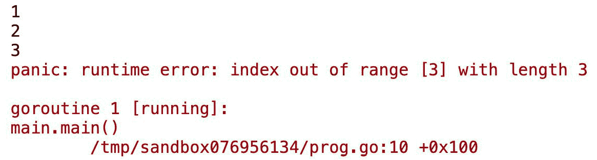
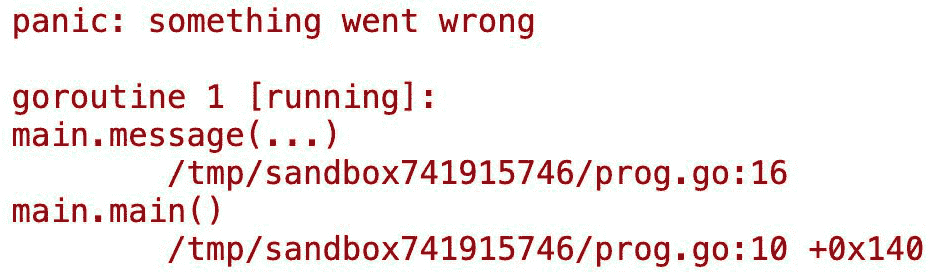
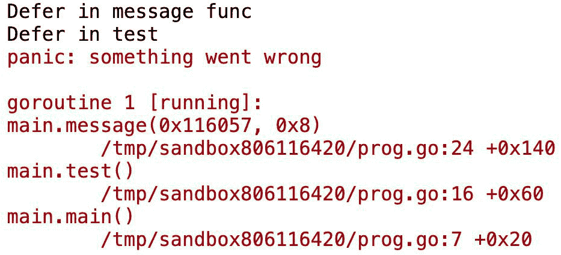
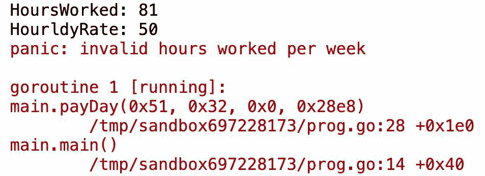
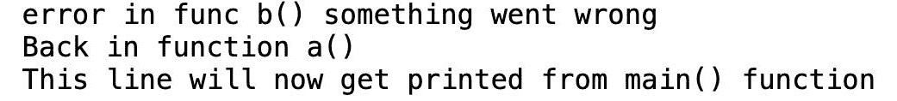
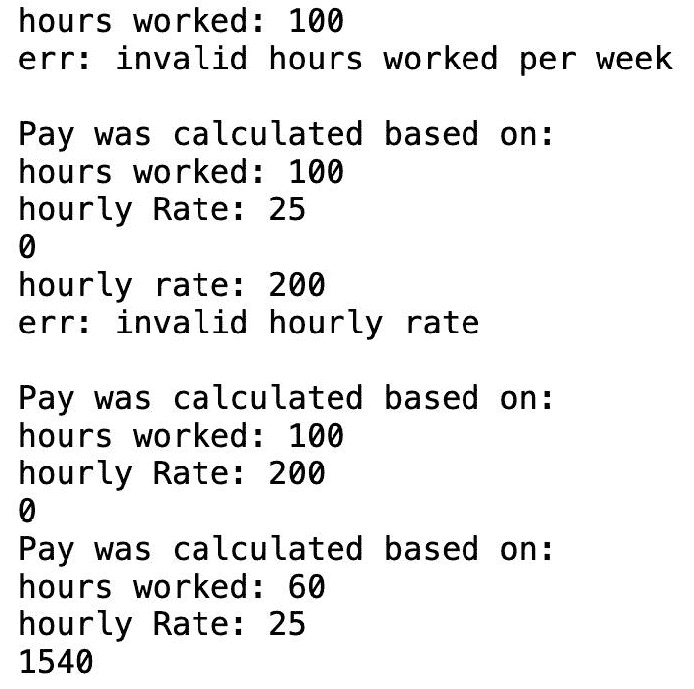
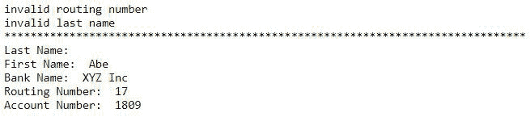
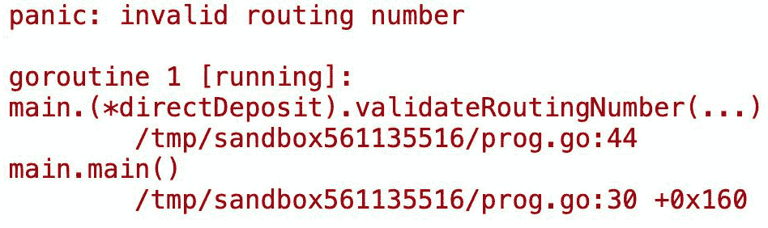
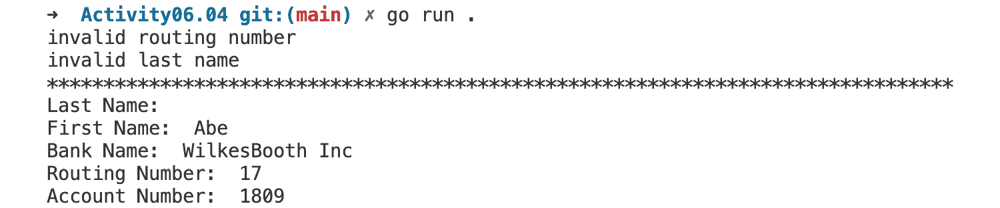

# 第六章：不要恐慌！处理您的错误

概述

在本章中，我们将查看 Go 标准包中的各种代码片段，以了解 Go 语言执行错误处理的惯用方式。我们还将了解如何在 Go 中创建自定义错误类型，并在标准库中查看更多示例。

在本章结束时，您将能够区分不同类型的错误，并比较错误处理和异常处理。您还将能够创建错误值、使用`panic()`，并在恐慌后正确恢复，并处理您的错误。最后，我们将简要讨论通过错误包装向我们的错误添加上下文。

# 技术要求

对于本章，您需要 Go 版本 1.21 或更高版本。本章的代码可以在以下位置找到：[`github.com/PacktPublishing/Go-Programming-From-Beginner-to-Professional-Second-Edition-/tree/main/Chapter06`](https://github.com/PacktPublishing/Go-Programming-From-Beginner-to-Professional-Second-Edition-/tree/main/Chapter06)。

# 简介

在上一章中，我们学习了如何通过函数、分离逻辑组件等方式，借助 Go 语言来减少、重用和回收良好的代码实践！我们还发现了更多关于函数的信息，例如函数可以作为参数传递，也可以从函数中返回。在本章中，我们将处理错误，并学习如何在函数中返回这些错误。

开发者并不完美，因此他们生产的代码也不完美。所有软件在某个时间点都会出现错误。在软件开发过程中，错误处理至关重要。这些错误可能会对用户产生不同程度的负面影响。您软件对用户的影响可能比您想象的要深远。

例如，让我们考虑 2003 年的东北电网停电事件。2003 年 8 月 14 日，美国和加拿大大约有 5000 万人遭遇了为期 14 天的停电。这是由于控制室警报系统中的竞态条件错误。从技术上讲，竞态条件错误是两个独立的线程试图对同一内存位置进行写操作。这种竞态条件可能导致程序崩溃。在这个例子中，它导致了超过 250 个发电厂断电。处理竞态条件的一种方法是通过确保各种线程或进程内的执行小单元之间适当的同步，并允许一次只有一个线程对内存位置进行写操作。我们将在本书的后面部分更详细地讨论并发；然而，这个例子说明了我们作为开发者，确保我们正确处理错误的重要性，以便我们尽可能避免此类问题。如果我们没有正确处理错误，这可能会损害我们应用程序的用户及其生活方式，正如这里描述的停电事件所示。是的，这是一个多年前的事件；然而，我们应该抓住这个机会从过去学习，努力正确处理错误，以避免未来再次发生。有关东北电网停电的更多信息可以在网上找到：[`en.wikipedia.org/wiki/Northeast_blackout_of_2003`](https://en.wikipedia.org/wiki/Northeast_blackout_of_2003)。

在本章中，我们将探讨错误是什么，Go 语言中的错误看起来是什么样子，以及更具体地，如何以 Go 的方式处理错误。让我们开始吧！

# 什么是错误？

错误是导致你的程序产生非预期结果的东西。这些非预期结果可能包括应用程序崩溃、不正确的数据计算（例如银行交易处理不当），或者没有任何结果。这些非预期结果被称为软件缺陷。任何软件在其生命周期中都会因为程序员没有预料到的众多场景而包含错误。当错误发生时，可能出现以下结果：

+   错误的代码可能导致程序在没有警告的情况下崩溃

+   程序的输出不是预期的结果

+   显示错误信息

你可能会遇到三种类型的错误：

+   语法错误

+   运行时错误

+   语义错误

让我们更详细地探讨每一个。

## 语法错误

语法错误是由于编程语言使用不当造成的。这通常是由于代码输入错误导致的。大多数现代集成开发环境（IDE）都会有一些视觉方式将语法错误通知程序员。在大多数现代 IDE 中，可以在早期阶段捕获语法错误。当你学习一门新的编程语言时，语法错误可能会更频繁地发生。一些语法错误的出现可能是因为以下原因：

+   循环语法使用不当

+   错误地放置或省略花括号、括号或方括号

+   拼写错误的函数名或包名

+   向函数传递错误的参数类型

这里是一个语法错误的示例：

```go
package main
import (
  "fmt"
)
func main() {
  fmt.println("Enter your city:")
}
```

输出如下所示：

```go
fmt.println("Enter your city:")
cannot refer to unexported name fmt.println
undefined: fmt.println
```

Go 是大小写敏感的，所以 `println` 应该是 `Println`。

语法错误是你在 IDE 中通过 `golint` 收到的快速反馈，`golint` 是由 `gopls` 语言服务器运行的。`gopls` 是由 Google Go 团队开发的官方 Go 语言服务器，它提供了各种语言功能，包括代码补全、对语法警告和错误的诊断以及格式化问题。在支持 `gopls` 的 IDE 中与 Go 代码一起工作以启用这些功能。`golint` 本身是一个独立的命令行工具，可以提供代码分析，并且可以与 `gopls` 集成。建议在提交代码之前运行代码检查器。当你在**持续集成**（**CI**）环境中打开代码供团队成员审查时，这个过程通常会被自动化，以确保基于团队和/或更大规模的项目都有良好的代码质量标准。

## 运行时错误

这些错误发生在代码被要求执行它无法完成的任务时。与语法错误不同，这些错误通常只在代码执行期间被发现。

以下是一些常见的运行时错误示例：

+   打开一个不存在的数据库的连接

+   执行一个大于你正在迭代的切片或数组中元素数量的循环

+   打开一个不存在的文件

+   执行一个数学运算，例如除以零

## 练习 6.01 – 添加数字时的运行时错误

在这个练习中，我们将编写一个简单的程序，该程序将计算一个数字切片的总和。这个程序将演示一个运行时错误的例子，并在执行时崩溃：

1.  在`Chapter06`目录内创建一个名为`Exercise06.01`的目录。

1.  在*步骤 1*中创建的目录内创建一个名为`main.go`的文件。

1.  此程序将在 `package main` 中。导入 `fmt` 包：

    ```go
    package main
    import "fmt"
    ```

1.  在`main`函数内部，我们将有一个包含四个元素的整数切片：

    ```go
    func main() {
      nums := []int{2, 4, 6, 8}
    ```

1.  我们将有一个名为`total`的变量，用于累加切片中的所有整数变量。使用`for`循环来累加变量：

    ```go
      total := 0
      for i := 0; i <= 10; i++ {
        total += nums[i]
      }
    ```

1.  接下来，我们打印出总和的结果：

    ```go
      fmt.Println("Total: ", total)
    }
    ```

    通过这种方式，我们已经向程序中引入了一个运行时错误的例子；因此，我们不会得到以下输出：

    ```go
    Total: 20
    ```

1.  在命令行中，导航到你在*步骤 1*中创建的目录。

1.  在命令行中，键入以下内容：

    ```go
    go build main.go
    ```

    `go build`命令将编译你的程序，并创建一个以你在*步骤 1*中创建的目录命名的可执行文件。

1.  在*步骤 8*中创建的文件中键入文件名并按*Enter*键运行可执行文件（添加`./main`命令）。预期的输出如下：


图 6.1：执行后的输出

如您所见，程序崩溃了。`index out of range` panic 是新手和经验丰富的 Go 开发者都常见的错误。

在这个例子中，这个程序中的错误——一个 panic（我们将在本章后面讨论 panic 是什么）——是由于在`for`循环中迭代次数过多——在我们的例子中，是 10 次——超过了切片中的实际元素数量——在我们的例子中，是 4 次。一个可能的解决方案是使用带有范围的`for`循环：

```go
package main
import "fmt"
func main() {
  nums := []int{2, 4, 6, 8}
  total := 0
  for i := range nums {
    total += nums[i]
  }
  fmt.Println("Total: ", total)
}
```

在这个练习中，我们看到了如何通过关注细节来避免运行时错误。

为了在它们成为运行时错误之前更容易地捕获问题，最好做以下事情：

+   正确测试你的代码

+   避免对`nil`指针进行解引用

+   根据需要使用适当的输入验证

+   在访问之前执行边界检查以检查数据范围

+   使用适当的同步机制

+   避免全局状态

+   适度使用 panic 和 recover

+   对队友进行彻底的代码审查

+   使用代码检查器和分析器

+   对依赖项进行版本管理

虽然其中一些包括尝试注意适当的编码实践，但本书的后续章节中也将讨论许多这些内容。

## 语义错误

语法错误是最容易调试的，其次是运行时错误，而逻辑错误是最难调试的。语义错误有时很难发现，因为它们是导致意外行为的逻辑错误的结果。

例如，在 1998 年，当火星气候轨道器发射时，其目的是研究火星的气候，但由于系统中的逻辑错误，价值 2.35 亿美元的火星气候轨道器被摧毁。经过一些分析，发现地面控制器系统上的单位计算是在英制单位下进行的，而轨道器上的软件是在公制单位下进行的。这是一个导致导航系统在太空中错误计算其机动动作的逻辑错误。正如这个语义错误的典型案例所示，这些是代码处理程序元素的方式上的缺陷。这类错误通常在运行时被发现。这是错误代码可能造成的重大后果的另一个例证，因为火星气候轨道器非常昂贵，并包含了大量的工程努力。

这里有一些导致语义错误发生的原因：

+   逻辑错误，例如计算错误

+   访问错误的资源（文件、数据库、服务器和变量）

+   变量取反设置不正确（不等号与等号）

+   变量上的类型错误

+   函数、数据结构、指针和并发使用不当

## 练习 6.02 – 走路距离的语义错误

我们正在编写一个应用程序，该应用程序将确定我们是否应该步行到目的地或开车。如果我们的目的地大于或等于 2 公里，我们将开车。如果它小于 2 公里，那么我们将步行到我们的目的地。我们将通过这个程序演示一个语义错误。

本练习的预期输出如下：

```go
Take the car
```

按照以下步骤操作：

1.  在`Chapter06`目录中创建一个名为`Exercise6.02`的目录。

1.  在上一步创建的目录中保存一个名为`main.go`的文件。此程序将位于`package main`中。

1.  导入`fmt`包：

    ```go
    package main
    import "fmt"
    ```

1.  在`main`函数中，当`km`大于`2`时显示一条取车的消息，当`km`小于`2`时，发送一条步行消息：

    ```go
    func main() {
      km := 2
      if km > 2 {
        fmt.Println("Take the car")
      } else {
        fmt.Println("Going to walk today")
      }
    }
    ```

1.  在命令行中，导航到您创建的目录。

1.  在命令行中，键入以下内容：

    ```go
    go build main.go
    ```

    `go build`命令将编译您的程序，并创建一个以您创建的目录命名的可执行文件。

1.  在*步骤 6*中输入您创建的文件名并按*Enter*键运行可执行文件（添加`./main`命令）。预期的输出如下：

您将得到以下输出：

```go
Going to walk today
```

程序将无错误运行，但显示的消息并非我们所期望的。

如前所述，程序运行没有错误，但结果并非我们所期望的。这是因为我们有一个逻辑错误。我们的`if`语句没有考虑到`km`等于`2`的情况。它只检查距离是否大于`2`。幸运的是，这是一个简单的修复：将`>`替换为`>=`。现在，程序将给出我们期望的结果：

```go
func main() {
  km := 2
  if km >= 2 {
    fmt.Println("Take the car")
  } else {
    fmt.Println("Going to walk today")
  }
}
```

这个简单的程序使得调试逻辑错误变得容易，但在更大的程序中，这类错误可能并不容易发现。

语义错误涉及理解代码的预期逻辑。最好进行彻底的测试。这包括各种类型的测试，如单元测试、集成测试、端到端测试等。每种类型的测试在捕捉不同方面的错误和防止意外后果方面都起着特定的作用。本书后面将更详细地讨论各种测试类型。此外，采用 Go 的最佳实践和持续学习的思维方式可以帮助！

本章的剩余部分将重点介绍我们已经讨论过的运行时错误。然而，了解作为程序员可能遇到的错误的各种类型是很好的。

## 使用其他编程语言进行错误处理

对于初学者 Go 并且有其他编程语言背景的程序员来说，他们可能会觉得 Go 处理错误的方法有些奇怪。Go 不按与其他语言（如 Java、Python、C#和 Ruby）相同的方式处理错误。那些语言执行异常处理。

以下是一些其他语言通过执行异常处理来处理错误的代码片段示例：

```go
//java
try {
  // code
}catch (exception e){
  // block of code to handle the error
}
//python
try:
  //code
except:
  //code
else:
  try:
  // code
  except:
  // code
finally:
  //code
```

通常情况下，如果没有处理异常，应用程序将会崩溃。在大多数情况下，异常处理倾向于是隐式检查，与 Go 函数返回的错误相比是显式检查。在异常处理范式中，任何事物都可能失败，你必须考虑到这一点。每个函数都可能抛出异常，但你不知道那个异常会是什么。

在 Go 使用的错误处理范式中，当程序员没有处理错误时，很明显，因为函数返回错误代码，你可以看到他们没有检查错误。我们将在本章后面讨论检查错误代码的细节。

大多数编程语言遵循与之前代码片段中所示类似的模式。通常是一些`try..catch..finally`块。与`try..catch..finally`块的一个争议点是程序的执行流程被中断，可能会遵循不同的路径。这可能导致几个逻辑错误，并使代码的可读性变得困难。以下是如何快速查看 Go 处理错误的方式：

```go
val, err := someFunc() err
if err != nil{
  return err
}
return nil
```

上述代码片段是处理错误的非常简单的语法。我们将在接下来的章节中更详细地探讨这一点。

# 错误接口类型

Go 中的错误是什么？Go 中的错误是一个值。以下是从 Go 的关键先驱之一 Rob Pike 引述的一句话：

“*值可以被编程，由于错误是值，错误也可以被编程。错误不像异常那样特殊，它们没有什么特别之处，而未处理的异常可能会导致* *你的程序崩溃* *。”

由于错误是值，它们可以被传递到函数中，从函数中返回，并且像 Go 中的任何其他值一样进行评估。

在 Go 中，任何实现了错误接口的东西都可以被视为错误。接口将在下一章中详细解释，所以在这章中我们将简要介绍接口引用。我们需要查看构成 Go 中错误类型的一些基本方面。要成为 Go 中的错误类型，它必须首先满足`type` `error interface`：

```go
//https://golang.org/pkg/builtin/#error
type error interface {
  Error() string
}
```

Go 的奇妙之处在于其关于语言特性的简单设计。这可以通过 Go 标准库使用的错误接口轻松看出。为了满足错误接口，只需要两个条件：

+   方法名，`Error()`

+   返回字符串的`Error()`方法

理解错误类型是一个接口类型非常重要。任何错误值都可以描述为一个字符串。在 Go 中进行错误处理时，函数将返回错误值。Go 语言在整个标准库中都使用这一点。

以下代码片段是关于错误讨论的起点：

```go
package main
import (
  "fmt"
  "strconv"
)
func main() {
  v := "10"
  if s, err := strconv.Atoi(v); err == nil {
    fmt.Printf("%T, %v\n", s, s)
  }else{
    fmt.Println(err)
  }
  v = "s2"
  s, err := strconv.Atoi(v)
  if err != nil{
    fmt.Println(s, err)
  }
}
```

我们不会深入探讨函数的每个细节，而是专注于代码的错误部分。在*第五章*“减少、重用和回收”中，我们了解到函数可以返回多个值。这是一个大多数语言都没有的强大功能。这一点在处理错误值时尤其强大。`strconv.Atoi()`函数返回一个`int`类型和一个错误，正如之前提到的示例中所示。这是一个 Go 标准库中的函数。对于返回错误值的函数，错误值应该是最后一个返回值。

在 Go 语言中，对于返回错误值的函数或方法，评估错误值是 Go 语言的规范。不处理从函数返回的错误通常是不良的实践。当返回并被忽略时，错误可能导致大量的调试工作浪费。它也可能导致程序中出现未预见的后果。如果值不是 `nil`，那么我们遇到了错误，必须决定如何处理它。根据场景，我们可能想要执行以下操作之一：

+   将错误返回给调用者

+   记录错误并继续执行

+   停止程序的执行

+   忽略它（这强烈不推荐）

+   抛出异常（仅在非常罕见的情况下；我们将在稍后详细讨论）

如果错误的值为 `nil`，这意味着没有错误。不需要进一步的操作。

让我们更详细地看看关于错误类型的标准包。我们将从查看 [`packt.live/2rk6r8Z`](https://packt.live/2rk6r8Z) 文件中的每一行代码开始：

```go
type errorString struct {
    s string
}
```

`errorString` 结构体位于 `errors` 包中。这个结构体用于存储错误的字符串版本。`errorString` 有一个名为 `s` 的单个字段，其类型为 `string`。`errorString` 和该字段是不可导出的。这意味着我们无法直接访问 `errorString` 类型或其字段 `s`。以下代码展示了尝试访问不可导出的 `errorString` 类型及其字段 `s` 的示例：

```go
package main
import (
  "errors"
  "fmt"
)
func main() {
  es := errors.errorString{}
  es.s = "slacker"
  fmt.Println(es)
}
```

这是输出：


图 6.2：未导出字段的预期输出

表面上看，`errorString` 似乎既不可访问也不实用，但我们应该继续挖掘标准库：

```go
func (e *errorString) Error() string {
    return e.s
}
```

`errorString` 类型有一个实现错误接口的方法。它满足要求，提供了一个名为 `Error()` 的方法，并返回一个字符串。错误接口已被满足。我们现在可以通过 `Error()` 方法访问 `errorString` 字段 `s`。这就是错误在标准库中返回的方式。

你现在应该对 Go 中的错误有基本理解了。接下来，我们将学习如何在 Go 中创建错误类型。

## 创建错误值

在标准库中，`errors` 包有一个我们可以用来创建错误的方法：

```go
// https://golang.org/src/errors/errors.go
// New returns an error that formats as the given text.
func New(text string) error {
    return &errorString{text}
}
```

重要的是要理解 `New` 函数接受一个字符串作为参数，将其转换为 `*errors.errorString`，并返回一个错误值。返回的错误类型的底层值是 `*errors.errorString` 类型。

我们可以通过运行以下代码来证明这一点：

```go
package main
import (
    "errors"
    "fmt"
)
func main() {
     ErrBadData := errors.New("Some bad data")
     fmt.Printf("ErrBadData type: %T", ErrBadData)
}
```

这里是 Go 标准库 `http` 中使用 `errors` 包创建包级变量的一个示例：

```go
var (
    ErrBodyNotAllowed = errors.New("http: request method or response status code does not allow body")
    ErrHijacked = errors.New("http: connection has been hijacked")
    ErrContentLength = errors.New("http: wrote more than the declared Content- Length")
    ErrWriteAfterFlush = errors.New("unused")
)
```

在 Go 中创建错误时，通常从 `Err` 变量开始。

## 练习 6.03 – 创建一个计算每周工资的应用程序

在这个练习中，我们将创建一个函数来计算一周的工资。这个函数将接受两个参数——一周内工作的小时数和时薪。该函数将检查这两个参数是否符合有效性的标准。该函数需要计算正常工资，即一周内工作的小时数少于或等于 40，以及加班工资，即一周内工作的小时数超过 40。

我们将使用`errors.New()`创建两个错误值。其中一个错误值将在时薪无效时使用。在我们应用中，无效的时薪是指小于 10 或大于 75 的时薪。第二个错误值将在每周工作小时数不在 0 到 80 之间时使用。

使用您选择的 IDE。一个选项是 Visual Studio Code。按照以下步骤操作：

1.  在`Chapter06`目录中创建一个名为`Exercise6.03`的目录。

1.  在上一步创建的目录中保存一个名为`main.go`的文件。`main.go`文件将在`package main`中。

1.  导入两个 Go 标准库，`errors`和`fmt`：

    ```go
    package main
    import (
        "errors"
        "fmt"
    )
    ```

1.  因此，我们已经使用`errors.New()`声明了我们的错误变量。现在，我们可以使用 Go 的惯用命名方法，以`Err`开头并使用驼峰式命名。我们的错误字符串是小写的，不带标点符号：

    ```go
    var (
         ErrHourlyRate = errors.New("invalid hourly rate")
         ErrHoursWorked = errors.New("invalid hours worked per week")
    )
    ```

1.  在`main`函数中，我们将调用三次`payday()`函数。我们将使用`errors.New()`声明错误变量，并在函数调用后检查`err`：

    ```go
    func main() {
        pay, err := payDay(81, 50)
        if err != nil {
            fmt.Println(err)
        }
    }
    ```

1.  创建一个名为`payDay`的函数，并使其接受两个参数（`hoursWorked`和`hourlyRate`）。该函数将返回一个`int`类型和一个错误。我们将在之后一步步讨论这个步骤：

    ```go
        func payDay(hoursWorked, hourlyRate int) (int, error) {
            if hourlyRate < 10 || hourlyRate > 75 {
                return 0, ErrHourlyRate
        }
        if hoursWorked < 0 || hoursWorked > 80 {
            return 0, ErrHoursWorked
        }
        if hoursWorked > 40 {
            hoursOver := hoursWorked - 40
            overTime := hoursOver * 2
            regularPay := hoursWorked * hourlyRate
            return regularPay + overTime, nil
        }
        return hoursWorked * hourlyRate, nil
    }
    ```

1.  我们将使用`if`语句检查时薪是否小于 10 或大于 75。如果`hourlyRate`满足这些条件，我们将返回`0`和我们的自定义错误`ErrHourlyRate`。如果`hourlyRate`不满足这些条件，则返回值将是`return hoursWorked * hourlyRate, nil`。我们返回`nil`作为错误，因为没有错误发生：

    ```go
    func payDay(hoursWorked, hourlyRate int) (int, error) {
        if hourlyRate < 10 || hourlyRate > 75 {
            return 0, ErrHourlyRate
        }
        return hoursWorked * hourlyRate, nil
    }
    ```

1.  在*第 7 步*中，我们验证了`hourlyRate`。现在，我们需要验证`hoursWorked`。我们将在`payDay()`函数中添加另一个`if`语句，检查`hoursWorked`是否小于`0`或大于`80`。如果`hoursWorked`符合该条件，我们将返回`0`和错误，`ErrHoursWorked`：

    ```go
    func payDay(hoursWorked, hourlyRate int) (int, error) {
        if hourlyRate < 10 || hourlyRate > 75 {
            return 0, ErrHourlyRate
        }
        if hoursWorked < 0 || hoursWorked > 80 {
            return 0, ErrHoursWorked
        }
        return hoursWorked * hourlyRate, nil
    }
    ```

1.  在前两个步骤中，我们添加了`if`语句来验证传递给函数的参数。在这个步骤中，我们将添加另一个`if`语句来计算加班工资。加班工资是指超过`40`小时的工作时间。超过`40`小时的工作时间是时薪的两倍。不超过`40`小时的工作时间是按时薪计算的：

    ```go
    func payDay(hoursWorked, hourlyRate int) (int, error) {
        if hourlyRate < 10 || hourlyRate > 75 {
            return 0, ErrHourlyRate
        }
        if hoursWorked < 0 || hoursWorked > 80 {
            return 0, ErrHoursWorked
        }
        if hoursWorked > 40 {
            hoursOver := hoursWorked - 40
            overTime := hoursOver * 2
            regularPay := hoursWorked * hourlyRate
            return regularPay + overTime, nil
        }
        return hoursWorked * hourlyRate, nil
    }
    ```

1.  在`main()`函数中，我们将用不同的参数三次调用`payDay()`函数。我们将在每次调用后检查错误，并在适用的情况下打印错误消息。如果没有错误，则打印一周的工资：

    ```go
    func main() {
        pay, err := payDay(81, 50)
        if err != nil {
            fmt.Println(err)
        }
        pay, err = payDay(80, 5)
        if err != nil {
            fmt.Println(err)
        }
        pay, err = payDay(80, 50)
        if err != nil {
            fmt.Println(err)
        }
        fmt.Println(pay)
    }
    ```

1.  在命令行中，导航到您之前创建的目录。

1.  在命令行中，输入以下内容：

    ```go
    go build main.go
    ```

    `go build`命令将编译你的程序并创建一个以你创建的目录命名的可执行文件。

1.  输入你创建的文件名并按*Enter*键运行可执行文件：

    ```go
    ./main
    ```

预期输出如下：

```go
Invalid hours worked per week
Invalid hourly rate
4080
```

在这个练习中，我们展示了如何创建自定义的错误信息，这些信息可以用来轻松地确定数据为何被认为是无效的。我们还展示了如何从函数中返回多个值，以及如何检查函数中的错误。在下一节中，我们将探讨如何在我们的应用程序中使用 panic。

# Panic

几种语言使用异常来处理错误。然而，Go 不使用异常——它使用一种称为 panic 的东西。这是一个导致程序崩溃的内置函数。它停止 panic 发生处的当前 goroutine 的正常执行，以及所有其他正在进行的 goroutines，并显示发生情况的堆栈跟踪。

在 Go 中，panic 不是常态，与其他语言中异常是常态不同。panic 信号表示代码中正在发生异常情况。通常，当 panic 由运行时或开发者启动时，是为了保护程序的完整性。

错误和 panic 在目的和 Go 运行时如何处理它们方面有所不同。Go 中的错误表示发生了意外情况，但它不会对程序的完整性产生不利影响。Go 期望开发者正确处理错误。如果你没有处理错误，函数或其他程序通常不会崩溃。然而，panic 在这方面有所不同。当发生 panic 时，除非有处理 panic 的处理程序，否则它最终会崩溃系统。如果没有处理 panic 的处理程序，它将一路向上堆栈并崩溃程序。

在本章后面我们将探讨的一个例子是，由于索引超出范围而发生的 panic。这在尝试访问不存在的集合的索引时很典型。如果 Go 在这种情况下不 panic，可能会损害程序的完整性，例如程序的其他部分尝试存储或检索集合中不存在的数据。

注意

回顾 goroutines 的相关内容，以了解在 Go 中 panic 时会发生什么。从高层次来看，`main()`函数是一个 Goroutine。当发生 panic 时，你将在错误信息中看到“Goroutine running”的引用。

恐慌可以被开发者发起，也可以在程序执行过程中由运行时错误引起。`panic()`函数接受一个空接口。目前，只需说，这意味着它可以接受任何作为参数。然而，在大多数情况下，你应该将错误类型传递给`panic()`函数。对于我们的函数用户来说，了解导致恐慌的详细信息更直观。将错误传递给恐慌函数也是 Go 中的惯例。我们还将看到如何从传递错误类型的恐慌中恢复，这为我们处理恐慌提供了不同的选项。当发生恐慌时，它通常遵循以下步骤：

1.  执行被停止。

1.  在恐慌函数中的任何延迟函数都将被调用。

1.  在恐慌函数的调用栈中的任何延迟函数都将被调用。

1.  它将继续向上堆栈传播，直到达到`main()`。

1.  在恐慌函数之后的语句将不会执行。

1.  程序随后崩溃。

这就是恐慌的工作原理：


图 6.3：恐慌的工作原理

前面的图示说明了`main`函数中调用`a()`函数的代码。然后该函数调用`b()`函数。在`b()`内部发生恐慌。`panic()`函数没有被上游的任何代码（`a()`或`main()`函数）处理，所以程序将崩溃`main()`函数。

这是一个在 Go 中发生的恐慌示例。试着确定这个程序为什么崩溃：

```go
package main
import (
    "fmt"
)
func main() {
    nums := []int{1, 2, 3}
    for i := 0; i <= 10; i++ {
        fmt.Println(nums[i])
    }
}
```

这个恐慌的输出如下所示：



图 6.4：恐慌示例

恐慌运行时错误是在开发过程中经常会遇到的一个常见错误。它是一个`index out of range`错误。Go 生成这个恐慌是因为我们试图迭代一个比元素多的切片。Go 认为这是一个恐慌的理由，因为它使程序处于不正常的状态。

这是一个演示使用恐慌的基本代码片段：

```go
package main
import (
    "errors"
    "fmt"
)
func main() {
    msg := "good-bye"
     message(msg)
     fmt.Println("This line will not get printed")
}
func message(msg string) {
    if msg == "good-bye" {
        panic(errors.New("something went wrong"))
    }
}
```

**代码摘要**：

+   函数恐慌是因为函数消息的参数是 `"good-bye"`。

+   `panic()`函数打印错误消息。一个好的错误消息有助于调试过程。

+   在恐慌中，我们使用了`errors.New()`，这是我们之前章节中用来创建错误类型的。

+   如您所见，`fmt.Println()`在`main()`函数中没有被执行。由于没有`defer`语句，执行将立即停止。

这个代码片段的预期输出如下：



图 6.5：恐慌示例输出

以下代码片段展示了`panic`和`defer`语句如何一起工作：

main.go

```go
func test() {
    n := func() {
    fmt.Println("Defer in test")
    }
    defer n()
    msg := "good-bye"
    message(msg)
}
func message(msg string) {
    f := func() {
    fmt.Println("Defer in message func")
}
    defer f()
    if msg == "good-bye" {
    panic(errors.New("something went wrong"))
```

这个恐慌示例的输出如下：



图 6.6：恐慌示例输出

让我们分部分理解这段代码：

1.  我们首先检查`message()`函数中的代码，因为 panic 就是从这里开始的。当 panic 发生时，它会运行 panic 函数中的`defer`语句，即`message()`。

1.  延迟函数`func f()`在`message()`函数中运行。

1.  在调用栈中向上，下一个函数是`test()`函数，它的延迟函数`n()`将执行。

1.  最后，我们到达`main()`函数，执行被 panic 函数停止。`main()`中的打印语句不会执行。

注意

你可能见过使用`os.Exit()`来停止程序的执行。`os.Exit()`会立即停止执行并返回一个状态码。当执行`os.Exit()`时，不会运行任何延迟语句。在某些情况下，`panic`比`os.Exit()`更受欢迎，因为 panic 会运行延迟函数。

## Exercise 6.04 – 使用 panic 在错误时崩溃程序

在这个练习中，我们将修改*Exercise 6.03 – 创建一个计算每周工资的应用程序*。考虑以下场景，其中要求已经改变。

我们不再需要从`payDay()`函数返回错误值。已经决定我们不能信任程序的用户正确地响应错误。有人抱怨工资单不正确。我们相信这是由于调用我们的函数的人忽略了返回的错误。

`payDay()`函数现在将只返回工资金额，而不返回错误。当提供给函数的参数无效时，而不是返回错误，函数将 panic。这将导致程序立即停止，因此不会处理工资单。

使用你选择的 IDE。一个选项可以是 Visual Studio Code。现在，按照以下步骤操作：

1.  在`Chapter06`目录内创建一个名为`Exercise6.04`的目录。

1.  在上一步创建的目录中保存一个名为`main.go`的文件。这个程序将位于`package main`中。

1.  在`main.go`中输入以下代码：

    ```go
    package main
    import (
        "fmt"
        "errors"
    )
    var (
        ErrHourlyRate = errors.New("invalid hourly rate")
        ErrHoursWorked = errors.New("invalid hours worked per week")
    )
    ```

1.  在`main`函数中，调用`payDay()`函数，将其赋值给一个变量`pay`，然后打印它：

    ```go
    func main() {
        pay := payDay(81, 50)
        fmt.Println(pay)
    }
    ```

1.  将`payDay()`函数的返回类型更改为只返回`int`：

    ```go
    func payDay(hoursWorked, hourlyRate int) int {
    ```

1.  在`payDay()`函数中，将一个变量`report`赋值给一个匿名函数。这个匿名函数提供了传递给`payDay()`函数的参数的详细信息。尽管我们不是返回错误，但这将提供一些关于为什么函数 panic 的见解。由于它是一个延迟函数，它将在函数退出之前始终执行：

    ```go
    func payDay(hoursWorked, hourlyRate int) int {
        report := func() {
            fmt.Printf("HoursWorked: %d\nHourldyRate: %d\n", hoursWorked, hourlyRate)
        }
        defer report()
    }
    ```

    对于有效的`hourlyRate`和`hoursWorked`的业务规则与之前的练习相同。而不是返回错误，我们将使用`panic`函数。当数据无效时，我们 panic 并传递`ErrHourlyRate`或`ErrHoursWorked`的参数。

    传递给`panic()`函数的参数帮助我们的函数用户`理解`panic 的原因。

1.  当 `payDay()` 函数发生恐慌时，`defer` 函数 `report()` 将向调用者提供有关恐慌原因的一些洞察。恐慌会向上冒泡到 `main()` 函数，并且执行将立即停止。必须在 `payDay()` 函数中的 `defer` 函数之后添加以下代码：

    ```go
        if hourlyRate < 10 || hourlyRate > 75 {
            panic(ErrHourlyRate)
        }
        if hoursWorked < 0 || hoursWorked > 80 {
            panic(ErrHoursWorked )
        }
        if hoursWorked > 40 {
            hoursOver := hoursWorked – 40
            overTime := hoursOver * 2
            regularPay := hoursWorked * hourlyRate
            return regularPay + overTime
        }
        return hoursWorked * hourlyRate
    }
    ```

1.  在命令行中，导航到您创建的目录。

1.  在命令行中，键入以下内容：

    ```go
    go build main.go
    ```

1.  `go build` 命令将编译您的程序并创建一个以您创建的目录命名的可执行文件。

1.  输入你创建的文件名并按 *Enter* 键来运行可执行文件。

预期的输出应该是以下内容：



图 6.7：恐慌练习输出

在这个练习中，我们学习了如何执行恐慌并将错误传递给 `panic()` 函数。这有助于用户更好地理解恐慌的原因。在下一节中，我们将学习如何在发生恐慌后使用 `recover()` 来恢复程序控制。我们还将讨论 Go 中 `panic()` 和 `recover()` 的指南。

# 恢复

Go 提供了在发生恐慌后恢复控制的能力。`recover()` 是一个用于恢复恐慌 goroutine 控制的函数。

`recover()` 函数的签名如下：

```go
func recover() interface{}
```

`recover()` 函数不接受任何参数，并返回一个空的 `interface{}`。目前，一个空的 `interface{}` 表示可以返回任何类型。`recover()` 函数将返回发送给 `panic()` 函数的值。

`recover()` 函数仅在延迟函数内部有用。如您所回忆的那样，延迟函数会在包含函数终止之前执行。在延迟函数内部执行对 `recover()` 函数的调用会通过恢复正常执行来停止恐慌。如果 `recover()` 函数在延迟函数外部被调用，它将不会停止恐慌。

以下图表显示了程序在使用 `panic()`、`recover()` 和 `defer()` 函数时采取的步骤：


图 6.8：`recover()` 函数的流程

在前面图表中采取的步骤可以这样解释：

1.  `main()` 函数调用 `func a()`。

1.  `func a()` 调用 `func b()`。

1.  在 `func b()` 内部有一个恐慌。

1.  `panic()` 函数由使用 `recover()` 函数的延迟函数处理。

1.  延迟函数是 `func b()` 内部最后一个执行的函数。

1.  延迟函数调用 `recover()` 函数。

1.  对 `recover()` 的调用导致正常流程返回到调用者，即 `func a()`。

1.  正常流程继续，并且最终通过 `main()` 函数恢复控制。

以下代码片段模拟了前面图表的行为：

main.go

```go
func main() {
    a()
    fmt.Println("This line will now get printed from main() function")
}
func a() {
    b("good-bye")
    fmt.Println("Back in function a()")
}
func b(msg string) {
    defer func() {
        if r := recover(); r!= nil{
            fmt.Println("error in func b()", r)
    }
}()
```

完整的代码可在[`github.com/PacktPublishing/Go-Programming-From-Beginner-to-Professional-Second-Edition-/blob/main/Chapter06/Examples/Example06.02/main.go`](https://github.com/PacktPublishing/Go-Programming-From-Beginner-to-Professional-Second-Edition-/blob/main/Chapter06/Examples/Example06.02/main.go)找到。

**代码摘要**：

+   `main()` 函数调用 `a()` 函数。这调用了 `b()` 函数。

+   `b()` 接受一个字符串类型并将其分配给 `msg` 变量。如果 `msg` 在 `if` 语句中评估为 `true`，则将发生 panic。

+   panic 的参数是由 `errors.New()` 函数创建的新错误：

    ```go
    if msg == "good-bye" {
        panic(errors.New("something went wrong"))
    }
    ```

一旦发生 panic，下一个调用将是延迟函数。

延迟函数使用 `recover()` 函数。从 `recover()` 返回 panic 的值；在这种情况下，`r` 的值是一个错误类型。然后，函数打印出一些详细信息：

```go
defer func() {
    if r := recover(); r!= nil {
        fmt.Println("error in func b()", r)
    }
}()
```

+   控制流返回到 `a()`。然后，`a()` 函数打印出一些详细信息。

+   接下来，控制权返回到 `main()` 函数，其中它打印出一些详细信息并终止：



图 6.9：recover() 示例输出

## 练习 6.05 – 从 panic 中恢复

在这个练习中，我们将增强我们的 `payDay()` 函数，使其能够从 panic 中恢复。当我们的 `payDay()` 函数 panic 时，我们将检查该 panic 的错误。然后，根据错误，我们将向用户打印一条信息性消息。让我们开始吧：

1.  在 `Chapter06` 目录内创建一个名为 `Exercise6.05` 的目录。

1.  在上一步创建的目录中保存一个名为 `main.go` 的文件。此程序将位于 `package main` 中。

1.  在 `main.go` 文件中输入以下代码：

    ```go
    package main
    import (
        "errors"
        "fmt"
    )
    var (
        ErrHourlyRate = errors.New("invalid hourly rate")
        ErrHoursWorked = errors.New("invalid hours worked per week")
    )
    ```

1.  使用各种参数调用 `payDay()` 函数，然后打印函数的返回值：

    ```go
    func main() {
        pay := payDay(100, 25)
        fmt.Println(pay)
        pay = payDay(100, 200)
        fmt.Println(pay)
        pay = payDay(60, 25)
        fmt.Println(pay)
    }
    ```

1.  然后，向您的 `payDay()` 函数添加一个 `defer` 函数：

    ```go
    func payDay(hoursWorked, hourlyRate int) int {
        defer func() {
    ```

1.  我们可以检查 `recover()` 函数的返回值，如下所示：

    ```go
            if r := recover(); r != nil {
               if r == ErrHourlyRate {
    ```

    如果 `r` 不是 `nil`，这意味着发生了 panic，我们应该执行一个操作。

1.  我们可以评估 `r` 并查看它是否等于我们的错误值之一 – `ErrHourlyRate` 或 `ErrHoursWorked`：

    ```go
                    fmt.Printf("hourly rate: %d\nerr: %v\n\n", hourlyRate, r)
                }
                if r == ErrHoursWorked {
                    fmt.Printf("hours worked: %d\nerr: %v\n\n", hoursWorked, r)
                }
            }
    ```

1.  如果我们的 `if` 语句评估为 `true`，我们将打印有关数据和 `recover()` 函数的错误值的一些详细信息。然后，我们打印出我们的工资是如何计算的：

    ```go
            fmt.Printf("Pay was calculated based on:\nhours worked: %d\nhourly Rate: %d\n", hoursWorked, hourlyRate)
        }()
    ```

1.  `payDay()` 函数中的其余代码保持不变。要查看其描述，请参阅 *练习 6.04 – 使用 panic 在错误时崩溃程序*：

    ```go
        if hourlyRate < 10 || hourlyRate > 75 {
            panic(ErrHourlyRate)
        }
        if hoursWorked < 0 || hoursWorked > 80 {
             panic(ErrHoursWorked)
        }
        if hoursWorked > 40 {
            hoursOver := hoursWorked - 40
            overTime := hoursOver * 2
            regularPay := hoursWorked * hourlyRate
            return regularPay + overTime
        }
        return hoursWorked * hourlyRate
    }
    ```

1.  在命令行中，导航到您创建的目录。

1.  在命令行中，键入以下内容：

    ```go
    go build main.go
    ```

    `go build` 命令将编译您的程序并创建一个以您创建的目录命名的可执行文件。

1.  输入您创建的文件名并按 *Enter* 运行可执行文件：

    ```go
    ./main
    ```

预期的输出如下：



图 6.10：从 panic 中恢复的练习输出

在先前的练习中，我们看到了创建自定义错误并返回该错误的过程。从这一点上，我们能够在需要时使用`panic()`使程序崩溃。在上一个练习中，我们展示了从`panic()`中恢复并基于传递给`panic()`函数的错误类型显示错误消息的能力。在下一节中，我们将讨论在 Go 中进行错误处理时的一些基本指南。

## 处理错误和`panic()`时的指南

指南仅作为指导。它们并非一成不变。这意味着大多数时候，你应该遵循指南；然而，可能会有例外。其中一些指南之前已经提到，但我们在这里进行了整合，以便快速参考：

+   在声明错误类型时，变量需要以`Err`开头。它还应遵循驼峰命名法：

    ```go
    var ErrExampleNotAllowd= errors.New("error example text")
    ```

+   `error`字符串应以小写字母开头，且不以标点符号结尾。制定此指南的原因之一是错误可以被返回并与其他与错误相关的信息连接。

+   如果一个函数或方法返回错误，则应该对其进行评估。未评估的错误可能导致程序无法按预期运行。

+   当使用`panic()`时，应传递一个错误类型作为参数，而不是空值。

+   不要评估错误的字符串值来直接从错误的字符串表示中提取信息。相反，应使用类型断言或错误接口方法来检索有关错误的特定细节。

+   应该谨慎使用`panic()`函数。

应该在预期情况下使用错误，例如当你遇到代码中的可恢复问题时。当一个函数由于特定条件无法返回预期结果时，返回错误允许调用者优雅地处理这种情况。`panic()`永远不应该成为你的第一道防线。`panic()`是为了处理异常或意外情况而设计的，将其用于常规错误处理可能导致难以调试的问题，使代码的可维护性降低。此外，在`DEBUG`模式下记录错误，这是一种程序为了调试目的提供更多详细信息的状态，当调试错误发生的原因时可能很有用。

遵循这些建议将有助于提高你的 Go 代码的可靠性和可维护性，并帮助你优雅地处理错误。

## 错误包装

在将错误传播到调用栈时，有方法可以改进错误发生的原因的上下文。这在复杂系统中非常有用，有助于理解错误情况。错误封装有助于保留原始错误信息，同时为错误添加额外的上下文。这可以通过使用`fmt.Errorf`或`github.com/pkg/errors`中的`errors.Wrap`函数来实现。错误封装提供了更多关于错误发生位置或原因的详细信息，使得理解和处理代码中的错误变得更加容易。

错误封装的一个简单示例可以在以下函数中看到：

```go
func readConfig() error {
    _, err := readFile("file.txt")
    if err != nil {
        return errors.Wrap(err, "failed to read config file")
    }
    return nil
}
```

或者，封装的错误返回可以表示为以下代码：

```go
return fmt.Errorf("failed to read config file: %w", err)
```

上述代码显示了如何使用错误封装轻松地链接错误。在之前提供的错误格式字符串上的`%w`允许错误链接，这提供了关于错误发生原因的额外上下文。这种方法在标准库中得到支持，因此应该被认为是首选和最简单的方法。

然而，还有一个第三方 Go 包可以用来使用`github.com/hashicorp/go-multierror`一起处理多个错误。这些选项为你提供了理解额外的错误上下文或将多个错误聚合为单个错误的灵活性，这在某些场景中可能很方便。

Go 标准库在 1.13 版本中引入了错误封装，你可以在今天看到专业团队和更复杂的应用程序中使用这种功能。在错误周围提供额外的上下文在调试场景中可能很有用。为了说明这一点，考虑一个在你不熟悉代码中发生错误的情况，并且错误没有提供任何上下文。确定错误的来源将非常具有挑战性。当你缺乏关于错误发生代码特定部分的信息时，调试变得非常困难。然而，你必须注意不要将过多的上下文传播到调用栈中，以免损害你的代码库的安全性。

## 活动 6.01 – 为银行应用程序创建自定义错误消息

一家银行希望在检查姓氏和有效路由号时添加一些自定义错误。他们发现直接存款程序允许使用无效的名称和路由号。银行希望在发生这些事件时有一个描述性的错误消息。我们的任务是创建两个描述性的自定义错误消息。请记住，为错误变量使用惯用的命名约定，并为错误消息使用适当的结构。

你需要做以下事情：

1.  首先，你必须为`ErrInvalidLastName`和`ErrInvalidRoutingNumber`创建两个错误值。

1.  然后，你必须打印`main()`函数中的自定义消息，以向银行显示当遇到这些错误时他们将收到的错误消息。

预期的输出如下：

```go
invalid last name
invalid routing number
```

在完成此活动后，您将熟悉创建自定义错误消息所需的步骤。

注意

此活动的解决方案可以在[`github.com/PacktPublishing/Go-Programming-From-Beginner-to-Professional-Second-Edition-/tree/main/Chapter06/Activity06.01`](https://github.com/PacktPublishing/Go-Programming-From-Beginner-to-Professional-Second-Edition-/tree/main/Chapter06/Activity06.01)找到。

## 活动六.02 – 验证银行客户的直接存款提交

银行对您在*活动 6.01 – 为银行应用程序创建自定义错误消息*中创建的自定义错误消息感到满意。他们非常满意，现在希望您实现两个方法。这两个方法用于验证姓氏和路线号：

1.  您需要创建一个名为 `directDeposit` 的结构。

1.  `directDeposit` 结构将包含三个字符串字段：`lastName`、`firstName` 和 `bankName`。它还将包含两个名为 `routingNumber` 和 `accountNumber` 的 `int` 字段。

1.  `directDeposit` 结构将有一个 `validateRoutingNumber` 方法。当路线号小于 100 时，该方法将返回 `ErrInvalidRoutingNum`。

1.  `directDeposit` 结构将有一个 `validateLastName` 方法。当 `lastName` 为空字符串时，它将返回 `ErrInvalidLastName`。

1.  `directDeposit` 结构将有一个名为 report 的方法。它将打印出每个字段的值。

1.  在 `main()` 函数中，为 `directDeposit` 结构的字段分配值，并调用 `directDeposit` 结构的每个方法。

预期输出如下：



图 6.11：验证银行客户的直接存款提交

在完成此活动后，您将学会如何从函数中返回错误，以及如何检查从函数返回的错误。您还将能够检查条件，并根据该条件返回自定义错误。

注意

此活动的解决方案可以在[`github.com/PacktPublishing/Go-Programming-From-Beginner-to-Professional-Second-Edition-/tree/main/Chapter06/Activity06.02`](https://github.com/PacktPublishing/Go-Programming-From-Beginner-to-Professional-Second-Edition-/tree/main/Chapter06/Activity06.02)找到。

## 活动六.03 – 对无效数据提交引发恐慌

银行现在决定，当提交无效的路线号时，宁愿让程序崩溃。银行认为，错误数据应导致程序停止处理直接存款数据。您需要在无效数据提交实例上引发恐慌。在*活动 6.02 – 验证银行客户的直接存款提交*的基础上构建此功能。

对于此活动，您只需做一件事 – 修改 `validateRoutingNumber` 方法，使其不返回 `ErrInvalidRoutingNum`，而是执行恐慌：

预期输出如下：



图 6.12：无效路由号上的 panic

在完成这个活动后，你将能够引发 panic，并看到它如何影响程序的流程。

注意

本活动的解决方案可以在[`github.com/PacktPublishing/Go-Programming-From-Beginner-to-Professional-Second-Edition-/tree/main/Chapter06/Activity06.03`](https://github.com/PacktPublishing/Go-Programming-From-Beginner-to-Professional-Second-Edition-/tree/main/Chapter06/Activity06.03)找到。

## 活动六.04 – 防止 panic 导致应用崩溃

在进行一些初步的 alpha 测试后，银行不再希望应用崩溃，因此，在本活动中，我们需要从我们在*活动 6.03 – 无效数据提交时的 panic*中恢复，并打印出导致 panic 的错误：

1.  在`validateRoutingNumber`方法中添加一个`defer`函数。

1.  在`recover()`函数返回的错误上添加一个`if`语句。如果有错误，则打印它：

预期输出如下：



图 6.13：从无效路由号上的 panic 中恢复

在完成这个活动后，你将引发一个 panic，但你会知道如何防止它导致应用崩溃。你将了解如何使用`recover()`函数，与`defer`语句结合使用，以防止应用崩溃。

注意

本活动的解决方案可以在[`github.com/PacktPublishing/Go-Programming-From-Beginner-to-Professional-Second-Edition-/tree/main/Chapter06/Activity06.04`](https://github.com/PacktPublishing/Go-Programming-From-Beginner-to-Professional-Second-Edition-/tree/main/Chapter06/Activity06.04)找到。

# 摘要

在本章中，我们探讨了编程过程中会遇到的不同类型的错误，例如语法、运行时和语义错误。我们更关注运行时错误，因为它们难以调试。

然后，我们检查了在处理错误时各种语言哲学之间的差异。我们看到了 Go 的错误语法相对于各种语言使用的异常处理来说更容易理解。

在 Go 中，错误是一个值。值可以在函数之间传递。任何错误都可以是一个值，只要它实现了错误接口类型。我们学习了如何轻松地创建错误。我们还学习了我们应该给错误值命名，使它们以`Err`开头，后面跟着一个描述性的驼峰式名称。

接下来，我们讨论了恐慌（panic）以及恐慌与异常之间的相似性。我们还发现恐慌与异常相当相似；然而，如果恐慌没有被处理，它们将导致程序崩溃。但是，Go 语言有一个机制可以将程序的控制权返回到正常状态：`recover()` 函数。从恐慌中恢复的要求是在延迟函数中使用 `recover()` 函数。然后，在探索如何使用错误包装添加额外上下文之前，我们学习了使用错误、`panic()` 和 `recover()` 的一般指南。

在下一章中，我们将探讨接口及其用途，以及它们与其他编程语言实现接口的方式有何不同。我们将看到它们如何被用来解决作为程序员可能会遇到的各种问题。
