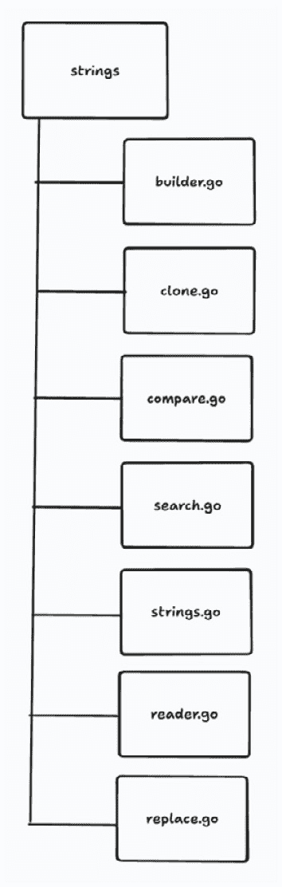
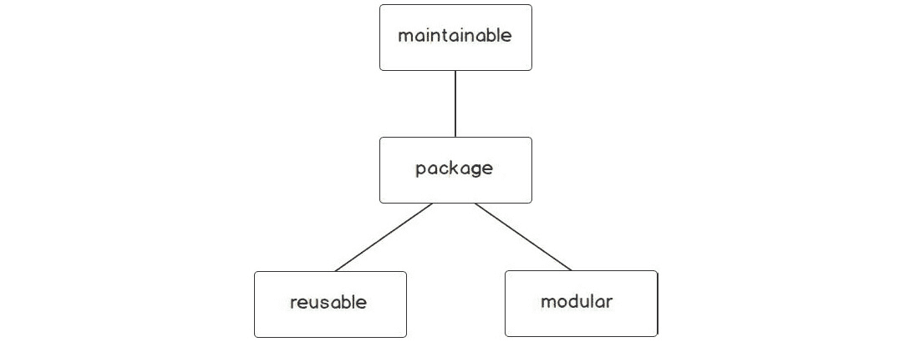
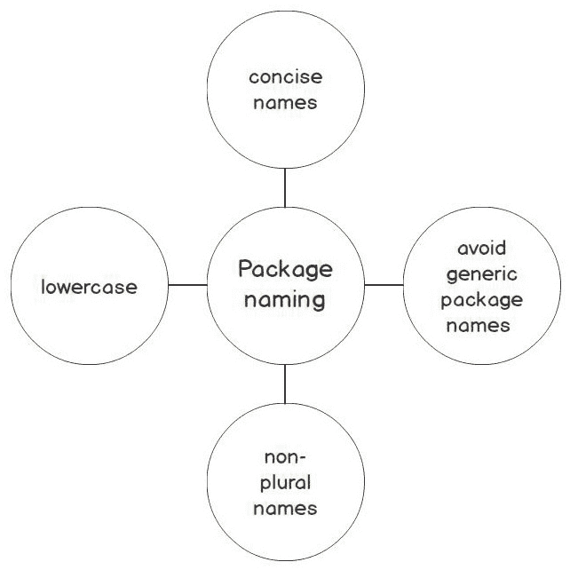
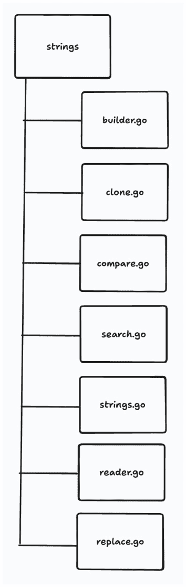
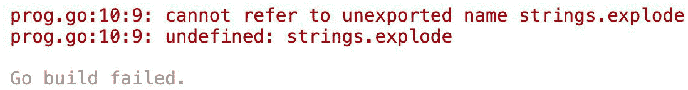
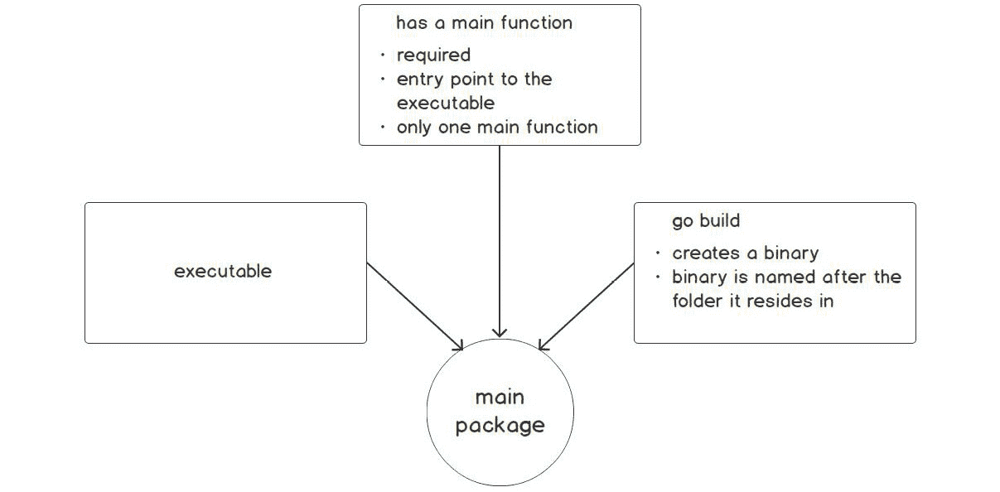
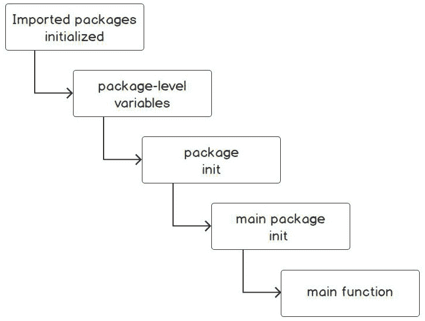
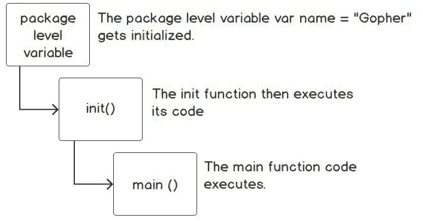
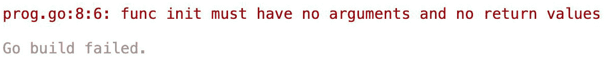
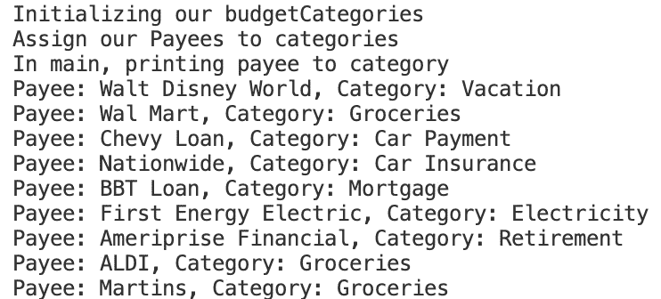

# 包保持项目可管理

概述

本章旨在展示在 Go 程序中使用包的重要性。我们将讨论如何使用包来帮助我们的代码更易于维护、重用和模块化。在本章中，您将看到它们如何为我们的代码带来结构和组织。这将在我们的练习、活动和 Go 标准库的一些示例中也有所体现。

到本章结束时，您将能够描述一个包及其结构，并声明一个包。您将学习如何评估包中的导出和非导出名称，创建自己的包，并导入您的自定义包。您还将能够区分可执行包和非可执行包，并为包创建别名。

# 技术要求

对于本章，您需要 Go 版本 1.21 或更高版本。本章的代码可以在以下位置找到：[`github.com/PacktPublishing/Go-Programming-From-Beginner-to-Professional-Second-Edition-/tree/main/Chapter10`](https://github.com/PacktPublishing/Go-Programming-From-Beginner-to-Professional-Second-Edition-/tree/main/Chapter10)。

# 简介

在上一章中，我们探讨了接口。我们看到了如何使用接口来描述类型的行怍。我们还发现，只要类型满足接口的方法集，我们就可以将不同类型的参数传递给接受接口的函数。我们还看到了如何使用接口实现多态。

在本章中，我们将探讨 Go 如何将代码组织成包。我们将看到如何使用包来隐藏或暴露不同的 Go 结构，如结构体、接口、函数等。我们的程序在代码行数和复杂度上一直相对较小。大多数程序都包含在一个代码文件中，通常命名为`main.go`，并在一个名为`main`的单个包内。在本章的后面部分，我们将探讨`package main`的重要性，所以如果您在这个阶段还不理解它，请不要担心。当您在开发团队中工作时，情况并不总是如此。通常，您的代码库可以变得相当庞大，包含多个文件、多个库和多个团队成员。如果我们不能将代码分解成更小的、可管理的部分，这将相当受限。Go 编程语言通过将类似的概念模块化到包中来解决管理大型代码库的复杂性。Go 的创造者使用包来解决他们自己的标准库中的这个问题。在本书中，您已经使用了许多 Go 包，例如`fmt`、`string`、`os`等。

让我们看看 Go 标准库中的一个包结构的例子。Go 的`strings`包封装了操作字符串的字符串函数。通过保持`strings`包只关注操作字符串的函数，作为 Go 开发者，我们知道这个函数应该包含我们需要的所有字符串操作功能。

Go 的`strings`包结构如下([`pkg.go.dev/strings#section-sourcefiles`](https://pkg.go.dev/strings#section-sourcefiles))：



图 10.1：截至 Go 1.21 的 strings 包及其包含的文件

上述图表显示了`strings`包及其包含的文件。`strings`包中的每个文件都以其支持的功能命名。代码的逻辑组织从包到文件。我们可以很容易地得出结论，`strings`包包含用于操作字符串的代码。然后我们可以进一步得出结论，`replace.go`文件包含用于替换字符串的函数。您已经可以看到，包的概念结构可以将您的代码组织成模块化块。您从一起工作以实现某个目的的代码开始，即字符串操作，并将其存储在名为`strings`的包中。然后您可以将代码进一步组织到`.go`文件中，并根据其目的命名它们。下一步是将执行单个目的的函数放入其中，该目的反映了文件名和包名。我们将在本章讨论代码结构时进一步讨论这些概念思想。

开发可维护、可重用和模块化的软件非常重要。让我们简要讨论软件开发的核心组件。

## 可维护

为了使代码可维护，它必须易于更改，并且任何更改都必须具有低风险，不会对程序产生不利影响。可维护的代码易于修改和扩展，并且易于阅读。随着代码通过软件开发生命周期的不同阶段，代码更改的成本会增加。这些更改可能是由错误、增强或需求变更引起的。当代码不易维护时，成本也会增加。代码需要可维护的另一个原因是需要在行业中保持竞争力。如果你的代码不易维护，可能难以应对竞争对手发布可能用于超越你应用的软件功能的反应。这些只是代码需要可维护的一些原因。

## 可重用

可重用代码是可以在新软件中使用的代码。例如，我在现有的应用程序中有一个函数，该函数为我的邮件应用程序返回地址；这个函数可能被用于新的软件。返回地址的函数可以用于我新的软件，该软件为顾客返回他们已下订单的地址。

拥有可重用代码的优势如下：

+   通过使用现有的包来降低未来项目的成本

+   由于无需重新发明轮子，它减少了交付应用程序所需的时间

+   通过增加测试和更多使用，程序的质量将得到提高

+   在开发周期中，可以花更多的时间在其他创新领域

+   随着你的包的增长，及时为未来项目打下基础变得更加容易

很容易看到为我们的项目创建可重用代码的许多好处。

## 模块化

模块化和可重用代码在一定程度上是相关的，因为拥有模块化代码使得它更有可能被重用。在开发代码时，代码的组织是一个突出的问题。在一个未组织的大型程序中找到执行特定功能的代码几乎是不可能的，甚至在不知道是否有执行特定任务的代码的情况下，确定这一点也是困难的。模块化有助于解决这个问题。理念是，你的代码执行的每个离散任务都有其自己的代码部分，位于特定的位置。

Go 语言鼓励你通过使用包来开发可维护、可重用和模块化的代码。它旨在鼓励良好的软件开发实践。我们将深入探讨 Go 语言如何利用包来完成这些任务：



图 10.2：代码包可以提供的类型

在下一个主题中，我们将讨论什么是包以及构成包的组件。

# 什么是包？

Go 语言遵循**不要重复自己**（DRY）原则。这意味着你不应该重复编写相同的代码。将你的代码重构为函数是 DRY 原则的第一步。如果你有数百甚至数千个你经常使用的函数，你将如何跟踪所有这些函数？其中一些函数可能具有共同的特征。你可能有一组执行数学运算、字符串操作、打印或基于文件的操作的函数。你可能正在考虑将它们拆分成单独的文件：


图 10.3：按文件分组函数

这可能有助于缓解一些问题。然而，如果你的字符串功能开始进一步增长呢？那么你将有一个大量的字符串函数在一个文件中，甚至多个文件中。你构建的每个程序也必须包含`string`、`math`和`io`的所有代码。你将不得不将代码复制到你所构建的每个应用程序中。一个代码库中的错误必须在多个程序中修复。这种代码结构是不可维护的，也不鼓励代码重用。Go 中的包是组织代码的下一步，以便轻松重用代码组件。以下图表显示了从函数到源文件再到包的代码组织进展：


图 10.4：代码进度组织

Go 将代码组织成包以提高可重用性，这些包被称为目录。一个包本质上是你工作空间中的一个目录，包含一个或多个 Go 源文件，用于对执行特定任务的代码进行分组。它只暴露必要的部分，以便使用你包的人能够完成任务。包的概念类似于在计算机上使用目录来组织文件。

## 包结构

对于 Go 语言来说，一个包中包含多少个不同的文件并不重要。你应该根据可读性和逻辑分组将代码分成尽可能多的文件。然而，一个包中的所有文件必须位于同一个目录下。源文件应包含相关的代码，这意味着如果包是用于配置解析，那么其中不应该包含连接到数据库的代码。一个包的基本结构包括一个目录，包含一个或多个 Go 文件和相关代码。以下图表总结了包结构的核心组件：


图 10.5：包结构

在 Go 中，常用的包之一是`strings`包。它包含几个 Go 文件，在 Go 文档中被称为包文件。包文件是包的一部分的`.go`源文件；例如：

+   `builder.go`

+   `compare.go`

+   `reader.go`

+   `replace.go`

+   `search.go`

+   `strings.go`

上述列表中的文件都在标准库中共享与字符串操作相关的相关代码。在我们讨论如何声明一个包之前，我们需要讨论包的正确 Go 命名约定。

## 包命名

你的包名很重要。它代表你的包包含的内容，并标识其目的。你可以将包名视为自文档化。在命名包时需要仔细考虑。包名应该简短且简洁。它不应该冗长。通常选择简单名词作为包名。以下将是不好的包名：

+   `stringconversion`

+   `synchronizationprimitives`

+   `measuringtime`

更好的选择可能是以下这些：

+   `strconv`

+   `sync`

+   `time`

注意

`strconv`、`sync`和`time`是标准库中实际存在的 Go 包。

此外，包的样式也是需要考虑的因素。以下是一些 Go 包名的较差选择：

+   `StringConversion`

+   `synchronization_primitives`

+   `measuringTime`

在 Go 中，包名应该是全部小写，不带下划线。不要使用驼峰式或蛇形风格。存在多个复数命名的包。

鼓励使用缩写，只要它们在编程社区中熟悉或常见。用户应该能够仅从包名中轻松理解该包的用途；例如：

+   `strconv`（字符串转换）

+   `regexp`（正则表达式搜索）

+   `sync`（同步）

+   `os`（操作系统）

避免使用`misc`、`util`、`common`或`data`等包名。这些包名会让用户难以理解其用途。在某些情况下，可能会有一些偏离这些指南的情况，但大部分情况下，这是我们应努力追求的：



图 10.6：包命名约定

你可以看到，在挑选包名时，几乎是一门艺术。你希望包名简洁、描述性强，且在使用时清晰易懂。既然我们已经讨论了包名，让我们来看看包声明。

## 包声明

每个 Go 文件都以包声明开始。包声明是包的名称。包中的每个文件的第一行必须是包声明：

```go
package <packageName>
```

回想一下，标准库中的`strings`包包含以下 Go 源文件：



图 10.7：截至 Go 1.21 的字符串包及其包含的文件

这些文件中的每一个都以包声明开始，尽管它们都是独立的文件。我们将从 Go 标准库中的一个示例中查看。在 Go 标准库中，有一个名为`strings\`的包。它由多个文件组成。我们只将查看包中的代码片段：`builder.go`、`compare.go`和`replace.go`。我们已删除注释和一些代码，仅为了展示包文件以包名开头。代码片段将不会有输出。这是 Go 如何将代码组织到多个文件但仍在同一包中的示例（[`golang.org/src/strings/builder.go`](https://golang.org/src/strings/builder.go)）：

```go
package strings
import (
    "unicode/utf8"
    "unsafe"
)
type Builder struct {
    addr *Builder // of receiver, to detect copies by value
    buf []byte
}
// https://golang.org/src/strings/compare.go
package strings
func Compare(a, b string) int {
    if a == b {
        return 0
    }
    if a < b {
        return -1
    }
    return +1
}
```

完整的代码可在[`github.com/PacktPublishing/Go-Programming-From-Beginner-to-Professional-Second-Edition-/blob/main/Chapter10/Example10.01/strings.go`](https://github.com/PacktPublishing/Go-Programming-From-Beginner-to-Professional-Second-Edition-/blob/main/Chapter10/Example10.01/strings.go)找到。

在 Go 源文件中定义的所有函数、类型和变量都可以在该包内访问。尽管你的包可能分布在多个文件中，但它仍然是同一个包的一部分。内部，所有代码都可以跨文件访问。简单来说，代码在包内是可见的。注意，并非所有代码在包外都是可见的。前面的代码片段来自官方的 Go 库。有关代码的进一步解释，请访问前面的 Go 代码片段中的链接。

# 导出和未导出代码

Go 有一个非常简单的方式来确定代码是导出还是未导出。导出意味着变量、类型、函数等在包外部是可见的。未导出意味着它只对包内部可见。如果一个函数、类型、变量等以大写字母开头，它是可导出的；如果以小写字母开头，它是不可导出的。在 Go 中没有需要关心的访问修饰符。如果函数名称是大写的，那么它是导出的，如果是小写的，那么它是未导出的。

注意

只暴露我们希望其他包看到的代码是一种良好的实践。我们应该隐藏所有其他外部包不需要的内容。

让我们看看下面的代码片段：

```go
package main
import (
    "strings"
    "fmt"
)
func main() {
    str := "found me"
    if strings.Contains(str, "found") {
        fmt.Println("value found in str")
    }
}
```

这个代码片段使用了`strings`包。我们正在调用一个名为`Contains`的`strings`函数。`strings.Contains`函数会搜索`str`变量，看它是否包含值`"found"`。如果`"found"`在`str`变量中，`strings.Contains`函数将返回`true`；如果`"found"`不在`str`变量中，`strings.Contains`函数将返回`false`：

```go
strings.Contains(str, "found")
```

要调用函数，我们在包名前加上函数名。

这个函数是可导出的，因此对`strings`包外的其他人来说是可访问的。我们知道它是一个导出函数，因为函数的第一个字母是大写的。

当你导入一个包时，你只能访问导出的名称。

我们可以通过查看`strings.go`文件来验证函数是否存在于`strings`包中：

```go
// https://golang.org/src/strings/strings.go
// Contains reports whether substr is within s.
func Contains(s, substr string) bool {
    return Index(s, substr) >= 0
}
```

下面的代码片段将尝试访问`strings`包中的一个未导出函数：

```go
package main
import (
    "fmt"
    "strings"
)
func main() {
    str := "found me"
    slc := strings.explode(str, 3)
    fmt.Println(slc)
}
```

函数未导出，因为它以小写字母开头。只有包内的代码可以访问该函数；它对包外不可见。

代码尝试在`strings.go`包文件中调用一个未导出的函数：



图 10.8：程序输出

以下代码片段来自 Go 标准库的`strings`包以及该包内部的`strings.go`文件（[`packt.live/2RMxXqh`](https://packt.live/2RMxXqh)）。你可以看到`explode()`函数是不可导出的，因为函数名以小写字母开头：

main.go

```go
1  // https://golang.org/src/strings/strings.go
2  // explode splits s into a slice of UTF-8 strings,
3  // one string per Unicode character up to a maximum of n (n < 0 means no limit).
4  // Invalid UTF-8 sequences become correct encodings of U+FFFD.
5  func explode(s string, n int) []string {
6      l := utf8.RuneCountInString(s)
7      if n < 0 || n > l {
8          n = l
9      }
10      a := make([]string, n)
11      for i := 0; i < n-1; i++ {
12          ch, size := utf8.DecodeRuneInString(s)
13          a[i] = s[:size]
14          s = s[size:]
15          if ch == utf8.RuneError {
16              a[i] = string(utf8.RuneError)
```

完整代码可在[`github.com/PacktPublishing/Go-Programming-From-Beginner-to-Professional-Second-Edition-/blob/main/Chapter10/Example10.02/strings.go`](https://github.com/PacktPublishing/Go-Programming-From-Beginner-to-Professional-Second-Edition-/blob/main/Chapter10/Example10.02/strings.go)找到。

## 包别名

Go 也有别名包名的功能。您可能希望使用别名名的原因有以下几点：

+   包名可能不容易让人理解其用途。为了清晰起见，可能更好的是为包使用不同的别名。

+   包名可能太长。在这种情况下，您希望别名更简洁、更简洁。

+   可能存在包路径唯一但包名相同的场景。这时，您需要使用别名来区分这两个包。

包别名语法非常简单。您在`import`包路径之前放置别名名：

```go
import "fmt"
```

这里有一个简单的例子，展示了如何使用包别名：

```go
package main
import (
    f "fmt")
func main() {
    f.Println("Hello, Gophers")
```

我们将`fmt`包别名为`f`：

```go
    f.Println("Hello, Gophers")
```

在`main()`函数中，我们现在可以使用`f`别名调用`Println()`函数。

## 主包

`main`包是一个特殊的包。Go 中有两种基本的包类型：可执行包和非可执行包。`main`包是 Go 中的一个可执行包。位于此包中的逻辑可能不会被其他包消费。`main`包要求在其包中存在一个`main()`函数。`main()`函数是 Go 可执行程序的入口点。当您对`main`包执行`go build`时，它将编译该包并创建一个二进制文件。二进制文件将创建在`main`包所在的目录中。二进制文件的名字将是它所在的文件夹名：



图 10.9：为什么 main 包是特殊的

这里是一个`main`包代码的简单示例：

```go
package main
import (
    "fmt"
)
func main() {
    fmt.Println("Hello Gophers!")
}
```

预期输出如下：

```go
Hello Gophers!
```

## 练习 10.01 – 创建一个包来计算各种形状的面积

在*第七章*，“利用接口变得灵活”，我们实现了计算不同形状面积的代码。在这个练习中，我们将所有关于形状的代码移动到一个名为`shape`的包中。然后，我们将`shape`包中的代码更新为可导出。然后，我们将更新`main`包以导入我们新的`shape`包。然而，我们希望它在`main`包的`main()`函数中仍然执行相同的功能。

这里是我们将要转换为包的代码：

[`github.com/PacktPublishing/Go-Programming-From-Beginner-to-Professional-Second-Edition-/blob/main/Chapter07/Exercise07.02/main.go`](https://github.com/PacktPublishing/Go-Programming-From-Beginner-to-Professional-Second-Edition-/blob/main/Chapter07/Exercise07.02/main.go)

您应该有一个目录结构，如下面的截图所示：


图 10.10：程序目录结构

`shape.go` 文件应包含整个代码：[`github.com/PacktPublishing/Go-Programming-From-Beginner-to-Professional-Second-Edition-/blob/main/Chapter10/Exercise10.01/pkg/shape/shape.go`](https://github.com/PacktPublishing/Go-Programming-From-Beginner-to-Professional-Second-Edition-/blob/main/Chapter10/Exercise10.01/pkg/shape/shape.go)。

我们将只介绍与将此代码转换为包相关的更改；有关我们已在上一章中介绍过的代码部分，请参阅*第七章*，*通过接口* *变得灵活*：

1.  在 `Chapter10` 内创建一个名为 `Exercise10.01` 的目录。

1.  在 `Exercise10.01` 目录内创建一个新的 Go 模块：

    ```go
    go mod init exercise10.01
    ```

1.  在 `Exercise10.01` 目录内创建两个更多目录，分别命名为 `cmd` 和 `pkg/shape` 的嵌套目录。

1.  在 `Exercise10.01/cmd` 目录内创建一个名为 `main.go` 的文件。

1.  在 `Exercise10.01/pkg/shape` 目录内创建一个名为 `shape.go` 的文件。

1.  打开 `Exercise10.01/pkg/shape.go` 文件。

1.  添加以下代码：

    ```go
    package shape
    import "fmt"
    ```

    此文件中的第一行代码告诉我们这是一个名为 `shape` 的不可执行包。不可执行包在编译时不会产生二进制或可执行代码。回想一下，`main` 包是一个可执行包。

1.  接下来，我们需要使类型可导出。对于每个 `struct` 类型，我们必须将类型名称及其字段大写化以使其可导出。可导出意味着它可以在包外部可见：

    ```go
    type Shape interface {
        area() float64
        name() string
    }
    type Triangle struct {
        Base float64
        Height float64
    }
    type Rectangle struct {
        Length float64
        Width float64
    }
    type Square struct {
        Side float64
    }
    ```

1.  我们还必须通过将方法名称更改为小写来使方法不可导出。目前没有必要让这些方法在包外部可见。

1.  `shape.go` 文件内容应包括以下内容：

    ```go
    func PrintShapeDetails(shapes ...Shape) {
        for _, item := range shapes {
            fmt.Printf("The area of %s is: %.2f\n", item.name(), item.area())
        }
    }
    func (t Triangle) area() float64 {
        return (t.Base * t.Height) / 2
    }
    func (t Triangle) name() string {
        return "Triangle"
    }
    func (r Rectangle) area() float64 {
        return r.Length * r.Width
    }
    func (r Rectangle) name() string {
        return "Rectangle"
    }
    func (s Square) area() float64 {
        return s.Side * s.Side
    }
    func (s Square) name() string {
        return "Square"
    }
    ```

1.  此步骤的完整代码可在以下位置找到：[`github.com/PacktPublishing/Go-Programming-From-Beginner-to-Professional-Second-Edition-/blob/main/Chapter10/Exercise10.01/pkg/shape/shape.go`](https://github.com/PacktPublishing/Go-Programming-From-Beginner-to-Professional-Second-Edition-/blob/main/Chapter10/Exercise10.01/pkg/shape/shape.go)。

1.  `PrintShapeDetails()` 函数也需要大写化：

    ```go
    func PrintShapeDetails(shapes ...Shape) {
        for _, item := range shapes {
            fmt.Printf("The area of %s is: %.2f\n", item.name(), item.area())
        }
    }
    ```

1.  执行构建以确保没有编译错误：

    ```go
    go build
    ```

1.  这里是 `main.go` 文件的列表。通过将包命名为 `main`，我们知道这是一个可执行的：

    ```go
    package main
    ```

1.  `import` 声明只有一个导入。它是 `shape` 包。我们可以看到包名是 `shape`，因为它是在路径声明中的最后一个目录名。我的包所在路径可能与您的不一样：

    ```go
    import  "exercise10.01/pkg/shape"
    ```

1.  在 `main()` 函数中，我们正在初始化 `shape` 包的导出类型：

    ```go
    func main() {
        t := shape.Triangle{Base: 15.5, Height: 20.1}
        r := shape.Rectangle{Length: 20, Width: 10}
        s := shape.Square{Side: 10}
    ```

1.  然后我们调用 `shape()` 函数和 `PrintShapeDetails`，以获取每个形状的面积：

    ```go
        shape.PrintShapeDetails(t, r, s)
    }
    ```

1.  在命令行中，进入 `Exercise10.01/cmd` 目录结构。

1.  输入以下内容：

    ```go
    go build
    ```

1.  `go build`命令将编译你的程序并创建一个以目录命名的可执行文件，名为`cmd`。

1.  输入可执行文件名并按*Enter*键：

    ```go
    ./cmd
    ```

预期的输出如下：

```go
The area of Triangle is: 155.78
The area of Rectangle is: 200.00
The area of Square is 100.00
```

我们现在有了之前在接口章节的`shape`实现中拥有的功能。现在`shape`功能被封装在`shape`包中。我们只暴露或使需要维护之前实现的功能或方法可见。`main`包更加简洁，并导入本地`shape`包以提供之前实现中的功能。

# `init()`函数

正如我们之前讨论的，每个 Go 程序（可执行程序）都是从`main`包开始的，入口点是`main()`函数。还有一个我们应该注意的特殊函数，称为`init()`。每个源文件都可以有一个`init()`函数，但到目前为止，我们将从`main`包的角度来看`init()`函数。当你开始编写包时，你可能需要为包提供一些初始化（`init()`函数）。`init()`函数用于设置状态或值。`init()`函数为你的包添加初始化逻辑。以下是一些`init()`函数使用示例：

+   设置数据库对象和连接

+   包变量的初始化

+   创建文件

+   加载配置数据

+   验证或修复程序状态

`init()`函数需要以下内容：

+   导入的包首先初始化

+   包级别变量初始化

+   调用包的`init()`函数

+   执行`main()`函数

以下图表显示了典型 Go 程序遵循的执行顺序：



图 10.11：执行顺序

这里有一个简单的示例，演示了`package main`的执行顺序：

```go
package main
import (
    "fmt"
)
var name = "Gopher"
func init() {
    fmt.Println("Hello,", name)
}
func main() {
    fmt.Println("Hello, main function")
}
```

代码的输出如下：

```go
Hello, Gopher
Hello, main function
```

让我们分部分理解这段代码：

```go
var name = "Gopher"
```

根据代码的输出，包级别的变量声明首先执行。我们知道这一点是因为`name`变量在`init()`函数中被打印出来：

```go
func init() {
    fmt.Println("Hello,", name)
}
```

然后`init()`函数被调用并打印出`"Hello, Gopher"`：

```go
func main() {
    fmt.Println("Hello, main function")
}
```

最后，执行`main()`函数：



图 10.12：代码片段的执行流程

`init()`函数不能有任何参数或返回值：

```go
package main
import (
    "fmt"
)
var name = "Gopher"
func init(age int) {
    fmt.Println("Hello, ", name)
}
func main() {
    fmt.Println("Hello, main function")
}
```

运行此代码片段将导致以下错误：



图 10.13：程序输出

## 练习 10.02 – 加载预算类别

编写一个程序，在`main()`函数运行之前将预算类别加载到全局映射中。然后`main()`函数应打印映射中的数据：

1.  创建一个`main.go`文件。

1.  代码文件将属于`package main`，并且需要导入`fmt`包：

    ```go
    package main
    import "fmt"
    ```

1.  创建一个全局变量，它将包含一个键为`int`、值为`string`的预算类别映射：

    ```go
    var budgetCategories = make(map[int]string)
    ```

1.  我们需要在`main()`函数运行之前使用一个`init()`函数来加载我们的预算类别：

    ```go
    func init() {
        fmt.Println("Initializing our budgetCategories")
        budgetCategories[1] = "Car Insurance"
        budgetCategories[2] = "Mortgage"
        budgetCategories[3] = "Electricity"
        budgetCategories[4] = "Retirement"
        budgetCategories[5] = "Vacation"
        budgetCategories[7] = "Groceries"
        budgetCategories[8] = "Car Payment"
    }
    ```

1.  由于我们的预算类别已经加载，我们现在可以遍历映射并打印它们：

    ```go
    func main() {
        for k, v := range budgetCategories {
            fmt.Printf("key: %d, value: %s\n", k, v)
        }
    }
    ```

我们将得到以下输出：

```go
Initializing our budgetCategories
key: 5, value: Vacation
key: 7, value: Groceries
key: 8, value: Car Payment
key: 1, value: Car Insurance
key: 2, value: Mortgage
key: 3, value: Electricity
key: 4, value: Retirement
```

注意

输出的顺序可能会有所不同；Go 映射不保证数据的顺序。

这里的目的是展示如何使用`init()`函数在`main()`函数执行之前执行数据初始化和加载。通常需要在`main()`运行之前加载的数据是静态数据，例如下拉列表值或某种配置。如所示，数据通过`init()`函数加载后，可以被`main()`函数使用。在下一个主题中，我们将看到多个`init()`函数是如何执行的。

## 执行多个`init()`函数

一个包中可以有多个`init()`函数。这使您能够模块化初始化，以更好地维护代码。例如，假设您需要设置各种文件和数据库连接以及修复程序执行的环境状态。在一个`init()`函数中完成所有这些会使维护和调试变得复杂。多个`init()`函数的执行顺序是函数在代码中放置的顺序：

```go
package main
import (
    "fmt"
)
var name = "Gopher"
func init() {
    fmt.Println("Hello,", name)
}
func init() {
    fmt.Println("Second")
}
func init() {
    fmt.Println("Third")
}
func main() {
    fmt.Println("Hello, main function")
}
```

让我们将代码分解成部分并评估它：

```go
var name = "Gopher"
```

Go 首先初始化`name`变量，在`init()`函数执行之前：

```go
func init() {
    fmt.Println("Hello,", name)
}
```

这首先打印出来，因为它是在函数中第一个`init`：

```go
func init() {
    fmt.Println("Second")
}
```

由于它是函数中的第二个`init`，所以先前的内容被打印出来：

```go
func init() {
    fmt.Println("Third")
}
```

由于它是函数中的第三个`init`，所以先前的内容被打印出来：

```go
func main() {
    fmt.Println("Hello, main function")
}
```

最后，执行`main()`函数。

结果将如下所示：

```go
Hello, Gopher
Second
Third
Hello, main function
```

## 练习 10.03 – 将收款人分配给预算类别

我们将扩展我们的程序，从*练习 10.02*，*加载预算类别*，到现在为预算类别分配收款人。这类似于许多尝试将收款人与常用类别匹配的预算应用程序。然后我们将打印收款人与类别之间的映射：

1.  创建一个`main.go`文件。

1.  将*练习 10.02*，*加载预算类别*（https://github.com/PacktPublishing/Go-Programming-From-Beginner-to-Professional-Second-Edition-/blob/main/Chapter10/Exercise10.02/main.go）中的代码复制到`main.go`文件中。

1.  在`budgetCategories`之后添加一个`payeeToCategory`映射：

    ```go
    var budgetCategories = make(map[int]string)
    var payeeToCategory = make(map[string]int)
    ```

1.  添加另一个`init()`函数。这个`init()`函数将用于填充我们的新`payeeToCategory`映射。我们将把收款人分配给类别的键值：

    ```go
    func init() {
        fmt.Println("Initializing our budgetCategories")
        budgetCategories[1] = "Car Insurance"
        budgetCategories[2] = "Mortgage"
        budgetCategories[3] = "Electricity"
        budgetCategories[4] = "Retirement"
        budgetCategories[5] = "Vacation"
        budgetCategories[7] = "Groceries"
        budgetCategories[8] = "Car Payment"
    }
    ```

1.  本步骤的完整代码可在[`github.com/PacktPublishing/Go-Programming-From-Beginner-to-Professional-Second-Edition-/blob/main/Chapter10/Exercise10.03/main.go`](https://github.com/PacktPublishing/Go-Programming-From-Beginner-to-Professional-Second-Edition-/blob/main/Chapter10/Exercise10.03/main.go)找到。

1.  在`main()`函数中，我们将打印出收款人到类别。我们遍历`payeeToCategory`映射，打印键（`payee`）。我们通过将`payeeToCategory`映射的值作为键传递给`budgetCategories`映射来打印类别：

    ```go
    func main() {
        fmt.Println("In main, printing payee to category")
        for k, v := range payeeToCategory {
            fmt.Printf("Payee: %s, Category: %s\n", k, budgetCategories[v])
        }
    }
    ```

这里是预期的输出：



图 10.14：将收款人分配到预算类别

您现在创建了一个程序，在`main()`函数执行之前执行多个`init()`函数。每个`init()`函数将数据加载到我们的全局映射变量中。我们确定了`init()`函数执行的顺序，因为显示的`print`语句。这表明`init()`函数按照它们在代码中出现的顺序打印。了解您`init()`函数的顺序很重要，因为您可能会根据代码执行的顺序得到不可预见的结果。

在即将到来的活动中，我们将使用所有这些概念，包括我们查看的包，看看它们是如何一起工作的。

## 活动 10.01 – 创建一个计算工资和绩效评估的函数

在这个活动中，我们将从*第七章*中的*活动 7.01*，*计算工资和绩效评估*，使用包进行模块化。我们将重构从[`github.com/PacktPublishing/Go-Programming-From-Beginner-to-Professional-Second-Edition-/blob/main/Chapter07/Activity7.01/main.go`](https://github.com/PacktPublishing/Go-Programming-From-Beginner-to-Professional-Second-Edition-/blob/main/Chapter07/Activity7.01/main.go)的代码：

1.  将`Developer`、`Employee`和`Manager`的类型和方法移动到`pkg/payroll`下的自己的包中。类型、方法和函数必须正确导出或未导出。

1.  将包命名为`payroll`。

1.  将类型及其方法逻辑上分离到不同的包文件中。回想一下，良好的代码组织涉及将类似功能分离到单独的文件中。

1.  创建一个`main()`函数作为`payroll`包的别名。

1.  在`cmd`目录下的`main`包中引入两个`init()`函数。第一个`init()`函数应该简单地打印一条问候消息到`stdout`。第二个`init()`函数应该初始化/设置键值对。

预期的输出如下：

```go
Welcome to the Employee Pay and Performance Review
++++++++++++++++++++++++++++++++++++++++++++++++++
Initializing variables
Eric Davis got a review rating of 2.80
Eric Davis got paid 84000.00 for the year
Mr. Boss got paid 160500.00 for the year
```

在这个活动中，我们看到了如何使用包来分离我们的代码，然后将代码逻辑上分离成单个文件。我们可以看到每个文件都构成了一个包。包中的每个文件都可以访问其他文件，无论它们是否在单独的文件中。这个活动演示了如何创建包含多个文件的包，以及如何使用这些单独的文件进一步组织我们的代码。

注意

本活动的解决方案可以在本章的 GitHub 仓库文件夹中找到：[`github.com/PacktPublishing/Go-Programming-From-Beginner-to-Professional-Second-Edition-/tree/main/Chapter10/Activity10.01`](https://github.com/PacktPublishing/Go-Programming-From-Beginner-to-Professional-Second-Edition-/tree/main/Chapter10/Activity10.01)。

# 摘要

在本章中，我们探讨了开发可维护、可重用和模块化软件的重要性。我们发现了 Go 的包在满足这些软件开发标准方面发挥着重要作用。我们研究了包的整体结构。它由一个目录组成，可以包含一个或多个文件，并包含相关的代码。包本质上是你工作空间中的一个目录，包含一个或多个用于分组执行任务的文件。它仅向使用你的包的人公开必要的部分以完成任务。我们讨论了正确命名包的重要性。我们还学习了如何命名一个包；即简洁、小写、描述性、使用非复数名称，并避免使用通用名称。包可以是可执行的或不可执行的。如果一个包是`main`包，那么它是一个可执行包。`main`包必须有一个`main()`函数，这是我们包的入口点。

我们还讨论了什么是可导出和不可导出的代码。当我们将函数、类型或方法的名称大写时，它对使用我们的包的其他人是可见的。将函数、类型或方法小写化使其对包外部的其他用户不可见。我们了解到`init()`函数可以执行以下任务：初始化变量、加载配置数据、设置数据库连接或验证我们的程序状态是否已准备好执行。`init()`函数在执行时和如何利用它们方面有一些规则。本章将帮助你编写高度可管理、可重用和模块化的代码。

在下一章中，我们将开始探索调试技巧，这是软件开发的一个关键方面。这包括学习有效的故障排除，以实现稳健的开发体验。
