# 11

# 消除 bug 的调试技能

概述

在本章中，我们将探讨基本的调试方法。我们将探讨我们可以采取的一些主动措施来减少我们程序中引入的 bug 数量。一旦我们理解了这些措施，我们将研究我们可以定位 bug 的方法。

你将能够熟悉 Go 中的调试，并实现各种格式化打印的方法。你将评估基本的调试技术，并找到代码中 bug 的一般位置。到本章结束时，你将知道如何使用 Go 代码打印变量类型和值，以及为了调试目的记录应用程序的状态。你还将看到在不同的或受限环境中，你的代码可能部署到的环境中可用的调试措施。

# 技术要求

对于本章，你需要 Go 版本 1.21 或更高版本。本章的代码可以在以下位置找到：[`github.com/PacktPublishing/Go-Programming-From-Beginner-to-Professional-Second-Edition-/tree/main/Chapter11`](https://github.com/PacktPublishing/Go-Programming-From-Beginner-to-Professional-Second-Edition-/tree/main/Chapter11)。

# 简介

在你开发软件程序的过程中，程序可能会以非预期的方式运行。例如，程序可能会抛出错误并可能崩溃。崩溃是指我们的代码在中间停止运行并突然退出。也许程序给出了我们意料之外的结果。例如，我们请求视频流服务来观看电影 *Rocky 1*，但反而得到了 *Creed 1!* 或者你将支票存入银行账户，但银行软件却从你的账户中扣除。这些软件程序以非预期方式运行的情况被称为“bug”。有时，“bug”和“error”可以互换使用。在*第六章*，“不要慌张！处理你的错误”部分，我们在“什么是错误？”一节中讨论了存在三种不同类型的错误或 bug：语法错误、运行时错误和逻辑错误。我们还考察了示例，并看到了发现每种类型错误位置的难度。

确定意外行为原因的过程称为调试。将发布到生产环境的 bug 有各种原因：

+   **测试作为事后考虑**：在开发生命周期中，不进行增量测试是很诱人的。例如，我们正在为应用程序创建多个函数，一旦我们完成所有函数，它们然后被测试。测试我们代码的一个可能更好的方式是在完成每个函数后测试它。这被称为增量测试或以更小的块交付代码。这使我们拥有更好的代码稳定性。这是通过在继续到下一个函数之前测试一个函数以确保它正常工作来实现的。我们刚刚完成的函数可能被其他函数使用。如果我们不测试它就继续，那么使用我们的函数的其他函数可能会使用一个有错误的函数。根据错误和我们对函数的更改，它可能会影响我们函数的其他用户。在本章的后面部分，我们将讨论增量测试的更多好处。

+   **应用增强或需求变更**：我们的代码在开发阶段和发布到生产阶段之间通常会发生变化。一旦进入生产阶段，我们会收到用户的反馈；反馈可能是额外的需求或对代码的增强。在一个区域更改生产级代码可能会对另一个区域产生负面影响。如果开发团队使用单元测试，那么这有助于减轻代码库更改中引入的一些错误。通过使用单元测试，我们可以在将代码交付之前运行我们的单元测试，以查看我们的更改是否产生了负面影响。我们将在稍后讨论单元测试是什么。

+   **不切实际的开发时间表**：有时，功能请求在非常紧张的时间框架内交付。这可能导致在最佳实践中走捷径，缩短设计阶段，进行较少的测试，以及收到不明确的需求。所有这些都会增加引入错误的机会。

+   **未处理的错误**：一些开发者可能选择不处理发生的错误；例如，应用程序加载配置数据所需的文件未找到，未处理无效数学运算（如除以零）的错误返回，或者可能无法建立与服务器的连接。如果你的程序没有正确处理这些和其他类型的错误，这可能会导致错误。

这些只是 bug 的几个原因。bug 对我们的程序有负面影响。一个导致计算错误的 bug 的结果可能是致命的。在医疗行业，有一种机器用于注射一种名为肝素的药物；这种药物是一种抗凝血剂，用于预防血栓。如果确定肝素给药频率和剂量的代码中存在导致其故障的 bug，机器可能会给药过多或过少。这可能会对病人产生不利影响。正如你所看到的，交付尽可能无 bug 的软件至关重要。在本章中，我们将探讨一些减少引入 bug 数量以及隔离 bug 位置的方法。

# 无 bug 代码的方法

我们将简要地探讨一些方法，这些方法将帮助我们最小化可能被引入代码中的 bug 数量。这些方法还将帮助我们增强对引入 bug 的代码部分的信心：

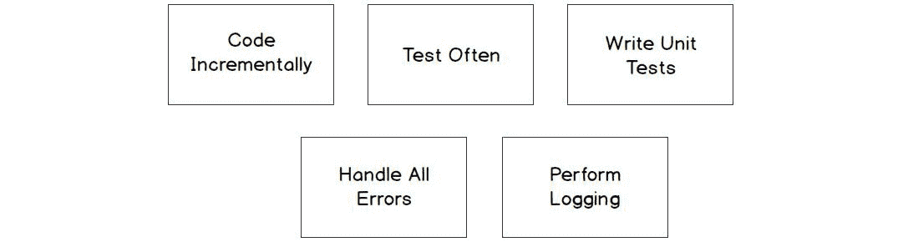

图 11.1：调试代码的不同方法

让我们更详细地看看这些方法。

## 逐步编码和经常测试

让我们考虑逐步开发的方法。这意味着逐步开发程序，并在添加增量代码后经常对其进行测试。这种模式将帮助你轻松跟踪 bug，因为你正在测试每一小段代码，而不是一个大的程序。

## 编写单元测试

当编写测试并更改代码时，单元测试可以保护代码免受潜在 bug 的引入。典型的单元测试接受一个给定的输入并验证是否产生了一个给定的结果。如果在代码更改之前单元测试通过，但在代码更改后失败，那么我们可以得出结论，我们引入了一些意外的行为。在将代码推送到生产系统之前，单元测试必须通过。换句话说，开发团队在接受代码库的新更改之前，验证测试是否通过，代码是否仍然按预期工作。

## 处理所有错误

这在*第六章*中讨论过，“不要慌张！处理你的错误”。忽略错误可能导致程序中出现意外结果。我们需要正确处理错误，以便使调试过程更容易。

## 执行日志记录

记录日志是另一种我们可以用来确定程序中发生情况的技巧。有各种类型的日志；一些常见的日志类型包括 debug、info、warn、error、fatal 和 trace。我们不会深入到每种类型的细节；相反，我们将专注于执行 debug 类型的日志。这种类型的日志通常用于确定在出现错误之前程序的状态。收集的一些信息包括变量的值、正在执行的代码部分（一个例子是函数名）、传递的参数的值、函数或方法的输出，等等。在本章中，我们将使用 Go 标准库的内置功能执行我们自己的自定义 debug 日志。Go 的内置 `log` 包可以提供时间戳。这在试图理解各种事件的时机时很有用。当你进行日志记录时，你需要考虑到性能的影响。根据应用程序及其承受的负载（即，在同一时间与系统交互的用户数量），在高峰时段应用程序的日志输出量可能会很大，可能会对应用程序的性能产生负面影响。根据添加到应用程序中的日志数量，与系统交互的用户越多，生成的日志就越多，这可能会对应用程序的性能产生更大的负面影响。在某些情况下，它可能会导致程序无响应。

## 使用 fmt 进行格式化

`fmt` 包的一个用途是将数据显示到控制台或文件系统，例如一个包含可能有助于调试代码的信息的文本文件。我们已经多次使用了 `fmt.Println()` 函数。让我们稍微深入地看看 `fmt.Println()` 的功能。`fmt.Println()` 函数在传递给函数的参数之间放置空格，然后在字符串的末尾追加一个换行符。

在 Go 中，每种类型在打印时都有一个默认的格式化方式。例如，字符串按原样打印，整数以十进制格式打印。`fmt.Println()` 函数打印参数的默认格式。

## 练习 11.01 – 使用 fmt.Println 操作

在这个练习中，我们将使用 `fmt.Println` 打印一个 `hello` 语句：

1.  导入 `fmt` 包：

    ```go
    package main
    import (
        "fmt"
    )
    ```

1.  在 `main()` 函数中声明 `fname` 和 `lname` 变量，并将两个字符串赋给变量：

    ```go
    func main() {
        fname:= "Edward"
        lname:= "Scissorhands"
    ```

1.  从 `fmt` 包中调用 `Println` 方法。它将打印 `Hello:` 然后打印两个变量的值，后面跟着一个空格。然后，它将打印一个 `\n`（换行符）到标准输出：

    ```go
        fmt.Println("Hello:", fname, lname)
    ```

1.  以下语句将 `Next Line` 加上 `\n` 打印到标准输出：

    ```go
        fmt.Println("Next Line")
    }
    ```

    输出如下：

    ```go
    Hello: Edward Scissorhands
    Next Line
    ```

我们已经演示了打印消息的基本方法。在下一个主题中，我们将探讨如何格式化我们想要打印的数据。

## 使用 fmt.Printf()进行格式化

`fmt`包也有多种格式化我们各种`print`语句输出的方式。接下来，我们将探讨`fmt.Printf()`函数。

`fmt.Printf()`根据动词格式化字符串并将其打印到`stdout`。标准输出（`stdout`）是一个输出流。默认情况下，标准输出指向终端。该函数使用一种称为格式动词的东西，有时也称为格式说明符。动词告诉`fmt`函数在哪里插入变量。例如，`%s`打印一个字符串；它是一个字符串的占位符。这些动词基于 C 语言：

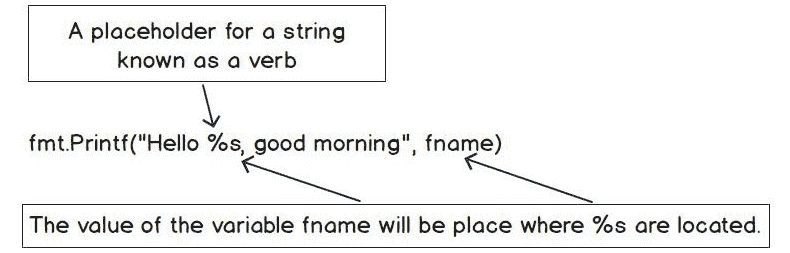

图 11.2：Printf 解释

考虑以下示例：

```go
package main
import (
    "fmt"
)
func main() {
    fname := "Edward"
    fmt.Printf("Hello %s, good morning", fname)
}
```

当`fname`变量被赋值为`Edward`时，当`fmt.Printf()`函数运行时，`%s`动词的值将是`fname`。

输出如下：

```go
Hello Edward, good morning
```

但当我们想要打印多个变量时会发生什么？我们如何在`fmt.Printf()`函数中打印多个变量？让我们看看：

```go
package main
import (
    "fmt"
)
func main() {
    fname := "Edward"
    lname := "Scissorhands"
    fmt.Printf("Hello Mr. %s %s", fname, lname)
}
```

如前述代码所示，我们现在将`fname`和`lname`赋值给一个字符串。`fmt.Printf()`函数有两个动词字符串和两个变量。第一个变量`fname`被分配给第一个`%s`实例。第二个变量`lname`被分配给第二个`%s`实例。变量按照它们在`fmt.Printf()`函数中的放置顺序替换动词。

输出如下：

```go
Hello Mr. Edward Scissorhands
```

`fmt.Printf()`函数不会在其打印的字符串末尾添加新行。如果我们想在输出中返回带有新行的内容，我们必须在字符串中添加换行符：

```go
package main
import (
    "fmt"
)
func main() {
    fname := "Edward"
    lname := "Scissorhands"
    fmt.Printf("Hello my first name is %s\n", fname)
    fmt.Printf("Hello my last name is %s", lname)
}
```

在 Go 中，你可以使用`\`来转义字符。如果你想打印`\`字符，那么你需要输入`fmt.Println("\\")`来转义该字符。这告诉我们一个字符不应该被打印，因为它有特殊的意义。当你使用`\n`时，它表示换行。我们可以在字符串的任何地方放置换行符。

输出如下：

```go
Hello my first name is Edward
Hello my last name is Scissorhands
```

如果我们没有在字符串中放置`\n`，以下将是结果：

```go
Hello my first name is EdwardHello my last name is Scissorhands
```

Go 语言有多个打印动词。我们将介绍一些常用的基本动词。当它们与基本调试相关时，我们将介绍其他动词：

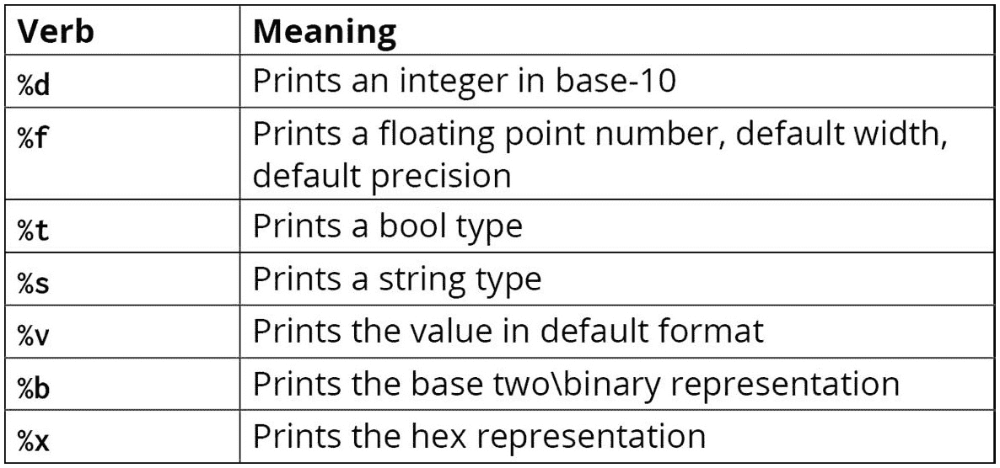

图 11.3：表示动词及其含义的表格

注意

使用`fmt`包可用的完整动词列表可以在[`pkg.go.dev/fmt#hdr-Printing`](https://pkg.go.dev/fmt#hdr-Printing)找到。

让我们看看使用动词打印各种数据类型的示例：

```go
package main
import (
    "fmt"
)
func main() {
    fname := "Joe"
    gpa := 3.75
    hasJob := true
    age := 24
    hourlyWage := 45.53
    fmt.Printf("%s has a gpa of %f.\n", fname, gpa)
    fmt.Printf("He has a job equals %t.\n", hasJob)
    fmt.Printf("He is %d earning %v per hour.\n", age, hourlyWage)
}
```

+   我们初始化了各种不同类型的变量，这些变量将在我们的`Printf()`函数中使用：

    ```go
    fmt.Printf("%s has a gpa of %f.\n", fname, gpa)
    ```

+   `%s` 是字符串的占位符；当 `Printf()` 函数运行时，`fname` 变量的值将替换 `%s`。`%f` 是浮点数的占位符；当 `Printf()` 语句运行时，`gpa` 变量中的值将替换 `%f`。

+   检查这个人是否有工作如下：

    ```go
    fmt.Printf("He has a job equals %t.\n", hasJob)
    ```

+   `%t` 是 `bool` 类型的占位符。当 `Printf()` 语句运行时，`hasJob` 变量中的值将替换 `%t`。

+   打印人的年龄和他们的时薪：

    ```go
    fmt.Printf("He is %d earning %v per hour.\n", age, hourlyWage)
    ```

+   `%d` 是十进制 `int` 的占位符。当 `Printf` 语句运行时，`age` 变量中的值将替换 `%d`。

+   `%v` 是默认格式中值的占位符。

以下是我们预期的输出：

```go
Joe has a gpa of 3.750000.
He has a job equals true.
He is 24 earning 45.53 per hour.
```

接下来，我们将演示如何格式化动词，例如 `gpa`，使它们四舍五入到特定的位数。

## 格式化选项的附加选项

动词也可以通过向动词添加额外的选项来格式化。在我们之前的例子中，`gpa` 变量打印了一些错误的零。在本主题中，我们将演示如何控制某些动词的打印。如果我们想在使用 `%f` 动词时四舍五入到特定的精度，我们可以通过在 `%` 符号后放置一个小数和一个数字来实现：`%.2f`。这将指定两位小数，第二位将被四舍五入。根据以下示例，请注意第 *n* 个数字是如何四舍五入到由 `%.nf` 动词中使用的数字 (n) 指定的：


图 11.4：四舍五入小数

您也可以指定一个数字的整体宽度。一个数字的宽度指的是您正在格式化的数字的总字符数，包括小数点。您可以通过在数字前放置一个数字来指定您正在格式化的数字的宽度。`%10.0f` 表示格式将具有总共 10 个字符的宽度；这包括小数点。如果宽度小于格式化的宽度，它将用空格填充，并且它将右对齐。

让我们看看使用宽度和 `%.f` 动词一起格式化各种数字的例子：

```go
package main
import (
    "fmt"
)
func main() {
    v := 1234.0
    v1 := 1234.6
    v2 := 1234.67
    v3 := 1234.678
    v4 := 1234.6789
    v5 := 1234.67891
    fmt.Printf("%10.0f\n", v)
    fmt.Printf("%10.1f\n", v1)
    fmt.Printf("%10.2f\n", v2)
    fmt.Printf("%10.3f\n", v3)
    fmt.Printf("%10.4f\n", v4)
    fmt.Printf("%10.5f\n", v5)
}
```

现在，让我们详细理解这段代码：

+   在 `main()` 函数中，我们声明了具有不同小数位的变量：

    ```go
    func main() {
      v := 1234.0
      v1 := 1234.6
      v2 := 1234.67
      v3 := 1234.678
      v4 := 1234.6789
      v5 := 1234.67891
    ```

+   `%10.0f` 表示总宽度为十，精度为零：

    ```go
          fmt.Printf("%10.0f\n", v)
    ```

+   `%10.1f` 表示总宽度为十，精度为一位：

    ```go
          fmt.Printf("%10.1f\n", v1)
    ```

+   `%10.2f` 表示总宽度为十，精度为两位：

    ```go
          fmt.Printf("%10.2f\n", v2)
    ```

+   `%10.3f` 表示总宽度为十，精度为三位：

    ```go
          fmt.Printf("%10.3f\n", v3)
    ```

+   `%10.4f` 表示总宽度为十，精度为四位：

    ```go
          fmt.Printf("%10.4f\n", v4)
    ```

+   `%10.5f` 表示总宽度为十，精度为五位：

    ```go
          fmt.Printf("%10.5f\n", v5)
    }
    ```

结果如下：

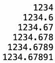

图 11.5：格式化动词后的输出

+   要使字段左对齐，您可以在 `%` 符号后使用 `–` 标志，如下所示：

    ```go
        fmt.Printf("%-10.0f\n", v)
        fmt.Printf("%-10.1f\n", v1)
        fmt.Printf("%-10.2f\n", v2)
        fmt.Printf("%-10.3f\n", v3)
        fmt.Printf("%-10.4f\n", v4)
        fmt.Printf("%-10.5f\n", v5)
    ```

    使用之前相同的变量，结果如下：

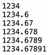

图 11.6：格式化动词后左对齐的输出

我们刚刚只是触及了 Go 对动词支持的表面。到现在为止，你应该已经对动词的工作原理有了基本的理解。我们将在接下来的主题中继续探讨使用动词和格式化`print`的多种方式。这个主题为我们将要使用的基本调试技术奠定了基础。

## 练习 11.02 – 打印十进制、二进制和十六进制值

在这个练习中，我们将从 1 到 255 打印十进制、二进制和十六进制值。结果应右对齐。十进制宽度应设置为 3，二进制或基 2 宽度设置为 8，十六进制宽度设置为 2。这个练习的目的是通过使用 Go 标准库包来正确格式化我们的数据输出：

1.  在`Chapter11`目录内创建一个名为`Exercise11.02`的目录。

1.  在`Chapter11/Exercise11.02/`目录内创建一个名为`main.go`的文件。

1.  打开`main.go`文件。

1.  导入以下包：

    ```go
    package main
    import (
        "fmt"
    )
    ```

1.  添加一个`main()`函数：

    ```go
    func main() {
    }
    ```

1.  在`main()`函数中，使用一个循环，该循环将循环 255 次：

    ```go
    func main() {
        for i := 1; i <= 255; i++ {
        }
    }
    ```

1.  接下来，我们想要以以下格式打印变量：

    以 3 位宽度和右对齐的方式显示`i`的十进制值。

    以 8 位宽度和右对齐的方式显示`i`的基 2 值。

    以 2 位宽度和右对齐的方式显示`i`的十六进制值。

    此代码应放置在`for`循环内部：

    ```go
    func main() {
        for i := 1; i <= 255; i++ {
            fmt.Printf("Decimal: %3.d Base Two: %8.b Hex: %2.x\n", i, i, i)
        }
    }
    ```

1.  在命令行中，使用以下代码更改目录：

    ```go
    cd Chapter11/Exercise11.02/
    ```

1.  在命令行中，输入以下内容：

    ```go
    go build main.go
    ```

1.  输入由`go build`命令创建的可执行文件并按*Enter*键。

这是程序的预期结果：

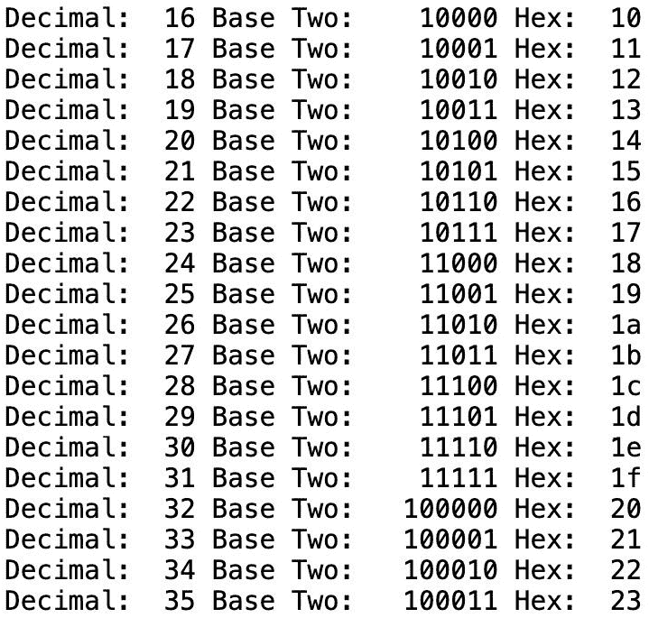

图 11.7：打印十进制、二进制和十六进制值后的预期输出

我们已经看到如何使用 Go 标准库`fmt`包中的`Printf()`函数来格式化我们的数据。我们将利用这一知识来对我们程序中的打印代码标记进行一些基本的调试。我们将在下一节中了解更多关于这方面的内容。

# 基本调试

我们一直快乐地编写代码。重大时刻已经到来；现在是时候运行我们的程序了。我们运行程序，发现结果并不像我们预期的那样。事实上，有些地方出现了严重错误。我们的输入和输出不匹配。那么，我们如何找出哪里出了问题呢？嗯，程序中出现错误是我们作为开发者都会面临的问题。然而，我们可以进行一些基本的调试来帮助我们修复这些问题，或者至少收集有关这些错误的信息：

+   `print`语句帮助我们识别在出现错误时我们在程序中的位置：

    ```go
    fmt.Println("We are in function calculateGPA")
    ```

+   **打印变量类型**：

    在调试过程中，了解我们正在评估的变量类型可能很有用：

    ```go
    fmt.Printf("fname is of type %T\n", fname)
    ```

+   **打印变量的值**：

    除了知道变量的类型外，有时了解变量中存储的值也很有价值：

    ```go
    fmt.Printf("fname value %#v\n", fname)
    ```

+   将 `debug` 语句输出到文件：可能存在仅在生产环境中发生的错误，或者我们可能想比较代码不同输入下打印到文件中的数据结果。在这种情况下，调整来自标准日志记录器的消息的日志格式化消息可能会有所帮助：

    ```go
    log.Printf("fname value %#v\n", fname)
    ```

注意

在本章后面将更详细地讨论如 `%T` 和 `%#v` 这样的格式化指令。

这里有一些基本的调试方法：

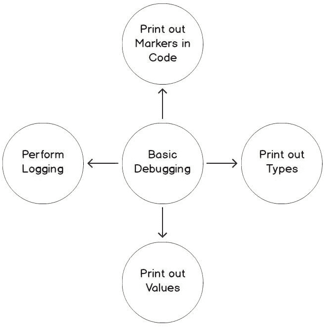

图 11.8：基本的调试方法

调试的第一步之一是确定代码中错误的总体位置。在开始分析任何数据之前，我们需要知道这个错误发生在哪里。我们通过在代码中打印标记来实现这一点。代码中的标记通常只是帮助我们识别错误发生时程序位置的 `print` 语句。它们也用于缩小错误位置的搜索范围。通常，这个过程涉及放置一个带有显示我们代码位置的信息的 `print` 语句。如果我们的代码达到那个点，我们就可以根据某些条件确定该区域是否是错误所在。如果我们发现它不是，我们可能会移除那个 `print` 语句并将其放置在代码的其他位置。

给定以下简单的示例，这里有一个返回一些输出的错误：

```go
Incorrect value
Program exited: status 1.
```

代码报告了一个错误，但我们不知道错误是从哪里来的。这个代码生成一个随机数，这个随机数被传递给 `func a` 和 `func b`。随机数的值将取决于错误发生在哪个函数中。以下代码演示了正确放置 `debug` 语句以帮助确定潜在错误所在代码区域的重要性：

main.go

```go
func main() {
    r := random(1, 20)
    err := a(r)
    if err != nil {
        fmt.Println(err)
        os.Exit(1)
    }
    err = b(r)
    if err != nil {
        fmt.Println(err)
        os.Exit(1)
    }
}
```

完整的代码可在[`github.com/PacktPublishing/Go-Programming-From-Beginner-to-Professional-Second-Edition-/blob/main/Chapter11/Example01/main.go`](https://github.com/PacktPublishing/Go-Programming-From-Beginner-to-Professional-Second-Edition-/blob/main/Chapter11/Example01/main.go)找到。

+   我们正在使用 `rand` 包来生成一个随机数。

+   `rand.Seed()` 用于确保每次运行程序时使用 `rand.Intn`，它降低了返回相同数字的可能性。自 Go 1.20 版本起，`rand.Seed()` 已被弃用，因为没有理由使用随机值调用 `Seed`。应该使用 `New(NewSource(seed))` 来获取本地随机值，以获取未来版本中调用 `Seed` 并使用已知值以获取特定结果序列的程序。然而，如果您每次都使用相同的种子，随机数生成器将在第一次运行代码时返回相同的数字。为了最大限度地减少生成相同数字的概率，我们需要每次都向种子函数提供一个唯一的数字。我们使用 `time.Now().UTC.UnixNano()` 来帮助我们的程序获得更随机的数字。不过，需要注意的是，如果您将其放入循环中，循环的迭代速度可能会使 `time.Now().UTC.UnixNano()` 生成相同的时间值。然而，对于我们的程序来说，这种情况不太可能；这只是一个在未来的代码中需要考虑的因素。

+   `rand.Intn((max-min)+1)+min` 开始生成两个其他数字之间的随机数。在我们的程序中，它是 1 和 20：

    ```go
    func a(i int) error {
        if i < 10 {
            fmt.Println("Error is in func a")
            return errors.New("Incorrect value")
        }
        return nil
    }
    func b(i int) error {
        if i >= 10 {
            fmt.Println("Error is in func b.)
            return errors.New("Incorrect value")
        }
        return nil
    }
    ```

+   前面的两个函数评估 `i` 以查看它是否在给定的范围内。如果该范围内的值返回错误，它也会打印一个 `debug` 语句，让我们知道错误发生的位置。

通过在代码中战略性地放置 `print` 语句，我们可以看到错误发生在哪个函数中。

输出应该看起来像这样：

```go
Error is in func a
Incorrect value
Program exited: status 1.
```

本节介绍了调试基础知识。我们介绍了使用 `print` 语句进行调试。在下一个主题中，我们将基于打印的知识，探讨如何打印变量类型。

注意

由于 `r` 的值具有随机性，它可能不同，这将影响程序的结果，可能是 `func a` 或 `func b`。

此外，如果您在 Go playground 中运行前面的程序，它将每次都给出相同的结果。这是由于 playground 缓存的原因，所以它不遵循答案的随机性。

## 打印 Go 变量类型

在调试时了解变量的类型通常很有用。Go 通过使用 `%T` 动词提供了这种功能。Go 是区分大小写的。大写的 `%T` 表示变量的类型，而小写的 `%t` 表示 `bool` 类型：

```go
package main
import (
    "fmt"
)
type person struct {
    lname string
    age int
    salary float64
}
func main() {
    fname := "Joe"
    grades := []int{100, 87, 67}
    states := map[string]string{"KY": "Kentucky", "WV": "West Virginia", "VA": "Virginia"}
    p := person{lname:"Lincoln", age:210, salary: 25000.00}
    fmt.Printf("fname is of type %T\n", fname)
    fmt.Printf("grades is of type %T\n", grades)
    fmt.Printf("states is of type %T\n", states)
    fmt.Printf("p is of type %T\n", p)
}
```

以下是前面代码片段的结果：

```go
fname is of type string
grades is of type []int
states is of type map[string]string
p is of type main.person
```

在每个 `print` 语句中使用 `%T` 动词来打印变量的具体类型。在先前的主题中，我们打印了值。我们还可以使用 `%#v` 打印出类型的 Go 语法表示。能够打印出变量的 Go 表示非常有用。变量的 Go 表示是可以在 Go 代码中复制粘贴的语法：

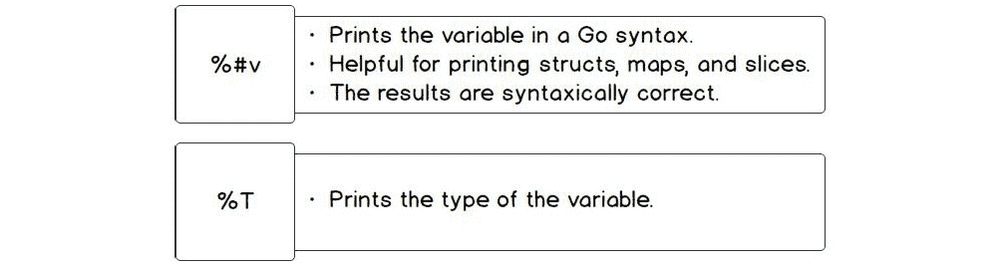

图 11.9：使用 %T 和 Go 语法表示的类型语法表示

## 练习 11.03 – 打印 Go 变量的表示

在这个练习中，我们将创建一个简单的程序，演示如何打印出各种变量的 Go 表示。我们将使用各种类型（如字符串、切片、映射和结构体）并打印这些类型的 Go 表示：

1.  在 `Chapter11` 目录下创建一个名为 `Exercise11.03` 的目录。

1.  在 `Chapter11/Exercise11.03/` 目录下创建一个名为 `main.go` 的文件。

1.  打开 `main.go` 文件。

1.  将以下代码添加到 `main.go` 中：

    ```go
    package main
    import (
        "fmt"
    )
    ```

1.  接下来，创建一个具有以下字段的 `person` 结构体:

    ```go
    type person struct {
        lname string
        age int
        salary float64
    }
    ```

1.  在 `main` 函数内部，将值赋给 `fname` 变量：

    ```go
    func main() {
        fname := "Joe"
    ```

1.  创建一个 `slice` 字面量并将其赋值给名为 `grades` 的变量：

    ```go
        grades := []int{100, 87, 67}
    ```

1.  创建一个键为字符串、值为字符串的 `map` 字面量并将其赋值给名为 `states` 的变量。这是一个州缩写及其相应名称的映射：

    ```go
        states := map[string]string{"KY": "Kentucky", "WV": "West Virginia", "VA": "Virginia"}
    ```

1.  创建一个名为 `person` 的字面量并将其赋值给 `p`:

    ```go
        p := person{lname:"Lincoln", age:210, salary: 25000.00}
    ```

1.  接下来，我们将使用 `%#v` 打印出我们每个变量的 Go 表示：

    ```go
        fmt.Printf("fname value %#v\n", fname)
        fmt.Printf("grades value %#v\n", grades)
        fmt.Printf("states value %#v\n", states)
        fmt.Printf("p value %#v\n", p)
    }
    ```

1.  在命令行中，使用以下代码更改目录：

    ```go
    cd Chapter11/Exercise11.03/
    ```

1.  在命令行中，输入以下内容：

    ```go
    go build main.go
    ```

1.  输入由 `go build` 命令创建的可执行文件并按 *Enter* 键：

    ```go
    ./main
    ```

你将得到以下输出：

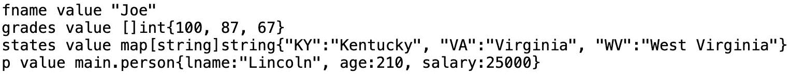

图 11.10：Go 类型表示

在这个练习中，我们看到了如何打印简单类型（如 `fname` 字符串）的 Go 表示，以及更复杂的类型，如 `person` 结构体。这是我们工具箱中的另一个工具，我们可以用它来调试；它允许我们以 Go 的方式查看数据。在下一个主题中，我们将探讨另一个帮助我们调试代码的工具。我们将探讨如何记录信息，这些信息可以进一步帮助我们调试。

# 记录

记录可以帮助我们调试程序中的错误。操作系统记录各种信息，例如对资源的访问、应用程序正在做什么、系统的整体健康状况等等。这不是因为存在错误；相反，它是为了记录，以便系统管理员更容易确定在各个时间点操作系统发生了什么。当操作系统以异常方式运行或执行某些未预期的任务时，它允许更容易地进行调试。我们在记录应用程序时应该采取同样的态度。我们需要考虑我们收集的信息以及这些信息如何帮助我们调试应用程序，如果某些操作没有按预期执行的话。

我们应该进行日志记录，无论程序是否需要调试。日志记录对于理解发生的事件、应用程序的健康状况、任何潜在问题以及谁访问我们的应用程序或数据都很有用。日志记录是程序的基础设施，当应用程序出现异常时可以加以利用。日志记录帮助我们跟踪我们可能错过的异常。在生产中，我们的代码可能在不同条件下执行，与开发环境相比，例如服务器请求数量的增加。

如果我们没有记录这些信息以及我们的代码性能的能力，我们可能会花费无数小时试图弄清楚为什么我们的代码在生产环境中表现的方式与开发环境不同。另一个例子是我们可能在生产中接收到一些格式不正确的请求数据，我们的代码没有正确处理格式，导致不期望的行为。没有适当的日志记录，可能需要非常多的时间来确定我们收到了我们没有适当处理的数据。

Go 标准库提供了一个名为 `log` 的包。它包括基本日志记录，可以被我们的程序使用。我们将研究如何使用该包来记录各种信息。

考虑以下示例：

```go
package main
import (
    "log"
)
func main() {
    name := "Thanos"
    log.Println("Demo app")
    log.Printf("%s is here!", name)
    log.Print("Run")
}
```

`Println()`、`Printf()` 和 `Print()` 日志函数与它们的 `fmt` 对应函数执行相同的功能，但有一个例外。当日志函数执行时，它会提供额外的详细信息，例如执行的时间和日期，如下所示：

```go
2019/11/10 23:00:00 Demo app
2019/11/10 23:00:00 Thanos is here!
2019/11/10 23:00:00 Run
```

当我们在以后调查和审查日志以及理解事件顺序时，这些信息可能很有用。我们甚至可以让我们的日志记录器记录更多详细信息。Go 的 `log` 包提供了一个 `SetFlags` 函数，允许我们更加具体。

这里是 Go 包提供的日志选项列表，我们可以在函数中设置它们（[`go.dev/src/log/log.go?s=8483:8506#L28`](https://go.dev/src/log/log.go?s=8483:8506#L28)）：

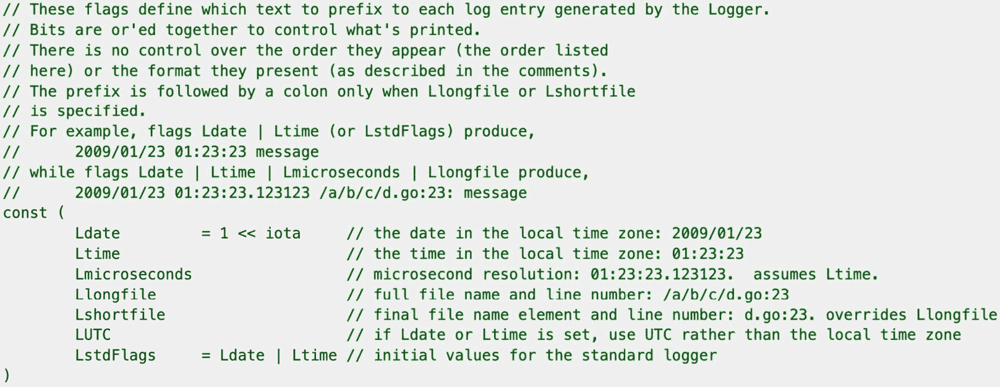

图 11.11：Go 中的标志列表

让我们在 *图 11.11* 中设置一些标志并观察与之前行为的不同。

考虑以下示例：

```go
package main
import (
    "log"
)
func main() {
    log.SetFlags(log.Ldate | log.Lmicroseconds | log.Llongfile)
    name := "Thanos"
    log.Println("Demo app")
    log.Printf("%s is here!", name)
    log.Print("Run")
}
```

让我们分解代码以更好地理解它：

```go
log.SetFlags(log.Ldate | log.Lmicroseconds | log.Llongfile)
```

`log.Ldate` 是本地时区的日期。这是之前记录的信息。

`log.Lmicroseconds` 将提供格式化日期的微秒数。请注意，我们尚未讨论时间；有关时间的更多详细信息，请参阅*第十二章*，*关于时间*。

`log.LlongFile` 将提供日志来源的完整文件名和行号。

输出如下：

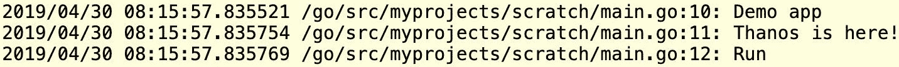

图 11.12：输出

# 记录致命错误

使用`log`包，我们还可以记录致命错误。`Fatal()`、`Fatalf()`和`Fatalln()`函数与`Print()`、`Printf()`和`Println()`类似。区别在于记录后，`Fatal()`函数后面跟着一个`os.Exit(1)`系统调用。`log`包还有以下函数：`Panic`、`Panicf`和`Panicln`。`Panic`函数和`Fatal`函数之间的区别在于`Panic`函数是可恢复的。当使用`Panic`函数时，你可以使用`defer()`函数，而当使用`Fatal`函数时，则不能。如前所述，`Fatal`函数调用`os.Exit()`；当调用`os.Exit()`时，`defer`函数将不会被调用。可能有一些情况下，你可能希望立即终止程序而没有恢复的可能性。例如，应用程序可能已经到达了一个最佳退出状态，以防止数据损坏或产生不期望的行为。或者，你可能开发了一个由他人使用的命令行工具，你需要向你的可执行文件的调用者提供一个退出代码，以表示它已经完成了其任务。

在下面的代码示例中，我们将查看如何使用`log.Fataln`：

```go
package main
import (
    "log"
    "errors"
)
func main() {
    log.SetFlags(log.Ldate | log.Lmicroseconds | log.Llongfile)
    log.Println("Start of our app")
    err := errors.New("Application Aborted!")
    if err != nil {
        log.Fatalln(err)
    }
    log.Println("End of our app")
}
```

让我们分解代码以更好地理解它：

```go
log.Println("Start of our app")
```

该语句将日期、时间和日志消息的行号打印到`stdout`：

```go
err := errors.New("We crashed!")
```

我们创建一个错误来测试`Fatal()`错误的记录：

```go
log.Fatalln(err)
```

我们记录错误，然后程序退出：

```go
log.Println("End of our app")
```

这行代码没有执行，因为我们记录了错误为`fatal`，这导致程序退出。

这里是结果。请注意，尽管这是一个错误，但它仍然记录了与打印功能相同的错误详细信息，然后退出：


图 11.13：记录致命错误

## 活动 11.01 – 编写一个验证社会保障号码的程序

在这个活动中，我们将验证**社会保障号码**（**SSNs**）。我们的程序将接受不带连字符的 SSNs。我们希望记录 SSN 的验证过程，以便我们可以追踪整个过程。在生产应用程序中记录真实的 SSNs 不是一个推荐的做法，因为它包含敏感信息，并且会违反安全措施；然而，这对于一个有趣的活动是有用的。我们不希望我们的应用程序在 SSN 无效时停止；我们希望它记录无效的数字并继续到下一个：

1.  为无效的 SSN 长度创建一个名为`ErrInvalidSSNLength`的自定义错误。

1.  为具有非数字数字的 SSN 创建一个名为`ErrInvalidSSNNumbers`的自定义错误。

1.  为以三个零为前缀的 SSN 创建一个名为`ErrInvalidSSNPrefix`的自定义错误。

1.  如果 SSN 以 9 开头且第四位需要 7 或 9，则创建一个名为`ErrInvalidDigitPlace`的自定义错误。

1.  创建一个函数，如果 SSN 长度不是 9，则返回错误。

1.  创建一个函数，用于检查 SSN 的长度是否为 9。该函数返回一个错误，其中包含无效的 SSN 和自定义错误`ErrInvalidSSNLength`。

1.  创建一个函数，用于检查 SSN 是否全部由数字组成。该函数返回一个错误，其中包含无效的 SSN 和自定义错误`ErrInvalidSSNNumbers`。

1.  创建一个函数，用于检查 SSN 是否没有以 000 为前缀。该函数返回一个错误，其中包含无效的 SSN 和自定义错误`ErrInvalidSSNPrefix`。

1.  创建一个函数，用于检查如果 SSN 以 9 开头，那么第四位需要是 7 或 9。该函数返回一个错误，其中包含无效的 SSN 和自定义错误`ErrInvalidDigitPlace`。

1.  在`main()`函数中，创建一个 SSN 切片，以便你的程序可以验证每个 SSN。

1.  对于你正在验证的每个 SSN，如果从用于验证的函数返回错误，则记录这些错误并继续处理切片。

1.  下面是一个用于验证的示例切片：

    ```go
    validateSSN := []string{"123-45-6789", "012-8-678", "000-12-0962", "999-33- 3333", "087-65-4321","123-45-zzzz"}
    ```

前面的切片应该有以下输出：

```go
2024/02/12 07:09:14.015902 /Users/samcoyle/go/src/github.com/packt-book/Go-Programming---From-Beginner-to-Professional-Second-Edition-/Chapter11/Activity11.01/main.go:21: Checking data []string{"123-45-6789", "012-8-678", "000-12-0962", "999-33-3333", "087-65-4321", "123-45-zzzz"}
2024/02/12 07:09:14.016070 /Users/samcoyle/go/src/github.com/packt-book/Go-Programming---From-Beginner-to-Professional-Second-Edition-/Chapter11/Activity11.01/main.go:23: Validate data "123-45-6789" 1 of 6
2024/02/12 07:09:14.016085 /Users/samcoyle/go/src/github.com/packt-book/Go-Programming---From-Beginner-to-Professional-Second-Edition-/Chapter11/Activity11.01/main.go:23: Validate data "012-8-678" 2 of 6
2024/02/12 07:09:14.016089 /Users/samcoyle/go/src/github.com/packt-book/Go-Programming---From-Beginner-to-Professional-Second-Edition-/Chapter11/Activity11.01/main.go:31: the value of 0128678 caused an error: ssn is not nine characters long
2024/02/12 07:09:14.016092 /Users/samcoyle/go/src/github.com/packt-book/Go-Programming---From-Beginner-to-Professional-Second-Edition-/Chapter11/Activity11.01/main.go:23: Validate data "000-12-0962" 3 of 6
2024/02/12 07:09:14.016127 /Users/samcoyle/go/src/github.com/packt-book/Go-Programming---From-Beginner-to-Professional-Second-Edition-/Chapter11/Activity11.01/main.go:35: the value of 000120962 caused an error: ssn has three zeros as a prefix
2024/02/12 07:09:14.016132 /Users/samcoyle/go/src/github.com/packt-book/Go-Programming---From-Beginner-to-Professional-Second-Edition-/Chapter11/Activity11.01/main.go:23: Validate data "999-33-3333" 4 of 6
2024/02/12 07:09:14.016139 /Users/samcoyle/go/src/github.com/packt-book/Go-Programming---From-Beginner-to-Professional-Second-Edition-/Chapter11/Activity11.01/main.go:39: the value of 999333333 caused an error: ssn starts with a 9 requires 7 or 9 in the fourth place
2024/02/12 07:09:14.016141 /Users/samcoyle/go/src/github.com/packt-book/Go-Programming---From-Beginner-to-Professional-Second-Edition-/Chapter11/Activity11.01/main.go:23: Validate data "087-65-4321" 5 of 6
2024/02/12 07:09:14.016201 /Users/samcoyle/go/src/github.com/packt-book/Go-Programming---From-Beginner-to-Professional-Second-Edition-/Chapter11/Activity11.01/main.go:23: Validate data "123-45-zzzz" 6 of 6
2024/02/12 07:09:14.016204 /Users/samcoyle/go/src/github.com/packt-book/Go-Programming---From-Beginner-to-Professional-Second-Edition-/Chapter11/Activity11.01/main.go:27: the value of 12345zzzz caused an error: ssn has non-numeric digits
```

注意

该活动的解决方案可以在本章节的 GitHub 仓库文件夹中找到：[`github.com/PacktPublishing/Go-Programming-From-Beginner-to-Professional-Second-Edition-/tree/main/Chapter11/Activity11.01`](https://github.com/PacktPublishing/Go-Programming-From-Beginner-to-Professional-Second-Edition-/tree/main/Chapter11/Activity11.01)。

在这个活动中，我们使用了`log`包来捕获信息以跟踪验证 SSN 的过程。如果我们需要调试我们的 SSN 验证过程，那么我们可以查看日志消息并跟踪 SSN 的验证失败。我们还演示了如何格式化日志消息以包含调试所需的信息。

# 在实时或受限环境中进行调试

调试是软件开发中不可或缺的技能，尤其是在处理只在特定环境中出现的难以捉摸的 bug 时。在现实场景中，即时修改代码可能不可行，因此掌握在实时或受限环境中无缝工作的技术至关重要。

在那些环境中进行最佳调试时，你应该考虑以下要点：

+   **理解环境**：在深入调试之前，先退一步。了解部署设置、网络配置以及任何安全限制。这些信息有助于预测潜在问题并简化调试过程。

+   **使用适当工具进行远程调试**：Delve 是 Go 的一个强大调试器，支持远程调试。通过使用 Delve，你可以连接到正在运行的 Go 进程，检查变量、设置断点和逐步执行代码。这是一个非常有价值的调试工具。

+   `pprof` 允许你收集运行时统计信息和分析应用程序的性能。通过在代码中公开一个分析端点，你可以在代码部署后不修改代码的情况下从实时系统中收集数据。如果你向应用程序添加指标和额外的可观察性，也是如此。还有可用的工具可以捕获应用程序日志并将它们聚合起来以便将来可搜索。这提供了额外的上下文，可以帮助调试过程。

+   **利用日志级别**：利用语言中可用的不同日志级别在不同的环境中很有用。然而，你应该小心不要通过日志过度共享信息——尤其是在处理私人数据时。

+   **设置集成开发环境（IDE）调试器**：现代 IDE，如 Visual Studio Code 或 JetBrains GoLand，提供了强大的调试功能。你可以在 IDE 中使用调试器设置断点、监视表达式和逐步执行代码。这在定位问题方面非常高效，但并不是每个部署环境都能做到。

+   **特性标志和金丝雀发布**：利用特性标志和/或金丝雀发布可以使你选择性地在生产环境中启用或禁用特定的功能。通过逐步推出更改，你可以观察对用户子集的影响。这使得在广泛发布之前更容易识别和解决问题。

总的来说，需要注意的是调试可能是一门艺术。在某些环境中有效的方法可能在其他环境中不起作用。例如，你无法在生产环境中设置已经运行的代码的 IDE 调试器，但你可以在开发代码时轻松地利用这种方法。你也可能只遇到困扰某些环境的特定问题。这就是“它在我的本地运行正常”的经典故事，但你可能被这个问题困扰，最终可能花费几个小时/几天的时间通过**持续集成（CI**）环境提交代码来测试代码提交。这种情况可能发生在我们所有人身上，这也是一种合理的调试方法，通过小幅度尝试更改直到问题解决。

最后，知识就是力量，了解最佳调试问题的工具可以大大减少你的调试时间。此外，在不同环境中练习调试，并在计划场景中强制团队处理问题/事件，可以是一种为生产级别事件做准备的好方法，在这些事件中速度是关键。

# 摘要

在本章中，我们研究了各种简化调试过程的方法，例如逐步编码和频繁测试代码、编写单元测试、处理所有错误以及在代码上执行日志记录。

查看 `fmt` 包，我们发现各种输出信息的方式，帮助我们找到错误。`fmt` 包提供了不同的打印格式化、动词以及通过使用各种标志来控制动词输出的方式。

使用 Go 标准库中的日志功能，我们能够看到应用程序执行的详细信息。`log` 包使我们能够看到日志事件发生的文件路径和行号。`log` 包附带各种打印函数，这些函数模仿了 `fmt` 打印函数的一些功能，这为我们提供了关于本章所学动词用法的各种见解。我们能够通过使用 Go 提供的标准库进行基本的调试。我们查看了 `log` 包，并介绍了 `time` 类型。我们没有深入探讨 Go 对时间实现的细节。我们还看到了在实时或受限环境中调试代码的各种附加方法。

在下一章中，我们将探讨 Go 中时间的表示方式。我们将讨论与 `time.Time` 类型一起使用的各种函数。我们还将演示如何将时间转换为各种时间结构（如纳秒、微秒、毫秒、秒、分钟、小时等）。然后，我们将最终了解时间的基本类型。
