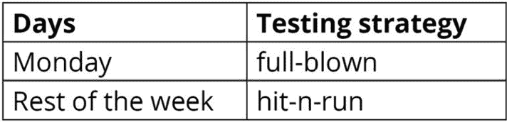
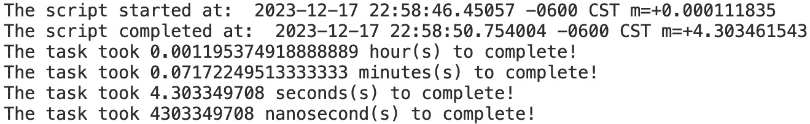
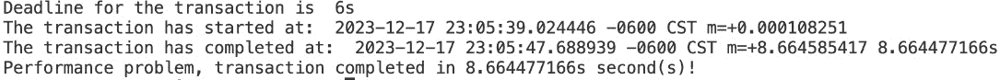
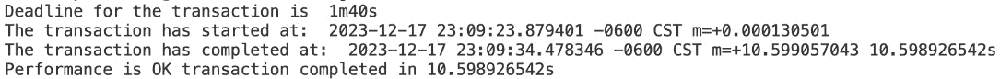

# 关于时间

概述

本章展示了 Go 如何处理表示时间数据的变量，这是语言的一个重要方面。

到本章结束时，您将能够创建自己的时间格式，比较和管理时间，计算时间序列的持续时间，并根据用户要求格式化时间。

# 技术要求

对于本章，您需要 Go 版本 1.21 或更高。本章的代码可以在以下位置找到：[`github.com/PacktPublishing/Go-Programming-From-Beginner-to-Professional-Second-Edition-/blob/main/Chapter12`](https://github.com/PacktPublishing/Go-Programming-From-Beginner-to-Professional-Second-Edition-/blob/main/Chapter12)。

# 简介

上一章向您介绍了 Go 中的基本调试。在 Go 中编写代码越多，您就会变得越好；然而，开发和部署代码可能会遇到需要调试的边缘情况。上一章展示了如何使用 `fmt` 包，如何将日志写入文件，以及如何使用打印动词进行字符串格式化。

本章致力于向您传授关于处理表示时间数据的变量所需的所有知识。您将学习如何以“Go 方式”来做这件事。首先，我们将从基本的时间创建、时间戳等开始；然后，我们将学习如何比较和操作时间，计算两个日期之间的持续时间，并创建时间戳。最后，我们将学习如何根据我们的需求格式化时间。所以，让我们不要浪费时间，直接开始吧。

# 创建时间

创建时间意味着声明一个变量，该变量以特定方式格式化时间。时间格式化将在本章末尾介绍；因此，现在我们将使用 Go 提供的默认格式化。在本主题中，我们将在脚本中的 `main()` 函数中执行一切，因此骨架应该如下所示：

```go
package main
import (
  "fmt"
  "time"
)
func main(){
  // this is where the code goes.
}
```

让我们先看看我们的骨架，并学习如何创建和操作 `time` 变量。我们的骨架包含必要的标准 `package main` 定义。我们使用 `fmt` 包将输出打印到控制台。由于我们将使用 `time` 包，因此我们还需要导入它。

每当我们执行 `go run <script>.go` 时，`main()` 函数会被调用并执行其中声明的任何内容。

`time` 包最常见的任务之一是测量脚本的执行持续时间。我们可以通过在开始和结束时捕获当前时间到变量中来实现这一点，以便我们可以计算差异并知道特定操作完成所需的时间。时间差将在本书的后续章节中展示。第一个示例如下：

```go
  start := time.Now()
  fmt.Println("The script has started at: ", start)
  fmt.Println("Saving the world...")
  time.Sleep(2 * time.Second)
  end := time.Now()
  fmt.Println("The script has completed at: ", end)
```

我们脚本的输出应该看起来像这样：

```go
The script has started at: 2023-09-27 08:19:33.8358274 +0200 CEST m=+0.001998701
Saving the world...
The script has completed at: 2023-09-27 08:19:35.8400169 +0200 CEST m=+2.006161301
```

如您所见，这看起来并不十分花哨；然而，到本章结束时，您将学会如何使它更加易读。

考虑以下场景：你的雇主给你一个任务，让你开发一个小型的 Go 应用程序，该应用程序基于星期几测试一个网络应用程序。你的雇主每周一凌晨 12:00 CEST 发布新的网络应用程序的主要版本。从凌晨 12:00 CEST 到下午 2:00 CEST 有一个停机窗口，部署大约需要 30 分钟，你有一小时 30 分钟的时间来测试应用程序。这就是 Go 的 `time` 包能帮助你解决问题的地方。脚本在周的其他天进行 `hit-n-run` 测试，但在发布日，你需要执行一个完整的 `full-blown` 功能测试。脚本的第一个版本接受一个参数来决定执行哪种测试，但第二个版本的脚本基于日期和小时来做出决定：



图 12.1：测试策略

考虑以下代码：

```go
  day := time.Now().Weekday()
  hour := time.Now().Hour()
  fmt.Println("Day: ", day, "Hour: ", hour)
  if day.String() == "Monday"{
    if hour >= 1{
      fmt.Println("Performing full blown test!")
    } else {
      fmt.Println("Performing hit-n-run test!")
    }
  } else { fmt.Println("Performing hit-n-run test!")}
```

当前星期几被捕获在名为 `day` 的变量中。执行的小时也被捕获在名为 `hour` 的变量中。当这个脚本执行时，有两种类型的输出。

第一个是一个简单的 `hit-n-run` 输出，如下所示：

```go
Day: Thursday Hour: 14
Performing hit-n-run test!
```

第二个是 `full blown` 输出，如下所示：

```go
Day: Thursday Hour: 14
Performing full blown test!
```

在这个例子中，我们看到了执行日期如何修改应用程序的行为。

注意

实际的测试被有意省略，因为这不是本章主题的一部分。然而，输出清楚地显示了哪个部分负责控制测试。

另一个例子是在 Go 中创建脚本的日志文件名。基本思路是每天收集一个日志，并将时间戳连接到日志文件名中。其结构如下：

```go
Application_Action_Year_Month_Day
```

在 Go 中，在你的主函数中有一个优雅且简单的方法来做这件事：

```go
package main 
import ( 
  "fmt" 
  "strconv" 
  "time" 
) 
func main() { 
  appName := "HTTPCHECKER" 
  action := "BASIC" 
  date := time.Now() 
  logFileName := appName + "_" + action + "_" + strconv.Itoa(date.Year()) + "_" + date.Month().String() + "_" + strconv.Itoa(date.Day()) + ".log" 
  fmt.Println("The name of the logfile is ", logFileName) 
} 
```

输出如下所示：

```go
The name of the logfile is: HTTPCHECKER_BASIC_2024_March_16.log
```

然而，有一个问题。如果你想要将 `time` 类型的字符串连接起来，这些类型不是隐式可转换的，你需要使用 `strconv` 包，这需要在你的脚本顶部导入：

```go
import "strconv"
```

依次，这允许你调用 `strconv.Itoa()` 函数，该函数将你的 `Year` 和 `Day` 值转换为字符串，最终让你将它们连接成一个单一的字符串。

现在我们已经学会了如何创建 `time` 变量，接下来让我们学习如何比较它们。

## 练习 12.01 – 创建一个返回时间戳的函数

在这个练习中，我们将创建一个名为 `whatstheclock` 的函数。这个函数的目标是展示如何创建一个函数，该函数封装了一个格式化的 `time.Now()` 函数，并以 `ANSIC` 格式返回日期。`ANSIC` 格式将在 *格式化* *时间* 部分中进一步详细说明：

1.  创建一个新的文件夹并添加一个 `main.go` 文件。

1.  使用 `package` 和 `import` 语句初始化脚本：

    ```go
    package main
    import "time"
    import "fmt"
    ```

1.  定义一个名为 `whatstheclock()` 的函数：

    ```go
    func whatstheclock() string {
      return time.Now().Format(time.ANSIC)
    }
    ```

1.  在 `main()` 函数中，定义对 `whatstheclock()` 函数的调用，并将结果打印到控制台：

    ```go
    func main(){
      fmt.Println(whatstheclock())
    }
    ```

1.  保存文件并运行代码：

    ```go
    go run main.go
    ```

    你应该看到以下输出：

    ```go
    Thu Oct 17 13:56:03 2023
    ```

在这个练习中，我们展示了如何创建一个返回当前时间的 `ANSIC` 格式的小函数。

注意

你所使用的任何类型的操作系统都会提供两种类型的时钟来测量时间；一种称为“单调时钟”，另一种称为“墙钟”。墙钟是你可以在 Windows 机器的任务栏上看到的时间；它会发生变化，通常根据你的当前位置与公共或企业 **网络时间协议** (**NTP**) 服务器同步。NTP 用于根据原子钟或卫星参考向客户端告知时间。

# 比较时间

大多数时候，当在较小的脚本上使用 Go 时，了解脚本何时应该运行，或者脚本应该在什么小时和分钟内完成，对于你的统计信息来说非常重要。通过统计，我们指的是知道通过执行特定操作节省了多少时间，与如果我们必须手动执行这些操作所花费的时间相比。这允许我们在进一步开发功能时，测量脚本随时间改进的情况。在这个主题中，我们将查看一些实际例子，展示你如何解决这个问题。

让我们看看第一个脚本的逻辑，该脚本旨在在指定时间之前或之后不运行。这个时间可以通过另一个自动化或当手动放置触发文件来到达；每天，脚本需要在不同时间运行——具体来说，尽可能在指定时间之后运行。

时间格式如下所示：`2023-09-27T22:08:41+00:00`

```go
  now := time.Now()
  onlAafter, err := time.Parse(time.RFC3339,"2020-11-01T22:08:41+00:00")
  if err != nil {
    fmt.Println(err)
  }
  fmt.Println(now, onlyAfter)
  fmt.Println(now.After(onlyAfter))
  if now.After(onlyAfter){
    fmt.Println("Executing actions!")
  } else {
    fmt.Println("Now is not the time yet!!")
  }
```

当我们还没有到达截止日期时，脚本的输出如下：

```go
Now is not the time yet!!
```

当我们满足条件时，输出如下所示：

```go
Executing actions!
```

让我们来看看这里发生了什么。我们创建了一个 `now` 变量，这对于执行至关重要。我们根据 `RFC3339` 解析了 `time` 字符串。`RFC3339` 指定了应该用于 `date` 和 `time` 字符串的格式。这个函数返回两个值：一个值是转换成功时的输出，另一个是存在错误时的错误。我们将输出捕获在 onlyAfter 变量中，以及错误 err。我们本可以使用一个标准变量，如 onlyAfterError，但除非我们在稍后使用该变量，否则编译器会抛出一个错误，指出该变量已声明但未使用。我们使用 _ 变量来规避这个问题。基于这个逻辑，我们可以非常简单地实现 `onlyBefore` 参数或变量。`time` 包有两个特别有用的函数：一个是名为 `After()` 的函数，另一个是名为 `Before()` 的函数。它们允许我们简单地比较两个 `time` 变量。

包含一个名为 `Equal()` 的第三个函数。这个函数允许你比较两个 `time` 变量，并根据它们是否相等返回 `true` 或 `false`。

让我们看看 `Equal()` 函数的实际应用例子：

```go
  now := time.Now()
  nowToo := now
  time.Sleep(2*time.Second)
  later := time.Now()
  if now.Equal(nowTtoo){
    fmt.Println("The two time variables are equal!")
  } else {
    fmt.Println("The two time variables are different!")
  }
  if now.Equal(later) {
    fmt.Println("The two time variables are equal!")
  }else{
    fmt.Println("The two time variables are different!")
  }
```

输出看起来是这样的：

```go
The two time variables are equal!
The two time variables are different!
```

让我们看看这里会发生什么。我们有三个`时间`变量，分别称为`now`、`now_too`和`later`。`time`模块的`Sleep()`函数用于模拟 2 秒的延迟。这个函数接受一个整数参数，等待给定时间过去后继续执行。结果是`later`变量持有不同的时间值，使我们能够展示`Equal()`函数的目的，您可以在输出中看到。

现在，是时候检查计算两个`时间`变量之间的持续时间或差异所提供的设施了。

# 持续时间计算

在编程的许多方面，计算执行时间的能力都很有用。在我们的日常生活中，我们可以监控我们的基础设施可能面临的不一致性和性能瓶颈。例如，如果您有一个脚本平均只需要 5 秒钟就能完成，而监控执行时间显示您在一天中的某些小时或某些天有巨大的波动，那么进行调查可能很明智。另一个方面与 Web 应用程序有关。测量脚本中请求-响应的持续时间可以让你了解您在应用程序中投入了多少来应对高负载，甚至允许你在一年中的某些日子或周扩展您的容量。例如，如果您有一个在线商店处理产品，根据像黑色星期五或圣诞节这样的模式来调整您的容量可能很明智。

在大多数时间里，你可能可以用较低的能力完成工作，但如果基础设施规模不够，那些假期可能会导致收入损失。向你的脚本添加此类功能所需的编码非常少。现在让我们看看如何实现：

```go
  start := time.Now()
  fmt.Println("The script started at: ", start)
  sum := 0
  for i := 1; i < 10000000000; i++ {
    sum += i
  }
  end := time.Now()
  duration := end.Sub(start)
  fmt.Println("The script completed at: ", end)
  fmt.Println("The task took", duration.Hours(), "hour(s) to complete!")
  fmt.Println("The task took", duration.Minutes(), "minutes(s) to complete!")
  fmt.Println("The task took", duration.Seconds(), "seconds(s) to complete!")
  fmt.Println("The task took", duration.Nanoseconds(), "nanosecond(s) to complete!")
```

如果您执行此脚本，结果将类似于以下内容，具体取决于 PC 的性能：



图 12.2：测量执行时间

所需做的只是捕捉脚本开始和结束的时间。然后，我们可以通过减去开始时间和结束时间来计算持续时间。之后，我们可以利用`Duration`变量的函数来获取完成任务所需时间的`小时()`、`分钟()`、`秒()`和`纳秒()`值。

您将获得四种分辨率，具体如下：

+   `小时`

+   `分钟`

+   `秒`

+   `纳秒`

如果您需要，例如，天、周或月，则可以从提供的分辨率中计算出来。

在过去，我们有一个要求测量事务持续时间的任务，并且我们需要满足一个**服务级别协议**（**SLA**）。这意味着有一些应用程序需要处理请求，比如 1,000 毫秒或 5 秒，这取决于产品的关键性。接下来的脚本将向你展示这是如何实现的。你有六个不同的分辨率可供选择：

+   `小时`

+   `分钟`

+   `秒`

+   `毫秒`

+   `微秒`

+   `纳秒`

让我们考虑以下示例：

```go
  deadlineSeconds := time.Duration((600 * 10) * time.Millisecond)
  start := time.Now()
  fmt.Println("Deadline for the transaction is", deadlineSeconds)
  fmt.Println("The transaction has started at:", start)
  sum := 0
  for i := 1; i < 25000000000; i++ {
    sum += i
  }
  end := time.Now()
  duration := end.Sub(start)
  transactionTime := time.Duration(duration.Nanoseconds()) * time.Nanosecond
  fmt.Println("The transaction has completed at:", end, duration)
  if transactionTime <= deadlineSeconds{
    fmt.Println("Performance is OK transaction completed in", transactionTime)
  } else{
    fmt.Println("Performance problem, transaction completed in", transactionTime,"second(s)!")
  }
```

当我们没有满足截止时间时，输出如下：



图 12.3：未满足事务截止时间

当我们满足截止时间时，看起来是这样的：



图 12.4：事务截止时间满足

让我们剖析我们的示例。首先，我们使用`time.Duration()`变量定义事务的截止时间。根据我的经验，`毫秒`的分辨率是最优的；然而，适应计算它需要一些时间。你可以自由选择你喜欢的任何分辨率。我们用`start`变量标记开始，做一些计算，然后用`end`变量标记完成。魔法就在这里发生。我们想要计算截止时间和事务持续时间之间的差异，但我们不能直接这样做。我们需要将`duration`值转换为`transaction`时间。我们在创建截止时间时也是这样做的。我们简单地使用`纳秒`分辨率，这是我们应达到的最低分辨率。然而，在这种情况下，你可以使用你想要的任何分辨率。转换后，我们可以轻松地比较并决定事务是否正常。

现在，让我们看看我们如何可以操作时间。

# 时间管理

Go 编程语言的`time`包提供了两个函数，允许你操作时间。其中一个被称为`Sub()`，另一个被称为`Add()`。在我的经验中，这种情况并不常见。大多数情况下，当计算脚本的执行时间时，使用`Sub()`函数来告知差异。

让我们看看加法看起来是什么样子：

```go
  timeToManipulate := time.Now()
  toBeAdded := time.Duration(10 * time.Second)
  fmt.Println("The original time:", timeToManipulate)
  fmt.Printf("%v duration later %v", toBeAdded, timeToManipulate.Add(toBeAdded))
```

执行后，以下输出欢迎我们：

```go
The original time: 2023-10-18 08:49:53.1499273 +0200 CEST m=+0.001994601
10s duration later: 2023-10-18 08:50:03.1499273 +0200 CEST m=+10.001994601
```

让我们检查这里发生了什么。我们创建了一个变量来保存我们的时间，这需要一些操作。`toBeAdded`变量代表 10 秒的持续时间，这是我们想要添加的。`time`包的`Add()`函数期望一个`time.Duration()`类型的变量。然后，我们简单地调用我们的日期的`Add()`函数，结果在控制台上可见。`Sub()`函数的功能相当繁琐，它并不是真正用来从我们拥有的时间中移除特定持续时间的。这是可以做到的，但你需要更多的代码行来实现这一点。你可以通过使用负值来构建你的持续时间。将第二行替换为以下内容：

```go
toBeAdded := time.Duration(-10 * time.Minute)
```

它将正常工作并输出以下内容：

```go
The original time: 2023-10-18 08:50:36.5950116 +0200 CEST m=+0.001994401
-10m0s duration later: 2023-10-18 08:40:36.5950116 +0200 CEST m=+599.998005599
```

这正如我们所期望的；我们已经成功计算出了 10 分钟前的时间。

## 练习 12.02 – 执行持续时间

在这个练习中，我们将创建一个函数，允许你计算两个 `time.Time` 变量之间的执行持续时间，并返回一个字符串，告诉你执行完成花费了多长时间。

按以下顺序执行以下步骤：

1.  创建一个新的文件夹并添加一个 `main.go` 文件。

1.  使用以下 `package` 和 `import` 语句初始化脚本：

    ```go
    package main
    import (
      "time"
      "fmt"
      "strconv"
    )
    ```

1.  现在我们定义我们的 `elapsedTime()` 函数：

    ```go
    func elapsedTime(start time.Time, end time.Time) string {
      elapsed := end.Sub(start)
      hours := strconv.Itoa(int(elapsed.Hours()))
      minutes := strconv.Itoa(int(elapsed.Minutes()))
      seconds := strconv.Itoa(int(elapsed.Seconds()))
      return "The total execution time elapsed is: " + hours + " hour(s) and " + minutes + " minute(s) and " + seconds + " second(s)!"
    }
    ```

1.  现在，我们已经准备好定义我们的 `main()` 函数：

    ```go
    func main(){
      start := time.Now()
      time.Sleep(2 * time.Second)
      end := time.Now()
      fmt.Println(elapsedTime(start, end))
    }
    ```

1.  运行以下代码：

    ```go
    go run main.go
    ```

以下内容应作为输出显示：

```go
The total execution time elapsed is: 0 hour(s) and 0 minute(s) and 2 second(s)!
```

在这个练习中，我们创建了一个函数，展示了执行动作需要多少小时、分钟和秒。这很有用，因为你可以将这个函数在其他 Go 应用程序中重用。

现在，让我们把注意力转向时间的格式化。

# 时间格式化

到目前为止，在本章中，你可能已经注意到日期看起来相当丑陋。我的意思是，看看以下行：

```go
The transaction has started at: 2023-09-27 13:50:58.2715452 +0200 CEST m=+0.002992801
```

这些是故意留出的，以迫使你思考这是否就是 Go 能做到的全部。有没有一种方法来格式化这些行，使它们更方便、更容易阅读？如果有，那些额外的行是什么？

在这里，我们将回答这些问题。当我们谈论时间格式化时，有两个主要概念是我们所指的。第一个选项是在我们希望 `time` 变量在打印时输出一个看起来令人满意的字符串时使用，第二个选项是在我们希望将一个字符串解析为特定格式时使用。两者都有自己的用例；我将详细讲解这两个概念，同时教你如何使用它们。

首先，我们将学习关于 `Parse()` 函数的内容。这个函数本质上有两个参数。第一个是要解析的格式字符串，第二个是需要解析的字符串。这个解析的结束将得到一个 `time` 变量，它可以利用内置的 Go 函数。Go 使用基于 POSIX 的日期格式，其中 `Parse()` 在你有应用程序正在处理来自不同时区的时间值，并且你想将它们转换为相同的时区以更好地理解和比较时非常有用：

```go
Mon Jan 2 15:04:05 -0700 MST 2006
0 1 2 3 4 5 6
```

这种日期格式等同于 POSIX 中的“`123456`”，可以从前面的示例中解码。语言中提供了常数来帮助你处理解析不同的时间字符串。

我们可以解析三种主要的时间格式：

+   `RFC3339`

+   `UnixDate`

+   `ANSIC`

让我们看看 `Parse()` 是如何工作的：

```go
  t1, err := time.Parse(time.RFC3339, "2019-09-27T22:18:11+00:00")
  if err != nil {
    fmt.Println(err)
  }
  t2, err := time.Parse(time.UnixDate, "2019-09-27T22:18:11+00:00")
  if err != nil {
    fmt.Println(err)
  }
  t3, err := time.Parse(time.ANSIC, "2019-09-27T22:18:11+00:00")
  if err != nil {
    fmt.Println(err)
  }
  fmt.Println("RFC3339:", t1)
  fmt.Println("UnixDate", t2)
  fmt.Println("ANSIC", t3)
```

输出如下：

```go
parsing time "2019-09-27T22:18:11+00:00" as "Mon Jan _2 15:04:05 MST 2006": cannot parse "2019-09-27T22:18:11+00:00" as "Mon"
parsing time "2019-09-27T22:18:11+00:00" as "Mon Jan _2 15:04:05 2006": cannot parse "2019-09-27T22:18:11+00:00" as "Mon"
RFC3339: 2019-09-27 22:18:11 +0000 +0000
UnixDate 0001-01-01 00:00:00 +0000 UTC
ANSIC 0001-01-01 00:00:00 +0000 UTC
```

背后发生的事情如下。我们有 `t1`、`t2` 和 `t3` 变量，它们持有时间，这些时间与指定的格式进行解析。`err` 变量持有转换过程中可能出现的错误结果。`t1` 变量的输出是唯一有意义的；`UnixDate` 和 `ANSIC` 是错误的，因为它们解析了错误的字符串。`UnixDate` 期望一些它们称之为 `epoch` 的东西。epoch 是一个非常独特的日期；在 Unix 系统中，它标志着时间的开始，始于 1970 年 1 月 1 日。它期望一个巨大的整数，这是从这个日期开始经过的秒数。格式期望类似以下的输入：`Mon Sep _27 18:24:05 2019`。提供这样的时间允许 `Parse()` 函数提供正确的输出。

既然我们已经明确了 `Parse()` 函数，那么是时候看看 `Format()` 函数了。

Go 允许你自定义 `时间` 变量。让我们学习如何实现这一点，然后我们将对它们进行格式化：

```go
date := time.Date(2019, 9, 27, 18, 50, 48, 324359102, time.UTC)
fmt.Println(date)
```

之前的代码演示了如何自己构建时间；然而，我们将看看所有这些数字代表什么。那个骨架语法如下：

```go
func Date(year int, month Month, day, hour, min, sec, nsec int, loc *Location) Time
```

实际上，我们需要指定年、月、日、小时等等。我们希望根据输入变量重新格式化输出；这应该看起来如下：

```go
2019-09-27 18:50:48.324359102 +0000 UTC
```

在人们开始在大企业环境中工作之前，时区并不重要。当你拥有一个全球性的互联设备群时，能够区分时区就变得很重要了。如果你想要一个 `AddDate()` 函数，它可以用来将 `年`、`月` 和 `日` 添加到当前时间，那么这必须允许你动态地添加到你的日期中。让我们看看一个例子。给定我们之前的日期，让我们添加 1 年、2 个月和 3 天：

```go
date := time.Date(2019, 9, 27, 18, 50, 48, 324359102, time.UTC)
next Date := date.AddDate(1, 2, 3)
fmt.Println(next Date)
```

当你运行这个程序时，你会得到以下输出：

```go
2020-11-30 18:50:48.324359102 +0000 UTC
```

`AddDate()` 函数接受三个参数：第一个是 `years`，第二个是 `months`，第三个是 `days`。这给了你调整你脚本的精细机会。为了正确理解格式化是如何工作的，你需要知道内部是如何运作的。

时间格式化中的一个最后重要方面是了解你如何利用 `time` 包中的 `LoadLocation()` 函数将你的本地时间转换为另一个时区的本地时间。我们的参考时区将是 `洛杉矶` 时区。`Format()` 函数用于告诉 Go 我们希望如何格式化输出。`In()` 函数是指定我们希望格式化存在的特定时区的引用。

让我们找出洛杉矶的时间：

```go
  current := time.Now()
  losAngeles, err := time.LoadLocation("America/Los_Angeles")
  if err != nil {
    fmt.Println(err)
  }
  fmt.Println("The local current time is:", current.Format(time.ANSIC))
  fmt.Println("The time in Los Angeles is:", current.In(losAngeles).Format(time.ANSIC))
```

根据你执行的日子，你应该看到以下输出：

```go
The local current time is: Fri Oct 18 08:14:48 2019
The time in Los Angeles is: Thu Oct 17 23:14:48 2019
```

关键在于我们得到本地时间在一个变量中，然后我们使用 `time` 包中的 `In()` 函数，比如说，将那个值转换为特定时区的值。这很简单，但很有用。

## 练习 12.03 – 您所在时区的时间是什么？

在本练习中，我们将创建一个函数，它将告诉当前时区与指定时区之间的差异。该函数将利用 `LoadLocation()` 函数根据位置指定变量，该变量将被设置为特定的时间。`In()` 位置将用于将特定的时间值转换为给定时区的时间值。输出格式应为 `ANSIC` 标准。

按以下顺序执行以下步骤：

1.  创建一个新的文件夹并添加一个 `main.go` 文件。

1.  使用以下 `package` 和 `import` 语句初始化脚本：

    ```go
    package main
    import (
      "time"
      "fmt"
    )
    ```

1.  现在是创建我们称为 `timeDiff()` 的函数的时候了，它还将返回格式化为 `ANSIC` 的 `current` 和 `remoteTime` 变量：

    ```go
    func timeDiff(timezone string) (string, string) {
      current := time.Now()
      remoteZone, err := time.LoadLocation(timezone) 
      if err != nil {
        fmt.Println(err)
    }
      remoteTime := current.In(remoteZone)
      fmt.Println("The current time is:", current.Format(time.ANSIC))
      fmt.Println("The timezone:", timezone,"time is:", remoteTime)
      return current.Format(time.ANSIC), remoteTime.Format(time.ANSIC)
    }
    ```

1.  定义一个 `main()` 函数：

    ```go
    func main(){
      fmt.Println(timeDiff("America/Los_Angeles"))
    }
    ```

1.  运行代码：

    ```go
    go run main.go
    ```

输出如下所示：

```go
The current time is: Thu Oct 17 15:37:02 2023
The timezone: America/Los_Angeles time is: 2023-10-17 06:37:02.2440679 -0700 PDT
Thu Oct 17 15:37:02 2023 Thu Oct 17 06:37:02 2023
```

注意

打印出的时间将根据您运行代码的时间而有所不同。在本练习中，我们看到了在时区之间导航是多么容易。

## 活动 12.01 – 根据用户要求格式化日期

在此活动中，您需要创建一个小脚本，它接受当前日期并以以下格式输出：`02:49:21 31/01/2023`。您需要利用您迄今为止学到的有关将整数转换为字符串的知识。这将允许您连接 `time` 变量的不同部分。请记住，`Month()` 函数省略了月份名称而不是月份数字。

您必须执行以下步骤以获得所需的输出：

1.  使用 `time.Now()` 函数将当前日期捕获到一个变量中。

1.  将捕获的日期分解为 `day`、`month`、`year`、`hour`、`minute` 和 `seconds` 变量，通过将它们转换为字符串来实现。

1.  按顺序打印出连接的变量。

    一旦脚本完成，输出应如下所示（请注意，这取决于您何时运行代码）：

    ```go
    15:32:30 2023/10/17
    ```

    到此活动结束时，您应该已经学会了如何创建自定义的 `time` 变量，并使用 `strconv.Itoa()` 将数字转换为字符串并连接结果。

注意

此活动的解决方案可以在本书的 GitHub 仓库中找到：本书本章的 GitHub 仓库文件夹：[`github.com/PacktPublishing/Go-Programming-From-Beginner-to-Professional-Second-Edition-/tree/main/Chapter12/Activity12.01`](https://github.com/PacktPublishing/Go-Programming-From-Beginner-to-Professional-Second-Edition-/tree/main/Chapter12/Activity12.01)。

## 活动 12.02 – 强制执行日期和时间的特定格式

此活动要求您使用本章关于时间的知识。我们希望创建一个小脚本，以以下格式打印日期：`02:49:21 31/01/2023`。

首先，你需要通过使用 `time.Date()` 函数创建一个 `date` 变量。然后你需要回忆我们是如何访问变量的 `Year`、`Month` 和 `Day` 属性的，并按照适当的顺序创建一个连接。记住，你不能连接字符串和整数变量。`strconv()` 函数就在那里帮助你。你还需要记住，当你省略 `date.Month()` 命令时，它会打印出月份的名称，但它也需要被转换成整数，然后再转换回带有数字的字符串。

你必须执行以下步骤以获得所需的输出：

1.  使用 `time.Now()` 函数将当前日期保存在一个变量中。

1.  使用 `strconv.Itoa()` 函数将捕获的 `date` 变量的适当部分保存到以下变量中：`day`、`month`、`year`、`hour`、`minute` 和 `second`。

1.  最后，使用适当的连接打印这些信息。

预期的输出应该看起来像这样：

```go
2:49:21 2023/1/31
```

在本活动结束时，你应该已经学会了如何将当前日期格式化为特定的自定义格式。

注意

本活动的解决方案可以在[`github.com/PacktPublishing/Go-Programming-From-Beginner-to-Professional-Second-Edition-/tree/main/Chapter12/Activity12.02`](https://github.com/PacktPublishing/Go-Programming-From-Beginner-to-Professional-Second-Edition-/tree/main/Chapter12/Activity12.02)找到。

## 活动 12.03 – 测量经过的时间

本活动要求你测量睡眠的持续时间。你应该使用 `time.Sleep()` 函数休眠 2 秒，一旦休眠完成，你需要计算开始时间和结束时间之间的差异，并展示它花费了多少秒。

首先，你标记执行的开始，休眠 2 秒，然后在一个变量中捕获执行结束的时间。通过使用 `time.Sub()` 函数，我们可以使用 `Seconds()` 函数输出结果。输出将有点奇怪，因为它将比预期的稍长。

你必须执行以下步骤以获得所需的输出：

1.  将开始时间保存在一个变量中。

1.  创建一个持续 2 秒的 `sleep` 变量。

1.  将结束时间保存在一个变量中。

1.  通过从结束时间减去开始时间来计算长度。

1.  打印出结果。

根据你电脑的速度，你应该期望以下输出：

```go
The execution took exactly 2.0016895 seconds!
```

在本活动结束时，你应该已经学会了如何测量特定活动的经过时间。

注意

本活动的解决方案可以在本章节的 GitHub 仓库文件夹中找到：[`github.com/PacktPublishing/Go-Programming-From-Beginner-to-Professional-Second-Edition-/tree/main/Chapter12/Activity12.03`](https://github.com/PacktPublishing/Go-Programming-From-Beginner-to-Professional-Second-Edition-/tree/main/Chapter12/Activity12.03)。

## 活动 12.04 – 计算未来的日期和时间

在这个活动中，我们将计算从`Now()`开始的 6 小时、6 分钟和 6 秒后的日期。你需要将当前时间存储在一个变量中。然后，在给定的日期上使用`Add()`函数添加之前提到的长度。为了方便，请使用`time.ANSIC`格式。但是有一个问题。因为`Add()`函数期望一个持续时间，所以在添加之前，你需要选择一个分辨率，比如`Second`，并构建持续时间。

你必须执行以下步骤以获得所需的输出：

1.  活动十二点零五 - 打印不同时区的本地时间

1.  注意

1.  你必须执行以下步骤以获得所需的输出：

1.  将持续时间添加到当前时间。

1.  以`ANSIC`格式打印出未来的日期。

确保你的输出看起来像这样，使用字符串格式化：

```go
The current time: Thu Oct 17 15:16:48 2023
6 hours, 6 minutes and 6 seconds from now the time will be: Thu Oct 17 21:22:54 2023
```

在完成这个活动之后，你应该已经学会了如何通过使用`time.Duration()`和`time.Add()`函数来计算未来的特定日期。

注意

这个活动的解决方案可以在本章节的 GitHub 仓库文件夹中找到：[`github.com/PacktPublishing/Go-Programming-From-Beginner-to-Professional-Second-Edition-/tree/main/Chapter12/Activity12.04`](https://github.com/PacktPublishing/Go-Programming-From-Beginner-to-Professional-Second-Edition-/tree/main/Chapter12/Activity12.04)。

## 摘要

这个活动要求你运用在*时间格式化*部分学到的知识。你需要加载一个东部城市和一个西部城市。然后，打印出每个城市的当前时间。

这个活动的解决方案可以在本章节的 GitHub 仓库文件夹中找到：[`github.com/PacktPublishing/Go-Programming-From-Beginner-to-Professional-Second-Edition-/tree/main/Chapter12/Activity12.05`](https://github.com/PacktPublishing/Go-Programming-From-Beginner-to-Professional-Second-Edition-/tree/main/Chapter12/Activity12.05)。

关键在于`LoadLocation()`函数，你需要为输出使用`ANSIC`格式。记住，`LoadLocation()`函数返回两个值！

1.  在一个变量中捕获当前时间。

1.  使用`time.LoadLocation()`函数创建`NyTime`和`LaTime`的参考时区变量。

1.  以`ANSIC`格式打印出相应时区的当前时间。

根据你的执行日，以下可能是你预期的输出：

```go
The local current time is: Thu Oct 17 15:16:13 2023
The time in New York is: Thu Oct 17 09:16:13 2023
The time in Los Angeles is: Thu Oct 17 06:16:13 2023
```

在完成这个活动之后，你应该已经学会了如何将你的时间变量转换为特定时区。

在一个变量中捕获当前时间。

以`ANSIC`格式打印此值作为参考。

# 以秒为输入计算持续时间。

本章向您介绍了 Go 语言的`time`包，它允许您重用其他程序员发明并融入语言的代码。目标是教会您如何创建、操作和格式化`time`变量，并使您熟悉在`time`包的帮助下可以做什么。如果您想进一步改进或深入了解该包提供的功能，请查看以下链接：[`golang.org/pkg/time/`](https://golang.org/pkg/time/)。

时间戳和时间操作是每个开发人员必备的技能。无论您是将大或小的脚本投入生产，`time`模块都能帮助您测量操作的执行时间，并提供在执行过程中发生的操作日志。最重要的是，如果使用得当，它可以帮助您轻松地将生产问题追溯到其根源。

# 第四部分：应用

应用程序的大小和功能各不相同，从单一目的的小工具到具有众多功能的大型系统。无论它们的复杂程度如何，所有应用程序都具备接口，无论是用于人机交互（用户界面/UI）还是与其他应用程序通信（应用程序编程接口/API）。

在本节中，您将探索应用程序的开发，从命令行工具到与文件、数据库等交互的系统。

本部分包含以下章节：

+   *第十三章*，*从命令行进行编程*

+   *第十四章*，*文件和系统*

+   *第十五章*，*SQL 和数据库*
