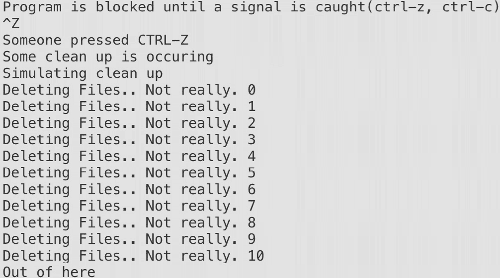

# 文件和系统

概述

在本章中，我们将看到如何与文件系统交互，这意味着我们将读取文件、操作它们、为以后使用存储它们，并获取有关它们的信息。我们还将介绍如何读取文件夹，以便我们可以搜索所需的文件，并检查一些特定的文件格式，例如 CSV，它通常用于以表格形式共享信息。

本章你还将学习如何以标志的形式将一些信息发送到你的应用程序中。

# 技术要求

对于本章，你需要 Go 版本 1.21 或更高版本。本章的代码可以在以下位置找到：[`github.com/PacktPublishing/Go-Programming-From-Beginner-to-Professional-Second-Edition-/tree/main/Chapter14`](https://github.com/PacktPublishing/Go-Programming-From-Beginner-to-Professional-Second-Edition-/tree/main/Chapter14)。

# 简介

在上一章中，我们探讨了如何编写简单的命令行应用程序。在这里，我们将继续这一主题，介绍向应用程序传递参数的方法，以便它根据我们发送的值以不同的方式表现。

之后，我们将与文件系统交互。我们将要处理的文件系统级别是文件、目录和权限级别。我们将解决开发人员在处理文件系统时面临的日常问题。

我们将学习如何创建一个命令行应用程序，该程序可以读取和写入文件。除了讨论从操作系统接收到信号中断时会发生什么之外，我们还将演示在应用程序停止运行之前执行清理操作的方法。我们还将处理应用程序接收到中断的情况，并处理应用程序退出的方式。有时，当你的应用程序正在运行时，操作系统会发送一个信号来关闭应用程序。

在这种情况下，我们可能希望在关闭时记录信息以进行调试；这将帮助我们了解应用程序为何关闭。在本章中，我们将探讨如何做到这一点。然而，在我们开始处理这些问题之前，让我们先对文件系统有一个基本的了解。

# 文件系统

文件系统控制数据在硬盘、USB、DVD 或其他介质上的命名、存储、访问和检索方式。没有统一的文件系统，其行为在很大程度上取决于你使用的操作系统。你一定听说过`FAT`、`FAT32`、`NFTS`等等，这些都是不同的文件系统，通常在 Windows 中使用。Linux 可以读写这些文件系统，但通常使用以`ext`开头的不同文件系统家族，`ext`代表*扩展*。你不需要对文件系统有深入的了解，但作为一个软件工程师，至少对这一主题有一个基本了解是好的。

然而，在本章中，我们感兴趣的是每个文件系统都有自己的文件命名约定，例如文件名的长度、可以使用的特定字符、后缀或文件扩展名的长度等。每个文件都有信息或元数据，这些信息或元数据是嵌入在文件中或与文件关联的，用于描述或提供有关文件的信息。关于文件的这个元数据可以包含诸如文件大小、位置、访问权限、创建日期、修改日期等信息。这是我们应用程序可以访问的所有信息。

文件通常被放置在某种层次结构中。这种结构通常由多个目录和子目录组成。文件在目录中的放置是一种组织数据并获得对文件或目录访问的方式：


图 14.1 – Linux 文件系统

如 *图 14.1* 所示，目录可以嵌套。在正常的 Linux 文件系统中，我们将看到有一个根目录，它由名称 **/** 定义，而其他所有内容都是它的子目录。**家**目录通常包含系统每个用户的文件，在上面的示例中，**matt** 是一个包含 **docs** 和 **mp3** 目录的目录，它们是 **matt** 的子目录，但 **matt** 本身是 **home** 的子目录。

在下一个主题中，我们将探讨文件权限。

## 文件权限

在处理文件创建和修改时，权限是一个重要的方面，你需要理解。

我们需要查看可以分配给文件的各个权限类型。我们还需要考虑这些权限类型在符号和八进制表示法中的表示方式。

Go 使用 Unix 命名法来表示权限类型。它们以符号表示法或八进制表示法表示。三种权限类型是 *读取*、*写入* 和 *执行*。


图 14.2 – 文件权限

每个文件的权限都分配给了三个不同的实体，这些实体可以是个人或组。这意味着一个用户可以是某个有权访问某些文件的组的成员，因此用户继承了这些文件的访问权限。无法将文件权限分配给特定用户；相反，我们将用户添加到组中，然后为该组分配权限。话虽如此，将文件权限分配给以下内容是可能的：

+   **所有者**：这是一个个人，如约翰·史密斯这样的单个个人，或者是文件的所有者 root 用户。一般来说，这是创建文件的个人。

+   **组**：组通常由多个个人或其他组组成。

+   **其他用户**：那些不在组中或不是所有者的用户。

现在我们来看看，如何通过符号表示法来表示权限。以下图表是一个文件及其在 Unix 机器上权限的示例：


图 14.3 – 权限表示

上图中的第一个破折号（`-`）表示该实体是一个文件。如果它是一个目录，它将是字符`d`。

指定权限的另一种方式是八进制表示法，它用一个数字表示多种权限类型。例如，如果你想使用符号表示法来指示读和写权限，它将是`rw-`。如果要用八进制数表示，它将是`6`，因为`4`表示读权限，`2`表示写权限。完全权限将是`7`，意味着`4+2+1`或`read+write+execute`（`rwx`）。

以下是对权限及其解释的总结：


图 14.4 – 组和权限示例

如您所见，每个权限都可以用一个`<=7`的数字表示，这是一个一位数。所有者、组和其他人的权限可以用三位八进制数表示，如下所示：


图 14.5 – 权限表示示例

你可能会注意到，在八进制表示法中，所有数字都以一个`0`开头。当你通过命令行与文件系统交互时，你可以省略前导零。然而，在许多情况下，当你编程时，你需要传递它，以便编译器理解你正在使用八进制表示法。你可能会争辩说`0777`和`777`是相同的数字，但前导零只是一个*约定*，告诉编译器你正在使用八进制表示法，数字是八进制而不是十进制。换句话说，`777`被解释为十进制数`777`，而`0777`被解释为八进制数`0777`，这是十进制数`511`。

# 标志和参数

Go 提供了创建命令行界面工具的支持。通常，当我们编写可执行的 Go 程序时，它们需要接受各种输入。这些输入可能包括文件位置、以调试状态运行程序的价值、获取运行程序的帮助等等。所有这些都可以通过 Go 标准库中的一个名为`flag`的包来实现。它用于允许将参数传递给程序。标志是传递给 Go 程序的参数。使用`flag`包传递给 Go 程序的标志顺序对 Go 来说并不重要。

要定义你的`flag`，你必须知道你将接受的`flag`类型。`flag`包提供了许多用于定义标志的函数。以下是一个示例列表：

```go
func Bool(name string, value bool, usage string) *bool
func Duration(name string, value time.Duration, usage string) *time.Duration
func Float64(name string, value float64, usage string) *float64
func Int(name string, value int, usage string) *int
func Int64(name string, value int64, usage string) *int64
```

这些是一些允许你创建标志并接受参数的函数，Go 中的每个默认类型都有一个。

上述函数的参数可以这样解释：

+   **名称**：此参数是标志的名称；它是一个字符串类型。例如，如果您传递 *file* 作为参数，您将使用以下方式从命令行访问该标志：

    ```go
    ./app -file
    ```

+   **值**：此参数是标志设置的默认值。

+   **用法**：此参数用于描述标志的用途。当您错误地设置值时，它通常会出现在命令行上。传递错误的标志类型将停止程序并导致错误；将打印用法。

+   **返回值**：这是存储标志值的变量的地址。

让我们看看一个简单的例子：

```go
package main
import (
    "flag"
    "fmt"
)
func main() {
    v := flag.Int("value", -1, "Needs a value for the flag.")
    flag.Parse()
    fmt.Println(*v)
}
```

让我们回顾一下前面的代码块并分析它：

1.  首先，我们定义 `main` 包。

1.  然后我们导入 `flag` 和 `fmt` 包。

1.  `v` 变量将引用 `-value` 或 `--value` 的值。

1.  在调用 `flag.Parse()` 之前，`*v` 的初始值是 `-1` 的默认值。

1.  在定义标志之后，您必须调用 `flag.Parse()` 将定义的标志解析到命令行中。

1.  调用 `flag.Parse()` 将 `-value` 参数的值放入 `*v`。

1.  一旦您调用了 `flag.Parse()` 函数，标志将可用。

1.  在命令行上，执行以下命令，您将在同一目录中获取可执行文件：

    ```go
    go build -o flagapp main.go
    ```

要在 Windows 上获取可执行文件，请运行：

`go build -o` `flagapp.exe main.go`

然而，还有另一种定义这些标志的方法。可以使用以下函数来完成：

```go
func BoolVar(p *bool, name string, value bool, usage string)
func DurationVar(p *time.Duration, name string, value time.Duration, usage string)
func Float64Var(p *float64, name string, value float64, usage string)
func Int64Var(p *int64, name string, value int64, usage string)
func IntVar(p *int, name string, value int, usage string)
```

如您所见，对于每种类型，都有一个类似于我们之前看到的函数，其名称以 `Var` 结尾。它们都接受一个指向标志类型的指针作为第一个参数，并且可以像以下代码片段中那样使用：

```go
package main
import (
    "flag"
    "fmt"
)
func main() {
    var v int
    flag.IntVar(&v, "value", -1, "Needs a value for the flag.")
    flag.Parse()
    fmt.Println(v)
}
```

此代码与前面的代码片段做的是相同的事情，但是这里有一个简短的分解：

+   首先，我们定义一个整数变量 `v`

+   将其引用作为 `IntVar` 函数的第一个参数

+   解析标志

+   打印 `v` 变量，现在不需要解引用，因为它不是标志而是一个实际的整数

如果我们使用任何前面的代码片段将我们的应用程序编译为名为 `flagapp` 的可执行文件，并在可执行文件相同的目录中使用以下调用，我们会看到它会打印数字 `5`：

```go
flagapp -value=5
```

如果我们在可执行文件相同的目录中使用以下调用而不带参数调用它，我们会看到它只会打印 `-1`：

```go
flagapp
```

这是因为 `-1` 是默认值。

## 信号

信号是操作系统发送到我们的程序或进程的中断。当信号被发送到我们的程序时，程序将停止正在执行的操作；要么处理信号，要么如果可能的话忽略它。

以下是最常用于 Go 程序的前三个中断信号列表：

+   **SIGINT**（中断）：

    +   **情况**：此信号通常在用户在终端中按下 *Ctrl + C* 以中断程序的执行时使用。

    +   定义：SIGINT 是中断信号。它用于优雅地终止程序并在退出之前执行清理操作。

+   `SIGTERM`（终止）：

    +   情况：这个信号通常用于以受控方式请求程序终止。它是一个用于终止进程的通用信号。

    +   定义：SIGTERM 是终止信号。它允许程序在退出之前执行清理操作，类似于 SIGINT，但它可以被捕获并不同方式处理。

+   `SIGKILL`（终止）：

    +   情况：这个信号用于强制终止程序。它不允许程序执行任何清理操作。

    +   定义：SIGKILL 是终止信号。它立即终止进程，不给它清理资源的机会。与 SIGTERM 相比，这是一种更加强力的结束程序的方式。

我们已经看到了其他改变程序流程的 Go 命令；你可能想知道应该使用哪一个。

我们在我们的应用程序中使用`defer`语句来执行各种清理活动，如下所示：

+   释放资源

+   关闭文件

+   关闭数据库连接

+   执行移除配置或临时文件的操作

在某些用例中，完成这些活动非常重要。使用`defer`函数将在返回调用者之前执行它。然而，这并不能保证它总是会运行。在某些场景中，`defer`函数不会执行；例如，操作系统对程序的干扰：

+   `os.Exit(1)`

+   *Ctrl + C*

+   来自操作系统的其他指令

前面的场景表明了可能需要使用信号的情况。信号可以帮助我们控制程序的退出。根据信号，它可能会终止我们的程序。例如，应用程序正在运行，并在执行`employee.CalculateSalary()`后遇到操作系统中断信号。在这种情况下，`defer`函数将不会运行，因此，`employee.DepositCheck()`不会执行，员工没有得到工资。信号可以改变程序的流程。以下图表概述了我们之前讨论的场景：


图 14.6 – 带有信号的示例程序

处理信号的支持内置在 Go 标准库中；它在`os/signal`包中。这个包将使我们能够使我们的程序更具弹性。我们希望在接收到某些信号时优雅地关闭。在 Go 中处理信号的第一件事是捕获或拦截你感兴趣的信号。这是通过使用以下函数来完成的：

```go
func Notify(c chan<- os.Signal, sig ...os.Signal)
```

这个函数接受一个`os.Signal`数据类型在通道`c`上，`sig`参数是一个`os.Signal`的可变变量；我们指定零个或多个我们感兴趣的`os.Signal`数据类型。让我们看看一个代码片段，展示我们如何使用这个函数来停止应用程序的执行：

```go
package main
import (
    "fmt"
    "os"
    "os/signal"
    "syscall"
)
func main() {
    sigs := make(chan os.Signal, 1)
    done := make(chan struct{})
    signal.Notify(sigs,syscall.SIGINT)
    go func() {
    for {
        s := <-sigs
        switch s {
            case syscall.SIGINT:
                fmt.Println()
                fmt.Println("My process has been interrupted. Someone might of pressed CTRL-C")
                fmt.Println("Some clean up is occuring")
                done <-struct{}{}
            }
        }
    }()
    fmt.Println("Program is blocked until a signal is caught")
    done <- struct{}{}
    fmt.Println("Out of here")
}
```

在定义包和导入包之后，我们进行以下操作：

+   定义一个用于发送信号的通道。

+   定义一个我们可以用作停止执行的标志的通道。

+   使用 `Notify` 发送 `SIGINT` 信号。

+   创建一个无限监听信号的协程，如果信号是 `SIGINT`，则进行一些打印输出，并向 `done` 通道发送带有 `true` 值的消息。

+   打印一条消息，说明我们正在等待接收 `done` 消息。

+   等待 `done` 消息。

+   打印最终的消息。

当我们运行应用程序时，实际上我们会看到应用程序很快就会终止，因为我们手动发送了 `SIGINT` 信号。在现实世界的场景中，应用程序会等待 `SIGKILL` 信号，我们可以通过手动发送 *Ctrl* + *X* 来发送这个信号。

现在我们来看看如何模拟清理操作。

## 练习 14.01 – 模拟清理操作。

在这个练习中，我们将捕获两个信号：`SIGINT` 和 `SIGTSTP`。一旦捕获到这些信号，我们将模拟文件清理。我们还没有讲解如何删除文件，所以在这个例子中，我们将简单地创建一个延迟来演示我们如何在捕获到信号后运行一个函数。这是这个练习期望的输出：

1.  创建一个名为 `main.go` 的文件。

1.  向这个文件添加 `main` 包和以下 `import` 语句：

    ```go
    package main
    import (
        "fmt"
        "os"
        "os/signal"
        "syscall"
        "time"
    )
    ```

1.  在 `main()` 函数中，创建一个 `os.Signal` 类型的通道。`sigs` 通道用于接收来自 `Notify` 方法的这些通知：

    ```go
    func main() {
        sigs := make(chan os.Signal, 1)
    ```

1.  接下来，添加一个 `done` 通道。`done` 通道用于通知我们程序何时可以退出：

    ```go
        done := make(chan struct{})
    ```

1.  然后我们将添加一个 `signal.Notify` 方法。`Notify` 方法通过向通道发送 `os.Signal` 类型的值来工作。

1.  回想一下，`signal.Notify` 方法的最后一个参数是 `os.Signal` 类型的可变参数。

1.  `signal.Notify` 方法将在 `sigs` 通道上接收 `syscall.SIGINT` 和 `syscall.SIGTSTP` 类型的通知。

1.  通常情况下，`syscall.SIGINT` 类型会在你按下 *Ctrl* + *C* 时发生。

1.  通常情况下，`syscall.SIGTSTP` 类型会在你按下 *Ctrl* + *Z* 时发生：

    ```go
        signal.Notify(sigs, syscall.SIGINT, syscall.SIGTSTP)
    ```

1.  创建一个匿名函数作为协程：

    ```go
        go func() {
    ```

1.  在协程内部，创建一个无限循环。在无限循环内部，我们将从 `sigs` 通道接收一个值并将其存储在 `s` 变量中，`s := <-sigs`：

    ```go
        for {
          s := <-sigs
    ```

1.  创建一个 `switch` 语句来评估从通道接收到的内容。

1.  我们将有两个情况语句来检查 `syscall.SIGINT` 和 `syscall.SIGTSP` 类型。

    每个情况语句都会打印一条消息。

1.  我们还将调用我们的 `cleanup()` 函数。

1.  情况语句中的最后一个语句是向 `done` 通道发送 `true` 以停止阻塞：

    ```go
          switch s {
          case syscall.SIGINT:
            fmt.Println()
            fmt.Println("My process has been interrupted. Someone might have pressed CTRL-C")
            fmt.Println("Some clean up is occuring")
            cleanUp()
            done <- struct{}{}
          case syscall.SIGTSTP:
            fmt.Println()
            fmt.Println("Someone pressed CTRL-Z")
            fmt.Println("Some clean up is occuring")
            cleanUp()
            done <- struct{}{}
          }
        }
      }()
      fmt.Println("Program is blocked until a signal is caught(ctrl-z, ctrl-c)")
      done <- struct{}{}
      fmt.Println("Out of here")
    }
    ```

1.  创建一个简单的函数来模拟执行清理操作的过程：

    ```go
    func cleanUp() {
      fmt.Println("Simulating clean up")
      for i := 0; i <= 10; i++ {
        fmt.Println("Deleting Files.. Not really.", i)
        time.Sleep(1 * time.Second)
      }
    }
    ```

1.  你可以尝试运行这个程序，然后按下 *Ctrl* + *Z* 和 *Ctrl* + *C* 来检查程序的不同结果。这仅在 Linux 和 macOS 上有效：

1.  现在运行代码：

    ```go
    go run main.go
    ```

1.  以下是输出结果：



图 14.7 – 示例输出

在这个练习中，我们展示了拦截中断并在应用程序关闭前执行任务的 ability。我们有控制退出 ability。这是一个强大的功能，允许我们执行清理操作，包括删除文件、进行最后的日志记录、释放内存等。在下一个主题中，我们将创建并写入文件。我们将使用来自 Go 标准包的`os`函数。

# 创建并写入文件

Go 语言以各种方式提供支持来创建和写入新文件。我们将检查一些最常见的方法，这些方法是如何执行的。

`os`包提供了一种简单的方式来创建文件。对于那些熟悉 Unix 世界中的`touch`命令的人来说，它与此类似。以下是该函数的签名：

```go
func Create(name string(*File, error)
```

该函数将创建一个空文件，就像`touch`命令一样。重要的是要注意，如果文件已经存在，它将截断文件。

`os`包的`Create`函数有一个输入参数，即要创建的文件名及其位置。如果成功，它将返回一个`File`类型。值得注意的是，`File`类型满足`io.Write`和`io.Read`接口。这对于本章后面的内容很重要：

```go
package main
import (
    "os"
)
func main() {
    f, err := os.Create("test.txt")
    if err != nil {
        panic(err)
    }
    defer f.Close()
}
```

上述代码只是定义了导入，然后在`main`函数中尝试创建一个名为`test.txt`的文件。如果因此出现错误，它将引发恐慌。在括号关闭前的最后一行确保，无论应用程序是成功终止还是恐慌，文件都将被关闭。我们想确保我们永远不会保持文件处于打开状态。

创建一个空文件很简单，但让我们继续使用`os.Create`并写入我们刚刚创建的文件。回想一下，`os.Create`返回一个`*os.File`类型。有两个有趣的方法可以用来写入文件：

+   `Write`

+   `WriteString`

让我们看看一些如何使用它们的例子：

```go
package main
import (
    "os"
)
func main() {
    f, err := os.Create("test.txt")
    if err != nil {
        panic(err)
    }
    defer f.Close()
    f.Write([]byte("Using Write function.\n"))
    f.WriteString("Using Writestring function.\n")
}
```

这段代码与之前的代码非常相似。我们只是添加了两行，将两句话写入文件。

第一次函数调用如下：

```go
f.Write([]byte("Using Write function.\n"))
```

在这里，我们可以看到该函数需要发送字节，因此我们使用以下方式将字符串转换为字节数组：

```go
[]byte("Using Write function.\n")
```

第二个函数仅接受一个字符串，并且使用起来很简单。

然而，我们可以使用该包直接写入文件，而无需先打开它。我们可以使用`os.WriteFile`函数来完成这个操作：

```go
func WriteFile(filename string, data []byte, perm os.FileMode) error
```

该方法将数据写入由`filename`参数指定的文件，并使用给定的权限。如果存在错误，它将返回一个错误。让我们看看它是如何工作的：

```go
package main
import (
    "fmt"
    "os
)
func main() {
    message := []byte("Look!")
    err := os.WriteFile("test.txt", message, 0644)
    if err != nil {
        fmt.Println(err)
    }
}
```

如我们所见，我们可以在一行中创建一个文件，发送一个转换为字节切片的字符串，并为其分配权限。同时，我们也需要发送权限级别，并注意我们需要使用带前导零的八进制表示法（这是因为如果没有前导零，权限将不会按预期工作）。

我们之前还没有看到的一个重要问题是，如何检查文件是否存在。这很重要，因为如果文件确实存在，我们可能不想截断它并用新内容覆盖它。让我们看看我们如何做到这一点：

```go
package main
import (
    "fmt"
    "s"
    "flag"
)
func main() {
    var name tring
    flag.StringVar(&name, "name", "", "File name")
    flag.Parse()
    file, err := os.Stat(name)
    if err != nil {
        if os.IsNotExist(err) {
            fmt.Printf("%s: File does not exist!\n", name)
            fmt.Println(file)
            return
        }
        fmt.Println(err)
        return
      }
    fmt.Printf("file name: %s\nIsDir: %t\nModTime: %v\nMode: %v\nSize: %d\n", file.Name(),
    file.IsDir(), file.ModTime(), file.Mode(), file.Size())
}
```

让我们回顾一下前面的代码做了什么：

1.  首先，我们导入所有需要的包。

1.  然后我们定义一个表示文件名的字符串标志：

    ```go
    flag.StringVar(&name, "name", "", "File name")
    ```

1.  接下来，我们解析标志；在这种情况下，只有一个是我们创建的。

1.  然后，我们获取文件的状态信息：

    ```go
    file, err := os.Stat(name)
    ```

1.  如果出现错误，我们检查这是否是因为文件不存在：

    ```go
    if os.IsNotExist(err) {
    ```

1.  如果文件不存在，我们打印一条消息，然后终止应用程序。

1.  如果错误与 `IsNotExist` 不同，我们就打印错误信息。

1.  如果最终文件存在，我们就打印与它相关的一系列信息。该文件实现了 `FileInfo` 接口，其中包含修改时间、大小、八进制权限（*mode*）、名称以及它是否是目录。

你可以尝试运行这个应用程序并传递任何文件的名称。如果它存在于你运行应用程序的目录中，你将看到所有这些信息被打印出来。

现在我们来看看如何读取整个文件。

## 一次性读取整个文件

在这个主题中，我们将探讨两种读取文件所有内容的方法。这两个函数在文件大小较小时使用起来很好。虽然这两个方法方便且易于使用，但它们有一个主要的缺点。那就是，如果文件太大，可能会耗尽系统上的内存。这一点很重要，我们需要记住，并理解我们将在这个主题中讨论的两个方法的限制。尽管这些方法是一些最快和最简单加载数据的方法，但重要的是要理解它们应该仅限于小文件，而不是大文件。该方法的签名如下：

```go
func ReadFile(filename string) ([]byte, error)
```

`ReadFile` 函数读取文件内容，并以字节切片的形式返回，同时报告任何错误。当使用 `ReadFile` 方法时，我们将查看错误返回值：

+   成功调用返回 `err ==` `nil`。

+   在文件的其他一些读取方法中，**文件结束**（**EOF**）被视为错误。对于将整个文件读入内存的函数来说，情况并非如此。

让我们看看一个代码片段，解释如何使用这个函数：

```go
package main
import (
    "fmt"
    "os"
)
func main() {
    content, err := os.ReadFile("test.txt")
    if err != nil {
        fmt.Println(err)
    }
    fmt.Println("File contents: ")
    fmt.Println(string(content))
}
```

如我们所见，我们在代码中执行的操作如下：

+   我们执行导入操作

+   我们读取整个 `test.txt` 文件的内容

+   如果发生错误，我们打印错误信息

+   否则，我们打印文件的内容：

    ```go
      fmt.Println("File contents: ")
      fmt.Println(string(content))
    ```

由于内容是以字节数组的形式检索的，我们需要将其转换为字符串以可视化它。让我们看看如何在下一个片段中逐字符读取文件：

```go
package main
import (
    "fmt"
    "io"
    "log"
    "os"
)
func main() {
    f, err := os.Open("test.txt")
    if err != nil {
        log.Fatalf("unable to read file: %v", err)
    }
    buf := make([]byte, 1)
    for {
        n, err := f.Read(buf)
        if err == io.EOF {
            break
        }
        if err != nil {
            fmt.Println(err)
            continue
        }
    if n > 0 {
            fmt.Print(string(buf[:n]))
    }
    }
}
```

让我们更详细地分析这个片段，因为它有点复杂。在这种情况下，在导入所需的包之后，我们执行以下操作：

1.  使用`Open`函数打开文件：

    ```go
    f, err := os.Open("test.txt")
    ```

1.  我们检查错误是否为`nil`，如果不是，我们打印错误并退出：

    ```go
    if err != nil {
        log.Fatalf("unable to read file: %v", err)
    }
    ```

1.  然后我们创建一个大小为`1`的字节数组切片：

    ```go
      buf := make([]byte, 1)
    ```

1.  然后我们创建一个无限循环，并在其中读取文件到缓冲区：

    ```go
    n, err := f.Read(buf)
    ```

1.  然后我们检查是否有错误，这也意味着我们到达了文件末尾，在这种情况下我们停止循环：

    ```go
    if err == io.EOF {
        break
    }
    ```

1.  如果错误不是`nil`但也不是文件结束，我们将继续循环，忽略错误。

1.  如果没有错误并且已经读取了内容，那么我们显示内容：

    ```go
    if n > 0 {
      fmt.Print(string(buf[:n]))
    }
    ```

注意我们一次读取一个字符，因为我们创建了一个大小为 1 的缓冲区（字节数组）。这可能会很耗费资源，所以你可能需要根据你特定的案例和需求更改这个值。

## 练习 14.02 – 备份文件

通常，当我们处理文件时，在对其做出更改之前需要备份文件。这是在可能犯错或需要原始文件进行审计目的的情况下。在这个练习中，我们将取一个名为`note.txt`的现有文件，并将其备份到`backupFile.txt`。然后我们将打开`note.txt`并在文件的末尾添加一些额外的注释。我们的目录将包含以下文件：


图 14.8 – 将文件备份到目录

1.  我们必须首先在可执行文件相同的目录下创建`note.txt`文件。此文件可以是空的，也可以包含一些示例数据，如下所示：


图 14.9 – notes.txt 文件内容的示例

1.  创建一个名为`main.go`的 Go 文件。

1.  这个程序将是`main`包的一部分。

1.  包含如以下代码所示的导入：

    ```go
    package main
    import (
        "errors"
        "fmt"
        "io"
        "os"
        "strconv"
    )
    ```

1.  创建一个自定义错误，当工作文件（`note.txt`）未找到时使用：

    ```go
    var (
        ErrWorkingFileNotFound = errors.New("The working file is not found.")
    )
    ```

1.  创建一个执行备份的函数。这个函数负责将工作文件的内容存储在`backup`文件中。这个函数接受两个参数。`working`参数是你当前正在工作的文件的文件路径：

    ```go
    func createBackup(working, backup string) error {
    }
    ```

1.  在这个函数内部，我们需要检查工作文件是否存在。在我们能够读取其内容并将其存储在我们的备份文件之前，它必须首先存在。

    我们能够通过使用`os.IsNotExist(err)`来检查错误是否是文件不存在的情况。

    如果文件不存在，我们将返回我们的自定义错误，`ErrWorkingFileNotFound`：

    ```go
        // check to see if our working file exists,
        // before backing it up
        _, err := os.Stat(working)
        if err != nil {
        if os.IsNotExist(err) {
            return ErrWorkingFileNotFound
        }
        return err
      }
    ```

1.  接下来，我们需要打开工作文件并将函数返回的`os.File`存储到`workFile`变量中：

    ```go
        workFile, err := os.Open(working)
        if err != nil {
            return err
        }
    ```

1.  我们需要读取`workFile`的内容。我们将使用`io.ReadAll`方法来获取`workFile`的所有内容。`workFile`是`os.File`类型，它满足`io.Reader`接口；这允许我们将其传递给`ioutil.ReadFile`。

1.  检查是否有错误：

    ```go
      content, err := io.ReadAll(workFile)
      if err != nil {
        return err
      }
    ```

1.  `content`变量包含以字节切片形式表示的`workFile`数据。这些数据需要写入备份文件。我们将实现将`content`变量的数据写入备份文件的代码。

1.  `content`变量存储从函数返回的`[]byte`数据。这是存储在变量中的整个文件内容。

1.  我们可以使用`os.Writefile`方法。如果备份文件不存在，它将创建文件。如果备份文件已存在，它将使用内容变量`data`覆盖文件：

    ```go
      err = os.WriteFile(backup, content, 0644)
      if err != nil {
          fmt.Println(err)
      }
    ```

1.  我们需要返回`nil`，表示在这个阶段，我们没有遇到任何错误：

    ```go
      return nil
    }
    ```

1.  创建一个函数，将数据附加到我们的工作文件。

1.  命名函数`addNotes`；这个函数将接受我们工作文件的地址和一个将被附加到工作文件的字符串参数。该函数需要返回一个错误：

    ```go
    func addNotes(workingFile, notes string) error {
    //…
      return nil
    }
    ```

1.  在`addNotes`函数内部，添加一行代码，将新行附加到每个笔记的字符串上。这将使每个笔记单独占一行：

    ```go
    func addNotes(workingFile, notes string) error {
      notes += "\n"
      //…
      return nil
    }
    ```

1.  接下来，我们将打开工作文件，并允许向文件追加内容。`os.OpenFile()`函数将在文件不存在时创建文件。检查是否有任何错误：

    ```go
    func addNotes(workingFile, notes string) error {
      notes += "\n"
      f, err := os.OpenFile(
        workingFile,
        os.O_APPEND|os.O_CREATE|os.O_WRONLY,
        0644,
      )
      if err != nil {
        return err
      }
      // …
      return nil
    }
    ```

1.  在打开文件并检查错误后，我们应该确保使用`defer`函数`f.Close()`在函数退出时关闭文件：

    ```go
    func addNotes(workingFile, notes string) error {
      notes += "\n"
      f, err := os.OpenFile(
        workingFile,
        os.O_APPEND|os.O_CREATE|os.O_WRONLY,
        0644,
      )
      if err != nil {
         return err
      }
      defer f.Close()
    //…
      return nil
    }
    ```

1.  函数的最终步骤是将笔记的内容写入`workingFile`变量。我们可以使用`Write`方法来完成这个任务：

    ```go
    func addNotes(workingFile, notes string) error {
      notes += "\n"
      f, err := os.OpenFile(workingFile, os.O_APPEND|os.O_CREATE|os.O_WRONLY, 0644)
      if err != nil {
          return err
      }
      defer f.Close()
      if _, err := f.Write([]byte(notes)); err != nil {
        return err
      }
      return nil
    }
    ```

1.  在`main()`函数中，我们将初始化三个变量；`backupFile`变量包含备份我们的`workingFile`变量的文件名，而`data`变量是我们将要写入`workingFile`变量的内容：

    ```go
    func main() {
        backupFile := "backupFile.txt"
        workingFile := "note.txt"
        data := "note"
    ```

1.  调用我们的`createBackup()`函数来备份我们的`workingFile`。在调用函数后检查错误：

    ```go
        err := createBackup(workingFile, backupFile)
        if err != nil {
            fmt.Println(err)
        os.Exit(1)
        }
    ```

1.  创建一个循环，该循环将迭代`10`次。

    在每次迭代中，我们将我们的`note`变量设置为`data`变量加上循环的`i`变量。

    由于我们的`note`变量是字符串，而`i`变量是`int`类型，我们需要使用`strconv.Itoa(i)`方法将`i`转换为字符串。

    调用我们的`addNotes()`函数，并传递`workingFile`和我们的`note`变量。

    检查函数返回的任何错误：

    ```go
        for i := 1; i <= 10; i++ {
        note := data + " " + strconv.Itoa(i)
        err := addNotes(workingFile, note)
        if err != nil {
            fmt.Println(err)
            os.Exit(1)
            }
        }
    }
    ```

1.  运行程序：

    ```go
    go run main.go
    ```

1.  在运行程序后评估文件的变化。

以下是运行程序后的结果：


图 14.10 – 备份结果

让我们看看如何使用 Go 处理 CSV 文件。

# CSV

文件结构中最常见的方式之一是逗号分隔值。这是一个包含数据的纯文本文件，基本上以行和列的形式表示。这些文件通常用于交换数据。CSV 文件具有简单的结构。每条数据由逗号分隔，然后是新的一行以表示另一个记录。以下是一个 CSV 文件的示例：

```go
firstName, lastName, age
Celina, Jones, 18
Cailyn, Henderson, 13
Cayden, Smith, 42
```

在你的一生中，你可能会遇到 CSV 文件，因为它们非常常见。Go 编程语言有一个用于处理 CSV 文件的标准库：`encoding/csv`：

```go
package main
import (
    "encoding/csv"
    "fmt"
    "io"
    "log"
    "strings"
)
func main() {
    in := `firstName, lastName, age
Celina, Jones, 18
Cailyn, Henderson, 13
Cayden, Smith, 42
`
    r := csv.NewReader(strings.NewReader(in))
    for {
        record, err := r.Read()
        if err == io.EOF {
            break
        }
        if err != nil {
            log.Fatal(err)
        }
        fmt.Println(record)
    }
}
```

在这里，我们定义了一个包含我们 CSV 文件内容的字符串：

```go
func main() {
    in := `firstName, lastName, age
Celina, Jones, 18
Cailyn, Henderson, 13
Cayden, Smith, 42`
```

然后我们使用以下行来读取整个 CSV 的内容：

```go
  r := csv.NewReader(strings.NewReader(in))
```

以下代码行创建了一个字符串读取器，它可以由`csv.NewReader`函数使用。实际上，我们不能直接将字符串传递给 CSV 读取器，因为它需要一个`io.Reader`实例，在这种情况下由`strings.NewReader`提供：

```go
strings.NewReader(in)
```

然后，我们创建一个无限循环，当达到 CSV 的末尾时终止：

```go
if err == io.EOF {
   break
}
```

正如我们在本章前面所做的那样，我们接着检查另一个错误，如果找到错误则退出；否则，我们打印记录，该记录是通过 CSV 读取器的`Read()`方法检索到的。

在前面的例子中，我们看到了如何一次性获取整个记录，即我们的 CSV 中的一行。然而，有一种方法可以访问返回行中的每一列，即每一行的单个元素。

如果你回顾一下之前的代码片段，你会看到行是以以下方式返回的：

```go
 record, err := r.Read()
```

然后，我们只是打印了内容，但这实际上是一个字符串切片，因此我们可以通过索引获取每个项目。假设我们只对可视化 CSV 中的人名感兴趣。为此，我们可以修改`fmt.Println(record)`行如下：

```go
  fmt.Println(record[0])
```

使用这个库，我们只会看到名字列表。

# 嵌入

通常，你需要向用户展示一些复杂的文本，可能是一个 HTML 页面，将整个文件定义为字符串可能不太实际。你可能像在本章中学到的那样读取文件，然后将其用作模板。你可能还想显示一张图片，同样是通过打开和读取包含图片的文件。Go 的一个伟大特性是，即使你可以将你的应用程序构建为一个单一的二进制文件，你也将有需要与你的二进制文件一起分发的外部依赖。另一个问题是，从文件中读取可能很慢，所以如果我们可以将文件嵌入到我们的 Go 应用程序中，那就太好了。这将允许我们只分发一个包含所有资源的二进制文件。在过去，这需要外部库，但现在 Go 包含一个名为`embed`的包，它允许你轻松地将任何文件嵌入到你的二进制文件中，这样你就不需要共享其他依赖。让我们看看如何做到这一点。

在下一个片段中，我们将创建一个非常简单的模板文件，并读取和解析它。然后我们将使用它来显示一些问候语。让我们从模板开始。我们需要一个如下的文件夹结构：`embedding_example/main.go`和`templates/template.txt`。

`template.txt`文件的内容是`Hello {{.Name}}`，这很简单。这仅仅意味着当我们使用这个模板并传递一个名为`Name`的变量时，引擎将用我们传递的任何值来替换这个变量。在这个阶段，你不需要对模板系统有更多的了解。

现在我们来看看如何利用这个在外部文件编写的模板，而无需每次运行应用程序时都读取它：

```go
package main
import (
    "embed"
    "os"
    "text/template"
)
type Person struct {
    Name string
}
var (
    //go:embed templates
    f embed.FS
)
func main() {
    p := Person{"John"}
    tmpl, err := template.ParseFS(f, "templates/template.txt")
    if err != nil {
        panic(err)
    }
    err = tmpl.Execute(os.Stdout, p)
    if err != nil {
        panic(err)
    }
}
```

1.  我们开始导入所有必要的包。之后，我们定义一个名为`Person`的结构体，它将保存要问候的人的名字。接下来的部分是重要的部分：

    ```go
    var (
        //go:embed templates
        f embed.FS
    )
    ```

这定义了一个类型为`embed.FS`的`f`变量，代表*嵌入文件系统*，将为我们作为一个虚拟文件系统工作。声明顶部的指令需要正好位于我们定义的变量之上，否则编译器会提示我们错误。这个指令告诉 Go 编译器它需要读取并嵌入`templates`文件夹中的内容，并使其可用。如果你添加一个包含太多大文件的文件夹，请注意，你的最终二进制文件的大小将会增加。

1.  在`main`函数内部，我们随后实例化了一个类型为`Person`的结构体，其中`Name`属性具有值`John`。

1.  之后，我们使用`template`包的`ParseFS`函数，我们用它从嵌入的文件系统（变量`f`表示）中读取`templates`文件夹内的`template.txt`文件。

1.  接下来，我们只需执行模板引擎，传递之前创建的结构体。如果你运行应用程序，你会看到以下消息打印出来：

    ```go
    Hello John
    ```

1.  现在，这似乎并不多，但尝试运行以下命令：

    ```go
    go build -o embtest main.go
    ```

1.  然后，将你的可执行文件复制到另一个位置，那里没有`template`文件夹。如果你现在从这个新文件夹运行，你仍然会看到完全相同的信息：

    ```go
    ./embtest
    ```

这里的重要收获是，该指令从指定的点开始获取整个文件系统，在本例中是`templates`文件夹，并创建一个虚拟文件系统。从这个虚拟文件系统中，你可以读取所有文件，但实际上整个文件夹的内容将实际存储在你的应用程序的最终二进制文件中。这个功能非常强大，但应该明智地使用，因为最终的二进制文件可能会轻易变得非常大。

# 摘要

在本章中，我们了解了 Go 如何看待和使用文件权限。我们了解到文件权限可以用符号和八进制表示。我们发现 Go 标准库内置了对打开、读取、写入、创建、删除和向文件追加数据的功能的支持。我们研究了`flag`包以及它如何提供创建命令行应用程序以接受参数的功能。

使用`flag`包，我们还可以打印出与我们的命令行应用程序相关的`usage`语句。

然后，我们演示了操作系统信号如何影响我们的 Go 程序；然而，通过使用 Go 标准库，我们可以捕获操作系统信号，并在适用的情况下控制我们希望如何退出我们的程序。

我们还了解到 Go 有一个用于处理 CSV 文件的标准库。在我们之前的工作中，我们看到了我们还可以处理结构化为 CSV 文件的文件。Go CSV 包提供了遍历文件内容的能力。CSV 文件可以看作是类似于数据库表的行和列。

最后，我们了解了如何在应用程序的最终二进制文件中嵌入文件，以及如何使用此功能来加快应用程序的速度并避免将外部依赖项与二进制文件一起分发。在下一章中，我们将探讨如何连接到数据库并执行针对数据库的 SQL 语句。这将展示 Go 在需要后端存储数据的应用程序中的使用能力。
