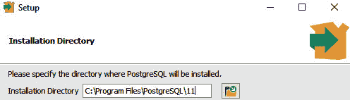
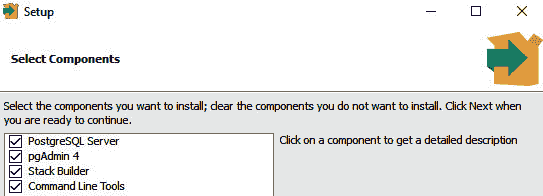
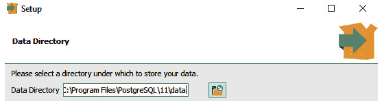
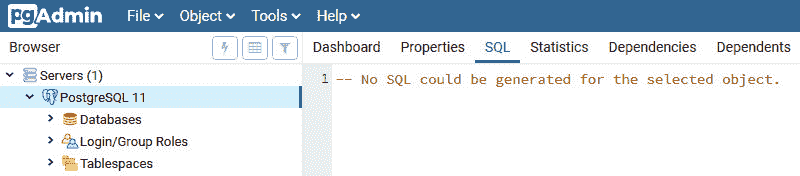
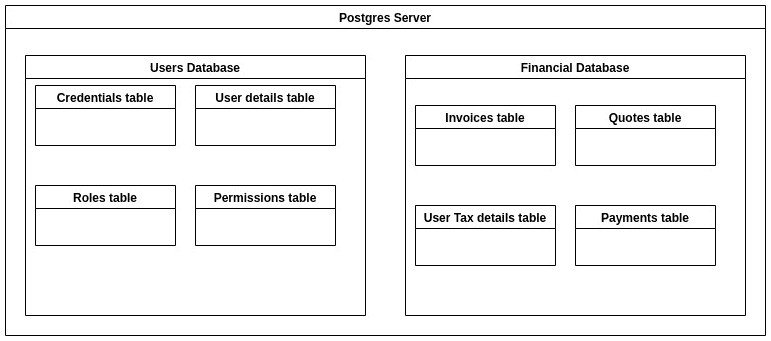
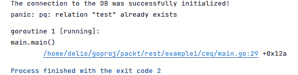
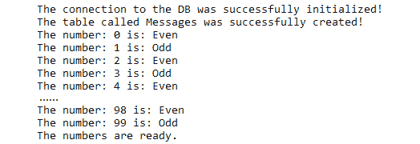
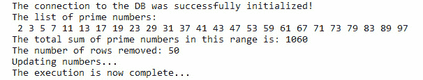
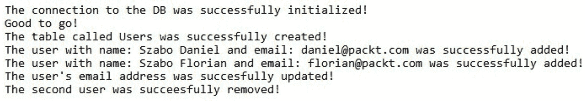

# 15

# SQL 和数据库

概述

本章将介绍数据库——特别是关系数据库——以及如何通过 Go 编程语言访问它们。

本章将指导你如何连接到 SQL 数据库引擎，如何创建数据库，如何在数据库中创建表，以及如何在表中插入和检索数据。到本章结束时，你将能够更新和删除特定表中的数据，以及截断和删除表。

# 技术要求

对于本章，你需要 Go 版本 1.21 或更高。本章的代码可以在[`github.com/PacktPublishing/Go-Programming-From-Beginner-to-Professional-Second-Edition-/tree/main/Chapter15`](https://github.com/PacktPublishing/Go-Programming-From-Beginner-to-Professional-Second-Edition-/tree/main/Chapter15)找到。

# 简介

在上一章中，你学习了如何与你的 Go 应用程序运行的文件系统交互。你学习了退出代码的重要性以及如何自定义脚本以接受参数，从而增加应用程序的灵活性。你还学习了如何处理应用程序接收到的不同信号。

在本章中，你将通过学习如何在 Go 中使用 SQL 和数据库来进一步提高你的 Go 技能。作为一名开发者，没有对持久数据存储和数据库的适当理解是无法立足的。我们的应用程序处理输入并产生输出，但大多数情况下，如果不是所有情况，数据库都会涉及这个过程。这个数据库可以是内存中的（存储在计算机的 RAM 中），也可以是基于文件的（目录中的一个文件），它可以存在于本地或远程存储上。数据库引擎可以本地安装，就像我们将在本章后面做的那样，但也可以使用云提供商，这些提供商允许你将数据库作为一项服务使用；提供多种数据库引擎选项的云提供商包括 Azure、AWS 和 Google Cloud。

我们在本章中旨在让你能够流利地与这些数据库进行交流，并理解数据库的基本概念。最后，随着你通过本章的学习，你将扩展你的技能集，使你成为一个更好的 Go 开发者。

假设你的老板想要你创建一个可以与数据库通信的 Go 应用程序。这里的“通信”意味着任何 `INSERT`、`UPDATE`、`DELETE` 或 `CREATE` 事务都可以并由应用程序处理。本章将展示如何做到这一点。

# 理解数据库

我们通常以不同的方式使用“数据库”这个词，但让我们在这里更加正式一些：

数据库是我们存储数据的地方，是我们持久化数据的地方（如果我们想的话），我们还可以在其中运行一些查询来插入新数据，检索或修改现有数据。

您可能会认为文件系统符合这个描述，但实际上并非如此；真正的数据库允许我们根据非常具体的条件执行非常复杂和精确的查询来收集数据。为此，我们将有一个用于执行这些查询或其他操作的语言。在我们的案例中，我们将专注于一种称为 SQL 的语言。

我们已经说明了什么是数据库，但这仍然相当抽象。为了创建数据库并填充数据，我们需要一个引擎——本质上是一个应用程序——它将允许我们执行所有这些操作。在本节中，我们将学习如何使用名为 **PostgreSQL** 的数据库引擎。正如其名称所暗示的，这个引擎将允许我们使用 SQL 语言执行操作。

## 安装和配置 PostgreSQL

作为第一步，您需要安装 PostgreSQL 并为您自己配置它，以便您可以尝试以下示例。

首先，您需要从 [`www.postgresql.org/download/`](https://www.postgresql.org/download/) 下载安装程序。选择适合您系统的版本；我们将在这里介绍 Windows 安装程序，但其他系统的情况也相当相似。安装程序非常易于使用，我建议您接受默认设置：

1.  运行安装程序：



图 15.1：选择安装目录

1.  保持默认组件不变：



图 15.2：选择要安装的组件

1.  保持默认的数据目录：



图 15.3：选择数据目录

注意

您将被要求输入密码。您需要记住这个密码，因为这是您数据库的主密码。

`Start!123` 是本例的密码。数据库运行在本地的端口 `5432` 上。`pgAdmin` 图形界面工具也将被安装，一旦安装程序完成，您就可以启动 `pgAdmin` 来连接到数据库。

在您的浏览器中，访问 [`packt.live/2PKWc5w`](https://packt.live/2PKWc5w) 以访问管理员界面：



图 15.4：管理员界面

安装完成后，您可以通过 `pgAdmin` 创建新的数据库，并命名为您想要的任何名称，但在接下来的几个步骤中，请确保您有一个名为 `postgres` 的数据库，我们将通过 Go 连接到它。我们现在可以继续到下一部分，并通过 Go 连接到数据库。

# 数据库 API 和驱动程序

数据库是一个存储数据的地方；我们通常使用数据库引擎，这些是软件应用程序，允许我们创建和与数据库交互。存在许多不同的数据库引擎，它们为我们提供了不同的数据结构方式。如今，存在许多不同类型的数据库，但最常用且稳固的是被称为 *SQL 数据库* 的那些。**SQL** 是一个代表 **结构化查询语言** 的标准。这是一种标准化的语言，它指定了数据库引擎应该如何响应用户的特定命令。正如其名所示，这是一种允许我们在数据库引擎上执行查询的语言——也就是说，要求它执行那些操作。

要与数据库一起工作，有一种称为 *纯 Go* 的方法，这意味着 Go 有一个 API 允许你使用不同的驱动程序连接到数据库。该 API 来自 `database/sql` 包，驱动程序有两种类型。对许多驱动程序有原生支持，所有这些都可以在官方 GitHub 页面找到（[`packt.live/2LMzcC4`](https://packt.live/2LMzcC4)），还有第三方驱动程序需要额外的包才能运行，例如 `SQLlite3` 包，它要求你安装 `GCC`，因为它是一个纯 C 实现。

注意

GCC 是由 GNU 项目生产的编译器系统。它将你的源代码转换成机器码，以便你的电脑能够运行应用程序。

这里有一些驱动程序的列表：

+   **MySQL** ([`packt.live/38zk9Fw`](https://packt.live/38zk9Fw))

+   **Oracle** ([`packt.live/34cxwrP`](https://packt.live/34cxwrP))

+   **ODBC** ([`packt.live/2EfETV8`](https://packt.live/2EfETV8))

+   **Postgres** ([`packt.live/35jKEwL`](https://packt.live/35jKEwL))

API 和驱动程序方法背后的理念是，Go 提供了一个统一的接口，允许开发者与不同类型的数据库进行通信。你所需要做的就是导入 API 和必要的驱动程序，然后你就可以与数据库进行通信了。你不需要学习特定驱动程序的实现或驱动程序是如何工作的，因为 API 的唯一目的是创建一个抽象层，以加速开发。

让我们考虑一个例子。假设我们想要一个查询数据库的脚本。这个数据库是 MySQL。一种方法是从驱动程序开始学习如何用其语言编码，然后你就可以开始了。过了一段时间，你编写了许多小脚本，它们都能正确地完成工作。现在，是时候做出一个让你不高兴的管理决策了。他们决定 MySQL 不够好，他们打算用基于云的数据库 AWS Athena 来替换数据库。

现在，既然你为特定的驱动程序编写了脚本，你将忙于重写脚本以使其正常工作。这里的保障是使用统一的 API 和驱动程序组合。这意味着编写针对 API 而不是驱动程序的脚本。API 将翻译你对特定驱动程序的需求。这样，你唯一需要做的就是更换驱动程序，脚本就能保证工作。你刚刚节省了许多小时编写脚本和重写代码的时间，即使底层数据库已经被完全替换。

当我们在 Go 中使用数据库时，我们可以区分以下类型的数据库：

+   关系型数据库

+   NoSQL 数据库

+   搜索和分析数据库

在我们的案例中，我们将专注于关系型数据库，这些数据库主要使用 SQL 语言。

# 连接到数据库

连接到数据库到目前为止是最容易的事情；然而，我们需要记住一些事情。要连接到任何数据库，我们需要至少以下四个条件满足：

+   我们需要一个主机来连接

+   我们需要一个在端口上运行的数据库来连接

+   我们需要一个用户名

+   我们需要一个密码

用户需要具有适当的权限，因为我们不仅想要连接，我们还希望执行特定的操作，例如查询、插入或删除数据，创建或删除数据库，以及管理用户和视图。让我们想象一下，连接到数据库就像作为一个特定的人拿着特定的钥匙走到门前。门是否打开取决于钥匙，但我们越过门槛后能做什么将取决于这个人（由他们的权限定义）。

在大多数情况下，数据库服务器支持多个数据库，数据库包含一个或多个表：



图 15.5 – 服务器中的数据库

想象一下，数据库是相互关联的逻辑容器。

## 创建一个新的项目

首先，让我们创建一个新的项目。为此，创建一个名为`database1`的文件夹，并使用终端进入该文件夹。在文件夹内，写下以下内容：

```go
go mod init
```

让我们看看如何在 Go 中连接到数据库。要连接，我们需要从 GitHub 获取适当的模块，这需要互联网连接。我们需要执行以下命令来获取与 Postgres 实例交互所需的包：

```go
go get github.com/lib/pq
```

注意

本章使用`pq`包来连接到数据库。然而，这里还有其他可用的替代包。

记得在项目文件夹内运行它。一旦完成，你就可以开始编写脚本了。首先，我们将初始化我们的脚本：

```go
package main
import "fmt"
import "database/sql"
import _ "github.com/lib/pq"
// import _ <package name> is a special import statement that tells Go to import a package solely for its side effects.
```

注意

如果你需要更多信息，请访问[`packt.live/2PByusw`](https://packt.live/2PByusw)。

现在我们已经初始化了脚本，我们可以连接到我们的数据库：

```go
db, err := sql.Open("postgres", "user=postgres password=Start!123 host=127.0.0.1 port=5432 dbname=postgres sslmode=disable")
```

这个主题很特殊，因为 API 提供了一个`Open()`函数，它接受多种参数。虽然有一些简写方式可以做到这一点，但我希望你知道所有参与建立连接的组件，所以我将使用较长的方法。稍后，你可以决定使用哪一种。

在`Open`函数调用中作为第一个参数使用的`postgres`字符串，告诉函数使用`Postgres`驱动程序来建立连接。第二个参数是一个所谓的连接字符串，它包含`user`、`password`、`host`、`port`、`dbname`和`sslmode`参数；这些将用于初始化连接。在这个例子中，我们正在连接到标记为`127.0.0.1`的本地主机上的默认端口`5432`，并且我们不使用`ssl`。对于生产系统，人们倾向于更改默认端口并通过`ssl`对数据库服务器强制加密流量；你应该始终遵循你正在处理的数据库类型的最佳实践。

如你所见，`Open()`函数返回两个值。一个是数据库连接，另一个是错误，如果在初始化期间发生了错误。我们如何检查初始化是否成功？嗯，我们可以通过编写以下代码来检查是否有任何错误：

```go
if err != nil {
  panic(err)
}else{
  fmt.Println("The connection to the DB was successfully initialized!")
}
```

Go 中的`panic()`函数用于指示某些事情意外出错，我们无法优雅地处理它，因此停止执行。如果连接成功，我们打印出一条消息，声明`The connection to the DB was successfully initialized!`。当你有一个长期运行的应用程序时，值得加入一种检查数据库是否仍然可访问的方法，因为由于间歇性的网络错误，你可能会丢失连接并无法执行你想要执行的操作。这可以通过以下小代码片段进行检查：

```go
connectivity := db.Ping()
if connectivity != nil{
  panic(err)
}else{
  fmt.Println("Good to go!")
}
```

你可以每隔几秒在不同的 Go 协程上运行这个检查。它将检查数据库是否开启，同时也有助于保持连接打开；否则，它将进入空闲状态。这是一个主动解决方案，因为你正在检查数据库连接的状态。

在这种情况下，我们使用了`panic()`函数来指示连接已丢失。最后，一旦我们的工作完成，我们需要终止与数据库的连接以删除用户会话并释放资源。这可以发生在你构建一个作为作业运行的脚本的情况下，因此它会运行并完成，或者如果你正在构建一个长期运行的服务。在前一种情况下，你可以在脚本末尾使用以下命令：

```go
db.Close()
```

这确保了在终止脚本之前，连接将被断开。如果你正在构建一个长期运行的服务，你代码中并没有一个特定的点可以知道脚本将终止，但它可能随时发生。你可以使用以下代码来确保连接被断开：

```go
defer db.Close()
```

差别在于范围。`db.Close()`将在执行到达特定行时终止与数据库的连接，而`defer db.Close()`表示数据库连接应该在调用它的函数超出作用域时执行。这样做的一种习惯用法是`defer db.Close()`。

在下一节中，我们将开始使用连接进行更有目的的操作，并且我们将从创建表开始。

注意

Go 语言的官方`Postgres`库可以在[`packt.live/35jKEwL`](https://packt.live/35jKEwL)找到。

# 创建表

创建表的行为旨在创建逻辑容器，以持久地保存属于一起的数据。你将需要出于许多原因创建表——例如，跟踪员工出勤、收入跟踪和统计数据。共同的目标是为理解这些的应用程序提供服务。这些数据库引擎如何控制谁可以访问什么数据？有两种方法：

+   第一个涉及的是 `CREATE`、`UPDATE` 和 `DELETE`。

+   第二种方法涉及继承和角色。这更健壮，更适合大型企业。

`Postgres`使用第二种方法，在本节中，我们将学习如何创建一个 SQL 表，以及如何在`Postgres`中特别创建一个表。

创建表的通用语法看起来像这样：

```go
CREATE TABLE table_name (
  column1 datatype constrain,
  column2 datatype constrain,
  column3 datatype constrain,
  ....
);
```

当我们通过 SQL 与`Postgres`、`mysql`或`mssql`服务器通信时，它们对`CREATE TABLE`或`INSERT`命令的响应方式相同，因为它们都遵循 SQL 规范。标准的理念不是指定引擎内部的工作方式，而是指定与它的交互方式。这些数据库引擎在功能、速度和存储方法方面通常有所不同；这就是多样性的来源。然而，这并不是一个完整的 SQL 或数据库引擎教程，所以我们只是简要介绍了 SQL 是什么，而没有深入细节。

让我们看看 SQL 语言的一些一般性声明，稍后我们将对其进行一些实验。创建表的语句是`CREATE TABLE`。这个命令在你连接的数据库上下文中被理解。一个服务器可以托管多个数据库，连接到错误的数据库在执行修改结构的命令时可能会引起麻烦。该命令通常需要一个列名，在我们的例子中是`column1`，以及我们列中的数据类型，即`datatype`。最后，我们可以对我们的列设置约束，这将赋予它们特殊属性。我们列支持的数据类型取决于数据库引擎。

这里有一些常见的数据类型：

+   `INT`

+   `DOUBLE`

+   `FLOAT`

+   `VARCHAR`，这是一个具有特定长度的字符串

约束也取决于数据库引擎，但以下是一些例子：

+   `NOT NULL`

+   `PRIMARY KEY`

+   `命名函数`

命名函数在每次插入新记录或更新旧记录时都会执行，并且根据事务的评估结果，要么允许要么拒绝。

我们不仅能够创建一个表格，还可以清空表格——也就是说，移除其所有内容，或者从数据库中移除该表格本身。要清空一个表格，我们可以使用以下命令：

```go
TRUNCATE TABLE table_name
```

要删除表格，我们可以使用以下命令：

```go
DROP TABLE table_name
```

现在，创建一个新的表格。在`Postgres`中，你可以使用一个默认的数据库；我们不会为本章的示例创建一个单独的数据库。

我们希望初始化我们的脚本，该脚本位于示例文件夹中，名为`DBInit.go`：

```go
package main
import (
  "fmt"
  "database/sql"
_ "github.com/lib/pq"
)
```

现在，我们准备定义我们的`main()`函数：

`DBInit.go`

```go
func main(){
  db, err := sql.Open("postgres", "user=postgres password=Start!123 host=127.0.0.1 port=5432 dbname=postgres sslmode=disable")
  if err != nil {
    panic(err)
  }else{
    fmt.Println("The connection to the DB was successfully initialized!")
  }
  DBCreate := `
  CREATE TABLE public.test (
    id integer,
    name character varying COLLATE pg_catalog."default"
  )
  WITH (
    OIDS = FALSE
  )
`
  _, err = db.Exec(DBCreate),
  if err != nil {
    panic(err)
  } else{
    fmt.Println("The table was successfully created!")
  }
  db.Close()
```

完整代码可在[`github.com/PacktPublishing/Go-Programming-From-Beginner-to-Professional-Second-Edition-/blob/main/Chapter15/Examples/DBInit.go`](https://github.com/PacktPublishing/Go-Programming-From-Beginner-to-Professional-Second-Edition-/blob/main/Chapter15/Examples/DBInit.go)找到。

让我们分析一下这里发生了什么。我们初始化了数据库连接，没有使用之前提到的默认用户名和密码，现在我们有了`db`变量来与数据库交互。除非执行过程中出现错误，否则以下输出将在我们的控制台中可见：


图 15.6 – 在控制台可见的期望输出

如果我们重新运行脚本，将会出现以下错误：



图 15.7 – 连续执行失败后的输出

这表示表格已经存在。我们创建了一个名为`DBCreate`的多行字符串，其中包含所有表格创建信息。在这个字符串中，有一个名为`test`的表格，它有一个名为`id`的整型列和一个名为`name`的字符串列。其余的是 Postgres 特定的配置。表空间定义了我们的表格存储的位置。带有`db.Exec()`的`_, err`行负责执行查询。

我们正在创建的表格将为每一行分配一个 ID（唯一标识符），这将是一个整型，还有一个名称列，这将是一个字符型。名称有一些特性；例如，*COLLATE*定义了数据将如何排序，或者说在请求数据时，按照升序或降序排列时，什么会排在第一位或之后。我们正在使用`postgres`的默认排序规则，该规则由当前数据库中的本地化定义。

正如我们刚才说的，我们将创建一个带有 ID 的表格，并使用它来识别行。`Postgres`为每一行自动提供一个唯一标识符，称为**oid**（**对象标识符**），但我们需要手动处理它，所以我们不需要这个。请注意，并非所有其他数据库引擎都提供 oid。

由于我们的目标现在是创建表，我们只关心是否有任何错误；如果没有错误，我们可以使用一个临时变量来捕获输出。如果`err`不是`nil`，那么就像我们之前看到的那样，有错误。否则，我们假设表已按预期创建。最后，关闭与数据库的连接。

现在我们已经可以连接到数据库并且我们有一个表，我们可以插入一些数据。

# 插入数据

很久以前，当支持 SQL 数据库的 Web 应用程序时代开始繁荣起来时，一些勇敢的人发明了 SQL 注入攻击。在这里，通过 SQL 查询对数据库进行一种身份验证，例如，将密码通过数学魔法转换为散列函数后，Web 应用程序执行带有来自表单输入的用户名和密码的查询。许多服务器执行了类似以下的内容：

```go
"SELECT password FROM Auth WHERE username=<input from user>"
```

然后，密码会被重新散列；如果两个散列匹配，密码对用户来说是有效的。

这个问题出在`<用户输入>`部分，因为如果攻击者足够聪明，他们可以重新构造查询并运行额外的命令。以下是一个例子：

```go
"SELECT password FROM Auth WHERE username=<input from user> OR '1'='1'"
```

这个查询的问题在于`OR '1' = '1'`总是评估为`true`，并且用户名是什么并不重要；用户的密码散列会被返回。这可以进一步用于制定额外的攻击。为了防止这种情况，Go 使用了一个名为`Prepare()`的语句，它可以防止这些攻击。

Go 有两种类型的替换：

+   在查询的情况下，我们使用`WHERE col = $1`

+   在插入或更新的情况下，我们使用`VALUES($1,$2)`

让我们在我们的表中添加一些值。我们将以通常的方式初始化我们的脚本。这个脚本可以在示例文件夹下找到，名为`DBInsert.go`：

```go
package main
................
  insert, err := db.Prepare("INSERT INTO test VALUES ($1, $2)")
  if err != nil {
    panic(err)
  }
  _, err = insert.Exec(2, "second")
  if err != nil {
    panic(err)
  }
  fmt.Println("The value was successfully inserted!")
  defer db.Close()
}
```

执行成功后，我们将得到以下输出：

```go
The connection to the DB was successfully initialized!
The value was successfully inserted!
```

让我们看看插入部分发生了什么。`db.Prepare()`接受一个 SQL 语句，并赋予它防止 SQL 注入攻击的保护。它是通过限制变量替换的值来工作的。在我们的例子中，我们有两个列，所以为了使替换工作，我们使用`$1`和`$2`。你可以使用任意数量的替换；你只需要确保它们在评估时产生一个有效的 SQL 语句。当`insert`变量初始化时没有错误，它将负责执行 SQL 语句。它找出预定义语句期望的参数数量，它的唯一目的是调用语句并执行操作。`insert.Exec(2,"second")`插入一个新元素，其`id=2`和`name='second'`。如果我们检查我们的数据库中有什么，我们会看到结果。

现在我们已经在我们的表中有了数据，我们可以查询它。

## 练习 15.01 – 创建一个存储一系列数字的表

在这个练习中，我们将编写一个脚本，该脚本将创建一个名为`Numbers`的表，我们将存储数字。这些数字将在稍后插入。

创建两个列，`Number` 和 `Property`。`Number` 列将存储数字，而 `Property` 列在创建时将是 `Odd` 或 `Even`。

使用默认的 `Postgres` 数据库进行连接。数字应该从 0 到 99。

执行以下步骤来完成这个练习：

1.  创建一个名为 `main.go` 的文件。

1.  使用以下行初始化包：

    ```go
    package main
    import "fmt"
    import "database/sql"
    import _ "github.com/lib/pq"
    func main(){
    ```

1.  创建一个用于后续使用的 `property` `string` 变量：

    ```go
      var property string
    ```

1.  初始化数据库连接：

    ```go
      db, err := sql.Open("postgres", "user=postgres password=Start!123 host=127.0.0.1 port=5432 dbname=postgres sslmode=disable")
      if err != nil {
        panic(err)
      }else{
        fmt.Println("The connection to the DB was successfully initialized!")
      }
    ```

1.  创建一个多行字符串来创建表：

    ```go
      TableCreate := `
    CREATE TABLE Number
    (
      Number integer NOT NULL,
      Property text COLLATE pg_catalog."default" NOT NULL
    )
    WITH (
      OIDS = FALSE
    )
    TABLESPACE pg_default;
    ALTER TABLE Number
      OWNER to postgres;
    `
    ```

1.  创建表：

    ```go
      _, err = db.Exec(TableCreate)
      if err != nil {
        panic(err)
      } else{
        fmt.Println("The table called Numbers was successfully created!")
      }
    ```

1.  插入数字：

    ```go
      insert, insertErr := db.Prepare("INSERT INTO Number VALUES($1,$2)")
      if insertErr != nil{
        panic(insertErr)
      }
      for i := 0; i < 100; i++ {
        if i % 2 == 0{
          prop = "Even"
        }else{
          prop = "Odd"
        }
        _, err = insert.Exec(i,prop)
        if err != nil{
          panic(err)
        }else{
          fmt.Println("The number:",i,"is:",prop)
        }
      }
      insert.Close()
      fmt.Println("The numbers are ready.")
    ```

1.  关闭数据库连接和函数：

    ```go
      db.Close()
    }
    ```

    当你执行脚本时，你应该看到以下输出：



图 15.8 – 成功属性更新的输出

注意

由于长度原因，*图 15.8* 的一部分输出已被省略。

在这个练习中，我们看到了如何使用 `for` 循环和 `Prepare()` 语句在我们的数据库中创建新表以及如何插入新记录。

# 检索数据

SQL 注入不仅关注要插入的数据。它还关注数据库中任何被操作的数据。检索数据，尤其是安全地检索数据，也是我们必须优先考虑和处理的事项。当我们查询数据时，我们的结果取决于我们连接的数据库和我们想要查询的表。然而，我们也必须提到，数据库引擎实现的安全机制可能也会阻止查询成功，除非用户具有适当的权限。

我们可以区分两种类型的查询：

+   一些查询不需要参数，例如 `SELECT *` `FROM table`

+   一些查询需要你指定过滤条件

Go 提供了两个允许你查询数据的函数。一个叫做 `Query()`，另一个叫做 `QueryRow()`。一般来说，你应该记住 `Query()` 用于返回任意数量的结果，而 `QueryRow` 用于你预期最多检索一行的情况。你也可以用 `Prepare()` 语句来包装它们，尽管我们在这里不会介绍，因为之前已经演示过了。相反，我们想看看这些函数是如何工作的。

让我们为 `Query()` 创建一个脚本。像往常一样，我们将初始化脚本。它可以在示例中找到，并命名为 `DBQuery.go`：

```go
package main
import "fmt"
import "database/sql"
import _ "github.com/lib/pq"
```

我们的 `main()` 函数将略有不同，因为我们想介绍 `Scan()` 函数：

```go
func main(){
  var id int
  var name string
  db, err := sql.Open("postgres", "user=postgres password=Start!123 host=127.0.0.1 port=5432 dbname=postgres sslmode=disable")
  if err != nil {
    panic(err)
  }else{
    fmt.Println("The connection to the DB was successfully initialized!")
  }
  rows, err := db.Query("SELECT * FROM test")
  if err != nil {
    panic(err)
  }
  for rows.Next() {
    err := rows.Scan(&id, &name)
    if err != nil {
      panic(err)
    }
    fmt.Printf("Retrieved data from db: %d %s\n", id, name)
  }
  err = rows.Err()
  if err != nil {
    panic(err)
  }
  err = rows.Close()
  if err != nil {
    panic(err)
  }
  db.Close()
}
```

输出应该看起来像这样：

```go
The connection to the DB was successfully initialized!
Retrieved data from db: 2 second
```

注意

在专业环境中，由于性能和安全问题，不太可能看到 `SELECT *` 查询字符串。你通常会有更具体的查询字符串来针对特定的数据。

如前所述，我们将这些数据插入到我们的数据库中，您可以在此基础上添加更多数据。我们已经定义了`id`和`name`变量，这将有助于我们的`Scan()`函数。我们连接到数据库并创建我们的`db`变量。之后，我们用`Query()`函数的结果填充我们的`rows`变量，这将包含表中的所有元素。

接下来是棘手的部分：我们使用`for rows.Next()`来遍历结果行。但这还不够；我们希望将查询的结果分配给相应的变量，该变量由`rows.Scan(&id, &name)`返回。这允许我们引用当前行的 ID 和`NAME`，这使得我们可以更容易地处理这些值。最后，优雅地关闭行和数据库连接。

让我们使用`Prepare()`查询一行。初始化看起来和之前一样：

`DBPrepare.go`

```go
package main
import "fmt"
import "database/sql"
import _ "github.com/lib/pq"
```

完整代码可在[`github.com/PacktPublishing/Go-Programming-From-Beginner-to-Professional-Second-Edition-/blob/main/Chapter15/Examples/DBPrepare.go`](https://github.com/PacktPublishing/Go-Programming-From-Beginner-to-Professional-Second-Edition-/blob/main/Chapter15/Examples/DBPrepare.go)找到。

主要区别在于`main()`函数的开始部分：

```go
func main(){
  var name string
  var id int
  id = 2
  db, err := sql.Open("postgres", "user=postgres password=Start!123 host=127.0.0.1 port=5432 dbname=postgres sslmode=disable")
  if err != nil {
    panic(err)
  }else{
    fmt.Println("The connection to the DB was successfully initialized!")
  }
  qryrow, err := db.Prepare("SELECT name FROM test WHERE id=$1")
  if err != nil{
    panic(err)
  }
  err = qryrow.QueryRow(id).Scan(&name)
  if err != nil {
    panic(err)
  }
  fmt.Printf("The name with id %d is %s", id, name)
  err = qryrow.Close()
  if err != nil {
    panic(err)
  }
  db.Close()
}
```

如果您一切操作正确，输出应该看起来像这样：

```go
The connection to the DB was successfully initialized!
The name with id 2 is second
```

让我们仔细检查我们的`main`函数。我们定义了两个变量：`name`变量，当我们处理查询结果时将使用它，以及`id`变量，它作为我们执行的查询的灵活输入。通常的数据库连接初始化和之前一样发生。

然后是`SQL 注入`证明部分。我们准备了一个查询，它在某种程度上是动态的，因为它接受一个参数，这个参数将是我们要查找的 ID。然后，使用`qryrow`执行`QueryRow()`函数，该函数反过来又接受我们之前指定的`id`变量，并将结果返回到`name`变量中。然后，我们输出带有解释的字符串，说明列的值基于指定的`id`变量。最后，关闭`qryrow`和`db`资源。

现在我们知道了如何从数据库中检索数据，我们需要看看如何更新数据库中的现有数据。

# 更新现有数据

当您使用 Go 更新一行或多行时，您会遇到麻烦。`sql`包没有提供名为`Update()`的任何函数；然而，有一个`Exec()`函数，它作为您查询的通用执行器。您可以使用此函数执行`SELECT`、`UPDATE`、`DELETE`或您需要执行的任何操作。本节将向您展示如何安全地执行这些操作。

我们希望以通常的方式开始我们的脚本。它可以在示例文件夹中找到，并命名为`DBUpdate.go`：

```go
package main
import "fmt"
import "database/sql"
import _ "github.com/lib/pq"
```

然后就是魔法时刻。想法是更新特定`id`变量对应的`name`列的值，我们将这个变量作为参数传递。所以，`main()`函数看起来是这样的：

```go
func main(){
  db, err := sql.Open("postgres", "user=postgres password=Start!123 host=127.0.0.1 port=5432 dbname=postgres sslmode=disable")
  if err != nil {
    panic(err)
  }else{
    fmt.Println("The connection to the DB was successfully initialized!")
  }
  UpdateStatement :=`
  UPDATE test
  SET name = $1
  WHERE id = $2
  `
  updateResult, updateResultErr := db.Exec(updateStatement,"well",2)
  if updateResultErr != nil {
    panic(updateResultErr)
  }
  updatedRecords, updatedRecordsErr := updateResult.RowsAffected()
  if updatedRecordsErr != nil {
    panic(UpdatedRecordsErr)
  }
  fmt.Println("Number of records updated: ",UpdatedRecords)
  db.Close()
}
```

如果一切顺利，我们将看到以下输出：

```go
The connection to the DB was successfully initialized!
Number of records updated: 1
```

注意，你可以也应该尝试不同的输入，并观察脚本如何对不同的问题/错误做出反应。

让我们分析一下这里发生了什么。我们像之前一样初始化数据库连接。我们创建了一个名为`UpdateStatement`的变量，它是一个多行字符串，并且被设计成可以传递给`Exec()`函数，该函数接受参数。我们想要更新具有指定 ID 的列的名称。这个函数要么自己运行指定的语句，要么可以用来传递将被替换到适当位置的参数。这完全没问题，可以完成我们的工作，但我们需要确保`UPDATE`命令至少更新了一条记录。

为了这个目的，我们可以使用`RowsAffected()`。它将返回更新的行数以及过程中遇到的任何错误。最后，我们将更新的行数打印到控制台并关闭连接。

删除数据库中的数据的时候到了。

# 删除数据

数据可能因多种原因被删除：我们不再需要这些数据，我们正在迁移到另一个数据库，或者我们正在替换当前解决方案。我们很幸运，因为当前的 Go 功能提供了一种非常优雅的方式来完成这项工作。这与我们记录的`UPDATE`语句的类比相同。我们制定一个`DELETE`语句并执行它；技术上，我们可以修改我们的`UPDATE`脚本来从数据库中删除它。

为了简化，我们只修改相关的行。我们的`DELETE`语句将替换`UPDATE`语句，如下所示：

`DBDelete.go`

```go
12  DeleteStatement :=`
13  DELETE FROM test
14  WHERE id = $1
15  `
```

完整的代码可在[`github.com/PacktPublishing/Go-Programming-From-Beginner-to-Professional-Second-Edition-/blob/main/Chapter15/Examples/DBDelete.go`](https://github.com/PacktPublishing/Go-Programming-From-Beginner-to-Professional-Second-Edition-/blob/main/Chapter15/Examples/DBDelete.go)找到。我们将更新包含`Exec()`语句的行：

```go
  deleteResult, deleteResultErr := db.Exec(deleteStatement,2)
  if deleteResultErr != nil {
    panic(deleteResultErr)
  }
```

此外，我们还必须更新计算更新记录的行：

```go
  deletedRecords, deletedRecordsErr := deleteResult.RowsAffected()
  if deletedRecordsErr != nil {
    panic(deletedRecordsErr)
  }
  fmt.Println("Number of records deleted: ",deletedRecords)
```

我们的结果应该看起来像这样：

```go
The connection to the DB was successfully initialized!
Number of records deleted: 1
```

就这样。经过一点修改，我们得到了一个可以更新或删除记录并带有验证的脚本。

现在，让我们看看如何创建一个存储素数的表。

## 练习 15.02 – 在数据库中存储素数

在这个练习中，我们将基于 *练习 15.01 – 创建一个包含一系列数字的表格* 来构建。我们希望创建一个脚本，告诉我们表格中有多少素数，并按出现顺序提供给我们。我们希望在输出中看到素数的总和。然后，我们希望从表格中删除所有偶数，并查看删除了多少个。我们希望将素数的总和添加到剩余的奇数中，并使用记录更新表格，必要时更改属性。使用 `math/big` 包进行素性测试。

按照以下步骤操作：

1.  创建一个名为 `main.go` 的脚本。

1.  初始化我们的脚本以执行特定操作：

    ```go
    package main
    import "fmt"
    import "database/sql"
    import _ "github.com/lib/pq"
    import "math/big"
    func main(){
    ```

1.  定义四个变量以供以后使用：

    ```go
      var number int64
      var prop string
      var primeSum int64
      var newNumber int64
    ```

1.  初始化数据库连接：

    ```go
      db, err := sql.Open("postgres", "user=postgres password=Start!123 host=127.0.0.1 port=5432 dbname=postgres sslmode=disable")
      if err != nil {
        panic(err)
      }else{
        fmt.Println("The connection to the DB was successfully initialized!")
      }
    ```

1.  获取所有素数的列表：

    ```go
      allTheNumbers := "SELECT * FROM Number"
      numbers, err := db.Prepare(allTheNumbers)
      if err != nil {
        panic(err)
      }
      primeSum = 0
      result, err := numbers.Query()
      fmt.Println("The list of prime numbers:")
      for result.Next(){
        err = result.Scan(&number, &prop)
        if err != nil{
          panic(err)
        }
        if big.NewInt(number).ProbablyPrime(0) {
          primeSum += number
          fmt.Print(" ",number)
        }
      }
      err := numbers.Close()
      if err != nil{
        panic(err)
      }
    ```

1.  打印素数的总和：

    ```go
      fmt.Println("\nThe total sum of prime numbers in this range is:", primeSum)
    ```

1.  删除偶数：

    ```go
      remove := "DELETE FROM Number WHERE Property=$1"
      removeResult, err := db.Exec(remove,"Even")
      if err != nil {
        panic(err)
      }
      modifiedRecords, err := removeResult.RowsAffected()
      fmt.Println("The number of rows removed:",ModifiedRecords)
      fmt.Println("Updating numbers...")
    ```

1.  使用 `primeSum` 更新剩余记录并打印结束语：

    ```go
      update := "UPDATE Number SET Number=$1 WHERE Number=$2 AND Property=$3"
      allTheNumbers = "SELECT * FROM Number"
      numbers, err = db.Prepare(allTheNumbers)
      if err != nil {
        panic(err)
      }
      result, err = numbers.Query()
    for result.Next(){
        err = result.Scan(&number, &prop)
        if err != nil{
          panic(err)
        }
        newNumber = number + primeSum
        _, err = db.Exec(update,newNumber,number,prop)
        if err != nil {
          panic(err)
        }
      }
      numbers.Close()
      if err != nil{
        panic(err)
      }
      fmt.Println("The execution is now complete...")
    ```

1.  关闭数据库连接：

    ```go
      db.Close() 
      }
    ```

    一旦脚本执行完毕，以下输出应该可见：



图 15.9 – 计算输出

在这个练习中，我们看到了如何利用内置的 Go 函数来查找素数。我们还通过删除数字来操作表格，然后执行更新操作。

注意

关闭数据库很重要，因为一旦我们的工作完成，我们确实想释放未使用的资源。

# 截断和删除表格

在本节中，我们想要清空一个表格并将其删除。为了清空表格，我们可以简单地制定匹配我们表格中每个记录的 `DELETE` 语句，从而从我们的表格中删除每个记录。然而，有一种更优雅的方法来做这件事：我们可以使用 `TRUNCATE TABLE` SQL 语句。这个语句的结果是一个空表。我们可以使用我们的 `sql` 包的 `Exec()` 函数来做这件事。你已经知道如何通过导入初始化包。你也知道如何连接到数据库。这次，我们只关注语句。

以下语句将实现完整的 `TRUNCATE`：

```go
emptyTable, emptyTableErr := db.Exec("TRUNCATE TABLE test")
if emptyTableErr != nil {
  panic(emptyTableErr)
}
```

这的结果是一个名为 `test` 的空表。要完全删除表格，我们可以修改我们的语句如下：

```go
dropTable, dropTableErr := db.Exec("DROP TABLE test")
if dropTableErr != nil {
  panic(dropTableErr)
}
```

如果你需要一个表格但不需要更多的旧数据，你可能想要截断它，并继续向现有表格中添加新数据。如果你因为更改了模式而不再需要表格，你可能想使用 `DROP` 命令将其删除。

如果我们检查我们的数据库引擎，我们不会找到 `test` 表的任何痕迹。这彻底从数据库的表面消除了整个表。

这一节主要介绍了如何通过 Go 编程语言与数据库进行交互。现在，你对如何开始有了相当的了解。

注意

对于更多信息及额外细节，你应该查看 SQL API 的官方文档：[`packt.live/2Pi5oj5`](https://packt.live/2Pi5oj5)。

## 活动十五点零一 - 在表中存储用户数据

在此活动中，我们将创建一个将存储用户信息（如`ID`、`Name`和`Email`）的表。我们将基于你在*创建表*和*插入数据*部分获得的知识来构建。

按照以下步骤完成此活动：

1.  创建一个小的脚本，该脚本将创建一个名为`Users`的表。此表必须有三列：`ID`、`Name`和`Email`。

1.  将两位用户及其详细信息添加到表中。他们应该有独特的名字、ID 和电子邮件地址。

1.  然后，你需要将第一个用户的电子邮件更新为`user@packt.com`并删除第二个用户。确保所有字段都不是`NULL`。由于 ID 是主键，它需要是唯一的。

1.  当你在表中插入、更新和删除数据时，请使用`Prepare()`函数来防止 SQL 注入攻击。

1.  你应该使用结构体来存储你想要插入的用户信息，并在插入时使用`for`循环遍历结构体。

1.  一旦完成`insert`、`update`和`delete`调用，确保在适当的时候使用`Close()`并关闭与数据库的连接。

    成功完成后，你应该看到以下输出：



图十五点一零 - 可能的输出

注意

此活动的解决方案可以在[`github.com/PacktPublishing/Go-Programming-From-Beginner-to-Professional-Second-Edition-/blob/main/Chapter15/Activity15.01/main.go`](https://github.com/PacktPublishing/Go-Programming-From-Beginner-to-Professional-Second-Edition-/blob/main/Chapter15/Activity15.01/main.go)找到。

在此活动结束时，你应该学会如何创建一个名为`users`的新表，以及如何向其中插入数据。

## 活动十五点零二 - 查找特定用户的消息

在此活动中，我们将基于*活动十五点零一 - 在表中存储用户数据*继续。

我们需要创建一个名为`Messages`的新表。此表将有两个列，这两个列都应该有 280 个字符的限制：一个是`UserID`，另一个是`Message`。

当你的表准备就绪时，你应该添加一些带有用户 ID 的消息。确保添加`UserID`，它不在`users`表中。

一旦添加了数据，编写一个查询，返回指定用户发送的所有消息。使用`Prepare()`函数来防止 SQL 注入。

如果找不到指定的用户，请打印`查询未返回任何内容，没有这样的用户：<username>`。你应该从键盘输入用户名。

执行以下步骤以完成此活动：

1.  定义一个结构体，用于存储`UserID`及其消息。

1.  应该使用一个遍历先前定义结构的`for`循环来插入消息。

1.  当接收到用户输入时，请确保使用`Prepare()`语句来构建你的查询。

    如果一切顺利，您应该会得到以下输出，具体取决于您如何用用户名和消息填充您的数据库：


图 15.11：预期输出

注意

本活动的解决方案可以在 [`github.com/PacktPublishing/Go-Programming-From-Beginner-to-Professional-Second-Edition-/blob/main/Chapter15/Activity15.02/main.go`](https://github.com/PacktPublishing/Go-Programming-From-Beginner-to-Professional-Second-Edition-/blob/main/Chapter15/Activity15.02/main.go) 找到。

如果您愿意，您可以调整脚本，以便在连续运行时不重新创建数据库。

在本活动结束时，您应该学会如何创建一个名为 `Messages` 的新表，然后从用户那里获取输入，并根据输入搜索相关的用户和消息。

# 使用 GORM 添加用户

到目前为止，我们通过与直接编写一些 SQL 查询来与数据库交互。我们所做的是创建并运行 Go 代码，然后使用这些代码来运行 SQL 代码。这完全没问题，但还有一种方法可以直接运行 Go 代码来与 SQL 数据库交互。在此基础上，我们存储在数据库中的数据将被解包到 Go 变量中，一行内容可能定义了一个 Go 结构体实例的值。为了改进和简化整个过程，我们可以进一步抽象数据库并使用 **对象关系映射器**（**ORM**）。这是一个将表及其关系与 Go 结构体匹配的库，这样您就可以以实例化和删除任何 Go 结构体实例相同的方式插入和检索数据。ORM 通常不是语言的一部分，Go 本身也不提供。然而，存在一系列第三方库，其中之一是 Go 的既定 ORM，即 GORM。您可以在 [`gorm.io/`](https://gorm.io/) 找到该包的所有详细信息，但我们将简要学习如何使用它来添加和搜索数据库中的数据。

要使用 GORM，我们必须导入它。以下是导入方法：

```go
import (
  "gorm.io/gorm"
  "gorm.io/driver/postgres"
)
```

如您所见，我们不仅仅只有一行代码，而是有两行。第一行加载了 GORM 库，而第二行指定了要使用的驱动程序。GORM 可以用来与许多不同的数据库引擎交互，包括 MySQL、Postgres 和 SQLite。虽然库本身可以从 [gorm.io/gorm](http://gorm.io/gorm) 获取，但与引擎交互的具体方式由驱动程序处理——在本例中，是 Postgres 驱动程序。

下一步将是定义一个模式——即一个代表表内内容的 Go 结构体。让我们定义一个代表用户的结构体：

```go
type User struct {
  gorm.Model
  FirstName  string
  LastName   string
  Email      string
}
```

这非常直接——我们定义一个名为 `User` 的 struct，并添加一些字段来存储用户的姓名和电子邮件地址。然而，第一件重要的事情是，我们将 `gorm.Model` struct 嵌入到我们的 struct 中，使其成为一个 GORM 模型。这个 struct 将添加一些字段，例如 ID，并将其设置为主键，以及一些其他字段，例如创建和更新日期，并且还会添加一些库将用于与数据库交互的方法。

现在我们已经定义了一个用户结构的 struct，让我们看看我们如何将一个用户插入到数据库中。为了与数据库交互，我们必须连接到它。之前，我们看到了如何连接到 PostgreSQL；这里我们将做类似的事情：

```go
connection_string = "user=postgres password=Start!123 host=127.0.0.1 port=5432 dbname=postgres sslmode=disable"
db, err := gorm.Open(postgres.Open(connection_string), &gorm.Config{})
if err != nil {
   panic("failed to connect database")
}
```

如您所见，我们可以使用之前相同的连接字符串，但我们将这样做是在 `gorm.Open` 调用内部，这允许 GORM 与底层数据库引擎交互。

到目前为止，我们还没有为用户创建一个表格，我们也看到了如何使用 SQL 创建一个表格并通过 Go 调用它。使用 GORM，我们不需要这样做。在定义将放入存储用户的表格中的类型之后，我们可以让 GORM 为我们创建该表格，如果它尚未存在的话。我们可以用以下代码来完成：

```go
db.AutoMigrate(&User{})
```

这个调用确保有一个包含所有必需列的表格，并且默认情况下会将其命名为 *users*。有方法可以更改表格的名称，但通常，遵循约定会更好。因此，存储用户数据的表格将被称为 *users*，而存储用户详细信息的 struct 将被称为 `User`。

现在剩下的只是添加一个实际的用户——我们将称他为 John Smith，并使用 `john.smith@gmail.com` 作为他的电子邮件地址。这就是我们如何使用他的详细信息实例化 struct 的方法：

```go
u := &User{FirstName: "John", LastName: "Smith", Email: "john.smith@gmail.com"}
```

最后，我们可以将其插入到数据库中：

```go
db.Create(u)
```

如您所见，这非常直接，它允许我们只编写 Go 代码并将我们的数据建模为 Go structs。

GORM 有很多功能；在本节中，我们学习了如何创建 structs 并使用它们来匹配数据库中的模式，以及如何向特定表格添加数据。现在，让我们学习如何使用 GORM 查找用户。

## 使用 GORM 查找用户

一旦我们添加了用户，我们希望检索它们。让我们使用上一节中学到的知识添加几个其他用户：

```go
db.Create(&User{FirstName: "John", LastName: "Doe", Email: "john.doe@gmail.com"
db.Create(&User{FirstName: "James", LastName: "Smith", Email: "james.smith@gmail.com"})
```

假设我们已为 John Smith 插入了记录。因此，从一个干净的数据库和干净的表格开始，我们应该有 ID 为 1、2 和 3 的用户。

现在，我们想要检索我们插入的第一个用户的详细信息。我们可以用以下命令来完成：

```go
var user User
db.First(&user, 1)
```

这将返回第一个用户，其 ID 等于 1。返回的记录被反序列化到 `user` 变量中，它是 `User` 结构体的一个实例。我们可以通过他们的 ID 搜索每个其他用户，并将数字 1 替换为 2 或 3。然而，这并不很有趣，因为我们可能不知道用户的 ID，只知道他们的名字或姓氏。让我们看看如何通过姓氏检索 John Doe：

```go
db.First(&user, "last_name = ?", "Doe")
```

注意，我们没有使用 “LastName” 而是使用 `last_name`，因为 GORM 自动将结构体的每个驼峰式命名的属性转换为蛇形命名；这是数据库列名称的常用约定。另一个需要注意的重要事情是我们使用了两个参数：

```go
"last_name = ?" and "Doe"
```

第一个表示我们想要搜索的列，等号后面有一个问号。问号是一个占位符，将被下一个参数替换，即 *Doe*。由于有两个姓氏为 Smith 的人，我们刚才使用的函数将检索到第一个同姓的人，但这并不一定是我们要找的人。我们可以使用 `Last` 函数，它返回与查询匹配的最后结果，但我们可能有更多同姓的用户。这个解决方案如下：

```go
db.First(&user, "last_name = ? AND first_name= ?", "Smith", "James")
```

在这里，我们创建了一个包含更多条件的查询——前几个参数表示条件，而后续的参数使用占位符填充值。

我们可能面临的问题是，我们可能会混淆结构体属性的名称和实际的列名称。如果我们需要执行一个简单的匹配查询，我们可以用以下代码替换之前的代码：

```go
db.First(&user, &User{FirstName: "James", LastName: "Smith"})
```

这里，我们只传递一个设置了几个属性的 `User` 结构体实例，其他属性使用默认值。

这些示例允许我们搜索特定的记录，但通常，我们需要一个对象的列表。当然，`First` 和 `Last` 函数只返回一个项目，但 GORM 也提供了一个函数来返回所有符合我们标准的记录。如果标准是一个简单的 ID，或者如果我们搜索的字段是唯一的，我们最好坚持使用 `First`，但如果我们的标准不是唯一的，我们应该使用以下函数：

```go
var users []User
db.Find(&users, &User{LastName: "Smith"})
```

`Find` 函数返回所有匹配的记录，但我们不能直接将其反序列化为单个用户实例。因此，我们必须定义一个 `users` 变量，它是一个 `User` 实例的切片，而不是使用之前看到的 `user`，它是一个 `User` 结构体的实例。

这让我们有了一个如何使用 GORM 插入和检索数据的概念，但我们忘记了一件事：错误。这些函数正在联系数据库，但查询可能会因为几个原因而出错，我们需要控制这一点。之前看到的函数不返回错误，而是一个指向数据库结构的指针，我们可以用它来获取错误：

```go
tx := db.Find(&users, &User{LastName: "Smith"})
if tx.Error != nil {
  fmt.Println(tx.Error)
}
```

在这里，`tx` 变量代表 *事务*，并返回一个包含潜在错误的值集。我们可以通过比较 `tx.Error` 的值与 `nil` 来检查是否存在错误。当我们使用事务时，我们对数据库所做的任何操作都不是最终的；它不会影响任何其他客户端访问的数据库状态，因此任何更改都是临时的。为了使任何更改生效，我们需要提交事务。在这种情况下，我们只是返回结果，并没有修改数据库，因此我们不需要提交。我们使用事务是因为 GORM 从 `Find` 调用返回一个事务。

这为我们使用 GORM 来建模和使用数据，同时将其存储在数据库中提供了一个起点。

# 概述

本章使你在与 SQL 数据库交互方面变得高效。你学习了如何创建、删除和操作数据库表。你还了解了 Go 语言适合与之交互的所有不同类型的数据库。由于本章是以 PostgreSQL 引擎为背景编写的，你应该熟悉其 Go 模块。

借助这些知识，你现在可以进入使用 Go 语言进行数据库编程的领域，并在某种程度上实现自给自足，即你知道在哪里寻找解决问题的方案和额外知识。这种知识的最常见用例是当你必须构建自动报告应用程序，从数据库中提取数据并以电子邮件的形式报告时。另一种用例是当你有一个自动应用程序用于将数据推送到数据库服务器，该服务器处理 CSV 文件或 XML 文件时。这取决于你所处的具体情况。

本章还向你介绍了 ORM 的概念，并为你介绍了 Go 语言中最著名的 ORM：GORM。

在下一章中，你将学习如何通过 HTTP 客户端与 Web 接口交互，这是 Go 语言中最有趣的话题之一。

# 第五部分：为 Web 构建应用

现代世界深受互联网和万维网的影响。Go 语言，诞生于互联网时代，被精心打造以适应这个数字环境。

本节深入探讨了使用 Go 语言进行 Web 开发的领域，使你能够创建强大且高效的 Web 应用程序。

本节包括以下章节：

+   *第十六章*，*Web 服务器*

+   *第十七章*，*使用 Go HTTP 客户端*
