# 网络服务器

概述

本章介绍了创建 HTTP 服务器以接受来自互联网的请求的不同方法。你将能够理解一个网站是如何被访问的，以及它如何响应一个表单。你还将学习如何响应来自另一个软件程序的需求。

到本章结束时，你将能够创建一个渲染简单信息的 HTTP 服务器。你还将知道如何创建一个渲染复杂数据结构并服务于本地静态文件的 HTTP 服务器。此外，你将了解如何创建一个渲染动态页面并使用不同路由方式的 HTTP 服务器。最后，你将知道如何创建一个 REST 服务，通过表单接收数据，以及接收 JSON 数据。

# 技术要求

要完成并运行本章中的示例，你需要你的首选集成开发环境（IDE）和 Go 编译器的最新版本。在撰写本文时，这是 1.21 版本。所有示例都将使用标准 Go 库。你可以参考本书的 GitHub 仓库以获取本章的代码：[`github.com/PacktPublishing/Go-Programming-From-Beginner-to-Professional-Second-Edition-/tree/main/Chapter16`](https://github.com/PacktPublishing/Go-Programming-From-Beginner-to-Professional-Second-Edition-/tree/main/Chapter16)。

# 简介

在本章中，我们将深入探讨如何创建一个远程服务器，因此如果你已经知道如何请求信息，你将看到如何对这些请求进行响应。

一个网络服务器是一个使用 HTTP 协议的程序——因此称为 HTTP 服务器——用于接受来自任何 HTTP 客户端（网页浏览器、另一个程序等）的请求，并以适当的消息响应它们。当我们用浏览器浏览互联网时，它将是一个 HTTP 服务器，将发送一个 HTML 页面到我们的浏览器，我们就能看到它。在某些其他情况下，服务器不会返回一个 HTML 页面，而是返回一个适合客户端的不同消息。

一些 HTTP 服务器提供了一个可以被另一个程序消费的 API。想想当你想要注册到一个网站时，你被问及是否想要通过 Facebook 或 Google 注册。这意味着你想要注册的网站将消费一个 Google 或 Facebook API 来获取你的详细信息。这些 API 通常以结构化文本的形式响应，这是一段代表复杂数据结构的文本。这些服务器期望请求的方式可能不同。一些期望返回相同类型的结构化消息，而一些提供所谓的 REST API，它对使用的 HTTP 方法非常严格，并期望以 URL 参数或值的形式输入，类似于网页表单。

# 如何构建一个基本服务器

我们能创建的最简单的 HTTP 服务器是一个`Hello World`服务器。这是一个返回简单消息，声明`Hello World`并且不会做其他任何事情的服务器。它并不非常实用，但它是观察默认 Go 包能给我们什么的一个起点，也是任何其他更复杂服务器的基石。目标是有一个在机器的本地主机上特定端口运行的服务器，并接受其下的任何路径。接受任何路径意味着当你用浏览器测试服务器时，它总是会返回`Hello World`消息和状态码`200`。当然，我们可以返回任何其他消息，但出于历史原因，当你学习编程时学习的最简单的项目总是某种返回声明`Hello World`的消息的软件。在这种情况下，我们将看到如何做到这一点，并在正常浏览器中可视化，然后可能将其放在互联网上并与数十亿用户分享，尽管在实践中，用户可能更喜欢一个更有用的服务器。让我们说这是你可以创建的最基本的 HTTP 服务器。

# HTTP 处理器

为了响应 HTTP 请求，我们需要编写一些通常所说的处理请求的内容；因此，我们称这个内容为处理器。在 Go 中，我们有几种方法可以做到这一点，其中一种方法是实现`http`包的处理器接口。此接口有一个相当直观的方法，如下所示：

```go
ServeHTTP(w http.ResponseWriter, r *http.Request)
```

因此，每当我们需要为 HTTP 请求创建一个处理器时，我们可以创建一个包含此方法的 struct，并可以使用它来处理 HTTP 请求。以下是一个示例：

```go
type MyHandler struct {}
func(h MyHandler) ServeHTTP(w http.ResponseWriter, r *http.Request) {}
```

这是一个有效的 HTTP 处理器，您可以使用它如下：

```go
http.ListenAndServe(":8080", MyHandler{})
```

在这里，`ListenAndServe()`是一个将使用我们的处理器来处理请求的函数；任何实现了处理器接口的 struct 都是可以的。然而，我们需要让我们的服务器做些事情。

如您所见，`ServeHTTP`方法接受`ResponseWriter`和一个`Request`对象。您可以使用它们来捕获请求中的参数并将消息写入响应。例如，最简单的事情就是让我们的服务器返回一个消息：

```go
func(h MyHandler) ServeHTTP(w http.ResponseWriter, r *http.Request) {
  _, err := w.Write([]byte("HI"))
  if err != nil {
    log.Printf("an error occurred: %v\n", err)
    w.WriteHeader(http.StatusInternalServerError)
  }
}
```

`ListenAndServe`方法可能会返回一个错误。如果发生这种情况，我们希望程序执行停止。一种常见的做法是将此函数调用用致命日志包装起来：

```go
log.Fatal(http.ListenAndServe(":8080", MyHandler{}))
```

这将停止执行并打印出`ListenAndServe`函数返回的错误信息。

## 练习 16.01 – 创建一个 Hello World 服务器

让我们从根据上一节学到的内容构建一个简单的`Hello World`HTTP 服务器开始。

您需要做的第一件事是创建一个名为`hello-world-server`的文件夹。您可以通过命令行或使用您最喜欢的编辑器来完成此操作。在文件夹内，创建一个名为`main.go`的文件。在这里，我们不会使用任何外部库：

1.  添加包名，如下所示：

    ```go
    package main
    ```

    这告诉编译器，此文件是程序入口点，该程序可以被执行。

1.  导入必要的包：

    ```go
    import (
      "log"
      "net/http"
    )
    ```

1.  现在，创建`handler`，这个结构体将用于处理请求：

    ```go
    type hello struct{}
    func(h hello) ServeHTTP(w http.ResponseWriter, r *http.Request) {
      msg := "<h1>Hello World</h1>"
      w.Write([]byte(msg))
    }
    ```

1.  现在我们有了我们的处理器，创建`main()`函数。这将启动服务器并生成一个包含我们消息的网页：

    ```go
    func main() {
      log.Fatal(http.ListenAndServe(":8080", hello{}))
    }
    ```

    整个文件应该看起来像这样：

    ```go
    package main
    import (
      "log"
      "net/http"
    )
    type hello struct{}
    func(h hello) ServeHTTP(w http.ResponseWriter, r *http.Request) {
      msg := "<h1>Hello World</h1>"
      w.Write([]byte(msg))
    }
    func main() {
      log.Fatal(http.ListenAndServe(":8080", hello{}))
    }
    ```

1.  现在，打开你的终端，进入你的`hello-world-server`文件夹，并输入以下命令：

    ```go
    go run .
    ```

    你不应该看到任何东西；程序已经启动。

1.  现在，打开你的浏览器到以下地址：

    ```go
    http://localhost:8080
    ```

    你应该看到一个带有大消息的页面：


图 16.1：Hello World 服务器

现在，如果你尝试更改路径并访问`/page1`，你会看到以下消息：


图 16.2：Hello World 服务器子页面

恭喜！这是你的第一个 HTTP 服务器。

在这个练习中，我们创建了一个基本的 Hello World 服务器，它对任何子地址上的任何请求都返回一条消息，声明`Hello World`。

# 简单路由

在上一个练习中我们构建的服务器并没有做什么——它只是响应一条消息；我们无法询问其他内容。在我们使服务器更加动态之前，让我们想象我们想要创建一个在线书籍，并且我们想要能够通过更改 URL 来选择章节。目前，如果我们浏览以下页面，我们总是会看到相同的信息：

```go
http://localhost:8080
http://localhost:8080/hello
http://localhost:8080/chapter1
```

现在，我们想要将不同的消息与服务器上的不同路径关联起来。我们将通过向服务器引入一些简单的路由来实现这一点。

路径是在 URL 中`8080`之后看到的，其中`8080`是我们选择在服务器上运行的端口号。这个路径可以是一个数字，一个单词，一组数字，或者由`/`分隔的字符组。为此，我们将使用`net/http`包的另一个函数：

```go
HandleFunc(pattern string, handler func(ResponseWriter, *Request))
```

在这里，模式是我们想要由`handler`函数服务的路径。注意`handler`函数签名与你在上一个练习中添加到`hello`结构体的`ServeHTTP`方法具有相同的参数。

作为例子，我们在*练习 16.01*中构建的服务器并不非常实用，但我们可以通过添加除`Hello World`之外的页面来将其转变为更有用的东西。为此，我们需要做一些基本的路由。这里的目的是写一本书，这本书必须有一个包含标题和第一章的欢迎页面。书名是`Hello World`，所以我们可以保留之前所做的工作。第一章将有一个标题，声明*第一章*。这本书还在进行中，所以内容仍然很糟糕并不重要；我们需要的是能够选择章节；我们将在稍后添加内容。

## 练习 16.02 – 路由我们的服务器

我们将修改*练习 16.01*中的代码，使其支持不同的路径。如果你还没有完成前面的练习，请现在完成，以便你有一个这个练习的基本框架：

1.  创建一个新的文件夹和一个 `main.go` 文件，并将之前练习中的代码添加到 `main` 函数的定义中：

    ```go
    package main
    import (
      "log"
      "net/http"
    )
    type hello struct{}
      func(h hello) ServeHTTP(w http.ResponseWriter, r *http.Request) {
        msg := "<h1>Hello World</h1"
        w.Write([]byte(msg))
    }
    ```

1.  创建 `main()` 函数：

    ```go
    func main() {
    ```

1.  然后，使用 `handle` 将 `/chapter1` 路由通过 `handlefunc()` 函数：

    ```go
      http.HandleFunc("/chapter1", func(w http.ResponseWriter, r *http.Request) {
        msg := "Chapter 1"
        w.Write([]byte(msg))
    })
    ```

    这意味着我们将路径 `/chapter1` 与一个返回特定信息的函数关联起来。

1.  最后，设置服务器以便它监听一个端口；然后，运行以下命令：

    ```go
        log.Fatal(http.ListenAndServe(":8080", hello{}))
    }
    ```

1.  现在，保存你的文件，并使用以下命令再次运行服务器：

    ```go
    go run .
    ```

1.  然后，打开你的浏览器并加载以下 URL：

    +   `http://localhost:8080`

    +   `http://localhost:8080/chapter1`

        +   主页的输出显示在下图中：


图 16.3：多页服务器 – 主页

“第 1 页”的输出显示在下图中：


图 16.4：多页服务器 – 第 1 页

注意，它们仍然显示相同的信息。这是因为我们将 `hello` 设置为我们的服务器的处理器，这覆盖了我们的特定路径。我们可以修改我们的代码，使其看起来像这样：

```go
func main() {
  http.HandleFunc("/chapter1", func(w http.ResponseWriter, r *http.Request) {
    msg := "<h1>Chapter 1</h1>"
    w.Write([]byte(msg))
})
    http.Handle("/", hello{})
    log.Fatal(http.ListenAndServe(":8080", nil))
}
```

在这里，我们移除了 `hello` 处理器，使其不再是我们的服务器的主处理器，并将此处理器与主要的 `/` 路径关联起来：

```go
http.Handle("/", hello{})
```

然后，我们将一个 `handler` 函数与特定的 `/chapter1` 路径关联起来：

```go
  http.HandleFunc("/chapter1", func(w http.ResponseWriter, r *http.Request) {
    msg := "Chapter 1"
    w.Write([]byte(msg))
})
```

现在，如果我们停止并再次运行我们的服务器，我们会看到 `/chapter1` 路径现在返回了新的信息：


图 16.5：多页服务器重复 – 第一章

同时，所有其他路径都返回旧的 **Hello** **World** 信息：


图 16.6：多页服务器 – 基础页面

服务器的默认页面也显示在另一个路由上：


图 16.7：未设置的页面返回默认设置

通过这样，我们创建了一个基本的 Hello World 网络服务器，为不同的页面设置了特定的路由。在这个过程中，我们使用了 go `http` 包中的几个函数，其中一些用于实现相同的结果。我们将很快看到为什么有多个方法可以完成同一件事，以及为什么我们需要所有这些方法。

# 处理器与处理器函数

如你所见，我们之前使用了两个不同的函数，`http.Handle` 和 `http.HandleFunc`，它们都以路径作为第一个参数，但在第二个参数方面有所不同。这两个函数都确保特定的路径由一个函数处理。然而，`http.Handle` 期望 `http.Handler` 来处理路径，而 `http.HandleFunc` 期望一个函数来做同样的事情。

如我们之前所见，`http.Handler` 是任何具有此签名的结构体：

```go
ServeHTTP(w http.ResponseWriter, r *http.Request)
```

因此，在这两种情况下，都存在一个带有 `http.ResponseWriter` 和 `*http.Request` 作为参数的函数来处理路径。在许多情况下，选择哪一个可能只是个人偏好的问题，但在创建复杂项目时，例如，选择正确的方法可能很重要。这样做将确保项目的结构是最优的。不同的路由如果由属于不同包的处理器处理，或者可能需要执行非常少的操作，就像我们之前的例子一样，可能会组织得更好；而一个简单的函数可能证明是理想的选择。

通常，对于只有几个简单页面的简单项目，你可以选择使用 `HandleFunc`。例如，假设你想要有静态页面，并且每个页面上没有复杂的行为。在这种情况下，仅为了返回静态文本而使用一个空的 struct 就显得过于冗余。当需要设置一些参数或想要跟踪某些内容时，处理器更为合适。作为一个一般规则，如果我们有一个计数器，`Handler` 是最佳选择，因为你可以用一个计数为 0 的结构体初始化，然后增加它，但我们将这在 *活动 16.01* 中看到。

## 活动 16.01 – 向 HTML 页面添加页面计数器

假设你拥有一个网站，比如有三个页面，你在那里写你的书。你通过网站收到的访问量来赚钱。为了了解你的网站有多受欢迎，以及你赚了多少钱，你需要跟踪访问量。

在这个活动中，你将构建一个包含三个页面且每个页面都有一些内容的 HTTP 服务器，并在每个页面上显示该页面迄今为止的访问次数。你将使用 `http.Handler` 方法，在这种情况下，这将帮助你泛化计数器。

要显示动态值，你可以使用 `fmt` 包中的 `fmt.Sprintf` 函数，该函数将打印并格式化一条消息到字符串中。使用此函数，你可以构建包含字符和数字的字符串。你可以在 Go 文档中在线找到有关此方法的更多信息。

你将使用迄今为止所学的一切，包括如何实例化结构体，如何设置结构体的属性，指针，如何增加一个整数，以及当然，迄今为止你所学的关于 HTTP 服务器的所有内容。

观察以下步骤将提供一个优雅且有效的解决方案：

1.  创建一个名为 `page-counter` 的文件夹。

1.  创建一个名为 `main.go` 的文件。

1.  向 `http` 和 `fmt` 包添加必要的导入。

1.  定义一个名为 `PageWithCounter` 的结构体，其中包含一个整型属性 `counter`，一个文本属性 `content` 和一个文本属性 `heading`。

1.  向结构体添加一个能够显示内容、标题和总浏览次数的消息的 `ServeHTTP` 方法。

1.  创建你的 `main` 函数，并在其中实现以下内容：

    +   实例化三个`PageWithCounter`类型的处理器，具有`Hello World`、`Chapter 1`和`Chapter 2`标题和一些内容。

    +   将三个处理器添加到`/`、`/chapter1`和`/chapter2`路由。

1.  在端口`8080`上运行服务器。

当你运行服务器时，你应该看到以下内容：

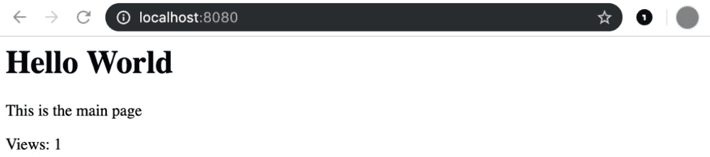

图 16.8：首次运行服务器时浏览器中的输出

如果你刷新页面，你应该看到以下内容：

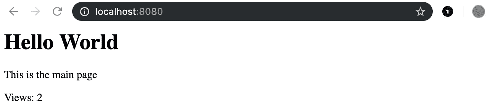

图 16.9：第二次运行服务器时浏览器中的输出

接下来，通过在地址栏中输入`localhost:8080/chapter1`来导航到`chapter1`。你应该能够看到以下类似的内容：

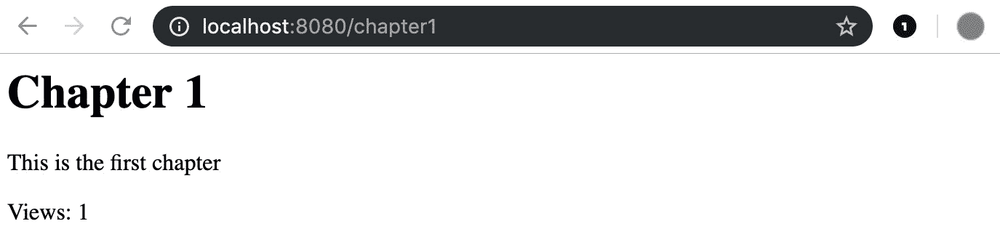

图 16.10：首次访问 chapter1 页面时浏览器中的输出

类似地，导航到`chapter2`；你应该能够看到以下关于查看次数的增加：

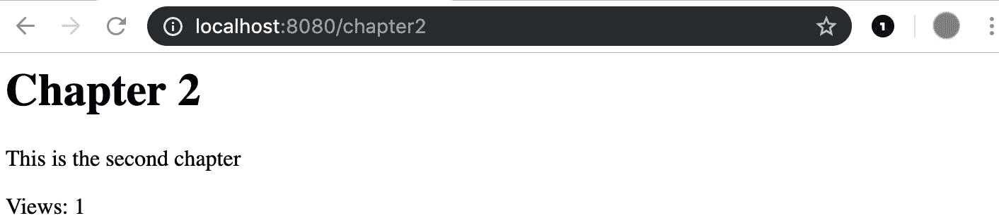

图 16.11：首次访问 chapter2 页面时浏览器中的输出

当你再次访问`chapter1`时，你应该看到查看次数的增加，如下所示：

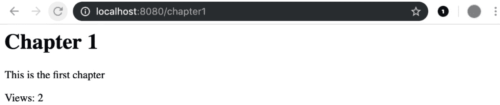

图 16.12：第二次访问 chapter1 页面时浏览器中的输出

注意

本活动的解决方案可以在本书的 GitHub 仓库中找到，网址为[`github.com/PacktPublishing/Go-Programming-From-Beginner-to-Professional-Second-Edition-/blob/main/Chapter16/Activity16.01/main.go`](https://github.com/PacktPublishing/Go-Programming-From-Beginner-to-Professional-Second-Edition-/blob/main/Chapter16/Activity16.01/main.go)。

在这个活动中，你学习了如何创建一个服务器，该服务器可以针对不同页面上的不同请求返回特定的静态文本，并在每个页面上都有一个计数器，每个计数器与其他计数器独立。

# 添加中间件

有时，你需要创建很多函数来处理 HTTP 请求，可能是在 URL 的不同路径上提供不同的服务，所有这些都在执行不同的操作。你可能需要创建一个函数来处理返回用户列表的服务器，一个用于项目列表，一个用于更新某些细节的路由，所有这些函数都在做不同的事情。然而，尽管这些函数执行不同的操作，它们也可能有一些共同点。一个常见的例子是，当这些函数需要在安全环境中执行时，这意味着只有登录的用户才能执行。让我们看一个非常简单的例子，并考虑以下两个函数：

```go
http.HandleFunc(
  "/hello1",
  func(w http.ResponseWriter,
  r *http.Request,
){
  msg := "Hello there, this is function 1"
  w.Write([]byte(msg))
})
http.HandleFunc(
  "/hello2",
  func(w http.ResponseWriter,
  r *http.Request,
){
  msg := "Hello there, and now we are in function 2"
  w.Write([]byte(msg))
})
```

两个函数都将显示以“你好，”开头的句子。让我们找到一种方法来提取这些函数行为的一部分，并创建一个第三函数，该函数将用于执行写入初始欢呼信息的操作：

```go
func Hello(next http.HandlerFunc) http.HandlerFunc {
  return func(w http.ResponseWriter, r *http.Request) {
    msg := "Hello there,"
    w.Write([]byte(msg))
    next.ServeHTTP(w, r)
  }
}
```

此函数具有以下签名：

```go
func Hello(next http.HandlerFunc) http.HandlerFunc
```

这意味着它被命名为`Hello`，接受`http.HandlerFunc`作为参数，并返回对`http.HandlerFunc`的结果。此参数被称为`next`，因为它是我们想要运行的下一个函数。让我们看看函数的主体：

```go
  return func(w http.ResponseWriter, r *http.Request) {
    msg := "Hello there,"
    w.Write([]byte(msg))
    next.ServeHTTP(w, r)
  }
```

正如您所看到的，它返回一个实现`http.HandlerFunc`类型并具有正确参数和返回类型的函数。这个函数将向响应写入器`w`写入一条消息，指出“你好，”，然后调用`next`函数，使用相同的响应写入器和请求调用没有名称的函数。

现在，让我们重构我们的代码，使其更容易阅读。我们将为要执行的操作创建两个函数：

```go
func Function1(w http.ResponseWriter,
  r *http.Request,
) {
  msg := " this is function 1"
  w.Write([]byte(msg))
}
func Function2(w http.ResponseWriter,
  r *http.Request,
) {
  msg := " and now we are in function 2"
  w.Write([]byte(msg))
}
```

让我们看看到目前为止我们的文件看起来像什么：

```go
package main
import (
  "log"
  "net/http"
)
func Hello(next http.HandlerFunc) http.HandlerFunc {
  return func(w http.ResponseWriter, r *http.Request) {
    msg := "Hello there,"
    w.Write([]byte(msg))
    next.ServeHTTP(w, r)
  }
}
func Function1(w http.ResponseWriter,
  r *http.Request,
) {
  msg := " this is function 1"
  w.Write([]byte(msg))
}
func Function2(w http.ResponseWriter,
  r *http.Request,
) {
  msg := " and now we are in function 2"
  w.Write([]byte(msg))
}
```

正如您所看到的，我们有`Hello`函数和两个函数，它们向响应写入器返回两个不同的句子。最后一步是将这些函数与一个路径关联起来，如下所示：

```go
func main() {
  http.HandleFunc(
    "/hello1", Function1)
  http.HandleFunc(
    "/hello2", Function2)
  log.Fatal(http.ListenAndServe(":8085", nil))
}
```

正如您所看到的，我们将函数 1 和函数 2 传递给每个路由。如果您在自己的机器上运行此代码并访问`http://localhost:8085/hello1`，您将看到一个显示“这是函数 1”的消息。尽管如此，我们还没有使用`Hello`函数。让我们重写最后一块代码并使用它：

```go
func main() {
  http.HandleFunc(
    "/hello1", Hello(Function1))
  http.HandleFunc(
    "/hello2", Hello(Function2))
  log.Fatal(http.ListenAndServe(":8085", nil))
}
```

如果您再次运行此程序，您将看到消息已更改为“你好，这是函数 1”。`Hello`函数实际上在`Function1`函数之前运行，并在完成自己的工作后，调用`Function`，以便该函数也可以完成其工作。我们将`Hello`函数称为`Middleware`，因为它充当中间人——它捕获请求，做一些工作，然后调用下一个函数。通过这样做，我们可以通过执行如下操作来链式连接许多中间件：

```go
Hello(Middleware2(Middleware3((Function2)))
```

您可以使用这种模式在需要与 URL 路径关联的实际函数之前或之后执行许多常见操作。

# 动态内容

仅提供静态内容的服务器很有用，但还有更多的事情可以做。HTTP 服务器可以根据更细粒度的请求交付内容，这是通过向服务器传递一些参数来完成的。有多种方法可以做到这一点，但一种简单的方法是将参数传递给`querystring`。如果服务器的 URL 如下所示：

```go
http://localhost:8080
```

然后，我们可以添加如下内容：

```go
http://localhost:8080?name=john
```

这里，`?name=john` 被称为 `querystring` 字符串，因为它是一个表示查询的字符串。在这种情况下，`querystring` 设置了一个名为 `name` 的变量，其值为 `john`。这种方式通常用于 `GET` 请求，而 `POST` 请求通常使用请求体来发送参数。我们将首先看看如何接受 `GET` 请求的参数，因为这种请求是通过简单地在我们的浏览器上打开一个特定地址来进行的。我们将在稍后通过表单查看如何处理 `POST` 请求。

在下一个练习中，您将学习如何根据用户在地址栏中 `querystring` 字符串中输入的值返回不同的文本作为 HTTP 请求的响应。

## 练习 16.03 – 个性化欢迎

在这个练习中，我们将创建一个可以为我们欢呼的 HTTP 服务器，但与一般的 `hello world` 消息不同，我们将提供一个基于我们名字的消息。想法是，通过在服务器的 URL 上打开浏览器并添加一个名为 `name` 的参数，服务器将用一条消息欢迎我们，该消息以 `hello` 开头，后跟 `name` 参数的值。服务器非常简单，没有子页面，但它包含一个动态元素，这构成了更复杂情况的一个起点：

1.  创建一个名为 `personalised-welcome` 的新文件夹，并在文件夹内创建一个名为 `main.go` 的文件。在文件内添加包名：

    ```go
    package main
    ```

1.  然后，添加所需的导入：

    ```go
    import (
      "fmt"
      "log"
      "net/http"
      "strings"
    )
    ```

1.  这些是我们之前练习和活动中使用的相同导入，所以没有新的内容。在这个练习中，我们不会使用处理器，因为它很小，但我们将利用 `http.handleFunc` 函数。

1.  现在，在导入之后添加以下代码：

    ```go
    func Hello(w http.ResponseWriter, r *http.Request) {
    ```

1.  这是定义一个可以作为 HTTP 路径处理函数使用的函数的定义。

1.  现在，使用请求的 `URL` 对象上的 `Query` 方法将查询保存到变量中：

    ```go
      vl := r.URL.Query()
    ```

1.  请求的 `URL` 对象上的 `Query` 方法返回一个 `map[string][]string` 字符串，其中包含通过 URL 中的 `querystring` 发送的所有参数。然后我们将这个映射分配给一个变量，`vl`。

1.  在这一点上，我们需要获取一个名为 `name` 的特定参数的值，所以我们从 `name` 参数获取值：

    ```go
      name, ok := vl["name"]
    ```

1.  如您所见，我们有两个变量的赋值，但只有一个值来自 `vl["name"]`。第二个变量 `ok` 是一个布尔值，它告诉我们 `name` 键是否存在。

1.  如果没有传递 `name` 参数并且我们想要显示错误消息，我们必须在变量未找到时添加它——换句话说，如果 `ok` 变量为假：

    ```go
      if !ok {
        w.WriteHeader(400)
        w.Write([]byte("Missing name"))
        return
      }
    ```

1.  如果切片中不存在键，则调用条件代码，并将 `400` 状态码（错误请求）写入标题，以及一条消息到响应写入器，说明没有发送 `name` 参数。我们使用 `return` 语句停止执行，以防止进一步的操作。

1.  在这一点上，向响应写入器写入一个有效的消息：

    ```go
      w.Write([]byte(fmt.Sprintf("Hello %s", strings.Join(name, ","))))
    }
    ```

1.  此代码格式化一个字符串并将名称注入其中。使用`fmt.Sprintf`函数进行格式化，而使用`strings.Join`将`name`切片转换为字符串。请注意，`name`变量被设置为`vl["name"]`的值，但`vl`是一个`map[string][]string`字符串，这意味着它是一个具有字符串键的映射，其值是字符串切片；因此，`vl["name"]`是一个字符串切片，需要将其转换为单个字符串。`strings.Join`函数接受切片的所有元素，并使用`","`作为分隔符构建一个单独的字符串。也可以使用其他字符作为分隔符。

1.  你需要编写的文件的最后一部分如下：

    ```go
    func main() {
      http.HandleFunc("/", Hello)
      log.Fatal(http.ListenAndServe(":8080", nil))
    }
    ```

1.  如往常一样，创建了一个`main()`函数，然后将`Hello`函数与`"/"`路径关联，并启动了服务器。以下是三个不同 URL 的输出——两个有效的和一个缺少参数的：


图 16.13：请求名为 John 的页面时服务器的输出

前面的图显示了我们将 URL 中的查询参数设置为 John 时的输出。如果我们更改 URL 中查询参数的名称，我们将看到新的值：


图 16.14：请求名为 Will 的页面时服务器的输出

如果我们不设置查询参数，我们将收到一个错误消息，如下所示：


图 16.15：请求不带名称的页面时服务器输出的错误信息

接下来，我们将探讨模板的概念。

# 模板化

虽然在需要跨软件程序共享复杂数据结构时，JSON 可能是最佳选择，但在一般情况下，当 HTTP 服务器预期由人类使用时，情况并非如此。在之前的练习和活动中，选择格式化文本的方式是使用`fmt.Sprintf`函数，这对于格式化文本是好的，但当需要更多动态和复杂的文本时，它就远远不够了。正如你在之前的练习中注意到的，当将名称作为参数传递给观察到的 URL 时，返回的消息遵循一个特定的模式，这就是新概念出现的地方——模板。模板是一个复杂的实体可以从中发展出来的骨架。本质上，模板就像带有一些空白的文本。模板引擎将取一些值并填充这些空白，如下面的图所示：

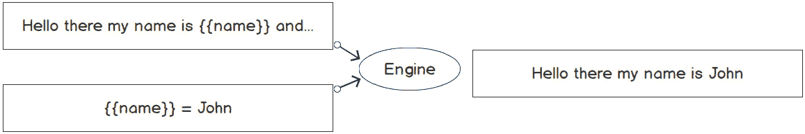

图 16.16：模板示例

如你所见，`{{name}}`是一个占位符，当通过引擎传递值时，占位符会使用该值进行修改。

我们到处都能看到模板。我们有 Word 文档的模板，我们只需填写缺失的部分，就可以生成新的文档，这些文档彼此都不同。一位老师可能有一些用于他们课程的模板，并从相同的模板中开发不同的课程。Go 提供了两个不同的模板包——一个用于文本，一个用于 HTML。由于我们正在处理 HTTP 服务器，并且我们想要生成一个网页，我们将使用 HTML 模板包，但文本模板库的接口是相同的。尽管模板包对于任何实际应用都足够好，但还可以使用几个其他外部包来提高性能。其中之一是`hero`模板引擎，它比标准的 Go 模板包快得多。

Go 模板包提供了一个占位符语言，我们可以使用以下内容：

```go
{{name}}
```

这是一个简单的代码块，它将使模板引擎将`name`变量替换为提供的值，但更复杂的情况可以通过条件语句来处理：

```go
{{if age}} Hello {{else}} bye {{end}}
```

在这里，如果`age`参数不为空，模板将包含`Hello`；否则，它将包含`bye`。每个条件都需要一个`{{end}}`占位符来确定其结束。

模板中的变量不需要是简单的数字或字符串；它们可以是对象。在这种情况下，如果我们有一个名为`ID`的字段的结构体，我们可以在模板中这样引用这个字段：

```go
{{.ID}}
```

这非常方便，因为我们可以将一个结构体传递给模板，而不是许多单个参数。

在下一个练习中，你将学习如何使用 Go 的基本模板功能来创建带有自定义消息的页面，就像你之前做的那样，但方式更加优雅。

## 练习 16.04 – 模板化我们的页面

本练习旨在帮助你构建一个结构更清晰的网页，使用模板，并用 URL 的`querystring`中的参数填充它。在这种情况下，我们希望显示客户的基本信息，并在数据缺失时隐藏一些信息。客户有`id`、`name`、`surname`和`age`值，如果这些值中的任何一个缺失，则不会显示。除非数据是`id`值，就像在这个例子中，将会显示错误信息：

1.  首先，创建一个包含`main.go`文件的`server-template`文件夹。然后，添加通常的包和一些导入：

    ```go
    package main
    import (
      "html/template"
      "log"
      "net/http"
      "strconv"
      "strings"
    )
    ```

1.  在这里，我们使用了两个新的导入：`html/template`用于模板，`strconv`用于将字符串转换为数字（这个包也可以反过来工作，但还有更好的文本格式化解决方案）。

1.  现在，写下以下内容：

    ```go
    var tplStr = `
    <html>
      <h1>Customer {{.ID}}</h1>
      {{if .ID }}
       <p>Details:</p>
       <ul>
       {{if .Name}}<li>Name: {{.Name}}</li>{{end}}
       {{if .Surname}}<li>Surname: {{.Surname}}</li>{{end}}
       {{if .Age}}<li>Age: {{.Age}}</li>{{end}}
       </ul>
      {{else}}
      <p>Data not available</p>
      {{end}}
    </html>
    `
    ```

1.  这是一个包含一些 HTML 和模板代码的原始字符串，这些代码被`{{}}`包裹。我们现在将分析这个字符串。

1.  `{{.ID}}`基本上是一个占位符，告诉模板引擎，无论此代码出现在何处，它将被一个名为`ID`的 struct 属性所替代。Go 模板引擎与 struct 一起工作，所以基本上，一个 struct 将被传递到引擎，其属性值将用于填充占位符。`{{if .ID}}`是一个条件，告诉模板接下来发生的事情将取决于`ID`的值。在这种情况下，如果`ID`不是空字符串，模板将显示客户的详细信息；否则，它将显示`<p>Data not available</p>`，这是在`{{else}}`和`{{end}}`占位符之间包装的。如您所见，第一个条件内部嵌套了更多的条件。在每个列表项中，都有一个`<li>`标签，例如，被`{{if .Name}}`包装，并以`{{end}}`结束。

1.  既然我们已经有了字符串模板，让我们创建一个具有正确属性的 struct。为了填充模板，写下以下内容：

    ```go
    type Customer struct {
      ID int
      Name string
      Surname string
      Age int
    }
    ```

    这个 struct 是自我解释的。它包含模板所需的所有属性。

1.  定义`handler`函数并将一个变量设置为`querystring`中的值映射：

    ```go
    func Hello(w http.ResponseWriter, r *http.Request) {
      vl := r.URL.Query()
    ```

1.  实例化一个`cust`变量，类型为`Customer`：

    ```go
      cust := Customer{}
    ```

1.  变量现在所有属性都已设置为默认值，我们需要从 URL 中获取传递的值。为此，写下以下内容：

    ```go
      id, ok := vl["id"]
      if ok {
        cust.ID, _ = strconv.Atoi(strings.Join(id, ","))
      }
      name, ok := vl["name"]
      if ok {
        cust.Name = strings.Join(name, ",")
      }
      surname, ok := vl["surname"]
      if ok {
        cust.Surname = strings.Join(surname, ",")
      }
      age, ok := vl["age"]
      if ok {
        cust.Age, _ = strconv.Atoi(strings.Join(age, ""))
      }
    ```

1.  如您所见，参数直接从值映射中获取，如果存在，则用于设置相关`cust`属性的值。为了检查这些参数是否存在，我们再次使用了`ok`变量，该变量在映射包含请求的键时设置为具有值`true`的布尔值。最后一个属性`Age`的处理略有不同：

    ```go
        cust.Age, _ = strconv.Atoi(strings.Join(age, ""))
    ```

1.  这是因为`strconv.Atoi`在传递的参数不是数字时返回错误。通常，我们应该处理错误，但在这个例子中，我们将忽略它，并且如果提供的年龄不是数字，则不会显示任何与年龄相关的信息。

1.  接下来，写下以下内容：

    ```go
      tmpl, _ := template.New("test").Parse(tplStr)
    ```

1.  这创建了一个名为`test`的模板对象，其中包含您最初创建的字符串内容。再次忽略错误，因为我们确信我们编写的模板是有效的。然而，在生产环境中，应该处理所有错误。

1.  你现在可以完成函数的编写：

    ```go
      tmpl.Execute(w, cust)
    }
    ```

1.  在这里，模板使用`cust` struct 执行；其内容直接发送到`w ResponseWriter`，无需手动调用`Write`方法。

1.  现在缺少的是`main`方法，这相当简单。写下以下内容：

    ```go
    func main() {
      http.HandleFunc("/", Hello)
      log.Fatal(http.ListenAndServe(":8080", nil))
    }
    ```

1.  简单来说，主路径与`Hello`函数相关联，然后服务器启动。

1.  这段代码的性能并不很高，因为我们为每个请求创建了一个模板。这个模板可以在`main`中创建，然后传递给一个处理程序，这个处理程序可以有一个类似于你刚刚编写的`Hello`函数的`ServeHTTP`方法。这里的代码被保持简单，以便专注于模板化。

1.  现在，如果你启动服务器并访问以下页面，你应该会看到一些类似于以下内容的输出：


图 16.17：带有空白参数的模板响应

现在，你可以在 URL 中添加一个名为`id`的查询参数，并通过访问`localhost:8080/?id=1`使其等于`1`：


图 16.18：仅指定 ID 的模板响应

然后，你可以通过访问`localhost:8080/?id=1&name=John`为名称参数添加一个值：

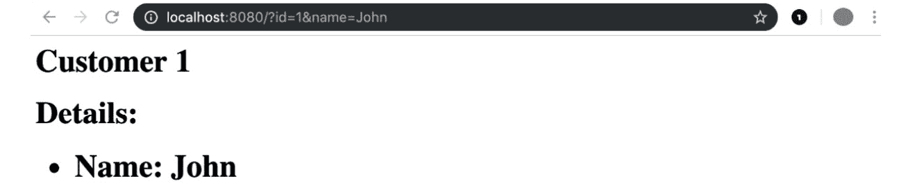

图 16.19：指定 ID 和名称的模板响应

最后，你也可以通过访问`localhost:8080/?id=1&name=John&age=40`添加年龄：

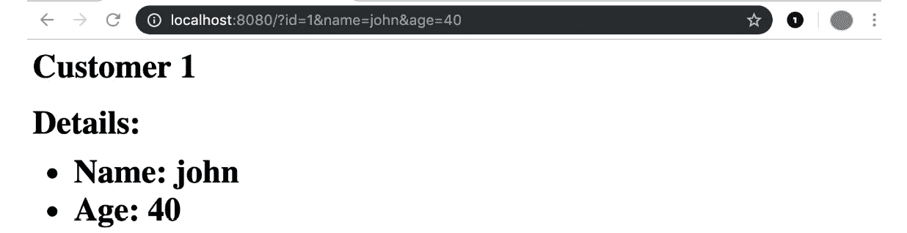

图 16.20：指定 ID、名称和年龄的模板响应

在这里，如果`querystring`中的每个参数有效，它都会在 Web 应用程序中显示出来。

# 静态资源

在这本书中，直到之前的练习为止，你所学到的知识已经足够构建 Web 应用程序和动态网站；你只需要把所有这些部件组合起来。

在本章中你所做的是返回不同的消息，但这些消息都是作为字符串硬编码的。即使是动态消息，也基于在练习和活动源文件中硬编码的模板。现在，让我们考虑一下。对于第一个`hello world`服务器，消息从未改变。如果我们想修改消息并返回一个`Hello galaxy`的消息，我们就必须更改代码中的文本，然后重新编译和/或再次运行服务器。如果你想要出售你的简单“hello”服务器并给每个人指定自定义消息的选项呢？当然，你应该把源代码给每个人，这样他们就可以重新编译和运行服务器。

虽然你可能想拥抱开源代码，但这可能不是分发应用程序的理想方式，我们需要找到一种更好的方法来将消息与服务器分离。一个解决方案是提供静态文件，这些文件是由你的程序作为外部资源加载的。这些文件不会改变，不会编译，并且由你的程序加载和处理。一个这样的例子可能是模板，如之前所见，因为它们只是文本，你可以使用模板文件而不是将模板作为文本添加到你的代码中。另一个静态资源的简单例子是，如果你想在你的网页中包含样式文件，如 CSS。你将在接下来的练习和活动中看到如何做到这一点。你将学习如何提供特定的文件或特定的文件夹，然后你将学习如何使用静态模板提供动态文件。

## 练习 16.05 – 使用静态文件创建 Hello World 服务器

在这个练习中，你将创建你的 Hello World 服务器，但使用静态 HTML 文件。我们想要的是一个简单的服务器，它有一个查找特定文件（具有特定名称）的处理函数，该文件将作为每个路径的输出。在这种情况下，你需要在你的项目中创建多个文件：

1.  创建一个名为 `static-file` 的文件夹，并在其中创建一个名为 `index.html` 的文件。然后，插入以下代码，创建一个相当简单的 HTML 文件，其中包含标题和声明欢迎信息的 `h1` 标签：

    ```go
    <!DOCTYPE html>
    <html lang="en">
    <head>
      <meta charset="UTF-8">
      <title>Welcome</title>
    </head>
    <body>
      <h1>Hello World</h1>
    </body>
    </html>
    ```

1.  现在，创建一个名为 `main.go` 的文件，并开始编写必要的导入：

    ```go
    package main
    import (
      "log"
      "net/http"
    )
    ```

1.  现在，编写 `main` 函数：

    ```go
    func main() {
    ```

1.  接下来，编写 `handler` 函数：

    ```go
      http.HandleFunc("/", func (w http.ResponseWriter, r *http.Request) {
        http.ServeFile(w, r, "./index.html")
      })
    ```

1.  这就是魔法发生的地方。这里一个正常的 `http.HandleFunc` 被调用，其第一个参数是 `"/"` 路径，之后传递一个处理函数，该函数包含一条指令：

    ```go
        http.ServeFile(w, r, "./index.html")
    ```

1.  这会将 `index.html` 文件的内容发送到 `ResponseWriter`。

1.  现在，编写最后一部分：

    ```go
        log.Fatal(http.ListenAndServe(":8080", nil))
    }
    ```

1.  如同往常一样，这会启动服务器，在出错时记录，并退出程序。

1.  现在，保存文件，并使用以下命令运行程序：

    ```go
    go run main.go
    ```

    如果你打开浏览器访问 `localhost:8080` 页面，你应该看到以下内容：


图 16.21：带有静态模板文件的 Hello World

1.  接下来，在不停止服务器的情况下，只需更改 HTML 文件，即 `index.html`，并修改第 `8` 行，在那里你会看到以下内容：

    ```go
        <h1>Hello World</h1>
    ```

1.  更改 `<h1>` 标签中的文本，如下所示：

    ```go
        <h1>Hello Galaxy</h1>
    ```

1.  保存 `index.html` 文件，并且不要触摸终端，也不要重新启动服务器，只需在同一页面上刷新浏览器。你现在应该看到以下内容：


图 16.22：修改后的静态模板文件的 Hello World 服务器

1.  因此，即使服务器正在运行，它也会获取文件的新版本。

在这个练习中，你学习了如何使用静态 HTML 文件来服务一个网页，以及如何将静态资源从你的应用程序中分离出来，这样你就可以在不重新启动应用程序的情况下更改你提供的服务页面。

# 获取一些样式

到目前为止，你已经看到了如何服务一个静态页面，你可能考虑使用相同的方法来服务几个页面，也许创建一个具有要服务的文件名称作为属性的处理器结构。对于大量页面来说，这可能不太实用，尽管在某些情况下这是必要的。然而，一个网页不仅仅包含 HTML 代码——它还可能包含图片和样式，以及一些前端代码。

这本书的范围并不包括教你如何构建 HTML 页面，甚至更少教你如何编写 JavaScript 代码或 CSS 样式表，但你需要知道如何作为我们使用一个小 CSS 文件构建示例来服务这些文档。

服务静态文件并将模板放在不同的文件中，或者通常使用外部资源，是在我们的项目中分离关注点的好方法，可以使我们的项目更易于管理和维护，因此你应该尝试在所有项目中遵循这种方法。

要将样式表添加到你的 HTML 页面中，你需要添加一个像这样的标签：

```go
<link rel="stylesheet" href="file.css">
```

这将 CSS 文件注入页面作为“样式表”，但这在这里只是作为一个例子，以防你对学习如何编写 HTML 感兴趣。

你还看到我们服务了文件，逐个从文件系统中读取它们，但 Go 为我们提供了一个简单的函数来完成这项工作：

```go
http.FileServer(http.Dir("./public"))
```

实际上，`http.FileServer`创建了一个它名字所描述的服务外部文件的服务器。它从`http.Dir`中定义的目录中获取。无论我们在`./public`目录中放置什么文件，都会在地址栏中自动可访问：

```go
http://localhost:8080/public/myfile.css
```

这看起来足够好了。然而，在现实世界的场景中，你不想暴露你的文件夹名称，而是为你的静态资源指定一个不同的名称。这可以通过以下方式实现：

```go
http.StripPrefix(
  "/statics/",
  http.FileServer(http.Dir("./public")),
)
```

你可能已经注意到`http.FileServer`函数被`http.StripPrefix`函数包装，我们使用它来将请求的路径与文件系统上的正确文件关联。本质上，我们希望`/statics`路径可用，并将其绑定到`public`文件夹的内容。`StripPrefix`函数将移除请求中的`"/statics/"`前缀，并将其传递给文件服务器，文件服务器将只获取要服务的文件名，并在`public`文件夹中搜索它。

如果你不想更改路径和文件夹的名称，则不需要使用这些包装器，但这个解决方案是通用的，并且可以在任何地方使用，因此你可以在其他项目中使用它而不用担心。

## 练习 16.06 – 一个时尚的欢迎

本练习旨在帮助你显示一个欢迎页面，同时使用一些外部静态资源。我们将采用与*练习 16.05*相同的方法，但我们将添加一些额外的文件和代码。我们将把一些样式表放在一个`statics`文件夹中，并且我们将提供它们，以便它们可以被同一服务器提供的其他页面使用：

1.  作为第一步，创建一个名为`stylish-welcome`的文件夹，并在该文件夹内添加一个名为`index.html`的文件。然后，加入以下内容：

    ```go
    <!DOCTYPE html>
    <html lang="en">
    <head>
      <meta charset="UTF-8">
      <title>Welcome</title>
      <link rel="stylesheet" href="/statics/body.css">
      <link rel="stylesheet" href="/statics/header.css">
      <link rel="stylesheet" href="/statics/text.css">
    </head>
    <body>
      <h1>Hello World</h1>
      <p>May I give you a warm welcome</p>
    </body>
    </html>
    ```

1.  如你所见，与之前的 HTML 相比，差异很少；我们有一个包含更多文本的段落，由`<p>`标签包裹，并且在`<head>`标签内，我们包含了指向外部资源的三个链接。

1.  现在，在你的`stylish-welcome`文件夹内创建一个名为`public`的文件夹，并在其中创建三个文件，名称和内容如下：

    ```go
    header.css
    h1 {
      color: brown;
    }
    body.css
    body {
      background-color: beige;
    }
    text.css
    p {
      color: coral;
    }
    ```

1.  现在，回到你的主项目文件夹`stylish-welcome`，并创建一个名为`main.go`的文件。文件开头的内容与之前的某个练习中的内容完全一致：

    ```go
    package main
    import (
      "log"
      "net/http"
    )
    func main() {
      http.HandleFunc("/", func (w http.ResponseWriter, r *http.Request) {
        http.ServeFile(w, r, "./index.html")
      })
    ```

1.  现在，添加以下代码来处理静态文件：

    ```go
      http.Handle(
        "/statics/",
        http.StripPrefix(
        "/statics/",
        http.FileServer(http.Dir("./public")),
      ),
    )
    ```

1.  此代码为`/statics/`路径添加了一个处理器，通过`http.FileServer`函数实现，该函数返回一个静态文件处理器。

1.  此功能需要一个用于抓取的目录，我们将一个参数传递给它：

    ```go
      http.Dir("./statics")
    ```

1.  这将读取你之前创建的本地`public`文件夹。

1.  现在，将以下最后部分添加到文件中：

    ```go
      log.Fatal(http.ListenAndServe(":8080", nil))
    }
    ```

1.  这里，服务器再次创建，`main()`函数关闭。现在，再次运行服务器：

    ```go
    go run main.go
    ```

1.  你将看到以下输出：

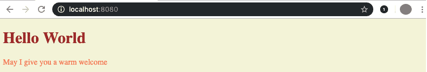

图 16.23：样式化的主页

某种程度上，HTML 文件现在正在使用你最初创建的样式表中的样式。

1.  现在，让我们看看文件是如何注入的。如果你回顾`index.html`文件，你会看到这些行：

    ```go
    <link rel="stylesheet" href="/statics/body.css">
    <link rel="stylesheet" href="/statics/header.css">
    <link rel="stylesheet" href="/statics/text.css">
    ```

1.  因此，本质上，我们正在寻找`"/statics/"`路径下的文件。第一个地址将显示页面主体的 CSS 内容：

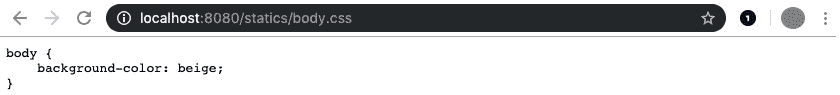

图 16.24：主体 CSS 文件

第二个显示了页面标题的 CSS：

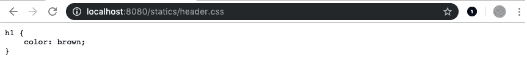

图 16.25：标题 CSS 文件

最后，我们有页面上的文本 CSS。因此，所有的样式表都已提供：

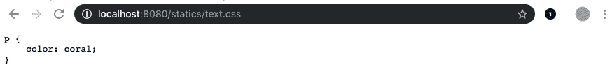

图 16.26：文本 CSS 文件

1.  此外，你甚至可以访问这里：

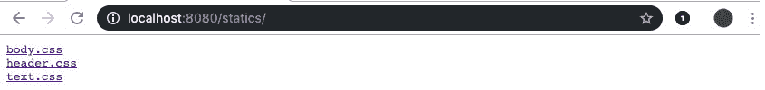

图 16.27：在浏览器中可见的静态文件夹内容

1.  你会看到`public`文件夹内的所有文件都在`/statics/`路径下提供。如果你在寻找一个简单的静态文件服务器，Go 通过几行代码允许你创建一个，并且通过更多的代码，你可以使其适用于生产环境。

1.  如果您使用 Chrome，可以通过右键单击使用鼠标进行检查，尽管如果您有开发者工具，任何浏览器都可以做到这一点。您将看到以下类似的内容：

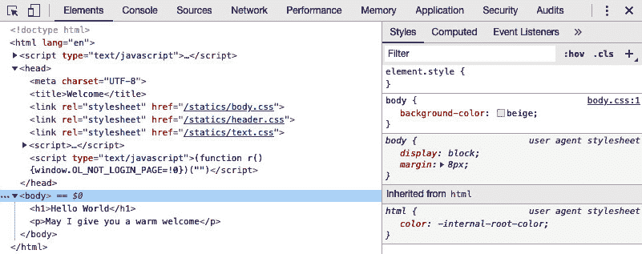

图 16.28：开发者工具显示加载的脚本

如您所见，文件已加载，样式显示为从右侧的样式表中计算得出。

# 变得动态

静态资源通常按原样提供服务，但当你想创建一个动态页面时，你可能想使用外部模板，这样你就可以即时使用它，这样你就可以在不重新启动服务器的情况下更改模板，或者你可以在启动时加载，这意味着您在更改后必须重新启动服务器（这并不完全正确，但我们需要一些并发编程的概念来实现这一点）。在启动时加载文件只是为了性能原因。文件系统操作总是最慢的，即使 Go 是一种相当快的语言，当您想要提供页面时，您可能仍然需要考虑性能，尤其是如果您有来自多个客户端的大量请求。

如您所回忆的，我们使用了标准的 Go 模板来创建动态页面。现在，我们可以将模板作为外部资源使用，将模板代码放入 HTML 文件中，并加载它。模板引擎可以解析它，然后使用传递的参数填充空白。为此，我们可以使用`html/template`函数：

```go
func ParseFiles(filenames ...string) (*Template, error)
```

例如，可以使用以下代码调用：

```go
template.ParseFiles("mytemplate.html")
```

此外，模板被加载到内存中，并准备好使用。

到目前为止，您一直是您 HTTP 服务器的唯一用户，但在实际场景中，情况不会是这样。在接下来的示例中，我们将查看性能，并使用启动时加载的资源。

## 活动十六.02 – 外部模板

在此活动中，您将创建一个欢迎服务器，类似于您之前创建的，您将不得不使用模板包，就像您之前做的那样。然而，在此活动中，我们不想让您从硬编码的字符串创建模板，而是从 HTML 文件创建，该文件将包含所有模板占位符。

您应该能够利用本章和上一章所学的内容完成此活动。

此活动从文件名列表返回`template`指针和一个错误。如果任何文件不存在或模板格式错误，则返回错误。在任何情况下，都不要担心添加多个文件的可能性。坚持使用一个。

完成此活动的步骤如下：

1.  为您的项目创建一个文件夹。

1.  创建一个名为`index.html`的模板，并用标准的 HTML 代码填充，包括欢迎信息和名称的占位符。确保如果名称为空，消息在名称应出现的位置插入单词`visitor`。

1.  创建你的 `main.go` 文件，并向其中添加正确的包和导入。

1.  在 `main.go` 文件中，创建一个包含可以传递给模板的名称的结构体。

1.  使用你的 `index.html` 文件从文件创建一个模板。

1.  创建能够处理 HTTP 请求的东西，并使用 `querystring` 接收参数，通过你之前创建的模板显示数据。

1.  将所有路径设置到服务器上，以便你可以使用你在上一步中创建的函数或处理器；然后，创建服务器。

1.  运行服务器并检查结果。输出将如下所示：


图 16.29：匿名访客页面

访客页面，包括显示的名称，看起来可能如下所示：

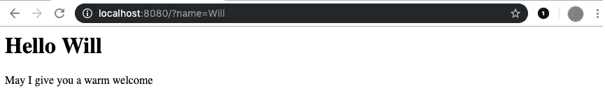

图 16.30：名为“Will”的访客页面

注意

该活动的解决方案可以在本书的 GitHub 仓库中找到：[`github.com/PacktPublishing/Go-Programming-From-Beginner-to-Professional-Second-Edition-/tree/main/Chapter16/Activity16.02`](https://github.com/PacktPublishing/Go-Programming-From-Beginner-to-Professional-Second-Edition-/tree/main/Chapter16/Activity16.02)。

在这个活动中，你学习了如何创建一个模板化的 HTTP 处理器作为结构体，它可以初始化为任何外部模板。你现在可以创建多个页面，使用不同的模板实例化相同的结构体。

# 外部文件嵌入

在前面的章节中，你了解了一种非常有趣的技术，但读取外部文件在部署到生产环境时可能会出现问题，尤其是在使用 Go 语言时，Go 语言的一个强大特性是构建单个可执行文件。幸运的是，Go 语言中有一个名为 `embed` 的包，它允许我们将外部文件添加到我们的最终二进制文件中，这样我们在开发时不需要原始文件，但也不需要与他人共享此文件，因为它将被编译并添加到我们的最终二进制文件中。让我们看看它是如何工作的。

让我们假设你有一个简单的模板文件，并想在你的 web 服务器上使用它：

```go
mytemplate.html
<h1>{{.Text}}</h1>
```

让我们看看一个小程序，它正好做了这件事，使用了你在上一章中学到的知识：

```go
package main
import (
  "html/template"
  "log"
  "net/http"
)
func main() {
  t, _ := template.ParseFiles("mytemplate.html")
  http.HandleFunc(
    "/hello1", func(w http.ResponseWriter,
      r *http.Request,
    ) {
      data := struct {
        text string
      }{
        text: "Hello there",
      }
      t.Execute(w, data)
    })
  log.Fatal(http.ListenAndServe(":8085", nil))
}
```

如果你运行此代码，程序将解析你的文件夹中的文件，并将其用作模板在 `/hello1` 路径上显示 `Hello there`。然而，如果你构建你的应用程序并将可执行文件移动到不同的文件夹，你将收到一个错误。让我们修改这个软件，使其使用 `embed` 包：

```go
package main
import (
  _ "embed"
  "html/template"
  "log"
  "net/http"
)
//go:embed mytemplate.html
var s string
func main() {
  t, _ := template.New("mytemplate").Parse(s)
  http.HandleFunc(
    "/hello1", func(w http.ResponseWriter,
      r *http.Request,
    ) {
      data := struct {
        text string
      }{
        text: "Hello there",
      }
      t.Execute(w, data)
    })
  log.Fatal(http.ListenAndServe(":8085", nil))
}
```

差异在于我们刚刚创建了一个全局变量 `s`，它包含 `mytemplate.html` 文件的内容，并在你使用 `//go:embed` 构建标签指令编译代码时将其存储在二进制文件中：

```go
_ "embed"
//go:embed mytemplate.html
var s string
t, _ := template.New("mytemplate").Parse(s)
```

最后，我们使用 `New` 方法创建一个模板，然后解析字符串。如果你编译代码并从不同的文件夹运行你的应用程序，你将不会遇到任何错误。

# 摘要

在本章中，你被引入了 Web 编程的服务器端。你学习了如何接受来自 HTTP 客户端的请求并做出相应的响应。你还学习了如何通过路径和子路径将可能的请求分离到 HTTP 服务器的不同区域。为此，你使用了一个简单的路由机制，即标准的`Go` `HTTP`包。

然后，你学习了如何根据不同的消费者返回响应：为合成客户端返回 JSON 响应，为人类访问返回 HTML 页面。

接下来，你学习了如何使用模板来格式化你的纯文本和 HTML 消息，使用的是标准的模板包。你学习了如何提供和使用静态资源，可以直接通过默认文件服务器或模板对象来提供服务。

之后，你学习了如何创建中间件以及如何将外部文件嵌入到你的二进制文件中以实现更好的可移植性。在这个阶段，你已经掌握了构建生产级别 HTTP 服务器的基础知识，尽管你可能希望使用一些外部库来简化你的 Hello World 示例，例如使用 gorilla mux 或通常的`gorilla`包，这是一个在`http`包之上的低级抽象。你可以使用`hero`作为模板引擎来加快页面渲染速度。

有一点需要提及的是，你可以利用本章所学的内容创建几乎无状态的服务，但目前你还不能创建一个生产级别的有状态服务器，因为你不知道如何处理并发请求。这意味着`视图计数器`还不适合用于生产服务器，但这将是下一章的主题。

在下一章中，你将转换方向，学习如何使用 Go HTTP 客户端通过互联网与其他系统通信。
