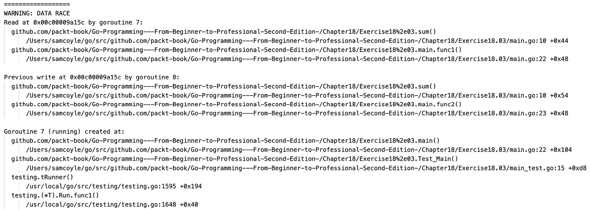
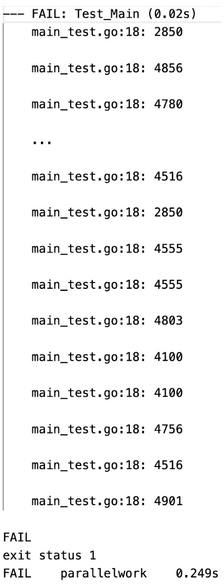

# 并发工作

概述

本章介绍了 Go 的功能，这些功能将允许你执行并发工作，换句话说，实现并发。你将学习的第一个功能被称为 Goroutine。你将了解 Goroutine 是什么，以及如何使用它来实现并发。然后，你将学习如何利用 `WaitGroup` 来同步多个 Goroutine 的执行。你还将学习如何使用原子操作来实现跨不同 Goroutine 共享变量的同步和线程安全更改。为了同步更复杂的变化，你将使用互斥锁。

在本章的后面部分，你将实验通道的功能，并使用消息跟踪来跟踪任务的完成情况。我们还将讨论并发的重要性、并发模式等内容。

# 技术要求

对于本章，你需要 Go 版本 1.21 或更高版本。本章的代码可以在以下位置找到：[`github.com/PacktPublishing/Go-Programming-From-Beginner-to-Professional-Second-Edition-/tree/main/Chapter18`](https://github.com/PacktPublishing/Go-Programming-From-Beginner-to-Professional-Second-Edition-/tree/main/Chapter18)。

# 简介

有些软件是为单个用户使用的，而本书中你学到的大部分内容都允许你开发这样的应用程序。然而，还有其他软件是为同时供多个用户使用的。一个例子是网络服务器。你在*第十六章*“网络服务器”中创建了网络服务器。它们被设计用来服务网站或网络应用程序，这些网站或应用程序通常由成千上万的用户同时使用。

当多个用户访问网络服务器时，有时它需要执行一系列完全独立且结果对最终输出唯一重要的操作。所有这些情况都需要一种类型的编程，其中不同的任务可以同时独立执行。一些语言允许并行计算，其中任务是同时计算的。

在并发编程中，当一项任务开始时，所有其他任务也会同时开始，但机器不是依次完成它们，而是同时执行每个任务的一部分。虽然 Go 允许并发编程，但当机器有多个核心时，任务也可以并行执行。然而，从程序员的视角来看，这种区别并不那么重要，因为创建任务时，我们假设它们将以并行的方式执行，并且机器将以任何方式执行它们。让我们在本章中了解更多信息。

# Goroutines

想象有几个人有一些钉子要钉到墙上。每个人都有不同数量的钉子和不同的墙面区域，但只有一个锤子。每个人用锤子钉一个钉子，然后传给下一个人，以此类推。钉子最少的人会先完成，但他们都会使用同一个锤子；这就是 Goroutines 的工作方式。

使用 Goroutines，Go 允许多个任务同时运行（它们也被称为协程）。这些是可以在同一进程中并发运行的例程（即任务），但它们是完全并发的。Goroutines 不共享内存，这就是它们与线程不同的原因。然而，我们将看到如何在代码中轻松地在它们之间传递变量，以及这可能会引起一些意外的行为。

编写 Goroutine 并没有什么特别之处；它们只是普通的函数。每个函数都可以轻松地成为一个 Goroutine；我们只需要在调用函数之前写上单词`go`。

让我们考虑一个名为`hello()`的函数：

```go
func hello() {
  fmt.Println("hello world")
}
```

要将我们的函数作为 Goroutine 调用，我们执行以下操作：

```go
go hello()
```

函数将以 Goroutine 的形式运行。这意味着什么可以通过以下代码更好地理解：

```go
func main() {
  fmt.Println("Start")
  go hello()
  fmt.Println("End")
```

代码首先打印`Start`，然后调用`hello()`函数。然后，执行直接跳转到打印`End`，而不等待`hello()`函数完成。无论`hello()`函数运行多长时间，`main()`函数都不会关心`hello()`函数，因为这些函数将独立运行。为了更好地理解这是如何工作的，让我们做一些练习。

注意

需要记住的重要一点是，Go 不是一种并行语言，而是一种并发语言，这意味着 Goroutines 不是以独立的方式工作，而是每个 Goroutine 被分割成更小的部分，每个 Goroutine 一次运行其一个子部分。

## 练习 18.01 – 使用并发 Goroutines

让我们想象一下，我们想要进行两个计算。首先，我们将从`1`到`10`的所有数字相加，然后从`1`到`100`的数字相加。为了节省时间，我们希望这两个计算独立进行，并且同时看到两个结果：

1.  在你的文件系统中创建一个新的文件夹，并在其中创建一个`main.go`文件，然后编写以下内容：

    ```go
    package main
    import "fmt"
    ```

1.  创建一个用于求和两个数字的函数：

    ```go
    func sum(from, to int) int {
      res := 0
      for i := from; i<=to; i++ {
        res += i
      }
      return res
    }
    ```

    这个函数接受两个整数作为极值（区间的最小值和最大值），并返回这两个极值之间所有数字的总和。

1.  创建一个`main()`函数，它将数字`1`和`100`相加，然后打印结果：

    ```go
    func main() {
      s1 := sum(1, 100)
      fmt.Println(s1)
    }
    ```

1.  运行程序：

    ```go
    go run main.go
    ```

    你将看到以下输出：

    ```go
    5050
    ```

1.  现在，让我们引入一些并发性。修改`main()`函数，使其看起来像这样：

    ```go
    func main() {
      var s1 int
      go func() {
        s1 = sum(1, 100)
      }()
      fmt.Println(s1)
    }
    ```

    这里，我们正在运行一个匿名函数，它将值 `s1` 赋给总和，就像之前一样，但如果我们运行代码，结果将是 `0`。如果你尝试在 `func()` 部分之前移除 `go` 项，你会看到结果是 `5050`。在这种情况下，匿名函数将运行并开始求和数字，但随后有一个调用 `fmt.Println`，它打印 `s1` 的值。在这里，程序在打印 `s1` 的值之前等待 `sum()` 函数结束，因此返回正确的结果。

    如果我们调用函数并在前面加上 `go` 这个词，程序会在函数仍在计算总和时（总和仍然是 `0`）打印 `s1` 的当前值，然后终止。

    让我们两次调用 `sum()` 函数，使用两个不同的范围。修改 `main()` 函数：

    ```go
    func main() {
      var s1, s2 int
      go func() {
        s1 = sum(1, 100)
      }()
      s2 = sum(1, 10)
      fmt.Println(s1, s2)
    }
    ```

    如果你运行这个程序，它将打印数字 `0` 和 `55`。这是因为并发函数 `go func()` 没有时间返回结果。`main()` 函数更快，因为它必须数到 `55` 而不是 `5050`，所以程序在并发函数完成之前就终止了。

    为了解决这个问题，我们想要找到一个等待并发函数完成的方法。有一些正确的方法可以做到这一点，但现在，让我们做一件相当粗糙但有效的事情，那就是等待固定的时间。要做到这一点，只需在 `fmt.Println` 命令之前添加这一行：

    ```go
    time.Sleep(time.Second)
    ```

1.  修改 `import` 部分，位于 `package main` 指令下方，使其看起来如下：

    ```go
    import (
      "log"
      "time"
    )
    ```

    如果你现在运行你的程序，你应该在屏幕上看到打印出 `5050 55`。

1.  在 `main()` 函数中，编写代码以打印日志：

    ```go
    log.Println(s1, s2)
    ```

1.  如果你现在运行你的程序，你将再次看到相同的输出，`5050 55`，但前面会加上表示你运行代码时的时间戳：

    ```go
    2024/01/25 19:23:00 5050 55
    ```

如你所见，计算是并发发生的，我们同时收到了两个输出。

注意

这个练习的完整代码可以在 [`github.com/PacktPublishing/Go-Programming-From-Beginner-to-Professional-Second-Edition-/tree/main/Chapter18`](https://github.com/PacktPublishing/Go-Programming-From-Beginner-to-Professional-Second-Edition-/tree/main/Chapter18) 找到。

# WaitGroup

在之前的练习中，我们使用了一种不太优雅的方法来确保通过让主 Goroutine 等待一秒钟来结束 Goroutine。重要的是要理解，即使程序没有通过 `go` 调用显式使用 Goroutines，它仍然使用了一个 Goroutine，那就是主程序。当我们运行程序并创建一个新的 Goroutine 时，我们正在运行两个 Goroutines：一个是主程序，另一个是我们刚刚创建的。为了同步这两个 Goroutines，Go 给我们提供了一个名为 `WaitGroup` 的函数。你可以使用以下代码定义一个 `WaitGroup`：

```go
wg := sync.WaitGroup{}
```

`WaitGroup` 需要导入 `sync` 包。典型的使用 `WaitGroup` 的代码可能如下所示：

```go
package main
import "sync"
func main() {
  wg := &sync.WaitGroup{}
  wg.Add(1)
  …………………..
  wg.Wait()
  ………….
  ………….
}
```

在这里，我们创建了一个指向新 `WaitGroup` 的指针，然后提到我们正在添加一个异步操作，该操作使用 `wg.Add(1)` 将 `1` 添加到组中。这本质上是一个计数器，持有所有正在运行并发 Goroutine 的数量。稍后，我们将添加将运行并发调用的代码。最后，我们告诉 `WaitGroup` 使用 `wg.Wait()` 等待 Goroutine 完成。

`WaitGroup` 如何知道这些例程已经完成？嗯，我们需要在 Goroutine 中显式地告诉 `WaitGroup` 如下：

```go
wg.Done()
```

这必须位于被调用 Goroutine 的末尾。我们将在下一个练习中看到这一点。

## 练习 18.02 – 使用 WaitGroup 进行实验

假设我们再次在 *练习 18.01*，*使用并发 Goroutine* 中计算加法，这次使用与主进程并发运行的 Goroutine。然而，这次我们想要使用 `WaitGroup` 来同步结果。我们需要做一些更改。本质上，`sum()` 函数需要接受一个新的 `WaitGroup` 参数，并且不需要使用 `time` 包。许多刚开始学习并发的人会在 Goroutine 完成之前添加 `time.Sleep` 来等待。这种故意的延迟是自相矛盾的，并且在实际应用中没有意义，因为 Goroutine 的目的是加快整体执行速度：

1.  在新文件夹内创建一个 `main.go` 文件。你的文件包和导入部分如下：

    ```go
    package main
    import (
      "log"
      "sync"
    )
    ```

    在这里，我们将包定义为 `main` 包，然后导入 `log` 和 `sync` 包。`log` 将再次用于打印消息，而 `sync` 将用于 `WaitGroup`。

1.  接下来，编写一个 `sum()` 函数：

    ```go
    func sum(from,to int, wg *sync.WaitGroup, res *int) {
    ```

    现在，我们添加一个名为 `wg` 的参数，它是一个指向 `sync.WaitGroup` 的指针，以及结果参数。在前一个练习中，我们用匿名函数包装了 `sum()` 函数，该函数作为一个 Goroutine 运行。这里，我们想要避免这样做，但我们需要以某种方式获取 `sum()` 函数的结果。因此，我们传递一个额外的参数作为指针，它将返回正确的值。

1.  创建一个循环来增加 `sum()` 函数：

    ```go
      *res = 0
      for i := from; i <=to ; i++ {
        *res += i
      }
    ```

    在这里，我们将 `res` 指针所持有的值设置为 `0`，然后我们使用之前看到的相同循环，但再次将 `sum()` 函数与 `res` 参数所指向的值关联起来。

1.  我们现在可以完成这个函数：

    ```go
      wg.Done()}
    ```

    在这里，我们告诉 `WaitGroup` 这个 Goroutine 已经完成，然后返回。

1.  现在，让我们编写一个 `main()` 函数，它将设置变量并运行计算总和的 Goroutine。然后我们将等待 Goroutine 完成，并显示结果：

    ```go
    func main() {
      s1 := 0
      wg := &sync.WaitGroup{}
    ```

    在这里，定义了 `main()` 函数，并设置了一个名为 `s1` 的变量为 `0`。同时，创建了一个指向 `WaitGroup` 的指针。

1.  将 `WaitGroup` 的计数加一，然后运行 Goroutine：

    ```go
      wg.Add(1)
      go sum(1,100, wg, &s1)
    ```

    这段代码通知 `WaitGroup` 有一个 Goroutine 正在运行，然后创建一个新的 Goroutine 来计算总和。`sum()` 函数将调用 `wg.Done()` 方法通知 `WaitGroup` 其完成。

1.  我们需要等待 Goroutine 完成。为此，编写以下代码：

    ```go
      wg.Wait()
      log.Println(s1)
    }
    ```

    这也将结果记录到标准输出。

1.  运行程序：

    ```go
    go run main.go
    ```

你将看到使用 `WaitGroup` 的函数的日志输出，如下所示，带有时间戳：

```go
2024/01/25 19:24:51 5050
```

通过这个练习，我们已经通过在我们的代码中同步 Goroutines 探索了 `WaitGroup` 的功能。

# 竞态条件

需要考虑的一个重要问题是，无论何时我们并发运行多个函数，我们都没有保证每个函数中的每个指令将按什么顺序执行。在许多架构中，这并不是一个问题。一些函数根本不与其他函数连接，并且一个函数在其 Goroutine 中所做的操作不会影响其他 Goroutines 中执行的操作。然而，这并不总是正确的。我们可以想到的第一种情况是，当一些函数需要共享相同的参数时。一些函数会从这个参数中读取，而其他函数会写入这个参数。由于我们不知道哪个操作会先运行，所以一个函数可能会覆盖另一个函数更新的值。让我们看看一个解释这种情况的例子：

```go
func next(v *int) {
  c := *v
  *v = c + 1
}
```

这个函数接受一个指向整数的指针作为参数。它是一个指针，因为我们想使用 `next()` 函数运行多个 Goroutines 并更新 `v`。如果我们运行以下代码，我们期望 `a` 将持有值 3：

```go
a := 0
next(&a)
next(&a)
next(&a)
```

这完全没问题。然而，如果我们运行以下代码：

```go
a := 0
go next(&a)
go next(&a)
go next(&a)
```

在这种情况下，我们可能会看到 `a` 持有 3、2 或 1。为什么会这样呢？因为当一个函数执行以下语句时，`v` 的值可能对所有在独立 Goroutines 中运行的函数都是 0：

```go
c := *v
```

如果发生这种情况，那么每个函数都会将 `v` 设置为 `c + 1`，这意味着没有任何 Goroutine 意识到其他 Goroutine 在做什么，并覆盖了另一个 Goroutine 所做的任何更改。这个问题被称为 **竞态条件**，并且每次我们在没有采取预防措施的情况下处理共享资源时都会发生。幸运的是，我们有几种方法可以防止这种情况，并确保相同的更改只进行一次。我们将在下一节中查看这些解决方案，并更详细地探讨我们刚才描述的情况，包括适当的解决方案和竞态检测。

# 原子操作

让我们想象我们再次想要运行独立的函数。然而，在这种情况下，我们想要修改变量的值。我们仍然想要从 1 到 100 求和，但我们将工作分成两个并发 Goroutines。我们可以在一个进程中求和 1 到 50 的数字，在另一个进程中求和 51 到 100 的数字。最后，我们仍然需要收到 5050 的值，但两个不同的进程可以同时向同一个变量添加一个数字。让我们看看一个只有四个数字的例子，我们想要求和 1、2、3 和 4，结果是 10。

想象有一个名为`s := 0`的变量，然后进行一个循环，其中`s`的值变为以下：

```go
s = 0
s = 1
s = 3 // (1 + 2)
s = 6
s = 10
```

然而，我们也可以有以下的循环。在这种情况下，求和的数字顺序是不同的：

```go
s = 0
s = 1
s = 4 // 3 + 1, the previous value of 1
s = 6 // 2 + 4 the previous value of 4
s = 10
```

实质上，这只是求和的交换律，但这给我们一个提示，我们可以将求和分成两个或更多的并发调用。这里出现的问题是，所有函数都需要操作同一个变量`s`，这可能导致竞态条件和最终值不正确。竞态条件发生在两个进程更改同一个变量时，一个进程在不考虑先前更改的情况下覆盖另一个进程所做的更改。幸运的是，我们有一个名为`atomic`的包，允许我们在 Goroutines 之间安全地修改变量。

我们将很快查看这个包是如何工作的，但现在，你需要知道的是，这个包有一些函数可以用于在变量上执行简单的并发安全操作。让我们看看一个例子：

```go
func AddInt32(addr *int32, delta int32) (new int32)
```

这段代码接受一个指向`int32`的指针，并通过将其指向的值加到`delta`的值上来修改它。如果`addr`持有值为 2 且`delta`为 4，在调用此函数后，`addr`将持有 6。

## 练习 18.03 – 原子变更

在这个练习中，我们想要计算 1 到 100 之间所有数字的总和，但使用更多的并发 Goroutines——比如说 4 个。所以，我们有一个函数在 1-25 的范围内求和，一个在 26-50 的范围内，然后是 51-75，最后是 76-100。我们将使用我们关于原子操作和`WaitGroups`的知识：

1.  创建一个新的文件夹和一个`main.go`文件。在里面，写下以下代码：

    ```go
    package main
    import (
      "log"
      "sync"
      "sync/atomic"
    )
    ```

    这将导入之前练习中使用的相同包，以及`sync/atomic`包。

1.  下一步是将*练习 19.02*，*使用 WaitGroup 进行实验*中的`sum()`函数重构，以使用`atomic`包：

    ```go
    func sum(from, to int, wg *sync.WaitGroup, res *int32) {
    ```

    在这里，我们只是将`res`从`int`改为`*int32`。这样做的原因是，专门针对算术操作可用的原子操作仅适用于`int32/64`和相关的`uint32/64`。

1.  在这一点上，写一个循环将每个数字加到总数中：

    ```go
      for i := from; i <= to; i++ {
        atomic.AddInt32(res, int32(i))
      }
      wg.Done()
      return
    }
    ```

    如您所见，我们不是将`res`的值赋为`0`，而是现在将`i`添加到`res`持有的总值中。其余的代码保持不变。

1.  下一步是编写一个`main()`函数，以四个不同的 Goroutines 计算总和：

    ```go
    func main() {
      s1 := int32(0)
      wg := &sync.WaitGroup{}
    ```

    在这里，我们将`s1`设置为`int32`类型而不是`int`，这样我们就可以将其作为参数发送给`sum()`函数。然后，我们创建一个指向`WaitGroup`的指针。

1.  现在，告诉`WaitGroup`我们将有四个 Goroutines 正在运行：

    ```go
      wg.Add(4)
    ```

1.  现在，运行四个 Goroutines，分别对四个范围进行求和：1-25，26-50，51-75，和 76-100：

    ```go
      go sum(1, 25, wg, &s1)
      go sum(26, 50, wg, &s1)
      go sum(51, 75, wg, &s1)
      go sum(76, 100, wg, &s1)
    ```

1.  现在，添加等待例程完成并打印结果的代码：

    ```go
      wg.Wait()
      log.Println(s1)
    }
    ```

1.  现在，使用以下内容运行代码：

    ```go
    go run main.go
    2024/01/25 19:26:04 5050
    ```

    实际日期将不同，因为它取决于你何时运行此代码。

1.  现在，让我们测试代码。我们将使用它来向您展示什么是竞态条件，为什么我们使用这个`atomic`包，以及什么是并发安全性。以下是测试代码：

    ```go
    package main
    import (
      "bytes"
      "log"
      "testing"
    )
    func Test_Main(t *testing.T) {
      for i:=0; i < 10000; i++ {
        var s bytes.Buffer
        log.SetOutput(&s)
        log.SetFlags(0)
        main()
        if s.String() != "5050\n" {
          t.Error(s.String())
        }
      }
    }
    ```

    我们将运行相同的测试 10,000 次。

1.  运行你的测试：

    ```go
    go test
    ```

    原子更改测试的结果如下：

    ```go
    PASS
    ok parallelwork 0.048s
    ```

1.  现在，添加`-race`标志：

    ```go
    go test -race
    ```

    使用`-race`标志运行这些测试的输出如下：

    ```go
    PASS
    ok parallelwork 3.417s
    ```

    再次，到目前为止一切正常。

1.  现在，让我们移除`sync/atomic`导入，并修改包含此行的`sum()`函数：

    ```go
    atomic.AddInt32(res, int32(i))
    ```

1.  改成这样：

    ```go
    *res = *res + int32(i)
    ```

1.  现在，运行你的程序：

    ```go
    go run main.go
    ```

1.  使用指针时，非原子更改的日志输出保持不变：

    ```go
    2024/01/25 19:30:47 5050
    ```

1.  但如果你尝试多次运行测试，你可能会看到一些不同的结果，尽管在这种情况下，这种情况相当不可能。然而，此时尝试使用`-race`标志运行测试：

    ```go
    go test -race
    ```

你将看到以下输出：



图 18.1：在此处使用指针时会出现竞态条件

注意

必须安装 GCC 才能运行此代码。有关安装说明的信息，请参阅[`go.dev/doc/install/gccgo`](https://go.dev/doc/install/gccgo)。

1.  现在，让我们不带`-race`标志运行代码：



图 18.2：带有竞态条件的堆栈跟踪

注意

*...* 在 *图 18.2* 中表示我删除的一些输出行，以使视觉更易于理解。

通过多次运行代码，你可以看到不同的结果，因为每个例程可以在任何时间以任何顺序更改`s1`的值，这是我们无法提前知道的。

在这个练习中，你学习了如何使用`atomic`包安全地修改多个 Goroutines 共享的变量。你学习了从不同的 Goroutines 直接访问相同的变量可能是危险的，以及如何使用`atomic`包来避免这种情况。我们还看到了如何在 Go 中处理测试。这个主题将在下一章中更详细地介绍。

注意

此练习的完整代码可在[`github.com/PacktPublishing/Go-Programming-From-Beginner-to-Professional-Second-Edition-/tree/main/Chapter18/Exercise18.03`](https://github.com/PacktPublishing/Go-Programming-From-Beginner-to-Professional-Second-Edition-/tree/main/Chapter18/Exercise18.03)找到。

# 不可见的并发

在之前的练习中，我们已经看到了通过竞态条件产生的并发效果，但我们想在实际中看到这些效果。很容易理解，并发问题很难可视化，因为它们在每次运行程序时并不总是以相同的方式表现出来。这就是为什么我们专注于寻找同步并发工作的方法。然而，有一个简单的方法可以可视化它，但在测试中使用却很困难，那就是打印出每个并发例程，并查看这些例程被调用的顺序。例如，在之前的练习中，我们可以在`for`循环的每次迭代中发送另一个带有名称的参数，并打印出函数的名称。

如果我们想看到并发效果并仍然能够测试它，我们可以再次使用`atomic`包，这次使用字符串，这样我们就可以构建一个包含每个 Goroutine 消息的字符串。对于这种情况，我们再次使用`sync`包，但我们将不使用原子操作。相反，我们将使用一个新的结构体`Mutex`。互斥锁，简称为*互斥排他*，在 Go 中作为同步原语，允许多个 Goroutine 协调对共享资源的访问。当一个 Goroutine 获取互斥锁时，它会锁定它，确保对代码关键部分的独占访问。这阻止了其他 Goroutine 在互斥锁解锁之前访问相同的资源。一旦关键部分执行完成，互斥锁被解锁，允许其他 Goroutine 获取它并继续并发执行。让我们看看我们如何使用它。首先，需要导入`sync`包。然后，我们可以创建一个互斥锁，如下所示：

```go
mtx := sync.Mutex{}
```

但大多数时候，我们希望将互斥锁传递给几个函数，所以我们最好创建一个指向互斥锁的指针：

```go
mtx := &sync.Mutex{}
```

这确保我们在任何地方都使用相同的互斥锁。使用相同的互斥锁很重要，但为什么互斥锁必须是唯一的，在分析`Mutex`结构体中的方法之后将会变得清楚。如果所有 Goroutine 在修改代码关键部分（如以下情况）中的值之前都执行了`mtx.Lock()`，那么由于锁定，每次只能有一个 Goroutine 修改变量：

```go
mtx.Lock()
s = s + 5
```

上述代码片段将锁定所有例程的执行，除了将改变变量的那个例程。在这个时候，我们将向`s`的当前值添加 5。之后，我们使用以下命令释放锁，以便任何其他 Goroutine 都可以修改`s`的值：

```go
mtx.Unlock()
```

从现在开始，任何后续的代码都将并发运行。我们稍后会看到一些更好的方法来确保在修改变量时的安全性，但就目前而言，不要担心在锁定/解锁部分之间添加太多代码。这些结构之间有更多的代码，你的代码并发性就会降低。因此，你应该锁定程序的执行，只添加确保安全性的逻辑，然后解锁，继续执行剩余的代码，这些代码不会触及共享变量。

有一点很重要需要注意，即异步执行代码的顺序可能会改变。这是因为 Goroutines 是独立运行的，你无法知道哪个先运行。此外，互斥锁保护的代码一次只能由一个 Goroutine 运行，因此你不应该依赖 Goroutines 来正确排序；如果你需要一个特定的顺序，你可能需要在之后对结果进行排序。

# 通道

我们已经看到了如何通过 Goroutines 创建并发代码，如何使用`WaitGroup`进行同步，如何执行原子操作，以及如何暂时停止并发以同步对共享变量的访问。现在，我们将介绍一个不同的概念——通道，这是 Go 的典型特征。通道就是名字所暗示的——它是可以管道传输消息的地方，任何 Goroutine 都可以通过通道发送或接收消息。与切片类似，通道是以以下方式创建的：

```go
var ch chan int
ch = make(chan int)
```

当然，可以直接使用以下方式实例化通道：

```go
ch := make(chan int)
```

就像处理切片一样，我们也可以做以下操作：

```go
ch := make(chan int, 10)
```

在这里，我们创建了一个包含 10 个项目的缓冲区通道。

通道可以是任何类型，例如整数、布尔值、浮点数，以及任何可以定义的结构体，甚至是切片和指针，尽管后两者使用得较少。

通道可以作为参数传递给函数，这就是不同的 Goroutines 如何共享内容。让我们看看如何向通道发送消息：

```go
ch <- 2
```

在这种情况下，我们将 2 的值发送到前面的`ch`通道，这是一个整数通道。当然，尝试向整数通道发送非整数值将导致错误。

在发送消息后，我们需要能够从通道接收消息。为此，我们可以这样做：

```go
<- ch
```

这样做确保了消息被接收；然而，消息并没有被存储。丢失消息似乎没有用，但我们会看到这可能是有意义的。尽管如此，我们可能想要保留从通道接收到的值，我们可以通过将值存储在一个新变量中来实现这一点：

```go
i := <- ch
```

让我们看看一个简单的程序，它展示了我们如何使用到目前为止所学的知识：

```go
package main
import "log"
func main() {
  ch := make(chan int, 1)
  ch <- 1
  i := <- ch
  log.Println(i)
}
```

此程序创建了一个新的通道，将整数 1 管道输入，然后读取它，最后打印出`i`的值，该值应该是 1。这段代码在实践中并不那么有用，但通过一个小改动，我们可以看到一些有趣的东西。让我们通过将通道定义更改为以下内容来使通道无缓冲：

```go
ch := make(chan int)
```

如果你运行代码，你将得到以下输出：

```go
fatal error: all goroutines are asleep - deadlock!
goroutine 1 [chan send]:
main.main()
    /Users/ samcoyle/go/src/github.com/packt-book/Go-Programming---From-Beginner-to-Professional-Second-Edition-/Chapter19/Exercise19.04/main.go:8 +0x59Process finished with exit code 2
```

消息可能取决于你使用的 Go 版本。此外，一些错误，如这些，在新版本中已经被引入。然而，在旧版本中，编译器更为宽容。在这个特定的情况下，问题很简单：如果我们不知道通道的大小，Goroutines 将无限期地等待，这被称为死锁。你可以将无缓冲通道视为容量为零。如果我们尝试将其放入其中，它将不会保留项目 – 相反，它将阻塞，直到我们可以将项目通过通道传递给一个变量，例如。我们将在稍后看到如何处理它们，因为它们需要多个线程运行。只有一个 Goroutine 时，在我们发送消息后，我们将阻塞执行，没有其他 Goroutine 能够接收消息；因此，我们遇到了死锁。

在我们进一步探讨之前，让我们看看通道的另一个特性，即它们可以被关闭。当通道被创建的任务完成时，需要关闭通道。要关闭通道，请输入以下内容：

```go
close(ch)
```

或者，你可以像以下代码片段所示那样延迟关闭：

```go
...
defer close(ch)
for i := 0; i < 100; i++ {
  ch <- i
}
return
```

在这种情况下，在`return`语句之后，通道被关闭，因为关闭操作被延迟到`return`语句之后执行。

## 练习 18.04 – 通过通道交换问候消息

在这个练习中，我们将使用一个 Goroutine 发送一个问候消息，然后我们在主进程中接收问候。这个练习非常简单，不需要并发，但它理解消息传递工作原理的起点：

1.  创建一个文件夹。在其中，创建一个名为`main.go`的文件，并使用`main`包：

    ```go
    package main
    import (
      "log"
    )
    ```

1.  然后，创建一个`greeter()`函数：

    ```go
    func greet(ch chan string) {
      ch <- "Hello"
    }
    ```

    这个函数只是向通道发送一个`Hello`消息并结束。

1.  现在，创建一个`main()`函数，在其中实例化一个通道并将其传递给`greeter()`函数：

    ```go
    func main() {
      ch := make(chan string)
      go greet(ch)
    ```

    在这里，只创建了一个字符串通道并将其作为参数传递给名为`greet`的新例程的调用。

1.  现在，打印结果并完成函数：

    ```go
      log.Println(<-ch)
    }
    ```

    在这里，我们正在打印通道中出现的任何内容。代码的以下部分返回一个值，该值直接传递给`Println`函数：

    ```go
    <- ch
    ```

1.  使用以下命令运行程序：

    ```go
    go run main.go
    ```

你将看到以下输出：

```go
2024/01/25 19:44:11 Hello
```

现在，我们可以看到消息已经通过通道传递到了`main()`函数中。

在这个练习中，你看到了如何使用通道使不同的 Goroutines 相互通信并同步它们的计算。

## 练习 18.05 – 使用通道进行双向消息交换

我们现在想要从主 Goroutine 向第二个 Goroutine 发送消息，然后得到一个响应消息。我们将基于之前的代码并扩展它。主 Goroutine 将发送一个`"Hello John"`消息，而第二个 Goroutine 将针对收到的消息返回`"Thanks"`，并完整地表达出来，然后添加一个`"Hello David"`消息：

1.  创建一个文件夹。在其中创建一个 `main.go` 文件，包含 `main` 包：

    ```go
    package main
    import (
      "fmt"
      "log"
    )
    ```

    在必要的导入之后，我们将使用 `fmt` 包来操作字符串。

1.  编写一个 `greet()` 函数以返回预期的消息：

    ```go
    func greet(ch chan string) {
      msg := <- ch
      ch <- fmt.Sprintf("Thanks for %s", msg)
      ch <- "Hello David"
    }
    ```

    `greet()` 函数的签名没有改变。然而，现在，在发送消息之前，它将首先等待一个消息，然后回复。在收到消息后，这个函数会发送一条消息表示感谢问候，然后发送自己的问候。

1.  现在，创建一个 `main()` 函数并将 `greet()` 函数作为 Goroutine 调用：

    ```go
    func main() {
      ch := make(chan string)
      go greet(ch)
    ```

    在这里，`main()` 函数被创建，并实例化了一个字符串通道。然后，启动第二个 Goroutine。接下来，我们需要从主 Goroutine 向第二个正在等待的 Goroutine 发送第一条消息。

1.  现在，要向通道发送 `"Hello John"` 消息，请编写以下代码：

    ```go
      ch <- "Hello John"
    ```

1.  最后，添加在打印之前等待消息返回的代码：

    ```go
      log.Println(<-ch)
      log.Println(<-ch)
    }
    ```

你可以看到你需要记录两次，因为你期望返回两条消息。在许多情况下，你将使用循环来检索所有消息，我们将在下一个练习中看到。现在，尝试运行你的代码，你将看到如下内容：

```go
2024/01/25 19:44:49 Thanks for Hello John
2024/01/25 19:44:49 Hello David
```

从输出中，你可以看到两条消息都通过通道接收到了。

在这个练习中，你学习了 Goroutine 如何通过同一个通道发送和接收消息，以及两个 Goroutine 如何通过同一个通道在两个方向上交换消息。

## 练习 18.06 – 从各个地方汇总数字

假设你想要添加一些数字，但这些数字来自多个来源。它们可能来自一个源或数据库；我们只知道我们要添加哪些数字以及它们来自哪里。然而，我们需要将它们全部添加到同一个地方。在这个练习中，我们将有四个 Goroutine 在特定的范围内发送数字，以及主 Goroutine，它将计算它们的总和：

1.  让我们从创建一个新的文件夹和主文件开始。完成这些后，编写包和导入：

    ```go
    package main
    import (
      "log"
      "time"
    )
    ```

    在这里，我们还包含了 `time` 包，我们将使用它来做一个小技巧，这将帮助我们更好地可视化并发的效果。

1.  现在，编写一个 `push()` 函数：

    ```go
    func push(from, to int, out chan int) {
      for i := from; i <= to; i++ {
        out <- i
        time.Sleep(time.Microsecond)
      }
    }
    ```

    这将把 `from, to` 范围内的所有数字发送到通道。在每条消息发送后，Goroutine 将休眠一微秒，以便另一个 Goroutine 可以接手工作。

1.  现在，编写一个 `main()` 函数：

    ```go
    func main() {
      s1 := 0
      ch := make(chan int, 100)
    ```

    这段代码创建了一个用于最终总和的变量 `s1` 和一个用于通道 `ch` 的变量，该通道有一个 100 的缓冲区。

1.  现在，创建四个 `go` 线程：

    ```go
      go push(1, 25, ch)
      go push(26, 50, ch)
      go push(51, 75, ch)
      go push(76, 100, ch)
    ```

1.  在这一点上，我们需要收集所有要加的数字，因此我们创建了一个 100 次循环：

    ```go
      for c := 0; c < 100; c++ {
    ```

1.  然后，从通道中读取数字：

    ```go
        i := <- ch
    ```

1.  我们还想看到哪个数字来自哪个 Goroutine：

    ```go
        log.Println(i)
    ```

1.  最后，我们计算总和并显示结果：

    ```go
        s1 += i
      }
      log.Println(s1)
    }
    ```

在这里，我们展示了程序运行后的截断输出：

```go
2024/01/25 21:42:09 76
2024/01/25 21:42:09 26
2024/01/25 21:42:09 51
2024/01/25 21:42:09 77
2024/01/25 21:42:09 52
……………………………………………………………
2024/01/25 21:42:09 48
2024/01/25 21:42:09 75
2024/01/25 21:42:09 100
2024/01/25 21:42:09 23
2024/01/25 21:42:09 49
2024/01/25 21:42:09 24
2024/01/25 21:42:09 50
2024/01/25 21:42:09 25
2024/01/25 21:42:09 5050
```

根据结果，我们可以轻松地猜测哪个数字来自哪个 routine。最后一行显示了所有数字的总和。如果你多次运行程序，你还会看到数字的顺序也会改变。

在这个练习中，我们看到了如何将一些计算工作分配给几个并发的 Goroutines，然后在单个 Goroutine 中收集所有计算结果。每个 Goroutine 执行一个任务。在这种情况下，一个发送数字，而另一个接收数字并执行求和操作。

## 练习 18.07 – 向 Goroutines 发送请求

在这个练习中，我们将解决与 *练习 19.06* 中提到的相同问题，即 *从各个地方求和数字*，但以不同的方式。不是接收 Goroutines 发送的数字，而是让主 Goroutine 从其他 Goroutines 请求数字。我们将玩转通道操作，并实验它们的阻塞特性：

1.  创建一个文件夹和一个名为 `main.go` 的文件，并使用 `main` 包。然后，添加以下导入：

    ```go
    package main
    import (
      "log"
    )
    ```

1.  然后，编写 `push()` 函数的签名：

    ```go
    func push(from, to int, in chan bool, out chan int) {
    ```

    这里有两个通道 - 一个布尔类型的通道称为 `in`，它代表传入的请求，另一个是 `out`，它将用于发送回消息。

1.  现在，编写一个循环，在接收到请求时发送数字：

    ```go
      for i := from; i <= to; i++ {
        <- in
        out <- i
      }
    }
    ```

    如你所见，循环仍然是针对固定数量的项目。在发送任何内容之前，它等待从 `in` 通道接收请求。当它收到请求时，它会发送一个数字。

1.  现在，创建一个 `main()` 函数，在其中调用四个不同的 Goroutines 中的 `push()` 函数，每个 Goroutine 发送 1 到 100 的数字的一个子集：

    ```go
    func main() {
      s1 := 0
      out := make(chan int, 100)
      in := make(chan bool, 100)
      go push(1, 25, in, out)
      go push(26, 50, in, out)
      go push(51, 75, in, out)
      go push(76, 100, in, out)
    ```

    这与上一个练习非常相似，但它创建了一个额外的通道，`in`。

1.  现在，创建一个循环来请求一个数字，打印它，并将其添加到总数中：

    ```go
      for c := 0; c < 100; c++ {
        in <- true
        i := <- out
        log.Println(i)
        s1 += i
      }
      log.Println(s1)
    }
    ```

    在这种情况下，循环首先请求一个数字，然后等待接收另一个数字。在这里，我们不需要等待一微秒，因为在我们收到一个数字后，下一个请求将发送到任何活动的 Goroutine。如果你运行程序，你将再次看到与上一个练习类似的结果。这里，我们有截断的输出：

```go
2024/01/25 22:18:00 76
2024/01/25 22:18:00 1
2024/01/25 22:18:00 77
2024/01/25 22:18:00 26
2024/01/25 22:18:00 51
2024/01/25 22:18:00 2
2024/01/25 22:18:00 78
…………………………………………………………
2024/01/25 22:18:00 74
2024/01/25 22:18:00 25
2024/01/25 22:18:00 50
2024/01/25 22:18:00 75
2024/01/25 22:18:00 5050
```

你可以看到每个数字都是按照接收到的顺序打印的。然后，所有数字的总和会打印在屏幕上。

在这个练习中，你学习了如何使用通道请求其他 Goroutines 执行某些操作。通道可以用来发送一些触发消息，而不仅仅是交换内容和值。

# 并发的重要性

到目前为止，我们已经看到了如何使用并发将工作分割到多个 Goroutines 中，但在所有这些练习中，并发实际上并不是必需的。事实上，你做我们做的事情并不会节省多少时间，也没有其他优势。并发在你需要执行几个逻辑上相互独立的不同任务时很重要，最容易理解的情况是网络服务器。你在 *第十六章*，*网络服务器* 中看到，多个客户端很可能会连接到同一个服务器，所有这些连接都将导致服务器执行一些操作。此外，这些操作都是独立的；这就是并发之所以重要的地方，因为你不希望你的用户在他们的请求得到处理之前必须等待所有其他 HTTP 请求完成。并发的另一个情况是当你有不同数据源来收集数据时，你可以在不同的 Goroutines 中收集这些数据，并在最后合并结果。我们现在将看到更复杂的并发应用，并学习如何将其用于 HTTP 服务器。

## 练习 18.08 – 在 Goroutines 之间平均分配工作

在这个练习中，我们将看到如何以预定义的 Goroutines 数量执行数字的求和，以便它们在最后收集结果。本质上，我们想要创建一个加法函数，该函数从通道接收数字。当函数不再接收更多数字时，我们将通过通道将总和发送到 `main()` 函数。

这里需要注意的一点是，执行求和的函数事先不知道它将接收多少数字，这意味着我们不能有一个固定的 `from, to` 范围。因此，我们必须找到另一种解决方案。我们需要能够将工作分割成任意数量的 Goroutines，并且不受 `from, to` 范围的限制。此外，我们不想在 `main()` 函数中执行加法。相反，我们想要创建一个函数，该函数将在多个 Goroutines 之间分配工作：

1.  创建一个文件夹和一个 `main.go` 文件，包含 `main` 包，并编写以下内容：

    ```go
    package main
    import (
      "log"
    )
    ```

1.  现在，让我们编写一个执行部分加法的函数。我们将称之为 `worker()`，因为我们将有一个固定集的 Goroutines 运行这个相同的函数，等待数字的到来：

    ```go
    func worker(in chan int, out chan int) {
      sum := 0
      for i := range in {
        sum += i
      }
      out <- sum
    }
    ```

    如你所见，我们有一个整数输入通道 `in` 和输出通道 `out`。然后，我们实例化 `sum` 变量，它将存储发送到这个工作者的所有数字的总和。

1.  在这个阶段，我们有一个遍历通道的循环。这很有趣，因为我们没有直接使用 `in`，如下所示：

    ```go
    <- in
    ```

    我们，相反，只依赖于范围来获取数字。在循环中，我们只是将 `i` 添加到总数中，并在结束时将部分总和发送回去。即使我们不知道将要发送到通道中的项目数量，我们仍然可以无问题地遍历范围。我们依赖于这样一个事实：当没有更多项目发送时，`in` 通道将被关闭。

1.  创建一个 `sum()` 函数：

    ```go
    func sum(workers, from, to int) int {
    ```

    这是实际的 `sum()` 函数，它具有工作者的数量和要相加的数字的常规范围。

1.  现在，写一个循环来运行请求的工作者数量：

    ```go
      out := make(chan int, workers)
      in := make(chan int, 4)
      for i := 0; i <  workers; i++ {
        go worker(in, out)
      }
    ```

    这创建了两个 `in`/`out` 通道，并运行由 `workers` 参数设置的工作者数量。

1.  然后，创建一个循环将所有数字发送到 `in` 通道：

    ```go
      for i := from; i <= to; i++ {
        in <- i
      }
    ```

    这会将所有要相加的数字发送到通道，该通道将数字分配到所有 Goroutines 上。如果你要打印出带有工作者索引接收到的数字，你可以看到数字是如何在 Goroutines 上均匀分布的，这并不意味着精确分割，但至少是公平的。

1.  由于我们发送了所有数字，我们现在需要接收部分和，但在那之前，我们需要通知函数要相加的数字已经完成，所以添加以下代码行。关闭通道意味着不能再发送任何内容，但仍然可以从通道接收数据：

    ```go
      close(in)
    ```

1.  然后，对部分和进行求和：

    ```go
      sum := 0
      for i := 0; i < workers; i++ {
        sum += <-out
      }
    ```

1.  然后，最后，关闭 `out` 通道并返回结果：

    ```go
      close(out)
      return sum
    }
    ```

1.  到目前为止，我们需要以某种方式执行这个函数。所以，让我们写一个简单的 `main()` 函数来做这件事：

    ```go
    func main() {
      res := sum(100, 1, 100)
      log.Println(res)
    }
    ```

    这只是从使用并发并打印结果的函数中输出一个和。

如果你运行你的程序，你应该看到分割到不同程序中的数字求和的日志输出如下：

```go
2024/01/25 19:49:13 5050
```

如你所见，在将计算分割到多个 Goroutines 之后，结果被同步到一个单一的结果中。

在这个练习中，你学习了如何利用并发将你的计算分割到几个并发的 Goroutines 上，然后将所有这些计算组合成一个单一的结果。

# 并发模式

我们组织并发工作的方式在每一个应用程序中几乎都是相同的。我们将查看一个称为 *pipeline* 的常见模式，其中有一个源，然后消息从一个 Goroutine 发送到另一个 Goroutine，直到线路的尽头，直到管道中的所有 Goroutines 都被利用。另一个模式是 *fan out/* *fan in* 模式，其中，就像在之前的练习中一样，工作被发送到几个从同一通道读取的 Goroutines。然而，所有这些模式通常由一个 *source* 阶段组成，这是管道的第一个阶段，它收集或源生数据，然后是一些内部步骤，最后是一个 *sink*，这是最终阶段，其他所有程序的结果都合并在这里。它被称为 sink，因为所有数据都流入其中。

# 缓冲区

在之前的练习中，你已经看到了有定义长度的通道和未定义长度的通道：

```go
ch1 := make(chan int)
ch2 := make(chan int, 10)
```

让我们看看我们如何利用这一点。

缓冲区就像一个需要填充一些内容的容器，所以当你期望接收该内容时，你准备它。我们说过，通道上的操作是阻塞操作，这意味着当你尝试从通道读取消息时，Goroutine 的执行将停止并等待。让我们通过一个示例来尝试理解这在实践中意味着什么。假设我们在一个 Goroutine 中有以下代码：

```go
i := <- ch
```

我们知道，在我们继续执行代码之前，我们需要接收一个消息。然而，关于这种阻塞行为还有一些其他的事情。如果通道没有缓冲区，Goroutine 也会被阻塞。无法向通道写入或从通道接收。我们可以通过一个示例来更好地理解这一点，并展示如何使用无缓冲通道以实现相同的结果，这样你将更好地理解你在之前的练习中看到的内容。

让我们来看看这段代码：

```go
ch := make(chan int, 2)
ch <- 1
ch <- 2
fmt.Println(<-ch)
fmt.Println(<-ch)
```

如果你将此代码放入一个函数中，你会发现它工作得非常完美，并将显示如下内容：

```go
1
2
```

但如果你添加一个额外的读取操作呢？让我们看看：

```go
ch := make(chan int, 2)
ch <- 1
ch <- 2
ch <- 3
fmt.Println(<-ch)
fmt.Println(<-ch)
```

在这种情况下，你会看到一个错误：

```go
fatal error: all goroutines are asleep - deadlock!
goroutine 1 [chan send]:
main.main()
    /tmp/sandbox223984687/prog.go:9 +0xa0
```

这是因为运行此代码的例程在缓冲区被来自读取操作（通常称为读取）的 2 个数据大小填满后（大小为 2），缓冲区被数据填满，在这种情况下，有 2 个数据，缓冲区的大小为 2。我们可以增加缓冲区的大小：

```go
ch := make(chan int, 3)
```

它将再次工作；我们只是没有显示第三个数字。

现在，让我们看看如果我们移除缓冲区会发生什么。尝试一下，你将再次看到之前的错误。这是因为缓冲区总是满的，并且例程被阻塞了。无缓冲通道相当于以下内容：

```go
ch := make(chan int, 0)
```

我们已经无问题地使用了无缓冲通道。让我们看看如何使用它们的示例：

```go
package main
import "fmt"
func readThem(ch chan int) {
  for {
    fmt.Println(<- ch)
  }
}
func main() {
  ch := make(chan int)
  go readThem(ch)
  ch <- 1
  ch <- 2
  ch <- 3
}
```

如果你运行这个程序，你应该看到如下内容：

```go
1
2
3
```

但你可能会看到更少的数字。如果你在 Go Playground 上运行这个程序，你应该看到这个结果，但如果你在自己的机器上运行它，你可能看到更少的数字。尝试发送更多的数字：

```go
ch <- 4
ch <- 5
```

在每次加法操作时运行你的程序；你可能看不到所有的数字。基本上，有两个 Goroutine：一个是读取无缓冲通道的消息，主 Goroutine 通过相同的通道发送这些消息。因此，没有死锁。这表明我们可以通过使用两个 Goroutine 完美地利用无缓冲通道进行读写操作。然而，我们仍然有一个问题，就是不是所有的数字都会显示出来，我们可以在以下方式中修复这个问题：

```go
package main
import "fmt"
import "sync"
func readThem(ch chan int, wg *sync.WaitGroup) {
  for i := range ch {
    fmt.Println(i)
  }
  wg.Done()
}
func main() {
  wg := &sync.WaitGroup{}
  wg.Add(1)
  ch := make(chan int)
  go readThem(ch, wg)
  ch <- 1
  ch <- 2
  ch <- 3
  ch <- 4
  ch <- 5
  close(ch)
  wg.Wait()
}
```

在这里，我们在 Goroutine 内部迭代通道，一旦通道关闭就停止迭代。这是因为当通道关闭时，range 停止迭代。在所有消息发送完毕后，主 Goroutine 会关闭通道。我们在这里使用 `WaitGroup` 来知道一切是否完成。如果我们不在 `main()` 函数中关闭通道，我们就会在主 Goroutine 中，这会在第二个 Goroutine 打印所有数字之前终止。然而，还有另一种等待第二个 Goroutine 执行完成的方法，那就是通过显式通知，我们将在下一个练习中看到。需要注意的是，即使我们关闭了通道，消息仍然会到达接收例程。这是因为你可以从关闭的通道接收消息；你只是不能发送更多的消息。

## 练习 18.09 – 通知计算何时完成

在这个练习中，我们想要有一个 Goroutine 发送消息，另一个 Goroutine 打印消息。此外，我们还想知道发送者何时完成发送消息。代码将与前面的例子类似，但有一些修改：

1.  创建一个新文件并导入必要的包：

    ```go
    package main
    import "log"
    ```

1.  然后，定义一个函数，该函数首先接收字符串并在稍后打印它们：

    ```go
    func readThem(in, out chan string) {
    ```

1.  然后，创建一个循环，直到通道关闭：

    ```go
      for i := range in {
        log.Println(i)
      }
    ```

1.  最后，发送一个通知，说明处理已完成：

    ```go
      out <- "done"
    }
    ```

1.  现在，让我们构建 `main()` 函数：

    ```go
    func main() {
      log.SetFlags(0)
    ```

    在这里，我们还设置了 `log` 标志为 `0`，这样我们就不会看到除了我们发送的字符串之外的其他内容。

1.  现在，创建必要的通道并使用它们启动 Goroutine：

    ```go
      in, out := make(chan string), make(chan string)
      go readThem(in, out)
    ```

1.  接下来，创建一组字符串并遍历它们，将每个字符串发送到通道：

    ```go
      strs := []string{"a","b", "c", "d", "e", "f"}
      for _, s := range strs {
        in <- s
      }
    ```

1.  之后，关闭用于发送消息的通道并等待 `done` 信号：

    ```go
      close(in)
      <-out
    }
    ```

如果你运行你的程序，你会看到使用 `done` 通道的代码的日志输出：

```go
a
b
c
d
e
f
```

我们看到 `main()` 函数接收了来自 Goroutine 的所有消息并将它们打印出来。只有当它被通知所有传入的消息都已发送时，`main()` 函数才会终止。

在这个练习中，你已经学会了如何通过通过通道传递消息而不需要 `WaitGroup` 来使一个 Goroutine 通知另一个 Goroutine 工作已完成。

## 一些常见的做法

在所有这些例子中，我们创建了通道并通过它们传递，但函数也可以返回通道并启动新的 Goroutine。以下是一个例子：

```go
func doSomething() chan int {
  ch := make(chan int)
  go func() {
    for i := range ch {
      log.Println(i)
    }
  }()
  return ch
}
```

在这种情况下，我们实际上可以在 `main()` 函数中有以下内容：

```go
ch := doSomething()
ch <- 1
ch <- 4
```

我们不需要将 `doSomething` 函数作为 Goroutine 调用，因为它会自己启动一个新的。

一些函数也可以返回或接受，例如这个：

```go
<- chan int
```

这里还有一个例子：

```go
chan <- int
```

这清楚地说明了函数如何使用通道。实际上，你可以尝试在我们已经做过的所有练习中指定方向，看看如果你指定了一个错误的方向会发生什么。

# HTTP 服务器

你已经看到了如何在*第十六章*，“Web 服务器”中构建 HTTP 服务器，但你可能还记得，在 HTTP 服务器中处理某些事情是有些困难的，那就是应用程序的状态。本质上，HTTP 服务器作为一个单独的程序运行，并在主 Goroutine 中监听请求。然而，当客户端之一发起一个新的 HTTP 请求时，会创建一个新的 Goroutine 来处理该特定请求。你没有手动这样做，也没有管理服务器的通道，但这是它内部的工作方式。实际上，你不需要在不同的 Goroutines 之间发送任何东西，因为每个 Goroutine 和每个请求都是独立的，因为它们是由不同的人发起的。

然而，你必须考虑的是，当你想要保持状态时，如何避免创建竞态条件。大多数 HTTP 服务器是无状态的，尤其是如果你正在构建一个微服务环境。然而，你可能想用一个计数器来跟踪事物，或者你可能实际上在与 TCP 服务器、游戏服务器或聊天应用一起工作，在这些应用中你需要保持状态并从所有对等方收集信息。本章中你学到的技术允许你这样做。你可以使用互斥锁来确保计数器是线程安全的，或者更好的是，在所有请求中是例程安全的。我建议你回到你的 HTTP 服务器代码，并使用互斥锁来确保安全性。

# 方法作为 Goroutines

到目前为止，你只看到了用作 Goroutines 的函数，但方法只是带有接收者的简单函数；因此，它们也可以异步使用。如果你想要共享结构体的某些属性，比如在 HTTP 服务器中的计数器，这可能会很有用。

使用这种技术，你可以在不需要将这些通道传递到每个地方的情况下，封装属于同一结构体实例的多个 Goroutines 所使用的通道。

这里有一个简单的示例，说明如何做到这一点：

```go
type MyStruct struct {}
func (m MyStruct) doIt()
. . . . . .
ms := MyStruct{}
go ms.doIt()
```

但让我们看看如何在练习中应用这一点。

## 练习 18.10 – 结构化工作

在这个练习中，我们将使用多个工作器来计算总和。工作器本质上是一个函数，我们将把这些工作器组织到一个单独的结构体中：

1.  创建你的文件夹和`main`文件。在其中，添加所需的导入并定义一个带有两个通道`in`和`out`的`Worker`结构体。确保你添加了一个互斥锁：

    ```go
    package main
    import (
      "fmt"
      "sync"
    )
    type Worker struct {
      in, out chan int
      sbw int // sbw: subworker
      mtx *sync.Mutex
    }
    ```

1.  要创建其方法，请编写以下内容：

    ```go
    func (w *Worker) readThem() {
      w.sbw++
      go func() {
    ```

    在这里，我们创建了一种方法并增加了`subworker`实例的数量。子工作器基本上是相同的 Goroutines，它们将需要完成的工作分割开来。请注意，该函数旨在直接使用，而不是作为一个 Goroutine，因为它本身会创建一个新的 Goroutine。

1.  现在，构建派生 Goroutine 的内容：

    ```go
        partial := 0
        for i := range w.in {
          partial += i
        }
        w.out <- partial
    ```

1.  这与你之前所做的是非常相似的；现在来谈谈难点部分：

    ```go
        w.mtx.Lock()
        w.sbw--
        if w.sbw == 0 {
          close(w.out)
        }
        w.mtx.Unlock()
      }()
    }
    ```

    在这里，我们已经锁定常规操作，安全地减少了子工作者的计数，然后，以防所有工作者都已终止，我们关闭了输出通道。接着，我们解锁执行，允许程序继续运行。

1.  在这一点上，我们需要创建一个能够返回总和的函数：

    ```go
    func (w *Worker) gatherResult() int {
      total := 0
      wg := &sync.WaitGroup{}
      wg.Add(1)
      go func() {
    ```

1.  这里，我们创建一个总数，然后一个 `WaitGroup`，我们向它添加 1，因为我们只将生成一个 Goroutine，其内容如下：

    ```go
        for i:= range w.out{
          total += i
        }
        wg.Done()
      }()
    ```

    如你所见，我们循环直到子工作者之一关闭了 `out` 通道。

1.  在这一点上，我们可以等待 Goroutine 完成，并返回结果：

    ```go
      wg.Wait()
      return total
    }
    ```

1.  主代码只是为工作者及其子工作者设置变量：

    ```go
    func main() {
      mtx := &sync.Mutex{}
      in := make(chan int, 100)
      wrNum := 10
      out := make(chan int)
      wrk := Worker{in: in, out: out, mtx: mtx}
    ```

1.  现在，创建一个循环，在其中调用 `readThem()` 方法 `wrNum` 次。这将创建一些子工作者：

    ```go
      for i := 1; i <= wrNum; i++ {
        wrk.readThem()
      }
    ```

1.  现在，将需要求和的数字发送到通道：

    ```go
      for i := 1;i <= 100; i++ {
        in <- i
      }
    ```

1.  关闭通道以通知所有数字已发送：

    ```go
      close(in)
    ```

1.  然后，等待结果并打印出来：

    ```go
      res := wrk.gatherResult()
      fmt.Println(res)
    }
    ```

1.  如果你运行程序，你将看到使用结构体组织我们的工作所做的总和的日志输出：

    ```go
    5050
    ```

在这个练习中，你学习了如何使用结构体的方法创建一个新的 Goroutine。这个方法可以像任何函数一样调用，但结果将创建一个新的匿名 Goroutine。

# Go 上下文包

我们已经看到了如何运行并发代码，并运行它直到完成，通过 `WaitGroup` 或通道读取等待某些处理完成。你可能在一些 Go 代码中看到过，特别是与 HTTP 调用相关的代码，一些来自 `context` 包的参数，你可能想知道它是什么以及为什么使用它。

我们所写的所有代码都在我们的机器上运行，并且不通过互联网，所以我们几乎没有由于延迟造成的延迟；然而，在涉及 HTTP 调用的场合，我们可能会遇到不响应的服务器并卡住。在这种情况下，如果服务器在一段时间后没有响应，我们如何停止我们的调用？当发生事件时，我们如何停止独立运行的例程的执行？嗯，我们有几种方法，但一种标准的方法是使用上下文，我们现在将看到它们是如何工作的。上下文是一个变量，它通过一系列调用传递，可能包含一些值或可能为空。它是一个容器，但它不是用来在函数之间发送值的；你可以使用正常的整数、字符串等来达到这个目的。上下文被传递以获取对正在发生的事情的控制：

```go
func doIt(ctx context.Context, a int, b string) {
  fmt.Println(b)
  doThat(ctx, a*2)
}
func doThat(ctx context.Context, a int) {
  fmt.Println(a)
  doMore(ctx)
}
```

如你所见，有几个调用，并且 `ctx` 被传递，但我们没有对它做任何事情。然而，它可以包含数据，并且它包含我们可以用来停止当前 Goroutine 执行的函数。我们将在下一个练习中看到它是如何工作的。

## 练习 18.11 – 使用上下文管理 Goroutines

在这个练习中，我们将启动一个 Goroutine，它将启动一个无限循环，从零开始计数，直到我们决定停止它。我们将使用上下文来通知例程停止，并使用睡眠函数来确保我们知道我们执行了多少次迭代：

1.  创建你的文件夹和一个 `main.go` 文件，然后编写以下内容：

    ```go
    package main
    import (
      "context"
      "log"
      "time"
    )
    ```

    对于常规导入，我们有 `logs` 和 `time`，我们已经见过，还有 `context` 包。

1.  让我们编写一个每 100 毫秒从 0 开始计数的函数：

    ```go
    func countNumbers(ctx context.Context, r chan int) {
      v := 0
      for {
    ```

    这里，`v` 是我们从零开始计数的值。`ctx` 变量是上下文，而 `r` 变量是返回结果的通道。然后，我们开始定义一个循环。

1.  现在，我们启动一个无限循环，但在循环内部，我们将使用 `select`：

    ```go
        select {
          case <-ctx.Done():
          r <- v
          return
    ```

    在这个 `select` 组中，我们有一个检查上下文是否 `done` 的情况，如果是，我们就退出循环并返回到目前为止所计的值。

1.  如果上下文不是 `done`，我们需要继续计数：

    ```go
          default:
          time.Sleep(time.Millisecond * 100)
          v++
        }
      }
    }
    ```

    在这里，我们暂停 100 毫秒，然后数值增加 1。

1.  下一步是编写一个 `main()` 函数来使用这个计数器：

    ```go
    func main() {
      r := make(chan int)
      ctx := context.TODO()
    ```

    我们创建一个整数通道来传递给计数器和上下文。

1.  我们需要能够取消上下文，因此我们扩展了这个简单的上下文。为了清晰起见，`cl` 是可取消上下文的变量名，而 `stop` 是我们选择的取消它的函数名：

    ```go
    cl, stop := context.WithCancel(ctx)
    go countNumbers(cl, r)
    ```

    这里，我们也最终调用了计数 Goroutine。

1.  在这一点上，我们需要一种方法来退出循环，所以我们将使用 `context.WithCancel` 返回的 `stop()` 函数，但我们将在另一个 Goroutine 中这样做。这将使上下文在 300 毫秒后停止：

    ```go
      go func() {
        time.Sleep(time.Millisecond*100*3)
        stop()
      }()
    ```

1.  现在，我们只需要等待接收带有计数的消息并将其记录下来：

    ```go
      v := <- r
      log.Println(v)
    }
    ```

经过 300 毫秒后，计数器将返回 3，因为由于上下文操作，例程在第三次迭代时停止：

```go
2024/01/25 20:00:58 3
```

这里，我们可以看到，尽管循环是无限的，但在三次迭代后执行停止。

在这个练习中，你学习了如何使用上下文来停止 Goroutine 的执行。这在许多情况下都很有用，例如在执行长时间任务时，你希望在最大时间或发生某些事件后停止。

有一点需要说明的是，在这个练习中，我们做了一些在某些情况下可能导致问题的操作。我们创建了一个在 Goroutine 中创建的通道，但在另一个 Goroutine 中关闭它。这并不错误；在某些情况下，这可能是有用的，但尽量避免它，因为它可能导致在某人查看代码或几个月后查看代码时出现问题，因为很难跟踪在多个函数中关闭通道的位置。

# 与 sync.Cond 的并发工作

在不同的 Goroutines 之间进行有效的协调对于确保平稳执行和资源管理至关重要。Go 标准库提供的另一个强大的同步原语是 `sync.Cond`（条件）。`Cond` 类型与 `sync.Mutex` 关联，并为 Goroutines 提供了一种等待或通知特定条件发生或共享数据变化的方法。

让我们通过创建一个简单的**工作进度**（**WIP**）限制队列的例子来探索如何使用 `sync.Cond`。

## 练习 18.12 – 创建一个工作进度限制队列

假设你有一个场景，其中多个 Goroutines 产生和消费项目，但你希望限制当前进行中的项目数量。`sync.Cond` 可以帮助实现这种同步。以下是使用它的方法：

1.  创建你的文件夹和一个 `main.go` 文件，然后编写以下内容：

    ```go
    package main
    import (
      "fmt"
      "sync"
      "time"
    )
    ```

    我们导入 `fmt`、`sync` 和 `time`，这些我们已经见过。

1.  让我们定义一个 `WorkInProgressQueue` 和一个函数来创建一个新的 `WorkInProgressQueue` 对象：

    ```go
    type WorkQueue struct {
      cond *sync.Cond
      maxSize int
      workItems []string
    }
    func NewWorkQueue(maxSize int) *WorkQueue {
      return &WorkQueue{
        cond: sync.NewCond(&sync.Mutex{}),
        maxSize: maxSize,
        workItems: make([]string, 0),
      }
    }
    ```

1.  现在，我们定义一个 `enqueue()` 函数来添加工作项，同时尊重工作队列上的最大大小约束：

    ```go
    func (wq *WorkQueue) enqueue(item string) {
      wq.cond.L.Lock()
      defer wq.cond.L.Unlock()
      for len(wq.workItems) == wq.maxSize {
        wq.cond.Wait()
      }
      wq.workItems = append(wq.workItems, item)
      wq.cond.Signal()
    }
    ```

1.  然后，定义一个 `dequeue()` 函数，其中我们消费工作项：

    ```go
    func (wq *WorkQueue) dequeue() string {
      wq.cond.L.Lock()
      defer wq.cond.L.Unlock()
      for len(wq.workItems) == 0 {
        wq.cond.Wait()
      }
      item := wq.workItems[0]
      wq.workItems = wq.workItems[1:]
      wq.cond.Signal()
      return item
    }
    ```

1.  现在我们定义一个 `main()` 函数和我们的工作队列的最大容量为三项：

    ```go
    func main() {
      var wg sync.WaitGroup
      workQueue := NewWorkQueue(3)
    ```

1.  接下来，我们定义第一个 Goroutine。这个 Goroutine 负责产生工作项：

    ```go
      wg.Add(1)
      go func() {
        defer wg.Done()
        for i := 1; i <= 5; i++ {
          workItem := fmt.Sprintf("WorkItem %d", i)
          workQueue.enqueue(workItem)
          fmt.Printf("Enqueued: %s\n", workItem)
          time.Sleep(time.Second)
        }
      }()
    ```

1.  然后我们定义第二个 Goroutine。这个 Goroutine 负责消费工作项：

    ```go
      wg.Add(1)
      go func() {
        defer wg.Done()
        for i := 1; i <= 5; i++ {
          workItem := workQueue.dequeue()
          fmt.Printf("Dequeued: %s\n", workItem)
          time.Sleep(2 * time.Second)
        }
      }()
    ```

1.  最后，我们等待所有 Goroutines 完成，并关闭我们的 `main()` 函数：

    ```go
      wg.Wait()
    }
    ```

1.  运行程序：

    ```go
    go run main.go
    ```

你将看到以下输出，其中项目可能以不同的顺序入队和出队：

```go
Enqueued: WorkItem 1
Dequeued: WorkItem 1
Enqueued: WorkItem 2
Dequeued: WorkItem 2
Enqueued: WorkItem 3
Enqueued: WorkItem 4
Enqueued: WorkItem 5
Dequeued: WorkItem 3
Dequeued: WorkItem 4
Dequeued: WorkItem 5
```

这个练习演示了一个简单的工作队列，其中 Goroutine 将项目入队到队列的最大大小。如果队列已满，则 Goroutine 将等待直到队列中有更多空间。一旦项目入队，它将通知可能正在等待条件变量的其他 Goroutines。还有一个第二个 Goroutine，或者消费者 Goroutine，它从队列中出队项目。消费者在队列空到五项时等待。出队一个项目后，它向可能正在等待条件变量的其他 Goroutines 发出信号。正如你所看到的，`sync.Cond` 变量用于信号和等待 Goroutines。

# 线程安全的映射

在并发编程中，安全地管理对共享数据结构的访问对于避免竞态条件和确保一致性至关重要。Go 的标准库提供了一个用于并发映射访问的强大工具 – `sync.Map` 类型。与常规 `Map` 类型不同，`sync.Map` 是专门设计用来在不需要外部同步的情况下并发使用的。

`sync.Map` 类型是 `sync` 包的一部分，它内部提供细粒度锁定，允许多个读取者和单个写入者并发访问映射而不会阻塞操作。这使得它在有多个 Goroutines 需要并发读取或修改映射的场景中非常适用。

让我们看看一个展示 `sync.Map` 作用的练习。

## 练习 18.13 – 使用 sync.Map 计算随机数在 0 到 9 之间的次数

假设我们想在并发环境中计算随机数落在零到九之间的次数。`sync.Map` 类型将帮助我们安全地完成这项任务：

1.  创建你的文件夹和一个 `main.go` 文件，然后编写以下内容：

    ```go
    package main
    import (
      "crypto/rand"
      "fmt"
      "math/big"
      "sync"
    )
    ```

1.  让我们编写一个函数来生成一个在 `[0, max)` 范围内的随机数：

    ```go
    func generateRandomNumber(max int) (int, error) {
      n, err := rand.Int(rand.Reader, big.NewInt(int64(max)))
      if err != nil {
        return 0, err
      }
      return int(n.Int64()), nil
    }
    ```

1.  让我们编写一个辅助函数来使用加载和存储方法更新计数，以安全地访问和更新计数映射：

    ```go
    func updateCount(countMap *sync.Map, key int) {
      count, _ := countMap.LoadOrStore(key, 0)
      countMap.Store(key, count.(int)+1)
    }
    ```

1.  现在，编写一个函数来打印 `sync.Map` 内容中的计数：

    ```go
    func printCounts(countMap *sync.Map) {
      countMap.Range(func(key, value interface{}) bool {
        fmt.Printf("Number %d: Count %d\n", key, value)
        return true
      })
    }
    ```

1.  最后，我们可以定义一个 `main()` 函数，该函数将定义我们的 `sync.Map` 类型和一个生成随机数并更新 `sync.Map` 类型中计数的 Goroutine：

    ```go
    func main() {
      var countMap sync.Map
      numGoroutines := 5
      var wg sync.WaitGroup
      generateAndCount := func() {
        defer wg.Done()
        // Generate 1000 random numbers per Goroutine
        for i := 0; i < 1000; i++ {
          // Generate random number between 0 and 9
          randomNumber, err := generateRandomNumber(10)
          if err != nil {
            fmt.Println("Error generating random number:", err)
            return
          }
          updateCount(&countMap, randomNumber)
        }
      }
    ```

1.  然后，我们将通过启动所有我们的 Goroutines 并等待它们完成，在打印并发安全映射中的计数之前结束我们的 `main()` 函数：

    ```go
      for i := 0; i < numGoroutines; i++ {
        wg.Add(1)
        go generateAndCount()
      }
      wg.Wait()
      printCounts(&countMap)
    }
    ```

1.  运行程序：

    ```go
    go run main.go
    ```

你将看到以下输出，其中项目可能以不同的顺序和不同的计数出现：

```go
Number 7: Count 480
Number 0: Count 488
Number 5: Count 506
Number 4: Count 489
Number 1: Count 472
Number 9: Count 499
Number 2: Count 499
Number 6: Count 515
Number 3: Count 481
Number 8: Count 533
```

在这个练习中，我们使用了 `sync.Map` 类型来安全地维护每个由多个 Goroutines 生成的随机数的准确计数。我们有一个 `updateCount` 函数，负责使用 `LoadOrStore` 和 `Store` 方法以线程安全的方式更新计数。我们刚刚看到了如何在不使用额外的同步机制的情况下使用这个线程安全的映射。使用 `sync.Map` 简化了并发映射访问，并消除了显式锁的需求，使得代码在需要并发访问映射的场景中更加简洁和高效。

# 摘要

在本章中，你学习了如何创建生产就绪的并发代码，如何处理竞态条件，以及如何确保你的代码是并发安全的。你学习了如何使用通道使你的 Goroutines 互相通信，以及如何使用上下文停止它们的执行。

你已经掌握了多种处理并发计算的技术，并学习了`sync.Cond`和`sync.Map`作为你在并发编程工具箱中的强大工具。在许多实际场景中，你可能只是使用为你处理并发的函数和方法，尤其是如果你在进行 Web 编程，但也有一些情况你必须自己处理来自不同来源的工作。你需要通过不同的渠道匹配请求和响应。你可能需要从不同的来源收集不同的数据到一个单一的 Goroutine 中。通过在这里学到的知识，你将能够做到所有这些。你将能够确保通过等待所有 Goroutine 完成来避免数据丢失。你将能够从不同的 Goroutine 中修改相同的变量，确保如果你不希望覆盖值时不会覆盖。你还学习了如何避免死锁以及如何使用通道来共享信息。Go 的一个座右铭是*通过通信共享，不要通过共享来通信*。这意味着共享值的首选方式是通过通道发送，如果不是绝对必要，则不依赖于互斥锁。你现在知道如何做到所有这些。

在下一章中，你将学习如何让你的代码更加专业。本质上，你将学习作为一个专业人士在真实工作环境中应该做什么，那就是测试和检查你的代码——基本上确保你的代码能够工作并且是有效的。
